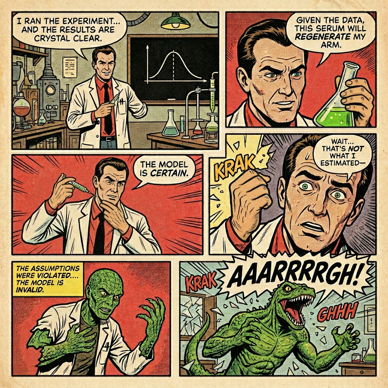
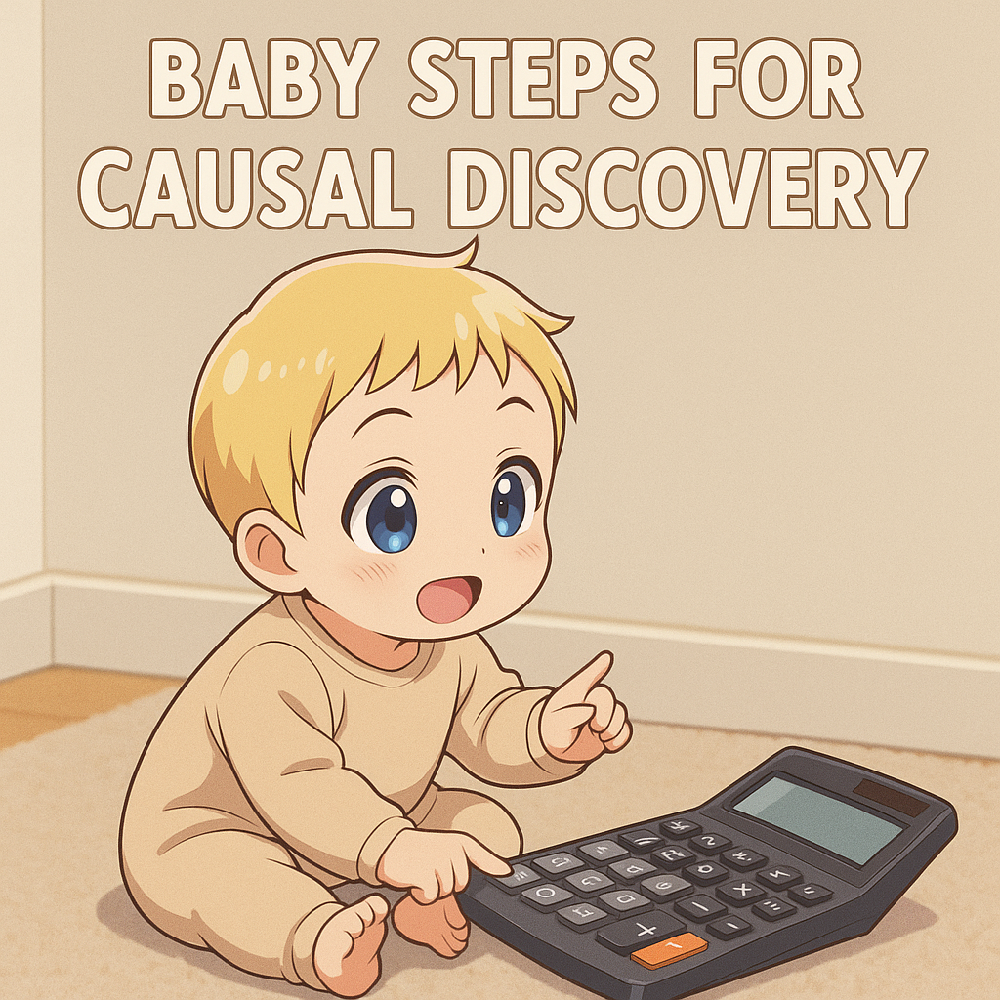

Welcome to my collection of articles. Here you'll find my thoughts, tutorials, and research on various topics.

## Featured Articles

:::: {.article-preview}

  <h3>[Can You Trust Your Quasi-Experiment? A Bayesian Framework for Auditing Time-Series Causal Estimates](articles/placebo_bayesian_quasi_experiments/placebo_bayesian_quasi_experiments.html)</h3>
  
A Bayesian framework using placebo tests and ROPE-based inference to audit whether your quasi-experimental causal estimates are trustworthy.

  <a href="articles/placebo_bayesian_quasi_experiments/placebo_bayesian_quasi_experiments.html" class="btn btn-outline-primary">Read More</a>

  

::::

:::: {.article-preview}

  <h3>[Decision-Making Under Contradictions: Robust Budget Allocation When Your Models Disagree](articles/decision_making_under_contradictions/decision_making_under_contradictions.html)</h3>
  
How to make robust budget allocation decisions when your measurement models (MMM, experiments, attribution) give contradictory advice.

  <a href="articles/decision_making_under_contradictions/decision_making_under_contradictions.html" class="btn btn-outline-primary">Read More</a>

  

::::

:::: {.article-preview}

  <h3>[From Experiments to Priors: Eliciting Informative Priors for Your Marketing Mix Model](articles/from_experiments_to_priors/from_experiments_to_priors.html)</h3>
  
How to translate quasi-experimental results into informative Bayesian priors for your MMM using CausalPy and PyMC-Marketing.

  <a href="articles/from_experiments_to_priors/from_experiments_to_priors.html" class="btn btn-outline-primary">Read More</a>

  

::::

:::: {.article-preview}

  <h3>[Bayesian Models and Risk Optimization](articles/bayesian_models_and_risk_optimization/bayesian_models_and_risk_optimization.html)</h3>
  
An article discussing the importance of causality in experiments. Talk given in PyData Berlin 2025.

  <a href="articles/bayesian_models_and_risk_optimization/bayesian_models_and_risk_optimization.html" class="btn btn-outline-primary">Read More</a>

  

::::

:::: {.article-preview}

  <h3>[No More Experiments Without Causality](articles/nomore_experiments_without_causality/nomore_experiments_without_causality.html)</h3>
  
An article discussing the importance of causality in experiments. Talk given in PyData DE Darmstadt 2025.

  <a href="articles/nomore_experiments_without_causality/nomore_experiments_without_causality.html" class="btn btn-outline-primary">Read More</a>

  

::::

:::: {.article-preview}

  <h3>[Baby Steps for Causal Discovery](articles/baby_steps_for_causal_discovery/baby_steps_for_causal_discovery.html)</h3>
  
An article discussing the importance of causality in experiments. Talk given in PyData Tallinn 2025.

  <a href="articles/baby_steps_for_causal_discovery/baby_steps_for_causal_discovery.html" class="btn btn-outline-primary">Read More</a>

  

::::

## All Articles

- [Can You Trust Your Quasi-Experiment? A Bayesian Framework for Auditing Time-Series Causal Estimates](articles/placebo_bayesian_quasi_experiments/placebo_bayesian_quasi_experiments.html) - _April 2026_
- [Decision-Making Under Contradictions: Robust Budget Allocation When Your Models Disagree](articles/decision_making_under_contradictions/decision_making_under_contradictions.html) - _February 2026_
- [From Experiments to Priors: Eliciting Informative Priors for Your Marketing Mix Model](articles/from_experiments_to_priors/from_experiments_to_priors.html) - _February 2026_
- [Bayesian Models and Risk Optimization](articles/bayesian_models_and_risk_optimization/bayesian_models_and_risk_optimization.html) - _August 2025_
- [No More Experiments Without Causality](articles/nomore_experiments_without_causality/nomore_experiments_without_causality.html) - _April 2025_
- [Baby Steps for Causal Discovery](articles/baby_steps_for_causal_discovery/baby_steps_for_causal_discovery.html) - _February 2025_