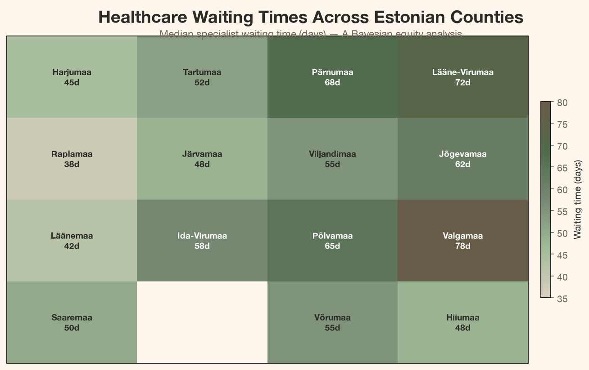
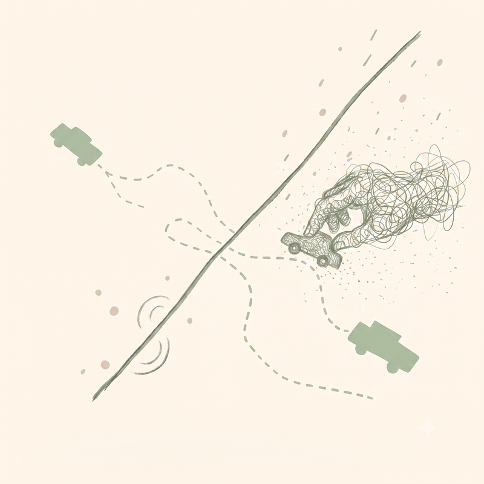
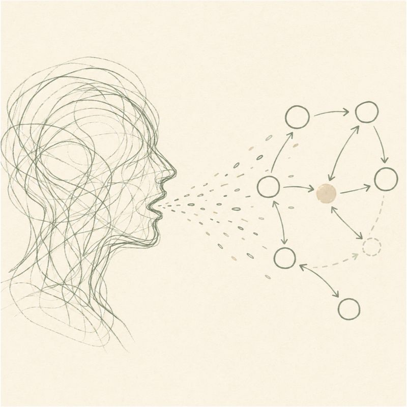
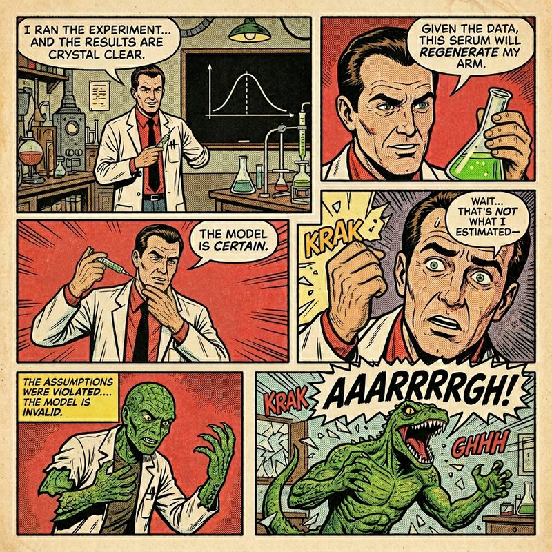
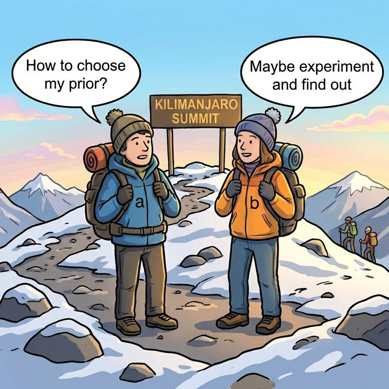
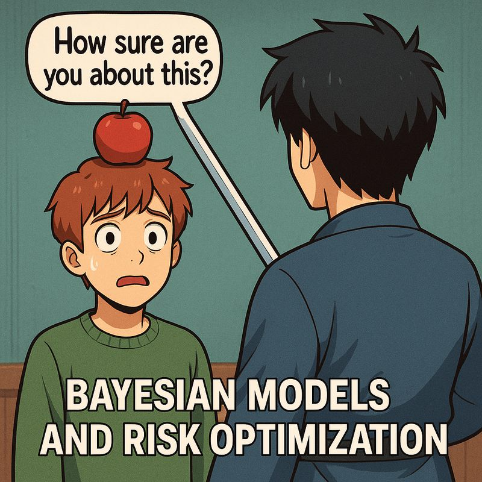
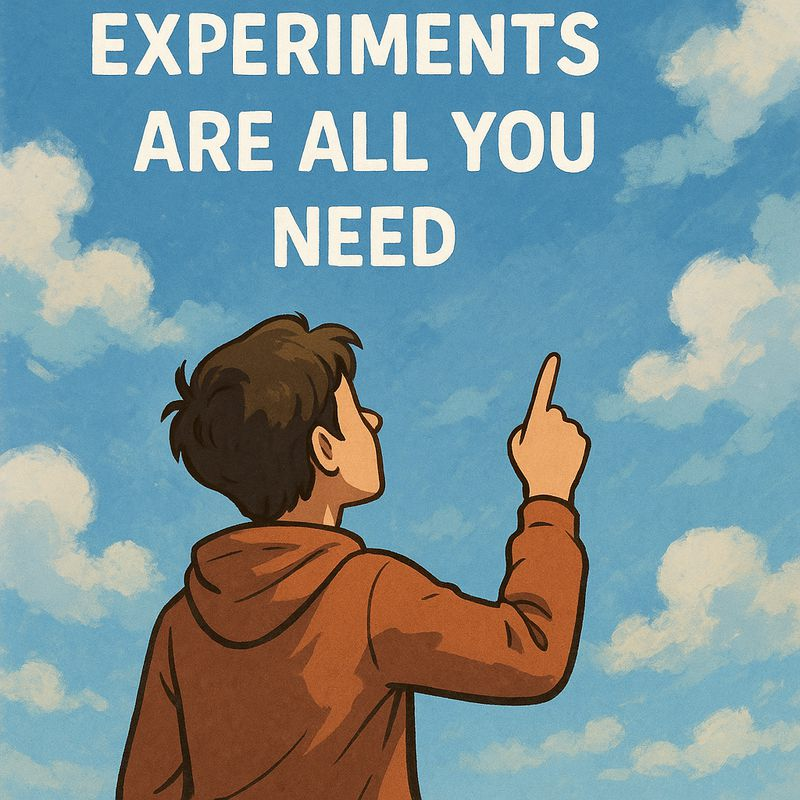
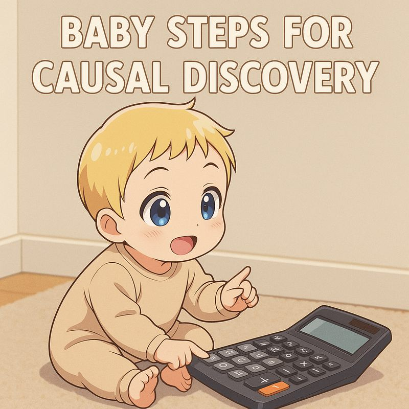

Welcome to my collection of articles. Here you'll find my thoughts, tutorials, and research on marketing science, causal inference and Bayesian methods.

## Featured Articles

:::: {.article-preview}
::: {.article-content}
::: {.article-meta}
[Healthcare]{.topic-chip} [Bayesian]{.topic-chip} [Equity]{.topic-chip} [August 2026]{.date}
:::

### [Does Your Postal Code Decide When You See a Doctor? A Bayesian Look at Healthcare Queue Equity in Estonia](articles/healthcare_queue_equity/healthcare_queue_equity.html)

A hierarchical Bayesian analysis of whether healthcare waiting times in Estonia depend on geography, condition type, or age — and what partial pooling reveals about equity.

[Read More](articles/healthcare_queue_equity/healthcare_queue_equity.html){.btn .btn-outline-primary}
:::

::: {.article-image-container}

:::
::::

:::: {.article-preview}
::: {.article-content}
::: {.article-meta}
[MMM]{.topic-chip} [PyMC-Marketing]{.topic-chip} [Spillovers]{.topic-chip} [August 2026]{.date}
:::

### [Media Does Not Stop at the City Border](articles/cross_city_media_spillovers/cross_city_media_spillovers.html)

A glass-box guide to adding sparse, bounded cross-city media spillovers to a multidimensional PyMC-Marketing MMM.

[Read More](articles/cross_city_media_spillovers/cross_city_media_spillovers.html){.btn .btn-outline-primary}
<button class="btn btn-audio-play" onclick="this.nextElementSibling.paused?(this.nextElementSibling.play(),this.textContent='⏸'):(this.nextElementSibling.pause(),this.textContent='▶')" aria-label="Listen to article overview">▶</button>
<audio preload="none" src="articles/cross_city_media_spillovers/audio/overview_narrative.wav"></audio>
:::

::: {.article-image-container}

:::
::::

:::: {.article-preview}
::: {.article-content}
::: {.article-meta}
[PyTensor]{.topic-chip} [LLM]{.topic-chip} [July 2026]{.date}
:::

### [PyTensor Beyond PyMC: Building LLM Inference in Python](articles/alchemize_pytensor_mlx_gemma_3n/alchemize_pytensor_mlx_gemma_3n.html)

An inspectable local-LLM stack built in Python: GGUF and safetensors weights, reusable PyTensor graphs, C/Numba/MLX execution, generation, and numerical validation.

[Read More](articles/alchemize_pytensor_mlx_gemma_3n/alchemize_pytensor_mlx_gemma_3n.html){.btn .btn-outline-primary}
:::

::: {.article-image-container}

:::
::::

:::: {.article-preview}
::: {.article-content}
::: {.article-meta}
[Bayesian]{.topic-chip} [Causal]{.topic-chip} [April 2026]{.date}
:::

### [Can You Trust Your Quasi-Experiment? A Bayesian Framework for Auditing Time-Series Causal Estimates](articles/placebo_bayesian_quasi_experiments/placebo_bayesian_quasi_experiments.html)

A Bayesian framework using placebo tests and ROPE-based inference to audit whether your quasi-experimental causal estimates are trustworthy.

[Read More](articles/placebo_bayesian_quasi_experiments/placebo_bayesian_quasi_experiments.html){.btn .btn-outline-primary}
:::

::: {.article-image-container}

:::
::::

:::: {.article-preview}
::: {.article-content}
::: {.article-meta}
[MMM]{.topic-chip} [Budget]{.topic-chip} [February 2026]{.date}
:::

### [Decision-Making Under Contradictions: Robust Budget Allocation When Your Models Disagree](articles/decision_making_under_contradictions/decision_making_under_contradictions.html)

How to make robust budget allocation decisions when your measurement models (MMM, experiments, attribution) give contradictory advice.

[Read More](articles/decision_making_under_contradictions/decision_making_under_contradictions.html){.btn .btn-outline-primary}
:::

::: {.article-image-container}

:::
::::

:::: {.article-preview}
::: {.article-content}
::: {.article-meta}
[Priors]{.topic-chip} [MMM]{.topic-chip} [February 2026]{.date}
:::

### [From Experiments to Priors: Eliciting Informative Priors for Your Marketing Mix Model](articles/from_experiments_to_priors/from_experiments_to_priors.html)

How to translate quasi-experimental results into informative Bayesian priors for your MMM using CausalPy and PyMC-Marketing.

[Read More](articles/from_experiments_to_priors/from_experiments_to_priors.html){.btn .btn-outline-primary}
:::

::: {.article-image-container}

:::
::::

:::: {.article-preview}
::: {.article-content}
::: {.article-meta}
[Bayesian]{.topic-chip} [Risk]{.topic-chip} [August 2025]{.date}
:::

### [Bayesian Models and Risk Optimization](articles/bayesian_models_and_risk_optimization/bayesian_models_and_risk_optimization.html)

An article discussing the importance of causality in experiments. Talk given in PyData Berlin 2025.

[Read More](articles/bayesian_models_and_risk_optimization/bayesian_models_and_risk_optimization.html){.btn .btn-outline-primary}
:::

::: {.article-image-container}

:::
::::

:::: {.article-preview}
::: {.article-content}
::: {.article-meta}
[Causal]{.topic-chip} [Experiments]{.topic-chip} [April 2025]{.date}
:::

### [No More Experiments Without Causality](articles/nomore_experiments_without_causality/nomore_experiments_without_causality.html)

An article discussing the importance of causality in experiments. Talk given in PyData DE Darmstadt 2025.

[Read More](articles/nomore_experiments_without_causality/nomore_experiments_without_causality.html){.btn .btn-outline-primary}
:::

::: {.article-image-container}

:::
::::

:::: {.article-preview}
::: {.article-content}
::: {.article-meta}
[Causal]{.topic-chip} [Discovery]{.topic-chip} [February 2025]{.date}
:::

### [Baby Steps for Causal Discovery](articles/baby_steps_for_causal_discovery/baby_steps_for_causal_discovery.html)

An article discussing the importance of causality in experiments. Talk given in PyData Tallinn 2025.

[Read More](articles/baby_steps_for_causal_discovery/baby_steps_for_causal_discovery.html){.btn .btn-outline-primary}
:::

::: {.article-image-container}

:::
::::

  <svg viewBox="0 0 320 24" preserveAspectRatio="xMidYMid meet" focusable="false">
    <path class="dagd-edge" d="M16 12 C40 12, 56 6, 80 6"/>
    <path class="dagd-edge" d="M16 12 C40 12, 56 18, 80 18"/>
    <path class="dagd-edge" d="M80 6 C104 6, 136 12, 160 12"/>
    <path class="dagd-edge" d="M80 18 C104 18, 136 12, 160 12"/>
    <path class="dagd-edge" d="M160 12 C184 12, 216 6, 240 6"/>
    <path class="dagd-edge" d="M160 12 C184 12, 216 18, 240 18"/>
    <path class="dagd-edge" d="M240 6 C264 6, 280 12, 304 12"/>
    <path class="dagd-edge" d="M240 18 C264 18, 280 12, 304 12"/>
    <circle class="dagd-node" cx="16"  cy="12" r="3"/>
    <circle class="dagd-node" cx="80"  cy="6"  r="2.6"/>
    <circle class="dagd-node" cx="80"  cy="18" r="2.6"/>
    <circle class="dagd-node" cx="160" cy="12" r="3.2"/>
    <circle class="dagd-node" cx="240" cy="6"  r="2.6"/>
    <circle class="dagd-node" cx="240" cy="18" r="2.6"/>
    <circle class="dagd-node" cx="304" cy="12" r="3.2"/>
  </svg>

## All Articles

- [Does Your Postal Code Decide When You See a Doctor? A Bayesian Look at Healthcare Queue Equity in Estonia](articles/healthcare_queue_equity/healthcare_queue_equity.html) - _August 2026_
- [Media Does Not Stop at the City Border: Cross-City Spillovers with PyMC-Marketing](articles/cross_city_media_spillovers/cross_city_media_spillovers.html) - _August 2026_
- [PyTensor Beyond PyMC: Building LLM Inference in Python](articles/alchemize_pytensor_mlx_gemma_3n/alchemize_pytensor_mlx_gemma_3n.html) - _July 2026_
- [Can You Trust Your Quasi-Experiment? A Bayesian Framework for Auditing Time-Series Causal Estimates](articles/placebo_bayesian_quasi_experiments/placebo_bayesian_quasi_experiments.html) - _April 2026_
- [Decision-Making Under Contradictions: Robust Budget Allocation When Your Models Disagree](articles/decision_making_under_contradictions/decision_making_under_contradictions.html) - _February 2026_
- [From Experiments to Priors: Eliciting Informative Priors for Your Marketing Mix Model](articles/from_experiments_to_priors/from_experiments_to_priors.html) - _February 2026_
- [Bayesian Models and Risk Optimization](articles/bayesian_models_and_risk_optimization/bayesian_models_and_risk_optimization.html) - _August 2025_
- [No More Experiments Without Causality](articles/nomore_experiments_without_causality/nomore_experiments_without_causality.html) - _April 2025_
- [Baby Steps for Causal Discovery](articles/baby_steps_for_causal_discovery/baby_steps_for_causal_discovery.html) - _February 2025_
