# Introduction

As a Bayesian, I often stop to ask what uncertainty I'm actually reporting. A posterior can look careful and precise. But what have I allowed myself to be uncertain about?

I find the distinction between **epistemic** and **aleatoric** uncertainty useful here. The first is about what we do not know. The second is about randomness in the process we are modeling. A parameter posterior describes the first; predictions for a new outcome can combine both. Even if we knew every parameter, the next outcome could still vary.

Inside epistemic uncertainty, though, there is another question: **what if I chose the wrong model?**

Suppose I fit a model in which $b$ causes $y$. I can get a posterior for that effect. But unless I put alternative causal structures into the analysis, that posterior does not ask whether $y$ causes $b$ instead. Or whether some other variable explains their association.

Everything is conditional on the assumptions I wrote down. A wrong model can still give me a narrow posterior. What it does not give me automatically is uncertainty about the mistakes it cannot represent.

{#fig-uncertainty-map fig-alt="A map separates outcome randomness from unknown parameters and graph structure, and shows shared modeling assumptions outside those candidate choices."}

So could we make the model itself uncertain? Could we build a **model of models**?

That is the part I want to explore here. We'll use Bayesian causal discovery to put probabilities on candidate graphs, see why several graphs sometimes deserve one shared summary, and carry those possibilities into a causal effect. We will also deliberately try a case our assumptions cannot handle. I want us to leave with a useful answer, not the impression that adding another posterior makes the assumptions disappear.

# Quick summary

This article walks you through:

- **A model of models:** what we need to specify before a graph can receive a probability.
- **DAGs and CPDAGs:** why several different drawings can tell the same observational story.
- **A smaller search:** directional-prior matrices and hard masks, followed by MCMC for unresolved directions and exact updates for terminal parents.
- **An intervention:** how uncertainty about arrows becomes uncertainty about an effect.
- **The limits, and one repair:** a nonlinear counterexample, then a nonlinear score that finds curved graphs without giving up the machinery above; the role of priors; what probabilistic programming tools can do here.

Most code blocks are folded; the model definition and a few short cells stay visible. The mathematical and sampling details are available in expandable notes, so we can follow the main story without reading the graph-search machinery first.

# Theoretical lens

## How could we build a model of models?

We do not need a new version of Bayes' rule. We need to let the model index be unknown, alongside its parameters.

Call the candidate model $M$ and its parameters $\theta_M$. Then our joint posterior is

$$
p(M,\theta_M\mid D)
\propto p(D\mid M,\theta_M)\,p(\theta_M\mid M)\,\pi(M).
$$

We have three things to write down: how a candidate generates data, what its parameters could be, and how much prior probability it receives. The data update the relative weights. Instead of choosing one model and forgetting the others, we can keep that distribution.

This is one joint Bayesian model, not a separate PyMC fit for every candidate. A sampled graph is a possible value of the structural unknown, just as a sampled coefficient is a possible value of a regression parameter. Different-prior runs later in the article change those assumptions for a sensitivity analysis.

There is a catch, of course. We have to choose the candidates. If every candidate leaves out the same important cause, the posterior has nowhere to put that possibility. “A model of models” is still a model.

## How does causality make that manageable?

Causal graphs give us a compact way to describe one part of a model: **which variables enter which mechanisms**. An arrow $x\rightarrow y$ says that $x$ is a direct input to the mechanism for $y$. It does not tell us the shape or size of that effect.

{#fig-model-to-dag fig-alt="The arrow x to y is paired with an equation and with straight and curved mechanisms, separating who affects whom from how the effect works."}

A **directed acyclic graph**, or DAG, has arrows and no directed cycle: following arrows cannot bring us back to where we started. That lets us build a system one mechanism at a time. For now, we will not model feedback loops or hidden common causes.

A graph alone is not a complete statistical model. We must also choose the mechanisms and their noise. To keep this first walk manageable, we use linear equations with independent Gaussian errors:

$$
X_i=\alpha_i+\sum_{j\in\mathrm{Pa}_i(G)}\beta_{ij}X_j+\varepsilon_i,
\qquad \varepsilon_i\sim\mathcal N(0,\sigma_i^2).
$$

The parents $\mathrm{Pa}_i(G)$ are simply the nodes with arrows into $i$. Choosing a DAG chooses which coefficients appear. The intercepts, coefficients, and noise scales remain unknown.

So we are not searching through every model anyone could write. We are comparing **linear-Gaussian causal models on a fixed set of measured variables**. We assume independent, complete observations and no hidden common causes. We also use the causal Markov and faithfulness assumptions to connect graph structure with conditional independence: the graph implies some independences, and faithfulness rules out extra ones caused by exact cancellations.

Yes, we still have to assume something. The benefit is that we can now say clearly what is uncertain and what we have held fixed. Later, we will see what happens when the relationship is not linear.

# Getting started

We will use seven variables. There are 1,138,779,265 labeled DAGs on seven nodes, so this is no longer an example where we normalize a list of every graph. Instead, PyMC samples a shared, unknown DAG for the whole dataset. The linear-Gaussian parameters can still be integrated out exactly.

This notebook uses the `cetagostini_web_new` kernel, PyMC 6, `pymc.dims`, and PyTensor's named tensors. The graph and scoring utilities are available as [graph_math.py](graph_math.py), [graph_sampling.py](graph_sampling.py), and [graph_checks.py](graph_checks.py). They keep the code below focused on the model, rather than on bit masks and transition bookkeeping.

```{python}
#| code-fold: true
#| code-summary: "Imports and reproducible streams"
#| warning: false
import time
from collections import Counter
from importlib.metadata import version
from math import comb, prod

import arviz_base as azb
import arviz_stats as azs
import matplotlib.pyplot as plt
import networkx as nx
import numpy as np
import pandas as pd
import pymc as pm
import pymc.dims as pmd
import pytensor.tensor as pt
import pytensor.xtensor as ptx
from IPython.display import Markdown, display
from matplotlib.patches import FancyArrowPatch
from scipy.special import softmax
from scipy.stats import gaussian_kde

from cetagostini.style import COLORS, PALETTE, article_table, setup_notebook
from graph_math import (
    BasisScore, BGeScore, cpdag, draw_parameters, mec_key, pair_probabilities, pairs_for,
    states_to_parents, simulate_scm, total_effects,
)
from graph_sampling import (
    TemperedGraphStep, initial_states, terminal_parent_distributions,
)
from graph_checks import check_small_graphs

setup_notebook(figsize=(8, 5), warnings_filter="")
# The local sans-serif fallback supplies bold, but not semibold.
plt.rcParams["axes.titleweight"] = "bold"
SEED = 20260909
rng_data = np.random.default_rng(SEED)
rng_effect = np.random.default_rng(SEED + 1)
rng_predictive = np.random.default_rng(SEED + 2)
print(f"Data seed: {SEED}; PyMC {pm.__version__}")
```

# Let's make a world we can check

There are four independent root causes: $a,b,c,d$. Both $a$ and $b$ affect $e$; $d$ affects $f$. Finally, $a,b,c,e,f$ each directly affect $y$:

$$
\begin{aligned}
a&=\varepsilon_a, &b&=\varepsilon_b, &c&=\varepsilon_c, &d&=\varepsilon_d,\\
e&=0.9a+0.8b+\varepsilon_e,\\
f&=0.9d+\varepsilon_f,\\
y&=0.55a+0.5b+0.6c+0.7e+0.8f+\varepsilon_y.
\end{aligned}
$$

The seven errors are mutually independent $\mathcal N(0,1)$. These are structural equations: an intervention replaces one equation and leaves the other mechanisms unchanged. Under the generating model, increasing $d$ by one unit changes the mean of $y$ by $0.9\times0.8=0.72$ through $f$.

```{python}
labels = ("a", "b", "c", "d", "e", "f", "y")
n_nodes, n_obs = len(labels), 300
pairs = pairs_for(n_nodes)
a, b, c, d = rng_data.normal(size=(4, n_obs))
e = 0.9 * a + 0.8 * b + rng_data.normal(size=n_obs)
f = 0.9 * d + rng_data.normal(size=n_obs)
y = 0.55 * a + 0.5 * b + 0.6 * c + 0.7 * e + 0.8 * f + rng_data.normal(size=n_obs)
data = np.column_stack([a, b, c, d, e, f, y])

truth = np.array([0, 0, 0, 0, (1 << 0) | (1 << 1), 1 << 3,
                  sum(1 << i for i in (0, 1, 2, 4, 5))])
observational_twin = truth.copy()
observational_twin[3], observational_twin[5] = 1 << 5, 0
truth_key = mec_key(truth)
assert mec_key(observational_twin) == truth_key
assert sum(int(mask).bit_count() for mask in truth) == 8
print(f"{n_obs} observations; {n_nodes} nodes; 8 generating arrows")
```

We know the generating order because we wrote the equations. The discovery model does **not** receive that order, the generating adjacency matrix, or a maximum-parent restriction. We will give it only one piece of directional knowledge: $y$ has no outgoing arrows. Its parents and the directions among the other six variables remain unknown.

Before fitting anything, compare these two DAGs. Reversing $d\rightarrow f$ gives a different intervention story, but the same observational equivalence class.

A CPDAG summarizes that class: its arrows are shared by both DAGs, while an undirected edge marks the direction that can still reverse.

```{python}
#| label: fig-true-dag-cpdag
#| fig-cap: "The generating DAG and its observational twin differ only in d–f. Their CPDAG has seven compelled arrows and one undirected edge. Reversing an arrow requires reparameterizing the mechanisms, not reusing the generating coefficients."
#| fig-alt: "Three seven-node diagrams. Both a and b point into e; a, b, c, e and f point into y. The d-f edge points toward f, toward d, or remains undirected in the three panels."
#| code-fold: true
#| code-summary: "Draw DAGs and completed equivalence classes"
def draw_graph(ax, adjacency, title):
    positions = {0: (-1.7, 1.9), 1: (-0.5, 2.4), 2: (0.6, 1.9),
                 3: (1.9, 2.4), 4: (-1.25, 0.7), 5: (1.4, 0.8), 6: (0.0, -0.5)}
    graph = nx.empty_graph(n_nodes)
    nx.draw_networkx_nodes(graph, positions, node_size=650,
                          node_color=COLORS["surface_alt"], edgecolors=COLORS["primary"], ax=ax)
    nx.draw_networkx_labels(graph, positions, labels=dict(enumerate(labels)),
                           font_color=COLORS["ink"], font_weight="bold", ax=ax)
    for i, j in pairs:
        if not (adjacency[i, j] or adjacency[j, i]):
            continue
        undirected = adjacency[i, j] and adjacency[j, i]
        start, end = (i, j) if adjacency[i, j] else (j, i)
        ax.add_patch(FancyArrowPatch(
            positions[start], positions[end], arrowstyle="-" if undirected else "-|>",
            mutation_scale=14, linewidth=1.6, shrinkA=16, shrinkB=16,
            linestyle="--" if undirected else "-",
            color=COLORS["brown"] if undirected else COLORS["green_strong"],
        ))
    ax.set(title=title, xlim=(-2.1, 2.3), ylim=(-0.9, 2.8), aspect="equal")
    ax.axis("off")


def adjacency_of(parents):
    return np.array([[bool(int(parents[j]) & (1 << i)) for j in range(n_nodes)]
                     for i in range(n_nodes)])


fig, axes = plt.subplots(1, 3, figsize=(12, 4.4))
for ax, matrix, title in zip(axes, [adjacency_of(truth), adjacency_of(observational_twin), cpdag(truth)],
                            ["Generating DAG", "Equivalent DAG", "Shared CPDAG"]):
    draw_graph(ax, matrix, title)
plt.show()
```

In this linear-Gaussian family, those DAGs can represent exactly the same observational distribution with different coefficients and noise scales. Recovering the right observational relationships need not recover every causal direction.


# Why do we need a CPDAG?

## What does “completed partially directed” mean?

Let's unpack the name. A **CPDAG** is a **completed partially directed acyclic graph**. It represents a whole *Markov-equivalence class*: the DAGs with the same conditional-independence implications.

- **Partially directed** means that some connections may have arrows while others remain undirected.
- **Completed** means that every **compelled** arrow — one shared by all DAGs in the class — has been oriented. It does **not** mean that every pair of nodes is connected.
- An **undirected edge** is a connection whose direction differs across members of the class. It is not two opposite causal arrows, and it is not an absent edge.

A DAG gives us one fully directed candidate. A PDAG is partly directed; it does not certify that its arrows are exactly the ones shared by an observational equivalence class. A CPDAG does. Despite the word “partially,” it can be fully directed when its class contains only one DAG.

A simpler three-variable picture helps:

{#fig-dag-to-cpdag fig-alt="Three DAGs without a collider share the undirected chain a-b-y. The collider a to b from y forms a separate class with both arrows fixed."}

In the chain and fork, $a$ and $y$ are separated by conditioning on $b$. In the collider $a\rightarrow b\leftarrow y$, $a$ and $y$ are separated before conditioning on $b$; conditioning on that shared effect can make them dependent. The arrows into the middle node change the independence story.

The [Verma–Pearl characterization](https://ftp.cs.ucla.edu/pub/stat_ser/R150.pdf) gives us a practical rule: two DAGs are Markov equivalent exactly when they share the same **skeleton** and **unshielded colliders**. The skeleton is the set of connections with arrowheads removed. An unshielded collider is a pair of arrows into a shared child whose parents are not connected.


Here, $a\rightarrow e\leftarrow b$ fixes the arrows into $e$. The unshielded colliders at $y$ fix all five arrows into $y$. The $d$–$f$ connection can still reverse. The resulting class contains exactly the two DAGs in @fig-true-dag-cpdag.

We group sampled DAGs by their skeleton and colliders, then compute each class's CPDAG from a representative DAG using compelled-edge orientation. We do **not** intersect only the DAGs visited by MCMC: if the sampler never visited the class member that reverses an edge, intersecting the visited DAGs would mark that edge as compelled.

# How do we give a DAG a probability?

For a DAG $G$, Bayes' rule gives

$$
p(G\mid D)\propto p(D\mid G)\,\pi(G),\qquad
p(D\mid G)=\int p(D\mid\theta_G,G)\,p(\theta_G\mid G)\,d\theta_G.
$$

The integral averages the likelihood over the **parameter prior**, not over fitted posterior draws. We do not fit each graph, take its best likelihood, and call that a posterior probability. Here a compatible normal-Wishart construction gives the **Bayesian Gaussian equivalent**, or **BGe**, score. It integrates out the intercepts, regression coefficients, and noise variances exactly.

Equivalent DAGs have equal BGe evidence. This **score equivalence** depends on the likelihood and the coherent parameter priors; it is not a property of arbitrary priors attached separately to each regression.

## Two distinct prior choices

First, assign a categorical state to each unordered pair: absent, forward, or backward. Before adding directional restrictions, the baseline probabilities are $(1/3,1/3,1/3)$. Conditioning their product on acyclicity gives equal probability to every legal DAG. It does not give equal probability to every CPDAG: a class with more members starts with more mass.

We will condition this prior on a hard mask, then vary the remaining directional preferences. Eligible score-equivalent DAGs retain equal evidence; unequal graph priors can still give them unequal posterior weights.

Second, choose a common parameter prior in the variables' measurement units. We set the prior mean $\nu=0$, mean precision $\alpha_\mu=1$, and Wishart degrees of freedom $\alpha_W=p+4$. With anticipated scales $s_i$, our prior scale matrix is

$$
T=(\alpha_W-p-1)\operatorname{diag}(s_1^2,\ldots,s_p^2).
$$

Under the complete Gaussian reference model this makes $\mathbb E[\Sigma]=\operatorname{diag}(s_i^2)$. It does not fix any graph's coefficients or residual variances. The restricted DAG models inherit compatible local priors from this construction. We choose the scales before fitting; they are not sample standard deviations disguised as prior knowledge.

```{python}
prior_sd = np.array([1.0, 1.0, 1.0, 1.0, 1.5, 1.5, 2.0])
score = BGeScore(data, prior_sd=prior_sd, alpha_mu=1.0, alpha_w=n_nodes + 4)
print(f"Local parent sets: {n_nodes * 2 ** (n_nodes - 1)}; complete DAG enumeration: none")
print(f"Equivalent-DAG log-evidence difference: "
      f"{score.graph_score(truth) - score.graph_score(observational_twin):.2e}")
```

The score cache contains 448 valid **local parent sets**, not 448 candidate DAGs. We compute those local terms once and reuse them. The mask below reduces which combinations are admissible without changing the underlying parameter prior.

::: {.callout-note collapse="true"}
## The collapsed likelihood and its parameter prior

For $S$ of size $\ell$, let $a_S=\alpha_W-p+\ell$. With $N$ observations,

$$
R=T+\sum_{r=1}^N(x_r-\bar x)(x_r-\bar x)^\top
  +\frac{N\alpha_\mu}{N+\alpha_\mu}(\bar x-\nu)(\bar x-\nu)^\top.
$$

The subset marginal likelihood is

$$
\begin{aligned}
\log M(S)={}&\frac{\ell}{2}\log\frac{\alpha_\mu}{N+\alpha_\mu}
+\log\frac{\Gamma_\ell((N+a_S)/2)}{\Gamma_\ell(a_S/2)}
-\frac{N\ell}{2}\log\pi\\
&+\frac{a_S}{2}\log|T_S|-\frac{N+a_S}{2}\log|R_S|.
\end{aligned}
$$

We sum $\log M(P_i\cup\{i\})-\log M(P_i)$ over nodes. The cached table subtracts each node's empty-parent score, a graph-independent constant that does not change posterior weights. Determinants are taken on the indicated submatrices, not on submatrices of an inverse. See [Geiger and Heckerman (1994)](https://www.microsoft.com/en-us/research/publication/learning-gaussian-networks/) and the correction by [Kuipers, Moffa, and Heckerman (2014)](https://doi.org/10.1214/14-AOS1217).
:::

# Restrict impossible arrows, not unknown ones

How would we enter the belief that $a\rightarrow y$ is more plausible than $y\rightarrow a$? Use a matrix $P$ with **sources in rows and targets in columns**. For an unordered pair $(i,j)$, its three local probabilities are

$$
q_{ij}=\big[1-P_{ij}-P_{ji},\;P_{ij},\;P_{ji}\big].
$$

The entries $P_{ij}$ and $P_{ji}$ must sum to at most one; a row need not sum to one because a node may have several children. These are local probabilities **before conditioning on acyclicity and the hard mask**, not guaranteed marginal probabilities in the resulting DAG prior.

For example, $P_{ay}=0.7$ and $P_{ya}=0.1$ give probabilities $(0.2,0.7,0.1)$. Forbidding $y\rightarrow a$ conditions that row to $(2/9,7/9,0)$. It preserves the relative odds of absence and $a\rightarrow y$; it does not force the surviving arrow.

```{python}
direction_prior = pd.DataFrame(
    (1 - np.eye(n_nodes)) / 3, index=labels, columns=labels,
)
allowed = pd.DataFrame(
    ~np.eye(n_nodes, dtype=bool), index=labels, columns=labels,
)
allowed.loc["y", :] = False

baseline_probs = pair_probabilities(
    direction_prior.to_numpy(), allowed.to_numpy(),
)
```

The Boolean mask is **background knowledge**, not an inference from the correlations. It would be appropriate if $y$ is an outcome that cannot cause the other recorded variables. In this synthetic example it is true, but we still have not supplied its five parents. Exact zeros remove forbidden states; small positive probabilities would only discourage them.

```{python}
#| code-fold: true
#| code-summary: "Display the two reader-facing matrices"
display(article_table(
    direction_prior.reset_index(names=""),
    "Directional prior before hard restrictions: row → column",
    formats={node: "{:.2f}" for node in labels},
))
display(article_table(
    allowed.astype(int).reset_index(names=""),
    "Allowed directions: row → column; 1 permits an arrow, 0 forbids it",
))
```

## Learn terminal parents exactly, then run MCMC on the remaining structure

Once $y$ has no outgoing arrows, any subset of the other six variables can be its parents without creating a cycle. Under our fixed pairwise graph prior and decomposable BGe score, its parent-set distribution separates from the remaining graph:

$$
p(G_{-y},\mathrm{Pa}_y\mid D,K)
=p(G_{-y}\mid D,K)\,p(\mathrm{Pa}_y\mid D,K),
$$

where $K$ is the terminal-node restriction. We can normalize the weights of all $2^6=64$ parent sets for $y$ exactly, while MCMC explores the unresolved graph $G_{-y}$ among the other six variables. After each cold-chain update, an independent draw of $\mathrm{Pa}_y$ reconstructs a **full seven-node DAG**. We have reduced the sampling problem, not fixed the answer.

The exact parent weights use the original seven-variable BGe scores and the supported pair priors. Refitting a six-variable model with different parameter-prior settings would not be the same reduction.

```{python}
terminal_posteriors = terminal_parent_distributions(
    score.table, pairs, baseline_probs,
)
```

```{python}
#| code-fold: true
#| code-summary: "Count the search space without enumerating full graphs"
dag_counts = [1]
for size in range(1, n_nodes + 1):
    dag_counts.append(sum(
        (-1) ** (sinks + 1) * comb(size, sinks)
        * 2 ** (sinks * (size - sinks)) * dag_counts[size - sinks]
        for sinks in range(1, size + 1)
    ))
core_nodes = n_nodes - len(terminal_posteriors)
terminal_combinations = prod(len(masks) for masks, _ in terminal_posteriors.values())
space = pd.DataFrame({
    "Quantity": [
        "Admissible full DAGs", "DAG states left to MCMC",
        "Pairs in MCMC proposals", "Admissible local parent sets",
    ],
    "Unrestricted": [
        dag_counts[n_nodes], dag_counts[n_nodes],
        len(pairs), n_nodes * 2 ** (n_nodes - 1),
    ],
    "Mask + terminal reduction": [
        dag_counts[core_nodes] * terminal_combinations, dag_counts[core_nodes],
        len(pairs_for(core_nodes)), sum(2 ** int(count) for count in allowed.sum(axis=0)),
    ],
})
display(article_table(
    space, "Search-space sizes for this mask, not measured runtime speedups",
    formats={"Unrestricted": "{:,.0f}", "Mask + terminal reduction": "{:,.0f}"},
))
```

These counts use the fact that this particular mask leaves the six-node core unrestricted. The sink-set recurrence counts DAGs without listing them; it is not a counter for arbitrary masks. MCMC proposes only mutable, supported core pairs. Forbidden directions, fixed pair states, and terminal parent sets receive no wasted proposals. We still keep all 21 pair states in the returned draws so every downstream graph and intervention calculation sees the full structure.

# The graph is a PyMC random variable

`pymc.dims` uses **dimension names in tensor operations**, rather than merely attaching labels to positional arrays. We use ordinary PyTensor indexing to put each pair's state directly into an adjacency matrix, then name its axes `parent` and `child`. Named `.isel(mask=parents)` selects each node's current parent-set score. Concrete initial values and the Numba sampler's mutable arrays remain NumPy arrays; they are not symbolic tensors.

```{python}
def make_graph_model(score, pair_probs, labels):
    """One dataset, one unknown DAG; mechanisms are integrated out."""
    pairs = pairs_for(len(labels))
    coords = {
        "node": labels, "parent": labels, "child": labels,
        "pair": [f"{labels[i]}–{labels[j]}" for i, j in pairs],
        "state": ["absent", "forward", "backward"],
        "mask": np.arange(2 ** len(labels)),
    }
    with pm.Model(coords=coords) as model:
        probabilities = pmd.as_xtensor(pair_probs, dims=("pair", "state"))
        initial = initial_states(
            pair_probs, pairs, len(labels), np.random.default_rng(0), empty=True,
        )
        edge = pmd.Categorical("edge", p=probabilities, core_dims="state", initval=initial)
        i, j = pairs.T
        state = edge.values
        adjacency = pt.zeros((len(labels), len(labels)), dtype="int64")
        adjacency = pt.set_subtensor(adjacency[i, j], pt.eq(state, 1))
        adjacency = pt.set_subtensor(adjacency[j, i], pt.eq(state, 2))
        adjacency = pmd.as_xtensor(adjacency, dims=("parent", "child"))
        bits = pmd.as_xtensor(1 << np.arange(len(labels)), dims=("parent",))
        parents = (adjacency * bits).sum("parent").rename({"child": "node"})
        local_score = pmd.as_xtensor(score.table, dims=("node", "mask"))
        evidence = local_score.isel(mask=parents).sum("node")
        reach = adjacency.astype("bool")
        for k in range(len(labels)):
            reach = reach | (reach.isel(child=k) & reach.isel(parent=k))
        diagonal = pmd.as_xtensor(np.eye(len(labels), dtype=bool), dims=("parent", "child"))
        cycle = (reach & diagonal).any()
        pmd.Potential("dag_support", ptx.where(cycle, -np.inf, 0.0))
        pmd.Potential("marginal_likelihood", evidence)
        pmd.Deterministic("log_evidence", evidence)
        pmd.Deterministic("edge_count", ptx.math.neq(edge, 0).sum("pair"))
    return model
```

The categorical prior gives forbidden states zero support, while transitive closure independently rejects directed cycles. `marginal_likelihood` supplies the integrated likelihood of the **whole dataset**. This is one model with an unknown graph, not one graph per row or a separate fit per candidate.

We can inspect this model with PyMC's own Graphviz visualization. @fig-pymc-graph-model shows the **probabilistic program**, not a sampled causal DAG or its CPDAG. The `edge` vector contains the unknown pair states; the other nodes impose graph support, add the collapsed likelihood, or record summaries. The regression coefficients and noise scales do not appear because we integrated them out. Likewise, the data enter through the precomputed score table, not a row-level observed random variable.

```{python}
#| label: fig-pymc-graph-model
#| fig-cap: "One categorical vector represents the unknown causal graph. PyMC's dependency graph shows how its states determine the support, collapsed likelihood, and recorded summaries; its arrows are not causal claims about a through y."
#| fig-alt: "PyMC model graph with a 21-pair categorical edge vector feeding the DAG-support and marginal-likelihood potentials and the log-evidence and edge-count deterministics."
#| warning: false
graph_model = make_graph_model(score, baseline_probs, labels)
model_graph = pm.model_to_graphviz(graph_model)
model_graph.graph_attr.update(bgcolor=COLORS["bg"], fontname="Inter, Helvetica, Arial, sans-serif",
                              fontcolor=COLORS["ink"], color=COLORS["primary"])
model_graph.node_attr.update(fontname="Inter, Helvetica, Arial, sans-serif", fontcolor=COLORS["ink"],
                             color=COLORS["primary"], fillcolor=COLORS["surface_alt"])
model_graph.edge_attr.update(color=COLORS["green_strong"])
model_graph
```

These are experimental named-tensor APIs. In the tested PyMC version, the stock categorical Gibbs step does not recognize the named categorical operation. A custom graph step works with its value variable; PyTensor lowers the named operations when compiling the model. Notice the explicit symbolic comparisons, `pt.eq` and `ptx.math.neq`, rather than Python `==`. The [PyMC dims guide](https://www.pymc.io/projects/docs/en/stable/learn/core_notebooks/dims_module.html) and [PyTensor xtensor documentation](https://pytensor.readthedocs.io/en/latest/library/xtensor/index.html) explain the distinction between dimension-aware operations and output labels.

## Moving between graphs

NUTS cannot move through discrete graph states. We use a Metropolis kernel compiled with Numba and registered as a PyMC step. A proposal chooses a mutable core pair uniformly, then draws uniformly from **all its supported states, including the current state**. Self-proposals prevent deterministic alternation when only two states remain. Cyclic proposals are also retained as self-transitions; we do not redraw until an acyclic proposal appears. The support is fixed, so the proposal is symmetric and its Metropolis acceptance probability is

$$
\min\left(1,\exp\{\log p(D\mid G')-\log p(D\mid G)
+\log\pi(G')-\log\pi(G)\}\right).
$$

The kernel keeps rejected states. Keeping only accepted graphs would produce the wrong distribution. Its graph representation is just an implementation detail: a parent mask for each node, not one machine integer encoding an entire equivalence class.

Local moves can get stuck behind low-probability intermediate graphs. We therefore run parallel tempering on the reduced core: replicas target $p(D_{\rm core}\mid G_{-y})^\beta\pi_{\rm core}(G_{-y})$, where the likelihood notation denotes the original core-node local scores, not a refitted six-variable prior. Terminal-parent normalizing constants depend on $\beta$ but not on the core graph, so they cancel from swap ratios. Only the $\beta=1$ core replica supplies posterior draws; we then sample terminal parents from their exact $\beta=1$ distribution. A hot graph is not an additional posterior draw.

```{python}
#| code-fold: true
#| code-summary: "Independent starts and the PyMC sampling call"
betas = np.r_[np.geomspace(1.0, 0.002, 15), 0.0]


def fit_graphs(score, probabilities, labels, *, seed, draws, tune, betas, chains=4):
    """Sample unresolved core directions and reconstruct full posterior DAGs."""
    local_pairs = pairs_for(len(labels))
    starts_rng = np.random.default_rng(seed)
    starts = [
        {"edge": initial_states(
            probabilities, local_pairs, len(labels), starts_rng, empty=(chain == 0),
        )}
        for chain in range(chains)
    ]
    with make_graph_model(score, probabilities, labels) as model:
        step = TemperedGraphStep(
            [model["edge"]], score.table, local_pairs, probabilities, betas,
        )
        return pm.sample(
            draws=draws, tune=tune, chains=chains, cores=1,
            step=step, initvals=starts, random_seed=seed,
            progressbar=False, compute_convergence_checks=False,
        )


draws, tune = 12_000, 3_000
started = time.perf_counter()
posterior = fit_graphs(
    score, baseline_probs, labels,
    seed=SEED + 10, draws=draws, tune=tune, betas=betas,
)
baseline_seconds = time.perf_counter() - started
print(f"Four chains × {draws:,} retained full DAGs; {baseline_seconds:.1f}s "
      "including compilation and sampler setup")
```

The initializer assigns random topological ranks and constructs pair states directly. It respects forbidden and required states without a parent-mask roundtrip. The four cold chains start at different legal graphs, including the empty graph when the prior permits it; none is initialized from the generating DAG. Each chain receives independent random streams and fresh replica state. `cores=1` does not make them one chain.

The temperature ladder and proposal do not adapt during `tune`; those iterations discard initial transients. We retain the longer publication run because rare-class directional probabilities can remain noisy even when common graph events mix well. The diagnostics below concern full reconstructed graphs, not just the smaller core.


# Did the graph chains explore the posterior?

Acceptance rates alone do not answer this. We inspect rank-normalized $\widehat R$, bulk and tail effective sample sizes, and Monte Carlo standard errors for **graph events**: each edge's presence and direction, leading-class membership, and whether $d$ has a directed path to $y$. We also inspect the edge count and collapsed log evidence. Treating the arbitrary codes 0, 1, 2 as a continuous diagnostic variable would miss the questions we care about.

**ArviZ computes the diagnostics; our code defines what to diagnose.** Here `arviz_base` (`azb`) builds the labeled inference-data container and `arviz_stats` (`azs`) supplies `summary`. These are ArviZ's modular APIs, not custom replacements for its statistics.

Why not just call `summary(posterior)`? The mean of the categorical codes 0 = absent, 1 = forward, and 2 = backward is not an edge probability. Instead, we create binary indicators whose means are posterior event probabilities. We preserve the original chain and draw order so ArviZ can estimate their Monte Carlo errors and convergence diagnostics.

`graph_summary` does a different job: it groups sampled DAGs by skeleton and unshielded colliders, accumulates their probability into Markov equivalence classes, and identifies directed paths. ArviZ does not know those graph-theoretic definitions. We classify each distinct DAG once, then map the results back to **every retained draw**; passing only the unique DAGs to ArviZ would destroy the frequencies and autocorrelation. Class IDs are labels too, so we diagnose class-membership indicators rather than their numeric IDs.

```{python}
#| code-fold: true
#| code-summary: "Map graph draws into labeled events for ArviZ"
def graph_summary(trace):
    """Aggregate DAGs into equivalence classes, retaining per-draw membership."""
    states = trace.posterior.edge.values
    unique, inverse, counts = np.unique(states.reshape(-1, len(pairs)), axis=0,
                                         return_inverse=True, return_counts=True)
    graphs = [states_to_parents(state, pairs, n_nodes) for state in unique]
    keys = [mec_key(graph) for graph in graphs]
    class_counts = Counter()
    representative = {}
    for key, graph, count in zip(keys, graphs, counts):
        class_counts[key] += int(count)
        representative[key] = graph
    ranked = [key for key, _ in class_counts.most_common()]
    class_lookup = {key: index for index, key in enumerate(ranked)}
    class_id = np.array([class_lookup[key] for key in keys])[inverse].reshape(states.shape[:2])
    paths = np.array([
        total_effects(graph, adjacency_of(graph).T.astype(float))[6, 3] != 0
        for graph in graphs
    ])[inverse].reshape(states.shape[:2])
    true_class = class_id == class_lookup[truth_key] if truth_key in class_lookup else np.zeros_like(paths)
    return {"states": states, "graphs": graphs, "ranked": ranked,
            "class_counts": class_counts, "representative": representative,
            "class_id": class_id, "true_class": true_class, "path": paths}


def graph_diagnostic_data(trace, summary, probabilities):
    """Prepare chain-by-draw graph events; leave all diagnostics to ArviZ."""
    states = summary["states"]
    names, events, fixed = [], [], []
    for k, (i, j) in enumerate(pairs):
        for state, name in [(0, f"{labels[i]}–{labels[j]} absent"),
                            (1, f"{labels[i]}→{labels[j]}"), (2, f"{labels[j]}→{labels[i]}")]:
            names.append(name)
            events.append(states[..., k] == state)
            fixed.append(probabilities[k, state] == 0 or np.count_nonzero(probabilities[k]) == 1)
    for index in range(min(4, len(summary["ranked"]))):
        names.append(f"Class {index + 1}")
        events.append(summary["class_id"] == index)
        fixed.append(False)
    names += ["Generating class", "d has a path to y"]
    events += [summary["true_class"], summary["path"]]
    fixed = np.asarray(fixed + [False, False])
    values = np.stack(events, axis=-1).astype(float)
    varying = np.ptp(values, axis=(0, 1)) > 0
    quantities = {"event": values[..., varying]}
    for name in ("edge_count", "log_evidence"):
        value = trace.posterior[name].values
        if np.ptp(value) > 0:
            quantities[name] = value
        else:
            print(f"{name} is constant; diagnostics not estimable")
    print(f"Indicators fixed by pair support: {fixed.sum()}")
    print(f"Other constant indicators: {(~varying & ~fixed).sum()} (diagnostics not estimable)")
    return azb.from_dict(
        {"posterior": quantities},
        dims={"event": ["graph_event"]},
        coords={"graph_event": np.asarray(names)[varying]},
    )
```

With that graph-specific translation done, the summary is an ordinary ArviZ call. The table styling below changes presentation only; its means, MCSEs, effective sample sizes, and $\widehat R$ all come from ArviZ.

```{python}
summary = graph_summary(posterior)
diagnostic_data = graph_diagnostic_data(posterior, summary, baseline_probs)
diagnostics = azs.summary(diagnostic_data, ci_prob=0.95, round_to="none")
print(f"Maximum R-hat: {diagnostics.r_hat.max():.4f}")
print(f"Minimum bulk ESS: {diagnostics.ess_bulk.min():.0f}")
print(f"Minimum tail ESS: {diagnostics.ess_tail.min():.0f}")
print(f"Maximum event MCSE: {diagnostics.loc[diagnostics.index.str.startswith('event['), 'mcse_mean'].max():.4f}")
print(f"Minimum reported bulk ESS per elapsed second: "
      f"{diagnostics.ess_bulk.min() / baseline_seconds:.0f} (including startup)")
important = [name for name in diagnostics.index if any(
    term in name for term in ("d→f", "f→d", "Generating class", "d has a path", "edge_count", "log_evidence")
)]
display(article_table(diagnostics.loc[important, ["mean", "mcse_mean", "ess_bulk", "ess_tail", "r_hat"]].reset_index(names="Quantity"),
                      "Monte Carlo diagnostics for decision-relevant quantities",
                      formats={"mean": "{:.3f}", "mcse_mean": "{:.4f}", "ess_bulk": "{:.0f}",
                               "ess_tail": "{:.0f}", "r_hat": "{:.4f}"}))
```

A forbidden direction is constant **by assumption**, not evidence of perfect convergence. We report those separately from other constant indicators, which can reflect implied restrictions, rare events, or unvisited regions. We do not award any of them an infinite effective sample size. Small $\widehat R$ values and Monte Carlo errors are useful checks, not proof that every important mode was visited. Divergences and BFMI are HMC diagnostics; they do not apply to this discrete Metropolis kernel.

```{python}
#| label: fig-graph-diagnostics
#| fig-cap: "Cold-chain traces and per-chain event frequencies. Agreement matters for graph events, not just for the scalar score. The first two panels show the first 2,000 retained draws; each line is a chain."
#| fig-alt: "Four-chain traces for collapsed evidence and edge count, alongside per-chain generating-class and causal-path probabilities."
#| code-fold: true
fig, axes = plt.subplots(1, 3, figsize=(12, 3.5))
for chain in range(4):
    axes[0].plot(posterior.posterior.log_evidence.values[chain, :2000], alpha=0.65, lw=0.7,
                 color=PALETTE[chain], label=f"Chain {chain + 1}")
    axes[1].plot(posterior.posterior.edge_count.values[chain, :2000], alpha=0.65, lw=0.7,
                 color=PALETTE[chain])
axes[0].set(title="Collapsed log evidence", xlabel="Retained draw")
axes[1].set(title="Number of arrows", xlabel="Retained draw")
for index, (event, name) in enumerate([(summary["true_class"], "Generating class"),
                                     (summary["path"], "d has a path to y")]):
    axes[2].plot(np.arange(1, 5), event.mean(axis=1), "o-", label=name)
axes[2].set(title="Chain agreement", xlabel="Chain", ylabel="Event probability", xticks=range(1, 5), ylim=(0, 1))
axes[2].legend(frameon=False, fontsize=8)
plt.show()

swap_names = [f"swap_{i}" for i in range(len(betas) - 1)]
swap_rates = np.array([float(posterior.sample_stats[name].mean()) for name in swap_names])
print(f"Accepted core changes per attempted update: {float(posterior.sample_stats.cold_accept.mean()):.3f}")
print(f"Cycle rejection fraction: {float(posterior.sample_stats.cold_invalid.mean()):.3f}")
print("Adjacent temperature swap acceptance:", np.round(swap_rates, 3))
print("Full cold–hot–cold round trips per chain:",
      posterior.sample_stats.roundtrips.sum("draw").values)
```

We inspect every adjacent swap rate because one weak link can isolate the hottest replicas. Swap acceptance is a transport diagnostic, not evidence that the posterior is correct. The temperatures are computational devices; the prior has not changed between replicas.

::: {.callout-note collapse="true"}
## A finite-state correctness check, separate from discovery

Four nodes are small enough to provide an oracle: 543 DAGs and 185 equivalence classes. We compare the compiled PyMC log density against the intended score for every state, verify that all cycles have zero support, check score equivalence, and check CPDAG orientations against the intersection of **all** members of each exact class.

We then run the actual compiled graph step and compare its four-node class frequencies with the exact posterior under asymmetric directional priors. Additional masked cases check the reconstructed **full joint DAG distribution**, not only the terminal-parent marginals: a terminal fourth node leaves 200 full DAGs, factored into 25 core DAGs and eight parent sets. The checks also cover required edges, impossible forced cycles, non-last and multiple terminals, fixed graphs, chain resets, tiny positive priors, and the two-state periodicity case. Total variation is half the sum of absolute probability errors. These checks exercise the implementation rather than merely re-evaluating the Metropolis identity; they do not establish mixing on every larger problem.

```{python}
#| code-fold: true
#| code-summary: "Run the exhaustive four-node oracle and sample its posterior"
checks = check_small_graphs(make_graph_model)
display(article_table(pd.DataFrame.from_dict(checks, orient="index", columns=["Result"]).reset_index(names="Check"),
                      "Independent finite-state checks"))
```
:::

# How do DAG probabilities become CPDAG probabilities?

A CPDAG represents a set $[G]$ of DAGs, so its posterior probability is a **sum**, not the score of a chosen representative:

$$
p(C\mid D)=\sum_{G\in C}p(G\mid D).
$$

For MCMC, we estimate this sum by the fraction of retained cold-chain draws whose skeleton and colliders identify class $C$. We keep repeats and divide by the total number of retained draws. We do not renormalize over the classes displayed below.

Here the graph prior already includes the mask. Members excluded by background knowledge contribute zero mass. We still draw the **ordinary observational CPDAG** of each class: an undirected line can describe a direction that the mask forbids in individual draws. It does not reinstate that direction. A knowledge-oriented, maximally oriented PDAG would be a different summary.

```{python}
#| label: fig-leading-cpdags
#| fig-cap: "The four most frequently visited observational CPDAGs, weighted by eligible full DAG draws. Undirected dashed edges describe observational reversibility, not uncertain edge existence or permission to violate the hard mask."
#| fig-alt: "Four seven-node CPDAGs ranked by estimated posterior mass, with each panel labeling its probability and whether it is the generating class."
#| code-fold: true
fig, axes = plt.subplots(2, 2, figsize=(10, 8))
for index, ax in enumerate(axes.flat):
    if index >= len(summary["ranked"]):
        ax.axis("off")
        continue
    key = summary["ranked"][index]
    mass = summary["class_counts"][key] / summary["states"][..., 0].size
    suffix = " · generating class" if key == truth_key else ""
    draw_graph(ax, cpdag(summary["representative"][key]), f"Class {index + 1}: {mass:.1%}{suffix}")
plt.show()
display(Markdown(
    f"The generating class receives **{summary['true_class'].mean():.2%}** of the sampled mass; "
    f"the four leading classes together receive **{np.mean(summary['class_id'] < 4):.1%}**. "
    f"The posterior mean is **{float(posterior.posterior.edge_count.mean()):.1f} arrows**, "
    "compared with eight in the generating graph. This is **not a successful-recovery demonstration**. "
    "The posterior is diffuse and favors denser alternatives under these priors."
))
print(f"Distinct DAGs visited: {len(summary['graphs'])}; classes visited: {len(summary['ranked'])}")
print(f"Mass outside the four panels: "
      f"{np.mean(summary['class_id'] >= 4):.3f}")
```

The most probable individual DAG need not belong to the most probable class. A class may gather substantial mass across several members. Neither a single selected DAG nor a list of the leading classes is the full posterior.

The same posterior, drawn as a plain discrete distribution, is easier to hold in the head. Each point is one sampled DAG at its probability $P(G\mid D)$:

```{python}
#| label: fig-dag-probabilities
#| fig-cap: "The whole graph posterior as a discrete distribution: each point is one sampled DAG at its posterior probability, sorted from most probable. The top DAG receives 0.54%, and the curve flattens toward the resolution of one draw in 48,000. The CPDAG panels above group this same distribution."
#| fig-alt: "A log-log rank plot of posterior probabilities for the 22,874 sampled DAGs, falling smoothly from 0.54% for the most probable DAG to the floor of one Monte Carlo draw."
#| code-fold: true
unique_states, visit_counts = np.unique(
    summary["states"].reshape(-1, len(pairs)), axis=0, return_counts=True,
)
masses = np.sort(visit_counts / visit_counts.sum())[::-1]
rank = np.arange(1, len(masses) + 1)
fig, ax = plt.subplots(figsize=(8, 4.5))
ax.plot(rank, masses, lw=0.8, color=COLORS["ink_muted"], zorder=1)
top = min(120, len(masses))
ax.plot(rank[:top], masses[:top], "o", ms=3.5, color=COLORS["green_strong"], zorder=2,
        label=f"top {top} DAGs")
ax.set(xscale="log", yscale="log",
       xlabel="DAG rank (most probable first)", ylabel=r"Posterior probability $P(G\mid D)$",
       title="Each point is one DAG and its posterior probability")
ax.axhline(1 / visit_counts.sum(), color=COLORS["brown"], ls=":", lw=1,
           label="one Monte Carlo draw")
ax.annotate(f"most probable DAG: {masses[0]:.2%}", xy=(1, masses[0]),
            xytext=(2.2, masses[0] * 0.42), fontsize=9, color=COLORS["ink_muted"],
            arrowprops=dict(arrowstyle="-", color=COLORS["ink_muted"], lw=0.8))
ax.legend(frameon=False, fontsize=9)
plt.show()
```

No single DAG collects the mass. So how much of the density we report is the data, and how much is the prior we chose? Both are discrete distributions over the arrow count, and we can compare them directly. The prior curve is exact: the same sink-set recurrence that counts the search space now carries a marker for each arrow, and the terminal pairs contribute their own binomial.

```{python}
#| label: fig-edge-count-pmf
#| fig-cap: "Prior and posterior over the number of arrows, two discrete distributions on the same support. The legal prior already expects 11.8 of the 21 possible arrows; the posterior expects 12.2. The eight arrows of the generating graph sit in the prior's left tail. A dense posterior can be the prior's preference rather than a dozen discovered effects."
#| fig-alt: "Two connected-point distributions over the arrow count from 0 to 21. The prior peaks near 12 with mean 11.8, the posterior peaks at 12 with mean 12.2, and a dashed vertical line marks the generating graph's 8 arrows."
#| code-fold: true
#| code-summary: "Exact prior over the arrow count"
def dag_edge_pmf(n, absent_weight, forward_weight):
    """Edge-count PMF of iid pair states conditioned on acyclicity.

    Sink-set inclusion-exclusion; each polynomial coefficient marks the arrow count.
    """
    counts = [np.array([1.0])]
    for size in range(1, n + 1):
        total = np.zeros(size * (size - 1) // 2 + 1)
        for sinks in range(1, size + 1):
            cross = np.array([1.0])
            for _ in range(sinks * (size - sinks)):
                cross = np.convolve(cross, [absent_weight, forward_weight])
            term = (comb(size, sinks) * (-1) ** (sinks + 1)
                    * absent_weight ** comb(sinks, 2) * np.convolve(cross, counts[size - sinks]))
            total[:len(term)] += term
        counts.append(total)
    return counts[n]


core_counts = dag_edge_pmf(n_nodes - 1, 1 / 3, 1 / 3)
terminal_counts = np.array([comb(n_nodes - 1, k) * 0.5 ** (n_nodes - 1) for k in range(n_nodes)])
prior_count = np.convolve(core_counts, terminal_counts) / core_counts.sum()
posterior_count = np.bincount(posterior.posterior.edge_count.values.reshape(-1),
                              minlength=len(prior_count))[: len(prior_count)]
posterior_count = posterior_count / posterior_count.sum()
xs = np.arange(len(prior_count))
print(f"Prior mean arrows: {sum(xs * prior_count):.2f}; "
      f"posterior mean: {sum(xs * posterior_count):.2f}; generating graph: 8")

fig, ax = plt.subplots(figsize=(8, 4.5))
ax.plot(xs, prior_count, "o-", ms=4, lw=1.4, color=COLORS["brown"], label="Prior, before data")
ax.plot(xs, posterior_count, "o-", ms=4, lw=1.4, color=COLORS["green_strong"], label="Posterior, after data")
ax.axvline(8, color=COLORS["ink"], ls="--", lw=1.2, label="8 arrows in the generating graph")
ax.set(xlabel="Number of arrows", ylabel="Probability",
       title="A discrete distribution over how many arrows the graph has",
       xticks=xs[::2])
ax.legend(frameon=False, fontsize=9)
plt.show()
```

The two curves nearly overlap: with this prior, a posterior mean near twelve arrows is close to what we asked for before seeing data. The eight-arrow generating graph is possible but not typical under it. The sparse-prior sensitivity below moves the mass; so would a prior that expected fewer arrows.

Pairwise questions get their own discrete distributions: for every unordered pair, the posterior probability of its three states.

```{python}
#| label: fig-edge-states
#| fig-cap: "For each pair, the posterior probability of its three states. Rings mark the generating state: every true arrow is recovered, except that these draws often prefer f to d, and they add the disputed d to y arrow. These are pairwise marginals, not a joint graph."
#| fig-alt: "Twenty-one rows, one per node pair, each showing three vertical bars for the probability of absent, first to second, or second to first. Rings sit on the generating states: the five incoming arrows into y, the a to e, b to e, and d to f directions, and absence elsewhere. The d to y row rings absence although its incoming-arrow bar is long."
#| code-fold: true
states = summary["states"]
forward = (states == 1).mean(axis=(0, 1))
backward = (states == 2).mean(axis=(0, 1))
absent = 1 - forward - backward
truth_state = np.array([
    0 if not (truth[j] & (1 << i) or truth[i] & (1 << j))
    else (1 if truth[j] & (1 << i) else 2)
    for i, j in pairs
])
fig, ax = plt.subplots(figsize=(8, 8.5))
colors = [COLORS["ink_muted"], COLORS["green_strong"], COLORS["brown"]]
probabilities = np.stack([absent, forward, backward], axis=1)
for row, (i, j) in enumerate(pairs):
    for state in range(3):
        height = 0.75 * probabilities[row, state]
        ax.plot([state, state], [row, row - height], lw=7,
                color=colors[state], solid_capstyle="round")
        if truth_state[row] == state:
            ax.plot(state, row - height, marker="o", ms=9, mfc="none",
                    mec=COLORS["ink"], mew=1.6)
ax.set(xticks=[0, 1, 2],
       xticklabels=["absent", r"first $\rightarrow$ second", r"second $\rightarrow$ first"],
       yticks=np.arange(len(pairs)),
       yticklabels=[f"{labels[i]} – {labels[j]}" for i, j in pairs],
       xlim=(-0.55, 2.55), ylim=(len(pairs) - 0.5, -1.5),
       xlabel="State of the pair", ylabel="",
       title="Posterior probability of each pair's three states")
plt.show()
```

Thresholding these probabilities independently can create cycles or a graph that received little joint support. We use them to answer pairwise questions, not to manufacture a consensus causal model.

# An informative prior can change the unresolved direction

Suppose knowledge collected **before this dataset** favors $d\rightarrow f$ over $f\rightarrow d$ by 9:1, conditional on an edge. For example, $d$ might be a baseline measurement and $f$ a later exposure. We edit two cells of the directional-prior matrix, preserving this pair's absence probability. This is a soft preference: it excludes no additional DAGs beyond the same terminal-$y$ mask.

```{python}
df_pair = next(k for k, pair in enumerate(pairs) if tuple(pair) == (3, 5))
informed_prior = direction_prior.copy()
informed_prior.loc["d", "f"] = 0.9 * (2 / 3)
informed_prior.loc["f", "d"] = 0.1 * (2 / 3)
informed_probs = pair_probabilities(informed_prior.to_numpy(), allowed.to_numpy())
informed = fit_graphs(
    score, informed_probs, labels,
    seed=SEED + 20, draws=draws, tune=tune, betas=betas,
)
informed_summary = graph_summary(informed)
informed_diagnostics = azs.summary(
    graph_diagnostic_data(informed, informed_summary, informed_probs),
    ci_prob=0.95, round_to="none",
)
```

Within the generating equivalence class, the likelihood is exactly equal for its two DAGs. Therefore their posterior odds equal their prior odds: 1:1 under the baseline, 9:1 under the informative prior. The directional probability below is **conditional on the sampled DAG belonging to this class**; its unconditional counterpart also depends on other classes.

```{python}
#| code-fold: true
#| code-summary: "Separate a prior-driven orientation from class recovery"
orientation_rows = []
for name, current, exact in [("Symmetric directions", summary, 0.5),
                              ("9:1 for d → f", informed_summary, 0.9)]:
    selected = current["true_class"]
    forward_in_class = selected & (current["states"][..., df_pair] == 1)
    conditional = forward_in_class.sum() / selected.sum() if selected.any() else np.nan
    mcse = np.nan
    if selected.any():
        influence = forward_in_class.astype(float) - conditional * selected
        ratio_tree = azb.from_dict({"posterior": {"influence": influence}})
        mcse = azs.summary(ratio_tree, round_to="none").loc["influence", "mcse_mean"] / selected.mean()
    orientation_rows.append({"Prior": name, "Class draws": int(selected.sum()),
                             "P(d → f | class)": conditional, "MCSE": mcse,
                             "Exact within class": exact})
display(article_table(pd.DataFrame(orientation_rows),
                      "Separate the exact class-conditional target from its MCMC estimate",
                      formats={"P(d → f | class)": "{:.3f}", "MCSE": "{:.3f}",
                               "Exact within class": "{:.1f}"}))
```

The relevant sample size is the number of generating-class draws, not the length of the whole chain. We report that count, the exact class-conditional target, and a ratio-estimator MCSE computed from the full chains. The Monte Carlo estimate need not equal 0.5 or 0.9 exactly; a small unconditional event MCSE does not guarantee a precise estimate within a rare class.

This does not mean that the observations discovered the direction. We supplied information that observational equivalence cannot provide. The observational CPDAG structure remains unchanged; we retain the member-level posterior weights alongside it.

## What about sparsity and parameter scales?

We also set both directional entries to 0.15, giving the sparse pair prior $(0.7,0.15,0.15)$ before restrictions, and separately double the parameter scales. Every fit uses the same hard mask. The first change affects $\pi(G)$; the second changes the BGe evidence itself. These are sensitivity analyses of different assumptions, not one fit per candidate graph.

```{python}
#| code-fold: true
#| code-summary: "Refit graph-prior and parameter-prior sensitivities"
sparse_prior = pd.DataFrame(
    (1 - np.eye(n_nodes)) * 0.15, index=labels, columns=labels,
)
sparse_probs = pair_probabilities(sparse_prior.to_numpy(), allowed.to_numpy())
sparse = fit_graphs(
    score, sparse_probs, labels,
    seed=SEED + 30, draws=draws, tune=tune, betas=betas,
)
wide_score = BGeScore(data, prior_sd=2 * prior_sd, alpha_mu=1.0, alpha_w=n_nodes + 4)
wide = fit_graphs(
    wide_score, baseline_probs, labels,
    seed=SEED + 40, draws=draws, tune=tune, betas=betas,
)
sensitivity_rows = []
for name, trace, current, probabilities in [
    ("Baseline", posterior, summary, baseline_probs),
    ("Directional knowledge", informed, informed_summary, informed_probs),
    ("Sparse graph prior", sparse, graph_summary(sparse), sparse_probs),
    ("Twice the parameter scales", wide, graph_summary(wide), baseline_probs),
]:
    diagnostic = azs.summary(
        graph_diagnostic_data(trace, current, probabilities),
        ci_prob=0.95, round_to="none",
    )
    sensitivity_rows.append({"Specification": name,
                             "P(generating class)": current["true_class"].mean(),
                             "P(d has a path to y)": current["path"].mean(),
                             "Mean arrows": float(trace.posterior.edge_count.mean()),
                             "Max R-hat": diagnostic.r_hat.max(),
                             "Min bulk ESS": diagnostic.ess_bulk.min()})
display(article_table(pd.DataFrame(sensitivity_rows),
                      "Prior sensitivity with separate graph chains",
                      formats={"P(generating class)": "{:.3f}", "P(d has a path to y)": "{:.3f}",
                               "Mean arrows": "{:.2f}", "Max R-hat": "{:.4f}", "Min bulk ESS": "{:.0f}"}))
```

The sparse prior's 0.3 edge probability is defined **before conditioning on the mask and acyclicity**. For a pair involving terminal $y$, masking the outgoing direction leaves an incoming-edge probability of $0.15/(0.7+0.15)$ before fitting. These local specifications are not generally the marginal probabilities of the legal-DAG prior. Uniform DAG mass is also not uniform CPDAG mass; a uniform-class prior would need an explicit class-size correction.

The sensitivity table shows that good mixing is not the same as recovering the generating structure. The sparse graph prior moves mass toward that class, while wider parameter scales favor still denser alternatives here. A reported zero means no retained draw visited the class, not that its posterior probability is mathematically zero.

# A narrower answer can still be prior-sensitive

What did the reduced exploration actually learn about $y$? Its exact parent-set posterior lets us answer without Monte Carlo error, then check that the reconstructed graph draws reproduce the same probabilities. This is only the terminal mechanism; the other six-node structure still comes from MCMC.

```{python}
#| code-fold: true
#| code-summary: "Compare exact terminal-parent probabilities with full graph draws"
y_index = labels.index("y")
y_pairs = np.flatnonzero((pairs[:, 0] == y_index) | (pairs[:, 1] == y_index))
incoming_states = np.where(pairs[y_pairs, 1] == y_index, 1, 2)
parent_indices = np.where(pairs[y_pairs, 1] == y_index, pairs[y_pairs, 0], pairs[y_pairs, 1])
parent_rows, concentration_rows = [], []
y_distributions = {}
for name, trace, probabilities in [
    ("Baseline", posterior, baseline_probs),
    ("Sparse prior", sparse, sparse_probs),
]:
    masks, weights = terminal_parent_distributions(score.table, pairs, probabilities)[y_index]
    y_distributions[name] = (masks, weights)
    sampled_masks = (
        (trace.posterior.edge.values[..., y_pairs] == incoming_states)
        * (1 << parent_indices)
    ).sum(axis=-1)
    ranked = np.argsort(weights)[::-1]
    count = int(np.searchsorted(np.cumsum(weights[ranked]), 0.95) + 1)
    selected = ranked[:count]
    concentration_rows.append({
        "Prior": name, "Admissible parent sets": len(masks),
        "Sets reaching 95% mass": count, "Mass covered": weights[selected].sum(),
    })
    for index in selected:
        parents = ", ".join(labels[node] for node in range(n_nodes) if masks[index] & (1 << node))
        parent_rows.append({
            "Prior": name, "Parents of y": parents or "None",
            "Exact probability": weights[index],
            "MCMC frequency": np.mean(sampled_masks == masks[index]),
        })
    other = ~np.isin(masks, masks[selected])
    parent_rows.append({
        "Prior": name, "Parents of y": "Other parent sets",
        "Exact probability": weights[other].sum(),
        "MCMC frequency": np.mean(~np.isin(sampled_masks, masks[selected])),
    })
display(article_table(
    pd.DataFrame(concentration_rows), "How far the data narrow y's possible parent sets",
    formats={"Mass covered": "{:.5%}"},
))
display(article_table(
    pd.DataFrame(parent_rows), "Exact parent-set weights and frequencies in reconstructed full DAGs",
    formats={"Exact probability": "{:.2%}", "MCMC frequency": "{:.2%}"},
))
```

```{python}
#| label: fig-terminal-parent-learning
#| fig-cap: "Conditioning on y being terminal leaves its parents unknown. Five incoming arrows receive strong support under both graph priors; the extra d→y arrow remains prior-sensitive. Exact terminal probabilities are not MCMC estimates."
#| fig-alt: "Grouped bars compare prior and posterior inclusion probabilities for each candidate parent of y, with the disputed direct arrow from d highlighted by its prior sensitivity."
#| code-fold: true
prior_masks, prior_weights = terminal_parent_distributions(
    np.zeros_like(score.table), pairs, baseline_probs,
)[y_index]
fig, ax = plt.subplots(figsize=(8, 4.5))
positions = np.arange(len(parent_indices))
distributions = [
    ("Baseline prior", prior_masks, prior_weights, COLORS["accent"]),
    ("Baseline posterior", *y_distributions["Baseline"], COLORS["primary"]),
    ("Sparse posterior", *y_distributions["Sparse prior"], COLORS["green_strong"]),
]
for index, (name, masks, weights, color) in enumerate(distributions):
    inclusion = [weights[(masks & (1 << node)) != 0].sum() for node in parent_indices]
    ax.bar(positions + (index - 1) * 0.25, inclusion, width=0.25, label=name, color=color)
ax.set(xticks=positions, xticklabels=[labels[node] for node in parent_indices],
       ylim=(0, 1.22), yticks=np.linspace(0, 1, 6),
       xlabel="Candidate parent of y", ylabel="Arrow inclusion probability",
       title="A terminal outcome still has uncertain parents")
ax.legend(loc="upper center", ncol=3, frameon=False, fontsize=9)
plt.show()
```

The generating graph has no direct $d\rightarrow y$ arrow. The baseline nevertheless favors adding it, and the sparse prior weakens that preference. This is concentration on a partly wrong structure, not a successful-recovery certificate. The table gives a focused set of alternatives while preserving this uncertainty; small residual masses may round to zero without being hard exclusions.

No incoming arrow into $y$ was fixed by the mask. Conversely, the six outgoing arrows are zero by assumption, not because MCMC learned that they were impossible. Reducing computation and adding scientific information are different operations, and both should be visible in the report.


# What does this uncertainty mean for an intervention?

Our question is now concrete: how does the mean of $y$ change when we intervene to increase $d$ by one unit?

$$
\tau_{d\to y}=\frac{\partial}{\partial t}\mathbb E[y\mid\operatorname{do}(d=t)].
$$

In a linear DAG, this total effect is the sum of products along every directed path from $d$ to $y$. Under the generating graph there is one path, $d\rightarrow f\rightarrow y$, and its true effect is 0.72. Under the observational twin, $d$ has no path to $y$, so the effect is exactly zero. A CPDAG alone cannot choose between those answers.

We draw a DAG from the sampled graph posterior, then draw all of its mechanisms from $p(\theta_G\mid D,G)$. Those parameter draws use the **same** normal-Wishart hyperparameters that produced its BGe score. This is composition sampling from the joint posterior, not a second regression with unrelated priors.

```{python}
#| code-fold: true
#| code-summary: "Draw joint mechanisms, propagate effects, and label each draw by structure"
def effect_draws(trace, current_score, size=8_000):
    retained = trace.posterior.edge.values.reshape(-1, len(pairs))
    selected = rng_effect.integers(len(retained), size=size)
    effects = np.empty(size)
    through_f = np.empty(size, dtype=bool)
    for draw, index in enumerate(selected):
        graph = states_to_parents(retained[index], pairs, n_nodes)
        intercept, coefficients, variance = draw_parameters(current_score, graph, rng_effect)
        effects[draw] = total_effects(graph, coefficients)[6, 3]
        through_f[draw] = bool(int(graph[5]) & (1 << 3)) and bool(int(graph[6]) & (1 << 5))
    return effects, through_f


effects, through_f = effect_draws(posterior, score)
informed_effects, informed_through_f = effect_draws(informed, score)
```

::: {.callout-note collapse="true"}
## Recovering the mechanisms after collapsing them

For node $j$ with parents $P$, define

$$
b_j=R_{PP}^{-1}R_{Pj},\qquad
s_j=R_{jj}-R_{jP}R_{PP}^{-1}R_{Pj},\qquad
\kappa=N+\alpha_\mu.
$$

Then draw

$$
\sigma_j^2=\frac{s_j}{\chi^2_{N+\alpha_W-p+|P|+1}},\qquad
\beta_j\mid\sigma_j^2,D,G\sim\mathcal N(b_j,\sigma_j^2R_{PP}^{-1}).
$$

With $m=(N\bar x+\alpha_\mu\nu)/\kappa$, the intercept conditional on these draws is
$\alpha_j\sim\mathcal N(m_j-\beta_j^\top m_P,\sigma_j^2/\kappa)$.
The empty-parent case has no coefficient draw. Setting $N=0$, $R=T$, and $m=\nu$ recovers the prior used below. The implementation uses Cholesky solves rather than explicit inverses.

One coefficient realization is used for every path in an effect draw. Drawing paths independently would break their shared-parameter dependence. Graphs with no causal path contribute an exact zero; we do not replace that atom with a narrow Gaussian.
:::

```{python}
#| label: fig-model-averaged-effect
#| fig-cap: "The effect posterior has a discrete part and a continuous part. The left panel gives the discrete part: the probability that d has no directed path to y, that only the direct d→y arrow carries the effect, or that the d→f→y path carries it, under both graph priors. The right panel gives the continuous part, conditional on a nonzero effect, so its area is one rather than the nonzero mixture mass. Its two modes are the two nonzero structures, and the generating effect 0.72 falls inside the upper one."
#| fig-alt: "Two panels. Grouped bars give the posterior probability of three structures — no path, direct d→y only, d→f→y path — under two graph priors. Densities give the effect conditional on a nonzero path, marking the generating effect 0.72 and the median effect of each nonzero structure."
#| code-fold: true
def effect_structure(samples, through):
    """0 = no directed path d→y, 1 = direct d→y arrow only, 2 = through d→f→y."""
    return np.where(samples == 0, 0, np.where(through, 2, 1))


runs = [("Baseline", effects, through_f, COLORS["green_strong"]),
        ("Directional prior", informed_effects, informed_through_f, COLORS["brown"])]
structures = ["no path\nexact zero", "direct $d\\to y$ only", "$d\\to f\\to y$ path"]
plain = [label.replace("\n", " ").replace("$", "").replace("\\to", "→") for label in structures]
positions = np.arange(len(structures))
fig, axes = plt.subplots(1, 2, figsize=(10, 4))
for offset, (name, samples, through, color) in enumerate(runs):
    structure = effect_structure(samples, through)
    weights = np.bincount(structure, minlength=len(structures)) / samples.size
    medians = [0.0] + [float(np.median(samples[structure == index])) for index in (1, 2)]
    axes[0].bar(positions + (offset - 0.5) * 0.4, weights, 0.36, color=color, label=name)
    for position, weight in zip(positions + (offset - 0.5) * 0.4, weights):
        axes[0].text(position, weight + 0.015, f"{weight:.1%}", ha="center", fontsize=8)
    nonzero = samples[samples != 0]
    grid = np.linspace(nonzero.min() - 0.1, nonzero.max() + 0.1, 400)
    axes[1].plot(grid, gaussian_kde(nonzero)(grid), color=color, lw=2, label=name)
    print(f"{name}: mean effect {samples.mean():.3f}; P(exact zero) {np.mean(samples == 0):.3f}; "
          f"nonzero 95% interval {np.quantile(nonzero, [0.025, 0.975]).round(3)}")
    print("  " + "; ".join(f"{label} {weight:.1%} (median {median:.2f})"
                           for label, weight, median in zip(plain, weights, medians)))
axes[0].set(xticks=positions, xticklabels=structures, xlabel="Structure carrying the effect",
            ylabel="Posterior probability", ylim=(0, 1),
            title="Which structure carries the effect")
axes[0].legend(frameon=False, fontsize=8)
axes[1].axvline(0.72, color=COLORS["ink_muted"], linestyle="--", label="Generating effect")
for label, mask in (("direct $d\\to y$ only", ~through_f), ("$d\\to f\\to y$ path", through_f)):
    center = np.median(effects[mask & (effects != 0)])
    axes[1].axvline(center, color=COLORS["ink_muted"], linestyle=":", lw=1)
    axes[1].text(center, 0.03, label, transform=axes[1].get_xaxis_transform(),
                 ha="center", va="bottom", fontsize=8, color=COLORS["ink_muted"])
axes[1].set(xlabel="Effect of do(d + 1) on mean y", ylabel="Conditional density",
            title="Effect given a nonzero path")
axes[1].legend(frameon=False, fontsize=8)
plt.show()
```

The left panel is the discrete part of the posterior, and it explains the shape of the right one. With the sampled $d$–$f$ edge pointing toward $f$, $d$ reaches $y$ along $d\rightarrow f\rightarrow y$, and the direct $d\rightarrow y$ arrow this sample also supports lifts that mode to about 0.9. With the edge pointing toward $d$, the path disappears and only the direct arrow remains, near 0.2. Two structures, so two humps: the density is a mixture, not one effect estimated twice. The generating effect, 0.72, falls inside the upper hump rather than at its center.

A posterior mean can fall between “no effect” and a positive-effect component without describing either causal story well. We report the zero mass separately. More observations from the same observational distribution cannot resolve the $d$–$f$ ambiguity within this class; intervention data or defensible background knowledge can.

The full posterior's zero mass need not equal the 50% split within the generating class. Other classes can add a direct $d\rightarrow y$ arrow or other directed paths. Fresh coefficient draws preserve that graph uncertainty; resampling stored DAGs does not increase the graph chain's effective sample size.

# Do the prior and posterior predict plausible data?

We should check the parameter prior in data space, not only inspect its hyperparameters. For each replicate, we draw one legal graph and one complete set of mechanisms, then generate 300 observations in topological order. The graph is shared across all rows.

The acyclicity constraint is a `Potential`. PyMC's ordinary forward prior-predictive sampling does **not** condition on potentials, so raw categorical draws could contain cycles among the core variables. We instead use the same hard mask and reduced graph kernel with zero data: MCMC explores the legal core prior, exact terminal-parent draws reconstruct full graphs, and conditional mechanism draws generate datasets. These are not independent prior draws of the entire graph.

```{python}
#| code-fold: true
#| code-summary: "Sample the legal graph prior and generate complete datasets"
prior_score = BGeScore(np.empty((0, n_nodes)), prior_sd=prior_sd,
                       alpha_mu=1.0, alpha_w=n_nodes + 4)
prior_graphs = fit_graphs(
    prior_score, baseline_probs, labels,
    seed=SEED + 50, draws=4_000, tune=1_000, betas=np.array([1.0]),
)
prior_diagnostics = azs.summary(
    graph_diagnostic_data(prior_graphs, graph_summary(prior_graphs), baseline_probs),
    ci_prob=0.95, round_to="none",
)


def predictive_statistics(trace, current_score, size=400):
    retained = trace.posterior.edge.values.reshape(-1, len(pairs))
    output = np.empty((size, 3))
    for draw, index in enumerate(rng_predictive.integers(len(retained), size=size)):
        graph = states_to_parents(retained[index], pairs, n_nodes)
        intercept, coefficients, variance = draw_parameters(current_score, graph, rng_predictive)
        replicated = simulate_scm(graph, intercept, coefficients, variance, n_obs, rng_predictive)
        output[draw] = [replicated[:, 6].mean(), replicated[:, 6].std(ddof=1),
                        np.corrcoef(replicated[:, 3], replicated[:, 6])[0, 1]]
    return output


prior_predictive = predictive_statistics(prior_graphs, prior_score)
posterior_predictive = predictive_statistics(posterior, score)
observed_statistics = np.array([y.mean(), y.std(ddof=1), np.corrcoef(d, y)[0, 1]])
```

```{python}
#| label: fig-prior-posterior-predictive
#| fig-cap: "Prior and posterior predictive distributions of the mean and standard deviation of y, and the correlation between d and y. Each replicate uses one graph, jointly drawn mechanisms, and fresh observation noise. Vertical lines mark the observed summaries. These checks probe the model's data implications, not the truth of its causal directions."
#| fig-alt: "Histograms compare prior and posterior predictions for mean y, standard deviation of y, and correlation between d and y, with observed values marked."
#| code-fold: true
fig, axes = plt.subplots(1, 3, figsize=(12, 3.5))
for index, (ax, name) in enumerate(zip(axes, ["Mean of y", "SD of y", "Correlation of d and y"])):
    limits = np.r_[prior_predictive[:, index], posterior_predictive[:, index]]
    bins = np.linspace(limits.min(), limits.max(), 35)
    ax.hist(prior_predictive[:, index], bins=bins, density=True, alpha=0.45,
            color=COLORS["accent"], label="Prior predictive")
    ax.hist(posterior_predictive[:, index], bins=bins, density=True, alpha=0.75,
            color=COLORS["primary"], label="Posterior predictive")
    ax.axvline(observed_statistics[index], color=COLORS["brown"], linestyle="--", label="Observed")
    ax.set(xlabel=name, ylabel="Density")
axes[0].legend(frameon=False, fontsize=8)
plt.show()
```

The two equivalent DAGs can predict the same observed association between $d$ and $y$ while disagreeing about $\operatorname{do}(d)$. A good posterior predictive fit does not settle that causal question. Nor do these three summaries exhaust model checking: residual structure, tails, nonlinear dependence, and relevant subgroups can expose failures these panels miss.

# What if the relationship is not linear?

Let's keep a simple graph, $x\rightarrow z$, but change how the arrow works:

$$
x\sim\operatorname{Uniform}(-2,2),\qquad z=x^2+\varepsilon,
\quad \varepsilon\sim\mathcal N(0,0.25^2),\quad \varepsilon\perp x.
$$

The population covariance is zero by symmetry, yet knowing $x$ tells us a great deal about $z$. We compare the three two-node **linear-Gaussian** DAGs with equal graph priors. The least-squares line and curve are visual guides, not alternative Bayesian evidence calculations.

```{python}
#| label: fig-nonlinear-misspecification
#| fig-cap: "A linear-Gaussian graph score can favor no edge despite visible nonlinear dependence. The candidate family, not graph notation itself, misses the curve."
#| fig-alt: "A U-shaped scatter with a nearly flat line and fitted quadratic, next to BGe probabilities for no edge and the two arrow directions."
#| code-fold: true
rng_nonlinear = np.random.default_rng(SEED + 60)
x = rng_nonlinear.uniform(-2, 2, size=600)
z = x ** 2 + rng_nonlinear.normal(0, 0.25, size=600)
nonlinear_score = BGeScore(np.column_stack([x, z]), prior_sd=np.array([1.0, 1.5]))
nonlinear_probability = softmax([nonlinear_score.graph_score(graph) for graph in ([0, 0], [0, 1], [2, 0])])
grid = np.linspace(-2, 2, 200)
fig, axes = plt.subplots(1, 2, figsize=(10, 4))
axes[0].scatter(x, z, s=8, alpha=0.5, color=COLORS["primary"], rasterized=True)
axes[0].plot(grid, np.polyval(np.polyfit(x, z, 1), grid), linestyle="--", color=COLORS["ink_muted"], label="Line")
axes[0].plot(grid, np.polyval(np.polyfit(x, z, 2), grid), color=COLORS["green_strong"], label="Quadratic")
axes[0].set(xlabel="x", ylabel="z", title="A curved mechanism")
axes[0].legend(frameon=False)
axes[1].barh(["No edge", r"$x \rightarrow z$", r"$z \rightarrow x$"], nonlinear_probability, color=COLORS["primary"])
axes[1].set(xlim=(0, 1), xlabel="Posterior probability", title="What the Gaussian family supports")
plt.show()
print(f"P(no edge | nonlinear data, Gaussian candidates) = {nonlinear_probability[0]:.3f}")
```

BGe uses the sample size, means, and covariances. Those summaries miss the shape of this dependence. Graph MCMC with a linear-Gaussian likelihood cannot recover a nonlinear dependence, no matter how thoroughly it explores the graph space.

DAGs can represent nonlinear systems. We would need a likelihood and priors that allow them, rather than continuing to use BGe. With additional restrictions—such as nonlinear additive mechanisms with independent noise—observations can sometimes distinguish directions that conditional independences leave unresolved ([Hoyer et al., 2008](https://proceedings.neurips.cc/paper_files/paper/2008/file/f7664060cc52bc6f3d620bcedc94a4b6-Paper.pdf)). That does not hold for every nonlinear model, and we have not fitted a residual-independence orientation test here; the score below orients only through its own functional assumptions, which is a weaker claim.

A CPDAG still summarizes Markov equivalence. A richer model may use information beyond conditional independences to weight its members differently. We should not carry BGe's score-equivalence guarantee into a different model family.

That last warning is the price of the repair we make now. We can fit a nonlinear *score* without giving up the graph machinery above: the local score table, the hard mask, the exact terminal update, and the graph kernel all stay. What does not come along is the parameter layer: `draw_parameters`, and with it the intervention effects and the predictive checks above, is specific to BGe's normal-Wishart construction. Those sections stay linear.

## Can a nonlinear score keep the machinery?

We do not have to leave the framework. Let every mechanism be additive and nonlinear:

$$
X_i=\sum_{j\in\mathrm{Pa}_i(G)}\sum_k \beta_{ijk}\,\phi_k(X_j)+\varepsilon_i,
\qquad \varepsilon_i\sim\mathcal N(0,\sigma_i^2),
$$

where each parent carries a fixed block of features $\phi_k$: its centered linear term plus a few radial bumps at its quantiles. The coefficients keep Gaussian priors and the noise scale keeps an inverse-gamma prior, so the evidence of each family is still a closed form and still decomposable over nodes and parent sets. `BasisScore` in [graph_math.py](graph_math.py) fills the same local table as `BGeScore`. The graph model, the hard mask, the exact terminal update, and the kernel above do not change.

What we gain: curved, saturating, threshold-like mechanisms inside additive noise. What we lose is exactly the property we warned about. Score equivalence is gone. Two equivalent DAGs can now receive different evidence because their families carry different feature blocks, and the tilt can belong to the dictionary rather than to the data. We will watch that happen to one pair below.

## Does it find the right graph?

The marketing version of nonlinearity is a binding saturation. Each parent contributes through a Michaelis-Menten curve before it reaches the target:

$$
y=\sum_j \beta_j\,\frac{V\,(X_j+S)}{K+X_j+S}+\varepsilon_y,
\qquad V=12,\ K=S=6,
$$

so the curve saturates at half its maximum right at the mean of each parent, and $X_j+S$ stays positive over the observed range. Everything else is the same world as before: the same seven variables, the same coefficients, the same noise draw, the same $y$-terminal mask, the same graph prior. The coefficients now act as weights on a shifted link of half the local slope, so the target's level and variance move with the curve; only the identity of the arrows and the independence of the noise are held fixed.

```{python}
#| label: fig-saturated-mechanism
#| fig-cap: "The binding saturation behind the target. Left: each parent's contribution bends at the mean and flattens afterwards. Right: one parent's signal inside y. No straight line represents this mechanism."
#| fig-alt: "Two panels. A saturating curve rises from four to about seven over parent values minus three to three, with the half-saturation point marked at the mean. A scatter of y against a shows a curved, noisy, increasing cloud."
#| code-fold: true
def michaelis_menten(x, vmax=12.0, km=6.0, shift=6.0):
    """A binding saturation; the shift keeps the curve positive on the observed range."""
    return vmax * (x + shift) / (km + x + shift)


noise_y = y - (0.55 * a + 0.5 * b + 0.6 * c + 0.7 * e + 0.8 * f)
y_saturated = (0.55 * michaelis_menten(a) + 0.50 * michaelis_menten(b)
               + 0.60 * michaelis_menten(c) + 0.70 * michaelis_menten(e)
               + 0.80 * michaelis_menten(f) + noise_y)
saturated_data = np.column_stack([a, b, c, d, e, f, y_saturated])

fig, axes = plt.subplots(1, 2, figsize=(11, 4.2))
grid = np.linspace(-3, 3, 200)
axes[0].plot(grid, michaelis_menten(grid), color=COLORS["green_strong"], lw=2)
axes[0].axvline(0, color=COLORS["ink_muted"], ls=":", lw=1)
axes[0].axhline(michaelis_menten(0), color=COLORS["ink_muted"], ls=":", lw=1)
axes[0].set(xlabel="parent value", ylabel="contribution to y",
            title="Michaelis-Menten: the mechanism behind y")
axes[1].scatter(a, y_saturated, s=8, alpha=0.45, color=COLORS["primary"], rasterized=True)
axes[1].set(xlabel="a", ylabel="y", title="One parent's signal inside the target")
plt.show()
```

```{python}
#| code-fold: true
#| code-summary: "Saturated target, nonlinear score, same graph machinery"
truth_pair_state = np.array([
    1 if truth[j] & (1 << i) else (2 if truth[i] & (1 << j) else 0)
    for i, j in pairs
])
true_pair_rows = [k for k, (i, j) in enumerate(pairs)
                  if (truth[j] & (1 << i)) or (truth[i] & (1 << j))]
powers = 3 ** np.arange(len(pairs))
true_id = int((truth_pair_state * powers).sum())
print(f"smallest shifted parent value: {min(float(t.min()) for t in (a, b, c, d, e, f)) + 6.0:.2f}")

saturated_score = BasisScore(saturated_data, n_bumps=2)
saturated_posterior = fit_graphs(
    saturated_score, baseline_probs, labels,
    seed=SEED + 20, draws=draws, tune=tune, betas=betas,
)
saturated_summary = graph_summary(saturated_posterior)
saturated_states = saturated_summary["states"]
print(f"{n_obs} observations; the generating graph unchanged, five curved arrows into y")
```

The readable marginals first. The number of arrows in the graph is a discrete distribution again, and the data move it from the prior's twelve toward the generating count of eight.

```{python}
#| label: fig-nonlinear-edge-count
#| fig-cap: "Prior and posterior over the number of arrows in the curved world. The posterior moves its mass from the prior's twelve toward the generating count of eight. x is the count, f(x) its probability."
#| fig-alt: "Two connected-point distributions over arrow counts from zero to twenty-one: the prior peaks near twelve, the posterior shifts toward eight, and a dashed line marks the generating count of eight."
#| code-fold: true
saturated_edge_counts = (saturated_states != 0).sum(axis=-1).reshape(-1)
saturated_count_pmf = np.bincount(saturated_edge_counts, minlength=len(prior_count))
saturated_count_pmf = saturated_count_pmf[: len(prior_count)]
saturated_count_pmf = saturated_count_pmf / saturated_count_pmf.sum()

fig, ax = plt.subplots(figsize=(8, 4.5))
xs = np.arange(len(prior_count))
ax.plot(xs, prior_count, "o-", ms=4, lw=1.4, color=COLORS["brown"], label="Prior, before data")
ax.plot(xs, saturated_count_pmf, "o-", ms=4, lw=1.4, color=COLORS["green_strong"], label="Posterior, after data")
ax.axvline(8, color=COLORS["ink"], ls="--", lw=1.2, label="8 arrows in the generating graph")
ax.set(xlabel="Number of arrows", ylabel="Probability",
       title="A discrete distribution over how many arrows the graph has",
       xticks=xs[::2])
ax.legend(frameon=False, fontsize=9)
plt.show()
```

At the level of identities, the posterior is a regular categorical distribution over graph identifiers. Each sampled DAG has one number; the generating graph receives the largest probability.

```{python}
#| label: fig-nonlinear-dag-pmf
#| fig-cap: "The posterior over graph identifiers, as a regular categorical distribution. Each stem is one sampled DAG at its base-3 identifier; the ring marks the generating graph, here at rank 3 with 8.3% of the mass. The posterior is honest about its spread: seven graphs cover half of it, but hundreds cover 95%."
#| fig-alt: "A stem plot of posterior probability for the ten most probable DAG identifiers plus a bucket for all remaining identifiers. The first stems reach about 0.13; the ringed generating graph, at rank 3, reaches about 0.08."
#| code-fold: true
flat_saturated = saturated_states.reshape(-1, len(pairs))
id_numbers = (flat_saturated * powers).sum(axis=1)
unique_ids, id_counts = np.unique(id_numbers, return_counts=True)
id_mass = id_counts / id_counts.sum()
id_order = np.argsort(id_mass)[::-1]
cumulative = np.cumsum(id_mass[id_order])
n50, n90, n95 = (int(np.searchsorted(cumulative, level) + 1) for level in (0.50, 0.90, 0.95))
skeleton_numbers = ((flat_saturated != 0) * powers).sum(axis=1)
true_skeleton = int(((truth_pair_state != 0) * powers).sum())
print(f"Generating skeleton mass: {np.mean(skeleton_numbers == true_skeleton):.1%}; "
      f"graphs covering 50/90/95% of the posterior: {n50}/{n90}/{n95}")
topk = 10
shown = id_order[:topk]
vals = np.append(id_mass[shown], id_mass[id_order[topk:]].sum())
positions = np.arange(len(vals))
tick_labels = [str(unique_ids[k]) for k in shown] + [f"other\n{len(unique_ids) - topk} ids"]

fig, ax = plt.subplots(figsize=(11, 5))
ax.vlines(positions, 0, vals, color=COLORS["green_strong"], lw=2)
ax.plot(positions, vals, "o", ms=7, color=COLORS["green_strong"])
for pos, k in enumerate(shown):
    if unique_ids[k] == true_id:
        ax.plot(pos, vals[pos], marker="o", ms=14, mfc="none", mec=COLORS["ink"], mew=1.8)
ax.set(xticks=positions, xticklabels=tick_labels,
       ylabel="Probability of this exact graph",
       xlabel="Graph identifier (categories, not distances)",
       title="The posterior over graph identifiers, each DAG normalized to one number")
plt.setp(ax.get_xticklabels(), rotation=45, ha="right", fontsize=8)
plt.show()
```

And every pair keeps its own three-state distribution under the mask, exactly as before.

```{python}
#| label: fig-nonlinear-edge-grid
#| fig-cap: "Every pair as its own discrete distribution over absent, first to second, and second to first, with the generating state ringed. The d-f pair splits its mass between the two directions, and b-y stays just below certainty; every other pair is decided."
#| fig-alt: "Twenty-one small panels, one per node pair, each showing a three-point distribution over absent, first to second, and second to first. The rings sit on the generating states; the d-f panel splits mass between both directions and the b-y panel is slightly softer than the rest."
#| code-fold: true
saturated_forward = (saturated_states == 1).mean(axis=(0, 1))
saturated_backward = (saturated_states == 2).mean(axis=(0, 1))
saturated_absent = 1 - saturated_forward - saturated_backward
saturated_pair_probs = np.stack([saturated_absent, saturated_forward, saturated_backward], axis=1)

fig, axes = plt.subplots((len(pairs) + 2) // 3, 3, figsize=(9, 13), sharex=True, sharey=True)
colors3 = [COLORS["ink_muted"], COLORS["green_strong"], COLORS["brown"]]
for row, (i, j) in enumerate(pairs):
    ax = axes[row // 3, row % 3]
    for state in range(3):
        ax.plot([state], [saturated_pair_probs[row, state]], "o", ms=7, color=colors3[state])
    ax.plot(range(3), saturated_pair_probs[row], "-", lw=1, color=COLORS["ink_muted"], alpha=0.5)
    ax.plot(truth_pair_state[row], saturated_pair_probs[row, truth_pair_state[row]],
            marker="o", ms=13, mfc="none", mec=COLORS["ink"], mew=1.5)
    ax.set(title=f"{labels[i]} – {labels[j]}", xticks=[0, 1, 2], ylim=(-0.05, 1.1))
for extra in range(len(pairs), ((len(pairs) + 2) // 3) * 3):
    axes[extra // 3, extra % 3].axis("off")
for ax in axes[-1, :]:
    ax.set_xticklabels(["absent", r"$\rightarrow$", r"$\leftarrow$"])
plt.show()
```

The posterior concentrates near the generating graph but does not crown it. The generating DAG is the third-ranked DAG, at 8.3% of the mass; its skeleton holds 11.2%, because the skeleton keeps both directions of the $d$–$f$ pair. Those numbers are stable across seeds. The pair marginals keep six of the eight generating arrows and never keep a connection the world does not contain: the two misses are $b\rightarrow y$, which stays below the decision line, and $d\rightarrow f$, the pair no observation can decide. The posterior is honest about its spread — hundreds of graphs are needed to cover 90% of it.

The eighth arrow is the interesting one. Under this dictionary the posterior splits $d\rightarrow f$ against $f\rightarrow d$ about 44:56 — slightly against the generating direction. This pair is linear-Gaussian in both worlds: no method inside this Gaussian additive-noise family can decide it — non-Gaussian errors would — so the honest answer is 50:50 and whatever tilt appears is the dictionary's doing. The table below proves it: the same undecided pair reads 95:5 under a wider dictionary and 34:66 under a tighter coefficient prior, and the local evidence gap is identical on the linear data, where no curvature exists. The direction of the tilt is not even stable. Treat the direction of an undecided pair as prior- and dictionary-driven, and read the skeleton instead.

## What the dictionary costs

The feature dictionary has displaced the parameter prior from first place, but the coefficient scale still moves the answer, as the table shows. A small dictionary keeps the Occam factor of each family gentle; a large one does not merely drop weak arrows. It concentrates the posterior on the wrong graph with no warning.

```{python}
#| code-fold: true
#| code-summary: "Refit the nonlinear score with different dictionaries"
def recovery_metrics(trace):
    """Coverage of the generating arrows, and where the true DAG lands."""
    states = trace.posterior.edge.values.reshape(-1, len(pairs))
    pair_probs = np.stack([(states == s).mean(axis=0) for s in (0, 1, 2)], axis=1)
    coverage = pair_probs[np.arange(len(pairs)), truth_pair_state]
    kept = sum(coverage[row] >= 0.8 for row in true_pair_rows)
    missed = [f"{labels[i]}→{labels[j]}" if truth_pair_state[row] == 1 else f"{labels[j]}→{labels[i]}"
              for row, (i, j) in enumerate(pairs)
              if row in true_pair_rows and coverage[row] < 0.8]
    false_keeps = sum(pair_probs[row, 1:].max() >= 0.8
                      for row in range(len(pairs)) if row not in true_pair_rows)
    ids = (states * powers).sum(axis=1)
    unique, counts = np.unique(ids, return_counts=True)
    ranking = np.argsort(counts)[::-1]
    rank = int(np.where(unique[ranking] == true_id)[0][0]) + 1 if true_id in set(unique) else None
    true_mass = float(counts[list(unique).index(true_id)] / counts.sum()) if true_id in set(unique) else 0.0
    df_row = next(row for row, (i, j) in enumerate(pairs) if {i, j} == {3, 5})
    df_split = f"{pair_probs[df_row, 1]:.2f} / {pair_probs[df_row, 2]:.2f}"
    return kept, false_keeps, rank, counts.max() / counts.sum(), true_mass, df_split, missed, len(unique)


saturated_bge = BGeScore(saturated_data, prior_sd=prior_sd, alpha_mu=1.0, alpha_w=n_nodes + 4)
dictionary_rows = []
for name, current_score, seed in [
    ("2 bumps per parent (this section)", saturated_score, None),
    ("3 bumps per parent", BasisScore(saturated_data, n_bumps=3), SEED + 20),
    ("4 bumps per parent", BasisScore(saturated_data, n_bumps=4), SEED + 20),
    ("6 bumps per parent", BasisScore(saturated_data, n_bumps=6), SEED + 20),
    ("2 bumps, tighter coefficient prior (lam=1)", BasisScore(saturated_data, n_bumps=2, lam=1.0), SEED + 20),
    ("BGe, linear, on the same curved data", saturated_bge, SEED + 20),
]:
    trace = saturated_posterior if seed is None else fit_graphs(
        current_score, baseline_probs, labels, seed=seed, draws=draws, tune=tune, betas=betas,
    )
    kept, false_keeps, rank, top_mass, true_mass, df_split, missed, distinct = recovery_metrics(trace)
    print(f"{name}: {distinct} distinct DAGs visited; missed {', '.join(missed) if missed else 'none'}")
    dictionary_rows.append({
        "Specification": name,
        "True arrows kept (of 8)": f"{kept}",
        "False keeps (of 13)": f"{false_keeps}",
        "Rank of the true DAG": f"{rank}" if rank else "not visited",
        "Mass of the top DAG": top_mass,
        "Mass of the generating DAG": true_mass,
        "d–f split": df_split,
    })
display(article_table(
    pd.DataFrame(dictionary_rows), "What the dictionary and the coefficient scale do to the answer",
    formats={"Mass of the top DAG": "{:.1%}", "Mass of the generating DAG": "{:.2%}"},
))
```

Two patterns matter, and both are sharper than a trade of dropped arrows. Nothing keeps a connection the world does not contain, at any dictionary size: the false column is zero everywhere. But a wide dictionary does not merely lose real arrows — it concentrates the posterior on the wrong graph: 27% of the mass at three bumps, 93% at six, and at six bumps the generating skeleton has essentially zero mass. The false column stays zero only because the same Occam cost that blocks the spurious edges also blocks the real ones the dictionary prices too high. The $d$–$f$ column is the score-equivalence price in plain view: the same undecided pair reads 44:56, 95:5, and 34:66 across three specifications of the same data. And one caution about the linear row: since $y$ is terminal, only the five arrows into $y$ can respond to the curvature. The row's misses on $a\rightarrow e$, $b\rightarrow e$, and $d\rightarrow f$ are inherited draw for draw from the linear run on the linear data; against the five curved arrows, the two-bump score keeps four and the linear score keeps two.

The quadratic example that opened this section is the small repair check. With the same score and only two bumps per parent — each feature block centered so the family carries an implicit intercept — the quadratic example finds the edge the linear score missed.

```{python}
#| code-fold: true
#| code-summary: "The quadratic example again, with the nonlinear score"
quadratic_score = BasisScore(np.column_stack([x, z]), n_bumps=2)
quadratic_probability = softmax(
    [quadratic_score.graph_score(graph) for graph in ([0, 0], [0, 1], [2, 0])]
)
print("P(no edge | nonlinear data, basis score) = "
      f"{quadratic_probability[0]:.3f}  (the linear score said {nonlinear_probability[0]:.3f})")
print(f"P(x->z) = {quadratic_probability[1]:.3f}; P(z->x) = {quadratic_probability[2]:.3f}")
```

So the honest claim is narrow and useful: when the dictionary expresses the shape at a resolution the Occam factor tolerates, a conjugate basis score puts the generating graph among the leading candidates, keeps its arrows without inventing new ones, and stays undecided — or tilts arbitrarily — exactly where no observation can decide. When it orients a pair that the linear world leaves open — the quadratic example found $x\rightarrow z$ — treat the direction as a hypothesis shaped by the dictionary and the functional assumptions, not as a proof. The claim does not extend to interactions outside the dictionary, to mechanisms that violate the additive noise assumption, to the parameter layer of the sections above, or to directions whose evidence differs only because their feature blocks do.

# Why PyMC, and what has it not supplied?

PyMC holds the discrete unknown, compiles its log density, manages chains and random streams, and returns dimension-labeled posterior draws and sampler statistics. The named-tensor model makes the target inspectable. BGe supplies the exact parameter integral; the custom graph kernel supplies legal discrete moves. Merely writing an adjacency variable in a probabilistic program supplies neither.

Stan cannot directly sample a discrete graph parameter; a tractable finite candidate set can instead be marginalized. PyMC, NumPyro, and TensorFlow Probability can combine appropriate discrete and continuous kernels, but ordinary HMC or NUTS does not traverse DAG states. For nonlinear or nonconjugate mechanisms, both the marginal-likelihood calculation and the sampling design would need reconsideration.

This example is therefore a genuine PyMC graph posterior, but not a generic causal-discovery library. Its fast local table still grows as $p2^{p-1}$, and difficult posteriors may need better proposals or different graph representations. More nodes do not become free because the inner loop is compiled.


# Considerations

## What have we still assumed away?

We have compared DAGs on fixed, correctly measured nodes, with complete independent observations, linear-Gaussian mechanisms, no hidden common causes, and the graphical assumptions stated earlier. Our nonlinear example shows that a clear modal answer can survive a failure of those assumptions.

Some limits cannot be checked from observational fit alone. A hidden cause can leave competing causal explanations observationally indistinguishable. Posterior predictive checks can reveal some model failures, but passing them does not prove a causal graph is correct. Agreement with the four-node oracle checks a small instance of our computation, not our scientific assumptions.

Hard restrictions deserve particular care. Our terminal-$y$ mask changes the candidate set; it is not a discovery from these observations. A cap of fewer than five parents would exclude both members of the generating class, and no amount of sampling could bring them back. Time ordering or forbidden arrows can be valuable knowledge, but a knowledge-oriented PDAG would be a different summary from the ordinary observational CPDAGs shown here. We also do not freeze directions merely because an early chain gives them low probability.

Hidden confounding, selection, missing data, feedback, and mixed variable types need methods and likelihoods that represent them. Hidden common causes, for example, call for other graph summaries, such as maximal ancestral graphs (MAGs) and partial ancestral graphs (PAGs). Those methods are outside this implementation.

## What would I explore next?

First, I would compare **selected-DAG and model-averaged effect posteriors across repeated simulations**. Start inside our candidate family, then introduce controlled errors such as hidden confounding or nonlinear mechanisms. Measure credible-set coverage, set size, and mistakes in intervention decisions. The sets should preserve the zero atom and allow separate components, rather than force everything into one bell-shaped interval.

That coverage study has not been run here. The open question is when carrying both structural and within-model uncertainty improves calibration, and when shared model errors still make the answer overconfident.

Two recent papers helped motivate this question. [Stith, Rahmani, and Cresswell (2026), *Causal Foundation Models*](https://arxiv.org/abs/2609.03003), average causal quantities over a posterior on data-generating processes. [Qi et al. (2026), *SurvivalPFN*](https://arxiv.org/abs/2605.15488), apply a related idea to survival prediction. They are useful starting points for this study, not a guarantee that our graph mixture has calibrated intervals.

::: {.callout-note collapse="true"}
## What do those papers establish?

*Causal Foundation Models* describes the averaging in §2.5 and discusses calibration separately in §5.2.4. The distinction matters: defining a Bayesian target and checking its calibration are different tasks.

*SurvivalPFN*'s consistency result concerns an identifiable Bayesian predictive target under regularity conditions. It holds for almost every generating process under the prior; applying it to the network also requires exact or vanishing approximation error (Appendix C). Neither result gives our graph mixture a finite-sample coverage guarantee under arbitrary misspecification.
:::

Second, I would ask what new evidence could separate the causal stories. In our generating class, changing $d$ affects $y$ under one DAG and does not under the other. An intervention on $d$, with $y$ measured afterward, could distinguish those two members. That is not yet an optimal experiment over the full posterior, and it needs an intervention model. But it is a more targeted next step than collecting more of the same observations and hoping the unresolved arrow will disappear.

# Conclusions

We started with a small discomfort: a Bayesian posterior can describe uncertainty carefully while leaving the model itself unquestioned.

Our response was not to remove assumptions. It was to make one part of them uncertain. We encoded directional beliefs and a hard mask, ran PyMC MCMC on the unresolved core, and reconstructed full graphs with exact terminal-parent draws. We then grouped observationally equivalent graphs into CPDAGs and carried their member probabilities into an intervention effect. Both the hard restriction and the prior-driven directions remain explicit.

Four things are worth keeping:

1. **A graph is part of a model, not the whole model.** Its probability depends on the mechanisms, parameter priors, and graph prior we chose.
2. **A CPDAG preserves an unresolved question instead of inventing an answer.** “Completed” means all compelled directions are present, not that every direction is known.
3. **Model averaging preserves alternatives; it does not guarantee truth.** An exact-zero component and a positive-effect component can both matter. A posterior mean misses their distinction. Even the full posterior can miss a mechanism outside its candidate family.
4. **Reduce exploration without erasing uncertainty.** A justified mask excludes impossible directions; an exact terminal update replaces unnecessary MCMC. Neither operation makes the remaining causal conclusions automatically correct.

For practice, I would report the leading classes, Monte Carlo standard errors for graph-event probabilities, prior sensitivities, and how graph and prior uncertainty affect the decision. That is more useful than handing someone a single DAG and a precise-looking effect estimate.

**If the decision depends on whether changing $d$ changes $y$, what evidence would separate the remaining causal stories?**


## Recommended readings

1. [Verma, T. and Pearl, J. (1990), *Equivalence and Synthesis of Causal Models*](https://ftp.cs.ucla.edu/pub/stat_ser/R150.pdf).
2. [Geiger, D. and Heckerman, D. (1994), *Learning Gaussian Networks*](https://www.microsoft.com/en-us/research/publication/learning-gaussian-networks/).
3. [Kuipers, J., Moffa, G., and Heckerman, D. (2014), *Addendum on the Scoring of Gaussian Directed Acyclic Graphical Models*](https://doi.org/10.1214/14-AOS1217).
4. [Vehtari, A. et al. (2021), *Rank-Normalization, Folding, and Localization: An Improved R-hat for Assessing Convergence of MCMC*](https://doi.org/10.1214/20-BA1221).
5. [Stith, C., Rahmani, H., and Cresswell, J. C. (2026), *Causal Foundation Models*](https://arxiv.org/abs/2609.03003).
6. [Qi, S. et al. (2026), *SurvivalPFN: Amortizing Survival Prediction via In-Context Bayesian Inference*](https://arxiv.org/abs/2605.15488).

7. [Chickering, D. M. (2002), *Learning Equivalence Classes of Bayesian-Network Structures*](https://www.jmlr.org/papers/volume2/chickering02a/chickering02a.pdf), especially the DAG-to-CPDAG algorithms in Figures 4–5.
8. [PyMC: named dimensions](https://www.pymc.io/projects/docs/en/stable/learn/core_notebooks/dims_module.html) and [PyTensor: xtensor](https://pytensor.readthedocs.io/en/latest/library/xtensor/index.html).

---

## Watermark

```{python}
#| code-fold: true
#| code-summary: "Executed software versions"
for package in ("pymc", "pytensor", "arviz", "arviz-base", "arviz-stats", "numpy", "scipy", "numba"):
    print(f"{package}: {version(package)}")
```
