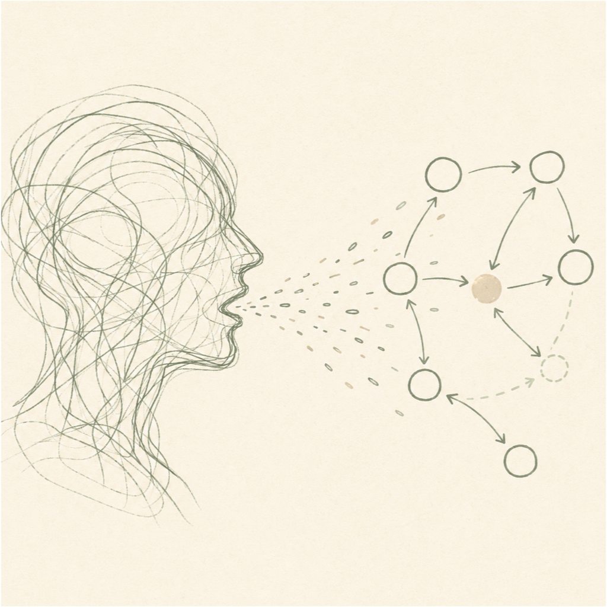
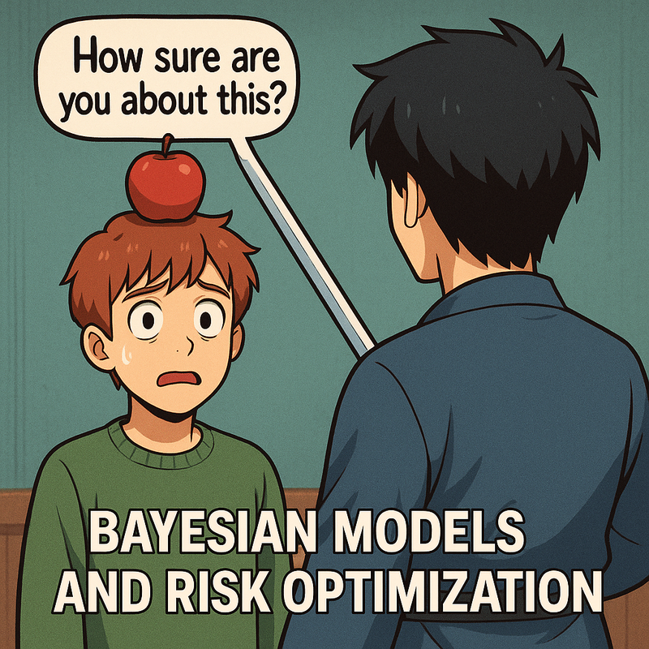
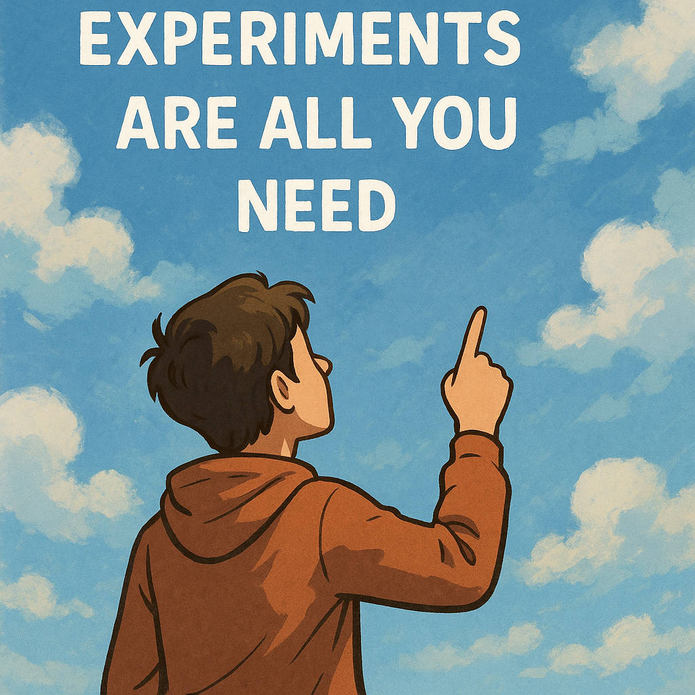

<a href="#quarto-document-content" class="skip-link">Skip to content</a>

Articles by Carlos Trujillo on Bayesian causal inference, marketing mix modeling, quasi-experiments, priors and budget optimization. Practical research notes with Python and PyMC.

Welcome to my collection of articles. Here you’ll find my thoughts, tutorials, and research on marketing science, causal inference and Bayesian methods.

## Featured Articles

PyTensor LLM July 2026

### [PyTensor Beyond PyMC: Building LLM Inference in Python](articles/alchemize_pytensor_mlx_gemma_3n/alchemize_pytensor_mlx_gemma_3n.html)

An inspectable local-LLM stack built in Python: GGUF and safetensors weights, reusable PyTensor graphs, C/Numba/MLX execution, generation, and numerical validation.

<a href="articles/alchemize_pytensor_mlx_gemma_3n/alchemize_pytensor_mlx_gemma_3n.html" class="btn btn-outline-primary">Read More</a>

Bayesian Causal April 2026

### [Can You Trust Your Quasi-Experiment? A Bayesian Framework for Auditing Time-Series Causal Estimates](articles/placebo_bayesian_quasi_experiments/placebo_bayesian_quasi_experiments.html)

A Bayesian framework using placebo tests and ROPE-based inference to audit whether your quasi-experimental causal estimates are trustworthy.

<a href="articles/placebo_bayesian_quasi_experiments/placebo_bayesian_quasi_experiments.html" class="btn btn-outline-primary">Read More</a>

MMM Budget February 2026

### [Decision-Making Under Contradictions: Robust Budget Allocation When Your Models Disagree](articles/decision_making_under_contradictions/decision_making_under_contradictions.html)

How to make robust budget allocation decisions when your measurement models (MMM, experiments, attribution) give contradictory advice.

<a href="articles/decision_making_under_contradictions/decision_making_under_contradictions.html" class="btn btn-outline-primary">Read More</a>

Priors MMM February 2026

### [From Experiments to Priors: Eliciting Informative Priors for Your Marketing Mix Model](articles/from_experiments_to_priors/from_experiments_to_priors.html)

How to translate quasi-experimental results into informative Bayesian priors for your MMM using CausalPy and PyMC-Marketing.

<a href="articles/from_experiments_to_priors/from_experiments_to_priors.html" class="btn btn-outline-primary">Read More</a>

Bayesian Risk August 2025

### [Bayesian Models and Risk Optimization](articles/bayesian_models_and_risk_optimization/bayesian_models_and_risk_optimization.html)

An article discussing the importance of causality in experiments. Talk given in PyData Berlin 2025.

<a href="articles/bayesian_models_and_risk_optimization/bayesian_models_and_risk_optimization.html" class="btn btn-outline-primary">Read More</a>

Causal Experiments April 2025

### [No More Experiments Without Causality](articles/nomore_experiments_without_causality/nomore_experiments_without_causality.html)

An article discussing the importance of causality in experiments. Talk given in PyData DE Darmstadt 2025.

<a href="articles/nomore_experiments_without_causality/nomore_experiments_without_causality.html" class="btn btn-outline-primary">Read More</a>

Causal Discovery February 2025

### [Baby Steps for Causal Discovery](articles/baby_steps_for_causal_discovery/baby_steps_for_causal_discovery.html)

An article discussing the importance of causality in experiments. Talk given in PyData Tallinn 2025.

<a href="articles/baby_steps_for_causal_discovery/baby_steps_for_causal_discovery.html" class="btn btn-outline-primary">Read More</a>

## All Articles

-   [PyTensor Beyond PyMC: Building LLM Inference in Python](articles/alchemize_pytensor_mlx_gemma_3n/alchemize_pytensor_mlx_gemma_3n.html) - *July 2026*
-   [Can You Trust Your Quasi-Experiment? A Bayesian Framework for Auditing Time-Series Causal Estimates](articles/placebo_bayesian_quasi_experiments/placebo_bayesian_quasi_experiments.html) - *April 2026*
-   [Decision-Making Under Contradictions: Robust Budget Allocation When Your Models Disagree](articles/decision_making_under_contradictions/decision_making_under_contradictions.html) - *February 2026*
-   [From Experiments to Priors: Eliciting Informative Priors for Your Marketing Mix Model](articles/from_experiments_to_priors/from_experiments_to_priors.html) - *February 2026*
-   [Bayesian Models and Risk Optimization](articles/bayesian_models_and_risk_optimization/bayesian_models_and_risk_optimization.html) - *August 2025*
-   [No More Experiments Without Causality](articles/nomore_experiments_without_causality/nomore_experiments_without_causality.html) - *April 2025*
-   [Baby Steps for Causal Discovery](articles/baby_steps_for_causal_discovery/baby_steps_for_causal_discovery.html) - *February 2025*

