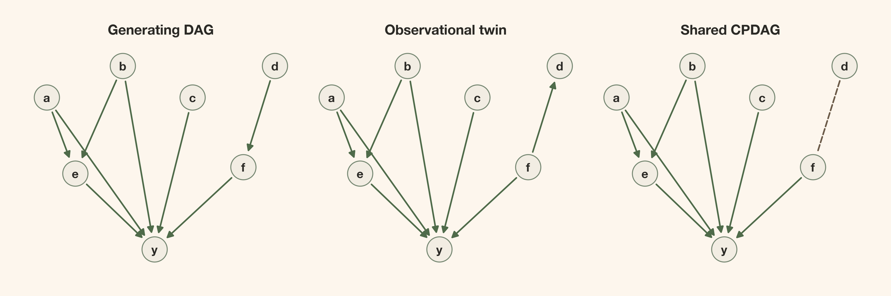
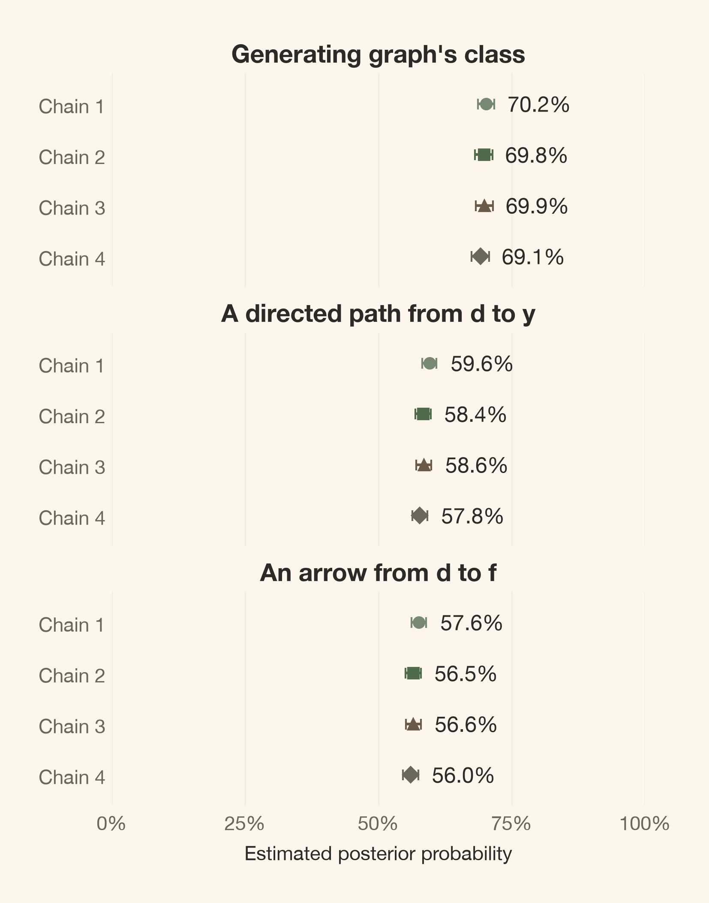
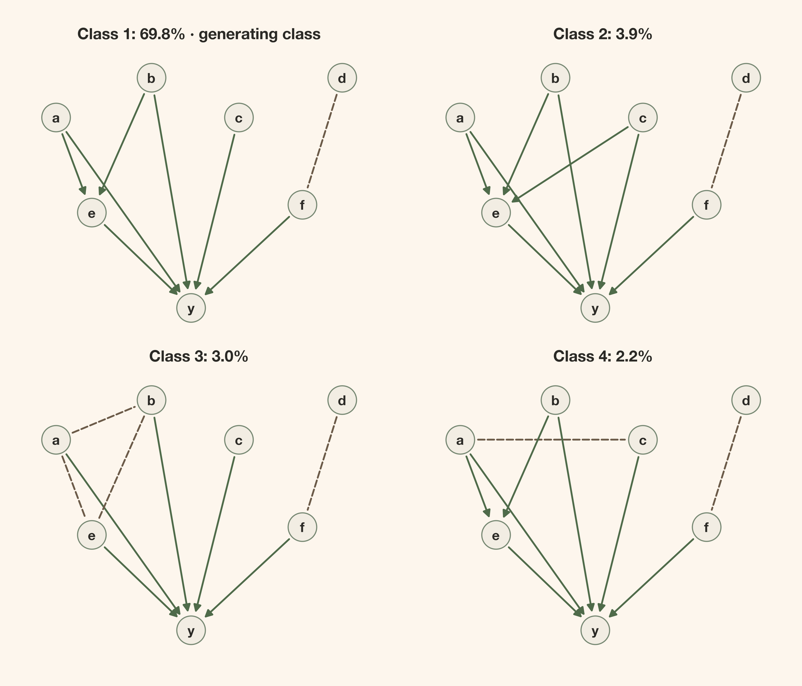

# A Causal Graph Is Not One Graph

> Two nonlinear causal worlds can have exactly the same observational law and disagree under intervention. A posterior over graphs preserves that distinction; external knowledge, not a sharper fit, can remove it.

By Carlos Trujillo · 2026-10-07

Source: https://cetagostini.github.io/articles/a_causal_graph_is_not_one_graph/a_causal_graph_is_not_one_graph.html

# Introduction

“The posterior is narrow, so the causal effect is well determined.” That conclusion can fail even when the posterior calculation is correct. A parameter posterior is conditional on a model:

p(\theta_M\mid D,M,\mathcal A) \propto p(D\mid\theta_M,M,\mathcal A)\\p(\theta_M\mid M,\mathcal A),

where D is the observed data, M is the selected model, and \mathcal A collects its other assumptions. If M assigns the wrong causal direction, concentrating this distribution cannot represent uncertainty about a direction the model excluded. A precise posterior conditional on a wrong model is still conditional on a wrong model.

The discomfort is not just that a graph might be hard to estimate. We will construct two causal worlds that give **exactly the same observational distribution**, including the nonlinear outcome, yet disagree about whether changing d changes y. Neither an unlimited observational sample nor a better predictive fit can separate them.

<figure class="quarto-float quarto-float-fig figure">

<figcaption>Figure 1: Outcome randomness, unknown parameters, and unknown graphs are different sources of uncertainty. All three remain inside a chosen model family.</figcaption>
</figure>

**Part 1 of 3.** The causal argument is complete here: graph uncertainty, an exact observational twin, intervention disagreement, and what one external restriction changes. The upcoming parts are *Putting a Posterior on Causal Graphs* and *From Uncertain Graphs to Uncertain Effects*.

# Quick summary

This article walks you through:

- **A model of models:** which uncertainty a graph posterior adds, and which assumptions remain fixed.
- **A complete synthetic world:** linear upstream mechanisms and five Michaelis–Menten effects into one outcome.
- **DAGs, skeletons, and CPDAGs:** different summaries with different probability weights.
- **An exact observational twin:** matching Gaussian covariance, the unchanged full outcome law, and a strictly positive intervention contrast versus an exact zero.
- **A same-data restriction:** forbidding media-to-calendar causation without forcing the opposite edge.

We compute the graph probabilities independently in this article. Setup and plotting code are folded; the computations that establish the argument stay visible.

# Theoretical lens

## A model of models still has a boundary

We take a Bayesian structural-causal view. **Epistemic uncertainty** concerns what we do not know, including parameters and graph structure. **Aleatoric uncertainty** is randomness within the process: even known mechanisms can generate different outcomes. A posterior for parameters describes the first; a prediction for a new outcome can combine both.

How can the graph itself become uncertain? Let G index a candidate DAG and let \theta_G contain its mechanism parameters. The joint posterior is

p(G,\theta_G\mid D,\mathcal A) \propto p(D\mid G,\theta_G,\mathcal A)\\ p(\theta_G\mid G,\mathcal A)\\\pi(G\mid\mathcal A).

This is one Bayesian model with a structural unknown, not a separate fit selected after comparing every candidate. We must specify a likelihood, parameter priors, and a graph prior. The data update their relative weights; they do not choose the family in which those weights live.

If every candidate omits the same common cause, no graph draw can represent that omission. A model of models is still a model.

## A graph specifies inputs, not their response

An arrow x\rightarrow y says that x enters the mechanism for y. It does not say whether that response is linear, saturating, weak, or strong. A DAG has no directed cycle, so its equations can be evaluated in a topological order.

<figure class="quarto-float quarto-float-fig figure">

<figcaption>Figure 2: The graph specifies which input enters a mechanism; the equation specifies how it acts. Linear and curved responses can share a DAG.</figcaption>
</figure>

Our candidate mechanisms have independent Gaussian errors and additive parent contributions:

X_i=\alpha_i+\sum\_{j\in\operatorname{Pa}\_i(G)}g\_{ij}(X_j)+\varepsilon_i, \qquad \varepsilon_i\sim\mathcal N(0,\sigma_i^2).

The parents \operatorname{Pa}\_i(G) are the variables with arrows into i. The graph selects those inputs; \theta_G determines the intercepts, responses, and noise variances. We interpret an intervention as replacing one structural equation while keeping the other mechanisms invariant.

We assume independent, complete observations on a fixed set of correctly measured variables; no hidden common causes, selection, measurement error, or feedback; and homoscedastic Gaussian noise at each node. The causal Markov assumption connects a DAG to conditional independences. Faithfulness rules out additional independences from exact cancellations. These assumptions are not inferred from a successful graph fit.

# Getting started

We use the frozen data seed, dictionary, priors, and full sampling settings declared here. The shared Python module contains implementations, not saved posterior draws. This kernel generates its own data and fits its own graphs.

Imports and notebook styling

``` sourceCode
# Domain-specific / PyMC ecosystem
import arviz_stats as azs

# Visualization
import matplotlib.pyplot as plt

# Scientific computing
import numpy as np
import pandas as pd

# Utilities
import inspect
from fractions import Fraction
from importlib.metadata import version
from IPython.display import Code, Markdown, display
from scipy.integrate import quad

from cetagostini.style import PALETTE, article_table, setup_notebook
from cetagostini.graph_discovery.graph_figures import plot_process
from cetagostini.graph_discovery.graph_math import (
    cpdag, has_path, mec_key, pair_probabilities, parents_to_states,
)
from cetagostini.graph_discovery.workflow import (
    DATA_SEED, SAMPLING_SEED, SATURATION_ALPHA, SATURATION_LAM,
    adjacency_of, alpha0, beta0, betas, build_score, centers, chains,
    d_index, draw_graph, draws, f_index, fit_graphs, graph_diagnostic_data,
    graph_summary, h, labels, lam, loc, make_twin, make_world, n_nodes,
    n_obs, pairs, rank_and_mass, scale, tau0, tune, width, y_index,
)

setup_notebook(figsize=(8, 5), warnings_filter="")
plt.rcParams["axes.titleweight"] = "bold"
plt.rcParams["font.family"] = ["sans-serif", "DejaVu Sans"]
```

``` sourceCode
print(f"Nodes: {labels}; {len(pairs)} unordered pairs; N = {n_obs}")
print(f"Data seed: {DATA_SEED}; graph sampling seed: {SAMPLING_SEED}")
print(f"Each fit: {chains} chains, {tune:,} tuning draws, {draws:,} retained draws per chain")
print(f"Tempering: {len(betas)} replicas; 15 geometric betas from 1 to 0.002, then 0")
```

    Nodes: ('a', 'b', 'c', 'd', 'e', 'f', 'y'); 21 unordered pairs; N = 1000
    Data seed: 20260909; graph sampling seed: 20260929
    Each fit: 4 chains, 3,000 tuning draws, 12,000 retained draws per chain
    Tempering: 16 replicas; 15 geometric betas from 1 to 0.002, then 0

# A complete world gives us something to challenge

The seven variables are continuous synthetic indices, not literal spend, holiday counts, or clinical measurements. Their roles are explicit:

| Variable | Role in the generating system                |
|----------|----------------------------------------------|
| a        | Independent root; input to e and y           |
| b        | Independent root; input to e and y           |
| c        | Independent root; input to y                 |
| d        | Independent root; input to f                 |
| e        | Intermediate response to a and b; input to y |
| f        | Intermediate response to d; input to y       |
| y        | Terminal outcome                             |

What generates one observation? The structural equations are

\begin{aligned} a&=\varepsilon_a, &b&=\varepsilon_b, &c&=\varepsilon_c, &d&=\varepsilon_d,\\ e&=0.9a+0.8b+\varepsilon_e,\\ f&=0.9d+\varepsilon_f,\\ y&=0.55h(a)+0.5h(b)+0.6h(c)+0.7h(e)+0.8h(f)+\varepsilon_y, \end{aligned} \qquad h(x)=6\\\frac{u(x)}{1+u(x)},\qquad u(x)=\log(1+e^x).

All seven errors are mutually independent \mathcal N(0,1) and independent across rows. The upstream relationships are linear. Only the five direct contributions to y saturate.

The implementation uses [PyMC-Marketing’s `MichaelisMentenSaturation`](https://www.pymc-marketing.io/en/stable/api/generated/pymc_marketing.mmm.components.saturation.MichaelisMentenSaturation.html), with saturation level 6 and half-saturation exposure 1. Michaelis–Menten takes nonnegative exposure. The declared softplus link u(x) supplies that exposure from a signed Gaussian index; it does not turn the index into literal spend. The resulting h is smooth, strictly increasing, and bounded between 0 and 6.

We display the actual generator rather than maintaining a second definition in the article.

``` sourceCode
display(Code(inspect.getsource(make_world), language="python"))
```

    def make_world(seed, size):
        """Draw all seven errors row-wise; size 300 is a prefix of size 1000."""
        errors = np.random.default_rng(seed).normal(size=(size, n_nodes))
        a, b, c, d = errors[:, 0], errors[:, 1], errors[:, 2], errors[:, 3]
        e = 0.9 * a + 0.8 * b + errors[:, 4]
        f = 0.9 * d + errors[:, 5]
        y = 0.55 * h(a) + 0.5 * h(b) + 0.6 * h(c) + 0.7 * h(e) + 0.8 * h(f) + errors[:, 6]
        return np.column_stack([a, b, c, d, e, f, y])

Generate observations and record evaluation-only truth

``` sourceCode
data = make_world(DATA_SEED, n_obs)
truth = np.array([0, 0, 0, 0, 3, 8, 55], dtype=np.int64)
truth_states = parents_to_states(truth, pairs)
truth_key = mec_key(truth)
print(f"Generating arrows: {sum(int(mask).bit_count() for mask in truth)}")
print(f"Saturation level: {SATURATION_ALPHA}; half-saturation exposure: {SATURATION_LAM}")
print("The generating graph is used only for evaluation; it is never passed to the fit.")
```

    Generating arrows: 8
    Saturation level: 6.0; half-saturation exposure: 1.0
    The generating graph is used only for evaluation; it is never passed to the fit.

From the structural-causal perspective, the observed scatter is a mixture of mechanisms, not a response to an intervention. <a href="#fig-process" class="quarto-xref">Figure 3</a> keeps that distinction visible.

Code

``` sourceCode
fig = plot_process(data, labels, truth_states, h)
plt.show()
```

<figure class="quarto-float quarto-float-fig figure">

<figcaption>Figure 3: Linear upstream relationships and five saturating effects into y. The scatter of y against f retains the other parent contributions and outcome noise; it is not an isolated causal response curve.</figcaption>
</figure>

# A DAG, a skeleton, and a CPDAG answer different questions

A **DAG** keeps each directed edge. A **skeleton** keeps the same adjacencies and removes every arrowhead. It asks which variables are connected, without retaining either direction or collider structure.

A **CPDAG**, or completed partially directed acyclic graph, represents a *Markov-equivalence class*: DAGs with the same conditional-independence implications. An arrow is **compelled** if every member has that direction. An undirected edge is present in every member but points in different directions across members. It is neither an absent edge nor two simultaneous opposing causal arrows. “Completed” means all compelled arrows have been oriented, not that every pair is connected.

Why is the skeleton insufficient? A chain and a fork imply separation of their endpoints conditional on the middle node. A collider x_1\rightarrow x_2\leftarrow x_3 instead separates its endpoints before conditioning on the shared effect. All three have the same skeleton, but not the same independence structure.

<figure class="quarto-float quarto-float-fig figure">

<figcaption>Figure 4: Chains and forks share a CPDAG; a collider belongs to a different class despite having the same connections. Skeleton equality is not class equality.</figcaption>
</figure>

The [Verma–Pearl characterization](https://ftp.cs.ucla.edu/pub/stat_ser/R150.pdf) makes the distinction precise: two DAGs are Markov equivalent exactly when they have the same skeleton and the same unshielded colliders. An unshielded collider has two arrows into one child whose two parents are not adjacent.

How should probabilities follow these summaries? If S(G) is a skeleton and C(G) a class, then

p(S=s\mid D,\mathcal A)=\sum\_{G:S(G)=s}p(G\mid D,\mathcal A), \qquad p(C=c\mid D,\mathcal A)=\sum\_{G:C(G)=c}p(G\mid D,\mathcal A).

A skeleton can collect several classes. A class can collect several DAGs. We sum their **member weights**, not assign each displayed drawing a new probability or give each member equal weight. DAGs excluded by the graph prior contribute zero. The leading DAG need not belong to the leading class.

These are graphical summaries. A CPDAG does not, by itself, prove that two restricted nonlinear mechanism families can reproduce the same full distribution. Our world lets us establish that stronger claim directly.

# Equal observations do not imply equal interventions

## Reversing the Gaussian core preserves its full law

The generating graph has d\rightarrow f\rightarrow y. Construct a twin that changes only the d–f mechanisms:

f=\sqrt{1.81}\\\tilde\varepsilon_f, \qquad d=\frac{0.9}{1.81}\\f+\frac{\tilde\varepsilon_d}{\sqrt{1.81}}, \qquad \tilde\varepsilon_d,\tilde\varepsilon_f\stackrel{\mathrm{ind}}{\sim}\mathcal N(0,1).

These two errors are also independent of all the other errors. The equations for a,b,c,e,y remain unchanged. Now f is a root and the arrow is f\rightarrow d.

In the generating world, \operatorname{Var}(d)=1, \operatorname{Cov}(d,f)=0.9, and \operatorname{Var}(f)=0.9^2+1=1.81. In the twin,

\operatorname{Cov}(d,f)=\frac{0.9}{1.81}\\1.81=0.9, \qquad \operatorname{Var}(d)=\left(\frac{0.9}{1.81}\right)^2 1.81+\frac{1}{1.81} =\frac{0.81+1}{1.81}=1.

In both worlds the pair (d,f) has zero mean and is jointly Gaussian, so equality of this covariance matrix proves equality of their joint distributions:

(d,f)\sim\mathcal N\\\left( \begin{bmatrix}0\\0\end{bmatrix}, \underbrace{\begin{bmatrix}1&0.9\\0.9&1.81\end{bmatrix}}\_{\Sigma} \right) \quad\text{in both worlds.}

The off-diagonal covariance is 0.9. The number 0.81 is the squared slope in the variance calculation, not the covariance. The following check uses exact rational arithmetic; it is not a sample-moment comparison.

``` sourceCode
slope = Fraction(9, 10)
variance_f = 1 + slope ** 2
twin_slope = slope / variance_f
twin_residual_variance = 1 / variance_f
sigma_true = np.array([
    [Fraction(1), slope],
    [slope, variance_f],
], dtype=object)
sigma_twin = np.array([
    [twin_slope ** 2 * variance_f + twin_residual_variance, twin_slope * variance_f],
    [twin_slope * variance_f, variance_f],
], dtype=object)
sigma_expected = np.array([
    [Fraction(1), Fraction(9, 10)],
    [Fraction(9, 10), Fraction(181, 100)],
], dtype=object)
assert np.array_equal(sigma_true, sigma_twin)
assert np.array_equal(sigma_twin, sigma_expected)
display(article_table(
    pd.DataFrame(sigma_true.astype(float), index=("d", "f"), columns=("d", "f"))
        .rename_axis("Variable").reset_index(),
    "The exact covariance in both Gaussian cores",
    formats={"d": "{:.2f}", "f": "{:.2f}"},
))
```

<figure class="quarto-float quarto-float-tbl figure">
<table id="T_db621" class="caption-top table table-sm table-striped small" data-quarto-postprocess="true">
<thead>
<tr class="header">
<th id="T_db621_level0_col0" class="col_heading level0 col0" data-quarto-table-cell-role="th">Variable</th>
<th id="T_db621_level0_col1" class="col_heading level0 col1" data-quarto-table-cell-role="th">d</th>
<th id="T_db621_level0_col2" class="col_heading level0 col2" data-quarto-table-cell-role="th">f</th>
</tr>
</thead>
<tbody>
<tr class="odd">
<td id="T_db621_row0_col0" class="data row0 col0">d</td>
<td id="T_db621_row0_col1" class="data row0 col1">1.00</td>
<td id="T_db621_row0_col2" class="data row0 col2">0.90</td>
</tr>
<tr class="even">
<td id="T_db621_row1_col0" class="data row1 col0">f</td>
<td id="T_db621_row1_col1" class="data row1 col1">0.90</td>
<td id="T_db621_row1_col2" class="data row1 col2">1.81</td>
</tr>
</tbody>
</table>
<figcaption>Table 1: The exact covariance in both Gaussian cores</figcaption>
</figure>

## The unchanged outcome law completes the observational proof

Matching the pair is not enough unless the rest of the world also matches. Here the entire conditional outcome law is the same in both systems:

y\mid a,b,c,e,f\sim\mathcal N\\\left( 0.55h(a)+0.5h(b)+0.6h(c)+0.7h(e)+0.8h(f),\\ 1 \right).

It does not depend on d once those inputs are fixed. The laws of a,b,c and e\mid a,b are also unchanged. Thus both worlds have the same observational factorization,

p(a,b,c,d,e,f,y) =p(a)\\p(b)\\p(c)\\p(e\mid a,b)\\p(d,f)\\p(y\mid a,b,c,e,f).

The generating system writes the pair factor as p(d)p(f\mid d); the twin writes it as p(f)p(d\mid f). Both equal the same bivariate Gaussian density. The nonlinear conditional law of y is identical, not just its conditional mean. **The complete seven-variable observational distributions are therefore equal.** Any number of independent rows has the same distribution under either world.

Their shared CPDAG reflects the weaker graphical equivalence. The collider a\rightarrow e\leftarrow b compels the two arrows into e; unshielded colliders at y compel all five arrows into y. Only d–f can reverse, so this class contains exactly two DAGs.

Code

``` sourceCode
observational_twin = truth.copy()
observational_twin[d_index], observational_twin[f_index] = 1 << f_index, 0
twin_states = parents_to_states(observational_twin, pairs)
assert mec_key(observational_twin) == truth_key
assert np.array_equal(cpdag(observational_twin), cpdag(truth))
fig, axes = plt.subplots(1, 3, figsize=(12, 4.4))
for ax, matrix, title in zip(
    axes,
    [adjacency_of(truth), adjacency_of(observational_twin), cpdag(truth)],
    ["Generating DAG", "Observational twin", "Shared CPDAG"],
):
    draw_graph(ax, matrix, title)
plt.show()
```

<figure class="quarto-float quarto-float-fig figure">

<figcaption>Figure 5: The generating DAG and its exact observational twin share a CPDAG: seven arrows are compelled, while d–f can reverse. The covariance and factorization above establish more than shared independences: these two structural systems have the same full observational law.</figcaption>
</figure>

## Replacing one equation separates the worlds

Observational equality does not settle the intervention. Consider the finite mean contrast

\Delta=\mathbb E\[y\mid\operatorname{do}(d=1)\] -\mathbb E\[y\mid\operatorname{do}(d=0)\].

This is a formal intervention on the synthetic index, not a derivative and not a proposal to randomize real holidays. We replace the equation for d with a constant and leave all other equations and error laws unchanged.

In the generating world, that replacement moves f from Z to 0.9+Z, with Z\sim\mathcal N(0,1). All other outcome contributions cancel in the mean contrast, giving

\Delta\_{\mathrm{true}}=0.8\\\mathbb E\[h(0.9+Z)-h(Z)\]\>0.

The inequality is strict. Since u'(x)=1/(1+e^{-x})\>0,

h'(x)=\frac{6u'(x)}{(1+u(x))^2}\>0

for every finite x. Therefore h(z+0.9)-h(z)\>0 everywhere, and boundedness of h makes its expectation finite. Quadrature computes the contrast; it does not establish the sign in place of this argument.

In the twin, f is a root. Replacing the equation for d changes neither f nor any other input to y. There is no directed path from d to y, so **\Delta\_{\mathrm{twin}}=0 exactly**. This is an invariance of the full intervened outcome law, not a rounded small estimate.

``` sourceCode
integrand = lambda z: 0.8 * (h(0.9 + z) - h(z)) * np.exp(-0.5 * z ** 2) / np.sqrt(2 * np.pi)
true_effect, quad_error = quad(integrand, -np.inf, np.inf)
assert true_effect > 0
assert has_path(truth, d_index, y_index)
assert not has_path(observational_twin, d_index, y_index)
print(f"Generating contrast E[y|do(d=1)] - E[y|do(d=0)]: {true_effect:.6f}")
print(f"Quadrature's reported absolute error estimate: {quad_error:.2e}")
print("Twin contrast: exactly 0, because the intervention reaches no input to y.")
```

    Generating contrast E[y|do(d=1)] - E[y|do(d=0)]: 0.622767
    Quadrature's reported absolute error estimate: 1.49e-09
    Twin contrast: exactly 0, because the intervention reaches no input to y.

The quadrature error concerns numerical integration. It is neither posterior uncertainty nor evidence about which world generated the observations. The structural-causal distinction is now complete: **one observational law, two intervention laws**.

Sample moments illustrate the equality; they do not prove it

The illustration below uses 200,000 rows per world with the same fixed seed. Finite samples need not have equal moments even when their laws are equal. The proof is the Gaussian covariance calculation and the unchanged factorization above.

Illustrate matching observational moments

``` sourceCode
world_sample = make_world(DATA_SEED + 7, 200_000)
twin_sample = make_twin(DATA_SEED + 7, 200_000)
twin_rows = []
for name, column, stat in [
    ("mean d", d_index, np.mean), ("sd d", d_index, np.std),
    ("mean f", f_index, np.mean), ("sd f", f_index, np.std),
    ("mean y", y_index, np.mean), ("sd y", y_index, np.std),
]:
    twin_rows.append({
        "Quantity": name,
        "Generating world": stat(world_sample[:, column]),
        "Twin world": stat(twin_sample[:, column]),
    })
for other_index, name in [(f_index, "corr(d, f)"), (y_index, "corr(d, y)")]:
    twin_rows.append({
        "Quantity": name,
        "Generating world": np.corrcoef(world_sample[:, d_index], world_sample[:, other_index])[0, 1],
        "Twin world": np.corrcoef(twin_sample[:, d_index], twin_sample[:, other_index])[0, 1],
    })
display(article_table(
    pd.DataFrame(twin_rows),
    "Sample moments from two exactly equal observational laws",
    formats={"Generating world": "{:.4f}", "Twin world": "{:.4f}"},
))
```

<figure class="quarto-float quarto-float-tbl figure">
<table id="T_6c23d" class="caption-top table table-sm table-striped small" data-quarto-postprocess="true">
<thead>
<tr class="header">
<th id="T_6c23d_level0_col0" class="col_heading level0 col0" data-quarto-table-cell-role="th">Quantity</th>
<th id="T_6c23d_level0_col1" class="col_heading level0 col1" data-quarto-table-cell-role="th">Generating world</th>
<th id="T_6c23d_level0_col2" class="col_heading level0 col2" data-quarto-table-cell-role="th">Twin world</th>
</tr>
</thead>
<tbody>
<tr class="odd">
<td id="T_6c23d_row0_col0" class="data row0 col0">mean d</td>
<td id="T_6c23d_row0_col1" class="data row0 col1">-0.0040</td>
<td id="T_6c23d_row0_col2" class="data row0 col2">-0.0007</td>
</tr>
<tr class="even">
<td id="T_6c23d_row1_col0" class="data row1 col0">sd d</td>
<td id="T_6c23d_row1_col1" class="data row1 col1">1.0009</td>
<td id="T_6c23d_row1_col2" class="data row1 col2">0.9994</td>
</tr>
<tr class="odd">
<td id="T_6c23d_row2_col0" class="data row2 col0">mean f</td>
<td id="T_6c23d_row2_col1" class="data row2 col1">-0.0002</td>
<td id="T_6c23d_row2_col2" class="data row2 col2">0.0045</td>
</tr>
<tr class="even">
<td id="T_6c23d_row3_col0" class="data row3 col0">sd f</td>
<td id="T_6c23d_row3_col1" class="data row3 col1">1.3444</td>
<td id="T_6c23d_row3_col2" class="data row3 col2">1.3448</td>
</tr>
<tr class="odd">
<td id="T_6c23d_row4_col0" class="data row4 col0">mean y</td>
<td id="T_6c23d_row4_col1" class="data row4 col1">7.6286</td>
<td id="T_6c23d_row4_col2" class="data row4 col2">7.6317</td>
</tr>
<tr class="even">
<td id="T_6c23d_row5_col0" class="data row5 col0">sd y</td>
<td id="T_6c23d_row5_col1" class="data row5 col1">2.0547</td>
<td id="T_6c23d_row5_col2" class="data row5 col2">2.0553</td>
</tr>
<tr class="odd">
<td id="T_6c23d_row6_col0" class="data row6 col0">corr(d, f)</td>
<td id="T_6c23d_row6_col1" class="data row6 col1">0.6687</td>
<td id="T_6c23d_row6_col2" class="data row6 col2">0.6677</td>
</tr>
<tr class="even">
<td id="T_6c23d_row7_col0" class="data row7 col0">corr(d, y)</td>
<td id="T_6c23d_row7_col1" class="data row7 col1">0.2895</td>
<td id="T_6c23d_row7_col2" class="data row7 col2">0.2902</td>
</tr>
</tbody>
</table>
<figcaption>Table 2: Sample moments from two exactly equal observational laws</figcaption>
</figure>

> **Doesn’t a nonlinear additive-noise model identify direction?** Under additional conditions it can ([Peters et al., 2014](https://jmlr.org/papers/v15/peters14a.html)). Those conditions do not make every edge identifiable. Our d–f core is linear Gaussian and reversible; a shared nonlinear mechanism downstream does not remove that reversal. The other seven arrows are compelled by collider structure, not by a blanket claim that every direction is ambiguous.

# Graph probabilities require mechanisms and priors

How do we preserve these alternatives rather than choosing one drawing? Integrating the mechanisms out gives

p(G\mid D,\mathcal A)\propto p(D\mid G,\mathcal A)\\\pi(G\mid\mathcal A), \qquad p(D\mid G,\mathcal A)=\int p(D\mid\theta_G,G,\mathcal A)\\ p(\theta_G\mid G,\mathcal A)\\d\theta_G.

The evidence averages likelihood over the **parameter prior**, not over fitted posterior draws or a graph’s best-fitting parameters. A graph probability therefore depends on more than the graph.

A second boundary matters for graph probabilities: graphical equivalence does not imply equal integrated evidence under arbitrary parameter priors. Independently specified priors need not transform coherently between orientations. Unequal posterior weights within this class can reflect those assumptions; they do not refute the exact observational twin or identify its direction from observations.

## A fixed dictionary makes the mechanism assumptions inspectable

For predictor j, use z_j=(X_j-\mathrm{loc}\_j)/\mathrm{scale}\_j with declared, non-data-dependent transformations. Upstream child mechanisms use only the linear term z_j. When the child is y, each parent instead gets

\phi_y(z_j)=\left\[ z_j,\\ \exp\\\left(-\frac12\left(\frac{z_j+1}{1.5}\right)^2\right),\\ \exp\\\left(-\frac12\left(\frac{z_j-1}{1.5}\right)^2\right) \right\].

Every family has an intercept; its target remains in raw units. The candidate response is additive in these fixed feature blocks. We neither refit the dictionary for each graph nor include within-mechanism parent interactions.

For each node and candidate parent set, let v_i be its noise variance and \theta\_{i,P} its intercept and feature coefficients. The independent local parameter priors are

v_i\sim\operatorname{InvGamma}(\alpha_0=2,\beta_0=1), \qquad \theta\_{i,P}\mid v_i\sim\mathcal N(0,v_i\Lambda\_{0,P}^{-1}), \qquad \Lambda\_{0,P}=\operatorname{diag}(0.01,0.1,\ldots,0.1).

The inverse-gamma uses the shape/scale convention with density proportional to v_i^{-\alpha_0-1}\exp(-\beta_0/v_i). Here \beta_0 is in the squared raw units of the local target. This prior on v_i has mean 1 and infinite variance; it does not imply \mathbb E\[\sigma_i\]=1.

Conjugacy integrates each local mechanism exactly, and independence across mechanisms gives

\log p(D\mid G,\mathcal A) =\sum_i\log p(x_i\mid x\_{\operatorname{Pa}\_i(G)},\mathcal A).

The implementation’s table subtracts the intercept-only evidence from each node’s entries. That changes the joint log evidence by one graph-independent constant, not the posterior graph weights.

``` sourceCode
score = build_score(data)
print(f"Predictor location: {loc}; fixed scales: {scale.tolist()}")
print(f"Outcome bump centers: {centers}; width: {width}")
print(f"Intercept precision: {tau0}; coefficient precision: {lam}")
print(f"Variance prior: InvGamma(shape={alpha0}, scale={beta0})")
```

    Predictor location: 0.0; fixed scales: [1.0, 1.0, 1.0, 1.0, 1.5, 1.5, 2.0]
    Outcome bump centers: (-1.0, 1.0); width: 1.5
    Intercept precision: 0.01; coefficient precision: 0.1
    Variance prior: InvGamma(shape=2.0, scale=1.0)

The upstream families contain their generating mechanisms. The true Michaelis–Menten response is **not** in the finite outcome dictionary: exact integration is exact for the approximating model, not for the true h. This family is not guaranteed score-equivalent. Even Markov-equivalent DAGs need not receive equal evidence.

## The baseline already includes one external restriction

For each unordered pair (i,j), the states are absent, i\rightarrow j, and j\rightarrow i. Before masking, their local probabilities are (1/3,1/3,1/3). The baseline forbids self arrows and every outgoing arrow from y, but supplies none of its five parents. For a pair involving y, absence and an arrow into y each retain probability 1/2.

We condition this pair-factorized prior on global acyclicity to obtain the DAG prior. The local probabilities are **not** DAG-prior marginals after that conditioning. Making y terminal is background knowledge, not an inference from correlations.

``` sourceCode
direction_prior = pd.DataFrame(
    (1 - np.eye(n_nodes)) / 3, index=labels, columns=labels,
)
allowed = pd.DataFrame(
    ~np.eye(n_nodes, dtype=bool), index=labels, columns=labels,
)
allowed.loc["y", :] = False
baseline_probs = pair_probabilities(direction_prior.to_numpy(), allowed.to_numpy())
df_pair = next(k for k, pair in enumerate(pairs) if tuple(pair) == (d_index, f_index))
```

There are 1,138,779,265 labeled DAGs on seven nodes before restrictions. We do not normalize them by full enumeration. The shared sampler handles the unresolved six-node core with discrete Metropolis moves and parallel tempering. Since terminal y cannot participate in a cycle, its 64 parent sets have exact conditional weights under this decomposable model; full graph draws reconstruct its parents from those weights. Only the cold, \beta=1 replica supplies the core posterior draws.

# Diagnose the graph questions before reading their probabilities

We now fit the baseline with four independently initialized chains, 3,000 tuning draws and 12,000 retained draws per chain. The temperature ladder is the frozen 15-point geometric sequence from 1 to 0.002 plus 0. Starts are computational choices, not draws from the graph prior. Neither the generating DAG nor the twin equations are inputs to the fit.

Fit the baseline graph posterior independently

``` sourceCode
posterior = fit_graphs(
    score, baseline_probs, labels,
    seed=SAMPLING_SEED, draws=draws, tune=tune, betas=betas, chains=chains,
)
summary = graph_summary(posterior, pairs, n_nodes, truth_key, d_index, y_index)
diagnostic_data = graph_diagnostic_data(posterior, summary, baseline_probs, labels, pairs)
diagnostics = azs.summary(diagnostic_data, ci_prob=0.95, round_to="none")
```

From the Bayesian perspective, graph uncertainty and simulation error are different. We diagnose binary events in their original chain order: every varying pair state, membership in the four leading classes and the generating class, and a directed path from d to y. We also monitor arrow count and collapsed log evidence. Arbitrary numeric DAG identifiers and pair-state codes are not continuous causal quantities to diagnose.

The generating class is an evaluation event we can name only because this is synthetic data. A directed path is a structural connection, not an effect size. <a href="#fig-graph-diagnostics" class="quarto-xref">Figure 6</a> compares three event probabilities across chains; its bars concern Monte Carlo error, not uncertainty about the causal world.

Code

``` sourceCode
diagnostic_events = [
    ("Generating graph's class", summary["true_class"]),
    ("A directed path from d to y", summary["path"]),
    ("An arrow from d to f", summary["states"][..., df_pair] == 1),
]
chain_colors = [PALETTE[i] for i in (0, 3, 4, 5)]
chain_markers = ("o", "s", "^", "D")
fig, axes = plt.subplots(3, 1, figsize=(5, 6.5), sharex=True, layout="constrained")
for ax, (title, event) in zip(axes, diagnostic_events):
    for chain in range(chains):
        values = event[chain:chain + 1].astype(float)
        if np.ptp(values) == 0:
            ax.text(0.5, chain + 1, "Constant in this chain: error not estimable",
                    transform=ax.get_yaxis_transform(), ha="center", fontsize=9)
            continue
        probability = float(values.mean())
        mcse = float(azs.mcse(values))
        ax.errorbar(probability, chain + 1, xerr=2 * mcse,
                    fmt=chain_markers[chain], color=chain_colors[chain],
                    capsize=3, markersize=6)
        ax.annotate(f"{probability:.1%}", (probability, chain + 1),
                    xytext=(12, 0), textcoords="offset points", va="center", fontsize=12)
    ax.set(title=title, yticks=range(1, chains + 1),
           yticklabels=[f"Chain {i + 1}" for i in range(chains)],
           ylim=(chains + 0.6, 0.4), xlim=(0, 1), xticks=np.linspace(0, 1, 5))
    ax.tick_params(labelsize=11)
    ax.grid(False)
    ax.grid(axis="x", alpha=0.4)
axes[-1].set(xlabel="Estimated posterior probability",
             xticklabels=["0%", "25%", "50%", "75%", "100%"])
plt.show()
```

<figure class="quarto-float quarto-float-fig figure">

<figcaption>Figure 6: Per-chain estimates for three graph events, with two Monte Carlo standard errors on either side. Agreement would support the estimated probabilities under this model, not observational identification of d–f or complete graph-space exploration.</figcaption>
</figure>

Report event frequencies, simulation error, and monitored diagnostics

``` sourceCode
probability_rows = []
for question, key, event in [
    ("Generating graph's class", "event[Generating class]", summary["true_class"]),
    ("A directed path from d to y", "event[d has a path to y]", summary["path"]),
    ("An arrow from d to f", "event[d→f]", summary["states"][..., df_pair] == 1),
    ("An arrow from f to d", "event[f→d]", summary["states"][..., df_pair] == 2),
    ("No d–f edge", "event[d–f absent]", summary["states"][..., df_pair] == 0),
]:
    varying = key in diagnostics.index
    probability_rows.append({
        "Graph question": question,
        "Retained frequency": f"{event.mean():.2%}",
        "MC error (pp)": f"{100 * diagnostics.loc[key, 'mcse_mean']:.2f}" if varying else "Not estimable",
        "Status": "Varying" if varying else "Constant in retained draws",
    })
display(article_table(
    pd.DataFrame(probability_rows),
    "Baseline graph events: posterior estimates and their Monte Carlo error",
))
event_mask = diagnostics.index.str.startswith("event[")
metadata = diagnostic_data["posterior"].attrs
display(Markdown(
    f"Across **{int(event_mask.sum())} varying graph events** and the varying scalar summaries, "
    f"the largest $\\widehat R$ is **{diagnostics.r_hat.max():.4f}**; "
    f"the smallest bulk and tail ESS are **{diagnostics.ess_bulk.min():,.0f}** "
    f"and **{diagnostics.ess_tail.min():,.0f}**. "
    f"The largest varying-event MC error is **"
    f"{100 * diagnostics.loc[event_mask, 'mcse_mean'].max():.2f} percentage points**. "
    f"**{metadata['fixed_indicators']} indicators are fixed by pair support**; "
    f"**{metadata['other_constant_indicators']} other indicators are constant in retained draws**. "
    "Their diagnostics are not estimable."
))
if metadata["constant_summaries"]:
    print(f"Constant scalar summaries, also not diagnosable: {metadata['constant_summaries']}")
```

<figure class="quarto-float quarto-float-tbl figure">
<table id="T_74f24" class="caption-top table table-sm table-striped small" data-quarto-postprocess="true">
<thead>
<tr class="header">
<th id="T_74f24_level0_col0" class="col_heading level0 col0" data-quarto-table-cell-role="th">Graph question</th>
<th id="T_74f24_level0_col1" class="col_heading level0 col1" data-quarto-table-cell-role="th">Retained frequency</th>
<th id="T_74f24_level0_col2" class="col_heading level0 col2" data-quarto-table-cell-role="th">MC error (pp)</th>
<th id="T_74f24_level0_col3" class="col_heading level0 col3" data-quarto-table-cell-role="th">Status</th>
</tr>
</thead>
<tbody>
<tr class="odd">
<td id="T_74f24_row0_col0" class="data row0 col0">Generating graph's class</td>
<td id="T_74f24_row0_col1" class="data row0 col1">69.75%</td>
<td id="T_74f24_row0_col2" class="data row0 col2">0.40</td>
<td id="T_74f24_row0_col3" class="data row0 col3">Varying</td>
</tr>
<tr class="even">
<td id="T_74f24_row1_col0" class="data row1 col0">A directed path from d to y</td>
<td id="T_74f24_row1_col1" class="data row1 col1">58.57%</td>
<td id="T_74f24_row1_col2" class="data row1 col2">0.35</td>
<td id="T_74f24_row1_col3" class="data row1 col3">Varying</td>
</tr>
<tr class="odd">
<td id="T_74f24_row2_col0" class="data row2 col0">An arrow from d to f</td>
<td id="T_74f24_row2_col1" class="data row2 col1">56.69%</td>
<td id="T_74f24_row2_col2" class="data row2 col2">0.35</td>
<td id="T_74f24_row2_col3" class="data row2 col3">Varying</td>
</tr>
<tr class="even">
<td id="T_74f24_row3_col0" class="data row3 col0">An arrow from f to d</td>
<td id="T_74f24_row3_col1" class="data row3 col1">43.31%</td>
<td id="T_74f24_row3_col2" class="data row3 col2">0.35</td>
<td id="T_74f24_row3_col3" class="data row3 col3">Varying</td>
</tr>
<tr class="odd">
<td id="T_74f24_row4_col0" class="data row4 col0">No d–f edge</td>
<td id="T_74f24_row4_col1" class="data row4 col1">0.00%</td>
<td id="T_74f24_row4_col2" class="data row4 col2">Not estimable</td>
<td id="T_74f24_row4_col3" class="data row4 col3">Constant in retained draws</td>
</tr>
</tbody>
</table>
<figcaption>Table 3: Baseline graph events: posterior estimates and their Monte Carlo error</figcaption>
</figure>

Across **50 varying graph events** and the varying scalar summaries, the largest \widehat R is **1.0003**; the smallest bulk and tail ESS are **12,777** and **12,908**. The largest varying-event MC error is **0.40 percentage points**. **6 indicators are fixed by pair support**; **13 other indicators are constant in retained draws**. Their diagnostics are not estimable.

\widehat R compares within- and between-chain variation; values above 1.01 deserve investigation. ESS accounts for dependence between draws. MCSE is simulation error in an estimated probability; one percentage point is 0.01 on that scale. A constant indicator is not evidence of perfect convergence: it can reflect a forbidden state, another implied restriction, a rare event, or an unvisited region. Per-chain constant events have no estimable error bar either.

These checks cannot detect a missing cause or certify that every important graph was visited. Divergences and BFMI diagnose HMC, not this discrete Metropolis sampler. If sampling is poor, the remedy concerns computation on the **same data**, not choosing a new dataset with more convenient diagnostics.

# The posterior retains DAG weights inside class weights

All summaries in this section use the baseline posterior. Their empirical probabilities count **every retained draw**, not each distinct graph once.

Measure compact DAG, skeleton, and class probabilities

``` sourceCode
states = summary["states"]
flat = states.reshape(-1, len(pairs))
powers = 3 ** np.arange(len(pairs))
ids = (flat * powers).sum(axis=1)
true_id = int((truth_states * powers).sum())
twin_id = int((twin_states * powers).sum())
binary_powers = 1 << np.arange(len(pairs))
skeleton_codes = ((flat != 0) * binary_powers).sum(axis=1)
true_skeleton = int(((truth_states != 0) * binary_powers).sum())
n_total = len(flat)
dag_rank, dag_mass = rank_and_mass(ids, true_id)
twin_rank, twin_mass = rank_and_mass(ids, twin_id)
skel_rank, skel_mass = rank_and_mass(skeleton_codes, true_skeleton)
class_rank = summary["ranked"].index(truth_key) + 1 if truth_key in summary["ranked"] else None
class_mass = float(summary["true_class"].mean())
_, dag_counts = np.unique(ids, return_counts=True)
_, skeleton_counts = np.unique(skeleton_codes, return_counts=True)
leading_class_mass = summary["class_counts"][summary["ranked"][0]] / n_total
probability_summary = pd.DataFrame([
    {"Object": "Most frequent visited DAG", "Rank": 1, "Empirical mass": dag_counts.max() / n_total},
    {"Object": "Generating DAG", "Rank": dag_rank or "not visited", "Empirical mass": dag_mass},
    {"Object": "Reverse-d–f twin DAG", "Rank": twin_rank or "not visited", "Empirical mass": twin_mass},
    {"Object": "Most frequent visited skeleton", "Rank": 1, "Empirical mass": skeleton_counts.max() / n_total},
    {"Object": "Generating skeleton", "Rank": skel_rank or "not visited", "Empirical mass": skel_mass},
    {"Object": "Most frequent visited class", "Rank": 1, "Empirical mass": leading_class_mass},
    {"Object": "Generating class", "Rank": class_rank or "not visited", "Empirical mass": class_mass},
])
display(article_table(
    probability_summary,
    "Different posterior summaries answer different graph questions",
    formats={"Empirical mass": "{:.2%}"},
))
assert np.isclose(dag_mass + twin_mass, class_mass)
print(f"Distinct DAGs visited: {len(summary['graphs'])}; classes visited: {len(summary['ranked'])}")
print(f"Frequency resolution: {1 / n_total:.2e}; this does not bound unvisited posterior mass")
```

<figure class="quarto-float quarto-float-tbl figure">
<table id="T_548d1" class="caption-top table table-sm table-striped small" data-quarto-postprocess="true">
<thead>
<tr class="header">
<th id="T_548d1_level0_col0" class="col_heading level0 col0" data-quarto-table-cell-role="th">Object</th>
<th id="T_548d1_level0_col1" class="col_heading level0 col1" data-quarto-table-cell-role="th">Rank</th>
<th id="T_548d1_level0_col2" class="col_heading level0 col2" data-quarto-table-cell-role="th">Empirical mass</th>
</tr>
</thead>
<tbody>
<tr class="odd">
<td id="T_548d1_row0_col0" class="data row0 col0">Most frequent visited DAG</td>
<td id="T_548d1_row0_col1" class="data row0 col1">1</td>
<td id="T_548d1_row0_col2" class="data row0 col2">39.65%</td>
</tr>
<tr class="even">
<td id="T_548d1_row1_col0" class="data row1 col0">Generating DAG</td>
<td id="T_548d1_row1_col1" class="data row1 col1">1</td>
<td id="T_548d1_row1_col2" class="data row1 col2">39.65%</td>
</tr>
<tr class="odd">
<td id="T_548d1_row2_col0" class="data row2 col0">Reverse-d–f twin DAG</td>
<td id="T_548d1_row2_col1" class="data row2 col1">2</td>
<td id="T_548d1_row2_col2" class="data row2 col2">30.11%</td>
</tr>
<tr class="even">
<td id="T_548d1_row3_col0" class="data row3 col0">Most frequent visited skeleton</td>
<td id="T_548d1_row3_col1" class="data row3 col1">1</td>
<td id="T_548d1_row3_col2" class="data row3 col2">69.75%</td>
</tr>
<tr class="odd">
<td id="T_548d1_row4_col0" class="data row4 col0">Generating skeleton</td>
<td id="T_548d1_row4_col1" class="data row4 col1">1</td>
<td id="T_548d1_row4_col2" class="data row4 col2">69.75%</td>
</tr>
<tr class="even">
<td id="T_548d1_row5_col0" class="data row5 col0">Most frequent visited class</td>
<td id="T_548d1_row5_col1" class="data row5 col1">1</td>
<td id="T_548d1_row5_col2" class="data row5 col2">69.75%</td>
</tr>
<tr class="odd">
<td id="T_548d1_row6_col0" class="data row6 col0">Generating class</td>
<td id="T_548d1_row6_col1" class="data row6 col1">1</td>
<td id="T_548d1_row6_col2" class="data row6 col2">69.75%</td>
</tr>
</tbody>
</table>
<figcaption>Table 4: Different posterior summaries answer different graph questions</figcaption>
</figure>

    Distinct DAGs visited: 872; classes visited: 459
    Frequency resolution: 2.08e-05; this does not bound unvisited posterior mass

The generating class has exactly two members, so its mass is the generating-DAG mass plus the twin mass. Their weights need not be equal. A skeleton aggregates more broadly: even a high skeleton probability does not choose a collider pattern, much less a causal direction.

The internal base-3 DAG identifiers are labels, not structural distances. DAG and skeleton ranks break frequency ties by increasing identifier. An unvisited target has zero **empirical frequency**, not a proven zero posterior probability. The frequency of one draw is a resolution limit, not an upper bound on unseen mass.

Sum member-DAG draws into class probabilities without top-row renormalization

``` sourceCode
class_rows = []
for rank, key in enumerate(summary["ranked"][:6], start=1):
    class_rows.append({
        "Class rank": rank,
        "Estimated posterior mass": summary["class_counts"][key] / n_total,
        "Visited member DAGs": summary["class_members"][key],
        "Generating class": "yes" if key == truth_key else "",
    })
class_rows.append({
    "Class rank": "all remaining classes",
    "Estimated posterior mass": 1.0 - sum(row["Estimated posterior mass"] for row in class_rows),
    "Visited member DAGs": "",
    "Generating class": "",
})
display(article_table(
    pd.DataFrame(class_rows),
    "Class probabilities are sums of member weights, not equal weights on drawings",
    formats={"Estimated posterior mass": "{:.2%}"},
))
```

<figure class="quarto-float quarto-float-tbl figure">
<table id="T_0a024" class="caption-top table table-sm table-striped small" data-quarto-postprocess="true">
<thead>
<tr class="header">
<th id="T_0a024_level0_col0" class="col_heading level0 col0" data-quarto-table-cell-role="th">Class rank</th>
<th id="T_0a024_level0_col1" class="col_heading level0 col1" data-quarto-table-cell-role="th">Estimated posterior mass</th>
<th id="T_0a024_level0_col2" class="col_heading level0 col2" data-quarto-table-cell-role="th">Visited member DAGs</th>
<th id="T_0a024_level0_col3" class="col_heading level0 col3" data-quarto-table-cell-role="th">Generating class</th>
</tr>
</thead>
<tbody>
<tr class="odd">
<td id="T_0a024_row0_col0" class="data row0 col0">1</td>
<td id="T_0a024_row0_col1" class="data row0 col1">69.75%</td>
<td id="T_0a024_row0_col2" class="data row0 col2">2</td>
<td id="T_0a024_row0_col3" class="data row0 col3">yes</td>
</tr>
<tr class="even">
<td id="T_0a024_row1_col0" class="data row1 col0">2</td>
<td id="T_0a024_row1_col1" class="data row1 col1">3.88%</td>
<td id="T_0a024_row1_col2" class="data row1 col2">2</td>
<td id="T_0a024_row1_col3" class="data row1 col3"></td>
</tr>
<tr class="odd">
<td id="T_0a024_row2_col0" class="data row2 col0">3</td>
<td id="T_0a024_row2_col1" class="data row2 col1">2.98%</td>
<td id="T_0a024_row2_col2" class="data row2 col2">12</td>
<td id="T_0a024_row2_col3" class="data row2 col3"></td>
</tr>
<tr class="even">
<td id="T_0a024_row3_col0" class="data row3 col0">4</td>
<td id="T_0a024_row3_col1" class="data row3 col1">2.23%</td>
<td id="T_0a024_row3_col2" class="data row3 col2">4</td>
<td id="T_0a024_row3_col3" class="data row3 col3"></td>
</tr>
<tr class="odd">
<td id="T_0a024_row4_col0" class="data row4 col0">5</td>
<td id="T_0a024_row4_col1" class="data row4 col1">1.75%</td>
<td id="T_0a024_row4_col2" class="data row4 col2">3</td>
<td id="T_0a024_row4_col3" class="data row4 col3"></td>
</tr>
<tr class="even">
<td id="T_0a024_row5_col0" class="data row5 col0">6</td>
<td id="T_0a024_row5_col1" class="data row5 col1">1.70%</td>
<td id="T_0a024_row5_col2" class="data row5 col2">3</td>
<td id="T_0a024_row5_col3" class="data row5 col3"></td>
</tr>
<tr class="odd">
<td id="T_0a024_row6_col0" class="data row6 col0">all remaining classes</td>
<td id="T_0a024_row6_col1" class="data row6 col1">17.69%</td>
<td id="T_0a024_row6_col2" class="data row6 col2"></td>
<td id="T_0a024_row6_col3" class="data row6 col3"></td>
</tr>
</tbody>
</table>
<figcaption>Table 5: Class probabilities are sums of member weights, not equal weights on drawings</figcaption>
</figure>

<a href="#fig-cpdag-classes" class="quarto-xref">Figure 7</a> draws the leading classes rather than treating a single DAG as the whole answer. Each class is computed from its skeleton and colliders; an undirected edge does not become a compelled arrow merely because a chain rarely visits one orientation. The CPDAG summarizes the full graphical class, while the probability sums only its supported member-DAG weights.

Code

``` sourceCode
fig, axes = plt.subplots(2, 2, figsize=(10, 8))
for index, ax in enumerate(axes.flat):
    if index >= min(4, len(summary["ranked"])):
        ax.axis("off")
        continue
    key = summary["ranked"][index]
    mass = summary["class_counts"][key] / n_total
    suffix = " · generating class" if key == truth_key else ""
    draw_graph(ax, cpdag(summary["representative"][key]), f"Class {index + 1}: {mass:.1%}{suffix}")
plt.show()
```

<figure class="quarto-float quarto-float-fig figure">

<figcaption>Figure 7: The leading observational CPDAGs, weighted by their member-DAG draws. Dashed undirected edges describe reversibility in the graphical class; they do not reinstate directions excluded by the hard mask. Displayed classes are not renormalized to sum to one.</figcaption>
</figure>

A class posterior preserves observational structure, but interventions still depend on its directed members and mechanisms. The exact twin has already shown why replacing all member DAGs with one representative can erase the distinction that matters to the decision.

# External knowledge changes support, not the observations

Suppose d stands for a calendar driver such as holidays and f for a media exposure index. A calendar event can change campaign activity. A campaign cannot change when the event occurs; the holiday still occurs when media exposure is zero. That knowledge licenses **forbidding f\rightarrow d**.

This is an illustration using continuous synthetic indices, not a fitted calendar or spend dataset. We add only this one restriction. We do not assert that d has no parents, and we do not force d\rightarrow f to exist. For the d–f pair, the local probabilities become (1/2,1/2,0) for absence, d\rightarrow f, and f\rightarrow d.

What happens to the complete posterior? Write \mathcal R for all baseline-supported DAGs without f\rightarrow d. With the same observations, mechanism family, and parameter priors,

p\_{\mathcal R}(G\mid D) =\frac{\mathbf 1\\G\in\mathcal R\\\\p\_{\mathrm B}(G\mid D)} {\sum\_{H\in\mathcal R}p\_{\mathrm B}(H\mid D)}.

The local renormalization multiplies every surviving DAG’s prior weight by the same factor; conditioning on acyclicity and normalizing the posterior preserves the displayed identity. The denominator includes **all surviving DAGs**, not just the generating graph and its twin. Observations have not contradicted the twin. We have removed it by assumption.

``` sourceCode
restricted_allowed = allowed.copy()
restricted_allowed.loc["f", "d"] = False
restricted_probs = pair_probabilities(
    direction_prior.to_numpy(), restricted_allowed.to_numpy(),
)
assert np.allclose(restricted_probs[df_pair], [0.5, 0.5, 0.0])
```

We refit the restricted target independently, keeping the original data, score, seed, number of chains, retained draws, tuning draws, and temperature ladder unchanged. This is not a two-graph reweighting exercise.

Fit and diagnose the fresh same-data restricted posterior

``` sourceCode
restricted_posterior = fit_graphs(
    score, restricted_probs, labels,
    seed=SAMPLING_SEED, draws=draws, tune=tune, betas=betas, chains=chains,
)
restricted_summary = graph_summary(
    restricted_posterior, pairs, n_nodes, truth_key, d_index, y_index,
)
restricted_diagnostic_data = graph_diagnostic_data(
    restricted_posterior, restricted_summary, restricted_probs, labels, pairs,
)
restricted_diagnostics = azs.summary(
    restricted_diagnostic_data, ci_prob=0.95, round_to="none",
)
```

Compare graph weights and monitored simulation diagnostics

``` sourceCode
def knowledge_metrics(current, current_diagnostics):
    """Summarize empirical graph probabilities and varying-event diagnostics.

    Parameters
    ----------
    current : dict
        Chain-ordered graph summary for one fit.
    current_diagnostics : pandas.DataFrame
        ArviZ diagnostics for that fit's varying graph events and scalars.

    Returns
    -------
    dict
        Display-ready frequencies, ranks, and simulation diagnostics.
    """
    current_states = current["states"].reshape(-1, len(pairs))
    current_ids = (current_states * powers).sum(axis=1)
    rank, mass = rank_and_mass(current_ids, true_id)
    _, reverse_mass = rank_and_mass(current_ids, twin_id)
    current_events = current_diagnostics.index.str.startswith("event[")
    return {
        "Generating DAG rank": rank or "not visited",
        "Generating DAG probability": f"{mass:.2%}",
        "Reverse-twin probability": f"{reverse_mass:.2%}",
        "Generating class probability": f"{current['true_class'].mean():.2%}",
        "P(d → f)": f"{np.mean(current_states[:, df_pair] == 1):.2%}",
        "P(f → d)": f"{np.mean(current_states[:, df_pair] == 2):.2%}",
        "P(d–f absent)": f"{np.mean(current_states[:, df_pair] == 0):.2%}",
        "P(d has a path to y)": f"{current['path'].mean():.2%}",
        "Varying graph events monitored": int(current_events.sum()),
        "Maximum monitored R-hat": f"{current_diagnostics.r_hat.max():.4f}",
        "Minimum bulk ESS": f"{current_diagnostics.ess_bulk.min():,.0f}",
        "Minimum tail ESS": f"{current_diagnostics.ess_tail.min():,.0f}",
        "Maximum varying-event MC error (pp)": f"{100 * current_diagnostics.loc[current_events, 'mcse_mean'].max():.2f}",
    }


knowledge_comparison = pd.DataFrame({
    "Baseline": knowledge_metrics(summary, diagnostics),
    "Forbid f → d": knowledge_metrics(restricted_summary, restricted_diagnostics),
}).rename_axis("Quantity").reset_index()
display(article_table(
    knowledge_comparison,
    "Same observations and mechanisms; one additional graph restriction",
))
assert not np.any(restricted_summary["states"][..., df_pair] == 2)
restricted_metadata = restricted_diagnostic_data["posterior"].attrs
print(f"Restricted support-fixed indicators: {restricted_metadata['fixed_indicators']}")
print(f"Other restricted indicators constant in retained draws: {restricted_metadata['other_constant_indicators']}")
if restricted_metadata["constant_summaries"]:
    print(f"Restricted constant scalar summaries: {restricted_metadata['constant_summaries']}")
print(f"Restricted frequency resolution: {1 / restricted_summary['states'][..., 0].size:.2e}")
```

<figure class="quarto-float quarto-float-tbl figure">
<table id="T_a464f" class="caption-top table table-sm table-striped small" data-quarto-postprocess="true">
<thead>
<tr class="header">
<th id="T_a464f_level0_col0" class="col_heading level0 col0" data-quarto-table-cell-role="th">Quantity</th>
<th id="T_a464f_level0_col1" class="col_heading level0 col1" data-quarto-table-cell-role="th">Baseline</th>
<th id="T_a464f_level0_col2" class="col_heading level0 col2" data-quarto-table-cell-role="th">Forbid f → d</th>
</tr>
</thead>
<tbody>
<tr class="odd">
<td id="T_a464f_row0_col0" class="data row0 col0">Generating DAG rank</td>
<td id="T_a464f_row0_col1" class="data row0 col1">1</td>
<td id="T_a464f_row0_col2" class="data row0 col2">1</td>
</tr>
<tr class="even">
<td id="T_a464f_row1_col0" class="data row1 col0">Generating DAG probability</td>
<td id="T_a464f_row1_col1" class="data row1 col1">39.65%</td>
<td id="T_a464f_row1_col2" class="data row1 col2">69.07%</td>
</tr>
<tr class="odd">
<td id="T_a464f_row2_col0" class="data row2 col0">Reverse-twin probability</td>
<td id="T_a464f_row2_col1" class="data row2 col1">30.11%</td>
<td id="T_a464f_row2_col2" class="data row2 col2">0.00%</td>
</tr>
<tr class="even">
<td id="T_a464f_row3_col0" class="data row3 col0">Generating class probability</td>
<td id="T_a464f_row3_col1" class="data row3 col1">69.75%</td>
<td id="T_a464f_row3_col2" class="data row3 col2">69.07%</td>
</tr>
<tr class="odd">
<td id="T_a464f_row4_col0" class="data row4 col0">P(d → f)</td>
<td id="T_a464f_row4_col1" class="data row4 col1">56.69%</td>
<td id="T_a464f_row4_col2" class="data row4 col2">100.00%</td>
</tr>
<tr class="even">
<td id="T_a464f_row5_col0" class="data row5 col0">P(f → d)</td>
<td id="T_a464f_row5_col1" class="data row5 col1">43.31%</td>
<td id="T_a464f_row5_col2" class="data row5 col2">0.00%</td>
</tr>
<tr class="odd">
<td id="T_a464f_row6_col0" class="data row6 col0">P(d–f absent)</td>
<td id="T_a464f_row6_col1" class="data row6 col1">0.00%</td>
<td id="T_a464f_row6_col2" class="data row6 col2">0.00%</td>
</tr>
<tr class="even">
<td id="T_a464f_row7_col0" class="data row7 col0">P(d has a path to y)</td>
<td id="T_a464f_row7_col1" class="data row7 col1">58.57%</td>
<td id="T_a464f_row7_col2" class="data row7 col2">100.00%</td>
</tr>
<tr class="odd">
<td id="T_a464f_row8_col0" class="data row8 col0">Varying graph events monitored</td>
<td id="T_a464f_row8_col1" class="data row8 col1">50</td>
<td id="T_a464f_row8_col2" class="data row8 col2">47</td>
</tr>
<tr class="even">
<td id="T_a464f_row9_col0" class="data row9 col0">Maximum monitored R-hat</td>
<td id="T_a464f_row9_col1" class="data row9 col1">1.0003</td>
<td id="T_a464f_row9_col2" class="data row9 col2">1.0004</td>
</tr>
<tr class="odd">
<td id="T_a464f_row10_col0" class="data row10 col0">Minimum bulk ESS</td>
<td id="T_a464f_row10_col1" class="data row10 col1">12,777</td>
<td id="T_a464f_row10_col2" class="data row10 col2">10,967</td>
</tr>
<tr class="even">
<td id="T_a464f_row11_col0" class="data row11 col0">Minimum tail ESS</td>
<td id="T_a464f_row11_col1" class="data row11 col1">12,908</td>
<td id="T_a464f_row11_col2" class="data row11 col2">12,486</td>
</tr>
<tr class="odd">
<td id="T_a464f_row12_col0" class="data row12 col0">Maximum varying-event MC error (pp)</td>
<td id="T_a464f_row12_col1" class="data row12 col1">0.40</td>
<td id="T_a464f_row12_col2" class="data row12 col2">0.41</td>
</tr>
</tbody>
</table>
<figcaption>Table 6: Same observations and mechanisms; one additional graph restriction</figcaption>
</figure>

    Restricted support-fixed indicators: 7
    Other restricted indicators constant in retained draws: 15
    Restricted frequency resolution: 2.08e-05

Both fits monitor the same kinds of graph events and scalar summaries, though their support-fixed and empirically constant indicators can differ. Their Monte Carlo diagnostics are not diagnostics of the calendar assumption. The forbidden direction and reverse twin have exactly zero restricted probability **because the support excludes them**; their constant indicators have no estimable convergence diagnostic.

The percentages compare posterior probabilities, not percentage improvements in rank. Other surviving graphs can still change the outcome of an intervention, and absence remains possible. A wrong hard restriction can make the answer more confident and less correct. The graphical equivalence class itself has not changed: background knowledge restricts its supported members rather than rewriting what its observational CPDAG means.

# Considerations

## The graph posterior cannot widen beyond its model family

A fixed set of observed nodes excludes hidden causes and measurement error. The iid approximation excludes temporal dependence; acyclicity excludes feedback. Additivity excludes within-mechanism parent interactions, and the Gaussian noise model fixes the local residual shape. None of these choices becomes uncertain just because the graph does.

The finite outcome dictionary adds another limit. Far from the bump centers, the bump contributions vanish and the linear term dominates. There is no guaranteed saturating extrapolation, despite saturation in the true world. The chosen predictor transforms and variance priors also belong to the model; they must be re-declared in new physical units rather than treated as unit-free defaults.

## What the framework cannot tell us

The twin is a constructive proof that observational fit cannot adjudicate this causal direction. It is stronger than observing a vague or bimodal posterior: even the complete observational law leaves the intervention contrast unresolved within these two structural systems.

Graph-event diagnostics provide evidence about exploration of the coded target. They cannot rule out a shared unvisited mode, validate a hard mask, or detect an omitted cause. The local score table grows as n2^{n-1} legal families; this seven-node experiment makes no scaling guarantee. No repeated-dataset interval-coverage study or graph-selection error-rate guarantee is claimed here.

## The next evidence must address the disputed mechanism

In the abstract SCM, setting d experimentally and measuring f or y would separate the two worlds. In the holiday analogy, randomizing the calendar is not feasible. Calendar autonomy instead supplies directional knowledge, while an intervention on media exposure asks a different causal question. Study design must respect that distinction.

The upcoming *Putting a Posterior on Causal Graphs* examines the evidence calculation, discrete sampler, diagnostics, and sensitivity in detail. *From Uncertain Graphs to Uncertain Effects* carries graph and mechanism weights into an intervention posterior. Neither is needed to establish the observational equality and intervention disagreement proved here.

# Conclusions

A narrow parameter posterior was never the whole causal answer. Making the graph uncertain preserves alternatives, but it does not make the surrounding assumptions disappear.

1.  **Report what the posterior conditions on.** Graph uncertainty and parameter uncertainty remain inside a chosen mechanism family, measurement system, graph prior, and set of causal assumptions.
2.  **Keep graphs and mechanisms separate.** A DAG selects inputs. Equations and noise laws determine observational and intervention distributions; a graph alone determines neither.
3.  **Use each summary for its own question.** Skeletons group adjacencies, CPDAGs group independence structures, and the DAG posterior retains member weights. Class mass is a sum, not a vote for one representative.
4.  **Do not mistake observational fit for intervention identification.** Our two worlds share \Sigma=\left\[\begin{smallmatrix}1&0.9\\0.9&1.81\end{smallmatrix}\right\] and the full nonlinear outcome law. Yet one finite \operatorname{do}(d) contrast is strictly positive and the other is exactly zero.
5.  **Label external knowledge as external knowledge.** Forbidding f\rightarrow d conditions the posterior over every surviving DAG. It does not force d\rightarrow f, and its exact zero is not a discovery from the observations.

For a decision about changing d, the useful next step is evidence that separates causal mechanisms, not another observational fit to the same law. A good graph posterior makes that need visible instead of hiding it behind a preferred drawing.

**If changing d is the decision, what experiment or defensible external knowledge would separate its positive-effect world from its zero-effect twin?**

## Recommended readings

1.  [Verma, T. and Pearl, J. (1990), *Equivalence and Synthesis of Causal Models*](https://ftp.cs.ucla.edu/pub/stat_ser/R150.pdf) — the skeleton and unshielded-collider characterization.
2.  [Chickering, D. M. (2002), *Learning Equivalence Classes of Bayesian-Network Structures*](https://www.jmlr.org/papers/volume2/chickering02a/chickering02a.pdf) — especially the DAG-to-CPDAG algorithms in Figures 4–5.
3.  [Peters, J., Mooij, J. M., Janzing, D., and Schölkopf, B. (2014), *Causal Discovery with Continuous Additive Noise Models*](https://jmlr.org/papers/v15/peters14a.html) — conditions under which functional assumptions add orientation information.
4.  [Vehtari, A. et al. (2021), *Rank-Normalization, Folding, and Localization: An Improved R-hat for Assessing Convergence of MCMC*](https://doi.org/10.1214/20-BA1221) — computation diagnostics, not causal-assumption tests.
5.  [PyMC-Marketing: `MichaelisMentenSaturation`](https://www.pymc-marketing.io/en/stable/api/generated/pymc_marketing.mmm.components.saturation.MichaelisMentenSaturation.html) — the actual response component used in the synthetic world.

## Reproduce this article

Start from the repository root, load the website’s `.env` required by its render configuration, and use this article’s pinned [environment specification](environment.yml) and its own kernel:

For a fresh clone, create `.env` from `.env.example` and supply its required `MIMO_API_KEY` before running these commands. This is a website-render requirement, not a dependency of the graph computation.

``` sourceCode
set -a; . ./.env; set +a
conda env create -f articles/a_causal_graph_is_not_one_graph/environment.yml
conda activate a_causal_graph_is_not_one_graph
python -m ipykernel install --user --name a_causal_graph_is_not_one_graph
export PYTHONPATH="$(pwd)"
I18N_RENDER_ALL=1 quarto render articles/a_causal_graph_is_not_one_graph/a_causal_graph_is_not_one_graph.qmd --execute --no-clean
```

The repository-root `PYTHONPATH` makes the checked-out implementation available even when Quarto executes from the article directory. No other article’s execution or trace file is required. The shared source files are directly available: [workflow](../../cetagostini/graph_discovery/workflow.py), [graph mathematics and mechanisms](../../cetagostini/graph_discovery/graph_math.py), [sampler](../../cetagostini/graph_discovery/graph_sampling.py), [figures](../../cetagostini/graph_discovery/graph_figures.py), and [computational oracles](../../cetagostini/graph_discovery/graph_checks.py).

------------------------------------------------------------------------

## Watermark

Executed software versions

``` sourceCode
for package in ("pymc", "pymc-marketing", "pytensor", "arviz", "arviz-base", "arviz-stats",
                "numpy", "scipy", "numba"):
    print(f"{package}: {version(package)}")
```

    pymc: 6.3.2
    pymc-marketing: 1.2.0
    pytensor: 3.3.1
    arviz: 1.3.0
    arviz-base: 1.3.0
    arviz-stats: 1.3.2
    numpy: 2.4.6
    scipy: 1.18.0
    numba: 0.65.1
