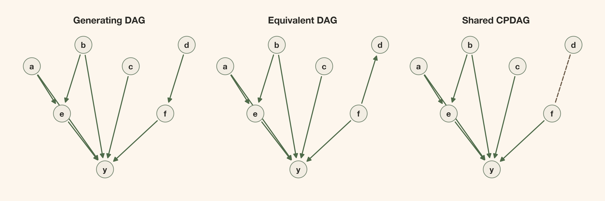
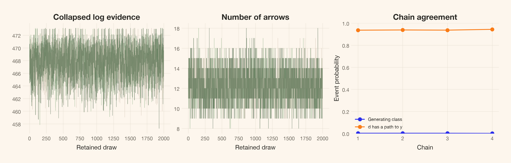
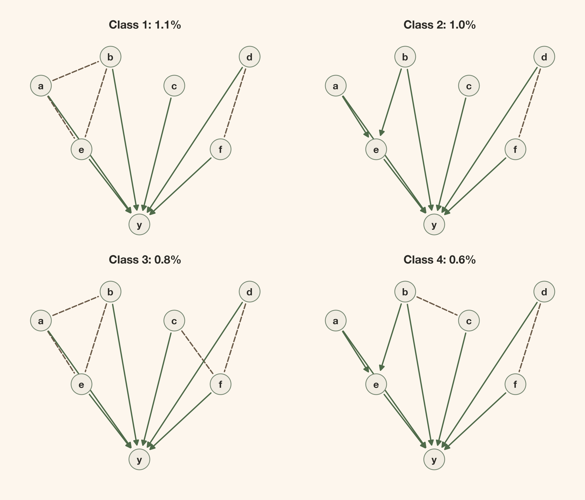
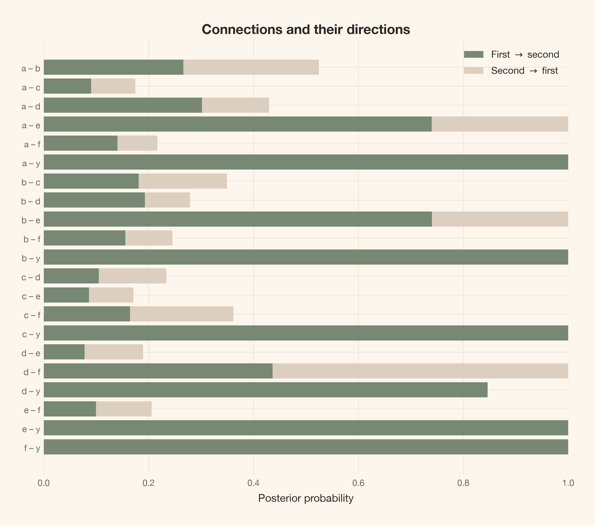
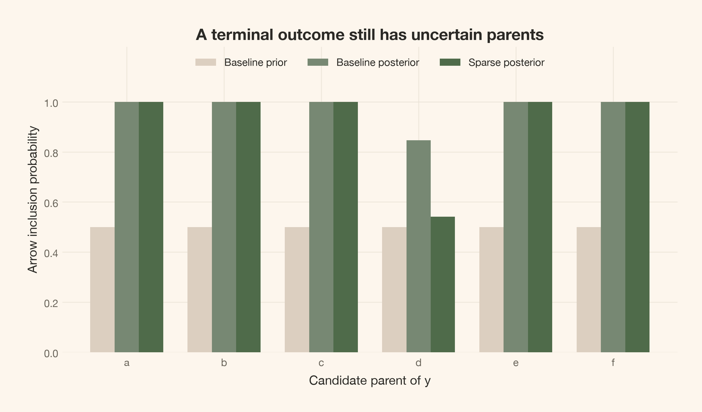
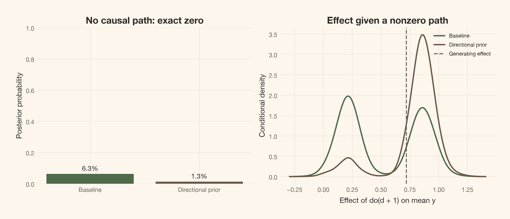
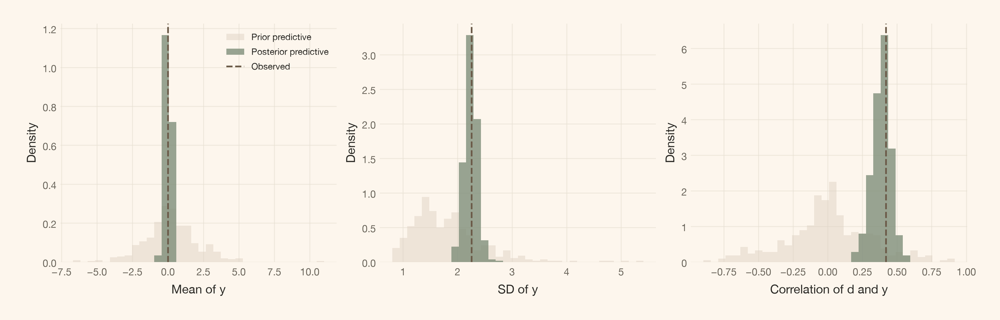
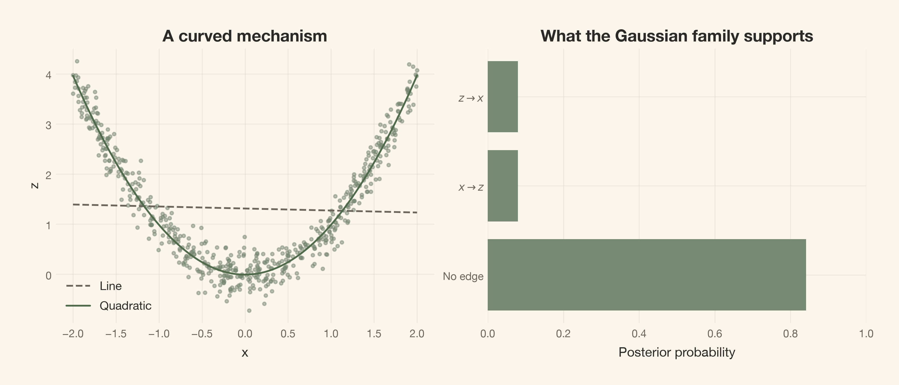

<a href="#quarto-document-content" class="skip-link">Skip to content</a>

<div id="title-block-header" class="quarto-title-block default">

<div class="quarto-title">

<div class="quarto-title-block">

<div>

# A Causal Graph Is Not One Graph: Bayesian Discovery with CPDAG Posteriors

Code

- <a href="javascript:void(0)" id="quarto-show-all-code" class="dropdown-item" role="button">Show All Code</a>

- <a href="javascript:void(0)" id="quarto-hide-all-code" class="dropdown-item" role="button">Hide All Code</a>

- 

  ------------------------------------------------------------------------

- <a href="javascript:void(0)" id="quarto-view-source" class="dropdown-item" role="button">View Source</a>

</div>

</div>

<div class="quarto-categories">

<div class="quarto-category">

causal inference

</div>

<div class="quarto-category">

bayesian

</div>

<div class="quarto-category">

graphical models

</div>

<div class="quarto-category">

causal discovery

</div>

<div class="quarto-category">

python

</div>

</div>

</div>

<div>

<div class="description">

What if our Bayesian model is wrong? A visual walk from uncertainty about models to DAGs, CPDAG probabilities, and causal effects.

</div>

</div>

<div class="quarto-title-meta">

<div>

<div class="quarto-title-meta-heading">

Author

</div>

<div class="quarto-title-meta-contents">

Carlos Trujillo

</div>

</div>

<div>

<div class="quarto-title-meta-heading">

Published

</div>

<div class="quarto-title-meta-contents">

August 30, 2026

</div>

</div>

</div>

</div>

<div id="introduction" class="section level1">

# Introduction

As a Bayesian, I often stop to ask what uncertainty I’m actually reporting. A posterior can look careful and precise. But what have I allowed myself to be uncertain about?

I find the distinction between **epistemic** and **aleatoric** uncertainty useful here. The first is about what we do not know. The second is about randomness in the process we are modeling. A parameter posterior describes the first; predictions for a new outcome can combine both. Even if we knew every parameter, the next outcome could still vary.

Inside epistemic uncertainty, though, there is another question: **what if I chose the wrong model?**

Suppose I fit a model in which <span class="math inline">b</span> causes <span class="math inline">y</span>. I can get a posterior for that effect. But unless I put alternative causal structures into the analysis, that posterior does not ask whether <span class="math inline">y</span> causes <span class="math inline">b</span> instead. Or whether some other variable explains their association.

Everything is conditional on the assumptions I wrote down. A wrong model can still give me a narrow posterior. What it does not give me automatically is uncertainty about the mistakes it cannot represent.

<div id="fig-uncertainty-map" class="quarto-float quarto-figure quarto-figure-center anchored" alt="A map separates outcome randomness from unknown parameters and graph structure, and shows shared modeling assumptions outside those candidate choices.">

<figure class="quarto-float quarto-float-fig figure">
<div aria-describedby="fig-uncertainty-map-caption-0ceaefa1-69ba-4598-a22c-09a6ac19f8ca">

</div>
<figcaption>Figure 1: Uncertainty about an outcome is not the same as uncertainty about parameters or a graph. All of these calculations still sit inside a chosen family of models.</figcaption>
</figure>

</div>

So could we make the model itself uncertain? Could we build a **model of models**?

That is the part I want to explore here. We’ll use Bayesian causal discovery to put probabilities on candidate graphs, see why several graphs sometimes deserve one shared summary, and carry those possibilities into a causal effect. We will also deliberately try a case our assumptions cannot handle. I want us to leave with a useful answer, not the impression that adding another posterior makes the assumptions disappear.

</div>

<div id="quick-summary" class="section level1">

# Quick summary

This article walks you through:

- **A model of models:** what we need to specify before a graph can receive a probability.
- **DAGs and CPDAGs:** why several different drawings can tell the same observational story.
- **A smaller search:** directional-prior matrices and hard masks, followed by MCMC for unresolved directions and exact updates for terminal parents.
- **An intervention:** how uncertainty about arrows becomes uncertainty about an effect.
- **The limits:** a nonlinear counterexample, the role of priors, and what probabilistic programming tools can do here.

The long code blocks are folded. The mathematical and sampling details are available in expandable notes, so we can follow the main story without reading the graph-search machinery first.

</div>

<div id="theoretical-lens" class="section level1">

# Theoretical lens

<div id="how-could-we-build-a-model-of-models" class="section level2">

## How could we build a model of models?

We do not need a new version of Bayes’ rule. We need to let the model index be unknown, alongside its parameters.

Call the candidate model <span class="math inline">M</span> and its parameters <span class="math inline">\theta_M</span>. Then our joint posterior is

<span class="math display"> p(M,\theta_M\mid D) \propto p(D\mid M,\theta_M)\\p(\theta_M\mid M)\\\pi(M). </span>

We have three things to write down: how a candidate generates data, what its parameters could be, and how much prior probability it receives. The data update the relative weights. Instead of choosing one model and forgetting the others, we can keep that distribution.

This is one joint Bayesian model, not a separate PyMC fit for every candidate. A sampled graph is a possible value of the structural unknown, just as a sampled coefficient is a possible value of a regression parameter. Separate fits later in the article change the prior assumptions for a sensitivity analysis.

There is a catch, of course. We have to choose the candidates. If every candidate leaves out the same important cause, the posterior has nowhere to put that possibility. “A model of models” is still a model.

</div>

<div id="how-does-causality-make-that-manageable" class="section level2">

## How does causality make that manageable?

Causal graphs give us a compact way to describe one part of a model: **which variables enter which mechanisms**. An arrow <span class="math inline">x\rightarrow y</span> says that <span class="math inline">x</span> is a direct input to the mechanism for <span class="math inline">y</span>. It does not tell us the shape or size of that effect.

<div id="fig-model-to-dag" class="quarto-float quarto-figure quarto-figure-center anchored" alt="The arrow x to y is paired with an equation and with straight and curved mechanisms, separating who affects whom from how the effect works.">

<figure class="quarto-float quarto-float-fig figure">
<div aria-describedby="fig-model-to-dag-caption-0ceaefa1-69ba-4598-a22c-09a6ac19f8ca">

</div>
<figcaption>Figure 2: The graph specifies an input to a mechanism; the equation specifies how that input acts. A straight line and a curved relationship can share the same DAG.</figcaption>
</figure>

</div>

A **directed acyclic graph**, or DAG, has arrows and no directed cycle: following arrows cannot bring us back to where we started. That lets us build a system one mechanism at a time. For now, we will not model feedback loops or hidden common causes.

A graph alone is not a complete statistical model. We must also choose the mechanisms and their noise. To keep this first walk manageable, we use linear equations with independent Gaussian errors:

<span class="math display"> X_i=\alpha_i+\sum\_{j\in\mathrm{Pa}\_i(G)}\beta\_{ij}X_j+\varepsilon_i, \qquad \varepsilon_i\sim\mathcal N(0,\sigma_i^2). </span>

The parents <span class="math inline">\mathrm{Pa}\_i(G)</span> are simply the nodes with arrows into <span class="math inline">i</span>. Choosing a DAG chooses which coefficients appear. The intercepts, coefficients, and noise scales remain unknown.

So we are not searching through every model anyone could write. We are comparing **linear-Gaussian causal models on a fixed set of measured variables**. We assume independent, complete observations and no hidden common causes. We also use the causal Markov and faithfulness assumptions to connect graph structure with conditional independence: the graph implies some independences, and faithfulness rules out extra ones caused by exact cancellations.

Yes, we still have to assume something. The benefit is that we can now say clearly what is uncertain and what we have held fixed. Later, we will see what happens when the relationship is not linear.

</div>

</div>

<div id="getting-started" class="section level1">

# Getting started

We will use seven variables. There are 1,138,779,265 labeled DAGs on seven nodes, so this is no longer an example where we normalize a list of every graph. Instead, PyMC samples a shared, unknown DAG for the whole dataset. The linear-Gaussian parameters can still be integrated out exactly.

This notebook uses the `cetagostini_web_new` kernel, PyMC 6, `pymc.dims`, and PyTensor’s named tensors. The graph and scoring utilities are available as [graph_math.py](graph_math.py), [graph_sampling.py](graph_sampling.py), and [graph_checks.py](graph_checks.py). They keep the code below focused on the model, rather than on bit masks and transition bookkeeping.

<div id="e7baffb0" class="cell" execution_count="1">

Imports and reproducible streams

<div id="cb1" class="sourceCode cell-code">

``` sourceCode
import time
from collections import Counter
from importlib.metadata import version
from math import comb, prod

import arviz_base as azb
import arviz_stats as azs
import matplotlib.pyplot as plt
import networkx as nx
import numpy as np
import pandas as pd
import pymc as pm
import pymc.dims as pmd
import pytensor.tensor as pt
import pytensor.xtensor as ptx
from IPython.display import Markdown, display
from matplotlib.patches import FancyArrowPatch
from scipy.special import softmax
from scipy.stats import gaussian_kde

from cetagostini.style import COLORS, PALETTE, article_table, setup_notebook
from graph_math import (
    BGeScore, cpdag, draw_parameters, mec_key, pair_probabilities, pairs_for,
    states_to_parents, simulate_scm, total_effects,
)
from graph_sampling import (
    TemperedGraphStep, initial_states, terminal_parent_distributions,
)
from graph_checks import check_small_graphs

setup_notebook(figsize=(8, 5), warnings_filter="")
# The local sans-serif fallback supplies bold, but not semibold.
plt.rcParams["axes.titleweight"] = "bold"
SEED = 20260909
rng_data = np.random.default_rng(SEED)
rng_effect = np.random.default_rng(SEED + 1)
rng_predictive = np.random.default_rng(SEED + 2)
print(f"Data seed: {SEED}; PyMC {pm.__version__}")
```

</div>

<div class="cell-output cell-output-stdout">

    Data seed: 20260909; PyMC 6.3.2

</div>

</div>

</div>

<div id="lets-make-a-world-we-can-check" class="section level1">

# Let’s make a world we can check

There are four independent root causes: <span class="math inline">a,b,c,d</span>. Both <span class="math inline">a</span> and <span class="math inline">b</span> affect <span class="math inline">e</span>; <span class="math inline">d</span> affects <span class="math inline">f</span>. Finally, <span class="math inline">a,b,c,e,f</span> each directly affect <span class="math inline">y</span>:

<span class="math display"> \begin{aligned} a&=\varepsilon_a, &b&=\varepsilon_b, &c&=\varepsilon_c, &d&=\varepsilon_d,\\ e&=0.9a+0.8b+\varepsilon_e,\\ f&=0.9d+\varepsilon_f,\\ y&=0.55a+0.5b+0.6c+0.7e+0.8f+\varepsilon_y. \end{aligned} </span>

The seven errors are mutually independent <span class="math inline">\mathcal N(0,1)</span>. These are structural equations: an intervention replaces one equation and leaves the other mechanisms unchanged. Under the generating model, increasing <span class="math inline">d</span> by one unit changes the mean of <span class="math inline">y</span> by <span class="math inline">0.9\times0.8=0.72</span> through <span class="math inline">f</span>.

<div id="c1c880b3" class="cell" execution_count="2">

<div id="cb3" class="sourceCode cell-code">

``` sourceCode
labels = ("a", "b", "c", "d", "e", "f", "y")
n_nodes, n_obs = len(labels), 300
pairs = pairs_for(n_nodes)
a, b, c, d = rng_data.normal(size=(4, n_obs))
e = 0.9 * a + 0.8 * b + rng_data.normal(size=n_obs)
f = 0.9 * d + rng_data.normal(size=n_obs)
y = 0.55 * a + 0.5 * b + 0.6 * c + 0.7 * e + 0.8 * f + rng_data.normal(size=n_obs)
data = np.column_stack([a, b, c, d, e, f, y])

truth = np.array([0, 0, 0, 0, (1 << 0) | (1 << 1), 1 << 3,
                  sum(1 << i for i in (0, 1, 2, 4, 5))])
observational_twin = truth.copy()
observational_twin[3], observational_twin[5] = 1 << 5, 0
truth_key = mec_key(truth)
assert mec_key(observational_twin) == truth_key
assert sum(int(mask).bit_count() for mask in truth) == 8
print(f"{n_obs} observations; {n_nodes} nodes; 8 generating arrows")
```

</div>

<div class="cell-output cell-output-stdout">

    300 observations; 7 nodes; 8 generating arrows

</div>

</div>

We know the generating order because we wrote the equations. The discovery model does **not** receive that order, the generating adjacency matrix, or a maximum-parent restriction. We will give it only one piece of directional knowledge: <span class="math inline">y</span> has no outgoing arrows. Its parents and the directions among the other six variables remain unknown.

Before fitting anything, compare these two DAGs. Reversing <span class="math inline">d\rightarrow f</span> gives a different intervention story, but the same observational equivalence class.

A CPDAG summarizes that class: its arrows are shared by both DAGs, while an undirected edge marks the direction that can still reverse.

<div id="cell-fig-true-dag-cpdag" class="cell" execution_count="3">

Draw DAGs and completed equivalence classes

<div id="cb5" class="sourceCode cell-code">

``` sourceCode
def draw_graph(ax, adjacency, title):
    positions = {0: (-1.7, 1.9), 1: (-0.5, 2.4), 2: (0.6, 1.9),
                 3: (1.9, 2.4), 4: (-1.0, 0.8), 5: (1.4, 0.8), 6: (0.0, -0.5)}
    graph = nx.empty_graph(n_nodes)
    nx.draw_networkx_nodes(graph, positions, node_size=650,
                          node_color=COLORS["surface_alt"], edgecolors=COLORS["primary"], ax=ax)
    nx.draw_networkx_labels(graph, positions, labels=dict(enumerate(labels)),
                           font_color=COLORS["ink"], font_weight="bold", ax=ax)
    for i, j in pairs:
        if not (adjacency[i, j] or adjacency[j, i]):
            continue
        undirected = adjacency[i, j] and adjacency[j, i]
        start, end = (i, j) if adjacency[i, j] else (j, i)
        ax.add_patch(FancyArrowPatch(
            positions[start], positions[end], arrowstyle="-" if undirected else "-|>",
            mutation_scale=14, linewidth=1.6, shrinkA=16, shrinkB=16,
            linestyle="--" if undirected else "-",
            color=COLORS["brown"] if undirected else COLORS["green_strong"],
        ))
    ax.set(title=title, xlim=(-2.1, 2.3), ylim=(-0.9, 2.8), aspect="equal")
    ax.axis("off")


def adjacency_of(parents):
    return np.array([[bool(int(parents[j]) & (1 << i)) for j in range(n_nodes)]
                     for i in range(n_nodes)])


fig, axes = plt.subplots(1, 3, figsize=(12, 4.4))
for ax, matrix, title in zip(axes, [adjacency_of(truth), adjacency_of(observational_twin), cpdag(truth)],
                            ["Generating DAG", "Equivalent DAG", "Shared CPDAG"]):
    draw_graph(ax, matrix, title)
plt.show()
```

</div>

<div class="cell-output cell-output-display">

<div id="fig-true-dag-cpdag" class="quarto-float quarto-figure quarto-figure-center anchored" alt="Three seven-node diagrams. Both a and b point into e; a, b, c, e and f point into y. The d-f edge points toward f, toward d, or remains undirected in the three panels.">

<figure class="quarto-float quarto-float-fig figure">
<div aria-describedby="fig-true-dag-cpdag-caption-0ceaefa1-69ba-4598-a22c-09a6ac19f8ca">

</div>
<figcaption>Figure 3: The generating DAG and its observational twin differ only in d–f. Their CPDAG has seven compelled arrows and one undirected edge. Reversing an arrow requires reparameterizing the mechanisms, not reusing the generating coefficients.</figcaption>
</figure>

</div>

</div>

</div>

In this linear-Gaussian family, those DAGs can represent exactly the same observational distribution with different coefficients and noise scales. Recovering the right observational relationships need not recover every causal direction.

</div>

<div id="why-do-we-need-a-cpdag" class="section level1">

# Why do we need a CPDAG?

<div id="what-does-completed-partially-directed-mean" class="section level2">

## What does “completed partially directed” mean?

Let’s unpack the name. A **CPDAG** is a **completed partially directed acyclic graph**. It represents a whole *Markov-equivalence class*: the DAGs with the same conditional-independence implications.

- **Partially directed** means that some connections may have arrows while others remain undirected.
- **Completed** means that every arrow shared by all DAGs in the class has been oriented. It does **not** mean that every pair of nodes is connected.
- An **undirected edge** is a connection whose direction differs across members of the class. It is not two opposite causal arrows, and it is not an absent edge.

A DAG gives us one fully directed candidate. PDAG simply says that a graph is partly directed; it does not certify that its arrows are exactly the ones shared by an observational equivalence class. A CPDAG gives us that completed class summary. Despite the word “partially,” it can be fully directed when its class contains only one DAG.

A simpler three-variable picture helps:

<div id="fig-dag-to-cpdag" class="quarto-float quarto-figure quarto-figure-center anchored" alt="Three DAGs without a collider share the undirected chain a-b-y. The collider a to b from y forms a separate class with both arrows fixed.">

<figure class="quarto-float quarto-float-fig figure">
<div aria-describedby="fig-dag-to-cpdag-caption-0ceaefa1-69ba-4598-a22c-09a6ac19f8ca">

</div>
<figcaption>Figure 4: The chain and fork DAGs share one CPDAG. The collider belongs to a different class, even though all four DAGs have the same connections.</figcaption>
</figure>

</div>

In the chain and fork, <span class="math inline">a</span> and <span class="math inline">y</span> are separated by conditioning on <span class="math inline">b</span>. In the collider <span class="math inline">a\rightarrow b\leftarrow y</span>, <span class="math inline">a</span> and <span class="math inline">y</span> are separated before conditioning on <span class="math inline">b</span>; conditioning on that shared effect can make them dependent. The arrows into the middle node change the independence story.

The [Verma–Pearl characterization](https://ftp.cs.ucla.edu/pub/stat_ser/R150.pdf) gives us a practical rule: two DAGs are Markov equivalent exactly when they share the same **skeleton** and **unshielded colliders**. The skeleton is the set of connections with arrowheads removed. An unshielded collider is a pair of arrows into a shared child whose parents are not connected.

Here, <span class="math inline">a\rightarrow e\leftarrow b</span> fixes the arrows into <span class="math inline">e</span>. The unshielded colliders at <span class="math inline">y</span> fix all five arrows into <span class="math inline">y</span>. The <span class="math inline">d</span>–<span class="math inline">f</span> connection can still reverse. The resulting class contains exactly the two DAGs in <a href="#fig-true-dag-cpdag" class="quarto-xref">Figure 3</a>.

We group sampled DAGs by their skeleton and colliders, then compute each class’s CPDAG from a representative DAG using compelled-edge orientation. We do **not** intersect only the DAGs visited by MCMC: missing a member would otherwise make a reversible edge look compelled.

</div>

</div>

<div id="how-do-we-give-a-dag-a-probability" class="section level1">

# How do we give a DAG a probability?

For a DAG <span class="math inline">G</span>, Bayes’ rule gives

<span class="math display"> p(G\mid D)\propto p(D\mid G)\\\pi(G),\qquad p(D\mid G)=\int p(D\mid\theta_G,G)\\p(\theta_G\mid G)\\d\theta_G. </span>

The integral averages the likelihood over the **parameter prior**, not over fitted posterior draws. We do not fit each graph, take its best likelihood, and call that a posterior probability. Here a compatible normal-Wishart construction gives the **Bayesian Gaussian equivalent**, or **BGe**, score. It integrates out the intercepts, regression coefficients, and noise variances exactly.

Equivalent DAGs have equal BGe evidence. This **score equivalence** depends on the likelihood and the coherent parameter priors; it is not a property of arbitrary priors attached separately to each regression.

<div id="two-distinct-prior-choices" class="section level2">

## Two distinct prior choices

First, assign a categorical state to each unordered pair: absent, forward, or backward. Before adding directional restrictions, the baseline probabilities are <span class="math inline">(1/3,1/3,1/3)</span>. Conditioning their product on acyclicity gives equal probability to every legal DAG. It does not give equal probability to every CPDAG: a class with more members starts with more mass.

We will condition this prior on a hard mask, then vary the remaining directional preferences. Eligible score-equivalent DAGs retain equal evidence; unequal graph priors can still give them unequal posterior weights.

Second, choose a common parameter prior in the variables’ measurement units. We set the prior mean <span class="math inline">\nu=0</span>, mean precision <span class="math inline">\alpha\_\mu=1</span>, and Wishart degrees of freedom <span class="math inline">\alpha_W=p+4</span>. With anticipated scales <span class="math inline">s_i</span>, our prior scale matrix is

<span class="math display"> T=(\alpha_W-p-1)\operatorname{diag}(s_1^2,\ldots,s_p^2). </span>

Under the complete Gaussian reference model this makes <span class="math inline">\mathbb E\[\Sigma\]=\operatorname{diag}(s_i^2)</span>. It does not fix any graph’s coefficients or residual variances. The restricted DAG models inherit compatible local priors from this construction. We choose the scales before fitting; they are not sample standard deviations disguised as prior knowledge.

<div id="7459ae56" class="cell" execution_count="4">

<div id="cb6" class="sourceCode cell-code">

``` sourceCode
prior_sd = np.array([1.0, 1.0, 1.0, 1.0, 1.5, 1.5, 2.0])
score = BGeScore(data, prior_sd=prior_sd, alpha_mu=1.0, alpha_w=n_nodes + 4)
print(f"Local parent sets: {n_nodes * 2 ** (n_nodes - 1)}; complete DAG enumeration: none")
print(f"Equivalent-DAG log-evidence difference: "
      f"{score.graph_score(truth) - score.graph_score(observational_twin):.2e}")
```

</div>

<div class="cell-output cell-output-stdout">

    Local parent sets: 448; complete DAG enumeration: none
    Equivalent-DAG log-evidence difference: 0.00e+00

</div>

</div>

The score cache contains 448 valid **local parent sets**, not 448 candidate DAGs. We compute those local terms once and reuse them. The mask below reduces which combinations are admissible without changing the underlying parameter prior.

<div class="callout callout-style-default callout-note callout-titled">

<div class="callout-header d-flex align-content-center" bs-toggle="collapse" bs-target=".callout-1-contents" aria-controls="callout-1" aria-expanded="false" aria-label="Toggle callout">

<div class="callout-icon-container">

</div>

<div class="callout-title-container flex-fill">

The collapsed likelihood and its parameter prior

</div>

<div class="callout-btn-toggle d-inline-block border-0 py-1 ps-1 pe-0 float-end">

</div>

</div>

<div id="callout-1" class="callout-1-contents callout-collapse collapse">

<div class="callout-body-container callout-body">

For <span class="math inline">S</span> of size <span class="math inline">\ell</span>, let <span class="math inline">a_S=\alpha_W-p+\ell</span>. With <span class="math inline">N</span> observations,

<span class="math display"> R=T+\sum\_{r=1}^N(x_r-\bar x)(x_r-\bar x)^\top +\frac{N\alpha\_\mu}{N+\alpha\_\mu}(\bar x-\nu)(\bar x-\nu)^\top. </span>

The subset marginal likelihood is

<span class="math display"> \begin{aligned} \log M(S)={}&\frac{\ell}{2}\log\frac{\alpha\_\mu}{N+\alpha\_\mu} +\log\frac{\Gamma\_\ell((N+a_S)/2)}{\Gamma\_\ell(a_S/2)} -\frac{N\ell}{2}\log\pi\\ &+\frac{a_S}{2}\log\|T_S\|-\frac{N+a_S}{2}\log\|R_S\|. \end{aligned} </span>

We sum <span class="math inline">\log M(P_i\cup\\i\\)-\log M(P_i)</span> over nodes. The cached table subtracts each node’s empty-parent score, a graph-independent constant that does not change posterior weights. Determinants are taken on the indicated submatrices, not on submatrices of an inverse. See [Geiger and Heckerman (1994)](https://www.microsoft.com/en-us/research/publication/learning-gaussian-networks/) and the correction by [Kuipers, Moffa, and Heckerman (2014)](https://doi.org/10.1214/14-AOS1217).

</div>

</div>

</div>

</div>

</div>

<div id="restrict-impossible-arrows-not-unknown-ones" class="section level1">

# Restrict impossible arrows, not unknown ones

How would we enter the belief that <span class="math inline">a\rightarrow y</span> is more plausible than <span class="math inline">y\rightarrow a</span>? Use a matrix <span class="math inline">P</span> with **sources in rows and targets in columns**. For an unordered pair <span class="math inline">(i,j)</span>, its three local probabilities are

<span class="math display"> q\_{ij}=\big\[1-P\_{ij}-P\_{ji},\\P\_{ij},\\P\_{ji}\big\]. </span>

The entries <span class="math inline">P\_{ij}</span> and <span class="math inline">P\_{ji}</span> must sum to at most one; a row need not sum to one because a node may have several children. These are local probabilities **before conditioning on acyclicity and the hard mask**, not guaranteed marginal probabilities in the resulting DAG prior.

For example, <span class="math inline">P\_{ay}=0.7</span> and <span class="math inline">P\_{ya}=0.1</span> give probabilities <span class="math inline">(0.2,0.7,0.1)</span>. Forbidding <span class="math inline">y\rightarrow a</span> conditions that row to <span class="math inline">(2/9,7/9,0)</span>. It preserves the relative odds of absence and <span class="math inline">a\rightarrow y</span>; it does not force the surviving arrow.

<div id="807ee2b5" class="cell" execution_count="5">

<div id="cb8" class="sourceCode cell-code">

``` sourceCode
direction_prior = pd.DataFrame(
    (1 - np.eye(n_nodes)) / 3, index=labels, columns=labels,
)
allowed = pd.DataFrame(
    ~np.eye(n_nodes, dtype=bool), index=labels, columns=labels,
)
allowed.loc["y", :] = False

baseline_probs = pair_probabilities(
    direction_prior.to_numpy(), allowed.to_numpy(),
)
```

</div>

</div>

The Boolean mask is **background knowledge**, not an inference from the correlations. It would be appropriate if <span class="math inline">y</span> is an outcome that cannot cause the other recorded variables. In this synthetic example it is true, but we still have not supplied its five parents. Exact zeros remove forbidden states; small positive probabilities would only discourage them.

<div id="9adf3f55" class="cell" execution_count="6">

Display the two reader-facing matrices

<div id="cb9" class="sourceCode cell-code">

``` sourceCode
display(article_table(
    direction_prior.reset_index(names=""),
    "Directional prior before hard restrictions: row → column",
    formats={node: "{:.2f}" for node in labels},
))
display(article_table(
    allowed.astype(int).reset_index(names=""),
    "Allowed directions: row → column; 1 permits an arrow, 0 forbids it",
))
```

</div>

<div class="cell-output cell-output-display">

<div id="T_149c3" class="quarto-float quarto-figure quarto-figure-center anchored" quarto-postprocess="true">

<figure class="quarto-float quarto-float-tbl figure">
<div aria-describedby="T_149c3-caption-0ceaefa1-69ba-4598-a22c-09a6ac19f8ca">
<table id="T_149c3" class="caption-top table table-sm table-striped small" data-quarto-postprocess="true">
<thead>
<tr class="header">
<th id="T_149c3_level0_col0" class="col_heading level0 col0" data-quarto-table-cell-role="th"></th>
<th id="T_149c3_level0_col1" class="col_heading level0 col1" data-quarto-table-cell-role="th">a</th>
<th id="T_149c3_level0_col2" class="col_heading level0 col2" data-quarto-table-cell-role="th">b</th>
<th id="T_149c3_level0_col3" class="col_heading level0 col3" data-quarto-table-cell-role="th">c</th>
<th id="T_149c3_level0_col4" class="col_heading level0 col4" data-quarto-table-cell-role="th">d</th>
<th id="T_149c3_level0_col5" class="col_heading level0 col5" data-quarto-table-cell-role="th">e</th>
<th id="T_149c3_level0_col6" class="col_heading level0 col6" data-quarto-table-cell-role="th">f</th>
<th id="T_149c3_level0_col7" class="col_heading level0 col7" data-quarto-table-cell-role="th">y</th>
</tr>
</thead>
<tbody>
<tr class="odd">
<td id="T_149c3_row0_col0" class="data row0 col0">a</td>
<td id="T_149c3_row0_col1" class="data row0 col1">0.00</td>
<td id="T_149c3_row0_col2" class="data row0 col2">0.33</td>
<td id="T_149c3_row0_col3" class="data row0 col3">0.33</td>
<td id="T_149c3_row0_col4" class="data row0 col4">0.33</td>
<td id="T_149c3_row0_col5" class="data row0 col5">0.33</td>
<td id="T_149c3_row0_col6" class="data row0 col6">0.33</td>
<td id="T_149c3_row0_col7" class="data row0 col7">0.33</td>
</tr>
<tr class="even">
<td id="T_149c3_row1_col0" class="data row1 col0">b</td>
<td id="T_149c3_row1_col1" class="data row1 col1">0.33</td>
<td id="T_149c3_row1_col2" class="data row1 col2">0.00</td>
<td id="T_149c3_row1_col3" class="data row1 col3">0.33</td>
<td id="T_149c3_row1_col4" class="data row1 col4">0.33</td>
<td id="T_149c3_row1_col5" class="data row1 col5">0.33</td>
<td id="T_149c3_row1_col6" class="data row1 col6">0.33</td>
<td id="T_149c3_row1_col7" class="data row1 col7">0.33</td>
</tr>
<tr class="odd">
<td id="T_149c3_row2_col0" class="data row2 col0">c</td>
<td id="T_149c3_row2_col1" class="data row2 col1">0.33</td>
<td id="T_149c3_row2_col2" class="data row2 col2">0.33</td>
<td id="T_149c3_row2_col3" class="data row2 col3">0.00</td>
<td id="T_149c3_row2_col4" class="data row2 col4">0.33</td>
<td id="T_149c3_row2_col5" class="data row2 col5">0.33</td>
<td id="T_149c3_row2_col6" class="data row2 col6">0.33</td>
<td id="T_149c3_row2_col7" class="data row2 col7">0.33</td>
</tr>
<tr class="even">
<td id="T_149c3_row3_col0" class="data row3 col0">d</td>
<td id="T_149c3_row3_col1" class="data row3 col1">0.33</td>
<td id="T_149c3_row3_col2" class="data row3 col2">0.33</td>
<td id="T_149c3_row3_col3" class="data row3 col3">0.33</td>
<td id="T_149c3_row3_col4" class="data row3 col4">0.00</td>
<td id="T_149c3_row3_col5" class="data row3 col5">0.33</td>
<td id="T_149c3_row3_col6" class="data row3 col6">0.33</td>
<td id="T_149c3_row3_col7" class="data row3 col7">0.33</td>
</tr>
<tr class="odd">
<td id="T_149c3_row4_col0" class="data row4 col0">e</td>
<td id="T_149c3_row4_col1" class="data row4 col1">0.33</td>
<td id="T_149c3_row4_col2" class="data row4 col2">0.33</td>
<td id="T_149c3_row4_col3" class="data row4 col3">0.33</td>
<td id="T_149c3_row4_col4" class="data row4 col4">0.33</td>
<td id="T_149c3_row4_col5" class="data row4 col5">0.00</td>
<td id="T_149c3_row4_col6" class="data row4 col6">0.33</td>
<td id="T_149c3_row4_col7" class="data row4 col7">0.33</td>
</tr>
<tr class="even">
<td id="T_149c3_row5_col0" class="data row5 col0">f</td>
<td id="T_149c3_row5_col1" class="data row5 col1">0.33</td>
<td id="T_149c3_row5_col2" class="data row5 col2">0.33</td>
<td id="T_149c3_row5_col3" class="data row5 col3">0.33</td>
<td id="T_149c3_row5_col4" class="data row5 col4">0.33</td>
<td id="T_149c3_row5_col5" class="data row5 col5">0.33</td>
<td id="T_149c3_row5_col6" class="data row5 col6">0.00</td>
<td id="T_149c3_row5_col7" class="data row5 col7">0.33</td>
</tr>
<tr class="odd">
<td id="T_149c3_row6_col0" class="data row6 col0">y</td>
<td id="T_149c3_row6_col1" class="data row6 col1">0.33</td>
<td id="T_149c3_row6_col2" class="data row6 col2">0.33</td>
<td id="T_149c3_row6_col3" class="data row6 col3">0.33</td>
<td id="T_149c3_row6_col4" class="data row6 col4">0.33</td>
<td id="T_149c3_row6_col5" class="data row6 col5">0.33</td>
<td id="T_149c3_row6_col6" class="data row6 col6">0.33</td>
<td id="T_149c3_row6_col7" class="data row6 col7">0.00</td>
</tr>
</tbody>
</table>
</div>
<figcaption>Table 1: Directional prior before hard restrictions: row → column</figcaption>
</figure>

</div>

</div>

<div class="cell-output cell-output-display">

<div id="T_ca4ca" class="quarto-float quarto-figure quarto-figure-center anchored" quarto-postprocess="true">

<figure class="quarto-float quarto-float-tbl figure">
<div aria-describedby="T_ca4ca-caption-0ceaefa1-69ba-4598-a22c-09a6ac19f8ca">
<table id="T_ca4ca" class="caption-top table table-sm table-striped small" data-quarto-postprocess="true">
<thead>
<tr class="header">
<th id="T_ca4ca_level0_col0" class="col_heading level0 col0" data-quarto-table-cell-role="th"></th>
<th id="T_ca4ca_level0_col1" class="col_heading level0 col1" data-quarto-table-cell-role="th">a</th>
<th id="T_ca4ca_level0_col2" class="col_heading level0 col2" data-quarto-table-cell-role="th">b</th>
<th id="T_ca4ca_level0_col3" class="col_heading level0 col3" data-quarto-table-cell-role="th">c</th>
<th id="T_ca4ca_level0_col4" class="col_heading level0 col4" data-quarto-table-cell-role="th">d</th>
<th id="T_ca4ca_level0_col5" class="col_heading level0 col5" data-quarto-table-cell-role="th">e</th>
<th id="T_ca4ca_level0_col6" class="col_heading level0 col6" data-quarto-table-cell-role="th">f</th>
<th id="T_ca4ca_level0_col7" class="col_heading level0 col7" data-quarto-table-cell-role="th">y</th>
</tr>
</thead>
<tbody>
<tr class="odd">
<td id="T_ca4ca_row0_col0" class="data row0 col0">a</td>
<td id="T_ca4ca_row0_col1" class="data row0 col1">0</td>
<td id="T_ca4ca_row0_col2" class="data row0 col2">1</td>
<td id="T_ca4ca_row0_col3" class="data row0 col3">1</td>
<td id="T_ca4ca_row0_col4" class="data row0 col4">1</td>
<td id="T_ca4ca_row0_col5" class="data row0 col5">1</td>
<td id="T_ca4ca_row0_col6" class="data row0 col6">1</td>
<td id="T_ca4ca_row0_col7" class="data row0 col7">1</td>
</tr>
<tr class="even">
<td id="T_ca4ca_row1_col0" class="data row1 col0">b</td>
<td id="T_ca4ca_row1_col1" class="data row1 col1">1</td>
<td id="T_ca4ca_row1_col2" class="data row1 col2">0</td>
<td id="T_ca4ca_row1_col3" class="data row1 col3">1</td>
<td id="T_ca4ca_row1_col4" class="data row1 col4">1</td>
<td id="T_ca4ca_row1_col5" class="data row1 col5">1</td>
<td id="T_ca4ca_row1_col6" class="data row1 col6">1</td>
<td id="T_ca4ca_row1_col7" class="data row1 col7">1</td>
</tr>
<tr class="odd">
<td id="T_ca4ca_row2_col0" class="data row2 col0">c</td>
<td id="T_ca4ca_row2_col1" class="data row2 col1">1</td>
<td id="T_ca4ca_row2_col2" class="data row2 col2">1</td>
<td id="T_ca4ca_row2_col3" class="data row2 col3">0</td>
<td id="T_ca4ca_row2_col4" class="data row2 col4">1</td>
<td id="T_ca4ca_row2_col5" class="data row2 col5">1</td>
<td id="T_ca4ca_row2_col6" class="data row2 col6">1</td>
<td id="T_ca4ca_row2_col7" class="data row2 col7">1</td>
</tr>
<tr class="even">
<td id="T_ca4ca_row3_col0" class="data row3 col0">d</td>
<td id="T_ca4ca_row3_col1" class="data row3 col1">1</td>
<td id="T_ca4ca_row3_col2" class="data row3 col2">1</td>
<td id="T_ca4ca_row3_col3" class="data row3 col3">1</td>
<td id="T_ca4ca_row3_col4" class="data row3 col4">0</td>
<td id="T_ca4ca_row3_col5" class="data row3 col5">1</td>
<td id="T_ca4ca_row3_col6" class="data row3 col6">1</td>
<td id="T_ca4ca_row3_col7" class="data row3 col7">1</td>
</tr>
<tr class="odd">
<td id="T_ca4ca_row4_col0" class="data row4 col0">e</td>
<td id="T_ca4ca_row4_col1" class="data row4 col1">1</td>
<td id="T_ca4ca_row4_col2" class="data row4 col2">1</td>
<td id="T_ca4ca_row4_col3" class="data row4 col3">1</td>
<td id="T_ca4ca_row4_col4" class="data row4 col4">1</td>
<td id="T_ca4ca_row4_col5" class="data row4 col5">0</td>
<td id="T_ca4ca_row4_col6" class="data row4 col6">1</td>
<td id="T_ca4ca_row4_col7" class="data row4 col7">1</td>
</tr>
<tr class="even">
<td id="T_ca4ca_row5_col0" class="data row5 col0">f</td>
<td id="T_ca4ca_row5_col1" class="data row5 col1">1</td>
<td id="T_ca4ca_row5_col2" class="data row5 col2">1</td>
<td id="T_ca4ca_row5_col3" class="data row5 col3">1</td>
<td id="T_ca4ca_row5_col4" class="data row5 col4">1</td>
<td id="T_ca4ca_row5_col5" class="data row5 col5">1</td>
<td id="T_ca4ca_row5_col6" class="data row5 col6">0</td>
<td id="T_ca4ca_row5_col7" class="data row5 col7">1</td>
</tr>
<tr class="odd">
<td id="T_ca4ca_row6_col0" class="data row6 col0">y</td>
<td id="T_ca4ca_row6_col1" class="data row6 col1">0</td>
<td id="T_ca4ca_row6_col2" class="data row6 col2">0</td>
<td id="T_ca4ca_row6_col3" class="data row6 col3">0</td>
<td id="T_ca4ca_row6_col4" class="data row6 col4">0</td>
<td id="T_ca4ca_row6_col5" class="data row6 col5">0</td>
<td id="T_ca4ca_row6_col6" class="data row6 col6">0</td>
<td id="T_ca4ca_row6_col7" class="data row6 col7">0</td>
</tr>
</tbody>
</table>
</div>
<figcaption>Table 2: Allowed directions: row → column; 1 permits an arrow, 0 forbids it</figcaption>
</figure>

</div>

</div>

</div>

<div id="learn-terminal-parents-exactly-then-run-mcmc-on-the-remaining-structure" class="section level2">

## Learn terminal parents exactly, then run MCMC on the remaining structure

Once <span class="math inline">y</span> has no outgoing arrows, any subset of the other six variables can be its parents without creating a cycle. Under our fixed pairwise graph prior and decomposable BGe score, its parent-set distribution separates from the remaining graph:

<span class="math display"> p(G\_{-y},\mathrm{Pa}\_y\mid D,K) =p(G\_{-y}\mid D,K)\\p(\mathrm{Pa}\_y\mid D,K), </span>

where <span class="math inline">K</span> is the terminal-node restriction. We can normalize the weights of all <span class="math inline">2^6=64</span> parent sets for <span class="math inline">y</span> exactly, while MCMC explores the unresolved graph <span class="math inline">G\_{-y}</span> among the other six variables. After each cold-chain update, an independent draw of <span class="math inline">\mathrm{Pa}\_y</span> reconstructs a **full seven-node DAG**. We have reduced the sampling problem, not fixed the answer.

The exact parent weights use the original seven-variable BGe scores and the supported pair priors. Refitting a six-variable model with different parameter-prior settings would not be the same reduction.

<div id="3a86b0ae" class="cell" execution_count="7">

<div id="cb10" class="sourceCode cell-code">

``` sourceCode
terminal_posteriors = terminal_parent_distributions(
    score.table, pairs, baseline_probs,
)
```

</div>

</div>

<div id="f0b48212" class="cell" execution_count="8">

Count the search space without enumerating full graphs

<div id="cb11" class="sourceCode cell-code">

``` sourceCode
dag_counts = [1]
for size in range(1, n_nodes + 1):
    dag_counts.append(sum(
        (-1) ** (sinks + 1) * comb(size, sinks)
        * 2 ** (sinks * (size - sinks)) * dag_counts[size - sinks]
        for sinks in range(1, size + 1)
    ))
core_nodes = n_nodes - len(terminal_posteriors)
terminal_combinations = prod(len(masks) for masks, _ in terminal_posteriors.values())
space = pd.DataFrame({
    "Quantity": [
        "Admissible full DAGs", "DAG states left to MCMC",
        "Pairs in MCMC proposals", "Admissible local parent sets",
    ],
    "Unrestricted": [
        dag_counts[n_nodes], dag_counts[n_nodes],
        len(pairs), n_nodes * 2 ** (n_nodes - 1),
    ],
    "Mask + terminal reduction": [
        dag_counts[core_nodes] * terminal_combinations, dag_counts[core_nodes],
        len(pairs_for(core_nodes)), sum(2 ** int(count) for count in allowed.sum(axis=0)),
    ],
})
display(article_table(
    space, "Search-space sizes for this mask, not measured runtime speedups",
    formats={"Unrestricted": "{:,.0f}", "Mask + terminal reduction": "{:,.0f}"},
))
```

</div>

<div class="cell-output cell-output-display">

<div id="T_663bb" class="quarto-float quarto-figure quarto-figure-center anchored" quarto-postprocess="true">

<figure class="quarto-float quarto-float-tbl figure">
<div aria-describedby="T_663bb-caption-0ceaefa1-69ba-4598-a22c-09a6ac19f8ca">
<table id="T_663bb" class="caption-top table table-sm table-striped small" data-quarto-postprocess="true">
<thead>
<tr class="header">
<th id="T_663bb_level0_col0" class="col_heading level0 col0" data-quarto-table-cell-role="th">Quantity</th>
<th id="T_663bb_level0_col1" class="col_heading level0 col1" data-quarto-table-cell-role="th">Unrestricted</th>
<th id="T_663bb_level0_col2" class="col_heading level0 col2" data-quarto-table-cell-role="th">Mask + terminal reduction</th>
</tr>
</thead>
<tbody>
<tr class="odd">
<td id="T_663bb_row0_col0" class="data row0 col0">Admissible full DAGs</td>
<td id="T_663bb_row0_col1" class="data row0 col1">1,138,779,265</td>
<td id="T_663bb_row0_col2" class="data row0 col2">242,016,192</td>
</tr>
<tr class="even">
<td id="T_663bb_row1_col0" class="data row1 col0">DAG states left to MCMC</td>
<td id="T_663bb_row1_col1" class="data row1 col1">1,138,779,265</td>
<td id="T_663bb_row1_col2" class="data row1 col2">3,781,503</td>
</tr>
<tr class="odd">
<td id="T_663bb_row2_col0" class="data row2 col0">Pairs in MCMC proposals</td>
<td id="T_663bb_row2_col1" class="data row2 col1">21</td>
<td id="T_663bb_row2_col2" class="data row2 col2">15</td>
</tr>
<tr class="even">
<td id="T_663bb_row3_col0" class="data row3 col0">Admissible local parent sets</td>
<td id="T_663bb_row3_col1" class="data row3 col1">448</td>
<td id="T_663bb_row3_col2" class="data row3 col2">256</td>
</tr>
</tbody>
</table>
</div>
<figcaption>Table 3: Search-space sizes for this mask, not measured runtime speedups</figcaption>
</figure>

</div>

</div>

</div>

These counts use the fact that this particular mask leaves the six-node core unrestricted. The sink-set recurrence counts DAGs without listing them; it is not a counter for arbitrary masks. MCMC proposes only mutable, supported core pairs. Forbidden directions, fixed pair states, and terminal parent sets receive no wasted proposals. We still keep all 21 pair states in the returned draws so every downstream graph and intervention calculation sees the full structure.

</div>

</div>

<div id="the-graph-is-a-pymc-random-variable" class="section level1">

# The graph is a PyMC random variable

`pymc.dims` uses **dimension names in tensor operations**, rather than merely attaching labels to positional arrays. We use ordinary PyTensor indexing to put each pair’s state directly into an adjacency matrix, then name its axes `parent` and `child`. Named `.isel(mask=parents)` selects each node’s current parent-set score. Concrete initial values and the Numba sampler’s mutable arrays remain NumPy arrays; they are not symbolic tensors.

<div id="778efe39" class="cell" execution_count="9">

<div id="cb12" class="sourceCode cell-code">

``` sourceCode
def make_graph_model(score, pair_probs, labels):
    """One dataset, one unknown DAG; mechanisms are integrated out."""
    pairs = pairs_for(len(labels))
    coords = {
        "node": labels, "parent": labels, "child": labels,
        "pair": [f"{labels[i]}–{labels[j]}" for i, j in pairs],
        "state": ["absent", "forward", "backward"],
        "mask": np.arange(2 ** len(labels)),
    }
    with pm.Model(coords=coords) as model:
        probabilities = pmd.as_xtensor(pair_probs, dims=("pair", "state"))
        initial = initial_states(
            pair_probs, pairs, len(labels), np.random.default_rng(0), empty=True,
        )
        edge = pmd.Categorical("edge", p=probabilities, core_dims="state", initval=initial)
        i, j = pairs.T
        state = edge.values
        adjacency = pt.zeros((len(labels), len(labels)), dtype="int64")
        adjacency = pt.set_subtensor(adjacency[i, j], pt.eq(state, 1))
        adjacency = pt.set_subtensor(adjacency[j, i], pt.eq(state, 2))
        adjacency = pmd.as_xtensor(adjacency, dims=("parent", "child"))
        bits = pmd.as_xtensor(1 << np.arange(len(labels)), dims=("parent",))
        parents = (adjacency * bits).sum("parent").rename({"child": "node"})
        local_score = pmd.as_xtensor(score.table, dims=("node", "mask"))
        evidence = local_score.isel(mask=parents).sum("node")
        reach = adjacency.astype("bool")
        for k in range(len(labels)):
            reach = reach | (reach.isel(child=k) & reach.isel(parent=k))
        diagonal = pmd.as_xtensor(np.eye(len(labels), dtype=bool), dims=("parent", "child"))
        cycle = (reach & diagonal).any()
        pmd.Potential("dag_support", ptx.where(cycle, -np.inf, 0.0))
        pmd.Potential("marginal_likelihood", evidence)
        pmd.Deterministic("log_evidence", evidence)
        pmd.Deterministic("edge_count", ptx.math.neq(edge, 0).sum("pair"))
    return model
```

</div>

</div>

The categorical prior gives forbidden states zero support, while transitive closure independently rejects directed cycles. `marginal_likelihood` supplies the integrated likelihood of the **whole dataset**. This is one model with an unknown graph, not one graph per row or a separate fit per candidate.

These are experimental named-tensor APIs. In the tested PyMC version, the stock categorical Gibbs step does not recognize the named categorical operation. A custom graph step works with its value variable; PyTensor lowers the named operations when compiling the model. Notice the explicit symbolic comparisons, `pt.eq` and `ptx.math.neq`, rather than Python `==`. The [PyMC dims guide](https://www.pymc.io/projects/docs/en/stable/learn/core_notebooks/dims_module.html) and [PyTensor xtensor documentation](https://pytensor.readthedocs.io/en/latest/library/xtensor/index.html) explain the distinction between dimension-aware operations and output labels.

<div id="moving-between-graphs" class="section level2">

## Moving between graphs

NUTS cannot move through discrete graph states. We use a Metropolis kernel compiled with Numba and registered as a PyMC step. A proposal chooses a mutable core pair uniformly, then draws uniformly from **all its supported states, including the current state**. Self-proposals prevent deterministic alternation when only two states remain. Cyclic proposals are also retained as self-transitions; we do not redraw until an acyclic proposal appears. The support is fixed, so the proposal is symmetric and its Metropolis acceptance probability is

<span class="math display"> \min\left(1,\exp\\\log p(D\mid G')-\log p(D\mid G) +\log\pi(G')-\log\pi(G)\\\right). </span>

The kernel keeps rejected states. Keeping only accepted graphs would produce the wrong distribution. Its graph representation is just an implementation detail: a parent mask for each node, not one machine integer encoding an entire equivalence class.

Local moves can get stuck behind low-probability intermediate graphs. We therefore run parallel tempering on the reduced core: replicas target <span class="math inline">p(D\_{\rm core}\mid G\_{-y})^\beta\pi\_{\rm core}(G\_{-y})</span>, where the likelihood notation denotes the original core-node local scores, not a refitted six-variable prior. Terminal-parent normalizing constants depend on <span class="math inline">\beta</span> but not on the core graph, so they cancel from swap ratios. Only the <span class="math inline">\beta=1</span> core replica supplies posterior draws; we then sample terminal parents from their exact <span class="math inline">\beta=1</span> distribution. A hot graph is not an additional posterior draw.

<div id="b36df16e" class="cell" execution_count="10">

Independent starts and the PyMC sampling call

<div id="cb13" class="sourceCode cell-code">

``` sourceCode
betas = np.r_[np.geomspace(1.0, 0.002, 15), 0.0]


def fit_graphs(score, probabilities, labels, *, seed, draws, tune, betas, chains=4):
    """Sample unresolved core directions and reconstruct full posterior DAGs."""
    local_pairs = pairs_for(len(labels))
    starts_rng = np.random.default_rng(seed)
    starts = [
        {"edge": initial_states(
            probabilities, local_pairs, len(labels), starts_rng, empty=(chain == 0),
        )}
        for chain in range(chains)
    ]
    with make_graph_model(score, probabilities, labels) as model:
        step = TemperedGraphStep(
            [model["edge"]], score.table, local_pairs, probabilities, betas,
        )
        return pm.sample(
            draws=draws, tune=tune, chains=chains, cores=1,
            step=step, initvals=starts, random_seed=seed,
            progressbar=False, compute_convergence_checks=False,
        )


draws, tune = 12_000, 3_000
started = time.perf_counter()
posterior = fit_graphs(
    score, baseline_probs, labels,
    seed=SEED + 10, draws=draws, tune=tune, betas=betas,
)
baseline_seconds = time.perf_counter() - started
print(f"Four chains × {draws:,} retained full DAGs; {baseline_seconds:.1f}s "
      "including compilation and sampler setup")
```

</div>

<div class="cell-output cell-output-stderr">

    Sequential sampling (4 chains in 1 job)
    TemperedGraphStep: [edge]
    Sampling 4 chains for 3_000 tune and 12_000 draw iterations (12_000 + 48_000 draws total) took 3 seconds.

</div>

<div class="cell-output cell-output-stdout">

    Four chains × 12,000 retained full DAGs; 3.6s including compilation and sampler setup

</div>

</div>

The initializer assigns random topological ranks and constructs pair states directly. It respects forbidden and required states without a parent-mask roundtrip. The four cold chains start at different legal graphs, including the empty graph when the prior permits it; none is initialized from the generating DAG. Each chain receives independent random streams and fresh replica state. `cores=1` does not make them one chain.

The temperature ladder and proposal do not adapt during `tune`; those iterations discard initial transients. We retain the longer publication run because rare-class directional probabilities can remain noisy even when common graph events mix well. The diagnostics below concern full reconstructed graphs, not just the smaller core.

</div>

</div>

<div id="did-the-graph-chains-explore-the-posterior" class="section level1">

# Did the graph chains explore the posterior?

Acceptance rates alone do not answer this. We inspect rank-normalized <span class="math inline">\widehat R</span>, bulk and tail effective sample sizes, and Monte Carlo standard errors for **graph events**: each edge’s presence and direction, leading-class membership, and whether <span class="math inline">d</span> has a directed path to <span class="math inline">y</span>. We also inspect the edge count and collapsed log evidence. Treating the arbitrary codes 0, 1, 2 as a continuous diagnostic variable would miss the questions we care about.

<div id="6abaf8e6" class="cell" execution_count="11">

Classify retained draws and diagnose meaningful graph events

<div id="cb16" class="sourceCode cell-code">

``` sourceCode
def graph_summary(trace):
    states = trace.posterior.edge.values
    unique, inverse, counts = np.unique(states.reshape(-1, len(pairs)), axis=0,
                                         return_inverse=True, return_counts=True)
    graphs = [states_to_parents(state, pairs, n_nodes) for state in unique]
    keys = [mec_key(graph) for graph in graphs]
    class_counts = Counter()
    representative = {}
    for key, graph, count in zip(keys, graphs, counts):
        class_counts[key] += int(count)
        representative[key] = graph
    ranked = [key for key, _ in class_counts.most_common()]
    class_lookup = {key: index for index, key in enumerate(ranked)}
    class_id = np.array([class_lookup[key] for key in keys])[inverse].reshape(states.shape[:2])
    paths = np.array([
        total_effects(graph, adjacency_of(graph).T.astype(float))[6, 3] != 0
        for graph in graphs
    ])[inverse].reshape(states.shape[:2])
    true_class = class_id == class_lookup[truth_key] if truth_key in class_lookup else np.zeros_like(paths)
    return {"states": states, "graphs": graphs, "ranked": ranked,
            "class_counts": class_counts, "representative": representative,
            "class_id": class_id, "true_class": true_class, "path": paths}


def diagnose(trace, summary, probabilities):
    states = summary["states"]
    names, events, fixed = [], [], []
    for k, (i, j) in enumerate(pairs):
        for state, name in [(0, f"{labels[i]}–{labels[j]} absent"),
                            (1, f"{labels[i]}→{labels[j]}"), (2, f"{labels[j]}→{labels[i]}")]:
            names.append(name)
            events.append(states[..., k] == state)
            fixed.append(probabilities[k, state] == 0 or np.count_nonzero(probabilities[k]) == 1)
    for index in range(min(4, len(summary["ranked"]))):
        names.append(f"Class {index + 1}")
        events.append(summary["class_id"] == index)
        fixed.append(False)
    names += ["Generating class", "d has a path to y"]
    events += [summary["true_class"], summary["path"]]
    fixed = np.asarray(fixed + [False, False])
    values = np.stack(events, axis=-1).astype(float)
    varying = np.ptp(values, axis=(0, 1)) > 0
    quantities = {"event": values[..., varying]}
    for name in ("edge_count", "log_evidence"):
        value = trace.posterior[name].values
        if np.ptp(value) > 0:
            quantities[name] = value
        else:
            print(f"{name} is constant; diagnostics not estimable")
    tree = azb.from_dict(
        {"posterior": quantities},
        dims={"event": ["graph_event"]},
        coords={"graph_event": np.asarray(names)[varying]},
    )
    diagnostic = azs.summary(tree, ci_prob=0.95, round_to="none")
    print(f"Indicators fixed by pair support: {fixed.sum()}")
    print(f"Other constant indicators: {(~varying & ~fixed).sum()} (diagnostics not estimable)")
    print(f"Maximum R-hat: {diagnostic.r_hat.max():.4f}")
    print(f"Minimum bulk ESS: {diagnostic.ess_bulk.min():.0f}")
    print(f"Minimum tail ESS: {diagnostic.ess_tail.min():.0f}")
    print(f"Maximum event MCSE: {diagnostic.loc[diagnostic.index.str.startswith('event['), 'mcse_mean'].max():.4f}")
    return diagnostic


summary = graph_summary(posterior)
diagnostics = diagnose(posterior, summary, baseline_probs)
print(f"Minimum reported bulk ESS per elapsed second: "
      f"{diagnostics.ess_bulk.min() / baseline_seconds:.0f} (including startup)")
important = [name for name in diagnostics.index if any(
    term in name for term in ("d→f", "f→d", "Generating class", "d has a path", "edge_count", "log_evidence")
)]
display(article_table(diagnostics.loc[important, ["mean", "mcse_mean", "ess_bulk", "ess_tail", "r_hat"]].reset_index(names="Quantity"),
                      "Monte Carlo diagnostics for decision-relevant quantities",
                      formats={"mean": "{:.3f}", "mcse_mean": "{:.4f}", "ess_bulk": "{:.0f}",
                               "ess_tail": "{:.0f}", "r_hat": "{:.4f}"}))
```

</div>

<div class="cell-output cell-output-stdout">

    Indicators fixed by pair support: 6
    Other constant indicators: 13 (diagnostics not estimable)
    Maximum R-hat: 1.0002
    Minimum bulk ESS: 11345
    Minimum tail ESS: 11345
    Maximum event MCSE: 0.0047
    Minimum reported bulk ESS per elapsed second: 3194 (including startup)

</div>

<div class="cell-output cell-output-display">

<div id="T_c3346" class="quarto-float quarto-figure quarto-figure-center anchored" quarto-postprocess="true">

<figure class="quarto-float quarto-float-tbl figure">
<div aria-describedby="T_c3346-caption-0ceaefa1-69ba-4598-a22c-09a6ac19f8ca">
<table id="T_c3346" class="caption-top table table-sm table-striped small" data-quarto-postprocess="true">
<thead>
<tr class="header">
<th id="T_c3346_level0_col0" class="col_heading level0 col0" data-quarto-table-cell-role="th">Quantity</th>
<th id="T_c3346_level0_col1" class="col_heading level0 col1" data-quarto-table-cell-role="th">mean</th>
<th id="T_c3346_level0_col2" class="col_heading level0 col2" data-quarto-table-cell-role="th">mcse_mean</th>
<th id="T_c3346_level0_col3" class="col_heading level0 col3" data-quarto-table-cell-role="th">ess_bulk</th>
<th id="T_c3346_level0_col4" class="col_heading level0 col4" data-quarto-table-cell-role="th">ess_tail</th>
<th id="T_c3346_level0_col5" class="col_heading level0 col5" data-quarto-table-cell-role="th">r_hat</th>
</tr>
</thead>
<tbody>
<tr class="odd">
<td id="T_c3346_row0_col0" class="data row0 col0">event[d→f]</td>
<td id="T_c3346_row0_col1" class="data row0 col1">0.436</td>
<td id="T_c3346_row0_col2" class="data row0 col2">0.0040</td>
<td id="T_c3346_row0_col3" class="data row0 col3">15628</td>
<td id="T_c3346_row0_col4" class="data row0 col4">15628</td>
<td id="T_c3346_row0_col5" class="data row0 col5">1.0001</td>
</tr>
<tr class="even">
<td id="T_c3346_row1_col0" class="data row1 col0">event[f→d]</td>
<td id="T_c3346_row1_col1" class="data row1 col1">0.564</td>
<td id="T_c3346_row1_col2" class="data row1 col2">0.0040</td>
<td id="T_c3346_row1_col3" class="data row1 col3">15628</td>
<td id="T_c3346_row1_col4" class="data row1 col4">15628</td>
<td id="T_c3346_row1_col5" class="data row1 col5">1.0001</td>
</tr>
<tr class="odd">
<td id="T_c3346_row2_col0" class="data row2 col0">event[Generating class]</td>
<td id="T_c3346_row2_col1" class="data row2 col1">0.002</td>
<td id="T_c3346_row2_col2" class="data row2 col2">0.0002</td>
<td id="T_c3346_row2_col3" class="data row2 col3">45972</td>
<td id="T_c3346_row2_col4" class="data row2 col4">45972</td>
<td id="T_c3346_row2_col5" class="data row2 col5">1.0001</td>
</tr>
<tr class="even">
<td id="T_c3346_row3_col0" class="data row3 col0">event[d has a path to y]</td>
<td id="T_c3346_row3_col1" class="data row3 col1">0.939</td>
<td id="T_c3346_row3_col2" class="data row3 col2">0.0012</td>
<td id="T_c3346_row3_col3" class="data row3 col3">41633</td>
<td id="T_c3346_row3_col4" class="data row3 col4">48000</td>
<td id="T_c3346_row3_col5" class="data row3 col5">1.0001</td>
</tr>
<tr class="odd">
<td id="T_c3346_row4_col0" class="data row4 col0">edge_count</td>
<td id="T_c3346_row4_col1" class="data row4 col1">12.228</td>
<td id="T_c3346_row4_col2" class="data row4 col2">0.0106</td>
<td id="T_c3346_row4_col3" class="data row4 col3">18754</td>
<td id="T_c3346_row4_col4" class="data row4 col4">22615</td>
<td id="T_c3346_row4_col5" class="data row4 col5">1.0001</td>
</tr>
<tr class="even">
<td id="T_c3346_row5_col0" class="data row5 col0">log_evidence</td>
<td id="T_c3346_row5_col1" class="data row5 col1">467.972</td>
<td id="T_c3346_row5_col2" class="data row5 col2">0.0176</td>
<td id="T_c3346_row5_col3" class="data row5 col3">17917</td>
<td id="T_c3346_row5_col4" class="data row5 col4">23631</td>
<td id="T_c3346_row5_col5" class="data row5 col5">1.0001</td>
</tr>
</tbody>
</table>
</div>
<figcaption>Table 4: Monte Carlo diagnostics for decision-relevant quantities</figcaption>
</figure>

</div>

</div>

</div>

A forbidden direction is constant **by assumption**, not evidence of perfect convergence. We report those separately from other constant indicators, which can reflect implied restrictions, rare events, or unvisited regions. We do not award any of them an infinite effective sample size. Small <span class="math inline">\widehat R</span> values and Monte Carlo errors are useful checks, not proof that every important mode was visited. Divergences and BFMI are HMC diagnostics; they do not apply to this discrete Metropolis kernel.

<div id="cell-fig-graph-diagnostics" class="cell" execution_count="12">

Code

<div id="cb18" class="sourceCode cell-code">

``` sourceCode
fig, axes = plt.subplots(1, 3, figsize=(12, 3.5))
for chain in range(4):
    axes[0].plot(posterior.posterior.log_evidence.values[chain, :2000], alpha=0.65, lw=0.7,
                 color=PALETTE[chain], label=f"Chain {chain + 1}")
    axes[1].plot(posterior.posterior.edge_count.values[chain, :2000], alpha=0.65, lw=0.7,
                 color=PALETTE[chain])
axes[0].set(title="Collapsed log evidence", xlabel="Retained draw")
axes[1].set(title="Number of arrows", xlabel="Retained draw")
for index, (event, name) in enumerate([(summary["true_class"], "Generating class"),
                                     (summary["path"], "d has a path to y")]):
    axes[2].plot(np.arange(1, 5), event.mean(axis=1), "o-", label=name)
axes[2].set(title="Chain agreement", xlabel="Chain", ylabel="Event probability", xticks=range(1, 5), ylim=(0, 1))
axes[2].legend(frameon=False, fontsize=8)
plt.show()

swap_names = [f"swap_{i}" for i in range(len(betas) - 1)]
swap_rates = np.array([float(posterior.sample_stats[name].mean()) for name in swap_names])
print(f"Accepted core changes per attempted update: {float(posterior.sample_stats.cold_accept.mean()):.3f}")
print(f"Cycle rejection fraction: {float(posterior.sample_stats.cold_invalid.mean()):.3f}")
print("Adjacent temperature swap acceptance:", np.round(swap_rates, 3))
print("Full cold–hot–cold round trips per chain:",
      posterior.sample_stats.roundtrips.sum("draw").values)
```

</div>

<div class="cell-output cell-output-display">

<div id="fig-graph-diagnostics" class="quarto-float quarto-figure quarto-figure-center anchored" alt="Four-chain traces for collapsed evidence and edge count, alongside per-chain generating-class and causal-path probabilities.">

<figure class="quarto-float quarto-float-fig figure">
<div aria-describedby="fig-graph-diagnostics-caption-0ceaefa1-69ba-4598-a22c-09a6ac19f8ca">

</div>
<figcaption>Figure 5: Cold-chain traces and per-chain event frequencies. Agreement matters for graph events, not just for the scalar score. The first two panels show the first 2,000 retained draws; each line is a chain.</figcaption>
</figure>

</div>

</div>

<div class="cell-output cell-output-stdout">

    Accepted core changes per attempted update: 0.205
    Cycle rejection fraction: 0.089
    Adjacent temperature swap acceptance: [0.533 0.658 0.769 0.85  0.89  0.891 0.858 0.806 0.789 0.815 0.86  0.903
     0.938 0.959 0.924]
    Full cold–hot–cold round trips per chain: [1773 1764 1735 1757]

</div>

</div>

We inspect every adjacent swap rate because one weak link can isolate the hottest replicas. Swap acceptance is a transport diagnostic, not evidence that the posterior is correct. The temperatures are computational devices; the prior has not changed between replicas.

<div class="callout callout-style-default callout-note callout-titled">

<div class="callout-header d-flex align-content-center" bs-toggle="collapse" bs-target=".callout-2-contents" aria-controls="callout-2" aria-expanded="false" aria-label="Toggle callout">

<div class="callout-icon-container">

</div>

<div class="callout-title-container flex-fill">

A finite-state correctness check, separate from discovery

</div>

<div class="callout-btn-toggle d-inline-block border-0 py-1 ps-1 pe-0 float-end">

</div>

</div>

<div id="callout-2" class="callout-2-contents callout-collapse collapse">

<div class="callout-body-container callout-body">

Four nodes are small enough to provide an oracle: 543 DAGs and 185 equivalence classes. We compare the compiled PyMC log density against the intended score for every state, verify that all cycles have zero support, check score equivalence, and check CPDAG orientations against the intersection of **all** members of each exact class.

We then run the actual compiled graph step and compare its four-node class frequencies with the exact posterior under asymmetric directional priors. Additional masked cases check the reconstructed **full joint DAG distribution**, not only the terminal-parent marginals: a terminal fourth node leaves 200 full DAGs, factored into 25 core DAGs and eight parent sets. The checks also cover required edges, impossible forced cycles, non-last and multiple terminals, fixed graphs, chain resets, tiny positive priors, and the two-state periodicity case. Total variation is half the sum of absolute probability errors. These checks exercise the implementation rather than merely re-evaluating the Metropolis identity; they do not establish mixing on every larger problem.

<div id="754e5830" class="cell" execution_count="13">

Run the exhaustive four-node oracle and sample its posterior

<div id="cb20" class="sourceCode cell-code">

``` sourceCode
checks = check_small_graphs(make_graph_model)
display(article_table(pd.DataFrame.from_dict(checks, orient="index", columns=["Result"]).reset_index(names="Check"),
                      "Independent finite-state checks"))
```

</div>

<div class="cell-output cell-output-stderr">

    Sequential sampling (4 chains in 1 job)
    TemperedGraphStep: [edge]
    Sampling 4 chains for 2_000 tune and 10_000 draw iterations (8_000 + 40_000 draws total) took 1 seconds.
    Sequential sampling (2 chains in 1 job)
    TemperedGraphStep: [edge]
    Sampling 2 chains for 1_000 tune and 5_000 draw iterations (2_000 + 10_000 draws total) took 0 seconds.
    Sequential sampling (1 chains in 1 job)
    TemperedGraphStep: [edge]
    Sampling 1 chain for 500 tune and 10_000 draw iterations (500 + 10_000 draws total) took 0 seconds.
    Sequential sampling (1 chains in 1 job)
    TemperedGraphStep: [edge]
    Sampling 1 chain for 0 tune and 2_000 draw iterations (0 + 2_000 draws total) took 0 seconds.
    Sequential sampling (2 chains in 1 job)
    TemperedGraphStep: [edge]
    Sampling 2 chains for 500 tune and 3_000 draw iterations (1_000 + 6_000 draws total) took 0 seconds.
    Sequential sampling (2 chains in 1 job)
    TemperedGraphStep: [edge]
    Sampling 2 chains for 500 tune and 3_000 draw iterations (1_000 + 6_000 draws total) took 0 seconds.
    Sequential sampling (1 chains in 1 job)
    TemperedGraphStep: [edge]
    Sampling 1 chain for 100 tune and 300 draw iterations (100 + 300 draws total) took 0 seconds.
    Sequential sampling (4 chains in 1 job)
    TemperedGraphStep: [edge]
    Sampling 4 chains for 1_000 tune and 5_000 draw iterations (4_000 + 20_000 draws total) took 1 seconds.

</div>

<div class="cell-output cell-output-display">

<div id="T_b398c" class="quarto-float quarto-figure quarto-figure-center anchored" quarto-postprocess="true">

<figure class="quarto-float quarto-float-tbl figure">
<div aria-describedby="T_b398c-caption-0ceaefa1-69ba-4598-a22c-09a6ac19f8ca">
<table id="T_b398c" class="caption-top table table-sm table-striped small" data-quarto-postprocess="true">
<thead>
<tr class="header">
<th id="T_b398c_level0_col0" class="col_heading level0 col0" data-quarto-table-cell-role="th">Check</th>
<th id="T_b398c_level0_col1" class="col_heading level0 col1" data-quarto-table-cell-role="th">Result</th>
</tr>
</thead>
<tbody>
<tr class="odd">
<td id="T_b398c_row0_col0" class="data row0 col0">four_node_DAGs</td>
<td id="T_b398c_row0_col1" class="data row0 col1">543</td>
</tr>
<tr class="even">
<td id="T_b398c_row1_col0" class="data row1 col0">four_node_CPDAGs</td>
<td id="T_b398c_row1_col1" class="data row1 col1">185</td>
</tr>
<tr class="odd">
<td id="T_b398c_row2_col0" class="data row2 col0">cyclic_states_rejected</td>
<td id="T_b398c_row2_col1" class="data row2 col1">186</td>
</tr>
<tr class="even">
<td id="T_b398c_row3_col0" class="data row3 col0">maximum_target_error</td>
<td id="T_b398c_row3_col1" class="data row3 col1">0.000000</td>
</tr>
<tr class="odd">
<td id="T_b398c_row4_col0" class="data row4 col0">maximum_score_equivalence_error</td>
<td id="T_b398c_row4_col1" class="data row4 col1">0.000000</td>
</tr>
<tr class="even">
<td id="T_b398c_row5_col0" class="data row5 col0">sampled_class_total_variation</td>
<td id="T_b398c_row5_col1" class="data row5 col1">0.010474</td>
</tr>
<tr class="odd">
<td id="T_b398c_row6_col0" class="data row6 col0">masked_core_full_joint_TV</td>
<td id="T_b398c_row6_col1" class="data row6 col1">0.004841</td>
</tr>
<tr class="even">
<td id="T_b398c_row7_col0" class="data row7 col0">subnormal_prior_max_probability_error</td>
<td id="T_b398c_row7_col1" class="data row7 col1">0.011300</td>
</tr>
<tr class="odd">
<td id="T_b398c_row8_col0" class="data row8 col0">two_state_periodicity_max_probability_error</td>
<td id="T_b398c_row8_col1" class="data row8 col1">0.003000</td>
</tr>
<tr class="even">
<td id="T_b398c_row9_col0" class="data row9 col0">y_sink_valid_DAGs</td>
<td id="T_b398c_row9_col1" class="data row9 col1">200</td>
</tr>
<tr class="odd">
<td id="T_b398c_row10_col0" class="data row10 col0">y_sink_terminal_parent_masks</td>
<td id="T_b398c_row10_col1" class="data row10 col1">8</td>
</tr>
<tr class="even">
<td id="T_b398c_row11_col0" class="data row11 col0">y_sink_full_joint_TV</td>
<td id="T_b398c_row11_col1" class="data row11 col1">0.011368</td>
</tr>
<tr class="odd">
<td id="T_b398c_row12_col0" class="data row12 col0">y_sink_class_TV</td>
<td id="T_b398c_row12_col1" class="data row12 col1">0.004303</td>
</tr>
<tr class="even">
<td id="T_b398c_row13_col0" class="data row13 col0">non_last_terminal</td>
<td id="T_b398c_row13_col1" class="data row13 col1">0</td>
</tr>
<tr class="odd">
<td id="T_b398c_row14_col0" class="data row14 col0">multiple_terminal_count</td>
<td id="T_b398c_row14_col1" class="data row14 col1">2</td>
</tr>
<tr class="even">
<td id="T_b398c_row15_col0" class="data row15 col0">non_last_full_joint_TV</td>
<td id="T_b398c_row15_col1" class="data row15 col1">0.019225</td>
</tr>
<tr class="odd">
<td id="T_b398c_row16_col0" class="data row16 col0">multiple_terminal_full_joint_TV</td>
<td id="T_b398c_row16_col1" class="data row16 col1">0.017494</td>
</tr>
<tr class="even">
<td id="T_b398c_row17_col0" class="data row17 col0">fixed_graph_active_pairs</td>
<td id="T_b398c_row17_col1" class="data row17 col1">0</td>
</tr>
<tr class="odd">
<td id="T_b398c_row18_col0" class="data row18 col0">forced_cycle_rejected</td>
<td id="T_b398c_row18_col1" class="data row18 col1">True</td>
</tr>
<tr class="even">
<td id="T_b398c_row19_col0" class="data row19 col0">reset_trajectory_agreement</td>
<td id="T_b398c_row19_col1" class="data row19 col1">True</td>
</tr>
</tbody>
</table>
</div>
<figcaption>Table 5: Independent finite-state checks</figcaption>
</figure>

</div>

</div>

</div>

</div>

</div>

</div>

</div>

<div id="how-do-dag-probabilities-become-cpdag-probabilities" class="section level1">

# How do DAG probabilities become CPDAG probabilities?

A CPDAG represents a set <span class="math inline">\[G\]</span> of DAGs, so its posterior probability is a **sum**, not the score of a chosen representative:

<span class="math display"> p(C\mid D)=\sum\_{G\in C}p(G\mid D). </span>

For MCMC, we estimate this sum by the fraction of retained cold-chain draws whose skeleton and colliders identify class <span class="math inline">C</span>. We keep repeats and divide by the total number of retained draws. We do not renormalize over the classes displayed below.

Here the graph prior already includes the mask. Members excluded by background knowledge contribute zero mass. We still draw the **ordinary observational CPDAG** of each class: an undirected line can describe a direction that the mask forbids in individual draws. It does not reinstate that direction. A knowledge-oriented, maximally oriented PDAG would be a different summary.

<div class="cell" execution_count="14">

Code

<div id="cb22" class="sourceCode cell-code">

``` sourceCode
fig, axes = plt.subplots(2, 2, figsize=(10, 8))
for index, ax in enumerate(axes.flat):
    if index >= len(summary["ranked"]):
        ax.axis("off")
        continue
    key = summary["ranked"][index]
    mass = summary["class_counts"][key] / summary["states"][..., 0].size
    suffix = " · generating class" if key == truth_key else ""
    draw_graph(ax, cpdag(summary["representative"][key]), f"Class {index + 1}: {mass:.1%}{suffix}")
plt.show()
display(Markdown(
    f"The generating class receives **{summary['true_class'].mean():.2%}** of the sampled mass; "
    f"the four leading classes together receive **{np.mean(summary['class_id'] < 4):.1%}**. "
    f"The posterior mean is **{float(posterior.posterior.edge_count.mean()):.1f} arrows**, "
    "compared with eight in the generating graph. This is **not a successful-recovery demonstration**. "
    "The posterior is diffuse and favors denser alternatives under these priors."
))
print(f"Distinct DAGs visited: {len(summary['graphs'])}; classes visited: {len(summary['ranked'])}")
print(f"Mass outside the four panels: "
      f"{np.mean(summary['class_id'] >= 4):.3f}")
```

</div>

<div class="cell-output cell-output-stdout">

    Distinct DAGs visited: 22874; classes visited: 14403
    Mass outside the four panels: 0.964

</div>

<div id="fig-leading-cpdags" class="cell quarto-float quarto-figure quarto-figure-center anchored" execution_count="14">

<figure class="quarto-float quarto-float-fig figure">
<div aria-describedby="fig-leading-cpdags-caption-0ceaefa1-69ba-4598-a22c-09a6ac19f8ca">
<div class="cell-output cell-output-display">
<div id="fig-leading-cpdags-1" class="quarto-float quarto-figure quarto-figure-center anchored" alt="Four seven-node CPDAGs ranked by estimated posterior mass, with each panel labeling its probability and whether it is the generating class.">
<figure class="quarto-float quarto-subfloat-fig figure">
<div aria-describedby="fig-leading-cpdags-1-caption-0ceaefa1-69ba-4598-a22c-09a6ac19f8ca">

</div>
<figcaption>(a) The four most frequently visited observational CPDAGs, weighted by eligible full DAG draws. Undirected dashed edges describe observational reversibility, not uncertain edge existence or permission to violate the hard mask.</figcaption>
</figure>
</div>
</div>
<div id="fig-leading-cpdags-2" class="cell-output cell-output-display cell-output-markdown quarto-float quarto-figure quarto-figure-center anchored">
<figure class="quarto-float quarto-subfloat-fig figure">
<div aria-describedby="fig-leading-cpdags-2-caption-0ceaefa1-69ba-4598-a22c-09a6ac19f8ca">
<p>The generating class receives <strong>0.15%</strong> of the sampled mass; the four leading classes together receive <strong>3.6%</strong>. The posterior mean is <strong>12.2 arrows</strong>, compared with eight in the generating graph. This is <strong>not a successful-recovery demonstration</strong>. The posterior is diffuse and favors denser alternatives under these priors.</p>
</div>
<figcaption>(b)</figcaption>
</figure>
</div>
</div>
<figcaption>Figure 6</figcaption>
</figure>

</div>

</div>

The most probable individual DAG need not belong to the most probable class. A class may gather substantial mass across several members. Neither a single selected DAG nor a list of the leading classes is the full posterior.

<div id="cell-fig-edge-probabilities" class="cell" execution_count="15">

Code

<div id="cb24" class="sourceCode cell-code">

``` sourceCode
states = summary["states"]
forward = (states == 1).mean(axis=(0, 1))
backward = (states == 2).mean(axis=(0, 1))
fig, ax = plt.subplots(figsize=(8, 7))
positions = np.arange(len(pairs))
ax.barh(positions, forward, color=COLORS["primary"], label=r"First $\rightarrow$ second")
ax.barh(positions, backward, left=forward, color=COLORS["accent"], label=r"Second $\rightarrow$ first")
ax.set(yticks=positions, yticklabels=[f"{labels[i]} – {labels[j]}" for i, j in pairs],
       xlim=(0, 1), xlabel="Posterior probability", title="Connections and their directions")
ax.invert_yaxis()
ax.legend(frameon=False)
plt.show()
```

</div>

<div class="cell-output cell-output-display">

<div id="fig-edge-probabilities" class="quarto-float quarto-figure quarto-figure-center anchored" alt="Stacked probabilities for the two possible orientations of all 21 node pairs, showing edge and direction uncertainty separately.">

<figure class="quarto-float quarto-float-fig figure">
<div aria-describedby="fig-edge-probabilities-caption-0ceaefa1-69ba-4598-a22c-09a6ac19f8ca">

</div>
<figcaption>Figure 7: Posterior direction probabilities for every unordered pair. Each bar’s remainder is the probability of no edge. These marginal probabilities are not themselves a DAG or CPDAG.</figcaption>
</figure>

</div>

</div>

</div>

Thresholding these probabilities independently can create cycles or a graph that received little joint support. We use them to answer pairwise questions, not to manufacture a consensus causal model.

</div>

<div id="an-informative-prior-can-change-the-unresolved-direction" class="section level1">

# An informative prior can change the unresolved direction

Suppose knowledge collected **before this dataset** favors <span class="math inline">d\rightarrow f</span> over <span class="math inline">f\rightarrow d</span> by 9:1, conditional on an edge. For example, <span class="math inline">d</span> might be a baseline measurement and <span class="math inline">f</span> a later exposure. We edit two cells of the directional-prior matrix, preserving this pair’s absence probability. This is a soft preference: it excludes no additional DAGs beyond the same terminal-<span class="math inline">y</span> mask.

<div id="7edd0abd" class="cell" execution_count="16">

<div id="cb25" class="sourceCode cell-code">

``` sourceCode
df_pair = next(k for k, pair in enumerate(pairs) if tuple(pair) == (3, 5))
informed_prior = direction_prior.copy()
informed_prior.loc["d", "f"] = 0.9 * (2 / 3)
informed_prior.loc["f", "d"] = 0.1 * (2 / 3)
informed_probs = pair_probabilities(informed_prior.to_numpy(), allowed.to_numpy())
informed = fit_graphs(
    score, informed_probs, labels,
    seed=SEED + 20, draws=draws, tune=tune, betas=betas,
)
informed_summary = graph_summary(informed)
informed_diagnostics = diagnose(informed, informed_summary, informed_probs)
```

</div>

<div class="cell-output cell-output-stderr">

    Sequential sampling (4 chains in 1 job)
    TemperedGraphStep: [edge]
    Sampling 4 chains for 3_000 tune and 12_000 draw iterations (12_000 + 48_000 draws total) took 3 seconds.

</div>

<div class="cell-output cell-output-stdout">

    Indicators fixed by pair support: 6
    Other constant indicators: 13 (diagnostics not estimable)
    Maximum R-hat: 1.0005
    Minimum bulk ESS: 12265
    Minimum tail ESS: 12265
    Maximum event MCSE: 0.0045

</div>

</div>

Within the generating equivalence class, the likelihood is exactly equal for its two DAGs. Therefore their posterior odds equal their prior odds: 1:1 under the baseline, 9:1 under the informative prior. The directional probability below is **conditional on the sampled DAG belonging to this class**; its unconditional counterpart also depends on other classes.

<div id="34fd578a" class="cell" execution_count="17">

Separate a prior-driven orientation from class recovery

<div id="cb28" class="sourceCode cell-code">

``` sourceCode
orientation_rows = []
for name, current, exact in [("Symmetric directions", summary, 0.5),
                              ("9:1 for d → f", informed_summary, 0.9)]:
    selected = current["true_class"]
    forward_in_class = selected & (current["states"][..., df_pair] == 1)
    conditional = forward_in_class.sum() / selected.sum() if selected.any() else np.nan
    mcse = np.nan
    if selected.any():
        influence = forward_in_class.astype(float) - conditional * selected
        ratio_tree = azb.from_dict({"posterior": {"influence": influence}})
        mcse = azs.summary(ratio_tree, round_to="none").loc["influence", "mcse_mean"] / selected.mean()
    orientation_rows.append({"Prior": name, "Class draws": int(selected.sum()),
                             "P(d → f | class)": conditional, "MCSE": mcse,
                             "Exact within class": exact})
display(article_table(pd.DataFrame(orientation_rows),
                      "Separate the exact class-conditional target from its MCMC estimate",
                      formats={"P(d → f | class)": "{:.3f}", "MCSE": "{:.3f}",
                               "Exact within class": "{:.1f}"}))
```

</div>

<div class="cell-output cell-output-display">

<div id="T_05775" class="quarto-float quarto-figure quarto-figure-center anchored" quarto-postprocess="true">

<figure class="quarto-float quarto-float-tbl figure">
<div aria-describedby="T_05775-caption-0ceaefa1-69ba-4598-a22c-09a6ac19f8ca">
<table id="T_05775" class="caption-top table table-sm table-striped small" data-quarto-postprocess="true">
<thead>
<tr class="header">
<th id="T_05775_level0_col0" class="col_heading level0 col0" data-quarto-table-cell-role="th">Prior</th>
<th id="T_05775_level0_col1" class="col_heading level0 col1" data-quarto-table-cell-role="th">Class draws</th>
<th id="T_05775_level0_col2" class="col_heading level0 col2" data-quarto-table-cell-role="th">P(d → f | class)</th>
<th id="T_05775_level0_col3" class="col_heading level0 col3" data-quarto-table-cell-role="th">MCSE</th>
<th id="T_05775_level0_col4" class="col_heading level0 col4" data-quarto-table-cell-role="th">Exact within class</th>
</tr>
</thead>
<tbody>
<tr class="odd">
<td id="T_05775_row0_col0" class="data row0 col0">Symmetric directions</td>
<td id="T_05775_row0_col1" class="data row0 col1">74</td>
<td id="T_05775_row0_col2" class="data row0 col2">0.446</td>
<td id="T_05775_row0_col3" class="data row0 col3">0.060</td>
<td id="T_05775_row0_col4" class="data row0 col4">0.5</td>
</tr>
<tr class="even">
<td id="T_05775_row1_col0" class="data row1 col0">9:1 for d → f</td>
<td id="T_05775_row1_col1" class="data row1 col1">94</td>
<td id="T_05775_row1_col2" class="data row1 col2">0.926</td>
<td id="T_05775_row1_col3" class="data row1 col3">0.027</td>
<td id="T_05775_row1_col4" class="data row1 col4">0.9</td>
</tr>
</tbody>
</table>
</div>
<figcaption>Table 6: Separate the exact class-conditional target from its MCMC estimate</figcaption>
</figure>

</div>

</div>

</div>

The relevant sample size is the number of generating-class draws, not the length of the whole chain. We report that count, the exact class-conditional target, and a ratio-estimator MCSE computed from the full chains. The Monte Carlo estimate need not equal 0.5 or 0.9 exactly; a small unconditional event MCSE does not guarantee a precise estimate within a rare class.

This does not mean that the observations discovered the direction. We supplied information that observational equivalence cannot provide. The observational CPDAG structure remains unchanged; we retain the member-level posterior weights alongside it.

<div id="what-about-sparsity-and-parameter-scales" class="section level2">

## What about sparsity and parameter scales?

We also set both directional entries to 0.15, giving the sparse pair prior <span class="math inline">(0.7,0.15,0.15)</span> before restrictions, and separately double the parameter scales. Every fit uses the same hard mask. The first change affects <span class="math inline">\pi(G)</span>; the second changes the BGe evidence itself. These are sensitivity analyses of different assumptions, not one fit per candidate graph.

<div id="2693554a" class="cell" execution_count="18">

Refit graph-prior and parameter-prior sensitivities

<div id="cb29" class="sourceCode cell-code">

``` sourceCode
sparse_prior = pd.DataFrame(
    (1 - np.eye(n_nodes)) * 0.15, index=labels, columns=labels,
)
sparse_probs = pair_probabilities(sparse_prior.to_numpy(), allowed.to_numpy())
sparse = fit_graphs(
    score, sparse_probs, labels,
    seed=SEED + 30, draws=draws, tune=tune, betas=betas,
)
wide_score = BGeScore(data, prior_sd=2 * prior_sd, alpha_mu=1.0, alpha_w=n_nodes + 4)
wide = fit_graphs(
    wide_score, baseline_probs, labels,
    seed=SEED + 40, draws=draws, tune=tune, betas=betas,
)
sensitivity_rows = []
for name, trace, current, probabilities in [
    ("Baseline", posterior, summary, baseline_probs),
    ("Directional knowledge", informed, informed_summary, informed_probs),
    ("Sparse graph prior", sparse, graph_summary(sparse), sparse_probs),
    ("Twice the parameter scales", wide, graph_summary(wide), baseline_probs),
]:
    diagnostic = diagnose(trace, current, probabilities)
    sensitivity_rows.append({"Specification": name,
                             "P(generating class)": current["true_class"].mean(),
                             "P(d has a path to y)": current["path"].mean(),
                             "Mean arrows": float(trace.posterior.edge_count.mean()),
                             "Max R-hat": diagnostic.r_hat.max(),
                             "Min bulk ESS": diagnostic.ess_bulk.min()})
display(article_table(pd.DataFrame(sensitivity_rows),
                      "Prior sensitivity with separate graph chains",
                      formats={"P(generating class)": "{:.3f}", "P(d has a path to y)": "{:.3f}",
                               "Mean arrows": "{:.2f}", "Max R-hat": "{:.4f}", "Min bulk ESS": "{:.0f}"}))
```

</div>

<div class="cell-output cell-output-stderr">

    Sequential sampling (4 chains in 1 job)
    TemperedGraphStep: [edge]
    Sampling 4 chains for 3_000 tune and 12_000 draw iterations (12_000 + 48_000 draws total) took 3 seconds.
    Sequential sampling (4 chains in 1 job)
    TemperedGraphStep: [edge]
    Sampling 4 chains for 3_000 tune and 12_000 draw iterations (12_000 + 48_000 draws total) took 3 seconds.

</div>

<div class="cell-output cell-output-stdout">

    Indicators fixed by pair support: 6
    Other constant indicators: 13 (diagnostics not estimable)
    Maximum R-hat: 1.0002
    Minimum bulk ESS: 11345
    Minimum tail ESS: 11345
    Maximum event MCSE: 0.0047
    Indicators fixed by pair support: 6
    Other constant indicators: 13 (diagnostics not estimable)
    Maximum R-hat: 1.0005
    Minimum bulk ESS: 12265
    Minimum tail ESS: 12265
    Maximum event MCSE: 0.0045
    Indicators fixed by pair support: 6
    Other constant indicators: 13 (diagnostics not estimable)
    Maximum R-hat: 1.0002
    Minimum bulk ESS: 15632
    Minimum tail ESS: 15632
    Maximum event MCSE: 0.0032
    Indicators fixed by pair support: 6
    Other constant indicators: 14 (diagnostics not estimable)
    Maximum R-hat: 1.0003
    Minimum bulk ESS: 20857
    Minimum tail ESS: 20857
    Maximum event MCSE: 0.0034

</div>

<div class="cell-output cell-output-display">

<div id="T_fcd4c" class="quarto-float quarto-figure quarto-figure-center anchored" quarto-postprocess="true">

<figure class="quarto-float quarto-float-tbl figure">
<div aria-describedby="T_fcd4c-caption-0ceaefa1-69ba-4598-a22c-09a6ac19f8ca">
<table id="T_fcd4c" class="caption-top table table-sm table-striped small" data-quarto-postprocess="true">
<thead>
<tr class="header">
<th id="T_fcd4c_level0_col0" class="col_heading level0 col0" data-quarto-table-cell-role="th">Specification</th>
<th id="T_fcd4c_level0_col1" class="col_heading level0 col1" data-quarto-table-cell-role="th">P(generating class)</th>
<th id="T_fcd4c_level0_col2" class="col_heading level0 col2" data-quarto-table-cell-role="th">P(d has a path to y)</th>
<th id="T_fcd4c_level0_col3" class="col_heading level0 col3" data-quarto-table-cell-role="th">Mean arrows</th>
<th id="T_fcd4c_level0_col4" class="col_heading level0 col4" data-quarto-table-cell-role="th">Max R-hat</th>
<th id="T_fcd4c_level0_col5" class="col_heading level0 col5" data-quarto-table-cell-role="th">Min bulk ESS</th>
</tr>
</thead>
<tbody>
<tr class="odd">
<td id="T_fcd4c_row0_col0" class="data row0 col0">Baseline</td>
<td id="T_fcd4c_row0_col1" class="data row0 col1">0.002</td>
<td id="T_fcd4c_row0_col2" class="data row0 col2">0.939</td>
<td id="T_fcd4c_row0_col3" class="data row0 col3">12.23</td>
<td id="T_fcd4c_row0_col4" class="data row0 col4">1.0002</td>
<td id="T_fcd4c_row0_col5" class="data row0 col5">11345</td>
</tr>
<tr class="even">
<td id="T_fcd4c_row1_col0" class="data row1 col0">Directional knowledge</td>
<td id="T_fcd4c_row1_col1" class="data row1 col1">0.002</td>
<td id="T_fcd4c_row1_col2" class="data row1 col2">0.987</td>
<td id="T_fcd4c_row1_col3" class="data row1 col3">12.19</td>
<td id="T_fcd4c_row1_col4" class="data row1 col4">1.0005</td>
<td id="T_fcd4c_row1_col5" class="data row1 col5">12265</td>
</tr>
<tr class="odd">
<td id="T_fcd4c_row2_col0" class="data row2 col0">Sparse graph prior</td>
<td id="T_fcd4c_row2_col1" class="data row2 col1">0.138</td>
<td id="T_fcd4c_row2_col2" class="data row2 col2">0.791</td>
<td id="T_fcd4c_row2_col3" class="data row2 col3">9.64</td>
<td id="T_fcd4c_row2_col4" class="data row2 col4">1.0002</td>
<td id="T_fcd4c_row2_col5" class="data row2 col5">15632</td>
</tr>
<tr class="even">
<td id="T_fcd4c_row3_col0" class="data row3 col0">Twice the parameter scales</td>
<td id="T_fcd4c_row3_col1" class="data row3 col1">0.000</td>
<td id="T_fcd4c_row3_col2" class="data row3 col2">0.993</td>
<td id="T_fcd4c_row3_col3" class="data row3 col3">15.15</td>
<td id="T_fcd4c_row3_col4" class="data row3 col4">1.0003</td>
<td id="T_fcd4c_row3_col5" class="data row3 col5">20857</td>
</tr>
</tbody>
</table>
</div>
<figcaption>Table 7: Prior sensitivity with separate graph chains</figcaption>
</figure>

</div>

</div>

</div>

The sparse prior’s 0.3 edge probability is defined **before conditioning on the mask and acyclicity**. For a pair involving terminal <span class="math inline">y</span>, masking the outgoing direction leaves an incoming-edge probability of <span class="math inline">0.15/(0.7+0.15)</span> before fitting. These local specifications are not generally the marginal probabilities of the legal-DAG prior. Uniform DAG mass is also not uniform CPDAG mass; a uniform-class prior would need an explicit class-size correction.

The sensitivity table shows that good mixing is not the same as recovering the generating structure. The sparse graph prior moves mass toward that class, while wider parameter scales favor still denser alternatives here. A reported zero means no retained draw visited the class, not that its posterior probability is mathematically zero.

</div>

</div>

<div id="a-narrower-answer-can-still-be-prior-sensitive" class="section level1">

# A narrower answer can still be prior-sensitive

What did the reduced exploration actually learn about <span class="math inline">y</span>? Its exact parent-set posterior lets us answer without Monte Carlo error, then check that the reconstructed graph draws reproduce the same probabilities. This is only the terminal mechanism; the other six-node structure still comes from MCMC.

<div id="a8999404" class="cell" execution_count="19">

Compare exact terminal-parent probabilities with full graph draws

<div id="cb32" class="sourceCode cell-code">

``` sourceCode
y_index = labels.index("y")
y_pairs = np.flatnonzero((pairs[:, 0] == y_index) | (pairs[:, 1] == y_index))
incoming_states = np.where(pairs[y_pairs, 1] == y_index, 1, 2)
parent_indices = np.where(pairs[y_pairs, 1] == y_index, pairs[y_pairs, 0], pairs[y_pairs, 1])
parent_rows, concentration_rows = [], []
y_distributions = {}
for name, trace, probabilities in [
    ("Baseline", posterior, baseline_probs),
    ("Sparse prior", sparse, sparse_probs),
]:
    masks, weights = terminal_parent_distributions(score.table, pairs, probabilities)[y_index]
    y_distributions[name] = (masks, weights)
    sampled_masks = (
        (trace.posterior.edge.values[..., y_pairs] == incoming_states)
        * (1 << parent_indices)
    ).sum(axis=-1)
    ranked = np.argsort(weights)[::-1]
    count = int(np.searchsorted(np.cumsum(weights[ranked]), 0.95) + 1)
    selected = ranked[:count]
    concentration_rows.append({
        "Prior": name, "Admissible parent sets": len(masks),
        "Sets reaching 95% mass": count, "Mass covered": weights[selected].sum(),
    })
    for index in selected:
        parents = ", ".join(labels[node] for node in range(n_nodes) if masks[index] & (1 << node))
        parent_rows.append({
            "Prior": name, "Parents of y": parents or "None",
            "Exact probability": weights[index],
            "MCMC frequency": np.mean(sampled_masks == masks[index]),
        })
    other = ~np.isin(masks, masks[selected])
    parent_rows.append({
        "Prior": name, "Parents of y": "Other parent sets",
        "Exact probability": weights[other].sum(),
        "MCMC frequency": np.mean(~np.isin(sampled_masks, masks[selected])),
    })
display(article_table(
    pd.DataFrame(concentration_rows), "How far the data narrow y's possible parent sets",
    formats={"Mass covered": "{:.5%}"},
))
display(article_table(
    pd.DataFrame(parent_rows), "Exact parent-set weights and frequencies in reconstructed full DAGs",
    formats={"Exact probability": "{:.2%}", "MCMC frequency": "{:.2%}"},
))
```

</div>

<div class="cell-output cell-output-display">

<div id="T_afa83" class="quarto-float quarto-figure quarto-figure-center anchored" quarto-postprocess="true">

<figure class="quarto-float quarto-float-tbl figure">
<div aria-describedby="T_afa83-caption-0ceaefa1-69ba-4598-a22c-09a6ac19f8ca">
<table id="T_afa83" class="caption-top table table-sm table-striped small" data-quarto-postprocess="true">
<thead>
<tr class="header">
<th id="T_afa83_level0_col0" class="col_heading level0 col0" data-quarto-table-cell-role="th">Prior</th>
<th id="T_afa83_level0_col1" class="col_heading level0 col1" data-quarto-table-cell-role="th">Admissible parent sets</th>
<th id="T_afa83_level0_col2" class="col_heading level0 col2" data-quarto-table-cell-role="th">Sets reaching 95% mass</th>
<th id="T_afa83_level0_col3" class="col_heading level0 col3" data-quarto-table-cell-role="th">Mass covered</th>
</tr>
</thead>
<tbody>
<tr class="odd">
<td id="T_afa83_row0_col0" class="data row0 col0">Baseline</td>
<td id="T_afa83_row0_col1" class="data row0 col1">64</td>
<td id="T_afa83_row0_col2" class="data row0 col2">2</td>
<td id="T_afa83_row0_col3" class="data row0 col3">100.00000%</td>
</tr>
<tr class="even">
<td id="T_afa83_row1_col0" class="data row1 col0">Sparse prior</td>
<td id="T_afa83_row1_col1" class="data row1 col1">64</td>
<td id="T_afa83_row1_col2" class="data row1 col2">2</td>
<td id="T_afa83_row1_col3" class="data row1 col3">99.99998%</td>
</tr>
</tbody>
</table>
</div>
<figcaption>Table 8: How far the data narrow y's possible parent sets</figcaption>
</figure>

</div>

</div>

<div class="cell-output cell-output-display">

<div id="T_40547" class="quarto-float quarto-figure quarto-figure-center anchored" quarto-postprocess="true">

<figure class="quarto-float quarto-float-tbl figure">
<div aria-describedby="T_40547-caption-0ceaefa1-69ba-4598-a22c-09a6ac19f8ca">
<table id="T_40547" class="caption-top table table-sm table-striped small" data-quarto-postprocess="true">
<thead>
<tr class="header">
<th id="T_40547_level0_col0" class="col_heading level0 col0" data-quarto-table-cell-role="th">Prior</th>
<th id="T_40547_level0_col1" class="col_heading level0 col1" data-quarto-table-cell-role="th">Parents of y</th>
<th id="T_40547_level0_col2" class="col_heading level0 col2" data-quarto-table-cell-role="th">Exact probability</th>
<th id="T_40547_level0_col3" class="col_heading level0 col3" data-quarto-table-cell-role="th">MCMC frequency</th>
</tr>
</thead>
<tbody>
<tr class="odd">
<td id="T_40547_row0_col0" class="data row0 col0">Baseline</td>
<td id="T_40547_row0_col1" class="data row0 col1">a, b, c, d, e, f</td>
<td id="T_40547_row0_col2" class="data row0 col2">84.66%</td>
<td id="T_40547_row0_col3" class="data row0 col3">84.65%</td>
</tr>
<tr class="even">
<td id="T_40547_row1_col0" class="data row1 col0">Baseline</td>
<td id="T_40547_row1_col1" class="data row1 col1">a, b, c, e, f</td>
<td id="T_40547_row1_col2" class="data row1 col2">15.34%</td>
<td id="T_40547_row1_col3" class="data row1 col3">15.35%</td>
</tr>
<tr class="odd">
<td id="T_40547_row2_col0" class="data row2 col0">Baseline</td>
<td id="T_40547_row2_col1" class="data row2 col1">Other parent sets</td>
<td id="T_40547_row2_col2" class="data row2 col2">0.00%</td>
<td id="T_40547_row2_col3" class="data row2 col3">0.00%</td>
</tr>
<tr class="even">
<td id="T_40547_row3_col0" class="data row3 col0">Sparse prior</td>
<td id="T_40547_row3_col1" class="data row3 col1">a, b, c, d, e, f</td>
<td id="T_40547_row3_col2" class="data row3 col2">54.19%</td>
<td id="T_40547_row3_col3" class="data row3 col3">54.42%</td>
</tr>
<tr class="odd">
<td id="T_40547_row4_col0" class="data row4 col0">Sparse prior</td>
<td id="T_40547_row4_col1" class="data row4 col1">a, b, c, e, f</td>
<td id="T_40547_row4_col2" class="data row4 col2">45.81%</td>
<td id="T_40547_row4_col3" class="data row4 col3">45.58%</td>
</tr>
<tr class="even">
<td id="T_40547_row5_col0" class="data row5 col0">Sparse prior</td>
<td id="T_40547_row5_col1" class="data row5 col1">Other parent sets</td>
<td id="T_40547_row5_col2" class="data row5 col2">0.00%</td>
<td id="T_40547_row5_col3" class="data row5 col3">0.00%</td>
</tr>
</tbody>
</table>
</div>
<figcaption>Table 9: Exact parent-set weights and frequencies in reconstructed full DAGs</figcaption>
</figure>

</div>

</div>

</div>

<div id="cell-fig-terminal-parent-learning" class="cell" execution_count="20">

Code

<div id="cb33" class="sourceCode cell-code">

``` sourceCode
prior_masks, prior_weights = terminal_parent_distributions(
    np.zeros_like(score.table), pairs, baseline_probs,
)[y_index]
fig, ax = plt.subplots(figsize=(8, 4.5))
positions = np.arange(len(parent_indices))
distributions = [
    ("Baseline prior", prior_masks, prior_weights, COLORS["accent"]),
    ("Baseline posterior", *y_distributions["Baseline"], COLORS["primary"]),
    ("Sparse posterior", *y_distributions["Sparse prior"], COLORS["green_strong"]),
]
for index, (name, masks, weights, color) in enumerate(distributions):
    inclusion = [weights[(masks & (1 << node)) != 0].sum() for node in parent_indices]
    ax.bar(positions + (index - 1) * 0.25, inclusion, width=0.25, label=name, color=color)
ax.set(xticks=positions, xticklabels=[labels[node] for node in parent_indices],
       ylim=(0, 1.22), yticks=np.linspace(0, 1, 6),
       xlabel="Candidate parent of y", ylabel="Arrow inclusion probability",
       title="A terminal outcome still has uncertain parents")
ax.legend(loc="upper center", ncol=3, frameon=False, fontsize=9)
plt.show()
```

</div>

<div class="cell-output cell-output-display">

<div id="fig-terminal-parent-learning" class="quarto-float quarto-figure quarto-figure-center anchored" alt="Grouped bars compare prior and posterior inclusion probabilities for each candidate parent of y, with the disputed direct arrow from d highlighted by its prior sensitivity.">

<figure class="quarto-float quarto-float-fig figure">
<div aria-describedby="fig-terminal-parent-learning-caption-0ceaefa1-69ba-4598-a22c-09a6ac19f8ca">

</div>
<figcaption>Figure 8: Conditioning on y being terminal leaves its parents unknown. Five incoming arrows receive strong support under both graph priors; the extra d→y arrow remains prior-sensitive. Exact terminal probabilities are not MCMC estimates.</figcaption>
</figure>

</div>

</div>

</div>

The generating graph has no direct <span class="math inline">d\rightarrow y</span> arrow. The baseline nevertheless favors adding it, and the sparse prior weakens that preference. This is concentration on a partly wrong structure, not a successful-recovery certificate. The table gives a focused set of alternatives while preserving this uncertainty; small residual masses may round to zero without being hard exclusions.

No incoming arrow into <span class="math inline">y</span> was fixed by the mask. Conversely, the six outgoing arrows are zero by assumption, not because MCMC learned that they were impossible. Reducing computation and adding scientific information are different operations, and both should be visible in the report.

</div>

<div id="what-does-this-uncertainty-mean-for-an-intervention" class="section level1">

# What does this uncertainty mean for an intervention?

Our question is now concrete: how does the mean of <span class="math inline">y</span> change when we intervene to increase <span class="math inline">d</span> by one unit?

<span class="math display"> \tau\_{d\to y}=\frac{\partial}{\partial t}\mathbb E\[y\mid\operatorname{do}(d=t)\]. </span>

In a linear DAG, this total effect is the sum of products along every directed path from <span class="math inline">d</span> to <span class="math inline">y</span>. Under the generating graph there is one path, <span class="math inline">d\rightarrow f\rightarrow y</span>, and its true effect is 0.72. Under the observational twin, <span class="math inline">d</span> has no path to <span class="math inline">y</span>, so the effect is exactly zero. A CPDAG alone cannot choose between those answers.

We draw a DAG from the sampled graph posterior, then draw all of its mechanisms from <span class="math inline">p(\theta_G\mid D,G)</span>. Those parameter draws use the **same** normal-Wishart hyperparameters that produced its BGe score. This is composition sampling from the joint posterior, not a second regression with unrelated priors.

<div id="0ab9a0c5" class="cell" execution_count="21">

Draw joint mechanisms and propagate intervention effects

<div id="cb34" class="sourceCode cell-code">

``` sourceCode
def effect_draws(trace, current_score, size=8_000):
    retained = trace.posterior.edge.values.reshape(-1, len(pairs))
    selected = rng_effect.integers(len(retained), size=size)
    effects = np.empty(size)
    for draw, index in enumerate(selected):
        graph = states_to_parents(retained[index], pairs, n_nodes)
        intercept, coefficients, variance = draw_parameters(current_score, graph, rng_effect)
        effects[draw] = total_effects(graph, coefficients)[6, 3]
    return effects


effects = effect_draws(posterior, score)
informed_effects = effect_draws(informed, score)
```

</div>

</div>

<div class="callout callout-style-default callout-note callout-titled">

<div class="callout-header d-flex align-content-center" bs-toggle="collapse" bs-target=".callout-3-contents" aria-controls="callout-3" aria-expanded="false" aria-label="Toggle callout">

<div class="callout-icon-container">

</div>

<div class="callout-title-container flex-fill">

Recovering the mechanisms after collapsing them

</div>

<div class="callout-btn-toggle d-inline-block border-0 py-1 ps-1 pe-0 float-end">

</div>

</div>

<div id="callout-3" class="callout-3-contents callout-collapse collapse">

<div class="callout-body-container callout-body">

For node <span class="math inline">j</span> with parents <span class="math inline">P</span>, define

<span class="math display"> b_j=R\_{PP}^{-1}R\_{Pj},\qquad s_j=R\_{jj}-R\_{jP}R\_{PP}^{-1}R\_{Pj},\qquad \kappa=N+\alpha\_\mu. </span>

Then draw

<span class="math display"> \sigma_j^2=\frac{s_j}{\chi^2\_{N+\alpha_W-p+\|P\|+1}},\qquad \beta_j\mid\sigma_j^2,D,G\sim\mathcal N(b_j,\sigma_j^2R\_{PP}^{-1}). </span>

With <span class="math inline">m=(N\bar x+\alpha\_\mu\nu)/\kappa</span>, the intercept conditional on these draws is <span class="math inline">\alpha_j\sim\mathcal N(m_j-\beta_j^\top m_P,\sigma_j^2/\kappa)</span>. The empty-parent case has no coefficient draw. Setting <span class="math inline">N=0</span>, <span class="math inline">R=T</span>, and <span class="math inline">m=\nu</span> recovers the prior used below. The implementation uses Cholesky solves rather than explicit inverses.

One coefficient realization is used for every path in an effect draw. Drawing paths independently would break their shared-parameter dependence. Graphs with no causal path contribute an exact zero; we do not replace that atom with a narrow Gaussian.

</div>

</div>

</div>

<div id="cell-fig-model-averaged-effect" class="cell" execution_count="22">

Code

<div id="cb35" class="sourceCode cell-code">

``` sourceCode
fig, axes = plt.subplots(1, 2, figsize=(10, 4))
for index, (name, samples, color) in enumerate([
    ("Baseline", effects, COLORS["green_strong"]),
    ("Directional prior", informed_effects, COLORS["brown"]),
]):
    zero_mass = np.mean(samples == 0)
    axes[0].bar(index, zero_mass, color=color)
    axes[0].text(index, zero_mass + 0.02, f"{zero_mass:.1%}", ha="center")
    nonzero = samples[samples != 0]
    grid = np.linspace(nonzero.min() - 0.1, nonzero.max() + 0.1, 400)
    axes[1].plot(grid, gaussian_kde(nonzero)(grid), color=color, lw=2, label=name)
    print(f"{name}: mean effect {samples.mean():.3f}; P(exact zero) {zero_mass:.3f}; "
          f"nonzero 95% interval {np.quantile(nonzero, [0.025, 0.975]).round(3)}")
axes[0].set(xticks=[0, 1], xticklabels=["Baseline", "Directional prior"], ylim=(0, 1),
            ylabel="Posterior probability", title="No causal path: exact zero")
axes[1].axvline(0.72, color=COLORS["ink_muted"], linestyle="--", label="Generating effect")
axes[1].set(xlabel="Effect of do(d + 1) on mean y", ylabel="Conditional density",
            title="Effect given a nonzero path")
axes[1].legend(frameon=False, fontsize=8)
plt.show()
```

</div>

<div class="cell-output cell-output-stdout">

    Baseline: mean effect 0.483; P(exact zero) 0.063; nonzero 95% interval [0.044 1.018]
    Directional prior: mean effect 0.782; P(exact zero) 0.013; nonzero 95% interval [0.129 1.069]

</div>

<div class="cell-output cell-output-display">

<div id="fig-model-averaged-effect" class="quarto-float quarto-figure quarto-figure-center anchored" alt="A bar chart compares exact-zero probabilities under two graph priors; a second panel shows their conditional nonzero effect densities with the generating effect 0.72 marked.">

<figure class="quarto-float quarto-float-fig figure">
<div aria-describedby="fig-model-averaged-effect-caption-0ceaefa1-69ba-4598-a22c-09a6ac19f8ca">

</div>
<figcaption>Figure 9: The graph-averaged intervention posterior has a point mass at zero and a continuous component. The informative d→f prior changes their weights. The density panel is conditional on a nonzero effect; its area is one, not the nonzero mixture mass.</figcaption>
</figure>

</div>

</div>

</div>

A posterior mean can fall between “no effect” and a positive-effect component without describing either causal story well. We report the zero mass separately. More observations from the same observational distribution cannot resolve the <span class="math inline">d</span>–<span class="math inline">f</span> ambiguity within this class; intervention data or defensible background knowledge can.

The full posterior’s zero mass need not equal the 50% split within the generating class. Other classes can add a direct <span class="math inline">d\rightarrow y</span> arrow or other directed paths. Fresh coefficient draws preserve that graph uncertainty; resampling stored DAGs does not increase the graph chain’s effective sample size.

</div>

<div id="do-the-prior-and-posterior-predict-plausible-data" class="section level1">

# Do the prior and posterior predict plausible data?

We should check the parameter prior in data space, not only inspect its hyperparameters. For each replicate, we draw one legal graph and one complete set of mechanisms, then generate 300 observations in topological order. The graph is shared across all rows.

The acyclicity constraint is a `Potential`. PyMC’s ordinary forward prior-predictive sampling does **not** condition on potentials, so raw categorical draws could contain cycles among the core variables. We instead use the same hard mask and reduced graph kernel with zero data: MCMC explores the legal core prior, exact terminal-parent draws reconstruct full graphs, and conditional mechanism draws generate datasets. These are not independent prior draws of the entire graph.

<div id="e0e14d06" class="cell" execution_count="23">

Sample the legal graph prior and generate complete datasets

<div id="cb37" class="sourceCode cell-code">

``` sourceCode
prior_score = BGeScore(np.empty((0, n_nodes)), prior_sd=prior_sd,
                       alpha_mu=1.0, alpha_w=n_nodes + 4)
prior_graphs = fit_graphs(
    prior_score, baseline_probs, labels,
    seed=SEED + 50, draws=4_000, tune=1_000, betas=np.array([1.0]),
)
prior_diagnostics = diagnose(prior_graphs, graph_summary(prior_graphs), baseline_probs)


def predictive_statistics(trace, current_score, size=400):
    retained = trace.posterior.edge.values.reshape(-1, len(pairs))
    output = np.empty((size, 3))
    for draw, index in enumerate(rng_predictive.integers(len(retained), size=size)):
        graph = states_to_parents(retained[index], pairs, n_nodes)
        intercept, coefficients, variance = draw_parameters(current_score, graph, rng_predictive)
        replicated = simulate_scm(graph, intercept, coefficients, variance, n_obs, rng_predictive)
        output[draw] = [replicated[:, 6].mean(), replicated[:, 6].std(ddof=1),
                        np.corrcoef(replicated[:, 3], replicated[:, 6])[0, 1]]
    return output


prior_predictive = predictive_statistics(prior_graphs, prior_score)
posterior_predictive = predictive_statistics(posterior, score)
observed_statistics = np.array([y.mean(), y.std(ddof=1), np.corrcoef(d, y)[0, 1]])
```

</div>

<div class="cell-output cell-output-stderr">

    Sequential sampling (4 chains in 1 job)
    TemperedGraphStep: [edge]
    Sampling 4 chains for 1_000 tune and 4_000 draw iterations (4_000 + 16_000 draws total) took 1 seconds.

</div>

<div class="cell-output cell-output-stdout">

    log_evidence is constant; diagnostics not estimable
    Indicators fixed by pair support: 6
    Other constant indicators: 1 (diagnostics not estimable)
    Maximum R-hat: 1.0013
    Minimum bulk ESS: 4539
    Minimum tail ESS: 4539
    Maximum event MCSE: 0.0068

</div>

</div>

<div id="cell-fig-prior-posterior-predictive" class="cell" execution_count="24">

Code

<div id="cb40" class="sourceCode cell-code">

``` sourceCode
fig, axes = plt.subplots(1, 3, figsize=(12, 3.5))
for index, (ax, name) in enumerate(zip(axes, ["Mean of y", "SD of y", "Correlation of d and y"])):
    limits = np.r_[prior_predictive[:, index], posterior_predictive[:, index]]
    bins = np.linspace(limits.min(), limits.max(), 35)
    ax.hist(prior_predictive[:, index], bins=bins, density=True, alpha=0.45,
            color=COLORS["accent"], label="Prior predictive")
    ax.hist(posterior_predictive[:, index], bins=bins, density=True, alpha=0.75,
            color=COLORS["primary"], label="Posterior predictive")
    ax.axvline(observed_statistics[index], color=COLORS["brown"], linestyle="--", label="Observed")
    ax.set(xlabel=name, ylabel="Density")
axes[0].legend(frameon=False, fontsize=8)
plt.show()
```

</div>

<div class="cell-output cell-output-display">

<div id="fig-prior-posterior-predictive" class="quarto-float quarto-figure quarto-figure-center anchored" alt="Histograms compare prior and posterior predictions for mean y, standard deviation of y, and correlation between d and y, with observed values marked.">

<figure class="quarto-float quarto-float-fig figure">
<div aria-describedby="fig-prior-posterior-predictive-caption-0ceaefa1-69ba-4598-a22c-09a6ac19f8ca">

</div>
<figcaption>Figure 10: Prior and posterior predictive distributions of three dataset summaries. Each replicate uses one graph, jointly drawn mechanisms, and fresh observation noise. Vertical lines mark the observed summaries. These checks probe the model’s data implications, not the truth of its causal directions.</figcaption>
</figure>

</div>

</div>

</div>

The two equivalent DAGs can predict the same observed association between <span class="math inline">d</span> and <span class="math inline">y</span> while disagreeing about <span class="math inline">\operatorname{do}(d)</span>. A good posterior predictive fit does not settle that causal question. Nor do these three summaries exhaust model checking: residual structure, tails, nonlinear dependence, and relevant subgroups can expose failures these panels miss.

</div>

<div id="what-if-the-relationship-is-not-linear" class="section level1">

# What if the relationship is not linear?

Let’s keep a simple graph, <span class="math inline">x\rightarrow z</span>, but change how the arrow works:

<span class="math display"> x\sim\operatorname{Uniform}(-2,2),\qquad z=x^2+\varepsilon, \quad \varepsilon\sim\mathcal N(0,0.25^2),\quad \varepsilon\perp x. </span>

The population covariance is zero by symmetry, yet knowing <span class="math inline">x</span> tells us a great deal about <span class="math inline">z</span>. We compare the three two-node **linear-Gaussian** DAGs with equal graph priors. The least-squares line and curve are visual guides, not alternative Bayesian evidence calculations.

<div id="cell-fig-nonlinear-misspecification" class="cell" execution_count="25">

Code

<div id="cb41" class="sourceCode cell-code">

``` sourceCode
rng_nonlinear = np.random.default_rng(SEED + 60)
x = rng_nonlinear.uniform(-2, 2, size=600)
z = x ** 2 + rng_nonlinear.normal(0, 0.25, size=600)
nonlinear_score = BGeScore(np.column_stack([x, z]), prior_sd=np.array([1.0, 1.5]))
nonlinear_probability = softmax([nonlinear_score.graph_score(graph) for graph in ([0, 0], [0, 1], [2, 0])])
grid = np.linspace(-2, 2, 200)
fig, axes = plt.subplots(1, 2, figsize=(10, 4))
axes[0].scatter(x, z, s=8, alpha=0.5, color=COLORS["primary"], rasterized=True)
axes[0].plot(grid, np.polyval(np.polyfit(x, z, 1), grid), linestyle="--", color=COLORS["ink_muted"], label="Line")
axes[0].plot(grid, np.polyval(np.polyfit(x, z, 2), grid), color=COLORS["green_strong"], label="Quadratic")
axes[0].set(xlabel="x", ylabel="z", title="A curved mechanism")
axes[0].legend(frameon=False)
axes[1].barh(["No edge", r"$x \rightarrow z$", r"$z \rightarrow x$"], nonlinear_probability, color=COLORS["primary"])
axes[1].set(xlim=(0, 1), xlabel="Posterior probability", title="What the Gaussian family supports")
plt.show()
print(f"P(no edge | nonlinear data, Gaussian candidates) = {nonlinear_probability[0]:.3f}")
```

</div>

<div class="cell-output cell-output-display">

<div id="fig-nonlinear-misspecification" class="quarto-float quarto-figure quarto-figure-center anchored" alt="A U-shaped scatter with a nearly flat line and fitted quadratic, next to BGe probabilities for no edge and the two arrow directions.">

<figure class="quarto-float quarto-float-fig figure">
<div aria-describedby="fig-nonlinear-misspecification-caption-0ceaefa1-69ba-4598-a22c-09a6ac19f8ca">

</div>
<figcaption>Figure 11: A linear-Gaussian graph score can favor no edge despite visible nonlinear dependence. The candidate family, not graph notation itself, misses the curve.</figcaption>
</figure>

</div>

</div>

<div class="cell-output cell-output-stdout">

    P(no edge | nonlinear data, Gaussian candidates) = 0.841

</div>

</div>

BGe uses the sample size, means, and covariances. Those summaries miss the shape of this dependence. More careful graph MCMC cannot repair a likelihood that represents the wrong mechanisms.

DAGs can represent nonlinear systems. We would need a likelihood and priors that allow them, rather than continuing to use BGe. With additional restrictions—such as nonlinear additive mechanisms with independent noise—observations can sometimes distinguish directions that conditional independences leave unresolved ([Hoyer et al., 2008](https://proceedings.neurips.cc/paper_files/paper/2008/file/f7664060cc52bc6f3d620bcedc94a4b6-Paper.pdf)). That does not hold for every nonlinear model, and we have not fitted such an orientation method here.

A CPDAG still summarizes Markov equivalence. A richer model may use information beyond conditional independences to weight its members differently. We should not carry BGe’s score-equivalence guarantee into a different model family.

</div>

<div id="why-pymc-and-what-has-it-not-supplied" class="section level1">

# Why PyMC, and what has it not supplied?

PyMC holds the discrete unknown, compiles its log density, manages chains and random streams, and returns dimension-labeled posterior draws and sampler statistics. The named-tensor model makes the target inspectable. BGe supplies the exact parameter integral; the custom graph kernel supplies legal discrete moves. Merely writing an adjacency variable in a probabilistic program supplies neither.

Stan cannot directly sample a discrete graph parameter; a tractable finite candidate set can instead be marginalized. PyMC, NumPyro, and TensorFlow Probability can combine appropriate discrete and continuous kernels, but ordinary HMC or NUTS does not traverse DAG states. For nonlinear or nonconjugate mechanisms, both the marginal-likelihood calculation and the sampling design would need reconsideration.

This example is therefore a genuine PyMC graph posterior, but not a generic causal-discovery library. Its fast local table still grows as <span class="math inline">p2^{p-1}</span>, and difficult posteriors may need better proposals or different graph representations. More nodes do not become free because the inner loop is compiled.

</div>

<div id="considerations" class="section level1">

# Considerations

<div id="what-have-we-still-assumed-away" class="section level2">

## What have we still assumed away?

We have compared DAGs on fixed, correctly measured nodes, with complete independent observations, linear-Gaussian mechanisms, no hidden common causes, and the graphical assumptions stated earlier. Our nonlinear example shows that a confident answer can survive a failure of those assumptions.

Some limits cannot be checked from observational fit alone. A hidden cause can leave competing causal explanations observationally indistinguishable. Posterior predictive checks can reveal some model failures, but passing them does not prove a causal graph is correct. Agreement with the four-node oracle checks a small instance of our computation, not our scientific assumptions.

Hard restrictions deserve particular care. Our terminal-<span class="math inline">y</span> mask changes the candidate set; it is not a discovery from these observations. A cap of fewer than five parents would exclude both members of the generating class, and no amount of sampling could bring them back. Time ordering or forbidden arrows can be valuable knowledge, but a knowledge-oriented PDAG would be a different summary from the ordinary observational CPDAGs shown here. We also do not freeze directions merely because an early chain gives them low probability.

Hidden confounding, selection, missing data, feedback, and mixed variable types need methods and likelihoods that represent them. Hidden common causes, for example, call for other graph summaries, such as maximal ancestral graphs (MAGs) and partial ancestral graphs (PAGs). Those methods are outside this implementation.

</div>

<div id="what-would-i-explore-next" class="section level2">

## What would I explore next?

First, I would compare **selected-DAG and model-averaged effect posteriors across repeated simulations**. Start inside our candidate family, then introduce controlled errors such as hidden confounding or nonlinear mechanisms. Measure credible-set coverage, set size, and mistakes in intervention decisions. The sets should preserve the zero atom and allow separate components, rather than force everything into one bell-shaped interval.

That coverage study has not been run here. The open question is when carrying both structural and within-model uncertainty improves calibration, and when shared model errors still make the answer overconfident.

Two recent papers helped motivate this question. [Stith, Rahmani, and Cresswell (2026), *Causal Foundation Models*](https://arxiv.org/abs/2609.03003), average causal quantities over a posterior on data-generating processes. [Qi et al. (2026), *SurvivalPFN*](https://arxiv.org/abs/2605.15488), apply a related idea to survival prediction. They are useful starting points for this study, not a guarantee that our graph mixture has calibrated intervals.

<div class="callout callout-style-default callout-note callout-titled">

<div class="callout-header d-flex align-content-center" bs-toggle="collapse" bs-target=".callout-4-contents" aria-controls="callout-4" aria-expanded="false" aria-label="Toggle callout">

<div class="callout-icon-container">

</div>

<div class="callout-title-container flex-fill">

What do those papers establish?

</div>

<div class="callout-btn-toggle d-inline-block border-0 py-1 ps-1 pe-0 float-end">

</div>

</div>

<div id="callout-4" class="callout-4-contents callout-collapse collapse">

<div class="callout-body-container callout-body">

*Causal Foundation Models* describes the averaging in §2.5 and discusses calibration separately in §5.2.4. The distinction matters: defining a Bayesian target and checking its calibration are different tasks.

*SurvivalPFN*’s consistency result concerns an identifiable Bayesian predictive target under regularity conditions. It holds for almost every generating process under the prior; applying it to the network also requires exact or vanishing approximation error (Appendix C). Neither result gives our graph mixture a finite-sample coverage guarantee under arbitrary misspecification.

</div>

</div>

</div>

Second, I would ask what new evidence could separate the causal stories. In our generating class, changing <span class="math inline">d</span> affects <span class="math inline">y</span> under one DAG and does not under the other. An intervention on <span class="math inline">d</span>, with <span class="math inline">y</span> measured afterward, could distinguish those two members. That is not yet an optimal experiment over the full posterior, and it needs an intervention model. But it is a more targeted next step than collecting more of the same observations and hoping the unresolved arrow will disappear.

</div>

</div>

<div id="conclusions" class="section level1">

# Conclusions

We started with a small discomfort: a Bayesian posterior can describe uncertainty carefully while leaving the model itself unquestioned.

Our response was not to remove assumptions. It was to make one part of them uncertain. We encoded directional beliefs and a hard mask, ran PyMC MCMC on the unresolved core, and reconstructed full graphs with exact terminal-parent draws. We then grouped observationally equivalent graphs into CPDAGs and carried their member probabilities into an intervention effect. Both the hard restriction and the prior-driven directions remain explicit.

Four things are worth keeping:

1.  **A graph is part of a model, not the whole model.** Its probability depends on the mechanisms, parameter priors, and graph prior we chose.
2.  **A CPDAG preserves an unresolved question instead of inventing an answer.** “Completed” means all compelled directions are present, not that every direction is known.
3.  **Model averaging preserves alternatives; it does not guarantee truth.** An exact-zero component and a positive-effect component can both matter. A posterior mean misses their distinction. Even the full posterior can miss a mechanism outside its candidate family.
4.  **Reduce exploration without erasing uncertainty.** A justified mask excludes impossible directions; an exact terminal update replaces unnecessary MCMC. Neither operation makes the remaining causal conclusions automatically correct.

For practice, I would report the leading classes, Monte Carlo standard errors for graph-event probabilities, prior sensitivities, and how graph and prior uncertainty affect the decision. That is more useful than handing someone a single DAG and a precise-looking effect estimate.

**If the decision depends on whether changing <span class="math inline">d</span> changes <span class="math inline">y</span>, what evidence would separate the remaining causal stories?**

<div id="recommended-readings" class="section level2">

## Recommended readings

1.  [Verma, T. and Pearl, J. (1990), *Equivalence and Synthesis of Causal Models*](https://ftp.cs.ucla.edu/pub/stat_ser/R150.pdf).

2.  [Geiger, D. and Heckerman, D. (1994), *Learning Gaussian Networks*](https://www.microsoft.com/en-us/research/publication/learning-gaussian-networks/).

3.  [Kuipers, J., Moffa, G., and Heckerman, D. (2014), *Addendum on the Scoring of Gaussian Directed Acyclic Graphical Models*](https://doi.org/10.1214/14-AOS1217).

4.  [Vehtari, A. et al. (2021), *Rank-Normalization, Folding, and Localization: An Improved R-hat for Assessing Convergence of MCMC*](https://doi.org/10.1214/20-BA1221).

5.  [Stith, C., Rahmani, H., and Cresswell, J. C. (2026), *Causal Foundation Models*](https://arxiv.org/abs/2609.03003).

6.  [Qi, S. et al. (2026), *SurvivalPFN: Amortizing Survival Prediction via In-Context Bayesian Inference*](https://arxiv.org/abs/2605.15488).

7.  [Chickering, D. M. (2002), *Learning Equivalence Classes of Bayesian-Network Structures*](https://www.jmlr.org/papers/volume2/chickering02a/chickering02a.pdf), especially the DAG-to-CPDAG algorithms in Figures 4–5.

8.  [PyMC: named dimensions](https://www.pymc.io/projects/docs/en/stable/learn/core_notebooks/dims_module.html) and [PyTensor: xtensor](https://pytensor.readthedocs.io/en/latest/library/xtensor/index.html).

------------------------------------------------------------------------

</div>

<div id="watermark" class="section level2">

## Watermark

<div id="1436fa50" class="cell" execution_count="26">

Executed software versions

<div id="cb43" class="sourceCode cell-code">

``` sourceCode
for package in ("pymc", "pytensor", "arviz", "arviz-base", "arviz-stats", "numpy", "scipy", "numba"):
    print(f"{package}: {version(package)}")
```

</div>

<div class="cell-output cell-output-stdout">

    pymc: 6.3.2
    pytensor: 3.3.1
    arviz: 1.3.0
    arviz-base: 1.3.0
    arviz-stats: 1.3.2
    numpy: 2.4.6
    scipy: 1.18.0
    numba: 0.65.1

</div>

</div>

</div>

</div>
