# A Causal Graph Is Not One Graph: Bayesian Discovery with Nonlinear Mechanisms

> What if our Bayesian model is wrong? A posterior over DAGs under a finite nonlinear basis, model-averaged interventions with structural zeros, and the limits of what observational fit can decide.

By Carlos Trujillo · 2026-08-30

Source: https://cetagostini.github.io/articles/bayesian_cpdag_graph_discovery/bayesian_cpdag_graph_discovery.html

# Introduction

As a Bayesian, I often stop to ask what uncertainty I’m actually reporting. A posterior can look careful and precise. But what have I allowed myself to be uncertain about?

I find the distinction between **epistemic** and **aleatoric** uncertainty useful here. The first is about what we do not know. The second is about randomness in the process we are modeling. A parameter posterior describes the first; predictions for a new outcome can combine both. Even if we knew every parameter, the next outcome could still vary.

Inside epistemic uncertainty, though, there is another question: **what if I chose the wrong model?**

Suppose I fit a model in which b causes y. I can get a posterior for that effect. But unless I put alternative causal structures into the analysis, that posterior does not ask whether y causes b instead. Or whether some other variable explains their association.

Everything is conditional on the assumptions I wrote down. A wrong model can still give me a narrow posterior. What it does not give me automatically is uncertainty about the mistakes it cannot represent.

<figure class="quarto-float quarto-float-fig figure">

<figcaption>Figure 1: Uncertainty about an outcome is not the same as uncertainty about parameters or a graph. All of these calculations still sit inside a chosen family of models.</figcaption>
</figure>

So could we make the model itself uncertain? Could we build a **model of models**?

That is the part I want to explore here. We will use Bayesian causal discovery to put probabilities on candidate graphs with linear upstream mechanisms and a nonlinear outcome, see why several graphs sometimes deserve one shared summary, and carry those possibilities into a causal effect. The point is not to add another posterior and declare victory. A model of models is still a model — I want us to leave knowing exactly which assumptions moved to where.

# Quick summary

This article walks you through:

- **A model of models:** what we must specify before a graph can receive a probability.
- **A proper nonlinear score:** fixed basis features, an explicit intercept, and conjugate evidence for each candidate mechanism — with the approximation error stated.
- **DAGs, skeletons, and CPDAGs:** what each summary groups, and one exact observational twin that no observation can separate.
- **A smaller search:** directional priors, hard knowledge, exact terminal parents, and MCMC for what remains.
- **Graph diagnostics before interpretation:** evidence for exploration, not a certificate of convergence.
- **A nonlinear intervention:** how uncertainty about arrows becomes uncertainty about a finite effect, including an exact structural zero.
- **Sensitivity and transfer:** repeated datasets and prespecified variants, then what must be re-declared before this recipe travels to another domain.

Most code blocks are folded; the model definition and the configuration cells stay visible. The mathematical and sampling details sit in expandable notes, so we can follow the main story without reading the graph-search machinery first.

# Theoretical lens

## How could we build a model of models?

We do not need a new version of Bayes’ rule. We need to let the model index be unknown, alongside its parameters.

Call the candidate model M and its parameters \theta_M. Then our joint posterior is

p(M,\theta_M\mid D) \propto p(D\mid M,\theta_M)\\p(\theta_M\mid M)\\\pi(M).

We have three things to write down: how a candidate generates data, what its parameters could be, and how much prior probability it receives. The data update the relative weights. Instead of choosing one model and forgetting the others, we can keep that distribution.

This is one joint Bayesian model, not a separate PyMC fit for every candidate. A sampled graph is a possible value of the structural unknown, just as a sampled coefficient is a possible value of a regression parameter. Different-prior runs later in the article change those assumptions for a sensitivity analysis.

There is a catch, of course. We have to choose the candidates. If every candidate leaves out the same important cause, the posterior has nowhere to put that possibility. “A model of models” is still a model.

## A graph says which inputs, not what shape

Causal graphs give us a compact way to describe one part of a model: **which variables enter which mechanisms**. An arrow x\rightarrow y says that x is a direct input to the mechanism for y. It does not tell us the shape or size of that effect.

<figure class="quarto-float quarto-float-fig figure">

<figcaption>Figure 2: The graph specifies an input to a mechanism; the equation specifies how that input acts. A straight line and a curved relationship can share the same DAG.</figcaption>
</figure>

A **directed acyclic graph**, or DAG, has arrows and no directed cycle: following arrows cannot bring us back to where we started. That lets us build a system one mechanism at a time. For now, we will not model feedback loops or hidden common causes.

A graph alone is not a complete statistical model. We must also choose the mechanisms and their noise. In this article every mechanism is additive and smooth:

X_i=\alpha_i+\sum\_{j\in\mathrm{Pa}\_i(G)}g\_{ij}(X_j)+\varepsilon_i, \qquad \varepsilon_i\sim\mathcal N(0,\sigma_i^2),

where g\_{ij} is linear for upstream nodes and comes from a small fixed feature dictionary when i=y. The parents \mathrm{Pa}\_i(G) are the nodes with arrows into i. Choosing a DAG chooses which inputs appear; the intercepts, coefficients, and noise scales remain unknown.

So we are not searching through every model anyone could write. We are comparing **additive Gaussian-noise causal models with a nonlinear outcome on a fixed set of measured variables**. We assume independent, complete observations and no hidden common causes. We also use the causal Markov and faithfulness assumptions to connect graph structure with conditional independence: the graph implies some independences, and faithfulness rules out extra ones caused by exact cancellations.

Yes, we still have to assume something. The benefit is that we can now say clearly what is uncertain and what we have held fixed.

# Getting started

We will use seven variables. There are 1,138,779,265 labeled DAGs on seven nodes, so we do not enumerate them and normalize every graph’s weight. Instead, PyMC samples one unknown DAG shared by the whole dataset; each candidate mechanism’s parameters are integrated out exactly under a conjugate prior.

Imports

``` sourceCode
from collections import Counter
from importlib.metadata import version
from math import comb, prod

import arviz_base as azb
import arviz_stats as azs
import matplotlib.pyplot as plt
import networkx as nx
import numpy as np
import pandas as pd
import pymc as pm
import pymc.dims as pmd
import pytensor
import pytensor.tensor as pt
import pytensor.xtensor as ptx
from IPython.display import Markdown, display
from matplotlib.patches import FancyArrowPatch
from pymc_marketing.mmm import MichaelisMentenSaturation
from scipy.integrate import quad

from cetagostini.style import COLORS, PALETTE, article_table, setup_notebook
from graph_checks import check_basis_score, check_small_graphs
from graph_figures import (
    plot_cumulative, plot_decoder, plot_directions, plot_edge_counts,
    plot_graph_map, plot_graph_prior, plot_id_numberline, plot_id_pmf, plot_pair_states,
    plot_parent_counts, plot_process, plot_ranked_graphs,
)
from graph_math import (
    BasisScore, cpdag, has_path, mec_key, pair_probabilities, pairs_for,
    parents_to_states, states_to_parents,
)
from graph_sampling import (
    TemperedGraphStep, initial_states, terminal_parent_distributions,
)

setup_notebook(figsize=(8, 5), warnings_filter="")
# The local sans-serif fallback supplies bold, but not semibold.
plt.rcParams["axes.titleweight"] = "bold"
# Retain the site face, with a glyph fallback for arrows and math symbols.
plt.rcParams["font.family"] = ["sans-serif", "DejaVu Sans"]
```

Every constant in the experiment is frozen before any fit: seeds, sample sizes, dictionary, prior, and sampler settings all live in one cell.

``` sourceCode
labels = ("a", "b", "c", "d", "e", "f", "y")
n_nodes, n_obs = len(labels), 1_000
pairs = pairs_for(n_nodes)
d_index, f_index, y_index = 3, 5, 6

# Seeds and sizes, frozen before any fit.
DATA_SEED, REPEAT_SEEDS = 20260909, (20260910, 20260911)
HELDOUT_SEED = 20260912
HELDOUT_PREDICTION_SEED = 20261012
SAMPLING_SEED, PRIOR_SEED = 20260929, 20260959
PREDICTIVE_SEED, EFFECT_SEED = 20261011, 20261010
N_REPEAT, N_HELDOUT = 300, 300
draws, tune, chains = 12_000, 3_000, 4
betas = np.r_[np.geomspace(1.0, 0.002, 15), 0.0]
EFFECT_DRAWS, NOISE_ROWS = 1_200, 2_048
PREDICTIVE_REPLICATES = 400

# Fixed feature dictionary, declared in z units; the target stays raw.
centers, width = (-1.0, 1.0), 1.5
loc, scale = 0.0, np.array([1.0, 1.0, 1.0, 1.0, 1.5, 1.5, 2.0])
tau0, lam, alpha0, beta0 = 0.01, 0.1, 2.0, 1.0
centers_wide, lam_tight = (-2.0, -1.0, 0.0, 1.0, 2.0), 1.0
sparse_direction = 0.1
SATURATION_ALPHA, SATURATION_LAM = 6.0, 1.0

print(f"Nodes: {labels}; {len(pairs)} unordered pairs; N = {n_obs} primary observations")
```

    Nodes: ('a', 'b', 'c', 'd', 'e', 'f', 'y'); 21 unordered pairs; N = 1000 primary observations

# A world we can inspect

There are four independent root causes: a,b,c,d. Both a and b affect e; d affects f. These upstream relationships are **linear**. Only the five direct effects into y saturate:

\begin{aligned} a&=\varepsilon_a, &b&=\varepsilon_b, &c&=\varepsilon_c, &d&=\varepsilon_d,\\ e&=0.9a+0.8b+\varepsilon_e,\\ f&=0.9d+\varepsilon_f,\\ y&=0.55h(a)+0.5h(b)+0.6h(c)+0.7h(e)+0.8h(f)+\varepsilon_y, \end{aligned} \qquad h(x)=6\\\frac{u(x)}{1+u(x)},\qquad u(x)=\log(1+e^x).

The seven errors are mutually independent \mathcal N(0,1), drawn row-wise so that a smaller dataset is a prefix of a larger one. These are structural equations: an intervention replaces one equation and leaves the other mechanisms unchanged.

For h, we use PyMC-Marketing’s [`MichaelisMentenSaturation`](https://www.pymc-marketing.io/en/stable/api/generated/pymc_marketing.mmm.components.saturation.MichaelisMentenSaturation.html), with saturation level 6 and half-saturation exposure 1. Michaelis–Menten takes nonnegative exposure, not a signed Gaussian input. We therefore declare a softplus exposure link u(x) before applying it. Our observed parents remain Gaussian indices; u(x) is the positive input to the response. This is a modeling assumption, not literal spend or holiday-count data. The resulting h is smooth, increasing, and bounded between 0 and 6.

Generate the frozen world

``` sourceCode
input_index = pt.vector("input_index")
input_exposure = ptx.as_xtensor(pt.softplus(input_index), dims=("observation",))
saturation = MichaelisMentenSaturation()
saturation_response = pytensor.function(
    [input_index],
    saturation.function(input_exposure, alpha=SATURATION_ALPHA, lam=SATURATION_LAM).values,
)


def h(x):
    """Michaelis–Menten response on softplus exposure, compiled once."""
    values = np.asarray(x, dtype=float)
    return saturation_response(values.reshape(-1)).reshape(values.shape)


def make_world(seed, size):
    """Draw all seven errors row-wise; size 300 is a prefix of size 1000."""
    errors = np.random.default_rng(seed).normal(size=(size, n_nodes))
    a, b, c, d = errors[:, 0], errors[:, 1], errors[:, 2], errors[:, 3]
    e = 0.9 * a + 0.8 * b + errors[:, 4]
    f = 0.9 * d + errors[:, 5]
    y = 0.55 * h(a) + 0.5 * h(b) + 0.6 * h(c) + 0.7 * h(e) + 0.8 * h(f) + errors[:, 6]
    return np.column_stack([a, b, c, d, e, f, y])


data = make_world(DATA_SEED, n_obs)
truth = np.array([0, 0, 0, 0, 3, 8, 55], dtype=np.int64)
truth_states = parents_to_states(truth, pairs)
truth_key = mec_key(truth)
print(f"{n_obs} observations from data seed {DATA_SEED}; "
      f"{sum(int(mask).bit_count() for mask in truth)} generating arrows")
print("The generating graph is used for evaluation only; the fit never receives it.")
```

    1000 observations from data seed 20260909; 8 generating arrows
    The generating graph is used for evaluation only; the fit never receives it.

The true response h is **not** in the finite dictionary below. The dictionary approximates it, so the “exact” integrated evidence is exact for the approximating family, not for the Michaelis–Menten data-generating mechanism.

The world is small enough to draw and large enough to be interesting: eight arrows, five of them into y. <a href="#fig-process" class="quarto-xref">Figure 3</a> shows the generating DAG, the shared response h, and the observed data.

Code

``` sourceCode
fig = plot_process(data, labels, truth_states, h)
plt.show()
```

<figure class="quarto-float quarto-float-fig figure">
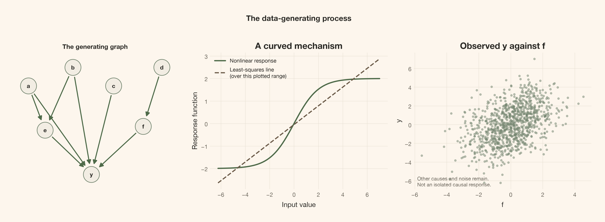
<figcaption>Figure 3: Linear upstream relationships and five saturating effects into y. The middle panel shows PyMC-Marketing’s Michaelis–Menten response after the declared softplus exposure link. The scatter shows y against f with the other parent contributions and noise still present; it is not an isolated causal response curve.</figcaption>
</figure>

# What earns a graph probability?

For a DAG G, Bayes’ rule gives

p(G\mid D)\propto p(D\mid G)\\\pi(G),\qquad p(D\mid G)=\int p(D\mid\theta_G,G)\\p(\theta_G\mid G)\\d\theta_G.

The integral averages the likelihood over the **parameter prior**, not over fitted posterior draws. We do not fit each graph, take its best likelihood, and call that a posterior probability.

## One proper score for every candidate mechanism

Each node’s mechanism is additive in its parents’ features. With the declared location and scale, let z_j=(X_j-\mathrm{loc}\_j)/\mathrm{scale}\_j. Upstream mechanisms use just \phi_i(z_j)=\[z_j\] for i\ne y. Only the outcome mechanism gets a nonlinear feature block:

\phi_y(z_j)=\left\[z_j,\\ \exp\\\left(-\tfrac12\left(\tfrac{z_j-c_1}{w}\right)^2\right),\\\ldots,\\ \exp\\\left(-\tfrac12\left(\tfrac{z_j-c_K}{w}\right)^2\right)\right\],

and the mechanism for node i is

X_i=\alpha_i+\sum\_{j\in\mathrm{Pa}\_i(G)}\beta\_{ij}^\top\phi_i(z_j)+\varepsilon_i, \qquad \varepsilon_i\sim\mathcal N(0,\sigma_i^2).

Three properties matter. The dictionary is fixed **before** scoring, so no candidate graph gets a bespoke feature map. The features live in declared z units while the target stays **raw** — no sample centering, no learned constants. And the prior is proper: an explicit intercept with its own precision, Gaussian coefficients, and an inverse-gamma noise variance. Each graph is one joint generative model shared over all rows, so its evidence factors over nodes:

\log p(D\mid G)=\sum\_{i=1}^{n}\log p\\\left(x_i\mid x\_{\mathrm{Pa}\_i(G)}\right).

Integrated local evidence for one mechanism

For a candidate parent set P of node i, ordered by node index, the design matrix X\in\mathbb R^{N\times p} carries an intercept column followed by each parent’s block \phi_i(z_j); the target stays in raw units. The prior is normal-inverse-gamma: with v=\sigma_i^2,

v\sim\operatorname{InvGamma}(\alpha_0,\beta_0),\qquad \theta\mid v\sim\mathcal N\\\left(0,\\v\Lambda_0^{-1}\right),\qquad \Lambda_0=\operatorname{diag}(\tau_0,\lambda,\ldots,\lambda),

where \theta runs over the intercept and then the feature blocks. Then

\Lambda_n=\Lambda_0+X^\top X,\qquad m_n=\Lambda_n^{-1}X^\top y,\qquad a_n=\alpha_0+\tfrac N2,\qquad b_n=\beta_0+\tfrac12\left(\lVert y-Xm_n\rVert^2+m_n^\top\Lambda_0 m_n\right),

and the integrated evidence is

\log p(y\mid X)=-\frac N2\log 2\pi +\frac12\left(\log\lvert\Lambda_0\rvert-\log\lvert\Lambda_n\rvert\right) +\alpha_0\log\beta_0-a_n\log b_n+\log\Gamma(a_n)-\log\Gamma(\alpha_0).

There is **no Jacobian factor**: the target stays raw and the predictor transform is fixed before scoring. With N=0, log evidence is exactly 0 and the parameter posterior equals its prior; the graph sampler then targets the graph prior. Under the conditional-v prior, \tau_0 and \lambda are dimensionless precision multipliers, while \beta_0 has **squared target units**. Changing a variable’s units by x_i'=c\\x_i requires \beta\_{0i}'=c^2\beta\_{0i} and compatible predictor location/scale changes; it leaves \tau_0,\lambda,\alpha_0 unchanged. Here \beta_0=1 matches the generating unit noise variance by design. \operatorname{IG}(2,1) has mean 1 and infinite variance; \mathbb E\[\sigma\] is not 1. Cholesky solves and the residual-plus-prior expression for b_n avoid subtracting nearly equal y^\top y quantities. This construction is **not guaranteed score-equivalent**: Markov-equivalent DAGs need not receive equal evidence.

The local table stores \log p(x_i\mid x_P)-\log p(x_i) for every node and parent set: a subtracted, graph-independent constant per node. Summing table entries therefore reproduces \log p(D\mid G) up to one constant shared by all graphs, so posterior weights are unchanged; the absolute sum is available separately for reporting.

``` sourceCode
score = BasisScore(data, nonlinear_nodes=(y_index,), centers=centers, width=width,
                   loc=loc, scale=scale, tau0=tau0, lam=lam, alpha0=alpha0, beta0=beta0)
linear_score = BasisScore(data, nonlinear_nodes=(), centers=(), width=width,
                          loc=loc, scale=scale, tau0=tau0, lam=lam, alpha0=alpha0, beta0=beta0)
print(f"Upstream: linear; y: 1 linear term + {len(centers)} bumps per parent. "
      "The linear comparator drops only y's bumps.")
```

    Upstream: linear; y: 1 linear term + 2 bumps per parent. The linear comparator drops only y's bumps.

The controlled comparator drops only y’s bumps (K=0): same priors, same mask, same sampler. All upstream mechanisms remain linear in both fits, so differences downstream belong to the outcome dictionary.

A few local entries make the “finite relative scores” concrete. They are small numbers with no units, and every value is finite — including families that look hopeless.

Relative local evidence for a few families of y

``` sourceCode
family_masks = {
    "no parents": 0,
    "a only": 1 << 0,
    "d only": 1 << 3,
    "f only": 1 << 5,
    "a, b, c, e, f (generating)": 55,
    "all six candidates": (1 << n_nodes) - 1 - (1 << y_index),
}
local_rows = [
    {"Parents of y": name,
     "Nonlinear dictionary": score.table[y_index, mask],
     "Linear dictionary": linear_score.table[y_index, mask]}
    for name, mask in family_masks.items()
]
display(article_table(
    pd.DataFrame(local_rows),
    "Local evidence of y's families, relative to the intercept-only family",
    formats={"Nonlinear dictionary": "{:.2f}", "Linear dictionary": "{:.2f}"},
))
```

<figure class="quarto-float quarto-float-tbl figure">
<table id="T_e0f2a" class="caption-top table table-sm table-striped small" data-quarto-postprocess="true">
<thead>
<tr class="header">
<th id="T_e0f2a_level0_col0" class="col_heading level0 col0" data-quarto-table-cell-role="th">Parents of y</th>
<th id="T_e0f2a_level0_col1" class="col_heading level0 col1" data-quarto-table-cell-role="th">Nonlinear dictionary</th>
<th id="T_e0f2a_level0_col2" class="col_heading level0 col2" data-quarto-table-cell-role="th">Linear dictionary</th>
</tr>
</thead>
<tbody>
<tr class="odd">
<td id="T_e0f2a_row0_col0" class="data row0 col0">no parents</td>
<td id="T_e0f2a_row0_col1" class="data row0 col1">0.00</td>
<td id="T_e0f2a_row0_col2" class="data row0 col2">0.00</td>
</tr>
<tr class="even">
<td id="T_e0f2a_row1_col0" class="data row1 col0">a only</td>
<td id="T_e0f2a_row1_col1" class="data row1 col1">142.98</td>
<td id="T_e0f2a_row1_col2" class="data row1 col2">146.17</td>
</tr>
<tr class="odd">
<td id="T_e0f2a_row2_col0" class="data row2 col0">d only</td>
<td id="T_e0f2a_row2_col1" class="data row2 col1">40.91</td>
<td id="T_e0f2a_row2_col2" class="data row2 col2">45.57</td>
</tr>
<tr class="even">
<td id="T_e0f2a_row3_col0" class="data row3 col0">f only</td>
<td id="T_e0f2a_row3_col1" class="data row3 col1">111.75</td>
<td id="T_e0f2a_row3_col2" class="data row3 col2">113.54</td>
</tr>
<tr class="odd">
<td id="T_e0f2a_row4_col0" class="data row4 col0">a, b, c, e, f (generating)</td>
<td id="T_e0f2a_row4_col1" class="data row4 col1">731.36</td>
<td id="T_e0f2a_row4_col2" class="data row4 col2">714.63</td>
</tr>
<tr class="even">
<td id="T_e0f2a_row5_col0" class="data row5 col0">all six candidates</td>
<td id="T_e0f2a_row5_col1" class="data row5 col1">723.56</td>
<td id="T_e0f2a_row5_col2" class="data row5 col2">710.59</td>
</tr>
</tbody>
</table>
<figcaption>Table 1: Local evidence of y's families, relative to the intercept-only family</figcaption>
</figure>

# Graph prior and hard knowledge

First, assign a categorical state to each unordered pair: absent, forward, or backward. A source-by-target matrix P gives the three local probabilities

q\_{ij}=\big\[1-P\_{ij}-P\_{ji},\\P\_{ij},\\P\_{ji}\big\].

Before any restriction, P\_{ij}=(1-\delta\_{ij})/3, so each pair starts at (1/3,1/3,1/3). Our **baseline** rules out self loops and every outgoing arrow from y. The mask leaves absence and i\rightarrow y at 0.5 each; core pairs keep (1/3,1/3,1/3). These are **local** probabilities before conditioning on global acyclicity, not marginals in the DAG prior. Later, we will add one restriction: f\not\rightarrow d.

``` sourceCode
direction_prior = pd.DataFrame(
    (1 - np.eye(n_nodes)) / 3, index=labels, columns=labels,
)
allowed = pd.DataFrame(
    ~np.eye(n_nodes, dtype=bool), index=labels, columns=labels,
)
allowed.loc["y", :] = False

baseline_probs = pair_probabilities(
    direction_prior.to_numpy(), allowed.to_numpy(),
)
```

The Boolean mask is **background knowledge**, not an inference from the correlations. It would be appropriate if y is an outcome that cannot cause the other recorded variables. In this synthetic example it is true, but we still have not supplied its five parents. Exact zeros remove forbidden states; small positive probabilities would only discourage them.

Code

``` sourceCode
fig_prior, fig_support = plot_graph_prior(direction_prior.to_numpy(), allowed.to_numpy(), labels)
plt.show()
```

<figure class="quarto-float quarto-float-fig figure">
<figure class="quarto-float quarto-subfloat-fig figure">
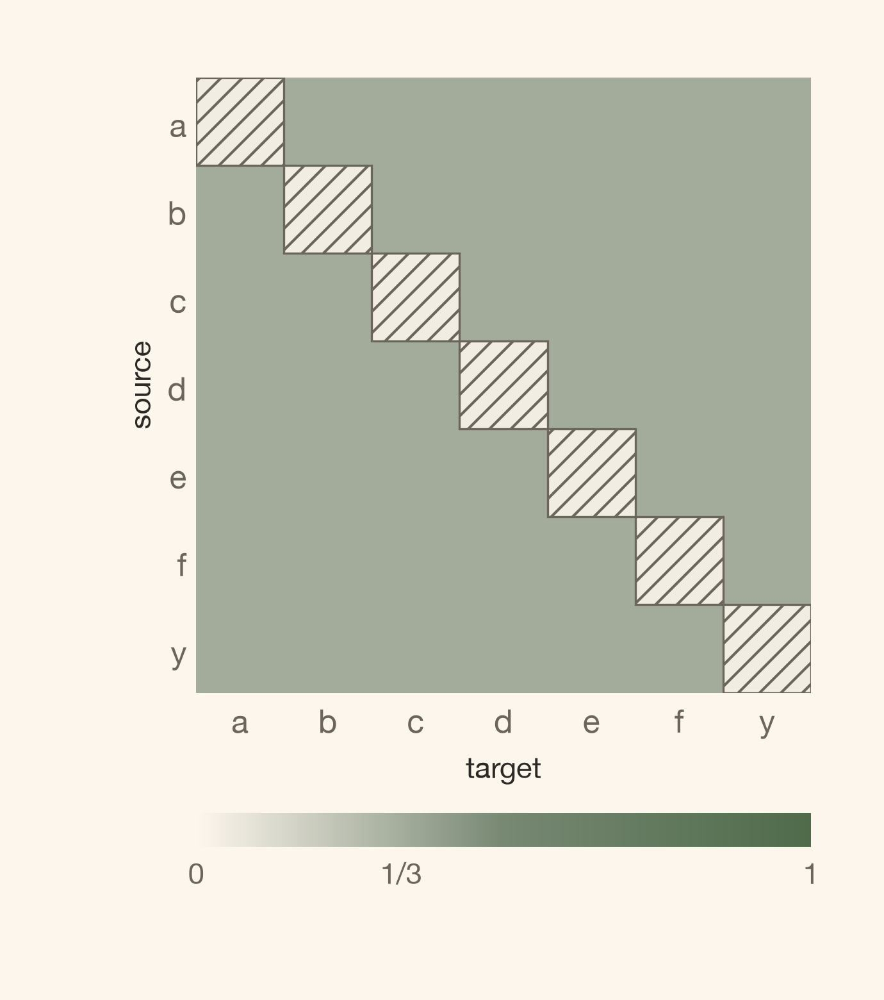
<figcaption>(a) Local directional prior</figcaption>
</figure>
<figure class="quarto-float quarto-subfloat-fig figure">
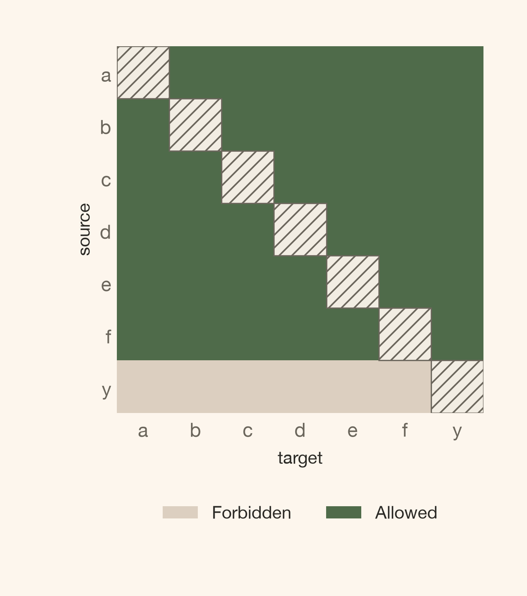
<figcaption>(b) Hard restrictions</figcaption>
</figure>
<figcaption>Figure 4: One graph prior, two layers. Off-diagonal direction probabilities are 1/3 before masking (a); the baseline mask forbids self arrows and y’s outgoing arrows (b). Rows are sources, columns are targets, and hatching marks impossible self arrows. These are local probabilities, not DAG-prior marginals.</figcaption>
</figure>

## Learn terminal parents exactly, then run MCMC on the remaining structure

Once y has no outgoing arrows, any subset of the other six variables can be its parents without creating a cycle. Under our fixed pairwise graph prior and the decomposable local scores, the parent-set distribution of y separates from the remaining graph:

p(G\_{-y},\mathrm{Pa}\_y\mid D,K) =p(G\_{-y}\mid D,K)\\p(\mathrm{Pa}\_y\mid D,K),

where K is the terminal-node restriction. We can normalize the weights of all 2^6=64 parent sets for y exactly, while MCMC explores the unresolved graph G\_{-y} among the other six variables. After each cold-chain update, an independent draw of \mathrm{Pa}\_y reconstructs a **full seven-node DAG**. We have reduced the sampling problem, not fixed the answer.

``` sourceCode
terminal_posteriors = terminal_parent_distributions(
    score.table, pairs, baseline_probs,
)
```

Count the search space without enumerating full graphs

``` sourceCode
dag_counts = [1]
for size in range(1, n_nodes + 1):
    dag_counts.append(sum(
        (-1) ** (sinks + 1) * comb(size, sinks)
        * 2 ** (sinks * (size - sinks)) * dag_counts[size - sinks]
        for sinks in range(1, size + 1)
    ))
core_nodes = n_nodes - len(terminal_posteriors)
terminal_combinations = prod(len(masks) for masks, _ in terminal_posteriors.values())
space = pd.DataFrame({
    "Quantity": [
        "Admissible full DAGs", "DAG states left to MCMC",
        "Pairs in MCMC proposals", "Admissible local parent sets",
    ],
    "Unrestricted": [
        dag_counts[n_nodes], dag_counts[n_nodes],
        len(pairs), n_nodes * 2 ** (n_nodes - 1),
    ],
    "Mask + terminal reduction": [
        dag_counts[core_nodes] * terminal_combinations, dag_counts[core_nodes],
        len(pairs_for(core_nodes)), sum(2 ** int(count) for count in allowed.sum(axis=0)),
    ],
})
display(article_table(
    space, "Search-space sizes for this mask, not measured runtime speedups",
    formats={"Unrestricted": "{:,.0f}", "Mask + terminal reduction": "{:,.0f}"},
))
```

<figure class="quarto-float quarto-float-tbl figure">
<table id="T_295e1" class="caption-top table table-sm table-striped small" data-quarto-postprocess="true">
<thead>
<tr class="header">
<th id="T_295e1_level0_col0" class="col_heading level0 col0" data-quarto-table-cell-role="th">Quantity</th>
<th id="T_295e1_level0_col1" class="col_heading level0 col1" data-quarto-table-cell-role="th">Unrestricted</th>
<th id="T_295e1_level0_col2" class="col_heading level0 col2" data-quarto-table-cell-role="th">Mask + terminal reduction</th>
</tr>
</thead>
<tbody>
<tr class="odd">
<td id="T_295e1_row0_col0" class="data row0 col0">Admissible full DAGs</td>
<td id="T_295e1_row0_col1" class="data row0 col1">1,138,779,265</td>
<td id="T_295e1_row0_col2" class="data row0 col2">242,016,192</td>
</tr>
<tr class="even">
<td id="T_295e1_row1_col0" class="data row1 col0">DAG states left to MCMC</td>
<td id="T_295e1_row1_col1" class="data row1 col1">1,138,779,265</td>
<td id="T_295e1_row1_col2" class="data row1 col2">3,781,503</td>
</tr>
<tr class="odd">
<td id="T_295e1_row2_col0" class="data row2 col0">Pairs in MCMC proposals</td>
<td id="T_295e1_row2_col1" class="data row2 col1">21</td>
<td id="T_295e1_row2_col2" class="data row2 col2">15</td>
</tr>
<tr class="even">
<td id="T_295e1_row3_col0" class="data row3 col0">Admissible local parent sets</td>
<td id="T_295e1_row3_col1" class="data row3 col1">448</td>
<td id="T_295e1_row3_col2" class="data row3 col2">256</td>
</tr>
</tbody>
</table>
<figcaption>Table 2: Search-space sizes for this mask, not measured runtime speedups</figcaption>
</figure>

The counts use the fact that this mask leaves the six-node core unrestricted; the sink-set recurrence counts DAGs without listing them. The local table grows like n\\2^{n-1}, and that memory growth — not any integer maximum — is what limits how far this demo scales.

## The graph is a PyMC random variable

`pymc.dims` uses **dimension names in tensor operations**, rather than merely attaching labels to positional arrays. We use ordinary PyTensor indexing to put each pair’s state directly into an adjacency matrix, then name its axes `parent` and `child`. Named `.isel(mask=parents)` selects each node’s current parent-set score. Concrete initial values and the Numba sampler’s mutable arrays remain NumPy arrays; they are not symbolic tensors.

``` sourceCode
def make_graph_model(score, pair_probs, labels):
    """One dataset, one unknown DAG; mechanisms are integrated out."""
    pairs = pairs_for(len(labels))
    coords = {
        "node": labels, "parent": labels, "child": labels,
        "pair": [f"{labels[i]}–{labels[j]}" for i, j in pairs],
        "state": ["absent", "forward", "backward"],
        "mask": np.arange(2 ** len(labels)),
    }
    with pm.Model(coords=coords) as model:
        probabilities = pmd.as_xtensor(pair_probs, dims=("pair", "state"))
        initial = initial_states(
            pair_probs, pairs, len(labels), np.random.default_rng(0), empty=True,
        )
        edge = pmd.Categorical("edge", p=probabilities, core_dims="state", initval=initial)
        i, j = pairs.T
        state = edge.values
        adjacency = pt.zeros((len(labels), len(labels)), dtype="int64")
        adjacency = pt.set_subtensor(adjacency[i, j], pt.eq(state, 1))
        adjacency = pt.set_subtensor(adjacency[j, i], pt.eq(state, 2))
        adjacency = pmd.as_xtensor(adjacency, dims=("parent", "child"))
        bits = pmd.as_xtensor(1 << np.arange(len(labels)), dims=("parent",))
        parents = (adjacency * bits).sum("parent").rename({"child": "node"})
        local_score = pmd.as_xtensor(score.table, dims=("node", "mask"))
        evidence = local_score.isel(mask=parents).sum("node")
        reach = adjacency.astype("bool")
        for k in range(len(labels)):
            reach = reach | (reach.isel(child=k) & reach.isel(parent=k))
        diagonal = pmd.as_xtensor(np.eye(len(labels), dtype=bool), dims=("parent", "child"))
        cycle = (reach & diagonal).any()
        pmd.Potential("dag_support", ptx.where(cycle, -np.inf, 0.0))
        pmd.Potential("marginal_likelihood", evidence)
        pmd.Deterministic("log_evidence", evidence)
        pmd.Deterministic("edge_count", ptx.math.neq(edge, 0).sum("pair"))
    return model
```

The categorical prior gives forbidden states zero support, while transitive closure independently rejects directed cycles. `marginal_likelihood` supplies the integrated likelihood of the **whole dataset**. This is one model with an unknown graph, not one graph per row or a separate fit per candidate.

We can inspect this model with PyMC’s own Graphviz visualization. <a href="#fig-pymc-graph-model" class="quarto-xref">Figure 5</a> shows the **probabilistic program**, not a sampled causal DAG or its CPDAG. The `edge` vector contains the unknown pair states; the other nodes impose graph support, add the collapsed likelihood, or record summaries. The regression coefficients and noise scales do not appear because we integrated them out. Likewise, the data enter through the precomputed score table, not a row-level observed random variable.

``` sourceCode
graph_model = make_graph_model(score, baseline_probs, labels)
model_graph = pm.model_to_graphviz(graph_model)
model_graph.graph_attr.update(bgcolor=COLORS["bg"], fontname="Inter, Helvetica, Arial, sans-serif",
                              fontcolor=COLORS["ink"], color=COLORS["primary"])
model_graph.node_attr.update(fontname="Inter, Helvetica, Arial, sans-serif", fontcolor=COLORS["ink"],
                             color=COLORS["primary"], fillcolor=COLORS["surface_alt"])
model_graph.edge_attr.update(color=COLORS["green_strong"])
model_graph
```

<figure class="quarto-float quarto-float-fig figure">
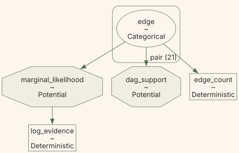
<figcaption>Figure 5: One categorical vector represents the unknown causal graph. PyMC’s dependency graph shows how its states determine the support, collapsed likelihood, and recorded summaries; its arrows are not causal claims about a through y.</figcaption>
</figure>

## Moving between graphs

NUTS cannot move through discrete graph states. We use a Metropolis kernel compiled with Numba and registered as a PyMC step. A proposal chooses a mutable core pair uniformly, then draws uniformly from **all its supported states, including the current state**. Self-proposals prevent deterministic alternation when only two states remain. Cyclic proposals are also retained as self-transitions; we do not redraw until an acyclic proposal appears. The support is fixed, so the proposal is symmetric and its Metropolis acceptance probability is

\min\left(1,\exp\\\log p(D\mid G')-\log p(D\mid G) +\log\pi(G')-\log\pi(G)\\\right).

The kernel keeps rejected states. Keeping only accepted graphs would produce the wrong distribution.

Local moves can get stuck behind low-probability intermediate graphs. We therefore run parallel tempering on the reduced core: replicas target p(D\_{\rm core}\mid G\_{-y})^\beta\pi\_{\rm core}(G\_{-y}), where the likelihood notation denotes the original core-node local scores, not a refitted six-variable prior. Terminal-parent normalizing constants depend on \beta but not on the core graph, so they cancel from swap ratios. Only the \beta=1 core replica supplies posterior draws; we then sample terminal parents from their exact \beta=1 distribution. A hot graph is not an additional posterior draw.

Independent starts and the PyMC sampling call

``` sourceCode
def fit_graphs(score, probabilities, labels, *, seed, draws, tune, betas, chains=4):
    """Sample unresolved core directions and reconstruct full posterior DAGs."""
    local_pairs = pairs_for(len(labels))
    starts_rng = np.random.default_rng(seed)
    starts = [
        {"edge": initial_states(
            probabilities, local_pairs, len(labels), starts_rng, empty=(chain == 0),
        )}
        for chain in range(chains)
    ]
    with make_graph_model(score, probabilities, labels) as model:
        step = TemperedGraphStep(
            [model["edge"]], score.table, local_pairs, probabilities, betas,
        )
        return pm.sample(
            draws=draws, tune=tune, chains=chains, cores=1,
            step=step, initvals=starts, random_seed=seed,
            progressbar=False, compute_convergence_checks=False,
        )
```

The initializer assigns random topological ranks and constructs pair states directly. It respects forbidden and required states without a parent-mask roundtrip. It is only an initializer: **it does not draw from the graph prior**. The true masked acyclic prior appears later through a zero-data score, and we will diagnose that chain too.

# How do we diagnose a model of models?

First, we check the sampling, not whether our assumptions are right. **Do independent runs give similar probabilities for the same graph questions?** If one run stays near one graph and another stays near a different graph, combining their draws can hide the problem. Predictive checks come later; they ask a different question.

We use four chains, each with its own starting graph. Rather than diagnose arbitrary graph IDs, we turn each draw into yes/no answers:

- Does it belong to the **generating graph’s equivalence class** — graphs with the same conditional-independence claims? We know this class only because we generated the data.
- Is there a directed path from d to y?
- Is there an arrow from d to f, or from f to d? We track the directions separately, since absence is a third possible state.

The fraction of “yes” answers estimates each event’s posterior probability. A path is a structural connection, not a measure of effect size. We find it by following arrows (`has_path`), not by multiplying coefficients.

We fit the nonlinear model and the linear comparator with the same data and sampler settings. The displays here diagnose the nonlinear run; the comparator’s checks appear in the robustness table.

Fit the nonlinear posterior and the controlled linear comparator

``` sourceCode
posterior = fit_graphs(
    score, baseline_probs, labels,
    seed=SAMPLING_SEED, draws=draws, tune=tune, betas=betas, chains=chains,
)
linear_posterior = fit_graphs(
    linear_score, baseline_probs, labels,
    seed=SAMPLING_SEED, draws=draws, tune=tune, betas=betas, chains=chains,
)
```

How graph draws become ArviZ diagnostics

**ArviZ computes the diagnostics; our code defines what to diagnose.** We use its modular APIs: `arviz_base` (`azb`) and `arviz_stats` (`azs`).

The edge codes 0 = absent, 1 = forward, and 2 = backward are labels. Their average is not an edge probability. We instead diagnose a binary indicator for each pair state and for class membership, keeping the original chain and draw order.

`graph_summary` groups DAGs by skeleton and unshielded colliders and records directed paths. We classify each distinct DAG once, then map the answers back to **every retained draw**. Diagnosing only unique DAGs would discard both their frequencies and their autocorrelation.

Map graph draws into labeled events for ArviZ

``` sourceCode
def graph_summary(trace, pairs, n_nodes, truth_key, d_index, y_index):
    """Aggregate DAGs into equivalence classes, retaining per-draw membership."""
    states = trace.posterior.edge.values
    unique, inverse, counts = np.unique(states.reshape(-1, len(pairs)), axis=0,
                                        return_inverse=True, return_counts=True)
    graphs = [states_to_parents(state, pairs, n_nodes) for state in unique]
    keys = [mec_key(graph) for graph in graphs]
    class_counts, class_members, representative = Counter(), Counter(), {}
    for key, graph, count in zip(keys, graphs, counts):
        class_counts[key] += int(count)
        class_members[key] += 1
        representative[key] = graph
    ranked = [key for key, _ in class_counts.most_common()]
    class_lookup = {key: index for index, key in enumerate(ranked)}
    class_id = np.array([class_lookup[key] for key in keys])[inverse].reshape(states.shape[:2])
    paths = np.array([
        has_path(graph, d_index, y_index) for graph in graphs
    ])[inverse].reshape(states.shape[:2])
    true_class = (class_id == class_lookup[truth_key]) if truth_key in class_lookup \
        else np.zeros_like(paths)
    return {"states": states, "graphs": graphs, "keys": keys, "ranked": ranked,
            "class_counts": class_counts, "class_members": class_members,
            "representative": representative, "class_id": class_id,
            "true_class": true_class, "path": paths}


def graph_diagnostic_data(trace, summary, probabilities, labels, pairs):
    """Prepare chain-by-draw graph events; leave all diagnostics to ArviZ."""
    states = summary["states"]
    names, events, fixed = [], [], []
    for k, (i, j) in enumerate(pairs):
        for state, name in [(0, f"{labels[i]}–{labels[j]} absent"),
                            (1, f"{labels[i]}→{labels[j]}"), (2, f"{labels[j]}→{labels[i]}")]:
            names.append(name)
            events.append(states[..., k] == state)
            fixed.append(probabilities[k, state] == 0 or np.count_nonzero(probabilities[k]) == 1)
    for index in range(min(4, len(summary["ranked"]))):
        names.append(f"Class {index + 1}")
        events.append(summary["class_id"] == index)
        fixed.append(False)
    names += ["Generating class", "d has a path to y"]
    events += [summary["true_class"], summary["path"]]
    fixed = np.asarray(fixed + [False, False])
    values = np.stack(events, axis=-1).astype(float)
    varying = np.ptp(values, axis=(0, 1)) > 0
    quantities = {"event": values[..., varying]}
    constant_summaries = []
    for name in ("edge_count", "log_evidence"):
        value = trace.posterior[name].values
        if np.ptp(value) > 0:
            quantities[name] = value
        else:
            constant_summaries.append(name)
    data = azb.from_dict(
        {"posterior": quantities},
        dims={"event": ["graph_event"]},
        coords={"graph_event": np.asarray(names)[varying]},
    )
    data["posterior"].attrs.update(
        fixed_indicators=int(fixed.sum()),
        other_constant_indicators=int((~varying & ~fixed).sum()),
        constant_summaries=", ".join(constant_summaries),
    )
    return data


summary = graph_summary(posterior, pairs, n_nodes, truth_key, d_index, y_index)
```

Compute diagnostics for every varying graph event

``` sourceCode
diagnostic_data = graph_diagnostic_data(posterior, summary, baseline_probs, labels, pairs)
diagnostics = azs.summary(diagnostic_data, ci_prob=0.95, round_to="none")
```

## Do the chains give similar answers?

Each row below is one chain. Dots close together mean that independent runs give similar estimates for that question. The short bars show Monte Carlo error: variation from using a finite number of correlated draws, not uncertainty about which graph is true.

Code

``` sourceCode
df_row = next(k for k, pair in enumerate(pairs) if tuple(pair) == (d_index, f_index))
diagnostic_events = [
    ("Generating graph's class", summary["true_class"]),
    ("A directed path from d to y", summary["path"]),
    ("An arrow from d to f", summary["states"][..., df_row] == 1),
]
chain_colors = [PALETTE[i] for i in (0, 3, 4, 5)]
chain_markers = ("o", "s", "^", "D")
chain_styles = ("-", "--", "-.", ":")
fig, axes = plt.subplots(3, 1, figsize=(5, 6.5), sharex=True, layout="constrained")
for ax, (title, event) in zip(axes, diagnostic_events):
    for chain in range(chains):
        values = event[chain:chain + 1].astype(float)
        if np.ptp(values) == 0:
            ax.text(0.5, chain + 1, "Constant in this chain: error not estimable",
                    transform=ax.get_yaxis_transform(), ha="center", fontsize=9)
            continue
        probability = float(values.mean())
        mcse = float(azs.mcse(values))
        ax.errorbar(probability, chain + 1, xerr=2 * mcse,
                    fmt=chain_markers[chain], color=chain_colors[chain],
                    capsize=3, markersize=6)
        ax.annotate(f"{probability:.1%}", (probability, chain + 1),
                    xytext=(12, 0), textcoords="offset points",
                    va="center", fontsize=12)
    ax.set(title=title, yticks=range(1, chains + 1),
           yticklabels=[f"Chain {i + 1}" for i in range(chains)],
           ylim=(chains + 0.6, 0.4), xlim=(0, 1),
           xticks=np.linspace(0, 1, 5))
    ax.tick_params(labelsize=11)
    ax.grid(False)
    ax.grid(axis="x", alpha=0.4)
axes[-1].set(xlabel="Estimated posterior probability",
             xticklabels=["0%", "25%", "50%", "75%", "100%"])
plt.show()
```

<figure class="quarto-float quarto-float-fig figure">
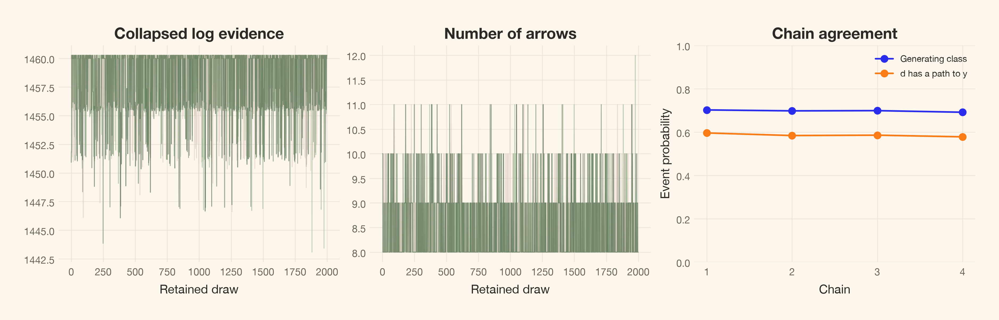
<figcaption>Figure 6: Independent chains give similar estimates for three graph questions. Bars extend two per-chain Monte Carlo standard errors on each side, computed by ArviZ. Agreement on these events does not prove that the chains visited every important graph.</figcaption>
</figure>

The d–f question is useful precisely because the data cannot identify its direction in this world. We will show the exact observational twin below. Agreement between chains means they reproduce the model’s probability split; it does **not** turn that split into a causal discovery.

## Do the estimates keep changing?

Now follow each chain’s answer as draws accumulate. At draw 4,000, for example, the curve uses that chain’s first 4,000 retained graphs. Persistent drift or separated curves would be a warning. Flat curves alone are not enough: all chains could still be stuck in the same region.

Code

``` sourceCode
fig, axes = plt.subplots(3, 1, figsize=(5, 7), sharex=True, sharey=True,
                         layout="constrained")
for ax, (title, event) in zip(axes, diagnostic_events):
    retained = np.arange(1, event.shape[1] + 1)
    running = np.cumsum(event, axis=1) / retained
    for chain in range(chains):
        ax.plot(retained, running[chain], color=chain_colors[chain],
                linestyle=chain_styles[chain], lw=1.3, label=f"Chain {chain + 1}")
    ax.set(title=title, ylabel="Probability", ylim=(0, 1),
           yticks=[0, 0.5, 1], yticklabels=["0%", "50%", "100%"])
    ax.tick_params(labelsize=11)
    ax.grid(False)
    ax.grid(axis="y", alpha=0.4)
axes[0].legend(frameon=False, ncol=2, loc="lower right", fontsize=10)
axes[-1].set(xlabel="Retained draws in each chain", xlim=(0, retained[-1]),
             xticks=[0, 4000, 8000, 12000],
             xticklabels=["0", "4,000", "8,000", "12,000"])
plt.show()
```

<figure class="quarto-float quarto-float-fig figure">

<figcaption>Figure 7: Per-chain running probabilities show how estimates change over all retained draws. Stable averages describe the graphs visited; they do not bound the probability of graphs never visited. Line styles distinguish chains as well as colors.</figcaption>
</figure>

## How much simulation error remains?

**ArviZ checks more than the three plotted questions.** We monitor every varying pair-state indicator, membership in the four most frequent classes and the generating class, the d-to-y path, arrow count, and log evidence.

- **\widehat R** compares variation within and between chains. Values close to 1 are reassuring; values above 1.01 deserve investigation.
- **Effective draws (ESS)** account for dependence between draws. Saving 48,000 graphs does not give us 48,000 independent answers.
- **MC error (MCSE)** measures simulation error in an estimated probability. We report it in percentage points: 0.4 means 0.004 on the probability scale. It is not uncertainty about a causal effect.

The table shows probabilities and MC errors. We summarize \widehat R and ESS across all monitored quantities below; their per-quantity values remain in the expandable details.

Show probability estimates and their simulation error

``` sourceCode
event_rows = [
    ("Generating graph's class", "event[Generating class]"),
    ("A directed path from d to y", "event[d has a path to y]"),
    ("An arrow from d to f", "event[d→f]"),
    ("An arrow from f to d", "event[f→d]"),
]
probability_rows = []
for label, key in event_rows:
    if key not in diagnostics.index:
        probability_rows.append({
            "Graph question": label, "Probability": "Constant in retained draws",
            "MC error (pp)": "Not estimable",
        })
        continue
    row = diagnostics.loc[key]
    probability_rows.append({
        "Graph question": label, "Probability": f"{row['mean']:.1%}",
        "MC error (pp)": f"{100 * row['mcse_mean']:.2f}",
    })
display(article_table(
    pd.DataFrame(probability_rows),
    "Probability estimates and simulation error, not a test of the causal assumptions",
))
event_mask = diagnostics.index.str.startswith("event[")
display(Markdown(
    f"Across **{int(event_mask.sum())} varying graph events** and the varying scalar summaries, "
    f"the largest $\\widehat R$ is **{diagnostics.r_hat.max():.4f}**; "
    f"the smallest bulk and tail ESS are **{diagnostics.ess_bulk.min():,.0f}** "
    f"and **{diagnostics.ess_tail.min():,.0f}**. "
    f"The largest event MC error is **"
    f"{100 * diagnostics.loc[event_mask, 'mcse_mean'].max():.2f} percentage points**."
))
```

<figure class="quarto-float quarto-float-tbl figure">
<table id="T_3bad1" class="caption-top table table-sm table-striped small" data-quarto-postprocess="true">
<thead>
<tr class="header">
<th id="T_3bad1_level0_col0" class="col_heading level0 col0" data-quarto-table-cell-role="th">Graph question</th>
<th id="T_3bad1_level0_col1" class="col_heading level0 col1" data-quarto-table-cell-role="th">Probability</th>
<th id="T_3bad1_level0_col2" class="col_heading level0 col2" data-quarto-table-cell-role="th">MC error (pp)</th>
</tr>
</thead>
<tbody>
<tr class="odd">
<td id="T_3bad1_row0_col0" class="data row0 col0">Generating graph's class</td>
<td id="T_3bad1_row0_col1" class="data row0 col1">69.8%</td>
<td id="T_3bad1_row0_col2" class="data row0 col2">0.40</td>
</tr>
<tr class="even">
<td id="T_3bad1_row1_col0" class="data row1 col0">A directed path from d to y</td>
<td id="T_3bad1_row1_col1" class="data row1 col1">58.6%</td>
<td id="T_3bad1_row1_col2" class="data row1 col2">0.35</td>
</tr>
<tr class="odd">
<td id="T_3bad1_row2_col0" class="data row2 col0">An arrow from d to f</td>
<td id="T_3bad1_row2_col1" class="data row2 col1">56.7%</td>
<td id="T_3bad1_row2_col2" class="data row2 col2">0.35</td>
</tr>
<tr class="even">
<td id="T_3bad1_row3_col0" class="data row3 col0">An arrow from f to d</td>
<td id="T_3bad1_row3_col1" class="data row3 col1">43.3%</td>
<td id="T_3bad1_row3_col2" class="data row3 col2">0.35</td>
</tr>
</tbody>
</table>
<figcaption>Table 3: Probability estimates and simulation error, not a test of the causal assumptions</figcaption>
</figure>

Across **50 varying graph events** and the varying scalar summaries, the largest \widehat R is **1.0003**; the smallest bulk and tail ESS are **12,777** and **12,908**. The largest event MC error is **0.40 percentage points**.

These checks give evidence about sampling **under our chosen model**. They cannot detect a missing cause or prove that every important region was visited. A row marked “constant” is not evidence of perfect convergence. If the diagnostics look poor, run more chains or draws on the **same data**; do not generate a new dataset to get a nicer result.

Sampler movement and the full diagnostic details

Arrow count and collapsed log evidence summarize graph size and fit. Their traces help reveal runs occupying different regions, but similar scores do not mean similar graphs. Here we show the first 2,000 retained draws; the running-probability plots above use the full run.

Code

``` sourceCode
fig, axes = plt.subplots(2, 1, figsize=(8, 5), sharex=True, layout="constrained")
for chain in range(chains):
    for ax, variable in zip(axes, ("log_evidence", "edge_count")):
        ax.plot(posterior.posterior[variable].values[chain, :2000],
                alpha=0.6, lw=0.7, color=chain_colors[chain],
                linestyle=chain_styles[chain], label=f"Chain {chain + 1}")
axes[0].set(title="Collapsed log evidence", ylabel="Log evidence")
axes[0].legend(frameon=False, ncol=4, fontsize=9)
axes[1].set(title="Number of arrows", ylabel="Arrows", xlabel="Retained draw")
plt.show()
```

<figure class="quarto-float quarto-float-fig figure">
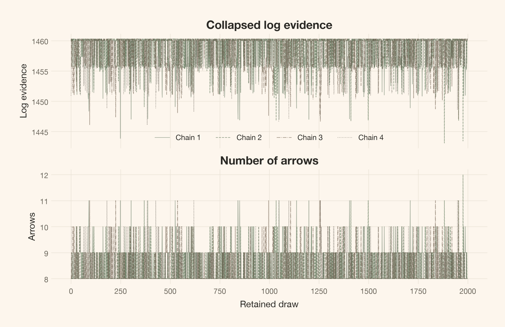
<figcaption>Figure 8: Arrow count and collapsed log evidence provide additional checks of sampler movement. Matching scalar traces cannot establish agreement on graph structure.</figcaption>
</figure>

The table below keeps native units: event means and MC errors are probabilities, arrow-count errors are in arrows, and log-evidence errors are in log-score units. Bulk and tail ESS and rank-normalized \widehat R all come from ArviZ.

Inspect all monitored quantities and constant indicators

``` sourceCode
display(article_table(
    diagnostics[["mean", "mcse_mean", "ess_bulk", "ess_tail", "r_hat"]]
        .rename(columns={"mean": "Mean", "mcse_mean": "MCSE",
                         "ess_bulk": "Bulk ESS", "ess_tail": "Tail ESS", "r_hat": "R-hat"})
        .reset_index(names="Quantity"),
    "All varying graph-event and scalar diagnostics (native units)",
    formats={"Mean": "{:.4f}", "MCSE": "{:.4f}", "Bulk ESS": "{:,.0f}",
             "Tail ESS": "{:,.0f}", "R-hat": "{:.4f}"},
))
metadata = diagnostic_data["posterior"].attrs
display(Markdown(
    f"**{metadata['fixed_indicators']} indicators are fixed by pair support; "
    f"{metadata['other_constant_indicators']} other indicators are constant in the retained draws.** "
    "Their diagnostics are not estimable."
))
if metadata["constant_summaries"]:
    display(Markdown(
        f"Constant scalar summaries, also not diagnosable: {metadata['constant_summaries']}."
    ))
```

<figure class="quarto-float quarto-float-tbl figure">
<table id="T_f46d8" class="caption-top table table-sm table-striped small" data-quarto-postprocess="true">
<thead>
<tr class="header">
<th id="T_f46d8_level0_col0" class="col_heading level0 col0" data-quarto-table-cell-role="th">Quantity</th>
<th id="T_f46d8_level0_col1" class="col_heading level0 col1" data-quarto-table-cell-role="th">Mean</th>
<th id="T_f46d8_level0_col2" class="col_heading level0 col2" data-quarto-table-cell-role="th">MCSE</th>
<th id="T_f46d8_level0_col3" class="col_heading level0 col3" data-quarto-table-cell-role="th">Bulk ESS</th>
<th id="T_f46d8_level0_col4" class="col_heading level0 col4" data-quarto-table-cell-role="th">Tail ESS</th>
<th id="T_f46d8_level0_col5" class="col_heading level0 col5" data-quarto-table-cell-role="th">R-hat</th>
</tr>
</thead>
<tbody>
<tr class="odd">
<td id="T_f46d8_row0_col0" class="data row0 col0">event[a–b absent]</td>
<td id="T_f46d8_row0_col1" class="data row0 col1">0.9575</td>
<td id="T_f46d8_row0_col2" class="data row0 col2">0.0018</td>
<td id="T_f46d8_row0_col3" class="data row0 col3">12,917</td>
<td id="T_f46d8_row0_col4" class="data row0 col4">48,000</td>
<td id="T_f46d8_row0_col5" class="data row0 col5">1.0002</td>
</tr>
<tr class="even">
<td id="T_f46d8_row1_col0" class="data row1 col0">event[a→b]</td>
<td id="T_f46d8_row1_col1" class="data row1 col1">0.0217</td>
<td id="T_f46d8_row1_col2" class="data row1 col2">0.0011</td>
<td id="T_f46d8_row1_col3" class="data row1 col3">18,447</td>
<td id="T_f46d8_row1_col4" class="data row1 col4">18,447</td>
<td id="T_f46d8_row1_col5" class="data row1 col5">1.0002</td>
</tr>
<tr class="odd">
<td id="T_f46d8_row2_col0" class="data row2 col0">event[b→a]</td>
<td id="T_f46d8_row2_col1" class="data row2 col1">0.0208</td>
<td id="T_f46d8_row2_col2" class="data row2 col2">0.0011</td>
<td id="T_f46d8_row2_col3" class="data row2 col3">16,515</td>
<td id="T_f46d8_row2_col4" class="data row2 col4">16,515</td>
<td id="T_f46d8_row2_col5" class="data row2 col5">1.0001</td>
</tr>
<tr class="even">
<td id="T_f46d8_row3_col0" class="data row3 col0">event[a–c absent]</td>
<td id="T_f46d8_row3_col1" class="data row3 col1">0.9678</td>
<td id="T_f46d8_row3_col2" class="data row3 col2">0.0013</td>
<td id="T_f46d8_row3_col3" class="data row3 col3">19,705</td>
<td id="T_f46d8_row3_col4" class="data row3 col4">48,000</td>
<td id="T_f46d8_row3_col5" class="data row3 col5">1.0001</td>
</tr>
<tr class="odd">
<td id="T_f46d8_row4_col0" class="data row4 col0">event[a→c]</td>
<td id="T_f46d8_row4_col1" class="data row4 col1">0.0158</td>
<td id="T_f46d8_row4_col2" class="data row4 col2">0.0008</td>
<td id="T_f46d8_row4_col3" class="data row4 col3">24,035</td>
<td id="T_f46d8_row4_col4" class="data row4 col4">24,035</td>
<td id="T_f46d8_row4_col5" class="data row4 col5">1.0002</td>
</tr>
<tr class="even">
<td id="T_f46d8_row5_col0" class="data row5 col0">event[c→a]</td>
<td id="T_f46d8_row5_col1" class="data row5 col1">0.0164</td>
<td id="T_f46d8_row5_col2" class="data row5 col2">0.0008</td>
<td id="T_f46d8_row5_col3" class="data row5 col3">26,034</td>
<td id="T_f46d8_row5_col4" class="data row5 col4">26,034</td>
<td id="T_f46d8_row5_col5" class="data row5 col5">1.0000</td>
</tr>
<tr class="odd">
<td id="T_f46d8_row6_col0" class="data row6 col0">event[a–d absent]</td>
<td id="T_f46d8_row6_col1" class="data row6 col1">0.9782</td>
<td id="T_f46d8_row6_col2" class="data row6 col2">0.0010</td>
<td id="T_f46d8_row6_col3" class="data row6 col3">20,410</td>
<td id="T_f46d8_row6_col4" class="data row6 col4">48,000</td>
<td id="T_f46d8_row6_col5" class="data row6 col5">1.0001</td>
</tr>
<tr class="even">
<td id="T_f46d8_row7_col0" class="data row7 col0">event[a→d]</td>
<td id="T_f46d8_row7_col1" class="data row7 col1">0.0119</td>
<td id="T_f46d8_row7_col2" class="data row7 col2">0.0007</td>
<td id="T_f46d8_row7_col3" class="data row7 col3">24,984</td>
<td id="T_f46d8_row7_col4" class="data row7 col4">24,984</td>
<td id="T_f46d8_row7_col5" class="data row7 col5">1.0001</td>
</tr>
<tr class="odd">
<td id="T_f46d8_row8_col0" class="data row8 col0">event[d→a]</td>
<td id="T_f46d8_row8_col1" class="data row8 col1">0.0099</td>
<td id="T_f46d8_row8_col2" class="data row8 col2">0.0006</td>
<td id="T_f46d8_row8_col3" class="data row8 col3">25,568</td>
<td id="T_f46d8_row8_col4" class="data row8 col4">25,568</td>
<td id="T_f46d8_row8_col5" class="data row8 col5">1.0002</td>
</tr>
<tr class="even">
<td id="T_f46d8_row9_col0" class="data row9 col0">event[a→e]</td>
<td id="T_f46d8_row9_col1" class="data row9 col1">0.9830</td>
<td id="T_f46d8_row9_col2" class="data row9 col2">0.0010</td>
<td id="T_f46d8_row9_col3" class="data row9 col3">15,752</td>
<td id="T_f46d8_row9_col4" class="data row9 col4">48,000</td>
<td id="T_f46d8_row9_col5" class="data row9 col5">1.0001</td>
</tr>
<tr class="odd">
<td id="T_f46d8_row10_col0" class="data row10 col0">event[e→a]</td>
<td id="T_f46d8_row10_col1" class="data row10 col1">0.0170</td>
<td id="T_f46d8_row10_col2" class="data row10 col2">0.0010</td>
<td id="T_f46d8_row10_col3" class="data row10 col3">15,752</td>
<td id="T_f46d8_row10_col4" class="data row10 col4">15,752</td>
<td id="T_f46d8_row10_col5" class="data row10 col5">1.0001</td>
</tr>
<tr class="even">
<td id="T_f46d8_row11_col0" class="data row11 col0">event[a–f absent]</td>
<td id="T_f46d8_row11_col1" class="data row11 col1">0.9674</td>
<td id="T_f46d8_row11_col2" class="data row11 col2">0.0013</td>
<td id="T_f46d8_row11_col3" class="data row11 col3">19,590</td>
<td id="T_f46d8_row11_col4" class="data row11 col4">48,000</td>
<td id="T_f46d8_row11_col5" class="data row11 col5">1.0002</td>
</tr>
<tr class="odd">
<td id="T_f46d8_row12_col0" class="data row12 col0">event[a→f]</td>
<td id="T_f46d8_row12_col1" class="data row12 col1">0.0174</td>
<td id="T_f46d8_row12_col2" class="data row12 col2">0.0008</td>
<td id="T_f46d8_row12_col3" class="data row12 col3">26,374</td>
<td id="T_f46d8_row12_col4" class="data row12 col4">26,374</td>
<td id="T_f46d8_row12_col5" class="data row12 col5">1.0001</td>
</tr>
<tr class="even">
<td id="T_f46d8_row13_col0" class="data row13 col0">event[f→a]</td>
<td id="T_f46d8_row13_col1" class="data row13 col1">0.0152</td>
<td id="T_f46d8_row13_col2" class="data row13 col2">0.0008</td>
<td id="T_f46d8_row13_col3" class="data row13 col3">26,641</td>
<td id="T_f46d8_row13_col4" class="data row13 col4">26,641</td>
<td id="T_f46d8_row13_col5" class="data row13 col5">1.0001</td>
</tr>
<tr class="odd">
<td id="T_f46d8_row14_col0" class="data row14 col0">event[b–c absent]</td>
<td id="T_f46d8_row14_col1" class="data row14 col1">0.9784</td>
<td id="T_f46d8_row14_col2" class="data row14 col2">0.0010</td>
<td id="T_f46d8_row14_col3" class="data row14 col3">23,162</td>
<td id="T_f46d8_row14_col4" class="data row14 col4">48,000</td>
<td id="T_f46d8_row14_col5" class="data row14 col5">1.0001</td>
</tr>
<tr class="even">
<td id="T_f46d8_row15_col0" class="data row15 col0">event[b→c]</td>
<td id="T_f46d8_row15_col1" class="data row15 col1">0.0108</td>
<td id="T_f46d8_row15_col2" class="data row15 col2">0.0006</td>
<td id="T_f46d8_row15_col3" class="data row15 col3">26,508</td>
<td id="T_f46d8_row15_col4" class="data row15 col4">26,508</td>
<td id="T_f46d8_row15_col5" class="data row15 col5">1.0000</td>
</tr>
<tr class="odd">
<td id="T_f46d8_row16_col0" class="data row16 col0">event[c→b]</td>
<td id="T_f46d8_row16_col1" class="data row16 col1">0.0109</td>
<td id="T_f46d8_row16_col2" class="data row16 col2">0.0006</td>
<td id="T_f46d8_row16_col3" class="data row16 col3">29,406</td>
<td id="T_f46d8_row16_col4" class="data row16 col4">29,406</td>
<td id="T_f46d8_row16_col5" class="data row16 col5">1.0001</td>
</tr>
<tr class="even">
<td id="T_f46d8_row17_col0" class="data row17 col0">event[b–d absent]</td>
<td id="T_f46d8_row17_col1" class="data row17 col1">0.9803</td>
<td id="T_f46d8_row17_col2" class="data row17 col2">0.0010</td>
<td id="T_f46d8_row17_col3" class="data row17 col3">19,213</td>
<td id="T_f46d8_row17_col4" class="data row17 col4">48,000</td>
<td id="T_f46d8_row17_col5" class="data row17 col5">1.0002</td>
</tr>
<tr class="odd">
<td id="T_f46d8_row18_col0" class="data row18 col0">event[b→d]</td>
<td id="T_f46d8_row18_col1" class="data row18 col1">0.0098</td>
<td id="T_f46d8_row18_col2" class="data row18 col2">0.0006</td>
<td id="T_f46d8_row18_col3" class="data row18 col3">23,760</td>
<td id="T_f46d8_row18_col4" class="data row18 col4">23,760</td>
<td id="T_f46d8_row18_col5" class="data row18 col5">1.0003</td>
</tr>
<tr class="even">
<td id="T_f46d8_row19_col0" class="data row19 col0">event[d→b]</td>
<td id="T_f46d8_row19_col1" class="data row19 col1">0.0099</td>
<td id="T_f46d8_row19_col2" class="data row19 col2">0.0006</td>
<td id="T_f46d8_row19_col3" class="data row19 col3">24,070</td>
<td id="T_f46d8_row19_col4" class="data row19 col4">24,070</td>
<td id="T_f46d8_row19_col5" class="data row19 col5">1.0001</td>
</tr>
<tr class="odd">
<td id="T_f46d8_row20_col0" class="data row20 col0">event[b→e]</td>
<td id="T_f46d8_row20_col1" class="data row20 col1">0.9824</td>
<td id="T_f46d8_row20_col2" class="data row20 col2">0.0010</td>
<td id="T_f46d8_row20_col3" class="data row20 col3">16,660</td>
<td id="T_f46d8_row20_col4" class="data row20 col4">48,000</td>
<td id="T_f46d8_row20_col5" class="data row20 col5">1.0001</td>
</tr>
<tr class="even">
<td id="T_f46d8_row21_col0" class="data row21 col0">event[e→b]</td>
<td id="T_f46d8_row21_col1" class="data row21 col1">0.0176</td>
<td id="T_f46d8_row21_col2" class="data row21 col2">0.0010</td>
<td id="T_f46d8_row21_col3" class="data row21 col3">16,660</td>
<td id="T_f46d8_row21_col4" class="data row21 col4">16,660</td>
<td id="T_f46d8_row21_col5" class="data row21 col5">1.0001</td>
</tr>
<tr class="odd">
<td id="T_f46d8_row22_col0" class="data row22 col0">event[b–f absent]</td>
<td id="T_f46d8_row22_col1" class="data row22 col1">0.9785</td>
<td id="T_f46d8_row22_col2" class="data row22 col2">0.0010</td>
<td id="T_f46d8_row22_col3" class="data row22 col3">21,791</td>
<td id="T_f46d8_row22_col4" class="data row22 col4">48,000</td>
<td id="T_f46d8_row22_col5" class="data row22 col5">1.0001</td>
</tr>
<tr class="even">
<td id="T_f46d8_row23_col0" class="data row23 col0">event[b→f]</td>
<td id="T_f46d8_row23_col1" class="data row23 col1">0.0103</td>
<td id="T_f46d8_row23_col2" class="data row23 col2">0.0006</td>
<td id="T_f46d8_row23_col3" class="data row23 col3">28,972</td>
<td id="T_f46d8_row23_col4" class="data row23 col4">28,972</td>
<td id="T_f46d8_row23_col5" class="data row23 col5">1.0001</td>
</tr>
<tr class="odd">
<td id="T_f46d8_row24_col0" class="data row24 col0">event[f→b]</td>
<td id="T_f46d8_row24_col1" class="data row24 col1">0.0112</td>
<td id="T_f46d8_row24_col2" class="data row24 col2">0.0006</td>
<td id="T_f46d8_row24_col3" class="data row24 col3">26,639</td>
<td id="T_f46d8_row24_col4" class="data row24 col4">26,639</td>
<td id="T_f46d8_row24_col5" class="data row24 col5">1.0000</td>
</tr>
<tr class="even">
<td id="T_f46d8_row25_col0" class="data row25 col0">event[c–d absent]</td>
<td id="T_f46d8_row25_col1" class="data row25 col1">0.9706</td>
<td id="T_f46d8_row25_col2" class="data row25 col2">0.0012</td>
<td id="T_f46d8_row25_col3" class="data row25 col3">19,111</td>
<td id="T_f46d8_row25_col4" class="data row25 col4">48,000</td>
<td id="T_f46d8_row25_col5" class="data row25 col5">1.0001</td>
</tr>
<tr class="odd">
<td id="T_f46d8_row26_col0" class="data row26 col0">event[c→d]</td>
<td id="T_f46d8_row26_col1" class="data row26 col1">0.0145</td>
<td id="T_f46d8_row26_col2" class="data row26 col2">0.0008</td>
<td id="T_f46d8_row26_col3" class="data row26 col3">25,292</td>
<td id="T_f46d8_row26_col4" class="data row26 col4">25,292</td>
<td id="T_f46d8_row26_col5" class="data row26 col5">1.0002</td>
</tr>
<tr class="even">
<td id="T_f46d8_row27_col0" class="data row27 col0">event[d→c]</td>
<td id="T_f46d8_row27_col1" class="data row27 col1">0.0149</td>
<td id="T_f46d8_row27_col2" class="data row27 col2">0.0008</td>
<td id="T_f46d8_row27_col3" class="data row27 col3">23,219</td>
<td id="T_f46d8_row27_col4" class="data row27 col4">23,219</td>
<td id="T_f46d8_row27_col5" class="data row27 col5">0.9999</td>
</tr>
<tr class="odd">
<td id="T_f46d8_row28_col0" class="data row28 col0">event[c–e absent]</td>
<td id="T_f46d8_row28_col1" class="data row28 col1">0.9394</td>
<td id="T_f46d8_row28_col2" class="data row28 col2">0.0018</td>
<td id="T_f46d8_row28_col3" class="data row28 col3">17,533</td>
<td id="T_f46d8_row28_col4" class="data row28 col4">48,000</td>
<td id="T_f46d8_row28_col5" class="data row28 col5">1.0001</td>
</tr>
<tr class="even">
<td id="T_f46d8_row29_col0" class="data row29 col0">event[c→e]</td>
<td id="T_f46d8_row29_col1" class="data row29 col1">0.0511</td>
<td id="T_f46d8_row29_col2" class="data row29 col2">0.0017</td>
<td id="T_f46d8_row29_col3" class="data row29 col3">17,723</td>
<td id="T_f46d8_row29_col4" class="data row29 col4">17,723</td>
<td id="T_f46d8_row29_col5" class="data row29 col5">1.0000</td>
</tr>
<tr class="odd">
<td id="T_f46d8_row30_col0" class="data row30 col0">event[e→c]</td>
<td id="T_f46d8_row30_col1" class="data row30 col1">0.0094</td>
<td id="T_f46d8_row30_col2" class="data row30 col2">0.0005</td>
<td id="T_f46d8_row30_col3" class="data row30 col3">30,969</td>
<td id="T_f46d8_row30_col4" class="data row30 col4">30,969</td>
<td id="T_f46d8_row30_col5" class="data row30 col5">1.0000</td>
</tr>
<tr class="even">
<td id="T_f46d8_row31_col0" class="data row31 col0">event[c–f absent]</td>
<td id="T_f46d8_row31_col1" class="data row31 col1">0.9748</td>
<td id="T_f46d8_row31_col2" class="data row31 col2">0.0010</td>
<td id="T_f46d8_row31_col3" class="data row31 col3">22,291</td>
<td id="T_f46d8_row31_col4" class="data row31 col4">48,000</td>
<td id="T_f46d8_row31_col5" class="data row31 col5">1.0001</td>
</tr>
<tr class="odd">
<td id="T_f46d8_row32_col0" class="data row32 col0">event[c→f]</td>
<td id="T_f46d8_row32_col1" class="data row32 col1">0.0115</td>
<td id="T_f46d8_row32_col2" class="data row32 col2">0.0006</td>
<td id="T_f46d8_row32_col3" class="data row32 col3">27,911</td>
<td id="T_f46d8_row32_col4" class="data row32 col4">27,911</td>
<td id="T_f46d8_row32_col5" class="data row32 col5">1.0001</td>
</tr>
<tr class="even">
<td id="T_f46d8_row33_col0" class="data row33 col0">event[f→c]</td>
<td id="T_f46d8_row33_col1" class="data row33 col1">0.0136</td>
<td id="T_f46d8_row33_col2" class="data row33 col2">0.0007</td>
<td id="T_f46d8_row33_col3" class="data row33 col3">26,460</td>
<td id="T_f46d8_row33_col4" class="data row33 col4">26,460</td>
<td id="T_f46d8_row33_col5" class="data row33 col5">1.0001</td>
</tr>
<tr class="odd">
<td id="T_f46d8_row34_col0" class="data row34 col0">event[d–e absent]</td>
<td id="T_f46d8_row34_col1" class="data row34 col1">0.9791</td>
<td id="T_f46d8_row34_col2" class="data row34 col2">0.0010</td>
<td id="T_f46d8_row34_col3" class="data row34 col3">19,273</td>
<td id="T_f46d8_row34_col4" class="data row34 col4">48,000</td>
<td id="T_f46d8_row34_col5" class="data row34 col5">1.0001</td>
</tr>
<tr class="even">
<td id="T_f46d8_row35_col0" class="data row35 col0">event[d→e]</td>
<td id="T_f46d8_row35_col1" class="data row35 col1">0.0104</td>
<td id="T_f46d8_row35_col2" class="data row35 col2">0.0006</td>
<td id="T_f46d8_row35_col3" class="data row35 col3">25,545</td>
<td id="T_f46d8_row35_col4" class="data row35 col4">25,545</td>
<td id="T_f46d8_row35_col5" class="data row35 col5">1.0001</td>
</tr>
<tr class="odd">
<td id="T_f46d8_row36_col0" class="data row36 col0">event[e→d]</td>
<td id="T_f46d8_row36_col1" class="data row36 col1">0.0105</td>
<td id="T_f46d8_row36_col2" class="data row36 col2">0.0007</td>
<td id="T_f46d8_row36_col3" class="data row36 col3">24,340</td>
<td id="T_f46d8_row36_col4" class="data row36 col4">24,340</td>
<td id="T_f46d8_row36_col5" class="data row36 col5">1.0001</td>
</tr>
<tr class="even">
<td id="T_f46d8_row37_col0" class="data row37 col0">event[d→f]</td>
<td id="T_f46d8_row37_col1" class="data row37 col1">0.5669</td>
<td id="T_f46d8_row37_col2" class="data row37 col2">0.0035</td>
<td id="T_f46d8_row37_col3" class="data row37 col3">19,497</td>
<td id="T_f46d8_row37_col4" class="data row37 col4">19,497</td>
<td id="T_f46d8_row37_col5" class="data row37 col5">1.0001</td>
</tr>
<tr class="odd">
<td id="T_f46d8_row38_col0" class="data row38 col0">event[f→d]</td>
<td id="T_f46d8_row38_col1" class="data row38 col1">0.4331</td>
<td id="T_f46d8_row38_col2" class="data row38 col2">0.0035</td>
<td id="T_f46d8_row38_col3" class="data row38 col3">19,497</td>
<td id="T_f46d8_row38_col4" class="data row38 col4">19,497</td>
<td id="T_f46d8_row38_col5" class="data row38 col5">1.0001</td>
</tr>
<tr class="even">
<td id="T_f46d8_row39_col0" class="data row39 col0">event[d–y absent]</td>
<td id="T_f46d8_row39_col1" class="data row39 col1">0.9996</td>
<td id="T_f46d8_row39_col2" class="data row39 col2">0.0001</td>
<td id="T_f46d8_row39_col3" class="data row39 col3">48,051</td>
<td id="T_f46d8_row39_col4" class="data row39 col4">48,000</td>
<td id="T_f46d8_row39_col5" class="data row39 col5">1.0000</td>
</tr>
<tr class="odd">
<td id="T_f46d8_row40_col0" class="data row40 col0">event[d→y]</td>
<td id="T_f46d8_row40_col1" class="data row40 col1">0.0004</td>
<td id="T_f46d8_row40_col2" class="data row40 col2">0.0001</td>
<td id="T_f46d8_row40_col3" class="data row40 col3">48,051</td>
<td id="T_f46d8_row40_col4" class="data row40 col4">48,051</td>
<td id="T_f46d8_row40_col5" class="data row40 col5">1.0000</td>
</tr>
<tr class="even">
<td id="T_f46d8_row41_col0" class="data row41 col0">event[e–f absent]</td>
<td id="T_f46d8_row41_col1" class="data row41 col1">0.9745</td>
<td id="T_f46d8_row41_col2" class="data row41 col2">0.0012</td>
<td id="T_f46d8_row41_col3" class="data row41 col3">18,287</td>
<td id="T_f46d8_row41_col4" class="data row41 col4">48,000</td>
<td id="T_f46d8_row41_col5" class="data row41 col5">1.0001</td>
</tr>
<tr class="odd">
<td id="T_f46d8_row42_col0" class="data row42 col0">event[e→f]</td>
<td id="T_f46d8_row42_col1" class="data row42 col1">0.0124</td>
<td id="T_f46d8_row42_col2" class="data row42 col2">0.0007</td>
<td id="T_f46d8_row42_col3" class="data row42 col3">25,430</td>
<td id="T_f46d8_row42_col4" class="data row42 col4">25,430</td>
<td id="T_f46d8_row42_col5" class="data row42 col5">1.0000</td>
</tr>
<tr class="even">
<td id="T_f46d8_row43_col0" class="data row43 col0">event[f→e]</td>
<td id="T_f46d8_row43_col1" class="data row43 col1">0.0130</td>
<td id="T_f46d8_row43_col2" class="data row43 col2">0.0007</td>
<td id="T_f46d8_row43_col3" class="data row43 col3">23,037</td>
<td id="T_f46d8_row43_col4" class="data row43 col4">23,037</td>
<td id="T_f46d8_row43_col5" class="data row43 col5">1.0000</td>
</tr>
<tr class="odd">
<td id="T_f46d8_row44_col0" class="data row44 col0">event[Class 1]</td>
<td id="T_f46d8_row44_col1" class="data row44 col1">0.6975</td>
<td id="T_f46d8_row44_col2" class="data row44 col2">0.0040</td>
<td id="T_f46d8_row44_col3" class="data row44 col3">12,908</td>
<td id="T_f46d8_row44_col4" class="data row44 col4">12,908</td>
<td id="T_f46d8_row44_col5" class="data row44 col5">1.0001</td>
</tr>
<tr class="even">
<td id="T_f46d8_row45_col0" class="data row45 col0">event[Class 2]</td>
<td id="T_f46d8_row45_col1" class="data row45 col1">0.0388</td>
<td id="T_f46d8_row45_col2" class="data row45 col2">0.0014</td>
<td id="T_f46d8_row45_col3" class="data row45 col3">17,788</td>
<td id="T_f46d8_row45_col4" class="data row45 col4">17,788</td>
<td id="T_f46d8_row45_col5" class="data row45 col5">1.0000</td>
</tr>
<tr class="odd">
<td id="T_f46d8_row46_col0" class="data row46 col0">event[Class 3]</td>
<td id="T_f46d8_row46_col1" class="data row46 col1">0.0298</td>
<td id="T_f46d8_row46_col2" class="data row46 col2">0.0014</td>
<td id="T_f46d8_row46_col3" class="data row46 col3">13,990</td>
<td id="T_f46d8_row46_col4" class="data row46 col4">13,990</td>
<td id="T_f46d8_row46_col5" class="data row46 col5">1.0001</td>
</tr>
<tr class="even">
<td id="T_f46d8_row47_col0" class="data row47 col0">event[Class 4]</td>
<td id="T_f46d8_row47_col1" class="data row47 col1">0.0223</td>
<td id="T_f46d8_row47_col2" class="data row47 col2">0.0010</td>
<td id="T_f46d8_row47_col3" class="data row47 col3">20,714</td>
<td id="T_f46d8_row47_col4" class="data row47 col4">20,714</td>
<td id="T_f46d8_row47_col5" class="data row47 col5">1.0001</td>
</tr>
<tr class="odd">
<td id="T_f46d8_row48_col0" class="data row48 col0">event[Generating class]</td>
<td id="T_f46d8_row48_col1" class="data row48 col1">0.6975</td>
<td id="T_f46d8_row48_col2" class="data row48 col2">0.0040</td>
<td id="T_f46d8_row48_col3" class="data row48 col3">12,908</td>
<td id="T_f46d8_row48_col4" class="data row48 col4">12,908</td>
<td id="T_f46d8_row48_col5" class="data row48 col5">1.0001</td>
</tr>
<tr class="even">
<td id="T_f46d8_row49_col0" class="data row49 col0">event[d has a path to y]</td>
<td id="T_f46d8_row49_col1" class="data row49 col1">0.5857</td>
<td id="T_f46d8_row49_col2" class="data row49 col2">0.0035</td>
<td id="T_f46d8_row49_col3" class="data row49 col3">19,557</td>
<td id="T_f46d8_row49_col4" class="data row49 col4">19,557</td>
<td id="T_f46d8_row49_col5" class="data row49 col5">1.0001</td>
</tr>
<tr class="odd">
<td id="T_f46d8_row50_col0" class="data row50 col0">edge_count</td>
<td id="T_f46d8_row50_col1" class="data row50 col1">8.3538</td>
<td id="T_f46d8_row50_col2" class="data row50 col2">0.0051</td>
<td id="T_f46d8_row50_col3" class="data row50 col3">12,777</td>
<td id="T_f46d8_row50_col4" class="data row50 col4">12,908</td>
<td id="T_f46d8_row50_col5" class="data row50 col5">1.0001</td>
</tr>
<tr class="even">
<td id="T_f46d8_row51_col0" class="data row51 col0">log_evidence</td>
<td id="T_f46d8_row51_col1" class="data row51 col1">1458.6667</td>
<td id="T_f46d8_row51_col2" class="data row51 col2">0.0220</td>
<td id="T_f46d8_row51_col3" class="data row51 col3">13,088</td>
<td id="T_f46d8_row51_col4" class="data row51 col4">16,823</td>
<td id="T_f46d8_row51_col5" class="data row51 col5">1.0001</td>
</tr>
</tbody>
</table>
<figcaption>Table 4: All varying graph-event and scalar diagnostics (native units)</figcaption>
</figure>

**6 indicators are fixed by pair support; 13 other indicators are constant in the retained draws.** Their diagnostics are not estimable.

A forbidden direction is constant **by assumption**, not evidence of perfect convergence. Other constant indicators can reflect implied restrictions, rare events, or unvisited regions. We do not assign them infinite ESS or treat an unobserved event as having zero posterior probability.

The sampler’s movement checks come from parallel tempering: replicas explore easier, hotter targets and exchange states with neighbors. **Cold** means \beta=1: only that replica supplies posterior draws. A **round trip** follows a replica from cold to hottest and back to cold. The temperatures are computational devices; the prior stays the same.

Read movement statistics without raw arrays

``` sourceCode
swap_rates = np.array([
    float(posterior.sample_stats[f"swap_{i}"].mean()) for i in range(len(betas) - 1)
])
display(article_table(
    pd.DataFrame({
        "Movement check": ["Accepted core changes per attempted update",
                           "Proposals rejected because they form a cycle",
                           "Lowest neighboring swap acceptance"],
        "Rate": [float(posterior.sample_stats.cold_accept.mean()),
                 float(posterior.sample_stats.cold_invalid.mean()), swap_rates.min()],
    }),
    "Sampler movement rates over retained draws, not convergence thresholds",
    formats={"Rate": "{:.1%}"},
))
display(article_table(
    pd.DataFrame({
        "Chain": [f"Chain {i + 1}" for i in range(chains)],
        "Cold–hot–cold round trips": posterior.sample_stats.roundtrips.sum("draw").values,
    }),
    "Completed round trips during the retained run",
    formats={"Cold–hot–cold round trips": "{:,.0f}"},
))
display(article_table(
    pd.DataFrame({
        "Neighboring replicas": [f"{i + 1} ↔ {i + 2}" for i in range(len(swap_rates))],
        "Cold-side beta": betas[:-1], "Hot-side beta": betas[1:],
        "Swap acceptance": swap_rates,
    }),
    "Every neighboring swap rate: one weak link can obstruct movement",
    formats={"Cold-side beta": "{:.4f}", "Hot-side beta": "{:.4f}",
             "Swap acceptance": "{:.1%}"},
))
```

<figure class="quarto-float quarto-float-tbl figure">
<table id="T_edcdd" class="caption-top table table-sm table-striped small" data-quarto-postprocess="true">
<thead>
<tr class="header">
<th id="T_edcdd_level0_col0" class="col_heading level0 col0" data-quarto-table-cell-role="th">Movement check</th>
<th id="T_edcdd_level0_col1" class="col_heading level0 col1" data-quarto-table-cell-role="th">Rate</th>
</tr>
</thead>
<tbody>
<tr class="odd">
<td id="T_edcdd_row0_col0" class="data row0 col0">Accepted core changes per attempted update</td>
<td id="T_edcdd_row0_col1" class="data row0 col1">4.1%</td>
</tr>
<tr class="even">
<td id="T_edcdd_row1_col0" class="data row1 col0">Proposals rejected because they form a cycle</td>
<td id="T_edcdd_row1_col1" class="data row1 col1">0.8%</td>
</tr>
<tr class="odd">
<td id="T_edcdd_row2_col0" class="data row2 col0">Lowest neighboring swap acceptance</td>
<td id="T_edcdd_row2_col1" class="data row2 col1">38.5%</td>
</tr>
</tbody>
</table>
<figcaption>Table 5: Sampler movement rates over retained draws, not convergence thresholds</figcaption>
</figure>

<figure class="quarto-float quarto-float-tbl figure">
<table id="T_b9211" class="caption-top table table-sm table-striped small" data-quarto-postprocess="true">
<thead>
<tr class="header">
<th id="T_b9211_level0_col0" class="col_heading level0 col0" data-quarto-table-cell-role="th">Chain</th>
<th id="T_b9211_level0_col1" class="col_heading level0 col1" data-quarto-table-cell-role="th">Cold–hot–cold round trips</th>
</tr>
</thead>
<tbody>
<tr class="odd">
<td id="T_b9211_row0_col0" class="data row0 col0">Chain 1</td>
<td id="T_b9211_row0_col1" class="data row0 col1">667</td>
</tr>
<tr class="even">
<td id="T_b9211_row1_col0" class="data row1 col0">Chain 2</td>
<td id="T_b9211_row1_col1" class="data row1 col1">631</td>
</tr>
<tr class="odd">
<td id="T_b9211_row2_col0" class="data row2 col0">Chain 3</td>
<td id="T_b9211_row2_col1" class="data row2 col1">645</td>
</tr>
<tr class="even">
<td id="T_b9211_row3_col0" class="data row3 col0">Chain 4</td>
<td id="T_b9211_row3_col1" class="data row3 col1">672</td>
</tr>
</tbody>
</table>
<figcaption>Table 6: Completed round trips during the retained run</figcaption>
</figure>

<figure class="quarto-float quarto-float-tbl figure">
<table id="T_3e26a" class="caption-top table table-sm table-striped small" data-quarto-postprocess="true">
<thead>
<tr class="header">
<th id="T_3e26a_level0_col0" class="col_heading level0 col0" data-quarto-table-cell-role="th">Neighboring replicas</th>
<th id="T_3e26a_level0_col1" class="col_heading level0 col1" data-quarto-table-cell-role="th">Cold-side beta</th>
<th id="T_3e26a_level0_col2" class="col_heading level0 col2" data-quarto-table-cell-role="th">Hot-side beta</th>
<th id="T_3e26a_level0_col3" class="col_heading level0 col3" data-quarto-table-cell-role="th">Swap acceptance</th>
</tr>
</thead>
<tbody>
<tr class="odd">
<td id="T_3e26a_row0_col0" class="data row0 col0">1 ↔︎ 2</td>
<td id="T_3e26a_row0_col1" class="data row0 col1">1.0000</td>
<td id="T_3e26a_row0_col2" class="data row0 col2">0.6415</td>
<td id="T_3e26a_row0_col3" class="data row0 col3">40.1%</td>
</tr>
<tr class="even">
<td id="T_3e26a_row1_col0" class="data row1 col0">2 ↔︎ 3</td>
<td id="T_3e26a_row1_col1" class="data row1 col1">0.6415</td>
<td id="T_3e26a_row1_col2" class="data row1 col2">0.4116</td>
<td id="T_3e26a_row1_col3" class="data row1 col3">38.5%</td>
</tr>
<tr class="odd">
<td id="T_3e26a_row2_col0" class="data row2 col0">3 ↔︎ 4</td>
<td id="T_3e26a_row2_col1" class="data row2 col1">0.4116</td>
<td id="T_3e26a_row2_col2" class="data row2 col2">0.2640</td>
<td id="T_3e26a_row2_col3" class="data row2 col3">51.0%</td>
</tr>
<tr class="even">
<td id="T_3e26a_row3_col0" class="data row3 col0">4 ↔︎ 5</td>
<td id="T_3e26a_row3_col1" class="data row3 col1">0.2640</td>
<td id="T_3e26a_row3_col2" class="data row3 col2">0.1694</td>
<td id="T_3e26a_row3_col3" class="data row3 col3">65.6%</td>
</tr>
<tr class="odd">
<td id="T_3e26a_row4_col0" class="data row4 col0">5 ↔︎ 6</td>
<td id="T_3e26a_row4_col1" class="data row4 col1">0.1694</td>
<td id="T_3e26a_row4_col2" class="data row4 col2">0.1087</td>
<td id="T_3e26a_row4_col3" class="data row4 col3">76.9%</td>
</tr>
<tr class="even">
<td id="T_3e26a_row5_col0" class="data row5 col0">6 ↔︎ 7</td>
<td id="T_3e26a_row5_col1" class="data row5 col1">0.1087</td>
<td id="T_3e26a_row5_col2" class="data row5 col2">0.0697</td>
<td id="T_3e26a_row5_col3" class="data row5 col3">84.8%</td>
</tr>
<tr class="odd">
<td id="T_3e26a_row6_col0" class="data row6 col0">7 ↔︎ 8</td>
<td id="T_3e26a_row6_col1" class="data row6 col1">0.0697</td>
<td id="T_3e26a_row6_col2" class="data row6 col2">0.0447</td>
<td id="T_3e26a_row6_col3" class="data row6 col3">89.6%</td>
</tr>
<tr class="even">
<td id="T_3e26a_row7_col0" class="data row7 col0">8 ↔︎ 9</td>
<td id="T_3e26a_row7_col1" class="data row7 col1">0.0447</td>
<td id="T_3e26a_row7_col2" class="data row7 col2">0.0287</td>
<td id="T_3e26a_row7_col3" class="data row7 col3">91.2%</td>
</tr>
<tr class="odd">
<td id="T_3e26a_row8_col0" class="data row8 col0">9 ↔︎ 10</td>
<td id="T_3e26a_row8_col1" class="data row8 col1">0.0287</td>
<td id="T_3e26a_row8_col2" class="data row8 col2">0.0184</td>
<td id="T_3e26a_row8_col3" class="data row8 col3">89.5%</td>
</tr>
<tr class="even">
<td id="T_3e26a_row9_col0" class="data row9 col0">10 ↔︎ 11</td>
<td id="T_3e26a_row9_col1" class="data row9 col1">0.0184</td>
<td id="T_3e26a_row9_col2" class="data row9 col2">0.0118</td>
<td id="T_3e26a_row9_col3" class="data row9 col3">84.5%</td>
</tr>
<tr class="odd">
<td id="T_3e26a_row10_col0" class="data row10 col0">11 ↔︎ 12</td>
<td id="T_3e26a_row10_col1" class="data row10 col1">0.0118</td>
<td id="T_3e26a_row10_col2" class="data row10 col2">0.0076</td>
<td id="T_3e26a_row10_col3" class="data row10 col3">79.5%</td>
</tr>
<tr class="even">
<td id="T_3e26a_row11_col0" class="data row11 col0">12 ↔︎ 13</td>
<td id="T_3e26a_row11_col1" class="data row11 col1">0.0076</td>
<td id="T_3e26a_row11_col2" class="data row11 col2">0.0049</td>
<td id="T_3e26a_row11_col3" class="data row11 col3">79.7%</td>
</tr>
<tr class="odd">
<td id="T_3e26a_row12_col0" class="data row12 col0">13 ↔︎ 14</td>
<td id="T_3e26a_row12_col1" class="data row12 col1">0.0049</td>
<td id="T_3e26a_row12_col2" class="data row12 col2">0.0031</td>
<td id="T_3e26a_row12_col3" class="data row12 col3">83.2%</td>
</tr>
<tr class="even">
<td id="T_3e26a_row13_col0" class="data row13 col0">14 ↔︎ 15</td>
<td id="T_3e26a_row13_col1" class="data row13 col1">0.0031</td>
<td id="T_3e26a_row13_col2" class="data row13 col2">0.0020</td>
<td id="T_3e26a_row13_col3" class="data row13 col3">88.3%</td>
</tr>
<tr class="odd">
<td id="T_3e26a_row14_col0" class="data row14 col0">15 ↔︎ 16</td>
<td id="T_3e26a_row14_col1" class="data row14 col1">0.0020</td>
<td id="T_3e26a_row14_col2" class="data row14 col2">0.0000</td>
<td id="T_3e26a_row14_col3" class="data row14 col3">77.5%</td>
</tr>
</tbody>
</table>
<figcaption>Table 7: Every neighboring swap rate: one weak link can obstruct movement</figcaption>
</figure>

We inspect every neighboring swap rate because one weak link can isolate the hottest replicas. Swaps and round trips show transport between temperatures, not proof of exploration or of correct causal assumptions. Divergences and BFMI diagnose HMC; they do not apply to this discrete Metropolis sampler.

With those limits in view, we can now interpret the retained graphs.

# What the posterior says about the generating world

These summaries use the baseline posterior, except for the labeled holiday-restriction comparison. The generating graph is used **only for evaluation**, not supplied to the fit.

## Pair states: descriptive decisions, not a graph

The matrix shows each arrow’s baseline posterior probability. A pair’s absence probability is one minus its two opposing entries. Because y is terminal, changing only its dictionary leaves the core graph posterior unchanged; the controlled linear comparator returns in the robustness section.

A threshold such as 0.8 describes a pair’s marginal, not a jointly supported DAG. The d–f direction is never counted as an observational discovery: neither orientation can be identified in this world, as we will make exact below.

Code

``` sourceCode
states = summary["states"].reshape(-1, len(pairs))
fig = plot_directions(states, labels)
plt.show()
```

<figure class="quarto-float quarto-float-fig figure">
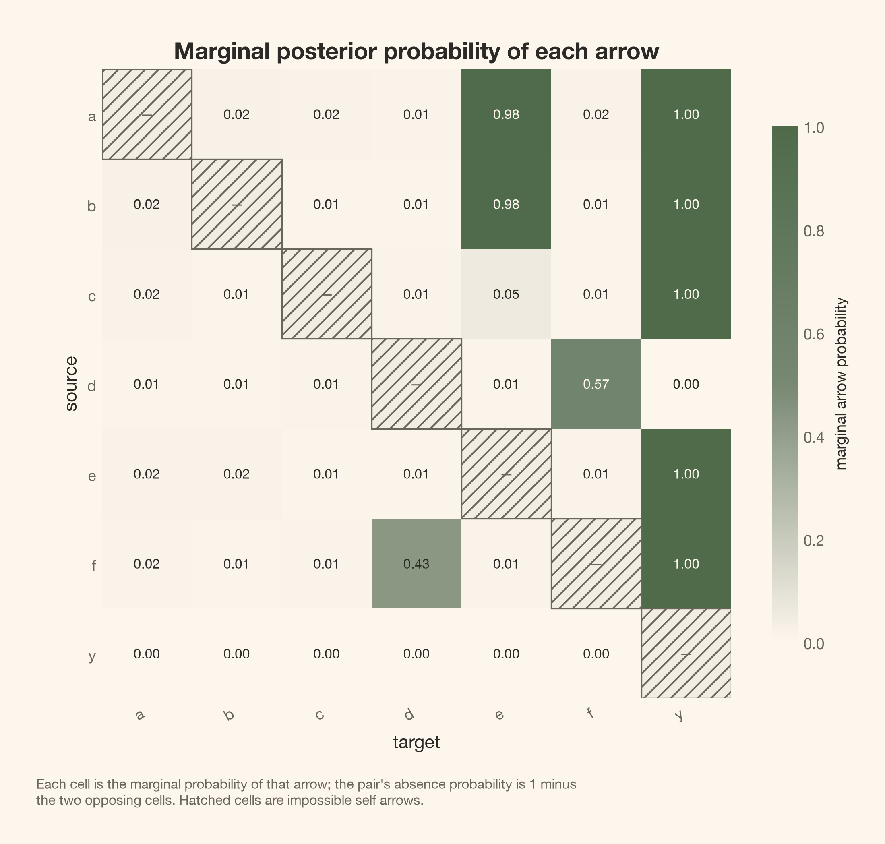
<figcaption>Figure 9: Marginal arrow probabilities by source and target. Hatching marks impossible self arrows. The model forbids y’s outgoing arrows; other off-diagonal zeros can mean an arrow was never visited. This is not a thresholded joint DAG.</figcaption>
</figure>

## Ranked DAGs, cumulative mass, and arbitrary identifiers

Now the joint object. Each visited DAG carries its empirical posterior probability; sorting them gives a ranked distribution with the generating DAG somewhere on it — or nowhere, if the chains never visited it.

Code

``` sourceCode
fig = plot_ranked_graphs(states, truth_states, labels)
plt.show()
```

<figure class="quarto-float quarto-float-fig figure">
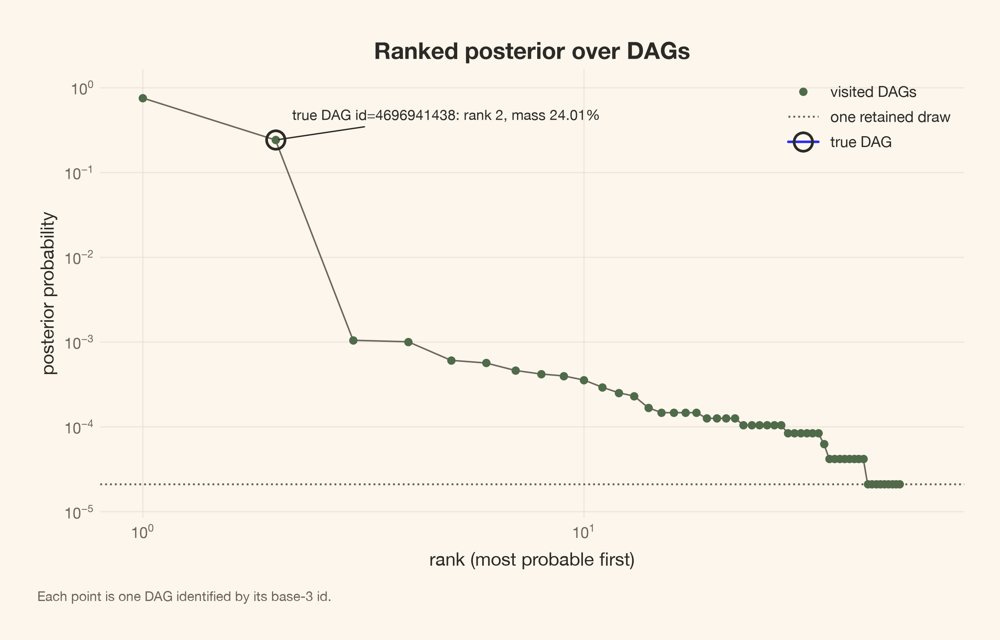
<figcaption>Figure 10: Ranked posterior probability of each visited DAG. The horizontal line marks the resolution of one Monte Carlo draw; the generating DAG is ringed when visited. No single graph is required to collect the mass.</figcaption>
</figure>

How concentrated is that distribution? The cumulative curve answers directly: how many DAGs it takes to cover half, 90%, or 95% of the sampled mass.

Code

``` sourceCode
fig = plot_cumulative(states)
plt.show()

flat = states.reshape(-1, len(pairs))
powers = 3 ** np.arange(len(pairs))
ids = (flat * powers).sum(axis=1)
id_unique, id_counts = np.unique(ids, return_counts=True)
id_mass = id_counts / id_counts.sum()
cumulative = np.cumsum(np.sort(id_mass)[::-1])
for level in (0.50, 0.90, 0.95):
    count = int(np.searchsorted(cumulative, level) + 1)
    noun_verb = "DAG reaches" if count == 1 else "DAGs reach"
    print(f"{count} {noun_verb} at least {level:.0%} of the sampled mass")
```

<figure class="quarto-float quarto-float-fig figure">
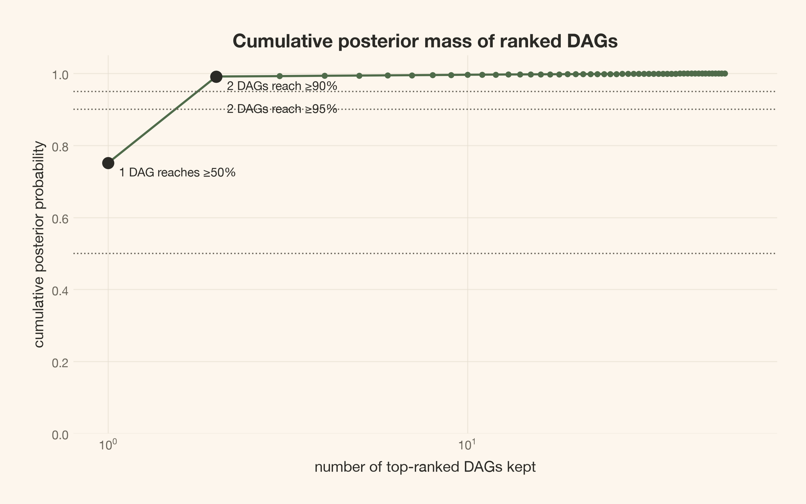
<figcaption>Figure 11: Cumulative empirical DAG mass against rank, with markers at the actually achieved cumulative levels. The curve describes retained draws; unseen posterior mass is not bounded by the frequency of one draw.</figcaption>
</figure>

    2 DAGs reach at least 50% of the sampled mass
    39 DAGs reach at least 90% of the sampled mass
    56 DAGs reach at least 95% of the sampled mass

Each sampled DAG can also be collapsed to one arbitrary number, its identifier \mathrm{ID}=\sum_k s_k 3^k over the 21 pair states. The identifier is a **label**, not a distance: 317 and 318 are not neighboring graphs in any meaningful sense. The next plot shows the categorical distribution over these identifiers.

Code

``` sourceCode
fig = plot_id_pmf(states, truth_states)
plt.show()
```

<figure class="quarto-float quarto-float-fig figure">

<figcaption>Figure 12: The leading visited DAG identifiers as a categorical distribution, with the remaining visited DAGs aggregated into one ‘Other’ bucket, not a single graph. The generating identifier is ringed when it is among the individually displayed categories.</figcaption>
</figure>

Code

``` sourceCode
fig = plot_decoder(states, truth_states, labels)
plt.show()
```

<figure class="quarto-float quarto-float-fig figure">
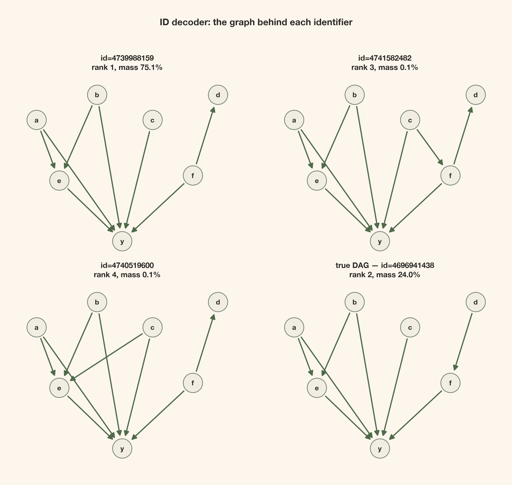
<figcaption>Figure 13: Up to three leading visited alternatives and the generating DAG, drawn at fixed node positions with their identifiers and empirical mass. The generating DAG has its own panel rather than being duplicated among the alternatives. Decoding an identifier does not measure similarity.</figcaption>
</figure>

Where do the generating DAG, skeleton, and class land in their rankings? All three answers are measured from the draws. An unvisited target has zero empirical frequency, not a proven zero posterior probability. One retained draw sets the frequency resolution; it is not an upper bound on unvisited probability. DAG and skeleton ranks break frequency ties by increasing identifier.

Measured ranks and masses of the generating DAG, skeleton, and class

``` sourceCode
def rank_and_mass(codes, target):
    """Empirical rank (1 = highest) and mass of a target code, or 'not visited'."""
    unique, counts = np.unique(codes, return_counts=True)
    if target not in set(unique.tolist()):
        return None, 0.0
    order = np.lexsort((unique, -counts))
    rank = int(np.where(unique[order] == target)[0][0]) + 1
    return rank, float(counts[list(unique).index(target)] / counts.sum())


true_id = int((truth_states * powers).sum())
binary_powers = 1 << np.arange(len(pairs))
true_skeleton = int(((truth_states != 0) * binary_powers).sum())
skeleton_codes = ((flat != 0) * binary_powers).sum(axis=1)
dag_rank, dag_mass = rank_and_mass(ids, true_id)
skel_rank, skel_mass = rank_and_mass(skeleton_codes, true_skeleton)
class_rank = summary["ranked"].index(truth_key) + 1 if truth_key in summary["ranked"] else None
class_mass = float(summary["true_class"].mean())
n_total = states[..., 0].size
display(Markdown(
    f"The nonlinear posterior puts **{skel_mass:.2%}** on the generating skeleton "
    f"(rank {skel_rank or 'not visited'}) and **{class_mass:.2%}** on its equivalence class "
    f"(rank {class_rank or 'not visited'}). Yet the generating DAG has only "
    f"**{dag_mass:.2%}** (rank {dag_rank or 'not visited'}); reversing its $d$–$f$ arrow "
    f"accounts for **{class_mass - dag_mass:.2%}**. "
    "Next we change one explicit assumption, then examine why observations alone "
    "do not identify that direction."
))
print(f"Frequency resolution: {1 / n_total:.2e}; zero visits do not prove zero posterior mass")
```

The nonlinear posterior puts **69.75%** on the generating skeleton (rank 1) and **69.75%** on its equivalence class (rank 1). Yet the generating DAG has only **39.65%** (rank 1); reversing its d–f arrow accounts for **30.11%**. Next we change one explicit assumption, then examine why observations alone do not identify that direction.

    Frequency resolution: 2.08e-05; zero visits do not prove zero posterior mass

## What if a media channel cannot cause holidays?

There is something we might know before looking at these correlations. Suppose d represents a calendar driver such as holidays and f represents a media channel’s exposure index. Holidays can change campaign spending and exposure; a campaign cannot change the holiday calendar. The holiday still occurs when media spend is zero. That licenses **forbidding f\rightarrow d**, while leaving d\rightarrow f possible.

This is a domain-knowledge illustration using our continuous synthetic indices, not a fitted calendar or spend dataset. We add only the stated restriction, not a claim that we know every parent of either node. Absence remains allowed: the local pair probabilities become (1/2,1/2,0) for no edge, d\rightarrow f, and f\rightarrow d, respectively. We have not forced the generating edge to exist.

The comparison below holds the data, score, parameter priors, seed, and sampler settings fixed. Because the likelihood is unchanged, the restricted posterior is the baseline posterior **conditioned on no f\rightarrow d**: exclude those DAGs, then renormalize over all survivors — not just the generating graph and its twin.

Refit with media-to-calendar forbidden and compare fresh probabilities

``` sourceCode
restricted_allowed = allowed.copy()
restricted_allowed.loc["f", "d"] = False
restricted_probs = pair_probabilities(
    direction_prior.to_numpy(), restricted_allowed.to_numpy(),
)
restricted_posterior = fit_graphs(
    score, restricted_probs, labels,
    seed=SAMPLING_SEED, draws=draws, tune=tune, betas=betas, chains=chains,
)
restricted_summary = graph_summary(
    restricted_posterior, pairs, n_nodes, truth_key, d_index, y_index,
)
restricted_diagnostics = azs.summary(
    graph_diagnostic_data(
        restricted_posterior, restricted_summary, restricted_probs, labels, pairs,
    ),
    ci_prob=0.95, round_to="none",
)
df_pair = next(k for k, pair in enumerate(pairs) if tuple(pair) == (d_index, f_index))
twin_states = truth_states.copy()
twin_states[df_pair] = 2
twin_id = int((twin_states * powers).sum())


def knowledge_metrics(current, current_diagnostics):
    current_states = current["states"].reshape(-1, len(pairs))
    current_ids = (current_states * powers).sum(axis=1)
    rank, mass = rank_and_mass(current_ids, true_id)
    _, reverse_mass = rank_and_mass(current_ids, twin_id)
    return {
        "Generating DAG rank": rank or "not visited",
        "Generating DAG probability": f"{mass:.2%}",
        "Reverse-twin probability": f"{reverse_mass:.2%}",
        "Generating class probability": f"{current['true_class'].mean():.2%}",
        "P(d → f)": f"{np.mean(current_states[:, df_pair] == 1):.2%}",
        "P(f → d)": f"{np.mean(current_states[:, df_pair] == 2):.2%}",
        "P(d–f absent)": f"{np.mean(current_states[:, df_pair] == 0):.2%}",
        "Maximum monitored R-hat": f"{current_diagnostics.r_hat.max():.4f}",
        "Minimum bulk ESS": f"{current_diagnostics.ess_bulk.min():.0f}",
        "Minimum tail ESS": f"{current_diagnostics.ess_tail.min():.0f}",
    }


knowledge_comparison = pd.DataFrame({
    "Baseline": knowledge_metrics(summary, diagnostics),
    "Forbid f → d": knowledge_metrics(restricted_summary, restricted_diagnostics),
}).rename_axis("Quantity").reset_index()
display(article_table(
    knowledge_comparison,
    "Same observations and mechanisms, one additional graph restriction",
))
restricted_ids = (restricted_summary["states"].reshape(-1, len(pairs)) * powers).sum(axis=1)
restricted_rank, restricted_mass = rank_and_mass(restricted_ids, true_id)
display(Markdown(
    f"The generating DAG has **{dag_mass:.2%}** probability in the baseline "
    f"and **{restricted_mass:.2%}** with the restriction "
    f"(ranks **{dag_rank or 'not visited'}** and **{restricted_rank or 'not visited'}**, respectively). "
    "The reversed twin now has exactly zero probability because we excluded it, "
    "not because a new observation contradicted it."
))
print(f"Restricted frequency resolution: {1 / len(restricted_ids):.2e}")
```

    Sequential sampling (4 chains in 1 job)
    TemperedGraphStep: [edge]
    Sampling 4 chains for 3_000 tune and 12_000 draw iterations (12_000 + 48_000 draws total) took 3 seconds.

<figure class="quarto-float quarto-float-tbl figure">
<table id="T_a0ae3" class="caption-top table table-sm table-striped small" data-quarto-postprocess="true">
<thead>
<tr class="header">
<th id="T_a0ae3_level0_col0" class="col_heading level0 col0" data-quarto-table-cell-role="th">Quantity</th>
<th id="T_a0ae3_level0_col1" class="col_heading level0 col1" data-quarto-table-cell-role="th">Baseline</th>
<th id="T_a0ae3_level0_col2" class="col_heading level0 col2" data-quarto-table-cell-role="th">Forbid f → d</th>
</tr>
</thead>
<tbody>
<tr class="odd">
<td id="T_a0ae3_row0_col0" class="data row0 col0">Generating DAG rank</td>
<td id="T_a0ae3_row0_col1" class="data row0 col1">1</td>
<td id="T_a0ae3_row0_col2" class="data row0 col2">1</td>
</tr>
<tr class="even">
<td id="T_a0ae3_row1_col0" class="data row1 col0">Generating DAG probability</td>
<td id="T_a0ae3_row1_col1" class="data row1 col1">39.65%</td>
<td id="T_a0ae3_row1_col2" class="data row1 col2">69.07%</td>
</tr>
<tr class="odd">
<td id="T_a0ae3_row2_col0" class="data row2 col0">Reverse-twin probability</td>
<td id="T_a0ae3_row2_col1" class="data row2 col1">30.11%</td>
<td id="T_a0ae3_row2_col2" class="data row2 col2">0.00%</td>
</tr>
<tr class="even">
<td id="T_a0ae3_row3_col0" class="data row3 col0">Generating class probability</td>
<td id="T_a0ae3_row3_col1" class="data row3 col1">69.75%</td>
<td id="T_a0ae3_row3_col2" class="data row3 col2">69.07%</td>
</tr>
<tr class="odd">
<td id="T_a0ae3_row4_col0" class="data row4 col0">P(d → f)</td>
<td id="T_a0ae3_row4_col1" class="data row4 col1">56.69%</td>
<td id="T_a0ae3_row4_col2" class="data row4 col2">100.00%</td>
</tr>
<tr class="even">
<td id="T_a0ae3_row5_col0" class="data row5 col0">P(f → d)</td>
<td id="T_a0ae3_row5_col1" class="data row5 col1">43.31%</td>
<td id="T_a0ae3_row5_col2" class="data row5 col2">0.00%</td>
</tr>
<tr class="odd">
<td id="T_a0ae3_row6_col0" class="data row6 col0">P(d–f absent)</td>
<td id="T_a0ae3_row6_col1" class="data row6 col1">0.00%</td>
<td id="T_a0ae3_row6_col2" class="data row6 col2">0.00%</td>
</tr>
<tr class="even">
<td id="T_a0ae3_row7_col0" class="data row7 col0">Maximum monitored R-hat</td>
<td id="T_a0ae3_row7_col1" class="data row7 col1">1.0003</td>
<td id="T_a0ae3_row7_col2" class="data row7 col2">1.0004</td>
</tr>
<tr class="odd">
<td id="T_a0ae3_row8_col0" class="data row8 col0">Minimum bulk ESS</td>
<td id="T_a0ae3_row8_col1" class="data row8 col1">12777</td>
<td id="T_a0ae3_row8_col2" class="data row8 col2">10967</td>
</tr>
<tr class="even">
<td id="T_a0ae3_row9_col0" class="data row9 col0">Minimum tail ESS</td>
<td id="T_a0ae3_row9_col1" class="data row9 col1">12908</td>
<td id="T_a0ae3_row9_col2" class="data row9 col2">12486</td>
</tr>
</tbody>
</table>
<figcaption>Table 8: Same observations and mechanisms, one additional graph restriction</figcaption>
</figure>

The generating DAG has **39.65%** probability in the baseline and **69.07%** with the restriction (ranks **1** and **1**, respectively). The reversed twin now has exactly zero probability because we excluded it, not because a new observation contradicted it.

    Restricted frequency resolution: 2.08e-05

These percentages are posterior probabilities, not percentage improvements in rank. The forbidden direction’s zero is fixed by assumption; its diagnostics are not estimable. The reported diagnostics concern the remaining varying quantities and cannot validate the holiday assumption. A wrong hard restriction can make a posterior more confident and less correct.

The following skeleton, CPDAG, and effect summaries return to the **baseline** fit. That lets us see exactly what the additional knowledge ruled out: two causal stories that observations alone cannot distinguish.

## Skeletons group arrows; CPDAGs group independences

A **skeleton** keeps every adjacency and drops every arrowhead. It answers a narrower question than a DAG posterior and a different question than a class: which variables are connected at all? Its distribution sums over all classes that share those connections, so a skeleton can mix several equivalence classes.

Code

``` sourceCode
fig = plot_ranked_graphs(states, truth_states, labels, skeleton=True)
plt.show()
```

<figure class="quarto-float quarto-float-fig figure">
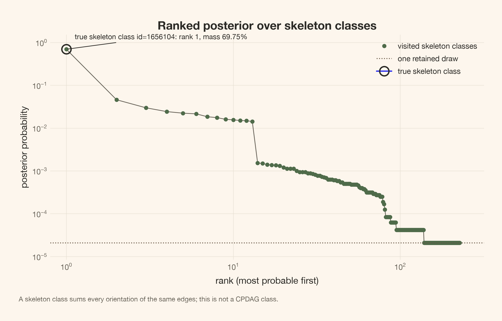
<figcaption>Figure 14: Ranked posterior probability of each visited skeleton, with the generating skeleton ringed when visited. A skeleton sums over every class that shares its connections; it is not a CPDAG.</figcaption>
</figure>

A **CPDAG** — completed partially directed acyclic graph — summarizes something else again: a whole *Markov-equivalence class*, the DAGs with the same conditional-independence implications. Its name deserves unpacking. *Partially directed* means some connections carry arrows and others stay undirected. *Completed* means every **compelled** arrow — one shared by all DAGs in the class — has been oriented; it does not mean every pair is connected. An undirected edge is a connection whose direction differs across members of the class; it is not two opposite arrows, and it is not an absent edge.

A three-variable picture separates the ideas. Two DAGs can share a skeleton yet belong to different classes, and two differently drawn DAGs can belong to one class.

<figure class="quarto-float quarto-float-fig figure">

<figcaption>Figure 15: The chain and fork DAGs share one CPDAG; the collider belongs to a different class even though all three drawings use the same connections. What separates classes is the collider, not the skeleton.</figcaption>
</figure>

In the chain and fork, a and y are separated by conditioning on b. In the collider a\rightarrow b\leftarrow y, a and y are separated *before* conditioning on b; conditioning on that shared effect can make them dependent. The [Verma–Pearl characterization](https://ftp.cs.ucla.edu/pub/stat_ser/R150.pdf) gives the practical rule: two DAGs are Markov equivalent exactly when they share the same skeleton and the same unshielded colliders — pairs of arrows into a shared child whose parents are not connected.

Our generating class is pinned by its colliders: a\rightarrow e\leftarrow b fixes the arrows into e, and the unshielded colliders at y fix all five arrows into y. Only the d–f connection can still reverse, so the class contains exactly two DAGs.

Draw DAGs and completed equivalence classes

``` sourceCode
def draw_graph(ax, adjacency, title):
    positions = {0: (-1.7, 1.9), 1: (-0.5, 2.4), 2: (0.6, 1.9),
                 3: (1.9, 2.4), 4: (-1.25, 0.7), 5: (1.4, 0.8), 6: (0.0, -0.5)}
    graph = nx.empty_graph(n_nodes)
    nx.draw_networkx_nodes(graph, positions, node_size=650,
                          node_color=COLORS["surface_alt"], edgecolors=COLORS["primary"], ax=ax)
    nx.draw_networkx_labels(graph, positions, labels=dict(enumerate(labels)),
                           font_color=COLORS["ink"], font_weight="bold", ax=ax)
    for i, j in pairs:
        if not (adjacency[i, j] or adjacency[j, i]):
            continue
        undirected = adjacency[i, j] and adjacency[j, i]
        start, end = (i, j) if adjacency[i, j] else (j, i)
        ax.add_patch(FancyArrowPatch(
            positions[start], positions[end], arrowstyle="-" if undirected else "-|>",
            mutation_scale=14, linewidth=1.6, shrinkA=16, shrinkB=16,
            linestyle="--" if undirected else "-",
            color=COLORS["brown"] if undirected else COLORS["green_strong"],
        ))
    ax.set(title=title, xlim=(-2.1, 2.3), ylim=(-0.9, 2.8), aspect="equal")
    ax.axis("off")


def adjacency_of(parents):
    return np.array([[bool(int(parents[j]) & (1 << i)) for j in range(n_nodes)]
                     for i in range(n_nodes)])


observational_twin = truth.copy()
observational_twin[d_index], observational_twin[f_index] = 1 << f_index, 0
print(f"Twin and generating DAG share a class: {mec_key(observational_twin) == truth_key}")

fig, axes = plt.subplots(1, 3, figsize=(12, 4.4))
for ax, matrix, title in zip(axes, [adjacency_of(truth), adjacency_of(observational_twin),
                                    cpdag(truth)],
                            ["Generating DAG", "Equivalent DAG", "Shared CPDAG"]):
    draw_graph(ax, matrix, title)
plt.show()
```

    Twin and generating DAG share a class: True

<figure class="quarto-float quarto-float-fig figure">
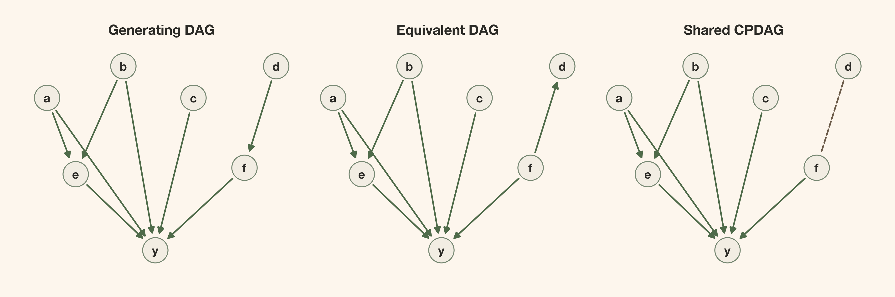
<figcaption>Figure 16: The generating DAG and its observational twin differ only in d–f. Their shared CPDAG has the seven compelled arrows directed and the d–f edge undirected. The twin is not a cosmetic mirror: below we write its equations and check that it reproduces the same observational distribution.</figcaption>
</figure>

## One exact observational twin

Here is what “equivalent” means in this world, concretely. The twin keeps every mechanism unchanged **except** the d–f pair: f becomes a root with the variance it always had, and d regresses on f with the coefficients that reproduce the same joint Gaussian:

f=\sqrt{1.81}\\\tilde\varepsilon_f,\qquad d=\frac{0.9}{1.81}\\f+\tilde\eta,\qquad \tilde\eta\sim\mathcal N(0,\\1/1.81)\\ \text{independent},

and y=\ldots+0.8\\h(f)+\varepsilon_y is untouched. Since (d,f) is jointly Gaussian in both worlds with the same covariance, and y’s nonlinear mechanism depends on f identically, the two worlds induce **exactly the same observational distribution** — not merely the same conditional independences.

Illustrate the twin’s matching moments

``` sourceCode
def make_twin(seed, size):
    """Same observational law as make_world; f is a root and d regresses on f."""
    errors = np.random.default_rng(seed).normal(size=(size, n_nodes))
    a, b, c = errors[:, 0], errors[:, 1], errors[:, 2]
    e = 0.9 * a + 0.8 * b + errors[:, 4]
    f = np.sqrt(1.81) * errors[:, 5]
    d = (0.9 / 1.81) * f + errors[:, 3] / np.sqrt(1.81)
    y = 0.55 * h(a) + 0.5 * h(b) + 0.6 * h(c) + 0.7 * h(e) + 0.8 * h(f) + errors[:, 6]
    return np.column_stack([a, b, c, d, e, f, y])


world_sample = make_world(DATA_SEED + 7, 200_000)
twin_sample = make_twin(DATA_SEED + 7, 200_000)
twin_rows = []
for name, column, stat in [("mean d", 3, np.mean), ("sd d", 3, np.std),
                           ("mean f", 5, np.mean), ("sd f", 5, np.std),
                           ("mean y", 6, np.mean), ("sd y", 6, np.std)]:
    twin_rows.append({"Quantity": name,
                      "Generating world": stat(world_sample[:, column]),
                      "Twin world": stat(twin_sample[:, column])})
twin_rows.append({"Quantity": "corr(d, f)",
                  "Generating world": np.corrcoef(world_sample[:, 3], world_sample[:, 5])[0, 1],
                  "Twin world": np.corrcoef(twin_sample[:, 3], twin_sample[:, 5])[0, 1]})
twin_rows.append({"Quantity": "corr(d, y)",
                  "Generating world": np.corrcoef(world_sample[:, 3], world_sample[:, 6])[0, 1],
                  "Twin world": np.corrcoef(twin_sample[:, 3], twin_sample[:, 6])[0, 1]})
display(article_table(
    pd.DataFrame(twin_rows),
    "Sample moments of two worlds with identical observational distributions",
    formats={"Generating world": "{:.4f}", "Twin world": "{:.4f}"},
))
```

<figure class="quarto-float quarto-float-tbl figure">
<table id="T_5a513" class="caption-top table table-sm table-striped small" data-quarto-postprocess="true">
<thead>
<tr class="header">
<th id="T_5a513_level0_col0" class="col_heading level0 col0" data-quarto-table-cell-role="th">Quantity</th>
<th id="T_5a513_level0_col1" class="col_heading level0 col1" data-quarto-table-cell-role="th">Generating world</th>
<th id="T_5a513_level0_col2" class="col_heading level0 col2" data-quarto-table-cell-role="th">Twin world</th>
</tr>
</thead>
<tbody>
<tr class="odd">
<td id="T_5a513_row0_col0" class="data row0 col0">mean d</td>
<td id="T_5a513_row0_col1" class="data row0 col1">-0.0040</td>
<td id="T_5a513_row0_col2" class="data row0 col2">-0.0007</td>
</tr>
<tr class="even">
<td id="T_5a513_row1_col0" class="data row1 col0">sd d</td>
<td id="T_5a513_row1_col1" class="data row1 col1">1.0009</td>
<td id="T_5a513_row1_col2" class="data row1 col2">0.9994</td>
</tr>
<tr class="odd">
<td id="T_5a513_row2_col0" class="data row2 col0">mean f</td>
<td id="T_5a513_row2_col1" class="data row2 col1">-0.0002</td>
<td id="T_5a513_row2_col2" class="data row2 col2">0.0045</td>
</tr>
<tr class="even">
<td id="T_5a513_row3_col0" class="data row3 col0">sd f</td>
<td id="T_5a513_row3_col1" class="data row3 col1">1.3444</td>
<td id="T_5a513_row3_col2" class="data row3 col2">1.3448</td>
</tr>
<tr class="odd">
<td id="T_5a513_row4_col0" class="data row4 col0">mean y</td>
<td id="T_5a513_row4_col1" class="data row4 col1">7.6286</td>
<td id="T_5a513_row4_col2" class="data row4 col2">7.6317</td>
</tr>
<tr class="even">
<td id="T_5a513_row5_col0" class="data row5 col0">sd y</td>
<td id="T_5a513_row5_col1" class="data row5 col1">2.0547</td>
<td id="T_5a513_row5_col2" class="data row5 col2">2.0553</td>
</tr>
<tr class="odd">
<td id="T_5a513_row6_col0" class="data row6 col0">corr(d, f)</td>
<td id="T_5a513_row6_col1" class="data row6 col1">0.6687</td>
<td id="T_5a513_row6_col2" class="data row6 col2">0.6677</td>
</tr>
<tr class="even">
<td id="T_5a513_row7_col0" class="data row7 col0">corr(d, y)</td>
<td id="T_5a513_row7_col1" class="data row7 col1">0.2895</td>
<td id="T_5a513_row7_col2" class="data row7 col2">0.2902</td>
</tr>
</tbody>
</table>
<figcaption>Table 9: Sample moments of two worlds with identical observational distributions</figcaption>
</figure>

The moments match to sampling noise because the laws match exactly. Yet under \operatorname{do}(d) the worlds disagree: in the generating world f=0.9d+\varepsilon_f moves and y with it; in the twin, f is a root and y never sees the intervention. The d–f pair stays Gaussian-reversible **even though y is nonlinear**, so no amount of nonlinearity downstream decides it. The other links are not blanket-ambiguous: the colliders at e and y compel them in every member of the class.

One caution about what the CPDAG claims. It groups DAGs by **conditional-independence structure** — a graphical statement, not a general guarantee of equal nonlinear likelihood families. For this particular pair, the Gaussian core permits the reversal and y’s mechanism stays unchanged. Even here, independently specified parameter priors need not transform coherently between orientations, so integrated evidence need not be equal. Under additional assumptions, nonlinear additive-noise models can orient edges beyond conditional independences ([Peters et al., 2014](https://jmlr.org/papers/v15/peters14a.html)); this d–f pair is not a case where that help applies.

Finally, the classes themselves. Posterior mass over CPDAGs is a **sum** over member DAGs, estimated here by the fraction of retained draws in each class; we do not renormalize over the displayed rows.

Group sampled DAGs into Markov equivalence classes

``` sourceCode
class_rows = []
for rank, key in enumerate(summary["ranked"][:6], start=1):
    class_rows.append({
        "Class rank": rank,
        "Estimated posterior mass": summary["class_counts"][key] / n_total,
        "Visited member DAGs": summary["class_members"][key],
        "Generating class": "yes" if key == truth_key else "",
    })
other_mass = 1.0 - sum(row["Estimated posterior mass"] for row in class_rows)
class_rows.append({"Class rank": "all remaining classes",
                   "Estimated posterior mass": other_mass,
                   "Visited member DAGs": "",
                   "Generating class": ""})
display(article_table(
    pd.DataFrame(class_rows),
    "Markov equivalence classes by estimated posterior mass",
    formats={"Estimated posterior mass": "{:.2%}"},
))
```

<figure class="quarto-float quarto-float-tbl figure">
<table id="T_45baa" class="caption-top table table-sm table-striped small" data-quarto-postprocess="true">
<thead>
<tr class="header">
<th id="T_45baa_level0_col0" class="col_heading level0 col0" data-quarto-table-cell-role="th">Class rank</th>
<th id="T_45baa_level0_col1" class="col_heading level0 col1" data-quarto-table-cell-role="th">Estimated posterior mass</th>
<th id="T_45baa_level0_col2" class="col_heading level0 col2" data-quarto-table-cell-role="th">Visited member DAGs</th>
<th id="T_45baa_level0_col3" class="col_heading level0 col3" data-quarto-table-cell-role="th">Generating class</th>
</tr>
</thead>
<tbody>
<tr class="odd">
<td id="T_45baa_row0_col0" class="data row0 col0">1</td>
<td id="T_45baa_row0_col1" class="data row0 col1">69.75%</td>
<td id="T_45baa_row0_col2" class="data row0 col2">2</td>
<td id="T_45baa_row0_col3" class="data row0 col3">yes</td>
</tr>
<tr class="even">
<td id="T_45baa_row1_col0" class="data row1 col0">2</td>
<td id="T_45baa_row1_col1" class="data row1 col1">3.88%</td>
<td id="T_45baa_row1_col2" class="data row1 col2">2</td>
<td id="T_45baa_row1_col3" class="data row1 col3"></td>
</tr>
<tr class="odd">
<td id="T_45baa_row2_col0" class="data row2 col0">3</td>
<td id="T_45baa_row2_col1" class="data row2 col1">2.98%</td>
<td id="T_45baa_row2_col2" class="data row2 col2">12</td>
<td id="T_45baa_row2_col3" class="data row2 col3"></td>
</tr>
<tr class="even">
<td id="T_45baa_row3_col0" class="data row3 col0">4</td>
<td id="T_45baa_row3_col1" class="data row3 col1">2.23%</td>
<td id="T_45baa_row3_col2" class="data row3 col2">4</td>
<td id="T_45baa_row3_col3" class="data row3 col3"></td>
</tr>
<tr class="odd">
<td id="T_45baa_row4_col0" class="data row4 col0">5</td>
<td id="T_45baa_row4_col1" class="data row4 col1">1.75%</td>
<td id="T_45baa_row4_col2" class="data row4 col2">3</td>
<td id="T_45baa_row4_col3" class="data row4 col3"></td>
</tr>
<tr class="even">
<td id="T_45baa_row5_col0" class="data row5 col0">6</td>
<td id="T_45baa_row5_col1" class="data row5 col1">1.70%</td>
<td id="T_45baa_row5_col2" class="data row5 col2">3</td>
<td id="T_45baa_row5_col3" class="data row5 col3"></td>
</tr>
<tr class="odd">
<td id="T_45baa_row6_col0" class="data row6 col0">all remaining classes</td>
<td id="T_45baa_row6_col1" class="data row6 col1">17.69%</td>
<td id="T_45baa_row6_col2" class="data row6 col2"></td>
<td id="T_45baa_row6_col3" class="data row6 col3"></td>
</tr>
</tbody>
</table>
<figcaption>Table 10: Markov equivalence classes by estimated posterior mass</figcaption>
</figure>

Code

``` sourceCode
fig, axes = plt.subplots(2, 2, figsize=(10, 8))
for index, ax in enumerate(axes.flat):
    if index >= min(4, len(summary["ranked"])):
        ax.axis("off")
        continue
    key = summary["ranked"][index]
    mass = summary["class_counts"][key] / n_total
    suffix = " · generating class" if key == truth_key else ""
    draw_graph(ax, cpdag(summary["representative"][key]), f"Class {index + 1}: {mass:.1%}{suffix}")
plt.show()
print(f"Distinct DAGs visited: {len(summary['graphs'])}; classes visited: {len(summary['ranked'])}")
```

<figure class="quarto-float quarto-float-fig figure">
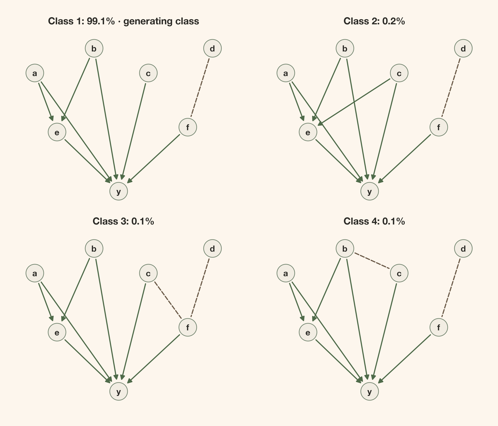
<figcaption>Figure 17: The leading observational CPDAGs of the sampled classes, weighted by member-DAG draws. Undirected dashed edges describe observational reversibility within the class; they do not reinstate any direction the hard mask forbids.</figcaption>
</figure>

    Distinct DAGs visited: 872; classes visited: 459

The generating DAG and its reverse-d–f twin are the generating class’s two members. Their probabilities add even when the sampler visits one more often. The holiday restriction excludes the reversed twin through the graph prior; it does not break their observational equivalence. In general, the leading DAG need not belong to the leading class; neither summary replaces the full posterior.

# Structural summaries: how dense, and whose parents?

Two structural questions put these arrow summaries in context. First: how many arrows does the posterior expect, compared with what we asked for before seeing data? The prior here is **not** a binomial shortcut. We obtain it by running the same masked acyclic sampler with a zero-data score — whose log evidence is exactly zero — so the chain targets the true graph prior. Its chain deserves the same diagnostics as the posterior chains, because it uses the same kernel.

Sample the true masked acyclic graph prior

``` sourceCode
prior_score = BasisScore(np.empty((0, n_nodes)), nonlinear_nodes=(y_index,),
                         centers=centers, width=width, loc=loc, scale=scale,
                         tau0=tau0, lam=lam, alpha0=alpha0, beta0=beta0)
prior_posterior = fit_graphs(
    prior_score, baseline_probs, labels,
    seed=PRIOR_SEED, draws=draws, tune=tune, betas=betas, chains=chains,
)
prior_states = prior_posterior.posterior.edge.values.reshape(-1, len(pairs))
prior_summary = graph_summary(prior_posterior, pairs, n_nodes, truth_key, d_index, y_index)
prior_diagnostics = azs.summary(
    graph_diagnostic_data(prior_posterior, prior_summary, baseline_probs, labels, pairs),
    ci_prob=0.95, round_to="none",
)
print(f"Prior chain diagnostics — max R-hat {prior_diagnostics.r_hat.max():.4f}, "
      f"min bulk ESS {prior_diagnostics.ess_bulk.min():.0f}, "
      f"min tail ESS {prior_diagnostics.ess_tail.min():.0f}")
```

    Sequential sampling (4 chains in 1 job)
    TemperedGraphStep: [edge]
    Sampling 4 chains for 3_000 tune and 12_000 draw iterations (12_000 + 48_000 draws total) took 3 seconds.

    Prior chain diagnostics — max R-hat 1.0001, min bulk ESS 46021, min tail ESS 46021

Code

``` sourceCode
fig = plot_edge_counts(states, prior_states, truth_states)
plt.show()
print(f"Prior mean arrows: {(prior_states != 0).sum(axis=1).mean():.2f}; "
      f"posterior mean: {(states != 0).sum(axis=1).mean():.2f}; generating graph: 8")
```

<figure class="quarto-float quarto-float-fig figure">
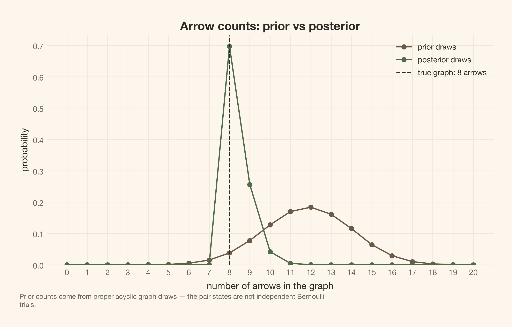
<figcaption>Figure 18: Prior and posterior distributions over the number of arrows, sampled from the same masked acyclic kernel. The vertical line marks the generating count. The prior is measured, not assumed binomial.</figcaption>
</figure>

    Prior mean arrows: 11.85; posterior mean: 8.35; generating graph: 8

Second: for each node, how many parents does the posterior expect? These small multiples keep a shared 0,\ldots,n-1 axis; overlaying all seven would be unreadable.

Code

``` sourceCode
fig = plot_parent_counts(states, truth_states, labels)
plt.show()
```

<figure class="quarto-float quarto-float-fig figure">
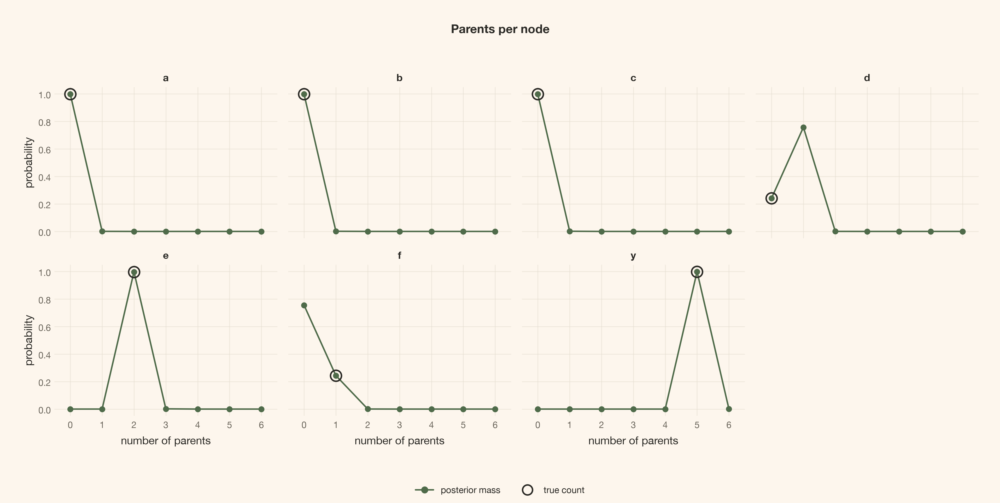
<figcaption>Figure 19: Posterior distribution of the parent count for each node, with the generating parent count ringed and a shared axis. These are per-node summaries; the joint graph distribution is what the sampler carries.</figcaption>
</figure>

Optional visual appendix: pair states, graph map, and visited identifiers

These three panels are optional reading; the main flow has already used every summary they offer. They remain here so all parts of the posterior’s story are visible in one place.

Code

``` sourceCode
fig = plot_pair_states(states, truth_states, labels)
plt.show()
```

<figure class="quarto-float quarto-float-fig figure">

<figcaption>Figure 20: Every pair as its own distribution over absent, forward, and backward states, with the generating state ringed. Pairs forbidden by the hard mask are excluded by assumption; the figure receives no prior argument to redraw that knowledge.</figcaption>
</figure>

Code

``` sourceCode
fig = plot_graph_map(states, truth_states, labels)
plt.show()
```

<figure class="quarto-float quarto-float-fig figure">

<figcaption>Figure 21: Leading visited DAGs laid out by classical multidimensional scaling of pair-state Hamming distances. The generating DAG is ringed if visited and shown as a cross otherwise. The plot reports subset mass; its two-dimensional geometry is approximate.</figcaption>
</figure>

Code

``` sourceCode
fig = plot_id_numberline(states, truth_states)
plt.show()
```

<figure class="quarto-float quarto-float-fig figure">
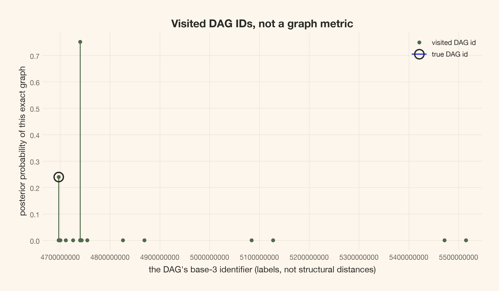
<figcaption>Figure 22: Visited DAG identifiers on a number line. Only sampled support is plotted; the base-3 numeric labels are arbitrary codes, not structural distances.</figcaption>
</figure>

# A nonlinear intervention with a structural zero

We return to the **baseline posterior**, without the holiday restriction, for every effect probability, draw, and interval in this section. The question is a formal intervention in the synthetic SCM: how does the mean of y change when we set d=1 instead of d=0? It is not a proposal to randomize real holidays. This is a finite intervention contrast, not a derivative:

\Delta(G,\theta)=\mathbb E\_{\text{noise}}\\\left\[y\mid\operatorname{do}(d=1),G,\theta\right\] -\mathbb E\_{\text{noise}}\\\left\[y\mid\operatorname{do}(d=0),G,\theta\right\].

We sample from the joint posterior by composition: draw a DAG G from the graph chain, then draw its mechanisms \theta from p(\theta\mid D,G) using the same score object that produced the evidence. For each draw we propagate M=2048 paired noise rows through the intervened systems with common random numbers, so the contrast is a mean of paired differences.

Two structural facts organize the answer. If G has **no directed path** from d to y, the contrast is an **exact zero** — a point mass determined by boolean reachability, not a tiny noisy estimate. And in the generating world only the f mechanism moves under \operatorname{do}(d), so the other terms cancel and the true contrast is one integral:

\Delta\_{\text{true}}=0.8\cdot\mathbb E\\\left\[h(0.9+Z)-h(Z)\right\], \qquad Z\sim\mathcal N(0,1).

We compute that expectation by quadrature rather than quoting a number.

True SCM contrast by quadrature

``` sourceCode
integrand = lambda z: 0.8 * (h(0.9 + z) - h(z)) * np.exp(-0.5 * z ** 2) / np.sqrt(2 * np.pi)
true_effect, quad_error = quad(integrand, -np.inf, np.inf)
print(f"Generating contrast E[y|do(d=1)] - E[y|do(d=0)]: {true_effect:.6f} "
      f"(quadrature error {quad_error:.2e})")
```

    Generating contrast E[y|do(d=1)] - E[y|do(d=0)]: 0.622767 (quadrature error 1.49e-09)

Composition draws with paired noise and structural zeros

``` sourceCode
def effect_draws(trace, score, pairs, n_nodes, *, size, noise_rows, seed):
    """Posterior composition: sample G, then theta; paired-noise do-contrasts."""
    rng = np.random.default_rng(seed)
    retained = trace.posterior.edge.values.reshape(-1, len(pairs))
    selected = rng.integers(len(retained), size=size)
    effects = np.zeros(size)
    mcse = np.zeros(size)
    path_present = np.zeros(size, dtype=bool)
    for draw, index in enumerate(selected):
        graph = states_to_parents(retained[index], pairs, n_nodes)
        parameters = score.draw_parameters(graph, rng)
        path_present[draw] = has_path(graph, d_index, y_index)
        if not path_present[draw]:
            continue  # structural zero: exact, not a noisy near-zero
        noise = rng.normal(size=(noise_rows, n_nodes))
        y_do1 = score.simulate(graph, parameters, noise_rows, None,
                               do={d_index: 1.0}, noise=noise)[:, y_index]
        y_do0 = score.simulate(graph, parameters, noise_rows, None,
                               do={d_index: 0.0}, noise=noise)[:, y_index]
        paired = y_do1 - y_do0
        effects[draw] = paired.mean()
        mcse[draw] = paired.std(ddof=1) / np.sqrt(noise_rows)
    return effects, mcse, path_present


effects, effect_mcse, path_present = effect_draws(
    posterior, score, pairs, n_nodes,
    size=EFFECT_DRAWS, noise_rows=NOISE_ROWS, seed=EFFECT_SEED,
)
zero_mass = float(1.0 - summary["path"].mean())
path_effects = effects[path_present]
print(f"Estimated P(no d→y path): {zero_mass:.3f} from all {n_total:,} graph draws; "
      "each no-path graph has an exact zero contrast")
if path_effects.size:
    quantiles = np.quantile(path_effects, [0.025, 0.25, 0.5, 0.75, 0.975])
    print("Path-conditional contrast quantiles (2.5/25/50/75/97.5%):",
          np.round(quantiles, 4))
    mcse_quantiles = np.quantile(effect_mcse[path_present], [0.5, 0.95])
    print(f"Inner MCSE of paired means: median {mcse_quantiles[0]:.4f}, "
          f"95th percentile {mcse_quantiles[1]:.4f}")
print("Repeating the inner noise draw refines each mean; it does not increase the graph chain's ESS")
```

    Estimated P(no d→y path): 0.414 from all 48,000 graph draws; each no-path graph has an exact zero contrast
    Path-conditional contrast quantiles (2.5/25/50/75/97.5%): [0.0117 0.6307 0.6561 0.6828 0.7245]
    Inner MCSE of paired means: median 0.0026, 95th percentile 0.0038
    Repeating the inner noise draw refines each mean; it does not increase the graph chain's ESS

The effect posterior has a discrete part and a continuous part. We estimate the zero-atom weight from **all retained graph draws**, the same draws used for the twin’s mass. The smaller composition sample estimates contrasts conditional on a path; it need not re-estimate a graph probability already available from the full chain.

Code

``` sourceCode
fig, axes = plt.subplots(1, 2, figsize=(10, 4))
axes[0].bar([0, 1], [zero_mass, 1.0 - zero_mass],
            color=[COLORS["ink_muted"], COLORS["green_strong"]])
axes[0].set(xticks=[0, 1],
            xticklabels=["no $d\\to y$ path\n(exact zero)", "path present"],
            ylabel="Estimated posterior probability", ylim=(0, 1),
            title="Discrete part: does the effect exist?")
if path_effects.size:
    axes[1].hist(path_effects, bins=30, density=True,
                 color=COLORS["green_strong"], alpha=0.8)
    axes[1].axvline(true_effect, color=COLORS["brown"], ls="--", lw=1.2,
                    label="generating contrast")
    axes[1].legend(frameon=False, fontsize=8)
else:
    axes[1].text(0.5, 0.5, "no path-present draws", ha="center",
                 transform=axes[1].transAxes)
axes[1].set(xlabel=r"$\mathbb{E}[y\mid do(d{=}1)]-\mathbb{E}[y\mid do(d{=}0)]$",
            title="Continuous part, conditional on a directed path")
plt.show()
```

<figure class="quarto-float quarto-float-fig figure">
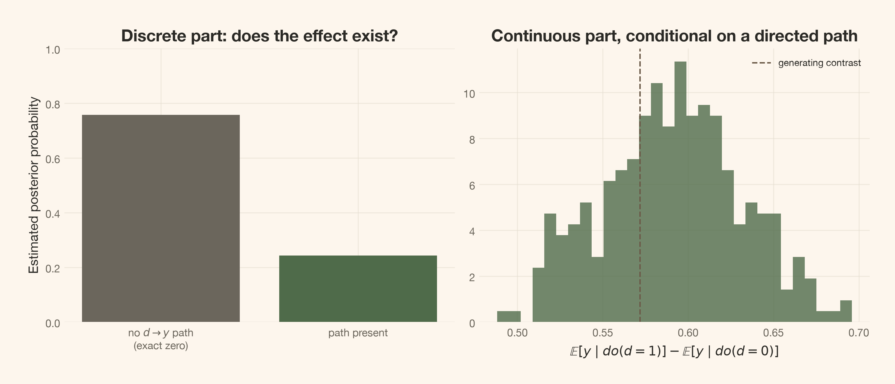
<figcaption>Figure 23: The effect posterior in two parts. Left: estimated no-path and path-present probabilities from all retained graph draws; every no-path graph has an exact zero contrast. Right: the finite contrast conditional on a path, as a histogram over composition draws, with the generating contrast marked. The histogram is normalized over path-present draws only.</figcaption>
</figure>

The reverse-d–f twin alone contributes **30.1%** of the graph posterior to no-path graphs. This is the decision consequence of the undirected edge: strong support for the class still leaves substantial uncertainty about whether intervening on d changes y.

The zero mass and the conditional quantiles are different targets, and a posterior mean would blend them into a number describing neither. The inner Monte Carlo error we report is the standard error of the paired means within each composition draw; it quantifies our numerical integration, not the coverage of any interval. These draws add no information to the graph chain: resampling graphs and mechanisms refines effect summaries at a fixed effective sample size, and honest calibration claims would need a repeated-simulation study we have not run.

The intervention values d=0 and d=1 lie within the observed range of d.

# Do the prior and posterior predict plausible data?

We should check the parameter prior in data space, not only inspect its hyperparameters. For each replicate we draw one legal graph and one complete set of mechanisms, then generate a full dataset in topological order. The graph is shared across all rows of a replicate. The prior predictive uses the same mechanism model with parameters drawn from the prior — same feature map, same priors, no data.

Prior and posterior predictive replicates

``` sourceCode
def predictive_statistics(trace, score, pairs, n_nodes, *, size, n_obs, prior, seed):
    """One graph and one mechanism draw per replicated dataset."""
    rng = np.random.default_rng(seed)
    retained = trace.posterior.edge.values.reshape(-1, len(pairs))
    output = np.empty((size, 3))
    for draw, index in enumerate(rng.integers(len(retained), size=size)):
        graph = states_to_parents(retained[index], pairs, n_nodes)
        parameters = score.draw_parameters(graph, rng, prior=prior)
        replicated = score.simulate(graph, parameters, n_obs, rng)
        output[draw] = [replicated[:, y_index].mean(),
                        replicated[:, y_index].std(ddof=1),
                        np.corrcoef(replicated[:, d_index], replicated[:, y_index])[0, 1]]
    return output


prior_predictive = predictive_statistics(
    prior_posterior, score, pairs, n_nodes,
    size=PREDICTIVE_REPLICATES, n_obs=n_obs, prior=True, seed=PREDICTIVE_SEED,
)
posterior_predictive = predictive_statistics(
    posterior, score, pairs, n_nodes,
    size=PREDICTIVE_REPLICATES, n_obs=n_obs, prior=False, seed=PREDICTIVE_SEED,
)
observed_statistics = np.array([data[:, y_index].mean(),
                                data[:, y_index].std(ddof=1),
                                np.corrcoef(data[:, d_index], data[:, y_index])[0, 1]])
```

Code

``` sourceCode
fig, axes = plt.subplots(2, 3, figsize=(12, 6))
for row, (name, stats, color) in enumerate([
        ("Prior predictive", prior_predictive, COLORS["accent"]),
        ("Posterior predictive", posterior_predictive, COLORS["primary"])]):
    for col, statistic in enumerate(["Mean of y", "SD of y", "Correlation of d and y"]):
        ax = axes[row, col]
        ax.hist(stats[:, col], bins=30, density=True, color=color, alpha=0.75)
        ax.axvline(observed_statistics[col], color=COLORS["brown"], ls="--", lw=1)
        if row == 0 and col == 1:
            ax.set_xscale("log")
        ax.set(xlabel=statistic, ylabel=f"{name}\ndensity")
plt.show()
```

<figure class="quarto-float quarto-float-fig figure">
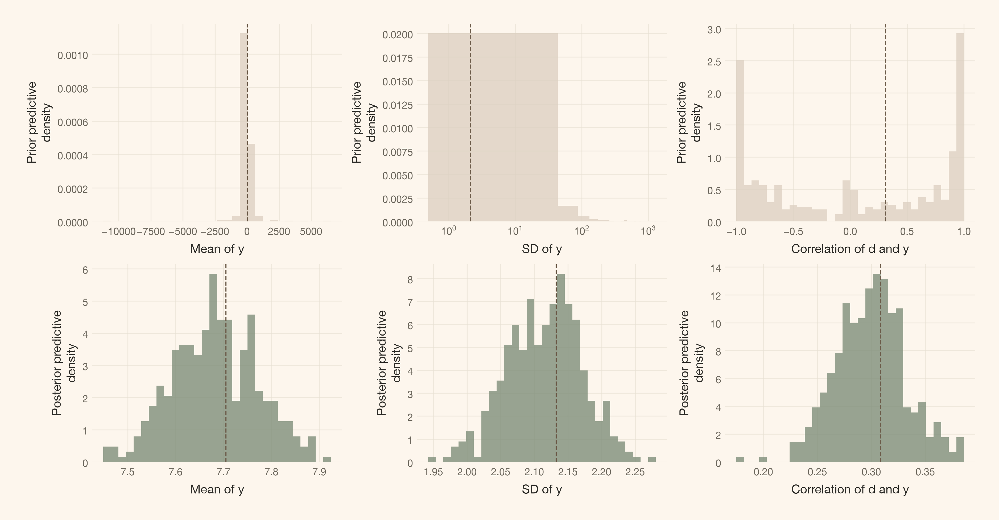
<figcaption>Figure 24: Prior (top) and posterior (bottom) predictive distributions of the mean of y, the SD of y, and the correlation of d with y, one graph and one mechanism draw per replicate. Dashed lines mark the observed summaries. The diffuse prior genuinely dwarfs the posterior; the rows use separate axes and the prior SD axis uses a log scale rather than clipping the prior or silently retuning it.</figcaption>
</figure>

The prior is deliberately diffuse: it puts substantial mass on datasets far from anything observed. The posterior contracts sharply against it. We did not clip the prior display or retune the prior to make the figure prettier.

## An independent dataset the model never saw

A held-out check uses a fresh N=300 dataset from the same world with its own seed. We make **no inference** on it. We only ask: under posterior graphs and mechanisms, does the predicted conditional mean of y — evaluated at the held-out rows’ observed parent values — track the held-out outcomes?

Posterior conditional means on independent held-out rows

``` sourceCode
heldout = make_world(HELDOUT_SEED, N_HELDOUT)
rng_heldout = np.random.default_rng(HELDOUT_PREDICTION_SEED)
retained = posterior.posterior.edge.values.reshape(-1, len(pairs))
selected = rng_heldout.integers(len(retained), size=PREDICTIVE_REPLICATES)
mu_draws = np.empty((len(selected), N_HELDOUT))
for draw, index in enumerate(selected):
    graph = states_to_parents(retained[index], pairs, n_nodes)
    parameters = score.draw_parameters(graph, rng_heldout)
    mu_draws[draw] = score.predict(graph, parameters, heldout)[:, y_index]
mu_hat = mu_draws.mean(axis=0)
residuals = heldout[:, y_index] - mu_hat
print(f"Held-out seed {HELDOUT_SEED}, N = {N_HELDOUT}; residual SD "
      f"{residuals.std(ddof=1):.3f} against outcome SD {heldout[:, y_index].std(ddof=1):.3f}")
```

    Held-out seed 20260912, N = 300; residual SD 1.020 against outcome SD 2.141

Code

``` sourceCode
fig, axes = plt.subplots(1, 2, figsize=(10, 4))
limits = np.r_[mu_hat, heldout[:, y_index]]
lo, hi = limits.min(), limits.max()
axes[0].scatter(mu_hat, heldout[:, y_index], s=10, alpha=0.5,
                color=COLORS["primary"], rasterized=True)
axes[0].plot([lo, hi], [lo, hi], ls="--", color=COLORS["ink_muted"])
axes[0].set(xlabel="predicted conditional mean of y", ylabel="held-out y",
            title="Independent held-out rows")
axes[1].scatter(mu_hat, residuals, s=10, alpha=0.5,
                color=COLORS["green_strong"], rasterized=True)
axes[1].axhline(0.0, ls="--", color=COLORS["ink_muted"])
axes[1].set(xlabel="predicted conditional mean of y", ylabel="residual",
            title="Residuals against prediction")
plt.show()
```

<figure class="quarto-float quarto-float-fig figure">
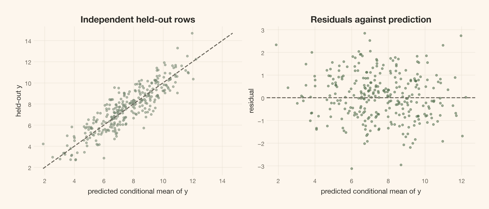
<figcaption>Figure 25: Held-out outcomes against the posterior mean of the predicted conditional mean, evaluated at the held-out rows’ own parent values and averaging over graph and parameter uncertainty; right panel shows residuals. This is a predictive check on independent data, not a refit: no posterior quantity was updated with these rows.</figcaption>
</figure>

Good predictive fit is exactly what a shared wrong model can deliver. The two worlds above predict the same observed association between d and y while disagreeing about \operatorname{do}(d). Predictive checks probe data implications; they do not adjudicate causal directions.

# Robustness without fit selection

The six repeated-data rows cross three frozen seeds with two sample sizes; the smaller sample is a prefix of the larger. They share the dictionary and priors. On the primary data, three variants change coefficient precision to \lambda=1, widen the dictionary to (-2,-1,0,1,2), or use a sparse graph prior with direction probability 0.1 and absence 0.8 before masking. The controlled linear comparator is the final row.

All runs are full-length with graph-event diagnostics; the primary row reuses the baseline fit. These are **prespecified sensitivity checks**, not a calibrated coverage study or cross-domain validation.

Repeated data and prespecified variants, all full-length

``` sourceCode
def build_score(current_data, *, lam_value=lam, centers_value=centers):
    return BasisScore(current_data, nonlinear_nodes=(y_index,), centers=centers_value,
                      width=width, loc=loc, scale=scale, tau0=tau0, lam=lam_value,
                      alpha0=alpha0, beta0=beta0)


sparse_prior = pd.DataFrame(
    sparse_direction * (1 - np.eye(n_nodes)), index=labels, columns=labels,
)
sparse_probs = pair_probabilities(sparse_prior.to_numpy(), allowed.to_numpy())

runs = []
for seed in (DATA_SEED, *REPEAT_SEEDS):
    for size in (N_REPEAT, n_obs):
        name = f"seed {seed}, N={size}" + (" (primary)" if seed == DATA_SEED and size == n_obs else "")
        if seed == DATA_SEED and size == n_obs:
            runs.append((name, posterior, baseline_probs))
        else:
            repeat_score = build_score(make_world(seed, size))
            runs.append((name, fit_graphs(repeat_score, baseline_probs, labels,
                                          seed=SAMPLING_SEED, draws=draws, tune=tune,
                                          betas=betas, chains=chains), baseline_probs))
runs += [
    ("primary, lam=1", fit_graphs(build_score(data, lam_value=lam_tight), baseline_probs,
                                  labels, seed=SAMPLING_SEED, draws=draws, tune=tune,
                                  betas=betas, chains=chains), baseline_probs),
    ("primary, centers (-2,-1,0,1,2)", fit_graphs(build_score(data, centers_value=centers_wide),
                                                  baseline_probs, labels,
                                                  seed=SAMPLING_SEED, draws=draws, tune=tune,
                                                  betas=betas, chains=chains), baseline_probs),
    ("primary, sparse graph prior", fit_graphs(score, sparse_probs, labels,
                                               seed=SAMPLING_SEED, draws=draws, tune=tune,
                                               betas=betas, chains=chains), sparse_probs),
    ("primary, linear dictionary", linear_posterior, baseline_probs),
]


def fit_metrics(trace, probabilities, truth_states, pairs, labels, truth_key):
    """Measured structural summaries and graph-event diagnostics for one run."""
    current = graph_summary(trace, pairs, n_nodes, truth_key, d_index, y_index)
    diag = azs.summary(
        graph_diagnostic_data(trace, current, probabilities, labels, pairs),
        ci_prob=0.95, round_to="none",
    )
    flat_states = current["states"].reshape(-1, len(pairs))
    powers_local = 3 ** np.arange(len(pairs))
    true_id = int((truth_states * powers_local).sum())
    binary_powers = 1 << np.arange(len(pairs))
    true_skeleton = int(((truth_states != 0) * binary_powers).sum())
    df_row = next(k for k, pair in enumerate(pairs) if tuple(pair) == (d_index, f_index))
    ids = (flat_states * powers_local).sum(axis=1)
    skeleton_codes = ((flat_states != 0) * binary_powers).sum(axis=1)
    dag_rank, dag_mass = rank_and_mass(ids, true_id)
    _, skel_mass = rank_and_mass(skeleton_codes, true_skeleton)
    pair3 = np.stack([(current["states"] == s).mean(axis=(0, 1)) for s in (0, 1, 2)], axis=1)
    arrow_rows = pair3[:, 1:].max(axis=1) >= 0.8
    df_text = f"{pair3[df_row, 1]:.2f}/{pair3[df_row, 2]:.2f}"
    if not arrow_rows[df_row]:
        df_text += " (below 0.8)"
    return {
        "True-DAG rank": dag_rank if dag_rank else "not visited",
        "True-DAG mass": dag_mass,
        "Skeleton mass": skel_mass,
        "Class mass": float(current["true_class"].mean()),
        "d→f / f→d": df_text,
        "Other arrows at 0.8": int(arrow_rows.sum() - arrow_rows[df_row]),
        "Max R-hat": float(diag.r_hat.max()),
        "Min bulk ESS": float(diag.ess_bulk.min()),
    }


robustness_rows = []
for name, trace, probabilities in runs:
    robustness_rows.append({"Specification": name, **fit_metrics(
        trace, probabilities, truth_states, pairs, labels, truth_key)})
```

<figure class="quarto-float quarto-float-tbl figure">
<table id="T_f07aa" class="caption-top table table-sm table-striped small" data-quarto-postprocess="true">
<thead>
<tr class="header">
<th id="T_f07aa_level0_col0" class="col_heading level0 col0" data-quarto-table-cell-role="th">Specification</th>
<th id="T_f07aa_level0_col1" class="col_heading level0 col1" data-quarto-table-cell-role="th">True-DAG rank</th>
<th id="T_f07aa_level0_col2" class="col_heading level0 col2" data-quarto-table-cell-role="th">True-DAG mass</th>
<th id="T_f07aa_level0_col3" class="col_heading level0 col3" data-quarto-table-cell-role="th">Skeleton mass</th>
<th id="T_f07aa_level0_col4" class="col_heading level0 col4" data-quarto-table-cell-role="th">Class mass</th>
<th id="T_f07aa_level0_col5" class="col_heading level0 col5" data-quarto-table-cell-role="th">d→f / f→d</th>
<th id="T_f07aa_level0_col6" class="col_heading level0 col6" data-quarto-table-cell-role="th">Other arrows at 0.8</th>
<th id="T_f07aa_level0_col7" class="col_heading level0 col7" data-quarto-table-cell-role="th">Max R-hat</th>
<th id="T_f07aa_level0_col8" class="col_heading level0 col8" data-quarto-table-cell-role="th">Min bulk ESS</th>
</tr>
</thead>
<tbody>
<tr class="odd">
<td id="T_f07aa_row0_col0" class="data row0 col0">seed 20260909, N=300</td>
<td id="T_f07aa_row0_col1" class="data row0 col1">1</td>
<td id="T_f07aa_row0_col2" class="data row0 col2">22.68%</td>
<td id="T_f07aa_row0_col3" class="data row0 col3">39.83%</td>
<td id="T_f07aa_row0_col4" class="data row0 col4">39.83%</td>
<td id="T_f07aa_row0_col5" class="data row0 col5">0.56/0.44 (below 0.8)</td>
<td id="T_f07aa_row0_col6" class="data row0 col6">7</td>
<td id="T_f07aa_row0_col7" class="data row0 col7">1.0009</td>
<td id="T_f07aa_row0_col8" class="data row0 col8">8067</td>
</tr>
<tr class="even">
<td id="T_f07aa_row1_col0" class="data row1 col0">seed 20260909, N=1000 (primary)</td>
<td id="T_f07aa_row1_col1" class="data row1 col1">1</td>
<td id="T_f07aa_row1_col2" class="data row1 col2">39.65%</td>
<td id="T_f07aa_row1_col3" class="data row1 col3">69.75%</td>
<td id="T_f07aa_row1_col4" class="data row1 col4">69.75%</td>
<td id="T_f07aa_row1_col5" class="data row1 col5">0.57/0.43 (below 0.8)</td>
<td id="T_f07aa_row1_col6" class="data row1 col6">7</td>
<td id="T_f07aa_row1_col7" class="data row1 col7">1.0003</td>
<td id="T_f07aa_row1_col8" class="data row1 col8">12777</td>
</tr>
<tr class="odd">
<td id="T_f07aa_row2_col0" class="data row2 col0">seed 20260910, N=300</td>
<td id="T_f07aa_row2_col1" class="data row2 col1">1</td>
<td id="T_f07aa_row2_col2" class="data row2 col2">28.59%</td>
<td id="T_f07aa_row2_col3" class="data row2 col3">51.80%</td>
<td id="T_f07aa_row2_col4" class="data row2 col4">51.80%</td>
<td id="T_f07aa_row2_col5" class="data row2 col5">0.55/0.45 (below 0.8)</td>
<td id="T_f07aa_row2_col6" class="data row2 col6">7</td>
<td id="T_f07aa_row2_col7" class="data row2 col7">1.0007</td>
<td id="T_f07aa_row2_col8" class="data row2 col8">8452</td>
</tr>
<tr class="even">
<td id="T_f07aa_row3_col0" class="data row3 col0">seed 20260910, N=1000</td>
<td id="T_f07aa_row3_col1" class="data row3 col1">1</td>
<td id="T_f07aa_row3_col2" class="data row3 col2">38.83%</td>
<td id="T_f07aa_row3_col3" class="data row3 col3">69.11%</td>
<td id="T_f07aa_row3_col4" class="data row3 col4">69.11%</td>
<td id="T_f07aa_row3_col5" class="data row3 col5">0.56/0.44 (below 0.8)</td>
<td id="T_f07aa_row3_col6" class="data row3 col6">7</td>
<td id="T_f07aa_row3_col7" class="data row3 col7">1.0004</td>
<td id="T_f07aa_row3_col8" class="data row3 col8">11027</td>
</tr>
<tr class="odd">
<td id="T_f07aa_row4_col0" class="data row4 col0">seed 20260911, N=300</td>
<td id="T_f07aa_row4_col1" class="data row4 col1">1</td>
<td id="T_f07aa_row4_col2" class="data row4 col2">21.35%</td>
<td id="T_f07aa_row4_col3" class="data row4 col3">36.91%</td>
<td id="T_f07aa_row4_col4" class="data row4 col4">36.91%</td>
<td id="T_f07aa_row4_col5" class="data row4 col5">0.56/0.44 (below 0.8)</td>
<td id="T_f07aa_row4_col6" class="data row4 col6">7</td>
<td id="T_f07aa_row4_col7" class="data row4 col7">1.0013</td>
<td id="T_f07aa_row4_col8" class="data row4 col8">8006</td>
</tr>
<tr class="even">
<td id="T_f07aa_row5_col0" class="data row5 col0">seed 20260911, N=1000</td>
<td id="T_f07aa_row5_col1" class="data row5 col1">1</td>
<td id="T_f07aa_row5_col2" class="data row5 col2">30.88%</td>
<td id="T_f07aa_row5_col3" class="data row5 col3">54.67%</td>
<td id="T_f07aa_row5_col4" class="data row5 col4">54.67%</td>
<td id="T_f07aa_row5_col5" class="data row5 col5">0.57/0.43 (below 0.8)</td>
<td id="T_f07aa_row5_col6" class="data row5 col6">7</td>
<td id="T_f07aa_row5_col7" class="data row5 col7">1.0006</td>
<td id="T_f07aa_row5_col8" class="data row5 col8">9611</td>
</tr>
<tr class="odd">
<td id="T_f07aa_row6_col0" class="data row6 col0">primary, lam=1</td>
<td id="T_f07aa_row6_col1" class="data row6 col1">1</td>
<td id="T_f07aa_row6_col2" class="data row6 col2">19.21%</td>
<td id="T_f07aa_row6_col3" class="data row6 col3">32.84%</td>
<td id="T_f07aa_row6_col4" class="data row6 col4">32.84%</td>
<td id="T_f07aa_row6_col5" class="data row6 col5">0.59/0.41 (below 0.8)</td>
<td id="T_f07aa_row6_col6" class="data row6 col6">7</td>
<td id="T_f07aa_row6_col7" class="data row6 col7">1.0007</td>
<td id="T_f07aa_row6_col8" class="data row6 col8">9081</td>
</tr>
<tr class="even">
<td id="T_f07aa_row7_col0" class="data row7 col0">primary, centers (-2,-1,0,1,2)</td>
<td id="T_f07aa_row7_col1" class="data row7 col1">1</td>
<td id="T_f07aa_row7_col2" class="data row7 col2">39.66%</td>
<td id="T_f07aa_row7_col3" class="data row7 col3">69.78%</td>
<td id="T_f07aa_row7_col4" class="data row7 col4">69.78%</td>
<td id="T_f07aa_row7_col5" class="data row7 col5">0.57/0.43 (below 0.8)</td>
<td id="T_f07aa_row7_col6" class="data row7 col6">7</td>
<td id="T_f07aa_row7_col7" class="data row7 col7">1.0003</td>
<td id="T_f07aa_row7_col8" class="data row7 col8">12760</td>
</tr>
<tr class="odd">
<td id="T_f07aa_row8_col0" class="data row8 col0">primary, sparse graph prior</td>
<td id="T_f07aa_row8_col1" class="data row8 col1">1</td>
<td id="T_f07aa_row8_col2" class="data row8 col2">54.30%</td>
<td id="T_f07aa_row8_col3" class="data row8 col3">95.42%</td>
<td id="T_f07aa_row8_col4" class="data row8 col4">95.42%</td>
<td id="T_f07aa_row8_col5" class="data row8 col5">0.57/0.43 (below 0.8)</td>
<td id="T_f07aa_row8_col6" class="data row8 col6">7</td>
<td id="T_f07aa_row8_col7" class="data row8 col7">1.0002</td>
<td id="T_f07aa_row8_col8" class="data row8 col8">29921</td>
</tr>
<tr class="even">
<td id="T_f07aa_row9_col0" class="data row9 col0">primary, linear dictionary</td>
<td id="T_f07aa_row9_col1" class="data row9 col1">1</td>
<td id="T_f07aa_row9_col2" class="data row9 col2">38.94%</td>
<td id="T_f07aa_row9_col3" class="data row9 col3">68.51%</td>
<td id="T_f07aa_row9_col4" class="data row9 col4">68.51%</td>
<td id="T_f07aa_row9_col5" class="data row9 col5">0.57/0.43 (below 0.8)</td>
<td id="T_f07aa_row9_col6" class="data row9 col6">7</td>
<td id="T_f07aa_row9_col7" class="data row9 col7">1.0003</td>
<td id="T_f07aa_row9_col8" class="data row9 col8">12917</td>
</tr>
</tbody>
</table>
<figcaption>Table 11: Repeated datasets and prespecified variants: measured, not selected</figcaption>
</figure>

Ranks and masses are estimates. “Not visited” means zero at the **2.08e-05** draw resolution, not proven zero probability.

Across the nonlinear rows, generating-class mass ranges from **32.84% to 95.42%**, versus **68.51%** for the linear comparator. The comparator’s generating-DAG rank: **1**. A better rank for one member is not, by itself, better recovery of a class whose two causal directions are observationally indistinguishable.

The arrow threshold (0.8) marks descriptive pairwise decisions, not identified directions. The count always excludes d–f; its separate probability column reports the model’s tilt even if it crosses the threshold. If a row’s diagnostics look weak, the repair is more computation on the **same** data; we never reroll a data seed to improve a table.

Finally, an exact computational check. The terminal reduction gives closed-form parent-set weights for y; the reconstructed full DAG draws must reproduce them. Agreement here validates the computation — the factorization, the sampler, and the terminal update — not the scientific assumptions behind them.

Exact terminal weights versus reconstructed draws

``` sourceCode
masks, weights = terminal_parent_distributions(score.table, pairs, baseline_probs)[y_index]
y_pairs = np.flatnonzero((pairs[:, 0] == y_index) | (pairs[:, 1] == y_index))
incoming_states = np.where(pairs[y_pairs, 1] == y_index, 1, 2)
parent_indices = np.where(pairs[y_pairs, 1] == y_index, pairs[y_pairs, 0], pairs[y_pairs, 1])
sampled_masks = (
    (posterior.posterior.edge.values[..., y_pairs] == incoming_states)
    * (1 << parent_indices)
).sum(axis=-1)
ranked_masks = np.argsort(weights)[::-1]
count = int(np.searchsorted(np.cumsum(weights[ranked_masks]), 0.95) + 1)
selected_masks = ranked_masks[:count]
terminal_rows = []
for index in selected_masks:
    parents = ", ".join(labels[node] for node in range(n_nodes) if masks[index] & (1 << node))
    terminal_rows.append({
        "Parents of y": parents or "None",
        "Exact probability": weights[index],
        "Frequency in reconstructed draws": float(np.mean(sampled_masks == masks[index])),
    })
other = ~np.isin(masks, masks[selected_masks])
terminal_rows.append({
    "Parents of y": "Other parent sets",
    "Exact probability": float(weights[other].sum()),
    "Frequency in reconstructed draws": float(np.mean(~np.isin(sampled_masks, masks[selected_masks]))),
})
display(article_table(
    pd.DataFrame(terminal_rows),
    "Exact terminal parent-set weights against MCMC frequencies",
    formats={"Exact probability": "{:.2%}", "Frequency in reconstructed draws": "{:.2%}"},
))
```

<figure class="quarto-float quarto-float-tbl figure">
<table id="T_61988" class="caption-top table table-sm table-striped small" data-quarto-postprocess="true">
<thead>
<tr class="header">
<th id="T_61988_level0_col0" class="col_heading level0 col0" data-quarto-table-cell-role="th">Parents of y</th>
<th id="T_61988_level0_col1" class="col_heading level0 col1" data-quarto-table-cell-role="th">Exact probability</th>
<th id="T_61988_level0_col2" class="col_heading level0 col2" data-quarto-table-cell-role="th">Frequency in reconstructed draws</th>
</tr>
</thead>
<tbody>
<tr class="odd">
<td id="T_61988_row0_col0" class="data row0 col0">a, b, c, e, f</td>
<td id="T_61988_row0_col1" class="data row0 col1">99.96%</td>
<td id="T_61988_row0_col2" class="data row0 col2">99.96%</td>
</tr>
<tr class="even">
<td id="T_61988_row1_col0" class="data row1 col0">Other parent sets</td>
<td id="T_61988_row1_col1" class="data row1 col1">0.04%</td>
<td id="T_61988_row1_col2" class="data row1 col2">0.04%</td>
</tr>
</tbody>
</table>
<figcaption>Table 12: Exact terminal parent-set weights against MCMC frequencies</figcaption>
</figure>

# Independent validation of the computation

Two independent oracles test more than internal consistency. Exhaustive four-node enumeration checks the compiled graph target, CPDAG orientations, and sampler. A raw-observation multivariate-t derivation checks basis evidence, parameter draws, and intervention simulation. Four representative results from each are shown below; complete results are expandable.

Run both independent oracles

``` sourceCode
checks_small = check_small_graphs(make_graph_model)
checks_basis = check_basis_score(make_graph_model)

def check_result_text(value):
    if isinstance(value, (bool, np.bool_)):
        return str(value)
    if isinstance(value, (int, np.integer)):
        return f"{value:,}"
    return f"{value:.3g}"


def full_check_frame(results):
    return pd.DataFrame({
        "Check": [name.replace("_", " ") for name in results],
        "Result": [check_result_text(value) for value in results.values()],
    })
```

<figure class="quarto-float quarto-float-tbl figure">
<table id="T_d9579" class="caption-top table table-sm table-striped small" data-quarto-postprocess="true">
<thead>
<tr class="header">
<th id="T_d9579_level0_col0" class="col_heading level0 col0" data-quarto-table-cell-role="th">Check</th>
<th id="T_d9579_level0_col1" class="col_heading level0 col1" data-quarto-table-cell-role="th">Result</th>
</tr>
</thead>
<tbody>
<tr class="odd">
<td id="T_d9579_row0_col0" class="data row0 col0">Four-node DAGs enumerated</td>
<td id="T_d9579_row0_col1" class="data row0 col1">543</td>
</tr>
<tr class="even">
<td id="T_d9579_row1_col0" class="data row1 col0">Equivalence classes enumerated</td>
<td id="T_d9579_row1_col1" class="data row1 col1">185</td>
</tr>
<tr class="odd">
<td id="T_d9579_row2_col0" class="data row2 col0">Maximum compiled-target error</td>
<td id="T_d9579_row2_col1" class="data row2 col1">3.55e-15</td>
</tr>
<tr class="even">
<td id="T_d9579_row3_col0" class="data row3 col0">Sampled-class total variation</td>
<td id="T_d9579_row3_col1" class="data row3 col1">0.010</td>
</tr>
</tbody>
</table>
<figcaption>Table 13: Finite-state oracle: four representative checks</figcaption>
</figure>

<figure class="quarto-float quarto-float-tbl figure">
<table id="T_159a0" class="caption-top table table-sm table-striped small" data-quarto-postprocess="true">
<thead>
<tr class="header">
<th id="T_159a0_level0_col0" class="col_heading level0 col0" data-quarto-table-cell-role="th">Check</th>
<th id="T_159a0_level0_col1" class="col_heading level0 col1" data-quarto-table-cell-role="th">Result</th>
</tr>
</thead>
<tbody>
<tr class="odd">
<td id="T_159a0_row0_col0" class="data row0 col0">Local families checked</td>
<td id="T_159a0_row0_col1" class="data row0 col1">224 (32 mixed)</td>
</tr>
<tr class="even">
<td id="T_159a0_row1_col0" class="data row1 col0">Evidence agreement (t / closed form)</td>
<td id="T_159a0_row1_col1" class="data row1 col1">2.03e-13</td>
</tr>
<tr class="odd">
<td id="T_159a0_row2_col0" class="data row2 col0">Local-posterior agreement</td>
<td id="T_159a0_row2_col1" class="data row2 col1">2.11e-13</td>
</tr>
<tr class="even">
<td id="T_159a0_row3_col0" class="data row3 col0">Prediction / simulation / do agreement</td>
<td id="T_159a0_row3_col1" class="data row3 col1">4.44e-16</td>
</tr>
</tbody>
</table>
<figcaption>Table 14: Basis and mechanism oracles: four representative checks</figcaption>
</figure>

Complete finite-state results

<figure class="quarto-float quarto-float-tbl figure">
<table id="T_8d23f" class="caption-top table table-sm table-striped small" data-quarto-postprocess="true">
<thead>
<tr class="header">
<th id="T_8d23f_level0_col0" class="col_heading level0 col0" data-quarto-table-cell-role="th">Check</th>
<th id="T_8d23f_level0_col1" class="col_heading level0 col1" data-quarto-table-cell-role="th">Result</th>
</tr>
</thead>
<tbody>
<tr class="odd">
<td id="T_8d23f_row0_col0" class="data row0 col0">four node DAGs</td>
<td id="T_8d23f_row0_col1" class="data row0 col1">543</td>
</tr>
<tr class="even">
<td id="T_8d23f_row1_col0" class="data row1 col0">four node CPDAGs</td>
<td id="T_8d23f_row1_col1" class="data row1 col1">185</td>
</tr>
<tr class="odd">
<td id="T_8d23f_row2_col0" class="data row2 col0">cyclic states rejected</td>
<td id="T_8d23f_row2_col1" class="data row2 col1">186</td>
</tr>
<tr class="even">
<td id="T_8d23f_row3_col0" class="data row3 col0">maximum target error</td>
<td id="T_8d23f_row3_col1" class="data row3 col1">3.55e-15</td>
</tr>
<tr class="odd">
<td id="T_8d23f_row4_col0" class="data row4 col0">maximum score equivalence error</td>
<td id="T_8d23f_row4_col1" class="data row4 col1">0</td>
</tr>
<tr class="even">
<td id="T_8d23f_row5_col0" class="data row5 col0">sampled class total variation</td>
<td id="T_8d23f_row5_col1" class="data row5 col1">0.0105</td>
</tr>
<tr class="odd">
<td id="T_8d23f_row6_col0" class="data row6 col0">masked core full joint TV</td>
<td id="T_8d23f_row6_col1" class="data row6 col1">0.00484</td>
</tr>
<tr class="even">
<td id="T_8d23f_row7_col0" class="data row7 col0">subnormal prior max probability error</td>
<td id="T_8d23f_row7_col1" class="data row7 col1">0.0113</td>
</tr>
<tr class="odd">
<td id="T_8d23f_row8_col0" class="data row8 col0">two state periodicity max probability error</td>
<td id="T_8d23f_row8_col1" class="data row8 col1">0.003</td>
</tr>
<tr class="even">
<td id="T_8d23f_row9_col0" class="data row9 col0">y sink valid DAGs</td>
<td id="T_8d23f_row9_col1" class="data row9 col1">200</td>
</tr>
<tr class="odd">
<td id="T_8d23f_row10_col0" class="data row10 col0">y sink terminal parent masks</td>
<td id="T_8d23f_row10_col1" class="data row10 col1">8</td>
</tr>
<tr class="even">
<td id="T_8d23f_row11_col0" class="data row11 col0">y sink full joint TV</td>
<td id="T_8d23f_row11_col1" class="data row11 col1">0.0114</td>
</tr>
<tr class="odd">
<td id="T_8d23f_row12_col0" class="data row12 col0">y sink class TV</td>
<td id="T_8d23f_row12_col1" class="data row12 col1">0.0043</td>
</tr>
<tr class="even">
<td id="T_8d23f_row13_col0" class="data row13 col0">non last terminal</td>
<td id="T_8d23f_row13_col1" class="data row13 col1">0</td>
</tr>
<tr class="odd">
<td id="T_8d23f_row14_col0" class="data row14 col0">multiple terminal count</td>
<td id="T_8d23f_row14_col1" class="data row14 col1">2</td>
</tr>
<tr class="even">
<td id="T_8d23f_row15_col0" class="data row15 col0">non last full joint TV</td>
<td id="T_8d23f_row15_col1" class="data row15 col1">0.0192</td>
</tr>
<tr class="odd">
<td id="T_8d23f_row16_col0" class="data row16 col0">multiple terminal full joint TV</td>
<td id="T_8d23f_row16_col1" class="data row16 col1">0.0175</td>
</tr>
<tr class="even">
<td id="T_8d23f_row17_col0" class="data row17 col0">fixed graph active pairs</td>
<td id="T_8d23f_row17_col1" class="data row17 col1">0</td>
</tr>
<tr class="odd">
<td id="T_8d23f_row18_col0" class="data row18 col0">forced cycle rejected</td>
<td id="T_8d23f_row18_col1" class="data row18 col1">True</td>
</tr>
<tr class="even">
<td id="T_8d23f_row19_col0" class="data row19 col0">reset trajectory agreement</td>
<td id="T_8d23f_row19_col1" class="data row19 col1">True</td>
</tr>
</tbody>
</table>
<figcaption>Table 15: Complete checks of graphs, equivalence classes, and sampler behavior</figcaption>
</figure>

Complete basis and mechanism results

<figure class="quarto-float quarto-float-tbl figure">
<table id="T_36680" class="caption-top table table-sm table-striped small" data-quarto-postprocess="true">
<thead>
<tr class="header">
<th id="T_36680_level0_col0" class="col_heading level0 col0" data-quarto-table-cell-role="th">Check</th>
<th id="T_36680_level0_col1" class="col_heading level0 col1" data-quarto-table-cell-role="th">Result</th>
</tr>
</thead>
<tbody>
<tr class="odd">
<td id="T_36680_row0_col0" class="data row0 col0">legal families checked</td>
<td id="T_36680_row0_col1" class="data row0 col1">224</td>
</tr>
<tr class="even">
<td id="T_36680_row1_col0" class="data row1 col0">t oracle max abs error</td>
<td id="T_36680_row1_col1" class="data row1 col1">2.03e-13</td>
</tr>
<tr class="odd">
<td id="T_36680_row2_col0" class="data row2 col0">closed form max abs error</td>
<td id="T_36680_row2_col1" class="data row2 col1">1.07e-14</td>
</tr>
<tr class="even">
<td id="T_36680_row3_col0" class="data row3 col0">local posterior max abs error</td>
<td id="T_36680_row3_col1" class="data row3 col1">2.11e-13</td>
</tr>
<tr class="odd">
<td id="T_36680_row4_col0" class="data row4 col0">mixed families checked</td>
<td id="T_36680_row4_col1" class="data row4 col1">32</td>
</tr>
<tr class="even">
<td id="T_36680_row5_col0" class="data row5 col0">mixed oracle max abs error</td>
<td id="T_36680_row5_col1" class="data row5 col1">2.11e-13</td>
</tr>
<tr class="odd">
<td id="T_36680_row6_col0" class="data row6 col0">intercept only families checked</td>
<td id="T_36680_row6_col1" class="data row6 col1">28</td>
</tr>
<tr class="even">
<td id="T_36680_row7_col0" class="data row7 col0">N1 N lt p max abs error</td>
<td id="T_36680_row7_col1" class="data row7 col1">1.02e-14</td>
</tr>
<tr class="odd">
<td id="T_36680_row8_col0" class="data row8 col0">duplicated input max abs error</td>
<td id="T_36680_row8_col1" class="data row8 col1">3.2e-13</td>
</tr>
<tr class="even">
<td id="T_36680_row9_col0" class="data row9 col0">N0 max abs log evidence</td>
<td id="T_36680_row9_col1" class="data row9 col1">0</td>
</tr>
<tr class="odd">
<td id="T_36680_row10_col0" class="data row10 col0">N0 local posterior max abs error</td>
<td id="T_36680_row10_col1" class="data row10 col1">0</td>
</tr>
<tr class="even">
<td id="T_36680_row11_col0" class="data row11 col0">N0 prior draw KS</td>
<td id="T_36680_row11_col1" class="data row11 col1">0.0131</td>
</tr>
<tr class="odd">
<td id="T_36680_row12_col0" class="data row12 col0">posterior draw variance KS</td>
<td id="T_36680_row12_col1" class="data row12 col1">0.00884</td>
</tr>
<tr class="even">
<td id="T_36680_row13_col0" class="data row13 col0">posterior draw coefficients KS</td>
<td id="T_36680_row13_col1" class="data row13 col1">0.0149</td>
</tr>
<tr class="odd">
<td id="T_36680_row14_col0" class="data row14 col0">posterior mean max z</td>
<td id="T_36680_row14_col1" class="data row14 col1">1.45</td>
</tr>
<tr class="even">
<td id="T_36680_row15_col0" class="data row15 col0">posterior mean variance max z</td>
<td id="T_36680_row15_col1" class="data row15 col1">1.27</td>
</tr>
<tr class="odd">
<td id="T_36680_row16_col0" class="data row16 col0">prior draw KS</td>
<td id="T_36680_row16_col1" class="data row16 col1">0.0156</td>
</tr>
<tr class="even">
<td id="T_36680_row17_col0" class="data row17 col0">block max abs error</td>
<td id="T_36680_row17_col1" class="data row17 col1">0</td>
</tr>
<tr class="odd">
<td id="T_36680_row18_col0" class="data row18 col0">predict max abs error</td>
<td id="T_36680_row18_col1" class="data row18 col1">0</td>
</tr>
<tr class="even">
<td id="T_36680_row19_col0" class="data row19 col0">simulate max abs error</td>
<td id="T_36680_row19_col1" class="data row19 col1">4.44e-16</td>
</tr>
<tr class="odd">
<td id="T_36680_row20_col0" class="data row20 col0">do replacement max abs error</td>
<td id="T_36680_row20_col1" class="data row20 col1">4.44e-16</td>
</tr>
<tr class="even">
<td id="T_36680_row21_col0" class="data row21 col0">no path effect max abs</td>
<td id="T_36680_row21_col1" class="data row21 col1">0</td>
</tr>
<tr class="odd">
<td id="T_36680_row22_col0" class="data row22 col0">config aliasing max delta</td>
<td id="T_36680_row22_col1" class="data row22 col1">0</td>
</tr>
<tr class="even">
<td id="T_36680_row23_col0" class="data row23 col0">unit transform jacobian error</td>
<td id="T_36680_row23_col1" class="data row23 col1">3.55e-15</td>
</tr>
<tr class="odd">
<td id="T_36680_row24_col0" class="data row24 col0">unit transform table error</td>
<td id="T_36680_row24_col1" class="data row24 col1">3.55e-15</td>
</tr>
<tr class="even">
<td id="T_36680_row25_col0" class="data row25 col0">noncoherent beta0 gap</td>
<td id="T_36680_row25_col1" class="data row25 col1">0.3</td>
</tr>
<tr class="odd">
<td id="T_36680_row26_col0" class="data row26 col0">domain rejections verified</td>
<td id="T_36680_row26_col1" class="data row26 col1">36</td>
</tr>
<tr class="even">
<td id="T_36680_row27_col0" class="data row27 col0">domain acceptances verified</td>
<td id="T_36680_row27_col1" class="data row27 col1">8</td>
</tr>
<tr class="odd">
<td id="T_36680_row28_col0" class="data row28 col0">pymc target constant error</td>
<td id="T_36680_row28_col1" class="data row28 col1">7.11e-15</td>
</tr>
<tr class="even">
<td id="T_36680_row29_col0" class="data row29 col0">pymc target constant spread</td>
<td id="T_36680_row29_col1" class="data row29 col1">7.11e-15</td>
</tr>
<tr class="odd">
<td id="T_36680_row30_col0" class="data row30 col0">pymc target cycles rejected</td>
<td id="T_36680_row30_col1" class="data row30 col1">2</td>
</tr>
<tr class="even">
<td id="T_36680_row31_col0" class="data row31 col0">full DAGs enumerated</td>
<td id="T_36680_row31_col1" class="data row31 col1">12</td>
</tr>
<tr class="odd">
<td id="T_36680_row32_col0" class="data row32 col0">full DAG sampler TV</td>
<td id="T_36680_row32_col1" class="data row32 col1">0.0108</td>
</tr>
<tr class="even">
<td id="T_36680_row33_col0" class="data row33 col0">full DAG sampler max cell error</td>
<td id="T_36680_row33_col1" class="data row33 col1">0.00353</td>
</tr>
<tr class="odd">
<td id="T_36680_row34_col0" class="data row34 col0">terminal parent marginal error</td>
<td id="T_36680_row34_col1" class="data row34 col1">0.004</td>
</tr>
<tr class="even">
<td id="T_36680_row35_col0" class="data row35 col0">class TV descriptive</td>
<td id="T_36680_row35_col1" class="data row35 col1">0.00567</td>
</tr>
<tr class="odd">
<td id="T_36680_row36_col0" class="data row36 col0">non score equivalence gap</td>
<td id="T_36680_row36_col1" class="data row36 col1">0.282</td>
</tr>
</tbody>
</table>
<figcaption>Table 16: Complete checks of evidence, parameter draws, prediction, and interventions</figcaption>
</figure>

The four-node oracle validates the sampler and the CPDAG machinery at a size where truth is enumerable; it is **not** a seven-node exhaustive normalization. The evidence code in [graph_math.py](graph_math.py) is matched here against a separately written likelihood on raw observations, so the folded derivation above is checked rather than asserted. The classical Gaussian score of [Geiger and Heckerman (1994)](https://www.microsoft.com/en-us/research/publication/learning-gaussian-networks/) (with [Kuipers, Moffa, and Heckerman (2014)](https://doi.org/10.1214/14-AOS1217)) survives only inside this numerical oracle; it is not the model of this article.

# Considerations

## What transfers, and what must be re-declared

This seven-node demo is a recipe, not a library. Its value across domains is that every assumption above is explicit enough to re-declare. The table below proposes mappings; **none of these applications has been fitted here**.

Each node is a local response: its \beta\_{0i} uses that variable’s squared units. The precision multipliers \tau_0,\lambda and shape \alpha_0 are dimensionless. Locations and scales use raw predictor units; basis centers and widths use the resulting dimensionless z units.

| Domain | Proposed node mapping | Continuous iid approximation | Re-declare before use | Key likely violation | Required unsupported extension |
|----|----|----|----|----|----|
| Biology | a,b baseline biomarkers; d dose or exposure; e pathway activity; f receptor response; y clinical outcome | patients as independent rows, continuous measurements | measurement units, dictionary, variance-prior scales \beta\_{0i}, outcome-terminal mask as clinical knowledge | hidden severity and selection into treatment | latent-confounder graphs (MAG/PAG), count or ordinal outcomes, patient-level pooling |
| Industrial | a,b ambient conditions; d control setting; e intermediate temperature; f sensor reading; y quality metric | batches as iid, continuous sensors | units and scales per sensor, variance-prior scales \beta\_{0i}, forbidden arrows only where time ordering licenses them | feedback loops and time autocorrelation | dynamic graphs, autoregressive noise, state-space mechanisms |
| Marketing | a,b audience traits; d calendar/holiday driver; e engagement; f media exposure; y conversion value | continuous indices as an iid approximation, not literal calendar counts or spend | units, exposure link, variance-prior scales \beta\_{0i}, media cannot cause the calendar | shared calendar shocks, temporal dependence, budget-driven confounding | time-series mechanisms, count likelihoods, hierarchical pooling, hidden-confounder models |

The generic assumptions deserve repeating precisely: independent, complete observations on fixed, correctly measured nodes; causal Markov and faithfulness; no measurement error, no hidden common causes, no selection, no feedback; additive mechanisms without interactions; homoscedastic Gaussian residuals per node. Violating the mask or hiding a cause is the sharpest failure mode: a wrong hard mask and an omitted common cause can produce **sharp, confident, wrong posteriors that MCMC diagnostics cannot flag**, because the chains converge beautifully to the wrong conditional target.

Two more limits belong to the mechanism layer itself. Additivity forbids interactions: if d matters only when b is high, no additive dictionary recovers that. Far from the bump centers, their contributions tend to zero and the linear z term dominates: there is no saturating extrapolation guarantee even though the true h saturates. The local table grows as n\\2^{n-1}; seven nodes is a demo, not a scale claim.

## What the framework cannot tell us

Predictive fit cannot adjudicate causal direction — the twin above is the constructive proof. MCMC diagnostics provide evidence about exploration of the coded target; they cannot rule out a shared, unvisited mode or validate the target’s assumptions. The exact terminal check tests arithmetic. No coverage study has been run, and no selection rule (“take the top DAG”) comes with an error-rate guarantee.

PyMC’s role is real but bounded. It holds the discrete unknown, compiles its log density, manages chains and random streams, and returns dimension-labeled draws and sampler statistics; the named-tensor model makes the target inspectable. The custom compiled kernel supplies legal discrete moves. Writing an adjacency variable in a probabilistic program supplies none of this by itself. Ordinary HMC or NUTS does not traverse DAG states at all.

# Conclusions

We started with a small discomfort: a Bayesian posterior can describe uncertainty carefully while leaving the model itself unquestioned.

Our response was not to remove assumptions. It was to make one part of them uncertain, in a world with linear upstream mechanisms and Michaelis–Menten effects into y. We wrote a proper conjugate score on a fixed approximating dictionary, encoded directional beliefs and hard knowledge, ran PyMC MCMC on the unresolved core, and reconstructed full graphs with exact terminal-parent draws. We compared an explicit holiday restriction with the baseline, then carried the baseline graph weights into a finite nonlinear intervention with an exact structural zero.

Five things are worth keeping:

1.  **A graph is part of a model, not the whole model.** Its probability depends on the dictionary, the parameter priors, and the graph prior we chose. The upstream linear families contain their generating mechanisms; at y, the dictionary approximates the truth even when its integration is exact.
2.  **Different summaries answer different questions.** A skeleton groups connections; a CPDAG groups conditional independences; the DAG posterior keeps member weights. A CPDAG is a graphical equivalence, not a claim that nonlinear likelihoods coincide.
3.  **Model averaging preserves alternatives; it does not guarantee truth.** An exact-zero component and a positive-effect component can both matter, and a posterior mean describes neither. Unequal mass on an undecided pair is not automatically an “artifact”, and it is not identification either; the finite dictionary is **not guaranteed score-equivalent** — Markov-equivalent DAGs need not receive equal evidence.
4.  **Diagnostics check computation, not assumptions.** Good \widehat R and ESS on monitored graph events support the computation without proving complete exploration. They do not test whether a mask is correct or a cause is missing.
5.  **Transfer requires re-declaration.** Units, priors, and masks must be rewritten in each domain’s terms, and the likely violations named before, not after, the fit.

The next source of evidence must address the disputed direction. In the abstract SCM, randomizing d and measuring f or y would separate the twin worlds; in the holiday analogy, randomizing d is not a feasible study. The calendar’s autonomy instead supplies the directional restriction we examined. More observations from the same distribution cannot replace that external knowledge.

**If the decision depends on whether changing d changes y, what evidence would separate the remaining causal stories?**

## Recommended readings

1.  [Verma, T. and Pearl, J. (1990), *Equivalence and Synthesis of Causal Models*](https://ftp.cs.ucla.edu/pub/stat_ser/R150.pdf).
2.  [Chickering, D. M. (2002), *Learning Equivalence Classes of Bayesian-Network Structures*](https://www.jmlr.org/papers/volume2/chickering02a/chickering02a.pdf), especially the DAG-to-CPDAG algorithms in Figures 4–5.
3.  [Peters, J., Mooij, J. M., Janzing, D., and Schölkopf, B. (2014), *Causal Discovery with Continuous Additive Noise Models*](https://jmlr.org/papers/v15/peters14a.html).
4.  [Vehtari, A. et al. (2021), *Rank-Normalization, Folding, and Localization: An Improved R-hat for Assessing Convergence of MCMC*](https://doi.org/10.1214/20-BA1221).
5.  [Geiger, D. and Heckerman, D. (1994), *Learning Gaussian Networks*](https://www.microsoft.com/en-us/research/publication/learning-gaussian-networks/) and [Kuipers, J., Moffa, G., and Heckerman, D. (2014), *Addendum on the Scoring of Gaussian Directed Acyclic Graphical Models*](https://doi.org/10.1214/14-AOS1217) — numerical oracle context in this article.
6.  [PyMC: named dimensions](https://www.pymc.io/projects/docs/en/stable/learn/core_notebooks/dims_module.html) and [PyTensor: xtensor](https://pytensor.readthedocs.io/en/latest/library/xtensor/index.html).

------------------------------------------------------------------------

## Watermark

Executed software versions

``` sourceCode
for package in ("pymc", "pymc-marketing", "pytensor", "arviz", "arviz-base", "arviz-stats",
                "numpy", "scipy", "numba"):
    print(f"{package}: {version(package)}")
```

    pymc: 6.3.2
    pymc-marketing: 1.2.0
    pytensor: 3.3.1
    arviz: 1.3.0
    arviz-base: 1.3.0
    arviz-stats: 1.3.2
    numpy: 2.4.6
    scipy: 1.18.0
    numba: 0.65.1
