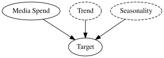
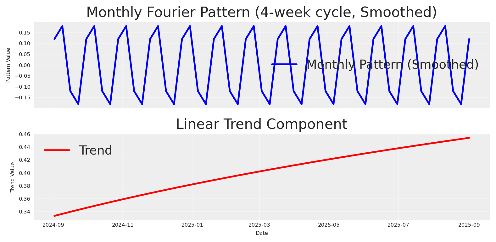
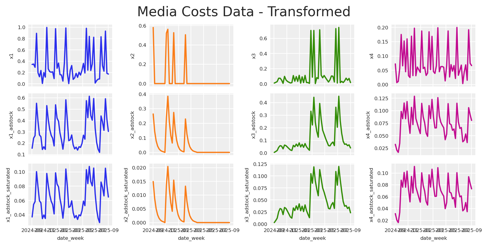
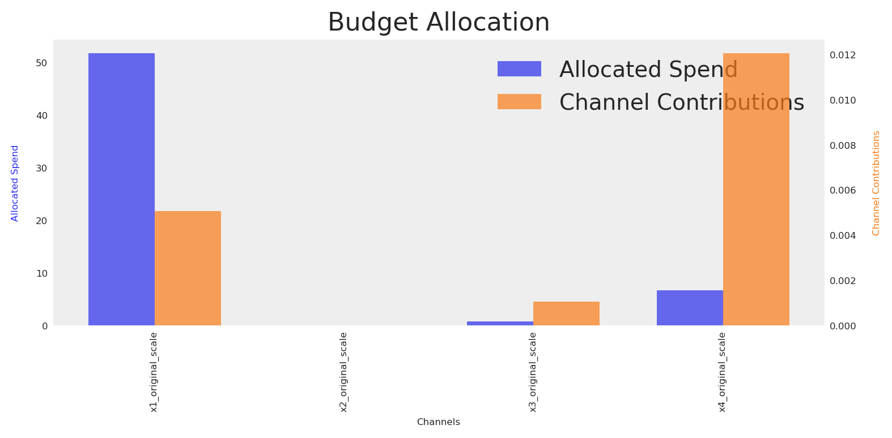
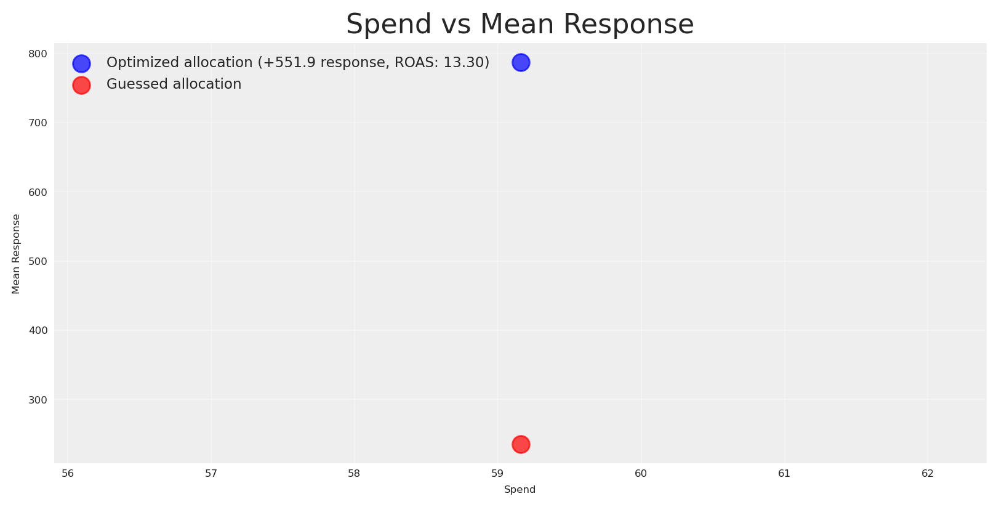
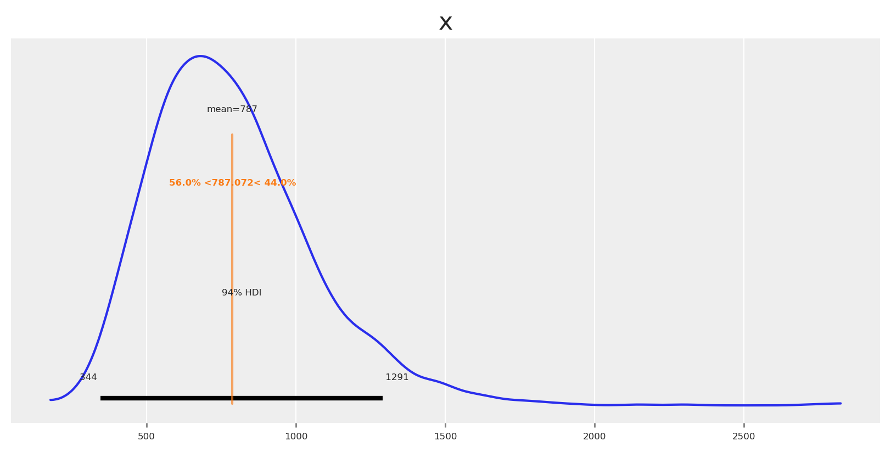
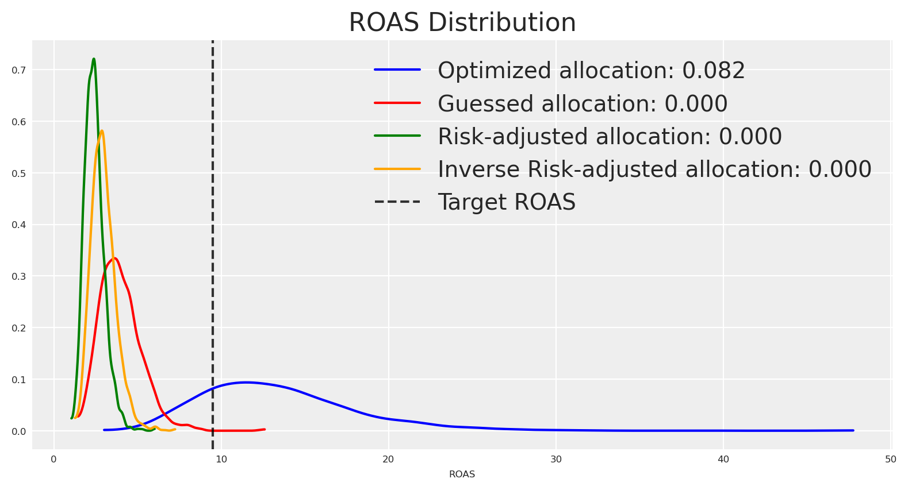
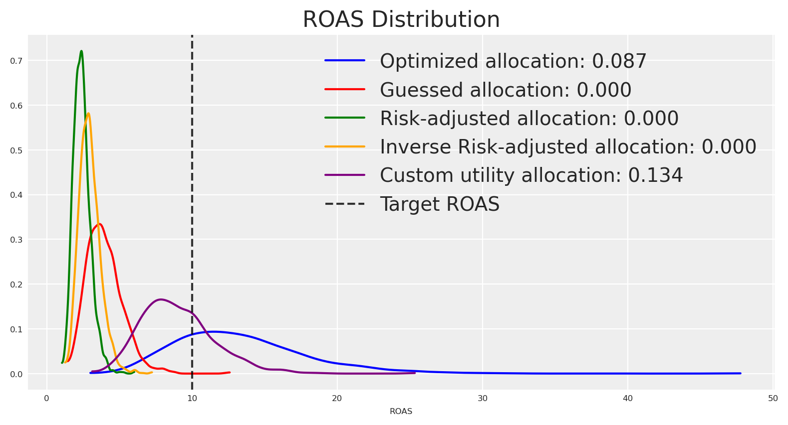
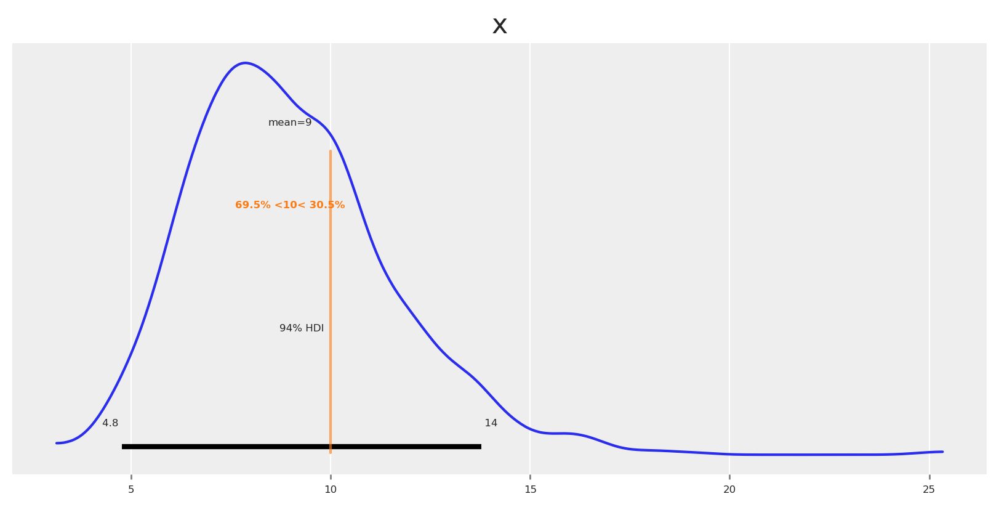

<div id="title-block-header" class="quarto-title-block default">

<div class="quarto-title">

<div class="quarto-title-block">

<div>

# Bayesian Models and Risk Optimization

Code

- <a href="javascript:void(0)" id="quarto-show-all-code" class="dropdown-item" role="button">Show All Code</a>

- <a href="javascript:void(0)" id="quarto-hide-all-code" class="dropdown-item" role="button">Hide All Code</a>

- 

  ------------------------------------------------------------------------

- <a href="javascript:void(0)" id="quarto-view-source" class="dropdown-item" role="button">View Source</a>

</div>

</div>

<div class="quarto-categories">

<div class="quarto-category">

MMM

</div>

<div class="quarto-category">

python

</div>

<div class="quarto-category">

optimization

</div>

<div class="quarto-category">

media mix modeling

</div>

<div class="quarto-category">

bayesian

</div>

<div class="quarto-category">

pymc

</div>

<div class="quarto-category">

pydata

</div>

<div class="quarto-category">

germany

</div>

<div class="quarto-category">

berlin

</div>

</div>

</div>

<div>

<div class="description">

Bayesian models and risk optimization for marketing budgets, presented at PyData Berlin 2025.

</div>

</div>

<div class="quarto-title-meta">

<div>

<div class="quarto-title-meta-heading">

Author

</div>

<div class="quarto-title-meta-contents">

Carlos Trujillo

</div>

</div>

<div>

<div class="quarto-title-meta-heading">

Published

</div>

<div class="quarto-title-meta-contents">

August 20, 2025

</div>

</div>

</div>

</div>

<div id="introduction" class="section level1">

# 📘 Introduction

This article explores how Bayesian Media Mix Modeling (MMM) represents uncertainty and how we can optimize budget decisions under risk. We build a generative view of media response (carryover via adstock, diminishing returns via saturation, trend and seasonality) and use full posterior predictive distributions to compare allocations not only by expected outcomes but also by dispersion and tail risk.

This material accompanies my PyData Berlin 2025 talk, where I discuss practical risk-aware optimization for MMM: moving beyond mean-only plans to objectives that explicitly incorporate uncertainty—and how to communicate these trade-offs to stakeholders.

</div>

<div id="import-libraries" class="section level1">

# 📦 Import libraries

<div id="22877ff9" class="cell" execution_count="1">

Code

<div id="cb1" class="sourceCode cell-code">

``` sourceCode
import warnings
warnings.filterwarnings("ignore", category=UserWarning)

from pymc_marketing.mmm.builders.yaml import build_mmm_from_yaml
from pymc_marketing.mmm import GeometricAdstock, MichaelisMentenSaturation
from pymc_marketing.mmm.budget_optimizer import optimizer_xarray_builder
from pymc_marketing.mmm.multidimensional import (
    MultiDimensionalBudgetOptimizerWrapper,
)
from pymc_extras.prior import Prior
from pymc_marketing.mmm import utility as ut

from scipy import ndimage

import arviz as az
import matplotlib.pyplot as plt
import seaborn as sns

import numpy as np
import pandas as pd
import xarray as xr
```

</div>

</div>

</div>

<div id="notebook-setup" class="section level1">

# ⚙️ Notebook setup

<div id="5d73d96b" class="cell" execution_count="2">

Code

<div id="cb2" class="sourceCode cell-code">

``` sourceCode
az.style.use("arviz-darkgrid")
plt.rcParams["figure.figsize"] = [8, 4]
plt.rcParams["figure.dpi"] = 100
plt.rcParams["axes.labelsize"] = 6
plt.rcParams["xtick.labelsize"] = 6
plt.rcParams["ytick.labelsize"] = 6
plt.rcParams.update({"figure.constrained_layout.use": True})

%load_ext autoreload
%autoreload 2

seed: int = sum(map(ord, "pydata_berlin_2025"))
rng: np.random.Generator = np.random.default_rng(seed=seed)
default_figsize = (8, 4) # repeat to use later
```

</div>

</div>

</div>

<div id="data-generation-process" class="section level1">

# 🧪 Data generation process

We simulate outcomes as <span class="math display"> y_t = \beta_0 + \sum\_{c} f(x\_{c,t}; \theta_c) + \text{trend}\_t + \text{seasonality}\_t + \varepsilon_t </span>

where:

- <span class="math inline">y_t</span> is the observed outcome (e.g., app installs or revenue) at time <span class="math inline">t</span>
- <span class="math inline">\beta_0</span> is the baseline intercept
- <span class="math inline">f(x\_{c,t}; \theta_c)</span> is the media response function for channel <span class="math inline">c</span> with spend <span class="math inline">x\_{c,t}</span> and parameters <span class="math inline">\theta_c</span>.
- <span class="math inline">\text{trend}\_t</span> captures long-term growth or decline patterns
- <span class="math inline">\text{seasonality}\_t</span> models periodic effects (weekly, monthly patterns)
- <span class="math inline">\varepsilon_t</span> represents aleatoric uncertainty—irreducible noise from unobserved factors, measurement error, and inherent randomness that remains even with perfect knowledge of all parameters

We do not consider interactions; the causal DAG looks like this:

<div id="371020ee" class="cell" execution_count="3">

Code

<div id="cb3" class="sourceCode cell-code">

``` sourceCode
import graphviz

graph = graphviz.Digraph()
graph.node("Media Spend")
graph.node("Trend", style="dashed")
graph.node("Seasonality", style="dashed")
graph.node("Target")

graph.edge("Media Spend", "Target")
graph.edge("Trend", "Target")
graph.edge("Seasonality", "Target")

graph
```

</div>

<div class="cell-output cell-output-display" execution_count="3">

<div>

<figure class="figure">
<p></p>
</figure>

</div>

</div>

</div>

<div id="date-range" class="section level2">

## 📆 Date range

We start by defining the date range.

<div id="706fab8f" class="cell" execution_count="4">

Code

<div id="cb4" class="sourceCode cell-code">

``` sourceCode
# date range
min_date = pd.to_datetime("2024-09-01")
max_date = pd.to_datetime("2025-09-01")

df = pd.DataFrame(
    data={"date_week": pd.date_range(start=min_date, end=max_date, freq="W-MON")}
)

n = df.shape[0]
print(f"Number of observations: {n}")
print("Date Range: {} to {}".format(df.date_week.min(), df.date_week.max()))
```

</div>

<div class="cell-output cell-output-stdout">

    Number of observations: 53
    Date Range: 2024-09-02 00:00:00 to 2025-09-01 00:00:00

</div>

</div>

</div>

<div id="media-data" class="section level2">

## 📣 Media data

<div id="f1564853" class="cell" execution_count="5">

Code

<div id="cb6" class="sourceCode cell-code">

``` sourceCode
# media data
scaler_x1 = 300
scaler_x2 = 280
scaler_x3 = 50
scaler_x4 = 100
y_scaler = 1000

# media data
x1 = rng.uniform(low=0.0, high=1.0, size=n)
df["x1"] = np.where(x1 > 0.8, x1, x1 / 2)

x2 = rng.uniform(low=0.0, high=0.6, size=n)
df["x2"] = np.where(x2 > 0.5, x2, 0)

x3 = rng.uniform(low=0.0, high=0.8, size=n)
df["x3"] = np.where(x3 > 0.7, x3, x3 / 6)

x4 = rng.uniform(low=0.0, high=0.2, size=n)
df["x4"] = np.where(x4 > 0.15, x4, x4 / 2)


fig, ax = plt.subplots(
    nrows=4, ncols=1, sharex=True, sharey=True, layout="constrained"
)
sns.lineplot(x="date_week", y="x1", data=df, color="C0", ax=ax[0])
sns.lineplot(x="date_week", y="x2", data=df, color="C1", ax=ax[1])
sns.lineplot(x="date_week", y="x3", data=df, color="C2", ax=ax[2])
sns.lineplot(x="date_week", y="x4", data=df, color="C3", ax=ax[3])
ax[3].set(xlabel="date")
fig.suptitle("Media Costs Data", fontsize=16);
```

</div>

<div class="cell-output cell-output-display">

<div>

<figure class="figure">
<p></p>
</figure>

</div>

</div>

</div>

</div>

<div id="trend-and-seasonality-components" class="section level2">

## 📈 Trend and seasonality components

We define trend and seasonality. Seasonality follows a 4-week cycle modeled with a Fourier basis; trend is linear.

<div id="9e8b570e" class="cell" execution_count="6">

Code

<div id="cb7" class="sourceCode cell-code">

``` sourceCode
# Create Fourier components for monthly seasonality
monthly_period = 4  # 4-week cycle
t = np.arange(n)

# Create sin-cos signals for fourier components
monthly_sin = np.sin(2 * np.pi * t / monthly_period)
monthly_cos = np.cos(2 * np.pi * t / monthly_period)

# Combine sin-cos to create the desired pattern
# Use coefficients to shape the pattern
monthly_pattern = 0.6 * monthly_sin + 0.4 * monthly_cos

# Apply smoothing using ndimage to reduce sharp transitions
monthly_pattern = ndimage.gaussian_filter1d(monthly_pattern, sigma=0.2)

# Normalize to [-1, 1] range
monthly_pattern = (monthly_pattern / np.max(np.abs(monthly_pattern))) * .18

df["monthly_effect"] = monthly_pattern
df["trend"] = (np.linspace(start=0.0, stop=10, num=n) + 10) ** (1 / 8) - 1

fig, (ax1, ax2) = plt.subplots(2, 1, sharex=True)

# Plot monthly pattern
ax1.plot(df["date_week"], monthly_pattern, label="Monthly Pattern (Smoothed)", linewidth=2, color='blue')
ax1.set_ylabel("Pattern Value")
ax1.set_title("Monthly Fourier Pattern (4-week cycle, Smoothed)")
ax1.grid(True, alpha=0.3)
ax1.legend()

# Plot trend
ax2.plot(df["date_week"], df["trend"], label="Trend", linewidth=2, color='red')
ax2.set_xlabel("Date")
ax2.set_ylabel("Trend Value")
ax2.set_title("Linear Trend Component")
ax2.grid(True, alpha=0.3)
ax2.legend()

plt.tight_layout()
plt.show()
```

</div>

<div class="cell-output cell-output-display">

<div>

<figure class="figure">
<p></p>
</figure>

</div>

</div>

</div>

</div>

<div id="adstock-and-saturation-transformations" class="section level2">

## 🔁 Adstock and saturation transformations

First, we apply the adstock transformation to the media data.

<div id="f0e45c5c" class="cell" execution_count="7">

Code

<div id="cb8" class="sourceCode cell-code">

``` sourceCode
# apply geometric adstock transformation
alpha: float = 0.55

df["x1_adstock"] = (
    GeometricAdstock(l_max=8, normalize=True).function(x=df["x1"].to_numpy(), alpha=alpha)
    .eval()
)

df["x2_adstock"] = (
    GeometricAdstock(l_max=8, normalize=True).function(x=df["x2"].to_numpy(), alpha=alpha)
    .eval()
)

df["x3_adstock"] = (
    GeometricAdstock(l_max=8, normalize=True).function(x=df["x3"].to_numpy(), alpha=alpha)
    .eval()
)

df["x4_adstock"] = (
    GeometricAdstock(l_max=8, normalize=True).function(x=df["x4"].to_numpy(), alpha=alpha)
    .eval()
)

df.head()
```

</div>

<div class="cell-output cell-output-display" execution_count="7">

<div>

|  | date_week | x1 | x2 | x3 | x4 | monthly_effect | trend | x1_adstock | x2_adstock | x3_adstock | x4_adstock |
|----|----|----|----|----|----|----|----|----|----|----|----|
| 0 | 2024-09-02 | 0.342627 | 0.581017 | 0.009625 | 0.072294 | 0.120001 | 0.333521 | 0.155484 | 0.263665 | 0.004368 | 0.032807 |
| 1 | 2024-09-09 | 0.349177 | 0.000000 | 0.018831 | 0.007122 | 0.180000 | 0.336700 | 0.243973 | 0.145016 | 0.010948 | 0.021276 |
| 2 | 2024-09-16 | 0.292217 | 0.000000 | 0.029268 | 0.011185 | -0.120000 | 0.339827 | 0.266793 | 0.079759 | 0.019303 | 0.016778 |
| 3 | 2024-09-23 | 0.893449 | 0.000000 | 0.073220 | 0.056761 | -0.180000 | 0.342904 | 0.552183 | 0.043867 | 0.043844 | 0.034986 |
| 4 | 2024-09-30 | 0.197823 | 0.000000 | 0.073854 | 0.175182 | 0.120000 | 0.345932 | 0.393473 | 0.024127 | 0.057629 | 0.098740 |

</div>

</div>

</div>

Then we apply the saturation transformation to the adstock transformed media data.

<div id="84c776a9" class="cell" execution_count="8">

Code

<div id="cb9" class="sourceCode cell-code">

``` sourceCode
alpha_sat_x1: float = 0.3
lam_sat_x1: float = 1.1

alpha_sat_x2: float = 0.1
lam_sat_x2: float = 1.5

alpha_sat_x3: float = 0.2
lam_sat_x3: float = 0.3

alpha_sat_x4: float = 0.8
lam_sat_x4: float = 0.8

df["x1_adstock_saturated"] = (
    MichaelisMentenSaturation().function(
        x=df["x1_adstock"].to_numpy(),
        alpha=alpha_sat_x1,
        lam=lam_sat_x1,
    ).eval()
)

df["x2_adstock_saturated"] = (
    MichaelisMentenSaturation().function(
        x=df["x2_adstock"].to_numpy(),
        alpha=alpha_sat_x2,
        lam=lam_sat_x2,
    ).eval()
)

df["x3_adstock_saturated"] = (
    MichaelisMentenSaturation().function(
        x=df["x3_adstock"].to_numpy(),  
        alpha=alpha_sat_x3,
        lam=lam_sat_x3,
    ).eval()
)

df["x4_adstock_saturated"] = (
    MichaelisMentenSaturation().function(
        x=df["x4_adstock"].to_numpy(),
        alpha=alpha_sat_x4,
        lam=lam_sat_x4,
    ).eval()
)

df.head()
```

</div>

<div class="cell-output cell-output-display" execution_count="8">

<div>

|  | date_week | x1 | x2 | x3 | x4 | monthly_effect | trend | x1_adstock | x2_adstock | x3_adstock | x4_adstock | x1_adstock_saturated | x2_adstock_saturated | x3_adstock_saturated | x4_adstock_saturated |
|----|----|----|----|----|----|----|----|----|----|----|----|----|----|----|----|
| 0 | 2024-09-02 | 0.342627 | 0.581017 | 0.009625 | 0.072294 | 0.120001 | 0.333521 | 0.155484 | 0.263665 | 0.004368 | 0.032807 | 0.037153 | 0.014950 | 0.002870 | 0.031515 |
| 1 | 2024-09-09 | 0.349177 | 0.000000 | 0.018831 | 0.007122 | 0.180000 | 0.336700 | 0.243973 | 0.145016 | 0.010948 | 0.021276 | 0.054459 | 0.008815 | 0.007042 | 0.020725 |
| 2 | 2024-09-16 | 0.292217 | 0.000000 | 0.029268 | 0.011185 | -0.120000 | 0.339827 | 0.266793 | 0.079759 | 0.019303 | 0.016778 | 0.058559 | 0.005049 | 0.012091 | 0.016433 |
| 3 | 2024-09-23 | 0.893449 | 0.000000 | 0.073220 | 0.056761 | -0.180000 | 0.342904 | 0.552183 | 0.043867 | 0.043844 | 0.034986 | 0.100264 | 0.002841 | 0.025502 | 0.033520 |
| 4 | 2024-09-30 | 0.197823 | 0.000000 | 0.073854 | 0.175182 | 0.120000 | 0.345932 | 0.393473 | 0.024127 | 0.057629 | 0.098740 | 0.079038 | 0.001583 | 0.032228 | 0.087892 |

</div>

</div>

</div>

Let’s visualize how the media data look after adstock and saturation, and how they translate into units of Y (app installs or revenue).

<div id="c60da2f1" class="cell" execution_count="9">

Code

<div id="cb10" class="sourceCode cell-code">

``` sourceCode
fig, ax = plt.subplots(
    nrows=3, ncols=4, sharex=True, sharey=False, layout="constrained"
)
sns.lineplot(x="date_week", y="x1", data=df, color="C0", ax=ax[0, 0])
sns.lineplot(x="date_week", y="x2", data=df, color="C1", ax=ax[0, 1])
sns.lineplot(x="date_week", y="x1_adstock", data=df, color="C0", ax=ax[1, 0])
sns.lineplot(x="date_week", y="x2_adstock", data=df, color="C1", ax=ax[1, 1])
sns.lineplot(x="date_week", y="x1_adstock_saturated", data=df, color="C0", ax=ax[2, 0])
sns.lineplot(x="date_week", y="x2_adstock_saturated", data=df, color="C1", ax=ax[2, 1])
sns.lineplot(x="date_week", y="x3", data=df, color="C2", ax=ax[0, 2])
sns.lineplot(x="date_week", y="x3_adstock", data=df, color="C2", ax=ax[1, 2])
sns.lineplot(x="date_week", y="x3_adstock_saturated", data=df, color="C2", ax=ax[2, 2])
sns.lineplot(x="date_week", y="x4", data=df, color="C3", ax=ax[0, 3])
sns.lineplot(x="date_week", y="x4_adstock", data=df, color="C3", ax=ax[1, 3])
sns.lineplot(x="date_week", y="x4_adstock_saturated", data=df, color="C3", ax=ax[2, 3])
fig.suptitle("Media Costs Data - Transformed", fontsize=16);
```

</div>

<div class="cell-output cell-output-display">

<div>

<figure class="figure">
<p></p>
</figure>

</div>

</div>

</div>

We now add the intercept and noise, and sum the transformed media, trend, and seasonality components.

<div id="762e1cd6" class="cell" execution_count="10">

Code

<div id="cb11" class="sourceCode cell-code">

``` sourceCode
df["intercept"] = 0.15
df["epsilon"] = rng.normal(loc=0.0, scale=0.075, size=n)

df["app_installs"] = df[["intercept", "x1_adstock_saturated", "x2_adstock_saturated", "x3_adstock_saturated", "x4_adstock_saturated", "trend", "monthly_effect", "epsilon"]].sum(axis=1)
df["app_installs"] *= y_scaler
df.head()
```

</div>

<div class="cell-output cell-output-display" execution_count="10">

<div>

|  | date_week | x1 | x2 | x3 | x4 | monthly_effect | trend | x1_adstock | x2_adstock | x3_adstock | x4_adstock | x1_adstock_saturated | x2_adstock_saturated | x3_adstock_saturated | x4_adstock_saturated | intercept | epsilon | app_installs |
|----|----|----|----|----|----|----|----|----|----|----|----|----|----|----|----|----|----|----|
| 0 | 2024-09-02 | 0.342627 | 0.581017 | 0.009625 | 0.072294 | 0.120001 | 0.333521 | 0.155484 | 0.263665 | 0.004368 | 0.032807 | 0.037153 | 0.014950 | 0.002870 | 0.031515 | 0.15 | 0.154459 | 844.469551 |
| 1 | 2024-09-09 | 0.349177 | 0.000000 | 0.018831 | 0.007122 | 0.180000 | 0.336700 | 0.243973 | 0.145016 | 0.010948 | 0.021276 | 0.054459 | 0.008815 | 0.007042 | 0.020725 | 0.15 | 0.177488 | 935.229200 |
| 2 | 2024-09-16 | 0.292217 | 0.000000 | 0.029268 | 0.011185 | -0.120000 | 0.339827 | 0.266793 | 0.079759 | 0.019303 | 0.016778 | 0.058559 | 0.005049 | 0.012091 | 0.016433 | 0.15 | 0.052790 | 514.748757 |
| 3 | 2024-09-23 | 0.893449 | 0.000000 | 0.073220 | 0.056761 | -0.180000 | 0.342904 | 0.552183 | 0.043867 | 0.043844 | 0.034986 | 0.100264 | 0.002841 | 0.025502 | 0.033520 | 0.15 | -0.034546 | 440.486094 |
| 4 | 2024-09-30 | 0.197823 | 0.000000 | 0.073854 | 0.175182 | 0.120000 | 0.345932 | 0.393473 | 0.024127 | 0.057629 | 0.098740 | 0.079038 | 0.001583 | 0.032228 | 0.087892 | 0.15 | 0.090876 | 907.549889 |

</div>

</div>

</div>

This is how the target looks.

<div id="31118a2c" class="cell" execution_count="11">

Code

<div id="cb12" class="sourceCode cell-code">

``` sourceCode
df.set_index("date_week").app_installs.plot();
```

</div>

<div class="cell-output cell-output-display">

<div>

<figure class="figure">
<p></p>
</figure>

</div>

</div>

</div>

We also add the original media to the DataFrame so we can visualize it before any transformations and use it as model input.

<div id="c96abf80" class="cell" execution_count="12">

Code

<div id="cb13" class="sourceCode cell-code">

``` sourceCode
df[["x1_original_scale", "x2_original_scale", "x3_original_scale", "x4_original_scale"]] = df[["x1", "x2", "x3", "x4"]]
df["x1_original_scale"] *= scaler_x1
df["x2_original_scale"] *= scaler_x2
df["x3_original_scale"] *= scaler_x3
df["x4_original_scale"] *= scaler_x4

df[["date_week", "x1_original_scale", "x2_original_scale", "x3_original_scale", "app_installs"]].head()
```

</div>

<div class="cell-output cell-output-display" execution_count="12">

<div>

|  | date_week | x1_original_scale | x2_original_scale | x3_original_scale | app_installs |
|----|----|----|----|----|----|
| 0 | 2024-09-02 | 102.788211 | 162.684671 | 0.481258 | 844.469551 |
| 1 | 2024-09-09 | 104.753127 | 0.000000 | 0.941552 | 935.229200 |
| 2 | 2024-09-16 | 87.665114 | 0.000000 | 1.463382 | 514.748757 |
| 3 | 2024-09-23 | 268.034637 | 0.000000 | 3.661005 | 440.486094 |
| 4 | 2024-09-30 | 59.346861 | 0.000000 | 3.692695 | 907.549889 |

</div>

</div>

</div>

</div>

</div>

<div id="building-the-model" class="section level1">

# 🏗️ Building the model

The YAML configuration encodes a fully Bayesian MMM with priors over the core response mechanics and temporal structure. For model specifics and worked examples, see the PyMC‑Marketing [Example Gallery](https://www.pymc-marketing.io/en/stable/gallery/gallery.html) and [API](https://www.pymc-marketing.io/en/stable/api/index.html).

Here we split the data into train and test sets. Not to evaluate the fit; instead, we use the test set to compare the results of the optimization, checking if it will be “better” than the budget recommendations than the actual/current plan.

<div id="b806df31" class="cell" execution_count="13">

Code

<div id="cb14" class="sourceCode cell-code">

``` sourceCode
df_train = df.query("date_week <= '2025-08-30'").copy()
x_train = df_train[["date_week", "x1_original_scale", "x2_original_scale", "x3_original_scale", "x4_original_scale"]]
y_train = df_train["app_installs"]

df_test = df.query("date_week > '2025-08-30'").copy()
x_test = df_test[["date_week", "x1_original_scale", "x2_original_scale", "x3_original_scale", "x4_original_scale"]]
y_test = df_test["app_installs"]
```

</div>

</div>

Because the model was defined previously in the YAML, building it is straightforward and takes only a few lines.

<div id="1afeccf4" class="cell" execution_count="14">

Code

<div id="cb15" class="sourceCode cell-code">

``` sourceCode
mmm = build_mmm_from_yaml(
    X=x_train,
    y=y_train,
    config_path="pymc_model.yml",
)
```

</div>

</div>

Now we fit the model and check convergence!

<div id="8d7ca5fc" class="cell" execution_count="15">

Code

<div id="cb16" class="sourceCode cell-code">

``` sourceCode
mmm.fit(
    X=x_train,
    y=y_train,
    random_seed=rng,
)

mmm.sample_posterior_predictive(
    X=x_train,
    extend_idata=True,
    combined=True,
    random_seed=rng,
)
```

</div>

<div class="cell-output cell-output-display">

</div>

<div class="cell-output cell-output-display">

<div class="nutpie">

**Sampler Progress**

Total Chains: <span id="total-chains">4</span>

Active Chains: <span id="active-chains">0</span>

Finished Chains: <span id="active-chains">4</span>

Sampling for now

Estimated Time to Completion: <span id="eta">now</span>

| Progress | Draws | Divergences | Step Size | Gradients/Draw |
|----------|-------|-------------|-----------|----------------|
|          | 1300  | 0           | 0.10      | 63             |
|          | 1300  | 0           | 0.10      | 31             |
|          | 1300  | 0           | 0.10      | 31             |
|          | 1300  | 0           | 0.11      | 63             |

</div>

</div>

<div class="cell-output cell-output-display">

</div>

<div class="cell-output cell-output-display">

```
```

</div>

<div class="cell-output cell-output-display">

</div>

<div class="cell-output cell-output-display">

```
```

</div>

<div class="cell-output cell-output-display" execution_count="15">

<div>

``` xr-text-repr-fallback
<xarray.Dataset> Size: 2MB
Dimensions:           (date: 52, sample: 2000)
Coordinates:
  * date              (date) datetime64[ns] 416B 2024-09-02 ... 2025-08-25
  * sample            (sample) object 16kB MultiIndex
  * chain             (sample) int64 16kB 0 0 0 0 0 0 0 0 0 ... 3 3 3 3 3 3 3 3
  * draw              (sample) int64 16kB 0 1 2 3 4 5 ... 495 496 497 498 499
Data variables:
    y                 (date, sample) float64 832kB 0.7353 1.207 ... 1.198 0.1073
    y_original_scale  (date, sample) float64 832kB 731.8 1.201e+03 ... 106.7
Attributes:
    created_at:                 2026-02-21T14:44:16.067575+00:00
    arviz_version:              0.21.0
    inference_library:          pymc
    inference_library_version:  5.27.1
```

<div class="xr-wrap" style="display:none">

<div class="xr-header">

<div class="xr-obj-type">

xarray.Dataset

</div>

</div>

Dimensions:

<div class="xr-section-inline-details">

- <span class="xr-has-index">date</span>: 52
- <span class="xr-has-index">sample</span>: 2000

</div>

<div class="xr-section-details">

</div>

Coordinates: (4)

<div class="xr-section-inline-details">

</div>

<div class="xr-section-details">

<div class="xr-var-name">

<span class="xr-has-index">date</span>

</div>

<div class="xr-var-dims">

(date)

</div>

<div class="xr-var-dtype">

datetime64\[ns\]

</div>

<div class="xr-var-preview xr-preview">

2024-09-02 ... 2025-08-25

</div>

<div class="xr-var-attrs">

</div>

<div class="xr-var-data">

    array(['2024-09-02T00:00:00.000000000', '2024-09-09T00:00:00.000000000',
           '2024-09-16T00:00:00.000000000', '2024-09-23T00:00:00.000000000',
           '2024-09-30T00:00:00.000000000', '2024-10-07T00:00:00.000000000',
           '2024-10-14T00:00:00.000000000', '2024-10-21T00:00:00.000000000',
           '2024-10-28T00:00:00.000000000', '2024-11-04T00:00:00.000000000',
           '2024-11-11T00:00:00.000000000', '2024-11-18T00:00:00.000000000',
           '2024-11-25T00:00:00.000000000', '2024-12-02T00:00:00.000000000',
           '2024-12-09T00:00:00.000000000', '2024-12-16T00:00:00.000000000',
           '2024-12-23T00:00:00.000000000', '2024-12-30T00:00:00.000000000',
           '2025-01-06T00:00:00.000000000', '2025-01-13T00:00:00.000000000',
           '2025-01-20T00:00:00.000000000', '2025-01-27T00:00:00.000000000',
           '2025-02-03T00:00:00.000000000', '2025-02-10T00:00:00.000000000',
           '2025-02-17T00:00:00.000000000', '2025-02-24T00:00:00.000000000',
           '2025-03-03T00:00:00.000000000', '2025-03-10T00:00:00.000000000',
           '2025-03-17T00:00:00.000000000', '2025-03-24T00:00:00.000000000',
           '2025-03-31T00:00:00.000000000', '2025-04-07T00:00:00.000000000',
           '2025-04-14T00:00:00.000000000', '2025-04-21T00:00:00.000000000',
           '2025-04-28T00:00:00.000000000', '2025-05-05T00:00:00.000000000',
           '2025-05-12T00:00:00.000000000', '2025-05-19T00:00:00.000000000',
           '2025-05-26T00:00:00.000000000', '2025-06-02T00:00:00.000000000',
           '2025-06-09T00:00:00.000000000', '2025-06-16T00:00:00.000000000',
           '2025-06-23T00:00:00.000000000', '2025-06-30T00:00:00.000000000',
           '2025-07-07T00:00:00.000000000', '2025-07-14T00:00:00.000000000',
           '2025-07-21T00:00:00.000000000', '2025-07-28T00:00:00.000000000',
           '2025-08-04T00:00:00.000000000', '2025-08-11T00:00:00.000000000',
           '2025-08-18T00:00:00.000000000', '2025-08-25T00:00:00.000000000'],
          dtype='datetime64[ns]')

</div>

<div class="xr-var-name">

<span class="xr-has-index">sample</span>

</div>

<div class="xr-var-dims">

(sample)

</div>

<div class="xr-var-dtype">

object

</div>

<div class="xr-var-preview xr-preview">

MultiIndex

</div>

<div class="xr-var-attrs">

</div>

<div class="xr-var-data">

    array([(0, 0), (0, 1), (0, 2), ..., (3, 497), (3, 498), (3, 499)], dtype=object)

</div>

<div class="xr-var-name">

<span class="xr-has-index">chain</span>

</div>

<div class="xr-var-dims">

(sample)

</div>

<div class="xr-var-dtype">

int64

</div>

<div class="xr-var-preview xr-preview">

0 0 0 0 0 0 0 0 ... 3 3 3 3 3 3 3 3

</div>

<div class="xr-var-attrs">

</div>

<div class="xr-var-data">

    array([0, 0, 0, ..., 3, 3, 3])

</div>

<div class="xr-var-name">

<span class="xr-has-index">draw</span>

</div>

<div class="xr-var-dims">

(sample)

</div>

<div class="xr-var-dtype">

int64

</div>

<div class="xr-var-preview xr-preview">

0 1 2 3 4 5 ... 495 496 497 498 499

</div>

<div class="xr-var-attrs">

</div>

<div class="xr-var-data">

    array([  0,   1,   2, ..., 497, 498, 499])

</div>

</div>

Data variables: (2)

<div class="xr-section-inline-details">

</div>

<div class="xr-section-details">

<div class="xr-var-name">

y

</div>

<div class="xr-var-dims">

(date, sample)

</div>

<div class="xr-var-dtype">

float64

</div>

<div class="xr-var-preview xr-preview">

0.7353 1.207 1.484 ... 1.198 0.1073

</div>

<div class="xr-var-attrs">

</div>

<div class="xr-var-data">

    array([[0.73528722, 1.20680328, 1.48402619, ..., 0.47331738, 2.50422998,
            1.14033821],
           [0.14933635, 2.55826163, 0.23165906, ..., 1.44143359, 0.41606272,
            0.92845345],
           [0.32660566, 1.20948617, 0.33424877, ..., 0.87376765, 0.74022925,
            1.68338595],
           ...,
           [0.20001286, 0.4009374 , 0.72248646, ..., 0.18083986, 0.78481387,
            2.93341044],
           [0.25579167, 0.81699757, 0.35158191, ..., 1.52057009, 0.08659689,
            0.22502676],
           [0.1751002 , 0.96818072, 0.16677562, ..., 0.02643417, 1.19763758,
            0.10725884]])

</div>

<div class="xr-var-name">

y_original_scale

</div>

<div class="xr-var-dims">

(date, sample)

</div>

<div class="xr-var-dtype">

float64

</div>

<div class="xr-var-preview xr-preview">

731.8 1.201e+03 ... 1.192e+03 106.7

</div>

<div class="xr-var-attrs">

</div>

<div class="xr-var-data">

    array([[ 731.7662282 , 1201.02439697, 1476.91979503, ...,  471.0508609 ,
            2492.2382503 , 1134.87759619],
           [ 148.62123984, 2546.01116854,  230.54973596, ..., 1434.53115706,
             414.07037096,  924.0074658 ],
           [ 325.04168189, 1203.69443356,  332.6481892 , ...,  869.58353809,
             736.68459528, 1675.32490415],
           ...,
           [ 199.05508315,  399.0174804 ,  719.02676823, ...,  179.9738935 ,
             781.0557214 , 2919.36354101],
           [ 254.56678667,  813.08530529,  349.8983325 , ..., 1513.28870557,
              86.18221025,  223.94919502],
           [ 174.26171734,  963.54449844,  165.97700171, ...,   26.30759054,
            1191.90258399,  106.74522615]])

</div>

</div>

Indexes: (2)

<div class="xr-section-inline-details">

</div>

<div class="xr-section-details">

<div class="xr-index-name">

<div>

date

</div>

</div>

<div class="xr-index-preview">

PandasIndex

</div>

<div class="xr-index-data">

    PandasIndex(DatetimeIndex(['2024-09-02', '2024-09-09', '2024-09-16', '2024-09-23',
                   '2024-09-30', '2024-10-07', '2024-10-14', '2024-10-21',
                   '2024-10-28', '2024-11-04', '2024-11-11', '2024-11-18',
                   '2024-11-25', '2024-12-02', '2024-12-09', '2024-12-16',
                   '2024-12-23', '2024-12-30', '2025-01-06', '2025-01-13',
                   '2025-01-20', '2025-01-27', '2025-02-03', '2025-02-10',
                   '2025-02-17', '2025-02-24', '2025-03-03', '2025-03-10',
                   '2025-03-17', '2025-03-24', '2025-03-31', '2025-04-07',
                   '2025-04-14', '2025-04-21', '2025-04-28', '2025-05-05',
                   '2025-05-12', '2025-05-19', '2025-05-26', '2025-06-02',
                   '2025-06-09', '2025-06-16', '2025-06-23', '2025-06-30',
                   '2025-07-07', '2025-07-14', '2025-07-21', '2025-07-28',
                   '2025-08-04', '2025-08-11', '2025-08-18', '2025-08-25'],
                  dtype='datetime64[ns]', name='date', freq=None))

</div>

<div class="xr-index-name">

<div>

sample  
chain  
draw

</div>

</div>

<div class="xr-index-preview">

PandasMultiIndex

</div>

<div class="xr-index-data">

    PandasIndex(MultiIndex([(0,   0),
                (0,   1),
                (0,   2),
                (0,   3),
                (0,   4),
                (0,   5),
                (0,   6),
                (0,   7),
                (0,   8),
                (0,   9),
                ...
                (3, 490),
                (3, 491),
                (3, 492),
                (3, 493),
                (3, 494),
                (3, 495),
                (3, 496),
                (3, 497),
                (3, 498),
                (3, 499)],
               name='sample', length=2000))

</div>

</div>

Attributes: (4)

<div class="xr-section-inline-details">

</div>

<div class="xr-section-details">

created_at :  
2026-02-21T14:44:16.067575+00:00

arviz_version :  
0.21.0

inference_library :  
pymc

inference_library_version :  
5.27.1

</div>

</div>

</div>

</div>

</div>

Great, no divergences 🔥

<div id="cfb8a550" class="cell" execution_count="16">

Code

<div id="cb17" class="sourceCode cell-code">

``` sourceCode
mmm.idata.sample_stats.diverging.sum().item()
```

</div>

<div class="cell-output cell-output-display" execution_count="16">

    0

</div>

</div>

We can inspect the parameters relevant for optimization.

<div id="69c505a8" class="cell" execution_count="17">

Code

<div id="cb19" class="sourceCode cell-code">

``` sourceCode
media_vars = [
    "saturation_alpha",
    "saturation_lam",
    "adstock_alpha",
]

_ = az.plot_trace(
    data=mmm.fit_result,
    var_names=media_vars,
    compact=True,
    backend_kwargs={"figsize": default_figsize, "layout": "constrained"},
)
plt.gcf().suptitle("Model Trace", fontsize=16, fontweight="bold", y=1.03);
```

</div>

<div class="cell-output cell-output-display">

<div>

<figure class="figure">
<p></p>
</figure>

</div>

</div>

</div>

As expected, some parameters are well identified while others remain uncertain.

Sampling saturation curves from the posterior helps us visualize parameter uncertainty as bands around each channel’s response. Wide bands indicate poorly identified marginal returns; allocating in those regions increases outcome variance because small parameter shifts cause large changes in response.

<div id="3a3a9c64" class="cell" execution_count="18">

Code

<div id="cb20" class="sourceCode cell-code">

``` sourceCode
curve = mmm.saturation.sample_curve(
    mmm.idata.posterior[["saturation_alpha", "saturation_lam"]], max_value=3
)

fig, axes = mmm.plot.saturation_curves(
    curve,
    original_scale=True,
    n_samples=10,
    hdi_probs=0.85,
    random_seed=rng,
    subplot_kwargs={"figsize": default_figsize, "ncols": 4, "sharey": True},
    rc_params={
        "xtick.labelsize": 10,
        "ytick.labelsize": 10,
        "axes.labelsize": 10,
        "axes.titlesize": 10,
    },

)

for ax in axes.ravel():
    ax.title.set_fontsize(10)

if fig._suptitle is not None:
    fig._suptitle.set_fontsize(12)

plt.tight_layout()
plt.show()
```

</div>

<div class="cell-output cell-output-display">

</div>

<div class="cell-output cell-output-display">

```
```

</div>

<div class="cell-output cell-output-display">

<div>

<figure class="figure">
<p></p>
</figure>

</div>

</div>

</div>

The picture is clear: channels like X1 and X3 exhibit more variation across spend levels, allowing the model to learn their parameters more precisely. Channels like X2 and X4 have relatively constant spending with less variation, so their parameters are estimated with greater uncertainty.

</div>

<div id="understanding-uncertainty" class="section level1">

# 🎲 Understanding uncertainty

In a Bayesian MMM we explicitly model two forms of uncertainty that compound in forecasts and in budget decisions:

- Aleatoric uncertainty: randomness in outcomes conditional on fixed parameters. In the simulation, this is `epsilon`. Formally, if parameters are <span class="math inline">\theta</span>, aleatoric uncertainty is the spread of <span class="math inline">p(y\mid x,\theta)</span> once we model the likelihood as <span class="math inline">\mathcal{N}(0, \sigma^2)</span>. In our model, the parameter <span class="math inline">\sigma</span> explicitly captures aleatoric uncertainty: it quantifies the amount of outcome variability that remains even if all structural parameters <span class="math inline">\theta</span> were known exactly. It represents inherent unpredictability due to unobserved micro-variation, demand shocks, or logging noise. Even with infinite data, aleatoric uncertainty remains.

- Epistemic uncertainty: uncertainty about the parameters and latent functions themselves due to limited or weakly informative data. This is the spread of the posterior <span class="math inline">p(\theta\mid \text{data})</span>. It shrinks with more data, better priors, or richer experimental variation. In our model it includes carryover memory (adstock <span class="math inline">\alpha</span>), saturation curvature and half-saturation (Michaelis–Menten <span class="math inline">\alpha,\lambda</span>), trend slopes, and seasonal Fourier weights.

Why this separation matters for planning:

1.  Outcome distribution under a plan. For a given allocation plan <span class="math inline">b</span> over channels and time, the posterior predictive is <span class="math display"> p\big(Y(b)\mid \text{data}\big) = \int p\big(Y(b)\mid \theta\big)\\ p(\theta\mid \text{data})\\ d\theta, </span>

which mixes aleatoric variability (the inner term) and epistemic variability (integration over <span class="math inline">\theta</span>). Our Monte Carlo estimator samples <span class="math inline">\theta^{(s)}</span> from the posterior, simulates carryover and saturation under <span class="math inline">b</span>, and draws predictive outcomes.

2.  Example: known vs unknown curvature. Suppose a channel’s saturation is well learned around historical spends but not beyond. Two plans with the same total spend differ in risk:

    - Plan A concentrates around the historical mode (epistemic low), yielding a narrow predictive distribution.
    - Plan B pushes beyond observed spends (epistemic high), producing a wider distribution and heavier downside tails if the curve flattens earlier than hoped.

During optimization, we focus on the second component —epistemic uncertainty— and can choose how much confidence we require around it. Once we choose an allocation, then we incorporate aleatoric uncertainty to quantify the total response distribution, if we want to.

</div>

<div id="optimization" class="section level1">

# 🧭 Optimization

Lets thing about our model and their outputs, starting with the posterior predictive distribution: <span class="math display"> p\big(Y(b)\mid \text{data}\big) = \int p\big(Y(b)\mid \theta\big)\\ p(\theta\mid \text{data})\\ d\theta </span>

As you can see, the posterior predictive distribution incorporates both aleatoric and epistemic uncertainty, meaning, the optimization problem reduces to choosing an allocation <span class="math inline">b</span> that optimizes a scalar summary of this distribution.

Formally, let <span class="math inline">b \in \mathbb{R}^C</span> denote a feasible allocation (e.g., channel budgets) with constraints <span class="math display"> \sum\_{c=1}^C b_c = B, \qquad \underline{b}\_c \leq b_c \leq \overline{b}\_c. </span>

For each candidate allocation <span class="math inline">b</span>, we obtain Monte Carlo draws from the posterior predictive distribution: <span class="math display"> \\Y^{(s)}(b)\\\_{s=1}^S \sim p(Y \mid \mathrm{do}(X=b), \mathcal{D}), </span>

A statistic is then computed (for example, the mean, a quantile, a risk-adjusted score, or the mean tightness score). <span class="math display"> \phi\\\left(\\Y^{(s)}(b)\\\right) </span>

By consequence, the optimization problem solved by SLSQP is simply <span class="math display"> \min\_{b \in \mathcal{B}} J(b), \qquad J(b) = f\\\left(\phi(\\Y^{(s)}(b)\\)\right), </span>

where <span class="math inline">f</span> is defined so the solver minimizes the chosen statistic from the posterior predictive distribution.

This formulation is flexible: by changing <span class="math inline">\phi</span>, we can target risk-neutral or risk-sensitive criteria or even heuristics, while always grounding the decision in the posterior predictive distribution.

<div class="callout callout-style-default callout-note callout-titled">

<div class="callout-header d-flex align-content-center">

<div class="callout-icon-container">

</div>

<div class="callout-title-container flex-fill">

💡 Assumption notes

</div>

</div>

<div class="callout-body-container callout-body">

Why do we say do=<span class="math inline">(X=b)</span>?

- **Structural invariance**: The response functions (trend, seasonality, adstock, saturation, link) are invariant under interventions <span class="math inline">b</span> over the optimization horizon.
- **No unmeasured confounding**: Conditional on included covariates and time controls, there are no unmeasured (especially time-varying) confounders affecting both spend and outcome; the backdoor criterion holds.

We use <span class="math inline">p\big(Y \mid \mathrm{do}(X=b), \mathcal{D}\big)</span> as shorthand for the posterior predictive under these assumptions. When allocations move far outside support, results become extrapolative and should be treated as sensitivity analysis rather than identified effects.

</div>

</div>

<div class="callout callout-style-default callout-warning callout-titled">

<div class="callout-header d-flex align-content-center">

<div class="callout-icon-container">

</div>

<div class="callout-title-container flex-fill">

👀 Really bayesian?

</div>

</div>

<div class="callout-body-container callout-body">

Our approach differs from “Bayesian optimization” in the ML sense (which sequentially models the objective with a surrogate and optimizes an acquisition function). In contrast, we already have the full posterior <span class="math inline">p(\theta \mid \text{data})</span>, which we propagate into the posterior predictive <span class="math inline">p(Y(b)\mid \text{data})</span>. The optimization then operates on a scalar functional <span class="math inline">\phi</span> of this distribution. This can be viewed as a compression of the posterior predictive into a decision-relevant summary, but not as a loss of Bayesian information. The optimization remains fully Bayesian because the criterion depends entirely on posterior draws.

</div>

</div>

<div id="define-the-optimizer" class="section level2">

## 🛠️ Define the optimizer

Initializing the optimizer is straightforward: pass the model and the date range.

<div id="aa320089" class="cell" execution_count="19">

Code

<div id="cb21" class="sourceCode cell-code">

``` sourceCode
optimizable_model = MultiDimensionalBudgetOptimizerWrapper(
    model=mmm, 
    start_date=df_test.date_week.min().strftime("%Y-%m-%d"), 
    end_date=df_test.date_week.max().strftime("%Y-%m-%d")
)
print(f"Start date: {optimizable_model.start_date}")
print(f"End date: {optimizable_model.end_date}")
```

</div>

<div class="cell-output cell-output-stdout">

    Start date: 2025-09-01
    End date: 2025-09-01

</div>

</div>

We’ll use the test set to define the budget and optimization period so we can compare the resulting allocation to our current plan.

<div id="465170ec" class="cell" execution_count="20">

Code

<div id="cb23" class="sourceCode cell-code">

``` sourceCode
channels = ["x1_original_scale", "x2_original_scale", "x3_original_scale", "x4_original_scale"]
num_periods = optimizable_model.num_periods
time_unit_budget = df_test[channels].sum(axis=1).mean()
print(f"Total budget to allocate: {num_periods * time_unit_budget:,.0f}")
```

</div>

<div class="cell-output cell-output-stdout">

    Total budget to allocate: 59

</div>

</div>

Given the budget and channels, we can estimate the response for our initial plan.

<div id="bfd02495" class="cell" execution_count="21">

Code

<div id="cb25" class="sourceCode cell-code">

``` sourceCode
initial_budget = df_test[channels].sum(axis=0).to_xarray().rename({"index":"channel"})
initial_posterior_response = optimizable_model.sample_response_distribution(
    allocation_strategy=initial_budget,
    include_carryover=True,
    include_last_observations=False,
    additional_var_names=["y_original_scale"]
)

fig, ax = optimizable_model.plot.budget_allocation(
    samples=initial_posterior_response,
    figsize=default_figsize,
)
```

</div>

<div class="cell-output cell-output-display">

<div>

<figure class="figure">
<p></p>
</figure>

</div>

</div>

</div>

The default `plot.budget_allocation` makes a bar chart with allocation and response per channel. In order to see totals, we can sum and create a simple scatter plot with a label for the ROAS.

<div id="1ceb5418" class="cell" execution_count="22">

Code

<div id="cb26" class="sourceCode cell-code">

``` sourceCode
# Create scatterplot with spend and mean response
spend = initial_posterior_response.allocation.sum().values
mean_response = initial_posterior_response.total_media_contribution_original_scale.mean(dim='sample').values

initial_roas = mean_response / spend

plt.scatter(spend, mean_response, alpha=0.7, s=100, label=f"ROAS: {initial_roas:.2f}")
plt.xlabel('Spend')
plt.ylabel('Mean Response')
plt.title('Spend vs Mean Response')
plt.grid(True, alpha=0.3)
plt.legend(fontsize='small', loc='upper left')
plt.show()
```

</div>

<div class="cell-output cell-output-display">

<div>

<figure class="figure">
<p></p>
</figure>

</div>

</div>

</div>

We got a ROAS of <span class="math inline">3.9</span> for the initial plan, which is below our target ROAS (let’s say <span class="math inline">8</span>). Now we can run a vanilla optimization to response the question: **can we reallocate to achieve a higher response given the same budget?**

<div id="e9418020" class="cell" execution_count="23">

Code

<div id="cb27" class="sourceCode cell-code">

``` sourceCode
allocation_strategy, optimization_result = optimizable_model.optimize_budget(
    budget=time_unit_budget,
)

naive_posterior_response = optimizable_model.sample_response_distribution(
    allocation_strategy=allocation_strategy,
    include_carryover=True,
    include_last_observations=False,
    additional_var_names=["y_original_scale"]
)

print("Budget allocation by channel:")
for channel in channels:
    print(
        f"  {channel}: {naive_posterior_response.allocation.sel(channel=channel).astype(int).sum():,}"
    )
print(
    f"Total Allocated Budget: {np.sum(naive_posterior_response.allocation.to_numpy()):,.0f}"
)

fig, ax = optimizable_model.plot.budget_allocation(
    samples=naive_posterior_response,
    figsize=default_figsize,
)
```

</div>

<div class="cell-output cell-output-stdout">

    Budget allocation by channel:
      x1_original_scale: 0
      x2_original_scale: 0
      x3_original_scale: 16
      x4_original_scale: 42
    Total Allocated Budget: 59

</div>

<div class="cell-output cell-output-display">

<div>

<figure class="figure">
<p></p>
</figure>

</div>

</div>

</div>

Yes, we do. Let’s compare the optimized response against the baseline plan.

<div id="cb7cd55e" class="cell" execution_count="24">

Code

<div id="cb29" class="sourceCode cell-code">

``` sourceCode
# Create scatterplot with spend and mean response
mean_response_v2 = naive_posterior_response.total_media_contribution_original_scale.mean(dim='sample').values
roas_v2 = mean_response_v2 / spend

# Calculate the delta in response
response_delta = mean_response_v2.sum() - mean_response.sum()

plt.scatter(spend, mean_response_v2, alpha=0.7, s=100, color="blue", label=f"Optimized allocation (+{response_delta:.1f} response, ROAS: {roas_v2:.2f})")
plt.scatter(spend, mean_response, alpha=0.7, s=100, color="red", label="Guessed allocation")

plt.xlabel('Spend')
plt.ylabel('Mean Response')
plt.title('Spend vs Mean Response')
plt.grid(True, alpha=0.3)
plt.legend(fontsize='small', loc='upper left')
plt.show()
```

</div>

<div class="cell-output cell-output-display">

<div>

<figure class="figure">
<p></p>
</figure>

</div>

</div>

</div>

The optimized allocation is ~<span class="math inline">500</span> units higher than the guessed allocation, and the new estimated ROAS is <span class="math inline">13</span> which it’s over our expectations. As consequence, we assume we’ll get an estimate Y revenue in the next N periods and planning against this incoming cashflow we’ll get back.

The plotwist? We got a lower response, which mean a lower ROAS and we got in serious financial problems because we don’t have enough cash to payback providers or services.

Why this happen? Maximizing the mean response is risk-neutral. It often reallocates budget toward regions with potential high returns even if they are weakly identified, increasing dispersion of outcomes. This is rational when stakeholders are indifferent to risk. However, that’s not the case for every company. Sometimes our stakeholders need to know how certain we are about expected outcomes.

By inspecting posterior predictive samples under each allocation, we can quantify uncertainty and answer this question, based on the model current understanding.

Let’s plot the response distributions for both baseline and optimized allocations.

<div id="d37b24f9" class="cell" execution_count="25">

Code

<div id="cb30" class="sourceCode cell-code">

``` sourceCode
fig, ax = plt.subplots()

# Get the values
optimized_values = naive_posterior_response.total_media_contribution_original_scale.values
guessed_values = initial_posterior_response.total_media_contribution_original_scale.values

# Plot distributions
az.plot_dist(
    optimized_values,
    color="blue",
    label="Optimized allocation",
    ax=ax,
)
az.plot_dist(
    guessed_values,
    color="red",
    label="Guessed allocation",
    ax=ax,
)

# Calculate means
optimized_mean = optimized_values.mean()
guessed_mean = guessed_values.mean()

# Add vertical lines for means
ax.axvline(optimized_mean, color="blue", linestyle="--", alpha=0.8)
ax.axvline(guessed_mean, color="red", linestyle="--", alpha=0.8)

# Add text boxes with mean values
ax.text(optimized_mean + 10, ax.get_ylim()[1] * 0.8, 
        f'Optimized Mean:\n{optimized_mean:.1f}', 
        bbox=dict(boxstyle="round,pad=0.3", facecolor="lightblue", alpha=0.7),
        ha='left', va='center')

ax.text(guessed_mean - 10, ax.get_ylim()[1] * 0.6, 
        f'Guessed Mean:\n{guessed_mean:.1f}', 
        bbox=dict(boxstyle="round,pad=0.3", facecolor="lightcoral", alpha=0.7),
        ha='right', va='center')

plt.title("Response Distribution")
plt.xlabel("Total Media Contribution")
plt.legend()
plt.show()
```

</div>

<div class="cell-output cell-output-display">

<div>

<figure class="figure">
<p></p>
</figure>

</div>

</div>

</div>

As expected, the means differ (we optimized to increase it), and so does the certainty around the mean. Like an excersise, lets observe how probable is to get a response higher and lower than the mean.

<div id="137e9c36" class="cell" execution_count="26">

Code

<div id="cb31" class="sourceCode cell-code">

``` sourceCode
az.plot_posterior(
    optimized_values,
    figsize=default_figsize,
    ref_val=optimized_mean,
)
plt.show()
```

</div>

<div class="cell-output cell-output-display">

<div>

<figure class="figure">
<p></p>
</figure>

</div>

</div>

</div>

This makes everything clear now, the chances of getting some higher or equal than the mean where 43% but the chances of getting some lower than the mean where 56%. It’s no surprise that we got a lower response and a lower ROAS.

<div class="callout callout-style-default callout-tip no-icon callout-titled">

<div class="callout-header d-flex align-content-center">

<div class="callout-icon-container">

</div>

<div class="callout-title-container flex-fill">

💡 First Takeaway

</div>

</div>

<div class="callout-body-container callout-body">

Comparing full distributions makes risk transparent: width quantifies forecast reliability, skewness reveals asymmetry of upside vs downside, and overlaps show practical indistinguishability.

</div>

</div>

Where this risk is coming from? The new allocation is riskier, but why? Let’s look at each spend level relative to its saturation curve.

<div id="acfa3ffd" class="cell" execution_count="27">

Code

<div id="cb32" class="sourceCode cell-code">

``` sourceCode
curve = mmm.saturation.sample_curve(
    mmm.idata.posterior[["saturation_alpha", "saturation_lam"]], max_value=10
)

fig, axes = mmm.plot.saturation_curves(
    curve,
    original_scale=True,
    n_samples=10,
    hdi_probs=0.85,
    random_seed=rng,
    subplot_kwargs={"figsize": default_figsize, "ncols": 4, "sharey": True},
    rc_params={
        "xtick.labelsize": 10,
        "ytick.labelsize": 10,
        "axes.labelsize": 10,
        "axes.titlesize": 10,
    },

)

# Add vertical lines for optimal allocation on each subplot
allocation_values = naive_posterior_response.allocation.values
channel_names = naive_posterior_response.allocation.channel.values

for i, (ax, allocation_value) in enumerate(zip(axes.ravel(), allocation_values)):
    ax.axvline(allocation_value, color="red", linestyle="--", alpha=0.8, linewidth=2, label="Optimal allocation")
    ax.title.set_fontsize(10)

if fig._suptitle is not None:
    fig._suptitle.set_fontsize(12)

plt.tight_layout()
plt.show()
```

</div>

<div class="cell-output cell-output-display">

</div>

<div class="cell-output cell-output-display">

```
```

</div>

<div class="cell-output cell-output-display">

<div>

<figure class="figure">
<p></p>
</figure>

</div>

</div>

</div>

Vertical lines are located at the spend allocation given for each channel. For channels as x4, the model has few observations at those spend levels, so posterior bands are wide and the induced response distribution is diffuse. Risk-aware optimization tends to pull spend toward well-identified regions (often near inflection), trading a small mean decrease for a large reduction in variance.

Could we understand this in advance? and if so, would we prefer a different type of allocation? Which get us closer to our objective in a safer way? -A narrower distribution with a slightly lower mean can be preferable when shortfall risk is costly-.

The short answer is **definetly**. Let’s create now a new optimization process that will be risk-aware.

</div>

</div>

<div id="risk-metrics-consistent-with-pymc-marketing" class="section level1">

# ⚖️ Risk metrics consistent with PyMC-Marketing

Here we’ll use a heuristic approximation, *mean tightness score* implemented in the PyMC-Marketing library. **This score combines the mean with a penalty for tail spread**.

<div id="mean-tightness-score" class="section level2">

## 🎯 Mean Tightness Score

<div id="fb758384" class="cell" execution_count="28">

Code

<div id="cb33" class="sourceCode cell-code">

``` sourceCode
ut.mean_tightness_score?
```

</div>

</div>

Alpha here ecodes your risk profile (0-1 range), allocations with higher means even if they have big dispersion score better when your alpha is high. When your alpha is low, allocations with lower means but small dispersion score better.

We are using a lower alpha in the example, as expected, recommendations for every channel lie in well-known regions.

<div id="c14d43e3" class="cell" execution_count="29">

Code

<div id="cb34" class="sourceCode cell-code">

``` sourceCode
mts_budget_allocation, mts_optimizer_result, callback_results = (
    optimizable_model.optimize_budget(
        budget=time_unit_budget,
        utility_function=ut.mean_tightness_score(alpha=0.15),
        callback=True,
        minimize_kwargs={"options": {"maxiter": 2_000, "ftol": 1e-16}},
    )
)

mts_posterior_response = optimizable_model.sample_response_distribution(
    allocation_strategy=mts_budget_allocation,
    include_carryover=True,
    include_last_observations=False,
    additional_var_names=["y_original_scale"]
)

# Print budget allocation by channel
print("Budget allocation by channel:")
for channel in channels:
    print(
        f"  {channel}: {mts_posterior_response.allocation.sel(channel=channel).astype(int).sum():,}"
    )
print(
    f"Total Allocated Budget: {np.sum(mts_posterior_response.allocation.to_numpy()):,.0f}"
)
```

</div>

<div class="cell-output cell-output-stdout">

    Budget allocation by channel:
      x1_original_scale: 39
      x2_original_scale: 15
      x3_original_scale: 3
      x4_original_scale: 1
    Total Allocated Budget: 59

</div>

</div>

Great, it looks like the allocation shifts toward better-identified regions. Let’s plot the saturation curves to see where the allocation lands.

<div id="0dfe571b" class="cell" execution_count="30">

Code

<div id="cb36" class="sourceCode cell-code">

``` sourceCode
curve = mmm.saturation.sample_curve(
    mmm.idata.posterior[["saturation_alpha", "saturation_lam"]], max_value=4
)

fig, axes = mmm.plot.saturation_curves(
    curve,
    original_scale=True,
    n_samples=10,
    hdi_probs=0.85,
    random_seed=rng,
    subplot_kwargs={"figsize": default_figsize, "ncols": 4, "sharey": True},
    rc_params={
        "xtick.labelsize": 10,
        "ytick.labelsize": 10,
        "axes.labelsize": 10,
        "axes.titlesize": 10,
    },

)

# Add vertical lines for optimal allocation on each subplot
allocation_values = mts_posterior_response.allocation.values

for i, (ax, allocation_value) in enumerate(zip(axes.ravel(), allocation_values)):
    ax.axvline(allocation_value, color="red", linestyle="--", alpha=0.8, linewidth=2, label="Optimal allocation")
    ax.title.set_fontsize(10)

if fig._suptitle is not None:
    fig._suptitle.set_fontsize(12)

plt.tight_layout()
plt.show()
```

</div>

<div class="cell-output cell-output-display">

</div>

<div class="cell-output cell-output-display">

```
```

</div>

<div class="cell-output cell-output-display">

<div>

<figure class="figure">
<p></p>
</figure>

</div>

</div>

</div>

As expected, recommendations for every channel lie in well-known regions.

The consequence: the posterior distribution narrows because budget concentrates in well-learned, less-nonlinear regions.

Let’s plot posterior distributions for this lower-risk allocation.

<div id="e0cfeefc" class="cell" execution_count="31">

Code

<div id="cb37" class="sourceCode cell-code">

``` sourceCode
fig, ax = plt.subplots()

# Get the values
optimized_risk_values = mts_posterior_response.total_media_contribution_original_scale.values

# Plot distributions
az.plot_dist(
    optimized_values,
    color="blue",
    label="Optimized allocation",
    ax=ax,
)
az.plot_dist(
    guessed_values,
    color="red",
    label="Guessed allocation",
    ax=ax,
)
az.plot_dist(
    optimized_risk_values,
    color="green",
    label="Risk-adjusted allocation",
    ax=ax,
)

# Calculate means
risk_adjusted_mean = optimized_risk_values.mean()

# Add vertical lines for means
ax.axvline(optimized_mean, color="blue", linestyle="--", alpha=0.8)
ax.axvline(guessed_mean, color="red", linestyle="--", alpha=0.8)
ax.axvline(risk_adjusted_mean, color="green", linestyle="--", alpha=0.8)

# Add text boxes with mean values
ax.text(optimized_mean + 10, ax.get_ylim()[1] * 0.8, 
        f'Optimized Mean:\n{optimized_mean:.1f}', 
        bbox=dict(boxstyle="round,pad=0.3", facecolor="lightblue", alpha=0.7),
        ha='left', va='center')

ax.text(guessed_mean - 10, ax.get_ylim()[1] * 0.6, 
        f'Guessed Mean:\n{guessed_mean:.1f}', 
        bbox=dict(boxstyle="round,pad=0.3", facecolor="lightcoral", alpha=0.7),
        ha='right', va='center')

ax.text(risk_adjusted_mean - 10, ax.get_ylim()[1] * 0.4, 
        f'Risk-adjusted Mean:\n{risk_adjusted_mean:.1f}', 
        bbox=dict(boxstyle="round,pad=0.3", facecolor="lightgreen", alpha=0.7),
        ha='right', va='center')

plt.title("Response Distribution")
plt.xlabel("Total Media Contribution")
plt.legend()
plt.show()
```

</div>

<div class="cell-output cell-output-display">

<div>

<figure class="figure">
<p></p>
</figure>

</div>

</div>

</div>

This makes it clear: we gained much more certainty—a risk-averse (lower-variance) response distribution. You may be thinking that playing in known regions tends to reduce the mean. Do you want to know why?

Posterior response curves tend to be more certain at the origin because two sources of uncertainty are minimized there: structurally, we know that zero spend produces zero incremental effect, and empirically, the lowest spend region is often well supported in historical data. As spend increases, especially beyond historically observed levels, epistemic uncertainty about the saturation and curvature parameters dominates, widening the credible intervals.

Does that mean we are doomed to lower values if we want certainty? Not at all, we can change the utility to prefer riskier options 🔥.

Let’s run a more risk-seeking allocation 👀

<div id="6ace5ea4" class="cell" execution_count="32">

Code

<div id="cb38" class="sourceCode cell-code">

``` sourceCode
inverse_mts_budget_allocation, inverse_mts_optimizer_result, callback_results = (
    optimizable_model.optimize_budget(
        budget=time_unit_budget,
        utility_function=ut.mean_tightness_score(alpha=0.95),
        callback=True,
        minimize_kwargs={"options": {"maxiter": 2_000, "ftol": 1e-16}},
    )
)

inverse_mts_posterior_response = optimizable_model.sample_response_distribution(
    allocation_strategy=inverse_mts_budget_allocation,
    include_carryover=True,
    include_last_observations=False,
    additional_var_names=["y_original_scale"]
)

# Print budget allocation by channel
print("Budget allocation by channel:")
for channel in channels:
    print(
        f"  {channel}: {inverse_mts_posterior_response.allocation.sel(channel=channel).astype(int).sum():,}"
    )
print(
    f"Total Allocated Budget: {np.sum(inverse_mts_posterior_response.allocation.to_numpy()):,.0f}"
)
```

</div>

<div class="cell-output cell-output-stdout">

    Budget allocation by channel:
      x1_original_scale: 50
      x2_original_scale: 3
      x3_original_scale: 3
      x4_original_scale: 2
    Total Allocated Budget: 59

</div>

</div>

Flipping the tightness preference (alpha parameter) induces risk-seeking behavior, moving allocations toward higher-variance, high-upside regions.

Now we choose an allocation that is less certain but with higher potential upside than the baseline. Let’s plot the response distributions.

<div class="callout callout-style-default callout-tip no-icon callout-titled">

<div class="callout-header d-flex align-content-center">

<div class="callout-icon-container">

</div>

<div class="callout-title-container flex-fill">

💡 Second Takeaway

</div>

</div>

<div class="callout-body-container callout-body">

Discover your risk preferences and adjust your objective function to reflect them. You don’t need to commit to a single function or approach, you can build a custom one which tailor your needs.

</div>

</div>

<div id="dd8f6621" class="cell" execution_count="33">

Code

<div id="cb40" class="sourceCode cell-code">

``` sourceCode
fig, ax = plt.subplots()

# Get the values
optimized_inverse_risk_values = inverse_mts_posterior_response.total_media_contribution_original_scale.values

# Plot distributions
az.plot_dist(
    optimized_values,
    color="blue",
    label="Optimized allocation",
    ax=ax,
)
az.plot_dist(
    guessed_values,
    color="red",
    label="Guessed allocation",
    ax=ax,
)
az.plot_dist(
    optimized_risk_values,
    color="green",
    label="Risk-adjusted allocation",
    ax=ax,
)

az.plot_dist(
    optimized_inverse_risk_values,
    color="orange",
    label="Inverse Risk-adjusted allocation",
    ax=ax,
)

# Calculate means
inverse_risk_adjusted_mean = optimized_inverse_risk_values.mean()

# Add vertical lines for means
ax.axvline(optimized_mean, color="blue", linestyle="--", alpha=0.8)
ax.axvline(guessed_mean, color="red", linestyle="--", alpha=0.8)
ax.axvline(risk_adjusted_mean, color="green", linestyle="--", alpha=0.8)
ax.axvline(inverse_risk_adjusted_mean, color="orange", linestyle="--", alpha=0.8)

# Add text boxes with mean values
ax.text(optimized_mean + 10, ax.get_ylim()[1] * 0.8, 
        f'Optimized Mean:\n{optimized_mean:.1f}', 
        bbox=dict(boxstyle="round,pad=0.3", facecolor="lightblue", alpha=0.7),
        ha='left', va='center')

ax.text(guessed_mean - 10, ax.get_ylim()[1] * 0.6, 
        f'Guessed Mean:\n{guessed_mean:.1f}', 
        bbox=dict(boxstyle="round,pad=0.3", facecolor="lightcoral", alpha=0.7),
        ha='right', va='center')

ax.text(risk_adjusted_mean - 10, ax.get_ylim()[1] * 0.4, 
        f'Risk-adjusted Mean:\n{risk_adjusted_mean:.1f}', 
        bbox=dict(boxstyle="round,pad=0.3", facecolor="lightgreen", alpha=0.7),
        ha='right', va='center')

ax.text(inverse_risk_adjusted_mean - 10, ax.get_ylim()[1] * 0.2, 
        f'Inverse Risk-adjusted Mean:\n{inverse_risk_adjusted_mean:.1f}', 
        bbox=dict(boxstyle="round,pad=0.3", facecolor="orange", alpha=0.7),
        ha='right', va='center')

plt.title("Response Distribution")
plt.xlabel("Total Media Contribution")
plt.legend()
plt.show()
```

</div>

<div class="cell-output cell-output-display">

<div>

<figure class="figure">
<p></p>
</figure>

</div>

</div>

</div>

Great, the new allocation is riskier, and the mean is higher (still less uncertant than the risk-neutral allocation). We can go beyond visuals and quantify this.

Because all are posterior distributions, we can check the density that has each response distribution at their respective mean. We’ll be using kernel density estimation (KDE). This value, denoted <span class="math inline">\hat{f}(\mu)</span>, represents the estimated height of the probability density function at the mean. Importantly, this is not itself a probability but a density, with units of “1 over the units of the variable.” Higher values of <span class="math inline">\hat{f}(\mu)</span> indicate that the distribution is sharply peaked around the mean, reflecting greater certainty that posterior draws will lie close to the central value. Conversely, lower values correspond to flatter, more diffuse posteriors, indicating higher uncertainty.

Let’s check the density at the mean for each allocation.

<div id="34fc6d00" class="cell" execution_count="34">

Code

<div id="cb41" class="sourceCode cell-code">

``` sourceCode
from scipy.stats import gaussian_kde

def kde_density_at_point(x, x0):
    """Gaussian KDE density estimate at x0 using Scott's rule bandwidth."""
    kde = gaussian_kde(x)  # Scott's rule by default
    return float(kde.evaluate([x0])[0])

optimized_density = kde_density_at_point(optimized_values, optimized_mean)
guessed_density = kde_density_at_point(guessed_values, guessed_mean)
risk_adjusted_density = kde_density_at_point(optimized_risk_values, risk_adjusted_mean)
inverse_risk_adjusted_density = kde_density_at_point(optimized_inverse_risk_values, inverse_risk_adjusted_mean)

print(f"Optimized allocation response density at mean: {optimized_density:.3f}")
print(f"Guessed allocation response density at mean: {guessed_density:.3f}")
print(f"Risk-adjusted allocation response density at mean: {risk_adjusted_density:.3f}")
print(f"Inverse Risk-adjusted allocation response density at mean: {inverse_risk_adjusted_density:.3f}")
```

</div>

<div class="cell-output cell-output-stdout">

    Optimized allocation response density at mean: 0.001
    Guessed allocation response density at mean: 0.005
    Risk-adjusted allocation response density at mean: 0.012
    Inverse Risk-adjusted allocation response density at mean: 0.010

</div>

</div>

The density estimations tell the same story as the plots. How can we use this to take actions? For example, suppose we want to hit a target ROAS of <span class="math inline">9.5</span>, then we can check the density of the ROAS distribution at <span class="math inline">9.5</span> for each response distribution given their respective allocation strategy.

<div id="73d7c244" class="cell" execution_count="35">

Code

<div id="cb43" class="sourceCode cell-code">

``` sourceCode
optimized_roas = optimized_values / (time_unit_budget*num_periods)
guessed_roas = guessed_values / (time_unit_budget*num_periods)
risk_adjusted_roas = optimized_risk_values / (time_unit_budget*num_periods)
inverse_risk_adjusted_roas = optimized_inverse_risk_values / (time_unit_budget*num_periods)

# Calculate kde density at 9.5
_target_roas = 9.5
optimized_kde_density = kde_density_at_point(optimized_roas, _target_roas)
guessed_kde_density = kde_density_at_point(guessed_roas, _target_roas)
risk_adjusted_kde_density = kde_density_at_point(risk_adjusted_roas, _target_roas)
inverse_risk_adjusted_kde_density = kde_density_at_point(inverse_risk_adjusted_roas, _target_roas)

#plot the ROAS distributions
fig, ax = plt.subplots()

# Plot distributions
az.plot_dist(optimized_roas, color="blue", label=f"Optimized allocation: {optimized_kde_density:.3f}", ax=ax)
az.plot_dist(guessed_roas, color="red", label=f"Guessed allocation: {guessed_kde_density:.3f}", ax=ax)
az.plot_dist(risk_adjusted_roas, color="green", label=f"Risk-adjusted allocation: {risk_adjusted_kde_density:.3f}", ax=ax)
az.plot_dist(inverse_risk_adjusted_roas, color="orange", label=f"Inverse Risk-adjusted allocation: {inverse_risk_adjusted_kde_density:.3f}", ax=ax)

# Add vertical lines for means
ax.axvline(_target_roas, color="black", linestyle="--", alpha=0.8, label="Target ROAS")

plt.tight_layout()
plt.title("ROAS Distribution")
plt.xlabel("ROAS")
plt.legend()
plt.show()
```

</div>

<div class="cell-output cell-output-display">

<div>

<figure class="figure">
<p></p>
</figure>

</div>

</div>

</div>

If we want to hit a target ROAS of <span class="math inline">9.5</span>, the risk-neutral optimized allocation is the most certain, followed by the inverse risk-adjusted allocation.

If instead our target ROAS is <span class="math inline">7</span>, the inverse risk-adjusted allocation concentrates more density around that value, and the risk-neutral optimized allocation has less density around it.

<div id="e485f583" class="cell" execution_count="36">

Code

<div id="cb44" class="sourceCode cell-code">

``` sourceCode
# Calculate kde density at 7
_roas_target = 7
optimized_kde_density = kde_density_at_point(optimized_roas, _roas_target)
guessed_kde_density = kde_density_at_point(guessed_roas, _roas_target)
risk_adjusted_kde_density = kde_density_at_point(risk_adjusted_roas, _roas_target)
inverse_risk_adjusted_kde_density = kde_density_at_point(inverse_risk_adjusted_roas, _roas_target)

#plot the ROAS distributions
fig, ax = plt.subplots()

# Plot distributions
az.plot_dist(optimized_roas, color="blue", label=f"Optimized allocation: {optimized_kde_density:.3f}", ax=ax)
az.plot_dist(guessed_roas, color="red", label=f"Guessed allocation: {guessed_kde_density:.3f}", ax=ax)
az.plot_dist(risk_adjusted_roas, color="green", label=f"Risk-adjusted allocation: {risk_adjusted_kde_density:.3f}", ax=ax)
az.plot_dist(inverse_risk_adjusted_roas, color="orange", label=f"Inverse Risk-adjusted allocation: {inverse_risk_adjusted_kde_density:.3f}", ax=ax)

# Add vertical lines for means
ax.axvline(_roas_target, color="black", linestyle="--", alpha=0.8, label="Target ROAS")

plt.tight_layout()
plt.title("ROAS Distribution")
plt.xlabel("ROAS")
plt.legend()
plt.show()
```

</div>

<div class="cell-output cell-output-display">

<div>

<figure class="figure">
<p></p>
</figure>

</div>

</div>

</div>

Under this paradigm, you can define a target estimate and select an allocation that maximizes the probability of hitting it. One way is to create a function that reduces variance with respect to the target, favoring narrower distributions with density near the target.

Let’s make this custom utility function, and see how it performs.

<div id="6004a5e0" class="cell" execution_count="37">

Code

<div id="cb45" class="sourceCode cell-code">

``` sourceCode
import pytensor.tensor as pt
import pymc_marketing.mmm.utility as ut

def target_hit_probability(target, num_periods):
    """
    Target hit probability utility function.
    
    Minimizing the mean squared error between predicted ROAS and the target
    Adding a variance penalty to encourage tighter distributions.
    
    Parameters
    ----------
    target : float
        The target ROAS value to optimize towards
    num_periods : int
        Number of time periods for the budget allocation
        
    Returns
    -------
    callable
        A utility function that can be used with the budget optimizer.
        Returns negative objective (since optimizer minimizes).
    """
    def _function(samples, budgets):
        roas_samples = samples / (pt.sum(budgets) * num_periods)
        
        # Use mean squared error from target, which provides smoother gradients
        mse_from_target = pt.mean((roas_samples - target) ** 2)
        
        # Add penalty for variance to encourage tighter distributions around target
        variance_penalty = pt.var(roas_samples)
        
        # Combine MSE and variance penalty with weighting
        # Higher variance penalty encourages narrower distributions
        total_objective = mse_from_target + 0.1 * variance_penalty
        
        return -total_objective
    return _function

_roas_target = 10
custom_utility_budget_allocation, custom_utility_optimizer_result, callback_results = (
    optimizable_model.optimize_budget(
        budget=time_unit_budget,
        utility_function=target_hit_probability(_roas_target, num_periods),
        callback=True,
        minimize_kwargs={"options": {"maxiter": 2_000}},
    )
)

custom_utility_posterior_response = optimizable_model.sample_response_distribution(
    allocation_strategy=custom_utility_budget_allocation,
    include_carryover=True,
    include_last_observations=False,
    additional_var_names=["y_original_scale"]
)

# Print budget allocation by channel
print("Budget allocation by channel:")
for channel in channels:
    print(
        f"  {channel}: {custom_utility_posterior_response.allocation.sel(channel=channel).astype(int).sum():,}"
    )
print(
    f"Total Allocated Budget: {np.sum(custom_utility_posterior_response.allocation.to_numpy()):,.0f}"
)
```

</div>

<div class="cell-output cell-output-stdout">

    Budget allocation by channel:
      x1_original_scale: 23
      x2_original_scale: 0
      x3_original_scale: 23
      x4_original_scale: 12
    Total Allocated Budget: 59

</div>

</div>

The allocation is similar to those observed before. Let’s plot the ROAS distributions.

<div id="b6b39d03" class="cell" execution_count="38">

Code

<div id="cb47" class="sourceCode cell-code">

``` sourceCode
custom_utility_values = custom_utility_posterior_response.total_media_contribution_original_scale.values
custom_utility_roas = custom_utility_values / (time_unit_budget*num_periods)
optimized_kde_density = kde_density_at_point(optimized_roas, _roas_target)
guessed_kde_density = kde_density_at_point(guessed_roas, _roas_target)
risk_adjusted_kde_density = kde_density_at_point(risk_adjusted_roas, _roas_target)
inverse_risk_adjusted_kde_density = kde_density_at_point(inverse_risk_adjusted_roas, _roas_target)
custom_utility_kde_density = kde_density_at_point(custom_utility_roas, _roas_target)

#plot the ROAS distributions
fig, ax = plt.subplots()

# Plot distributions
az.plot_dist(optimized_roas, color="blue", label=f"Optimized allocation: {optimized_kde_density:.3f}", ax=ax)
az.plot_dist(guessed_roas, color="red", label=f"Guessed allocation: {guessed_kde_density:.3f}", ax=ax)
az.plot_dist(risk_adjusted_roas, color="green", label=f"Risk-adjusted allocation: {risk_adjusted_kde_density:.3f}", ax=ax)
az.plot_dist(inverse_risk_adjusted_roas, color="orange", label=f"Inverse Risk-adjusted allocation: {inverse_risk_adjusted_kde_density:.3f}", ax=ax)
az.plot_dist(custom_utility_roas, color="purple", label=f"Custom utility allocation: {custom_utility_kde_density:.3f}", ax=ax)

# Add vertical lines for means
ax.axvline(_roas_target, color="black", linestyle="--", alpha=0.8, label="Target ROAS")

plt.tight_layout()
plt.title("ROAS Distribution")
plt.xlabel("ROAS")
plt.legend()
plt.show()
```

</div>

<div class="cell-output cell-output-display">

<div>

<figure class="figure">
<p></p>
</figure>

</div>

</div>

</div>

Great 🙌🏻 The initial optimized allocation which was risk neutral, had initially the higher density around the target ROAS, but the density around it was not high enough, the new allocation bring a more certain answer around the target, because the objective function was built for it.

<div class="callout callout-style-default callout-tip no-icon callout-titled">

<div class="callout-header d-flex align-content-center">

<div class="callout-icon-container">

</div>

<div class="callout-title-container flex-fill">

💡 Key Insight

</div>

</div>

<div class="callout-body-container callout-body">

Here we have a custom utility function that allows us to optimize for a target ROAS. Nevertheless, you can build other utilities and use them as objectives. You can also introduce risk-aware constraints—without on top of your business constraints.

</div>

</div>

Let’s observe our final posterior around the target ROAS.

<div id="33f6286a" class="cell" execution_count="39">

Code

<div id="cb48" class="sourceCode cell-code">

``` sourceCode
az.plot_posterior(
    custom_utility_roas, 
    ref_val=_roas_target
)
plt.show()
```

</div>

<div class="cell-output cell-output-display">

<div>

<figure class="figure">
<p></p>
</figure>

</div>

</div>

</div>

We could say: the probability of achieving ROAS ≥ 10 with this allocation is 31%, and ROAS \< 10 is 69%. If we need more certainty, we can make the optimization more risk-averse.

Now, if you want to think really bayesian, then you can define a region of practical equivalence, and check the probability of the ROAS being in that region. For example, you can ask yourself: Would I do something different if ROAS is 7, 9 or 11? If the answer it’s no, then you find your ROPE.

Let’s say we want to know the probability of the ROAS being between <span class="math inline">7</span> and <span class="math inline">11</span>.

<div id="24014743" class="cell" execution_count="40">

Code

<div id="cb49" class="sourceCode cell-code">

``` sourceCode
# Calculate probability of ROAS being between 7 and 9
prob_7_to_11 = np.mean((custom_utility_roas >= 7) & (custom_utility_roas <= 11))

# Plot posterior with reference values and region
fig, ax = plt.subplots()
az.plot_posterior(
    custom_utility_roas, 
    ref_val=_roas_target,
    ax=ax
)

# Add vertical lines for the region of interest
ax.axvline(7, color="black", linestyle="--", alpha=0.7, label="ROAS = 7")
ax.axvline(11, color="black", linestyle="--", alpha=0.7, label="ROAS = 11")

# Add text box with probability
ax.text(0.02, 0.98, 
        f'P(7 ≤ ROAS ≤ 11) = {prob_7_to_11:.2%}', 
        transform=ax.transAxes,
        bbox=dict(boxstyle="round,pad=0.3", facecolor="lightblue", alpha=0.8),
        ha='left', va='top', fontsize=12)

plt.show()
```

</div>

<div class="cell-output cell-output-display">

<div>

<figure class="figure">
<p></p>
</figure>

</div>

</div>

</div>

<div class="callout callout-style-default callout-tip no-icon callout-titled">

<div class="callout-header d-flex align-content-center">

<div class="callout-icon-container">

</div>

<div class="callout-title-container flex-fill">

💡 Key Insight

</div>

</div>

<div class="callout-body-container callout-body">

You can **define a region of practical equivalence (ROPE)**, in order to be more precise with your decision making. This is quite natural way to think about a problem, and lightens the burden of the decision maker to commit to a single number. At the end of the day, we don’t need to be 99.999% precise around every single answer, or number, we can be 95% or 90% precise and sometimes that’s enough. *Identify if thats your case, and think accordingly*.

</div>

</div>

</div>

</div>

<div id="takeaways-on-uncertainty" class="section level1">

# ✅ Takeaways on uncertainty

- **Treat uncertainty as first-class**: Optimize over the full posterior predictive, not point estimates. Compare plans by their distributions, not just expected means.
- **Understand uncertainty types**: Aleatoric (irreducible noise) vs epistemic (learnable model/parameter uncertainty). Planning choices mostly shift epistemic risk; always communicate both.
- **Find your risk appetite**: Ask stakeholders how certain we must be about reported results. What changes if they are a bit higher or lower?
- **Choose a utility aligned to risk appetite**: Working with the mean is risk-neutral; quantiles, TailDistance, CVaR, or MTS are more risk-aware.
- **Communicate distributions, not single numbers**: Show HDIs/quantiles and probabilities (e.g., P(ROAS ≥ target)). It’s better to understand the full spectrum of possibilities than to follow single numbers and be short-sighted.
- **Define a region of practical equivalence (ROPE)**: Once you are comfortable with the uncertainty, play with ROPEs and find out how much you could lighten the estimated answer, and if you will do anything different if this one change under a range of values.

</div>

<div id="limitations" class="section level1">

# 🚧 Limitations

- This approach represents the model’s confidence, but models can be very certain about a wrong answer. Always add business knowledge and guardrails to keep recommendations realistic.

</div>

<div id="conclusion" class="section level1">

# Conclusion

Hope this article was helpful to understand how to use Bayesian media mix models to optimize your media spend. Understand uncertanty it’s a powerful tool to make better decisions, but it’s not a silver bullet.

The current example is a simple one, real life applications are more complex and require more sophisticated models, risk functions, and complex optimization problems, where constraints and business knowledge are key.

At [PyMC Labs](https://www.pymc-labs.com/) we’re building tools to make this process easier. If you’re interested in learning more, explore the PyMC‑Marketing [Example Gallery](https://www.pymc-marketing.io/en/stable/gallery/gallery.html) and [API](https://www.pymc-marketing.io/en/stable/api/index.html), our [documentation](https://docs.pymc-marketing.com/) and [blog](https://www.pymc-labs.com/blog-posts).

You can get a 30 minutes free consultation with our team to discuss your specific needs and how we can help you.

- 1:1 Session with me: [Book a call](https://calendar.app.google/vX9DziLkdMSAAszU8)
- Discovery session with PyMC Labs team: [Book a call](https://www.pymc-labs.com/?utm_source=carlos_trujillo&utm_medium=pydata_berlin&utm_campaign=bayesian_mmm_article)

Thanks if you read this far!

</div>
