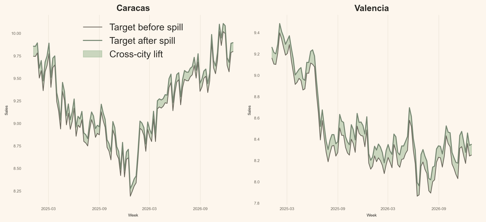
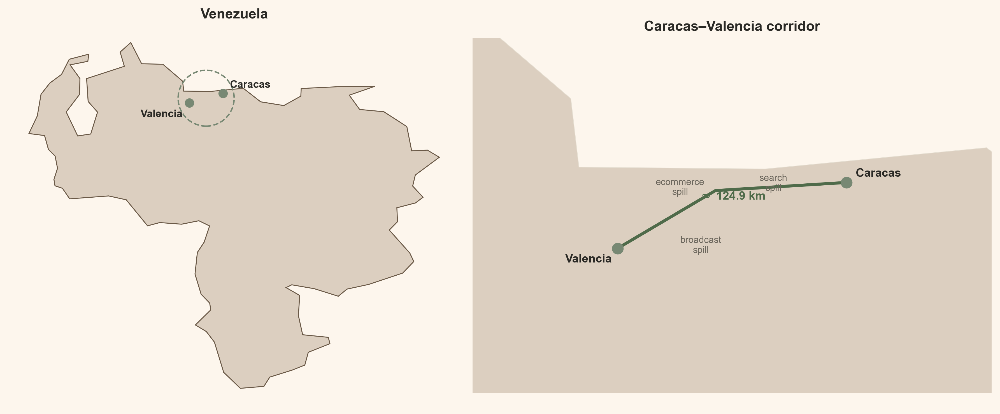
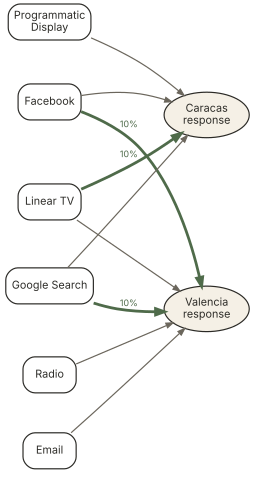
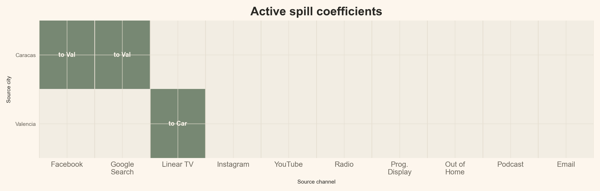
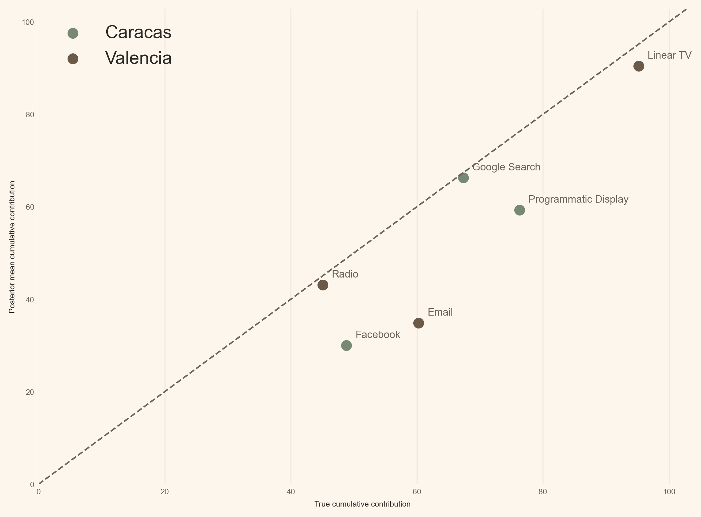

<a href="#quarto-document-content" class="skip-link">Skip to content</a>

<div id="title-block-header" class="quarto-title-block default">

<div class="quarto-title">

<div class="quarto-title-block">

<div>

# Media Does Not Stop at the City Border: Cross-City Spillovers with PyMC-Marketing

Code

- <a href="javascript:void(0)" id="quarto-show-all-code" class="dropdown-item" role="button">Show All Code</a>

- <a href="javascript:void(0)" id="quarto-hide-all-code" class="dropdown-item" role="button">Hide All Code</a>

- 

  ------------------------------------------------------------------------

- <a href="javascript:void(0)" id="quarto-view-source" class="dropdown-item" role="button">View Source</a>

</div>

</div>

<div class="quarto-categories">

<div class="quarto-category">

mmm

</div>

<div class="quarto-category">

pymc-marketing

</div>

<div class="quarto-category">

spillovers

</div>

<div class="quarto-category">

bayesian

</div>

<div class="quarto-category">

python

</div>

</div>

</div>

<div>

<div class="description">

A geo-level Bayesian MMM with sparse cross-city spillovers built on PyMC-Marketing MuEffect, MaskedPrior, and a pre-specified route mask for multi-market media measurement.

</div>

</div>

<div class="quarto-title-meta">

<div>

<div class="quarto-title-meta-heading">

Author

</div>

<div class="quarto-title-meta-contents">

Carlos Trujillo

</div>

</div>

<div>

<div class="quarto-title-meta-heading">

Published

</div>

<div class="quarto-title-meta-contents">

August 7, 2026

</div>

</div>

</div>

</div>

<div id="introduction" class="section level1">

# Introduction

“I fit one marketing mix model per city, so every campaign belongs to the city where I booked the spend.”

That is a useful reporting convention. It is not always a useful model of the world. Radio signals cross municipal borders. A launch in Caracas may lift branded search in Valencia. A creator campaign aimed at Valencia may send orders somewhere else entirely. If I force every city to live in isolation, those extra orders do not disappear; the model simply gives them the wrong name.

The good news is that [PyMC-Marketing’s `MuEffect` protocol](https://www.pymc-marketing.io/en/latest/api/generated/pymc_marketing.mmm.additive_effect.html) already gives me the extension point. I keep the base multidimensional `MMM`, write one additive `MuEffect`, describe the plausible routes with a Boolean mask, and register it with one line:

<div id="2c758932" class="cell" execution_count="1">

<div class="code-copy-outer-scaffold">

``` python
mmm.add_mu_effect(spill_effect)
```

</div>

</div>

The rest of this article opens that line up. First the business picture, then the equation, then the tensor shapes, and only then the full class.

</div>

<div id="quick-summary" class="section level1">

# Quick summary

This article walks you through:

- **The failure:** two independent city MMMs have no term for media that starts in one city and converts in another.
- **The data laboratory:** two synthetic cities with three known spill routes, each carrying exactly 10% of the source channel’s true contribution.
- **The PyMC-Marketing extension:** a custom `MuEffect` that reuses the model’s direct media contribution instead of rebuilding adstock and saturation.
- **The sparse policy:** `MaskedPrior` samples only three plausible spill coefficients rather than all twenty source-city-by-channel candidates.
- **The evidence:** sampler diagnostics, direct-effect recovery, and posterior spill recovery against known ground truth.

<div class="callout callout-style-default callout-tip callout-titled">

<div class="callout-header d-flex align-content-center">

<div class="callout-icon-container">

</div>

<div class="callout-title-container flex-fill">

<span class="screen-reader-only">Tip</span>The whole API idea

</div>

</div>

<div class="callout-body-container callout-body">

A multidimensional `MMM(dims=("city",))` already produces `channel_contribution` with city and channel coordinates. A custom `MuEffect` can read that tensor, route a bounded share to another city, and return a `(date, city)` contribution to the model mean.

</div>

</div>

</div>

<div id="theoretical-lens" class="section level1">

# Theoretical lens

I approach this as a **Bayesian measurement problem with structural knowledge**. In causal inference, cross-city spill is an [interference problem](https://pmc.ncbi.nlm.nih.gov/articles/PMC2600548/): exposure assigned to one unit can affect another unit’s outcome. The route mask encodes what the business considers possible; the posterior estimates how large those allowed effects are.

That distinction matters. [`MaskedPrior`](https://www.pymc-marketing.io/en/latest/api/generated/pymc_marketing.special_priors.MaskedPrior.html) does not discover the graph. It expresses the graph I am willing to estimate. In this example, the topology is known and sparse; the magnitudes are uncertain.

A [geo-level Bayesian MMM](https://storage.googleapis.com/gweb-research2023-media/pubtools/3804.pdf) can misassign credit when someone sees an ad in one city and buys across a city boundary. This example represents that possibility with three pre-specified routes. It is still an observational attribution model: the extension can represent cross-city spill once I make the relevant assumptions, but it cannot prove that a campaign caused the spill. It foregrounds a missing mechanism in the likelihood; it does not replace experimental design, interference assumptions, or geographic lift tests.

This is the simplest sparse-spill handling when source contribution shapes can be reused and routes are pre-specified. It is not the only approach. Alternatives include receiver-specific response or adstock curves, [hierarchical geo models](https://storage.googleapis.com/gweb-research2023-media/pubtools/3804.pdf), which share response information across geographies but do not explicitly route exposure from a source city to a receiver, outcome-dependent spillover, richer spatial kernels, and controlled geographic experiments.

</div>

<div id="what-exactly-changes-in-the-target" class="section level1">

# What exactly changes in the target?

Only one term is new:

<span class="math display"> Y\_{r,t}=\mu^{\text{direct}}\_{r,t}+S\_{r,t}+\epsilon\_{r,t}. </span>

Here <span class="math inline">S\_{r,t}</span> is the spill arriving in receiving city <span class="math inline">r</span>: a bounded share of an eligible source city’s already-computed direct contribution. The direct city-level MMM is otherwise unchanged.

I generate the synthetic data with normalized [geometric adstock](https://www.pymc-marketing.io/en/latest/api/generated/pymc_marketing.mmm.components.adstock.GeometricAdstock.html) (`l_max=4`) followed by [Michaelis-Menten saturation](https://www.pymc-marketing.io/en/latest/api/generated/pymc_marketing.mmm.components.saturation.MichaelisMentenSaturation.html). This follows the same broad carryover-and-saturation idea as [Jin et al. (2017)](https://storage.googleapis.com/gweb-research2023-media/pubtools/3806.pdf): both combine geometric adstock with a saturating response. The functional forms are not identical: Jin et al. use a Hill response curve, whereas I use Michaelis-Menten, the Hill-family form with its exponent fixed at one. These are base-response choices, separate from the new cross-city mechanism.

I use the names **Caracas** and **Valencia** for two deliberately simple synthetic cities. I chose those names because the real cities’ proximity makes a cross-city corridor easy to visualize, not because the synthetic routes claim to describe observed media movement between them. Each has ten media channels, two observed controls, and 104 weekly observations. Three direct media paths also reach the *other* city:

- Caracas **Facebook** <span class="math inline">\rightarrow</span> Valencia
- Caracas **Google Search** <span class="math inline">\rightarrow</span> Valencia
- Valencia **Linear TV** <span class="math inline">\rightarrow</span> Caracas

Each path transfers 10% of the source channel’s true own-city contribution. Everything else is structurally absent.

</div>

<div id="getting-started" class="section level1">

# Getting started

<div id="5b7586f4" class="cell" execution_count="2">

Code

<div class="code-copy-outer-scaffold">

``` python
import json
import sys
import warnings
from pathlib import Path
warnings.filterwarnings("ignore", category=FutureWarning)

from typing import Any

from pydantic import Field, InstanceOf
from pymc_extras.prior import Prior
from pymc_marketing.mmm import GeometricAdstock, MichaelisMentenSaturation
from pymc_marketing.mmm.additive_effect import MuEffect
from pymc_marketing.mmm.mmm import MMM
from pymc_marketing.mmm.scaling import DataDerivedScaling, FixedScaling, Scaling
from pymc_marketing.special_priors import MaskedPrior
import arviz as az
import pymc as pm
import pymc.dims as pmd
import pymc_marketing

import numpy as np
import pandas as pd
import xarray as xr

import matplotlib as mpl
import matplotlib.pyplot as plt
import matplotlib.dates as mdates
from matplotlib.patches import FancyArrowPatch, FancyBboxPatch
```

</div>

</div>

<div id="notebook-setup" class="section level2">

## Notebook setup

<div id="2991826b" class="cell" execution_count="3">

Code

<div class="code-copy-outer-scaffold">

``` python
az.style.use("arviz-darkgrid")
plt.rcParams["figure.figsize"] = [8, 4]

DATA_DIR = Path("data")

COLORS = {
    "primary": "#778873",
    "secondary": "#A1BC98",
    "accent": "#DCCFC0",
    "bg": "#FDF6ED",
    "ink": "#2B2A26",
    "ink_muted": "#6B665C",
    "green_strong": "#4F6B4A",
    "brown": "#6B5A48",
    "line": "#E6DFD2",
    "surface_alt": "#F2EDE3",
}

mpl.rcParams.update({
    "figure.facecolor": COLORS["bg"],
    "axes.facecolor": COLORS["bg"],
    "axes.edgecolor": COLORS["line"],
    "axes.labelcolor": COLORS["ink"],
    "text.color": COLORS["ink"],
    "xtick.color": COLORS["ink_muted"],
    "ytick.color": COLORS["ink_muted"],
    "grid.color": COLORS["line"],
    "grid.alpha": 0.6,
    "font.family": "sans-serif",
    "font.sans-serif": ["Inter", "Manrope", "Helvetica Neue", "Arial"],
    "axes.titleweight": "semibold",
    "axes.titlesize": 13,
    "axes.labelsize": 6,
    "xtick.labelsize": 6,
    "ytick.labelsize": 6,
    "axes.spines.top": False,
    "axes.spines.right": False,
    "figure.dpi": 150,
    "figure.constrained_layout.use": True,
})

%load_ext autoreload
%autoreload 2
%config InlineBackend.figure_format = "retina"


def article_table(
    frame: pd.DataFrame,
    caption: str,
    formats: dict[str, str] | None = None,
):
    """Render a compact, left-aligned, index-free table."""
    styled = (
        frame.style
        .hide(axis="index")
        .set_caption(caption)
        .set_properties(**{"text-align": "left"})
        .set_table_styles([
            {"selector": "th", "props": [("text-align", "left")]},
            {"selector": "td", "props": [("text-align", "left")]},
        ])
    )
    return styled.format(formats) if formats else styled


seed: int = sum(map(ord, "media does not stop at the city border"))
rng: np.random.Generator = np.random.default_rng(seed=seed)
print(f"Seed: {seed}")
```

</div>

<div class="cell-output cell-output-stdout">

    Seed: 3567

</div>

</div>

<div id="48a09013" class="cell" execution_count="4">

Code

<div class="code-copy-outer-scaffold">

``` python
CITIES = ("Caracas", "Valencia")
CHANNELS = [
    "facebook", "google_search", "linear_tv", "instagram", "youtube",
    "radio", "programmatic_display", "out_of_home", "podcast", "email",
]
CHANNEL_LABELS = dict(zip(
    CHANNELS,
    [
        "Facebook", "Google Search", "Linear TV", "Instagram", "YouTube",
        "Radio", "Programmatic Display", "Out of Home", "Podcast", "Email",
    ],
    strict=True,
))
CONTROLS = ["Z1", "Z2"]
TRUE_SPILL_SHARE = 0.10

PANEL_DIMS = ("city",)
PANEL_CHANNEL_DIMS = ("city", "channel")
PANEL_CONTROL_DIMS = ("city", "control")
SPEND_DIMS = ("spend_city",)
SPEND_CHANNEL_DIMS = ("spend_city", "channel")
SPILL_PATH_DIMS = ("city", "spend_city", "channel")
SPEND_RENAME = {"city": "spend_city"}

SPILL_ROUTES = (
    ("Caracas", "Valencia", "facebook"),
    ("Caracas", "Valencia", "google_search"),
    ("Valencia", "Caracas", "linear_tv"),
)

valencia_raw = pd.read_csv(DATA_DIR / "valencia_raw.csv", parse_dates=["date"])
caracas_raw = pd.read_csv(DATA_DIR / "caracas_raw.csv", parse_dates=["date"])
valencia_truth = pd.read_csv(DATA_DIR / "valencia_contributions.csv", parse_dates=["date"])
caracas_truth = pd.read_csv(DATA_DIR / "caracas_contributions.csv", parse_dates=["date"])

assert valencia_raw["date"].equals(caracas_raw["date"])
assert valencia_truth["date"].equals(caracas_truth["date"])

valencia = valencia_raw.rename(columns={"Y": "y_base"}).copy()
caracas = caracas_raw.rename(columns={"Y": "y_base"}).copy()

valencia["spill_truth"] = TRUE_SPILL_SHARE * (
    caracas_truth["contrib_facebook"].to_numpy()
    + caracas_truth["contrib_google_search"].to_numpy()
)
caracas["spill_truth"] = TRUE_SPILL_SHARE * valencia_truth["contrib_linear_tv"].to_numpy()

for frame in (valencia, caracas):
    frame["y"] = frame["y_base"] + frame["spill_truth"]

panel = pd.concat([caracas, valencia], ignore_index=True).sort_values(
    ["date", "city"], ignore_index=True
)

spill_columns = [
    "contrib_spill_from_caracas_facebook",
    "contrib_spill_from_caracas_google_search",
    "contrib_spill_from_valencia_linear_tv",
]
for frame in (caracas_truth, valencia_truth):
    for column in spill_columns:
        frame[column] = 0.0

valencia_truth["contrib_spill_from_caracas_facebook"] = (
    TRUE_SPILL_SHARE * caracas_truth["contrib_facebook"].to_numpy()
)
valencia_truth["contrib_spill_from_caracas_google_search"] = (
    TRUE_SPILL_SHARE * caracas_truth["contrib_google_search"].to_numpy()
)
caracas_truth["contrib_spill_from_valencia_linear_tv"] = (
    TRUE_SPILL_SHARE * valencia_truth["contrib_linear_tv"].to_numpy()
)

truth = pd.concat([caracas_truth, valencia_truth], ignore_index=True).sort_values(
    ["date", "city"], ignore_index=True
)
truth["contrib_spill_total"] = truth[spill_columns].sum(axis=1)

model_data = panel[["date", "city", *CHANNELS, *CONTROLS, "y"]].rename(columns={"y": "Y"})
model_data.to_csv(DATA_DIR / "mmm_data_raw.csv", index=False)
truth.to_csv(DATA_DIR / "mmm_data_contributions.csv", index=False)

assert np.allclose(panel["y"] - panel["y_base"], panel["spill_truth"])
assert np.allclose(
    panel["spill_truth"].to_numpy(), truth["contrib_spill_total"].to_numpy()
)
assert truth["contrib_spill_total"].abs().sum() > 0

X = panel[["date", "city", *CHANNELS, *CONTROLS]]
y = panel["y"]

schema_rows = [
    {"Column": "date", "Type": "datetime", "Role": "time index"},
    {"Column": "city", "Type": "str", "Role": "panel dimension"},
]
for ch in CHANNELS:
    schema_rows.append({"Column": ch, "Type": "float", "Role": "media channel"})
schema_rows += [
    {"Column": "Z1", "Type": "float", "Role": "control"},
    {"Column": "Z2", "Type": "float", "Role": "control"},
    {"Column": "Y", "Type": "float", "Role": "target"},
]
display(article_table(pd.DataFrame(schema_rows), "Input panel schema"))
```

</div>

<div class="cell-output cell-output-display">

<div id="T_acd8a" class="quarto-float quarto-figure quarto-figure-center anchored" quarto-postprocess="true">

<figure class="quarto-float quarto-float-tbl figure">
<div aria-describedby="T_acd8a-caption-0ceaefa1-69ba-4598-a22c-09a6ac19f8ca">
<table id="T_acd8a" class="caption-top table table-sm table-striped small">
<thead>
<tr class="header">
<th id="T_acd8a_level0_col0" class="col_heading level0 col0" data-quarto-table-cell-role="th">Column</th>
<th id="T_acd8a_level0_col1" class="col_heading level0 col1" data-quarto-table-cell-role="th">Type</th>
<th id="T_acd8a_level0_col2" class="col_heading level0 col2" data-quarto-table-cell-role="th">Role</th>
</tr>
</thead>
<tbody>
<tr class="odd">
<td id="T_acd8a_row0_col0" class="data row0 col0">date</td>
<td id="T_acd8a_row0_col1" class="data row0 col1">datetime</td>
<td id="T_acd8a_row0_col2" class="data row0 col2">time index</td>
</tr>
<tr class="even">
<td id="T_acd8a_row1_col0" class="data row1 col0">city</td>
<td id="T_acd8a_row1_col1" class="data row1 col1">str</td>
<td id="T_acd8a_row1_col2" class="data row1 col2">panel dimension</td>
</tr>
<tr class="odd">
<td id="T_acd8a_row2_col0" class="data row2 col0">facebook</td>
<td id="T_acd8a_row2_col1" class="data row2 col1">float</td>
<td id="T_acd8a_row2_col2" class="data row2 col2">media channel</td>
</tr>
<tr class="even">
<td id="T_acd8a_row3_col0" class="data row3 col0">google_search</td>
<td id="T_acd8a_row3_col1" class="data row3 col1">float</td>
<td id="T_acd8a_row3_col2" class="data row3 col2">media channel</td>
</tr>
<tr class="odd">
<td id="T_acd8a_row4_col0" class="data row4 col0">linear_tv</td>
<td id="T_acd8a_row4_col1" class="data row4 col1">float</td>
<td id="T_acd8a_row4_col2" class="data row4 col2">media channel</td>
</tr>
<tr class="even">
<td id="T_acd8a_row5_col0" class="data row5 col0">instagram</td>
<td id="T_acd8a_row5_col1" class="data row5 col1">float</td>
<td id="T_acd8a_row5_col2" class="data row5 col2">media channel</td>
</tr>
<tr class="odd">
<td id="T_acd8a_row6_col0" class="data row6 col0">youtube</td>
<td id="T_acd8a_row6_col1" class="data row6 col1">float</td>
<td id="T_acd8a_row6_col2" class="data row6 col2">media channel</td>
</tr>
<tr class="even">
<td id="T_acd8a_row7_col0" class="data row7 col0">radio</td>
<td id="T_acd8a_row7_col1" class="data row7 col1">float</td>
<td id="T_acd8a_row7_col2" class="data row7 col2">media channel</td>
</tr>
<tr class="odd">
<td id="T_acd8a_row8_col0" class="data row8 col0">programmatic_display</td>
<td id="T_acd8a_row8_col1" class="data row8 col1">float</td>
<td id="T_acd8a_row8_col2" class="data row8 col2">media channel</td>
</tr>
<tr class="even">
<td id="T_acd8a_row9_col0" class="data row9 col0">out_of_home</td>
<td id="T_acd8a_row9_col1" class="data row9 col1">float</td>
<td id="T_acd8a_row9_col2" class="data row9 col2">media channel</td>
</tr>
<tr class="odd">
<td id="T_acd8a_row10_col0" class="data row10 col0">podcast</td>
<td id="T_acd8a_row10_col1" class="data row10 col1">float</td>
<td id="T_acd8a_row10_col2" class="data row10 col2">media channel</td>
</tr>
<tr class="even">
<td id="T_acd8a_row11_col0" class="data row11 col0">email</td>
<td id="T_acd8a_row11_col1" class="data row11 col1">float</td>
<td id="T_acd8a_row11_col2" class="data row11 col2">media channel</td>
</tr>
<tr class="odd">
<td id="T_acd8a_row12_col0" class="data row12 col0">Z1</td>
<td id="T_acd8a_row12_col1" class="data row12 col1">float</td>
<td id="T_acd8a_row12_col2" class="data row12 col2">control</td>
</tr>
<tr class="even">
<td id="T_acd8a_row13_col0" class="data row13 col0">Z2</td>
<td id="T_acd8a_row13_col1" class="data row13 col1">float</td>
<td id="T_acd8a_row13_col2" class="data row13 col2">control</td>
</tr>
<tr class="odd">
<td id="T_acd8a_row14_col0" class="data row14 col0">Y</td>
<td id="T_acd8a_row14_col1" class="data row14 col1">float</td>
<td id="T_acd8a_row14_col2" class="data row14 col2">target</td>
</tr>
</tbody>
</table>
</div>
<figcaption>Table 1: Input panel schema</figcaption>
</figure>

</div>

</div>

</div>

The panel that enters the MMM contains 208 weekly rows (104 weeks × 2 cities). Each row carries the ten raw media-spend channels, two observed controls, and the sales target. The generator writes two files per city — `mmm_data_raw.csv` for the observables and `mmm_data_contributions.csv` for the true per-channel decomposition used only in scoring — plus per-city contribution breakdowns under `data/`.

The representative rows below show a subset of the columns the MMM actually sees.

<div id="d53d0eca" class="cell" execution_count="5">

Code

<div class="code-copy-outer-scaffold">

``` python
preview_columns = [
    "date", "city", "facebook", "google_search", "linear_tv", "Z1", "Z2", "Y",
]
model_preview = (
    model_data[preview_columns]
    .groupby("city")
    .head(2)
    .reset_index(drop=True)
)
model_preview["date"] = model_preview["date"].dt.strftime("%Y-%m-%d")
display(article_table(
    model_preview,
    "Representative MMM input rows (two per city; three channels shown)",
    {column: "{:.3f}" for column in preview_columns[2:]},
))
```

</div>

<div class="cell-output cell-output-display">

<div id="T_d4036" class="quarto-float quarto-figure quarto-figure-center anchored" quarto-postprocess="true">

<figure class="quarto-float quarto-float-tbl figure">
<div aria-describedby="T_d4036-caption-0ceaefa1-69ba-4598-a22c-09a6ac19f8ca">
<table id="T_d4036" class="caption-top table table-sm table-striped small">
<thead>
<tr class="header">
<th id="T_d4036_level0_col0" class="col_heading level0 col0" data-quarto-table-cell-role="th">date</th>
<th id="T_d4036_level0_col1" class="col_heading level0 col1" data-quarto-table-cell-role="th">city</th>
<th id="T_d4036_level0_col2" class="col_heading level0 col2" data-quarto-table-cell-role="th">facebook</th>
<th id="T_d4036_level0_col3" class="col_heading level0 col3" data-quarto-table-cell-role="th">google_search</th>
<th id="T_d4036_level0_col4" class="col_heading level0 col4" data-quarto-table-cell-role="th">linear_tv</th>
<th id="T_d4036_level0_col5" class="col_heading level0 col5" data-quarto-table-cell-role="th">Z1</th>
<th id="T_d4036_level0_col6" class="col_heading level0 col6" data-quarto-table-cell-role="th">Z2</th>
<th id="T_d4036_level0_col7" class="col_heading level0 col7" data-quarto-table-cell-role="th">Y</th>
</tr>
</thead>
<tbody>
<tr class="odd">
<td id="T_d4036_row0_col0" class="data row0 col0">2025-01-06</td>
<td id="T_d4036_row0_col1" class="data row0 col1">Caracas</td>
<td id="T_d4036_row0_col2" class="data row0 col2">0.968</td>
<td id="T_d4036_row0_col3" class="data row0 col3">3.587</td>
<td id="T_d4036_row0_col4" class="data row0 col4">3.742</td>
<td id="T_d4036_row0_col5" class="data row0 col5">3.017</td>
<td id="T_d4036_row0_col6" class="data row0 col6">-2.007</td>
<td id="T_d4036_row0_col7" class="data row0 col7">9.856</td>
</tr>
<tr class="even">
<td id="T_d4036_row1_col0" class="data row1 col0">2025-01-06</td>
<td id="T_d4036_row1_col1" class="data row1 col1">Valencia</td>
<td id="T_d4036_row1_col2" class="data row1 col2">2.100</td>
<td id="T_d4036_row1_col3" class="data row1 col3">1.251</td>
<td id="T_d4036_row1_col4" class="data row1 col4">2.850</td>
<td id="T_d4036_row1_col5" class="data row1 col5">0.746</td>
<td id="T_d4036_row1_col6" class="data row1 col6">0.936</td>
<td id="T_d4036_row1_col7" class="data row1 col7">9.262</td>
</tr>
<tr class="odd">
<td id="T_d4036_row2_col0" class="data row2 col0">2025-01-13</td>
<td id="T_d4036_row2_col1" class="data row2 col1">Caracas</td>
<td id="T_d4036_row2_col2" class="data row2 col2">0.832</td>
<td id="T_d4036_row2_col3" class="data row2 col3">4.058</td>
<td id="T_d4036_row2_col4" class="data row2 col4">3.852</td>
<td id="T_d4036_row2_col5" class="data row2 col5">2.974</td>
<td id="T_d4036_row2_col6" class="data row2 col6">-1.959</td>
<td id="T_d4036_row2_col7" class="data row2 col7">9.855</td>
</tr>
<tr class="even">
<td id="T_d4036_row3_col0" class="data row3 col0">2025-01-13</td>
<td id="T_d4036_row3_col1" class="data row3 col1">Valencia</td>
<td id="T_d4036_row3_col2" class="data row3 col2">2.185</td>
<td id="T_d4036_row3_col3" class="data row3 col3">3.278</td>
<td id="T_d4036_row3_col4" class="data row3 col4">3.229</td>
<td id="T_d4036_row3_col5" class="data row3 col5">0.705</td>
<td id="T_d4036_row3_col6" class="data row3 col6">0.939</td>
<td id="T_d4036_row3_col7" class="data row3 col7">9.214</td>
</tr>
</tbody>
</table>
</div>
<figcaption>Table 2: Representative MMM input rows (two per city; three channels shown)</figcaption>
</figure>

</div>

</div>

</div>

The contribution files (`caracas_contributions.csv`, `valencia_contributions.csv`) record the true channel-level decomposition used for scoring. Their magnitudes remain held out; the only information derived from that decomposition and supplied to the MMM is the six-path direct-activity mask shown below. The likelihood otherwise sees the target, observed media spend, and controls.

Let <span class="math inline">V</span> and <span class="math inline">C</span> abbreviate Valencia and Caracas, and let <span class="math inline">\tau\_{s,k,t}</span> denote channel <span class="math inline">k</span>’s true own-city contribution in source city <span class="math inline">s</span> at week <span class="math inline">t</span>. Then:

<span class="math display"> \begin{aligned} Y^{\star}\_{V,t} &= Y\_{V,t} \\ &\quad + 0.10\\\tau\_{C,\text{Facebook},t} \\ &\quad + 0.10\\\tau\_{C,\text{Google Search},t}, \\ Y^{\star}\_{C,t} &= Y\_{C,t} + 0.10\\\tau\_{V,\text{Linear TV},t}. \end{aligned} </span>

The multiplier is fixed at 10% in the data-generating process. The model will not receive those contribution columns; they remain behind the curtain for scoring.

</div>

</div>

<div id="why-an-independent-city-mmm-fails" class="section level1">

# Why an independent-city MMM fails

<div id="cell-fig-target-spill" class="cell" execution_count="6">

Code

<div class="code-copy-outer-scaffold">

``` python
fig, axes = plt.subplots(1, 2, figsize=(10, 4.5), sharex=True)
for ax, city in zip(axes, CITIES, strict=True):
    city_data = panel.loc[panel["city"].eq(city)]
    ax.plot(city_data["date"], city_data["y_base"], color=COLORS["ink_muted"],
            linewidth=1.1, label="Target before spill")
    ax.plot(city_data["date"], city_data["y"], color=COLORS["primary"],
            linewidth=1.5, label="Target after spill")
    ax.fill_between(
        city_data["date"], city_data["y_base"], city_data["y"],
        color=COLORS["secondary"], alpha=0.55, label="Cross-city lift",
    )
    ax.set(title=city, xlabel="Week", ylabel="Sales")
    ax.grid(axis="y")
    ax.xaxis.set_major_locator(mdates.MonthLocator(interval=6))
    ax.xaxis.set_major_formatter(mdates.DateFormatter("%Y-%m"))
axes[0].legend(frameon=False, loc="best")
plt.show()
```

</div>

<div class="cell-output cell-output-display">

<div id="fig-target-spill" class="quarto-float quarto-figure quarto-figure-center anchored" alt="Two weekly sales charts for Caracas and Valencia comparing the target before spill with the higher target after spill; the shaded area is cross-city lift.">

<figure class="quarto-float quarto-float-fig figure">
<div aria-describedby="fig-target-spill-caption-0ceaefa1-69ba-4598-a22c-09a6ac19f8ca">

</div>
<figcaption>Figure 1: The target changes by the shape of media from the other city, not by random noise. An independent-city MMM has no named component for the shaded difference.</figcaption>
</figure>

</div>

</div>

</div>

The familiar model fits each city with its own channels, controls, and baseline:

<span class="math display"> Y\_{r,t}=\mu^{\text{direct}}\_{r,t}+\epsilon\_{r,t}. </span>

That model may predict well. It still has no route where a source city <span class="math inline">s</span> differs from the receiving city <span class="math inline">r</span>. The shaded signal in <a href="#fig-target-spill" class="quarto-xref">Figure 1</a> must leak into direct attribution, the baseline, controls, or residual noise.

This is the controlled failure. **The problem is not that the base MMM is badly implemented. The problem is that its mean function cannot express the business mechanism.**

> **Could I just add the other city’s raw spend as controls?** I could, but then I would estimate a second response curve disconnected from the source campaign’s adstock and saturation. Reusing the source contribution is both more parsimonious and easier to interpret.

The corrected mean adds one term:

<span class="math display"> \begin{aligned} Y\_{r,t} &= \mu^{\text{direct}}\_{r,t} + S\_{r,t} + \epsilon\_{r,t}, \\ S\_{r,t} &= \sum\_{s\neq r}\sum\_{k=1}^{K} M\_{r,s,k}\\\rho\_{s,k} \\ &\qquad \times g\_{s,k}(X\_{s,k,t}). \end{aligned} </span>

where:

- <span class="math inline">S\_{r,t}</span> is the total spill arriving in receiving city <span class="math inline">r</span>;
- <span class="math inline">g\_{s,k}(X\_{s,k,t})</span> is the direct contribution evaluated from the same model graph after adstock and saturation;
- <span class="math inline">M\_{r,s,k}\in\\0,1\\</span> is the pre-specified route mask;
- <span class="math inline">\rho\_{s,k}</span> is the learned share exported by source city <span class="math inline">s</span> and channel <span class="math inline">k</span>;
- the sum returns one spill contribution for each receiving city <span class="math inline">r</span> and week <span class="math inline">t</span>.

The theory reconnects here: the mask is structural knowledge; the share is posterior uncertainty.

</div>

<div id="one-additive-effect-is-enough-to-encode-sparse-cross-city-spill" class="section level1">

# One additive effect is enough to encode sparse cross-city spill

The Bayesian measurement lens now becomes an engineering constraint: preserve the source response, fix the routes supplied by prior knowledge, and estimate only their uncertain magnitudes.

<div id="cell-fig-venezuela-map" class="cell" execution_count="7">

Code

<div class="code-copy-outer-scaffold">

``` python
from matplotlib.patches import Circle
import urllib.request
import urllib.parse
import xml.etree.ElementTree as ET

caracas_coords = (-66.9036, 10.4806)
valencia_coords = (-68.0077, 10.1620)

with open(DATA_DIR / "venezuela_natural_earth.geojson") as f:
    geo = json.load(f)

geom = geo["features"][0]["geometry"]
if geom["type"] == "Polygon":
    polygons = [geom["coordinates"]]
elif geom["type"] == "MultiPolygon":
    polygons = geom["coordinates"]
else:
    raise ValueError(f"Unsupported geometry type: {geom['type']}")
exterior_rings = [np.asarray(polygon[0], dtype=float) for polygon in polygons]

margin = 0.7
rect_x = [min(caracas_coords[0], valencia_coords[0]) - margin,
          max(caracas_coords[0], valencia_coords[0]) + margin]
rect_y = [min(caracas_coords[1], valencia_coords[1]) - margin,
          max(caracas_coords[1], valencia_coords[1]) + margin]

mid_lon = (caracas_coords[0] + valencia_coords[0]) / 2
mid_lat = (caracas_coords[1] + valencia_coords[1]) / 2
circle_radius = np.sqrt(
    ((caracas_coords[0] - valencia_coords[0]) ** 2)
    + ((caracas_coords[1] - valencia_coords[1]) ** 2)
) / 2 + 0.35

fig, (ax_overview, ax_inset) = plt.subplots(
    1, 2, figsize=(12, 5.5), gridspec_kw={"width_ratios": [1, 1.15]},
)

# --- Overview panel ---
for coords in exterior_rings:
    ax_overview.fill(coords[:, 0], coords[:, 1],
                     facecolor=COLORS["accent"], edgecolor=COLORS["brown"], linewidth=0.8)

for label, (lon, lat), ofs in [
    ("Caracas", caracas_coords, (6, 5)),
    ("Valencia", valencia_coords, (-42, -12)),
]:
    ax_overview.plot(lon, lat, "o", color=COLORS["primary"], markersize=7, zorder=5)
    ax_overview.annotate(label, (lon, lat), textcoords="offset points",
                         xytext=ofs, fontsize=9, weight=600)

circle = Circle(
    (mid_lon, mid_lat), circle_radius, fill=False, color=COLORS["primary"], linewidth=1.2,
    linestyle="--"
)
ax_overview.add_patch(circle)
ax_overview.set_title("Venezuela", fontsize=12, weight=600)
ax_overview.set_aspect("equal")
ax_overview.axis("off")

# --- Overpass streets in the corridor inset ---
road_segments = []
bbox = (
    min(rect_y[0], rect_y[1]),
    min(rect_x[0], rect_x[1]),
    max(rect_y[0], rect_y[1]),
    max(rect_x[0], rect_x[1]),
)
overpass_query = (
    f'way["highway"]({bbox[0]},{bbox[1]},{bbox[2]},{bbox[3]});'
    f'(._;>;);out body;'
)
try:
    overpass_url = (
        "https://overpass-api.de/api/interpreter?"
        + urllib.parse.urlencode({"data": overpass_query})
    )
    with urllib.request.urlopen(overpass_url, timeout=30) as resp:
        root = ET.fromstring(resp.read())
    node_xy = {}
    for node in root.findall("node"):
        node_xy[node.get("id")] = (float(node.get("lon")), float(node.get("lat")))
    for way in root.findall("way"):
        refs = [nd.get("ref") for nd in way.findall("nd")]
        coords = np.asarray(
            [node_xy[r] for r in refs if r in node_xy], dtype=float
        )
        if coords.size:
            road_segments.append(coords)
except Exception:
    road_segments = []

# --- Corridor inset ---
ax_inset.set_facecolor(COLORS["bg"])
ax_inset.set_xlim(rect_x)
ax_inset.set_ylim(rect_y)

for coords in exterior_rings:
    ax_inset.fill(coords[:, 0], coords[:, 1],
                  facecolor=COLORS["accent"], edgecolor=COLORS["line"], linewidth=0.5)
for seg in road_segments:
    ax_inset.plot(seg[:, 0], seg[:, 1], color=COLORS["line"], linewidth=0.6, alpha=0.85)

route_lon = [caracas_coords[0], mid_lon - 0.08, valencia_coords[0]]
route_lat = [caracas_coords[1], mid_lat + 0.12, valencia_coords[1]]
ax_inset.plot(route_lon, route_lat, color=COLORS["green_strong"], linewidth=2.6, zorder=4)

for label, (lon, lat), ofs in [
    ("Caracas", caracas_coords, (8, 5)),
    ("Valencia", valencia_coords, (-45, -12)),
]:
    ax_inset.plot(lon, lat, "o", color=COLORS["primary"], markersize=9, zorder=5)
    ax_inset.annotate(label, (lon, lat), textcoords="offset points",
                      xytext=ofs, fontsize=10, weight=600, zorder=5)

ax_inset.annotate(
    "$\\approx$ 124.9 km", (mid_lon, mid_lat), textcoords="offset points",
    xytext=(0, 14), fontsize=10, ha="center", weight=600, color=COLORS["green_strong"], zorder=5,
)

for mech_label, (dx, dy) in [
    ("broadcast\nspill", (-0.15, -0.18)),
    ("search\nspill", (0.20, 0.12)),
    ("ecommerce\nspill", (-0.25, 0.10)),
]:
    ax_inset.annotate(
        mech_label, (mid_lon + dx, mid_lat + dy), textcoords="offset points",
        xytext=(0, 0), fontsize=8, ha="center", color=COLORS["ink_muted"], zorder=5,
    )

ax_inset.grid(False)
ax_inset.set_title("Caracas\u2013Valencia corridor", fontsize=12, weight=600)
ax_inset.set_aspect("equal")
ax_inset.axis("off")

plt.tight_layout()
plt.show()
```

</div>

<div class="cell-output cell-output-display">

<div id="fig-venezuela-map" class="quarto-float quarto-figure quarto-figure-center anchored" alt="Two-panel map of Venezuela: overview showing both cities, and corridor inset with 124.9 km distance and mechanism labels.">

<figure class="quarto-float quarto-float-fig figure">
<div aria-describedby="fig-venezuela-map-caption-0ceaefa1-69ba-4598-a22c-09a6ac19f8ca">

</div>
<figcaption>Figure 2: I use the Caracas–Valencia corridor, approximately 124.9 km apart, as an illustrative setting. Broadcast, search, and ecommerce could carry media effects across a corridor like this.</figcaption>
</figure>

</div>

</div>

</div>

<div id="of-the-source-channels-own-contribution" class="section level3">

### 10% of the source channel’s own contribution

<div id="cell-fig-route-map" class="cell" execution_count="8">

Code

<div class="code-copy-outer-scaffold">

``` python
import graphviz

K = COLORS["ink"]
K2 = COLORS["ink_muted"]
G = COLORS["green_strong"]

def obs(label):
    return {
        "label": label, "shape": "box", "style": "rounded,filled",
        "fillcolor": "white", "color": K, "fontcolor": K, "fontsize": "11",
        "penwidth": "1.2", "fontname": "Inter",
    }

def lat(label):
    return {
        "label": label, "shape": "ellipse", "style": "filled",
        "fillcolor": "#f5f0e6", "color": K, "fontcolor": K, "fontsize": "11",
        "penwidth": "1.2", "fontname": "Inter",
    }

def loc():
    return {"color": K2, "penwidth": "1.2", "arrowsize": "0.7"}

def spl():
    return {
        "color": G, "penwidth": "2.8", "arrowsize": "0.9",
        "fontname": "Inter", "fontcolor": G, "fontsize": "9",
    }

g = graphviz.Digraph(format="svg", engine="dot")
g.attr(rankdir="LR", bgcolor="transparent", margin="0.1", nodesep="0.55",
       ranksep="0.65", fontname="Inter")

# Caracas spend nodes
g.node("fb", **obs("Facebook"))
g.node("gs", **obs("Google Search"))
g.node("pd", **obs("Programmatic\nDisplay"))
g.node("R_ccs", **lat("Caracas\nresponse"))

# Valencia spend nodes
g.node("ltv", **obs("Linear TV"))
g.node("rad", **obs("Radio"))
g.node("em", **obs("Email"))
g.node("R_val", **lat("Valencia\nresponse"))

# Local edges
g.edge("fb", "R_ccs", **loc())
g.edge("gs", "R_ccs", **loc())
g.edge("pd", "R_ccs", **loc())
g.edge("ltv", "R_val", **loc())
g.edge("rad", "R_val", **loc())
g.edge("em", "R_val", **loc())

# Cross-city spill
g.edge("fb", "R_val", label=" 10% ", **spl())
g.edge("gs", "R_val", label=" 10% ", **spl())
g.edge("ltv", "R_ccs", label=" 10% ", **spl())

from IPython.display import SVG, display as ipy_display
svg_bytes = g.pipe(format="svg")
ipy_display(SVG(svg_bytes))
```

</div>

<div class="cell-output cell-output-display">

<div id="fig-route-map" class="quarto-float quarto-figure quarto-figure-center anchored" alt="A directed acyclic graph. Caracas Facebook, Google Search, and Programmatic Display point to an unobserved Caracas response oval. Valencia Linear TV, Radio, and Email point to an unobserved Valencia response oval. Three green arrows cross from Caracas Facebook and Google Search to Valencia response, and from Valencia Linear TV to Caracas response.">

<figure class="quarto-float quarto-float-fig figure">
<div aria-describedby="fig-route-map-caption-0ceaefa1-69ba-4598-a22c-09a6ac19f8ca">

</div>
<figcaption>Figure 3: Observed spend flows into each city’s unobserved response oval. Three green edges cross the boundary: Caracas Facebook and Google Search contribute 10% each to Valencia response; Valencia Linear TV contributes 10% to Caracas response.</figcaption>
</figure>

</div>

</div>

</div>

**Beyond cities.** The same source-unit <span class="math inline">\to</span> receiver-unit pattern appears whenever one marketing touch creates value outside its original target:

- **Paid-search brand halo.** A national brand campaign can lift branded search conversions in regions where no search ads were active that week.
- **Adjacent-category TV demand.** A TV spot for one product category may shift demand toward a related category that shares shelf space.
- **Retail-store proximity.** A new store opening can cannibalise sales at nearby locations — a geographic spillover in the opposite direction.

These are reasons to *consider* shared mechanisms in your own data, not evidence that the Caracas-Valencia routes in this demonstration exist in any real market.

</div>

<div id="a-pre-specified-route-mask" class="section level2">

## A pre-specified route mask

With two cities and ten channels, there are twenty possible source-city-by-channel spill coefficients. In this synthetic design, I allow three. The other seventeen should not be weakly regularized or estimated near zero. They should not exist in the graph.

<div id="4f522a9b" class="cell" execution_count="9">

Code

<div class="code-copy-outer-scaffold">

``` python
spill_mask_values = np.zeros(
    (len(CITIES), len(CITIES), len(CHANNELS)), dtype=bool
)
for source_city, receiver_city, channel in SPILL_ROUTES:
    spill_mask_values[
        CITIES.index(receiver_city),
        CITIES.index(source_city),
        CHANNELS.index(channel),
    ] = True

spill_path_mask = xr.DataArray(
    spill_mask_values,
    dims=SPILL_PATH_DIMS,
    coords={
        "city": list(CITIES),
        "spend_city": list(CITIES),
        "channel": CHANNELS,
    },
)
source_active_mask = spill_path_mask.any("city").transpose(*SPEND_CHANNEL_DIMS)

assert int(source_active_mask.sum()) == len(SPILL_ROUTES) == 3
```

</div>

</div>

<div id="cell-fig-mask" class="cell" execution_count="10">

Code

<div class="code-copy-outer-scaffold">

``` python
fig, ax = plt.subplots(figsize=(9, 2.8))
mask_plot = source_active_mask.astype(int)
cmap = mpl.colors.ListedColormap([COLORS["surface_alt"], COLORS["primary"]])
ax.imshow(mask_plot, aspect="auto", cmap=cmap, vmin=0, vmax=1)
display_labels = [
    "Facebook", "Google\nSearch", "Linear TV", "Instagram", "YouTube",
    "Radio", "Prog.\nDisplay", "Out of\nHome", "Podcast", "Email",
]
ax.set_xticks(range(len(CHANNELS)), display_labels, fontsize=8)
ax.set_yticks(range(len(CITIES)), CITIES)
ax.set(xlabel="Source channel", ylabel="Source city")
for row, city in enumerate(CITIES):
    for col, channel in enumerate(CHANNELS):
        if bool(source_active_mask.sel(spend_city=city, channel=channel)):
            receiver = next(
                target for source, target, route_channel in SPILL_ROUTES
                if source == city and route_channel == channel
            )
            ax.text(col, row, f"to {receiver[:3]}", ha="center", va="center",
                    color=COLORS["bg"], fontsize=7, weight=600)
for x in np.arange(-0.5, len(CHANNELS), 1):
    ax.axvline(x, color=COLORS["line"], linewidth=0.8)
ax.set_title("Active spill coefficients")
plt.show()
```

</div>

<div class="cell-output cell-output-display">

<div id="fig-mask" class="quarto-float quarto-figure quarto-figure-center anchored" alt="A two-by-ten source-city and channel matrix with active cells only for Caracas Facebook, Caracas Google Search, and Valencia Linear TV.">

<figure class="quarto-float quarto-float-fig figure">
<div aria-describedby="fig-mask-caption-0ceaefa1-69ba-4598-a22c-09a6ac19f8ca">

</div>
<figcaption>Figure 4: MaskedPrior turns twenty possible source-city-by-channel coefficients into three sampled parameters. The remaining seventeen are structural zeros, not uncertain near-zero estimates.</figcaption>
</figure>

</div>

</div>

</div>

<div class="callout callout-style-default callout-important callout-titled">

<div class="callout-header d-flex align-content-center">

<div class="callout-icon-container">

</div>

<div class="callout-title-container flex-fill">

<span class="screen-reader-only">Important</span>`MaskedPrior` is a gate, not a shrinkage prior

</div>

</div>

<div class="callout-body-container callout-body">

The wrapped prior is sampled only where the mask is `True`, then expanded back to the full labeled tensor with exact zeros elsewhere. Here that means three free spill parameters instead of twenty.

</div>

</div>

</div>

<div id="the-custom-effect-reuses-what-the-mmm-already-knows" class="section level2">

## The custom effect reuses what the MMM already knows

I call this class `SpillEffect`. It inherits PyMC-Marketing’s [`MuEffect`](https://www.pymc-marketing.io/en/latest/api/generated/pymc_marketing.mmm.additive_effect.html) protocol.

`SpillEffect` has three responsibilities:

1.  **Register spatial coordinates and the pre-specified route mask.** `create_data` adds a `spend_city` coordinate (mirroring `city`) and stores the Boolean path mask as a model constant. The mask comes from prior business knowledge—broadcast footprints, campaign eligibility, distribution territories—not from the outcome.
2.  **Sample bounded spill shares only on active source-channel pairs.** `create_effect` wraps a `MaskedPrior` over a <span class="math inline">\operatorname{Beta}(1,1)</span> base prior so that exactly three free parameters appear in the graph instead of twenty.
3.  **Route the model-owned direct contribution to the receiving city and return `(date, city)`.** The effect reads `channel_contribution` from the model’s own forward pass, multiplies by the bounded share and the route mask, and sums over sources. No second adstock or saturation curve is built.

This split keeps the framework alive in the code: topology remains declared structural knowledge, while the three route magnitudes remain quantities for posterior learning.

I model

<span class="math display"> u\_{s,k}\sim\operatorname{Beta}(1,1), \qquad \rho\_{s,k}=\rho\_{\max}u\_{s,k}, </span>

with <span class="math inline">\rho\_{\max}=0.20</span>. The synthetic truth is 0.10, so it sits inside — not on the boundary of — the model’s plausible interval.

<div id="521d4db6" class="cell" execution_count="11">

<div class="code-copy-outer-scaffold">

``` python
class SpillEffect(MuEffect):
    """Route a bounded share of direct media contribution across cities."""

    source_active_mask: InstanceOf[xr.DataArray] = Field(exclude=True)
    spill_path_mask: InstanceOf[xr.DataArray] = Field(exclude=True)
    fraction_prior: InstanceOf[Prior]
    max_share: float = Field(default=0.20, gt=0, le=1)
    prefix: str = "spill"

    @staticmethod
    def _serialize_mask(mask: xr.DataArray) -> dict[str, Any]:
        """Convert a fixed Boolean mask to JSON-compatible values."""
        return {
            "dims": list(mask.dims),
            "coords": {dim: mask.coords[dim].values.tolist() for dim in mask.dims},
            "values": mask.astype(bool).values.tolist(),
        }

    @property
    def contribution_var_name(self) -> str:
        """Name of the deterministic contribution stored in the posterior."""
        return f"{self.prefix}_contribution"

    def to_dict(self) -> dict[str, Any]:
        """Serialize the custom effect for inference-data provenance."""
        return {
            "prefix": self.prefix,
            "max_share": self.max_share,
            "fraction_prior": self.fraction_prior.to_dict(),
            "source_active_mask": self._serialize_mask(self.source_active_mask),
            "spill_path_mask": self._serialize_mask(self.spill_path_mask),
        }

    def create_data(self, mmm: Any) -> None:
        """Register the source-city coordinate and route mask."""
        model = mmm.model
        model.add_coord("spend_city", values=model.coords["city"])
        pmd.Data(
            f"{self.prefix}_path_mask",
            self.spill_path_mask.astype(float).values,
            dims=SPILL_PATH_DIMS,
        )

    def create_effect(self, mmm: Any):
        """Build one spill contribution per week and receiving city."""
        model = mmm.model
        fraction = MaskedPrior(
            self.fraction_prior,
            mask=self.source_active_mask,
            active_dim=f"{self.prefix}_active_source_channel",
        ).create_variable(f"{self.prefix}_fraction", xdist=True)

        total_share = pmd.Deterministic(
            f"{self.prefix}_total_share",
            (self.max_share * fraction).transpose(*SPEND_CHANNEL_DIMS),
        )
        path_share = pmd.Deterministic(
            f"{self.prefix}_path_share",
            (total_share * model[f"{self.prefix}_path_mask"]).transpose(
                *SPILL_PATH_DIMS
            ),
        )

        source_direct_original = pmd.Deterministic(
            f"{self.prefix}_source_direct_original_scale",
            (model["channel_contribution"] * model["target_scale"])
            .rename(SPEND_RENAME)
            .transpose("date", *SPEND_CHANNEL_DIMS),
        )
        by_path_original = pmd.Deterministic(
            f"{self.prefix}_by_path_original_scale",
            (source_direct_original * path_share).transpose(
                "date", *SPILL_PATH_DIMS
            ),
        )
        contribution_original = pmd.Deterministic(
            f"{self.prefix}_contribution_original_scale",
            by_path_original.sum(dim=(*SPEND_DIMS, "channel")).transpose(
                "date", *PANEL_DIMS
            ),
        )

        return pmd.Deterministic(
            f"{self.prefix}_contribution",
            (contribution_original / model["target_scale"]).transpose(
                "date", *PANEL_DIMS
            ),
        )

    def set_data(self, mmm: Any, model: pm.Model, X: xr.Dataset) -> None:
        """No-op: this effect owns no mutable predictors.

        The MMM refreshes model-owned channel contribution data before the
        effect runs.  Implement updates here only when the effect introduces
        its own covariates — for example, future receiver-specific modifiers
        or time-varying route availability.
        """
        del mmm, model, X
```

</div>

</div>

Most of the class is named tensor bookkeeping. The actual model change is the short chain inside `create_effect`:

<span class="math display"> \begin{gathered} \text{direct contribution} \\ \times\\ \text{bounded share} \\ \times\\ \text{route mask} \\ \downarrow\\ \sum\_{s,k} \\ \text{spill by receiving city} \end{gathered} </span>

</div>

<div id="one-extra-effect-is-all-the-mmm-needs" class="section level2">

## One extra effect is all the MMM needs

To keep the demonstration about spill rather than variable selection, the synthetic generator supplies a pre-specified direct activity mask: six city-channel response curves are known to exist before the MMM is fitted. It is not inferred from the observed target. In real work, define that mask from channel availability, prior business knowledge, or a proper variable-selection strategy.

<div id="7ea52b06" class="cell" execution_count="12">

Code

<div class="code-copy-outer-scaffold">

``` python
contribution_columns = [f"contrib_{channel}" for channel in CHANNELS]
direct_activity = (
    truth.groupby("city")[contribution_columns]
    .sum()
    .abs()
    .gt(1e-10)
    .reindex(CITIES)
)
direct_activity.columns = CHANNELS
direct_path_mask = xr.DataArray(
    direct_activity.to_numpy(),
    dims=PANEL_CHANNEL_DIMS,
    coords={"city": list(CITIES), "channel": CHANNELS},
)

assert int(direct_path_mask.sum()) == 6
```

</div>

</div>

Because channels and targets are max-scaled, the response priors below live on a comparable scale across cities. A positive intercept removes a spurious negative-baseline mode, while a log-normal half-saturation prior keeps the sampler away from a zero-boundary funnel. These are identifiability and sampling choices, not evidence about the spill routes.

<div id="d1725f53" class="cell" execution_count="13">

<div class="code-copy-outer-scaffold">

``` python
adstock = GeometricAdstock(
    l_max=4,
    priors={
        "alpha": MaskedPrior(
            Prior("Beta", alpha=2, beta=2, dims=PANEL_CHANNEL_DIMS),
            mask=direct_path_mask,
            active_dim="direct_active_city_channel",
        )
    },
)
saturation = MichaelisMentenSaturation(
    priors={
        "alpha": MaskedPrior(
            Prior("Gamma", mu=0.20, sigma=0.15, dims=PANEL_CHANNEL_DIMS),
            mask=direct_path_mask,
            active_dim="direct_active_city_channel",
        ),
        "lam": MaskedPrior(
            Prior("LogNormal", mu=-0.69, sigma=0.75, dims=PANEL_CHANNEL_DIMS),
            mask=direct_path_mask,
            active_dim="direct_active_city_channel",
        ),
    }
)

spill_effect = SpillEffect(
    source_active_mask=source_active_mask,
    spill_path_mask=spill_path_mask,
    fraction_prior=Prior("Beta", alpha=1, beta=1, dims=SPEND_CHANNEL_DIMS),
    max_share=0.20,
)

target_scale = panel.groupby("city")["y"].max().reindex(CITIES)
target_scale_array = xr.DataArray(
    target_scale.to_numpy(),
    dims=PANEL_DIMS,
    coords={"city": list(CITIES)},
)

mmm = MMM(
    date_column="date",
    target_column="y",
    channel_columns=CHANNELS,
    control_columns=CONTROLS,
    dims=PANEL_DIMS,
    model_config={
        "intercept": Prior("HalfNormal", sigma=1, dims=PANEL_DIMS),
        "gamma_control": Prior(
            "Normal", mu=0, sigma=0.10, dims=PANEL_CONTROL_DIMS
        ),
        "likelihood": Prior(
            "Normal",
            sigma=Prior("HalfNormal", sigma=0.02, dims=PANEL_DIMS),
            dims=("date", *PANEL_DIMS),
        ),
    },
    scaling=Scaling(
        channel=DataDerivedScaling(method="max", dims=()),
        target=FixedScaling(dims=(), value=target_scale_array),
    ),
    adstock=adstock,
    saturation=saturation,
)

mmm.add_mu_effect(spill_effect)
mmm.build_model(X, y)
mmm.add_original_scale_contribution_variable(
    ["y", "channel_contribution", "control_contribution", "intercept_contribution"]
)
```

</div>

<div class="cell-output cell-output-display" execution_count="12">

    <pymc_marketing.mmm.mmm.MMM at 0x7310d376ae40>

</div>

</div>

The model graph should contain exactly three free spill parameters. That is the computational payoff of the mask.

<div id="4d296b5a" class="cell" execution_count="14">

Code

<div class="code-copy-outer-scaffold">

``` python
initial_point = mmm.model.initial_point()
spill_key = next(name for name in initial_point if name.startswith("spill_fraction_active"))
assert initial_point[spill_key].size == len(SPILL_ROUTES) == 3
assert np.isfinite(mmm.model.compile_logp()(initial_point))

free_rv_names = sorted(variable.name for variable in mmm.model.free_RVs)
model_structure = pd.DataFrame({
    "Layer": ["Panel", "Direct media", "Cross-city spill", "Likelihood"],
    "Estimated structure": [
        "2 city intercepts + 4 control coefficients",
        "6 active city-channel response curves",
        "3 bounded shares from 20 candidates",
        "2 city-specific residual scales",
    ],
})
display(article_table(model_structure, "What the model samples"))
```

</div>

<div class="cell-output cell-output-display">

<div id="T_fd53d" class="quarto-float quarto-figure quarto-figure-center anchored" quarto-postprocess="true">

<figure class="quarto-float quarto-float-tbl figure">
<div aria-describedby="T_fd53d-caption-0ceaefa1-69ba-4598-a22c-09a6ac19f8ca">
<table id="T_fd53d" class="caption-top table table-sm table-striped small">
<thead>
<tr class="header">
<th id="T_fd53d_level0_col0" class="col_heading level0 col0" data-quarto-table-cell-role="th">Layer</th>
<th id="T_fd53d_level0_col1" class="col_heading level0 col1" data-quarto-table-cell-role="th">Estimated structure</th>
</tr>
</thead>
<tbody>
<tr class="odd">
<td id="T_fd53d_row0_col0" class="data row0 col0">Panel</td>
<td id="T_fd53d_row0_col1" class="data row0 col1">2 city intercepts + 4 control coefficients</td>
</tr>
<tr class="even">
<td id="T_fd53d_row1_col0" class="data row1 col0">Direct media</td>
<td id="T_fd53d_row1_col1" class="data row1 col1">6 active city-channel response curves</td>
</tr>
<tr class="odd">
<td id="T_fd53d_row2_col0" class="data row2 col0">Cross-city spill</td>
<td id="T_fd53d_row2_col1" class="data row2 col1">3 bounded shares from 20 candidates</td>
</tr>
<tr class="even">
<td id="T_fd53d_row3_col0" class="data row3 col0">Likelihood</td>
<td id="T_fd53d_row3_col1" class="data row3 col1">2 city-specific residual scales</td>
</tr>
</tbody>
</table>
</div>
<figcaption>Table 3: What the model samples</figcaption>
</figure>

</div>

</div>

</div>

<div id="cell-fig-pymc-dependency-graph" class="cell" execution_count="15">

Code

<div class="code-copy-outer-scaffold">

``` python
import graphviz as _graphviz

g = pm.model_to_graphviz(
    mmm.model,
    var_names=["spill_contribution"],
    graph_attr={"rankdir": "LR", "dpi": "150"},
)
assert "channel_contribution" in g.source
assert "spill_contribution" in g.source
g
```

</div>

<div class="cell-output cell-output-display" execution_count="14">

<div id="fig-pymc-dependency-graph" class="quarto-float quarto-figure quarto-figure-center anchored" alt="A left-to-right PyMC dependency graph showing channel data and response parameters feeding direct channel contribution, then the bounded masked spill share and spill contribution.">

<figure class="quarto-float quarto-float-fig figure">
<div aria-describedby="fig-pymc-dependency-graph-caption-0ceaefa1-69ba-4598-a22c-09a6ac19f8ca">

</div>
<figcaption>Figure 5: Focused PyMC dependency graph for the custom spill branch. It is generated from the built model, but it is a computational graph—not a causal DAG or evidence of causal identification.</figcaption>
</figure>

</div>

</div>

</div>

The graph above is computational, not causal. It is a focused subgraph of the built PyMC model: raw channel spend enters through adstock and saturation, produces `channel_contribution`, and the `SpillEffect` multiplies that tensor by the bounded spill share and route mask. The diagram stops at `spill_contribution` for readability; the base MMM then adds that output to its direct, baseline, and control terms in the target likelihood.

</div>

</div>

<div id="the-sparse-route-model-recovers-the-mechanism-without-false-precision" class="section level1">

# The sparse route model recovers the mechanism without false precision

The results keep the same separation in view. Structural checks ask whether the declared topology was implemented; posterior checks ask what the observed data can learn about the allowed route magnitudes.

<div id="basic-sampler-diagnostics" class="section level2">

## Basic sampler diagnostics

<div id="8491f588" class="cell" execution_count="16">

Code

<div class="code-copy-outer-scaffold">

``` python
idata = mmm.fit(
    X=X,
    y=y,
    chains=4,
    cores=4,
    draws=1_000,
    tune=1_500,
    target_accept=0.95,
    random_seed=seed,
    progressbar=False,
)
```

</div>

<div class="cell-output cell-output-display">

</div>

<div class="cell-output cell-output-display">

```
```

</div>

</div>

<div id="79fed054" class="cell" execution_count="17">

Code

<div class="code-copy-outer-scaffold">

``` python
free_rv_names = sorted(variable.name for variable in mmm.model.free_RVs)
diagnostics = az.summary(idata, var_names=free_rv_names, round_to=6)
divergences = int(idata.sample_stats["diverging"].sum())
rhat = pd.to_numeric(diagnostics["r_hat"], errors="coerce")
ess_bulk = pd.to_numeric(diagnostics["ess_bulk"], errors="coerce")
ess_tail = pd.to_numeric(diagnostics["ess_tail"], errors="coerce")
max_rhat = float(rhat.max())
min_ess_bulk = float(ess_bulk.min())
min_ess_tail = float(ess_tail.min())

chains = int(idata.posterior.dims["chain"])
diagnostic_overview = pd.DataFrame({
    "Metric": [
        "Divergences", "Maximum r-hat", "Minimum bulk ESS", "Minimum tail ESS",
    ],
    "Observed": [
        f"{divergences}", f"{max_rhat:.3f}", f"{min_ess_bulk:.0f}", f"{min_ess_tail:.0f}",
    ],
    "Gate": ["= 0", "< 1.01", f"> 400 ({chains} chains)", f"> 400 ({chains} chains)"],
    "Status": [
        "Pass" if divergences == 0 else "Fail",
        "Pass" if max_rhat < 1.01 else "Fail",
        "Pass" if min_ess_bulk > 400 else "Fail",
        "Pass" if min_ess_tail > 400 else "Fail",
    ],
})
display(article_table(diagnostic_overview, "Sampler quality gates"))

assert divergences == 0
assert max_rhat < 1.01
assert min_ess_bulk > 400
assert min_ess_tail > 400
```

</div>

<div class="cell-output cell-output-display">

<div id="T_1f376" class="quarto-float quarto-figure quarto-figure-center anchored" quarto-postprocess="true">

<figure class="quarto-float quarto-float-tbl figure">
<div aria-describedby="T_1f376-caption-0ceaefa1-69ba-4598-a22c-09a6ac19f8ca">
<table id="T_1f376" class="caption-top table table-sm table-striped small">
<thead>
<tr class="header">
<th id="T_1f376_level0_col0" class="col_heading level0 col0" data-quarto-table-cell-role="th">Metric</th>
<th id="T_1f376_level0_col1" class="col_heading level0 col1" data-quarto-table-cell-role="th">Observed</th>
<th id="T_1f376_level0_col2" class="col_heading level0 col2" data-quarto-table-cell-role="th">Gate</th>
<th id="T_1f376_level0_col3" class="col_heading level0 col3" data-quarto-table-cell-role="th">Status</th>
</tr>
</thead>
<tbody>
<tr class="odd">
<td id="T_1f376_row0_col0" class="data row0 col0">Divergences</td>
<td id="T_1f376_row0_col1" class="data row0 col1">0</td>
<td id="T_1f376_row0_col2" class="data row0 col2">= 0</td>
<td id="T_1f376_row0_col3" class="data row0 col3">Pass</td>
</tr>
<tr class="even">
<td id="T_1f376_row1_col0" class="data row1 col0">Maximum r-hat</td>
<td id="T_1f376_row1_col1" class="data row1 col1">1.003</td>
<td id="T_1f376_row1_col2" class="data row1 col2">&lt; 1.01</td>
<td id="T_1f376_row1_col3" class="data row1 col3">Pass</td>
</tr>
<tr class="odd">
<td id="T_1f376_row2_col0" class="data row2 col0">Minimum bulk ESS</td>
<td id="T_1f376_row2_col1" class="data row2 col1">1537</td>
<td id="T_1f376_row2_col2" class="data row2 col2">&gt; 400 (4 chains)</td>
<td id="T_1f376_row2_col3" class="data row2 col3">Pass</td>
</tr>
<tr class="even">
<td id="T_1f376_row3_col0" class="data row3 col0">Minimum tail ESS</td>
<td id="T_1f376_row3_col1" class="data row3 col1">1338</td>
<td id="T_1f376_row3_col2" class="data row3 col2">&gt; 400 (4 chains)</td>
<td id="T_1f376_row3_col3" class="data row3 col3">Pass</td>
</tr>
</tbody>
</table>
</div>
<figcaption>Table 4: Sampler quality gates</figcaption>
</figure>

</div>

</div>

</div>

A posterior is only useful after it passes basic sampler diagnostics. The thresholds in that gate—zero divergences, <span class="math inline">\hat{R} \< 1.01</span>, and effective sample sizes above 400—follow standard MCMC practice. Divergent transitions signal regions of high curvature where the sampler cannot explore reliably ([Betancourt, 2017, §6.2](https://arxiv.org/abs/1701.02434)). The <span class="math inline">\hat{R}</span> threshold and the ESS floor of 400 total draws (≈100 per chain with four chains) come from the rank-normalized convergence diagnostic of [Vehtari et al. (2021)](https://arxiv.org/abs/1903.08008).

Separately, I verify structural invariants encoded by the tensor algebra: diagonal routes are exactly zero, inactive paths remain zero, and every spill share stays below the 20% cap. These are implementation sanity checks, not posterior-quality diagnostics.

<div id="6d766f79" class="cell" execution_count="18">

Code

<div class="code-copy-outer-scaffold">

``` python
posterior = idata.posterior
path_share = posterior["spill_path_share"]
total_share = posterior["spill_total_share"]

assert bool((total_share >= 0).all())
assert bool((total_share <= spill_effect.max_share + 1e-10).all())
assert bool((path_share.where(~spill_path_mask, 0) == 0).all())
for city in CITIES:
    assert bool(
        (path_share.sel(city=city, spend_city=city) == 0).all()
    )

graph_checks = pd.DataFrame({
    "Invariant": [
        "All shares are bounded between 0% and 20%",
        "Inactive source-receiver-channel paths are exactly zero",
        "Every same-city spill path is exactly zero",
    ],
    "Status": ["Pass", "Pass", "Pass"],
})
display(article_table(graph_checks, "Spill-graph structural invariants (by construction)"))
```

</div>

<div class="cell-output cell-output-display">

<div id="T_e831f" class="quarto-float quarto-figure quarto-figure-center anchored" quarto-postprocess="true">

<figure class="quarto-float quarto-float-tbl figure">
<div aria-describedby="T_e831f-caption-0ceaefa1-69ba-4598-a22c-09a6ac19f8ca">
<table id="T_e831f" class="caption-top table table-sm table-striped small">
<thead>
<tr class="header">
<th id="T_e831f_level0_col0" class="col_heading level0 col0" data-quarto-table-cell-role="th">Invariant</th>
<th id="T_e831f_level0_col1" class="col_heading level0 col1" data-quarto-table-cell-role="th">Status</th>
</tr>
</thead>
<tbody>
<tr class="odd">
<td id="T_e831f_row0_col0" class="data row0 col0">All shares are bounded between 0% and 20%</td>
<td id="T_e831f_row0_col1" class="data row0 col1">Pass</td>
</tr>
<tr class="even">
<td id="T_e831f_row1_col0" class="data row1 col0">Inactive source-receiver-channel paths are exactly zero</td>
<td id="T_e831f_row1_col1" class="data row1 col1">Pass</td>
</tr>
<tr class="odd">
<td id="T_e831f_row2_col0" class="data row2 col0">Every same-city spill path is exactly zero</td>
<td id="T_e831f_row2_col1" class="data row2 col1">Pass</td>
</tr>
</tbody>
</table>
</div>
<figcaption>Table 5: Spill-graph structural invariants (by construction)</figcaption>
</figure>

</div>

</div>

</div>

</div>

<div id="direct-attribution-is-uneven-and-spill-inherits-that-uncertainty" class="section level2">

## Direct attribution is uneven, and spill inherits that uncertainty

Before trusting the spill result, I check the base MMM. Each point below is one active own-city channel. Perfect cumulative recovery lies on the diagonal. Several paths are close; Facebook, Programmatic Display, and Email are understated. That miss matters because the spill effect inherits the source channel’s model contribution rather than estimating a second response curve.

<div id="80f68b89" class="cell" execution_count="19">

Code

<div class="code-copy-outer-scaffold">

``` python
post_direct_total = (
    posterior["channel_contribution_original_scale"]
    .sum("date")
    .mean(("chain", "draw"))
)
true_direct_total = (
    truth.groupby("city")[contribution_columns]
    .sum()
    .reindex(CITIES)
)
true_direct_total.columns = CHANNELS

rows = []
for city in CITIES:
    for channel in CHANNELS:
        if bool(direct_path_mask.sel(city=city, channel=channel)):
            rows.append({
                "city": city,
                "channel": channel,
                "truth": float(true_direct_total.loc[city, channel]),
                "posterior": float(post_direct_total.sel(city=city, channel=channel)),
            })
direct_recovery = pd.DataFrame(rows)
direct_recovery["relative_error"] = (
    direct_recovery["posterior"] / direct_recovery["truth"] - 1
)
direct_recovery_display = direct_recovery.assign(
    channel=direct_recovery["channel"].map(CHANNEL_LABELS)
)
display(article_table(
    direct_recovery_display.rename(columns={
        "city": "City",
        "channel": "Channel",
        "truth": "Truth",
        "posterior": "Posterior mean",
        "relative_error": "Relative error",
    }),
    "Cumulative direct-contribution recovery",
    {
        "Truth": "{:.2f}",
        "Posterior mean": "{:.2f}",
        "Relative error": "{:+.1%}",
    },
))
```

</div>

<div class="cell-output cell-output-display">

<div id="T_6a4d9" class="quarto-float quarto-figure quarto-figure-center anchored" quarto-postprocess="true">

<figure class="quarto-float quarto-float-tbl figure">
<div aria-describedby="T_6a4d9-caption-0ceaefa1-69ba-4598-a22c-09a6ac19f8ca">
<table id="T_6a4d9" class="caption-top table table-sm table-striped small">
<thead>
<tr class="header">
<th id="T_6a4d9_level0_col0" class="col_heading level0 col0" data-quarto-table-cell-role="th">City</th>
<th id="T_6a4d9_level0_col1" class="col_heading level0 col1" data-quarto-table-cell-role="th">Channel</th>
<th id="T_6a4d9_level0_col2" class="col_heading level0 col2" data-quarto-table-cell-role="th">Truth</th>
<th id="T_6a4d9_level0_col3" class="col_heading level0 col3" data-quarto-table-cell-role="th">Posterior mean</th>
<th id="T_6a4d9_level0_col4" class="col_heading level0 col4" data-quarto-table-cell-role="th">Relative error</th>
</tr>
</thead>
<tbody>
<tr class="odd">
<td id="T_6a4d9_row0_col0" class="data row0 col0">Caracas</td>
<td id="T_6a4d9_row0_col1" class="data row0 col1">Facebook</td>
<td id="T_6a4d9_row0_col2" class="data row0 col2">48.81</td>
<td id="T_6a4d9_row0_col3" class="data row0 col3">30.03</td>
<td id="T_6a4d9_row0_col4" class="data row0 col4">-38.5%</td>
</tr>
<tr class="even">
<td id="T_6a4d9_row1_col0" class="data row1 col0">Caracas</td>
<td id="T_6a4d9_row1_col1" class="data row1 col1">Google Search</td>
<td id="T_6a4d9_row1_col2" class="data row1 col2">67.38</td>
<td id="T_6a4d9_row1_col3" class="data row1 col3">66.30</td>
<td id="T_6a4d9_row1_col4" class="data row1 col4">-1.6%</td>
</tr>
<tr class="odd">
<td id="T_6a4d9_row2_col0" class="data row2 col0">Caracas</td>
<td id="T_6a4d9_row2_col1" class="data row2 col1">Programmatic Display</td>
<td id="T_6a4d9_row2_col2" class="data row2 col2">76.26</td>
<td id="T_6a4d9_row2_col3" class="data row2 col3">59.30</td>
<td id="T_6a4d9_row2_col4" class="data row2 col4">-22.2%</td>
</tr>
<tr class="even">
<td id="T_6a4d9_row3_col0" class="data row3 col0">Valencia</td>
<td id="T_6a4d9_row3_col1" class="data row3 col1">Linear TV</td>
<td id="T_6a4d9_row3_col2" class="data row3 col2">95.19</td>
<td id="T_6a4d9_row3_col3" class="data row3 col3">90.46</td>
<td id="T_6a4d9_row3_col4" class="data row3 col4">-5.0%</td>
</tr>
<tr class="odd">
<td id="T_6a4d9_row4_col0" class="data row4 col0">Valencia</td>
<td id="T_6a4d9_row4_col1" class="data row4 col1">Radio</td>
<td id="T_6a4d9_row4_col2" class="data row4 col2">45.07</td>
<td id="T_6a4d9_row4_col3" class="data row4 col3">43.07</td>
<td id="T_6a4d9_row4_col4" class="data row4 col4">-4.4%</td>
</tr>
<tr class="even">
<td id="T_6a4d9_row5_col0" class="data row5 col0">Valencia</td>
<td id="T_6a4d9_row5_col1" class="data row5 col1">Email</td>
<td id="T_6a4d9_row5_col2" class="data row5 col2">60.28</td>
<td id="T_6a4d9_row5_col3" class="data row5 col3">34.82</td>
<td id="T_6a4d9_row5_col4" class="data row5 col4">-42.2%</td>
</tr>
</tbody>
</table>
</div>
<figcaption>Table 6: Cumulative direct-contribution recovery</figcaption>
</figure>

</div>

</div>

</div>

<div id="cell-fig-direct-recovery" class="cell" execution_count="20">

Code

<div class="code-copy-outer-scaffold">

``` python
fig, ax = plt.subplots(figsize=(7.5, 5.5))
for city, color in zip(CITIES, [COLORS["primary"], COLORS["brown"]], strict=True):
    city_rows = direct_recovery.loc[direct_recovery["city"].eq(city)]
    ax.scatter(city_rows["truth"], city_rows["posterior"], s=55, color=color, label=city)
    for row in city_rows.itertuples():
        ax.annotate(CHANNEL_LABELS[row.channel], (row.truth, row.posterior), xytext=(7, 6),
                    textcoords="offset points", fontsize=8, color=COLORS["ink_muted"])
limit = float(direct_recovery[["truth", "posterior"]].to_numpy().max()) * 1.08
ax.plot([0, limit], [0, limit], linestyle="--", linewidth=1.2, color=COLORS["ink_muted"])
ax.set(xlim=(0, limit), ylim=(0, limit), xlabel="True cumulative contribution",
       ylabel="Posterior mean cumulative contribution")
ax.grid(axis="y")
ax.legend(frameon=False)
plt.show()
```

</div>

<div class="cell-output cell-output-display">

<div id="fig-direct-recovery" class="quarto-float quarto-figure quarto-figure-center anchored" alt="A scatter plot of true versus posterior mean cumulative direct contribution for six active city-channel pairs, with a dashed diagonal truth line.">

<figure class="quarto-float quarto-float-fig figure">
<div aria-describedby="fig-direct-recovery-caption-0ceaefa1-69ba-4598-a22c-09a6ac19f8ca">

</div>
<figcaption>Figure 6: Direct-contribution recovery is good for some channels and materially low for Facebook, Programmatic Display, and Email. Because spill reuses these paths, direct attribution uncertainty propagates into spill attribution.</figcaption>
</figure>

</div>

</div>

</div>

The extension’s main test is therefore not “did every path land exactly on 10%?” It is: **what can the data distinguish once the correct mechanism exists?**

</div>

<div id="all-three-spill-share-intervals-contain-the-known-10" class="section level2">

## All three spill-share intervals contain the known 10%

<div id="6c5ccbb9" class="cell" execution_count="21">

Code

<div class="code-copy-outer-scaffold">

``` python
route_rows = []
for source_city, receiver_city, channel in SPILL_ROUTES:
    draws = posterior["spill_path_share"].sel(
        city=receiver_city,
        spend_city=source_city,
        channel=channel,
    ).values.reshape(-1)
    low, median, high = np.quantile(draws, [0.03, 0.50, 0.97])
    route_rows.append({
        "route": f"{source_city} {CHANNEL_LABELS[channel]} to {receiver_city}",
        "low": low,
        "median": median,
        "high": high,
    })
route_recovery = pd.DataFrame(route_rows)
route_recovery["truth"] = TRUE_SPILL_SHARE
route_coverage = (
    route_recovery["low"].le(TRUE_SPILL_SHARE)
    & route_recovery["high"].ge(TRUE_SPILL_SHARE)
)
assert bool(route_coverage.all())
display(article_table(
    route_recovery.rename(columns={
        "route": "Route",
        "truth": "Truth",
        "median": "Posterior median",
        "low": "3%",
        "high": "97%",
    })[["Route", "Truth", "Posterior median", "3%", "97%"]],
    "Posterior spill shares by allowed route",
    {
        "Truth": "{:.1%}",
        "Posterior median": "{:.1%}",
        "3%": "{:.1%}",
        "97%": "{:.1%}",
    },
))
```

</div>

<div class="cell-output cell-output-display">

<div id="T_e4f4f" class="quarto-float quarto-figure quarto-figure-center anchored" quarto-postprocess="true">

<figure class="quarto-float quarto-float-tbl figure">
<div aria-describedby="T_e4f4f-caption-0ceaefa1-69ba-4598-a22c-09a6ac19f8ca">
<table id="T_e4f4f" class="caption-top table table-sm table-striped small">
<thead>
<tr class="header">
<th id="T_e4f4f_level0_col0" class="col_heading level0 col0" data-quarto-table-cell-role="th">Route</th>
<th id="T_e4f4f_level0_col1" class="col_heading level0 col1" data-quarto-table-cell-role="th">Truth</th>
<th id="T_e4f4f_level0_col2" class="col_heading level0 col2" data-quarto-table-cell-role="th">Posterior median</th>
<th id="T_e4f4f_level0_col3" class="col_heading level0 col3" data-quarto-table-cell-role="th">3%</th>
<th id="T_e4f4f_level0_col4" class="col_heading level0 col4" data-quarto-table-cell-role="th">97%</th>
</tr>
</thead>
<tbody>
<tr class="odd">
<td id="T_e4f4f_row0_col0" class="data row0 col0">Caracas Facebook to Valencia</td>
<td id="T_e4f4f_row0_col1" class="data row0 col1">10.0%</td>
<td id="T_e4f4f_row0_col2" class="data row0 col2">3.1%</td>
<td id="T_e4f4f_row0_col3" class="data row0 col3">0.1%</td>
<td id="T_e4f4f_row0_col4" class="data row0 col4">12.7%</td>
</tr>
<tr class="even">
<td id="T_e4f4f_row1_col0" class="data row1 col0">Caracas Google Search to Valencia</td>
<td id="T_e4f4f_row1_col1" class="data row1 col1">10.0%</td>
<td id="T_e4f4f_row1_col2" class="data row1 col2">14.9%</td>
<td id="T_e4f4f_row1_col3" class="data row1 col3">7.7%</td>
<td id="T_e4f4f_row1_col4" class="data row1 col4">19.6%</td>
</tr>
<tr class="odd">
<td id="T_e4f4f_row2_col0" class="data row2 col0">Valencia Linear TV to Caracas</td>
<td id="T_e4f4f_row2_col1" class="data row2 col1">10.0%</td>
<td id="T_e4f4f_row2_col2" class="data row2 col2">7.0%</td>
<td id="T_e4f4f_row2_col3" class="data row2 col3">1.4%</td>
<td id="T_e4f4f_row2_col4" class="data row2 col4">13.7%</td>
</tr>
</tbody>
</table>
</div>
<figcaption>Table 7: Posterior spill shares by allowed route</figcaption>
</figure>

</div>

</div>

</div>

<div id="cell-fig-spill-recovery" class="cell" execution_count="22">

Code

<div class="code-copy-outer-scaffold">

``` python
fig, ax = plt.subplots(figsize=(8, 4.2))
y_positions = np.arange(len(route_recovery))
ax.errorbar(
    route_recovery["median"], y_positions,
    xerr=[
        route_recovery["median"] - route_recovery["low"],
        route_recovery["high"] - route_recovery["median"],
    ],
    fmt="o", color=COLORS["primary"], ecolor=COLORS["primary"],
    capsize=4, linewidth=2,
)
ax.axvline(TRUE_SPILL_SHARE, linestyle="--", linewidth=1.5, color=COLORS["brown"],
           label="True share = 10%")
ax.set_yticks(y_positions, route_recovery["route"])
ax.set(xlabel="Share of source direct contribution", xlim=(0, spill_effect.max_share))
ax.grid(axis="x")
ax.legend(frameon=False)
plt.show()
```

</div>

<div class="cell-output cell-output-display">

<div id="fig-spill-recovery" class="quarto-float quarto-figure quarto-figure-center anchored" alt="A forest plot of posterior spill-share intervals for the three cross-city routes with a dashed vertical line at the true ten percent share.">

<figure class="quarto-float quarto-float-fig figure">
<div aria-describedby="fig-spill-recovery-caption-0ceaefa1-69ba-4598-a22c-09a6ac19f8ca">

</div>
<figcaption>Figure 7: All three 94% intervals contain the known 10% share, but the route-level posteriors remain wide. The graph can represent the mechanism without pretending that every route is sharply identified.</figcaption>
</figure>

</div>

</div>

</div>

This is the Bayesian measurement payoff: the model can preserve a credible route graph while admitting that the data identify an aggregate receiving-city effect more sharply than its route-by-route allocation.

</div>

<div id="weekly-spill-is-clearer-in-city-totals-than-route-splits" class="section level2">

## Weekly spill is clearer in city totals than route splits

Finally, I return to the business unit: weekly sales contribution in the receiving city.

<div id="65a9520d" class="cell" execution_count="23">

Code

<div class="code-copy-outer-scaffold">

``` python
spill_posterior = posterior["spill_contribution_original_scale"]
spill_quantiles = spill_posterior.quantile(
    [0.03, 0.50, 0.97], dim=("chain", "draw")
)
spill_total_draws = spill_posterior.sum("date")

city_spill_rows = []
for city in CITIES:
    city_draws = spill_total_draws.sel(city=city).to_numpy().reshape(-1)
    low, median, high = np.quantile(city_draws, [0.03, 0.50, 0.97])
    city_spill_rows.append({
        "City": city,
        "Truth": panel.loc[panel["city"].eq(city), "spill_truth"].sum(),
        "Posterior median": median,
        "3%": low,
        "97%": high,
    })
city_spill_recovery = pd.DataFrame(city_spill_rows)
city_coverage = (
    city_spill_recovery["3%"].le(city_spill_recovery["Truth"])
    & city_spill_recovery["97%"].ge(city_spill_recovery["Truth"])
)
assert bool(city_coverage.all())
display(article_table(
    city_spill_recovery,
    "Cumulative cross-city contribution by receiving city",
    {
        "Truth": "{:.2f}",
        "Posterior median": "{:.2f}",
        "3%": "{:.2f}",
        "97%": "{:.2f}",
    },
))
```

</div>

<div class="cell-output cell-output-display">

<div id="T_80698" class="quarto-float quarto-figure quarto-figure-center anchored" quarto-postprocess="true">

<figure class="quarto-float quarto-float-tbl figure">
<div aria-describedby="T_80698-caption-0ceaefa1-69ba-4598-a22c-09a6ac19f8ca">
<table id="T_80698" class="caption-top table table-sm table-striped small">
<thead>
<tr class="header">
<th id="T_80698_level0_col0" class="col_heading level0 col0" data-quarto-table-cell-role="th">City</th>
<th id="T_80698_level0_col1" class="col_heading level0 col1" data-quarto-table-cell-role="th">Truth</th>
<th id="T_80698_level0_col2" class="col_heading level0 col2" data-quarto-table-cell-role="th">Posterior median</th>
<th id="T_80698_level0_col3" class="col_heading level0 col3" data-quarto-table-cell-role="th">3%</th>
<th id="T_80698_level0_col4" class="col_heading level0 col4" data-quarto-table-cell-role="th">97%</th>
</tr>
</thead>
<tbody>
<tr class="odd">
<td id="T_80698_row0_col0" class="data row0 col0">Caracas</td>
<td id="T_80698_row0_col1" class="data row0 col1">9.52</td>
<td id="T_80698_row0_col2" class="data row0 col2">5.92</td>
<td id="T_80698_row0_col3" class="data row0 col3">1.12</td>
<td id="T_80698_row0_col4" class="data row0 col4">15.49</td>
</tr>
<tr class="even">
<td id="T_80698_row1_col0" class="data row1 col0">Valencia</td>
<td id="T_80698_row1_col1" class="data row1 col1">11.62</td>
<td id="T_80698_row1_col2" class="data row1 col2">11.05</td>
<td id="T_80698_row1_col3" class="data row1 col3">6.03</td>
<td id="T_80698_row1_col4" class="data row1 col4">15.30</td>
</tr>
</tbody>
</table>
</div>
<figcaption>Table 8: Cumulative cross-city contribution by receiving city</figcaption>
</figure>

</div>

</div>

</div>

<div id="cell-fig-spill-time" class="cell" execution_count="24">

Code

<div class="code-copy-outer-scaffold">

``` python
fig, axes = plt.subplots(1, 2, figsize=(10, 4.5), sharex=True)
for ax, city in zip(axes, CITIES, strict=True):
    city_panel = panel.loc[panel["city"].eq(city)]
    dates = city_panel["date"].to_numpy()
    true_path = city_panel["spill_truth"].to_numpy()
    low = spill_quantiles.sel(city=city, quantile=0.03).to_numpy()
    median = spill_quantiles.sel(city=city, quantile=0.50).to_numpy()
    high = spill_quantiles.sel(city=city, quantile=0.97).to_numpy()
    ax.plot(dates, true_path, color=COLORS["ink"], linewidth=1.4, label="Truth")
    ax.plot(dates, median, color=COLORS["primary"], linewidth=1.4, label="Posterior median")
    ax.fill_between(dates, low, high, color=COLORS["secondary"], alpha=0.45,
                    label="Pointwise 94% interval")
    ax.set(title=city, xlabel="Week", ylabel="Cross-city contribution")
    ax.grid(axis="y")
    ax.xaxis.set_major_locator(mdates.MonthLocator(interval=6))
    ax.xaxis.set_major_formatter(mdates.DateFormatter("%Y-%m"))
axes[0].legend(frameon=False)
plt.show()
```

</div>

<div class="cell-output cell-output-display">

<div id="fig-spill-time" class="quarto-float quarto-figure quarto-figure-center anchored" alt="Two weekly charts comparing true and posterior cross-city contribution for Caracas and Valencia, including ninety-four percent uncertainty bands.">

<figure class="quarto-float quarto-float-fig figure">
<div aria-describedby="fig-spill-time-caption-0ceaefa1-69ba-4598-a22c-09a6ac19f8ca">

</div>
<figcaption>Figure 8: Valencia pools two source routes, so its city-level lift is more informative than either route split. Caracas receives one route; its city and route uncertainty coincide.</figcaption>
</figure>

</div>

</div>

</div>

The hierarchy in these results is the lesson. Valencia’s individual route shares are broad while their city-level total is close to truth. Caracas has only one incoming route, so its city and route uncertainty coincide. Every interval carries direct-response uncertainty forward: adding the right mechanism does not manufacture information; it makes the remaining uncertainty legible.

</div>

</div>

<div id="considerations" class="section level1">

# Considerations

<div id="the-route-mask-is-an-assumption" class="section level2">

## The route mask is an assumption

The three allowed paths came from the experiment design. In a real organization, they might come from broadcast footprints, campaign eligibility, distribution territories, ecommerce shipping patterns, or a pre-registered spill hypothesis. `MaskedPrior` makes that assumption computationally honest, but it does not validate it.

</div>

<div id="more-than-two-cities-need-an-allocation-rule" class="section level2">

## More than two cities need an allocation rule

With two cities, every exporting source has only one possible receiver. With three or more, a source channel may reach several markets. I would then need either receiver-specific shares <span class="math inline">\rho\_{r,s,k}</span> or a total exported share plus an allocation simplex. The `MuEffect` protocol stays the same; only the routing tensor becomes richer.

</div>

<div id="this-is-the-simplest-sparse-pre-specified-route-approach-not-the-only-one" class="section level2">

## This is the simplest sparse pre-specified-route approach, not the only one

Reusing the source contribution and masking a handful of plausible routes is the easiest way to add cross-market spill when the source city’s adstock and saturation shapes are already well estimated. The effect reads one tensor, multiplies by a small coefficient, and returns a contribution of the right dimension. That parsimony is the point.

But it is not the only solution. Other approaches worth considering:

- **Receiver-specific response and adstock.** A receiver city may respond to the same channel with a different lag structure or saturation curve. Estimating those separately costs more parameters but captures asymmetric timing.
- **Hierarchical geo-level models.** [Sun et al. (2017)](https://storage.googleapis.com/gweb-research2023-media/pubtools/3804.pdf) pool response information across geographies with partial pooling. That can reduce data sparsity, but it does not explicitly route exposure from a source city to a receiver.
- **Outcome-dependent spill.** The current mask is fixed before seeing the data. If spill magnitude depends on the receiver city’s demand state, the routing needs a richer structure — for example, a multiplicative interaction or a state-dependent kernel.
- **Richer kernels.** Gaussian-process or spectral kernels over geographic distance can capture gradual decay rather than binary route presence.
- **Causal geo experiments.** Randomized geographic holdouts or switchback designs remain the strongest tool for identifying cross-market effects. An observational model can represent the mechanism; an experiment can measure it.

The takeaway is pragmatic: start with the simplest version that respects the business structure, check whether the posterior is identifiable, and add complexity only when the data and the question demand it.

</div>

<div id="what-the-framework-cannot-tell-us" class="section level2">

## What the framework cannot tell us

Even with the right route graph, endogenous campaign placement can mimic spill. If regional demand raises Caracas spend and Valencia sales at the same time, the posterior can load that shared movement onto <span class="math inline">\rho</span>. Geographic experiments, reach data, and institutional knowledge remain part of the identification strategy.

<div class="callout callout-style-default callout-warning callout-titled">

<div class="callout-header d-flex align-content-center">

<div class="callout-icon-container">

</div>

<div class="callout-title-container flex-fill">

<span class="screen-reader-only">Warning</span>Check identifiability before interpreting spill

</div>

</div>

<div class="callout-body-container callout-body">

Spill parameters are coupled to the source response curve. If direct adstock or saturation is weakly identified, spill will be weakly identified too. Check divergences, r-hat, bulk and tail ESS, and direct-effect recovery before interpreting the cross-city posterior.

</div>

</div>

</div>

</div>

<div id="conclusions" class="section level1">

# Conclusions

The framework’s final discipline is to separate what was encoded from what was learned: the route mask supplied the possible cross-city paths, while the posterior quantified their uncertain shares.

- **Independent city MMMs encode a strong assumption.** They say media cannot move outcomes across city boundaries.
- **PyMC-Marketing already exposes the right seam.** A custom `MuEffect` adds the missing mechanism without rewriting the base MMM.
- **The source response curve should be reused.** Spill inherits the source channel’s modeled adstock and saturation instead of estimating a duplicate curve.
- **Sparsity belongs in the graph.** `MaskedPrior` creates three coefficients for three plausible routes; it does not waste computation estimating seventeen coefficients that I rule out by design.
- **Representation is not identification.** The model can express spill and quantify uncertainty, but causal claims still require a credible design.

The practical “so what?” is budget allocation. If a campaign creates value outside the market where spend is booked, city-by-city optimization can understate its return and shift money away from campaigns with regional reach. A small modeling extension can change which city receives credit — and therefore which campaign survives the next planning round.

**Which cross-market route in your own media plan is currently being forced to look like noise?**

</div>

<div id="open-access-readings-and-documentation" class="section level1">

# Open-access readings and documentation

1.  **[Toward Causal Inference with Interference](https://pmc.ncbi.nlm.nih.gov/articles/PMC2600548/)** – M. G. Hudgens and M. E. Halloran.
2.  **[Geo-Level Bayesian Hierarchical Media Mix Modeling](https://storage.googleapis.com/gweb-research2023-media/pubtools/3804.pdf)** – Y. Sun, Y. Wang, Y. Jin, D. Chan, and J. Koehler.
3.  **[Bayesian Methods for Media Mix Modeling with Carryover and Shape Effects](https://storage.googleapis.com/gweb-research2023-media/pubtools/3806.pdf)** – Y. Jin, Y. Wang, Y. Sun, D. Chan, and J. Koehler.
4.  **[GeometricAdstock API](https://www.pymc-marketing.io/en/latest/api/generated/pymc_marketing.mmm.components.adstock.GeometricAdstock.html)** – PyMC-Labs.
5.  **[MichaelisMentenSaturation API](https://www.pymc-marketing.io/en/latest/api/generated/pymc_marketing.mmm.components.saturation.MichaelisMentenSaturation.html)** – PyMC-Labs.
6.  **[MuEffect API](https://www.pymc-marketing.io/en/latest/api/generated/pymc_marketing.mmm.additive_effect.html)** – PyMC-Labs.
7.  **[MaskedPrior API](https://www.pymc-marketing.io/en/latest/api/generated/pymc_marketing.special_priors.MaskedPrior.html)** – PyMC-Labs.
8.  **[A Conceptual Introduction to Hamiltonian Monte Carlo](https://arxiv.org/abs/1701.02434)** – M. Betancourt.
9.  **[Rank-Normalization, Folding, and Localization](https://arxiv.org/abs/1903.08008)** – A. Vehtari, A. Gelman, D. Simpson, B. Carpenter, and P.-C. Bürkner.
10. **[PyMC model_to_graphviz](https://www.pymc.io/projects/docs/en/stable/api/model/generated/pymc.model_graph.model_to_graphviz.html)** – PyMC developers.

------------------------------------------------------------------------

<div id="watermark" class="section level2">

## Watermark

<div id="40547593" class="cell" execution_count="25">

Code

<div class="code-copy-outer-scaffold">

``` python
%load_ext watermark
%watermark -n -u -v -iv -w -p pymc_marketing,pytensor
```

</div>

<div class="cell-output cell-output-stdout">

    Last updated: Tue, 11 Aug 2026

    Python implementation: CPython
    Python version       : 3.13.15
    IPython version      : 9.16.1

    pymc_marketing: 1.0.0
    pytensor      : 3.0.4

    IPython       : 9.16.1
    arviz         : 1.2.0
    graphviz      : 0.21
    json          : 2.0.9
    matplotlib    : 3.10.9
    numpy         : 2.4.6
    pandas        : 3.0.5
    pydantic      : 2.13.4
    pymc          : 6.0.1
    pymc_extras   : 0.12.1
    pymc_marketing: 1.0.0
    xarray        : 2026.7.0

    Watermark: 2.6.0

</div>

</div>

</div>

</div>
