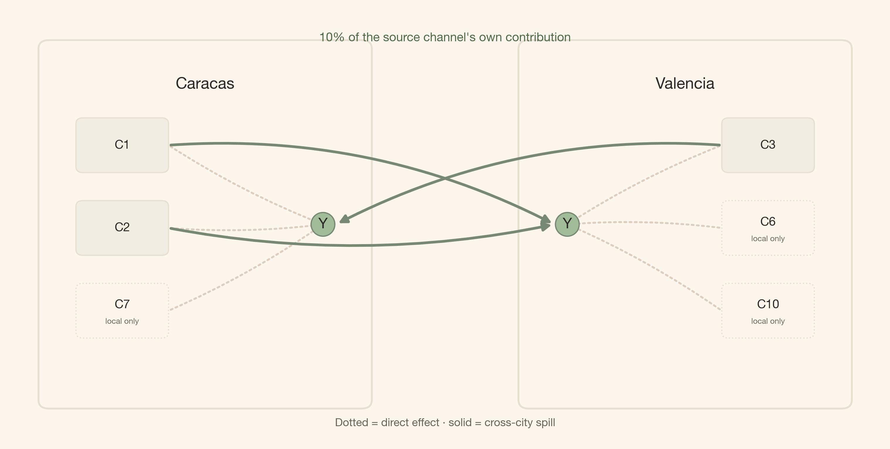
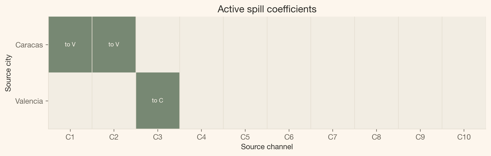
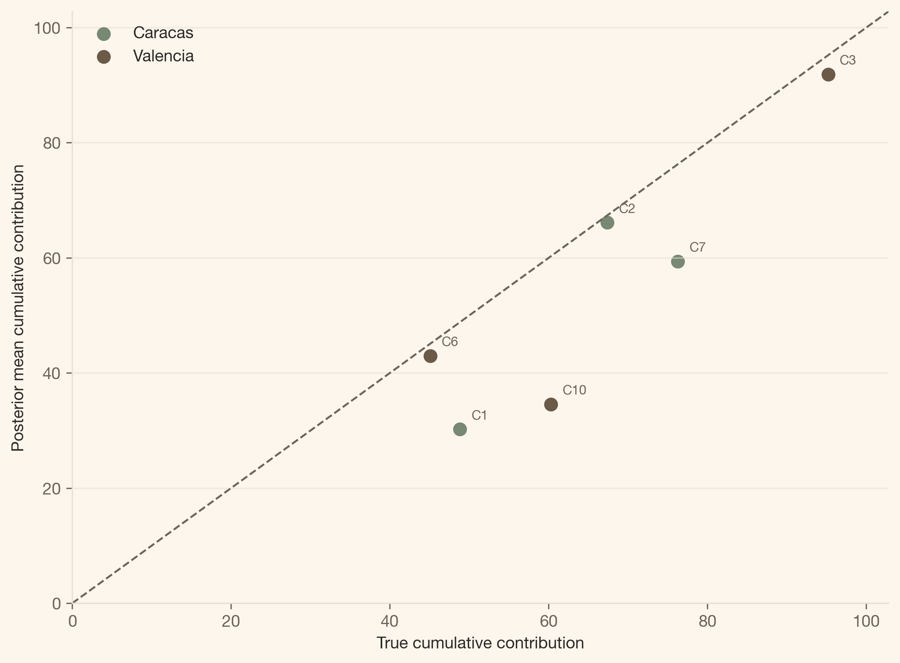
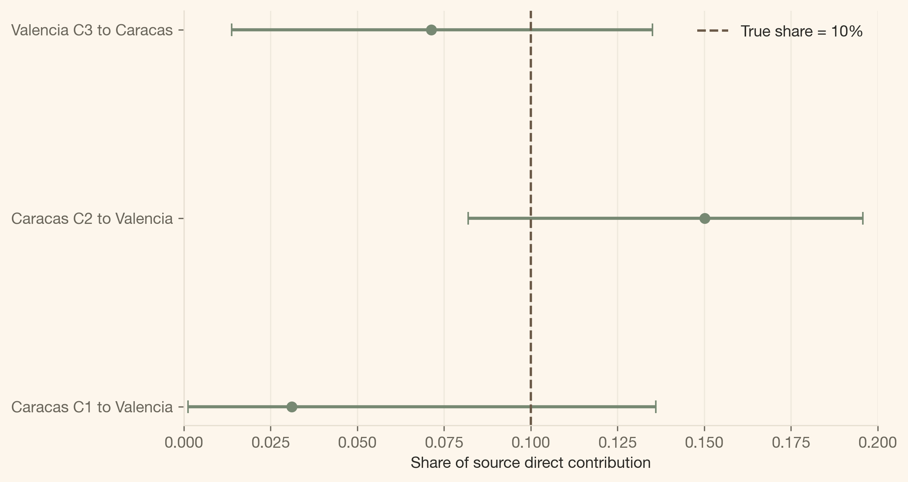
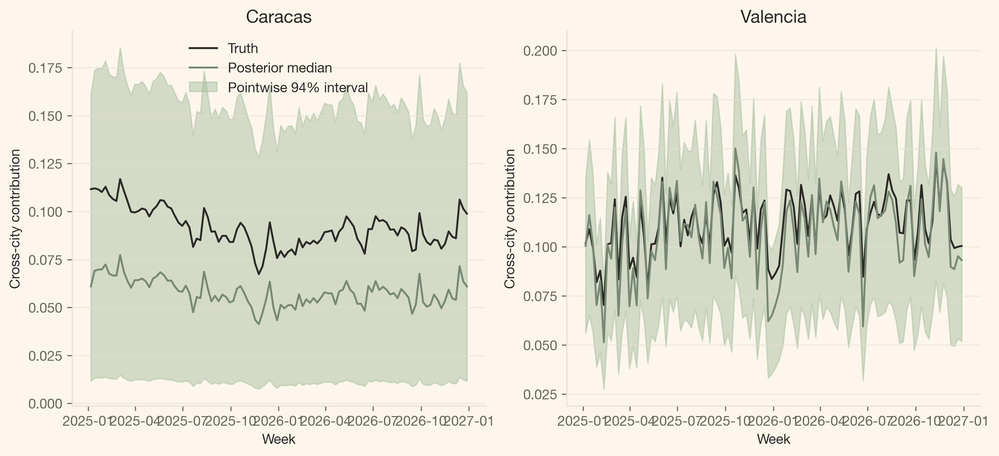

<a href="#quarto-document-content" class="skip-link">Skip to content</a>

<div id="title-block-header" class="quarto-title-block default">

<div class="quarto-title">

<div class="quarto-title-block">

<div>

# Media Does Not Stop at the City Border: Cross-City Spillovers with PyMC-Marketing

Code

- <a href="javascript:void(0)" id="quarto-show-all-code" class="dropdown-item" role="button">Show All Code</a>

- <a href="javascript:void(0)" id="quarto-hide-all-code" class="dropdown-item" role="button">Hide All Code</a>

- 

  ------------------------------------------------------------------------

- <a href="javascript:void(0)" id="quarto-view-source" class="dropdown-item" role="button">View Source</a>

</div>

</div>

<div class="quarto-categories">

<div class="quarto-category">

mmm

</div>

<div class="quarto-category">

pymc-marketing

</div>

<div class="quarto-category">

bayesian

</div>

<div class="quarto-category">

python

</div>

</div>

</div>

<div>

<div class="description">

A glass-box guide to adding sparse, bounded cross-city media spillovers to a multidimensional PyMC-Marketing MMM.

</div>

</div>

<div class="quarto-title-meta">

<div>

<div class="quarto-title-meta-heading">

Author

</div>

<div class="quarto-title-meta-contents">

Carlos Trujillo

</div>

</div>

<div>

<div class="quarto-title-meta-heading">

Published

</div>

<div class="quarto-title-meta-contents">

August 7, 2026

</div>

</div>

</div>

</div>

<div id="introduction" class="section level1">

# Introduction

“We fit one marketing mix model per city, so every campaign belongs to the city where we booked the spend.”

That is a useful reporting convention. It is not always a useful model of the world. Radio signals cross municipal borders. A launch in Caracas may lift branded search in Valencia. A creator campaign aimed at Valencia may send orders somewhere else entirely. If we force every city to live in isolation, those extra orders do not disappear; the model simply gives them the wrong name.

The good news is that [PyMC-Marketing](https://www.pymc-marketing.io/) already gives us the extension point. We keep the base multidimensional `MMM`, write one additive `MuEffect`, describe the plausible routes with a Boolean mask, and register it with one line:

<div id="c5bfe9f7" class="cell" execution_count="1">

<div id="cb1" class="sourceCode cell-code">

``` sourceCode
mmm.add_mu_effect(spill_effect)
```

</div>

</div>

The rest of this article opens that line up. First the business picture, then the equation, then the tensor shapes, and only then the full class.

</div>

<div id="quick-summary" class="section level1">

# Quick summary

This article walks you through:

- **The failure:** two independent city MMMs have no term for media that starts in one city and converts in another.
- **The data laboratory:** two synthetic cities with three known spill routes, each carrying exactly 10% of the source channel’s true contribution.
- **The PyMC-Marketing extension:** a custom `MuEffect` that reuses the fitted direct media contribution instead of rebuilding adstock and saturation.
- **The sparse policy:** `MaskedPrior` samples only three plausible spill coefficients rather than all twenty source-city-by-channel candidates.
- **The evidence:** sampler diagnostics, direct-effect recovery, and posterior spill recovery against known ground truth.

<div class="callout callout-style-default callout-tip callout-titled">

<div class="callout-header d-flex align-content-center">

<div class="callout-icon-container">

</div>

<div class="callout-title-container flex-fill">

The whole API idea

</div>

</div>

<div class="callout-body-container callout-body">

A multidimensional `MMM(dims=("city",))` already produces `channel_contribution` with city and channel coordinates. A custom `MuEffect` can read that tensor, route a bounded share to another city, and return a `(date, city)` contribution to the model mean.

</div>

</div>

</div>

<div id="getting-started" class="section level1">

# Getting started

<div id="36bc39ad" class="cell" execution_count="2">

Code

<div id="cb2" class="sourceCode cell-code">

``` sourceCode
import sys
import warnings
warnings.filterwarnings("ignore", category=FutureWarning)

from typing import Any

from pydantic import Field, InstanceOf
from pymc_extras.prior import Prior
from pymc_marketing.mmm import GeometricAdstock, MichaelisMentenSaturation
from pymc_marketing.mmm.additive_effect import MuEffect
from pymc_marketing.mmm.multidimensional import MMM
from pymc_marketing.mmm.scaling import DataDerivedScaling, FixedScaling, Scaling
from pymc_marketing.special_priors import MaskedPrior
import arviz as az
import pymc as pm
import pymc.dims as pmd
import pymc_marketing

import numpy as np
import pandas as pd
import xarray as xr

import matplotlib as mpl
import matplotlib.pyplot as plt
from matplotlib.patches import FancyArrowPatch, FancyBboxPatch
```

</div>

</div>

<div id="notebook-setup" class="section level2">

## Notebook setup

<div id="bd2e7c40" class="cell" execution_count="3">

Code

<div id="cb3" class="sourceCode cell-code">

``` sourceCode
COLORS = {
    "primary": "#778873",
    "secondary": "#A1BC98",
    "accent": "#DCCFC0",
    "bg": "#FDF6ED",
    "ink": "#2B2A26",
    "ink_muted": "#6B665C",
    "green_strong": "#4F6B4A",
    "brown": "#6B5A48",
    "line": "#E6DFD2",
    "surface_alt": "#F2EDE3",
}

mpl.rcParams.update({
    "figure.facecolor": COLORS["bg"],
    "axes.facecolor": COLORS["bg"],
    "axes.edgecolor": COLORS["line"],
    "axes.labelcolor": COLORS["ink"],
    "text.color": COLORS["ink"],
    "xtick.color": COLORS["ink_muted"],
    "ytick.color": COLORS["ink_muted"],
    "grid.color": COLORS["line"],
    "grid.alpha": 0.6,
    "font.family": "sans-serif",
    "font.sans-serif": ["Inter", "Manrope", "Helvetica Neue", "Arial"],
    "axes.titleweight": "semibold",
    "axes.titlesize": 13,
    "axes.spines.top": False,
    "axes.spines.right": False,
    "figure.dpi": 150,
    "figure.constrained_layout.use": True,
})

%config InlineBackend.figure_format = "retina"
def article_table(
    frame: pd.DataFrame,
    caption: str,
    formats: dict[str, str] | None = None,
):
    """Render a compact, index-free table using the site theme."""
    styled = frame.style.hide(axis="index").set_caption(caption)
    return styled.format(formats) if formats else styled


seed: int = sum(map(ord, "media does not stop at the city border"))
environment = pd.DataFrame({
    "Python": [sys.version.split()[0]],
    "PyMC": [pm.__version__],
    "PyMC-Marketing": [pymc_marketing.__version__],
    "Random seed": [seed],
})
display(article_table(environment, "Reproducible notebook environment"))
```

</div>

<div class="cell-output cell-output-display">

<div id="T_ffe0f" class="quarto-float quarto-figure quarto-figure-center anchored" quarto-postprocess="true">

<figure class="quarto-float quarto-float-tbl figure">
<div aria-describedby="T_ffe0f-caption-0ceaefa1-69ba-4598-a22c-09a6ac19f8ca">
<table id="T_ffe0f" class="caption-top table table-sm table-striped small" data-quarto-postprocess="true">
<thead>
<tr class="header">
<th id="T_ffe0f_level0_col0" class="col_heading level0 col0" data-quarto-table-cell-role="th">Python</th>
<th id="T_ffe0f_level0_col1" class="col_heading level0 col1" data-quarto-table-cell-role="th">PyMC</th>
<th id="T_ffe0f_level0_col2" class="col_heading level0 col2" data-quarto-table-cell-role="th">PyMC-Marketing</th>
<th id="T_ffe0f_level0_col3" class="col_heading level0 col3" data-quarto-table-cell-role="th">Random seed</th>
</tr>
</thead>
<tbody>
<tr class="odd">
<td id="T_ffe0f_row0_col0" class="data row0 col0">3.13.14</td>
<td id="T_ffe0f_row0_col1" class="data row0 col1">6.0.1</td>
<td id="T_ffe0f_row0_col2" class="data row0 col2">1.0.0</td>
<td id="T_ffe0f_row0_col3" class="data row0 col3">3567</td>
</tr>
</tbody>
</table>
</div>
<figcaption>Table 1: Reproducible notebook environment</figcaption>
</figure>

</div>

</div>

</div>

</div>

</div>

<div id="a-small-spill-creates-a-real-attribution-problem" class="section level1">

# A small spill creates a real attribution problem

We will use two deliberately simple synthetic cities, **Caracas** and **Valencia**. Both have ten media channels, two observed controls, and 104 weekly observations. The own-city response uses normalized geometric adstock with `l_max=4` followed by Michaelis–Menten saturation.

Three direct media paths also reach the *other* city:

- Caracas **C1** <span class="math inline">\rightarrow</span> Valencia
- Caracas **C2** <span class="math inline">\rightarrow</span> Valencia
- Valencia **C3** <span class="math inline">\rightarrow</span> Caracas

Each path transfers 10% of the source channel’s true own-city contribution. Everything else is structurally absent.

<div id="cell-fig-route-map" class="cell" execution_count="4">

Code

<div id="cb4" class="sourceCode cell-code">

``` sourceCode
fig, ax = plt.subplots(figsize=(10, 5))
ax.set_xlim(0, 10)
ax.set_ylim(0, 6)
ax.axis("off")

city_specs = {
    "Caracas": {
        "x": 0.5,
        "channel_x": 0.85,
        "active": ["C1", "C2", "C7"],
        "spill": ["C1", "C2"],
        "target": (3.6, 3.0),
        "flow": "right",
    },
    "Valencia": {
        "x": 6.0,
        "channel_x": 8.25,
        "active": ["C3", "C6", "C10"],
        "spill": ["C3"],
        "target": (6.4, 3.0),
        "flow": "left",
    },
}
node_positions = {}

for city, spec in city_specs.items():
    box = FancyBboxPatch(
        (spec["x"], 0.6), 3.5, 4.8,
        boxstyle="round,pad=0.16,rounding_size=0.12",
        facecolor=COLORS["bg"], edgecolor=COLORS["line"], linewidth=1.5,
    )
    ax.add_patch(box)
    ax.text(spec["x"] + 1.75, 4.95, city, ha="center", va="center", weight=600, fontsize=13)
    for idx, channel in enumerate(spec["active"]):
        y_pos = 4.1 - idx * 1.15
        channel_x = spec["channel_x"]
        is_spill_source = channel in spec["spill"]
        channel_box = FancyBboxPatch(
            (channel_x, y_pos - 0.3), 0.9, 0.6,
            boxstyle="round,pad=0.08,rounding_size=0.08",
            facecolor=COLORS["surface_alt"] if is_spill_source else COLORS["bg"],
            edgecolor=COLORS["line"],
            linestyle="-" if is_spill_source else ":",
        )
        ax.add_patch(channel_box)
        ax.text(
            channel_x + 0.45,
            y_pos + (0.08 if not is_spill_source else 0),
            channel,
            ha="center",
            va="center",
            fontsize=10,
        )
        if not is_spill_source:
            ax.text(
                channel_x + 0.45,
                y_pos - 0.15,
                "local only",
                ha="center",
                va="center",
                fontsize=6.5,
                color=COLORS["ink_muted"],
            )
        channel_edge = (
            channel_x + 0.98 if spec["flow"] == "right" else channel_x - 0.08
        )
        node_positions[(city, channel)] = (channel_edge, y_pos)
        direct_arrow = FancyArrowPatch(
            (channel_edge, y_pos), spec["target"],
            arrowstyle="-|>", mutation_scale=11, linewidth=1.6, linestyle=":",
            color=COLORS["accent"], connectionstyle="arc3,rad=0.05",
        )
        ax.add_patch(direct_arrow)
    ax.text(*spec["target"], "Y", ha="center", va="center", fontsize=12, weight=600,
            bbox={"boxstyle": "circle,pad=0.35", "fc": COLORS["secondary"], "ec": COLORS["primary"]})

route_specs = [
    ("Caracas", "C1", (6.25, 3.0), -0.14),
    ("Caracas", "C2", (6.25, 3.0), 0.10),
    ("Valencia", "C3", (3.75, 3.0), 0.14),
]
for source, channel, endpoint, rad in route_specs:
    start = node_positions[(source, channel)]
    arrow = FancyArrowPatch(
        start, endpoint, arrowstyle="-|>", mutation_scale=14, linewidth=2.2,
        color=COLORS["primary"], connectionstyle=f"arc3,rad={rad}",
    )
    ax.add_patch(arrow)

ax.text(5.0, 5.55, "10% of the source channel's own contribution", ha="center",
        color=COLORS["green_strong"], fontsize=10, weight=600)
ax.text(5.0, 0.2, "Dotted = direct effect · solid = cross-city spill", ha="center",
        color=COLORS["ink_muted"], fontsize=9)
plt.show()
```

</div>

<div class="cell-output cell-output-display">

<div id="fig-route-map" class="quarto-float quarto-figure quarto-figure-center anchored" alt="A route diagram with Caracas channels C1 and C2 pointing to Valencia sales, Valencia channel C3 pointing to Caracas sales, and local-only channels shown with dotted outlines.">

<figure class="quarto-float quarto-float-fig figure">
<div aria-describedby="fig-route-map-caption-0ceaefa1-69ba-4598-a22c-09a6ac19f8ca">

</div>
<figcaption>Figure 1: Three source channels cross the city boundary. Direct effects stay inside each city; the green arrows are the only cross-city routes the model is allowed to estimate.</figcaption>
</figure>

</div>

</div>

</div>

The question is simple: **how do we let an MMM keep the source channel’s temporal shape while assigning part of its contribution to a different city?**

</div>

<div id="the-synthetic-laboratory-makes-the-missing-term-observable" class="section level1">

# The synthetic laboratory makes the missing term observable

The two base CSVs come from `prior-generator`. Confounding is disabled and the baseline is deliberately stable so the cross-city term is the only structural complication we add. We then use the generator’s *true* channel contributions to inject the three spill paths.

What exactly changes in the target? Let <span class="math inline">V</span> and <span class="math inline">C</span> abbreviate Valencia and Caracas, and let <span class="math inline">\tau\_{s,k,t}</span> denote channel <span class="math inline">k</span>’s true own-city contribution in source city <span class="math inline">s</span> at week <span class="math inline">t</span>. Then:

<span class="math display"> \begin{aligned} Y^{\star}\_{V,t} &= Y\_{V,t} \\ &\quad + 0.10\tau\_{C,C1,t} \\ &\quad + 0.10\tau\_{C,C2,t}, \\ Y^{\star}\_{C,t} &= Y\_{C,t} + 0.10\tau\_{V,C3,t}. \end{aligned} </span>

The multiplier is fixed at 10% in the data-generating process. The model will not receive those contribution columns; they remain behind the curtain for scoring.

<div id="638c1e4c" class="cell" execution_count="5">

Code

<div id="cb5" class="sourceCode cell-code">

``` sourceCode
CITIES = ("Caracas", "Valencia")
CHANNELS = [f"C{k}" for k in range(1, 11)]
CONTROLS = ["Z1", "Z2"]
TRUE_SPILL_SHARE = 0.10

PANEL_DIMS = ("city",)
PANEL_CHANNEL_DIMS = ("city", "channel")
PANEL_CONTROL_DIMS = ("city", "control")
SPEND_DIMS = ("spend_city",)
SPEND_CHANNEL_DIMS = ("spend_city", "channel")
SPILL_PATH_DIMS = ("city", "spend_city", "channel")
SPEND_RENAME = {"city": "spend_city"}

SPILL_ROUTES = (
    ("Caracas", "Valencia", "C1"),
    ("Caracas", "Valencia", "C2"),
    ("Valencia", "Caracas", "C3"),
)

valencia_raw = pd.read_csv("../../data/valencia_raw.csv", parse_dates=["date"])
caracas_raw = pd.read_csv("../../data/caracas_raw.csv", parse_dates=["date"])
valencia_truth = pd.read_csv("../../data/valencia_contributions.csv", parse_dates=["date"])
caracas_truth = pd.read_csv("../../data/caracas_contributions.csv", parse_dates=["date"])

assert valencia_raw["date"].equals(caracas_raw["date"])
assert valencia_truth["date"].equals(caracas_truth["date"])

valencia = valencia_raw.rename(columns={"Y": "y_base"}).copy()
caracas = caracas_raw.rename(columns={"Y": "y_base"}).copy()

valencia["spill_truth"] = TRUE_SPILL_SHARE * (
    caracas_truth["contrib_C1"].to_numpy() + caracas_truth["contrib_C2"].to_numpy()
)
caracas["spill_truth"] = TRUE_SPILL_SHARE * valencia_truth["contrib_C3"].to_numpy()

for frame in (valencia, caracas):
    frame["y"] = frame["y_base"] + frame["spill_truth"]

panel = pd.concat([caracas, valencia], ignore_index=True).sort_values(
    ["date", "city"], ignore_index=True
)

spill_columns = [
    "contrib_spill_from_caracas_C1",
    "contrib_spill_from_caracas_C2",
    "contrib_spill_from_valencia_C3",
]
for frame in (caracas_truth, valencia_truth):
    for column in spill_columns:
        frame[column] = 0.0

valencia_truth["contrib_spill_from_caracas_C1"] = (
    TRUE_SPILL_SHARE * caracas_truth["contrib_C1"].to_numpy()
)
valencia_truth["contrib_spill_from_caracas_C2"] = (
    TRUE_SPILL_SHARE * caracas_truth["contrib_C2"].to_numpy()
)
caracas_truth["contrib_spill_from_valencia_C3"] = (
    TRUE_SPILL_SHARE * valencia_truth["contrib_C3"].to_numpy()
)

truth = pd.concat([caracas_truth, valencia_truth], ignore_index=True).sort_values(
    ["date", "city"], ignore_index=True
)
truth["contrib_spill_total"] = truth[spill_columns].sum(axis=1)

model_data = panel[["date", "city", *CHANNELS, *CONTROLS, "y"]].rename(columns={"y": "Y"})
model_data.to_csv("../../data/mmm_data_raw.csv", index=False)
truth.to_csv("../../data/mmm_data_contributions.csv", index=False)

assert np.allclose(panel["y"] - panel["y_base"], panel["spill_truth"])
assert np.allclose(
    panel["spill_truth"].to_numpy(), truth["contrib_spill_total"].to_numpy()
)
assert truth["contrib_spill_total"].abs().sum() > 0

X = panel[["date", "city", *CHANNELS, *CONTROLS]]
y = panel["y"]

dgp_rows = []
for city in CITIES:
    city_truth = truth.loc[truth["city"].eq(city)]
    active_channels = [
        channel for channel in CHANNELS
        if abs(city_truth[f"contrib_{channel}"].sum()) > 1e-10
    ]
    dgp_rows.append({
        "City": city,
        "Weeks": city_truth["date"].nunique(),
        "Active direct channels": ", ".join(active_channels),
        "True cumulative spill": city_truth["contrib_spill_total"].sum(),
    })
dgp_summary = pd.DataFrame(dgp_rows)
display(article_table(
    dgp_summary,
    "Synthetic panel used by the MMM",
    {"True cumulative spill": "{:.2f}"},
))
```

</div>

<div class="cell-output cell-output-display">

<div id="T_15ce5" class="quarto-float quarto-figure quarto-figure-center anchored" quarto-postprocess="true">

<figure class="quarto-float quarto-float-tbl figure">
<div aria-describedby="T_15ce5-caption-0ceaefa1-69ba-4598-a22c-09a6ac19f8ca">
<table id="T_15ce5" class="caption-top table table-sm table-striped small" data-quarto-postprocess="true">
<thead>
<tr class="header">
<th id="T_15ce5_level0_col0" class="col_heading level0 col0" data-quarto-table-cell-role="th">City</th>
<th id="T_15ce5_level0_col1" class="col_heading level0 col1" data-quarto-table-cell-role="th">Weeks</th>
<th id="T_15ce5_level0_col2" class="col_heading level0 col2" data-quarto-table-cell-role="th">Active direct channels</th>
<th id="T_15ce5_level0_col3" class="col_heading level0 col3" data-quarto-table-cell-role="th">True cumulative spill</th>
</tr>
</thead>
<tbody>
<tr class="odd">
<td id="T_15ce5_row0_col0" class="data row0 col0">Caracas</td>
<td id="T_15ce5_row0_col1" class="data row0 col1">104</td>
<td id="T_15ce5_row0_col2" class="data row0 col2">C1, C2, C7</td>
<td id="T_15ce5_row0_col3" class="data row0 col3">9.52</td>
</tr>
<tr class="even">
<td id="T_15ce5_row1_col0" class="data row1 col0">Valencia</td>
<td id="T_15ce5_row1_col1" class="data row1 col1">104</td>
<td id="T_15ce5_row1_col2" class="data row1 col2">C3, C6, C10</td>
<td id="T_15ce5_row1_col3" class="data row1 col3">11.62</td>
</tr>
</tbody>
</table>
</div>
<figcaption>Table 2: Synthetic panel used by the MMM</figcaption>
</figure>

</div>

</div>

</div>

<div id="cell-fig-target-spill" class="cell" execution_count="6">

Code

<div id="cb6" class="sourceCode cell-code">

``` sourceCode
fig, axes = plt.subplots(1, 2, figsize=(10, 4.5), sharex=True)
for ax, city in zip(axes, CITIES, strict=True):
    city_data = panel.loc[panel["city"].eq(city)]
    ax.plot(city_data["date"], city_data["y_base"], color=COLORS["ink_muted"],
            linewidth=1.1, label="Target before spill")
    ax.plot(city_data["date"], city_data["y"], color=COLORS["primary"],
            linewidth=1.5, label="Target after spill")
    ax.fill_between(
        city_data["date"], city_data["y_base"], city_data["y"],
        color=COLORS["secondary"], alpha=0.55, label="Cross-city lift",
    )
    ax.set(title=city, xlabel="Week", ylabel="Sales")
    ax.grid(axis="y")
axes[0].legend(frameon=False, loc="best")
plt.show()
```

</div>

<div class="cell-output cell-output-display">

<div id="fig-target-spill" class="quarto-float quarto-figure quarto-figure-center anchored" alt="Two weekly sales charts for Caracas and Valencia comparing the target before spill with the higher target after spill; the shaded area is cross-city lift.">

<figure class="quarto-float quarto-float-fig figure">
<div aria-describedby="fig-target-spill-caption-0ceaefa1-69ba-4598-a22c-09a6ac19f8ca">

</div>
<figcaption>Figure 2: The target changes by the shape of media from the other city, not by random noise. An independent-city MMM has no named component for the shaded difference.</figcaption>
</figure>

</div>

</div>

</div>

</div>

<div id="two-independent-mmms-cannot-name-the-shaded-contribution" class="section level1">

# Two independent MMMs cannot name the shaded contribution

The familiar model fits each city with its own channels, controls, and baseline:

<span class="math display"> Y\_{r,t}=\mu^{\text{direct}}\_{r,t}+\epsilon\_{r,t}. </span>

That model may predict well. It still has no route where a source city <span class="math inline">s</span> differs from the receiving city <span class="math inline">r</span>. The shaded signal in Figure 2 must leak into direct attribution, the baseline, controls, or residual noise.

This is the controlled failure. **The problem is not that the base MMM is badly implemented. The problem is that its mean function cannot express the business mechanism.**

> **Could we just add the other city’s raw spend as controls?** We could, but then we would estimate a second response curve disconnected from the source campaign’s fitted adstock and saturation. Reusing the source contribution is both more parsimonious and easier to interpret.

The corrected mean adds one term:

<span class="math display"> \begin{aligned} Y\_{r,t} &= \mu^{\text{direct}}\_{r,t} + S\_{r,t} + \epsilon\_{r,t}, \\ S\_{r,t} &= \sum\_{s\neq r}\sum\_{k=1}^{K} M\_{r,s,k}\\\rho\_{s,k} \\ &\qquad \times g\_{s,k}(X\_{s,k,t}). \end{aligned} </span>

where:

- <span class="math inline">S\_{r,t}</span> is the total spill arriving in receiving city <span class="math inline">r</span>;
- <span class="math inline">g\_{s,k}(X\_{s,k,t})</span> is the **already fitted direct contribution** after adstock and saturation;
- <span class="math inline">M\_{r,s,k}\in\\0,1\\</span> is the known route mask;
- <span class="math inline">\rho\_{s,k}</span> is the learned share exported by source city <span class="math inline">s</span> and channel <span class="math inline">k</span>;
- the sum returns one spill contribution for each receiving city <span class="math inline">r</span> and week <span class="math inline">t</span>.

The theory reconnects here: the mask is structural knowledge; the share is posterior uncertainty.

</div>

<div id="a-mask-turns-a-business-policy-into-three-parameters" class="section level1">

# A mask turns a business policy into three parameters

With two cities and ten channels, there are twenty possible source-city-by-channel spill coefficients. Our policy allows three. The other seventeen should not be weakly regularized or estimated near zero. They should not exist in the graph.

<div id="e273f091" class="cell" execution_count="7">

<div id="cb7" class="sourceCode cell-code">

``` sourceCode
spill_mask_values = np.zeros(
    (len(CITIES), len(CITIES), len(CHANNELS)), dtype=bool
)
for source_city, receiver_city, channel in SPILL_ROUTES:
    spill_mask_values[
        CITIES.index(receiver_city),
        CITIES.index(source_city),
        CHANNELS.index(channel),
    ] = True

spill_path_mask = xr.DataArray(
    spill_mask_values,
    dims=SPILL_PATH_DIMS,
    coords={
        "city": list(CITIES),
        "spend_city": list(CITIES),
        "channel": CHANNELS,
    },
)
source_active_mask = spill_path_mask.any("city").transpose(*SPEND_CHANNEL_DIMS)

assert int(source_active_mask.sum()) == len(SPILL_ROUTES) == 3
```

</div>

</div>

<div id="cell-fig-mask" class="cell" execution_count="8">

Code

<div id="cb8" class="sourceCode cell-code">

``` sourceCode
fig, ax = plt.subplots(figsize=(9, 2.8))
mask_plot = source_active_mask.astype(int)
cmap = mpl.colors.ListedColormap([COLORS["surface_alt"], COLORS["primary"]])
ax.imshow(mask_plot, aspect="auto", cmap=cmap, vmin=0, vmax=1)
ax.set_xticks(range(len(CHANNELS)), CHANNELS)
ax.set_yticks(range(len(CITIES)), CITIES)
ax.set(xlabel="Source channel", ylabel="Source city")
for row, city in enumerate(CITIES):
    for col, channel in enumerate(CHANNELS):
        if bool(source_active_mask.sel(spend_city=city, channel=channel)):
            receiver = next(
                target for source, target, route_channel in SPILL_ROUTES
                if source == city and route_channel == channel
            )
            ax.text(col, row, f"to {receiver[0]}", ha="center", va="center",
                    color=COLORS["bg"], fontsize=8, weight=600)
for x in np.arange(-0.5, len(CHANNELS), 1):
    ax.axvline(x, color=COLORS["line"], linewidth=0.8)
ax.set_title("Active spill coefficients")
plt.show()
```

</div>

<div class="cell-output cell-output-display">

<div id="fig-mask" class="quarto-float quarto-figure quarto-figure-center anchored" alt="A two-by-ten source-city and channel matrix with active cells only for Caracas C1, Caracas C2, and Valencia C3.">

<figure class="quarto-float quarto-float-fig figure">
<div aria-describedby="fig-mask-caption-0ceaefa1-69ba-4598-a22c-09a6ac19f8ca">

</div>
<figcaption>Figure 3: MaskedPrior turns twenty possible source-city-by-channel coefficients into three sampled parameters. The remaining seventeen are structural zeros, not uncertain near-zero estimates.</figcaption>
</figure>

</div>

</div>

</div>

<div class="callout callout-style-default callout-important callout-titled">

<div class="callout-header d-flex align-content-center">

<div class="callout-icon-container">

</div>

<div class="callout-title-container flex-fill">

`MaskedPrior` is a gate, not a shrinkage prior

</div>

</div>

<div class="callout-body-container callout-body">

The wrapped prior is sampled only where the mask is `True`, then expanded back to the full labeled tensor with exact zeros elsewhere. Here that means three free spill parameters instead of twenty.

</div>

</div>

</div>

<div id="theoretical-lens" class="section level1">

# Theoretical lens

I approach this as a **Bayesian measurement problem with structural knowledge**. The route mask encodes what the business considers possible: which source-city campaigns can affect which receiving city. The posterior then estimates how large those allowed effects are.

That distinction matters. `MaskedPrior` does not discover the graph. It expresses the graph we are willing to estimate. In this example, the topology is known and sparse; the magnitudes are uncertain.

From a causal perspective, this is still an observational attribution model. The extension can represent cross-city spill once we make the relevant assumptions, but it cannot prove that a campaign caused the spill. It foregrounds a missing mechanism in the likelihood; it does not replace experimental design, interference assumptions, or geographic lift tests.

</div>

<div id="the-custom-effect-reuses-what-the-mmm-already-knows" class="section level1">

# The custom effect reuses what the MMM already knows

We call this class `SpillEffect`. It inherits PyMC-Marketing’s `MuEffect` protocol.

It has three responsibilities:

1.  register the source-city coordinate and the fixed path mask;
2.  create the bounded shares only on active source-channel pairs;
3.  route the fitted direct contribution to the receiving city and return `(date, city)`.

We model

<span class="math display"> u\_{s,k}\sim\operatorname{Beta}(1,1), \qquad \rho\_{s,k}=\rho\_{\max}u\_{s,k}, </span>

with <span class="math inline">\rho\_{\max}=0.20</span>. The synthetic truth is 0.10, so it sits inside — not on the boundary of — the model’s plausible interval.

<div id="b5163d91" class="cell" execution_count="9">

<div id="cb9" class="sourceCode cell-code">

``` sourceCode
class SpillEffect(MuEffect):
    """Route a bounded share of direct media contribution across cities."""

    source_active_mask: InstanceOf[xr.DataArray] = Field(exclude=True)
    spill_path_mask: InstanceOf[xr.DataArray] = Field(exclude=True)
    fraction_prior: InstanceOf[Prior]
    max_share: float = Field(default=0.20, gt=0, le=1)
    prefix: str = "spill"

    @staticmethod
    def _serialize_mask(mask: xr.DataArray) -> dict[str, Any]:
        """Convert a fixed Boolean mask to JSON-compatible values."""
        return {
            "dims": list(mask.dims),
            "coords": {dim: mask.coords[dim].values.tolist() for dim in mask.dims},
            "values": mask.astype(bool).values.tolist(),
        }

    @property
    def contribution_var_name(self) -> str:
        """Name of the deterministic contribution stored in the posterior."""
        return f"{self.prefix}_contribution"

    def to_dict(self) -> dict[str, Any]:
        """Serialize the custom effect for inference-data provenance."""
        return {
            "prefix": self.prefix,
            "max_share": self.max_share,
            "fraction_prior": self.fraction_prior.to_dict(),
            "source_active_mask": self._serialize_mask(self.source_active_mask),
            "spill_path_mask": self._serialize_mask(self.spill_path_mask),
        }

    def create_data(self, mmm: Any) -> None:
        """Register the source-city coordinate and route mask."""
        model = mmm.model
        model.add_coord("spend_city", values=model.coords["city"])
        pmd.Data(
            f"{self.prefix}_path_mask",
            self.spill_path_mask.astype(float).values,
            dims=SPILL_PATH_DIMS,
        )

    def create_effect(self, mmm: Any):
        """Build one spill contribution per week and receiving city."""
        model = mmm.model
        fraction = MaskedPrior(
            self.fraction_prior,
            mask=self.source_active_mask,
            active_dim=f"{self.prefix}_active_source_channel",
        ).create_variable(f"{self.prefix}_fraction", xdist=True)

        total_share = pmd.Deterministic(
            f"{self.prefix}_total_share",
            (self.max_share * fraction).transpose(*SPEND_CHANNEL_DIMS),
        )
        path_share = pmd.Deterministic(
            f"{self.prefix}_path_share",
            (total_share * model[f"{self.prefix}_path_mask"]).transpose(
                *SPILL_PATH_DIMS
            ),
        )

        source_direct_original = pmd.Deterministic(
            f"{self.prefix}_source_direct_original_scale",
            (model["channel_contribution"] * model["target_scale"])
            .rename(SPEND_RENAME)
            .transpose("date", *SPEND_CHANNEL_DIMS),
        )
        by_path_original = pmd.Deterministic(
            f"{self.prefix}_by_path_original_scale",
            (source_direct_original * path_share).transpose(
                "date", *SPILL_PATH_DIMS
            ),
        )
        contribution_original = pmd.Deterministic(
            f"{self.prefix}_contribution_original_scale",
            by_path_original.sum(dim=(*SPEND_DIMS, "channel")).transpose(
                "date", *PANEL_DIMS
            ),
        )

        return pmd.Deterministic(
            f"{self.prefix}_contribution",
            (contribution_original / model["target_scale"]).transpose(
                "date", *PANEL_DIMS
            ),
        )

    def set_data(self, mmm: Any, model: pm.Model, X: xr.Dataset) -> None:
        """No effect-owned data to update; the MMM refreshes channel data first."""
        del mmm, model, X
```

</div>

</div>

Most of the class is named tensor bookkeeping. The actual model change is the short chain inside `create_effect`:

<span class="math display"> \begin{gathered} \text{direct contribution} \\ \times\\ \text{bounded share} \\ \times\\ \text{route mask} \\ \downarrow\\ \sum\_{s,k} \\ \text{spill by receiving city} \end{gathered} </span>

</div>

<div id="pymc-marketing-only-needs-one-extra-effect" class="section level1">

# PyMC-Marketing only needs one extra effect

To keep the demonstration about spill rather than variable selection, we use the synthetic truth to mask direct city-channel pairs that do not affect either target. This leaves six direct response curves and three spill coefficients. In real work, do not build that direct mask from outcomes; use channel availability, prior business knowledge, or a proper variable-selection strategy.

<div id="94f4fff1" class="cell" execution_count="10">

Code

<div id="cb10" class="sourceCode cell-code">

``` sourceCode
contribution_columns = [f"contrib_{channel}" for channel in CHANNELS]
direct_activity = (
    truth.groupby("city")[contribution_columns]
    .sum()
    .abs()
    .gt(1e-10)
    .reindex(CITIES)
)
direct_activity.columns = CHANNELS
direct_path_mask = xr.DataArray(
    direct_activity.to_numpy(),
    dims=PANEL_CHANNEL_DIMS,
    coords={"city": list(CITIES), "channel": CHANNELS},
)

assert int(direct_path_mask.sum()) == 6
```

</div>

</div>

Because channels and targets are max-scaled, the response priors below live on a comparable scale across cities. A positive intercept removes a spurious negative-baseline mode, while a log-normal half-saturation prior keeps the sampler away from a zero-boundary funnel. These are geometry choices, not evidence about the spill routes.

<div id="3fad38c7" class="cell" execution_count="11">

<div id="cb11" class="sourceCode cell-code">

``` sourceCode
adstock = GeometricAdstock(
    l_max=4,
    priors={
        "alpha": MaskedPrior(
            Prior("Beta", alpha=2, beta=2, dims=PANEL_CHANNEL_DIMS),
            mask=direct_path_mask,
            active_dim="direct_active_city_channel",
        )
    },
)
saturation = MichaelisMentenSaturation(
    priors={
        "alpha": MaskedPrior(
            Prior("Gamma", mu=0.20, sigma=0.15, dims=PANEL_CHANNEL_DIMS),
            mask=direct_path_mask,
            active_dim="direct_active_city_channel",
        ),
        "lam": MaskedPrior(
            Prior("LogNormal", mu=-0.69, sigma=0.75, dims=PANEL_CHANNEL_DIMS),
            mask=direct_path_mask,
            active_dim="direct_active_city_channel",
        ),
    }
)

spill_effect = SpillEffect(
    source_active_mask=source_active_mask,
    spill_path_mask=spill_path_mask,
    fraction_prior=Prior("Beta", alpha=1, beta=1, dims=SPEND_CHANNEL_DIMS),
    max_share=0.20,
)

target_scale = panel.groupby("city")["y"].max().reindex(CITIES)
target_scale_array = xr.DataArray(
    target_scale.to_numpy(),
    dims=PANEL_DIMS,
    coords={"city": list(CITIES)},
)

mmm = MMM(
    date_column="date",
    target_column="y",
    channel_columns=CHANNELS,
    control_columns=CONTROLS,
    dims=PANEL_DIMS,
    model_config={
        "intercept": Prior("HalfNormal", sigma=1, dims=PANEL_DIMS),
        "gamma_control": Prior(
            "Normal", mu=0, sigma=0.10, dims=PANEL_CONTROL_DIMS
        ),
        "likelihood": Prior(
            "Normal",
            sigma=Prior("HalfNormal", sigma=0.02, dims=PANEL_DIMS),
            dims=("date", *PANEL_DIMS),
        ),
    },
    scaling=Scaling(
        channel=DataDerivedScaling(method="max", dims=()),
        target=FixedScaling(dims=(), value=target_scale_array),
    ),
    adstock=adstock,
    saturation=saturation,
)

mmm.add_mu_effect(spill_effect)
mmm.build_model(X, y)
mmm.add_original_scale_contribution_variable(
    ["y", "channel_contribution", "control_contribution", "intercept_contribution"]
)
```

</div>

<div class="cell-output cell-output-display" execution_count="10">

    <pymc_marketing.mmm.mmm.MMM at 0x31befbe00>

</div>

</div>

The model graph should contain exactly three free spill parameters. That is the computational payoff of the mask.

<div id="c5093b4b" class="cell" execution_count="12">

<div id="cb13" class="sourceCode cell-code">

``` sourceCode
initial_point = mmm.model.initial_point()
spill_key = next(name for name in initial_point if name.startswith("spill_fraction_active"))
assert initial_point[spill_key].size == len(SPILL_ROUTES) == 3
assert np.isfinite(mmm.model.compile_logp()(initial_point))

free_rv_names = sorted(variable.name for variable in mmm.model.free_RVs)
model_structure = pd.DataFrame({
    "Layer": ["Panel", "Direct media", "Cross-city spill", "Likelihood"],
    "Estimated structure": [
        "2 city intercepts + 4 control coefficients",
        "6 active city-channel response curves",
        "3 bounded shares from 20 candidates",
        "2 city-specific residual scales",
    ],
})
display(article_table(model_structure, "What the model samples"))
```

</div>

<div class="cell-output cell-output-display">

<div id="T_3574f" class="quarto-float quarto-figure quarto-figure-center anchored" quarto-postprocess="true">

<figure class="quarto-float quarto-float-tbl figure">
<div aria-describedby="T_3574f-caption-0ceaefa1-69ba-4598-a22c-09a6ac19f8ca">
<table id="T_3574f" class="caption-top table table-sm table-striped small" data-quarto-postprocess="true">
<thead>
<tr class="header">
<th id="T_3574f_level0_col0" class="col_heading level0 col0" data-quarto-table-cell-role="th">Layer</th>
<th id="T_3574f_level0_col1" class="col_heading level0 col1" data-quarto-table-cell-role="th">Estimated structure</th>
</tr>
</thead>
<tbody>
<tr class="odd">
<td id="T_3574f_row0_col0" class="data row0 col0">Panel</td>
<td id="T_3574f_row0_col1" class="data row0 col1">2 city intercepts + 4 control coefficients</td>
</tr>
<tr class="even">
<td id="T_3574f_row1_col0" class="data row1 col0">Direct media</td>
<td id="T_3574f_row1_col1" class="data row1 col1">6 active city-channel response curves</td>
</tr>
<tr class="odd">
<td id="T_3574f_row2_col0" class="data row2 col0">Cross-city spill</td>
<td id="T_3574f_row2_col1" class="data row2 col1">3 bounded shares from 20 candidates</td>
</tr>
<tr class="even">
<td id="T_3574f_row3_col0" class="data row3 col0">Likelihood</td>
<td id="T_3574f_row3_col1" class="data row3 col1">2 city-specific residual scales</td>
</tr>
</tbody>
</table>
</div>
<figcaption>Table 3: What the model samples</figcaption>
</figure>

</div>

</div>

</div>

</div>

<div id="clean-geometry-comes-before-interpretation" class="section level1">

# Clean geometry comes before interpretation

<div id="be251b7b" class="cell" execution_count="13">

<div id="cb14" class="sourceCode cell-code">

``` sourceCode
idata = mmm.fit(
    X=X,
    y=y,
    chains=4,
    cores=4,
    draws=1_000,
    tune=1_500,
    target_accept=0.95,
    random_seed=seed,
    progressbar=False,
)
```

</div>

<div class="cell-output cell-output-display">

</div>

<div class="cell-output cell-output-display">

```
```

</div>

</div>

<div id="c38904b9" class="cell" execution_count="14">

<div id="cb15" class="sourceCode cell-code">

``` sourceCode
free_rv_names = sorted(variable.name for variable in mmm.model.free_RVs)
diagnostics = az.summary(idata, var_names=free_rv_names, round_to=6)
divergences = int(idata.sample_stats["diverging"].sum())
rhat = pd.to_numeric(diagnostics["r_hat"], errors="coerce")
ess_bulk = pd.to_numeric(diagnostics["ess_bulk"], errors="coerce")
max_rhat = float(rhat.max())
min_ess_bulk = float(ess_bulk.min())

diagnostic_overview = pd.DataFrame({
    "Metric": ["Divergences", "Maximum r-hat", "Minimum bulk ESS"],
    "Observed": [f"{divergences}", f"{max_rhat:.3f}", f"{min_ess_bulk:.0f}"],
    "Gate": ["= 0", "< 1.05", "> 100"],
    "Status": [
        "Pass" if divergences == 0 else "Fail",
        "Pass" if max_rhat < 1.05 else "Fail",
        "Pass" if min_ess_bulk > 100 else "Fail",
    ],
})
display(article_table(diagnostic_overview, "Sampler quality gates"))

assert divergences == 0
assert max_rhat < 1.05
assert min_ess_bulk > 100
```

</div>

<div class="cell-output cell-output-display">

<div id="T_3b0f6" class="quarto-float quarto-figure quarto-figure-center anchored" quarto-postprocess="true">

<figure class="quarto-float quarto-float-tbl figure">
<div aria-describedby="T_3b0f6-caption-0ceaefa1-69ba-4598-a22c-09a6ac19f8ca">
<table id="T_3b0f6" class="caption-top table table-sm table-striped small" data-quarto-postprocess="true">
<thead>
<tr class="header">
<th id="T_3b0f6_level0_col0" class="col_heading level0 col0" data-quarto-table-cell-role="th">Metric</th>
<th id="T_3b0f6_level0_col1" class="col_heading level0 col1" data-quarto-table-cell-role="th">Observed</th>
<th id="T_3b0f6_level0_col2" class="col_heading level0 col2" data-quarto-table-cell-role="th">Gate</th>
<th id="T_3b0f6_level0_col3" class="col_heading level0 col3" data-quarto-table-cell-role="th">Status</th>
</tr>
</thead>
<tbody>
<tr class="odd">
<td id="T_3b0f6_row0_col0" class="data row0 col0">Divergences</td>
<td id="T_3b0f6_row0_col1" class="data row0 col1">0</td>
<td id="T_3b0f6_row0_col2" class="data row0 col2">= 0</td>
<td id="T_3b0f6_row0_col3" class="data row0 col3">Pass</td>
</tr>
<tr class="even">
<td id="T_3b0f6_row1_col0" class="data row1 col0">Maximum r-hat</td>
<td id="T_3b0f6_row1_col1" class="data row1 col1">1.004</td>
<td id="T_3b0f6_row1_col2" class="data row1 col2">&lt; 1.05</td>
<td id="T_3b0f6_row1_col3" class="data row1 col3">Pass</td>
</tr>
<tr class="odd">
<td id="T_3b0f6_row2_col0" class="data row2 col0">Minimum bulk ESS</td>
<td id="T_3b0f6_row2_col1" class="data row2 col1">1367</td>
<td id="T_3b0f6_row2_col2" class="data row2 col2">&gt; 100</td>
<td id="T_3b0f6_row2_col3" class="data row2 col3">Pass</td>
</tr>
</tbody>
</table>
</div>
<figcaption>Table 4: Sampler quality gates</figcaption>
</figure>

</div>

</div>

</div>

A posterior is only useful after it passes this gate. We also verify the graph itself: diagonal routes are exactly zero, inactive paths remain zero, and no learned share exceeds the 20% cap.

<div id="c88ec14e" class="cell" execution_count="15">

Code

<div id="cb16" class="sourceCode cell-code">

``` sourceCode
posterior = idata.posterior
path_share = posterior["spill_path_share"]
total_share = posterior["spill_total_share"]

assert bool((total_share >= 0).all())
assert bool((total_share <= spill_effect.max_share + 1e-10).all())
assert bool((path_share.where(~spill_path_mask, 0) == 0).all())
for city in CITIES:
    assert bool(
        (path_share.sel(city=city, spend_city=city) == 0).all()
    )

graph_checks = pd.DataFrame({
    "Invariant": [
        "All shares are bounded between 0% and 20%",
        "Inactive source-receiver-channel paths are exactly zero",
        "Every same-city spill path is exactly zero",
    ],
    "Status": ["Pass", "Pass", "Pass"],
})
display(article_table(graph_checks, "Spill-graph invariants"))
```

</div>

<div class="cell-output cell-output-display">

<div id="T_ca581" class="quarto-float quarto-figure quarto-figure-center anchored" quarto-postprocess="true">

<figure class="quarto-float quarto-float-tbl figure">
<div aria-describedby="T_ca581-caption-0ceaefa1-69ba-4598-a22c-09a6ac19f8ca">
<table id="T_ca581" class="caption-top table table-sm table-striped small" data-quarto-postprocess="true">
<thead>
<tr class="header">
<th id="T_ca581_level0_col0" class="col_heading level0 col0" data-quarto-table-cell-role="th">Invariant</th>
<th id="T_ca581_level0_col1" class="col_heading level0 col1" data-quarto-table-cell-role="th">Status</th>
</tr>
</thead>
<tbody>
<tr class="odd">
<td id="T_ca581_row0_col0" class="data row0 col0">All shares are bounded between 0% and 20%</td>
<td id="T_ca581_row0_col1" class="data row0 col1">Pass</td>
</tr>
<tr class="even">
<td id="T_ca581_row1_col0" class="data row1 col0">Inactive source-receiver-channel paths are exactly zero</td>
<td id="T_ca581_row1_col1" class="data row1 col1">Pass</td>
</tr>
<tr class="odd">
<td id="T_ca581_row2_col0" class="data row2 col0">Every same-city spill path is exactly zero</td>
<td id="T_ca581_row2_col1" class="data row2 col1">Pass</td>
</tr>
</tbody>
</table>
</div>
<figcaption>Table 5: Spill-graph invariants</figcaption>
</figure>

</div>

</div>

</div>

</div>

<div id="known-truth-lets-us-score-both-layers" class="section level1">

# Known truth lets us score both layers

Before trusting the spill result, we check the base MMM. Each point below is one active own-city channel. Perfect cumulative recovery lies on the diagonal. Several paths are close; C1, C7, and C10 are understated. That miss matters because the spill effect deliberately inherits the source contribution rather than estimating a second response curve.

<div id="7c944115" class="cell" execution_count="16">

Code

<div id="cb17" class="sourceCode cell-code">

``` sourceCode
post_direct_total = (
    posterior["channel_contribution_original_scale"]
    .sum("date")
    .mean(("chain", "draw"))
)
true_direct_total = (
    truth.groupby("city")[contribution_columns]
    .sum()
    .reindex(CITIES)
)
true_direct_total.columns = CHANNELS

rows = []
for city in CITIES:
    for channel in CHANNELS:
        if bool(direct_path_mask.sel(city=city, channel=channel)):
            rows.append({
                "city": city,
                "channel": channel,
                "truth": float(true_direct_total.loc[city, channel]),
                "posterior": float(post_direct_total.sel(city=city, channel=channel)),
            })
direct_recovery = pd.DataFrame(rows)
direct_recovery["relative_error"] = (
    direct_recovery["posterior"] / direct_recovery["truth"] - 1
)
display(article_table(
    direct_recovery.rename(columns={
        "city": "City",
        "channel": "Channel",
        "truth": "Truth",
        "posterior": "Posterior mean",
        "relative_error": "Relative error",
    }),
    "Cumulative direct-contribution recovery",
    {
        "Truth": "{:.2f}",
        "Posterior mean": "{:.2f}",
        "Relative error": "{:+.1%}",
    },
))
```

</div>

<div class="cell-output cell-output-display">

<div id="T_ae9c9" class="quarto-float quarto-figure quarto-figure-center anchored" quarto-postprocess="true">

<figure class="quarto-float quarto-float-tbl figure">
<div aria-describedby="T_ae9c9-caption-0ceaefa1-69ba-4598-a22c-09a6ac19f8ca">
<table id="T_ae9c9" class="caption-top table table-sm table-striped small" data-quarto-postprocess="true">
<thead>
<tr class="header">
<th id="T_ae9c9_level0_col0" class="col_heading level0 col0" data-quarto-table-cell-role="th">City</th>
<th id="T_ae9c9_level0_col1" class="col_heading level0 col1" data-quarto-table-cell-role="th">Channel</th>
<th id="T_ae9c9_level0_col2" class="col_heading level0 col2" data-quarto-table-cell-role="th">Truth</th>
<th id="T_ae9c9_level0_col3" class="col_heading level0 col3" data-quarto-table-cell-role="th">Posterior mean</th>
<th id="T_ae9c9_level0_col4" class="col_heading level0 col4" data-quarto-table-cell-role="th">Relative error</th>
</tr>
</thead>
<tbody>
<tr class="odd">
<td id="T_ae9c9_row0_col0" class="data row0 col0">Caracas</td>
<td id="T_ae9c9_row0_col1" class="data row0 col1">C1</td>
<td id="T_ae9c9_row0_col2" class="data row0 col2">48.81</td>
<td id="T_ae9c9_row0_col3" class="data row0 col3">30.23</td>
<td id="T_ae9c9_row0_col4" class="data row0 col4">-38.1%</td>
</tr>
<tr class="even">
<td id="T_ae9c9_row1_col0" class="data row1 col0">Caracas</td>
<td id="T_ae9c9_row1_col1" class="data row1 col1">C2</td>
<td id="T_ae9c9_row1_col2" class="data row1 col2">67.38</td>
<td id="T_ae9c9_row1_col3" class="data row1 col3">66.14</td>
<td id="T_ae9c9_row1_col4" class="data row1 col4">-1.8%</td>
</tr>
<tr class="odd">
<td id="T_ae9c9_row2_col0" class="data row2 col0">Caracas</td>
<td id="T_ae9c9_row2_col1" class="data row2 col1">C7</td>
<td id="T_ae9c9_row2_col2" class="data row2 col2">76.26</td>
<td id="T_ae9c9_row2_col3" class="data row2 col3">59.40</td>
<td id="T_ae9c9_row2_col4" class="data row2 col4">-22.1%</td>
</tr>
<tr class="even">
<td id="T_ae9c9_row3_col0" class="data row3 col0">Valencia</td>
<td id="T_ae9c9_row3_col1" class="data row3 col1">C3</td>
<td id="T_ae9c9_row3_col2" class="data row3 col2">95.19</td>
<td id="T_ae9c9_row3_col3" class="data row3 col3">91.88</td>
<td id="T_ae9c9_row3_col4" class="data row3 col4">-3.5%</td>
</tr>
<tr class="odd">
<td id="T_ae9c9_row4_col0" class="data row4 col0">Valencia</td>
<td id="T_ae9c9_row4_col1" class="data row4 col1">C6</td>
<td id="T_ae9c9_row4_col2" class="data row4 col2">45.07</td>
<td id="T_ae9c9_row4_col3" class="data row4 col3">42.96</td>
<td id="T_ae9c9_row4_col4" class="data row4 col4">-4.7%</td>
</tr>
<tr class="even">
<td id="T_ae9c9_row5_col0" class="data row5 col0">Valencia</td>
<td id="T_ae9c9_row5_col1" class="data row5 col1">C10</td>
<td id="T_ae9c9_row5_col2" class="data row5 col2">60.28</td>
<td id="T_ae9c9_row5_col3" class="data row5 col3">34.58</td>
<td id="T_ae9c9_row5_col4" class="data row5 col4">-42.6%</td>
</tr>
</tbody>
</table>
</div>
<figcaption>Table 6: Cumulative direct-contribution recovery</figcaption>
</figure>

</div>

</div>

</div>

<div id="cell-fig-direct-recovery" class="cell" execution_count="17">

Code

<div id="cb18" class="sourceCode cell-code">

``` sourceCode
fig, ax = plt.subplots(figsize=(7.5, 5.5))
for city, color in zip(CITIES, [COLORS["primary"], COLORS["brown"]], strict=True):
    city_rows = direct_recovery.loc[direct_recovery["city"].eq(city)]
    ax.scatter(city_rows["truth"], city_rows["posterior"], s=55, color=color, label=city)
    for row in city_rows.itertuples():
        ax.annotate(row.channel, (row.truth, row.posterior), xytext=(7, 6),
                    textcoords="offset points", fontsize=8, color=COLORS["ink_muted"])
limit = float(direct_recovery[["truth", "posterior"]].to_numpy().max()) * 1.08
ax.plot([0, limit], [0, limit], linestyle="--", linewidth=1.2, color=COLORS["ink_muted"])
ax.set(xlim=(0, limit), ylim=(0, limit), xlabel="True cumulative contribution",
       ylabel="Posterior mean cumulative contribution")
ax.grid(axis="y")
ax.legend(frameon=False)
plt.show()
```

</div>

<div class="cell-output cell-output-display">

<div id="fig-direct-recovery" class="quarto-float quarto-figure quarto-figure-center anchored" alt="A scatter plot of true versus posterior mean cumulative direct contribution for six active city-channel pairs, with a dashed diagonal truth line.">

<figure class="quarto-float quarto-float-fig figure">
<div aria-describedby="fig-direct-recovery-caption-0ceaefa1-69ba-4598-a22c-09a6ac19f8ca">

</div>
<figcaption>Figure 4: Direct-contribution recovery is good for some channels and materially low for C1, C7, and C10. Because spill reuses these paths, direct attribution uncertainty propagates into spill attribution.</figcaption>
</figure>

</div>

</div>

</div>

The extension’s main test is therefore not “did every path land exactly on 10%?” It is: **what can the data distinguish once the correct mechanism exists?**

<div id="0e88e62a" class="cell" execution_count="18">

Code

<div id="cb19" class="sourceCode cell-code">

``` sourceCode
route_rows = []
for source_city, receiver_city, channel in SPILL_ROUTES:
    draws = posterior["spill_path_share"].sel(
        city=receiver_city,
        spend_city=source_city,
        channel=channel,
    ).values.reshape(-1)
    low, median, high = np.quantile(draws, [0.03, 0.50, 0.97])
    route_rows.append({
        "route": f"{source_city} {channel} to {receiver_city}",
        "low": low,
        "median": median,
        "high": high,
    })
route_recovery = pd.DataFrame(route_rows)
route_recovery["truth"] = TRUE_SPILL_SHARE
display(article_table(
    route_recovery.rename(columns={
        "route": "Route",
        "truth": "Truth",
        "median": "Posterior median",
        "low": "3%",
        "high": "97%",
    })[["Route", "Truth", "Posterior median", "3%", "97%"]],
    "Posterior spill shares by allowed route",
    {
        "Truth": "{:.1%}",
        "Posterior median": "{:.1%}",
        "3%": "{:.1%}",
        "97%": "{:.1%}",
    },
))
```

</div>

<div class="cell-output cell-output-display">

<div id="T_1b0dd" class="quarto-float quarto-figure quarto-figure-center anchored" quarto-postprocess="true">

<figure class="quarto-float quarto-float-tbl figure">
<div aria-describedby="T_1b0dd-caption-0ceaefa1-69ba-4598-a22c-09a6ac19f8ca">
<table id="T_1b0dd" class="caption-top table table-sm table-striped small" data-quarto-postprocess="true">
<thead>
<tr class="header">
<th id="T_1b0dd_level0_col0" class="col_heading level0 col0" data-quarto-table-cell-role="th">Route</th>
<th id="T_1b0dd_level0_col1" class="col_heading level0 col1" data-quarto-table-cell-role="th">Truth</th>
<th id="T_1b0dd_level0_col2" class="col_heading level0 col2" data-quarto-table-cell-role="th">Posterior median</th>
<th id="T_1b0dd_level0_col3" class="col_heading level0 col3" data-quarto-table-cell-role="th">3%</th>
<th id="T_1b0dd_level0_col4" class="col_heading level0 col4" data-quarto-table-cell-role="th">97%</th>
</tr>
</thead>
<tbody>
<tr class="odd">
<td id="T_1b0dd_row0_col0" class="data row0 col0">Caracas C1 to Valencia</td>
<td id="T_1b0dd_row0_col1" class="data row0 col1">10.0%</td>
<td id="T_1b0dd_row0_col2" class="data row0 col2">3.1%</td>
<td id="T_1b0dd_row0_col3" class="data row0 col3">0.1%</td>
<td id="T_1b0dd_row0_col4" class="data row0 col4">13.6%</td>
</tr>
<tr class="even">
<td id="T_1b0dd_row1_col0" class="data row1 col0">Caracas C2 to Valencia</td>
<td id="T_1b0dd_row1_col1" class="data row1 col1">10.0%</td>
<td id="T_1b0dd_row1_col2" class="data row1 col2">15.0%</td>
<td id="T_1b0dd_row1_col3" class="data row1 col3">8.2%</td>
<td id="T_1b0dd_row1_col4" class="data row1 col4">19.6%</td>
</tr>
<tr class="odd">
<td id="T_1b0dd_row2_col0" class="data row2 col0">Valencia C3 to Caracas</td>
<td id="T_1b0dd_row2_col1" class="data row2 col1">10.0%</td>
<td id="T_1b0dd_row2_col2" class="data row2 col2">7.1%</td>
<td id="T_1b0dd_row2_col3" class="data row2 col3">1.4%</td>
<td id="T_1b0dd_row2_col4" class="data row2 col4">13.5%</td>
</tr>
</tbody>
</table>
</div>
<figcaption>Table 7: Posterior spill shares by allowed route</figcaption>
</figure>

</div>

</div>

</div>

<div id="cell-fig-spill-recovery" class="cell" execution_count="19">

Code

<div id="cb20" class="sourceCode cell-code">

``` sourceCode
fig, ax = plt.subplots(figsize=(8, 4.2))
y_positions = np.arange(len(route_recovery))
ax.errorbar(
    route_recovery["median"], y_positions,
    xerr=[
        route_recovery["median"] - route_recovery["low"],
        route_recovery["high"] - route_recovery["median"],
    ],
    fmt="o", color=COLORS["primary"], ecolor=COLORS["primary"],
    capsize=4, linewidth=2,
)
ax.axvline(TRUE_SPILL_SHARE, linestyle="--", linewidth=1.5, color=COLORS["brown"],
           label="True share = 10%")
ax.set_yticks(y_positions, route_recovery["route"])
ax.set(xlabel="Share of source direct contribution", xlim=(0, spill_effect.max_share))
ax.grid(axis="x")
ax.legend(frameon=False)
plt.show()
```

</div>

<div class="cell-output cell-output-display">

<div id="fig-spill-recovery" class="quarto-float quarto-figure quarto-figure-center anchored" alt="A forest plot of posterior spill-share intervals for three cross-city routes, with a dashed vertical line at the true ten percent share.">

<figure class="quarto-float quarto-float-fig figure">
<div aria-describedby="fig-spill-recovery-caption-0ceaefa1-69ba-4598-a22c-09a6ac19f8ca">

</div>
<figcaption>Figure 5: All three 94% intervals contain the known 10% share, but the route-level posteriors remain wide. The graph can represent the mechanism without pretending that every route is sharply identified.</figcaption>
</figure>

</div>

</div>

</div>

Finally, we return to the business unit: weekly sales contribution in the receiving city.

<div id="fd396a2b" class="cell" execution_count="20">

Code

<div id="cb21" class="sourceCode cell-code">

``` sourceCode
spill_posterior = posterior["spill_contribution_original_scale"]
spill_quantiles = spill_posterior.quantile(
    [0.03, 0.50, 0.97], dim=("chain", "draw")
)
spill_total_draws = spill_posterior.sum("date")

city_spill_rows = []
for city in CITIES:
    city_draws = spill_total_draws.sel(city=city).to_numpy().reshape(-1)
    low, median, high = np.quantile(city_draws, [0.03, 0.50, 0.97])
    city_spill_rows.append({
        "City": city,
        "Truth": panel.loc[panel["city"].eq(city), "spill_truth"].sum(),
        "Posterior median": median,
        "3%": low,
        "97%": high,
    })
city_spill_recovery = pd.DataFrame(city_spill_rows)
display(article_table(
    city_spill_recovery,
    "Cumulative cross-city contribution by receiving city",
    {
        "Truth": "{:.2f}",
        "Posterior median": "{:.2f}",
        "3%": "{:.2f}",
        "97%": "{:.2f}",
    },
))
```

</div>

<div class="cell-output cell-output-display">

<div id="T_5bda8" class="quarto-float quarto-figure quarto-figure-center anchored" quarto-postprocess="true">

<figure class="quarto-float quarto-float-tbl figure">
<div aria-describedby="T_5bda8-caption-0ceaefa1-69ba-4598-a22c-09a6ac19f8ca">
<table id="T_5bda8" class="caption-top table table-sm table-striped small" data-quarto-postprocess="true">
<thead>
<tr class="header">
<th id="T_5bda8_level0_col0" class="col_heading level0 col0" data-quarto-table-cell-role="th">City</th>
<th id="T_5bda8_level0_col1" class="col_heading level0 col1" data-quarto-table-cell-role="th">Truth</th>
<th id="T_5bda8_level0_col2" class="col_heading level0 col2" data-quarto-table-cell-role="th">Posterior median</th>
<th id="T_5bda8_level0_col3" class="col_heading level0 col3" data-quarto-table-cell-role="th">3%</th>
<th id="T_5bda8_level0_col4" class="col_heading level0 col4" data-quarto-table-cell-role="th">97%</th>
</tr>
</thead>
<tbody>
<tr class="odd">
<td id="T_5bda8_row0_col0" class="data row0 col0">Caracas</td>
<td id="T_5bda8_row0_col1" class="data row0 col1">9.52</td>
<td id="T_5bda8_row0_col2" class="data row0 col2">6.01</td>
<td id="T_5bda8_row0_col3" class="data row0 col3">1.16</td>
<td id="T_5bda8_row0_col4" class="data row0 col4">16.21</td>
</tr>
<tr class="even">
<td id="T_5bda8_row1_col0" class="data row1 col0">Valencia</td>
<td id="T_5bda8_row1_col1" class="data row1 col1">11.62</td>
<td id="T_5bda8_row1_col2" class="data row1 col2">11.09</td>
<td id="T_5bda8_row1_col3" class="data row1 col3">6.25</td>
<td id="T_5bda8_row1_col4" class="data row1 col4">15.34</td>
</tr>
</tbody>
</table>
</div>
<figcaption>Table 8: Cumulative cross-city contribution by receiving city</figcaption>
</figure>

</div>

</div>

</div>

<div id="cell-fig-spill-time" class="cell" execution_count="21">

Code

<div id="cb22" class="sourceCode cell-code">

``` sourceCode
fig, axes = plt.subplots(1, 2, figsize=(10, 4.5), sharex=True)
for ax, city in zip(axes, CITIES, strict=True):
    city_panel = panel.loc[panel["city"].eq(city)]
    dates = city_panel["date"].to_numpy()
    true_path = city_panel["spill_truth"].to_numpy()
    low = spill_quantiles.sel(city=city, quantile=0.03).to_numpy()
    median = spill_quantiles.sel(city=city, quantile=0.50).to_numpy()
    high = spill_quantiles.sel(city=city, quantile=0.97).to_numpy()
    ax.plot(dates, true_path, color=COLORS["ink"], linewidth=1.4, label="Truth")
    ax.plot(dates, median, color=COLORS["primary"], linewidth=1.4, label="Posterior median")
    ax.fill_between(dates, low, high, color=COLORS["secondary"], alpha=0.45,
                    label="Pointwise 94% interval")
    ax.set(title=city, xlabel="Week", ylabel="Cross-city contribution")
    ax.grid(axis="y")
axes[0].legend(frameon=False)
plt.show()
```

</div>

<div class="cell-output cell-output-display">

<div id="fig-spill-time" class="quarto-float quarto-figure quarto-figure-center anchored" alt="Two weekly charts comparing true and posterior cross-city contribution for Caracas and Valencia, including ninety-four percent uncertainty bands.">

<figure class="quarto-float quarto-float-fig figure">
<div aria-describedby="fig-spill-time-caption-0ceaefa1-69ba-4598-a22c-09a6ac19f8ca">

</div>
<figcaption>Figure 6: Valencia pools two source routes, so its city-level lift is more informative than either route split. Caracas receives one route; its city and route uncertainty coincide.</figcaption>
</figure>

</div>

</div>

</div>

The hierarchy in these results is the lesson. Valencia’s individual route shares are broad while their city-level total is close to truth. Caracas has only one incoming route, so its city and route uncertainty coincide. Every interval carries direct-response uncertainty forward: adding the right mechanism does not manufacture information; it makes the remaining uncertainty legible.

</div>

<div id="considerations" class="section level1">

# Considerations

<div id="the-route-mask-is-an-assumption" class="section level2">

## The route mask is an assumption

The three allowed paths came from the experiment design. In a real organization, they might come from broadcast footprints, campaign eligibility, distribution territories, ecommerce shipping patterns, or a pre-registered spill hypothesis. `MaskedPrior` makes that assumption computationally honest, but it does not validate it.

</div>

<div id="more-than-two-cities-needs-an-allocation-rule" class="section level2">

## More than two cities needs an allocation rule

With two cities, every exporting source has only one possible receiver. With three or more, a source channel may reach several markets. Then we need either receiver-specific shares <span class="math inline">\rho\_{r,s,k}</span> or a total exported share plus an allocation simplex. The `MuEffect` protocol stays the same; only the routing tensor becomes richer.

</div>

<div id="what-this-framework-cannot-tell-us" class="section level2">

## What this framework cannot tell us

Even with the right route graph, endogenous campaign placement can mimic spill. If regional demand raises Caracas spend and Valencia sales at the same time, the posterior can load that shared movement onto <span class="math inline">\rho</span>. Geographic experiments, reach data, and institutional knowledge remain part of the identification strategy.

<div class="callout callout-style-default callout-warning callout-titled">

<div class="callout-header d-flex align-content-center">

<div class="callout-icon-container">

</div>

<div class="callout-title-container flex-fill">

Do not hide poor geometry behind a good story

</div>

</div>

<div class="callout-body-container callout-body">

Spill parameters are coupled to the source response curve. If direct adstock or saturation is weakly identified, spill will be weakly identified too. Check divergences, r-hat, effective sample size, and direct-effect recovery before interpreting the cross-city posterior.

</div>

</div>

</div>

</div>

<div id="conclusions" class="section level1">

# Conclusions

1.  **Independent city MMMs encode a strong assumption.** They say media cannot move outcomes across city boundaries.
2.  **PyMC-Marketing already exposes the right seam.** A custom `MuEffect` adds the missing mechanism without rewriting the base MMM.
3.  **The source response curve should be reused.** Spill inherits the source channel’s fitted adstock and saturation instead of estimating a duplicate curve.
4.  **Sparsity belongs in the graph.** `MaskedPrior` creates three coefficients for three plausible routes; it does not waste computation estimating seventeen coefficients we believe cannot exist.
5.  **Representation is not identification.** The model can express spill and quantify uncertainty, but causal claims still require a credible design.

The practical “so what?” is budget allocation. If a campaign creates value outside the market where spend is booked, city-by-city optimization can understate its return and shift money away from campaigns with regional reach. A small modeling extension can change which city receives credit — and therefore which campaign survives the next planning round.

**Which cross-market route in your own media plan is currently being forced to look like noise?**

<div id="recommended-readings" class="section level2">

## Recommended readings

1.  [PyMC-Marketing documentation](https://www.pymc-marketing.io/)
2.  [PyMC-Marketing source repository](https://github.com/pymc-labs/pymc-marketing)
3.  [`MaskedPrior` source and examples](https://github.com/pymc-labs/pymc-marketing/blob/main/pymc_marketing/special_priors.py)

------------------------------------------------------------------------

</div>

<div id="watermark" class="section level2">

## Watermark

<div id="e2d79588" class="cell" execution_count="22">

Code

<div id="cb23" class="sourceCode cell-code">

``` sourceCode
watermark = pd.DataFrame({
    "Package": ["Python", "PyMC", "PyMC-Marketing"],
    "Version": [sys.version.split()[0], pm.__version__, pymc_marketing.__version__],
})
display(article_table(watermark, "Execution watermark"))
```

</div>

<div class="cell-output cell-output-display">

<div id="T_148d4" class="quarto-float quarto-figure quarto-figure-center anchored" quarto-postprocess="true">

<figure class="quarto-float quarto-float-tbl figure">
<div aria-describedby="T_148d4-caption-0ceaefa1-69ba-4598-a22c-09a6ac19f8ca">
<table id="T_148d4" class="caption-top table table-sm table-striped small" data-quarto-postprocess="true">
<thead>
<tr class="header">
<th id="T_148d4_level0_col0" class="col_heading level0 col0" data-quarto-table-cell-role="th">Package</th>
<th id="T_148d4_level0_col1" class="col_heading level0 col1" data-quarto-table-cell-role="th">Version</th>
</tr>
</thead>
<tbody>
<tr class="odd">
<td id="T_148d4_row0_col0" class="data row0 col0">Python</td>
<td id="T_148d4_row0_col1" class="data row0 col1">3.13.14</td>
</tr>
<tr class="even">
<td id="T_148d4_row1_col0" class="data row1 col0">PyMC</td>
<td id="T_148d4_row1_col1" class="data row1 col1">6.0.1</td>
</tr>
<tr class="odd">
<td id="T_148d4_row2_col0" class="data row2 col0">PyMC-Marketing</td>
<td id="T_148d4_row2_col1" class="data row2 col1">1.0.0</td>
</tr>
</tbody>
</table>
</div>
<figcaption>Table 9: Execution watermark</figcaption>
</figure>

</div>

</div>

</div>

</div>

</div>
