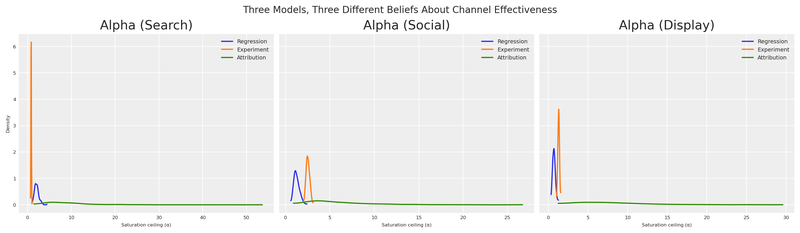
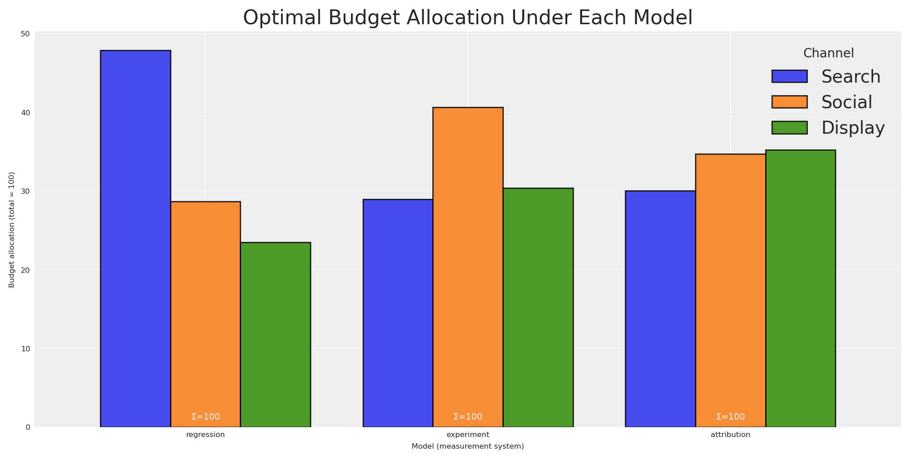
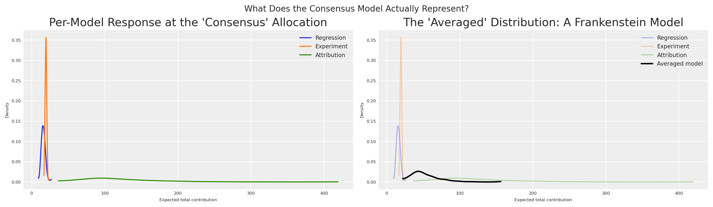
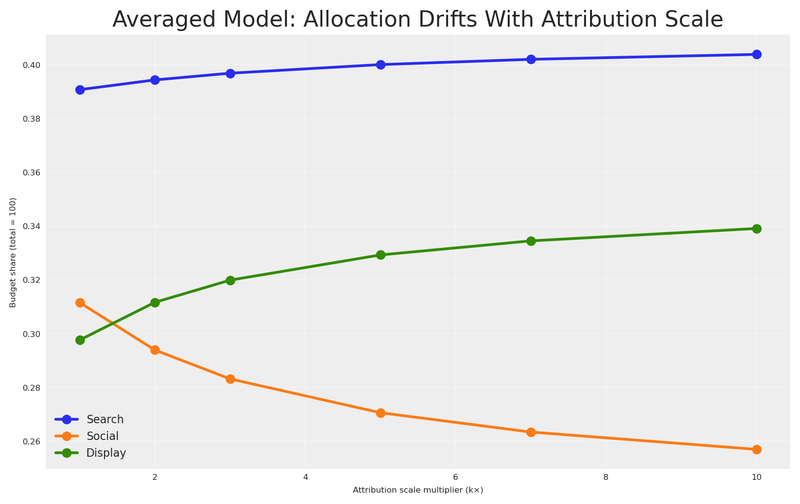
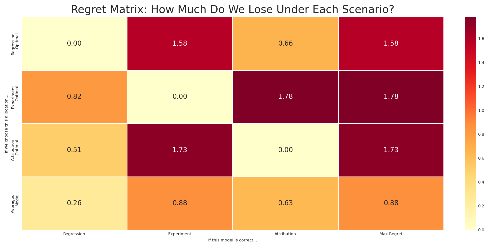
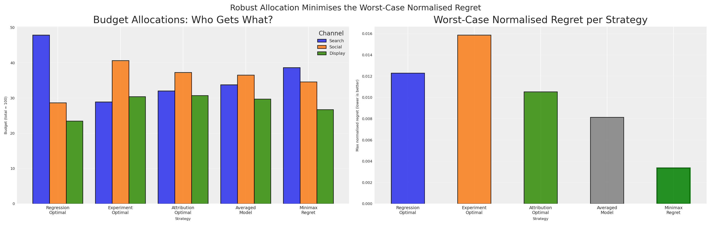
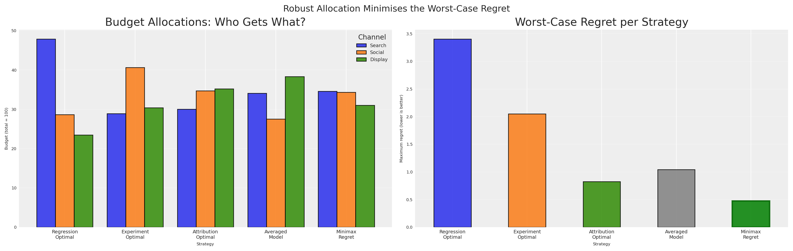

<div id="title-block-header" class="quarto-title-block default">

<div class="quarto-title">

<div class="quarto-title-block">

<div>

# Decision-Making Under Contradictions: Robust Budget Allocation When Your Models Disagree

Code

- <a href="javascript:void(0)" id="quarto-show-all-code" class="dropdown-item" role="button">Show All Code</a>

- <a href="javascript:void(0)" id="quarto-hide-all-code" class="dropdown-item" role="button">Hide All Code</a>

- 

  ------------------------------------------------------------------------

- <a href="javascript:void(0)" id="quarto-view-source" class="dropdown-item" role="button">View Source</a>

</div>

</div>

<div class="quarto-categories">

<div class="quarto-category">

MMM

</div>

<div class="quarto-category">

python

</div>

<div class="quarto-category">

decision theory

</div>

<div class="quarto-category">

optimization

</div>

<div class="quarto-category">

bayesian

</div>

<div class="quarto-category">

pymc

</div>

<div class="quarto-category">

marketing

</div>

<div class="quarto-category">

robust optimization

</div>

</div>

</div>

<div>

<div class="description">

How to make robust budget allocation decisions when your measurement models (MMM, experiments, attribution) give contradictory advice.

</div>

</div>

<div class="quarto-title-meta">

<div>

<div class="quarto-title-meta-heading">

Author

</div>

<div class="quarto-title-meta-contents">

Carlos Trujillo

</div>

</div>

<div>

<div class="quarto-title-meta-heading">

Published

</div>

<div class="quarto-title-meta-contents">

February 9, 2026

</div>

</div>

</div>

</div>

<div id="introduction" class="section level1">

# Introduction

You’re sitting in the quarterly business review. Finance asks a deceptively simple question: *“Should we increase or decrease search spend next quarter?”*

You look at your measurement systems. The regression model says search is a star — high incremental return, pour more money in. A recent experiment says social outperformed search by 3x during last month’s geo-test. Meanwhile, the attribution dashboard reports that display drives more contacts per dollar than any other channel.

Three systems. Three methodologies. Three contradictory numbers.

Finance doesn’t care about your methodological nuance. They need **one decision**. Increase or decrease? By how much? Across which channels?

This is the reality of modern marketing measurement. We don’t have one source of truth — we have *multiple, competing views* of how marketing works. Each view captures something real, but none tells the whole story. And the worst thing you can do is pretend this disagreement doesn’t exist.

**How do you make a single, defensible budget decision when your models fundamentally disagree?** Today we’ll answer that question. We’ll borrow a powerful idea from *decision theory* and robust optimization — **minimax regret** — and show how to find budget allocations that are robust to model error, regardless of which view turns out to be correct.

</div>

<div id="quick-summary" class="section level1">

# Quick summary

This article walks you through:

- Building **three competing models** of marketing effectiveness, each representing a different measurement philosophy (regression, experimentation, attribution).
- Showing that these models produce **contradictory budget recommendations** when optimised individually.
- Demonstrating why **averaging** or **picking the most certain model** are flawed strategies — including a dimensional analysis argument and a sensitivity test that makes the failure undeniable.
- Introducing **minimax regret** from classical decision theory as the principled resolution.
- Computing the **normalised regret matrix** and finding the **robust allocation** that minimizes worst-case regret as a fraction of optimal value.
- Connecting everything back to the [PyMC-Marketing](https://www.pymc-marketing.io) `BudgetOptimizer`, `BuildMergedModel`, and `CustomModelWrapper`.

</div>

<div id="three-views-of-reality" class="section level1">

# Three Views of Reality

Before we write a single line of code, let’s understand *why* these numbers disagree. Each measurement system answers a subtly different question:

| System | What it measures | Units (conceptual) | Typical uncertainty |
|----|----|----|----|
| **Regression (MMM)** | Average incremental contribution of marketing across time | Incremental sales per unit spend, averaged over the observation window | Moderate — many data points, but confounders and model misspecification add noise |
| **Experiment** | Incremental lift during a specific controlled period, not necessarily representative of average across larger periods | Incremental conversions per unit spend, holding everything else fixed | Moderate — randomisation or quasi-experimental design controls for confounders but validity depends on the assumptions being met |
| **Attribution** | Contacts or conversions attributed to marketing by the platform | Attributed contacts per unit spend — *not necessarily incremental* | Variable — high precision for what it measures, but what it measures may not be causal |

These three numbers don’t share the same dimensions. The regression model gives you an average marginal effect across time. The experiment gives you a point-in-time causal effect under specific conditions. The attribution model gives you a non-causal association because **intention changes can’t be tracked by user level identifiers**.

<div class="callout callout-style-default callout-important callout-titled">

<div class="callout-header d-flex align-content-center">

<div class="callout-icon-container">

</div>

<div class="callout-title-container flex-fill">

Key insight

</div>

</div>

<div class="callout-body-container callout-body">

You can’t simply average these numbers any more than you can average metres, kilograms, and seconds. They measure different things. But you still need to make a decision.

</div>

</div>

This is where decision theory enters the picture. But first, let’s make this concrete with code.

<div id="modeling-the-disagreement" class="section level2">

## Modeling the disagreement

Let’s set up our environment and define the basic parameters for our models.

<div id="68a19d23" class="cell" execution_count="1">

<div id="cb1" class="sourceCode cell-code">

``` sourceCode
import warnings
warnings.filterwarnings("ignore")

from pymc_marketing.mmm.budget_optimizer import BudgetOptimizer, BuildMergedModel, CustomModelWrapper
import pymc as pm
import arviz as az
import preliz as pz
import pytensor.tensor as pt
from pytensor import function as pytensor_function

# Visualization
import matplotlib.pyplot as plt
import seaborn as sns

# Scientific computing
import numpy as np
import pandas as pd
```

</div>

</div>

<div id="3e2c4e38" class="cell" execution_count="2">

Code

<div id="cb2" class="sourceCode cell-code">

``` sourceCode
az.style.use("arviz-darkgrid")
plt.rcParams["figure.figsize"] = [8, 4]
plt.rcParams["figure.dpi"] = 100
plt.rcParams["axes.labelsize"] = 6
plt.rcParams["xtick.labelsize"] = 6
plt.rcParams["ytick.labelsize"] = 6
plt.rcParams.update({"figure.constrained_layout.use": True})

%load_ext autoreload
%autoreload 2
%config InlineBackend.figure_format = "retina"

seed: int = sum(map(ord, "decision making under contradictions"))
rng: np.random.Generator = np.random.default_rng(seed=seed)
# print(f"Seed: {seed}")
```

</div>

</div>

We’ll construct three PyMC models, each representing a different measurement system’s beliefs about channel effectiveness. All three models share the same structure — a [Michaelis-Menten](https://en.wikipedia.org/wiki/Michaelis%E2%80%93Menten_kinetics) saturation curve per channel — but differ in their **parameter values** and **uncertainty levels**.

<div class="callout callout-style-default callout-tip callout-titled">

<div class="callout-header d-flex align-content-center">

<div class="callout-icon-container">

</div>

<div class="callout-title-container flex-fill">

Assumption

</div>

</div>

<div class="callout-body-container callout-body">

We always have an assumption around our system, which should be share by the measurement tool used to estimate it. If we believe attribution is the real source of truth, and our system suffers from diminishing returns, then we should be able to observe the saturation curve in the attribution data. Same with an experiment, we should be able to observe the saturation curve in the experiment data, after we collect the data.

</div>

</div>

<span class="math display"> f(x) = \frac{\alpha \cdot x}{\lambda + x} </span>

where:

- <span class="math inline">\alpha</span> is the maximum achievable effect (the asymptote)
- <span class="math inline">\lambda</span> is the half-saturation point (spend at which we reach half the maximum)

This function is concave, ensuring diminishing returns — a property that makes budget optimization both realistic and mathematically well-behaved. We’ll start by defining the global setup: three channels, our time horizon, and a total budget of 100.

<div id="0920c925" class="cell" execution_count="3">

Code

<div id="cb3" class="sourceCode cell-code">

``` sourceCode
channels: list[str] = ["search", "social", "display"]
n_ch: int = len(channels)

# Observation periods (model structure) and future periods (optimization horizon)
n_dates: int = 30
n_future: int = 8

# Budget for optimization
TOTAL_BUDGET: float = 100.0

coords = {"date": np.arange(n_dates), "channel": channels}
# print(f"Channels: {channels}")
# print(f"Observation periods: {n_dates} | Future periods: {n_future}")
# print(f"Total budget: {TOTAL_BUDGET}")
```

</div>

</div>

Here’s where the disagreement lives. Each measurement system has different beliefs about the saturation parameters (<span class="math inline">\alpha</span>, <span class="math inline">\lambda</span>) for each channel. Critically, they **disagree about the channel ranking** — and they **disagree about the scale** of marketing effectiveness.

<div id="3ab9e596" class="cell" execution_count="4">

Code

<div id="cb4" class="sourceCode cell-code">

``` sourceCode
model_configs = {
    "regression": {
        "description": "MMM: average incrementality across time",
        "mu_alpha": np.array([np.log(2.0), np.log(1.2), np.log(0.7)]),
        "sigma_alpha": np.array([0.25, 0.25, 0.25]),
        "mu_lam": np.array([np.log(5.0), np.log(3.0), np.log(4.0)]),
        "sigma_lam": np.array([0.25, 0.25, 0.25]),
        "color": "C0",
        "ranking": "search > social > display",
    },
    "experiment": {
        "description": "Experiment: causal lift in a specific period",
        "mu_alpha": np.array([np.log(0.8), np.log(2.5), np.log(1.3)]),
        "sigma_alpha": np.array([0.08, 0.08, 0.08]),
        "mu_lam": np.array([np.log(6.0), np.log(3.0), np.log(3.5)]),
        "sigma_lam": np.array([0.08, 0.08, 0.08]),
        "color": "C1",
        "ranking": "social > display > search",
    },
    "attribution": {
        "description": "Attribution: contacts per dollar (not incremental — inflated scale)",
        "mu_alpha": np.array([np.log(8.0), np.log(5.0), np.log(7.0)]),
        "sigma_alpha": np.array([0.60, 0.60, 0.60]),
        "mu_lam": np.array([np.log(2.5), np.log(7.0), np.log(3.0)]),
        "sigma_lam": np.array([0.60, 0.60, 0.60]),
        "color": "C2",
        "ranking": "search > display > social",
    },
}
```

</div>

</div>

To turn these priors into something the optimiser can work with, we wrap each set of parameters in a lightweight PyMC model that speaks the same language as PyMC-Marketing’s `CustomModelWrapper`. **The contract is simple**: expose a `channel_data` matrix (budget per channel per date), a scalar `total_contribution`, and a vector `channel_contribution`.

<div class="callout callout-style-default callout-tip callout-titled">

<div class="callout-header d-flex align-content-center">

<div class="callout-icon-container">

</div>

<div class="callout-title-container flex-fill">

Any version of reality can become a model

</div>

</div>

<div class="callout-body-container callout-body">

A common question is: *“How do I actually turn my attribution dashboard (or any other measurement system) into a model like the ones above?”* The answer is straightforward — you can take any version of reality and fit a model to it. Pick a response structure you believe in — say, one with saturation and adstock — and use your data to find the parameters that best replicate the behavior your measurement system reports. Attribution contacts per dollar, experimental lift curves, regression coefficients, even a colleague’s spreadsheet — any of these can serve as the “observed data” you fit against, with spend as the input.

The fitting itself can happen in two ways. A **deterministic fit** (e.g., least-squares or MLE) gives you point estimates of the parameters; you won’t get posteriors for free, but you can still estimate parameter uncertainty through confidence intervals or bootstrap. A **Bayesian fit** gives you full posteriors directly — plug them into an `InferenceData` object and you’re ready for the optimizer. Either route turns a measurement system into a model compatible with this framework.

One important nuance: fitting the same functional form to different data sources gives you models that are *mathematically* comparable — which is exactly what the minimax regret framework requires — but it does not make their outputs *semantically* equivalent. The attribution-fitted curve still represents attributed contacts, not causal lift. The models share a language, not a meaning. That’s precisely why we use regret within each model’s own terms rather than averaging across them.

We walk through a concrete example of this process — turning experimental results into calibrated model parameters — in [From Experiments to Priors: Eliciting Informative Priors for Your Marketing Mix Model](../../articles/from_experiments_to_priors/from_experiments_to_priors.html).

</div>

</div>

<div id="b62ade88" class="cell" execution_count="5">

Code

<div id="cb5" class="sourceCode cell-code">

``` sourceCode
def build_response_model(mu_alpha, sigma_alpha, mu_lam, sigma_lam, coords, n_dates, n_ch):
    """
    Build a PyMC model with Michaelis-Menten saturation per channel.

    Parameters
    ----------
    mu_alpha : np.ndarray
        LogNormal mu for saturation alpha (per channel).
    sigma_alpha : np.ndarray
        LogNormal sigma for saturation alpha (per channel).
    mu_lam : np.ndarray
        LogNormal mu for saturation lambda (per channel).
    sigma_lam : np.ndarray
        LogNormal sigma for saturation lambda (per channel).
    coords : dict
        PyMC coordinate dict with "date" and "channel".
    n_dates : int
        Number of observation periods.
    n_ch : int
        Number of channels.

    Returns
    -------
    pm.Model
        Compiled PyMC model.
    """
    with pm.Model(coords=coords) as model:
        # Channel spend data — the optimizer injects budget allocations here
        channel_data = pm.Data(
            "channel_data",
            np.ones((n_dates, n_ch)),
            dims=("date", "channel"),
        )

        # Saturation parameters (LogNormal ensures positivity)
        alpha = pm.LogNormal(
            "alpha",
            mu=mu_alpha,
            sigma=sigma_alpha,
            dims="channel",
        )
        lam = pm.LogNormal(
            "lam",
            mu=mu_lam,
            sigma=sigma_lam,
            dims="channel",
        )

        # Michaelis-Menten saturation: alpha * x / (lam + x)
        channel_contrib = alpha * channel_data / (lam + channel_data)

        # Sum over channels → per-period response
        mu = channel_contrib.sum(axis=-1)

        # Deterministics the optimizer needs
        pm.Deterministic("total_contribution", mu.sum())
        pm.Deterministic(
            "channel_contribution",
            channel_contrib,
            dims=("date", "channel"),
        )

    return model


# Build and sample all three models
models = {}
idatas = {}

for name, cfg in model_configs.items():
    model = build_response_model(
        mu_alpha=cfg["mu_alpha"],
        sigma_alpha=cfg["sigma_alpha"],
        mu_lam=cfg["mu_lam"],
        sigma_lam=cfg["sigma_lam"],
        coords=coords,
        n_dates=n_dates,
        n_ch=n_ch,
    )

    with model:
        idata = pm.sample_prior_predictive(samples=500, random_seed=seed)

    # Rename "prior" → "posterior" so the optimizer can find the parameter draws
    idata.add_groups(posterior=idata.prior)

    models[name] = model
    idatas[name] = idata
    # print(f"✓ {name}: posterior shape (alpha) = {idata.posterior['alpha'].shape}")
```

</div>

</div>

We sample from the prior and treat those draws as if they were posterior samples from fitted models. In practice, each of these would come from a real analysis — the MMM from historical regression, the experiment from a geo-test, and the attribution from platform dashboards.

<div class="callout callout-style-default callout-note callout-titled">

<div class="callout-header d-flex align-content-center">

<div class="callout-icon-container">

</div>

<div class="callout-title-container flex-fill">

why use the prior as posterior?

</div>

</div>

<div class="callout-body-container callout-body">

By pretending the prior is the posterior, we skip the expensive MCMC step and focus on the decision-making problem. In a real workflow, these `idata` objects would come from `pm.sample()` after fitting your models to historical data. The downstream decision process is identical whether the posteriors come from real data or this synthetic generation.

</div>

</div>

</div>

<div id="seeing-the-conflict" class="section level2">

## Seeing the conflict

Let’s see how the three models differ in their beliefs about channel effectiveness (<span class="math inline">\alpha</span>, the saturation ceiling). The width of each distribution reflects the measurement system’s certainty.

<div id="071f5de6" class="cell" execution_count="6">

Code

<div id="cb6" class="sourceCode cell-code">

``` sourceCode
fig, axes = plt.subplots(nrows=1, ncols=3, figsize=(14, 4), sharey=True)

for idx, ch in enumerate(channels):
    ax = axes[idx]
    for name, cfg in model_configs.items():
        alpha_samples = idatas[name].posterior["alpha"].sel(channel=ch).values.flatten()
        az.plot_dist(
            alpha_samples,
            color=cfg["color"],
            label=name.capitalize(),
            ax=ax,
        )
    ax.set(
        title=f"Alpha ({ch.capitalize()})",
        xlabel="Saturation ceiling (α)",
    )
    if idx == 0:
        ax.set(ylabel="Density")
    ax.legend(fontsize=7)

fig.suptitle(
    "Three Models, Three Different Beliefs About Channel Effectiveness",
    fontsize=12,
)
plt.show()
```

</div>

<div class="cell-output cell-output-display">

<div>

<figure class="figure">
<p></p>
</figure>

</div>

</div>

</div>

This plot is the visual proof of our predicament. These aren’t small disagreements — the models have *qualitatively different* channel rankings.

We can see this even more clearly by plotting the Michaelis-Menten response curves using each model’s posterior mean. This shows what each model predicts will happen as we increase spend on each channel.

<div id="a3227f5f" class="cell" execution_count="7">

Code

<div id="cb7" class="sourceCode cell-code">

``` sourceCode
x_range = np.linspace(0.1, 30, 200)

fig, axes = plt.subplots(nrows=1, ncols=3, figsize=(14, 4), sharey=False)

for idx, (name, cfg) in enumerate(model_configs.items()):
    ax = axes[idx]
    for ch_idx, ch in enumerate(channels):
        alpha_mean = idatas[name].posterior["alpha"].sel(channel=ch).mean().item()
        lam_mean = idatas[name].posterior["lam"].sel(channel=ch).mean().item()
        y = alpha_mean * x_range / (lam_mean + x_range)
        ax.plot(x_range, y, label=ch.capitalize(), color=f"C{ch_idx}")

    ax.set(
        title=f"{name.capitalize()} View",
        xlabel="Per-period spend",
        ylabel="Response" if idx == 0 else "",
    )
    ax.legend(fontsize=7)

fig.suptitle("Saturation Curves: Each Model Tells a Different Story", fontsize=12)
plt.show()
```

</div>

<div class="cell-output cell-output-display">

<div>

<figure class="figure">
<p></p>
</figure>

</div>

</div>

</div>

Under the **regression view**, search (blue) dominates — it has the highest asymptote and responds well to increased spend. Under the **experiment view**, social (orange) is the runaway winner. Under the **attribution view**, search and display tower above social — but look at the y-axis: the attribution model reports effectiveness at a *completely different scale* than the other two. Its curves reach asymptotes 10× higher than anything regression or experiment predicts.

If you were a finance director looking at these three charts, you’d be understandably confused. And if someone averaged these curves, you’d be making a decision dominated by whichever system shouts the loudest numbers.

</div>

</div>

<div id="three-models-three-budgets" class="section level1">

# Three Models, Three Budgets

Let’s do what most teams do in practice: optimise budget allocation under each model independently, using the `BudgetOptimizer` from [PyMC-Marketing](https://www.pymc-marketing.io). This gives us three separate optimal allocations, one for each belief system.

<div id="f589601c" class="cell" execution_count="8">

Code

<div id="cb8" class="sourceCode cell-code">

``` sourceCode
bounds = {ch: (0.0, 60.0) for ch in channels}

optimal_allocations = {}
optimal_results = {}

for name in model_configs:
    wrapper = CustomModelWrapper(
        base_model=models[name],
        idata=idatas[name],
        channels=channels,
    )
    optimizer = BudgetOptimizer(model=wrapper, num_periods=n_future)

    allocation, result = optimizer.allocate_budget(
        total_budget=TOTAL_BUDGET,
        budget_bounds=bounds,
    )

    # Convert to pd.Series for consistent downstream handling
    if hasattr(allocation, "to_series"):
        allocation = allocation.to_series()
    elif not isinstance(allocation, pd.Series):
        allocation = pd.Series(np.array(allocation).flatten(), index=channels)

    optimal_allocations[name] = allocation
    optimal_results[name] = result

    # print(f"\n{name.upper()} optimal allocation:")
    # print(f"  Success: {result.success}")
    # print(f"  Expected contribution: {-result.fun:.4f}")
    # for ch in channels:
    #     # print(f"  {ch}: {allocation[ch]:.2f}")
```

</div>

</div>

We can visualize these three optimal allocations to see exactly how the recommendations differ:

<div id="981c41d9" class="cell" execution_count="9">

Code

<div id="cb9" class="sourceCode cell-code">

``` sourceCode
alloc_df = pd.DataFrame(optimal_allocations).T
alloc_df.columns = [ch.capitalize() for ch in channels]

fig, ax = plt.subplots(figsize=(10, 5))
alloc_df.plot(kind="bar", ax=ax, edgecolor="black", alpha=0.85, width=0.8)
ax.set(
    title="Optimal Budget Allocation Under Each Model",
    xlabel="Model (measurement system)",
    ylabel=f"Budget allocation (total = {TOTAL_BUDGET:.0f})",
)
ax.legend(title="Channel", loc="upper right")
ax.set_xticklabels(ax.get_xticklabels(), rotation=0)

# Annotate with total budget check
for i, name in enumerate(model_configs):
    total = optimal_allocations[name].sum()
    ax.text(i, 1, f"Σ={total:.0f}", ha="center", fontsize=7, color="white")

ax.grid(True, axis="y", alpha=0.3)
plt.show()
```

</div>

<div class="cell-output cell-output-display">

<div>

<figure class="figure">
<p></p>
</figure>

</div>

</div>

</div>

The picture is striking. The regression model puts the bulk of the budget into **search**. The experiment shifts almost everything to **social**. The attribution model favours **search and display** while starving social.

These aren’t minor tweaks — they are fundamentally different strategies. If you present any single one to finance, you’re implicitly betting that one measurement system is right and the others are wrong. How to decide? More importantly, what if you do it wrong? **What if they’re all partially right?**

</div>

<div id="the-illusion-of-consensus" class="section level1">

# The Illusion of Consensus

The natural instinct goes like this: “We have three models. Instead of trusting just one, let’s be smart — for any given allocation, we ask *all three* models what the expected outcome would be, then average their answers. This gives us a ‘consensus’ prediction. We optimise *that*.”

This sounds reasonable. It’s what a pragmatic stakeholder might actually propose. Let’s test it by merging all three models into a single computational graph using `BuildMergedModel`. This shared graph lets us evaluate any budget allocation across all three response surfaces simultaneously.

With the merged model ready, we can compile PyTensor evaluation functions to easily calculate the expected response for any budget under any model.

<div id="dc8e512b" class="cell" execution_count="10">

Code

<div id="cb10" class="sourceCode cell-code">

``` sourceCode
wrappers = {
    name: CustomModelWrapper(
        base_model=models[name], idata=idatas[name], channels=channels,
    )
    for name in model_configs
}

merged = BuildMergedModel(
    models=list(wrappers.values()),
    prefixes=list(model_configs.keys()),
    merge_on="channel_data",
)
merged.num_periods = n_future
merged.channel_columns = channels

# print("Merged model variables:")
# for v in merged.model.named_vars:
#     # print(f"  {v}")

merged_optimizer = BudgetOptimizer(
    model=merged,
    num_periods=n_future,
    response_variable="regression_total_contribution",
)

eval_fns: dict[str, callable] = {}
draws_fns: dict[str, callable] = {}

for name in model_configs:
    var = f"{name}_total_contribution"
    dist = merged_optimizer.extract_response_distribution(var)
    draws_fns[name] = pytensor_function([merged_optimizer._budgets_flat], dist)
    eval_fns[name] = pytensor_function([merged_optimizer._budgets_flat], pt.mean(dist))

# Quick sanity check: evaluate at equal allocation
equal_alloc = np.array([TOTAL_BUDGET / n_ch] * n_ch)
# for name in model_configs:
#     # print(f"  {name} at equal alloc: {eval_fns[name](equal_alloc):.4f}")
```

</div>

</div>

Now we build the “consensus” metric. For any allocation <span class="math inline">a</span>, we evaluate all three models and average their expected responses:

<span class="math display">V\_{\text{avg}}(a) = \frac{1}{3}\left\[V\_{\text{reg}}(a) + V\_{\text{exp}}(a) + V\_{\text{attr}}(a)\right\]</span>

Then we optimise <span class="math inline">V\_{\text{avg}}</span> to find the allocation that maximizes this averaged prediction.

<div id="ab2724b3" class="cell" execution_count="11">

Code

<div id="cb11" class="sourceCode cell-code">

``` sourceCode
with merged.model:
    pm.Deterministic("averaged_total_contribution", (
        merged.model["regression_total_contribution"]
        + merged.model["experiment_total_contribution"]
        + merged.model["attribution_total_contribution"]
    ) / 3)

avg_optimizer = BudgetOptimizer(
    model=merged,
    num_periods=n_future,
    response_variable="averaged_total_contribution",
)

naive_avg, result_naive = avg_optimizer.allocate_budget(
    total_budget=TOTAL_BUDGET,
    budget_bounds=bounds,
)

if hasattr(naive_avg, "to_series"):
    naive_avg = naive_avg.to_series()
elif not isinstance(naive_avg, pd.Series):
    naive_avg = pd.Series(np.array(naive_avg).flatten(), index=channels)

# print(f"Optimisation success: {result_naive.success}")
# print(f"Averaged model expected contribution: {-result_naive.fun:.4f}")
# print(f"\nAveraged-model optimal allocation:")
# for ch in channels:
#     # print(f"  {ch}: {naive_avg[ch]:.2f}")
# print(f"  Total: {naive_avg.sum():.2f}")
```

</div>

</div>

This allocation is the best you can do *if* the average of all three models is meaningful. But is it?

Let’s look at what each model actually *predicts* for this allocation. Not just the mean — the full posterior distribution.

<div id="bbcf6c0e" class="cell" execution_count="12">

Code

<div id="cb12" class="sourceCode cell-code">

``` sourceCode
fig, ax = plt.subplots(figsize=(7, 4))

alloc_values = naive_avg.values
all_draws = []
for name, cfg in model_configs.items():
    draws = draws_fns[name](alloc_values)
    all_draws.append(draws)

min_len = min(len(d) for d in all_draws)
stacked = np.column_stack([d[:min_len] for d in all_draws])
averaged_draws = stacked.mean(axis=1)

for name, cfg in model_configs.items():
    draws = draws_fns[name](alloc_values)
    az.plot_dist(draws, color=cfg["color"], label=name.capitalize(), ax=ax, plot_kwargs={"alpha": 0.3})

az.plot_dist(averaged_draws, color="black", label="Averaged model", ax=ax, plot_kwargs={"linewidth": 2})
ax.set(
    title="The 'Averaged' Distribution: A Frankenstein Model",
    xlabel="Expected total contribution",
    ylabel="Density",
)
ax.legend(fontsize=8)

plt.show()
```

</div>

<div class="cell-output cell-output-display">

<div>

<figure class="figure">
<p></p>
</figure>

</div>

</div>

</div>

The distributions don’t just disagree — they live at *completely different scales*. The attribution model (green), operating at 10× the magnitude of the other two, pushes its distribution far to the right. Regression and experiment sit in a modest range; attribution towers above them. These aren’t minor calibration differences — they reflect fundamentally different measurement processes counting fundamentally different things.

The “averaged” distribution (black) doesn’t land in a neutral middle ground — it’s dragged toward the attribution model’s inflated values, because the average of a small number, another small number, and a very large number is dominated by the very large number. The loudest voice wins the average. Ask yourself: **what does a draw from this distribution represent?**

It’s not the expected incremental sales. It’s not the expected causal lift. It’s not the expected attributed contacts. It’s the average of all three — a quantity that exists in no framework.

The “consensus” approach takes the simple average of these three numbers. But think about what that means: we’re adding incremental sales on a set of point in time (or several points in time), causal conversions over a window of time, and attributed contacts not purely incremental as if they were the same thing. It’s like computing the average of 5 metres, 3 kilograms, and 7 seconds. The result is a number, sure — but it *means nothing*.

Additionally, the “consensus” implicitly assumes that the truth is exactly the arithmetic mean of the three models — giving 10× more weight to the system that happens to report the largest numbers. It doesn’t treat the models as equally credible hypotheses. It treats them as voting members of a committee where attribution gets ten votes and everyone else gets one.

<div class="callout callout-style-default callout-warning callout-titled">

<div class="callout-header d-flex align-content-center">

<div class="callout-icon-container">

</div>

<div class="callout-title-container flex-fill">

Dimensional error

</div>

</div>

<div class="callout-body-container callout-body">

Averaging model *outputs* from different measurement systems is a dimensional error. The resulting “consensus” may look like a distribution, but it has no meaningful interpretation in any of the three frameworks. No draw from this distribution corresponds to any real-world outcome.

</div>

</div>

Even if we normalized everything to the same units (e.g., converted all to dollars), we’d still be averaging fundamentally different causal/non-causal quantities. Averaging these isn’t just a unit error; it’s a **category error**. It’s like averaging a speed (km/h), a distance (km), and a coordinate (lat/long). The dimensional analysis tells us averaging is conceptually broken. But how badly does it break in practice?

<div id="why-averaging-fails-at-scale" class="section level2">

## Why averaging fails at scale

Let’s prove it. We’ll sweep the attribution model’s effectiveness parameter from its base value (1×) up to 10× — our current setting — and track what happens to both the averaged-model allocation and a robust alternative at each step. Regression and experiment stay fixed; only the attribution model’s magnitude changes.

If averaging is truly a sound strategy, the allocation it recommends should remain stable as one model’s scale changes. After all, a good aggregation method shouldn’t let a single voice dominate just because it speaks louder.

<div id="e0bdfaca" class="cell" execution_count="13">

Code

<div id="cb13" class="sourceCode cell-code">

``` sourceCode
# Base attribution alpha parameters (1× scale, before inflation)
base_mu_alpha_attr: np.ndarray = np.array([np.log(2.5), np.log(0.5), np.log(1.8)])

scale_factors: np.ndarray = np.array([1, 2, 3, 5, 7, 10])
n_scales: int = len(scale_factors)

avg_allocs_sweep: dict[int, pd.Series] = {}
robust_allocs_sweep: dict[int, pd.Series] = {}

for k in scale_factors:
    # Scale attribution alpha by k (in log-space: add log(k))
    mu_alpha_k = base_mu_alpha_attr + np.log(k)

    model_k = build_response_model(
        mu_alpha=mu_alpha_k,
        sigma_alpha=model_configs["attribution"]["sigma_alpha"],
        mu_lam=model_configs["attribution"]["mu_lam"],
        sigma_lam=model_configs["attribution"]["sigma_lam"],
        coords=coords,
        n_dates=n_dates,
        n_ch=n_ch,
    )

    with model_k:
        idata_k = pm.sample_prior_predictive(samples=500, random_seed=seed)
    idata_k.add_groups(posterior=idata_k.prior)

    # Attribution-optimal allocation at this scale
    wrapper_k = CustomModelWrapper(
        base_model=model_k, idata=idata_k, channels=channels,
    )
    opt_k = BudgetOptimizer(model=wrapper_k, num_periods=n_future)
    alloc_k, _ = opt_k.allocate_budget(
        total_budget=TOTAL_BUDGET, budget_bounds=bounds,
    )

    if hasattr(alloc_k, "to_series"):
        alloc_k = alloc_k.to_series()
    elif not isinstance(alloc_k, pd.Series):
        alloc_k = pd.Series(np.array(alloc_k).flatten(), index=channels)

    # Merge at this scale: regression + experiment (fixed) + attribution_k
    merged_k = BuildMergedModel(
        models=[wrappers["regression"], wrappers["experiment"], wrapper_k],
        prefixes=["regression", "experiment", "attribution"],
        merge_on="channel_data",
    )
    merged_k.num_periods = n_future
    merged_k.channel_columns = channels

    # --- Averaged-model optimisation at this scale ---
    with merged_k.model:
        pm.Deterministic("averaged_total_contribution", (
            merged_k.model["regression_total_contribution"]
            + merged_k.model["experiment_total_contribution"]
            + merged_k.model["attribution_total_contribution"]
        ) / 3)

    avg_opt_k = BudgetOptimizer(
        model=merged_k, num_periods=n_future,
        response_variable="averaged_total_contribution",
    )
    alloc_avg_k, _ = avg_opt_k.allocate_budget(
        total_budget=TOTAL_BUDGET, budget_bounds=bounds,
    )
    if hasattr(alloc_avg_k, "to_series"):
        alloc_avg_k = alloc_avg_k.to_series()
    elif not isinstance(alloc_avg_k, pd.Series):
        alloc_avg_k = pd.Series(np.array(alloc_avg_k).flatten(), index=channels)
    avg_allocs_sweep[k] = alloc_avg_k

    # --- Minimax regret optimisation at this scale ---
    # v_star for the scaled attribution model
    attr_eval_dist = opt_k.extract_response_distribution("total_contribution")
    attr_eval_fn = pytensor_function([opt_k._budgets_flat], pt.mean(attr_eval_dist))
    v_star_attr_k = float(attr_eval_fn(alloc_k.values))

    v_stars_sweep = {}
    for sweep_name in ["regression", "experiment"]:
        v_stars_sweep[sweep_name] = float(eval_fns[sweep_name](optimal_allocations[sweep_name].values))

    with merged_k.model:
        regret_vector_k = pt.stack([
            1.0 - merged_k.model["regression_total_contribution"] / v_stars_sweep["regression"],
            1.0 - merged_k.model["experiment_total_contribution"] / v_stars_sweep["experiment"],
            1.0 - merged_k.model["attribution_total_contribution"] / v_star_attr_k,
        ])
        pm.Deterministic("regret_vector", regret_vector_k)

    def minimax_regret_utility(samples, budgets):
        mean_regrets = pt.mean(samples, axis=0)
        return -pt.max(mean_regrets)

    rob_opt_k = BudgetOptimizer(
        model=merged_k, num_periods=n_future,
        response_variable="regret_vector",
        utility_function=minimax_regret_utility,
    )
    alloc_rob_k, _ = rob_opt_k.allocate_budget(
        total_budget=TOTAL_BUDGET, budget_bounds=bounds,
    )
    if hasattr(alloc_rob_k, "to_series"):
        alloc_rob_k = alloc_rob_k.to_series()
    elif not isinstance(alloc_rob_k, pd.Series):
        alloc_rob_k = pd.Series(np.array(alloc_rob_k).flatten(), index=channels)
    robust_allocs_sweep[k] = alloc_rob_k

    # print(f"k={k:2d} | Avg: {alloc_avg_k.values.round(1)} | Robust: {alloc_rob_k.values.round(1)}")

fig, ax = plt.subplots(figsize=(8, 5))

for ch_idx, ch in enumerate(channels):
    vals = [avg_allocs_sweep[k][ch]/TOTAL_BUDGET for k in scale_factors]
    ax.plot(
        scale_factors, vals,
        marker="o", label=ch.capitalize(), color=f"C{ch_idx}", linewidth=2,
    )
ax.set(
    title="Averaged Model: Allocation Drifts With Attribution Scale",
    xlabel="Attribution scale multiplier (k×)",
    ylabel=f"Budget share (total = {TOTAL_BUDGET:.0f})",
)
ax.legend(fontsize=8)
ax.grid(True, alpha=0.3)
plt.show()
```

</div>

<div class="cell-output cell-output-display">

<div>

<figure class="figure">
<p></p>
</figure>

</div>

</div>

</div>

The result is damning. As one model’s scale increases from 1× to 10×, the averaged-model allocation pivots steadily toward that model’s preferred channels — the remaining views get progressively drowned out. This isn’t specific to attribution; *any* model whose average response grows will hijack the consensus. The “consensus” isn’t a consensus; it’s a hostage negotiation where the biggest number always wins.

<div class="callout callout-style-default callout-tip callout-titled">

<div class="callout-header d-flex align-content-center">

<div class="callout-icon-container">

</div>

<div class="callout-title-container flex-fill">

The practical lesson

</div>

</div>

<div class="callout-body-container callout-body">

If your measurement systems operate at different scales — and they almost certainly do — averaging their outputs gives disproportionate influence to the system with the largest numbers. This is not a theoretical concern. Platform attribution routinely reports 5–15× more “conversions” than incrementality tests because it counts every touchpoint, not just the causal ones. Any aggregation method that doesn’t account for this will systematically over-invest in whatever the attribution dashboard recommends.

</div>

</div>

The evidence is clear. Averaging doesn’t just lack a meaningful interpretation — it actively chases whatever system shouts the loudest numbers, producing allocations that swing wildly as measurement scale changes. We need a framework that acknowledges model disagreement without trying to combine model outputs into a single prediction.

This is the gap that **decision theory** fills. Instead of trying to synthesise one “true” model, we acknowledge model uncertainty and choose the *action* that performs best *given that uncertainty*. We don’t combine the models — we combine their *implications for decisions*.

</div>

</div>

<div id="the-solution-minimax-regret" class="section level1">

# The Solution: Minimax Regret

Let’s formalise our situation. We have:

- A set of possible **actions** <span class="math inline">a \in \mathcal{A}</span> (budget allocations across channels)
- A set of possible **states of the world** <span class="math inline">m \in \mathcal{M}</span> (which model is correct)
- A **payoff function** <span class="math inline">V(a, m)</span> that gives the expected response when action <span class="math inline">a</span> is taken and model <span class="math inline">m</span> is the true one

For each model <span class="math inline">m</span>, there exists an optimal action <span class="math inline">a_m^\* = \arg\max_a V(a, m)</span> — the allocation we’d choose if we *knew* model <span class="math inline">m</span> was correct.

The **normalised regret** of choosing action <span class="math inline">a</span> when model <span class="math inline">m</span> is true is the fraction of optimal value we leave on the table:

<span class="math display">R(a, m) = 1 - \frac{V(a, m)}{V(a_m^\*, m)}</span>

Normalised regret lives in <span class="math inline">\[0, 1\]</span>. Zero means we chose perfectly for that model. A value of <span class="math inline">0.15</span> means we captured only 85% of what was achievable. Crucially, normalised regret is **scale-invariant**: if model <span class="math inline">m</span>’s response is multiplied by any constant <span class="math inline">k</span>, both numerator and denominator of the ratio <span class="math inline">V/V^\*</span> scale identically, leaving <span class="math inline">R</span> unchanged. This property is essential when our models operate at different magnitudes — and it’s exactly why the right panel of the sensitivity plot held steady.

The **minimax regret** strategy chooses the action that minimizes the *worst-case* regret across all possible models:

<span class="math display">a^{MR} = \arg\min\_{a \in \mathcal{A}} \max\_{m \in \mathcal{M}} R(a, m)</span>

In words: **find the allocation such that no matter which model turns out to be correct, our regret is as small as possible.**

<div id="why-minimax-regret" class="section level2">

## Why minimax regret?

This criterion has several compelling properties for our marketing setting:

1.  **No model weighting required.** Unlike Bayesian Model Averaging, we don’t need to assign probabilities to each model being “correct.” We simply protect against the worst case.

2.  **Handles incommensurable models.** We never combine the models’ *parameters* — we only evaluate each model’s *response* to the same allocation. The normalised regret is always computed within a single model’s framework, and because it measures the *fraction* of optimal value lost, it is invariant to the absolute scale of each model’s response.

3.  **Robust to model error.** The resulting allocation hedges against all models, ensuring we never make a catastrophically bad decision under any of them.

4.  **Established theory.** Minimax regret was formalised by [Leonard Savage (1951)](https://en.wikipedia.org/wiki/Minimax) and connects directly to **Distributionally Robust Optimisation (DRO)** in modern operations research and to **robust portfolio allocation** in finance.

<div class="callout callout-style-default callout-tip callout-titled">

<div class="callout-header d-flex align-content-center">

<div class="callout-icon-container">

</div>

<div class="callout-title-container flex-fill">

Portfolio analogy

</div>

</div>

<div class="callout-body-container callout-body">

Think of minimax regret as the decision-theory equivalent of portfolio diversification. Just as a diversified portfolio protects against uncertainty in individual stock returns, a minimax-regret allocation protects against uncertainty in which model is correct.

</div>

</div>

</div>

</div>

<div id="the-robust-allocation-in-practice" class="section level1">

# The Robust Allocation in Practice

For each model, the optimal response <span class="math inline">V^\*(m)</span> is the maximum achievable contribution — what we’d get if we knew that model was correct and optimised perfectly for it.

<div id="a22b6b63" class="cell" execution_count="14">

Code

<div id="cb14" class="sourceCode cell-code">

``` sourceCode
v_stars = {}

for name in model_configs:
    v_star = float(eval_fns[name](optimal_allocations[name].values))
    v_stars[name] = v_star
    # print(f"V* ({name}): {v_star:.4f}")
```

</div>

</div>

These are the *best possible* outcomes under each model. Any other allocation will achieve less under that model, resulting in positive regret. Let’s evaluate every candidate allocation under every model to construct the regret matrix.

<div id="34c5c26e" class="cell" execution_count="15">

Code

<div id="cb15" class="sourceCode cell-code">

``` sourceCode
# Gather all candidate allocations
candidate_allocations = {
    "Regression\nOptimal": optimal_allocations["regression"],
    "Experiment\nOptimal": optimal_allocations["experiment"],
    "Attribution\nOptimal": optimal_allocations["attribution"],
    "Averaged\nModel": naive_avg,
}

# Build the response and regret matrices
response_matrix = pd.DataFrame(
    index=candidate_allocations.keys(),
    columns=[n.capitalize() for n in model_configs.keys()],
    dtype=float,
)

regret_matrix = response_matrix.copy()

for alloc_name, alloc in candidate_allocations.items():
    alloc_vals = np.array(alloc).flatten()
    for model_name in model_configs:
        v = float(eval_fns[model_name](alloc_vals))
        response_matrix.loc[alloc_name, model_name.capitalize()] = v
        regret_matrix.loc[alloc_name, model_name.capitalize()] = 1.0 - v / v_stars[model_name]

# print("=== Response Matrix (expected contribution) ===")
# print(response_matrix.round(2).to_string())
# print()
# print("=== Normalised Regret Matrix (fraction of optimal lost) ===")
# print(regret_matrix.round(4).to_string())

# Add max regret column
regret_display = regret_matrix.copy()
regret_display["Max Regret"] = regret_display.max(axis=1)

fig, ax = plt.subplots(figsize=(10, 5))
sns.heatmap(
    regret_display.astype(float),
    annot=True,
    fmt=".1%",
    cmap="YlOrRd",
    linewidths=0.5,
    ax=ax,
    vmin=0.0,
    vmax=regret_display.values.max() * 1.2,
)
ax.set(
    title="Normalised Regret: Fraction of Optimal Value Lost Under Each Scenario",
    xlabel="If this model is correct...",
    ylabel="If we choose this allocation...",
)
plt.show()
```

</div>

<div class="cell-output cell-output-display">

<div>

<figure class="figure">
<p></p>
</figure>

</div>

</div>

</div>

Read this matrix carefully:

- Each **row** is a candidate allocation (what we might choose).
- Each **column** is a scenario (which model turns out to be correct).
- Each **cell** is the normalised regret — the fraction of optimal value lost. A value of <span class="math inline">0.15</span> means we capture only 85% of what was achievable under that model.
- The **rightmost column** is the maximum normalised regret: the worst-case scenario for each allocation.

Notice that each model’s optimal allocation has **zero regret** under its own model (by definition), but potentially **large regret** under the other models. The regression-optimal allocation gets hammered if the experiment model is correct. The experiment-optimal allocation suffers if regression or attribution is right.

The averaged model? Pulled toward attribution’s inflated scale, it mimics the attribution-optimal allocation — good when attribution is right, but exposed when it isn’t. It doesn’t hedge; it follows the loudest signal. And as we showed, the number it optimised has no coherent physical interpretation.

**Can we do better?**

We can solve the minimax regret problem directly: find the allocation that minimizes the maximum regret across all three models.

<span class="math display">a^{MR} = \arg\min\_{a} \max\_{m \in \\\text{reg}, \text{exp}, \text{attr}\\} \left\[ 1 - \frac{V(a, m)}{V^\*(m)} \right\]</span>

subject to:

<span class="math display">\sum\_{c} a_c = B, \quad a_c \geq 0 \quad \forall c</span>

Let’s verify by evaluating the robust allocation’s regret under each model.

<div id="eedcb373" class="cell" execution_count="16">

Code

<div id="cb16" class="sourceCode cell-code">

``` sourceCode
with merged.model:
    regret_vector = pt.stack([
        1.0 - merged.model[f"{name}_total_contribution"] / v_stars[name]
        for name in model_configs
    ])
    pm.Deterministic("regret_vector", regret_vector)


def minimax_regret_utility(samples, budgets):
    mean_regrets = pt.mean(samples, axis=0)
    return -pt.max(mean_regrets)


robust_optimizer = BudgetOptimizer(
    model=merged,
    num_periods=n_future,
    response_variable="regret_vector",
    utility_function=minimax_regret_utility,
)

robust_allocation, result_robust = robust_optimizer.allocate_budget(
    total_budget=TOTAL_BUDGET,
    budget_bounds=bounds,
)

if hasattr(robust_allocation, "to_series"):
    robust_allocation = robust_allocation.to_series()
elif not isinstance(robust_allocation, pd.Series):
    robust_allocation = pd.Series(np.array(robust_allocation).flatten(), index=channels)

# print(f"Optimisation success: {result_robust.success}")
# print(f"Maximum normalised regret (minimax): {result_robust.fun:.4f}")
# print(f"\nRobust allocation:")
# for ch in channels:
#     # print(f"  {ch}: {robust_allocation[ch]:.2f}")
# print(f"  Total: {robust_allocation.sum():.2f}")

robust_vals = robust_allocation.values
naive_vals = naive_avg.values

# print("Robust allocation normalised regret under each model:")
robust_regrets = []
naive_regrets = []
for name in model_configs:
    v = float(eval_fns[name](robust_vals))
    regret = 1.0 - v / v_stars[name]
    robust_regrets.append(regret)
    naive_regrets.append(1.0 - float(eval_fns[name](naive_vals)) / v_stars[name])
    # print(f"  {name}: V={v:.4f}, Normalised regret={regret:.4f}")

robust_max_regret = max(robust_regrets)
naive_max_regret = max(naive_regrets)
# print(f"\nMax normalised regret — Robust: {robust_max_regret:.4f} | Averaged model: {naive_max_regret:.4f}")
# print(f"Improvement: {((naive_max_regret - robust_max_regret) / naive_max_regret * 100):.1f}% reduction in worst-case regret")
```

</div>

</div>

The robust allocation achieves a **lower maximum normalised regret** than the averaged model — and dramatically lower than any single model’s optimal. It hedges across models, never betting everything on one view being correct.

Let’s put everything together and compare all five allocations: the three model-specific optima, the averaged-model optimum, and the minimax-regret robust allocation.

<div id="33732a04" class="cell" execution_count="17">

Code

<div id="cb17" class="sourceCode cell-code">

``` sourceCode
# Add robust allocation to candidates
all_allocations = {
    "Regression\nOptimal": optimal_allocations["regression"],
    "Experiment\nOptimal": optimal_allocations["experiment"],
    "Attribution\nOptimal": optimal_allocations["attribution"],
    "Averaged\nModel": naive_avg,
    "Minimax\nRegret": robust_allocation,
}

# Full regret matrix
full_regret = pd.DataFrame(
    index=all_allocations.keys(),
    columns=[n.capitalize() for n in model_configs.keys()],
    dtype=float,
)

for alloc_name, alloc in all_allocations.items():
    alloc_vals = np.array(alloc).flatten()
    for model_name in model_configs:
        v = float(eval_fns[model_name](alloc_vals))
        full_regret.loc[alloc_name, model_name.capitalize()] = 1.0 - v / v_stars[model_name]

full_regret["Max Regret"] = full_regret[[c.capitalize() for c in model_configs]].max(axis=1)

# print("=== Full Normalised Regret Matrix ===")
# print(full_regret.round(4).to_string())

fig, axes = plt.subplots(nrows=1, ncols=2, figsize=(16, 5))

# Panel 1: Allocations
alloc_compare = pd.DataFrame(
    {name: alloc for name, alloc in all_allocations.items()}
).T
alloc_compare.columns = [ch.capitalize() for ch in channels]

alloc_compare.plot(kind="bar", ax=axes[0], edgecolor="black", alpha=0.85, width=0.8)
axes[0].set(
    title="Budget Allocations: Who Gets What?",
    xlabel="Strategy",
    ylabel=f"Budget (total = {TOTAL_BUDGET:.0f})",
)
axes[0].legend(title="Channel", fontsize=7, loc="upper right")
axes[0].set_xticklabels(axes[0].get_xticklabels(), rotation=0, fontsize=7)
axes[0].grid(True, axis="y", alpha=0.3)

# Panel 2: Max regret
max_regrets = full_regret["Max Regret"].astype(float)
colors = ["C0", "C1", "C2", "grey", "green"]
max_regrets.plot(kind="bar", ax=axes[1], color=colors, edgecolor="black", alpha=0.85)
axes[1].set(
    title="Worst-Case Normalised Regret per Strategy",
    xlabel="Strategy",
    ylabel="Max normalised regret (lower is better)",
)
axes[1].set_xticklabels(axes[1].get_xticklabels(), rotation=0, fontsize=7)
axes[1].grid(True, axis="y", alpha=0.3)

# Highlight the minimax regret bar
axes[1].patches[-1].set_edgecolor("darkgreen")
axes[1].patches[-1].set_linewidth(2)

fig.suptitle("Robust Allocation Minimises the Worst-Case Normalised Regret", fontsize=13)
plt.show()
```

</div>

<div class="cell-output cell-output-display">

<div>

<figure class="figure">
<p></p>
</figure>

</div>

</div>

</div>

The right panel tells the whole story. Every model-specific allocation has a tall bar — large worst-case normalised regret if it turns out to be wrong. The averaged model, pulled toward attribution’s preferred channels, carries worst-case exposure that a proper hedge can avoid. The **minimax regret allocation** (green) has the smallest worst-case normalised regret.

Let’s also visualise how each strategy performs under each model, looking not just at the regret but at the actual expected contribution.

<div id="811cf1cf" class="cell" execution_count="18">

Code

<div id="cb18" class="sourceCode cell-code">

``` sourceCode
full_response = pd.DataFrame(
    index=all_allocations.keys(),
    columns=[n.capitalize() for n in model_configs.keys()],
    dtype=float,
)

for alloc_name, alloc in all_allocations.items():
    alloc_vals = np.array(alloc).flatten()
    for model_name in model_configs:
        v = float(eval_fns[model_name](alloc_vals))
        full_response.loc[alloc_name, model_name.capitalize()] = v

fig, axes = plt.subplots(nrows=1, ncols=3, figsize=(16, 4), sharey=True)
colors_alloc = ["C0", "C1", "C2", "grey", "green"]

for idx, model_name in enumerate(model_configs):
    ax = axes[idx]
    model_label = model_name.capitalize()
    values = full_response[model_label].astype(float)

    bars = ax.bar(
        range(len(values)),
        values.values,
        color=colors_alloc,
        edgecolor="black",
        alpha=0.85,
    )
    ax.axhline(
        v_stars[model_name],
        color="red",
        linestyle="--",
        alpha=0.7,
        label=f"V* = {v_stars[model_name]:.1f}",
    )
    ax.set(
        title=f"If {model_label} is correct",
        xlabel="",
        ylabel="Expected contribution" if idx == 0 else "",
    )
    ax.set_xticks(range(len(values)))
    ax.set_xticklabels(
        ["Reg", "Exp", "Attr", "AvgM", "Robust"],
        fontsize=7,
    )
    ax.legend(fontsize=7)
    ax.grid(True, axis="y", alpha=0.3)

fig.suptitle(
    "Expected Contribution Under Each Scenario — Robust Never Catastrophically Fails",
    fontsize=12,
)
plt.show()
```

</div>

<div class="cell-output cell-output-display">

<div>

<figure class="figure">
<p></p>
</figure>

</div>

</div>

</div>

The robust allocation (green bar) is **never the worst** under any model. It may not be the best in any single scenario, but it’s consistently competitive. That’s the power of minimax regret — it sacrifices the possibility of being perfect in exchange for the guarantee of never being terrible.

<div id="scale-invariance-the-final-proof" class="section level2">

## Scale invariance: the final proof

Earlier we saw that averaging collapses when one model’s scale changes. Does minimax regret survive the same test? We already computed the robust allocations at every scale factor during the sensitivity sweep. Let’s put both strategies side by side.

<div id="7a8c1d9a" class="cell" execution_count="19">

Code

<div id="cb19" class="sourceCode cell-code">

``` sourceCode
fig, axes = plt.subplots(nrows=1, ncols=2, figsize=(14, 5), sharey=True)

# Panel 1: Averaged model
ax = axes[0]
for ch_idx, ch in enumerate(channels):
    vals = [avg_allocs_sweep[k][ch]/TOTAL_BUDGET for k in scale_factors]
    ax.plot(
        scale_factors, vals,
        marker="o", label=ch.capitalize(), color=f"C{ch_idx}", linewidth=2,
    )
ax.set(
    title="Averaged Model: Allocation Drifts With Scale",
    xlabel="Attribution scale multiplier (k×)",
    ylabel=f"Budget share (total = {TOTAL_BUDGET:.0f})",
)
ax.legend(fontsize=8)
ax.grid(True, alpha=0.3)

# Panel 2: Minimax regret
ax = axes[1]
for ch_idx, ch in enumerate(channels):
    vals = [robust_allocs_sweep[k][ch]/TOTAL_BUDGET for k in scale_factors]
    ax.plot(
        scale_factors, vals,
        marker="s", label=ch.capitalize(), color=f"C{ch_idx}", linewidth=2,
    )
ax.set(
    title="Minimax Regret: Allocation Remains Stable",
    xlabel="Attribution scale multiplier (k×)",
    ylabel="",
)
ax.legend(fontsize=8)
ax.grid(True, alpha=0.3)

fig.suptitle(
    "Sensitivity to Attribution Scale: Averaging Chases Volume, Regret Holds Steady",
    fontsize=12,
)
plt.show()
```

</div>

<div class="cell-output cell-output-display">

<div>

<figure class="figure">
<p></p>
</figure>

</div>

</div>

</div>

The contrast is stark. The left panel — the same averaging drift we saw before — shows allocations that are hostage to whichever model reports the largest numbers. The right panel barely moves. Normalised regret <span class="math inline">1 - V/V^\*</span> is a ratio: if attribution’s entire response surface is multiplied by <span class="math inline">k</span>, both <span class="math inline">V(a, m)</span> and <span class="math inline">V^\*(m)</span> scale identically, and the ratio cancels. Scale invariance is not a coincidence of this particular example; it is a structural guarantee of the normalised formulation.

<div class="callout callout-style-default callout-note callout-titled">

<div class="callout-header d-flex align-content-center">

<div class="callout-icon-container">

</div>

<div class="callout-title-container flex-fill">

Scale-invariance guarantee

</div>

</div>

<div class="callout-body-container callout-body">

Because normalised regret is a ratio, multiplying any model’s entire response surface by a constant leaves the regret unchanged. In plain language: all measurement systems are treated on equal footing, none of them is prefer over the other, they have the same weight.

</div>

</div>

</div>

</div>

<div id="considerations" class="section level1">

# Considerations

Let’s crystallise this into a repeatable process and discuss when — and when not — to reach for this tool. Any marketing analytics team can follow this process:

1.  **Gather your views.** Collect the parameter estimates (or full posteriors) from each measurement system. Any view of reality — attribution dashboards, experimental lift estimates, regression coefficients — can become a PyMC model.
2.  **Optimise individually** using the `BudgetOptimizer` to find the optimal allocation under each view. This gives you the candidate allocations and the <span class="math inline">V^\*(m)</span> benchmarks.
3.  **Merge the models** with `BuildMergedModel` so all views share a single `channel_data` input — one computational graph, every response surface accessible.
4.  **Compute the normalised regret matrix** by cross-evaluating every allocation under every model.
5.  **Solve for the robust allocation** by minimising the worst-case regret entry with a custom utility function in the `BudgetOptimizer`.
6.  **Present to stakeholders.** Show the regret matrix and the comparison plot. The pitch: *“This allocation leaves the least value on the table no matter which model turns out to be correct.”*

<div id="2d349dde" class="cell" execution_count="20">

Code

<div id="cb20" class="sourceCode cell-code">

``` sourceCode
# Summary table for the presentation
summary = pd.DataFrame(
    {name: alloc for name, alloc in all_allocations.items()}
).T
summary.columns = [ch.capitalize() for ch in channels]
summary["Max Norm. Regret"] = full_regret["Max Regret"].values
summary.index = ["Regression", "Experiment", "Attribution", "Averaged Model", "Minimax Regret"]

summary = summary.round(4)
# print("=== Executive Summary: Budget Allocation Strategies ===")
# print(summary.to_string())
```

</div>

</div>

<div id="when-to-use-minimax-regret" class="section level2">

## When to use minimax regret

Minimax regret is most valuable when:

- You have **multiple measurement systems** that produce contradictory results.
- You **cannot assign reliable probabilities** to which model is correct.
- The **cost of being wrong** is asymmetric or severe — you’d rather avoid catastrophic failure than chase the best possible outcome.
- Stakeholders need a **single, defensible recommendation** from a diverse set of inputs.

</div>

<div id="broader-mathematical-context" class="section level2">

## Broader mathematical context

Minimax regret is not an isolated trick; it connects deeply to broader frameworks in operations research and finance.

The minimax regret formulation we’ve used is a special case of **Distributionally Robust Optimisation (DRO)**, a framework widely used in finance and operations research. In DRO, the decision-maker optimises against the worst-case distribution within an *ambiguity set* — a collection of plausible probability models. Our three models form a discrete ambiguity set:

<span class="math display">\mathcal{P} = \\P\_{\text{reg}}, P\_{\text{exp}}, P\_{\text{attr}}\\</span>

The DRO problem is:

<span class="math display">\max\_{a} \min\_{P \in \mathcal{P}} \mathbb{E}\_P\[V(a)\]</span>

This is the **maximin** (maximize the minimum expected value) variant. Our minimax regret formulation is closely related but focuses on *regret* rather than absolute performance — a subtle but important distinction when models produce different scales of response.

If you work in finance, the parallel to **portfolio theory** is exact:

| Marketing | Finance |
|----|----|
| Budget allocation across channels | Portfolio allocation across assets |
| Each model’s belief about channel returns | Each analyst’s belief about asset returns |
| Minimax regret allocation | Robust portfolio that hedges model risk |
| Model uncertainty | Parameter uncertainty / estimation risk |

In the [Black-Litterman model](https://en.wikipedia.org/wiki/Black%E2%80%93Litterman_model), multiple “views” about asset returns are combined with market equilibrium. Our approach is similar in spirit but does not require assigning confidence weights to each view — the minimax regret criterion handles the combination implicitly.

</div>

<div id="limitations" class="section level2">

## Limitations

- Minimax regret is **conservative by design**. It optimises for the worst case, which means it may sacrifice upside when one model is clearly superior.
- With many models, the worst case can dominate and produce overly diversified allocations. In practice, limit your model set to 3–5 genuinely distinct views.
- The approach treats all models as equally plausible. If you have strong reasons to trust one model over others, **weighted regret** or **Bayesian model averaging** may be more appropriate.

</div>

<div id="extensions" class="section level2">

## Extensions

1.  **Weighted minimax regret**: Assign confidence weights <span class="math inline">w_m</span> to each model and minimize <span class="math inline">\max_m w_m \cdot R(a, m)</span>. This bridges the gap between pure minimax and Bayesian model averaging.
2.  **Risk-averse evaluation**: Instead of using the posterior mean for <span class="math inline">V(a, m)</span>, use a lower quantile (e.g., 5th percentile) for an even more conservative allocation.
3.  **Time-varying views**: If model reliability changes over time (e.g., the experiment was recent but the MMM covers years), incorporate temporal weighting.
4.  **Bayesian Model Selection**: Use marginal likelihoods to assign model probabilities, then combine with minimax for a hybrid approach.

</div>

</div>

<div id="conclusions" class="section level1">

# Conclusions

1.  **Different measurement systems answer different questions.** A regression-based MMM, a controlled experiment, and an attribution model each capture a different facet of marketing effectiveness. Their disagreement is not a bug — it’s a feature of measuring a complex system from multiple angles.

2.  **You cannot average apples, oranges, and bananas.** Averaging model *outputs* across different measurement systems is a dimensional error. Even when it produces a distribution, no draw from that distribution corresponds to any real-world outcome. The “consensus model” is a Frankenstein with no coherent interpretation.

3.  **Scale asymmetry breaks naive aggregation.** When measurement systems operate at different scales — as they invariably do in practice — averaging lets the loudest system dominate. The sensitivity analysis confirms that averaged-model allocations shift dramatically as one model’s scale changes by an order of magnitude, while minimax-regret allocations remain stable.

4.  **Decision theory fills the gap.** When models disagree and you can’t combine their estimates, you can still combine their *implications for decisions*. Minimax regret finds the allocation that minimizes the worst-case *normalised* opportunity cost across all models — the fraction of optimal value left on the table.

5.  **The robust allocation hedges against model error.** By optimising for the worst case, minimax regret produces allocations that are competitive under every model — never perfect, but never catastrophic. This is the portfolio diversification principle applied to model uncertainty.

6.  **The workflow is practical and presentable.** Optimise under each model, compute the regret matrix, solve for the minimax allocation, and present the comparison. Stakeholders can see exactly how each strategy performs under each scenario — no black boxes.

Decisions are hard even with a single number. With multiple contradictory numbers, they seem impossible. But with the right framework — treating models as views and allocations as actions — we can navigate the contradiction and find strategies that are robust to our uncertainty about which view is correct.

The models don’t need to agree. We just need a decision theory that doesn’t require them to.

**Recommended readings**:

1.  [Minimax Regret — Wikipedia](https://en.wikipedia.org/wiki/Minimax)
2.  [Distributionally Robust Optimization — Rahimian & Mehrotra (2019)](https://arxiv.org/abs/1908.05659)
3.  [Black-Litterman Model — Wikipedia](https://en.wikipedia.org/wiki/Black%E2%80%93Litterman_model)
4.  [PyMC-Marketing documentation](https://www.pymc-marketing.io)
5.  [Savage, L.J. (1951). The Theory of Statistical Decision](https://www.jstor.org/stable/2284732)

<div id="version-information" class="section level2">

## Version information

<div id="d680fe54" class="cell" execution_count="21">

Code

<div id="cb21" class="sourceCode cell-code">

``` sourceCode
%load_ext watermark
%watermark -n -u -v -iv -w -p pymc_marketing,pytensor
```

</div>

<div class="cell-output cell-output-stdout">

    Last updated: Sat Feb 21 2026

    Python implementation: CPython
    Python version       : 3.11.8
    IPython version      : 8.30.0

    pymc_marketing: 0.17.1
    pytensor      : 2.37.0

    matplotlib    : 3.10.1
    arviz         : 0.21.0
    pytensor      : 2.37.0
    pymc_marketing: 0.17.1
    preliz        : 0.20.0
    pymc          : 5.27.1
    seaborn       : 0.13.2
    pandas        : 2.2.3
    numpy         : 2.1.3

    Watermark: 2.5.0

</div>

</div>

</div>

</div>
