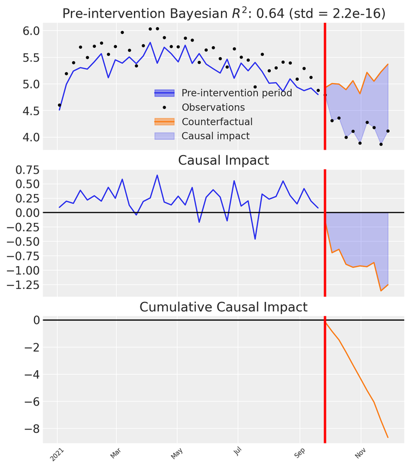
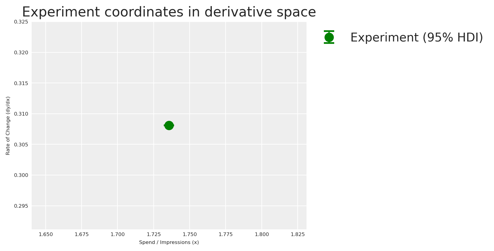
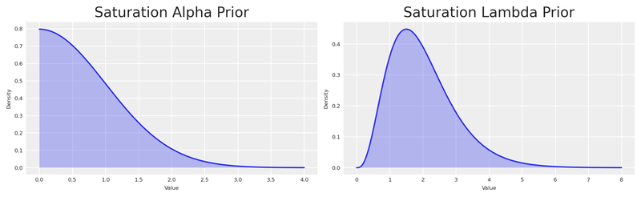
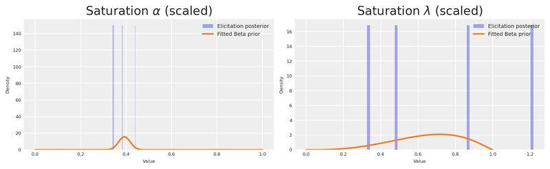
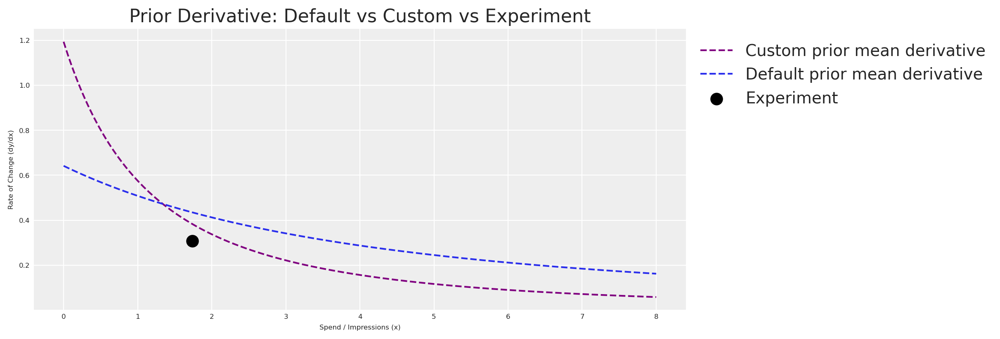
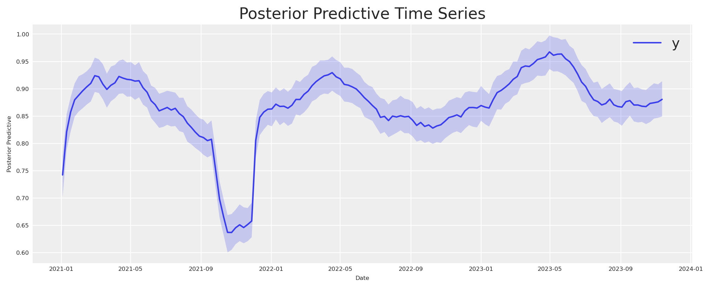
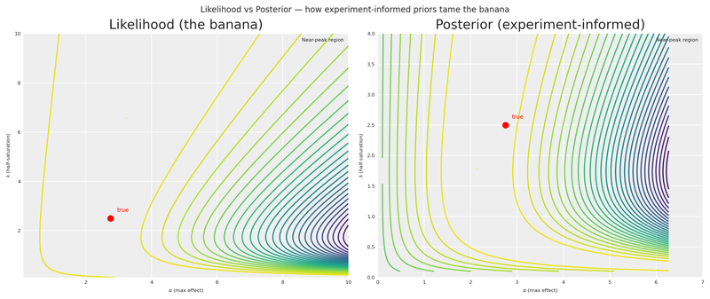
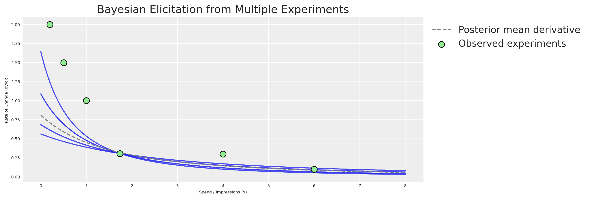

<a href="#quarto-document-content" class="skip-link">Skip to content</a>

<div id="title-block-header" class="quarto-title-block default">

<div class="quarto-title">

<div class="quarto-title-block">

<div>

# From Experiments to Priors: Eliciting Informative Priors for Your Marketing Mix Model

Code

- <a href="javascript:void(0)" id="quarto-show-all-code" class="dropdown-item" role="button">Show All Code</a>

- <a href="javascript:void(0)" id="quarto-hide-all-code" class="dropdown-item" role="button">Hide All Code</a>

- 

  ------------------------------------------------------------------------

- <a href="javascript:void(0)" id="quarto-view-source" class="dropdown-item" role="button">View Source</a>

</div>

</div>

<div class="quarto-categories">

<div class="quarto-category">

MMM

</div>

<div class="quarto-category">

python

</div>

<div class="quarto-category">

prior elicitation

</div>

<div class="quarto-category">

experimentation

</div>

<div class="quarto-category">

media mix modeling

</div>

<div class="quarto-category">

bayesian

</div>

<div class="quarto-category">

pymc

</div>

<div class="quarto-category">

causalpy

</div>

<div class="quarto-category">

synthetic control

</div>

</div>

</div>

<div>

<div class="description">

How to translate quasi-experimental results into informative Bayesian priors for your MMM using CausalPy and PyMC-Marketing.

</div>

</div>

<div class="quarto-title-meta">

<div>

<div class="quarto-title-meta-heading">

Author

</div>

<div class="quarto-title-meta-contents">

Carlos Trujillo

</div>

</div>

<div>

<div class="quarto-title-meta-heading">

Published

</div>

<div class="quarto-title-meta-contents">

February 8, 2026

</div>

</div>

</div>

</div>

<div id="introduction" class="section level1">

# Introduction

If you’ve worked with Marketing Mix Models long enough, you’ve heard the term *calibration* — the idea that models alone aren’t enough and that external evidence should sharpen their estimates. In PyMC-Marketing, calibration already has a precise meaning: the [`add_lift_test_measurements`](https://www.pymc-marketing.io/en/stable/notebooks/mmm/mmm_lift_test.html) method adds experimental observations directly to the **model likelihood**, treating them as additional data the model must explain during sampling.

But there is another way to let experiments inform your model — one that operates at a different stage of Bayesian inference. Instead of enriching the likelihood, we can use experimental results to **elicit informative priors** on the saturation parameters (see the callout below for the precise distinction).

Before diving in, let’s ground ourselves in the core objective of any marketing measurement strategy: understanding the **incremental impact** of campaigns and actions. The pursuit of that answer gave rise to cookies, pixels, and a zoo of user-level identifiers on the web. Now, as those tools fade under heightened privacy regulation, new statistical methods have emerged to fill the gap.

Marketing Mix Modeling, together with randomised and quasi-experiments, are the leading contenders. Yet measuring how advertising shapes human decisions is inherently hard. The methodology you choose — and the conditions under which you apply it — can lead to very different readings of reality.

**How can we align models that measure different facets of the same multifaceted phenomenon?** Can we consolidate prior knowledge from experiments into a single, principled methodology?

This article explores **prior elicitation from experiments** — a fully Bayesian pipeline that translates causal evidence into informative priors, propagating uncertainty end to end. We’ll use the latest multidimensional MMM API from [PyMC-Marketing](https://www.pymc-marketing.io) and [CausalPy](https://causalpy.readthedocs.io) for the causal inference piece.

<div class="callout callout-style-default callout-important callout-titled" title="Prior elicitation vs likelihood calibration">

<div class="callout-header d-flex align-content-center">

<div class="callout-icon-container">

</div>

<div class="callout-title-container flex-fill">

Prior elicitation vs likelihood calibration

</div>

</div>

<div class="callout-body-container callout-body">

PyMC-Marketing’s [`add_lift_test_measurements`](https://www.pymc-marketing.io/en/stable/notebooks/mmm/mmm_lift_test.html) incorporates experimental evidence as an additional **likelihood term** — the experiment becomes observed data that the model must explain during sampling. This is *calibration* in the strict sense: experimental observations enter <span class="math inline">P(\text{data} \mid \theta)</span>.

The approach in this article is different. We use the experimental result to **elicit informative priors** on the saturation parameters. A small Bayesian model translates the experimental observation into a full posterior over <span class="math inline">(\alpha, \lambda)</span>, which then becomes the prior for the MMM. The experimental knowledge enters through <span class="math inline">P(\theta)</span>.

Both approaches are valid and complementary. Likelihood calibration is powerful when you have multiple lift tests and want them to directly constrain the model during inference. Prior elicitation is valuable when you want to encode experimental knowledge as prior beliefs — preserving the distinction between what you know before seeing the time series and what the time series itself teaches you.

</div>

</div>

This article walks you through:

- Setting up a **Synthetic Control** quasi-experiment with **CausalPy** to estimate a specific causal effect.
- Translating the experimental result into the derivative space of our saturation function.
- Building a small **PyMC prior elicitation model** that turns the experimental observation into a full posterior over saturation parameters.
- Using that elicitation posterior as informative priors in the **multidimensional MMM** from `pymc-marketing`.
- Comparing a generic (default-prior) model against the experiment-informed model.

</div>

<div id="business-case" class="section level1">

# Business case

*Imagine this*: your company decides to dial back its advertising budget in **Venezuela** between late March and early May. As a marketer you’re scratching your head — did this hurt sales? If so, by how much?

Before reaching for complex techniques, let’s think about how to *measure* this specific action. We can unravel the mystery through the power of experiments.

Although spending dropped in **Venezuela**, the company maintained its usual advertising in other countries. This gives us a unique chance to peek into an alternate reality — what *would* have happened if the spending hadn’t been cut?

Let’s pick **Colombia** — a country where advertising continued unchanged during the same period — as our control group. Why Colombia? The hypothesis is that Venezuela and Colombia are exposed to similar macro-economic factors: both sit in the north of South America, share similar climates and culturally overlapping populations, and were literally the same country less than two centuries ago. We can treat them as *representatively similar*.

<span class="math display"> \text{Venezuela Sales} = \text{Colombia Sales} \cdot \beta + \text{Venezuela Exogenous Variables} </span>

If we assume this relationship, we get the following causal structure:

- Shared factors (weather, seasonality, macro-trends) drive **both** countries’ sales.
- Country-specific exogenous variables affect only one country.
- During the treatment window, Venezuela’s media spend drops — but Colombia’s does not.

<div class="cell" layout-align="default">

<div class="cell-output-display">

<div>

<figure class="figure">
<div>

</div>
<figcaption>Causal structure of the quasi-experiment</figcaption>
</figure>

</div>

</div>

</div>

<div class="callout callout-style-default callout-note callout-titled">

<div class="callout-header d-flex align-content-center">

<div class="callout-icon-container">

</div>

<div class="callout-title-container flex-fill">

Note

</div>

</div>

<div class="callout-body-container callout-body">

This methodology isn’t limited to countries. It works equally well for regions or cities, as long as you have consistent assumptions supported by data. Also, the control time series should *not* be affected by the intervention being measured. We are not considering spill-over effects here.

</div>

</div>

By comparing the two realities — observed Venezuela (treatment) versus counterfactual Venezuela (estimated via Colombia) — we can directly measure what was lost by stopping marketing. And this is precisely the kind of evidence that, when translated into informative Bayesian priors, makes our Media Mix Model substantially more accurate.

Time to meet your go-to tool for this job: [CausalPy](https://causalpy.readthedocs.io/en/latest/).

**CausalPy** is a library from the PyMC ecosystem designed to facilitate causal inference analyses. Using CausalPy we can explore different quasi-experimental methods to causally measure the effect of our actions in the absence of natural or randomised experiments.

Let’s jump into action.

</div>

<div id="getting-started" class="section level1">

# Getting started

This notebook assumes familiarity with the essentials of PyMC-Marketing. If you’re new, the [Marketing Mix Modeling example notebook](https://www.pymc-marketing.io/en/stable/notebooks/mmm/mmm_example.html) is an excellent starting point. Before we begin, make sure you have both libraries installed:

<div class="callout callout-style-default callout-tip callout-titled">

<div class="callout-header d-flex align-content-center">

<div class="callout-icon-container">

</div>

<div class="callout-title-container flex-fill">

Installation command

</div>

</div>

<div class="callout-body-container callout-body">

`pip install pymc-marketing causalpy`

</div>

</div>

- [PyMC-Marketing install instructions](https://www.pymc-marketing.io/en/stable/installation.html)
- [CausalPy install instructions](https://causalpy.readthedocs.io/en/latest/installation.html)

We’ll start by importing the necessary libraries for Bayesian modeling, causal inference, and visualization.

<div id="f6389f4c" class="cell" execution_count="1">

Code

<div id="cb1" class="sourceCode cell-code">

``` sourceCode
import warnings
warnings.filterwarnings("ignore")

# Domain-specific / PyMC ecosystem
from pymc_marketing.mmm import GeometricAdstock, MichaelisMentenSaturation
from pymc_marketing.mmm.multidimensional import MMM
from pymc_extras.prior import Prior
import causalpy as cp
import pymc as pm
import arviz as az
import preliz as pz

# Visualization
import matplotlib.pyplot as plt
import seaborn as sns

# Scientific computing
import numpy as np
import pandas as pd
from scipy import stats as sp_stats

# PyTensor (automatic differentiation)
import pytensor
import pytensor.tensor as pt
from pytensor import function as pytensor_function

az.style.use("arviz-darkgrid")
plt.rcParams["figure.figsize"] = [8, 4]
plt.rcParams["figure.dpi"] = 100
plt.rcParams["axes.labelsize"] = 6
plt.rcParams["xtick.labelsize"] = 6
plt.rcParams["ytick.labelsize"] = 6
plt.rcParams.update({"figure.constrained_layout.use": True})

%load_ext autoreload
%autoreload 2
%config InlineBackend.figure_format = "retina"

seed: int = sum(map(ord, "calibrating mmm with experiments"))
rng: np.random.Generator = np.random.default_rng(seed=seed)
pd.DataFrame({"seed": [seed]}).head()
```

</div>

<div class="cell-output cell-output-display" execution_count="1">

<div>

|     | seed |
|-----|------|
| 0   | 3223 |

</div>

</div>

</div>

</div>

<div id="understanding-our-dataset" class="section level1">

# Understanding our dataset

We’ll build a synthetic dataset so the entire analysis is self-contained and reproducible. The data mimics a realistic marketing scenario with two countries and two advertising channels.

The ground-truth parameters we embed in the data-generation process will later serve as our benchmark for evaluating how well experiment-informed priors recover reality.

<div id="8892ff65" class="cell" execution_count="2">

Code

<div id="cb2" class="sourceCode cell-code">

``` sourceCode
n_weeks: int = 150

min_date = pd.to_datetime("2021-01-01")
date_range = pd.date_range(start=min_date, periods=n_weeks, freq="W")

df = pd.DataFrame(data={"ds": date_range}).assign(
    year=lambda x: x["ds"].dt.year,
    week=lambda x: x["ds"].dt.isocalendar().week.astype(int),
)

n = df.shape[0]
pd.DataFrame({"n_observations": [n]}).head()
```

</div>

<div class="cell-output cell-output-display" execution_count="2">

<div>

|     | n_observations |
|-----|----------------|
| 0   | 150            |

</div>

</div>

</div>

Now let’s define the **true parameters** that govern the relationship between media spend and sales. We’ll use the Michaelis-Menten saturation function:

<span class="math display"> f(x) = \frac{\alpha \cdot x}{\lambda + x} </span>

where:

- <span class="math inline">\alpha</span> is the maximum achievable effect (the asymptote)
- <span class="math inline">\lambda</span> is the half-saturation point (the spend level at which we reach half the maximum effect)

<div id="82422a00" class="cell" execution_count="3">

Code

<div id="cb3" class="sourceCode cell-code">

``` sourceCode
# True saturation parameters
TRUE_ALPHA_META: float = 2.75
TRUE_LAM_META: float = 2.50
TRUE_ALPHA_GOOGLE: float = 2.00
TRUE_LAM_GOOGLE: float = 3.00

# True adstock parameter (geometric decay)
TRUE_ADSTOCK_ALPHA_META: float = 0.6
TRUE_ADSTOCK_ALPHA_GOOGLE: float = 0.4

# Intercept and scale
INTERCEPT: float = 3.0

# Reusable instances for the data-generation process
dgp_adstock = GeometricAdstock(l_max=4)
dgp_saturation = MichaelisMentenSaturation()
```

</div>

</div>

Let’s generate the media spend for each channel. We smooth the raw samples with a convolution to get realistic-looking weekly spend patterns.

<div id="94897ce8" class="cell" execution_count="4">

Code

<div id="cb4" class="sourceCode cell-code">

``` sourceCode
SMOOTHING_WINDOW: int = 8

# Meta spend (with a treatment dip in Venezuela)
pz_meta_raw = pz.Gamma(mu=3, sigma=1).rvs(n, random_state=rng)
pz_meta_smooth = np.convolve(pz_meta_raw, np.ones(SMOOTHING_WINDOW) / SMOOTHING_WINDOW, mode="same")
pz_meta_smooth[:SMOOTHING_WINDOW] = pz_meta_smooth[SMOOTHING_WINDOW:2 * SMOOTHING_WINDOW].mean()
pz_meta_smooth[-SMOOTHING_WINDOW:] = pz_meta_smooth[-2 * SMOOTHING_WINDOW:-SMOOTHING_WINDOW].mean()

# Google spend (unchanged throughout)
pz_google_raw = pz.Gamma(mu=2, sigma=0.8).rvs(n, random_state=rng)
pz_google_smooth = np.convolve(pz_google_raw, np.ones(SMOOTHING_WINDOW) / SMOOTHING_WINDOW, mode="same")
pz_google_smooth[:SMOOTHING_WINDOW] = pz_google_smooth[SMOOTHING_WINDOW:2 * SMOOTHING_WINDOW].mean()
pz_google_smooth[-SMOOTHING_WINDOW:] = pz_google_smooth[-2 * SMOOTHING_WINDOW:-SMOOTHING_WINDOW].mean()

# Trend component
trend = np.linspace(0, 0.5, n)

# Seasonality component
seasonality = 0.3 * np.sin(2 * np.pi * np.arange(n) / 52)

# Shared base for both countries
shared_base = INTERCEPT + trend + seasonality

start_date = pd.to_datetime("2021-09-26")
end_date = pd.to_datetime("2021-11-28")

treatment_mask = (date_range >= start_date) & (date_range <= end_date)

# Venezuela meta spend: drops during treatment
meta_venezuela = pz_meta_smooth.copy()
meta_venezuela[treatment_mask] *= 0.1  # 90% reduction

# Apply adstock + saturation with TRUE parameters
meta_ve_adstocked = dgp_adstock.function(x=meta_venezuela, alpha=TRUE_ADSTOCK_ALPHA_META).eval()
meta_ve_saturated = dgp_saturation.function(x=meta_ve_adstocked, alpha=TRUE_ALPHA_META, lam=TRUE_LAM_META).eval()

google_adstocked = dgp_adstock.function(x=pz_google_smooth, alpha=TRUE_ADSTOCK_ALPHA_GOOGLE).eval()
google_saturated = dgp_saturation.function(x=google_adstocked, alpha=TRUE_ALPHA_GOOGLE, lam=TRUE_LAM_GOOGLE).eval()

# Colombia: same media but NO treatment reduction
meta_co_adstocked = dgp_adstock.function(x=pz_meta_smooth, alpha=TRUE_ADSTOCK_ALPHA_META).eval()
meta_co_saturated = dgp_saturation.function(x=meta_co_adstocked, alpha=TRUE_ALPHA_META * 0.9, lam=TRUE_LAM_META * 1.1).eval()

google_co_saturated = dgp_saturation.function(x=google_adstocked, alpha=TRUE_ALPHA_GOOGLE * 0.85, lam=TRUE_LAM_GOOGLE * 1.05).eval()

# Noise
noise_ve = pz.Normal(0, 0.15).rvs(n, random_state=rng)
noise_co = pz.Normal(0, 0.15).rvs(n, random_state=np.random.default_rng(seed + 1))

# Sales
venezuela_sales = shared_base + meta_ve_saturated + google_saturated + noise_ve
colombia_sales = shared_base * 1.05 + meta_co_saturated + google_co_saturated + noise_co

# Assemble the DataFrame
df = df.assign(
    venezuela=venezuela_sales,
    colombia=colombia_sales,
    meta=meta_venezuela,
    google=pz_google_smooth,
    trend=trend,
)
```

</div>

</div>

Now for the critical part: Venezuela’s meta spend drops during the treatment window, while Colombia’s advertising continues unchanged. We need to verify that the two countries behave similarly enough to justify our counterfactual assumption.

<div id="26b4afd9" class="cell" execution_count="5">

Code

<div id="cb5" class="sourceCode cell-code">

``` sourceCode
fig, ax = plt.subplots(figsize=(12, 4))
sns.lineplot(x="ds", y="venezuela", data=df, ax=ax, label="Venezuela", color="C0")
sns.lineplot(x="ds", y="colombia", data=df, ax=ax, label="Colombia", color="C1")
ax.axvline(start_date, color="black", linestyle="--", alpha=0.7, label="Treatment start")
ax.axvline(end_date, color="black", linestyle="--", alpha=0.7, label="Treatment end")
ax.axvspan(start_date, end_date, alpha=0.1, color="red", label="Treatment period")
ax.set(title="Sales: Venezuela vs Colombia", xlabel="Date", ylabel="Sales")
ax.legend(loc="upper left", bbox_to_anchor=(1, 1))
plt.show()
```

</div>

<div class="cell-output cell-output-display">

<div>

<figure class="figure">
<p></p>
</figure>

</div>

</div>

</div>

Notice how sales from Venezuela and Colombia move in sync until just before the intervention period (marked by the vertical lines), where Venezuela appears to dip while Colombia continues its normal trajectory.

<div class="callout callout-style-default callout-note callout-titled">

<div class="callout-header d-flex align-content-center">

<div class="callout-icon-container">

</div>

<div class="callout-title-container flex-fill">

Note

</div>

</div>

<div class="callout-body-container callout-body">

This visual alignment validates our hypothesis that both countries share common factors. If the two series were wildly different pre-treatment, we’d have no business using Colombia as a counterfactual.

</div>

</div>

We can see that *something* happened. But how do we quantify it?

</div>

<div id="estimating-the-causal-effect-with-causalpy" class="section level1">

# Estimating the causal effect with CausalPy

Let’s turn to `CausalPy`’s `SyntheticControl` class. The idea is simple: build a *synthetic version* of Venezuela from the control unit (Colombia), then compare that synthetic counterfactual against what actually happened. The gap between the two is our causal effect.

The `SyntheticControl` class requires:

- `data`: A DataFrame indexed by date with columns for each unit.
- `treatment_time`: The date at which the treatment was applied.
- `control_units`: The column names of the control (donor) units.
- `treated_units`: The column names of the treated units.
- `model`: A Bayesian weighting model (e.g., `WeightedSumFitter`).

<div id="b25b0873" class="cell" execution_count="6">

Code

<div id="cb6" class="sourceCode cell-code">

``` sourceCode
experiment = cp.SyntheticControl(
    df.query(f"ds<='{end_date}'").set_index("ds")[["venezuela", "colombia"]],
    start_date,
    control_units=["colombia"],
    treated_units=["venezuela"],
    model=cp.pymc_models.WeightedSumFitter(
        sample_kwargs={
            "random_seed": seed,
            "target_accept": 0.95,
            "draws": 250,
        }
    ),
)

fig, ax = experiment.plot()
plt.xticks(rotation=45, fontsize=8)
plt.show()
```

</div>

<div class="cell-output cell-output-display">

</div>

<div class="cell-output cell-output-display">

```
```

</div>

<div class="cell-output cell-output-display">

<div>

<figure class="figure">
<p></p>
</figure>

</div>

</div>

</div>

Let’s unpack what we see in the three subplots:

1.  **Top panel**: Observed Venezuela sales versus the synthetic counterfactual constructed from Colombia. Before the intervention the synthetic closely tracks reality; after the intervention a visible gap opens — the divergence between the synthetic and the observed.

2.  **Middle panel**: The pointwise causal impact — the difference between observed and synthetic at each time step. Near zero pre-intervention; distinctly negative afterward.

3.  **Bottom panel**: The cumulative causal impact — the running total of the pointwise differences over time.

These three views let us both *visualise* and *quantify* the impact of our action.

To attribute the observed change to our advertising reduction, we must ensure the model controls for all relevant factors. Our synthetic data was designed with this in mind (based on the DAG above), but in real-world situations you need to include additional donor units and covariates that account for confounders that might arise during an experiment.

<div class="callout callout-style-default callout-note callout-titled" title="Key principle">

<div class="callout-header d-flex align-content-center">

<div class="callout-icon-container">

</div>

<div class="callout-title-container flex-fill">

Key principle

</div>

</div>

<div class="callout-body-container callout-body">

If there’s another plausible explanation for the change, we cannot confidently attribute it to our action.

</div>

</div>

Recommended reading for validating your causal model before the experiment:

1.  [Bayesian Power Analysis in CausalPy](https://github.com/pymc-labs/CausalPy/issues/276)
2.  [A/A Test with PyMC](https://juanitorduz.github.io/time_based_regression_pymc/)

We have the CausalPy result. Now we need to extract the total cumulative effect — the total delta lost due to our action — along with its **uncertainty**. Instead of collapsing the posterior into a single mean, we keep the full distribution across MCMC draws and compute the 95% Highest Density Interval (HDI).

<div id="76629fa7" class="cell" execution_count="7">

Code

<div id="cb7" class="sourceCode cell-code">

``` sourceCode
post_impact_unit = experiment.post_impact.isel(treated_units=0)
obs_dim = [d for d in post_impact_unit.dims if d not in ("chain", "draw")][0]

# Full posterior of total causal effect (sum of pointwise impacts per MCMC draw)
total_effect_per_draw = post_impact_unit.sum(dim=obs_dim)
total_effect_samples = total_effect_per_draw.values.flatten()

detected_effect = total_effect_samples.mean()
effect_hdi = az.hdi(total_effect_samples, hdi_prob=0.95)
detected_effect_lower, detected_effect_upper = effect_hdi

pd.DataFrame({
    "Detected cumulative effect (mean)": [round(detected_effect, 2)],
    "95% HDI lower": [round(detected_effect_lower, 2)],
    "95% HDI upper": [round(detected_effect_upper, 2)],
}).head()
```

</div>

<div class="cell-output cell-output-display" execution_count="7">

<div>

|     | Detected cumulative effect (mean) | 95% HDI lower | 95% HDI upper |
|-----|-----------------------------------|---------------|---------------|
| 0   | -8.65                             | -8.65         | -8.65         |

</div>

</div>

</div>

We’ve observed a decrease in Venezuela’s sales after reducing meta spend. This decline represents the *lost delta contribution* from our marketing activities. Crucially, the 95% HDI captures the uncertainty in that estimate — and we will carry this uncertainty all the way through to our prior distributions.

Now, this delta in sales was *caused* by a delta in advertising spending. To quantify the spend change we compare the **counterfactual spend** (what would have been spent without intervention) against the **actual spend** during the treatment window.

<div id="da93ba78" class="cell" execution_count="8">

Code

<div id="cb8" class="sourceCode cell-code">

``` sourceCode
# Counterfactual spend: average weekly meta spend before the intervention
pre_treatment_meta = df.loc[df["ds"] < start_date, "meta"]
counterfactual_spend_per_week = pre_treatment_meta.mean()

# Actual spend during the treatment (already reduced by ~90%)
treatment_meta = df.loc[treatment_mask, "meta"]
actual_spend_per_week = treatment_meta.mean()

n_treatment_weeks = int(treatment_mask.sum())

# Total spend reduction over the treatment window
total_delta_spend = (counterfactual_spend_per_week - actual_spend_per_week) * n_treatment_weeks

pd.DataFrame({
    "Counterfactual spend/week": [round(counterfactual_spend_per_week, 4)],
    "Actual spend/week": [round(actual_spend_per_week, 4)],
    "Treatment weeks": [n_treatment_weeks],
    "Total spend reduction": [round(total_delta_spend, 4)],
}).head()
```

</div>

<div class="cell-output cell-output-display" execution_count="8">

<div>

|  | Counterfactual spend/week | Actual spend/week | Treatment weeks | Total spend reduction |
|----|----|----|----|----|
| 0 | 3.1395 | 0.3319 | 10 | 28.076 |

</div>

</div>

</div>

The total spend reduction over the treatment window, together with the cumulative sales impact, gives us a matched pair of deltas.

<div class="callout callout-style-default callout-warning callout-titled" title="Assumption: stationary counterfactual spend">

<div class="callout-header d-flex align-content-center">

<div class="callout-icon-container">

</div>

<div class="callout-title-container flex-fill">

Assumption: stationary counterfactual spend

</div>

</div>

<div class="callout-body-container callout-body">

The counterfactual spend is estimated as the pre-treatment mean of meta spend. This assumes spending was approximately stationary before the intervention — i.e., there was no trend in meta spend. If spend was trending upward or downward before the treatment, the pre-treatment mean would under- or over-estimate the true counterfactual, biasing the <span class="math inline">\Delta X</span> calculation. In practice, inspect the spend series for trends and consider using a trend-adjusted forecast if needed.

</div>

</div>

<div class="callout callout-style-default callout-important callout-titled">

<div class="callout-header d-flex align-content-center">

<div class="callout-icon-container">

</div>

<div class="callout-title-container flex-fill">

Important

</div>

</div>

<div class="callout-body-container callout-body">

The total spend reduction (<span class="math inline">\Delta X</span>) and total sales impact (<span class="math inline">\Delta Y</span>) form a single coordinate pair in the derivative space of our saturation function: the <span class="math inline">x</span>-coordinate is the midpoint between counterfactual and actual spend levels, and the <span class="math inline">y</span>-coordinate is the average rate of change <span class="math inline">\Delta Y / \Delta X</span>.

</div>

</div>

This is excellent. With a single experiment we have a concrete estimate of incremental impact. But a single event at a specific moment doesn’t capture behaviour *over time*. The timing of our analysis influences the results.

*This is precisely why we need a Marketing Mix Model* — a methodological framework that lets us understand incremental effects over various periods. Experiments give us a prior anchor; the MMM gives us the full dynamic picture.

</div>

<div id="from-experiment-to-saturation-priors" class="section level1">

# From experiment to saturation priors

To go from a single experimental observation to a full saturation curve, we need to understand the relationship between our variables.

Our assumption: marketing effects saturate following the **Michaelis-Menten** equation, and carryover follows a **geometric decay**. Under this assumption, the experimental data point — the change in <span class="math inline">Y</span> given a change in <span class="math inline">X</span> — lives somewhere on the derivative of our saturation function.

<span class="math display"> f(x) = \frac{\alpha \cdot x}{\lambda + x} </span>

The derivative with respect to <span class="math inline">x</span>:

<span class="math display"> f'(x) = \frac{\alpha \cdot \lambda}{(\lambda + x)^2} </span>

This derivative tells us the *rate of change* on the <span class="math inline">Y</span> axis for a given value on <span class="math inline">X</span>.

Because `MichaelisMentenSaturation.function()` is built from standard PyTensor ops, we can use **automatic differentiation** (`pt.grad`) to compute the derivative — no manual formula required. We wrap this in a single `saturation_derivative` function that works in two contexts: pass a `pt.dvector` and compile it for fast numerical evaluation (plotting), or pass a `pytensor.shared` value alongside PyMC random variables and use it directly inside a model. If you swap the saturation function, every downstream computation updates automatically.

<div id="4a0db7b2" class="cell" execution_count="9">

<div id="cb9" class="sourceCode cell-code">

``` sourceCode
sat = MichaelisMentenSaturation()


def saturation_derivative(x, alpha, lam):
    """Auto-diff derivative of the saturation function.

    x can be a pt.dvector (plotting), or a pytensor.shared (PyMC models).
    alpha, lam can be symbolic variables or PyMC random variables.
    """
    f = sat.function(x, alpha, lam)
    return pt.grad(f.sum(), x)


# Compiled function for numerical evaluation (plotting)
_x_v = pt.dvector("x")
_alpha_s = pt.dscalar("alpha")
_lam_s = pt.dscalar("lam")

derivative_michaelis_menten = pytensor_function(
    [_x_v, _alpha_s, _lam_s],
    saturation_derivative(_x_v, _alpha_s, _lam_s),
)

x_test = np.array([0.5, 1.0, 2.0, 4.0])
derivs = derivative_michaelis_menten(x_test, 2.75, 2.50)
pd.DataFrame({"x": x_test, "f'(x)": np.round(derivs, 4)}).head()
```

</div>

<div class="cell-output cell-output-display" execution_count="9">

<div>

|     | x   | f'(x)  |
|-----|-----|--------|
| 0   | 0.5 | 0.7639 |
| 1   | 1.0 | 0.5612 |
| 2   | 2.0 | 0.3395 |
| 3   | 4.0 | 0.1627 |

</div>

</div>

</div>

We have the total lost sales and the total lost spend over the treatment window. To place our experiment in the derivative space, we compute the **average rate of change** — total sales impact divided by total spend reduction — and evaluate it at the **midpoint** between the counterfactual and actual spend levels.

<div class="callout callout-style-default callout-warning callout-titled" title="Theoretical nuance: Secant vs Tangent">

<div class="callout-header d-flex align-content-center">

<div class="callout-icon-container">

</div>

<div class="callout-title-container flex-fill">

Theoretical nuance: Secant vs Tangent

</div>

</div>

<div class="callout-body-container callout-body">

This is an approximation based on the Mean Value Theorem. Because the Michaelis-Menten curve is concave, the slope of the secant line (average rate of change over the spend drop) is only an approximation of the instantaneous tangent line (<span class="math inline">f'(x)</span>) at the exact midpoint. Additionally, measuring sales drops over a fixed time window means we might not capture the full steady-state drop if adstock (carryover) effects are long-lasting. For our purposes, it serves as an excellent anchor, but it’s important to recognize the underlying mechanics.

</div>

</div>

<div class="callout callout-style-default callout-warning callout-titled" title="Raw spend vs adstocked spend">

<div class="callout-header d-flex align-content-center">

<div class="callout-icon-container">

</div>

<div class="callout-title-container flex-fill">

Raw spend vs adstocked spend

</div>

</div>

<div class="callout-body-container callout-body">

The experimental <span class="math inline">\Delta X</span> is computed from **raw** media spend, but the MMM’s saturation function operates on **adstocked** spend — the signal after geometric decay has been applied. This means the coordinate system of our experimental observation (raw-spend units) does not perfectly align with the coordinate system of the saturation curve (adstocked-spend units).

This approximation is most sustainable when the adstock effect is mild (low decay parameter <span class="math inline">\alpha</span>), because the adstocked signal stays close to the raw signal. Under heavy adstock (high <span class="math inline">\alpha</span>, long <span class="math inline">l\_{\text{max}}</span>), the transformation can meaningfully compress and shift the spend distribution, making the raw-spend midpoint a less accurate anchor. The approach remains directionally valid — the experiment still provides genuine causal information about the saturation regime — but practitioners should be aware that the alignment degrades as carryover effects grow stronger.

</div>

</div>

<div id="d9143fe7" class="cell" execution_count="10">

Code

<div id="cb10" class="sourceCode cell-code">

``` sourceCode
# Full posterior of rate of change
rate_of_change_samples = np.abs(total_effect_samples) / total_delta_spend
average_rate_of_change = rate_of_change_samples.mean()
rate_of_change_std = rate_of_change_samples.std()

# HDI directly from the rate-of-change posterior
rate_hdi = az.hdi(rate_of_change_samples, hdi_prob=0.95)
rate_of_change_lower, rate_of_change_upper = rate_hdi

# Midpoint of the two spend levels (counterfactual vs actual)
x_midpoint = (counterfactual_spend_per_week + actual_spend_per_week) / 2

pd.DataFrame({
    "Average rate of change (dy/dx)": [round(average_rate_of_change, 4)],
    "Std": [round(rate_of_change_std, 4)],
    "95% HDI lower": [round(rate_of_change_lower, 4)],
    "95% HDI upper": [round(rate_of_change_upper, 4)],
    "X midpoint": [round(x_midpoint, 4)],
}).head()

fig, ax = plt.subplots()
yerr_low = max(0, average_rate_of_change - rate_of_change_lower)
yerr_high = max(0, rate_of_change_upper - average_rate_of_change)
ax.errorbar(
    x_midpoint, average_rate_of_change,
    yerr=[[yerr_low], [yerr_high]],
    fmt="o", color="green", capsize=6, capthick=2, markersize=10, zorder=5,
    label="Experiment (95% HDI)",
)
ax.set(
    xlabel="Spend / Impressions (x)",
    ylabel="Rate of Change (dy/dx)",
    title="Experiment coordinates in derivative space",
)
ax.legend(loc="upper left", bbox_to_anchor=(1, 1))
plt.show()
```

</div>

<div class="cell-output cell-output-display">

<div>

<figure class="figure">
<p></p>
</figure>

</div>

</div>

</div>

Now that we have our experimental observation in derivative space, we can estimate the **saturation parameters** <span class="math inline">\alpha</span> and <span class="math inline">\lambda</span> that are consistent with this evidence.

<div class="callout callout-style-default callout-important callout-titled" title="The Identification Problem">

<div class="callout-header d-flex align-content-center">

<div class="callout-icon-container">

</div>

<div class="callout-title-container flex-fill">

The Identification Problem

</div>

</div>

<div class="callout-body-container callout-body">

Mathematically, a single point in derivative space cannot uniquely identify a two-parameter curve (<span class="math inline">\alpha</span> and <span class="math inline">\lambda</span>). There is an infinite family of curves that can pass through this exact rate of change at this exact spend level. A point optimizer would return just *one* of them and discard all that degeneracy. By using a Bayesian model instead, the posterior naturally captures the full landscape of plausible <span class="math inline">(\alpha, \lambda)</span> combinations — including the correlation between them. This is exactly why we fit a small PyMC model here rather than use a point optimizer.

</div>

</div>

We build a small PyMC model whose likelihood matches our experimental observation. The priors are weakly informative half-normals — positive but agnostic — so the experimental observation drives the posterior. The model says: *“the derivative of Michaelis-Menten at our spend midpoint, evaluated with unknown <span class="math inline">\alpha</span> and <span class="math inline">\lambda</span>, should produce the rate of change we observed, with noise equal to the experimental standard deviation.”*

<div id="f2fd0b81" class="cell" execution_count="11">

Code

<div id="cb11" class="sourceCode cell-code">

``` sourceCode
x_range = np.linspace(0, 8, 200)

with pm.Model() as prior_elicitation_model:
    cal_alpha = pm.HalfNormal("cal_alpha", sigma=3)
    cal_lam = pm.HalfNormal("cal_lam", sigma=3)

    x_pt = pytensor.shared(np.float64(x_midpoint), name="x_eval")
    predicted_rate = saturation_derivative(x_pt, cal_alpha, cal_lam)

    pm.Normal(
        "obs",
        mu=predicted_rate,
        sigma=rate_of_change_std,
        observed=average_rate_of_change,
    )

    elicitation_idata = pm.sample(
        draws=250,
        random_seed=seed,
        target_accept=0.95,
    )

elic_alpha_posterior = elicitation_idata.posterior["cal_alpha"].values.flatten()
elic_lam_posterior = elicitation_idata.posterior["cal_lam"].values.flatten()
```

</div>

<div class="cell-output cell-output-display">

</div>

<div class="cell-output cell-output-display">

```
```

</div>

</div>

As expected from the identification problem above, the joint posterior of <span class="math inline">(\alpha, \lambda)</span> exhibits strong correlation. To expose this geometry clearly, we borrow a technique from Daniel Saunders’ excellent [Geometric Intuition for Media Mix Models](https://daniel-saunders-phil.github.io/imagination_machine/posts/geometric-intuition-mmm/index.html): we evaluate the log-likelihood on a 2D grid and plot contour lines — revealing the characteristic **banana-shaped** surface.

<div id="9cfaf7ae" class="cell" execution_count="12">

Code

<div id="cb12" class="sourceCode cell-code">

``` sourceCode
alphas_grid = np.linspace(0.1, 10, 200)
lams_grid = np.linspace(0.1, 10, 200)
A_grid, L_grid = np.meshgrid(alphas_grid, lams_grid)

deriv_on_grid = (A_grid * L_grid) / (L_grid + x_midpoint) ** 2

log_lik_surface = sp_stats.norm(
    loc=deriv_on_grid, scale=rate_of_change_std
).logpdf(average_rate_of_change)

lik_peak = np.nanmax(log_lik_surface)
near_lik_mask = log_lik_surface >= lik_peak - 1.5
a_near_lik = A_grid[near_lik_mask]
l_near_lik = L_grid[near_lik_mask]

fig, ax = plt.subplots(figsize=(8, 5))
contour = ax.contour(A_grid, L_grid, log_lik_surface, levels=30)
ax.plot(
    a_near_lik, l_near_lik, "o",
    color="gold", alpha=0.12, markersize=3,
    label="Near-peak region",
)
ax.plot(TRUE_ALPHA_META, TRUE_LAM_META, "o", color="red", markersize=8, zorder=10)
ax.annotate(
    rf"True values ($\alpha$={TRUE_ALPHA_META}, $\lambda$={TRUE_LAM_META})",
    (TRUE_ALPHA_META, TRUE_LAM_META),
    xytext=(15, 15), textcoords="offset points", fontsize=8,
    arrowprops=dict(arrowstyle="->", color="red"), color="red",
)
plt.colorbar(contour, ax=ax, label="Log likelihood")
ax.set(
    xlabel=r"$\alpha$ (max effect)",
    ylabel=r"$\lambda$ (half-saturation)",
    title=r"Likelihood surface of $(\alpha, \lambda)$ — the banana-shaped geometry",
)
ax.legend(loc="upper right", fontsize=7)
plt.show()
```

</div>

<div class="cell-output cell-output-display">

<div>

<figure class="figure">
<p></p>
</figure>

</div>

</div>

</div>

The contour plot reveals the characteristic banana-shaped geometry that Daniel Saunders [describes so well](https://daniel-saunders-phil.github.io/imagination_machine/posts/geometric-intuition-mmm/index.html): there is an extended region of nearly equivalent likelihood where high <span class="math inline">\alpha</span> paired with high <span class="math inline">\lambda</span> produces a similar derivative to low <span class="math inline">\alpha</span> paired with low <span class="math inline">\lambda</span>. The gold markers highlight a wide corridor of plausible parameter combinations that the data alone cannot distinguish.

This is precisely the insight Daniel [drives home](https://daniel-saunders-phil.github.io/imagination_machine/posts/geometric-intuition-mmm/index.html): it is not the *amount* of data that resolves the banana, but how well the data is *distributed across the saturation curve*. A single experiment at one spend level leaves us with this long ridge of near-equivalent solutions. Gentle, informed priors are what trim the implausible tails — let’s build them.

Let’s now visualise the posterior distribution of derivative curves against the experimental observation!

<div id="3bb2ee95" class="cell" execution_count="13">

Code

<div id="cb13" class="sourceCode cell-code">

``` sourceCode
fig, ax = plt.subplots()

# Posterior fan: sample 200 curves from the joint posterior
n_curves = 200
idx = rng.choice(len(elic_alpha_posterior), n_curves, replace=False)
for i in idx:
    y_curve = derivative_michaelis_menten(x_range, elic_alpha_posterior[i], elic_lam_posterior[i])
    ax.plot(x_range, y_curve, color="C0", alpha=0.03)

# Posterior mean curve
mean_curve = derivative_michaelis_menten(
    x_range, elic_alpha_posterior.mean(), elic_lam_posterior.mean()
)
ax.plot(x_range, mean_curve, label="Posterior mean derivative", color="grey", linestyle="--")

ax.errorbar(
    x_midpoint, average_rate_of_change,
    yerr=[[yerr_low], [yerr_high]],
    fmt="o", color="green", capsize=6, capthick=2, markersize=8, zorder=5,
    label="Experiment (95% HDI)",
)
ax.set(
    xlabel="Spend / Impressions (x)",
    ylabel="Rate of Change (dy/dx)",
    title="Posterior Derivative Curves from Prior Elicitation Model",
)
ax.legend(loc="upper left", bbox_to_anchor=(1, 1))
plt.show()
```

</div>

<div class="cell-output cell-output-display">

<div>

<figure class="figure">
<p></p>
</figure>

</div>

</div>

</div>

With the elicitation posterior in hand, let’s feed this knowledge into our MMM.

</div>

<div id="the-generic-mmm" class="section level1">

# The generic MMM

First, let’s see what happens when we build a model with **default priors** — no experimental knowledge injected. This is our baseline: the naive approach.

<div id="b9319b82" class="cell" execution_count="14">

<div id="cb14" class="sourceCode cell-code">

``` sourceCode
X = df[["ds", "meta", "google", "trend"]].copy()
y = df["venezuela"].copy()
```

</div>

</div>

We create the model using the **multidimensional MMM** class from `pymc-marketing`. Even though we have a single market here (no `dims` parameter), the class from `pymc_marketing.mmm.multidimensional` is the unified entry point for all MMM models.

<div id="11342d48" class="cell" execution_count="15">

<div id="cb15" class="sourceCode cell-code">

``` sourceCode
adstock_generic = GeometricAdstock(
    priors={"alpha": Prior("Beta", alpha=2, beta=5, dims="channel")},
    l_max=4,
)

saturation_generic = MichaelisMentenSaturation(
    priors={
        "alpha": Prior("HalfNormal", sigma=1, dims="channel"),
        "lam": Prior("Gamma", mu=2, sigma=1, dims="channel"),
    },
)

generic_mmm = MMM(
    date_column="ds",
    target_column="venezuela",
    channel_columns=["meta", "google"],
    control_columns=["trend"],
    adstock=adstock_generic,
    saturation=saturation_generic,
    yearly_seasonality=4,
)
```

</div>

</div>

Let’s examine the default priors and visualise them with PreliZ.

<div id="3755ab02" class="cell" execution_count="16">

Code

<div id="cb16" class="sourceCode cell-code">

``` sourceCode
prior_alpha = pz.HalfNormal(sigma=1)
prior_lam = pz.Gamma(mu=2, sigma=1)

fig, axes = plt.subplots(nrows=1, ncols=2, figsize=(10, 3))

# Plot Alpha Prior manually
x_alpha = np.linspace(0, 4, 1000)
y_alpha = prior_alpha.pdf(x_alpha)
axes[0].plot(x_alpha, y_alpha)
axes[0].fill_between(x_alpha, y_alpha, alpha=0.3)
axes[0].set(title="Saturation Alpha Prior", xlabel="Value", ylabel="Density")

# Plot Lambda Prior manually
x_lam = np.linspace(0, 8, 1000)
y_lam = prior_lam.pdf(x_lam)
axes[1].plot(x_lam, y_lam)
axes[1].fill_between(x_lam, y_lam, alpha=0.3)
axes[1].set(title="Saturation Lambda Prior", xlabel="Value", ylabel="Density")

plt.show()
```

</div>

<div class="cell-output cell-output-display">

<div>

<figure class="figure">
<p></p>
</figure>

</div>

</div>

</div>

<div class="callout callout-style-default callout-note callout-titled">

<div class="callout-header d-flex align-content-center">

<div class="callout-icon-container">

</div>

<div class="callout-title-container flex-fill">

Note

</div>

</div>

<div class="callout-body-container callout-body">

By using Gamma and HalfNormal priors we impose structure — constraining these parameters to be positive. But the distributions are quite wide. Let’s see how their mean compares to our experiment.

</div>

</div>

We sample from the prior and visualise the derivative of the Michaelis-Menten function implied by those default priors.

<div id="eac2773e" class="cell" execution_count="17">

Code

<div id="cb17" class="sourceCode cell-code">

``` sourceCode
generic_mmm.build_model(X, y)

with generic_mmm.model:
    prior_predictive = pm.sample_prior_predictive(
        random_seed=seed,
        var_names=["saturation_alpha", "saturation_lam"],
    )

prior_alpha_mean = prior_predictive.prior["saturation_alpha"].mean().item()
prior_lambda_mean = prior_predictive.prior["saturation_lam"].mean().item()

x_values = np.linspace(0, 8, 500)
prior_mm_mean_derivative = derivative_michaelis_menten(
    x_values,
    prior_alpha_mean * df.venezuela.max(),
    prior_lambda_mean * df.meta.max(),
)

fig, ax = plt.subplots(figsize=(12, 4))
ax.plot(
    x_values, prior_mm_mean_derivative,
    color="C0", label="Default prior mean derivative", linestyle="--",
)
ax.scatter(
    x_midpoint, abs(average_rate_of_change),
    color="green", label="Experiment", s=100, zorder=5,
)
ax.set(
    xlabel="Spend / Impressions (x)",
    ylabel="Rate of Change (dy/dx)",
    title="Prior Derivative of Michaelis-Menten (Default Priors)",
)
ax.legend(loc="upper left", bbox_to_anchor=(1, 1))
plt.show()
```

</div>

<div class="cell-output cell-output-display">

<div>

<figure class="figure">
<p></p>
</figure>

</div>

</div>

</div>

As expected, the default prior derivative is **far from our experiment**. The model has no knowledge of the actual saturation behaviour — it’s working with a vague, uninformed guess. This is our motivation for eliciting experiment-informed priors.

</div>

<div id="the-experiment-informed-mmm" class="section level1">

# The experiment-informed MMM

Now let’s turn the elicitation posterior into informative priors for the MMM. PyMC-Marketing internally scales the data using Max Abs Scaler. This means values are divided by their maximum. Since <span class="math inline">\alpha</span> lives on the <span class="math inline">Y</span>-axis (sales) and <span class="math inline">\lambda</span> on the <span class="math inline">X</span>-axis (spend), we scale the entire posterior accordingly, then extract the 95% HDI as the bounds for `find_constrained_prior`.

<div id="eebee5c9" class="cell" execution_count="18">

Code

<div id="cb18" class="sourceCode cell-code">

``` sourceCode
y_max = df.venezuela.max()
x_max = df.meta.max()

# Scale the full posterior
scaled_alpha_samples = elic_alpha_posterior / y_max
scaled_lam_samples = elic_lam_posterior / x_max

# HDI of the scaled posteriors
scaled_alpha_hdi = az.hdi(scaled_alpha_samples, hdi_prob=0.95)
scaled_lam_hdi = az.hdi(scaled_lam_samples, hdi_prob=0.95)

scaled_alpha_lower, scaled_alpha_upper = scaled_alpha_hdi
scaled_lam_lower, scaled_lam_upper = scaled_lam_hdi

pd.DataFrame({
    "Parameter": ["alpha (scaled)", "lambda (scaled)"],
    "Mean": [round(scaled_alpha_samples.mean(), 4), round(scaled_lam_samples.mean(), 4)],
    "95% HDI lower": [round(scaled_alpha_lower, 4), round(scaled_lam_lower, 4)],
    "95% HDI upper": [round(scaled_alpha_upper, 4), round(scaled_lam_upper, 4)],
}).head()
```

</div>

<div class="cell-output cell-output-display" execution_count="18">

<div>

|     | Parameter       | Mean   | 95% HDI lower | 95% HDI upper |
|-----|-----------------|--------|---------------|---------------|
| 0   | alpha (scaled)  | 0.3779 | 0.3409        | 0.4409        |
| 1   | lambda (scaled) | 0.7252 | 0.3269        | 1.2171        |

</div>

</div>

</div>

The scaled posterior values fall within <span class="math inline">\[0, 1\]</span>, making the Beta distribution a natural choice. We use PyMC’s `find_constrained_prior` to identify Beta parameters that concentrate 95% of their mass within the elicitation posterior’s HDI.

<div class="callout callout-style-default callout-tip callout-titled">

<div class="callout-header d-flex align-content-center">

<div class="callout-icon-container">

</div>

<div class="callout-title-container flex-fill">

Posterior-as-prior: a fully Bayesian pipeline

</div>

</div>

<div class="callout-body-container callout-body">

The bounds we pass to `find_constrained_prior` come directly from the **posterior** of the elicitation model, which already captured experimental noise and the structural correlation between <span class="math inline">\alpha</span> and <span class="math inline">\lambda</span>. Every source of uncertainty flows naturally from experiment → elicitation model → MMM prior.

</div>

</div>

<div id="6bd6b8e0" class="cell" execution_count="19">

Code

<div id="cb19" class="sourceCode cell-code">

``` sourceCode
alpha_custom_prior = pm.find_constrained_prior(
    pm.Beta,
    lower=max(scaled_alpha_lower, 0.01),
    upper=min(scaled_alpha_upper, 0.99),
    mass=0.95,
    init_guess={"alpha": 2, "beta": 2},
)

lam_custom_prior = pm.find_constrained_prior(
    pm.Beta,
    lower=max(scaled_lam_lower, 0.01),
    upper=min(scaled_lam_upper, 0.99),
    mass=0.95,
    init_guess={"alpha": 3, "beta": 3},
)

pd.DataFrame({
    "Parameter": ["saturation_alpha", "saturation_lam"],
    "Beta alpha": [round(alpha_custom_prior["alpha"], 4), round(lam_custom_prior["alpha"], 4)],
    "Beta beta": [round(alpha_custom_prior["beta"], 4), round(lam_custom_prior["beta"], 4)],
}).head()
```

</div>

<div class="cell-output cell-output-display" execution_count="19">

<div>

|     | Parameter        | Beta alpha | Beta beta |
|-----|------------------|------------|-----------|
| 0   | saturation_alpha | 144.7220   | 223.4610  |
| 1   | saturation_lam   | 4.0365     | 2.2068    |

</div>

</div>

</div>

Let’s verify that the fitted Beta distributions faithfully reproduce the elicitation posterior. We overlay the Beta PDF on a histogram of the scaled posterior samples — if the two agree, we can trust that the information transfer from experiment to MMM prior is faithful.

<div id="31bf8349" class="cell" execution_count="20">

Code

<div id="cb20" class="sourceCode cell-code">

``` sourceCode
custom_prior_alpha_dist = pz.Beta(**alpha_custom_prior)
custom_prior_lam_dist = pz.Beta(**lam_custom_prior)

fig, axes = plt.subplots(nrows=1, ncols=2, figsize=(10, 3))
x_beta = np.linspace(0, 1, 1000)

axes[0].hist(scaled_alpha_samples, bins=60, density=True, alpha=0.4, color="C0", label="Elicitation posterior")
axes[0].plot(x_beta, custom_prior_alpha_dist.pdf(x_beta), color="C1", lw=2, label="Fitted Beta prior")
axes[0].set(title=r"Saturation $\alpha$ (scaled)", xlabel="Value", ylabel="Density")
axes[0].legend(fontsize=7)

axes[1].hist(scaled_lam_samples, bins=60, density=True, alpha=0.4, color="C0", label="Elicitation posterior")
axes[1].plot(x_beta, custom_prior_lam_dist.pdf(x_beta), color="C1", lw=2, label="Fitted Beta prior")
axes[1].set(title=r"Saturation $\lambda$ (scaled)", xlabel="Value", ylabel="Density")
axes[1].legend(fontsize=7)

plt.show()
```

</div>

<div class="cell-output cell-output-display">

<div>

<figure class="figure">
<p></p>
</figure>

</div>

</div>

</div>

Let’s put the default and custom distributions side by side, in original scale, with the true values marked as vertical lines.

<div id="0011a25c" class="cell" execution_count="21">

Code

<div id="cb21" class="sourceCode cell-code">

``` sourceCode
n_samples = 500

# Default priors (original scale)
default_alpha_samples = prior_alpha.rvs(n_samples) * df.venezuela.max()
default_lam_samples = prior_lam.rvs(n_samples) * df.meta.max()

# Custom priors (original scale)
custom_alpha_samples = custom_prior_alpha_dist.rvs(n_samples) * df.venezuela.max()
custom_lam_samples = custom_prior_lam_dist.rvs(n_samples) * df.meta.max()

fig, axes = plt.subplots(nrows=2, ncols=2, figsize=(12, 5), sharex=True, sharey=True)

sns.violinplot(data=default_alpha_samples, color="C0", orient="h", ax=axes[0, 0])
sns.violinplot(data=default_lam_samples, color="C0", orient="h", ax=axes[0, 1])
sns.violinplot(data=custom_alpha_samples, color="C3", orient="h", ax=axes[1, 0])
sns.violinplot(data=custom_lam_samples, color="C3", orient="h", ax=axes[1, 1])

# True values
axes[0, 0].axvline(TRUE_ALPHA_META, color="black", linestyle="--")
axes[0, 1].axvline(TRUE_LAM_META, color="black", linestyle="--")
axes[1, 0].axvline(TRUE_ALPHA_META, color="black", linestyle="--")
axes[1, 1].axvline(TRUE_LAM_META, color="black", linestyle="--")

axes[0, 0].set(title="Alpha Prior (Original Scale)", ylabel="Default")
axes[0, 1].set(title="Lambda Prior (Original Scale)")
axes[1, 0].set(xlabel="Prior value", ylabel="Custom")
axes[1, 1].set(xlabel="Prior value")

fig.suptitle("Default vs Custom Priors — Dashed line = True Value", fontsize=12)
plt.show()
```

</div>

<div class="cell-output cell-output-display">

<div>

<figure class="figure">
<p></p>
</figure>

</div>

</div>

</div>

The custom distributions are dramatically more concentrated around the true values. Even with a single experiment, we’ve gained substantial information.

We pass the custom priors into the transformation objects. Note how we set a tight, experiment-informed prior for **meta** (the channel we experimented on) while keeping a wider prior for **google** (no experimental evidence yet).

<div id="5f919043" class="cell" execution_count="22">

<div id="cb22" class="sourceCode cell-code">

``` sourceCode
adstock_informed = GeometricAdstock(
    priors={"alpha": Prior("Beta", alpha=2, beta=5, dims="channel")},
    l_max=4,
)

saturation_informed = MichaelisMentenSaturation(
    priors={
        "alpha": Prior(
            "Beta",
            alpha=np.array([alpha_custom_prior["alpha"], 1.8]),
            beta=np.array([alpha_custom_prior["beta"], 2.0]),
            dims="channel",
        ),
        "lam": Prior(
            "Beta",
            alpha=np.array([lam_custom_prior["alpha"], 1.8]),
            beta=np.array([lam_custom_prior["beta"], 2.0]),
            dims="channel",
        ),
    },
)

informed_mmm = MMM(
    date_column="ds",
    target_column="venezuela",
    channel_columns=["meta", "google"],
    control_columns=["trend"],
    adstock=adstock_informed,
    saturation=saturation_informed,
    yearly_seasonality=4,
)
```

</div>

</div>

Let’s visualise the derivative of the Michaelis-Menten function for both the default and custom priors, together with the experimental observation.

<div id="47f66c15" class="cell" execution_count="23">

Code

<div id="cb23" class="sourceCode cell-code">

``` sourceCode
informed_mmm.build_model(X, y)

with informed_mmm.model:
    custom_prior_predictive = pm.sample_prior_predictive(
        random_seed=seed,
        var_names=["saturation_alpha", "saturation_lam"],
    )

custom_prior_alpha_mean = custom_prior_predictive.prior["saturation_alpha"].mean().item()
custom_prior_lambda_mean = custom_prior_predictive.prior["saturation_lam"].mean().item()

custom_prior_mm_mean_derivative = derivative_michaelis_menten(
    x_values,
    custom_prior_alpha_mean * df.venezuela.max(),
    custom_prior_lambda_mean * df.meta.max(),
)

fig, ax = plt.subplots(figsize=(12, 4))
ax.plot(
    x_values, custom_prior_mm_mean_derivative,
    color="purple", label="Custom prior mean derivative", linestyle="--",
)
ax.plot(
    x_values, prior_mm_mean_derivative,
    color="C0", label="Default prior mean derivative", linestyle="--",
)
ax.scatter(
    x_midpoint, abs(average_rate_of_change),
    color="black", label="Experiment", s=100, zorder=5,
)
ax.set(
    xlabel="Spend / Impressions (x)",
    ylabel="Rate of Change (dy/dx)",
    title="Prior Derivative: Default vs Custom vs Experiment",
)
ax.legend(loc="upper left", bbox_to_anchor=(1, 1))
plt.show()
```

</div>

<div class="cell-output cell-output-display">

<div>

<figure class="figure">
<p></p>
</figure>

</div>

</div>

</div>

As expected, the custom prior derivative is **much closer** to our experimental observation. The model now enters MCMC sampling with a strong, evidence-based starting point.

With the priors in place, let’s fit the model.

<div id="c88afc17" class="cell" execution_count="24">

Code

<div id="cb24" class="sourceCode cell-code">

``` sourceCode
fit_kwargs = dict(
    draws=250,
    target_accept=0.95,
    chains=4,
    random_seed=rng,
)

idata = informed_mmm.fit(X=X, y=y, **fit_kwargs)
```

</div>

<div class="cell-output cell-output-display">

</div>

<div class="cell-output cell-output-display">

```
```

</div>

<div class="cell-output cell-output-display">

</div>

<div class="cell-output cell-output-display">

```
```

</div>

</div>

<div id="9212e9ed" class="cell" execution_count="25">

Code

<div id="cb25" class="sourceCode cell-code">

``` sourceCode
summary = az.summary(
    idata,
    var_names=["saturation_lam", "saturation_alpha"],
    round_to=2,
)
summary.head(10)
```

</div>

<div class="cell-output cell-output-display" execution_count="25">

<div>

|  | mean | sd | hdi_3% | hdi_97% | mcse_mean | mcse_sd | ess_bulk | ess_tail | r_hat |
|----|----|----|----|----|----|----|----|----|----|
| saturation_lam\[google\] | 0.65 | 0.18 | 0.33 | 0.95 | 0.01 | 0.0 | 581.68 | 480.26 | 1.01 |
| saturation_lam\[meta\] | 0.67 | 0.15 | 0.41 | 0.94 | 0.01 | 0.0 | 465.20 | 487.24 | 1.01 |
| saturation_alpha\[google\] | 0.39 | 0.02 | 0.34 | 0.43 | 0.00 | 0.0 | 784.39 | 820.47 | 1.00 |
| saturation_alpha\[meta\] | 0.45 | 0.04 | 0.39 | 0.52 | 0.00 | 0.0 | 523.37 | 603.93 | 1.01 |

</div>

</div>

</div>

Let’s compare the posterior estimates against the **true** values we embedded in the DGP.

<div id="22b4e72c" class="cell" execution_count="26">

Code

<div id="cb26" class="sourceCode cell-code">

``` sourceCode
posterior_alpha_meta = (
    informed_mmm.idata.posterior["saturation_alpha"]
    .sel(channel="meta")
    .mean()
    .item() * df.venezuela.max()
)
posterior_lam_meta = (
    informed_mmm.idata.posterior["saturation_lam"]
    .sel(channel="meta")
    .mean()
    .item() * df.meta.max()
)

pd.DataFrame({
    "Parameter": ["alpha (meta)", "lambda (meta)"],
    "Posterior mean": [round(posterior_alpha_meta, 2), round(posterior_lam_meta, 2)],
    "True value": [TRUE_ALPHA_META, TRUE_LAM_META],
}).head()
```

</div>

<div class="cell-output cell-output-display" execution_count="26">

<div>

|     | Parameter     | Posterior mean | True value |
|-----|---------------|----------------|------------|
| 0   | alpha (meta)  | 2.85           | 2.75       |
| 1   | lambda (meta) | 2.73           | 2.50       |

</div>

</div>

</div>

The experiment-informed model recovers parameter values much closer to the ground truth for meta — the channel we ran the experiment on. For google, the wider prior means the model relies more on the data to learn the parameters, which is exactly the intended behaviour.

Finally, let’s verify the model fit with a posterior predictive check.

<div id="d0871e64" class="cell" execution_count="27">

Code

<div id="cb27" class="sourceCode cell-code">

``` sourceCode
informed_mmm.sample_posterior_predictive(X=X, extend_idata=True, random_seed=seed)
informed_mmm.plot.posterior_predictive()
plt.show()
```

</div>

<div class="cell-output cell-output-display">

</div>

<div class="cell-output cell-output-display">

```
```

</div>

<div class="cell-output cell-output-display">

<div>

<figure class="figure">
<p></p>
</figure>

</div>

</div>

</div>

<div id="the-banana-tamed" class="section level2">

## The banana, tamed

We started with a banana-shaped likelihood surface — a long corridor of parameter combinations that the experiment alone could not distinguish. Now that the full pipeline is in place (experiment → elicitation → Beta priors → MMM), let’s return to that surface and see what the informed priors buy us.

Following the decomposition approach in William B. Dean’s [interactive Marimo adaptation](https://github.com/williambdean/notebooks/blob/main/daniel-geometric-intuition.py) of Daniel Saunders’ geometric intuition post, we place the **Likelihood** and **Posterior** side by side on the same axes. The likelihood is unchanged — same banana as before. The posterior adds the experiment-informed Beta priors we derived from the elicitation model.

<div id="fdec542b" class="cell" execution_count="28">

Code

<div id="cb28" class="sourceCode cell-code">

``` sourceCode
scaled_A = A_grid / df.venezuela.max()
scaled_L = L_grid / df.meta.max()

valid_mask = (scaled_A > 0) & (scaled_A < 1) & (scaled_L > 0) & (scaled_L < 1)
log_informed_prior = np.full_like(A_grid, -np.inf)
log_informed_prior[valid_mask] = (
    sp_stats.beta(
        alpha_custom_prior["alpha"], alpha_custom_prior["beta"]
    ).logpdf(scaled_A[valid_mask])
    + sp_stats.beta(
        lam_custom_prior["alpha"], lam_custom_prior["beta"]
    ).logpdf(scaled_L[valid_mask])
)

log_informed_posterior = log_lik_surface + log_informed_prior

post_peak = np.nanmax(log_informed_posterior)
near_post_mask = log_informed_posterior >= post_peak - 1.5
a_near_post = A_grid[near_post_mask]
l_near_post = L_grid[near_post_mask]


def _plot_surface(surface, ax, title, show_ylabel=True):
    c = ax.contour(A_grid, L_grid, surface, levels=30)
    ax.plot(TRUE_ALPHA_META, TRUE_LAM_META, "o", color="red", markersize=7, zorder=10)
    ax.annotate(
        "true", (TRUE_ALPHA_META, TRUE_LAM_META),
        xytext=(8, 8), textcoords="offset points", fontsize=7, color="red",
    )
    ax.set(xlabel=r"$\alpha$ (max effect)", title=title)
    if show_ylabel:
        ax.set_ylabel(r"$\lambda$ (half-saturation)")
    return c


fig, axes = plt.subplots(1, 2, figsize=(12, 5))

_plot_surface(log_lik_surface, axes[0], "Likelihood (the banana)")
axes[0].plot(
    a_near_lik, l_near_lik, "o",
    color="gold", alpha=0.12, markersize=2,
    label="Near-peak region",
)
axes[0].legend(loc="upper right", fontsize=6)

_plot_surface(
    log_informed_posterior, axes[1],
    "Posterior (experiment-informed)",
)
axes[1].plot(
    a_near_post, l_near_post, "o",
    color="gold", alpha=0.12, markersize=2,
    label="Near-peak region",
)
axes[1].legend(loc="upper right", fontsize=6)
axes[1].set(xlim=(0, 7), ylim=(0, 4))

fig.suptitle(
    r"Likelihood vs Posterior — how experiment-informed priors tame the banana",
    fontsize=10,
)
plt.show()
```

</div>

<div class="cell-output cell-output-display">

<div>

<figure class="figure">
<p></p>
</figure>

</div>

</div>

</div>

The contrast is striking. The **Likelihood** panel shows the same untamed banana we saw earlier — a wide ridge of near-equivalent solutions stretching from low <span class="math inline">\alpha</span>/low <span class="math inline">\lambda</span> all the way to the upper-right corner. The **Posterior** panel shows how the experiment-informed Beta priors concentrate the mass around the true values, collapsing that corridor into a compact region. The gold markers on each panel make the difference visceral: the informed posterior’s near-peak region is a fraction of the likelihood’s.

This is the payoff of the entire pipeline. A single experiment, translated through derivative space into a Bayesian elicitation model and then into Beta priors, transforms a nearly unidentifiable surface into one that tightly brackets reality.

</div>

</div>

<div id="tighter-priors-from-multiple-experiments" class="section level1">

# Tighter priors from multiple experiments

With a single experimental point, there are infinitely many curves that can fit it. If you have results from multiple experiments (different channels, different periods, different spend levels), you can combine them for a much more constrained elicitation.

<div id="4bc4b4e6" class="cell" execution_count="29">

Code

<div id="cb29" class="sourceCode cell-code">

``` sourceCode
x_range_bonus = np.linspace(0, 8, 200)

multi_experiment_data = np.array([
    (x_midpoint, average_rate_of_change, rate_of_change_std),
    (1.0, 1.0, 0.15),
    (0.5, 1.5, 0.20),
    (4.0, 0.3, 0.08),
    (6.0, 0.1, 0.05),
    (0.2, 2.0, 0.25),
])

x_obs_multi = multi_experiment_data[:, 0]
y_obs_multi = multi_experiment_data[:, 1]
sigma_obs_multi = multi_experiment_data[:, 2]

with pm.Model() as multi_elicitation_model:
    cal_alpha_m = pm.HalfNormal("cal_alpha", sigma=3)
    cal_lam_m = pm.HalfNormal("cal_lam", sigma=3)

    x_pt_multi = pytensor.shared(x_obs_multi.astype(np.float64), name="x_obs")
    predicted_rates = saturation_derivative(x_pt_multi, cal_alpha_m, cal_lam_m)

    pm.Normal(
        "obs",
        mu=predicted_rates,
        sigma=sigma_obs_multi,
        observed=y_obs_multi,
    )

    multi_idata = pm.sample(draws=250, random_seed=seed, target_accept=0.95)

multi_alpha_post = multi_idata.posterior["cal_alpha"].values.flatten()
multi_lam_post = multi_idata.posterior["cal_lam"].values.flatten()

n_curves_multi = 200
idx_multi = rng.choice(len(multi_alpha_post), n_curves_multi, replace=False)

fig, ax = plt.subplots(figsize=(12, 4))
for i in idx_multi:
    y_curve = derivative_michaelis_menten(x_range_bonus, multi_alpha_post[i], multi_lam_post[i])
    ax.plot(x_range_bonus, y_curve, color="C0", alpha=0.03)

mean_curve_multi = derivative_michaelis_menten(
    x_range_bonus, multi_alpha_post.mean(), multi_lam_post.mean()
)
ax.plot(x_range_bonus, mean_curve_multi, label="Posterior mean derivative", color="grey", linestyle="--")

ax.scatter(
    x_obs_multi, y_obs_multi,
    label="Observed experiments",
    color="lightgreen",
    edgecolors="black",
    s=80,
    zorder=5,
)
ax.set(
    xlabel="Spend / Impressions (x)",
    ylabel="Rate of Change (dy/dx)",
    title="Bayesian Elicitation from Multiple Experiments",
)
ax.legend(loc="upper left", bbox_to_anchor=(1, 1))
plt.show()
```

</div>

<div class="cell-output cell-output-display">

</div>

<div class="cell-output cell-output-display">

```
```

</div>

<div class="cell-output cell-output-display">

<div>

<figure class="figure">
<p></p>
</figure>

</div>

</div>

</div>

**More experiments = tighter elicitation = sharper priors = more accurate MMM**. This is the virtuous cycle of combining experimentation with Bayesian modeling.

</div>

<div id="considerations" class="section level1">

# Considerations

Prior elicitation from experiments is a powerful tool, but it requires careful thought to implement correctly. Here are some key aspects to keep in mind.

**Time variation matters.** Every experiment is inherently connected to the time in which it was executed. Our MMM (as configured here) does not explicitly model time-varying media effects. Therefore, the contribution estimate is an *average*. After running multiple experiments across different periods, the average contribution detected in total should align with the model. But a single experiment may not. The nature of time variation was simplified in this example; in real life, it should be considered.

<div class="callout callout-style-default callout-tip callout-titled">

<div class="callout-header d-flex align-content-center">

<div class="callout-icon-container">

</div>

<div class="callout-title-container flex-fill">

Tip

</div>

</div>

<div class="callout-body-container callout-body">

The multidimensional MMM supports `time_varying_media=True` for models that need to capture evolving channel effectiveness. This can help reconcile temporal differences between experiments and model estimates.

</div>

</div>

**Organizational alignment.** Beyond the mathematics, prior elicitation from experiments serves a crucial organizational function: **it aligns the Experimentation and MMM teams**. Often, these teams operate in silos, producing conflicting numbers that confuse leadership. By formally incorporating experimental results as priors in the MMM, you create a unified “source of truth” that respects both methodologies. This “peace treaty” is often as valuable as the accuracy gain itself.

**Open source power.** One of the greatest advantages of PyMC-Marketing and CausalPy is that they’re part of an open-source ecosystem. Unlike proprietary tools, these libraries can be combined, extended, and inspected:

1.  **Build on existing work** — leverage community intelligence.
2.  **Create custom workflows** — combine causal inference and Bayesian modeling in ways no single tool supports.
3.  **Ensure transparency** — methodologies are open for inspection and validation.
4.  **Extend functionality** — contribute to the codebase or build complementary tools.

We’ve shown how combining Bayesian modeling with causal inference creates a more robust approach to marketing measurement. This kind of integration would be very difficult with closed-source tools.

</div>

<div id="conclusions" class="section level1">

# Conclusions

1.  **Quasi-experiments are a natural source of prior information.** Using CausalPy’s `SyntheticControl`, we estimated the causal effect of reducing advertising spend — and translated that estimate into actionable prior distributions.

2.  **The derivative of the saturation function is the bridge.** By placing our experimental observation in derivative space, we connect real-world causal evidence to the parameters (<span class="math inline">\alpha</span>, <span class="math inline">\lambda</span>) of the saturation curve.

3.  **A small PyMC prior elicitation model replaces point optimization.** The Bayesian elicitation model produces a full joint posterior that honestly represents what the experiment tells us — and multiple experiments pin down the curve further. Run experiments across different spend levels and time periods for the strongest elicitation.

4.  **Even a single experiment dramatically improves priors.** The experiment-informed model’s priors were far more concentrated around the true values than the generic defaults, giving MCMC a much better starting point.

5.  **The multidimensional MMM from `pymc-marketing` makes this seamless.** The `Prior` class, transformation objects (`GeometricAdstock`, `MichaelisMentenSaturation`), and the unified `MMM` class let us inject experimental knowledge directly into the model specification — no hacks required.

Now it’s your turn to put this into practice. Run an experiment, extract the causal effect, build a prior elicitation model, and let your Bayesian MMM learn from evidence.

**Recommended readings**:

1.  [Geometric Intuition for Media Mix Models — Daniel Saunders](https://daniel-saunders-phil.github.io/imagination_machine/posts/geometric-intuition-mmm/index.html)
2.  [Causal Inference for the Brave and True](https://matheusfacure.github.io/python-causality-handbook/landing-page.html)
3.  [What if? Causal inference through counterfactual reasoning in PyMC](https://www.pymc-labs.com/blog-posts/causal-inference-in-pymc/)
4.  [Causal analysis with PyMC: Answering “What If?” with the new do operator](https://www.pymc-labs.com/blog-posts/causal-analysis-with-pymc-answering-what-if-with-the-new-do-operator/)
5.  [PyMC-Marketing: Lift Test Calibration (likelihood-based approach)](https://www.pymc-marketing.io/en/stable/notebooks/mmm/mmm_lift_test.html)
6.  [Media Mix Model Calibration With Bayesian Priors — Zhang et al., Google Research (2024)](https://research.google/pubs/media-mix-model-calibration-with-bayesian-priors)
7.  [Media Mix Model and Experimental Calibration: A Simulation Study — Juan Orduz](https://juanitorduz.github.io/mmm_roas/)
8.  [PyMC-Marketing documentation](https://www.pymc-marketing.io)
9.  [CausalPy documentation](https://causalpy.readthedocs.io)

<div id="version-information" class="section level2">

## Version information

<div id="21b249c0" class="cell" execution_count="30">

Code

<div id="cb30" class="sourceCode cell-code">

``` sourceCode
%load_ext watermark
%watermark -n -u -v -iv -w -p pymc_marketing,pytensor
```

</div>

<div class="cell-output cell-output-stdout">

    Last updated: Sat Feb 21 2026

    Python implementation: CPython
    Python version       : 3.11.8
    IPython version      : 8.30.0

    pymc_marketing: 0.17.1
    pytensor      : 2.37.0

    numpy         : 2.1.3
    causalpy      : 0.7.0
    pymc_marketing: 0.17.1
    matplotlib    : 3.10.1
    pymc_extras   : 0.4.0
    pandas        : 2.2.3
    arviz         : 0.21.0
    pymc          : 5.27.1
    seaborn       : 0.13.2
    pytensor      : 2.37.0
    scipy         : 1.15.2
    preliz        : 0.20.0

    Watermark: 2.5.0

</div>

</div>

</div>

</div>
