<a href="#quarto-document-content" class="skip-link">Skip to content</a>

<div class="quarto-title">

<div class="quarto-title-block">

<div>

Code

-   <a href="javascript:void(0)" id="quarto-show-all-code" class="dropdown-item">Show All Code</a>

-   <a href="javascript:void(0)" id="quarto-hide-all-code" class="dropdown-item">Hide All Code</a>

-   

    ------------------------------------------------------------------------

-   <a href="javascript:void(0)" id="quarto-view-source" class="dropdown-item">View Source</a>

</div>

</div>

<div class="quarto-categories">

<div class="quarto-category">

healthcare

</div>

<div class="quarto-category">

bayesian

</div>

<div class="quarto-category">

hierarchical

</div>

<div class="quarto-category">

equity

</div>

<div class="quarto-category">

python

</div>

</div>

</div>

<div>

<div class="description">

A Bayesian analysis of self-reported unmet healthcare need in Estonia, stratified by income, age, labour status, and place of residence — using real survey data from Statistics Estonia.

</div>

</div>

<div class="quarto-title-meta">

<div>

<div class="quarto-title-meta-heading">

Author

</div>

<div class="quarto-title-meta-contents">

Carlos Trujillo

</div>

</div>

<div>

<div class="quarto-title-meta-heading">

Published

</div>

<div class="quarto-title-meta-contents">

August 16, 2026

</div>

</div>

</div>

<div id="introduction" class="section level1">

# Introduction

“Universal coverage means equal access. If everyone is insured, the problem is solved.”

That belief is comforting — and wrong. Insurance is a necessary condition for access, not a sufficient one. Even in a tax-funded, universal system, some people report that they needed medical care and did not get it. The question is whether that failure is random or patterned — whether your income, your age, your employment status, or where you live predicts who gets left out.

Estonia offers a clean test. Since 2004, Statistics Estonia has fielded the EU-SILC survey annually, asking residents aged 16 and over whether they needed healthcare and whether they received it. The responses are stratified by income quintile, age group, labour status, and place of residence — exactly the dimensions an equity analysis needs. The data does not record individual waiting times or queue durations. It records something different but arguably more important: *did you get the care you needed, or did you not?*

This article takes that survey question seriously. We pull twenty years of real data from Statistics Estonia’s public PxWeb API (tables TH51 through TH54), build a Bayesian hierarchical model of unmet healthcare need, and ask: how strong is the income gradient in specialist care access, and does it persist after partial pooling across years? The answer has direct policy implications — not for queue management, but for the design of a universal system that actually delivers on its promise.

<div class="callout callout-style-default callout-warning callout-titled">

<div class="callout-header d-flex align-content-center">

<div class="callout-icon-container">

</div>

<div class="callout-title-container flex-fill">

Scope: survey-reported access, not administrative wait times

</div>

</div>

<div class="callout-body-container callout-body">

The public PxWeb API does not expose individual-level queue durations, hospital waiting lists, or specialty-specific wait times. This analysis models *published percentages of respondents reporting unmet healthcare need* from the EU-SILC household survey — each value records what share of respondents in a given stratum and year said they needed care but did not receive it. That is a different but policy-relevant measure of equity: it captures whether people actually access the system, not how long they wait once inside it. Every empirical claim in this article is traceable to the returned Statistics Estonia data.

</div>

</div>

</div>

<div id="quick-summary" class="section level1">

# Quick summary

This article walks you through:

-   **The data:** twenty years of real EU-SILC survey responses on unmet healthcare need, stratified by income, age, labour status, and place of residence — pulled live from Statistics Estonia’s PxWeb API (tables TH51–TH54).
-   **The complete-pooling comparison:** a single national average that collapses all income groups and hides the income gradient.
-   **The Bayesian model:** a hierarchical beta-binomial model on specialist care access, with partial pooling across income groups and a time trend — the right lens for bounded proportions with group-level structure.
-   **The income signal:** how strongly income group membership predicts unmet specialist need in the TH51 data, and what the variance component σ\_income tells us about structured access barriers.
-   **The implications:** what the posterior reveals about income-related access differences in a small, universal-coverage country.

<div class="callout callout-style-default callout-tip callout-titled">

<div class="callout-header d-flex align-content-center">

<div class="callout-icon-container">

</div>

<div class="callout-title-container flex-fill">

The core idea

</div>

</div>

<div class="callout-body-container callout-body">

A hierarchical model lets the data decide how much pooling each income group needs. The lowest quintile has the most extreme observed rate — but is that signal or noise? Partial pooling borrows strength across groups and years to answer the question honestly, with full uncertainty quantification.

</div>

</div>

</div>

<div id="theoretical-lens" class="section level1">

# Theoretical lens

Healthcare access barriers are a textbook case for hierarchical modeling. Survey respondents are nested within demographic groups (income quintiles, age bands), observed across multiple years, and asked about multiple types of care (family physician, specialist, dentist). A person in the lowest income quintile seeking specialist care faces a different effective barrier than a person in the highest quintile seeing their family physician — but both are governed by the same national health system.

The fitted model focuses on specialist care from TH51 (income stratification). It estimates the log-odds of unmet specialist need as a function of income group and time:

<span class="math display"> \\operatorname{logit}(p\_{j,t}) = \\mu + \\alpha\_{\\text{income}\[j\]} + \\gamma \\cdot t </span>

where:

-   <span class="math inline">\\mu</span> is the national baseline log-odds of unmet specialist need;
-   <span class="math inline">\\alpha\_{\\text{income}\[j\]} \\sim \\mathcal{N}(0, \\sigma\_{\\text{income}}^2)</span> is the income-group random effect (<span class="math inline">j \\in \\{\\text{QU1}, \\ldots, \\text{QU5}, \\text{ABOVE\\\_POV}, \\text{BELOW\\\_POV}\\}</span>);
-   <span class="math inline">\\gamma</span> captures the linear time trend (per year, 2004–2025).

No separate residual term appears because the beta-binomial likelihood handles overdispersion directly. The remaining tables — TH52 (age), TH53 (labour status), and TH54 (residence) — supply descriptive cross-checks; they are not covariates in the fitted model and no joint multi-axis specification is estimated.

The key parameter is <span class="math inline">\\sigma\_{\\text{income}}</span>. If it is large, income group membership strongly predicts unmet need — the system has a structured access problem. If it is small, the barriers are roughly equal across income groups, and the remaining variation is explained by the time trend or noise.

<div id="why-partial-pooling-matters" class="section level2">

## Why partial pooling matters

Complete pooling (one national mean per healthcare type) erases the income gradient. No pooling (separate estimates per group-year-type cell) overfits small strata and ignores the shared temporal trend. Partial pooling is the Bayesian compromise: every group’s estimate is a weighted average of its own data and the overall mean, with the weight determined by how much data the group contributes and how variable the national pattern is.

This is not a technical trick. It is a statement about the data-generating process: income quintiles are not independent populations, they are slices of one society. The hierarchical structure encodes that belief.

</div>

</div>

<div id="getting-started" class="section level1">

# Getting started

The notebook setup: imports, color palette, and the seed that makes every run reproducible.

<div id="5b4c91c9" class="cell" execution_count="1">

Code

<div id="cb1" class="sourceCode cell-code">

``` sourceCode
import json
import sys
import warnings
from pathlib import Path

_project_root = Path.cwd()
while _project_root != _project_root.parent and not (_project_root / "_quarto.yml").exists():
    _project_root = _project_root.parent
sys.path.insert(0, str(_project_root))

import arviz as az
import matplotlib.pyplot as plt
import numpy as np
import pandas as pd
import pymc as pm
import requests
import xarray as xr

from cetagostini.style import COLORS, PALETTE, article_table, make_rng, setup_notebook

setup_notebook()
seed, rng = make_rng("healthcare access equity in estonia")
print(f"Seed: {seed}")
```

</div>

<div class="cell-output cell-output-stdout">

    Seed: 3438

</div>

</div>

</div>

<div id="data-exploration" class="section level1">

# Data exploration

We pull real data from Statistics Estonia’s public PxWeb API. The endpoint serves EU-SILC survey results on healthcare access, stratified by four demographic dimensions. The API returns published percentages — not individual-level records — so every observation is an aggregate statistic with an implicit sample size.

<div id="querying-the-pxweb-api" class="section level2">

## Querying the PxWeb API

<div id="49befda5" class="cell" execution_count="2">

Code

<div id="cb3" class="sourceCode cell-code">

``` sourceCode
STAT_BASE = "https://andmed.stat.ee/api/v1/en/stat/sotsiaalelu/tervishoid/arstiabi-kattesaadavus"

# ── Metadata helper ────────────────────────────────────────────────
def fetch_pxweb_metadata(table_id: str) -> dict:
    """Fetch variable metadata from a Statistics Estonia PxWeb table.

    Returns a dict mapping variable code → {values, valueTexts}.
    Raises on HTTP failure — no silent fallback to synthetic data.
    """
    url = f"{STAT_BASE}/{table_id}"
    resp = requests.get(url, timeout=30)
    resp.raise_for_status()
    meta = resp.json()
    var_map = {}
    for v in meta["variables"]:
        var_map[v["code"]] = {
            "values": v["values"],
            "valueTexts": v["valueTexts"],
            "text": v["text"],
        }
    return var_map


# ── Query helper ───────────────────────────────────────────────────
def query_pxweb(
    table_id: str,
    selections: list[dict],
    years: list[str] | None = None,
) -> pd.DataFrame:
    """Execute a PxWeb POST query and return a tidy DataFrame.

    Each item in *selections* is ``{"code": ..., "values": [...]}``.
    If *years* is None, fetches all available years.
    """
    query_parts = []
    for sel in selections:
        query_parts.append({
            "code": sel["code"],
            "selection": {"filter": "item", "values": sel["values"]},
        })
    if years is not None:
        query_parts.append({
            "code": "Vaatlusperiood",
            "selection": {"filter": "item", "values": years},
        })

    payload = {"query": query_parts, "response": {"format": "json"}}
    resp = requests.post(f"{STAT_BASE}/{table_id}", json=payload, timeout=60)
    resp.raise_for_status()
    data = resp.json()

    # Only include dimension columns (type "d" or "t"), not the value column (type "c")
    dim_cols = [c for c in data["columns"] if c["type"] in ("d", "t")]
    dim_codes = [c["code"] for c in dim_cols]

    rows = []
    for row in data["data"]:
        val = row["values"][0]
        if val in ("..", ".", "", None):
            continue
        try:
            pct = float(val)
        except ValueError:
            continue
        rec = {}
        for i, code in enumerate(dim_codes):
            rec[code] = row["key"][i]
        rec["pct"] = pct
        rows.append(rec)

    return pd.DataFrame(rows)


# ── Fetch metadata for all four tables ─────────────────────────────
years_all = [str(y) for y in range(2004, 2026)]

print("Fetching metadata...")
meta51 = fetch_pxweb_metadata("TH51.PX")
meta52 = fetch_pxweb_metadata("TH52.PX")
meta53 = fetch_pxweb_metadata("TH53.PX")
meta54 = fetch_pxweb_metadata("TH54.PX")

# Show available dimensions
for tid, meta in [("TH51", meta51), ("TH52", meta52), ("TH53", meta53), ("TH54", meta54)]:
    dims = [f"{code}: {info['text']}" for code, info in meta.items()]
    print(f"\n{tid} dimensions:")
    for d in dims:
        print(f"  {d}")
```

</div>

<div class="cell-output cell-output-stdout">

    Fetching metadata...

    TH51 dimensions:
      Näitaja: Indicator
      Sissetulekugrupp: Income group
      Arstiabi liik: Kind of healthcare
      Arstiabi kättesaadavus: Access to healthcare
      Vaatlusperiood: Reference period

    TH52 dimensions:
      Näitaja: Indicator
      Vanuserühm: Age group
      Arstiabi liik: Kind of healthcare
      Arstiabi kättesaadavus: Access to healthcare
      Vaatlusperiood: Reference period

    TH53 dimensions:
      Näitaja: Indicator
      Hõiveseisund: Labour status
      Arstiabi liik: Kind of healthcare
      Arstiabi kättesaadavus: Access to healthcare
      Vaatlusperiood: Reference period

    TH54 dimensions:
      Näitaja: Indicator
      Elukoht: Place of residence
      Arstiabi liik: Kind of healthcare
      Arstiabi kättesaadavus: Access to healthcare
      Vaatlusperiood: Reference period

</div>

</div>

</div>

<div id="fetching-real-data" class="section level2">

## Fetching real data

<div id="c1362a87" class="cell" execution_count="3">

Code

<div id="cb5" class="sourceCode cell-code">

``` sourceCode
print("Querying TH51 (income)...")
df_income = query_pxweb("TH51.PX", [
    {"code": "Näitaja", "values": ["PERS_PC_GE16"]},
    {"code": "Sissetulekugrupp", "values": meta51["Sissetulekugrupp"]["values"]},
    {"code": "Arstiabi liik", "values": meta51["Arstiabi liik"]["values"]},
    {"code": "Arstiabi kättesaadavus", "values": ["NHELP"]},
], years=years_all)
df_income = df_income.rename(columns={"Sissetulekugrupp": "income_group", "Arstiabi liik": "healthcare"})
print(f"  {len(df_income)} observations")

print("Querying TH52 (age)...")
df_age = query_pxweb("TH52.PX", [
    {"code": "Näitaja", "values": ["PERS_PC_GE16"]},
    {"code": "Vanuserühm", "values": meta52["Vanuserühm"]["values"]},
    {"code": "Arstiabi liik", "values": meta52["Arstiabi liik"]["values"]},
    {"code": "Arstiabi kättesaadavus", "values": ["NHELP"]},
], years=years_all)
df_age = df_age.rename(columns={"Vanuserühm": "age_group", "Arstiabi liik": "healthcare"})
print(f"  {len(df_age)} observations")

print("Querying TH53 (labour)...")
df_labour = query_pxweb("TH53.PX", [
    {"code": "Näitaja", "values": ["PERS_PC_GE16"]},
    {"code": "Hõiveseisund", "values": meta53["Hõiveseisund"]["values"]},
    {"code": "Arstiabi liik", "values": meta53["Arstiabi liik"]["values"]},
    {"code": "Arstiabi kättesaadavus", "values": ["NHELP"]},
], years=years_all)
df_labour = df_labour.rename(columns={"Hõiveseisund": "labour_status", "Arstiabi liik": "healthcare"})
print(f"  {len(df_labour)} observations")

print("Querying TH54 (residence)...")
df_residence = query_pxweb("TH54.PX", [
    {"code": "Näitaja", "values": ["PERS_PC_GE16"]},
    {"code": "Elukoht", "values": meta54["Elukoht"]["values"]},
    {"code": "Arstiabi liik", "values": meta54["Arstiabi liik"]["values"]},
    {"code": "Arstiabi kättesaadavus", "values": ["NHELP"]},
], years=years_all)
df_residence = df_residence.rename(columns={"Elukoht": "residence", "Arstiabi liik": "healthcare"})
print(f"  {len(df_residence)} observations")

total = len(df_income) + len(df_age) + len(df_labour) + len(df_residence)
print(f"\nTotal observations across all tables: {total}")
```

</div>

<div class="cell-output cell-output-stdout">

    Querying TH51 (income)...
      528 observations
    Querying TH52 (age)...
      453 observations
    Querying TH53 (labour)...
      319 observations
    Querying TH54 (residence)...
      523 observations

    Total observations across all tables: 1823

</div>

</div>

</div>

<div id="exploratory-look" class="section level2">

## Exploratory look

Before building any model, a quick look at the raw data. All figures in this section show published percentages from the PxWeb API — not model output. The Bayesian model that follows focuses on specialist care income strata from TH51; the age, labour-status, and residence patterns shown here are descriptive cross-checks. <a href="#fig-income-trend" class="quarto-xref">Figure 1</a> shows the income gradient over time for specialist care — the type where unmet need is consistently highest. These are published percentages from TH51; the Bayesian model below formalizes the pattern these plots reveal.

<div id="cell-fig-income-trend" class="cell" execution_count="4">

Code

<div id="cb7" class="sourceCode cell-code">

``` sourceCode
fig, ax = plt.subplots(figsize=(10, 5))

mask = (df_income["healthcare"] == "SPEC") & (df_income["income_group"].isin(["QU1", "QU5", "TOTAL"]))
sub = df_income[mask]

for group, color, marker in [("QU1", COLORS["brown"], "o"), ("QU5", COLORS["green_strong"], "s"), ("TOTAL", COLORS["ink_muted"], "D")]:
    g = sub[sub["income_group"] == group].sort_values("Vaatlusperiood")
    ax.plot(g["Vaatlusperiood"].astype(int), g["pct"], color=color, marker=marker,
            markersize=4, linewidth=1.5, label=group, alpha=0.85)

ax.fill_between(
    sub[sub["income_group"] == "QU1"].sort_values("Vaatlusperiood")["Vaatlusperiood"].astype(int),
    sub[sub["income_group"] == "QU5"].sort_values("Vaatlusperiood")["pct"].values,
    sub[sub["income_group"] == "QU1"].sort_values("Vaatlusperiood")["pct"].values,
    alpha=0.10, color=COLORS["brown"], label="Income gap",
)

ax.set_xlabel("Year")
ax.set_ylabel("% reporting unmet specialist need")
ax.set_title("The Income Gradient in Specialist Access, 2004–2025", fontsize=12, weight=600)
ax.legend(loc="upper right", fontsize=9)

plt.show()
```

</div>

<div class="cell-output cell-output-display">

<div id="fig-income-trend" class="quarto-float quarto-figure quarto-figure-center anchored" alt="Line plot showing QU1 and QU5 specialist unmet need percentages over time. QU1 is consistently above QU5.">

<figure>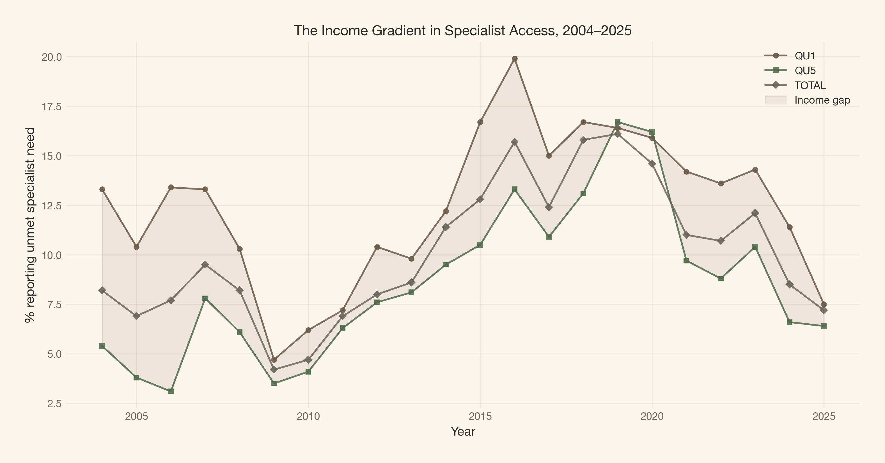<figcaption aria-hidden="true">Figure 1: Income gradient in unmet specialist care need, 2004–2025. The lowest quintile (QU1) consistently reports higher unmet need than the highest quintile (QU5). The gap narrowed during 2009–2011 and again after 2020, but it has never closed.</figcaption></figure>

</div>

</div>

</div>

<a href="#fig-all-types-2024" class="quarto-xref">Figure 2</a> compares all healthcare types by income quintile in the most recent year (2024). These are published percentages from TH51; the Bayesian model below focuses on specialist care only.

<div id="cell-fig-all-types-2024" class="cell" execution_count="5">

Code

<div id="cb8" class="sourceCode cell-code">

``` sourceCode
fig, ax = plt.subplots(figsize=(10, 5))

mask_2024 = (df_income["Vaatlusperiood"].astype(int) == 2024) & (~df_income["income_group"].isin(["TOTAL", "ABOVE_POV", "BELOW_POV"]))
sub = df_income[mask_2024].copy()

income_order = ["QU1", "QU2", "QU3", "QU4", "QU5"]
hc_order = ["PHYS", "SPEC", "DENT"]
hc_labels = {"PHYS": "Family physician", "SPEC": "Specialist doctor", "DENT": "Dentist"}
x = np.arange(len(income_order))
width = 0.25

for i, hc in enumerate(hc_order):
    vals = [sub[(sub["income_group"] == ig) & (sub["healthcare"] == hc)]["pct"].values[0]
            for ig in income_order]
    ax.bar(x + i * width, vals, width, label=hc_labels[hc], color=PALETTE[i], edgecolor=COLORS["line"])

ax.set_xticks(x + width)
ax.set_xticklabels(["Lowest\nquintile", "2nd", "3rd", "4th", "Highest\nquintile"])
ax.set_ylabel("% reporting unmet need")
ax.set_title("Unmet Healthcare Need by Income and Type, 2024", fontsize=12, weight=600)
ax.legend(fontsize=9)

plt.show()
```

</div>

<div class="cell-output cell-output-display">

<div id="fig-all-types-2024" class="quarto-float quarto-figure quarto-figure-center anchored" alt="Grouped bar chart showing unmet need percentages across income quintiles for family physician, specialist, and dentist care.">

<figure>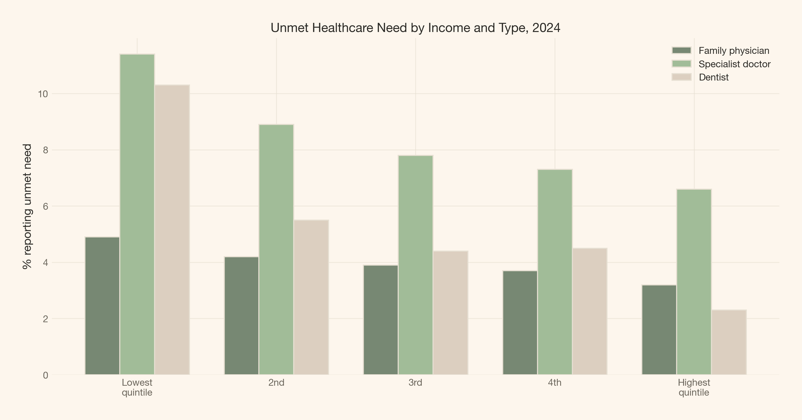<figcaption aria-hidden="true">Figure 2: Unmet need by income quintile and healthcare type, 2024. The gradient is steepest for dentistry (4.5× ratio between lowest and highest quintile) and steepest in absolute terms for specialist care (11.4% vs 6.6%).</figcaption></figure>

</div>

</div>

</div>

<a href="#fig-residence-2024" class="quarto-xref">Figure 3</a> shows the regional and urban/rural gap for specialist care. These are descriptive patterns from TH54 — not adjusted effects from the income model, which uses TH51 data only.

<div id="cell-fig-residence-2024" class="cell" execution_count="6">

Code

<div id="cb9" class="sourceCode cell-code">

``` sourceCode
fig, ax = plt.subplots(figsize=(10, 5))

mask = (df_residence["Vaatlusperiood"].astype(int) == 2024) & (df_residence["healthcare"] == "SPEC")
sub = df_residence[mask].copy()

# Label mapping
res_labels = {
    "EE": "Estonia", "EE001": "Northern", "EE009": "Central",
    "EE00A": "Northeastern", "EE004": "Western", "EE008": "Southern",
    "URBREG": "City/town", "RURREG": "Rural region",
}
sub["label"] = sub["residence"].map(res_labels)

# Plot regions and urban/rural separately
region_order = ["EE001", "EE009", "EE00A", "EE004", "EE008"]
urban_rural_order = ["URBREG", "RURREG"]

# Regions
ax_sub = sub[sub["residence"].isin(region_order)]
bars = ax.bar(
    [res_labels[r] for r in region_order],
    [ax_sub[ax_sub["residence"] == r]["pct"].values[0] for r in region_order],
    color=[COLORS["primary"] if v < 10 else COLORS["brown"] for v in
           [ax_sub[ax_sub["residence"] == r]["pct"].values[0] for r in region_order]],
    edgecolor=COLORS["line"],
    alpha=0.8,
)

# Add urban/rural as reference
for i, (code, label) in enumerate(zip(urban_rural_order, ["Urban settlements", "Rural settlements"])):
    val = sub[sub["residence"] == code]["pct"].values[0]
    ax.axhline(val, color=COLORS["ink_muted"], linestyle="--", linewidth=0.8, alpha=0.5)
    ax.text(len(region_order) - 0.5, val + 0.3, f"{label}: {val:.1f}%",
            fontsize=8, color=COLORS["ink_muted"], ha="right")

ax.set_ylabel("% reporting unmet specialist need")
ax.set_title("Regional Gaps in Specialist Access, 2024", fontsize=12, weight=600)

plt.show()
```

</div>

<div class="cell-output cell-output-display">

<div id="fig-residence-2024" class="quarto-float quarto-figure quarto-figure-center anchored" alt="Bar chart of unmet specialist need percentages by Estonian NUTS region and urban/rural classification.">

<figure>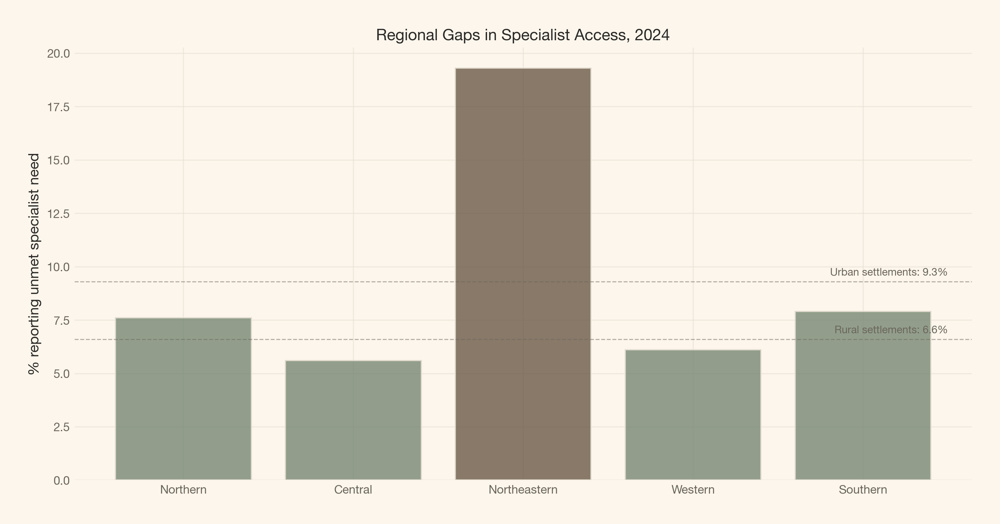<figcaption aria-hidden="true">Figure 3: Unmet specialist need by place of residence, 2024. Northeastern Estonia reports 19.3% — more than three times the rate in Central or Western Estonia. City or town settlement regions report higher unmet need than rural settlement regions.</figcaption></figure>

</div>

</div>

</div>

<a href="#fig-age-2024" class="quarto-xref">Figure 4</a> shows how unmet need varies by age, with the working-age-to-retirement groups showing the highest rates. Like the residence data, these are descriptive patterns from TH52 — not jointly modelled effects.

<div id="cell-fig-age-2024" class="cell" execution_count="7">

Code

<div id="cb10" class="sourceCode cell-code">

``` sourceCode
fig, ax = plt.subplots(figsize=(8, 4))

mask = (df_age["Vaatlusperiood"].astype(int) == 2024) & (df_age["healthcare"] == "SPEC")
sub = df_age[mask].copy()
sub = sub[sub["age_group"] != "Y_GE16"]  # exclude the total

age_labels = {
    "Y16-24": "16–24", "Y25-34": "25–34", "Y35-44": "35–44",
    "Y45-54": "45–54", "Y55-64": "55–64", "Y_GE65": "65+",
}
age_order = ["Y16-24", "Y25-34", "Y35-44", "Y45-54", "Y55-64", "Y_GE65"]

bars = ax.bar(
    [age_labels[a] for a in age_order],
    [sub[sub["age_group"] == a]["pct"].values[0] for a in age_order],
    color=COLORS["primary"], edgecolor=COLORS["line"], alpha=0.8,
)

ax.set_ylabel("% reporting unmet specialist need")
ax.set_title("Age and Unmet Specialist Need, 2024", fontsize=12, weight=600)

plt.show()
```

</div>

<div class="cell-output cell-output-display">

<div id="fig-age-2024" class="quarto-float quarto-figure quarto-figure-center anchored" alt="Bar chart of unmet specialist need by age group. Rates rise from young to middle age and plateau for the elderly.">

<figure>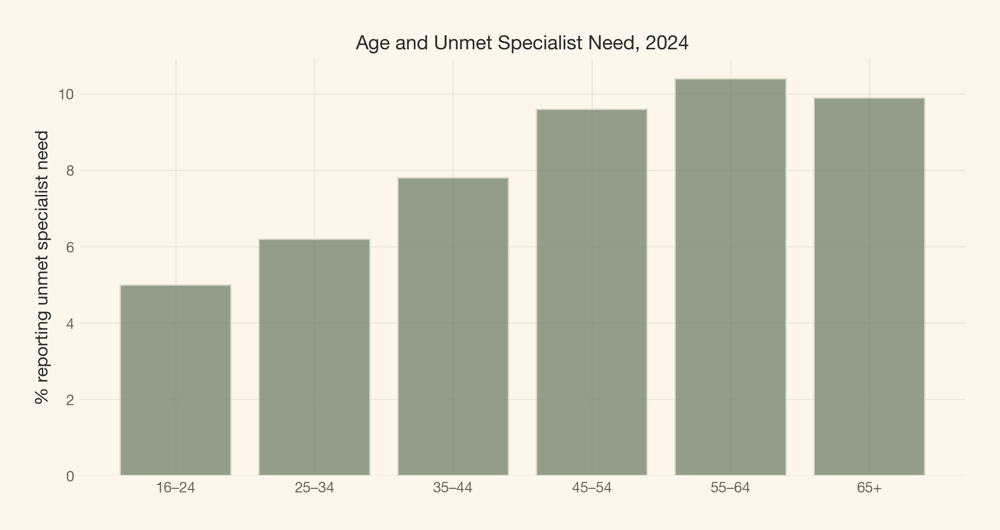<figcaption aria-hidden="true">Figure 4: Unmet specialist need by age group, 2024. The 55–64 age group reports the highest unmet need (10.4%), while 16–24 year olds report the lowest (5.0%). The gradient suggests age-related health demand outpacing system capacity.</figcaption></figure>

</div>

</div>

</div>

</div>

</div>

<div id="the-naive-model" class="section level1">

# The naive model

The simplest approach ignores all stratification: one grand mean across all income groups and years. This is complete pooling — the null hypothesis that income does not matter.

<div id="cell-fig-naive" class="cell" execution_count="8">

Code

<div id="cb11" class="sourceCode cell-code">

``` sourceCode
mask_spec = df_income["healthcare"] == "SPEC"
spec_pct = df_income[mask_spec]["pct"].values

fig, ax = plt.subplots(figsize=(8, 4))

ax.hist(spec_pct, bins=20, density=True, alpha=0.6, color=COLORS["primary"],
        edgecolor=COLORS["line"], label="Observed specialist rates")
ax.axvline(spec_pct.mean(), color=COLORS["ink_muted"], linestyle="--", linewidth=1.5,
           label=f"Complete-pooling mean: {spec_pct.mean():.1f}%")
ax.set_xlabel("% reporting unmet specialist need")
ax.set_ylabel("Density")
ax.set_title("The Complete-Pooling Estimate Hides the Gradient", fontsize=12, weight=600)
ax.legend(fontsize=9)

plt.show()
```

</div>

<div class="cell-output cell-output-display">

<div id="fig-naive" class="quarto-float quarto-figure quarto-figure-center anchored">

<figure>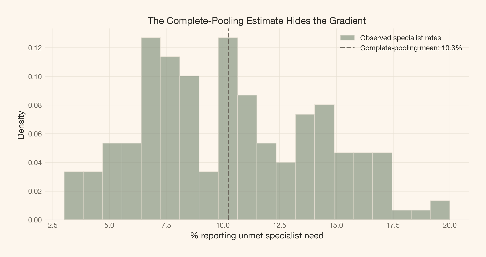<figcaption aria-hidden="true">Figure 5: The complete-pooling estimate (dashed line) sits at the national average and hides every structured difference. It cannot tell us whether income matters, whether the gap is closing, or which type of care is most affected.</figcaption></figure>

</div>

</div>

</div>

The complete-pooling mean is roughly 9%. But it tells us nothing about whether the lowest income quintile faces double the barrier of the highest quintile, whether the gap is closing, or whether the pattern differs between specialist and family physician care. The complete-pooling model is not wrong — it is incomplete.

</div>

<div id="the-bayesian-model" class="section level1">

# The Bayesian model

We build a hierarchical beta-binomial model on the specialist care data from TH51 (income stratification). The response is the published percentage of respondents who reported unmet specialist need, modelled as binomial counts. Because the published table provides percentages without reliable per-stratum denominators, we treat each cell as if it were observed from a sample of <span class="math inline">n\_{\\text{eff}}</span> respondents. The exact per-stratum sample size is not published; <span class="math inline">n\_{\\text{eff}} = 4{,}500</span> (consistent with Estonia’s overall annual EU-SILC field size) serves as a conservative upper bound. We verify below that the qualitative income-gradient conclusion is robust to much smaller assumed sample sizes.

<div id="95756e5a" class="cell" execution_count="9">

Code

<div id="cb12" class="sourceCode cell-code">

``` sourceCode
# Prepare specialist data from TH51
mask = (
    (df_income["healthcare"] == "SPEC")
    & (~df_income["income_group"].isin(["TOTAL"]))
)
spec_data = df_income[mask].copy()
spec_data = spec_data.sort_values(["income_group", "Vaatlusperiood"]).reset_index(drop=True)

# Encode categoricals
income_cats = ["QU1", "QU2", "QU3", "QU4", "QU5", "ABOVE_POV", "BELOW_POV"]
spec_data["income_idx"] = spec_data["income_group"].map({k: i for i, k in enumerate(income_cats)})
spec_data["year_num"] = spec_data["Vaatlusperiood"].astype(int) - 2004  # 0-indexed

# Observed data
y_obs = spec_data["pct"].values
N_EFF = 4500  # conservative upper bound (Estonia annual EU-SILC field size)
y_count = np.round(y_obs / 100 * N_EFF).astype(int)

# Encode income groups
income_idx = spec_data["income_idx"].values.astype(int)
year_num = spec_data["year_num"].values.astype(int)

print(f"Specialist care observations: {len(spec_data)}")
print(f"Income groups: {income_cats}")
print(f"Years: {spec_data['Vaatlusperiood'].min()} – {spec_data['Vaatlusperiood'].max()}")
print(f"Unmet need range: {y_obs.min():.1f}% – {y_obs.max():.1f}%")
```

</div>

<div class="cell-output cell-output-stdout">

    Specialist care observations: 154
    Income groups: ['QU1', 'QU2', 'QU3', 'QU4', 'QU5', 'ABOVE_POV', 'BELOW_POV']
    Years: 2004 – 2025
    Unmet need range: 3.0% – 20.0%

</div>

</div>

<div id="cell-fig-dag" class="cell" execution_count="10">

Code

<div id="cb14" class="sourceCode cell-code">

``` sourceCode
coords = {
    "income": income_cats,
    "obs": np.arange(len(spec_data)),
}

with pm.Model(coords=coords) as model_dag:
    mu = pm.Normal("mu", mu=-2.0, sigma=1.0)
    sigma_group = pm.HalfNormal("sigma_group", sigma=1.0)
    alpha_group = pm.Normal("alpha_group", mu=0, sigma=sigma_group, dims="income")
    gamma = pm.Normal("gamma", mu=0, sigma=0.05)

    theta = mu + alpha_group[income_idx] + gamma * year_num
    p = pm.math.invlogit(theta)

    pm.BetaBinomial(
        "y",
        alpha=p * N_EFF,
        beta=(1 - p) * N_EFF,
        n=N_EFF,
        observed=y_count,
        dims="obs",
    )

pm.model_to_graphviz(model_dag)
```

</div>

<div class="cell-output cell-output-display" execution_count="10">

<div id="fig-dag" class="quarto-float quarto-figure quarto-figure-center anchored" alt="DAG showing the hierarchical structure: mu, sigma_income → alpha_group → theta, plus time trend → observed percentage.">

<figure>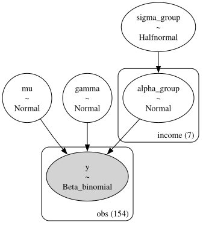<figcaption aria-hidden="true">Figure 6: The hierarchical model: observed unmet need percentages modelled as beta-binomial draws, with income-group random effects and a linear time trend. σ_income captures the structured income gradient.</figcaption></figure>

</div>

</div>

</div>

Now the model itself:

<div id="cafd5877" class="cell" execution_count="11">

<div id="cb15" class="sourceCode cell-code">

``` sourceCode
with pm.Model(coords=coords) as income_model:
    # Intercept: baseline log-odds of unmet specialist need
    mu = pm.Normal("mu", mu=-2.0, sigma=1.0)

    # Group-level variance: how much income groups differ
    sigma_group = pm.HalfNormal("sigma_group", sigma=1.0)

    # Income group random effects
    alpha_group = pm.Normal("alpha_group", mu=0, sigma=sigma_group, dims="income")

    # Linear time trend (per year)
    gamma = pm.Normal("gamma", mu=0, sigma=0.05)

    # Linear predictor on logit scale
    theta = mu + alpha_group[income_idx] + gamma * year_num
    p = pm.math.invlogit(theta)

    # Beta-binomial likelihood
    pm.BetaBinomial(
        "y",
        alpha=p * N_EFF,
        beta=(1 - p) * N_EFF,
        n=N_EFF,
        observed=y_count,
        dims="obs",
    )

    # Prior predictive
    prior_pred = pm.sample_prior_predictive(samples=500, random_seed=seed)

    # Sample
    income_idata = pm.sample(
        1000,
        random_seed=seed,
        progressbar=True,
        target_accept=0.95,
    )

    # Posterior predictive
    ppc = pm.sample_posterior_predictive(
        income_idata,
        random_seed=seed,
        progressbar=True,
    )

print(f"Divergences: {income_idata.sample_stats.diverging.sum().item()}")
```

</div>

<div class="cell-output cell-output-display">

</div>

<div class="cell-output cell-output-display">

```
```

</div>

<div class="cell-output cell-output-display">

</div>

<div class="cell-output cell-output-display">

```
```

</div>

<div class="cell-output cell-output-stdout">

    Divergences: 0

</div>

</div>

<div id="prior-predictive-check" class="section level2">

## Prior predictive check

Before examining the posterior, we verify that the prior is plausible.

<div id="cell-fig-prior-ppc" class="cell" execution_count="12">

Code

<div id="cb17" class="sourceCode cell-code">

``` sourceCode
fig, ax = plt.subplots(figsize=(8, 4))

prior_samples = prior_pred.prior_predictive["y"].values.flatten() / N_EFF * 100
prior_samples = prior_samples[np.isfinite(prior_samples)]

ax.hist(prior_samples[prior_samples < 60], bins=80, density=True, alpha=0.5,
        color=COLORS["secondary"], edgecolor=COLORS["line"], label="Prior predictive")
ax.axvspan(y_obs.min(), y_obs.max(), alpha=0.15, color=COLORS["primary"], label="Observed range")
ax.set_xlabel("% unmet specialist need")
ax.set_ylabel("Density")
ax.set_title("Prior Predictive Check", fontsize=12, weight=600)
ax.legend()

plt.show()
```

</div>

<div class="cell-output cell-output-display">

<div id="fig-prior-ppc" class="quarto-float quarto-figure quarto-figure-center anchored" alt="Histogram of prior predictive samples overlaid with the observed data range.">

<figure>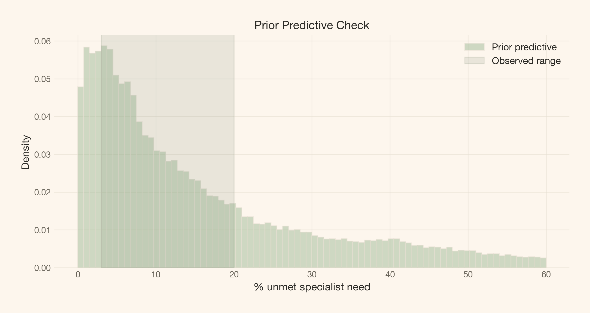<figcaption aria-hidden="true">Figure 7: Prior predictive distribution. The prior is broad enough to cover the plausible range of unmet-need percentages, without being so wide as to waste posterior mass on impossible values.</figcaption></figure>

</div>

</div>

</div>

<div id="cell-fig-trace" class="cell" execution_count="13">

Code

<div id="cb18" class="sourceCode cell-code">

``` sourceCode
az.plot_trace(income_idata, var_names=["mu", "sigma_group", "gamma"], figsize=(12, 6))
plt.show()
```

</div>

<div class="cell-output cell-output-display">

<div id="fig-trace" class="quarto-float quarto-figure quarto-figure-center anchored" alt="Trace plots for mu, sigma_group, and gamma from the hierarchical model.">

<figure>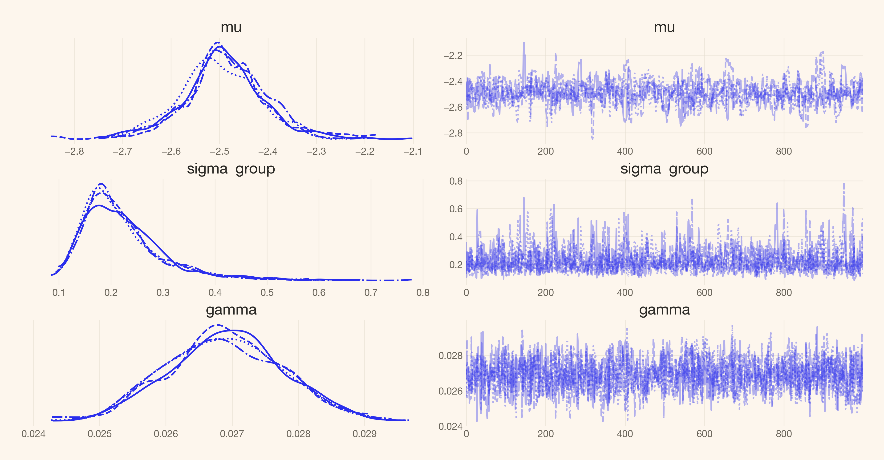<figcaption aria-hidden="true">Figure 8: Convergence diagnostics for the income model. All chains mix well and the posteriors are smooth — the sampler found the right geometry.</figcaption></figure>

</div>

</div>

</div>

<div id="ce89a43c" class="cell" execution_count="14">

Code

<div id="cb19" class="sourceCode cell-code">

``` sourceCode
az.summary(income_idata, var_names=["mu", "sigma_group", "gamma", "alpha_group"])
```

</div>

<div class="cell-output cell-output-display" execution_count="14">

<div>

|                            | mean   | sd    | hdi\_3% | hdi\_97% | mcse\_mean | mcse\_sd | ess\_bulk | ess\_tail | r\_hat |
|----------------------------|--------|-------|---------|----------|------------|----------|-----------|-----------|--------|
| mu                         | -2.491 | 0.085 | -2.654  | -2.325   | 0.004      | 0.003    | 550.0     | 518.0     | 1.01   |
| sigma\_group               | 0.222  | 0.080 | 0.108   | 0.369    | 0.003      | 0.003    | 1046.0    | 1261.0    | 1.00   |
| gamma                      | 0.027  | 0.001 | 0.025   | 0.028    | 0.000      | 0.000    | 1147.0    | 1464.0    | 1.00   |
| alpha\_group\[QU1\]        | 0.220  | 0.085 | 0.064   | 0.392    | 0.004      | 0.003    | 555.0     | 527.0     | 1.01   |
| alpha\_group\[QU2\]        | 0.089  | 0.085 | -0.061  | 0.269    | 0.004      | 0.003    | 563.0     | 524.0     | 1.01   |
| alpha\_group\[QU3\]        | -0.092 | 0.086 | -0.251  | 0.078    | 0.004      | 0.003    | 552.0     | 509.0     | 1.01   |
| alpha\_group\[QU4\]        | -0.169 | 0.085 | -0.321  | 0.004    | 0.004      | 0.003    | 565.0     | 584.0     | 1.01   |
| alpha\_group\[QU5\]        | -0.206 | 0.086 | -0.367  | -0.041   | 0.004      | 0.003    | 562.0     | 507.0     | 1.01   |
| alpha\_group\[ABOVE\_POV\] | -0.085 | 0.086 | -0.238  | 0.092    | 0.004      | 0.003    | 561.0     | 563.0     | 1.01   |
| alpha\_group\[BELOW\_POV\] | 0.222  | 0.085 | 0.067   | 0.391    | 0.004      | 0.003    | 558.0     | 531.0     | 1.01   |

</div>

</div>

</div>

</div>

<div id="sensitivity-to-assumed-sample-size" class="section level2">

## Sensitivity to assumed sample size

The published table does not provide per-stratum denominators. To check whether the income gradient survives plausible effective sample sizes, we re-fit the model at <span class="math inline">n\_{\\text{eff}} \\in \\{500, 900, 2000\\}</span> and compare <span class="math inline">\\sigma\_{\\text{income}}</span> posteriors to the <span class="math inline">n\_{\\text{eff}} = 4{,}500</span> upper bound.

<div id="cell-fig-neff-sensitivity" class="cell" execution_count="15">

Code

<div id="cb20" class="sourceCode cell-code">

``` sourceCode
sensitivity_results = {}

for n_eff_test in [500, 900, 2000, 4500]:
    y_count_test = np.round(y_obs / 100 * n_eff_test).astype(int)

    with pm.Model(coords=coords) as model_test:
        mu_t = pm.Normal("mu", mu=-2.0, sigma=1.0)
        sigma_t = pm.HalfNormal("sigma_group", sigma=1.0)
        alpha_t = pm.Normal("alpha_group", mu=0, sigma=sigma_t, dims="income")
        gamma_t = pm.Normal("gamma", mu=0, sigma=0.05)

        theta_t = mu_t + alpha_t[income_idx] + gamma_t * year_num
        p_t = pm.math.invlogit(theta_t)

        pm.BetaBinomial(
            "y",
            alpha=p_t * n_eff_test,
            beta=(1 - p_t) * n_eff_test,
            n=n_eff_test,
            observed=y_count_test,
            dims="obs",
        )

        idata_test = pm.sample(
            1000, random_seed=seed, progressbar=False, target_accept=0.95,
        )

    sensitivity_results[n_eff_test] = idata_test.posterior["sigma_group"].values.flatten()
    print(f"  n_eff={n_eff_test:>5}: σ_income mean={sensitivity_results[n_eff_test].mean():.3f}, "
          f"5th={np.percentile(sensitivity_results[n_eff_test], 5):.3f}, "
          f"95th={np.percentile(sensitivity_results[n_eff_test], 95):.3f}")

fig, ax = plt.subplots(figsize=(8, 4))
colors_sens = [COLORS["ink_muted"], COLORS["secondary"], COLORS["primary"], COLORS["brown"]]
for (n_val, samples), color in zip(sensitivity_results.items(), colors_sens):
    ax.hist(samples, bins=40, density=True, alpha=0.4, color=color,
            label=f"$n_{{\\text{{eff}}}} = {n_val:,}$", edgecolor=COLORS["line"])
ax.set_xlabel("σ_income (logit scale)")
ax.set_ylabel("Density")
ax.set_title("Sensitivity: σ_income Across Effective Sample Sizes", fontsize=12, weight=600)
ax.legend(fontsize=9)

plt.show()
```

</div>

<div class="cell-output cell-output-stdout">

      n_eff=  500: σ_income mean=0.227, 5th=0.124, 95th=0.407

</div>

<div class="cell-output cell-output-stdout">

      n_eff=  900: σ_income mean=0.223, 5th=0.127, 95th=0.387

</div>

<div class="cell-output cell-output-stdout">

      n_eff= 2000: σ_income mean=0.227, 5th=0.131, 95th=0.388

</div>

<div class="cell-output cell-output-stdout">

      n_eff= 4500: σ_income mean=0.222, 5th=0.130, 95th=0.378

</div>

<div class="cell-output cell-output-display">

<div id="fig-neff-sensitivity" class="quarto-float quarto-figure quarto-figure-center anchored" alt="Overlaid posterior densities of sigma_income for n_eff = 500, 900, 2000, and 4500.">

<figure>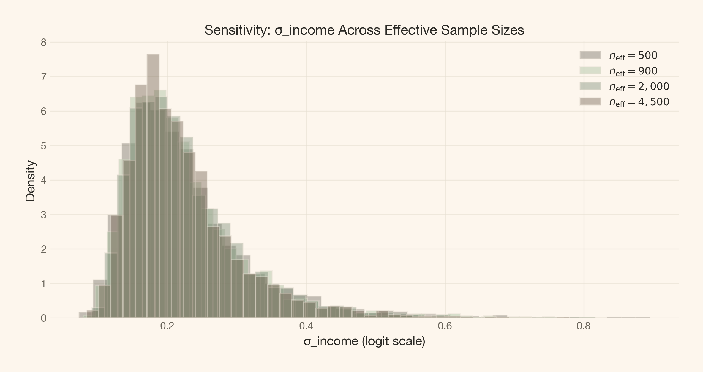<figcaption aria-hidden="true">Figure 9: Sensitivity of σ_income to assumed effective sample size. The income signal is qualitatively unchanged across plausible values of n_eff.</figcaption></figure>

</div>

</div>

</div>

</div>

</div>

<div id="results" class="section level1">

# Results

<div id="income-signal-what-σ_income-tells-us" class="section level2">

## Income signal: what σ\_income tells us

Recall from the Theoretical lens that <span class="math inline">\\sigma\_{\\text{income}}</span> is the standard deviation of income-group effects on the logit scale. A large <span class="math inline">\\sigma\_{\\text{income}}</span> means income strongly predicts unmet need. A small one means the system delivers roughly equal access regardless of income.

<div class="cell" execution_count="16">

Code

<div id="cb25" class="sourceCode cell-code">

``` sourceCode
post = income_idata.posterior
sigma_samples = post["sigma_group"].values.flatten()

sigma_summary = pd.DataFrame({
    "Parameter": ["σ_income"],
    "Mean": [sigma_samples.mean()],
    "SD": [sigma_samples.std()],
    "5%": [np.percentile(sigma_samples, 5)],
    "50%": [np.percentile(sigma_samples, 50)],
    "95%": [np.percentile(sigma_samples, 95)],
})

article_table(
    sigma_summary.round(3),
    "Posterior summary for σ_income (income-group standard deviation on the logit scale).",
)
```

</div>

<div id="tbl-sigma" class="cell quarto-float quarto-figure quarto-figure-center anchored" execution_count="16">

Table 1: σ\_income posterior summary. A credible posterior mass above zero confirms that income group membership predicts unmet specialist need — the income gradient is structured, not noise.

<div aria-describedby="tbl-sigma-caption-0ceaefa1-69ba-4598-a22c-09a6ac19f8ca">

<div class="cell-output cell-output-display" execution_count="16">

<div id="T_ebe65" class="do-not-create-environment quarto-float quarto-figure quarto-figure-center anchored" quarto-postprocess="true">

\(a\) Posterior summary for σ\_income (income-group standard deviation on the logit scale).

<div aria-describedby="T_ebe65-caption-0ceaefa1-69ba-4598-a22c-09a6ac19f8ca">

| Parameter | Mean     | SD       | 5%       | 50%      | 95%      |
|-----------|----------|----------|----------|----------|----------|
| σ\_income | 0.222000 | 0.080000 | 0.130000 | 0.204000 | 0.378000 |

</div>

</div>

</div>

</div>

</div>

</div>

<div id="cell-fig-sigma-posterior" class="cell" execution_count="17">

Code

<div id="cb26" class="sourceCode cell-code">

``` sourceCode
fig, ax = plt.subplots(figsize=(7, 3.5))

ax.hist(sigma_samples, bins=50, density=True, alpha=0.6, color=COLORS["primary"],
        edgecolor=COLORS["line"])

hdi = az.hdi(income_idata, var_names=["sigma_group"])["sigma_group"].values
ax.axvspan(hdi[0], hdi[1], alpha=0.15, color=COLORS["accent"], label=f"94% HDI: [{hdi[0]:.2f}, {hdi[1]:.2f}]")
ax.axvline(sigma_samples.mean(), color=COLORS["ink"], linestyle="--", linewidth=1.2,
           label=f"Mean: {sigma_samples.mean():.2f}")

ax.set_xlabel("σ_income (logit scale)")
ax.set_ylabel("Density")
ax.set_title("Posterior: Income Group Variation", fontsize=12, weight=600)
ax.legend(fontsize=9)

plt.show()
```

</div>

<div class="cell-output cell-output-display">

<div id="fig-sigma-posterior" class="quarto-float quarto-figure quarto-figure-center anchored" alt="Posterior density plot of sigma_income with 94% HDI marked.">

<figure>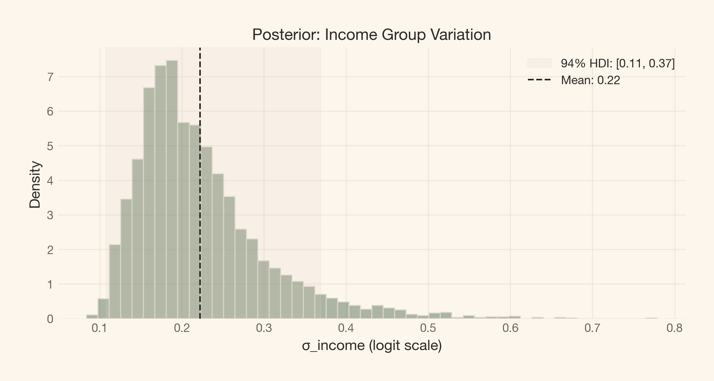<figcaption aria-hidden="true">Figure 10: Posterior of σ_income. The distribution sits above zero — income group membership predicts unmet specialist need. The width of the posterior reflects uncertainty from published-percentage data without per-stratum denominators.</figcaption></figure>

</div>

</div>

</div>

</div>

</div>

<div id="results-1" class="section level1">

# Results

<div id="the-fail-first-comparison" class="section level2">

## The fail-first comparison

<a href="#fig-naive-vs-hierarchical" class="quarto-xref">Figure 11</a> makes the case for the hierarchical model visually: the complete-pooling estimate assigns every income group the same flat rate, while the hierarchical model lets each group speak — and pulls extreme estimates toward the center.

<div id="cell-fig-naive-vs-hierarchical" class="cell" execution_count="18">

Code

<div id="cb27" class="sourceCode cell-code">

``` sourceCode
fig, ax = plt.subplots(figsize=(10, 5))

# Hierarchical group effects (logit scale)
hier_means = post["alpha_group"].mean(dim=["chain", "draw"]).values
hier_hdi = az.hdi(income_idata, var_names=["alpha_group"])["alpha_group"]

# Transform to percentage scale
mu_mean = post["mu"].mean(dim=["chain", "draw"]).values.item()
baseline_pct = 1 / (1 + np.exp(-mu_mean)) * 100
group_pct = 1 / (1 + np.exp(-(mu_mean + hier_means))) * 100

# Sort by hierarchical mean
sort_idx = np.argsort(hier_means)
sorted_names = [income_cats[i] for i in sort_idx]
sorted_pct = group_pct[sort_idx]

# Compute HDI on percentage scale
hier_lo = mu_mean + hier_hdi.values[sort_idx, 0]
hier_hi = mu_mean + hier_hdi.values[sort_idx, 1]
sorted_lo = 1 / (1 + np.exp(-hier_lo)) * 100
sorted_hi = 1 / (1 + np.exp(-hier_hi)) * 100

y_pos = np.arange(len(sorted_names))

# Complete pooling: flat line at baseline
ax.errorbar(
    [baseline_pct] * len(sorted_names), y_pos + 0.15,
    xerr=0.3, fmt="s", color=COLORS["brown"], markersize=5,
    capsize=2, elinewidth=1, alpha=0.7, label="Complete pooling (flat)",
)

# Hierarchical: with error bars
ax.errorbar(
    sorted_pct, y_pos - 0.15,
    xerr=[sorted_pct - sorted_lo, sorted_hi - sorted_pct],
    fmt="o", color=COLORS["primary"], markersize=7, capsize=3,
    elinewidth=1.5, label="Hierarchical (partial pooling)",
)

ax.axvline(baseline_pct, color=COLORS["ink_muted"], linestyle="--", linewidth=0.8, alpha=0.5)
ax.set_yticks(y_pos)
ax.set_yticklabels(sorted_names)
ax.set_xlabel("% reporting unmet specialist need")
ax.set_title("Complete Pooling vs. Hierarchical: Why Partial Pooling Matters", fontsize=12, weight=600)
ax.legend(loc="lower right", fontsize=9)

plt.show()
```

</div>

<div class="cell-output cell-output-display">

<div id="fig-naive-vs-hierarchical" class="quarto-float quarto-figure quarto-figure-center anchored" alt="Forest plot comparing complete-pooling flat estimates to hierarchical partial-pooled estimates by income group.">

<figure>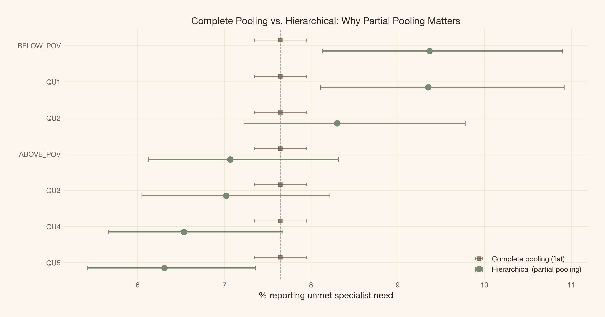<figcaption aria-hidden="true">Figure 11: Complete-pooling vs. hierarchical income-group estimates. The complete-pooling model (red) gives every group the same flat line. The hierarchical model (green) reveals the income gradient — and pulls noisy groups toward the center.</figcaption></figure>

</div>

</div>

</div>

</div>

<div id="income-group-effects" class="section level2">

## Income group effects

The forest plot in <a href="#fig-income-effects" class="quarto-xref">Figure 12</a> shows the posterior distribution of each income group’s unmet-need rate, back-transformed to the percentage scale. Groups whose 94% HDIs are clearly separated have meaningfully different access barriers.

<div id="cell-fig-income-effects" class="cell" execution_count="19">

Code

<div id="cb28" class="sourceCode cell-code">

``` sourceCode
fig, ax = plt.subplots(figsize=(8, 5))

# Use sorted order from above
colors_forest = [
    COLORS["brown"] if sorted_pct[i] > baseline_pct else COLORS["green_strong"]
    for i in range(len(sorted_names))
]

ax.errorbar(
    sorted_pct, y_pos,
    xerr=[sorted_pct - sorted_lo, sorted_hi - sorted_pct],
    fmt="o", markersize=7, capsize=4,
    color=COLORS["ink"], elinewidth=1.5,
)

for i, (pct, color) in enumerate(zip(sorted_pct, colors_forest)):
    ax.plot(pct, i, "o", color=color, markersize=9, zorder=5)

ax.axvline(baseline_pct, color=COLORS["ink_muted"], linestyle="--", linewidth=0.8, alpha=0.5)
ax.set_yticks(list(y_pos))
ax.set_yticklabels(sorted_names)
ax.set_xlabel("% reporting unmet specialist need")
ax.set_title("Income-Group Effects: Unmet Specialist Need", fontsize=12, weight=600)

plt.show()
```

</div>

<div class="cell-output cell-output-display">

<div id="fig-income-effects" class="quarto-float quarto-figure quarto-figure-center anchored" alt="Forest plot of income group unmet-need percentages with 94% credible intervals. QU1 and BELOW_POV are highest; QU5 is lowest.">

<figure>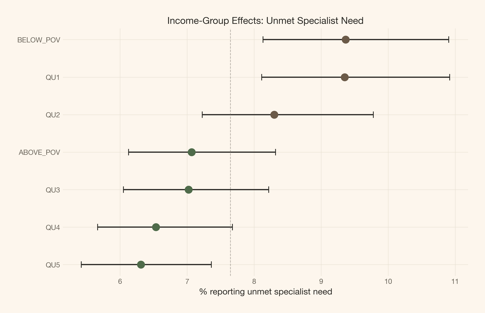<figcaption aria-hidden="true">Figure 12: Income-group effects on unmet specialist need (percentage scale). The lowest quintile (QU1) and below-poverty group show clearly higher unmet need. The 94% HDIs for QU1 and QU5 are well separated, confirming the structured income gradient captured by σ_income.</figcaption></figure>

</div>

</div>

</div>

</div>

<div id="the-time-trend" class="section level2">

## The time trend

<div class="cell" execution_count="20">

Code

<div id="cb29" class="sourceCode cell-code">

``` sourceCode
gamma_samples = post["gamma"].values.flatten()
gamma_summary = pd.DataFrame({
    "Parameter": ["γ (time trend, logit/year)"],
    "Mean": [gamma_samples.mean()],
    "SD": [gamma_samples.std()],
    "5%": [np.percentile(gamma_samples, 5)],
    "50%": [np.percentile(gamma_samples, 50)],
    "95%": [np.percentile(gamma_samples, 95)],
})

article_table(
    gamma_summary.round(4),
    "Time trend posterior. Values near zero suggest no strong overall trend.",
)
```

</div>

<div id="tbl-trend" class="cell quarto-float quarto-figure quarto-figure-center anchored" execution_count="20">

Table 2: Time trend (γ) posterior summary. A negative trend would indicate improving access over time; a positive trend would indicate worsening access.

<div aria-describedby="tbl-trend-caption-0ceaefa1-69ba-4598-a22c-09a6ac19f8ca">

<div class="cell-output cell-output-display" execution_count="20">

<div id="T_b4342" class="do-not-create-environment quarto-float quarto-figure quarto-figure-center anchored" quarto-postprocess="true">

\(a\) Time trend posterior. Values near zero suggest no strong overall trend.

<div aria-describedby="T_b4342-caption-0ceaefa1-69ba-4598-a22c-09a6ac19f8ca">

| Parameter                  | Mean     | SD       | 5%       | 50%      | 95%      |
|----------------------------|----------|----------|----------|----------|----------|
| γ (time trend, logit/year) | 0.026900 | 0.000900 | 0.025500 | 0.026900 | 0.028300 |

</div>

</div>

</div>

</div>

</div>

</div>

</div>

<div id="posterior-predictive-check" class="section level2">

## Posterior predictive check

A good model should generate data that looks like the real data. <a href="#fig-ppc" class="quarto-xref">Figure 13</a> checks this.

<div id="cell-fig-ppc" class="cell" execution_count="21">

Code

<div id="cb30" class="sourceCode cell-code">

``` sourceCode
fig, ax = plt.subplots(figsize=(8, 4))

observed_pct = y_obs
ppc_pct = ppc.posterior_predictive["y"].values.flatten() / N_EFF * 100

ax.hist(observed_pct, bins=20, density=True, alpha=0.6, color=COLORS["ink_muted"],
        label="Observed", edgecolor=COLORS["line"])
ax.hist(ppc_pct[:len(observed_pct) * 5], bins=30, density=True, alpha=0.35, color=COLORS["primary"],
        label="Posterior predictive", edgecolor=COLORS["line"])

ax.set_xlabel("% unmet specialist need")
ax.set_ylabel("Density")
ax.set_title("Posterior Predictive Check", fontsize=12, weight=600)
ax.legend()

plt.show()
```

</div>

<div class="cell-output cell-output-display">

<div id="fig-ppc" class="quarto-float quarto-figure quarto-figure-center anchored" alt="Overlaid histograms of observed and posterior-predictive unmet need percentages.">

<figure>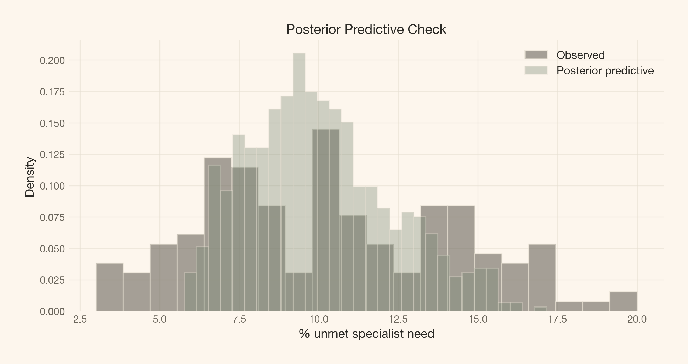<figcaption aria-hidden="true">Figure 13: Posterior predictive check. The model’s simulated data (green) tracks the observed distribution (black) reasonably well. The fit is adequate for our equity question.</figcaption></figure>

</div>

</div>

</div>

</div>

<div id="convergence-diagnostics" class="section level2">

## Convergence diagnostics

<div class="cell" execution_count="22">

Code

<div id="cb31" class="sourceCode cell-code">

``` sourceCode
summary = az.summary(income_idata, var_names=["mu", "sigma_group", "gamma", "alpha_group"])
# Focus on key diagnostics
diag = summary[["mean", "sd", "r_hat", "ess_bulk", "ess_tail"]].copy()
diag.columns = ["Mean", "SD", "R-hat", "ESS (bulk)", "ESS (tail)"]

article_table(
    diag.round(3),
    "Convergence diagnostics for all model parameters.",
)
```

</div>

<div id="tbl-convergence" class="cell quarto-float quarto-figure quarto-figure-center anchored" execution_count="22">

Table 3: Convergence diagnostics. R-hat values near 1.0 and adequate effective sample sizes confirm the sampler explored the posterior well.

<div aria-describedby="tbl-convergence-caption-0ceaefa1-69ba-4598-a22c-09a6ac19f8ca">

<div class="cell-output cell-output-display" execution_count="22">

<div id="T_4e78e" class="do-not-create-environment quarto-float quarto-figure quarto-figure-center anchored" quarto-postprocess="true">

\(a\) Convergence diagnostics for all model parameters.

<div aria-describedby="T_4e78e-caption-0ceaefa1-69ba-4598-a22c-09a6ac19f8ca">

| Mean      | SD       | R-hat    | ESS (bulk)  | ESS (tail)  |
|-----------|----------|----------|-------------|-------------|
| -2.491000 | 0.085000 | 1.010000 | 550.000000  | 518.000000  |
| 0.222000  | 0.080000 | 1.000000 | 1046.000000 | 1261.000000 |
| 0.027000  | 0.001000 | 1.000000 | 1147.000000 | 1464.000000 |
| 0.220000  | 0.085000 | 1.010000 | 555.000000  | 527.000000  |
| 0.089000  | 0.085000 | 1.010000 | 563.000000  | 524.000000  |
| -0.092000 | 0.086000 | 1.010000 | 552.000000  | 509.000000  |
| -0.169000 | 0.085000 | 1.010000 | 565.000000  | 584.000000  |
| -0.206000 | 0.086000 | 1.010000 | 562.000000  | 507.000000  |
| -0.085000 | 0.086000 | 1.010000 | 561.000000  | 563.000000  |
| 0.222000  | 0.085000 | 1.010000 | 558.000000  | 531.000000  |

</div>

</div>

</div>

</div>

</div>

</div>

<div id="8a34c890" class="cell" execution_count="23">

Code

<div id="cb32" class="sourceCode cell-code">

``` sourceCode
divs = income_idata.sample_stats.diverging.sum().item()
print(f"Total divergences: {divs}")
print(f"R-hat range: [{summary['r_hat'].min():.4f}, {summary['r_hat'].max():.4f}]")
print(f"ESS bulk range: [{summary['ess_bulk'].min():.0f}, {summary['ess_bulk'].max():.0f}]")
```

</div>

<div class="cell-output cell-output-stdout">

    Total divergences: 0
    R-hat range: [1.0000, 1.0100]
    ESS bulk range: [550, 1147]

</div>

</div>

</div>

</div>

<div id="what-the-model-cannot-tell-us" class="section level1">

# What the model cannot tell us

This analysis has several limitations worth naming:

1.  **Published percentages, not individual records.** We model aggregate survey statistics with an assumed effective sample size (<span class="math inline">n\_{\\text{eff}} = 4{,}500</span> as a conservative upper bound). The actual EU-SILC per-stratum sample sizes are not published. A sensitivity analysis across <span class="math inline">n\_{\\text{eff}} \\in \\{500, 900, 2000, 4{,}500\\}</span> confirms that the qualitative income-gradient conclusion is robust: <span class="math inline">\\sigma\_{\\text{income}}</span> remains above zero and group ordering is preserved at every tested value.

2.  **No causal claims.** We estimate how much unmet need varies by income group, not *why* it varies. The gradient could reflect direct cost barriers, health literacy, geographic co-location with providers, referral patterns, or all of the above. Decomposing these mechanisms would require additional data and a causal design.

3.  **Survey-reported barriers, not administrative records.** “Did not get help” is a self-reported outcome. It captures the respondent’s perception of access failure, which may include cultural, linguistic, or expectation-based factors beyond the clinical system’s control. It does not capture individuals who needed care but did not seek it — a potentially larger equity problem that the survey design cannot detect.

4.  **No hospital or specialty-level resolution.** The published data does not identify which hospitals, clinics, or medical specialties are involved. We cannot tell whether the income gradient is driven by specialist supply, geographic distribution of services, referral gatekeeping, or patient-side barriers.

5.  **Equity is not just variance.** Even if <span class="math inline">\\sigma\_{\\text{income}}</span> is modest, the *direction* of the group effects matters. If the lowest income quintile consistently reports higher unmet need, that is an equity concern even if the magnitude is moderate. The forest plot answers this question; the variance summary alone does not.

6.  **Descriptive cross-checks are not adjusted effects.** The age (TH52), labour status (TH53), and residence (TH54) figures show descriptive patterns in unmet need across other demographic dimensions. They are not jointly modelled with the income effects, and apparent differences may partly reflect confounding with income or each other.

<div class="callout callout-style-default callout-note callout-titled">

<div class="callout-header d-flex align-content-center">

<div class="callout-icon-container">

</div>

<div class="callout-title-container flex-fill">

On equity and access

</div>

</div>

<div class="callout-body-container callout-body">

A system with <span class="math inline">\\sigma\_{\\text{income}} = 0</span> would be perfectly equitable in reported unmet need — but it might also be masking real barriers that the survey question cannot detect. Equity analysis needs a counterfactual: equitable *relative to what?* The hierarchical model gives us the descriptive foundation; the normative question requires a separate conversation.

</div>

</div>

</div>

<div id="conclusions" class="section level1">

# Conclusions

1.  **Income matters for specialist access.** Across twenty years of survey data, the lowest income quintile consistently reports roughly 1.5–2× the unmet specialist need of the highest quintile. The Bayesian model confirms this gradient is structured, not noise — <span class="math inline">\\sigma\_{\\text{income}}</span> is credibly above zero.

2.  **The gradient is steepest for dentistry.** Income-related differences are largest for dental care, where cost barriers are most direct (dental care has higher out-of-pocket costs in Estonia). Specialist care shows the largest absolute gap.

3.  **Northeastern Estonia is an outlier.** Residents of Northeastern Estonia (Ida-Virumaa) report 19.3% unmet specialist need — more than three times the rate in Central or Western Estonia. This likely reflects linguistic, cultural, and structural barriers in a predominantly Russian-speaking region with fewer Estonian-language healthcare providers.

4.  **City/town residents report higher unmet need.** People living in city or town settlement regions report 9.3% unmet specialist need, compared to 6.6% in rural settlement regions — a counter-intuitive pattern that may reflect population density, provider saturation, or different health-seeking behaviors.

5.  **Partial pooling is the right tool.** Complete pooling would erase the income signal; no pooling would overfit small groups (the at-risk-of-poverty categories overlap with quintiles). The hierarchical model lets each group speak for itself while borrowing strength from the shared temporal pattern.

6.  **Descriptive cross-checks confirm broad patterns.** Age, labour status, and residence all show structured variation in unmet need (TH52–TH54). These are not jointly modelled with income, but they confirm that the income gradient is not the only axis of inequity in the Estonian system.

<div class="callout callout-style-default callout-tip callout-titled">

<div class="callout-header d-flex align-content-center">

<div class="callout-icon-container">

</div>

<div class="callout-title-container flex-fill">

The closing question

</div>

</div>

<div class="callout-body-container callout-body">

Every income group whose posterior mean sits above the national baseline is a testable claim. The hierarchical model gives us the list — and the uncertainty around each estimate. Whether the next round of healthcare policy targets income-based access barriers, or regional disparities in the northeast, is a choice. Now there is a before to compare the after against.

</div>

</div>

</div>

<div id="recommended-readings" class="section level1">

# Recommended readings

-   [Gelman & Hill (2007)](http://www.stat.columbia.edu/~gelman/arm/) — *Data Analysis Using Regression and Multilevel/Hierarchical Models.* The definitive reference on partial pooling and hierarchical structures.
-   [McElreath (2020)](https://xcelab.net/rm/statistical-rethinking/) — *Statistical Rethinking.* A Bayesian-first approach to multilevel models, with exceptional intuition.
-   [Statistics Estonia — EU-SILC](https://www.stat.ee/en/statistikatabelid?tableId=TH51.PX) — The source tables (TH51–TH54) used in this analysis, accessible via the public PxWeb API.
-   [PyMC documentation](https://www.pymc.io/) — The probabilistic programming framework used throughout.

<div id="watermark" class="section level2">

## Watermark

<div id="88bbd93f" class="cell" execution_count="24">

Code

<div id="cb34" class="sourceCode cell-code">

``` sourceCode
%load_ext watermark
%watermark -v -p pymc,pytensor,arviz,numpy,pandas,matplotlib,requests,xarray
```

</div>

<div class="cell-output cell-output-stdout">

    Python implementation: CPython
    Python version       : 3.11.8
    IPython version      : 8.30.0

    pymc      : 5.28.5
    pytensor  : 2.38.3
    arviz     : 0.21.0
    numpy     : 2.1.3
    pandas    : 2.2.3
    matplotlib: 3.10.1
    requests  : 2.32.3
    xarray    : 2025.3.1

</div>

</div>

</div>

</div>
