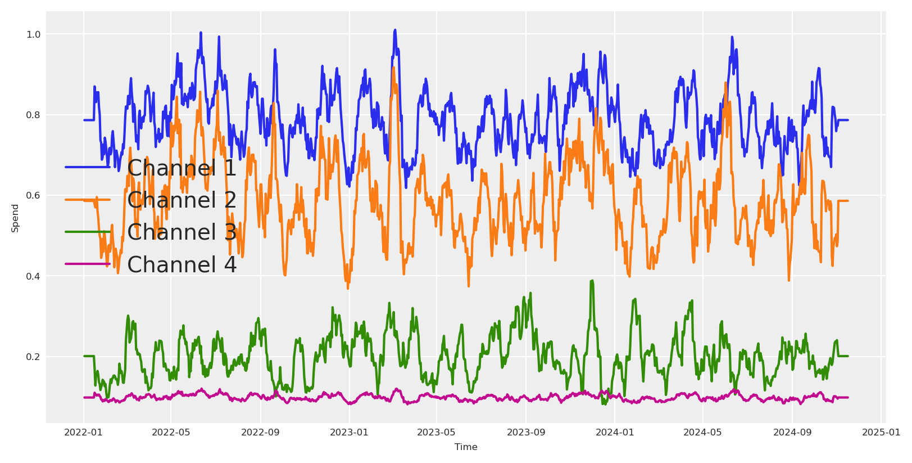
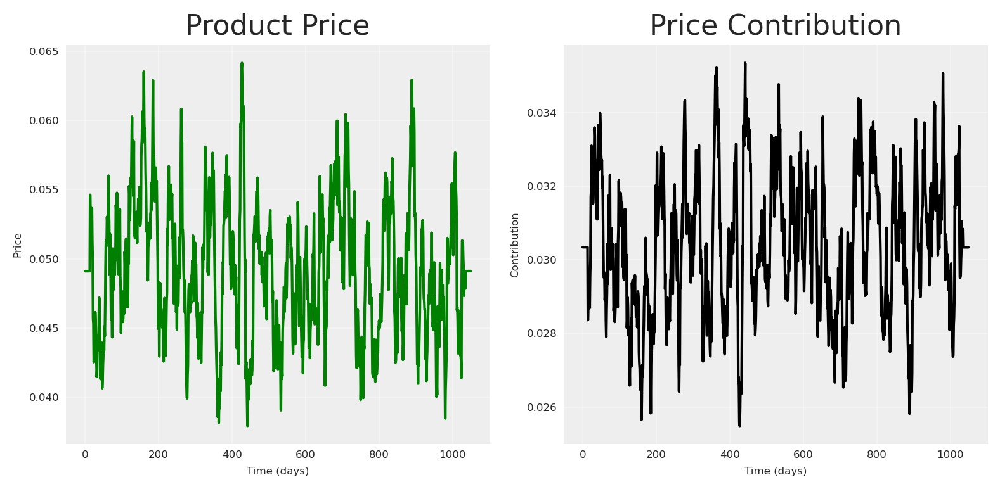
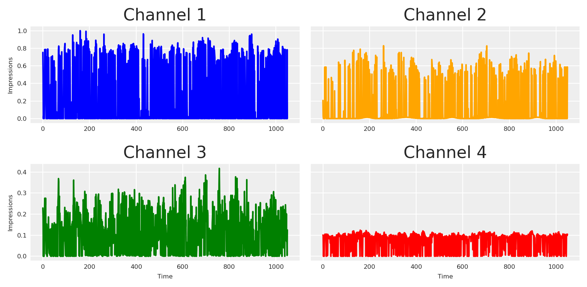
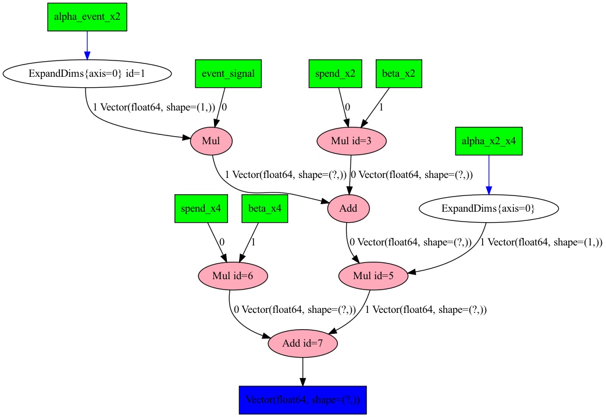
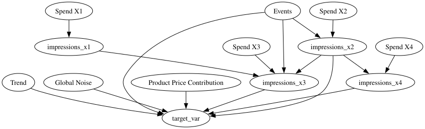
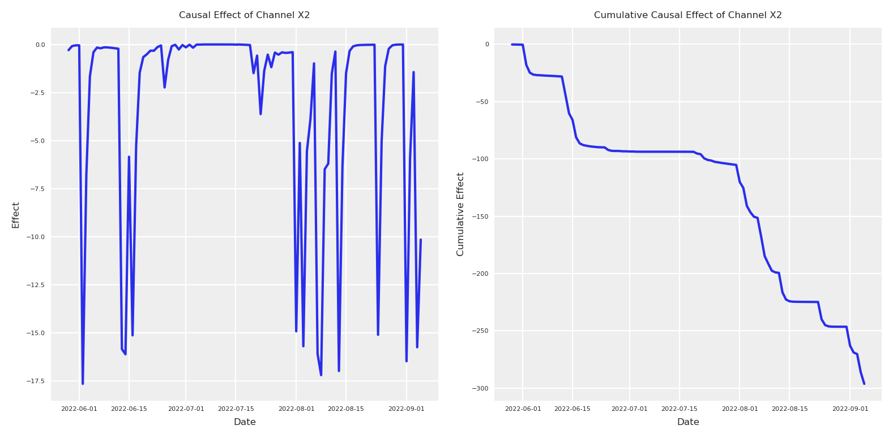
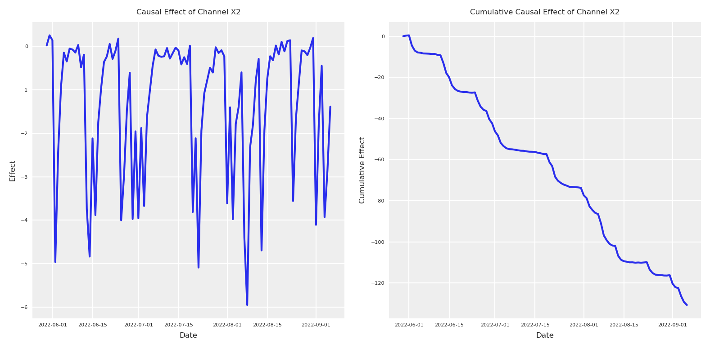
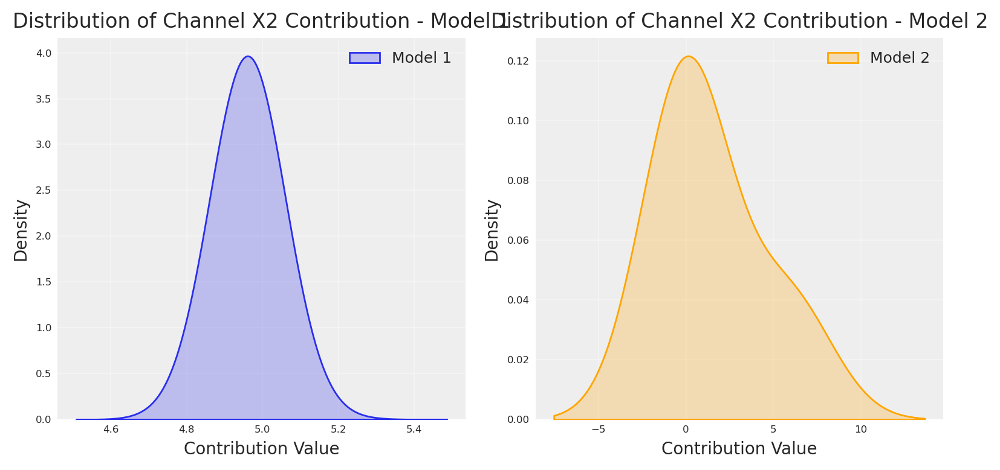

<a href="#quarto-document-content" class="skip-link">Skip to content</a>

<div id="title-block-header" class="quarto-title-block default">

<div class="quarto-title">

<div class="quarto-title-block">

<div>

# Media Mix Model calibration is useless without causal knowledge

Code

- <a href="javascript:void(0)" id="quarto-show-all-code" class="dropdown-item" role="button">Show All Code</a>

- <a href="javascript:void(0)" id="quarto-hide-all-code" class="dropdown-item" role="button">Hide All Code</a>

- 

  ------------------------------------------------------------------------

- <a href="javascript:void(0)" id="quarto-view-source" class="dropdown-item" role="button">View Source</a>

</div>

</div>

<div class="quarto-categories">

<div class="quarto-category">

python

</div>

<div class="quarto-category">

experimentation

</div>

<div class="quarto-category">

media mix modeling

</div>

<div class="quarto-category">

mmm

</div>

<div class="quarto-category">

bayesian

</div>

<div class="quarto-category">

pymc

</div>

<div class="quarto-category">

pydata

</div>

<div class="quarto-category">

germany

</div>

<div class="quarto-category">

darmstadt

</div>

</div>

</div>

<div>

<div class="description">

Why media mix model calibration is useless without causal knowledge, presented at PyData DE Darmstadt 2025.

</div>

</div>

<div class="quarto-title-meta">

<div>

<div class="quarto-title-meta-heading">

Author

</div>

<div class="quarto-title-meta-contents">

Carlos Trujillo

</div>

</div>

<div>

<div class="quarto-title-meta-heading">

Published

</div>

<div class="quarto-title-meta-contents">

April 1, 2025

</div>

</div>

</div>

</div>

<div id="introduction" class="section level1">

# Introduction

Imagine you just shipped a shiny new Bayesian Media-Mix Model (MMM) that *perfectly* back-fits years of marketing data. A/B-lift experiments then tell you channel-A is worth **€2.7 M**, but your model insists it is worth **€7 M**. “Easy fix,” you think: *calibrate* the MMM with the lift tests—add an extra likelihood term, rerun, publish.

Yet the calibrated model still over/under-values the channel based on the experimental evidence. Looks like it can’t reconcile the experimental evidence with the data, and adding new calibration for other channels actually makes it worse.

That is the calibration trap: without causal structure the posterior can’t happily reconcile observations and **clean** experiments at the same time.

In this article we will build a PyMC MMM, add lift-test calibration, and then show—step-by-step—why calibration alone cannot save a misspecified causal story.

------------------------------------------------------------------------

</div>

<div id="why-marketers-love-calibration" class="section level1">

# Why marketers love calibration

- **Ground-truth anchor.** Lift tests are randomised, so their incremental effects are (almost) unbiased.  
- **Sample-size boost.** MMMs see every day and every channel; experiments see only a slice. Combining them promises lower variance.  
- **Storytelling power.** “Our model *matches* the experiments” is an executive-friendly sound-bite.

Calibration therefore feels like catching two Bayesian birds with one conjugate stone.

------------------------------------------------------------------------

</div>

<div id="what-is-calibrationmathematically" class="section level1">

# What *is* calibration—mathematically?

For each experiment <span class="math inline">i</span> the model predicts a lift

<span class="math display"> \widehat{\Delta y_i}(\theta)\\=\\ s\bigl(x_i+\Delta x_i;\\\theta\_{c(i)}\bigr) \\-\\ s\bigl(x_i;\\\theta\_{c(i)}\bigr), </span>

where

- <span class="math inline">x_i</span> – baseline spend before the experiment,  
- <span class="math inline">\Delta x_i</span> – change in spend during the experiment,  
- <span class="math inline">s(\cdot;\theta\_{c(i)})</span> – saturation curve for the channel that experiment <span class="math inline">i</span> targets,  
- <span class="math inline">\theta</span> – all saturation-curve parameters,  
- <span class="math inline">\widehat{\Delta y_i}(\theta)</span> – model-predicted incremental outcome.

We then attach the observed lift <span class="math inline">\Delta y_i</span> and its error <span class="math inline">\sigma_i</span> through an additional likelihood

<span class="math display"> p\\\bigl(\Delta y_i \mid \theta\bigr)\\=\\ \operatorname{Gamma}\\\bigl( \mu=\lvert\widehat{\Delta y_i}(\theta)\rvert,\\ \sigma=\sigma_i \bigr), </span>

where

- <span class="math inline">\Delta y_i</span> – experimentally measured incremental outcome,  
- <span class="math inline">\sigma_i</span> – reported standard error of <span class="math inline">\Delta y_i</span>,  
- <span class="math inline">\mu</span> – mean parameter set to the *absolute* predicted lift so the Gamma remains non-negative.

Stacking all <span class="math inline">n\_{\text{lift}}</span> experiments gives the calibrated posterior

<span class="math display"> p\\\bigl(\theta \mid \mathbf y,\mathcal L\bigr) \\\propto\\ p\\\bigl(\mathbf y \mid \theta\bigr)\\ \prod\_{i=1}^{n\_{\text{lift}}} p\\\bigl(\Delta y_i \mid \theta\bigr)\\ p(\theta), </span>

where

- <span class="math inline">\mathbf y</span> – full time-series of observed outcomes (sales, sign-ups …),  
- <span class="math inline">\mathcal L</span> – the collection of lift-test observations <span class="math inline">(\Delta y_i,\sigma_i)</span>,  
- <span class="math inline">p(\theta)</span> – priors for all parameters.

PyMC turns this into a three-liner:

<div id="cb1" class="sourceCode">

``` sourceCode
add_lift_measurements_to_likelihood_from_saturation(
    model=mmm,
    df_lift=df_lifts,     # experiment data-frame
    dist=pm.Gamma,
)
```

</div>

In simple terms, calibration appends one extra likelihood per experiment: for lift `i` we run the channel’s saturation curve at the pre-spend and post-spend levels, subtract the two, and call that result the model-expected incremental response for experiment `i` (a deterministic function of the saturation parameter vector <span class="math inline">\theta</span>). We then treat the observed lift <span class="math inline">\Delta y_i</span> as a Gamma-distributed draw whose mean is the absolute value of that model-expected increment and whose dispersion is the experiment’s reported standard error <span class="math inline">\sigma_i</span>.

These independent <span class="math inline">\Gamma(\mu = \|\text{model-expected increment}\|, \sigma = \sigma_i)</span> factors multiply into the original time-series likelihood, yielding a posterior where <span class="math inline">\theta</span> is pulled toward values that keep every model-expected increment within the experimental noise band. In effect, each lift test imposes a Bayesian anchor that penalises any parameter setting whose predicted causal effect disagrees with ground-truth, while still allowing the full sales history to inform the remaining uncertainty.

Let’s see how this works in practice, by creating a synthetic dataset and fitting a simple MMM.

</div>

<div id="getting-started" class="section level1">

# Getting started

We’ll use Pytensor to run our data-generation-process (DGP). Let’s set the seed for reproducibility, and define the number of observations, and finally add some default configurations for the notebook.

<div id="1e755af2" class="cell" execution_count="1">

Code

<div id="cb2" class="sourceCode cell-code">

``` sourceCode
import warnings
import pymc as pm
import arviz as az
import pytensor.tensor as pt
from pytensor.graph import rewrite_graph
import preliz as pz

import numpy as np
import pandas as pd

import matplotlib.pyplot as plt
import seaborn as sns
import graphviz

from pymc_marketing.mmm import GeometricAdstock, MichaelisMentenSaturation, MMM
from pymc_extras.prior import Prior

SEED = 42
n_observations = 1050

warnings.filterwarnings("ignore")

# Set the style
az.style.use("arviz-darkgrid")
plt.rcParams["figure.figsize"] = [8, 4]
plt.rcParams["figure.dpi"] = 100
plt.rcParams["axes.labelsize"] = 6
plt.rcParams["xtick.labelsize"] = 6
plt.rcParams["ytick.labelsize"] = 6

%config InlineBackend.figure_format = "retina"
```

</div>

<div class="cell-output cell-output-stderr">

    /opt/anaconda3/envs/cetagostini_web/lib/python3.11/site-packages/preliz/ppls/pymc_io.py:12: FutureWarning: `pytensor.graph.basic.ancestors` was moved to `pytensor.graph.traversal.ancestors`. Calling it from the old location will fail in a future release.
      from pytensor.graph.basic import ancestors
    /opt/anaconda3/envs/cetagostini_web/lib/python3.11/site-packages/pymc_extras/model/marginal/graph_analysis.py:10: FutureWarning: `pytensor.graph.basic.io_toposort` was moved to `pytensor.graph.traversal.io_toposort`. Calling it from the old location will fail in a future release.
      from pytensor.graph.basic import io_toposort

</div>

</div>

Now, we can define the date range.

<div id="5e9db494" class="cell" execution_count="2">

Code

<div id="cb4" class="sourceCode cell-code">

``` sourceCode
min_date = pd.to_datetime("2022-01-01")
max_date = min_date + pd.Timedelta(days=n_observations)

date_range = pd.date_range(start=min_date, end=max_date, freq="D")

df = pd.DataFrame(data={"date_week": date_range}).assign(
    year=lambda x: x["date_week"].dt.year,
    month=lambda x: x["date_week"].dt.month,
    dayofyear=lambda x: x["date_week"].dt.dayofyear,
)
```

</div>

</div>

We can start by creating the spend vectors for each channel. These are the will define later the amount of impressions or exposition we get from each channel, which by the end will transform into sales.

<div id="40a7d657" class="cell" execution_count="3">

Code

<div id="cb5" class="sourceCode cell-code">

``` sourceCode
spend_x1 = pt.vector("spend_x1")
spend_x2 = pt.vector("spend_x2")
spend_x3 = pt.vector("spend_x3")
spend_x4 = pt.vector("spend_x4")

# Create sample inputs for demonstration using preliz distributions:
pz_spend_x1 = np.convolve(
    pz.Gamma(mu=.8, sigma=.3).rvs(size=n_observations, random_state=SEED), 
    np.ones(14) / 14, mode="same"
)
pz_spend_x1[:14] = pz_spend_x1.mean()
pz_spend_x1[-14:] = pz_spend_x1.mean()

pz_spend_x2 = np.convolve(
    pz.Gamma(mu=.6, sigma=.4).rvs(size=n_observations, random_state=SEED), 
    np.ones(14) / 14, mode="same"
)
pz_spend_x2[:14] = pz_spend_x2.mean()
pz_spend_x2[-14:] = pz_spend_x2.mean()

pz_spend_x3 = np.convolve(
    pz.Gamma(mu=.2, sigma=.2).rvs(size=n_observations, random_state=SEED), 
    np.ones(14) / 14, mode="same"
)
pz_spend_x3[:14] = pz_spend_x3.mean()
pz_spend_x3[-14:] = pz_spend_x3.mean()

pz_spend_x4 = np.convolve(
    pz.Gamma(mu=.1, sigma=.03).rvs(size=n_observations, random_state=SEED), 
    np.ones(14) / 14, mode="same"
)
pz_spend_x4[:14] = pz_spend_x4.mean()
pz_spend_x4[-14:] = pz_spend_x4.mean()

fig, ax = plt.subplots()
ax.plot(date_range[1:], pz_spend_x1, label='Channel 1')
ax.plot(date_range[1:], pz_spend_x2, label='Channel 2')
ax.plot(date_range[1:], pz_spend_x3, label='Channel 3')
ax.plot(date_range[1:], pz_spend_x4, label='Channel 4')
ax.set_xlabel('Time')
ax.set_ylabel('Spend')
ax.legend()
plt.show()
```

</div>

<div class="cell-output cell-output-display">

<div>

<figure class="figure">
<p></p>
</figure>

</div>

</div>

</div>

Using the same logic we can create other components such as trend, noise, seasonality, and certain events.

<div id="2c6b7312" class="cell" execution_count="4">

Code

<div id="cb6" class="sourceCode cell-code">

``` sourceCode
## Trend
trend = pt.vector("trend")
# Create a sample input for the trend
np_trend = (np.linspace(start=0.0, stop=.50, num=n_observations) + .10) ** (.1 / .4)

## NOISE 
global_noise = pt.vector("global_noise")
# Create a sample input for the noise
pz_global_noise = pz.Normal(mu=0, sigma=.005).rvs(size=n_observations, random_state=SEED)

# EVENTS EFFECT
pt_event_signal = pt.vector("event_signal")
pt_event_contributions = pt.vector("event_contributions")

event_dates = ["24-12", "09-07"]  # List of events as month-day strings
std_devs = [25, 15]  # List of standard deviations for each event
events_coefficients = [.094, .018]

signals_independent = []

# Initialize the event effect array
event_signal = np.zeros(len(date_range))
event_contributions = np.zeros(len(date_range))

# Generate event signals
for event, std_dev, event_coef in zip(
    event_dates, std_devs, events_coefficients, strict=False
):
    # Find all occurrences of the event in the date range
    event_occurrences = date_range[date_range.strftime("%d-%m") == event]

    for occurrence in event_occurrences:
        # Calculate the time difference in days
        time_diff = (date_range - occurrence).days

        # Generate the Gaussian basis for the event
        _event_signal = np.exp(-0.5 * (time_diff / std_dev) ** 2)

        # Add the event signal to the event effect
        signals_independent.append(_event_signal)
        event_signal += _event_signal

        event_contributions += _event_signal * event_coef

np_event_signal = event_signal
np_event_contributions = event_contributions

plt.plot(pz_global_noise, label='Global Noise')
plt.plot(np_trend, label='Trend')
plt.plot(np_event_signal, label='Event Contributions')
plt.title('Components of the Time Series Model')
plt.xlabel('Time (days)')
plt.ylabel('Value')
plt.legend()
plt.grid(True, alpha=0.3)
plt.show()
```

</div>

<div class="cell-output cell-output-display">

<div>

<figure class="figure">
<p></p>
</figure>

</div>

</div>

</div>

In order to make it more interesting, lets add a price variable. Usually, price creates more impact as it’s slower. The product price contribution function we’ll use is a diminishing returns function:

<span class="math display">f(X, \alpha, \lambda) = \frac{\alpha}{1 + (X / \lambda)}</span>

where <span class="math inline">\alpha</span> represents the maximum contribution and <span class="math inline">\lambda</span> is a scaling parameter that controls how quickly the contribution diminishes as price increases.

<div id="b2636169" class="cell" execution_count="5">

Code

<div id="cb7" class="sourceCode cell-code">

``` sourceCode
def product_price_contribution(X, alpha, lam):
    return alpha / (1 + (X / lam))
    
# Create a product price vector.
product_price = pt.vector("product_price")
product_price_alpha = pt.scalar("product_price_alpha")
product_price_lam = pt.scalar("product_price_lam")

# Create a sample input for the product price
pz_product_price = np.convolve(
    pz.Gamma(mu=.05, sigma=.02).rvs(size=n_observations, random_state=SEED), 
    np.ones(14) / 14, mode="same"
)
pz_product_price[:14] = pz_product_price.mean()
pz_product_price[-14:] = pz_product_price.mean()

product_price_alpha_value = .08
product_price_lam_value = .03

# Direct contribution to the target.
pt_product_price_contribution = product_price_contribution(
    product_price, 
    product_price_alpha, 
    product_price_lam
)

# plot the product price contribution
fig, (ax1, ax2) = plt.subplots(1, 2)

# Plot the raw price data
ax1.plot(pz_product_price, color="green")
ax1.set_title('Product Price')
ax1.set_xlabel('Time (days)')
ax1.set_ylabel('Price')
ax1.grid(True, alpha=0.3)

# Plot the price contribution
price_contribution = pt_product_price_contribution.eval({
    "product_price": pz_product_price,
    "product_price_alpha": product_price_alpha_value,
    "product_price_lam": product_price_lam_value
})
ax2.plot(price_contribution, color="black")
ax2.set_title('Price Contribution')
ax2.set_xlabel('Time (days)')
ax2.set_ylabel('Contribution')
ax2.grid(True, alpha=0.3)

plt.tight_layout()
plt.show()
```

</div>

<div class="cell-output cell-output-display">

<div>

<figure class="figure">
<p></p>
</figure>

</div>

</div>

</div>

With all the principal components in place, all parent nodes we can start to write down our causal DAG to define the relationships we want to explain.

<div id="9b8d9993" class="cell" execution_count="6">

Code

<div id="cb8" class="sourceCode cell-code">

``` sourceCode
# Plot causal graph of the vars x1, x2, x3, x4 using graphviz
cdag_impressions = graphviz.Digraph(comment='Causal DAG for Impressions')

cdag_impressions.node('spend_x1', 'Spend X1')
cdag_impressions.node('spend_x2', 'Spend X2')
cdag_impressions.node('spend_x3', 'Spend X3')
cdag_impressions.node('spend_x4', 'Spend X4')
cdag_impressions.node('events', 'Events')

cdag_impressions.edge('spend_x1', 'impressions_x1')
cdag_impressions.edge('spend_x2', 'impressions_x2')
cdag_impressions.edge('spend_x3', 'impressions_x3')
cdag_impressions.edge('spend_x4', 'impressions_x4')

cdag_impressions.edge('impressions_x1', 'impressions_x3')
cdag_impressions.edge('impressions_x2', 'impressions_x3')
cdag_impressions.edge('impressions_x2', 'impressions_x4')

cdag_impressions.edge('events', 'impressions_x2')
cdag_impressions.edge('events', 'impressions_x3')

cdag_impressions
```

</div>

<div class="cell-output cell-output-display" execution_count="6">

<div>

<figure class="figure">
<p></p>
</figure>

</div>

</div>

</div>

Once our causal graph is defined, we can start to write down in pytensor the structure and relationships.

<div id="70ae8e84" class="cell" execution_count="7">

Code

<div id="cb9" class="sourceCode cell-code">

``` sourceCode
# Create a impressions vector, result of x1, x2, x3, x4. by some beta with daily values.
# Define all parameters as PyTensor variables
beta_x1 = pt.vector("beta_x1")
impressions_x1 = spend_x1 * beta_x1

beta_x2 = pt.vector("beta_x2")
alpha_event_x2 = pt.scalar("alpha_event_x2")
impressions_x2 = spend_x2 * beta_x2 + pt_event_signal * alpha_event_x2

beta_x3 = pt.vector("beta_x3")
alpha_event_x3 = pt.scalar("alpha_event_x3")
alpha_x1_x3 = pt.scalar("alpha_x1_x3")
alpha_x2_x3 = pt.scalar("alpha_x2_x3")
impressions_x3 = spend_x3 * beta_x3 + pt_event_signal * alpha_event_x3 + (
    impressions_x2 * alpha_x2_x3
    + impressions_x1 * alpha_x1_x3
)

beta_x4 = pt.vector("beta_x4")
alpha_x2_x4 = pt.scalar("alpha_x2_x4")
impressions_x4 = spend_x4 * beta_x4 + impressions_x2 * alpha_x2_x4

# Create sample values for the parameters (to be used in eval)
pz_beta_x1 = pz.Beta(alpha=0.05, beta=.1).rvs(size=n_observations, random_state=SEED)
pz_beta_x2 = pz.Beta(alpha=.015, beta=.05).rvs(size=n_observations, random_state=SEED)
pz_alpha_event_x2 = 0.015
pz_beta_x3 = pz.Beta(alpha=.1, beta=.1).rvs(size=n_observations, random_state=SEED)
pz_alpha_event_x3 = 0.001
pz_alpha_x1_x3 = 0.005
pz_alpha_x2_x3 = 0.12
pz_beta_x4 = pz.Beta(alpha=.125, beta=.05).rvs(size=n_observations, random_state=SEED)
pz_alpha_x2_x4 = 0.01

# plot all impressions
# Define dependencies for each variable
x1_deps = {
    "beta_x1": pz_beta_x1,
    "spend_x1": pz_spend_x1,
}

x2_deps = {
    "beta_x2": pz_beta_x2,
    "spend_x2": pz_spend_x2,
    "alpha_event_x2": pz_alpha_event_x2,
    "event_signal": event_signal[:-1],  # Slice to match 1050 length
}

# For x3, we need all dependencies from x1 and x2 plus its own
x3_deps = {
    "beta_x3": pz_beta_x3,
    "spend_x3": pz_spend_x3,
    "alpha_x2_x3": pz_alpha_x2_x3,
    "alpha_event_x3": pz_alpha_event_x3,
    "alpha_x1_x3": pz_alpha_x1_x3,
    **x1_deps,
    **x2_deps,
}

# For x4, we need dependencies from x2 plus its own
x4_deps = {
    "beta_x4": pz_beta_x4,
    "spend_x4": pz_spend_x4,
    "alpha_x2_x4": pz_alpha_x2_x4,
    **x2_deps,
}

# Plot each impression series
fig, axs = plt.subplots(2, 2, sharex='row', sharey='row')

# Channel 1
axs[0, 0].plot(impressions_x1.eval(x1_deps), color='blue')
axs[0, 0].set_title('Channel 1')
axs[0, 0].set_ylabel('Impressions')

# Channel 2
axs[0, 1].plot(impressions_x2.eval(x2_deps), color='orange')
axs[0, 1].set_title('Channel 2')

# Channel 3
axs[1, 0].plot(impressions_x3.eval(x3_deps), color='green')
axs[1, 0].set_title('Channel 3')
axs[1, 0].set_xlabel('Time')
axs[1, 0].set_ylabel('Impressions')

# Channel 4
axs[1, 1].plot(impressions_x4.eval(x4_deps), color='red')
axs[1, 1].set_title('Channel 4')
axs[1, 1].set_xlabel('Time')

plt.tight_layout()
plt.show()
```

</div>

<div class="cell-output cell-output-display">

<div>

<figure class="figure">
<p></p>
</figure>

</div>

</div>

</div>

<div class="callout callout-style-default callout-note callout-titled">

<div class="callout-header d-flex align-content-center">

<div class="callout-icon-container">

</div>

<div class="callout-title-container flex-fill">

Visualizing the computational graph

</div>

</div>

<div class="callout-body-container callout-body">

In order to check we write down the process properly, we can ask PyTensor to print our structural causal model. This is not necessary for the analysis, but can be helpful for debugging and understanding the model structure.

<div id="5d3fb6d9" class="cell" execution_count="8">

Code

<div id="cb10" class="sourceCode cell-code">

``` sourceCode
import pytensor.printing as printing
# Plot the graph of our model using pytensor
printing.pydotprint(rewrite_graph(impressions_x4), outfile="images/impressions.png", var_with_name_simple=True)
# Display the generated graph
from IPython.display import Image
Image(filename="images/impressions.png")
```

</div>

<div class="cell-output cell-output-stdout">

    The output file is available at images/impressions.png

</div>

<div class="cell-output cell-output-display" execution_count="8">

<div>

<figure class="figure">
<p></p>
</figure>

</div>

</div>

</div>

If, you don’t like to see the graphical version, you can ask for the string representation.

<div id="6a5b9a7c" class="cell" execution_count="9">

Code

<div id="cb12" class="sourceCode cell-code">

``` sourceCode
# dprint the target_var
rewrite_graph(impressions_x4).dprint(depth=5);
```

</div>

<div class="cell-output cell-output-stdout">

    Add [id A]
     ├─ Mul [id B]
     │  ├─ spend_x4 [id C]
     │  └─ beta_x4 [id D]
     └─ Mul [id E]
        ├─ Add [id F]
        │  ├─ Mul [id G]
        │  │  ├─ spend_x2 [id H]
        │  │  └─ beta_x2 [id I]
        │  └─ Mul [id J]
        │     ├─ event_signal [id K]
        │     └─ ExpandDims{axis=0} [id L]
        └─ ExpandDims{axis=0} [id M]
           └─ alpha_x2_x4 [id N]

</div>

</div>

</div>

</div>

Now, let’s define our forward pass - how media exposure actually impacts our target variable. In marketing, we typically see two key effects: saturation (diminishing returns) and lagging (delayed impact). We’ll model these using the Michaelis-Menten function for saturation and Geometric Adstock for the lagging effects.

<div id="13ea7061" class="cell" execution_count="10">

Code

<div id="cb14" class="sourceCode cell-code">

``` sourceCode
# Creating forward pass for impressions
def forward_pass(x, adstock_alpha, saturation_lam, saturation_alpha):
    # return type pytensor.tensor.variable.TensorVariable
    return MichaelisMentenSaturation.function(
        MichaelisMentenSaturation, 
        x=GeometricAdstock(
            l_max=24, normalize=False
        ).function(
            x=x, alpha=adstock_alpha,
        ), lam=saturation_lam, alpha=saturation_alpha,
    )

# Applying forward pass to impressions
# Create scalars variables for the parameters x2, x3, x4
pt_saturation_lam_x2 = pt.scalar("saturation_lam_x2")
pt_saturation_alpha_x2 = pt.scalar("saturation_alpha_x2")

pt_saturation_lam_x3 = pt.scalar("saturation_lam_x3")
pt_saturation_alpha_x3 = pt.scalar("saturation_alpha_x3")

pt_saturation_lam_x4 = pt.scalar("saturation_lam_x4")
pt_saturation_alpha_x4 = pt.scalar("saturation_alpha_x4")

pt_global_adstock_effect = pt.scalar("global_adstock_alpha")

# Apply forward pass to impressions
impressions_x2_forward = forward_pass(
    impressions_x2, 
    pt_global_adstock_effect, 
    pt_saturation_lam_x2, 
    pt_saturation_alpha_x2
)

impressions_x3_forward = forward_pass(
    impressions_x3, 
    pt_global_adstock_effect, 
    pt_saturation_lam_x3, 
    pt_saturation_alpha_x3
)

impressions_x4_forward = forward_pass(
    impressions_x4, 
    pt_global_adstock_effect, 
    pt_saturation_lam_x4, 
    pt_saturation_alpha_x4
)
```

</div>

</div>

With all of the following in place, we can define the causal DAG for the target variable and the structural equation as the sum of all previous variables.

<div id="f21f8b4f" class="cell" execution_count="11">

Code

<div id="cb15" class="sourceCode cell-code">

``` sourceCode
# Plot graphviz causal dag for the target_var
# Create a Graphviz object
dot = graphviz.Digraph(comment='Causal DAG for Target Variable')

# Add nodes for each variable
dot.node('spend_x1', 'Spend X1')
dot.node('spend_x2', 'Spend X2')
dot.node('spend_x3', 'Spend X3')
dot.node('spend_x4', 'Spend X4')
dot.node('trend', 'Trend')
dot.node('global_noise', 'Global Noise')
dot.node('event_contributions', 'Events')
dot.node('product_price_contribution', 'Product Price Contribution')

dot.edge('spend_x1', 'impressions_x1')
dot.edge('spend_x2', 'impressions_x2')
dot.edge('spend_x3', 'impressions_x3')
dot.edge('spend_x4', 'impressions_x4')

dot.edge('impressions_x1', 'impressions_x3')
dot.edge('impressions_x2', 'impressions_x3')
dot.edge('impressions_x2', 'impressions_x4')
dot.edge('event_contributions', 'impressions_x2')
dot.edge('event_contributions', 'impressions_x3')

dot.edge('trend', 'target_var')
dot.edge('global_noise', 'target_var')
dot.edge('event_contributions', 'target_var')
dot.edge('product_price_contribution', 'target_var')

dot.edge('impressions_x2', 'target_var')
dot.edge('impressions_x3', 'target_var')
dot.edge('impressions_x4', 'target_var')

# Render the graph
dot
```

</div>

<div class="cell-output cell-output-display" execution_count="11">

<div>

<figure class="figure">
<p></p>
</figure>

</div>

</div>

</div>

<span class="math display"> \begin{align} \text{Target} &\sim \sum\_{i \in \\2,3,4\\} f_i(\text{impressions}\_i) + \\ &\text{event\\contributions} + \\ &\text{product\\price\\contribution} + \\ &\text{trend} + \\ &\text{noise} \end{align} </span>

Where <span class="math inline">f_i</span> represents the forward pass function (adstock and saturation) applied to each channel’s impressions.

<div id="5c8ccddf" class="cell" execution_count="12">

Code

<div id="cb16" class="sourceCode cell-code">

``` sourceCode
target_var = rewrite_graph(
    impressions_x4_forward + 
    impressions_x3_forward +
    impressions_x2_forward +
    pt_event_contributions +
    pt_product_price_contribution + 
    trend + 
    global_noise
)

# Eval target_var and plot
np_target_var = target_var.eval({
    "spend_x4": pz_spend_x4,
    "spend_x3": pz_spend_x3,
    "spend_x2": pz_spend_x2,
    "spend_x1": pz_spend_x1,
    "event_signal": event_signal[:-1],
    "alpha_event_x2": pz_alpha_event_x2,
    "alpha_event_x3": pz_alpha_event_x3,
    "alpha_x1_x3": pz_alpha_x1_x3,
    "alpha_x2_x3": pz_alpha_x2_x3,
    "alpha_x2_x4": pz_alpha_x2_x4,
    "beta_x2": pz_beta_x2,
    "beta_x3": pz_beta_x3,
    "beta_x4": pz_beta_x4,
    "beta_x1": pz_beta_x1,
    "saturation_lam_x2": .5,
    "saturation_alpha_x2": .2,
    "saturation_lam_x3": .7,
    "saturation_alpha_x3": .7,
    "saturation_lam_x4": .2,
    "saturation_alpha_x4": .1,
    "global_adstock_alpha": .2,
    "product_price": pz_product_price,
    "event_contributions": np_event_contributions[:-1],
    "product_price_alpha": product_price_alpha_value,
    "product_price_lam": product_price_lam_value,
    "trend": np_trend,
    "global_noise": pz_global_noise,
})

plt.plot(np_target_var, linewidth=2)
plt.title('Target Variable Over Time', fontsize=14)
plt.xlabel('Time Period', fontsize=12)
plt.ylabel('Target Value', fontsize=12)
plt.grid(True, alpha=0.3)
plt.tight_layout()
plt.show()
```

</div>

<div class="cell-output cell-output-display">

<div>

<figure class="figure">
<p></p>
</figure>

</div>

</div>

</div>

Now, we can imagine our dataframe in this case will be something like the following:

<div id="4ee8f644" class="cell" execution_count="13">

Code

<div id="cb17" class="sourceCode cell-code">

``` sourceCode
# make dataset with impressions x1, x2, x3, x4 and target_var
scaler_factor_for_all = 150
dates = pd.date_range(start='2020-01-01', periods=n_observations, freq='D')
data = pd.DataFrame({
    "date": dates,
    "target_var": np.round(np_target_var * scaler_factor_for_all, 4),
    "impressions_x1": np.round(impressions_x1.eval(x1_deps) * scaler_factor_for_all, 4),
    "impressions_x2": np.round(impressions_x2.eval(x2_deps) * scaler_factor_for_all, 4),
    "impressions_x3": np.round(impressions_x3.eval(x3_deps) * scaler_factor_for_all, 4),
    "impressions_x4": np.round(impressions_x4.eval(x4_deps) * scaler_factor_for_all, 4),
    "event_2020_09": np.round(signals_independent[0][:-1], 4),
    "event_2020_12": np.round(signals_independent[1][:-1], 4),
    "event_2021_09": np.round(signals_independent[2][:-1], 4),
    "event_2021_12": np.round(signals_independent[3][:-1], 4),
    "event_2022_09": np.round(signals_independent[4][:-1], 4),
})
data["trend"] = data.index
data.head()
```

</div>

<div class="cell-output cell-output-display" execution_count="13">

<div>

|  | date | target_var | impressions_x1 | impressions_x2 | impressions_x3 | impressions_x4 | event_2020_09 | event_2020_12 | event_2021_09 | event_2021_12 | event_2022_09 | trend |
|----|----|----|----|----|----|----|----|----|----|----|----|----|
| 0 | 2020-01-01 | 128.7894 | 112.9178 | 30.9076 | 34.3534 | 15.0851 | 0.0 | 0.0 | 0.0 | 0.0 | 0.0 | 0 |
| 1 | 2020-01-02 | 123.5265 | 74.9429 | 4.3523 | 27.7279 | 14.7826 | 0.0 | 0.0 | 0.0 | 0.0 | 0.0 | 1 |
| 2 | 2020-01-03 | 98.5682 | 0.0000 | 0.0000 | 0.0000 | 0.0000 | 0.0 | 0.0 | 0.0 | 0.0 | 0.0 | 2 |
| 3 | 2020-01-04 | 107.3861 | 5.3253 | 0.0001 | 12.7077 | 13.7833 | 0.0 | 0.0 | 0.0 | 0.0 | 0.0 | 3 |
| 4 | 2020-01-05 | 93.9367 | 0.0000 | 0.0000 | 0.0001 | 5.6283 | 0.0 | 0.0 | 0.0 | 0.0 | 0.0 | 4 |

</div>

</div>

</div>

If we don’t think in a causal way, we will probably just say, “lets add all to the blender”.

<div id="91be4516" class="cell" execution_count="14">

Code

<div id="cb18" class="sourceCode cell-code">

``` sourceCode
# Building priors for adstock and saturation
adstock_priors = {
    "alpha": Prior("Beta", alpha=1, beta=1, dims="channel"),
}

adstock = GeometricAdstock(l_max=28, priors=adstock_priors)

saturation_priors = {
    "lam": Prior(
        "Gamma",
        mu=2,
        sigma=1,
        dims="channel",
    ),
    "alpha": Prior(
        "Gamma",
        mu=.5,
        sigma=.5,
        dims="channel",
    ),
}

saturation = MichaelisMentenSaturation(priors=saturation_priors)

# Split data into train and test sets
train_idx = 879

X_train = data.iloc[:train_idx].drop(columns=["target_var"])
X_test = data.iloc[train_idx:].drop(columns=["target_var"])
y_train = data.iloc[:train_idx]["target_var"]
y_test = data.iloc[train_idx:]["target_var"]

control_columns = [
    "event_2020_09", "event_2020_12", 
    "event_2021_09", "event_2021_12", 
    "event_2022_09",
    "trend"
]
channel_columns = [
    col for col in X_train.columns if col not in control_columns and col != "date"
]

# Model config
model_config = {
    "likelihood": Prior(
        "TruncatedNormal",
        lower=0,
        sigma=Prior("HalfNormal", sigma=1),
        dims="date",
    ),
}

# sampling options for PyMC
sample_kwargs = {
    "tune": 1000,
    "draws": 500,
    "chains": 4,
    "random_seed": 42,
    "target_accept": 0.94,
}

non_causal_mmm = MMM(
    date_column="date",
    channel_columns=channel_columns,
    control_columns=control_columns,
    adstock=adstock,
    saturation=saturation,
    model_config=model_config,
    sampler_config=sample_kwargs
)
non_causal_mmm.build_model(X_train, y_train)
```

</div>

</div>

<div class="callout callout-style-default callout-note callout-titled">

<div class="callout-header d-flex align-content-center">

<div class="callout-icon-container">

</div>

<div class="callout-title-container flex-fill">

Building the model

</div>

</div>

<div class="callout-body-container callout-body">

All PyMC models are structural causal models, which means they represent the causal generative process of the data. We can visualize this process through a Directed Acyclic Graph (DAG) that shows how variables influence each other in the model.

<div id="982fd137" class="cell" execution_count="15">

Code

<div id="cb19" class="sourceCode cell-code">

``` sourceCode
non_causal_mmm.model.to_graphviz()
```

</div>

<div class="cell-output cell-output-display" execution_count="15">

<div>

<figure class="figure">
<p></p>
</figure>

</div>

</div>

</div>

</div>

</div>

Once the model is build, we can train it.

<div id="167c2ff2" class="cell" execution_count="16">

Code

<div id="cb20" class="sourceCode cell-code">

``` sourceCode
non_causal_mmm.fit(X_train, y_train,)
non_causal_mmm.sample_posterior_predictive(X_train, extend_idata=True, combined=True)
```

</div>

<div class="cell-output cell-output-stderr">

    Initializing NUTS using jitter+adapt_diag...
    Multiprocess sampling (4 chains in 4 jobs)
    NUTS: [intercept, adstock_alpha, saturation_alpha, saturation_lam, gamma_control, y_sigma]

</div>

<div class="cell-output cell-output-display">

</div>

<div class="cell-output cell-output-display">

```
```

</div>

<div class="cell-output cell-output-stderr">

    Sampling 4 chains for 1_000 tune and 500 draw iterations (4_000 + 2_000 draws total) took 79 seconds.
    There were 13 divergences after tuning. Increase `target_accept` or reparameterize.
    The rhat statistic is larger than 1.01 for some parameters. This indicates problems during sampling. See https://arxiv.org/abs/1903.08008 for details
    The effective sample size per chain is smaller than 100 for some parameters.  A higher number is needed for reliable rhat and ess computation. See https://arxiv.org/abs/1903.08008 for details

</div>

<div class="cell-output cell-output-display">

</div>

<div class="cell-output cell-output-display">

```
```

</div>

<div class="cell-output cell-output-stderr">

    Sampling: [y]

</div>

<div class="cell-output cell-output-display">

</div>

<div class="cell-output cell-output-display">

```
```

</div>

<div class="cell-output cell-output-display" execution_count="16">

<div>

``` xr-text-repr-fallback
<xarray.Dataset> Size: 14MB
Dimensions:  (date: 879, sample: 2000)
Coordinates:
  * date     (date) datetime64[ns] 7kB 2020-01-01 2020-01-02 ... 2022-05-28
  * sample   (sample) object 16kB MultiIndex
  * chain    (sample) int64 16kB 0 0 0 0 0 0 0 0 0 0 0 ... 3 3 3 3 3 3 3 3 3 3 3
  * draw     (sample) int64 16kB 0 1 2 3 4 5 6 7 ... 493 494 495 496 497 498 499
Data variables:
    y        (date, sample) float64 14MB 132.3 131.7 134.8 ... 160.8 158.2 161.8
Attributes:
    created_at:                 2026-02-21T14:50:26.187454+00:00
    arviz_version:              0.21.0
    inference_library:          pymc
    inference_library_version:  5.27.1
```

<div class="xr-wrap" style="display:none">

<div class="xr-header">

<div class="xr-obj-type">

xarray.Dataset

</div>

</div>

Dimensions:

<div class="xr-section-inline-details">

- <span class="xr-has-index">date</span>: 879
- <span class="xr-has-index">sample</span>: 2000

</div>

<div class="xr-section-details">

</div>

Coordinates: (4)

<div class="xr-section-inline-details">

</div>

<div class="xr-section-details">

<div class="xr-var-name">

<span class="xr-has-index">date</span>

</div>

<div class="xr-var-dims">

(date)

</div>

<div class="xr-var-dtype">

datetime64\[ns\]

</div>

<div class="xr-var-preview xr-preview">

2020-01-01 ... 2022-05-28

</div>

<div class="xr-var-attrs">

</div>

<div class="xr-var-data">

    array(['2020-01-01T00:00:00.000000000', '2020-01-02T00:00:00.000000000',
           '2020-01-03T00:00:00.000000000', ..., '2022-05-26T00:00:00.000000000',
           '2022-05-27T00:00:00.000000000', '2022-05-28T00:00:00.000000000'],
          dtype='datetime64[ns]')

</div>

<div class="xr-var-name">

<span class="xr-has-index">sample</span>

</div>

<div class="xr-var-dims">

(sample)

</div>

<div class="xr-var-dtype">

object

</div>

<div class="xr-var-preview xr-preview">

MultiIndex

</div>

<div class="xr-var-attrs">

</div>

<div class="xr-var-data">

    array([(0, 0), (0, 1), (0, 2), ..., (3, 497), (3, 498), (3, 499)], dtype=object)

</div>

<div class="xr-var-name">

<span class="xr-has-index">chain</span>

</div>

<div class="xr-var-dims">

(sample)

</div>

<div class="xr-var-dtype">

int64

</div>

<div class="xr-var-preview xr-preview">

0 0 0 0 0 0 0 0 ... 3 3 3 3 3 3 3 3

</div>

<div class="xr-var-attrs">

</div>

<div class="xr-var-data">

    array([0, 0, 0, ..., 3, 3, 3])

</div>

<div class="xr-var-name">

<span class="xr-has-index">draw</span>

</div>

<div class="xr-var-dims">

(sample)

</div>

<div class="xr-var-dtype">

int64

</div>

<div class="xr-var-preview xr-preview">

0 1 2 3 4 5 ... 495 496 497 498 499

</div>

<div class="xr-var-attrs">

</div>

<div class="xr-var-data">

    array([  0,   1,   2, ..., 497, 498, 499])

</div>

</div>

Data variables: (1)

<div class="xr-section-inline-details">

</div>

<div class="xr-section-details">

<div class="xr-var-name">

y

</div>

<div class="xr-var-dims">

(date, sample)

</div>

<div class="xr-var-dtype">

float64

</div>

<div class="xr-var-preview xr-preview">

132.3 131.7 134.8 ... 158.2 161.8

</div>

<div class="xr-var-attrs">

</div>

<div class="xr-var-data">

    array([[132.28496564, 131.67630571, 134.79295952, ..., 132.6177116 ,
            131.63660265, 129.5166312 ],
           [124.77655261, 128.80765145, 129.86224784, ..., 125.93827973,
            130.24291745, 125.75893938],
           [102.71374619, 102.15944703, 103.17219139, ..., 102.73110928,
            102.29970635, 100.72049607],
           ...,
           [146.89594682, 150.17321161, 151.37317128, ..., 149.91009112,
            148.3455112 , 151.06384336],
           [138.78309193, 139.06121961, 140.39735188, ..., 141.74942611,
            140.29190624, 140.03330262],
           [161.47393701, 161.12393137, 164.81033914, ..., 160.81885235,
            158.24377729, 161.81250111]])

</div>

</div>

Indexes: (2)

<div class="xr-section-inline-details">

</div>

<div class="xr-section-details">

<div class="xr-index-name">

<div>

date

</div>

</div>

<div class="xr-index-preview">

PandasIndex

</div>

<div class="xr-index-data">

    PandasIndex(DatetimeIndex(['2020-01-01', '2020-01-02', '2020-01-03', '2020-01-04',
                   '2020-01-05', '2020-01-06', '2020-01-07', '2020-01-08',
                   '2020-01-09', '2020-01-10',
                   ...
                   '2022-05-19', '2022-05-20', '2022-05-21', '2022-05-22',
                   '2022-05-23', '2022-05-24', '2022-05-25', '2022-05-26',
                   '2022-05-27', '2022-05-28'],
                  dtype='datetime64[ns]', name='date', length=879, freq=None))

</div>

<div class="xr-index-name">

<div>

sample  
chain  
draw

</div>

</div>

<div class="xr-index-preview">

PandasMultiIndex

</div>

<div class="xr-index-data">

    PandasIndex(MultiIndex([(0,   0),
                (0,   1),
                (0,   2),
                (0,   3),
                (0,   4),
                (0,   5),
                (0,   6),
                (0,   7),
                (0,   8),
                (0,   9),
                ...
                (3, 490),
                (3, 491),
                (3, 492),
                (3, 493),
                (3, 494),
                (3, 495),
                (3, 496),
                (3, 497),
                (3, 498),
                (3, 499)],
               name='sample', length=2000))

</div>

</div>

Attributes: (4)

<div class="xr-section-inline-details">

</div>

<div class="xr-section-details">

created_at :  
2026-02-21T14:50:26.187454+00:00

arviz_version :  
0.21.0

inference_library :  
pymc

inference_library_version :  
5.27.1

</div>

</div>

</div>

</div>

</div>

We are happy with our model, we don’t get any divergencies, and the sampling looks good.

<div id="33e0fcc9" class="cell" execution_count="17">

Code

<div id="cb24" class="sourceCode cell-code">

``` sourceCode
# Number of diverging samples
print(
    f"Total divergencies: {non_causal_mmm.idata['sample_stats']['diverging'].sum().item()}"
)

az.summary(
    data=non_causal_mmm.fit_result,
    var_names=[
        "intercept",
        "y_sigma",
        "saturation_alpha",
        "saturation_lam",
        "adstock_alpha",
    ],
)
```

</div>

<div class="cell-output cell-output-stdout">

    Total divergencies: 13

</div>

<div class="cell-output cell-output-display" execution_count="17">

<div>

|  | mean | sd | hdi_3% | hdi_97% | mcse_mean | mcse_sd | ess_bulk | ess_tail | r_hat |
|----|----|----|----|----|----|----|----|----|----|
| intercept | 0.458 | 0.006 | 0.452 | 0.464 | 0.001 | 0.003 | 138.0 | 24.0 | 1.03 |
| y_sigma | 0.009 | 0.000 | 0.008 | 0.009 | 0.000 | 0.000 | 2595.0 | 1556.0 | 1.00 |
| saturation_alpha\[impressions_x1\] | 0.067 | 0.030 | 0.023 | 0.123 | 0.001 | 0.001 | 731.0 | 1134.0 | 1.00 |
| saturation_alpha\[impressions_x2\] | 0.142 | 0.007 | 0.129 | 0.154 | 0.000 | 0.000 | 887.0 | 1021.0 | 1.00 |
| saturation_alpha\[impressions_x3\] | 0.502 | 0.019 | 0.466 | 0.537 | 0.001 | 0.000 | 1100.0 | 1231.0 | 1.00 |
| saturation_alpha\[impressions_x4\] | 0.098 | 0.024 | 0.061 | 0.146 | 0.001 | 0.001 | 1016.0 | 1100.0 | 1.01 |
| saturation_lam\[impressions_x1\] | 2.101 | 1.194 | 0.024 | 4.019 | 0.086 | 0.045 | 126.0 | 24.0 | 1.03 |
| saturation_lam\[impressions_x2\] | 0.446 | 0.046 | 0.358 | 0.532 | 0.002 | 0.001 | 923.0 | 1179.0 | 1.00 |
| saturation_lam\[impressions_x3\] | 1.294 | 0.074 | 1.166 | 1.441 | 0.002 | 0.002 | 1086.0 | 1211.0 | 1.01 |
| saturation_lam\[impressions_x4\] | 1.962 | 0.746 | 0.783 | 3.370 | 0.024 | 0.021 | 1045.0 | 1065.0 | 1.00 |
| adstock_alpha\[impressions_x1\] | 0.993 | 0.007 | 0.980 | 1.000 | 0.000 | 0.000 | 1055.0 | 697.0 | 1.00 |
| adstock_alpha\[impressions_x2\] | 0.190 | 0.011 | 0.170 | 0.211 | 0.000 | 0.000 | 1059.0 | 1156.0 | 1.01 |
| adstock_alpha\[impressions_x3\] | 0.193 | 0.006 | 0.183 | 0.203 | 0.000 | 0.000 | 1703.0 | 1480.0 | 1.00 |
| adstock_alpha\[impressions_x4\] | 0.218 | 0.031 | 0.160 | 0.274 | 0.001 | 0.001 | 1833.0 | 1255.0 | 1.00 |

</div>

</div>

</div>

If our model has a correct understanding of causality, we can use it to perform a do-calculus to estimate the effect of our channel, using out of sample (sampling from the posterior). Mathematically, we want to compute the causal effect as the difference between two interventions: <span class="math display">P(Y\|do(X=x)) - P(Y\|do(X=0))</span>

This should allows us to isolate the causal impact of our marketing channels on the outcome variable.

<div id="a675b707" class="cell" execution_count="18">

Code

<div id="cb26" class="sourceCode cell-code">

``` sourceCode
X_test_x2_zero = X_test.copy()
X_test_x2_zero["impressions_x2"].iloc[:100] = 0

y_do_x2_zero = non_causal_mmm.sample_posterior_predictive(
    X_test_x2_zero, extend_idata=False, include_last_observations=True, random_seed=42
)

y_do_x2 = non_causal_mmm.sample_posterior_predictive(
    X_test, extend_idata=False, include_last_observations=True, random_seed=42
)
```

</div>

<div class="cell-output cell-output-stderr">

    Sampling: [y]

</div>

<div class="cell-output cell-output-display">

</div>

<div class="cell-output cell-output-display">

```
```

</div>

<div class="cell-output cell-output-stderr">

    Sampling: [y]

</div>

<div class="cell-output cell-output-display">

</div>

<div class="cell-output cell-output-display">

```
```

</div>

</div>

Now that we have both posteriors, we can compute the difference between the period with the index 880-890 and plot the causal effect and the cumulative causal effect.

<div id="6a4918b7" class="cell" execution_count="19">

Code

<div id="cb29" class="sourceCode cell-code">

``` sourceCode
# Calculate the causal effect as the difference between interventions
x2_causal_effect = (y_do_x2_zero - y_do_x2).y
# Get dates from the coordinates for x-axis
dates = x2_causal_effect.coords['date'].values[:100]  # Take only first 100 days

# Plot the causal effect
plt.subplot(1, 2, 1)
# Calculate mean and quantiles
mean_effect = x2_causal_effect.mean(dim="sample")[:100]
plt.plot(dates, mean_effect)
plt.title("Causal Effect of Channel X2", fontsize=6)
plt.xlabel("Date", fontsize=6)
plt.ylabel("Effect", fontsize=6)
plt.tick_params(axis='both', which='major', labelsize=4)
plt.legend(fontsize=6)

# Plot the cumulative causal effect
plt.subplot(1, 2, 2)
# For cumulative effect, compute quantiles directly from cumulative sums
cum_effect = x2_causal_effect.cumsum(dim="date")
cum_mean = cum_effect.mean(dim="sample")[:100]
plt.plot(dates, cum_mean)
plt.title("Cumulative Causal Effect of Channel X2", fontsize=6)
plt.xlabel("Date", fontsize=6)
plt.ylabel("Cumulative Effect", fontsize=6)
plt.tick_params(axis='both', which='major', labelsize=4)
plt.legend(fontsize=6)
plt.tight_layout()
```

</div>

<div class="cell-output cell-output-display">

<div>

<figure class="figure">
<p></p>
</figure>

</div>

</div>

</div>

In reality, in order to validate the following estimated effect, we’ll need to run an actual experiment. Because we did the data generation process we can run this actual experiment to compare.

<div id="826366b5" class="cell" execution_count="20">

Code

<div id="cb30" class="sourceCode cell-code">

``` sourceCode
# Create an intervened spend_x2 with zeros between index 880 and 980
intervened_spend_x2 = pz_spend_x2.copy()
intervened_spend_x2[880:980] = 0

# Evaluate target variable with the intervention
np_target_var_x2_zero = target_var.eval({
    "spend_x4": pz_spend_x4,
    "spend_x3": pz_spend_x3,
    "spend_x2": intervened_spend_x2,
    "spend_x1": pz_spend_x1,
    "event_signal": event_signal[:-1],
    "alpha_event_x2": pz_alpha_event_x2,
    "alpha_event_x3": pz_alpha_event_x3,
    "alpha_x1_x3": pz_alpha_x1_x3,
    "alpha_x2_x3": pz_alpha_x2_x3,
    "alpha_x2_x4": pz_alpha_x2_x4,
    "beta_x2": pz_beta_x2,
    "beta_x3": pz_beta_x3,
    "beta_x4": pz_beta_x4,
    "beta_x1": pz_beta_x1,
    "saturation_lam_x2": .5,
    "saturation_alpha_x2": .2,
    "saturation_lam_x3": .7,
    "saturation_alpha_x3": .7,
    "saturation_lam_x4": .2,
    "saturation_alpha_x4": .1,
    "global_adstock_alpha": .2,
    "product_price": pz_product_price,
    "event_contributions": np_event_contributions[:-1],
    "product_price_alpha": product_price_alpha_value,
    "product_price_lam": product_price_lam_value,
    "trend": np_trend,
    "global_noise": pz_global_noise,
})

# x2 total effect y | do(x2=>1) - y | do(x2=0)
x2_intervention_real_effect = np_target_var_x2_zero - np_target_var
x2_intervention_real_cumulative_effect = np.cumsum(x2_intervention_real_effect)

# Plot both the intervention effect and cumulative effect
plt.subplot(1, 2, 1)
# Plot the daily effect
daily_effect = x2_intervention_real_effect[880:980] * scaler_factor_for_all
plt.plot(dates, daily_effect)
plt.title("Causal Effect of Channel X2", fontsize=6)
plt.xlabel("Date", fontsize=6)
plt.ylabel("Effect", fontsize=6)
plt.tick_params(axis='both', which='major', labelsize=4)
plt.legend(fontsize=6)

# Plot the cumulative causal effect
plt.subplot(1, 2, 2)
cumulative_effect = x2_intervention_real_cumulative_effect[880:980] * scaler_factor_for_all
plt.plot(dates, cumulative_effect)
plt.title("Cumulative Causal Effect of Channel X2", fontsize=6)
plt.xlabel("Date", fontsize=6)
plt.ylabel("Cumulative Effect", fontsize=6)
plt.tick_params(axis='both', which='major', labelsize=4)
plt.legend(fontsize=6)
plt.tight_layout()
plt.show()
```

</div>

<div class="cell-output cell-output-display">

<div>

<figure class="figure">
<p></p>
</figure>

</div>

</div>

</div>

How does compare to the recovered effect? Let’s observe! 👀

<div id="715c3207" class="cell" execution_count="21">

Code

<div id="cb31" class="sourceCode cell-code">

``` sourceCode
# Create a figure to compare real effects with estimated effects
# Plot 1: Compare daily effects
plt.subplot(2, 1, 1)
plt.plot(dates, daily_effect, label='Real Effect', color='blue')
plt.plot(dates, mean_effect, label='Estimated Effect', color='red', linestyle='--')
plt.title("Comparison of Real vs Estimated Causal Effects of Channel X2", fontsize=10)
plt.xlabel("Date", fontsize=8)
plt.ylabel("Daily Effect", fontsize=8)
plt.tick_params(axis='both', which='major', labelsize=6)
plt.legend(fontsize=8)
plt.grid(True, alpha=0.3)

# Plot 2: Compare cumulative effects
plt.subplot(2, 1, 2)
plt.plot(dates, cumulative_effect, label='Real Cumulative Effect', color='blue')
plt.plot(dates, cum_mean, 
         label='Estimated Cumulative Effect', color='red', linestyle='--')
plt.title("Comparison of Real vs Estimated Cumulative Causal Effects of Channel X2", fontsize=10)
plt.xlabel("Date", fontsize=8)
plt.ylabel("Cumulative Effect", fontsize=8)
plt.tick_params(axis='both', which='major', labelsize=6)
plt.legend(fontsize=8)
plt.grid(True, alpha=0.3)

plt.tight_layout()
plt.show()
```

</div>

<div class="cell-output cell-output-display">

<div>

<figure class="figure">
<p></p>
</figure>

</div>

</div>

</div>

The initial model have been under estimating the effect of <span class="math inline">X2</span>. We can see the model was thinking we’ll loosing almost none users when in reality wi’ll loose around 600 in total. Maybe we did something wrong? Are we maybe the wrong causal question?

That doesn’t matter, we have calibration! 🤪

Lets compute the observable delta in Y and observable delta in X and use it for calibration.

<div id="154cdb7b" class="cell" execution_count="22">

Code

<div id="cb32" class="sourceCode cell-code">

``` sourceCode
intervened_channel = "impressions_x2"
total_observed_effect = cumulative_effect[-1] # delta Y
total_previous_imp_before_intervention = X_train[intervened_channel].iloc[-100:].sum()
total_change_imp_during_intervention = -X_train[intervened_channel].iloc[-100:].sum()
sigma = 0.3 # confidence in the experiment.

df_lift_test = pd.DataFrame(
    [{
        "channel": intervened_channel,
        "x": total_previous_imp_before_intervention,
        "delta_x": total_change_imp_during_intervention,
        "delta_y": total_observed_effect,
        "sigma": sigma,
    }]
)

intervened_data = data.copy()
intervened_data.loc[880:980, "impressions_x2"] = 0

non_causal_mmm2 = MMM(
    date_column="date",
    channel_columns=channel_columns,
    control_columns=control_columns,
    adstock=adstock,
    saturation=saturation,
    model_config=model_config,
    sampler_config=sample_kwargs
)
non_causal_mmm2.build_model(
    intervened_data.drop(columns=["target_var"]), 
    intervened_data["target_var"]
)

non_causal_mmm2.add_lift_test_measurements(df_lift_test)
non_causal_mmm2.model.to_graphviz()
```

</div>

<div class="cell-output cell-output-display" execution_count="22">

<div>

<figure class="figure">
<p></p>
</figure>

</div>

</div>

</div>

As we can see a new observational point have been added to our data. This new point must be satisfied as the rest of our data, pooling parameter into a new direction.

<div class="callout callout-style-default callout-note callout-titled">

<div class="callout-header d-flex align-content-center">

<div class="callout-icon-container">

</div>

<div class="callout-title-container flex-fill">

Note

</div>

</div>

<div class="callout-body-container callout-body">

In a Bayesian model, each observation—whether it is a daily data point <span class="math inline">y_t</span> or a lift measurement <span class="math inline">\Delta y</span>—contributes a term to the likelihood. The posterior arises from the product of all these likelihood terms and the prior(s). In other words, theres no actual difference between priors and data, they both carry the same weight and multiply in the numerator of Bayes theorem. There’s no discrete “decision” about which part of the data (or which prior) to weight more; it all goes into the same log‐posterior function. The sampling or optimization algorithm (MCMC, variational inference, etc.) explores the parameter space in proportion to the posterior probability (which is prior × likelihood). Whichever parameters jointly give higher posterior density get visited more often by the sampler.

</div>

</div>

<div id="c5744d11" class="cell" execution_count="23">

Code

<div id="cb33" class="sourceCode cell-code">

``` sourceCode
non_causal_mmm2.fit(
    intervened_data.drop(columns=["target_var"]), 
    intervened_data["target_var"],
)
non_causal_mmm2.sample_posterior_predictive(
    intervened_data.drop(columns=["target_var"]), 
    extend_idata=True, 
    combined=True
)
```

</div>

<div class="cell-output cell-output-stderr">

    Initializing NUTS using jitter+adapt_diag...
    Multiprocess sampling (4 chains in 4 jobs)
    NUTS: [intercept, adstock_alpha, saturation_alpha, saturation_lam, gamma_control, y_sigma]

</div>

<div class="cell-output cell-output-display">

</div>

<div class="cell-output cell-output-display">

```
```

</div>

<div class="cell-output cell-output-stderr">

    Sampling 4 chains for 1_000 tune and 500 draw iterations (4_000 + 2_000 draws total) took 173 seconds.
    The rhat statistic is larger than 1.01 for some parameters. This indicates problems during sampling. See https://arxiv.org/abs/1903.08008 for details
    The effective sample size per chain is smaller than 100 for some parameters.  A higher number is needed for reliable rhat and ess computation. See https://arxiv.org/abs/1903.08008 for details

</div>

<div class="cell-output cell-output-display">

</div>

<div class="cell-output cell-output-display">

```
```

</div>

<div class="cell-output cell-output-stderr">

    Sampling: [lift_measurements, y]

</div>

<div class="cell-output cell-output-display">

</div>

<div class="cell-output cell-output-display">

```
```

</div>

<div class="cell-output cell-output-display" execution_count="23">

<div>

``` xr-text-repr-fallback
<xarray.Dataset> Size: 17MB
Dimensions:                  (lift_measurements_dim_0: 1, sample: 2000,
                              date: 1050)
Coordinates:
  * lift_measurements_dim_0  (lift_measurements_dim_0) int64 8B 0
  * date                     (date) datetime64[ns] 8kB 2020-01-01 ... 2022-11-15
  * sample                   (sample) object 16kB MultiIndex
  * chain                    (sample) int64 16kB 0 0 0 0 0 0 0 ... 3 3 3 3 3 3 3
  * draw                     (sample) int64 16kB 0 1 2 3 4 ... 496 497 498 499
Data variables:
    lift_measurements        (lift_measurements_dim_0, sample) float64 16kB 2...
    y                        (date, sample) float64 17MB 130.1 140.4 ... 168.7
Attributes:
    created_at:                 2026-02-21T14:53:24.538014+00:00
    arviz_version:              0.21.0
    inference_library:          pymc
    inference_library_version:  5.27.1
```

<div class="xr-wrap" style="display:none">

<div class="xr-header">

<div class="xr-obj-type">

xarray.Dataset

</div>

</div>

Dimensions:

<div class="xr-section-inline-details">

- <span class="xr-has-index">lift_measurements_dim_0</span>: 1
- <span class="xr-has-index">sample</span>: 2000
- <span class="xr-has-index">date</span>: 1050

</div>

<div class="xr-section-details">

</div>

Coordinates: (5)

<div class="xr-section-inline-details">

</div>

<div class="xr-section-details">

<div class="xr-var-name">

<span class="xr-has-index">lift_measurements_dim_0</span>

</div>

<div class="xr-var-dims">

(lift_measurements_dim_0)

</div>

<div class="xr-var-dtype">

int64

</div>

<div class="xr-var-preview xr-preview">

0

</div>

<div class="xr-var-attrs">

</div>

<div class="xr-var-data">

    array([0])

</div>

<div class="xr-var-name">

<span class="xr-has-index">date</span>

</div>

<div class="xr-var-dims">

(date)

</div>

<div class="xr-var-dtype">

datetime64\[ns\]

</div>

<div class="xr-var-preview xr-preview">

2020-01-01 ... 2022-11-15

</div>

<div class="xr-var-attrs">

</div>

<div class="xr-var-data">

    array(['2020-01-01T00:00:00.000000000', '2020-01-02T00:00:00.000000000',
           '2020-01-03T00:00:00.000000000', ..., '2022-11-13T00:00:00.000000000',
           '2022-11-14T00:00:00.000000000', '2022-11-15T00:00:00.000000000'],
          dtype='datetime64[ns]')

</div>

<div class="xr-var-name">

<span class="xr-has-index">sample</span>

</div>

<div class="xr-var-dims">

(sample)

</div>

<div class="xr-var-dtype">

object

</div>

<div class="xr-var-preview xr-preview">

MultiIndex

</div>

<div class="xr-var-attrs">

</div>

<div class="xr-var-data">

    array([(0, 0), (0, 1), (0, 2), ..., (3, 497), (3, 498), (3, 499)], dtype=object)

</div>

<div class="xr-var-name">

<span class="xr-has-index">chain</span>

</div>

<div class="xr-var-dims">

(sample)

</div>

<div class="xr-var-dtype">

int64

</div>

<div class="xr-var-preview xr-preview">

0 0 0 0 0 0 0 0 ... 3 3 3 3 3 3 3 3

</div>

<div class="xr-var-attrs">

</div>

<div class="xr-var-data">

    array([0, 0, 0, ..., 3, 3, 3])

</div>

<div class="xr-var-name">

<span class="xr-has-index">draw</span>

</div>

<div class="xr-var-dims">

(sample)

</div>

<div class="xr-var-dtype">

int64

</div>

<div class="xr-var-preview xr-preview">

0 1 2 3 4 5 ... 495 496 497 498 499

</div>

<div class="xr-var-attrs">

</div>

<div class="xr-var-data">

    array([  0,   1,   2, ..., 497, 498, 499])

</div>

</div>

Data variables: (2)

<div class="xr-section-inline-details">

</div>

<div class="xr-section-details">

<div class="xr-var-name">

lift_measurements

</div>

<div class="xr-var-dims">

(lift_measurements_dim_0, sample)

</div>

<div class="xr-var-dtype">

float64

</div>

<div class="xr-var-preview xr-preview">

2.996 2.992 2.993 ... 0.0 0.0 0.0

</div>

<div class="xr-var-attrs">

</div>

<div class="xr-var-data">

    array([[2.99644823, 2.99249423, 2.99305507, ..., 0.        , 0.        ,
            0.        ]])

</div>

<div class="xr-var-name">

y

</div>

<div class="xr-var-dims">

(date, sample)

</div>

<div class="xr-var-dtype">

float64

</div>

<div class="xr-var-preview xr-preview">

130.1 140.4 132.6 ... 183.2 168.7

</div>

<div class="xr-var-attrs">

</div>

<div class="xr-var-data">

    array([[130.08841018, 140.37386102, 132.63885271, ..., 130.15083462,
            124.59633691, 123.85201487],
           [130.27258709, 125.27445683, 127.69917879, ..., 135.21909353,
            123.71046913, 126.77243445],
           [ 98.51965218,  96.98116319, 105.79969563, ...,  93.94645145,
             98.72576634, 101.44366923],
           ...,
           [165.94269949, 163.64086865, 160.03629338, ..., 148.26818692,
            164.98157372, 173.89377633],
           [153.77785912, 142.10731835, 154.66015139, ..., 157.20420425,
            153.70486626, 164.47291348],
           [176.81705717, 180.2810806 , 177.72403175, ..., 168.86997233,
            183.16354275, 168.72366617]])

</div>

</div>

Indexes: (3)

<div class="xr-section-inline-details">

</div>

<div class="xr-section-details">

<div class="xr-index-name">

<div>

lift_measurements_dim_0

</div>

</div>

<div class="xr-index-preview">

PandasIndex

</div>

<div class="xr-index-data">

    PandasIndex(Index([0], dtype='int64', name='lift_measurements_dim_0'))

</div>

<div class="xr-index-name">

<div>

date

</div>

</div>

<div class="xr-index-preview">

PandasIndex

</div>

<div class="xr-index-data">

    PandasIndex(DatetimeIndex(['2020-01-01', '2020-01-02', '2020-01-03', '2020-01-04',
                   '2020-01-05', '2020-01-06', '2020-01-07', '2020-01-08',
                   '2020-01-09', '2020-01-10',
                   ...
                   '2022-11-06', '2022-11-07', '2022-11-08', '2022-11-09',
                   '2022-11-10', '2022-11-11', '2022-11-12', '2022-11-13',
                   '2022-11-14', '2022-11-15'],
                  dtype='datetime64[ns]', name='date', length=1050, freq=None))

</div>

<div class="xr-index-name">

<div>

sample  
chain  
draw

</div>

</div>

<div class="xr-index-preview">

PandasMultiIndex

</div>

<div class="xr-index-data">

    PandasIndex(MultiIndex([(0,   0),
                (0,   1),
                (0,   2),
                (0,   3),
                (0,   4),
                (0,   5),
                (0,   6),
                (0,   7),
                (0,   8),
                (0,   9),
                ...
                (3, 490),
                (3, 491),
                (3, 492),
                (3, 493),
                (3, 494),
                (3, 495),
                (3, 496),
                (3, 497),
                (3, 498),
                (3, 499)],
               name='sample', length=2000))

</div>

</div>

Attributes: (4)

<div class="xr-section-inline-details">

</div>

<div class="xr-section-details">

created_at :  
2026-02-21T14:53:24.538014+00:00

arviz_version :  
0.21.0

inference_library :  
pymc

inference_library_version :  
5.27.1

</div>

</div>

</div>

</div>

</div>

Now that our model is ready, we can check the new estimated effect.

<div id="c9dcf425" class="cell" execution_count="24">

Code

<div id="cb37" class="sourceCode cell-code">

``` sourceCode
y_do_x2_zero_second_model = non_causal_mmm2.idata.posterior_predictive.copy()
y_do_x2_second_model = non_causal_mmm2.sample_posterior_predictive(
    data.drop(columns=["target_var"]), 
    extend_idata=False, 
    include_last_observations=False, 
    combined=False,
    random_seed=42
)
# Calculate the causal effect as the difference between interventions
x2_causal_effect_second_model = (y_do_x2_zero_second_model.y - y_do_x2_second_model.y).isel(date=slice(880, 980))

# Plot the causal effect
plt.subplot(1, 2, 1)
# Calculate mean and quantiles
mean_effect_second_model = x2_causal_effect_second_model.mean(dim=["chain","draw"])
plt.plot(x2_causal_effect_second_model.coords["date"].values, mean_effect_second_model)
plt.title("Causal Effect of Channel X2", fontsize=6)
plt.xlabel("Date", fontsize=6)
plt.ylabel("Effect", fontsize=6)
plt.tick_params(axis='both', which='major', labelsize=4)
plt.legend(fontsize=6)

# Plot the cumulative causal effect
plt.subplot(1, 2, 2)
# For cumulative effect, compute quantiles directly from cumulative sums
cum_effect_second_model = x2_causal_effect_second_model.cumsum(dim="date")
cum_mean_second_model = cum_effect_second_model.mean(dim=["chain","draw"])
plt.plot(x2_causal_effect_second_model.coords["date"].values, cum_mean_second_model)
plt.title("Cumulative Causal Effect of Channel X2", fontsize=6)
plt.xlabel("Date", fontsize=6)
plt.ylabel("Cumulative Effect", fontsize=6)
plt.tick_params(axis='both', which='major', labelsize=4)
plt.legend(fontsize=6)
plt.tight_layout()
```

</div>

<div class="cell-output cell-output-stderr">

    Sampling: [lift_measurements, y]

</div>

<div class="cell-output cell-output-display">

</div>

<div class="cell-output cell-output-display">

```
```

</div>

<div class="cell-output cell-output-display">

<div>

<figure class="figure">
<p></p>
</figure>

</div>

</div>

</div>

As you can see the effect looks fully different. The size is 1000X higher than before. Let’s compare!

<div id="7d52939b" class="cell" execution_count="25">

Code

<div id="cb39" class="sourceCode cell-code">

``` sourceCode
# Create a figure to compare real effects with estimated effects
# Plot 1: Compare daily effects
plt.subplot(2, 1, 1)
plt.plot(dates, daily_effect, label='Real Effect', color='blue')
plt.plot(dates, mean_effect, label='Estimated Effect', color='red', linestyle='--')
plt.plot(x2_causal_effect_second_model.coords["date"].values, mean_effect_second_model, label='Estimated Effect (2)', color='orange', linestyle='--')
plt.title("Comparison of Real vs Estimated Causal Effects of Channel X2", fontsize=10)
plt.xlabel("Date", fontsize=8)
plt.ylabel("Daily Effect", fontsize=8)
plt.tick_params(axis='both', which='major', labelsize=6)
plt.legend(fontsize=8)
plt.grid(True, alpha=0.3)

# Plot 2: Compare cumulative effects
plt.subplot(2, 1, 2)
plt.plot(dates, cumulative_effect, label='Real Cumulative Effect', color='blue')
plt.plot(dates, cum_mean, 
         label='Estimated Cumulative Effect', color='red', linestyle='--')
plt.plot(x2_causal_effect_second_model.coords["date"].values, cum_mean_second_model, 
         label='Estimated Cumulative Effect (2)', color='orange', linestyle='--')
plt.title("Comparison of Real vs Estimated Cumulative Causal Effects of Channel X2", fontsize=10)
plt.xlabel("Date", fontsize=8)
plt.ylabel("Cumulative Effect", fontsize=8)
plt.tick_params(axis='both', which='major', labelsize=6)
plt.legend(fontsize=8)
plt.grid(True, alpha=0.3)

plt.tight_layout()
plt.show()
```

</div>

<div class="cell-output cell-output-display">

<div>

<figure class="figure">
<p></p>
</figure>

</div>

</div>

</div>

As expected the new observation makes the model add more credit to X2 but this came with the price of an overestimation of the true impact. Meanwhile, it was true that X2 impact was bigger than the original one, the second model absorbe all the variability possibly explain by other variables such as X1, X3 and bring a 1000X more extra impact, with a very tight posterior.

<div id="f070ecbf" class="cell" execution_count="26">

Code

<div id="cb40" class="sourceCode cell-code">

``` sourceCode
# plot the recovered mean daily contribution as distribution.
channels_contribution_original_scale_model1 = non_causal_mmm.compute_channel_contribution_original_scale()

channels_contribution_original_scale_model2 = non_causal_mmm2.compute_channel_contribution_original_scale()

_dist1 = channels_contribution_original_scale_model1.isel(date=slice(0, 800)).mean(
    dim=["date"]
).sel(channel="impressions_x2").values.flatten()

_dist2 = channels_contribution_original_scale_model2.isel(date=slice(0, 800)).mean(
    dim=["date"]
).sel(channel="impressions_x2").values.flatten()


# First subplot for Model 1
plt.subplot(1, 2, 1)
sns.kdeplot(_dist1, shade=True, label="Model 1", bw_adjust=4.5)
plt.title("Distribution of Channel X2 Contribution - Model 1", fontsize=12)
plt.xlabel("Contribution Value", fontsize=10)
plt.ylabel("Density", fontsize=10)
plt.grid(True, alpha=0.3)
plt.legend(fontsize=9)

# Second subplot for Model 2
plt.subplot(1, 2, 2)
sns.kdeplot(_dist2, shade=True, label="Model 2", bw_adjust=4.5, color="orange")
plt.title("Distribution of Channel X2 Contribution - Model 2", fontsize=12)
plt.xlabel("Contribution Value", fontsize=10)
plt.ylabel("Density", fontsize=10)
plt.grid(True, alpha=0.3)
plt.legend(fontsize=9)

plt.tight_layout()
plt.show()
```

</div>

<div class="cell-output cell-output-display">

<div>

<figure class="figure">
<p></p>
</figure>

</div>

</div>

</div>

<div class="callout callout-style-default callout-warning callout-titled">

<div class="callout-header d-flex align-content-center">

<div class="callout-icon-container">

</div>

<div class="callout-title-container flex-fill">

The Danger of Tight Posteriors

</div>

</div>

<div class="callout-body-container callout-body">

It’s important to note that a tight posterior distribution (like we see in Model 2) should never be understood as the model being more correct or certain about the true causal effect. This is a common misconception in Bayesian analysis.

A tight posterior simply means the model is very confident in its estimates given the data and prior assumptions it has, but says nothing about whether those assumptions are correct. In this case, the addition of the lift test measurement has created a model that is very confident in an incorrect answer.

This illustrates an important principle in causal inference and Bayesian modeling: **precision is not the same as accuracy**. A model can be precisely wrong - having a narrow posterior around an incorrect value. This often happens when:

1.  The model structure doesn’t match the true causal process
2.  Important confounders are omitted
3.  The priors or likelihood are misspecified

</div>

</div>

Why all the following happened? lets take a look to the graph.

<div id="e8d913b4" class="cell" execution_count="27">

Code

<div id="cb41" class="sourceCode cell-code">

``` sourceCode
dot
```

</div>

<div class="cell-output cell-output-display" execution_count="27">

<div>

<figure class="figure">
<p></p>
</figure>

</div>

</div>

</div>

This DAG shows:

1.  **Direct Spend-to-Impression Relationships**: Each spend variable (X1-X4) directly influences its corresponding impression variable.

2.  **Cross-Channel Effects**:

    - Impressions from X1 influence impressions from X3
    - Impressions from X2 influence both X3 and X4 impressions
    - Events influence impressions for X2 and X3

If we were to build a naive regression model including all variables (X1, X2, X3, X4), we would encounter significant estimation problems, particularly for X2. According to Pearl’s causal theory.

<div id="collider-bias" class="section level3">

### 1. Collider Bias

In our graph, X2 influences X3 and X4, which both influence the target variable. This creates a collider structure where conditioning on x1 variable because induces a spurious correlation between X2, X3. This violates the independence assumptions of standard regression.

</div>

<div id="mediator-effects" class="section level3">

### 2. Mediator Effects

X2 has both direct effects on the target variable and indirect effects through X3 and X4. A naive regression would conflate these paths, leading to inconsistent estimates of X2’s true total causal effect.

</div>

<div id="confounding-from-events" class="section level3">

### 3. Confounding from Events

Events influence both X2 impressions and the target variable directly. Without properly accounting for this common cause, the estimate for X2 will capture some of the effect that actually comes from events.

All the above means, in order to estimate the effect of X2 we need to address the primal causal questions.

</div>

<div id="minimal-adjustment-set-for-x2" class="section level3">

### 4. Minimal Adjustment Set for X2

To estimate the total causal effect of X2 on the target variable, we need to identify the minimal adjustment set that blocks all non-causal paths while preserving the causal paths. According to Pearl’s backdoor criterion, we must control for any confounders (common causes) while avoiding adjusting for colliders or mediators. In our DAG, the minimal adjustment set for estimating X2’s total effect would include Events (as it’s a confounder affecting both X2 and the target) and Spend X1 (as it influences the target through X3, creating a backdoor path). We should not adjust for impressions_x3 or impressions_x4, as these are mediators through which X2 partially exerts its effect on the target variable. Nevertheless, events are a cofounder of X2, meaning, we need to control for them if we want to get the estimates right on spot.

The proper identification of this minimal adjustment set is crucial for unbiased estimation. If we control for too few variables, confounding bias remains. If we control for mediators, we block part of the causal effect we’re trying to measure. This highlights why structural causal models are superior to naive regression approaches - they allow us to explicitly model the causal pathways and make appropriate adjustments based on causal reasoning rather than statistical correlation. By conditioning only on the minimal adjustment set, we can obtain a consistent estimate of X2’s total causal effect, including both its direct impact and indirect effects through other channels.

So, let’s see what happen if we apply causal theory 😃

<div id="75bcb428" class="cell" execution_count="28">

Code

<div id="cb42" class="sourceCode cell-code">

``` sourceCode
# Lets rebuild our media mix model
causal_mmm = MMM(
    date_column="date",
    channel_columns=["impressions_x2"],
    control_columns=control_columns,
    adstock=adstock,
    saturation=saturation,
    model_config=model_config,
    sampler_config=sample_kwargs
)
causal_mmm.fit(X_train, y_train,)
causal_mmm.sample_posterior_predictive(X_train, extend_idata=True, combined=True)
```

</div>

<div class="cell-output cell-output-stderr">

    Initializing NUTS using jitter+adapt_diag...
    Multiprocess sampling (4 chains in 4 jobs)
    NUTS: [intercept, adstock_alpha, saturation_alpha, saturation_lam, gamma_control, y_sigma]

</div>

<div class="cell-output cell-output-display">

</div>

<div class="cell-output cell-output-display">

```
```

</div>

<div class="cell-output cell-output-stderr">

    Sampling 4 chains for 1_000 tune and 500 draw iterations (4_000 + 2_000 draws total) took 24 seconds.

</div>

<div class="cell-output cell-output-display">

</div>

<div class="cell-output cell-output-display">

```
```

</div>

<div class="cell-output cell-output-stderr">

    Sampling: [y]

</div>

<div class="cell-output cell-output-display">

</div>

<div class="cell-output cell-output-display">

```
```

</div>

<div class="cell-output cell-output-display" execution_count="28">

<div>

``` xr-text-repr-fallback
<xarray.Dataset> Size: 14MB
Dimensions:  (date: 879, sample: 2000)
Coordinates:
  * date     (date) datetime64[ns] 7kB 2020-01-01 2020-01-02 ... 2022-05-28
  * sample   (sample) object 16kB MultiIndex
  * chain    (sample) int64 16kB 0 0 0 0 0 0 0 0 0 0 0 ... 3 3 3 3 3 3 3 3 3 3 3
  * draw     (sample) int64 16kB 0 1 2 3 4 5 6 7 ... 493 494 495 496 497 498 499
Data variables:
    y        (date, sample) float64 14MB 129.8 124.6 116.9 ... 157.2 134.2 163.6
Attributes:
    created_at:                 2026-02-21T14:53:52.966946+00:00
    arviz_version:              0.21.0
    inference_library:          pymc
    inference_library_version:  5.27.1
```

<div class="xr-wrap" style="display:none">

<div class="xr-header">

<div class="xr-obj-type">

xarray.Dataset

</div>

</div>

Dimensions:

<div class="xr-section-inline-details">

- <span class="xr-has-index">date</span>: 879
- <span class="xr-has-index">sample</span>: 2000

</div>

<div class="xr-section-details">

</div>

Coordinates: (4)

<div class="xr-section-inline-details">

</div>

<div class="xr-section-details">

<div class="xr-var-name">

<span class="xr-has-index">date</span>

</div>

<div class="xr-var-dims">

(date)

</div>

<div class="xr-var-dtype">

datetime64\[ns\]

</div>

<div class="xr-var-preview xr-preview">

2020-01-01 ... 2022-05-28

</div>

<div class="xr-var-attrs">

</div>

<div class="xr-var-data">

    array(['2020-01-01T00:00:00.000000000', '2020-01-02T00:00:00.000000000',
           '2020-01-03T00:00:00.000000000', ..., '2022-05-26T00:00:00.000000000',
           '2022-05-27T00:00:00.000000000', '2022-05-28T00:00:00.000000000'],
          dtype='datetime64[ns]')

</div>

<div class="xr-var-name">

<span class="xr-has-index">sample</span>

</div>

<div class="xr-var-dims">

(sample)

</div>

<div class="xr-var-dtype">

object

</div>

<div class="xr-var-preview xr-preview">

MultiIndex

</div>

<div class="xr-var-attrs">

</div>

<div class="xr-var-data">

    array([(0, 0), (0, 1), (0, 2), ..., (3, 497), (3, 498), (3, 499)], dtype=object)

</div>

<div class="xr-var-name">

<span class="xr-has-index">chain</span>

</div>

<div class="xr-var-dims">

(sample)

</div>

<div class="xr-var-dtype">

int64

</div>

<div class="xr-var-preview xr-preview">

0 0 0 0 0 0 0 0 ... 3 3 3 3 3 3 3 3

</div>

<div class="xr-var-attrs">

</div>

<div class="xr-var-data">

    array([0, 0, 0, ..., 3, 3, 3])

</div>

<div class="xr-var-name">

<span class="xr-has-index">draw</span>

</div>

<div class="xr-var-dims">

(sample)

</div>

<div class="xr-var-dtype">

int64

</div>

<div class="xr-var-preview xr-preview">

0 1 2 3 4 5 ... 495 496 497 498 499

</div>

<div class="xr-var-attrs">

</div>

<div class="xr-var-data">

    array([  0,   1,   2, ..., 497, 498, 499])

</div>

</div>

Data variables: (1)

<div class="xr-section-inline-details">

</div>

<div class="xr-section-details">

<div class="xr-var-name">

y

</div>

<div class="xr-var-dims">

(date, sample)

</div>

<div class="xr-var-dtype">

float64

</div>

<div class="xr-var-preview xr-preview">

129.8 124.6 116.9 ... 134.2 163.6

</div>

<div class="xr-var-attrs">

</div>

<div class="xr-var-data">

    array([[129.79902905, 124.59412777, 116.87917842, ..., 110.72296499,
            107.98568518, 117.68411831],
           [118.47594175, 119.42661111, 109.86929533, ..., 119.81153549,
            116.77728226, 119.66734968],
           [116.70488593, 111.5554814 , 103.82763688, ...,  94.17703653,
            115.59713021, 116.7815859 ],
           ...,
           [192.19266471, 159.78391933, 171.25614188, ..., 153.91026884,
            151.73561978, 170.25845976],
           [145.25934023, 170.74095586, 150.89481713, ..., 146.60364178,
            142.21681488, 156.2881283 ],
           [132.061874  , 146.85626365, 156.89450247, ..., 157.23925855,
            134.22199391, 163.56343303]])

</div>

</div>

Indexes: (2)

<div class="xr-section-inline-details">

</div>

<div class="xr-section-details">

<div class="xr-index-name">

<div>

date

</div>

</div>

<div class="xr-index-preview">

PandasIndex

</div>

<div class="xr-index-data">

    PandasIndex(DatetimeIndex(['2020-01-01', '2020-01-02', '2020-01-03', '2020-01-04',
                   '2020-01-05', '2020-01-06', '2020-01-07', '2020-01-08',
                   '2020-01-09', '2020-01-10',
                   ...
                   '2022-05-19', '2022-05-20', '2022-05-21', '2022-05-22',
                   '2022-05-23', '2022-05-24', '2022-05-25', '2022-05-26',
                   '2022-05-27', '2022-05-28'],
                  dtype='datetime64[ns]', name='date', length=879, freq=None))

</div>

<div class="xr-index-name">

<div>

sample  
chain  
draw

</div>

</div>

<div class="xr-index-preview">

PandasMultiIndex

</div>

<div class="xr-index-data">

    PandasIndex(MultiIndex([(0,   0),
                (0,   1),
                (0,   2),
                (0,   3),
                (0,   4),
                (0,   5),
                (0,   6),
                (0,   7),
                (0,   8),
                (0,   9),
                ...
                (3, 490),
                (3, 491),
                (3, 492),
                (3, 493),
                (3, 494),
                (3, 495),
                (3, 496),
                (3, 497),
                (3, 498),
                (3, 499)],
               name='sample', length=2000))

</div>

</div>

Attributes: (4)

<div class="xr-section-inline-details">

</div>

<div class="xr-section-details">

created_at :  
2026-02-21T14:53:52.966946+00:00

arviz_version :  
0.21.0

inference_library :  
pymc

inference_library_version :  
5.27.1

</div>

</div>

</div>

</div>

</div>

Now, lets repeat again the estimation of the effect when X2 is zero.

<div id="97d18180" class="cell" execution_count="29">

Code

<div id="cb46" class="sourceCode cell-code">

``` sourceCode
X_test_x2_zero = X_test.copy()
X_test_x2_zero["impressions_x2"].iloc[:100] = 0

y_do_x2_zero_causal = causal_mmm.sample_posterior_predictive(
    X_test_x2_zero, extend_idata=False, include_last_observations=True, random_seed=42
)

y_do_x2_causal = causal_mmm.sample_posterior_predictive(
    X_test, extend_idata=False, include_last_observations=True, random_seed=42
)
# Calculate the causal effect as the difference between interventions
x2_causal_effect_causal = (y_do_x2_zero_causal - y_do_x2_causal).y
# Get dates from the coordinates for x-axis
dates = x2_causal_effect_causal.coords['date'].values[:100]  # Take only first 100 days

# Calculate mean and quantiles
mean_effect = x2_causal_effect_causal.mean(dim="sample")[:100]
cum_effect = x2_causal_effect_causal.cumsum(dim="date")
cum_mean = cum_effect.mean(dim="sample")[:100]

# Plot 1: Compare daily effects
plt.subplot(2, 1, 1)
plt.plot(dates, daily_effect, label='Real Effect', color='blue')
plt.plot(dates, mean_effect, label='Estimated Effect', color='red', linestyle='--')
plt.title("Comparison of Real vs Estimated Causal Effects of Channel X2", fontsize=10)
plt.xlabel("Date", fontsize=8)
plt.ylabel("Daily Effect", fontsize=8)
plt.tick_params(axis='both', which='major', labelsize=6)
plt.legend(fontsize=8)
plt.grid(True, alpha=0.3)

# Plot 2: Compare cumulative effects
plt.subplot(2, 1, 2)
plt.plot(dates, cumulative_effect, label='Real Cumulative Effect', color='blue')
plt.plot(dates, cum_mean, 
         label='Estimated Cumulative Effect', color='red', linestyle='--')
plt.title("Comparison of Real vs Estimated Cumulative Causal Effects of Channel X2", fontsize=10)
plt.xlabel("Date", fontsize=8)
plt.ylabel("Cumulative Effect", fontsize=8)
plt.tick_params(axis='both', which='major', labelsize=6)
plt.legend(fontsize=8)
plt.grid(True, alpha=0.3)

plt.tight_layout()
plt.show()
```

</div>

<div class="cell-output cell-output-stderr">

    Sampling: [y]

</div>

<div class="cell-output cell-output-display">

</div>

<div class="cell-output cell-output-display">

```
```

</div>

<div class="cell-output cell-output-stderr">

    Sampling: [y]

</div>

<div class="cell-output cell-output-display">

</div>

<div class="cell-output cell-output-display">

```
```

</div>

<div class="cell-output cell-output-display">

<div>

<figure class="figure">
<p></p>
</figure>

</div>

</div>

</div>

Great, as expected the true causal effect for X2 was recovered, and its possible to prove with an experiment. This just prove that maths are not magic, and that if we want to create models that explain the dynamics of the world, we need to use causal reasoning to it 🔥🙌🏻

</div>

</div>

<div id="conclusion" class="section level1">

# Conclusion

The evidence is clear: calibration cannot rescue a misspecified causal model. We’ve seen that:

- **Causal misspecification persists despite calibration.** Our Model 2 became confidently wrong after calibration—tight posteriors around incorrect values.
- **Colliders and mediators matter.** Standard MMMs ignore that marketing channels influence each other, creating spurious correlations that no amount of experimental data can fix.
- **Adjustment sets are crucial.** Simply including every variable yields biased estimates; we must control only for confounders while preserving causal pathways.

When we finally built a causally-aware MMM—controlling for events as confounders but avoiding adjustment for mediators—our estimates matched the ground truth. The same experimental evidence that couldn’t rescue our misspecified model perfectly aligned with our correctly specified one.

The message: invest in causal discovery before calibration. Draw your DAGs. Identify your minimal adjustment sets. No amount of experimental evidence will save a model asking the wrong causal question.

As Pearl might say: statistics tells us *what* the data says; causality tells us *what* to do with it.

Calibration without causation is just computation without comprehension!

<div id="700a8d29" class="cell" execution_count="30">

Code

<div id="cb49" class="sourceCode cell-code">

``` sourceCode
%load_ext watermark
%watermark -n -u -v -iv -w -p pymc_marketing,pytensor
```

</div>

<div class="cell-output cell-output-stdout">

    Last updated: Sat Feb 21 2026

    Python implementation: CPython
    Python version       : 3.11.8
    IPython version      : 8.30.0

    pymc_marketing: 0.17.1
    pytensor      : 2.37.0

    pymc_marketing: 0.17.1
    matplotlib    : 3.10.1
    pymc          : 5.27.1
    pandas        : 2.2.3
    graphviz      : 0.20.3
    pytensor      : 2.37.0
    seaborn       : 0.13.2
    pymc_extras   : 0.4.0
    preliz        : 0.20.0
    IPython       : 8.30.0
    arviz         : 0.21.0
    numpy         : 2.1.3

    Watermark: 2.5.0

</div>

</div>

</div>
