# Putting a Posterior on Causal Graphs

> A proper finite-basis graph posterior, exact terminal-parent weights, discrete PyMC sampling, and independent computational checks—with a clear boundary between checking computation and validating causal assumptions.

By Carlos Trujillo · 2026-10-07

Source: https://cetagostini.github.io/articles/putting_a_posterior_on_causal_graphs/putting_a_posterior_on_causal_graphs.html

# Introduction

“The graph posterior converged, so we discovered the causal structure.” The first half can be a useful computational statement. The second does not follow.

We can integrate every regression parameter correctly, sample the graph target carefully, and reproduce an exact oracle while comparing the wrong causal possibilities. A posterior over graphs makes structure uncertain **inside a declared model family**. It does not make the family itself correct.

**Part 2 of 3.** [A Causal Graph Is Not One Graph](../../articles/a_causal_graph_is_not_one_graph/a_causal_graph_is_not_one_graph.html) separates DAGs, skeletons, and observational equivalence classes. Here we build the distribution those summaries describe. This article generates its own data and fits its own graphs; it does not require another article’s execution state.

Our central question is practical: **what must we specify and check before a graph probability deserves interpretation?** We will answer it in a controlled world whose nonlinear outcome does not identify every upstream direction. That unresolved direction stays with us through the evidence calculation, the sampler diagnostics, and the computational checks.

# Quick summary

This article walks you through:

- **A complete graph model:** measured variables, mechanism families, proper parameter priors, a directional graph prior, and hard support.
- **Exact integration for an approximation:** the full normal-inverse-gamma evidence for a fixed nonlinear dictionary, including units and translation caveats.
- **Exact terminal parents:** why 64 outcome-parent weights separate from a six-node graph search, and when that separation would fail.
- **Discrete PyMC sampling:** legal self-transitions, likelihood tempering, cold-chain reconstruction, and initial graphs that are not prior draws.
- **Diagnostics on graph questions:** running probabilities, scalar traces, Monte Carlo errors, constant indicators, and temperature movement.
- **Measured posterior summaries and sensitivity:** ranked DAGs, skeletons and classes, a ten-row prespecified comparison, and two independent oracles with complete results.

Setup and long plotting blocks are folded; the computations that establish the argument stay visible.

# Theoretical lens

## A model of models is still one conditional model

The Bayesian move is to make the model index unknown, not to remove assumptions. Let G denote a candidate DAG and \theta_G its mechanism parameters. For one dataset D, the joint posterior is

p(G,\theta_G\mid D,K) \propto p(D\mid G,\theta_G)\\p(\theta_G\mid G)\\\pi(G\mid K),

where K denotes background restrictions. We must specify a likelihood, a parameter prior for each candidate, and a graph prior. Integrating \theta_G gives the graph posterior; drawing it later conditional on G would recover the joint posterior. This is one joint model with one unknown graph shared across all observations, not a separate graph for each row.

Our causal lens is an **acyclic structural causal model** with independent errors. An arrow names a direct input to a mechanism; it does not specify the response shape or its magnitude. The candidate equations are

X_i=\alpha_i+\sum\_{j\in\mathrm{Pa}\_i(G)}g\_{ij}(X_j)+\varepsilon_i, \qquad \varepsilon_i\sim\mathcal N(0,\sigma_i^2).

The mechanisms are additive. Upstream responses are linear; only the outcome receives a fixed nonlinear dictionary. Independent mechanism priors will make the integrated likelihood decomposable across nodes. Those choices, rather than the word “Bayesian,” make the computation below possible.

We assume independent, complete observations on a fixed set of correctly measured variables; no hidden common causes, selection, feedback, or measurement error; and homoscedastic Gaussian errors within each node. We use causal Markov and faithfulness to interpret conditional-independence classes. Faithfulness excludes extra independences caused by exact cancellations. Neither these assumptions nor the hard mask will be tested by \widehat R.

# Getting started

The primary settings are frozen: N=1{,}000 observations, four chains with 3,000 warmup and 12,000 retained draws each, and a 16-replica temperature ladder. Shared helpers provide implementation, not shared posterior state.

Imports and visual setup

``` sourceCode
# Domain-specific / PyMC ecosystem
import arviz_stats as azs
import pymc as pm

# Visualization
import matplotlib.pyplot as plt

# Scientific computing
import numpy as np
import pandas as pd

# Utilities
import inspect
from importlib.metadata import version
from math import comb, prod

from IPython.display import Code, Markdown, display

from cetagostini.style import COLORS, PALETTE, article_table, setup_notebook
from cetagostini.graph_discovery.graph_checks import check_basis_score, check_small_graphs
from cetagostini.graph_discovery.graph_figures import (
    plot_cumulative,
    plot_decoder,
    plot_directions,
    plot_edge_counts,
    plot_graph_map,
    plot_graph_prior,
    plot_id_numberline,
    plot_id_pmf,
    plot_pair_states,
    plot_parent_counts,
    plot_process,
    plot_ranked_graphs,
)
from cetagostini.graph_discovery.graph_math import (
    BasisScore,
    cpdag,
    mec_key,
    pair_probabilities,
    pairs_for,
    parents_to_states,
)
from cetagostini.graph_discovery.graph_sampling import terminal_parent_distributions
from cetagostini.graph_discovery.workflow import (
    DATA_SEED,
    N_REPEAT,
    PRIOR_SEED,
    REPEAT_SEEDS,
    SAMPLING_SEED,
    alpha0,
    beta0,
    betas,
    build_score,
    centers,
    centers_wide,
    chains,
    d_index,
    draw_graph,
    draws,
    f_index,
    fit_graphs,
    fit_metrics,
    graph_diagnostic_data,
    graph_summary,
    h,
    labels,
    lam,
    lam_tight,
    loc,
    make_graph_model,
    make_world,
    n_nodes,
    n_obs,
    pairs,
    rank_and_mass,
    scale,
    sparse_direction,
    tau0,
    tune,
    width,
    y_index,
)

setup_notebook(figsize=(8, 5), warnings_filter="")
plt.rcParams["axes.titleweight"] = "bold"
plt.rcParams["font.family"] = ["sans-serif", "DejaVu Sans"]
```

The predictor transforms are fixed in advance, not fitted from sample moments. The outcome remains in raw units. The settings below apply to every production fit unless a sensitivity row explicitly changes one of them.

``` sourceCode
print(f"Nodes: {labels}; {len(pairs)} unordered pairs; primary N = {n_obs:,}")
print(f"Data seeds: {(DATA_SEED, *REPEAT_SEEDS)}; repeated sizes: {(N_REPEAT, n_obs)}")
print(f"Posterior seed: {SAMPLING_SEED}; graph-prior seed: {PRIOR_SEED}")
print(f"Each fit: {chains} chains × {draws:,} draws after {tune:,} warmup draws")
print(f"Temperature ladder: {len(betas)} replicas, from beta={betas[0]:g} to {betas[-1]:g}")
print(f"Dictionary centers: {centers}; width: {width}; locations: {loc}")
print(f"Predictor scales in node order: {tuple(scale)}")
print(f"NIG settings: tau0={tau0}, lam={lam}, alpha0={alpha0}, beta0={beta0}")
```

    Nodes: ('a', 'b', 'c', 'd', 'e', 'f', 'y'); 21 unordered pairs; primary N = 1,000
    Data seeds: (20260909, 20260910, 20260911); repeated sizes: (300, 1000)
    Posterior seed: 20260929; graph-prior seed: 20260959
    Each fit: 4 chains × 12,000 draws after 3,000 warmup draws
    Temperature ladder: 16 replicas, from beta=1 to 0
    Dictionary centers: (-1.0, 1.0); width: 1.5; locations: 0.0
    Predictor scales in node order: (np.float64(1.0), np.float64(1.0), np.float64(1.0), np.float64(1.0), np.float64(1.5), np.float64(1.5), np.float64(2.0))
    NIG settings: tau0=0.01, lam=0.1, alpha0=2.0, beta0=1.0

# A nonlinear outcome does not resolve every causal direction

We use seven continuous indices a,b,c,d,e,f,y. The four roots are independent; a and b enter e; d enters f; and five variables enter y:

\begin{aligned} a&=\varepsilon_a, &b&=\varepsilon_b, &c&=\varepsilon_c, &d&=\varepsilon_d,\\ e&=0.9a+0.8b+\varepsilon_e,\\ f&=0.9d+\varepsilon_f,\\ y&=0.55h(a)+0.5h(b)+0.6h(c)+0.7h(e)+0.8h(f)+\varepsilon_y, \end{aligned} \qquad h(x)=6\\\frac{u(x)}{1+u(x)},\quad u(x)=\log(1+e^x).

All seven errors are mutually independent \mathcal N(0,1). The shared generator draws them row-wise, so a 300-row dataset is a prefix of the corresponding 1,000-row dataset. An intervention would replace one equation while retaining the others.

The response uses [PyMC-Marketing’s MichaelisMentenSaturation](https://www.pymc-marketing.io/en/stable/api/generated/pymc_marketing.mmm.components.saturation.MichaelisMentenSaturation.html), with saturation level 6 and half-saturation exposure 1. Its input must be nonnegative. The declared softplus link converts the signed Gaussian index into exposure before saturation. These are synthetic indices, not literal spend or holiday-count measurements. The resulting h is increasing and bounded between 0 and 6.

Generate this article’s own data

``` sourceCode
data = make_world(DATA_SEED, n_obs)
truth = np.array([0, 0, 0, 0, 3, 8, 55], dtype=np.int64)
truth_states = parents_to_states(truth, pairs)
truth_key = mec_key(truth)
print(f"Generated {n_obs:,} rows with seed {DATA_SEED}")
print("The generating graph is used for evaluation only; no fit receives it.")
```

    Generated 1,000 rows with seed 20260909
    The generating graph is used for evaluation only; no fit receives it.

<a href="#fig-process" class="quarto-xref">Figure 1</a> keeps the distinction between an isolated response and an observed association visible. The scatter includes the other four parent contributions and outcome noise.

Code

``` sourceCode
fig = plot_process(data, labels, truth_states, h)
plt.show()
```

<figure class="quarto-float quarto-float-fig figure">
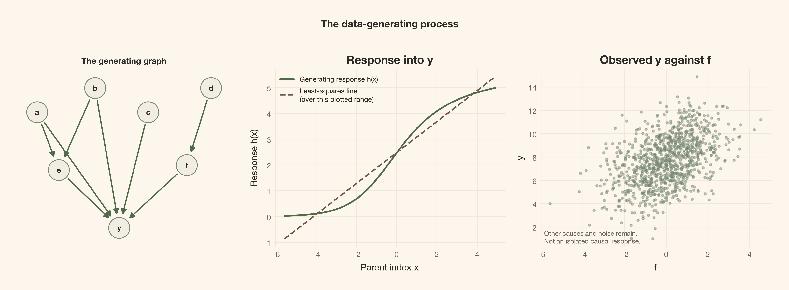
<figcaption>Figure 1: The generating world is linear upstream and nonlinear only at y. The middle panel is the Michaelis–Menten response after softplus, not the fitted finite dictionary. The scatter of y against f is an observational association, not an isolated intervention curve.</figcaption>
</figure>

There is already a limit that no sampler can repair. Reverse only d\rightarrow f and use

f=\sqrt{1.81}\\\tilde\varepsilon_f,\qquad d=\frac{0.9}{1.81}f+\tilde\eta, \qquad \tilde\eta\sim\mathcal N(0,1/1.81)

with independent errors, leaving every other equation unchanged. Both worlds have the same centered joint Gaussian law of (d,f), with covariance

\Sigma\_{df}=\begin{pmatrix}1&0.9\\0.9&1.81\end{pmatrix}.

They therefore share p(d,f) and the unchanged conditional law p(y\mid a,b,c,e,f), as well as the other factors. Their **full observational distributions are equal**. In the generating world, intervening on d moves f and then y; in the twin, f is a root and y does not change.

This Gaussian reversal remains available despite the nonlinear outcome. Nonlinear additive-noise identification can help under further conditions ([Peters et al., 2014](https://jmlr.org/papers/v15/peters14a.html)), but it does not identify this reversible Gaussian pair. The posterior can assign unequal weights to the two orientations through its parameter priors. A well-computed probability split is not observational identification.

# A graph probability requires a proper mechanism score

What quantity should update a graph’s prior weight? Not its best-fit likelihood. Bayes’ rule requires the likelihood averaged over the **parameter prior**:

p(G\mid D,K)\propto p(D\mid G)\\\pi(G\mid K),\qquad p(D\mid G)=\int p(D\mid G,\theta_G)\\p(\theta_G\mid G)\\d\theta_G.

A larger parent set can fit more patterns, but its evidence also averages over more possible coefficient values. A proper prior makes this comparison defined. We choose conjugacy so that this integral can be evaluated, rather than estimated separately for every graph.

## The fixed dictionary is nonlinear in inputs, not in coefficients

For each potential parent j, define z_j=(X_j-\mathrm{loc}\_j)/\mathrm{scale}\_j. A linear child uses \phi_i(z_j)=\[z_j\]. Only child y gets

\phi_y(z_j)=\left\[ z_j,\\ \exp\\\left\\-\tfrac12\left(\frac{z_j-c_1}{w}\right)^2\right\\,\ldots, \exp\\\left\\-\tfrac12\left(\frac{z_j-c_K}{w}\right)^2\right\\ \right\],

with baseline centers (-1,1) and width 1.5. Each candidate mechanism is

X_i=\alpha_i+\sum\_{j\in\mathrm{Pa}\_i(G)}\beta\_{ij}^{\mathsf T}\phi_i(z_j)+\varepsilon_i.

The dictionary is **child-specific and fixed before scoring**. No graph gets its own fitted centers or sample centering. Each parent contributes one upstream column or three outcome columns, plus one intercept per mechanism. The model has no within-mechanism parent interactions.

The true h is not in this finite dictionary. Upstream generating equations are in the linear families, but the outcome is approximated. “Exact evidence” below means exact integration **for the approximating family**, not an exact Michaelis–Menten likelihood or guaranteed saturating extrapolation.

## Completing the square gives the full integrated evidence

Take one child i and candidate parent set P, ordered by node index. Let t=x_i\in\mathbb R^N be its raw target vector and A\in\mathbb R^{N\times p} the design matrix: an intercept followed by the selected parents’ feature blocks. With v=\sigma_i^2, the normalized likelihood and prior are

\begin{aligned} p(t\mid A,\theta,v)&=(2\pi v)^{-N/2} \exp\\\left\[-\frac{\lVert t-A\theta\rVert^2}{2v}\right\],\\ p(\theta\mid v)&=(2\pi v)^{-p/2}\|\Lambda_0\|^{1/2} \exp\\\left\[-\frac{\theta^{\mathsf T}\Lambda_0\theta}{2v}\right\],\\ p(v)&=\frac{\beta\_{0i}^{\alpha_0}}{\Gamma(\alpha_0)} v^{-\alpha_0-1}\exp(-\beta\_{0i}/v), \qquad \Lambda_0=\operatorname{diag}(\tau_0,\lambda,\ldots,\lambda). \end{aligned}

This states the inverse-gamma **shape/scale convention** and the zero-mean normal prior explicitly. All mechanisms have independent priors conditional on G. The baseline uses \tau_0=0.01, \lambda=0.1, \alpha_0=2, and \beta\_{0i}=1 for every node.

To integrate the coefficients, define

\Lambda_N=\Lambda_0+A^{\mathsf T}A,\qquad m_N=\Lambda_N^{-1}A^{\mathsf T}t,\qquad a_N=\alpha_0+\frac N2,

and complete the square:

\lVert t-A\theta\rVert^2+\theta^{\mathsf T}\Lambda_0\theta =(\theta-m_N)^{\mathsf T}\Lambda_N(\theta-m_N) +\lVert t-Am_N\rVert^2+m_N^{\mathsf T}\Lambda_0m_N.

Thus

b_N=\beta\_{0i}+\frac12\left( \lVert t-Am_N\rVert^2+m_N^{\mathsf T}\Lambda_0m_N\right).

The Gaussian integral contributes (2\pi v)^{p/2}\|\Lambda_N\|^{-1/2}. The remaining variance integral is

\int_0^\infty v^{-a_N-1}e^{-b_N/v}\\dv =\Gamma(a_N)b_N^{-a_N}.

Combining the constants gives the local evidence, including its absolute normalization:

\boxed{\\ \begin{aligned} \log p(t\mid A)={}&-\frac N2\log(2\pi) +\frac12\left(\log\|\Lambda_0\|-\log\|\Lambda_N\|\right)\\ &+\alpha_0\log\beta\_{0i}-a_N\log b_N +\log\Gamma(a_N)-\log\Gamma(\alpha_0). \end{aligned}\\}

The same calculation yields v\mid D,P\sim\operatorname{IG}(a_N,b_N) and \theta\mid v,D,P\sim\mathcal N(m_N,v\Lambda_N^{-1}). We use Cholesky solves, not an explicit matrix inverse. The residual-plus-prior expression for b_N avoids subtracting nearly equal quadratic forms.

With independent mechanism priors, the full DAG evidence factors over its local families:

\log p(D\mid G)=\sum_i\log p(x_i\mid x\_{\mathrm{Pa}\_i(G)}).

At N=0, \Lambda_N=\Lambda_0, m_N=0, a_N=\alpha_0, and b_N=\beta\_{0i}. Every local log evidence is exactly zero and the parameter posterior is its prior. We will use this identity to sample the graph prior itself.

## Raw targets make the unit convention part of the model

There is no Jacobian in the predictor feature map: the likelihood density is evaluated on raw targets, and the conditioning-variable transform was fixed before scoring. Locations and scales use raw predictor units; the resulting z, centers, and width are dimensionless. Under the conditional-v coefficient prior, \tau_0, \lambda, and \alpha_0 are dimensionless, while \beta\_{0i} has **squared target units**.

A coherent positive unit change X_i'=c_iX_i requires

\beta\_{0i}'=c_i^2\beta\_{0i},\qquad \mathrm{loc}\_j'=c_j\mathrm{loc}\_j,\qquad \mathrm{scale}\_j'=c_j\mathrm{scale}\_j.

Then predictor features stay the same, v_i'=c_i^2v_i, and the coefficients including the intercept scale by c_i. Absolute graph log evidence changes by the density factor -N\sum_i\log c_i, which is common to every graph. Relative graph weights remain unchanged. Keeping \beta_0=1 after changing target units would instead change the prior and the graph posterior.

Translation needs more than a new predictor location. Under X_i'=c_iX_i+r_i, the coherent intercept prior has mean r_i, not zero. This implementation fixes that mean at zero. Updating only locations and scales does **not** make a translated analysis the same model. Standardizing or centering a target while retaining the original zero-mean intercept prior is a scientific change, not harmless preprocessing.

A variance mean is not a standard-deviation mean

The baseline \operatorname{IG}(2,1) variance prior has mean 1 and infinite variance. It does not imply \mathbb E\[\sigma\]=1: \mathbb E\[\sqrt v\]=\sqrt{\beta_0}\\\Gamma(\alpha_0-1/2)/\Gamma(\alpha_0). The unit variance mean matches this synthetic generator by design; it is not a transferable default for every measured variable.

## The score table subtracts a constant, not an Occam penalty

For efficient lookup, `BasisScore.table[i, P]` stores

\ell_i(P)=\log p(x_i\mid x_P)-\log p(x_i\mid P=\varnothing).

Summing these entries subtracts C(D)=\sum_i\log p(x_i\mid\varnothing) from every graph’s absolute log evidence. The constant cancels in posterior weights and Metropolis ratios. It does not remove the determinant and prior-volume terms from the proper evidence. `score.graph_score` retains the absolute sum when that is needed.

``` sourceCode
score = build_score(data)
linear_score = BasisScore(
    data, nonlinear_nodes=(), centers=(), width=width,
    loc=loc, scale=scale, tau0=tau0, lam=lam, alpha0=alpha0, beta0=beta0,
)
print(f"Upstream: linear; y: 1 linear term + {len(centers)} bumps per parent")
print("The comparator drops only y's bumps; all parameter-prior hyperparameters stay fixed.")
```

    Upstream: linear; y: 1 linear term + 2 bumps per parent
    The comparator drops only y's bumps; all parameter-prior hyperparameters stay fixed.

The comparator will ask what changes when only the outcome dictionary changes. A few local entries first make the relative-score convention concrete. They are log density ratios with no units; even poor candidate families have finite scores.

Relative evidence for selected outcome families

``` sourceCode
family_masks = {
    "no parents": 0,
    "a only": 1 << 0,
    "d only": 1 << d_index,
    "f only": 1 << f_index,
    "a, b, c, e, f (generating)": 55,
    "all six candidates": (1 << n_nodes) - 1 - (1 << y_index),
}
local_rows = [
    {
        "Parents of y": name,
        "Nonlinear dictionary": score.table[y_index, mask],
        "Linear dictionary": linear_score.table[y_index, mask],
    }
    for name, mask in family_masks.items()
]
display(article_table(
    pd.DataFrame(local_rows),
    "Local evidence of y's families, relative to the intercept-only family",
    formats={"Nonlinear dictionary": "{:.2f}", "Linear dictionary": "{:.2f}"},
))
```

<figure class="quarto-float quarto-float-tbl figure">
<table id="T_761a9" class="caption-top table table-sm table-striped small" data-quarto-postprocess="true">
<thead>
<tr class="header">
<th id="T_761a9_level0_col0" class="col_heading level0 col0" data-quarto-table-cell-role="th">Parents of y</th>
<th id="T_761a9_level0_col1" class="col_heading level0 col1" data-quarto-table-cell-role="th">Nonlinear dictionary</th>
<th id="T_761a9_level0_col2" class="col_heading level0 col2" data-quarto-table-cell-role="th">Linear dictionary</th>
</tr>
</thead>
<tbody>
<tr class="odd">
<td id="T_761a9_row0_col0" class="data row0 col0">no parents</td>
<td id="T_761a9_row0_col1" class="data row0 col1">0.00</td>
<td id="T_761a9_row0_col2" class="data row0 col2">0.00</td>
</tr>
<tr class="even">
<td id="T_761a9_row1_col0" class="data row1 col0">a only</td>
<td id="T_761a9_row1_col1" class="data row1 col1">142.98</td>
<td id="T_761a9_row1_col2" class="data row1 col2">146.17</td>
</tr>
<tr class="odd">
<td id="T_761a9_row2_col0" class="data row2 col0">d only</td>
<td id="T_761a9_row2_col1" class="data row2 col1">40.91</td>
<td id="T_761a9_row2_col2" class="data row2 col2">45.57</td>
</tr>
<tr class="even">
<td id="T_761a9_row3_col0" class="data row3 col0">f only</td>
<td id="T_761a9_row3_col1" class="data row3 col1">111.75</td>
<td id="T_761a9_row3_col2" class="data row3 col2">113.54</td>
</tr>
<tr class="odd">
<td id="T_761a9_row4_col0" class="data row4 col0">a, b, c, e, f (generating)</td>
<td id="T_761a9_row4_col1" class="data row4 col1">731.36</td>
<td id="T_761a9_row4_col2" class="data row4 col2">714.63</td>
</tr>
<tr class="even">
<td id="T_761a9_row5_col0" class="data row5 col0">all six candidates</td>
<td id="T_761a9_row5_col1" class="data row5 col1">723.56</td>
<td id="T_761a9_row5_col2" class="data row5 col2">710.59</td>
</tr>
</tbody>
</table>
<figcaption>Table 1: Local evidence of y's families, relative to the intercept-only family</figcaption>
</figure>

This construction is **not guaranteed score-equivalent**. Markov-equivalent DAGs need not receive equal integrated evidence. A CPDAG groups conditional-independence structure, not arbitrary nonlinear likelihood families or independently specified parameter priors. The classical score-equivalent Gaussian construction of [Geiger and Heckerman](https://www.microsoft.com/en-us/research/publication/learning-gaussian-networks/) and its [corrected scoring treatment](https://doi.org/10.1214/14-AOS1217) will appear only in an independent oracle, not as this article’s model.

# Hard support and local beliefs are different prior decisions

For each unordered pair (i,j), with i\<j, the state is absent, forward (i\rightarrow j), or backward (j\rightarrow i). A source-by-target direction matrix P supplies the unmasked local weights

q\_{ij}=\big\[1-P\_{ij}-P\_{ji},\\P\_{ij},\\P\_{ji}\big\].

Before restrictions, P\_{ij}=(1-\delta\_{ij})/3, so each pair has (1/3,1/3,1/3). The baseline mask prohibits self arrows and **every outgoing arrow from y**. After masking and renormalizing, a core pair still has three equal weights; a pair incident to y has probability 1/2 for absence and 1/2 for the incoming arrow.

The full graph prior is

\pi(G\mid K)\propto \mathbf 1\\G\text{ is acyclic and respects }K\\ \prod\_{i\<j}q\_{ij}\big(s\_{ij}(G)\big).

The q\_{ij} are **local pair probabilities before conditioning on acyclicity**, not the DAG prior’s marginal arrow probabilities. Global acyclicity couples the core pairs. A hard zero removes a graph from support; a small positive weight only discourages it.

``` sourceCode
direction_prior = pd.DataFrame(
    (1 - np.eye(n_nodes)) / 3, index=labels, columns=labels,
)
allowed = pd.DataFrame(
    ~np.eye(n_nodes, dtype=bool), index=labels, columns=labels,
)
allowed.loc["y", :] = False
baseline_probs = pair_probabilities(
    direction_prior.to_numpy(), allowed.to_numpy(),
)
```

The terminal-outcome rule is background knowledge, not a discovery from correlations. It is true in this generator, but we have not supplied y’s five parents, the direction of d–f, or any other generating edge. The baseline here does **not** include a media-to-calendar restriction.

Code

``` sourceCode
fig_prior, fig_support = plot_graph_prior(
    direction_prior.to_numpy(), allowed.to_numpy(), labels,
)
plt.show()
```

<figure class="quarto-float quarto-float-fig figure">
<figure class="quarto-float quarto-subfloat-fig figure">

<figcaption>(a) Local directional prior</figcaption>
</figure>
<figure class="quarto-float quarto-subfloat-fig figure">

<figcaption>(b) Hard restrictions</figcaption>
</figure>
<figcaption>Figure 2: The graph prior has two layers: local directional probabilities before masking, and hard restrictions. Rows are sources and columns are targets. Hatching marks impossible self arrows. Conditioning on acyclicity is an additional global step, so these cells are not DAG-prior marginals.</figcaption>
</figure>

# One terminal node separates 64 exact weights from the search

Can we eliminate part of the graph search without fixing its answer? Here we can, because the prior and the score have a specific factorization.

Let G_c=G\_{-y} be the six-node core and P_y the parents of y. No directed cycle can pass through y when it has no outgoing arrows. Any subset of the other six nodes can therefore enter y, regardless of the acyclic core graph. In addition:

1.  the pair-factorized graph prior separates into core and terminal-incident factors;
2.  the evidence is a sum of local scores, with no shared mechanism parameters;
3.  the fixed score \ell_y(P_y) depends on the observed parent columns, not on how their own arrows are oriented.

Together these facts give the unnormalized factorization

\begin{aligned} p(G_c,P_y\mid D,K)\propto{}& \underbrace{\mathbf 1\\G_c\text{ acyclic}\\\\ e^{\sum\_{i\ne y}\ell_i(\mathrm{Pa}\_i(G_c))} \prod\_{i\<j,\\ i,j\ne y}q\_{ij}(s\_{ij})}\_{\text{core factor}}\\ &\times \underbrace{e^{\ell_y(P_y)} \prod\_{j\ne y}q\_{jy}\big(s\_{jy}(P_y)\big)}\_{\text{terminal factor}}. \end{aligned}

After separate normalization,

p(G_c,P_y\mid D,K)=p(G_c\mid D,K)\\p(P_y\mid D,K),

and the terminal weights are

w(P_y)=\frac{\exp\\\ell_y(P_y)\\\prod\_{j\ne y}q\_{jy}(s\_{jy}(P_y))} {\sum\_{P\subseteq\\a,b,c,d,e,f\\} \exp\\\ell_y(P)\\\prod\_{j\ne y}q\_{jy}(s\_{jy}(P))}.

All 2^6=64 parent sets have support in this baseline. Their pair-prior product is the same (1/2)^6, although their evidence is not. We normalize these 64 weights exactly. MCMC is left with the core; an independent terminal-parent draw reconstructs a complete seven-node DAG after each retained cold update.

``` sourceCode
terminal_posteriors = terminal_parent_distributions(score.table, pairs, baseline_probs)
masks, weights = terminal_posteriors[y_index]
print(f"Exactly normalized outcome-parent sets: {len(masks)}")
print(f"Their weights sum to {weights.sum():.12f}")
```

    Exactly normalized outcome-parent sets: 64
    Their weights sum to 1.000000000000

This also explains the controlled linear comparator analytically. Dropping only y’s bumps changes the terminal factor but none of the core local scores or core-prior factors. The **core posterior is unchanged**. Its separately sampled frequencies can differ through Monte Carlo error, but its target cannot change under this factorization. More expressive outcome features do not provide a new route to identifying d–f.

> **Would any outcome-terminal model separate this way?** No. A graph prior that couples terminal parents to core structure, shared mechanism parameters, or graph-specific fitted dictionaries could break this argument. Allowing an outgoing arrow from y would also couple its parents to the cycle constraint. Terminal status alone is not sufficient.

## The remaining search is smaller, not small by default

There are 1,138,779,265 labeled DAGs on seven nodes. We count them through the sink-set recurrence, rather than enumerate them. If A_n is the number of labeled DAGs and A_0=1,

A_n=\sum\_{k=1}^n(-1)^{k+1}\binom nk\\2^{k(n-k)}A\_{n-k}.

Our mask leaves the six-node core unrestricted, so the number of admissible full DAGs is A_6\times64. The local evidence table need not enumerate those full graphs.

Count graph and local-family search spaces

``` sourceCode
dag_counts = [1]
for size in range(1, n_nodes + 1):
    dag_counts.append(sum(
        (-1) ** (sinks + 1) * comb(size, sinks)
        * 2 ** (sinks * (size - sinks)) * dag_counts[size - sinks]
        for sinks in range(1, size + 1)
    ))
core_nodes = n_nodes - len(terminal_posteriors)
terminal_combinations = prod(len(node_masks) for node_masks, _ in terminal_posteriors.values())
space = pd.DataFrame({
    "Quantity": [
        "Admissible full DAGs", "DAG states left to MCMC",
        "Pairs in MCMC proposals", "Admissible local parent sets",
    ],
    "Unrestricted": [
        dag_counts[n_nodes], dag_counts[n_nodes],
        len(pairs), n_nodes * 2 ** (n_nodes - 1),
    ],
    "Mask + terminal reduction": [
        dag_counts[core_nodes] * terminal_combinations, dag_counts[core_nodes],
        len(pairs_for(core_nodes)), sum(2 ** int(count) for count in allowed.sum(axis=0)),
    ],
})
display(article_table(
    space, "Search-space sizes for this mask, not measured runtime speedups",
    formats={"Unrestricted": "{:,.0f}", "Mask + terminal reduction": "{:,.0f}"},
))
```

<figure class="quarto-float quarto-float-tbl figure">
<table id="T_36b02" class="caption-top table table-sm table-striped small" data-quarto-postprocess="true">
<thead>
<tr class="header">
<th id="T_36b02_level0_col0" class="col_heading level0 col0" data-quarto-table-cell-role="th">Quantity</th>
<th id="T_36b02_level0_col1" class="col_heading level0 col1" data-quarto-table-cell-role="th">Unrestricted</th>
<th id="T_36b02_level0_col2" class="col_heading level0 col2" data-quarto-table-cell-role="th">Mask + terminal reduction</th>
</tr>
</thead>
<tbody>
<tr class="odd">
<td id="T_36b02_row0_col0" class="data row0 col0">Admissible full DAGs</td>
<td id="T_36b02_row0_col1" class="data row0 col1">1,138,779,265</td>
<td id="T_36b02_row0_col2" class="data row0 col2">242,016,192</td>
</tr>
<tr class="even">
<td id="T_36b02_row1_col0" class="data row1 col0">DAG states left to MCMC</td>
<td id="T_36b02_row1_col1" class="data row1 col1">1,138,779,265</td>
<td id="T_36b02_row1_col2" class="data row1 col2">3,781,503</td>
</tr>
<tr class="odd">
<td id="T_36b02_row2_col0" class="data row2 col0">Pairs in MCMC proposals</td>
<td id="T_36b02_row2_col1" class="data row2 col1">21</td>
<td id="T_36b02_row2_col2" class="data row2 col2">15</td>
</tr>
<tr class="even">
<td id="T_36b02_row3_col0" class="data row3 col0">Admissible local parent sets</td>
<td id="T_36b02_row3_col1" class="data row3 col1">448</td>
<td id="T_36b02_row3_col2" class="data row3 col2">256</td>
</tr>
</tbody>
</table>
<figcaption>Table 2: Search-space sizes for this mask, not measured runtime speedups</figcaption>
</figure>

Without restrictions there are n2^{n-1} valid local parent families. The implementation uses a padded node-by-2^n array, including unused self-parent slots. Family construction also costs design-matrix operations whose size depends on the dictionary and parent count. The exponential local-table growth, not the integer code’s maximum, is the practical scaling limit. These counts are not a benchmark or a guarantee for larger graphs.

# PyMC holds the target; a discrete kernel moves through it

## The inspectable model is one graph shared by one dataset

`pymc.dims` makes dimension names part of tensor operations. Ordinary PyTensor indexing first maps the categorical pair states into an adjacency matrix; we then name its axes `parent` and `child`. Named `.isel(mask=parents)` looks up every child’s score. Transitive closure checks for a cycle.

We display the **actual shared implementation**, not a second definition that might diverge from the executed model.

``` sourceCode
display(Code(inspect.getsource(make_graph_model), language="python"))
```

    def make_graph_model(score, pair_probs, labels):
        """One dataset, one unknown DAG; mechanisms are integrated out."""
        pairs = pairs_for(len(labels))
        coords = {
            "node": labels, "parent": labels, "child": labels,
            "pair": [f"{labels[i]}–{labels[j]}" for i, j in pairs],
            "state": ["absent", "forward", "backward"],
            "mask": np.arange(2 ** len(labels)),
        }
        with pm.Model(coords=coords) as model:
            probabilities = pmd.as_xtensor(pair_probs, dims=("pair", "state"))
            initial = initial_states(
                pair_probs, pairs, len(labels), np.random.default_rng(0), empty=True,
            )
            edge = pmd.Categorical("edge", p=probabilities, core_dims="state", initval=initial)
            i, j = pairs.T
            state = edge.values
            adjacency = pt.zeros((len(labels), len(labels)), dtype="int64")
            adjacency = pt.set_subtensor(adjacency[i, j], pt.eq(state, 1))
            adjacency = pt.set_subtensor(adjacency[j, i], pt.eq(state, 2))
            adjacency = pmd.as_xtensor(adjacency, dims=("parent", "child"))
            bits = pmd.as_xtensor(1 << np.arange(len(labels)), dims=("parent",))
            parents = (adjacency * bits).sum("parent").rename({"child": "node"})
            local_score = pmd.as_xtensor(score.table, dims=("node", "mask"))
            evidence = local_score.isel(mask=parents).sum("node")
            reach = adjacency.astype("bool")
            for k in range(len(labels)):
                reach = reach | (reach.isel(child=k) & reach.isel(parent=k))
            diagonal = pmd.as_xtensor(np.eye(len(labels), dtype=bool), dims=("parent", "child"))
            cycle = (reach & diagonal).any()
            pmd.Potential("dag_support", ptx.where(cycle, -np.inf, 0.0))
            pmd.Potential("marginal_likelihood", evidence)
            pmd.Deterministic("log_evidence", evidence)
            pmd.Deterministic("edge_count", ptx.math.neq(edge, 0).sum("pair"))
        return model

The categorical prior supplies local state weights and zero support. `dag_support` rejects directed cycles. `marginal_likelihood` adds the collapsed score for the whole dataset. `log_evidence` records the table-relative log evidence; `edge_count` records graph size. Coefficients and noise variances are absent because we integrated them out, and the observations enter through the score table rather than a row-level observed variable.

<a href="#fig-pymc-graph-model" class="quarto-xref">Figure 3</a> is the dependency graph of this **probabilistic program**, not a causal DAG on a through y.

Code

``` sourceCode
graph_model = make_graph_model(score, baseline_probs, labels)
model_graph = pm.model_to_graphviz(graph_model)
model_graph.graph_attr.update(
    bgcolor=COLORS["bg"], fontname="Inter, Helvetica, Arial, sans-serif",
    fontcolor=COLORS["ink"], color=COLORS["primary"],
)
model_graph.node_attr.update(
    fontname="Inter, Helvetica, Arial, sans-serif", fontcolor=COLORS["ink"],
    color=COLORS["primary"], fillcolor=COLORS["surface_alt"],
)
model_graph.edge_attr.update(color=COLORS["green_strong"])
model_graph
```

<figure class="quarto-float quarto-float-fig figure">
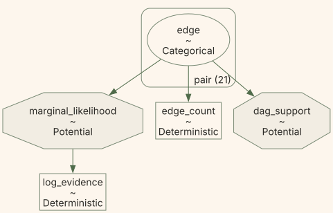
<figcaption>Figure 3: One categorical vector represents the unknown graph. PyMC’s dependency graph exposes the support constraint, collapsed likelihood, and summaries; its arrows are program dependencies, not causal claims about the seven measured variables.</figcaption>
</figure>

## Rejected and cyclic proposals are part of the chain

NUTS cannot traverse discrete graph states. Our Numba-compiled Metropolis kernel chooses a mutable core pair uniformly and draws uniformly from **all supported states of that pair, including its current state**. Including the current state prevents deterministic alternation when a pair has only two supported states.

For fixed pair support, the proposal is symmetric. At the posterior temperature its acceptance probability is

\min\\\left\[1, \exp\left\\L_c(G_c')-L_c(G_c) +\log\pi_c(G_c')-\log\pi_c(G_c)\right\\\right\],

where L_c is the sum of the core-node local scores. A self-proposal leaves the state unchanged. A cyclic proposal also leaves it unchanged: we do **not** redraw until an acyclic graph appears. A rejected legal proposal is retained as another self-transition. Keeping only accepted graphs, or repeatedly redrawing cyclic proposals without a proposal correction, would target the wrong distribution.

A sweep makes as many pair-update attempts as there are active core pairs, choosing with replacement. Terminal-incident pairs and single-supported-state pairs are not proposed. Concrete initial graphs and mutable sampler arrays remain NumPy arrays; the target itself is symbolic.

## Tempering changes likelihood weight, not causal assumptions

Local graph moves can cross low-probability intermediate states. Parallel tempering uses replicas with target

\pi\_\beta(G_c\mid D,K)\propto \exp\\\beta L_c(G_c)\\\\\pi_c(G_c\mid K), \qquad 0\le\beta\le1.

The **graph prior is untempered**. The likelihood is the core-node score sum; we do not refit a six-variable prior or recompute predictor scales. Terminal-parent normalizers depend on \beta but not on G_c, so they cancel from neighboring swap ratios. For cold-side and hot-side states G_c and H_c, that ratio is

\exp\\(\beta-\beta')\\\[L_c(H_c)-L_c(G_c)\]\\.

Only the \beta=1 replica supplies posterior core draws. Each is combined with a fresh draw from the exact **\beta=1** terminal distribution. A hot graph is not another posterior observation. The fixed ladder has 15 geometrically spaced values from 1 to 0.002 followed by 0; it does not adapt.

The shared fit function exposes both the discrete Metropolis step and the PyMC call it drives:

``` sourceCode
display(Code(inspect.getsource(fit_graphs), language="python"))
```

    def fit_graphs(score, probabilities, labels, *, seed, draws, tune, betas, chains=4):
        """Sample unresolved core directions and reconstruct full posterior DAGs."""
        local_pairs = pairs_for(len(labels))
        starts_rng = np.random.default_rng(seed)
        starts = [
            {"edge": initial_states(
                probabilities, local_pairs, len(labels), starts_rng, empty=(chain == 0),
            )}
            for chain in range(chains)
        ]
        with make_graph_model(score, probabilities, labels) as model:
            step = TemperedGraphStep(
                [model["edge"]], score.table, local_pairs, probabilities, betas,
            )
            return pm.sample(
                draws=draws, tune=tune, chains=chains, cores=1,
                step=step, initvals=starts, random_seed=seed,
                progressbar=False, compute_convergence_checks=False,
            )

The first chain starts at an empty supported graph; the other starts use random topological ranks to construct supported DAGs. They are independent initializations, **not draws from the masked acyclic graph prior**. Warmup is discarded. Later we sample that prior using zero data, rather than relabeling the initial graphs as prior draws.

``` sourceCode
posterior = fit_graphs(
    score, baseline_probs, labels,
    seed=SAMPLING_SEED, draws=draws, tune=tune, betas=betas, chains=chains,
)
linear_posterior = fit_graphs(
    linear_score, baseline_probs, labels,
    seed=SAMPLING_SEED, draws=draws, tune=tune, betas=betas, chains=chains,
)
```

# Diagnose the graph questions before interpreting graph weights

Our Bayesian target is now explicit. The next question is computational: do independent chains give similar answers **under this model**? Combining incompatible runs can hide poor exploration.

Averaging the pair codes 0, 1, and 2 is not an edge probability; the codes are category labels. Instead, every retained graph becomes binary answers to questions such as:

- Is it in the generating graph’s Markov-equivalence class?
- Is there a directed path from d to y?
- Does it contain d\rightarrow f? Does it contain f\rightarrow d?

The generating-class question is available only because this is a synthetic experiment. A directed path describes structural reachability, not effect size. Class membership is determined by skeleton and unshielded colliders, following the [Verma–Pearl characterization](https://ftp.cs.ucla.edu/pub/stat_ser/R150.pdf).

`graph_summary` classifies each distinct DAG once, then maps the results back to **every draw in its original chain order**. Diagnosing only unique DAGs would remove both their frequencies and their autocorrelation. ArviZ supplies the diagnostics; our code supplies their targets.

``` sourceCode
summary = graph_summary(posterior, pairs, n_nodes, truth_key, d_index, y_index)
diagnostic_data = graph_diagnostic_data(posterior, summary, baseline_probs, labels, pairs)
diagnostics = azs.summary(diagnostic_data, ci_prob=0.95, round_to="none")
```

## Agreement on events is evidence, not a convergence certificate

<a href="#fig-graph-diagnostics" class="quarto-xref">Figure 4</a> compares four chains on three consequential questions. Its bars are two per-chain Monte Carlo standard errors, not posterior intervals for a causal effect. When a chain’s indicator is constant, its error is not estimable; we do not draw a zero-width bar and call it certainty.

Code

``` sourceCode
df_row = next(k for k, pair in enumerate(pairs) if tuple(pair) == (d_index, f_index))
diagnostic_events = [
    ("Generating graph's class", summary["true_class"]),
    ("A directed path from d to y", summary["path"]),
    ("An arrow from d to f", summary["states"][..., df_row] == 1),
]
chain_colors = [PALETTE[i] for i in (0, 3, 4, 5)]
chain_markers = ("o", "s", "^", "D")
chain_styles = ("-", "--", "-.", ":")
fig, axes = plt.subplots(3, 1, figsize=(5, 6.5), sharex=True, layout="constrained")
for ax, (title, event) in zip(axes, diagnostic_events):
    for chain in range(chains):
        values = event[chain:chain + 1].astype(float)
        if np.ptp(values) == 0:
            ax.text(
                0.5, chain + 1, "Constant in this chain: error not estimable",
                transform=ax.get_yaxis_transform(), ha="center", fontsize=9,
            )
            continue
        probability = float(values.mean())
        mcse = float(azs.mcse(values))
        ax.errorbar(
            probability, chain + 1, xerr=2 * mcse,
            fmt=chain_markers[chain], color=chain_colors[chain],
            capsize=3, markersize=6,
        )
        ax.annotate(
            f"{probability:.1%}", (probability, chain + 1),
            xytext=(12, 0), textcoords="offset points", va="center", fontsize=12,
        )
    ax.set(
        title=title, yticks=range(1, chains + 1),
        yticklabels=[f"Chain {i + 1}" for i in range(chains)],
        ylim=(chains + 0.6, 0.4), xlim=(0, 1), xticks=np.linspace(0, 1, 5),
    )
    ax.tick_params(labelsize=11)
    ax.grid(False)
    ax.grid(axis="x", alpha=0.4)
axes[-1].set(
    xlabel="Estimated posterior probability",
    xticklabels=["0%", "25%", "50%", "75%", "100%"],
)
plt.show()
```

<figure class="quarto-float quarto-float-fig figure">

<figcaption>Figure 4: Four chains estimate the same three graph-event probabilities. Bars extend two per-chain Monte Carlo standard errors from ArviZ. Constant chains are explicitly marked as non-estimable. Agreement does not prove that every important graph was visited.</figcaption>
</figure>

Agreement on d\rightarrow f is especially instructive. It means the chains reproduce the model’s probability split, not that they identified the direction whose exact observational twin we already constructed.

## Running probabilities can expose drift that final averages hide

Each point in <a href="#fig-graph-running-probabilities" class="quarto-xref">Figure 5</a> uses all retained graphs up to that draw within one chain. Persistent drift or separated curves would challenge the estimate. Flat curves alone cannot rule out a common unvisited mode.

Code

``` sourceCode
fig, axes = plt.subplots(
    3, 1, figsize=(5, 7), sharex=True, sharey=True, layout="constrained",
)
for ax, (title, event) in zip(axes, diagnostic_events):
    retained = np.arange(1, event.shape[1] + 1)
    running = np.cumsum(event, axis=1) / retained
    for chain in range(chains):
        ax.plot(
            retained, running[chain], color=chain_colors[chain],
            linestyle=chain_styles[chain], lw=1.3, label=f"Chain {chain + 1}",
        )
    ax.set(
        title=title, ylabel="Probability", ylim=(0, 1),
        yticks=[0, 0.5, 1], yticklabels=["0%", "50%", "100%"],
    )
    ax.tick_params(labelsize=11)
    ax.grid(False)
    ax.grid(axis="y", alpha=0.4)
axes[0].legend(frameon=False, ncol=2, loc="lower right", fontsize=10)
axes[-1].set(
    xlabel="Retained draws in each chain", xlim=(0, retained[-1]),
    xticks=[0, 4000, 8000, 12000], xticklabels=["0", "4,000", "8,000", "12,000"],
)
plt.show()
```

<figure class="quarto-float quarto-float-fig figure">
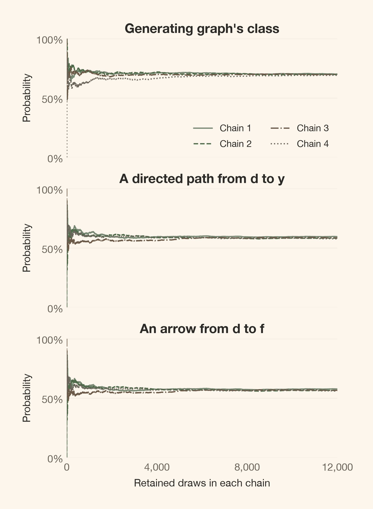
<figcaption>Figure 5: Running probabilities use every retained draw, separately for each chain. They show drift and between-chain separation on the monitored events, but do not bound posterior mass outside the visited region. Line styles distinguish chains as well as colors.</figcaption>
</figure>

## Simulation error has a different meaning from structural uncertainty

We monitor every varying pair-state indicator, membership in the four most frequent classes and the generating class, the d-to-y path, and varying arrow-count and log-evidence summaries.

- **Rank-normalized \widehat R** compares within-chain and between-chain variation. Values above 1.01 deserve investigation, not automatic acceptance or rejection of a scientific claim.
- **Bulk and tail ESS** account for correlated draws. Saving 48,000 graphs does not make them independent.
- **MCSE** estimates simulation error in a posterior summary. In the compact probability table, it is reported in percentage points, not as uncertainty about the true causal structure.

Event probabilities and their Monte Carlo error

``` sourceCode
event_rows = [
    ("Generating graph's class", "event[Generating class]"),
    ("A directed path from d to y", "event[d has a path to y]"),
    ("An arrow from d to f", "event[d→f]"),
    ("An arrow from f to d", "event[f→d]"),
]
probability_rows = []
for event_label, key in event_rows:
    if key not in diagnostics.index:
        probability_rows.append({
            "Graph question": event_label,
            "Probability": "Constant in retained draws", "MC error (pp)": "Not estimable",
        })
        continue
    row = diagnostics.loc[key]
    probability_rows.append({
        "Graph question": event_label, "Probability": f"{row['mean']:.1%}",
        "MC error (pp)": f"{100 * row['mcse_mean']:.2f}",
    })
display(article_table(
    pd.DataFrame(probability_rows),
    "Probability estimates and simulation error, not a test of causal assumptions",
))
event_mask = diagnostics.index.str.startswith("event[")
display(Markdown(
    f"Across **{int(event_mask.sum())} varying graph events** and the varying scalar summaries, "
    f"the largest $\\widehat R$ is **{diagnostics.r_hat.max():.4f}**; "
    f"the smallest bulk and tail ESS are **{diagnostics.ess_bulk.min():,.0f}** "
    f"and **{diagnostics.ess_tail.min():,.0f}**. "
    f"The largest event MC error is **"
    f"{100 * diagnostics.loc[event_mask, 'mcse_mean'].max():.2f} percentage points**."
))
```

<figure class="quarto-float quarto-float-tbl figure">
<table id="T_2aeee" class="caption-top table table-sm table-striped small" data-quarto-postprocess="true">
<thead>
<tr class="header">
<th id="T_2aeee_level0_col0" class="col_heading level0 col0" data-quarto-table-cell-role="th">Graph question</th>
<th id="T_2aeee_level0_col1" class="col_heading level0 col1" data-quarto-table-cell-role="th">Probability</th>
<th id="T_2aeee_level0_col2" class="col_heading level0 col2" data-quarto-table-cell-role="th">MC error (pp)</th>
</tr>
</thead>
<tbody>
<tr class="odd">
<td id="T_2aeee_row0_col0" class="data row0 col0">Generating graph's class</td>
<td id="T_2aeee_row0_col1" class="data row0 col1">69.8%</td>
<td id="T_2aeee_row0_col2" class="data row0 col2">0.40</td>
</tr>
<tr class="even">
<td id="T_2aeee_row1_col0" class="data row1 col0">A directed path from d to y</td>
<td id="T_2aeee_row1_col1" class="data row1 col1">58.6%</td>
<td id="T_2aeee_row1_col2" class="data row1 col2">0.35</td>
</tr>
<tr class="odd">
<td id="T_2aeee_row2_col0" class="data row2 col0">An arrow from d to f</td>
<td id="T_2aeee_row2_col1" class="data row2 col1">56.7%</td>
<td id="T_2aeee_row2_col2" class="data row2 col2">0.35</td>
</tr>
<tr class="even">
<td id="T_2aeee_row3_col0" class="data row3 col0">An arrow from f to d</td>
<td id="T_2aeee_row3_col1" class="data row3 col1">43.3%</td>
<td id="T_2aeee_row3_col2" class="data row3 col2">0.35</td>
</tr>
</tbody>
</table>
<figcaption>Table 3: Probability estimates and simulation error, not a test of causal assumptions</figcaption>
</figure>

Across **50 varying graph events** and the varying scalar summaries, the largest \widehat R is **1.0003**; the smallest bulk and tail ESS are **12,777** and **12,908**. The largest event MC error is **0.40 percentage points**.

These are estimates for monitored quantities, not a proof that every important graph region was visited. Constant indicators are not perfectly converged indicators. If these diagnostics are poor, increase computation on the **same data**; do not reroll the data seed to obtain a cleaner display.

Scalar traces, all diagnostics, and sampler movement

Similar evidence values do not imply similar graphs. The first 2,000 retained draws in <a href="#fig-graph-scalar-traces" class="quarto-xref">Figure 6</a> add a coarse check of fit and graph size; the running probabilities above use the full run.

Code

``` sourceCode
fig, axes = plt.subplots(2, 1, figsize=(8, 5), sharex=True, layout="constrained")
for chain in range(chains):
    for ax, variable in zip(axes, ("log_evidence", "edge_count")):
        ax.plot(
            posterior.posterior[variable].values[chain, :2000],
            alpha=0.6, lw=0.7, color=chain_colors[chain],
            linestyle=chain_styles[chain], label=f"Chain {chain + 1}",
        )
axes[0].set(title="Collapsed log evidence (table-relative)", ylabel="Log score")
axes[0].legend(frameon=False, ncol=4, fontsize=9)
axes[1].set(title="Number of arrows", ylabel="Arrows", xlabel="Retained draw")
plt.show()
```

<figure class="quarto-float quarto-float-fig figure">
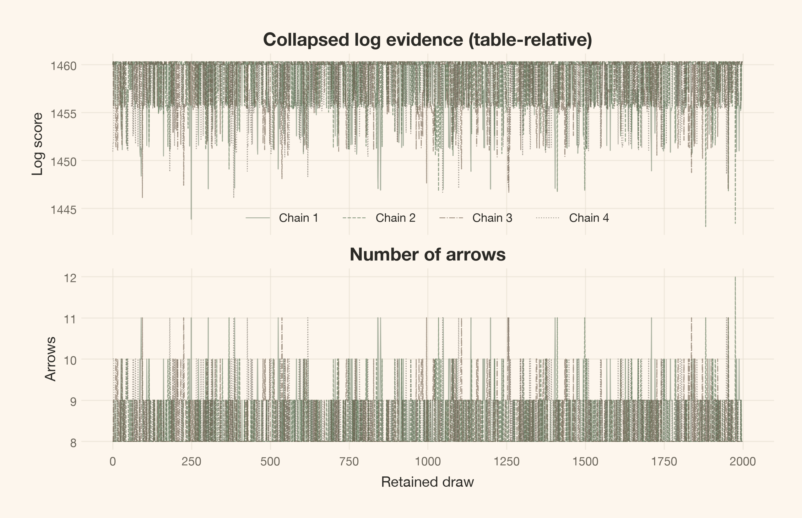
<figcaption>Figure 6: Table-relative log evidence and arrow-count traces add checks of movement across graph sizes and fit levels. Matching scalar traces cannot establish agreement on graph structure. Only the first two thousand retained draws are shown.</figcaption>
</figure>

The full table keeps native units: event means and errors are probabilities, arrow-count errors are in arrows, and evidence errors are in log-score units.

Full varying-quantity diagnostics and constant counts

``` sourceCode
display(article_table(
    diagnostics[["mean", "mcse_mean", "ess_bulk", "ess_tail", "r_hat"]]
    .rename(columns={
        "mean": "Mean", "mcse_mean": "MCSE", "ess_bulk": "Bulk ESS",
        "ess_tail": "Tail ESS", "r_hat": "R-hat",
    })
    .reset_index(names="Quantity"),
    "All varying graph-event and scalar diagnostics (native units)",
    formats={
        "Mean": "{:.4f}", "MCSE": "{:.4f}", "Bulk ESS": "{:,.0f}",
        "Tail ESS": "{:,.0f}", "R-hat": "{:.4f}",
    },
))
metadata = diagnostic_data["posterior"].attrs
display(Markdown(
    f"**{metadata['fixed_indicators']} indicators are fixed by pair support; "
    f"{metadata['other_constant_indicators']} other indicators are constant in the retained draws.** "
    "Their diagnostics are not estimable."
))
if metadata["constant_summaries"]:
    display(Markdown(
        f"Constant scalar summaries, also not diagnosable: {metadata['constant_summaries']}."
    ))
```

<figure class="quarto-float quarto-float-tbl figure">
<table id="T_235a0" class="caption-top table table-sm table-striped small" data-quarto-postprocess="true">
<thead>
<tr class="header">
<th id="T_235a0_level0_col0" class="col_heading level0 col0" data-quarto-table-cell-role="th">Quantity</th>
<th id="T_235a0_level0_col1" class="col_heading level0 col1" data-quarto-table-cell-role="th">Mean</th>
<th id="T_235a0_level0_col2" class="col_heading level0 col2" data-quarto-table-cell-role="th">MCSE</th>
<th id="T_235a0_level0_col3" class="col_heading level0 col3" data-quarto-table-cell-role="th">Bulk ESS</th>
<th id="T_235a0_level0_col4" class="col_heading level0 col4" data-quarto-table-cell-role="th">Tail ESS</th>
<th id="T_235a0_level0_col5" class="col_heading level0 col5" data-quarto-table-cell-role="th">R-hat</th>
</tr>
</thead>
<tbody>
<tr class="odd">
<td id="T_235a0_row0_col0" class="data row0 col0">event[a–b absent]</td>
<td id="T_235a0_row0_col1" class="data row0 col1">0.9575</td>
<td id="T_235a0_row0_col2" class="data row0 col2">0.0018</td>
<td id="T_235a0_row0_col3" class="data row0 col3">12,917</td>
<td id="T_235a0_row0_col4" class="data row0 col4">48,000</td>
<td id="T_235a0_row0_col5" class="data row0 col5">1.0002</td>
</tr>
<tr class="even">
<td id="T_235a0_row1_col0" class="data row1 col0">event[a→b]</td>
<td id="T_235a0_row1_col1" class="data row1 col1">0.0217</td>
<td id="T_235a0_row1_col2" class="data row1 col2">0.0011</td>
<td id="T_235a0_row1_col3" class="data row1 col3">18,447</td>
<td id="T_235a0_row1_col4" class="data row1 col4">18,447</td>
<td id="T_235a0_row1_col5" class="data row1 col5">1.0002</td>
</tr>
<tr class="odd">
<td id="T_235a0_row2_col0" class="data row2 col0">event[b→a]</td>
<td id="T_235a0_row2_col1" class="data row2 col1">0.0208</td>
<td id="T_235a0_row2_col2" class="data row2 col2">0.0011</td>
<td id="T_235a0_row2_col3" class="data row2 col3">16,515</td>
<td id="T_235a0_row2_col4" class="data row2 col4">16,515</td>
<td id="T_235a0_row2_col5" class="data row2 col5">1.0001</td>
</tr>
<tr class="even">
<td id="T_235a0_row3_col0" class="data row3 col0">event[a–c absent]</td>
<td id="T_235a0_row3_col1" class="data row3 col1">0.9678</td>
<td id="T_235a0_row3_col2" class="data row3 col2">0.0013</td>
<td id="T_235a0_row3_col3" class="data row3 col3">19,705</td>
<td id="T_235a0_row3_col4" class="data row3 col4">48,000</td>
<td id="T_235a0_row3_col5" class="data row3 col5">1.0001</td>
</tr>
<tr class="odd">
<td id="T_235a0_row4_col0" class="data row4 col0">event[a→c]</td>
<td id="T_235a0_row4_col1" class="data row4 col1">0.0158</td>
<td id="T_235a0_row4_col2" class="data row4 col2">0.0008</td>
<td id="T_235a0_row4_col3" class="data row4 col3">24,035</td>
<td id="T_235a0_row4_col4" class="data row4 col4">24,035</td>
<td id="T_235a0_row4_col5" class="data row4 col5">1.0002</td>
</tr>
<tr class="even">
<td id="T_235a0_row5_col0" class="data row5 col0">event[c→a]</td>
<td id="T_235a0_row5_col1" class="data row5 col1">0.0164</td>
<td id="T_235a0_row5_col2" class="data row5 col2">0.0008</td>
<td id="T_235a0_row5_col3" class="data row5 col3">26,034</td>
<td id="T_235a0_row5_col4" class="data row5 col4">26,034</td>
<td id="T_235a0_row5_col5" class="data row5 col5">1.0000</td>
</tr>
<tr class="odd">
<td id="T_235a0_row6_col0" class="data row6 col0">event[a–d absent]</td>
<td id="T_235a0_row6_col1" class="data row6 col1">0.9782</td>
<td id="T_235a0_row6_col2" class="data row6 col2">0.0010</td>
<td id="T_235a0_row6_col3" class="data row6 col3">20,410</td>
<td id="T_235a0_row6_col4" class="data row6 col4">48,000</td>
<td id="T_235a0_row6_col5" class="data row6 col5">1.0001</td>
</tr>
<tr class="even">
<td id="T_235a0_row7_col0" class="data row7 col0">event[a→d]</td>
<td id="T_235a0_row7_col1" class="data row7 col1">0.0119</td>
<td id="T_235a0_row7_col2" class="data row7 col2">0.0007</td>
<td id="T_235a0_row7_col3" class="data row7 col3">24,984</td>
<td id="T_235a0_row7_col4" class="data row7 col4">24,984</td>
<td id="T_235a0_row7_col5" class="data row7 col5">1.0001</td>
</tr>
<tr class="odd">
<td id="T_235a0_row8_col0" class="data row8 col0">event[d→a]</td>
<td id="T_235a0_row8_col1" class="data row8 col1">0.0099</td>
<td id="T_235a0_row8_col2" class="data row8 col2">0.0006</td>
<td id="T_235a0_row8_col3" class="data row8 col3">25,568</td>
<td id="T_235a0_row8_col4" class="data row8 col4">25,568</td>
<td id="T_235a0_row8_col5" class="data row8 col5">1.0002</td>
</tr>
<tr class="even">
<td id="T_235a0_row9_col0" class="data row9 col0">event[a→e]</td>
<td id="T_235a0_row9_col1" class="data row9 col1">0.9830</td>
<td id="T_235a0_row9_col2" class="data row9 col2">0.0010</td>
<td id="T_235a0_row9_col3" class="data row9 col3">15,752</td>
<td id="T_235a0_row9_col4" class="data row9 col4">48,000</td>
<td id="T_235a0_row9_col5" class="data row9 col5">1.0001</td>
</tr>
<tr class="odd">
<td id="T_235a0_row10_col0" class="data row10 col0">event[e→a]</td>
<td id="T_235a0_row10_col1" class="data row10 col1">0.0170</td>
<td id="T_235a0_row10_col2" class="data row10 col2">0.0010</td>
<td id="T_235a0_row10_col3" class="data row10 col3">15,752</td>
<td id="T_235a0_row10_col4" class="data row10 col4">15,752</td>
<td id="T_235a0_row10_col5" class="data row10 col5">1.0001</td>
</tr>
<tr class="even">
<td id="T_235a0_row11_col0" class="data row11 col0">event[a–f absent]</td>
<td id="T_235a0_row11_col1" class="data row11 col1">0.9674</td>
<td id="T_235a0_row11_col2" class="data row11 col2">0.0013</td>
<td id="T_235a0_row11_col3" class="data row11 col3">19,590</td>
<td id="T_235a0_row11_col4" class="data row11 col4">48,000</td>
<td id="T_235a0_row11_col5" class="data row11 col5">1.0002</td>
</tr>
<tr class="odd">
<td id="T_235a0_row12_col0" class="data row12 col0">event[a→f]</td>
<td id="T_235a0_row12_col1" class="data row12 col1">0.0174</td>
<td id="T_235a0_row12_col2" class="data row12 col2">0.0008</td>
<td id="T_235a0_row12_col3" class="data row12 col3">26,374</td>
<td id="T_235a0_row12_col4" class="data row12 col4">26,374</td>
<td id="T_235a0_row12_col5" class="data row12 col5">1.0001</td>
</tr>
<tr class="even">
<td id="T_235a0_row13_col0" class="data row13 col0">event[f→a]</td>
<td id="T_235a0_row13_col1" class="data row13 col1">0.0152</td>
<td id="T_235a0_row13_col2" class="data row13 col2">0.0008</td>
<td id="T_235a0_row13_col3" class="data row13 col3">26,641</td>
<td id="T_235a0_row13_col4" class="data row13 col4">26,641</td>
<td id="T_235a0_row13_col5" class="data row13 col5">1.0001</td>
</tr>
<tr class="odd">
<td id="T_235a0_row14_col0" class="data row14 col0">event[b–c absent]</td>
<td id="T_235a0_row14_col1" class="data row14 col1">0.9784</td>
<td id="T_235a0_row14_col2" class="data row14 col2">0.0010</td>
<td id="T_235a0_row14_col3" class="data row14 col3">23,162</td>
<td id="T_235a0_row14_col4" class="data row14 col4">48,000</td>
<td id="T_235a0_row14_col5" class="data row14 col5">1.0001</td>
</tr>
<tr class="even">
<td id="T_235a0_row15_col0" class="data row15 col0">event[b→c]</td>
<td id="T_235a0_row15_col1" class="data row15 col1">0.0108</td>
<td id="T_235a0_row15_col2" class="data row15 col2">0.0006</td>
<td id="T_235a0_row15_col3" class="data row15 col3">26,508</td>
<td id="T_235a0_row15_col4" class="data row15 col4">26,508</td>
<td id="T_235a0_row15_col5" class="data row15 col5">1.0000</td>
</tr>
<tr class="odd">
<td id="T_235a0_row16_col0" class="data row16 col0">event[c→b]</td>
<td id="T_235a0_row16_col1" class="data row16 col1">0.0109</td>
<td id="T_235a0_row16_col2" class="data row16 col2">0.0006</td>
<td id="T_235a0_row16_col3" class="data row16 col3">29,406</td>
<td id="T_235a0_row16_col4" class="data row16 col4">29,406</td>
<td id="T_235a0_row16_col5" class="data row16 col5">1.0001</td>
</tr>
<tr class="even">
<td id="T_235a0_row17_col0" class="data row17 col0">event[b–d absent]</td>
<td id="T_235a0_row17_col1" class="data row17 col1">0.9803</td>
<td id="T_235a0_row17_col2" class="data row17 col2">0.0010</td>
<td id="T_235a0_row17_col3" class="data row17 col3">19,213</td>
<td id="T_235a0_row17_col4" class="data row17 col4">48,000</td>
<td id="T_235a0_row17_col5" class="data row17 col5">1.0002</td>
</tr>
<tr class="odd">
<td id="T_235a0_row18_col0" class="data row18 col0">event[b→d]</td>
<td id="T_235a0_row18_col1" class="data row18 col1">0.0098</td>
<td id="T_235a0_row18_col2" class="data row18 col2">0.0006</td>
<td id="T_235a0_row18_col3" class="data row18 col3">23,760</td>
<td id="T_235a0_row18_col4" class="data row18 col4">23,760</td>
<td id="T_235a0_row18_col5" class="data row18 col5">1.0003</td>
</tr>
<tr class="even">
<td id="T_235a0_row19_col0" class="data row19 col0">event[d→b]</td>
<td id="T_235a0_row19_col1" class="data row19 col1">0.0099</td>
<td id="T_235a0_row19_col2" class="data row19 col2">0.0006</td>
<td id="T_235a0_row19_col3" class="data row19 col3">24,070</td>
<td id="T_235a0_row19_col4" class="data row19 col4">24,070</td>
<td id="T_235a0_row19_col5" class="data row19 col5">1.0001</td>
</tr>
<tr class="odd">
<td id="T_235a0_row20_col0" class="data row20 col0">event[b→e]</td>
<td id="T_235a0_row20_col1" class="data row20 col1">0.9824</td>
<td id="T_235a0_row20_col2" class="data row20 col2">0.0010</td>
<td id="T_235a0_row20_col3" class="data row20 col3">16,660</td>
<td id="T_235a0_row20_col4" class="data row20 col4">48,000</td>
<td id="T_235a0_row20_col5" class="data row20 col5">1.0001</td>
</tr>
<tr class="even">
<td id="T_235a0_row21_col0" class="data row21 col0">event[e→b]</td>
<td id="T_235a0_row21_col1" class="data row21 col1">0.0176</td>
<td id="T_235a0_row21_col2" class="data row21 col2">0.0010</td>
<td id="T_235a0_row21_col3" class="data row21 col3">16,660</td>
<td id="T_235a0_row21_col4" class="data row21 col4">16,660</td>
<td id="T_235a0_row21_col5" class="data row21 col5">1.0001</td>
</tr>
<tr class="odd">
<td id="T_235a0_row22_col0" class="data row22 col0">event[b–f absent]</td>
<td id="T_235a0_row22_col1" class="data row22 col1">0.9785</td>
<td id="T_235a0_row22_col2" class="data row22 col2">0.0010</td>
<td id="T_235a0_row22_col3" class="data row22 col3">21,791</td>
<td id="T_235a0_row22_col4" class="data row22 col4">48,000</td>
<td id="T_235a0_row22_col5" class="data row22 col5">1.0001</td>
</tr>
<tr class="even">
<td id="T_235a0_row23_col0" class="data row23 col0">event[b→f]</td>
<td id="T_235a0_row23_col1" class="data row23 col1">0.0103</td>
<td id="T_235a0_row23_col2" class="data row23 col2">0.0006</td>
<td id="T_235a0_row23_col3" class="data row23 col3">28,972</td>
<td id="T_235a0_row23_col4" class="data row23 col4">28,972</td>
<td id="T_235a0_row23_col5" class="data row23 col5">1.0001</td>
</tr>
<tr class="odd">
<td id="T_235a0_row24_col0" class="data row24 col0">event[f→b]</td>
<td id="T_235a0_row24_col1" class="data row24 col1">0.0112</td>
<td id="T_235a0_row24_col2" class="data row24 col2">0.0006</td>
<td id="T_235a0_row24_col3" class="data row24 col3">26,639</td>
<td id="T_235a0_row24_col4" class="data row24 col4">26,639</td>
<td id="T_235a0_row24_col5" class="data row24 col5">1.0000</td>
</tr>
<tr class="even">
<td id="T_235a0_row25_col0" class="data row25 col0">event[c–d absent]</td>
<td id="T_235a0_row25_col1" class="data row25 col1">0.9706</td>
<td id="T_235a0_row25_col2" class="data row25 col2">0.0012</td>
<td id="T_235a0_row25_col3" class="data row25 col3">19,111</td>
<td id="T_235a0_row25_col4" class="data row25 col4">48,000</td>
<td id="T_235a0_row25_col5" class="data row25 col5">1.0001</td>
</tr>
<tr class="odd">
<td id="T_235a0_row26_col0" class="data row26 col0">event[c→d]</td>
<td id="T_235a0_row26_col1" class="data row26 col1">0.0145</td>
<td id="T_235a0_row26_col2" class="data row26 col2">0.0008</td>
<td id="T_235a0_row26_col3" class="data row26 col3">25,292</td>
<td id="T_235a0_row26_col4" class="data row26 col4">25,292</td>
<td id="T_235a0_row26_col5" class="data row26 col5">1.0002</td>
</tr>
<tr class="even">
<td id="T_235a0_row27_col0" class="data row27 col0">event[d→c]</td>
<td id="T_235a0_row27_col1" class="data row27 col1">0.0149</td>
<td id="T_235a0_row27_col2" class="data row27 col2">0.0008</td>
<td id="T_235a0_row27_col3" class="data row27 col3">23,219</td>
<td id="T_235a0_row27_col4" class="data row27 col4">23,219</td>
<td id="T_235a0_row27_col5" class="data row27 col5">0.9999</td>
</tr>
<tr class="odd">
<td id="T_235a0_row28_col0" class="data row28 col0">event[c–e absent]</td>
<td id="T_235a0_row28_col1" class="data row28 col1">0.9394</td>
<td id="T_235a0_row28_col2" class="data row28 col2">0.0018</td>
<td id="T_235a0_row28_col3" class="data row28 col3">17,533</td>
<td id="T_235a0_row28_col4" class="data row28 col4">48,000</td>
<td id="T_235a0_row28_col5" class="data row28 col5">1.0001</td>
</tr>
<tr class="even">
<td id="T_235a0_row29_col0" class="data row29 col0">event[c→e]</td>
<td id="T_235a0_row29_col1" class="data row29 col1">0.0511</td>
<td id="T_235a0_row29_col2" class="data row29 col2">0.0017</td>
<td id="T_235a0_row29_col3" class="data row29 col3">17,723</td>
<td id="T_235a0_row29_col4" class="data row29 col4">17,723</td>
<td id="T_235a0_row29_col5" class="data row29 col5">1.0000</td>
</tr>
<tr class="odd">
<td id="T_235a0_row30_col0" class="data row30 col0">event[e→c]</td>
<td id="T_235a0_row30_col1" class="data row30 col1">0.0094</td>
<td id="T_235a0_row30_col2" class="data row30 col2">0.0005</td>
<td id="T_235a0_row30_col3" class="data row30 col3">30,969</td>
<td id="T_235a0_row30_col4" class="data row30 col4">30,969</td>
<td id="T_235a0_row30_col5" class="data row30 col5">1.0000</td>
</tr>
<tr class="even">
<td id="T_235a0_row31_col0" class="data row31 col0">event[c–f absent]</td>
<td id="T_235a0_row31_col1" class="data row31 col1">0.9748</td>
<td id="T_235a0_row31_col2" class="data row31 col2">0.0010</td>
<td id="T_235a0_row31_col3" class="data row31 col3">22,291</td>
<td id="T_235a0_row31_col4" class="data row31 col4">48,000</td>
<td id="T_235a0_row31_col5" class="data row31 col5">1.0001</td>
</tr>
<tr class="odd">
<td id="T_235a0_row32_col0" class="data row32 col0">event[c→f]</td>
<td id="T_235a0_row32_col1" class="data row32 col1">0.0115</td>
<td id="T_235a0_row32_col2" class="data row32 col2">0.0006</td>
<td id="T_235a0_row32_col3" class="data row32 col3">27,911</td>
<td id="T_235a0_row32_col4" class="data row32 col4">27,911</td>
<td id="T_235a0_row32_col5" class="data row32 col5">1.0001</td>
</tr>
<tr class="even">
<td id="T_235a0_row33_col0" class="data row33 col0">event[f→c]</td>
<td id="T_235a0_row33_col1" class="data row33 col1">0.0136</td>
<td id="T_235a0_row33_col2" class="data row33 col2">0.0007</td>
<td id="T_235a0_row33_col3" class="data row33 col3">26,460</td>
<td id="T_235a0_row33_col4" class="data row33 col4">26,460</td>
<td id="T_235a0_row33_col5" class="data row33 col5">1.0001</td>
</tr>
<tr class="odd">
<td id="T_235a0_row34_col0" class="data row34 col0">event[d–e absent]</td>
<td id="T_235a0_row34_col1" class="data row34 col1">0.9791</td>
<td id="T_235a0_row34_col2" class="data row34 col2">0.0010</td>
<td id="T_235a0_row34_col3" class="data row34 col3">19,273</td>
<td id="T_235a0_row34_col4" class="data row34 col4">48,000</td>
<td id="T_235a0_row34_col5" class="data row34 col5">1.0001</td>
</tr>
<tr class="even">
<td id="T_235a0_row35_col0" class="data row35 col0">event[d→e]</td>
<td id="T_235a0_row35_col1" class="data row35 col1">0.0104</td>
<td id="T_235a0_row35_col2" class="data row35 col2">0.0006</td>
<td id="T_235a0_row35_col3" class="data row35 col3">25,545</td>
<td id="T_235a0_row35_col4" class="data row35 col4">25,545</td>
<td id="T_235a0_row35_col5" class="data row35 col5">1.0001</td>
</tr>
<tr class="odd">
<td id="T_235a0_row36_col0" class="data row36 col0">event[e→d]</td>
<td id="T_235a0_row36_col1" class="data row36 col1">0.0105</td>
<td id="T_235a0_row36_col2" class="data row36 col2">0.0007</td>
<td id="T_235a0_row36_col3" class="data row36 col3">24,340</td>
<td id="T_235a0_row36_col4" class="data row36 col4">24,340</td>
<td id="T_235a0_row36_col5" class="data row36 col5">1.0001</td>
</tr>
<tr class="even">
<td id="T_235a0_row37_col0" class="data row37 col0">event[d→f]</td>
<td id="T_235a0_row37_col1" class="data row37 col1">0.5669</td>
<td id="T_235a0_row37_col2" class="data row37 col2">0.0035</td>
<td id="T_235a0_row37_col3" class="data row37 col3">19,497</td>
<td id="T_235a0_row37_col4" class="data row37 col4">19,497</td>
<td id="T_235a0_row37_col5" class="data row37 col5">1.0001</td>
</tr>
<tr class="odd">
<td id="T_235a0_row38_col0" class="data row38 col0">event[f→d]</td>
<td id="T_235a0_row38_col1" class="data row38 col1">0.4331</td>
<td id="T_235a0_row38_col2" class="data row38 col2">0.0035</td>
<td id="T_235a0_row38_col3" class="data row38 col3">19,497</td>
<td id="T_235a0_row38_col4" class="data row38 col4">19,497</td>
<td id="T_235a0_row38_col5" class="data row38 col5">1.0001</td>
</tr>
<tr class="even">
<td id="T_235a0_row39_col0" class="data row39 col0">event[d–y absent]</td>
<td id="T_235a0_row39_col1" class="data row39 col1">0.9996</td>
<td id="T_235a0_row39_col2" class="data row39 col2">0.0001</td>
<td id="T_235a0_row39_col3" class="data row39 col3">48,051</td>
<td id="T_235a0_row39_col4" class="data row39 col4">48,000</td>
<td id="T_235a0_row39_col5" class="data row39 col5">1.0000</td>
</tr>
<tr class="odd">
<td id="T_235a0_row40_col0" class="data row40 col0">event[d→y]</td>
<td id="T_235a0_row40_col1" class="data row40 col1">0.0004</td>
<td id="T_235a0_row40_col2" class="data row40 col2">0.0001</td>
<td id="T_235a0_row40_col3" class="data row40 col3">48,051</td>
<td id="T_235a0_row40_col4" class="data row40 col4">48,051</td>
<td id="T_235a0_row40_col5" class="data row40 col5">1.0000</td>
</tr>
<tr class="even">
<td id="T_235a0_row41_col0" class="data row41 col0">event[e–f absent]</td>
<td id="T_235a0_row41_col1" class="data row41 col1">0.9745</td>
<td id="T_235a0_row41_col2" class="data row41 col2">0.0012</td>
<td id="T_235a0_row41_col3" class="data row41 col3">18,287</td>
<td id="T_235a0_row41_col4" class="data row41 col4">48,000</td>
<td id="T_235a0_row41_col5" class="data row41 col5">1.0001</td>
</tr>
<tr class="odd">
<td id="T_235a0_row42_col0" class="data row42 col0">event[e→f]</td>
<td id="T_235a0_row42_col1" class="data row42 col1">0.0124</td>
<td id="T_235a0_row42_col2" class="data row42 col2">0.0007</td>
<td id="T_235a0_row42_col3" class="data row42 col3">25,430</td>
<td id="T_235a0_row42_col4" class="data row42 col4">25,430</td>
<td id="T_235a0_row42_col5" class="data row42 col5">1.0000</td>
</tr>
<tr class="even">
<td id="T_235a0_row43_col0" class="data row43 col0">event[f→e]</td>
<td id="T_235a0_row43_col1" class="data row43 col1">0.0130</td>
<td id="T_235a0_row43_col2" class="data row43 col2">0.0007</td>
<td id="T_235a0_row43_col3" class="data row43 col3">23,037</td>
<td id="T_235a0_row43_col4" class="data row43 col4">23,037</td>
<td id="T_235a0_row43_col5" class="data row43 col5">1.0000</td>
</tr>
<tr class="odd">
<td id="T_235a0_row44_col0" class="data row44 col0">event[Class 1]</td>
<td id="T_235a0_row44_col1" class="data row44 col1">0.6975</td>
<td id="T_235a0_row44_col2" class="data row44 col2">0.0040</td>
<td id="T_235a0_row44_col3" class="data row44 col3">12,908</td>
<td id="T_235a0_row44_col4" class="data row44 col4">12,908</td>
<td id="T_235a0_row44_col5" class="data row44 col5">1.0001</td>
</tr>
<tr class="even">
<td id="T_235a0_row45_col0" class="data row45 col0">event[Class 2]</td>
<td id="T_235a0_row45_col1" class="data row45 col1">0.0388</td>
<td id="T_235a0_row45_col2" class="data row45 col2">0.0014</td>
<td id="T_235a0_row45_col3" class="data row45 col3">17,788</td>
<td id="T_235a0_row45_col4" class="data row45 col4">17,788</td>
<td id="T_235a0_row45_col5" class="data row45 col5">1.0000</td>
</tr>
<tr class="odd">
<td id="T_235a0_row46_col0" class="data row46 col0">event[Class 3]</td>
<td id="T_235a0_row46_col1" class="data row46 col1">0.0298</td>
<td id="T_235a0_row46_col2" class="data row46 col2">0.0014</td>
<td id="T_235a0_row46_col3" class="data row46 col3">13,990</td>
<td id="T_235a0_row46_col4" class="data row46 col4">13,990</td>
<td id="T_235a0_row46_col5" class="data row46 col5">1.0001</td>
</tr>
<tr class="even">
<td id="T_235a0_row47_col0" class="data row47 col0">event[Class 4]</td>
<td id="T_235a0_row47_col1" class="data row47 col1">0.0223</td>
<td id="T_235a0_row47_col2" class="data row47 col2">0.0010</td>
<td id="T_235a0_row47_col3" class="data row47 col3">20,714</td>
<td id="T_235a0_row47_col4" class="data row47 col4">20,714</td>
<td id="T_235a0_row47_col5" class="data row47 col5">1.0001</td>
</tr>
<tr class="odd">
<td id="T_235a0_row48_col0" class="data row48 col0">event[Generating class]</td>
<td id="T_235a0_row48_col1" class="data row48 col1">0.6975</td>
<td id="T_235a0_row48_col2" class="data row48 col2">0.0040</td>
<td id="T_235a0_row48_col3" class="data row48 col3">12,908</td>
<td id="T_235a0_row48_col4" class="data row48 col4">12,908</td>
<td id="T_235a0_row48_col5" class="data row48 col5">1.0001</td>
</tr>
<tr class="even">
<td id="T_235a0_row49_col0" class="data row49 col0">event[d has a path to y]</td>
<td id="T_235a0_row49_col1" class="data row49 col1">0.5857</td>
<td id="T_235a0_row49_col2" class="data row49 col2">0.0035</td>
<td id="T_235a0_row49_col3" class="data row49 col3">19,557</td>
<td id="T_235a0_row49_col4" class="data row49 col4">19,557</td>
<td id="T_235a0_row49_col5" class="data row49 col5">1.0001</td>
</tr>
<tr class="odd">
<td id="T_235a0_row50_col0" class="data row50 col0">edge_count</td>
<td id="T_235a0_row50_col1" class="data row50 col1">8.3538</td>
<td id="T_235a0_row50_col2" class="data row50 col2">0.0051</td>
<td id="T_235a0_row50_col3" class="data row50 col3">12,777</td>
<td id="T_235a0_row50_col4" class="data row50 col4">12,908</td>
<td id="T_235a0_row50_col5" class="data row50 col5">1.0001</td>
</tr>
<tr class="even">
<td id="T_235a0_row51_col0" class="data row51 col0">log_evidence</td>
<td id="T_235a0_row51_col1" class="data row51 col1">1458.6667</td>
<td id="T_235a0_row51_col2" class="data row51 col2">0.0220</td>
<td id="T_235a0_row51_col3" class="data row51 col3">13,088</td>
<td id="T_235a0_row51_col4" class="data row51 col4">16,823</td>
<td id="T_235a0_row51_col5" class="data row51 col5">1.0001</td>
</tr>
</tbody>
</table>
<figcaption>Table 4: All varying graph-event and scalar diagnostics (native units)</figcaption>
</figure>

**6 indicators are fixed by pair support; 13 other indicators are constant in the retained draws.** Their diagnostics are not estimable.

A forbidden direction is constant **by assumption**. Other constants can arise from implied restrictions, rare events, or unvisited regions. We neither assign infinite ESS to them nor interpret an unobserved event as having zero posterior probability. Per-chain constants remain non-estimable even when the pooled event varies.

Movement statistics concern the reduced core. A round trip follows a replica from cold to hottest and back to cold; warmup journeys are not counted in the retained totals. The accepted-change rate excludes self-proposals from its numerator but includes them among attempts.

Core movement, round trips, and every neighboring swap

``` sourceCode
swap_rates = np.array([
    float(posterior.sample_stats[f"swap_{i}"].mean())
    for i in range(len(betas) - 1)
])
display(article_table(
    pd.DataFrame({
        "Movement check": [
            "Accepted core changes per attempted update",
            "Proposals rejected because they form a cycle",
            "Lowest neighboring swap acceptance",
        ],
        "Rate": [
            float(posterior.sample_stats.cold_accept.mean()),
            float(posterior.sample_stats.cold_invalid.mean()), swap_rates.min(),
        ],
    }),
    "Sampler movement rates over retained draws, not convergence thresholds",
    formats={"Rate": "{:.1%}"},
))
display(article_table(
    pd.DataFrame({
        "Chain": [f"Chain {i + 1}" for i in range(chains)],
        "Cold–hot–cold round trips": posterior.sample_stats.roundtrips.sum("draw").values,
    }),
    "Completed round trips during the retained run",
    formats={"Cold–hot–cold round trips": "{:,.0f}"},
))
display(article_table(
    pd.DataFrame({
        "Neighboring replicas": [f"{i + 1} ↔ {i + 2}" for i in range(len(swap_rates))],
        "Cold-side beta": betas[:-1], "Hot-side beta": betas[1:],
        "Swap acceptance": swap_rates,
    }),
    "Every neighboring swap rate: one weak link can obstruct movement",
    formats={
        "Cold-side beta": "{:.4f}", "Hot-side beta": "{:.4f}",
        "Swap acceptance": "{:.1%}",
    },
))
```

<figure class="quarto-float quarto-float-tbl figure">
<table id="T_019ef" class="caption-top table table-sm table-striped small" data-quarto-postprocess="true">
<thead>
<tr class="header">
<th id="T_019ef_level0_col0" class="col_heading level0 col0" data-quarto-table-cell-role="th">Movement check</th>
<th id="T_019ef_level0_col1" class="col_heading level0 col1" data-quarto-table-cell-role="th">Rate</th>
</tr>
</thead>
<tbody>
<tr class="odd">
<td id="T_019ef_row0_col0" class="data row0 col0">Accepted core changes per attempted update</td>
<td id="T_019ef_row0_col1" class="data row0 col1">4.1%</td>
</tr>
<tr class="even">
<td id="T_019ef_row1_col0" class="data row1 col0">Proposals rejected because they form a cycle</td>
<td id="T_019ef_row1_col1" class="data row1 col1">0.8%</td>
</tr>
<tr class="odd">
<td id="T_019ef_row2_col0" class="data row2 col0">Lowest neighboring swap acceptance</td>
<td id="T_019ef_row2_col1" class="data row2 col1">38.5%</td>
</tr>
</tbody>
</table>
<figcaption>Table 5: Sampler movement rates over retained draws, not convergence thresholds</figcaption>
</figure>

<figure class="quarto-float quarto-float-tbl figure">
<table id="T_e8901" class="caption-top table table-sm table-striped small" data-quarto-postprocess="true">
<thead>
<tr class="header">
<th id="T_e8901_level0_col0" class="col_heading level0 col0" data-quarto-table-cell-role="th">Chain</th>
<th id="T_e8901_level0_col1" class="col_heading level0 col1" data-quarto-table-cell-role="th">Cold–hot–cold round trips</th>
</tr>
</thead>
<tbody>
<tr class="odd">
<td id="T_e8901_row0_col0" class="data row0 col0">Chain 1</td>
<td id="T_e8901_row0_col1" class="data row0 col1">667</td>
</tr>
<tr class="even">
<td id="T_e8901_row1_col0" class="data row1 col0">Chain 2</td>
<td id="T_e8901_row1_col1" class="data row1 col1">631</td>
</tr>
<tr class="odd">
<td id="T_e8901_row2_col0" class="data row2 col0">Chain 3</td>
<td id="T_e8901_row2_col1" class="data row2 col1">645</td>
</tr>
<tr class="even">
<td id="T_e8901_row3_col0" class="data row3 col0">Chain 4</td>
<td id="T_e8901_row3_col1" class="data row3 col1">672</td>
</tr>
</tbody>
</table>
<figcaption>Table 6: Completed round trips during the retained run</figcaption>
</figure>

<figure class="quarto-float quarto-float-tbl figure">
<table id="T_254b5" class="caption-top table table-sm table-striped small" data-quarto-postprocess="true">
<thead>
<tr class="header">
<th id="T_254b5_level0_col0" class="col_heading level0 col0" data-quarto-table-cell-role="th">Neighboring replicas</th>
<th id="T_254b5_level0_col1" class="col_heading level0 col1" data-quarto-table-cell-role="th">Cold-side beta</th>
<th id="T_254b5_level0_col2" class="col_heading level0 col2" data-quarto-table-cell-role="th">Hot-side beta</th>
<th id="T_254b5_level0_col3" class="col_heading level0 col3" data-quarto-table-cell-role="th">Swap acceptance</th>
</tr>
</thead>
<tbody>
<tr class="odd">
<td id="T_254b5_row0_col0" class="data row0 col0">1 ↔︎ 2</td>
<td id="T_254b5_row0_col1" class="data row0 col1">1.0000</td>
<td id="T_254b5_row0_col2" class="data row0 col2">0.6415</td>
<td id="T_254b5_row0_col3" class="data row0 col3">40.1%</td>
</tr>
<tr class="even">
<td id="T_254b5_row1_col0" class="data row1 col0">2 ↔︎ 3</td>
<td id="T_254b5_row1_col1" class="data row1 col1">0.6415</td>
<td id="T_254b5_row1_col2" class="data row1 col2">0.4116</td>
<td id="T_254b5_row1_col3" class="data row1 col3">38.5%</td>
</tr>
<tr class="odd">
<td id="T_254b5_row2_col0" class="data row2 col0">3 ↔︎ 4</td>
<td id="T_254b5_row2_col1" class="data row2 col1">0.4116</td>
<td id="T_254b5_row2_col2" class="data row2 col2">0.2640</td>
<td id="T_254b5_row2_col3" class="data row2 col3">51.0%</td>
</tr>
<tr class="even">
<td id="T_254b5_row3_col0" class="data row3 col0">4 ↔︎ 5</td>
<td id="T_254b5_row3_col1" class="data row3 col1">0.2640</td>
<td id="T_254b5_row3_col2" class="data row3 col2">0.1694</td>
<td id="T_254b5_row3_col3" class="data row3 col3">65.6%</td>
</tr>
<tr class="odd">
<td id="T_254b5_row4_col0" class="data row4 col0">5 ↔︎ 6</td>
<td id="T_254b5_row4_col1" class="data row4 col1">0.1694</td>
<td id="T_254b5_row4_col2" class="data row4 col2">0.1087</td>
<td id="T_254b5_row4_col3" class="data row4 col3">76.9%</td>
</tr>
<tr class="even">
<td id="T_254b5_row5_col0" class="data row5 col0">6 ↔︎ 7</td>
<td id="T_254b5_row5_col1" class="data row5 col1">0.1087</td>
<td id="T_254b5_row5_col2" class="data row5 col2">0.0697</td>
<td id="T_254b5_row5_col3" class="data row5 col3">84.8%</td>
</tr>
<tr class="odd">
<td id="T_254b5_row6_col0" class="data row6 col0">7 ↔︎ 8</td>
<td id="T_254b5_row6_col1" class="data row6 col1">0.0697</td>
<td id="T_254b5_row6_col2" class="data row6 col2">0.0447</td>
<td id="T_254b5_row6_col3" class="data row6 col3">89.6%</td>
</tr>
<tr class="even">
<td id="T_254b5_row7_col0" class="data row7 col0">8 ↔︎ 9</td>
<td id="T_254b5_row7_col1" class="data row7 col1">0.0447</td>
<td id="T_254b5_row7_col2" class="data row7 col2">0.0287</td>
<td id="T_254b5_row7_col3" class="data row7 col3">91.2%</td>
</tr>
<tr class="odd">
<td id="T_254b5_row8_col0" class="data row8 col0">9 ↔︎ 10</td>
<td id="T_254b5_row8_col1" class="data row8 col1">0.0287</td>
<td id="T_254b5_row8_col2" class="data row8 col2">0.0184</td>
<td id="T_254b5_row8_col3" class="data row8 col3">89.5%</td>
</tr>
<tr class="even">
<td id="T_254b5_row9_col0" class="data row9 col0">10 ↔︎ 11</td>
<td id="T_254b5_row9_col1" class="data row9 col1">0.0184</td>
<td id="T_254b5_row9_col2" class="data row9 col2">0.0118</td>
<td id="T_254b5_row9_col3" class="data row9 col3">84.5%</td>
</tr>
<tr class="odd">
<td id="T_254b5_row10_col0" class="data row10 col0">11 ↔︎ 12</td>
<td id="T_254b5_row10_col1" class="data row10 col1">0.0118</td>
<td id="T_254b5_row10_col2" class="data row10 col2">0.0076</td>
<td id="T_254b5_row10_col3" class="data row10 col3">79.5%</td>
</tr>
<tr class="even">
<td id="T_254b5_row11_col0" class="data row11 col0">12 ↔︎ 13</td>
<td id="T_254b5_row11_col1" class="data row11 col1">0.0076</td>
<td id="T_254b5_row11_col2" class="data row11 col2">0.0049</td>
<td id="T_254b5_row11_col3" class="data row11 col3">79.7%</td>
</tr>
<tr class="odd">
<td id="T_254b5_row12_col0" class="data row12 col0">13 ↔︎ 14</td>
<td id="T_254b5_row12_col1" class="data row12 col1">0.0049</td>
<td id="T_254b5_row12_col2" class="data row12 col2">0.0031</td>
<td id="T_254b5_row12_col3" class="data row12 col3">83.2%</td>
</tr>
<tr class="even">
<td id="T_254b5_row13_col0" class="data row13 col0">14 ↔︎ 15</td>
<td id="T_254b5_row13_col1" class="data row13 col1">0.0031</td>
<td id="T_254b5_row13_col2" class="data row13 col2">0.0020</td>
<td id="T_254b5_row13_col3" class="data row13 col3">88.3%</td>
</tr>
<tr class="odd">
<td id="T_254b5_row14_col0" class="data row14 col0">15 ↔︎ 16</td>
<td id="T_254b5_row14_col1" class="data row14 col1">0.0020</td>
<td id="T_254b5_row14_col2" class="data row14 col2">0.0000</td>
<td id="T_254b5_row14_col3" class="data row14 col3">77.5%</td>
</tr>
</tbody>
</table>
<figcaption>Table 7: Every neighboring swap rate: one weak link can obstruct movement</figcaption>
</figure>

One weak swap link can isolate the hottest replicas. Swaps and round trips show transport, not complete exploration. Divergences and BFMI concern HMC and do not apply to this discrete Metropolis kernel.

# Different graph summaries preserve different questions

With the computational limits visible, we can interpret the retained baseline draws. The generating graph is still evaluation-only. None of the next summaries adds a media-to-calendar restriction.

## Marginal arrows are not a jointly supported DAG

<a href="#fig-directions" class="quarto-xref">Figure 7</a> gives each arrow’s marginal posterior probability. For a pair, absence is one minus the two opposing entries. Thresholding at 0.8 would be a descriptive marginal decision, not a jointly supported graph or a causal identification rule.

Code

``` sourceCode
states = summary["states"].reshape(-1, len(pairs))
fig = plot_directions(states, labels)
plt.show()
```

<figure class="quarto-float quarto-float-fig figure">

<figcaption>Figure 7: Arrow marginals describe source-to-target probabilities, not one thresholded joint DAG. The diagonal is impossible, and y’s outgoing row is forbidden. Other empirical zeros can mean an arrow was never visited, not that its posterior support is empty.</figcaption>
</figure>

## Ranked DAGs retain the full joint alternatives

Each visited DAG receives its empirical frequency. <a href="#fig-ranked-dags" class="quarto-xref">Figure 8</a> shows their ranked distribution; the one-draw line is frequency resolution, **not a bound on unseen posterior mass**.

Code

``` sourceCode
fig = plot_ranked_graphs(states, truth_states, labels)
plt.show()
```

<figure class="quarto-float quarto-float-fig figure">
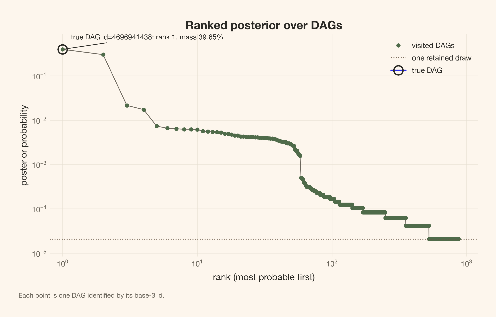
<figcaption>Figure 8: The ranked empirical DAG distribution need not concentrate on one graph. The generating DAG is ringed when visited; the one-draw line marks Monte Carlo frequency resolution, not a detection limit for unvisited posterior mass.</figcaption>
</figure>

How many alternatives carry the sampled mass? The cumulative curve answers that question without selecting a top graph.

Code

``` sourceCode
fig = plot_cumulative(states)
plt.show()

flat = states.reshape(-1, len(pairs))
powers = 3 ** np.arange(len(pairs))
ids = (flat * powers).sum(axis=1)
id_unique, id_counts = np.unique(ids, return_counts=True)
id_mass = id_counts / id_counts.sum()
cumulative = np.cumsum(np.sort(id_mass)[::-1])
for level in (0.50, 0.90, 0.95):
    count = int(np.searchsorted(cumulative, level) + 1)
    noun_verb = "DAG reaches" if count == 1 else "DAGs reach"
    print(f"{count} {noun_verb} at least {level:.0%} of the sampled mass")
```

<figure class="quarto-float quarto-float-fig figure">
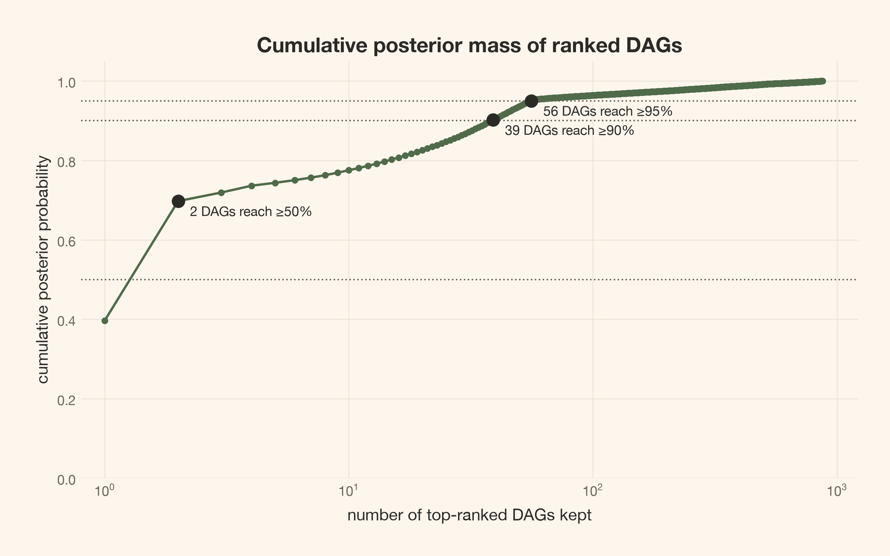
<figcaption>Figure 9: Cumulative empirical mass reports how many ranked DAGs reach at least 50%, 90%, and 95% of retained draws. Markers show the achieved levels. This curve does not account for graphs the chains never visited.</figcaption>
</figure>

    2 DAGs reach at least 50% of the sampled mass
    39 DAGs reach at least 90% of the sampled mass
    56 DAGs reach at least 95% of the sampled mass

## Identifiers label graphs; they do not measure distance

The base-3 identifier \mathrm{ID}=\sum_k s_k3^k encodes the 21 pair states. It is a label. Adjacent integers need not represent similar DAGs. <a href="#fig-id-pmf" class="quarto-xref">Figure 10</a> treats the leading IDs as categories; <a href="#fig-decoder" class="quarto-xref">Figure 11</a> shows the structures those categories encode.

Code

``` sourceCode
fig = plot_id_pmf(states, truth_states)
plt.show()
```

<figure class="quarto-float quarto-float-fig figure">
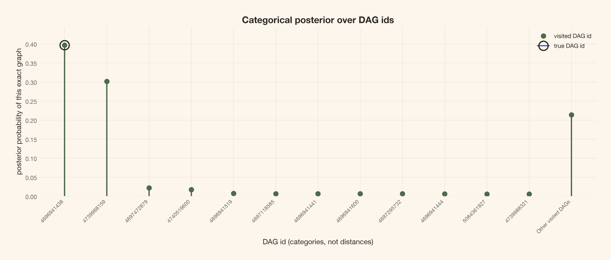
<figcaption>Figure 10: Leading visited DAG identifiers form a categorical distribution. ‘Other’ combines remaining visited DAGs; it is not one additional graph. The generating ID is ringed only when displayed as its own category.</figcaption>
</figure>

Code

``` sourceCode
fig = plot_decoder(states, truth_states, labels)
plt.show()
```

<figure class="quarto-float quarto-float-fig figure">
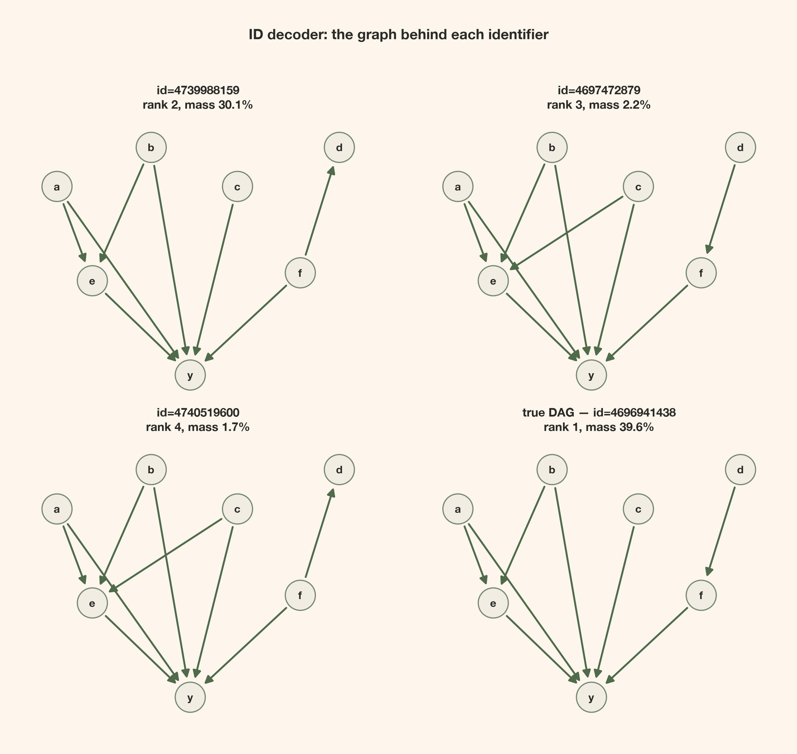
<figcaption>Figure 11: Decoding the leading alternatives makes their graph structure inspectable. Up to three alternatives and the generating DAG use fixed node positions, with identifiers and empirical mass. The generating graph has its own panel rather than being duplicated among alternatives.</figcaption>
</figure>

## Skeletons and classes sum different sets of DAG weights

A skeleton drops arrowheads and keeps adjacencies. Its probability sums over every DAG with those connections, including DAGs in different equivalence classes. It is not a CPDAG.

Code

``` sourceCode
fig = plot_ranked_graphs(states, truth_states, labels, skeleton=True)
plt.show()
```

<figure class="quarto-float quarto-float-fig figure">

<figcaption>Figure 12: Skeleton probabilities aggregate over all orientations of the same connections, including different Markov-equivalence classes. The generating skeleton is ringed when visited. Its ranking answers a different question from the DAG ranking.</figcaption>
</figure>

A Markov-equivalence class instead groups DAGs with the same skeleton **and unshielded colliders**. Its CPDAG directs all compelled arrows and leaves reversible edges undirected. An undirected edge is not an absent edge or two opposite causal arrows. This characterization is graphical; it does not guarantee equal evidence in our mechanism family.

The generating class has two members. The collider a\rightarrow e\leftarrow b compels the two arrows into e; unshielded colliders at y compel its five incoming arrows. Only d–f reverses. Therefore class probability adds the generating DAG’s weight and the twin’s weight, even when their prior-integrated evidence differs.

Measured generating-DAG, skeleton, and class ranks

``` sourceCode
true_id = int((truth_states * powers).sum())
binary_powers = 1 << np.arange(len(pairs))
true_skeleton = int(((truth_states != 0) * binary_powers).sum())
skeleton_codes = ((flat != 0) * binary_powers).sum(axis=1)
dag_rank, dag_mass = rank_and_mass(ids, true_id)
skel_rank, skel_mass = rank_and_mass(skeleton_codes, true_skeleton)
class_rank = summary["ranked"].index(truth_key) + 1 if truth_key in summary["ranked"] else None
class_mass = float(summary["true_class"].mean())
n_total = len(states)
display(article_table(
    pd.DataFrame({
        "Generating object": ["DAG", "Skeleton", "Markov-equivalence class"],
        "Empirical rank": [dag_rank or "not visited", skel_rank or "not visited",
                           class_rank or "not visited"],
        "Empirical probability": [dag_mass, skel_mass, class_mass],
    }),
    "The same draws answer three different generating-structure questions",
    formats={"Empirical probability": "{:.2%}"},
))
display(Markdown(
    f"The generating DAG has **{dag_mass:.2%}** empirical probability; "
    f"its reverse-$d$–$f$ twin accounts for **{class_mass - dag_mass:.2%}**. "
    f"The class collects **{class_mass:.2%}**, and the skeleton **{skel_mass:.2%}**."
))
print(f"Frequency resolution: {1 / n_total:.2e}; zero visits do not prove zero posterior mass")
```

<figure class="quarto-float quarto-float-tbl figure">
<table id="T_47277" class="caption-top table table-sm table-striped small" data-quarto-postprocess="true">
<thead>
<tr class="header">
<th id="T_47277_level0_col0" class="col_heading level0 col0" data-quarto-table-cell-role="th">Generating object</th>
<th id="T_47277_level0_col1" class="col_heading level0 col1" data-quarto-table-cell-role="th">Empirical rank</th>
<th id="T_47277_level0_col2" class="col_heading level0 col2" data-quarto-table-cell-role="th">Empirical probability</th>
</tr>
</thead>
<tbody>
<tr class="odd">
<td id="T_47277_row0_col0" class="data row0 col0">DAG</td>
<td id="T_47277_row0_col1" class="data row0 col1">1</td>
<td id="T_47277_row0_col2" class="data row0 col2">39.65%</td>
</tr>
<tr class="even">
<td id="T_47277_row1_col0" class="data row1 col0">Skeleton</td>
<td id="T_47277_row1_col1" class="data row1 col1">1</td>
<td id="T_47277_row1_col2" class="data row1 col2">69.75%</td>
</tr>
<tr class="odd">
<td id="T_47277_row2_col0" class="data row2 col0">Markov-equivalence class</td>
<td id="T_47277_row2_col1" class="data row2 col1">1</td>
<td id="T_47277_row2_col2" class="data row2 col2">69.75%</td>
</tr>
</tbody>
</table>
<figcaption>Table 8: The same draws answer three different generating-structure questions</figcaption>
</figure>

The generating DAG has **39.65%** empirical probability; its reverse-d–f twin accounts for **30.11%**. The class collects **69.75%**, and the skeleton **69.75%**.

    Frequency resolution: 2.08e-05; zero visits do not prove zero posterior mass

DAG and skeleton ranks break frequency ties by increasing identifier. “Not visited” means zero empirical frequency, not proven zero posterior probability. The class table below uses fractions of **all draws**, not renormalization over the displayed classes.

Class weights with undisplayed classes retained

``` sourceCode
class_rows = []
for rank, key in enumerate(summary["ranked"][:6], start=1):
    class_rows.append({
        "Class rank": rank,
        "Estimated posterior mass": summary["class_counts"][key] / n_total,
        "Visited member DAGs": summary["class_members"][key],
        "Generating class": "yes" if key == truth_key else "",
    })
other_mass = 1.0 - sum(row["Estimated posterior mass"] for row in class_rows)
class_rows.append({
    "Class rank": "all remaining classes", "Estimated posterior mass": other_mass,
    "Visited member DAGs": "", "Generating class": "",
})
display(article_table(
    pd.DataFrame(class_rows), "Markov equivalence classes by estimated posterior mass",
    formats={"Estimated posterior mass": "{:.2%}"},
))
```

<figure class="quarto-float quarto-float-tbl figure">
<table id="T_e2fbc" class="caption-top table table-sm table-striped small" data-quarto-postprocess="true">
<thead>
<tr class="header">
<th id="T_e2fbc_level0_col0" class="col_heading level0 col0" data-quarto-table-cell-role="th">Class rank</th>
<th id="T_e2fbc_level0_col1" class="col_heading level0 col1" data-quarto-table-cell-role="th">Estimated posterior mass</th>
<th id="T_e2fbc_level0_col2" class="col_heading level0 col2" data-quarto-table-cell-role="th">Visited member DAGs</th>
<th id="T_e2fbc_level0_col3" class="col_heading level0 col3" data-quarto-table-cell-role="th">Generating class</th>
</tr>
</thead>
<tbody>
<tr class="odd">
<td id="T_e2fbc_row0_col0" class="data row0 col0">1</td>
<td id="T_e2fbc_row0_col1" class="data row0 col1">69.75%</td>
<td id="T_e2fbc_row0_col2" class="data row0 col2">2</td>
<td id="T_e2fbc_row0_col3" class="data row0 col3">yes</td>
</tr>
<tr class="even">
<td id="T_e2fbc_row1_col0" class="data row1 col0">2</td>
<td id="T_e2fbc_row1_col1" class="data row1 col1">3.88%</td>
<td id="T_e2fbc_row1_col2" class="data row1 col2">2</td>
<td id="T_e2fbc_row1_col3" class="data row1 col3"></td>
</tr>
<tr class="odd">
<td id="T_e2fbc_row2_col0" class="data row2 col0">3</td>
<td id="T_e2fbc_row2_col1" class="data row2 col1">2.98%</td>
<td id="T_e2fbc_row2_col2" class="data row2 col2">12</td>
<td id="T_e2fbc_row2_col3" class="data row2 col3"></td>
</tr>
<tr class="even">
<td id="T_e2fbc_row3_col0" class="data row3 col0">4</td>
<td id="T_e2fbc_row3_col1" class="data row3 col1">2.23%</td>
<td id="T_e2fbc_row3_col2" class="data row3 col2">4</td>
<td id="T_e2fbc_row3_col3" class="data row3 col3"></td>
</tr>
<tr class="odd">
<td id="T_e2fbc_row4_col0" class="data row4 col0">5</td>
<td id="T_e2fbc_row4_col1" class="data row4 col1">1.75%</td>
<td id="T_e2fbc_row4_col2" class="data row4 col2">3</td>
<td id="T_e2fbc_row4_col3" class="data row4 col3"></td>
</tr>
<tr class="even">
<td id="T_e2fbc_row5_col0" class="data row5 col0">6</td>
<td id="T_e2fbc_row5_col1" class="data row5 col1">1.70%</td>
<td id="T_e2fbc_row5_col2" class="data row5 col2">3</td>
<td id="T_e2fbc_row5_col3" class="data row5 col3"></td>
</tr>
<tr class="odd">
<td id="T_e2fbc_row6_col0" class="data row6 col0">all remaining classes</td>
<td id="T_e2fbc_row6_col1" class="data row6 col1">17.69%</td>
<td id="T_e2fbc_row6_col2" class="data row6 col2"></td>
<td id="T_e2fbc_row6_col3" class="data row6 col3"></td>
</tr>
</tbody>
</table>
<figcaption>Table 9: Markov equivalence classes by estimated posterior mass</figcaption>
</figure>

Code

``` sourceCode
fig, axes = plt.subplots(2, 2, figsize=(10, 8))
for index, ax in enumerate(axes.flat):
    if index >= min(4, len(summary["ranked"])):
        ax.axis("off")
        continue
    key = summary["ranked"][index]
    mass = summary["class_counts"][key] / n_total
    suffix = " · generating class" if key == truth_key else ""
    draw_graph(
        ax, cpdag(summary["representative"][key]),
        f"Class {index + 1}: {mass:.1%}{suffix}",
    )
plt.show()
print(f"Distinct DAGs visited: {len(summary['graphs'])}; classes visited: {len(summary['ranked'])}")
```

<figure class="quarto-float quarto-float-fig figure">

<figcaption>Figure 13: Leading CPDAGs aggregate member-DAG draws. Dashed undirected edges report reversibility in the observational class; they do not restore directions forbidden by the hard mask. The leading class need not contain the leading individual DAG.</figcaption>
</figure>

    Distinct DAGs visited: 872; classes visited: 459

A class is a useful aggregation, not a replacement for member weights when the decision depends on \operatorname{do}(d). The nonlinear outcome and precise class mass still leave that reversible upstream direction unresolved.

# Graph size should be compared with the actual acyclic prior

## Zero-data sampling is a prior run, not an initialization shortcut

What graph sizes did we ask for before seeing data? A binomial arrow-count approximation would ignore the acyclicity constraint. Instead, we run the same masked acyclic sampler with a zero-data score. Every absolute local log evidence is zero, so this chain targets the graph prior itself.

Sample and diagnose the masked acyclic graph prior

``` sourceCode
prior_score = build_score(np.empty((0, n_nodes)))
assert prior_score.graph_score(truth) == 0.0
prior_posterior = fit_graphs(
    prior_score, baseline_probs, labels,
    seed=PRIOR_SEED, draws=draws, tune=tune, betas=betas, chains=chains,
)
assert np.all(prior_posterior.posterior.log_evidence.values == 0.0)
prior_states = prior_posterior.posterior.edge.values.reshape(-1, len(pairs))
prior_summary = graph_summary(prior_posterior, pairs, n_nodes, truth_key, d_index, y_index)
prior_diagnostic_data = graph_diagnostic_data(
    prior_posterior, prior_summary, baseline_probs, labels, pairs,
)
prior_diagnostics = azs.summary(prior_diagnostic_data, ci_prob=0.95, round_to="none")
```

The prior chain needs diagnostics too. Its identically-zero `log_evidence` is constant by construction and is **not diagnosable**. This is not evidence of perfect mixing. At zero data, all temperatures target the same graph prior; exchanges alone are especially uninformative about exploration.

``` sourceCode
print(
    f"Prior chains: max R-hat {prior_diagnostics.r_hat.max():.4f}, "
    f"min bulk ESS {prior_diagnostics.ess_bulk.min():.0f}, "
    f"min tail ESS {prior_diagnostics.ess_tail.min():.0f}"
)
prior_metadata = prior_diagnostic_data["posterior"].attrs
print(
    f"Prior indicators fixed by pair support: {prior_metadata['fixed_indicators']}; "
    f"other constants in retained draws: {prior_metadata['other_constant_indicators']}"
)
print(f"Prior constant scalar summaries: {prior_metadata['constant_summaries']} (not estimable)")
```

    Prior chains: max R-hat 1.0001, min bulk ESS 46021, min tail ESS 46021
    Prior indicators fixed by pair support: 6; other constants in retained draws: 1
    Prior constant scalar summaries: log_evidence (not estimable)

Full graph-prior diagnostic results

The same varying-quantity convention is used for the prior and posterior. Constants remain excluded with their counts disclosed above.

Code

``` sourceCode
display(article_table(
    prior_diagnostics[["mean", "mcse_mean", "ess_bulk", "ess_tail", "r_hat"]]
    .rename(columns={
        "mean": "Mean", "mcse_mean": "MCSE", "ess_bulk": "Bulk ESS",
        "ess_tail": "Tail ESS", "r_hat": "R-hat",
    })
    .reset_index(names="Quantity"),
    "All varying graph-prior event and scalar diagnostics (native units)",
    formats={
        "Mean": "{:.4f}", "MCSE": "{:.4f}", "Bulk ESS": "{:,.0f}",
        "Tail ESS": "{:,.0f}", "R-hat": "{:.4f}",
    },
))
```

<figure class="quarto-float quarto-float-tbl figure">
<table id="T_bd6a2" class="caption-top table table-sm table-striped small" data-quarto-postprocess="true">
<thead>
<tr class="header">
<th id="T_bd6a2_level0_col0" class="col_heading level0 col0" data-quarto-table-cell-role="th">Quantity</th>
<th id="T_bd6a2_level0_col1" class="col_heading level0 col1" data-quarto-table-cell-role="th">Mean</th>
<th id="T_bd6a2_level0_col2" class="col_heading level0 col2" data-quarto-table-cell-role="th">MCSE</th>
<th id="T_bd6a2_level0_col3" class="col_heading level0 col3" data-quarto-table-cell-role="th">Bulk ESS</th>
<th id="T_bd6a2_level0_col4" class="col_heading level0 col4" data-quarto-table-cell-role="th">Tail ESS</th>
<th id="T_bd6a2_level0_col5" class="col_heading level0 col5" data-quarto-table-cell-role="th">R-hat</th>
</tr>
</thead>
<tbody>
<tr class="odd">
<td id="T_bd6a2_row0_col0" class="data row0 col0">event[a–b absent]</td>
<td id="T_bd6a2_row0_col1" class="data row0 col1">0.4084</td>
<td id="T_bd6a2_row0_col2" class="data row0 col2">0.0022</td>
<td id="T_bd6a2_row0_col3" class="data row0 col3">47,825</td>
<td id="T_bd6a2_row0_col4" class="data row0 col4">47,825</td>
<td id="T_bd6a2_row0_col5" class="data row0 col5">1.0000</td>
</tr>
<tr class="even">
<td id="T_bd6a2_row1_col0" class="data row1 col0">event[a→b]</td>
<td id="T_bd6a2_row1_col1" class="data row1 col1">0.2936</td>
<td id="T_bd6a2_row1_col2" class="data row1 col2">0.0021</td>
<td id="T_bd6a2_row1_col3" class="data row1 col3">47,896</td>
<td id="T_bd6a2_row1_col4" class="data row1 col4">47,896</td>
<td id="T_bd6a2_row1_col5" class="data row1 col5">1.0000</td>
</tr>
<tr class="odd">
<td id="T_bd6a2_row2_col0" class="data row2 col0">event[b→a]</td>
<td id="T_bd6a2_row2_col1" class="data row2 col1">0.2981</td>
<td id="T_bd6a2_row2_col2" class="data row2 col2">0.0021</td>
<td id="T_bd6a2_row2_col3" class="data row2 col3">47,660</td>
<td id="T_bd6a2_row2_col4" class="data row2 col4">47,660</td>
<td id="T_bd6a2_row2_col5" class="data row2 col5">1.0000</td>
</tr>
<tr class="even">
<td id="T_bd6a2_row3_col0" class="data row3 col0">event[a–c absent]</td>
<td id="T_bd6a2_row3_col1" class="data row3 col1">0.4041</td>
<td id="T_bd6a2_row3_col2" class="data row3 col2">0.0023</td>
<td id="T_bd6a2_row3_col3" class="data row3 col3">47,292</td>
<td id="T_bd6a2_row3_col4" class="data row3 col4">47,292</td>
<td id="T_bd6a2_row3_col5" class="data row3 col5">1.0000</td>
</tr>
<tr class="odd">
<td id="T_bd6a2_row4_col0" class="data row4 col0">event[a→c]</td>
<td id="T_bd6a2_row4_col1" class="data row4 col1">0.2984</td>
<td id="T_bd6a2_row4_col2" class="data row4 col2">0.0021</td>
<td id="T_bd6a2_row4_col3" class="data row4 col3">47,975</td>
<td id="T_bd6a2_row4_col4" class="data row4 col4">47,975</td>
<td id="T_bd6a2_row4_col5" class="data row4 col5">1.0000</td>
</tr>
<tr class="even">
<td id="T_bd6a2_row5_col0" class="data row5 col0">event[c→a]</td>
<td id="T_bd6a2_row5_col1" class="data row5 col1">0.2975</td>
<td id="T_bd6a2_row5_col2" class="data row5 col2">0.0021</td>
<td id="T_bd6a2_row5_col3" class="data row5 col3">47,966</td>
<td id="T_bd6a2_row5_col4" class="data row5 col4">47,966</td>
<td id="T_bd6a2_row5_col5" class="data row5 col5">0.9999</td>
</tr>
<tr class="odd">
<td id="T_bd6a2_row6_col0" class="data row6 col0">event[a–d absent]</td>
<td id="T_bd6a2_row6_col1" class="data row6 col1">0.4114</td>
<td id="T_bd6a2_row6_col2" class="data row6 col2">0.0023</td>
<td id="T_bd6a2_row6_col3" class="data row6 col3">47,197</td>
<td id="T_bd6a2_row6_col4" class="data row6 col4">47,197</td>
<td id="T_bd6a2_row6_col5" class="data row6 col5">1.0000</td>
</tr>
<tr class="even">
<td id="T_bd6a2_row7_col0" class="data row7 col0">event[a→d]</td>
<td id="T_bd6a2_row7_col1" class="data row7 col1">0.2936</td>
<td id="T_bd6a2_row7_col2" class="data row7 col2">0.0021</td>
<td id="T_bd6a2_row7_col3" class="data row7 col3">48,657</td>
<td id="T_bd6a2_row7_col4" class="data row7 col4">48,000</td>
<td id="T_bd6a2_row7_col5" class="data row7 col5">1.0000</td>
</tr>
<tr class="odd">
<td id="T_bd6a2_row8_col0" class="data row8 col0">event[d→a]</td>
<td id="T_bd6a2_row8_col1" class="data row8 col1">0.2950</td>
<td id="T_bd6a2_row8_col2" class="data row8 col2">0.0021</td>
<td id="T_bd6a2_row8_col3" class="data row8 col3">46,631</td>
<td id="T_bd6a2_row8_col4" class="data row8 col4">46,631</td>
<td id="T_bd6a2_row8_col5" class="data row8 col5">1.0000</td>
</tr>
<tr class="even">
<td id="T_bd6a2_row9_col0" class="data row9 col0">event[a–e absent]</td>
<td id="T_bd6a2_row9_col1" class="data row9 col1">0.4117</td>
<td id="T_bd6a2_row9_col2" class="data row9 col2">0.0022</td>
<td id="T_bd6a2_row9_col3" class="data row9 col3">47,913</td>
<td id="T_bd6a2_row9_col4" class="data row9 col4">47,913</td>
<td id="T_bd6a2_row9_col5" class="data row9 col5">0.9999</td>
</tr>
<tr class="odd">
<td id="T_bd6a2_row10_col0" class="data row10 col0">event[a→e]</td>
<td id="T_bd6a2_row10_col1" class="data row10 col1">0.2943</td>
<td id="T_bd6a2_row10_col2" class="data row10 col2">0.0021</td>
<td id="T_bd6a2_row10_col3" class="data row10 col3">47,319</td>
<td id="T_bd6a2_row10_col4" class="data row10 col4">47,319</td>
<td id="T_bd6a2_row10_col5" class="data row10 col5">1.0000</td>
</tr>
<tr class="even">
<td id="T_bd6a2_row11_col0" class="data row11 col0">event[e→a]</td>
<td id="T_bd6a2_row11_col1" class="data row11 col1">0.2941</td>
<td id="T_bd6a2_row11_col2" class="data row11 col2">0.0021</td>
<td id="T_bd6a2_row11_col3" class="data row11 col3">47,429</td>
<td id="T_bd6a2_row11_col4" class="data row11 col4">47,429</td>
<td id="T_bd6a2_row11_col5" class="data row11 col5">1.0000</td>
</tr>
<tr class="odd">
<td id="T_bd6a2_row12_col0" class="data row12 col0">event[a–f absent]</td>
<td id="T_bd6a2_row12_col1" class="data row12 col1">0.4109</td>
<td id="T_bd6a2_row12_col2" class="data row12 col2">0.0022</td>
<td id="T_bd6a2_row12_col3" class="data row12 col3">48,396</td>
<td id="T_bd6a2_row12_col4" class="data row12 col4">48,000</td>
<td id="T_bd6a2_row12_col5" class="data row12 col5">1.0001</td>
</tr>
<tr class="even">
<td id="T_bd6a2_row13_col0" class="data row13 col0">event[a→f]</td>
<td id="T_bd6a2_row13_col1" class="data row13 col1">0.2924</td>
<td id="T_bd6a2_row13_col2" class="data row13 col2">0.0021</td>
<td id="T_bd6a2_row13_col3" class="data row13 col3">46,681</td>
<td id="T_bd6a2_row13_col4" class="data row13 col4">46,681</td>
<td id="T_bd6a2_row13_col5" class="data row13 col5">1.0000</td>
</tr>
<tr class="odd">
<td id="T_bd6a2_row14_col0" class="data row14 col0">event[f→a]</td>
<td id="T_bd6a2_row14_col1" class="data row14 col1">0.2967</td>
<td id="T_bd6a2_row14_col2" class="data row14 col2">0.0021</td>
<td id="T_bd6a2_row14_col3" class="data row14 col3">47,741</td>
<td id="T_bd6a2_row14_col4" class="data row14 col4">47,741</td>
<td id="T_bd6a2_row14_col5" class="data row14 col5">0.9999</td>
</tr>
<tr class="even">
<td id="T_bd6a2_row15_col0" class="data row15 col0">event[a–y absent]</td>
<td id="T_bd6a2_row15_col1" class="data row15 col1">0.4954</td>
<td id="T_bd6a2_row15_col2" class="data row15 col2">0.0023</td>
<td id="T_bd6a2_row15_col3" class="data row15 col3">47,767</td>
<td id="T_bd6a2_row15_col4" class="data row15 col4">47,767</td>
<td id="T_bd6a2_row15_col5" class="data row15 col5">1.0001</td>
</tr>
<tr class="odd">
<td id="T_bd6a2_row16_col0" class="data row16 col0">event[a→y]</td>
<td id="T_bd6a2_row16_col1" class="data row16 col1">0.5046</td>
<td id="T_bd6a2_row16_col2" class="data row16 col2">0.0023</td>
<td id="T_bd6a2_row16_col3" class="data row16 col3">47,767</td>
<td id="T_bd6a2_row16_col4" class="data row16 col4">47,767</td>
<td id="T_bd6a2_row16_col5" class="data row16 col5">1.0001</td>
</tr>
<tr class="even">
<td id="T_bd6a2_row17_col0" class="data row17 col0">event[b–c absent]</td>
<td id="T_bd6a2_row17_col1" class="data row17 col1">0.4105</td>
<td id="T_bd6a2_row17_col2" class="data row17 col2">0.0023</td>
<td id="T_bd6a2_row17_col3" class="data row17 col3">47,708</td>
<td id="T_bd6a2_row17_col4" class="data row17 col4">47,708</td>
<td id="T_bd6a2_row17_col5" class="data row17 col5">1.0001</td>
</tr>
<tr class="odd">
<td id="T_bd6a2_row18_col0" class="data row18 col0">event[b→c]</td>
<td id="T_bd6a2_row18_col1" class="data row18 col1">0.2942</td>
<td id="T_bd6a2_row18_col2" class="data row18 col2">0.0021</td>
<td id="T_bd6a2_row18_col3" class="data row18 col3">46,543</td>
<td id="T_bd6a2_row18_col4" class="data row18 col4">46,543</td>
<td id="T_bd6a2_row18_col5" class="data row18 col5">1.0000</td>
</tr>
<tr class="even">
<td id="T_bd6a2_row19_col0" class="data row19 col0">event[c→b]</td>
<td id="T_bd6a2_row19_col1" class="data row19 col1">0.2953</td>
<td id="T_bd6a2_row19_col2" class="data row19 col2">0.0021</td>
<td id="T_bd6a2_row19_col3" class="data row19 col3">47,488</td>
<td id="T_bd6a2_row19_col4" class="data row19 col4">47,488</td>
<td id="T_bd6a2_row19_col5" class="data row19 col5">1.0000</td>
</tr>
<tr class="odd">
<td id="T_bd6a2_row20_col0" class="data row20 col0">event[b–d absent]</td>
<td id="T_bd6a2_row20_col1" class="data row20 col1">0.4113</td>
<td id="T_bd6a2_row20_col2" class="data row20 col2">0.0022</td>
<td id="T_bd6a2_row20_col3" class="data row20 col3">48,884</td>
<td id="T_bd6a2_row20_col4" class="data row20 col4">48,000</td>
<td id="T_bd6a2_row20_col5" class="data row20 col5">1.0000</td>
</tr>
<tr class="even">
<td id="T_bd6a2_row21_col0" class="data row21 col0">event[b→d]</td>
<td id="T_bd6a2_row21_col1" class="data row21 col1">0.2944</td>
<td id="T_bd6a2_row21_col2" class="data row21 col2">0.0021</td>
<td id="T_bd6a2_row21_col3" class="data row21 col3">47,952</td>
<td id="T_bd6a2_row21_col4" class="data row21 col4">47,952</td>
<td id="T_bd6a2_row21_col5" class="data row21 col5">1.0001</td>
</tr>
<tr class="odd">
<td id="T_bd6a2_row22_col0" class="data row22 col0">event[d→b]</td>
<td id="T_bd6a2_row22_col1" class="data row22 col1">0.2943</td>
<td id="T_bd6a2_row22_col2" class="data row22 col2">0.0021</td>
<td id="T_bd6a2_row22_col3" class="data row22 col3">47,909</td>
<td id="T_bd6a2_row22_col4" class="data row22 col4">47,909</td>
<td id="T_bd6a2_row22_col5" class="data row22 col5">1.0000</td>
</tr>
<tr class="even">
<td id="T_bd6a2_row23_col0" class="data row23 col0">event[b–e absent]</td>
<td id="T_bd6a2_row23_col1" class="data row23 col1">0.4063</td>
<td id="T_bd6a2_row23_col2" class="data row23 col2">0.0023</td>
<td id="T_bd6a2_row23_col3" class="data row23 col3">47,503</td>
<td id="T_bd6a2_row23_col4" class="data row23 col4">47,503</td>
<td id="T_bd6a2_row23_col5" class="data row23 col5">1.0000</td>
</tr>
<tr class="odd">
<td id="T_bd6a2_row24_col0" class="data row24 col0">event[b→e]</td>
<td id="T_bd6a2_row24_col1" class="data row24 col1">0.2969</td>
<td id="T_bd6a2_row24_col2" class="data row24 col2">0.0021</td>
<td id="T_bd6a2_row24_col3" class="data row24 col3">47,332</td>
<td id="T_bd6a2_row24_col4" class="data row24 col4">47,332</td>
<td id="T_bd6a2_row24_col5" class="data row24 col5">1.0000</td>
</tr>
<tr class="even">
<td id="T_bd6a2_row25_col0" class="data row25 col0">event[e→b]</td>
<td id="T_bd6a2_row25_col1" class="data row25 col1">0.2968</td>
<td id="T_bd6a2_row25_col2" class="data row25 col2">0.0021</td>
<td id="T_bd6a2_row25_col3" class="data row25 col3">47,481</td>
<td id="T_bd6a2_row25_col4" class="data row25 col4">47,481</td>
<td id="T_bd6a2_row25_col5" class="data row25 col5">1.0000</td>
</tr>
<tr class="odd">
<td id="T_bd6a2_row26_col0" class="data row26 col0">event[b–f absent]</td>
<td id="T_bd6a2_row26_col1" class="data row26 col1">0.4135</td>
<td id="T_bd6a2_row26_col2" class="data row26 col2">0.0022</td>
<td id="T_bd6a2_row26_col3" class="data row26 col3">48,257</td>
<td id="T_bd6a2_row26_col4" class="data row26 col4">48,000</td>
<td id="T_bd6a2_row26_col5" class="data row26 col5">1.0000</td>
</tr>
<tr class="even">
<td id="T_bd6a2_row27_col0" class="data row27 col0">event[b→f]</td>
<td id="T_bd6a2_row27_col1" class="data row27 col1">0.2938</td>
<td id="T_bd6a2_row27_col2" class="data row27 col2">0.0021</td>
<td id="T_bd6a2_row27_col3" class="data row27 col3">47,044</td>
<td id="T_bd6a2_row27_col4" class="data row27 col4">47,044</td>
<td id="T_bd6a2_row27_col5" class="data row27 col5">1.0000</td>
</tr>
<tr class="odd">
<td id="T_bd6a2_row28_col0" class="data row28 col0">event[f→b]</td>
<td id="T_bd6a2_row28_col1" class="data row28 col1">0.2927</td>
<td id="T_bd6a2_row28_col2" class="data row28 col2">0.0021</td>
<td id="T_bd6a2_row28_col3" class="data row28 col3">47,759</td>
<td id="T_bd6a2_row28_col4" class="data row28 col4">47,759</td>
<td id="T_bd6a2_row28_col5" class="data row28 col5">1.0000</td>
</tr>
<tr class="even">
<td id="T_bd6a2_row29_col0" class="data row29 col0">event[b–y absent]</td>
<td id="T_bd6a2_row29_col1" class="data row29 col1">0.4995</td>
<td id="T_bd6a2_row29_col2" class="data row29 col2">0.0023</td>
<td id="T_bd6a2_row29_col3" class="data row29 col3">48,223</td>
<td id="T_bd6a2_row29_col4" class="data row29 col4">48,000</td>
<td id="T_bd6a2_row29_col5" class="data row29 col5">1.0000</td>
</tr>
<tr class="odd">
<td id="T_bd6a2_row30_col0" class="data row30 col0">event[b→y]</td>
<td id="T_bd6a2_row30_col1" class="data row30 col1">0.5005</td>
<td id="T_bd6a2_row30_col2" class="data row30 col2">0.0023</td>
<td id="T_bd6a2_row30_col3" class="data row30 col3">48,223</td>
<td id="T_bd6a2_row30_col4" class="data row30 col4">48,000</td>
<td id="T_bd6a2_row30_col5" class="data row30 col5">1.0000</td>
</tr>
<tr class="even">
<td id="T_bd6a2_row31_col0" class="data row31 col0">event[c–d absent]</td>
<td id="T_bd6a2_row31_col1" class="data row31 col1">0.4112</td>
<td id="T_bd6a2_row31_col2" class="data row31 col2">0.0023</td>
<td id="T_bd6a2_row31_col3" class="data row31 col3">46,604</td>
<td id="T_bd6a2_row31_col4" class="data row31 col4">46,604</td>
<td id="T_bd6a2_row31_col5" class="data row31 col5">0.9999</td>
</tr>
<tr class="odd">
<td id="T_bd6a2_row32_col0" class="data row32 col0">event[c→d]</td>
<td id="T_bd6a2_row32_col1" class="data row32 col1">0.2949</td>
<td id="T_bd6a2_row32_col2" class="data row32 col2">0.0021</td>
<td id="T_bd6a2_row32_col3" class="data row32 col3">46,021</td>
<td id="T_bd6a2_row32_col4" class="data row32 col4">46,021</td>
<td id="T_bd6a2_row32_col5" class="data row32 col5">1.0001</td>
</tr>
<tr class="even">
<td id="T_bd6a2_row33_col0" class="data row33 col0">event[d→c]</td>
<td id="T_bd6a2_row33_col1" class="data row33 col1">0.2939</td>
<td id="T_bd6a2_row33_col2" class="data row33 col2">0.0021</td>
<td id="T_bd6a2_row33_col3" class="data row33 col3">47,181</td>
<td id="T_bd6a2_row33_col4" class="data row33 col4">47,181</td>
<td id="T_bd6a2_row33_col5" class="data row33 col5">1.0000</td>
</tr>
<tr class="odd">
<td id="T_bd6a2_row34_col0" class="data row34 col0">event[c–e absent]</td>
<td id="T_bd6a2_row34_col1" class="data row34 col1">0.4107</td>
<td id="T_bd6a2_row34_col2" class="data row34 col2">0.0023</td>
<td id="T_bd6a2_row34_col3" class="data row34 col3">47,703</td>
<td id="T_bd6a2_row34_col4" class="data row34 col4">47,703</td>
<td id="T_bd6a2_row34_col5" class="data row34 col5">1.0000</td>
</tr>
<tr class="even">
<td id="T_bd6a2_row35_col0" class="data row35 col0">event[c→e]</td>
<td id="T_bd6a2_row35_col1" class="data row35 col1">0.2929</td>
<td id="T_bd6a2_row35_col2" class="data row35 col2">0.0021</td>
<td id="T_bd6a2_row35_col3" class="data row35 col3">47,446</td>
<td id="T_bd6a2_row35_col4" class="data row35 col4">47,446</td>
<td id="T_bd6a2_row35_col5" class="data row35 col5">1.0000</td>
</tr>
<tr class="odd">
<td id="T_bd6a2_row36_col0" class="data row36 col0">event[e→c]</td>
<td id="T_bd6a2_row36_col1" class="data row36 col1">0.2964</td>
<td id="T_bd6a2_row36_col2" class="data row36 col2">0.0021</td>
<td id="T_bd6a2_row36_col3" class="data row36 col3">47,666</td>
<td id="T_bd6a2_row36_col4" class="data row36 col4">47,666</td>
<td id="T_bd6a2_row36_col5" class="data row36 col5">1.0001</td>
</tr>
<tr class="even">
<td id="T_bd6a2_row37_col0" class="data row37 col0">event[c–f absent]</td>
<td id="T_bd6a2_row37_col1" class="data row37 col1">0.4139</td>
<td id="T_bd6a2_row37_col2" class="data row37 col2">0.0023</td>
<td id="T_bd6a2_row37_col3" class="data row37 col3">47,388</td>
<td id="T_bd6a2_row37_col4" class="data row37 col4">47,388</td>
<td id="T_bd6a2_row37_col5" class="data row37 col5">0.9999</td>
</tr>
<tr class="odd">
<td id="T_bd6a2_row38_col0" class="data row38 col0">event[c→f]</td>
<td id="T_bd6a2_row38_col1" class="data row38 col1">0.2926</td>
<td id="T_bd6a2_row38_col2" class="data row38 col2">0.0021</td>
<td id="T_bd6a2_row38_col3" class="data row38 col3">46,718</td>
<td id="T_bd6a2_row38_col4" class="data row38 col4">46,718</td>
<td id="T_bd6a2_row38_col5" class="data row38 col5">1.0000</td>
</tr>
<tr class="even">
<td id="T_bd6a2_row39_col0" class="data row39 col0">event[f→c]</td>
<td id="T_bd6a2_row39_col1" class="data row39 col1">0.2935</td>
<td id="T_bd6a2_row39_col2" class="data row39 col2">0.0021</td>
<td id="T_bd6a2_row39_col3" class="data row39 col3">48,207</td>
<td id="T_bd6a2_row39_col4" class="data row39 col4">48,000</td>
<td id="T_bd6a2_row39_col5" class="data row39 col5">1.0000</td>
</tr>
<tr class="odd">
<td id="T_bd6a2_row40_col0" class="data row40 col0">event[c–y absent]</td>
<td id="T_bd6a2_row40_col1" class="data row40 col1">0.4974</td>
<td id="T_bd6a2_row40_col2" class="data row40 col2">0.0023</td>
<td id="T_bd6a2_row40_col3" class="data row40 col3">48,234</td>
<td id="T_bd6a2_row40_col4" class="data row40 col4">48,000</td>
<td id="T_bd6a2_row40_col5" class="data row40 col5">1.0000</td>
</tr>
<tr class="even">
<td id="T_bd6a2_row41_col0" class="data row41 col0">event[c→y]</td>
<td id="T_bd6a2_row41_col1" class="data row41 col1">0.5026</td>
<td id="T_bd6a2_row41_col2" class="data row41 col2">0.0023</td>
<td id="T_bd6a2_row41_col3" class="data row41 col3">48,234</td>
<td id="T_bd6a2_row41_col4" class="data row41 col4">48,000</td>
<td id="T_bd6a2_row41_col5" class="data row41 col5">1.0000</td>
</tr>
<tr class="odd">
<td id="T_bd6a2_row42_col0" class="data row42 col0">event[d–e absent]</td>
<td id="T_bd6a2_row42_col1" class="data row42 col1">0.4124</td>
<td id="T_bd6a2_row42_col2" class="data row42 col2">0.0022</td>
<td id="T_bd6a2_row42_col3" class="data row42 col3">48,149</td>
<td id="T_bd6a2_row42_col4" class="data row42 col4">48,000</td>
<td id="T_bd6a2_row42_col5" class="data row42 col5">1.0000</td>
</tr>
<tr class="even">
<td id="T_bd6a2_row43_col0" class="data row43 col0">event[d→e]</td>
<td id="T_bd6a2_row43_col1" class="data row43 col1">0.2944</td>
<td id="T_bd6a2_row43_col2" class="data row43 col2">0.0021</td>
<td id="T_bd6a2_row43_col3" class="data row43 col3">47,657</td>
<td id="T_bd6a2_row43_col4" class="data row43 col4">47,657</td>
<td id="T_bd6a2_row43_col5" class="data row43 col5">1.0000</td>
</tr>
<tr class="odd">
<td id="T_bd6a2_row44_col0" class="data row44 col0">event[e→d]</td>
<td id="T_bd6a2_row44_col1" class="data row44 col1">0.2932</td>
<td id="T_bd6a2_row44_col2" class="data row44 col2">0.0021</td>
<td id="T_bd6a2_row44_col3" class="data row44 col3">47,131</td>
<td id="T_bd6a2_row44_col4" class="data row44 col4">47,131</td>
<td id="T_bd6a2_row44_col5" class="data row44 col5">1.0000</td>
</tr>
<tr class="even">
<td id="T_bd6a2_row45_col0" class="data row45 col0">event[d–f absent]</td>
<td id="T_bd6a2_row45_col1" class="data row45 col1">0.4054</td>
<td id="T_bd6a2_row45_col2" class="data row45 col2">0.0023</td>
<td id="T_bd6a2_row45_col3" class="data row45 col3">47,067</td>
<td id="T_bd6a2_row45_col4" class="data row45 col4">47,067</td>
<td id="T_bd6a2_row45_col5" class="data row45 col5">1.0000</td>
</tr>
<tr class="odd">
<td id="T_bd6a2_row46_col0" class="data row46 col0">event[d→f]</td>
<td id="T_bd6a2_row46_col1" class="data row46 col1">0.2990</td>
<td id="T_bd6a2_row46_col2" class="data row46 col2">0.0021</td>
<td id="T_bd6a2_row46_col3" class="data row46 col3">47,831</td>
<td id="T_bd6a2_row46_col4" class="data row46 col4">47,831</td>
<td id="T_bd6a2_row46_col5" class="data row46 col5">1.0000</td>
</tr>
<tr class="even">
<td id="T_bd6a2_row47_col0" class="data row47 col0">event[f→d]</td>
<td id="T_bd6a2_row47_col1" class="data row47 col1">0.2956</td>
<td id="T_bd6a2_row47_col2" class="data row47 col2">0.0021</td>
<td id="T_bd6a2_row47_col3" class="data row47 col3">47,658</td>
<td id="T_bd6a2_row47_col4" class="data row47 col4">47,658</td>
<td id="T_bd6a2_row47_col5" class="data row47 col5">1.0000</td>
</tr>
<tr class="odd">
<td id="T_bd6a2_row48_col0" class="data row48 col0">event[d–y absent]</td>
<td id="T_bd6a2_row48_col1" class="data row48 col1">0.5014</td>
<td id="T_bd6a2_row48_col2" class="data row48 col2">0.0023</td>
<td id="T_bd6a2_row48_col3" class="data row48 col3">48,356</td>
<td id="T_bd6a2_row48_col4" class="data row48 col4">48,000</td>
<td id="T_bd6a2_row48_col5" class="data row48 col5">1.0000</td>
</tr>
<tr class="even">
<td id="T_bd6a2_row49_col0" class="data row49 col0">event[d→y]</td>
<td id="T_bd6a2_row49_col1" class="data row49 col1">0.4986</td>
<td id="T_bd6a2_row49_col2" class="data row49 col2">0.0023</td>
<td id="T_bd6a2_row49_col3" class="data row49 col3">48,356</td>
<td id="T_bd6a2_row49_col4" class="data row49 col4">48,000</td>
<td id="T_bd6a2_row49_col5" class="data row49 col5">1.0000</td>
</tr>
<tr class="odd">
<td id="T_bd6a2_row50_col0" class="data row50 col0">event[e–f absent]</td>
<td id="T_bd6a2_row50_col1" class="data row50 col1">0.4140</td>
<td id="T_bd6a2_row50_col2" class="data row50 col2">0.0022</td>
<td id="T_bd6a2_row50_col3" class="data row50 col3">47,934</td>
<td id="T_bd6a2_row50_col4" class="data row50 col4">47,934</td>
<td id="T_bd6a2_row50_col5" class="data row50 col5">0.9999</td>
</tr>
<tr class="even">
<td id="T_bd6a2_row51_col0" class="data row51 col0">event[e→f]</td>
<td id="T_bd6a2_row51_col1" class="data row51 col1">0.2917</td>
<td id="T_bd6a2_row51_col2" class="data row51 col2">0.0021</td>
<td id="T_bd6a2_row51_col3" class="data row51 col3">46,808</td>
<td id="T_bd6a2_row51_col4" class="data row51 col4">46,808</td>
<td id="T_bd6a2_row51_col5" class="data row51 col5">1.0001</td>
</tr>
<tr class="odd">
<td id="T_bd6a2_row52_col0" class="data row52 col0">event[f→e]</td>
<td id="T_bd6a2_row52_col1" class="data row52 col1">0.2943</td>
<td id="T_bd6a2_row52_col2" class="data row52 col2">0.0021</td>
<td id="T_bd6a2_row52_col3" class="data row52 col3">48,040</td>
<td id="T_bd6a2_row52_col4" class="data row52 col4">48,000</td>
<td id="T_bd6a2_row52_col5" class="data row52 col5">1.0000</td>
</tr>
<tr class="even">
<td id="T_bd6a2_row53_col0" class="data row53 col0">event[e–y absent]</td>
<td id="T_bd6a2_row53_col1" class="data row53 col1">0.4995</td>
<td id="T_bd6a2_row53_col2" class="data row53 col2">0.0023</td>
<td id="T_bd6a2_row53_col3" class="data row53 col3">47,944</td>
<td id="T_bd6a2_row53_col4" class="data row53 col4">47,944</td>
<td id="T_bd6a2_row53_col5" class="data row53 col5">1.0000</td>
</tr>
<tr class="odd">
<td id="T_bd6a2_row54_col0" class="data row54 col0">event[e→y]</td>
<td id="T_bd6a2_row54_col1" class="data row54 col1">0.5005</td>
<td id="T_bd6a2_row54_col2" class="data row54 col2">0.0023</td>
<td id="T_bd6a2_row54_col3" class="data row54 col3">47,944</td>
<td id="T_bd6a2_row54_col4" class="data row54 col4">47,944</td>
<td id="T_bd6a2_row54_col5" class="data row54 col5">1.0000</td>
</tr>
<tr class="even">
<td id="T_bd6a2_row55_col0" class="data row55 col0">event[f–y absent]</td>
<td id="T_bd6a2_row55_col1" class="data row55 col1">0.5006</td>
<td id="T_bd6a2_row55_col2" class="data row55 col2">0.0023</td>
<td id="T_bd6a2_row55_col3" class="data row55 col3">48,439</td>
<td id="T_bd6a2_row55_col4" class="data row55 col4">48,000</td>
<td id="T_bd6a2_row55_col5" class="data row55 col5">1.0000</td>
</tr>
<tr class="odd">
<td id="T_bd6a2_row56_col0" class="data row56 col0">event[f→y]</td>
<td id="T_bd6a2_row56_col1" class="data row56 col1">0.4994</td>
<td id="T_bd6a2_row56_col2" class="data row56 col2">0.0023</td>
<td id="T_bd6a2_row56_col3" class="data row56 col3">48,439</td>
<td id="T_bd6a2_row56_col4" class="data row56 col4">48,000</td>
<td id="T_bd6a2_row56_col5" class="data row56 col5">1.0000</td>
</tr>
<tr class="even">
<td id="T_bd6a2_row57_col0" class="data row57 col0">event[Class 1]</td>
<td id="T_bd6a2_row57_col1" class="data row57 col1">0.0000</td>
<td id="T_bd6a2_row57_col2" class="data row57 col2">0.0000</td>
<td id="T_bd6a2_row57_col3" class="data row57 col3">48,018</td>
<td id="T_bd6a2_row57_col4" class="data row57 col4">48,018</td>
<td id="T_bd6a2_row57_col5" class="data row57 col5">1.0000</td>
</tr>
<tr class="odd">
<td id="T_bd6a2_row58_col0" class="data row58 col0">event[Class 2]</td>
<td id="T_bd6a2_row58_col1" class="data row58 col1">0.0000</td>
<td id="T_bd6a2_row58_col2" class="data row58 col2">0.0000</td>
<td id="T_bd6a2_row58_col3" class="data row58 col3">48,018</td>
<td id="T_bd6a2_row58_col4" class="data row58 col4">48,018</td>
<td id="T_bd6a2_row58_col5" class="data row58 col5">1.0000</td>
</tr>
<tr class="even">
<td id="T_bd6a2_row59_col0" class="data row59 col0">event[Class 3]</td>
<td id="T_bd6a2_row59_col1" class="data row59 col1">0.0000</td>
<td id="T_bd6a2_row59_col2" class="data row59 col2">0.0000</td>
<td id="T_bd6a2_row59_col3" class="data row59 col3">48,018</td>
<td id="T_bd6a2_row59_col4" class="data row59 col4">48,018</td>
<td id="T_bd6a2_row59_col5" class="data row59 col5">1.0000</td>
</tr>
<tr class="odd">
<td id="T_bd6a2_row60_col0" class="data row60 col0">event[Class 4]</td>
<td id="T_bd6a2_row60_col1" class="data row60 col1">0.0000</td>
<td id="T_bd6a2_row60_col2" class="data row60 col2">0.0000</td>
<td id="T_bd6a2_row60_col3" class="data row60 col3">48,018</td>
<td id="T_bd6a2_row60_col4" class="data row60 col4">48,018</td>
<td id="T_bd6a2_row60_col5" class="data row60 col5">1.0000</td>
</tr>
<tr class="even">
<td id="T_bd6a2_row61_col0" class="data row61 col0">event[d has a path to y]</td>
<td id="T_bd6a2_row61_col1" class="data row61 col1">0.7909</td>
<td id="T_bd6a2_row61_col2" class="data row61 col2">0.0019</td>
<td id="T_bd6a2_row61_col3" class="data row61 col3">47,480</td>
<td id="T_bd6a2_row61_col4" class="data row61 col4">47,480</td>
<td id="T_bd6a2_row61_col5" class="data row61 col5">1.0000</td>
</tr>
<tr class="odd">
<td id="T_bd6a2_row62_col0" class="data row62 col0">edge_count</td>
<td id="T_bd6a2_row62_col1" class="data row62 col1">11.8505</td>
<td id="T_bd6a2_row62_col2" class="data row62 col2">0.0097</td>
<td id="T_bd6a2_row62_col3" class="data row62 col3">48,581</td>
<td id="T_bd6a2_row62_col4" class="data row62 col4">47,953</td>
<td id="T_bd6a2_row62_col5" class="data row62 col5">1.0000</td>
</tr>
</tbody>
</table>
<figcaption>Table 10: All varying graph-prior event and scalar diagnostics (native units)</figcaption>
</figure>

## Arrow and parent counts are summaries, not another selected graph

<a href="#fig-edge-counts" class="quarto-xref">Figure 14</a> compares the measured prior and posterior arrow counts. The generating count is evaluation-only. <a href="#fig-parent-counts" class="quarto-xref">Figure 15</a> then separates the posterior parent-count distributions by node, keeping a common axis.

Code

``` sourceCode
fig = plot_edge_counts(states, prior_states, truth_states)
plt.show()
print(
    f"Prior mean arrows: {(prior_states != 0).sum(axis=1).mean():.2f}; "
    f"posterior mean: {(states != 0).sum(axis=1).mean():.2f}; generating graph: 8"
)
```

<figure class="quarto-float quarto-float-fig figure">

<figcaption>Figure 14: The posterior arrow-count distribution is compared with draws from the actual masked acyclic graph prior, not a binomial shortcut. The vertical line marks the generating count. This graph-size summary does not identify individual arrows.</figcaption>
</figure>

    Prior mean arrows: 11.85; posterior mean: 8.35; generating graph: 8

Code

``` sourceCode
fig = plot_parent_counts(states, truth_states, labels)
plt.show()
```

<figure class="quarto-float quarto-float-fig figure">
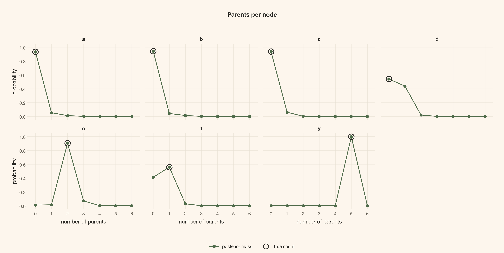
<figcaption>Figure 15: Each node has its own posterior parent-count distribution, with its generating count ringed on a shared zero-to-six axis. These per-node marginals do not replace the joint DAG posterior.</figcaption>
</figure>

Optional visual appendix: the same posterior from three other angles

These displays add three further views of the same posterior without creating another inferential target. The pair-state panels expose absence separately from orientation; the graph map uses structural distances rather than numeric IDs; the number line deliberately shows how arbitrary the codes are.

Code

``` sourceCode
fig = plot_pair_states(states, truth_states, labels)
plt.show()
```

<figure class="quarto-float quarto-float-fig figure">
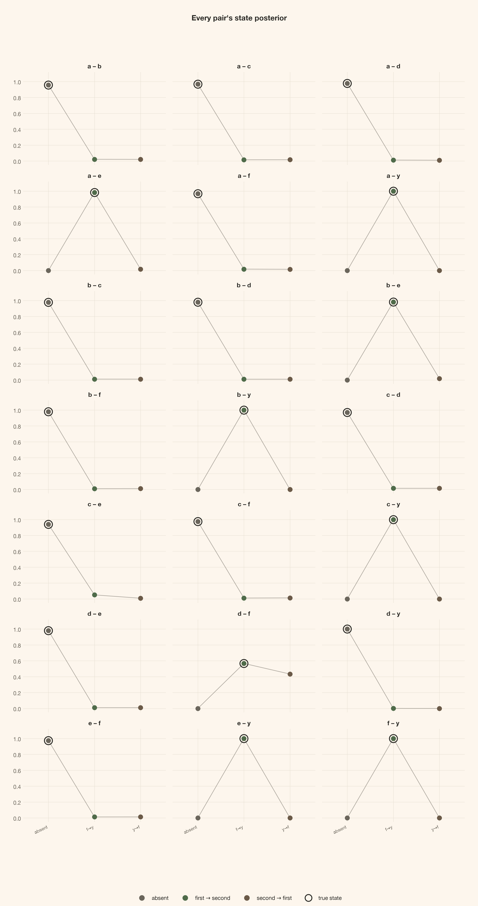
<figcaption>Figure 16: Every unordered pair has a distribution over absent, forward, and backward, with its generating state ringed. Forbidden directions have zero support by assumption. The plot receives posterior states, not a prior argument that could reinterpret the mask.</figcaption>
</figure>

Code

``` sourceCode
fig = plot_graph_map(states, truth_states, labels)
plt.show()
```

<figure class="quarto-float quarto-float-fig figure">
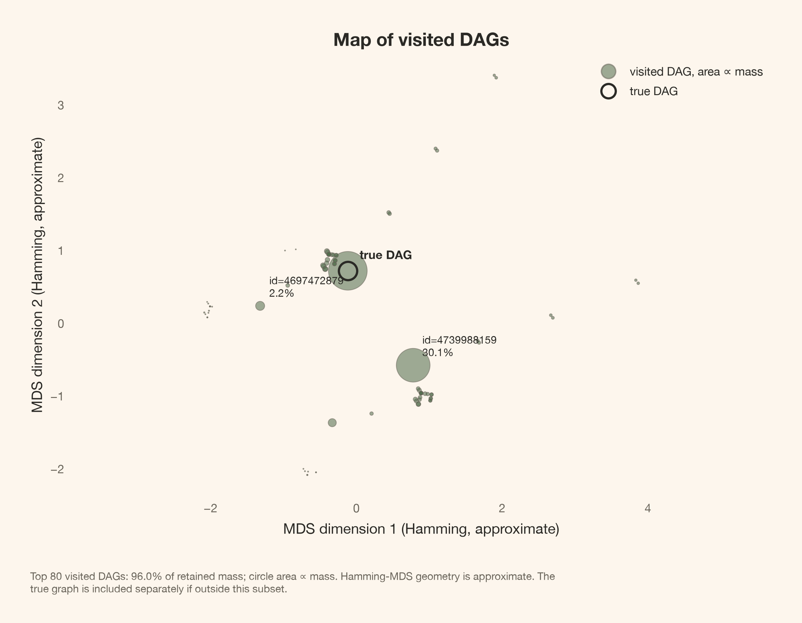
<figcaption>Figure 17: Leading visited DAGs are mapped by classical multidimensional scaling of pair-state Hamming distances. Marker areas encode empirical mass, and the subset’s mass is reported. The two-dimensional geometry is approximate; the generating DAG is ringed if visited and shown as a cross otherwise.</figcaption>
</figure>

Code

``` sourceCode
fig = plot_id_numberline(states, truth_states)
plt.show()
```

<figure class="quarto-float quarto-float-fig figure">
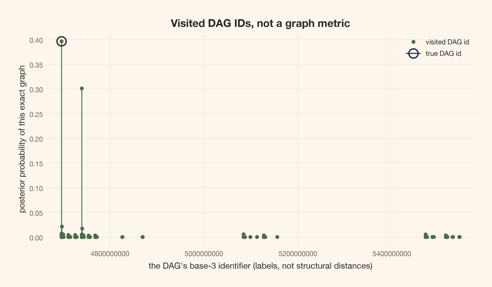
<figcaption>Figure 18: The number line contains only visited DAG identifiers. Base-3 numerical separation is not structural distance, and gaps do not establish empty posterior support. The generating ID is marked when visited.</figcaption>
</figure>

# Sensitivity changes assumptions, not which fit we choose to report

The main posterior is conditional on a dictionary and two layers of prior. We now vary those decisions without choosing a favorable run.

Six repeated-data rows cross the three frozen seeds (20260909,20260910,20260911) with N=300 and N=1{,}000. Within a seed, the smaller dataset is a prefix of the larger; these six rows are not six independent datasets. They share the dictionary and priors. Three further primary-data rows change only coefficient precision to \lambda=1, widen the centers to (-2,-1,0,1,2), or use directional weight 0.1 and absence 0.8 before masking. The last row is the controlled linear comparator.

Every fit retains the four-chain, full-length settings and the same sampling seed. The primary row reuses the baseline fit; the comparator row reuses its separately fitted posterior. These are **prespecified repeated-data and sensitivity checks**, not an interval-coverage study or a search for the best-looking specification.

All ten prespecified runs at the frozen settings

``` sourceCode
sparse_prior = pd.DataFrame(
    sparse_direction * (1 - np.eye(n_nodes)), index=labels, columns=labels,
)
sparse_probs = pair_probabilities(sparse_prior.to_numpy(), allowed.to_numpy())

runs = []
for data_seed in (DATA_SEED, *REPEAT_SEEDS):
    for size in (N_REPEAT, n_obs):
        name = f"seed {data_seed}, N={size}" + (
            " (primary)" if data_seed == DATA_SEED and size == n_obs else ""
        )
        if data_seed == DATA_SEED and size == n_obs:
            runs.append((name, posterior, baseline_probs))
        else:
            repeat_score = build_score(make_world(data_seed, size))
            runs.append((
                name,
                fit_graphs(
                    repeat_score, baseline_probs, labels,
                    seed=SAMPLING_SEED, draws=draws, tune=tune, betas=betas, chains=chains,
                ),
                baseline_probs,
            ))
runs += [
    (
        "primary, lam=1",
        fit_graphs(
            build_score(data, lam_value=lam_tight), baseline_probs, labels,
            seed=SAMPLING_SEED, draws=draws, tune=tune, betas=betas, chains=chains,
        ),
        baseline_probs,
    ),
    (
        "primary, centers (-2,-1,0,1,2)",
        fit_graphs(
            build_score(data, centers_value=centers_wide), baseline_probs, labels,
            seed=SAMPLING_SEED, draws=draws, tune=tune, betas=betas, chains=chains,
        ),
        baseline_probs,
    ),
    (
        "primary, sparse graph prior",
        fit_graphs(
            score, sparse_probs, labels,
            seed=SAMPLING_SEED, draws=draws, tune=tune, betas=betas, chains=chains,
        ),
        sparse_probs,
    ),
    ("primary, linear dictionary", linear_posterior, baseline_probs),
]
robustness_rows = [
    {
        "Specification": name,
        **fit_metrics(trace, probabilities, truth_states, pairs, labels, truth_key),
    }
    for name, trace, probabilities in runs
]
```

<figure class="quarto-float quarto-float-tbl figure">
<table id="T_b8dd6" class="caption-top table table-sm table-striped small" data-quarto-postprocess="true">
<thead>
<tr class="header">
<th id="T_b8dd6_level0_col0" class="col_heading level0 col0" data-quarto-table-cell-role="th">Specification</th>
<th id="T_b8dd6_level0_col1" class="col_heading level0 col1" data-quarto-table-cell-role="th">True-DAG rank</th>
<th id="T_b8dd6_level0_col2" class="col_heading level0 col2" data-quarto-table-cell-role="th">True-DAG mass</th>
<th id="T_b8dd6_level0_col3" class="col_heading level0 col3" data-quarto-table-cell-role="th">Skeleton mass</th>
<th id="T_b8dd6_level0_col4" class="col_heading level0 col4" data-quarto-table-cell-role="th">Class mass</th>
<th id="T_b8dd6_level0_col5" class="col_heading level0 col5" data-quarto-table-cell-role="th">d→f / f→d</th>
<th id="T_b8dd6_level0_col6" class="col_heading level0 col6" data-quarto-table-cell-role="th">Other arrows at 0.8</th>
<th id="T_b8dd6_level0_col7" class="col_heading level0 col7" data-quarto-table-cell-role="th">Max R-hat</th>
<th id="T_b8dd6_level0_col8" class="col_heading level0 col8" data-quarto-table-cell-role="th">Min bulk ESS</th>
</tr>
</thead>
<tbody>
<tr class="odd">
<td id="T_b8dd6_row0_col0" class="data row0 col0">seed 20260909, N=300</td>
<td id="T_b8dd6_row0_col1" class="data row0 col1">1</td>
<td id="T_b8dd6_row0_col2" class="data row0 col2">22.68%</td>
<td id="T_b8dd6_row0_col3" class="data row0 col3">39.83%</td>
<td id="T_b8dd6_row0_col4" class="data row0 col4">39.83%</td>
<td id="T_b8dd6_row0_col5" class="data row0 col5">0.56/0.44 (below 0.8)</td>
<td id="T_b8dd6_row0_col6" class="data row0 col6">7</td>
<td id="T_b8dd6_row0_col7" class="data row0 col7">1.0009</td>
<td id="T_b8dd6_row0_col8" class="data row0 col8">8067</td>
</tr>
<tr class="even">
<td id="T_b8dd6_row1_col0" class="data row1 col0">seed 20260909, N=1000 (primary)</td>
<td id="T_b8dd6_row1_col1" class="data row1 col1">1</td>
<td id="T_b8dd6_row1_col2" class="data row1 col2">39.65%</td>
<td id="T_b8dd6_row1_col3" class="data row1 col3">69.75%</td>
<td id="T_b8dd6_row1_col4" class="data row1 col4">69.75%</td>
<td id="T_b8dd6_row1_col5" class="data row1 col5">0.57/0.43 (below 0.8)</td>
<td id="T_b8dd6_row1_col6" class="data row1 col6">7</td>
<td id="T_b8dd6_row1_col7" class="data row1 col7">1.0003</td>
<td id="T_b8dd6_row1_col8" class="data row1 col8">12777</td>
</tr>
<tr class="odd">
<td id="T_b8dd6_row2_col0" class="data row2 col0">seed 20260910, N=300</td>
<td id="T_b8dd6_row2_col1" class="data row2 col1">1</td>
<td id="T_b8dd6_row2_col2" class="data row2 col2">28.59%</td>
<td id="T_b8dd6_row2_col3" class="data row2 col3">51.80%</td>
<td id="T_b8dd6_row2_col4" class="data row2 col4">51.80%</td>
<td id="T_b8dd6_row2_col5" class="data row2 col5">0.55/0.45 (below 0.8)</td>
<td id="T_b8dd6_row2_col6" class="data row2 col6">7</td>
<td id="T_b8dd6_row2_col7" class="data row2 col7">1.0007</td>
<td id="T_b8dd6_row2_col8" class="data row2 col8">8452</td>
</tr>
<tr class="even">
<td id="T_b8dd6_row3_col0" class="data row3 col0">seed 20260910, N=1000</td>
<td id="T_b8dd6_row3_col1" class="data row3 col1">1</td>
<td id="T_b8dd6_row3_col2" class="data row3 col2">38.83%</td>
<td id="T_b8dd6_row3_col3" class="data row3 col3">69.11%</td>
<td id="T_b8dd6_row3_col4" class="data row3 col4">69.11%</td>
<td id="T_b8dd6_row3_col5" class="data row3 col5">0.56/0.44 (below 0.8)</td>
<td id="T_b8dd6_row3_col6" class="data row3 col6">7</td>
<td id="T_b8dd6_row3_col7" class="data row3 col7">1.0004</td>
<td id="T_b8dd6_row3_col8" class="data row3 col8">11027</td>
</tr>
<tr class="odd">
<td id="T_b8dd6_row4_col0" class="data row4 col0">seed 20260911, N=300</td>
<td id="T_b8dd6_row4_col1" class="data row4 col1">1</td>
<td id="T_b8dd6_row4_col2" class="data row4 col2">21.35%</td>
<td id="T_b8dd6_row4_col3" class="data row4 col3">36.91%</td>
<td id="T_b8dd6_row4_col4" class="data row4 col4">36.91%</td>
<td id="T_b8dd6_row4_col5" class="data row4 col5">0.56/0.44 (below 0.8)</td>
<td id="T_b8dd6_row4_col6" class="data row4 col6">7</td>
<td id="T_b8dd6_row4_col7" class="data row4 col7">1.0013</td>
<td id="T_b8dd6_row4_col8" class="data row4 col8">8006</td>
</tr>
<tr class="even">
<td id="T_b8dd6_row5_col0" class="data row5 col0">seed 20260911, N=1000</td>
<td id="T_b8dd6_row5_col1" class="data row5 col1">1</td>
<td id="T_b8dd6_row5_col2" class="data row5 col2">30.88%</td>
<td id="T_b8dd6_row5_col3" class="data row5 col3">54.67%</td>
<td id="T_b8dd6_row5_col4" class="data row5 col4">54.67%</td>
<td id="T_b8dd6_row5_col5" class="data row5 col5">0.57/0.43 (below 0.8)</td>
<td id="T_b8dd6_row5_col6" class="data row5 col6">7</td>
<td id="T_b8dd6_row5_col7" class="data row5 col7">1.0006</td>
<td id="T_b8dd6_row5_col8" class="data row5 col8">9611</td>
</tr>
<tr class="odd">
<td id="T_b8dd6_row6_col0" class="data row6 col0">primary, lam=1</td>
<td id="T_b8dd6_row6_col1" class="data row6 col1">1</td>
<td id="T_b8dd6_row6_col2" class="data row6 col2">19.21%</td>
<td id="T_b8dd6_row6_col3" class="data row6 col3">32.84%</td>
<td id="T_b8dd6_row6_col4" class="data row6 col4">32.84%</td>
<td id="T_b8dd6_row6_col5" class="data row6 col5">0.59/0.41 (below 0.8)</td>
<td id="T_b8dd6_row6_col6" class="data row6 col6">7</td>
<td id="T_b8dd6_row6_col7" class="data row6 col7">1.0007</td>
<td id="T_b8dd6_row6_col8" class="data row6 col8">9081</td>
</tr>
<tr class="even">
<td id="T_b8dd6_row7_col0" class="data row7 col0">primary, centers (-2,-1,0,1,2)</td>
<td id="T_b8dd6_row7_col1" class="data row7 col1">1</td>
<td id="T_b8dd6_row7_col2" class="data row7 col2">39.66%</td>
<td id="T_b8dd6_row7_col3" class="data row7 col3">69.78%</td>
<td id="T_b8dd6_row7_col4" class="data row7 col4">69.78%</td>
<td id="T_b8dd6_row7_col5" class="data row7 col5">0.57/0.43 (below 0.8)</td>
<td id="T_b8dd6_row7_col6" class="data row7 col6">7</td>
<td id="T_b8dd6_row7_col7" class="data row7 col7">1.0003</td>
<td id="T_b8dd6_row7_col8" class="data row7 col8">12760</td>
</tr>
<tr class="odd">
<td id="T_b8dd6_row8_col0" class="data row8 col0">primary, sparse graph prior</td>
<td id="T_b8dd6_row8_col1" class="data row8 col1">1</td>
<td id="T_b8dd6_row8_col2" class="data row8 col2">54.30%</td>
<td id="T_b8dd6_row8_col3" class="data row8 col3">95.42%</td>
<td id="T_b8dd6_row8_col4" class="data row8 col4">95.42%</td>
<td id="T_b8dd6_row8_col5" class="data row8 col5">0.57/0.43 (below 0.8)</td>
<td id="T_b8dd6_row8_col6" class="data row8 col6">7</td>
<td id="T_b8dd6_row8_col7" class="data row8 col7">1.0002</td>
<td id="T_b8dd6_row8_col8" class="data row8 col8">29921</td>
</tr>
<tr class="even">
<td id="T_b8dd6_row9_col0" class="data row9 col0">primary, linear dictionary</td>
<td id="T_b8dd6_row9_col1" class="data row9 col1">1</td>
<td id="T_b8dd6_row9_col2" class="data row9 col2">38.94%</td>
<td id="T_b8dd6_row9_col3" class="data row9 col3">68.51%</td>
<td id="T_b8dd6_row9_col4" class="data row9 col4">68.51%</td>
<td id="T_b8dd6_row9_col5" class="data row9 col5">0.57/0.43 (below 0.8)</td>
<td id="T_b8dd6_row9_col6" class="data row9 col6">7</td>
<td id="T_b8dd6_row9_col7" class="data row9 col7">1.0003</td>
<td id="T_b8dd6_row9_col8" class="data row9 col8">12917</td>
</tr>
</tbody>
</table>
<figcaption>Table 11: Ten repeated-data and prespecified sensitivity rows: measured, not selected</figcaption>
</figure>

Ranks and masses are estimates. “Not visited” means zero empirical frequency at the **2.08e-05** draw resolution, not proven zero posterior probability.

Across the nonlinear rows, generating-class mass ranges from **32.84% to 95.42%**, versus **68.51%** for the linear comparator. The comparator’s generating-DAG rank is **1**. A better rank for one member is not by itself better recovery of a class whose two orientations are observationally indistinguishable.

The 0.8 marginal threshold introduced above marks descriptive pairwise decisions. The count of “Other arrows at 0.8” **always excludes d–f**, even if its probability crosses that threshold; the separate direction column reports the model’s tilt. No direction on that pair becomes identified by crossing a numerical cutoff.

# Exact checks can validate computation without validating the causal story

## Reconstructed terminal parents should reproduce all 64 weights

We have one exact seven-node marginal available: the terminal parent sets. This checks whether full reconstructed draws reproduce the distribution we derived, not just whether a scalar summary looks stable. The compact table covers at least 95% of exact terminal mass and groups the remaining parent sets without renormalizing.

Compare exact terminal weights with reconstructed full DAG draws

``` sourceCode
masks, weights = terminal_posteriors[y_index]
y_pairs = np.flatnonzero((pairs[:, 0] == y_index) | (pairs[:, 1] == y_index))
incoming_states = np.where(pairs[y_pairs, 1] == y_index, 1, 2)
parent_indices = np.where(
    pairs[y_pairs, 1] == y_index, pairs[y_pairs, 0], pairs[y_pairs, 1],
)
sampled_masks = (
    (posterior.posterior.edge.values[..., y_pairs] == incoming_states)
    * (1 << parent_indices)
).sum(axis=-1)
ranked_masks = np.argsort(weights)[::-1]
count = int(np.searchsorted(np.cumsum(weights[ranked_masks]), 0.95) + 1)
selected_masks = ranked_masks[:count]
terminal_rows = []
for index in selected_masks:
    parent_names = ", ".join(
        labels[node] for node in range(n_nodes) if masks[index] & (1 << node)
    )
    terminal_rows.append({
        "Parents of y": parent_names or "None", "Exact probability": weights[index],
        "Frequency in reconstructed draws": float(np.mean(sampled_masks == masks[index])),
    })
other = ~np.isin(masks, masks[selected_masks])
terminal_rows.append({
    "Parents of y": "Other parent sets", "Exact probability": float(weights[other].sum()),
    "Frequency in reconstructed draws": float(
        np.mean(~np.isin(sampled_masks, masks[selected_masks]))
    ),
})
display(article_table(
    pd.DataFrame(terminal_rows), "Exact terminal weights against reconstructed frequencies",
    formats={
        "Exact probability": "{:.2%}", "Frequency in reconstructed draws": "{:.2%}",
    },
))
```

<figure class="quarto-float quarto-float-tbl figure">
<table id="T_1666c" class="caption-top table table-sm table-striped small" data-quarto-postprocess="true">
<thead>
<tr class="header">
<th id="T_1666c_level0_col0" class="col_heading level0 col0" data-quarto-table-cell-role="th">Parents of y</th>
<th id="T_1666c_level0_col1" class="col_heading level0 col1" data-quarto-table-cell-role="th">Exact probability</th>
<th id="T_1666c_level0_col2" class="col_heading level0 col2" data-quarto-table-cell-role="th">Frequency in reconstructed draws</th>
</tr>
</thead>
<tbody>
<tr class="odd">
<td id="T_1666c_row0_col0" class="data row0 col0">a, b, c, e, f</td>
<td id="T_1666c_row0_col1" class="data row0 col1">99.96%</td>
<td id="T_1666c_row0_col2" class="data row0 col2">99.96%</td>
</tr>
<tr class="even">
<td id="T_1666c_row1_col0" class="data row1 col0">Other parent sets</td>
<td id="T_1666c_row1_col1" class="data row1 col1">0.04%</td>
<td id="T_1666c_row1_col2" class="data row1 col2">0.04%</td>
</tr>
</tbody>
</table>
<figcaption>Table 12: Exact terminal weights against reconstructed frequencies</figcaption>
</figure>

All 64 outcome-parent weights and frequencies

The full comparison retains tiny exact probabilities even when there are zero sampled visits. Zero frequency does not make those probabilities vanish.

Code

``` sourceCode
terminal_full_rows = []
for index in ranked_masks:
    parent_names = ", ".join(
        labels[node] for node in range(n_nodes) if masks[index] & (1 << node)
    )
    terminal_full_rows.append({
        "Parent mask": int(masks[index]), "Parents of y": parent_names or "None",
        "Exact probability": weights[index],
        "Frequency in reconstructed draws": float(np.mean(sampled_masks == masks[index])),
    })
display(article_table(
    pd.DataFrame(terminal_full_rows), "Every supported outcome-parent set, exactly normalized",
    formats={
        "Exact probability": "{:.6g}", "Frequency in reconstructed draws": "{:.6g}",
    },
))
```

<figure class="quarto-float quarto-float-tbl figure">
<table id="T_7b740" class="caption-top table table-sm table-striped small" data-quarto-postprocess="true">
<thead>
<tr class="header">
<th id="T_7b740_level0_col0" class="col_heading level0 col0" data-quarto-table-cell-role="th">Parent mask</th>
<th id="T_7b740_level0_col1" class="col_heading level0 col1" data-quarto-table-cell-role="th">Parents of y</th>
<th id="T_7b740_level0_col2" class="col_heading level0 col2" data-quarto-table-cell-role="th">Exact probability</th>
<th id="T_7b740_level0_col3" class="col_heading level0 col3" data-quarto-table-cell-role="th">Frequency in reconstructed draws</th>
</tr>
</thead>
<tbody>
<tr class="odd">
<td id="T_7b740_row0_col0" class="data row0 col0">55</td>
<td id="T_7b740_row0_col1" class="data row0 col1">a, b, c, e, f</td>
<td id="T_7b740_row0_col2" class="data row0 col2">0.999591</td>
<td id="T_7b740_row0_col3" class="data row0 col3">0.999604</td>
</tr>
<tr class="even">
<td id="T_7b740_row1_col0" class="data row1 col0">63</td>
<td id="T_7b740_row1_col1" class="data row1 col1">a, b, c, d, e, f</td>
<td id="T_7b740_row1_col2" class="data row1 col2">0.000409432</td>
<td id="T_7b740_row1_col3" class="data row1 col3">0.000395833</td>
</tr>
<tr class="odd">
<td id="T_7b740_row2_col0" class="data row2 col0">53</td>
<td id="T_7b740_row2_col1" class="data row2 col1">a, c, e, f</td>
<td id="T_7b740_row2_col2" class="data row2 col2">5.29171e-26</td>
<td id="T_7b740_row2_col3" class="data row2 col3">0</td>
</tr>
<tr class="even">
<td id="T_7b740_row3_col0" class="data row3 col0">54</td>
<td id="T_7b740_row3_col1" class="data row3 col1">b, c, e, f</td>
<td id="T_7b740_row3_col2" class="data row3 col2">1.33183e-28</td>
<td id="T_7b740_row3_col3" class="data row3 col3">0</td>
</tr>
<tr class="odd">
<td id="T_7b740_row4_col0" class="data row4 col0">61</td>
<td id="T_7b740_row4_col1" class="data row4 col1">a, c, d, e, f</td>
<td id="T_7b740_row4_col2" class="data row4 col2">3.01192e-29</td>
<td id="T_7b740_row4_col3" class="data row4 col3">0</td>
</tr>
<tr class="even">
<td id="T_7b740_row5_col0" class="data row5 col0">62</td>
<td id="T_7b740_row5_col1" class="data row5 col1">b, c, d, e, f</td>
<td id="T_7b740_row5_col2" class="data row5 col2">7.37814e-32</td>
<td id="T_7b740_row5_col3" class="data row5 col3">0</td>
</tr>
<tr class="odd">
<td id="T_7b740_row6_col0" class="data row6 col0">52</td>
<td id="T_7b740_row6_col1" class="data row6 col1">c, e, f</td>
<td id="T_7b740_row6_col2" class="data row6 col2">6.61573e-36</td>
<td id="T_7b740_row6_col3" class="data row6 col3">0</td>
</tr>
<tr class="even">
<td id="T_7b740_row7_col0" class="data row7 col0">60</td>
<td id="T_7b740_row7_col1" class="data row7 col1">c, d, e, f</td>
<td id="T_7b740_row7_col2" class="data row7 col2">4.49434e-39</td>
<td id="T_7b740_row7_col3" class="data row7 col3">0</td>
</tr>
<tr class="odd">
<td id="T_7b740_row8_col0" class="data row8 col0">51</td>
<td id="T_7b740_row8_col1" class="data row8 col1">a, b, e, f</td>
<td id="T_7b740_row8_col2" class="data row8 col2">1.73466e-46</td>
<td id="T_7b740_row8_col3" class="data row8 col3">0</td>
</tr>
<tr class="even">
<td id="T_7b740_row9_col0" class="data row9 col0">59</td>
<td id="T_7b740_row9_col1" class="data row9 col1">a, b, d, e, f</td>
<td id="T_7b740_row9_col2" class="data row9 col2">1.03672e-49</td>
<td id="T_7b740_row9_col3" class="data row9 col3">0</td>
</tr>
<tr class="odd">
<td id="T_7b740_row10_col0" class="data row10 col0">39</td>
<td id="T_7b740_row10_col1" class="data row10 col1">a, b, c, f</td>
<td id="T_7b740_row10_col2" class="data row10 col2">1.50503e-68</td>
<td id="T_7b740_row10_col3" class="data row10 col3">0</td>
</tr>
<tr class="even">
<td id="T_7b740_row11_col0" class="data row11 col0">49</td>
<td id="T_7b740_row11_col1" class="data row11 col1">a, e, f</td>
<td id="T_7b740_row11_col2" class="data row11 col2">1.21629e-68</td>
<td id="T_7b740_row11_col3" class="data row11 col3">0</td>
</tr>
<tr class="odd">
<td id="T_7b740_row12_col0" class="data row12 col0">57</td>
<td id="T_7b740_row12_col1" class="data row12 col1">a, d, e, f</td>
<td id="T_7b740_row12_col2" class="data row12 col2">1.1895e-71</td>
<td id="T_7b740_row12_col3" class="data row12 col3">0</td>
</tr>
<tr class="even">
<td id="T_7b740_row13_col0" class="data row13 col0">47</td>
<td id="T_7b740_row13_col1" class="data row13 col1">a, b, c, d, f</td>
<td id="T_7b740_row13_col2" class="data row13 col2">2.17313e-72</td>
<td id="T_7b740_row13_col3" class="data row13 col3">0</td>
</tr>
<tr class="odd">
<td id="T_7b740_row14_col0" class="data row14 col0">50</td>
<td id="T_7b740_row14_col1" class="data row14 col1">b, e, f</td>
<td id="T_7b740_row14_col2" class="data row14 col2">2.00755e-72</td>
<td id="T_7b740_row14_col3" class="data row14 col3">0</td>
</tr>
<tr class="even">
<td id="T_7b740_row15_col0" class="data row15 col0">58</td>
<td id="T_7b740_row15_col1" class="data row15 col1">b, d, e, f</td>
<td id="T_7b740_row15_col2" class="data row15 col2">1.78877e-75</td>
<td id="T_7b740_row15_col3" class="data row15 col3">0</td>
</tr>
<tr class="odd">
<td id="T_7b740_row16_col0" class="data row16 col0">48</td>
<td id="T_7b740_row16_col1" class="data row16 col1">e, f</td>
<td id="T_7b740_row16_col2" class="data row16 col2">4.797e-78</td>
<td id="T_7b740_row16_col3" class="data row16 col3">0</td>
</tr>
<tr class="even">
<td id="T_7b740_row17_col0" class="data row17 col0">56</td>
<td id="T_7b740_row17_col1" class="data row17 col1">d, e, f</td>
<td id="T_7b740_row17_col2" class="data row17 col2">5.88538e-81</td>
<td id="T_7b740_row17_col3" class="data row17 col3">0</td>
</tr>
<tr class="odd">
<td id="T_7b740_row18_col0" class="data row18 col0">31</td>
<td id="T_7b740_row18_col1" class="data row18 col1">a, b, c, d, e</td>
<td id="T_7b740_row18_col2" class="data row18 col2">7.41306e-87</td>
<td id="T_7b740_row18_col3" class="data row18 col3">0</td>
</tr>
<tr class="even">
<td id="T_7b740_row19_col0" class="data row19 col0">35</td>
<td id="T_7b740_row19_col1" class="data row19 col1">a, b, f</td>
<td id="T_7b740_row19_col2" class="data row19 col2">1.14374e-95</td>
<td id="T_7b740_row19_col3" class="data row19 col3">0</td>
</tr>
<tr class="odd">
<td id="T_7b740_row20_col0" class="data row20 col0">43</td>
<td id="T_7b740_row20_col1" class="data row20 col1">a, b, d, f</td>
<td id="T_7b740_row20_col2" class="data row20 col2">2.21081e-99</td>
<td id="T_7b740_row20_col3" class="data row20 col3">0</td>
</tr>
<tr class="even">
<td id="T_7b740_row21_col0" class="data row21 col0">29</td>
<td id="T_7b740_row21_col1" class="data row21 col1">a, c, d, e</td>
<td id="T_7b740_row21_col2" class="data row21 col2">7.13827e-101</td>
<td id="T_7b740_row21_col3" class="data row21 col3">0</td>
</tr>
<tr class="odd">
<td id="T_7b740_row22_col0" class="data row22 col0">30</td>
<td id="T_7b740_row22_col1" class="data row22 col1">b, c, d, e</td>
<td id="T_7b740_row22_col2" class="data row22 col2">2.62697e-104</td>
<td id="T_7b740_row22_col3" class="data row22 col3">0</td>
</tr>
<tr class="even">
<td id="T_7b740_row23_col0" class="data row23 col0">28</td>
<td id="T_7b740_row23_col1" class="data row23 col1">c, d, e</td>
<td id="T_7b740_row23_col2" class="data row23 col2">9.95587e-107</td>
<td id="T_7b740_row23_col3" class="data row23 col3">0</td>
</tr>
<tr class="odd">
<td id="T_7b740_row24_col0" class="data row24 col0">27</td>
<td id="T_7b740_row24_col1" class="data row24 col1">a, b, d, e</td>
<td id="T_7b740_row24_col2" class="data row24 col2">1.91408e-117</td>
<td id="T_7b740_row24_col3" class="data row24 col3">0</td>
</tr>
<tr class="even">
<td id="T_7b740_row25_col0" class="data row25 col0">25</td>
<td id="T_7b740_row25_col1" class="data row25 col1">a, d, e</td>
<td id="T_7b740_row25_col2" class="data row25 col2">1.06192e-130</td>
<td id="T_7b740_row25_col3" class="data row25 col3">0</td>
</tr>
<tr class="odd">
<td id="T_7b740_row26_col0" class="data row26 col0">26</td>
<td id="T_7b740_row26_col1" class="data row26 col1">b, d, e</td>
<td id="T_7b740_row26_col2" class="data row26 col2">4.40157e-135</td>
<td id="T_7b740_row26_col3" class="data row26 col3">0</td>
</tr>
<tr class="even">
<td id="T_7b740_row27_col0" class="data row27 col0">24</td>
<td id="T_7b740_row27_col1" class="data row27 col1">d, e</td>
<td id="T_7b740_row27_col2" class="data row27 col2">7.02672e-137</td>
<td id="T_7b740_row27_col3" class="data row27 col3">0</td>
</tr>
<tr class="odd">
<td id="T_7b740_row28_col0" class="data row28 col0">23</td>
<td id="T_7b740_row28_col1" class="data row28 col1">a, b, c, e</td>
<td id="T_7b740_row28_col2" class="data row28 col2">2.45834e-137</td>
<td id="T_7b740_row28_col3" class="data row28 col3">0</td>
</tr>
<tr class="even">
<td id="T_7b740_row29_col0" class="data row29 col0">15</td>
<td id="T_7b740_row29_col1" class="data row29 col1">a, b, c, d</td>
<td id="T_7b740_row29_col2" class="data row29 col2">2.37711e-139</td>
<td id="T_7b740_row29_col3" class="data row29 col3">0</td>
</tr>
<tr class="odd">
<td id="T_7b740_row30_col0" class="data row30 col0">21</td>
<td id="T_7b740_row30_col1" class="data row30 col1">a, c, e</td>
<td id="T_7b740_row30_col2" class="data row30 col2">6.2819e-148</td>
<td id="T_7b740_row30_col3" class="data row30 col3">0</td>
</tr>
<tr class="even">
<td id="T_7b740_row31_col0" class="data row31 col0">22</td>
<td id="T_7b740_row31_col1" class="data row31 col1">b, c, e</td>
<td id="T_7b740_row31_col2" class="data row31 col2">9.34509e-151</td>
<td id="T_7b740_row31_col3" class="data row31 col3">0</td>
</tr>
<tr class="odd">
<td id="T_7b740_row32_col0" class="data row32 col0">20</td>
<td id="T_7b740_row32_col1" class="data row32 col1">c, e</td>
<td id="T_7b740_row32_col2" class="data row32 col2">4.80187e-152</td>
<td id="T_7b740_row32_col3" class="data row32 col3">0</td>
</tr>
<tr class="even">
<td id="T_7b740_row33_col0" class="data row33 col0">11</td>
<td id="T_7b740_row33_col1" class="data row33 col1">a, b, d</td>
<td id="T_7b740_row33_col2" class="data row33 col2">9.22706e-158</td>
<td id="T_7b740_row33_col3" class="data row33 col3">0</td>
</tr>
<tr class="odd">
<td id="T_7b740_row34_col0" class="data row34 col0">19</td>
<td id="T_7b740_row34_col1" class="data row34 col1">a, b, e</td>
<td id="T_7b740_row34_col2" class="data row34 col2">1.24997e-162</td>
<td id="T_7b740_row34_col3" class="data row34 col3">0</td>
</tr>
<tr class="even">
<td id="T_7b740_row35_col0" class="data row35 col0">17</td>
<td id="T_7b740_row35_col1" class="data row35 col1">a, e</td>
<td id="T_7b740_row35_col2" class="data row35 col2">5.24614e-173</td>
<td id="T_7b740_row35_col3" class="data row35 col3">0</td>
</tr>
<tr class="odd">
<td id="T_7b740_row36_col0" class="data row36 col0">37</td>
<td id="T_7b740_row36_col1" class="data row36 col1">a, c, f</td>
<td id="T_7b740_row36_col2" class="data row36 col2">5.05305e-174</td>
<td id="T_7b740_row36_col3" class="data row36 col3">0</td>
</tr>
<tr class="even">
<td id="T_7b740_row37_col0" class="data row37 col0">18</td>
<td id="T_7b740_row37_col1" class="data row37 col1">b, e</td>
<td id="T_7b740_row37_col2" class="data row37 col2">8.53866e-177</td>
<td id="T_7b740_row37_col3" class="data row37 col3">0</td>
</tr>
<tr class="odd">
<td id="T_7b740_row38_col0" class="data row38 col0">16</td>
<td id="T_7b740_row38_col1" class="data row38 col1">e</td>
<td id="T_7b740_row38_col2" class="data row38 col2">1.06669e-177</td>
<td id="T_7b740_row38_col3" class="data row38 col3">0</td>
</tr>
<tr class="even">
<td id="T_7b740_row39_col0" class="data row39 col0">45</td>
<td id="T_7b740_row39_col1" class="data row39 col1">a, c, d, f</td>
<td id="T_7b740_row39_col2" class="data row39 col2">7.83034e-178</td>
<td id="T_7b740_row39_col3" class="data row39 col3">0</td>
</tr>
<tr class="odd">
<td id="T_7b740_row40_col0" class="data row40 col0">7</td>
<td id="T_7b740_row40_col1" class="data row40 col1">a, b, c</td>
<td id="T_7b740_row40_col2" class="data row40 col2">1.53729e-178</td>
<td id="T_7b740_row40_col3" class="data row40 col3">0</td>
</tr>
<tr class="even">
<td id="T_7b740_row41_col0" class="data row41 col0">33</td>
<td id="T_7b740_row41_col1" class="data row41 col1">a, f</td>
<td id="T_7b740_row41_col2" class="data row41 col2">4.24304e-190</td>
<td id="T_7b740_row41_col3" class="data row41 col3">0</td>
</tr>
<tr class="odd">
<td id="T_7b740_row42_col0" class="data row42 col0">41</td>
<td id="T_7b740_row42_col1" class="data row42 col1">a, d, f</td>
<td id="T_7b740_row42_col2" class="data row42 col2">9.98644e-194</td>
<td id="T_7b740_row42_col3" class="data row42 col3">0</td>
</tr>
<tr class="even">
<td id="T_7b740_row43_col0" class="data row43 col0">3</td>
<td id="T_7b740_row43_col1" class="data row43 col1">a, b</td>
<td id="T_7b740_row43_col2" class="data row43 col2">1.72875e-194</td>
<td id="T_7b740_row43_col3" class="data row43 col3">0</td>
</tr>
<tr class="odd">
<td id="T_7b740_row44_col0" class="data row44 col0">38</td>
<td id="T_7b740_row44_col1" class="data row44 col1">b, c, f</td>
<td id="T_7b740_row44_col2" class="data row44 col2">4.41389e-195</td>
<td id="T_7b740_row44_col3" class="data row44 col3">0</td>
</tr>
<tr class="even">
<td id="T_7b740_row45_col0" class="data row45 col0">46</td>
<td id="T_7b740_row45_col1" class="data row45 col1">b, c, d, f</td>
<td id="T_7b740_row45_col2" class="data row45 col2">6.09455e-199</td>
<td id="T_7b740_row45_col3" class="data row45 col3">0</td>
</tr>
<tr class="odd">
<td id="T_7b740_row46_col0" class="data row46 col0">34</td>
<td id="T_7b740_row46_col1" class="data row46 col1">b, f</td>
<td id="T_7b740_row46_col2" class="data row46 col2">8.59701e-211</td>
<td id="T_7b740_row46_col3" class="data row46 col3">0</td>
</tr>
<tr class="even">
<td id="T_7b740_row47_col0" class="data row47 col0">42</td>
<td id="T_7b740_row47_col1" class="data row47 col1">b, d, f</td>
<td id="T_7b740_row47_col2" class="data row47 col2">1.52303e-214</td>
<td id="T_7b740_row47_col3" class="data row47 col3">0</td>
</tr>
<tr class="odd">
<td id="T_7b740_row48_col0" class="data row48 col0">13</td>
<td id="T_7b740_row48_col1" class="data row48 col1">a, c, d</td>
<td id="T_7b740_row48_col2" class="data row48 col2">6.24881e-219</td>
<td id="T_7b740_row48_col3" class="data row48 col3">0</td>
</tr>
<tr class="even">
<td id="T_7b740_row49_col0" class="data row49 col0">9</td>
<td id="T_7b740_row49_col1" class="data row49 col1">a, d</td>
<td id="T_7b740_row49_col2" class="data row49 col2">8.16751e-231</td>
<td id="T_7b740_row49_col3" class="data row49 col3">0</td>
</tr>
<tr class="odd">
<td id="T_7b740_row50_col0" class="data row50 col0">14</td>
<td id="T_7b740_row50_col1" class="data row50 col1">b, c, d</td>
<td id="T_7b740_row50_col2" class="data row50 col2">6.33026e-240</td>
<td id="T_7b740_row50_col3" class="data row50 col3">0</td>
</tr>
<tr class="even">
<td id="T_7b740_row51_col0" class="data row51 col0">5</td>
<td id="T_7b740_row51_col1" class="data row51 col1">a, c</td>
<td id="T_7b740_row51_col2" class="data row51 col2">2.47262e-245</td>
<td id="T_7b740_row51_col3" class="data row51 col3">0</td>
</tr>
<tr class="odd">
<td id="T_7b740_row52_col0" class="data row52 col0">10</td>
<td id="T_7b740_row52_col1" class="data row52 col1">b, d</td>
<td id="T_7b740_row52_col2" class="data row52 col2">5.83866e-252</td>
<td id="T_7b740_row52_col3" class="data row52 col3">0</td>
</tr>
<tr class="even">
<td id="T_7b740_row53_col0" class="data row53 col0">1</td>
<td id="T_7b740_row53_col1" class="data row53 col1">a</td>
<td id="T_7b740_row53_col2" class="data row53 col2">2.94938e-256</td>
<td id="T_7b740_row53_col3" class="data row53 col3">0</td>
</tr>
<tr class="odd">
<td id="T_7b740_row54_col0" class="data row54 col0">36</td>
<td id="T_7b740_row54_col1" class="data row54 col1">c, f</td>
<td id="T_7b740_row54_col2" class="data row54 col2">1.28871e-258</td>
<td id="T_7b740_row54_col3" class="data row54 col3">0</td>
</tr>
<tr class="even">
<td id="T_7b740_row55_col0" class="data row55 col0">44</td>
<td id="T_7b740_row55_col1" class="data row55 col1">c, d, f</td>
<td id="T_7b740_row55_col2" class="data row55 col2">2.06755e-262</td>
<td id="T_7b740_row55_col3" class="data row55 col3">0</td>
</tr>
<tr class="odd">
<td id="T_7b740_row56_col0" class="data row56 col0">6</td>
<td id="T_7b740_row56_col1" class="data row56 col1">b, c</td>
<td id="T_7b740_row56_col2" class="data row56 col2">7.01388e-264</td>
<td id="T_7b740_row56_col3" class="data row56 col3">0</td>
</tr>
<tr class="even">
<td id="T_7b740_row57_col0" class="data row57 col0">32</td>
<td id="T_7b740_row57_col1" class="data row57 col1">f</td>
<td id="T_7b740_row57_col2" class="data row57 col2">8.1146e-270</td>
<td id="T_7b740_row57_col3" class="data row57 col3">0</td>
</tr>
<tr class="odd">
<td id="T_7b740_row58_col0" class="data row58 col0">40</td>
<td id="T_7b740_row58_col1" class="data row58 col1">d, f</td>
<td id="T_7b740_row58_col2" class="data row58 col2">1.85349e-273</td>
<td id="T_7b740_row58_col3" class="data row58 col3">0</td>
</tr>
<tr class="even">
<td id="T_7b740_row59_col0" class="data row59 col0">2</td>
<td id="T_7b740_row59_col1" class="data row59 col1">b</td>
<td id="T_7b740_row59_col2" class="data row59 col2">3.02194e-275</td>
<td id="T_7b740_row59_col3" class="data row59 col3">0</td>
</tr>
<tr class="odd">
<td id="T_7b740_row60_col0" class="data row60 col0">12</td>
<td id="T_7b740_row60_col1" class="data row60 col1">c, d</td>
<td id="T_7b740_row60_col2" class="data row60 col2">1.01282e-291</td>
<td id="T_7b740_row60_col3" class="data row60 col3">0</td>
</tr>
<tr class="even">
<td id="T_7b740_row61_col0" class="data row61 col0">8</td>
<td id="T_7b740_row61_col1" class="data row61 col1">d</td>
<td id="T_7b740_row61_col2" class="data row61 col2">1.39568e-300</td>
<td id="T_7b740_row61_col3" class="data row61 col3">0</td>
</tr>
<tr class="odd">
<td id="T_7b740_row62_col0" class="data row62 col0">4</td>
<td id="T_7b740_row62_col1" class="data row62 col1">c</td>
<td id="T_7b740_row62_col2" class="data row62 col2">1.03526e-309</td>
<td id="T_7b740_row62_col3" class="data row62 col3">0</td>
</tr>
<tr class="even">
<td id="T_7b740_row63_col0" class="data row63 col0">0</td>
<td id="T_7b740_row63_col1" class="data row63 col1">None</td>
<td id="T_7b740_row63_col2" class="data row63 col2">2.37548e-318</td>
<td id="T_7b740_row63_col3" class="data row63 col3">0</td>
</tr>
</tbody>
</table>
<figcaption>Table 13: Every supported outcome-parent set, exactly normalized</figcaption>
</figure>

This marginal comparison checks the reconstructed terminal draws against the derived weights. It cannot certify the unresolved core’s full distribution. The four-node oracle below independently checks terminal weights against exhaustive full-joint probabilities, alongside an evidence calculation written independently from raw observations.

## Two independent oracles check more than internal consistency

The first oracle enumerates four-node graphs, checks the compiled PyMC target and exact CPDAG orientations, and compares sampled distributions with exhaustive weights. Its fixtures include support masks, self-transition behavior, terminal reductions, and reconstructed full graph distributions.

The second derives a multivariate-t likelihood on raw observations independently of `BasisScore`, then checks local evidence, posterior parameters and draws, prediction, simulation, and intervention replacement. It includes small and zero-data families, duplicated inputs, coherent unit transformations, the target’s table-relative constant, and a non-score-equivalent fixture. Classical BGe evidence is used only as an oracle fixture; it is not the seven-node nonlinear target.

These helpers contain executable assertions. A failed assertion interrupts this article; this is not a claim that CI executes the analysis.

Run the independent graph and mechanism oracles

``` sourceCode
checks_small = check_small_graphs(make_graph_model)
checks_basis = check_basis_score(make_graph_model)


def check_result_text(value):
    """Format an oracle result without replacing computed values."""
    if isinstance(value, (bool, np.bool_)):
        return str(value)
    if isinstance(value, (int, np.integer)):
        return f"{value:,}"
    return f"{value:.3g}"


def full_check_frame(results):
    """Keep every named result from an oracle in a display table."""
    return pd.DataFrame({
        "Check": [name.replace("_", " ") for name in results],
        "Result": [check_result_text(value) for value in results.values()],
    })
```

The compact displays select four representative results from each oracle. The two disclosures preserve **every** returned result, including numerical errors and empirical distribution checks rather than only a “passed” label.

<figure class="quarto-float quarto-float-tbl figure">
<table id="T_127cb" class="caption-top table table-sm table-striped small" data-quarto-postprocess="true">
<thead>
<tr class="header">
<th id="T_127cb_level0_col0" class="col_heading level0 col0" data-quarto-table-cell-role="th">Check</th>
<th id="T_127cb_level0_col1" class="col_heading level0 col1" data-quarto-table-cell-role="th">Result</th>
</tr>
</thead>
<tbody>
<tr class="odd">
<td id="T_127cb_row0_col0" class="data row0 col0">Four-node DAGs enumerated</td>
<td id="T_127cb_row0_col1" class="data row0 col1">543</td>
</tr>
<tr class="even">
<td id="T_127cb_row1_col0" class="data row1 col0">Equivalence classes enumerated</td>
<td id="T_127cb_row1_col1" class="data row1 col1">185</td>
</tr>
<tr class="odd">
<td id="T_127cb_row2_col0" class="data row2 col0">Maximum compiled-target error</td>
<td id="T_127cb_row2_col1" class="data row2 col1">3.55e-15</td>
</tr>
<tr class="even">
<td id="T_127cb_row3_col0" class="data row3 col0">Sampled-class total variation</td>
<td id="T_127cb_row3_col1" class="data row3 col1">0.010</td>
</tr>
</tbody>
</table>
<figcaption>Table 14: Finite-state oracle: four representative checks</figcaption>
</figure>

<figure class="quarto-float quarto-float-tbl figure">
<table id="T_9a556" class="caption-top table table-sm table-striped small" data-quarto-postprocess="true">
<thead>
<tr class="header">
<th id="T_9a556_level0_col0" class="col_heading level0 col0" data-quarto-table-cell-role="th">Check</th>
<th id="T_9a556_level0_col1" class="col_heading level0 col1" data-quarto-table-cell-role="th">Result</th>
</tr>
</thead>
<tbody>
<tr class="odd">
<td id="T_9a556_row0_col0" class="data row0 col0">Local families checked</td>
<td id="T_9a556_row0_col1" class="data row0 col1">224 (32 mixed)</td>
</tr>
<tr class="even">
<td id="T_9a556_row1_col0" class="data row1 col0">Evidence agreement (t / closed form)</td>
<td id="T_9a556_row1_col1" class="data row1 col1">2.03e-13</td>
</tr>
<tr class="odd">
<td id="T_9a556_row2_col0" class="data row2 col0">Local-posterior agreement</td>
<td id="T_9a556_row2_col1" class="data row2 col1">2.11e-13</td>
</tr>
<tr class="even">
<td id="T_9a556_row3_col0" class="data row3 col0">Prediction / simulation / do agreement</td>
<td id="T_9a556_row3_col1" class="data row3 col1">4.44e-16</td>
</tr>
</tbody>
</table>
<figcaption>Table 15: Basis and mechanism oracles: four representative checks</figcaption>
</figure>

Complete finite-state results

<figure class="quarto-float quarto-float-tbl figure">
<table id="T_4adfa" class="caption-top table table-sm table-striped small" data-quarto-postprocess="true">
<thead>
<tr class="header">
<th id="T_4adfa_level0_col0" class="col_heading level0 col0" data-quarto-table-cell-role="th">Check</th>
<th id="T_4adfa_level0_col1" class="col_heading level0 col1" data-quarto-table-cell-role="th">Result</th>
</tr>
</thead>
<tbody>
<tr class="odd">
<td id="T_4adfa_row0_col0" class="data row0 col0">four node DAGs</td>
<td id="T_4adfa_row0_col1" class="data row0 col1">543</td>
</tr>
<tr class="even">
<td id="T_4adfa_row1_col0" class="data row1 col0">four node CPDAGs</td>
<td id="T_4adfa_row1_col1" class="data row1 col1">185</td>
</tr>
<tr class="odd">
<td id="T_4adfa_row2_col0" class="data row2 col0">cyclic states rejected</td>
<td id="T_4adfa_row2_col1" class="data row2 col1">186</td>
</tr>
<tr class="even">
<td id="T_4adfa_row3_col0" class="data row3 col0">maximum target error</td>
<td id="T_4adfa_row3_col1" class="data row3 col1">3.55e-15</td>
</tr>
<tr class="odd">
<td id="T_4adfa_row4_col0" class="data row4 col0">maximum score equivalence error</td>
<td id="T_4adfa_row4_col1" class="data row4 col1">0</td>
</tr>
<tr class="even">
<td id="T_4adfa_row5_col0" class="data row5 col0">sampled class total variation</td>
<td id="T_4adfa_row5_col1" class="data row5 col1">0.0105</td>
</tr>
<tr class="odd">
<td id="T_4adfa_row6_col0" class="data row6 col0">masked core full joint TV</td>
<td id="T_4adfa_row6_col1" class="data row6 col1">0.00484</td>
</tr>
<tr class="even">
<td id="T_4adfa_row7_col0" class="data row7 col0">subnormal prior max probability error</td>
<td id="T_4adfa_row7_col1" class="data row7 col1">0.0113</td>
</tr>
<tr class="odd">
<td id="T_4adfa_row8_col0" class="data row8 col0">two state periodicity max probability error</td>
<td id="T_4adfa_row8_col1" class="data row8 col1">0.003</td>
</tr>
<tr class="even">
<td id="T_4adfa_row9_col0" class="data row9 col0">y sink valid DAGs</td>
<td id="T_4adfa_row9_col1" class="data row9 col1">200</td>
</tr>
<tr class="odd">
<td id="T_4adfa_row10_col0" class="data row10 col0">y sink terminal parent masks</td>
<td id="T_4adfa_row10_col1" class="data row10 col1">8</td>
</tr>
<tr class="even">
<td id="T_4adfa_row11_col0" class="data row11 col0">y sink full joint TV</td>
<td id="T_4adfa_row11_col1" class="data row11 col1">0.0114</td>
</tr>
<tr class="odd">
<td id="T_4adfa_row12_col0" class="data row12 col0">y sink class TV</td>
<td id="T_4adfa_row12_col1" class="data row12 col1">0.0043</td>
</tr>
<tr class="even">
<td id="T_4adfa_row13_col0" class="data row13 col0">non last terminal</td>
<td id="T_4adfa_row13_col1" class="data row13 col1">0</td>
</tr>
<tr class="odd">
<td id="T_4adfa_row14_col0" class="data row14 col0">multiple terminal count</td>
<td id="T_4adfa_row14_col1" class="data row14 col1">2</td>
</tr>
<tr class="even">
<td id="T_4adfa_row15_col0" class="data row15 col0">non last full joint TV</td>
<td id="T_4adfa_row15_col1" class="data row15 col1">0.0192</td>
</tr>
<tr class="odd">
<td id="T_4adfa_row16_col0" class="data row16 col0">multiple terminal full joint TV</td>
<td id="T_4adfa_row16_col1" class="data row16 col1">0.0175</td>
</tr>
<tr class="even">
<td id="T_4adfa_row17_col0" class="data row17 col0">fixed graph active pairs</td>
<td id="T_4adfa_row17_col1" class="data row17 col1">0</td>
</tr>
<tr class="odd">
<td id="T_4adfa_row18_col0" class="data row18 col0">forced cycle rejected</td>
<td id="T_4adfa_row18_col1" class="data row18 col1">True</td>
</tr>
<tr class="even">
<td id="T_4adfa_row19_col0" class="data row19 col0">reset trajectory agreement</td>
<td id="T_4adfa_row19_col1" class="data row19 col1">True</td>
</tr>
</tbody>
</table>
<figcaption>Table 16: Complete checks of graphs, equivalence classes, and sampler behavior</figcaption>
</figure>

Complete basis and mechanism results

<figure class="quarto-float quarto-float-tbl figure">
<table id="T_12ef9" class="caption-top table table-sm table-striped small" data-quarto-postprocess="true">
<thead>
<tr class="header">
<th id="T_12ef9_level0_col0" class="col_heading level0 col0" data-quarto-table-cell-role="th">Check</th>
<th id="T_12ef9_level0_col1" class="col_heading level0 col1" data-quarto-table-cell-role="th">Result</th>
</tr>
</thead>
<tbody>
<tr class="odd">
<td id="T_12ef9_row0_col0" class="data row0 col0">legal families checked</td>
<td id="T_12ef9_row0_col1" class="data row0 col1">224</td>
</tr>
<tr class="even">
<td id="T_12ef9_row1_col0" class="data row1 col0">t oracle max abs error</td>
<td id="T_12ef9_row1_col1" class="data row1 col1">2.03e-13</td>
</tr>
<tr class="odd">
<td id="T_12ef9_row2_col0" class="data row2 col0">closed form max abs error</td>
<td id="T_12ef9_row2_col1" class="data row2 col1">1.07e-14</td>
</tr>
<tr class="even">
<td id="T_12ef9_row3_col0" class="data row3 col0">local posterior max abs error</td>
<td id="T_12ef9_row3_col1" class="data row3 col1">2.11e-13</td>
</tr>
<tr class="odd">
<td id="T_12ef9_row4_col0" class="data row4 col0">mixed families checked</td>
<td id="T_12ef9_row4_col1" class="data row4 col1">32</td>
</tr>
<tr class="even">
<td id="T_12ef9_row5_col0" class="data row5 col0">mixed oracle max abs error</td>
<td id="T_12ef9_row5_col1" class="data row5 col1">2.11e-13</td>
</tr>
<tr class="odd">
<td id="T_12ef9_row6_col0" class="data row6 col0">intercept only families checked</td>
<td id="T_12ef9_row6_col1" class="data row6 col1">28</td>
</tr>
<tr class="even">
<td id="T_12ef9_row7_col0" class="data row7 col0">N1 N lt p max abs error</td>
<td id="T_12ef9_row7_col1" class="data row7 col1">1.02e-14</td>
</tr>
<tr class="odd">
<td id="T_12ef9_row8_col0" class="data row8 col0">duplicated input max abs error</td>
<td id="T_12ef9_row8_col1" class="data row8 col1">3.2e-13</td>
</tr>
<tr class="even">
<td id="T_12ef9_row9_col0" class="data row9 col0">N0 max abs log evidence</td>
<td id="T_12ef9_row9_col1" class="data row9 col1">0</td>
</tr>
<tr class="odd">
<td id="T_12ef9_row10_col0" class="data row10 col0">N0 local posterior max abs error</td>
<td id="T_12ef9_row10_col1" class="data row10 col1">0</td>
</tr>
<tr class="even">
<td id="T_12ef9_row11_col0" class="data row11 col0">N0 prior draw KS</td>
<td id="T_12ef9_row11_col1" class="data row11 col1">0.0131</td>
</tr>
<tr class="odd">
<td id="T_12ef9_row12_col0" class="data row12 col0">posterior draw variance KS</td>
<td id="T_12ef9_row12_col1" class="data row12 col1">0.00884</td>
</tr>
<tr class="even">
<td id="T_12ef9_row13_col0" class="data row13 col0">posterior draw coefficients KS</td>
<td id="T_12ef9_row13_col1" class="data row13 col1">0.0149</td>
</tr>
<tr class="odd">
<td id="T_12ef9_row14_col0" class="data row14 col0">posterior mean max z</td>
<td id="T_12ef9_row14_col1" class="data row14 col1">1.45</td>
</tr>
<tr class="even">
<td id="T_12ef9_row15_col0" class="data row15 col0">posterior mean variance max z</td>
<td id="T_12ef9_row15_col1" class="data row15 col1">1.27</td>
</tr>
<tr class="odd">
<td id="T_12ef9_row16_col0" class="data row16 col0">prior draw KS</td>
<td id="T_12ef9_row16_col1" class="data row16 col1">0.0156</td>
</tr>
<tr class="even">
<td id="T_12ef9_row17_col0" class="data row17 col0">block max abs error</td>
<td id="T_12ef9_row17_col1" class="data row17 col1">0</td>
</tr>
<tr class="odd">
<td id="T_12ef9_row18_col0" class="data row18 col0">predict max abs error</td>
<td id="T_12ef9_row18_col1" class="data row18 col1">0</td>
</tr>
<tr class="even">
<td id="T_12ef9_row19_col0" class="data row19 col0">simulate max abs error</td>
<td id="T_12ef9_row19_col1" class="data row19 col1">4.44e-16</td>
</tr>
<tr class="odd">
<td id="T_12ef9_row20_col0" class="data row20 col0">do replacement max abs error</td>
<td id="T_12ef9_row20_col1" class="data row20 col1">4.44e-16</td>
</tr>
<tr class="even">
<td id="T_12ef9_row21_col0" class="data row21 col0">no path effect max abs</td>
<td id="T_12ef9_row21_col1" class="data row21 col1">0</td>
</tr>
<tr class="odd">
<td id="T_12ef9_row22_col0" class="data row22 col0">config aliasing max delta</td>
<td id="T_12ef9_row22_col1" class="data row22 col1">0</td>
</tr>
<tr class="even">
<td id="T_12ef9_row23_col0" class="data row23 col0">unit transform jacobian error</td>
<td id="T_12ef9_row23_col1" class="data row23 col1">3.55e-15</td>
</tr>
<tr class="odd">
<td id="T_12ef9_row24_col0" class="data row24 col0">unit transform table error</td>
<td id="T_12ef9_row24_col1" class="data row24 col1">3.55e-15</td>
</tr>
<tr class="even">
<td id="T_12ef9_row25_col0" class="data row25 col0">noncoherent beta0 gap</td>
<td id="T_12ef9_row25_col1" class="data row25 col1">0.3</td>
</tr>
<tr class="odd">
<td id="T_12ef9_row26_col0" class="data row26 col0">domain rejections verified</td>
<td id="T_12ef9_row26_col1" class="data row26 col1">36</td>
</tr>
<tr class="even">
<td id="T_12ef9_row27_col0" class="data row27 col0">domain acceptances verified</td>
<td id="T_12ef9_row27_col1" class="data row27 col1">8</td>
</tr>
<tr class="odd">
<td id="T_12ef9_row28_col0" class="data row28 col0">pymc target constant error</td>
<td id="T_12ef9_row28_col1" class="data row28 col1">7.11e-15</td>
</tr>
<tr class="even">
<td id="T_12ef9_row29_col0" class="data row29 col0">pymc target constant spread</td>
<td id="T_12ef9_row29_col1" class="data row29 col1">7.11e-15</td>
</tr>
<tr class="odd">
<td id="T_12ef9_row30_col0" class="data row30 col0">pymc target cycles rejected</td>
<td id="T_12ef9_row30_col1" class="data row30 col1">2</td>
</tr>
<tr class="even">
<td id="T_12ef9_row31_col0" class="data row31 col0">full DAGs enumerated</td>
<td id="T_12ef9_row31_col1" class="data row31 col1">12</td>
</tr>
<tr class="odd">
<td id="T_12ef9_row32_col0" class="data row32 col0">full DAG sampler TV</td>
<td id="T_12ef9_row32_col1" class="data row32 col1">0.0108</td>
</tr>
<tr class="even">
<td id="T_12ef9_row33_col0" class="data row33 col0">full DAG sampler max cell error</td>
<td id="T_12ef9_row33_col1" class="data row33 col1">0.00353</td>
</tr>
<tr class="odd">
<td id="T_12ef9_row34_col0" class="data row34 col0">terminal parent marginal error</td>
<td id="T_12ef9_row34_col1" class="data row34 col1">0.004</td>
</tr>
<tr class="even">
<td id="T_12ef9_row35_col0" class="data row35 col0">class TV descriptive</td>
<td id="T_12ef9_row35_col1" class="data row35 col1">0.00567</td>
</tr>
<tr class="odd">
<td id="T_12ef9_row36_col0" class="data row36 col0">non score equivalence gap</td>
<td id="T_12ef9_row36_col1" class="data row36 col1">0.282</td>
</tr>
</tbody>
</table>
<figcaption>Table 17: Complete checks of evidence, parameter draws, prediction, and interventions</figcaption>
</figure>

The four-node oracle is not an exhaustive seven-node normalization. Its finite Monte Carlo tolerances are fixture checks, not coverage or error-rate guarantees. The separately written raw-observation likelihood checks the derivation rather than merely calling the same score twice. Together with the terminal comparison and chain diagnostics, it gives layered evidence for the **coded computation**. None of these checks measures whether the hard mask or absence of hidden causes is scientifically justified.

# Considerations

## Transfer requires new declarations, not new variable labels

The computation can travel only if its assumptions are re-declared. The mappings below are proposals; **none of these applications has been fitted here**. Each node is also a local response, so every variance-prior scale \beta\_{0i} must use that variable’s squared units.

| Domain | Proposed node mapping | Continuous iid approximation | Re-declare before use | Key likely violation | Possible extensions (not implemented) |
|----|----|----|----|----|----|
| Biology | a,b,c baseline biomarkers; d dose or exposure; e pathway activity; f receptor response; y clinical outcome | patients as independent rows, continuous measurements | measurement units, dictionary, variance-prior scales \beta\_{0i}, outcome-terminal mask as clinical knowledge | hidden severity and selection into treatment | latent-confounder graphs (MAG/PAG), count or ordinal outcomes, patient-level pooling |
| Industrial | a,b,c ambient conditions; d control setting; e intermediate temperature; f sensor reading; y quality metric | batches as iid, continuous sensors | units and scales per sensor, variance-prior scales \beta\_{0i}, forbidden arrows only where time ordering licenses them | feedback loops and time autocorrelation | dynamic graphs, autoregressive noise, state-space mechanisms |
| Marketing | a,b,c audience traits; d calendar/holiday driver; e engagement; f media exposure; y conversion value | continuous indices as an iid approximation, not literal calendar counts or spend | units, exposure link, variance-prior scales \beta\_{0i}, media cannot cause the calendar | shared calendar shocks, temporal dependence, budget-driven confounding | time-series mechanisms, count likelihoods, hierarchical pooling, hidden-confounder models |

These extensions are not provided by the present implementation. Reusing the sampler cannot repair a missing measurement process, an endogenous treatment policy, or a feedback system. A wrong hard mask and an omitted common cause can both produce sharp, confident, wrong posteriors whose chains mix well.

## Additivity and finite dictionaries limit what the model can say

Additivity excludes within-mechanism parent interactions. More univariate bumps cannot represent a nonadditive joint response to d and b in the same equation. Far from the bump centers, their contributions vanish and the linear term dominates. The fitted mechanism has **no guaranteed saturating extrapolation**, even though the generating response saturates.

The finite table grows exponentially with the number of potential parents. The terminal reduction uses special structure; it does not turn general causal discovery into a scalable enumerative method. Seven nodes and a few oracle fixtures establish no runtime or memory guarantee for larger systems.

## What the framework cannot tell us

Predictive fit cannot decide between our observational twins. Graph probabilities remain conditional on the measured nodes, mechanism dictionary, parameter prior, graph prior, and hard support. The sensitivity table explores a few frozen alternatives, not all possible misspecification. We have not run a repeated-dataset calibration or interval-coverage study, and “take the top DAG” has no selection-error guarantee here.

MCMC diagnostics provide evidence about exploration of the coded target, not a guarantee against a shared unvisited region. Exact terminal weights check one factorizable marginal. The oracles check finite computational fixtures. **Computation checked does not mean causal assumptions validated.**

PyMC’s role is real but bounded: it holds the discrete unknown, compiles the inspectable log density, manages chains and random streams, and returns dimension-labeled draws and sampler statistics. The custom compiled kernel supplies discrete moves, support checks, and tempering. Merely writing an adjacency variable in a probabilistic program supplies none of those scientific assumptions or graph-search guarantees.

The next article, [From Uncertain Graphs to Uncertain Effects](../../articles/from_uncertain_graphs_to_uncertain_effects/from_uncertain_graphs_to_uncertain_effects.html), carries graph and mechanism uncertainty into a finite intervention contrast. That step needs the member-DAG weights, not just the leading CPDAG. It cannot remove the unresolved direction by numerical integration.

# Conclusions

We started with a tempting shortcut: equating a well-computed graph posterior with a discovered causal structure. The controlled world makes the failure concrete. The d–f direction has an exact observational twin, even when the outcome is nonlinear.

The correction is not to abandon graph posteriors. It is to separate what earns a weight, what checks the computation, and what requires external causal knowledge.

1.  **Declare the complete model before interpreting its graph weights.** A graph probability depends on mechanism families and proper parameter priors as well as a graph prior and mask. Integrating the finite dictionary exactly does not make it the true saturation mechanism.
2.  **Use factorization only when its premises hold.** Terminal parents separate here because the prior factorizes, local mechanisms have independent priors and fixed dictionaries, and no cycle can pass through y. The 64 exact weights reduce computation without fixing the answer.
3.  **Diagnose consequential events, not arbitrary graph codes.** Preserve chain order, examine probability drift, scalar traces, constants, and temperature movement. Good ESS and \widehat R support monitored estimates; they do not identify a direction or certify all posterior support.
4.  **Keep joint alternatives and aggregations distinct.** Arrow marginals, DAG rankings, skeleton weights, and class weights answer different questions. Arbitrary IDs are labels. A CPDAG does not erase unequal member evidence or replace those members in an intervention calculation.
5.  **Report sensitivity and exact checks without turning them into guarantees.** Keep all ten prespecified rows, the full terminal comparison, and complete oracle results. Do not select a favorable seed, claim interval coverage, or extrapolate seven-node feasibility into a scaling claim.
6.  **Budget evidence for assumptions as well as computation.** Units, translations, hidden causes, time order, and feasible interventions need domain knowledge. More draws refine a conditional answer; they do not enlarge the set of causal stories the model permits.

For a decision that depends on changing d, more observations from this same law cannot choose between the twin worlds. In the abstract SCM, an intervention could separate them. In the calendar analogy, calendar autonomy instead supplies external directional knowledge; that restriction must be justified outside the graph chain.

**Before spending the next budget on more graph draws, what evidence would justify the disputed d–f direction—or show that our candidate family omits the story that matters?**

## Recommended readings

1.  [Verma, T. and Pearl, J. (1990), *Equivalence and Synthesis of Causal Models*](https://ftp.cs.ucla.edu/pub/stat_ser/R150.pdf): the skeleton-and-collider characterization used to aggregate graph draws.
2.  [Chickering, D. M. (2002), *Learning Equivalence Classes of Bayesian-Network Structures*](https://www.jmlr.org/papers/volume2/chickering02a/chickering02a.pdf), especially the DAG-to-CPDAG algorithms in Figures 4–5.
3.  [Peters, J., Mooij, J. M., Janzing, D., and Schölkopf, B. (2014), *Causal Discovery with Continuous Additive Noise Models*](https://jmlr.org/papers/v15/peters14a.html): why nonlinear mechanism assumptions can add identification, without identifying every Gaussian reversible pair.
4.  [Vehtari, A. et al. (2021), *Rank-Normalization, Folding, and Localization: An Improved R-hat for Assessing Convergence of MCMC*](https://doi.org/10.1214/20-BA1221): the diagnostic framework used here.
5.  [Geiger, D. and Heckerman, D. (1994), *Learning Gaussian Networks*](https://www.microsoft.com/en-us/research/publication/learning-gaussian-networks/) and [Kuipers, J., Moffa, G., and Heckerman, D. (2014), *Addendum on the Scoring of Gaussian Directed Acyclic Graphical Models*](https://doi.org/10.1214/14-AOS1217): classical Gaussian-score context for the numerical oracle, not the nonlinear score used for this world.
6.  [PyMC: named dimensions](https://www.pymc.io/projects/docs/en/stable/learn/core_notebooks/dims_module.html) and [PyTensor: xtensor](https://pytensor.readthedocs.io/en/latest/library/xtensor/index.html): inspectable dimension-aware model construction.

## Reproducing this article

The [pinned environment](environment.yml) uses this page’s kernel name, `putting_a_posterior_on_causal_graphs`, and the PyMC 6.3.2, PyTensor 3.3.1, and PyMC-Marketing 1.2.0 stack. From the repository root, load the website’s `.env` required by its render configuration and execute:

For a fresh clone, create `.env` from `.env.example` and supply its required `MIMO_API_KEY` before running these commands. This is a website-render requirement, not a dependency of the graph computation.

``` sourceCode
set -a; . ./.env; set +a
conda env create -f articles/putting_a_posterior_on_causal_graphs/environment.yml
conda activate putting_a_posterior_on_causal_graphs
python -m ipykernel install --user --name putting_a_posterior_on_causal_graphs
export PYTHONPATH="$(pwd)"
I18N_RENDER_ALL=1 quarto render articles/putting_a_posterior_on_causal_graphs/putting_a_posterior_on_causal_graphs.qmd --execute --no-clean
```

The repository-root `PYTHONPATH` makes the checked-out package available when Quarto runs cells in the article directory. No posterior output from another page is loaded.

The implementation is available as [graph mathematics and evidence](../../cetagostini/graph_discovery/graph_math.py), [discrete sampling](../../cetagostini/graph_discovery/graph_sampling.py), [figures](../../cetagostini/graph_discovery/graph_figures.py), [independent checks](../../cetagostini/graph_discovery/graph_checks.py), and the [frozen workflow](../../cetagostini/graph_discovery/workflow.py). These files must retain their package layout and relative imports when reproduced; the displayed model source is the function actually used by this article.

------------------------------------------------------------------------

## Watermark

Executed software versions

``` sourceCode
for package in (
    "pymc", "pymc-marketing", "pytensor", "arviz", "arviz-base", "arviz-stats",
    "numpy", "scipy", "numba",
):
    print(f"{package}: {version(package)}")
```

    pymc: 6.3.2
    pymc-marketing: 1.2.0
    pytensor: 3.3.1
    arviz: 1.3.0
    arviz-base: 1.3.0
    arviz-stats: 1.3.2
    numpy: 2.4.6
    scipy: 1.18.0
    numba: 0.65.1
