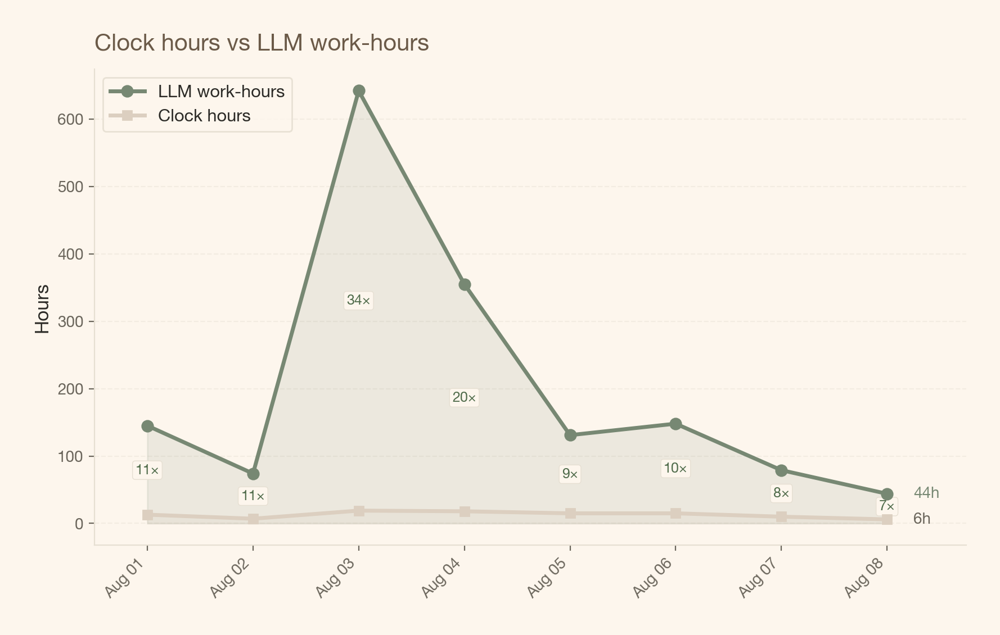

<a href="#quarto-document-content" class="skip-link">Skip to content</a>

# hourly billing is dead, long live the hybrid

Code

freelancing

ai

business

The hour was always a proxy for value. AI just made the proxy collapse.

Author

Carlos Trujillo

Published

August 9, 2026

Your browser does not support the audio element.

so I’ve been thinking about this for a while, and today it finally crystallized. these are my ideas — not some proven framework, just where my head’s at after running AI-heavy projects for the past few months. I’d genuinely love to hear what other freelancers and data science consultants think.

hourly billing was always broken. the hour was never a real unit of work — it was a proxy. a convenient fiction that both sides agreed to pretend was meaningful.

## the fiction was always fragile

think about what “one billable hour” actually meant, even before AI. you sit down at 9am. you have a meeting at 9:30. you context-switch back at 9:45. you get interrupted by slack at 10:02. by the time you’re back in flow, it’s 10:15. was that “one hour” of work? the client got maybe 35 minutes of actual attention. but they were billed for 60.

this was always the deal. everyone knew it. the fiction worked because the alternative — tracking attention-minutes — was absurd. so we settled on the hour as a rough proxy and moved on.

the problem is that the proxy assumed a ceiling on fragmentation. one person, one focus, one client at a time. the hour was a tolerable approximation because the variance was bounded. you might lose 20 minutes to context-switching, but you couldn’t lose 20 hours.

AI removed that ceiling.

## what my August actually looks like

here’s what 12 main work sessions looked like on aug 3. each session is a single conversation I’m directing — but behind each one, dozens of specialized AI agents are running in parallel. reviewers, bug hunters, implementers, test writers. I orchestrate; they execute.

<figure class="quarto-float quarto-float-fig figure">

<figcaption>Figure 1: Daily work sessions, August 2026. Each bar is a human-directed session. The number in parentheses is the count of agents spawned inside those sessions.</figcaption>
</figure>

on a quiet day, 1 session. on a busy day, 12. and each one is running a small firm inside it.

## what concurrency looks like by hour

the heatmap below shows how many conversations were active at each hour of each day. the color intensity tells you how much parallel work was happening — sessions plus all the agents running inside them.

<figure class="quarto-float quarto-float-fig figure">

<figcaption>Figure 2: Session concurrency by hour. Each cell is one hour; color maps to the total active conversations (sessions and their agents combined).</figcaption>
</figure>

look at aug 3, 18:00 UTC — that’s where the color goes darkest. we’ll come back to that hour.

## the gap that kills the hour

this is the chart that matters. the beige line is clock hours — the hours I was actually at my desk. the green line is LLM work-hours: the sum of all agent-hours across the day. if 3 agents run for 1 hour each, that’s 3 LLM-hours, even though it was only 1 clock hour.

<figure class="quarto-float quarto-float-fig figure">

<figcaption>Figure 3: Clock hours vs LLM work-hours. The gap between the two lines is the multiplier — how much more work happens than the clock suggests.</figcaption>
</figure>

they move differently. clock hours hover between 6 and 19 — that’s the ceiling of a human day. LLM work-hours range from 44 to 642. on aug 3, 19 clock hours produced 642 LLM-hours. a 34× multiplier.

and here’s the thing: when you were one person doing one thing, the proxy was *close enough*. now the gap between your attention-hour and the value delivered is so wide that it doesn’t just fail — it actively misleads.

## the competitive disadvantage

and this is what worries me. if I’m still billing by the hour, I’m not just using an outdated model — I think I’m putting myself at a structural disadvantage.

here’s why: your competitor who adopted outcome-based pricing can deliver 34× the work in the same wall-clock time, and charge based on the value of that work. you’re billing for your attention-hours. they’re billing for the output. the client doesn’t care how many hours you spent — they care what arrived.

and the longer you keep billing by the hour, the more value you’re leaving on the table — or worse, the more you’re overcharging for work that took a fraction of the attention you’re billing for.

## the team behind the sessions

these aren’t generic chatbots. each agent has a specific role — the same way a consulting firm has analysts, reviewers, and project leads.

<figure class="quarto-float quarto-float-fig figure">

<figcaption>Figure 4: Specialized agent roles. Each bar is a distinct workflow function — the same structure as a human team.</figcaption>
</figure>

adversarial reviewers stress-test the code. bug-code reviewers hunt for logical errors. edge-case testers probe boundary conditions. implementers write the actual code. test reviewers validate the test suite. and I sit in the middle, orchestrating all of it.

## the peak moment

aug 3 at 18:00 UTC deserves its own chart.

<figure class="quarto-float quarto-float-fig figure">

<figcaption>Figure 5: August 3 hourly timeline. Green: main sessions (human-directed). Light green: agents running inside those sessions. At 18:00 UTC, 14 sessions were orchestrating 262 agents, producing nearly 15,000 messages in a single hour.</figcaption>
</figure>

14 sessions. 262 agents. nearly 15,000 messages. one human. try billing that by the hour.

## what I’m trying: the hybrid model

so what actually works? I’m not sure yet, but here’s what I’ve been experimenting with:

**fixed base fee** — covers the work, AI tooling costs, and a reasonable margin. same for every client regardless of their size. fair is fair.

**proportional kicker** — say 10% of measured uplift, paid only after a defined measurement window (typically 3 months). this is where the value alignment happens.

the beauty is in how it resolves the core tensions:

- the base is fair — same work, same floor, no negotiation games
- the kicker scales with impact, not with the client’s bank account
- the measurement period bridges the gap between delivery and proof

the key is agreeing on metrics and baselines *before* the project starts. both sides know exactly what triggers the bonus. no ambiguity, no “we’ll figure it out later.”

## it’s not pure outcome-based pricing

this is important to me. pure outcome-based pricing feels risky for everyone — you’re betting your entire compensation on variables you don’t fully control. what I’m describing is **outcome-informed fixed pricing**. you get stability from the base, and alignment from the kicker.

I think this is where thoughtful practitioners are landing. at least the ones I’ve talked to. not because it’s trendy, but because it seems to work for both sides.

the hour was always a proxy. AI didn’t break it — it just made the gap between the proxy and reality too wide to ignore.

------------------------------------------------------------------------

*these are my personal ideas based on my own experience. I’m not claiming this is the right answer — just where I’ve landed after running AI-heavy projects for the past few months. if you’re a freelancer or consultant dealing with the same questions, I’d genuinely love to hear how you’re thinking about it. what’s working for you? what am I missing?*

