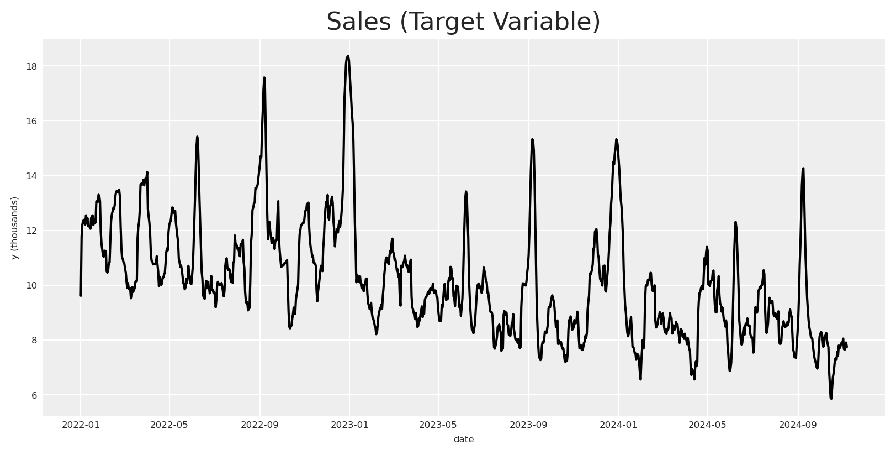
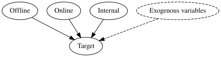
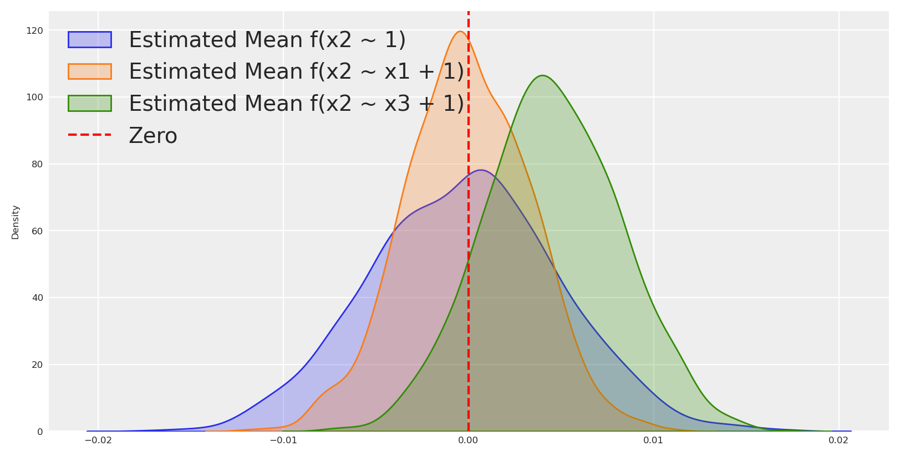
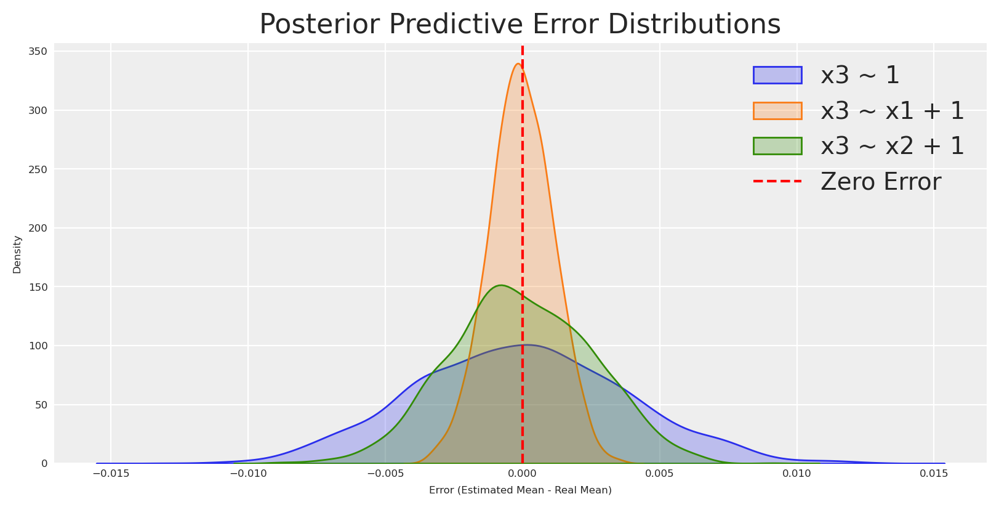
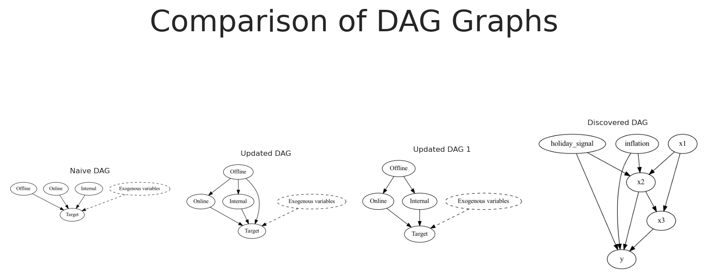

# Primeros Pasos hacia el Descubrimiento Causal

> Una introducción al descubrimiento causal para marketing y ciencia de datos, presentada en PyData Tallinn 2025.

By Carlos Trujillo

Source: https://cetagostini.github.io/es/articles/baby_steps_for_causal_discovery/baby_steps_for_causal_discovery.html

# Introducción al Descubrimiento Causal

En este cuaderno, profundizaremos en cómo descubrir relaciones causales en datos de marketing, un paso crucial para entender el verdadero impacto de los distintos canales en los resultados del negocio. Comenzaremos generando datos sintéticos que imitan escenarios de marketing del mundo real, con variables de confusión y estructuras causales complejas.

A continuación, ajustaremos un modelo Bayesiano de mezcla de marketing usando PyMC-Marketing, verificaremos las direcciones causales entre variables, y realizaremos análisis de mediación para explorar efectos indirectos. Finalmente, usaremos técnicas de descubrimiento de estructura para inferir posibles grafos causales. Al final, tendrás una comprensión sólida de cómo aplicar estas técnicas para revelar conocimientos causales ocultos en tus datos de marketing.

Código

``` sourceCode
import warnings
warnings.filterwarnings("ignore")

from pymc_marketing.mmm.transformers import geometric_adstock, michaelis_menten

from pymc_marketing.mmm import MMM, GeometricAdstock, MichaelisMentenSaturation
from pymc_extras.prior import Prior

import networkx as nx
from graphviz import Digraph
import pydot

import arviz as az
import matplotlib.pyplot as plt
import matplotlib.image as mpimg
import seaborn as sns
from IPython.display import SVG, display

import numpy as np
import pandas as pd

import preliz as pz
import pymc as pm

from PIL import Image
from io import BytesIO

from causallearn.graph.Endpoint import Endpoint
from causallearn.utils.GraphUtils import GraphUtils
from causallearn.search.ScoreBased.GES import ges
from causallearn.search.ConstraintBased.PC import pc

az.style.use("arviz-darkgrid")
plt.rcParams["figure.figsize"] = [8, 4]
plt.rcParams["figure.dpi"] = 100
plt.rcParams["axes.labelsize"] = 6
plt.rcParams["xtick.labelsize"] = 6
plt.rcParams["ytick.labelsize"] = 6
plt.rcParams.update({"figure.constrained_layout.use": True})

%load_ext autoreload
%autoreload 2
%config InlineBackend.figure_format = "retina"

seed = sum(map(ord, "Estimating effects despite having Confounding Variables"))
rng = np.random.default_rng(seed)

print(seed)
print(rng)
```

    5395
    Generator(PCG64)

# Caso de negocio

Como empresa probablemente invertimos en diferentes canales para adquirir nuevos clientes. Algunas acciones son más directas, como la publicidad pagada, y otras son más indirectas, como el marketing en medios offline. Como profesionales del marketing y científicos, queremos entender el impacto de cada canal en la variable objetivo (número de nuevos clientes).

El siguiente DAG muestra una posible estructura causal del problema. Digamos que tenemos las siguientes variables:

- x1: publicidad offline, p. ej. TV, radio, prensa, etc.
- x2: publicidad digital, p. ej. SEM, SEO, redes sociales, etc.
- x3: marketing interno, p. ej. marketing de producto, comunicación interna, etc.
- y: nuevos usuarios

Es probable que nuestra publicidad offline no afecte directamente a nuestros nuevos usuarios, pero sí afecta a nuestros anuncios digitales y marketing interno: los usuarios observan un banner de nuestro producto y luego lo buscan en línea, o son referidos por un amigo que finalmente convierte usando su teléfono. De manera independiente, algunos anuncios digitales pueden impactar a usuarios que no habían oído de nosotros antes, y esos podrían convertir directamente.

Además de eso, tenemos algunos factores externos que podrían afectar nuestros nuevos usuarios, p. ej. días festivos, condiciones económicas, etc. Cosas como los días festivos podrían afectar aún más nuestros anuncios digitales, p. ej. más usuarios compran en línea, y estamos invirtiendo más durante esos días también.

Esto crea una estructura causal compleja, donde las variables no son completamente independientes y no es fácil inferir el impacto causal de cada canal en la variable objetivo.

Código

``` sourceCode
new_real_dag = Digraph(comment='DAG')

new_real_dag.node('z', 'holiday', color='grey', style='dashed')
new_real_dag.node('m', 'inflation', color='grey', style='dashed')
new_real_dag.node('x1', 'offline ads')
new_real_dag.node('x2', 'digital ads')
new_real_dag.node('x3', 'internal marketing')
new_real_dag.node('y', 'new users')

new_real_dag.edge('z', 'x2', style='dashed')

new_real_dag.edge('x1', 'x2')
new_real_dag.edge('x1', 'x3')

new_real_dag.edge('z', 'y', style='dashed')
new_real_dag.edge('x2', 'y')
new_real_dag.edge('x3', 'y')
new_real_dag.edge('m', 'y', style='dashed')

new_real_dag
```

<figure class="figure">
<p></p>
</figure>

## Generación de datos

Basándonos en el DAG proporcionado, podemos crear datos sintéticos para probar qué tan bien funciona nuestro modelo cuando tenemos estructuras causales complejas. Usando los mismos datos, podemos probar diferentes composiciones de modelos y ver cómo podríamos mejorar nuestro modelo para descubrir el verdadero impacto causal de cada canal en la variable objetivo.

Comenzaremos estableciendo el rango de fechas. Aquí usaremos un rango de fechas del 2022-01-01 al 2024-11-06, lo que significa que tenemos casi 3 años de datos (1041 días).

Código

``` sourceCode
# date range
min_date = pd.to_datetime("2022-01-01")
max_date = pd.to_datetime("2024-11-06")
date_range = pd.date_range(start=min_date, end=max_date, freq="D")

df = pd.DataFrame(data={"date_week": date_range}).assign(
    year=lambda x: x["date_week"].dt.year,
    month=lambda x: x["date_week"].dt.month,
    dayofyear=lambda x: x["date_week"].dt.dayofyear,
)

n = df.shape[0]
print(f"Number of observations: {n}")
```

    Number of observations: 1041

### Señal de días festivos

Ciertos días festivos, como la Navidad, pueden tener un impacto significativo en el comportamiento del consumidor antes y después de la fecha específica, generando picos estacionales en ventas. Para capturar estos efectos, introducimos una señal de días festivos basada en distribuciones gaussianas (normales) centradas en fechas festivas específicas.

La función utilizada para modelar el efecto de días festivos se define de la siguiente manera:

H\_{t} = \exp\left(-0.5 \left(\frac{\Delta t}{\sigma}\right)^2\right)

Donde: - \Delta t es la diferencia de tiempo (en días) entre la fecha actual y la fecha festiva. - \sigma es la desviación estándar que controla la dispersión del efecto alrededor de la fecha festiva.

Para cada día festivo, calculamos la señal festiva a lo largo del rango de fechas y agregamos una **contribución festiva** escalando la señal con un coeficiente específico del día festivo. Este enfoque modela los picos estacionales festivos usando funciones gaussianas, que capturan el aumento transitorio en la actividad del mercado alrededor de los días festivos, y su respectiva decadencia a lo largo del tiempo.

> Nota: Aquí asumimos una señal distribuida normalmente; sin embargo, la señal podría estar sesgada o no seguir una distribución normal.

Código

``` sourceCode
holiday_dates = ["24-12", "31-12", "08-06", "07-09"]  # List of holidays as month-day strings
std_devs = [5, 5, 3, 3]  # List of standard deviations for each holiday
holidays_coefficients = [2, 3, 4, 6]

# Initialize the holiday effect array
holiday_signal = np.zeros(len(date_range))
holiday_contributions = np.zeros(len(date_range))

# Generate holiday signals
for holiday, std_dev, holiday_coef in zip(
    holiday_dates, std_devs, holidays_coefficients, strict=False
):
    # Find all occurrences of the holiday in the date range
    holiday_occurrences = date_range[date_range.strftime("%d-%m") == holiday]

    for occurrence in holiday_occurrences:
        # Calculate the time difference in days
        time_diff = (date_range - occurrence).days

        # Generate the Gaussian basis for the holiday
        _holiday_signal = np.exp(-0.5 * (time_diff / std_dev) ** 2)

        # Add the holiday signal to the holiday effect
        holiday_signal += _holiday_signal

        holiday_contributions += _holiday_signal * holiday_coef

df["holiday_signal"] = holiday_signal
df["holiday_contributions"] = holiday_contributions

# Plot the holiday effect
fig, ax = plt.subplots()
sns.lineplot(x=date_range, y=holiday_signal, ax=ax)
ax.set(title="Holiday Effect Signal", xlabel="Date", ylabel="Signal Intensity")
plt.show()
```

<figure class="figure">
<p></p>
</figure>

### Generando inflación

A continuación, generamos los datos de **Inflación**. Asumimos que la inflación sigue una tendencia de ley de potencias, lo que significa que el crecimiento se acelera con el tiempo en lugar de permanecer constante. Esto se puede definir matemáticamente como:

IN\_{t} = (t + \text{baseline})^{\text{exponent}} - 1

Donde: - t: El índice temporal, representando los días desde el inicio del rango de fechas. - baseline: Una constante sumada a t para desplazar el punto de inicio de la tendencia. Este valor afecta el nivel inicial de crecimiento del mercado. El valor inicial de la función será (baseline)^{exponent} - 1, no 0. - exponent: La potencia a la que se eleva el índice temporal, determinando la tasa a la que la tendencia se acelera con el tiempo.

Código

``` sourceCode
df["inflation"] = (np.linspace(start=0.0, stop=50, num=n) + 10) ** (2 / 4) - 1

fig, ax = plt.subplots()
sns.lineplot(
    x="date_week", y="inflation", color="C2", label="trend", data=df, ax=ax
)
ax.legend(loc="upper left")
ax.set(title="Inflation Components", xlabel="date", ylabel=None);
```

<figure class="figure">
<p></p>
</figure>

### Modelando Canales de Marketing

En esta sección, simulamos tres canales de marketing, x1, x2 y x3, que representan diferentes canales publicitarios (p. ej., Marketing Interno, Marketing Social, Marketing Offline). El comportamiento de cada canal está influenciado por la variabilidad aleatoria y los efectos de confusión de los días festivos estacionales. Así es como modelamos cada canal matemáticamente:

**Canal x1**: Como mencionamos antes, generamos x1 que es afectado por la señal de días festivos, podríamos definirlo como:

I\_{x1_t} = S\_{x1_t} + e\_{x1}

**Canal x2**: Por otro lado, generamos x2 que es afectado por la señal de días festivos y la influencia de x1. Podríamos definirlo como:

I\_{x2_t} = S\_{x2_t} + H\_{t} \times \alpha\_{x2} + (I\_{x1_t} \times \alpha\_{x1_x2}) + e\_{x2}

**Canal x3**: Para la última variable, generamos x3 que es afectado solo por x1.

I\_{x3_t} = S\_{x3_t} + (I\_{x1_t} \times \alpha\_{x1_x3}) + e\_{x3}

Estas ecuaciones nos permiten capturar la dinámica compleja que influye en cada canal de marketing: - Los **Efectos de Días Festivos** aumentan la actividad del canal alrededor de fechas específicas, simulando picos estacionales. - Las **Influencias entre Canales** introducen interdependencias, modelando cómo el éxito de un canal puede amplificar el de otro.

> Nota: Aquí estamos asumiendo un impacto aditivo para las interacciones entre canales.

Código

``` sourceCode
x1 = pz.Gamma(mu=1, sigma=3).rvs(n, random_state=rng)
cofounder_effect_holiday_x1 = 2.5
x1_conv = np.convolve(x1, np.ones(14) / 14, mode="same")
noise = pz.Normal(mu=0, sigma=0.1).rvs(28, random_state=rng)
x1_conv[:14] = x1_conv.mean() + noise[:14]
x1_conv[-14:] = x1_conv.mean() + noise[14:]
df["x1"] = x1_conv

x2 = pz.Gamma(mu=2, sigma=2).rvs(n, random_state=rng)
cofounder_effect_holiday_x2 = 2.2
cofounder_effect_x1_x2 = 1.3
x2_conv = np.convolve(x2, np.ones(18) / 12, mode="same")
noise = pz.Normal(mu=0, sigma=0.1).rvs(28, random_state=rng)
x2_conv[:14] = x2_conv.mean() + noise[:14]
x2_conv[-14:] = x2_conv.mean() + noise[14:]
df["x2"] = (
    x2_conv
    + (holiday_signal * cofounder_effect_holiday_x2)
    + (df["x1"] * cofounder_effect_x1_x2)
) # digital ads

x3 = pz.Gamma(mu=5, sigma=1).rvs(n, random_state=rng)
cofounder_effect_x1_x3 = 1.5
x3_conv = np.convolve(x3, np.ones(16) / 10, mode="same")
noise = pz.Normal(mu=0, sigma=0.1).rvs(28, random_state=rng)
x3_conv[:14] = x3_conv.mean() + noise[:14]
x3_conv[-14:] = x3_conv.mean() + noise[14:]
df["x3"] = (
    x3_conv
    + (df["x1"] * cofounder_effect_x1_x3)
) # internal marketing
```

Asumiremos que todas las actividades de marketing sufren las mismas transformaciones de Adstock y Saturación. Esto significa que cada canal tendrá parámetros individuales para las transformaciones seleccionadas, en este caso adstock geométrico y Michaelis-Menten.

Código

``` sourceCode
# apply geometric adstock transformation
alpha2: float = 0.4
alpha3: float = 0.3

df["x2_adstock"] = (
    geometric_adstock(x=df["x2"].to_numpy(), alpha=alpha2, l_max=24, normalize=True)
    .eval()
    .flatten()
)

df["x3_adstock"] = (
    geometric_adstock(x=df["x3"].to_numpy(), alpha=alpha3, l_max=24, normalize=True)
    .eval()
    .flatten()
)


# apply saturation transformation
lam2: float = 6.0
lam3: float = 12.0

alpha_mm2: float = 12
alpha_mm3: float = 18

df["x2_adstock_saturated"] = michaelis_menten(
    x=df["x2_adstock"].to_numpy(), lam=lam2, alpha=alpha_mm2
)

df["x3_adstock_saturated"] = michaelis_menten(
    x=df["x3_adstock"].to_numpy(), lam=lam3, alpha=alpha_mm3
)

fig, ax = plt.subplots(
    nrows=3, ncols=2, sharex=True, sharey=False, layout="constrained"
)
sns.lineplot(x="date_week", y="x2", data=df, color="C1", ax=ax[0, 0])
sns.lineplot(x="date_week", y="x3", data=df, color="C2", ax=ax[0, 1])

sns.lineplot(x="date_week", y="x2_adstock", data=df, color="C1", ax=ax[1, 0])
sns.lineplot(x="date_week", y="x3_adstock", data=df, color="C2", ax=ax[1, 1])

sns.lineplot(x="date_week", y="x2_adstock_saturated", data=df, color="C1", ax=ax[2, 0])
sns.lineplot(x="date_week", y="x3_adstock_saturated", data=df, color="C2", ax=ax[2, 1])

fig.suptitle("Media Costs Data - Transformed", fontsize=16)
# adjust size of X axis
ax[2, 0].tick_params(axis="x", labelsize=8)
ax[2, 1].tick_params(axis="x", labelsize=8)

# adjust size of x axis labels
for ax in ax.flat:
    ax.tick_params(axis="x", labelsize=6)
```

<figure class="figure">
<p></p>
</figure>

El gráfico anterior muestra cómo las transformaciones afectan a cada variable, y cuál sería la contribución real después de cada transformación.

### Variable objetivo

La variable objetivo es una combinación de todas las variables anteriores. La fórmula matemática se puede expresar como:

y\_{t} = Intercept - f(IN\_{t}) + f(H\_{t}) + m(I\_{x3_t}) + m(I\_{x2_t}) + \epsilon

Donde: - **Intercepto**: Un nivel base de ventas, establecido en 1.5, representando el nivel base de ventas en ausencia de otros efectos. - **Inflación**: Representa la inflación subyacente del mercado, con un coeficiente negativo implícito de 1, añadiendo una influencia descendente constante. - **Contribuciones de Días Festivos**: Añade picos de ventas alrededor de los períodos festivos, capturando el aumento estacional en la demanda del consumidor. - **m(Impressions\_{x3_t}) y m(Impressions\_{x2_t})**: Representan los valores de **adstock saturado** para los canales de marketing x3 y x2. - **Ruido \epsilon**: Un término de error aleatorio pequeño, extraído de una distribución normal con media 0 y desviación estándar 0.08, para dar cuenta de la variabilidad inexplicada en las ventas.

Código

``` sourceCode
df["intercept"] = 1.5
df["epsilon"] = rng.normal(loc=0.0, scale=0.08, size=n)

df["y"] = (
    df["intercept"]
    + df["holiday_contributions"]
    + df["x2_adstock_saturated"]
    + df["x3_adstock_saturated"]
    + df["epsilon"]  # Noise
) - df["inflation"]

fig, ax = plt.subplots()
sns.lineplot(x="date_week", y="y", color="black", data=df, ax=ax)
ax.set(title="Sales (Target Variable)", xlabel="date", ylabel="y (thousands)");
```

<figure class="figure">
<p></p>
</figure>

Podemos escalar el conjunto de datos completo y finalmente tendremos algo muy similar a la realidad.

Código

``` sourceCode
# scale df by abs max per column
df["date"] = pd.to_datetime(df["date_week"])
scaled_df = df.copy()
for col in scaled_df.columns:
    if col != 'date' and col != 'date_week':
        scaled_df[col] = scaled_df[col] / scaled_df[col].abs().max()

scaled_df[["date", "x1", "x2", "x3", "y"]].head()
```

|     | date       | x1       | x2       | x3       | y        |
|-----|------------|----------|----------|----------|----------|
| 0   | 2022-01-01 | 0.311103 | 0.416608 | 0.709209 | 0.523628 |
| 1   | 2022-01-02 | 0.346200 | 0.417910 | 0.718519 | 0.641921 |
| 2   | 2022-01-03 | 0.310798 | 0.404066 | 0.690251 | 0.664626 |
| 3   | 2022-01-04 | 0.301643 | 0.395861 | 0.693495 | 0.672532 |
| 4   | 2022-01-05 | 0.248688 | 0.379114 | 0.679055 | 0.668596 |

# Enfoque inicial

Si tenemos un conjunto de datos como el que acabamos de crear, podemos intentar ajustar un modelo con lo siguiente para encontrar el impacto causal de cada canal en la variable objetivo. Para el ejemplo, usaremos un modelo simple de PyMC-Marketing para este propósito.

Veamos qué sucede si ajustamos un modelo con todo lo que tenemos sin ningún conocimiento de la estructura causal.

Código

``` sourceCode
scaled_df[["date", "x1", "x2", "x3", "y"]].head()

model_config = {
    "intercept": Prior("Gamma", mu=1, sigma=1),
    "likelihood": Prior("Normal", sigma=Prior("Normal", mu=0, sigma=.5)),
}

fit_kwargs = dict(nuts_sampler="numpyro", random_seed=rng,)

X = df.drop(columns=["y"])
y = df["y"]

mmm = MMM(
    date_column="date",
    channel_columns=[
        "x1",
        "x2",
        "x3"
    ],
    control_columns=[
        "holiday_signal",
        "inflation"
    ],
    adstock=GeometricAdstock(l_max=24),
    saturation=MichaelisMentenSaturation(),
)
mmm.fit(X, y, **fit_kwargs)
mmm.sample_posterior_predictive(
    X=X,
    extend_idata=True,
    combined=True,
    random_seed=rng,
)
```

```
```

    Sampling: [y]

```
```

``` xr-text-repr-fallback
<xarray.Dataset> Size: 33MB
Dimensions:  (date: 1041, sample: 4000)
Coordinates:
  * date     (date) datetime64[ns] 8kB 2022-01-01 2022-01-02 ... 2024-11-06
  * sample   (sample) object 32kB MultiIndex
  * chain    (sample) int64 32kB 0 0 0 0 0 0 0 0 0 0 0 ... 3 3 3 3 3 3 3 3 3 3 3
  * draw     (sample) int64 32kB 0 1 2 3 4 5 6 7 ... 993 994 995 996 997 998 999
Data variables:
    y        (date, sample) float64 33MB 9.529 9.707 9.271 ... 7.796 8.106 7.514
Attributes:
    created_at:                 2026-09-16T21:58:37.067977+00:00
    arviz_version:              0.21.0
    inference_library:          pymc
    inference_library_version:  5.27.1
```

xarray.Dataset

Dimensions:

- date: 1041
- sample: 4000

Coordinates: (4)

date(date)datetime64\[ns\]2022-01-01 ... 2024-11-06

<!-- -->

    array(['2022-01-01T00:00:00.000000000', '2022-01-02T00:00:00.000000000',
           '2022-01-03T00:00:00.000000000', ..., '2024-11-04T00:00:00.000000000',
           '2024-11-05T00:00:00.000000000', '2024-11-06T00:00:00.000000000'],
          dtype='datetime64[ns]')

sample(sample)objectMultiIndex

<!-- -->

    array([(0, 0), (0, 1), (0, 2), ..., (3, 997), (3, 998), (3, 999)], dtype=object)

chain(sample)int640 0 0 0 0 0 0 0 ... 3 3 3 3 3 3 3 3

<!-- -->

    array([0, 0, 0, ..., 3, 3, 3])

draw(sample)int640 1 2 3 4 5 ... 995 996 997 998 999

<!-- -->

    array([  0,   1,   2, ..., 997, 998, 999])

Data variables: (1)

y(date, sample)float649.529 9.707 9.271 ... 8.106 7.514

<!-- -->

    array([[ 9.52911165,  9.70693004,  9.27136515, ...,  8.81577674,
             9.24434534,  8.81529167],
           [11.62835041, 11.46451788, 11.43907238, ..., 11.61915027,
            11.6390968 , 10.47063535],
           [11.59121069, 11.51473868, 12.69732093, ..., 11.04665764,
            11.8329454 , 12.21389163],
           ...,
           [ 7.8371949 ,  8.37914439,  7.60264614, ...,  7.47912281,
             7.03724087,  7.59050251],
           [ 7.77601432,  8.26225361,  8.13110555, ...,  7.87591535,
             7.19066716,  7.46739171],
           [ 8.10899542,  7.51032297,  8.52515115, ...,  7.7960692 ,
             8.10560721,  7.51404133]])

Indexes: (2)

datePandasIndex

    PandasIndex(DatetimeIndex(['2022-01-01', '2022-01-02', '2022-01-03', '2022-01-04',
                   '2022-01-05', '2022-01-06', '2022-01-07', '2022-01-08',
                   '2022-01-09', '2022-01-10',
                   ...
                   '2024-10-28', '2024-10-29', '2024-10-30', '2024-10-31',
                   '2024-11-01', '2024-11-02', '2024-11-03', '2024-11-04',
                   '2024-11-05', '2024-11-06'],
                  dtype='datetime64[ns]', name='date', length=1041, freq=None))

sample  
chain  
drawPandasMultiIndex

    PandasIndex(MultiIndex([(0,   0),
                (0,   1),
                (0,   2),
                (0,   3),
                (0,   4),
                (0,   5),
                (0,   6),
                (0,   7),
                (0,   8),
                (0,   9),
                ...
                (3, 990),
                (3, 991),
                (3, 992),
                (3, 993),
                (3, 994),
                (3, 995),
                (3, 996),
                (3, 997),
                (3, 998),
                (3, 999)],
               name='sample', length=4000))

Attributes: (4)

created_at :  
2026-09-16T21:58:37.067977+00:00

arviz_version :  
0.21.0

inference_library :  
pymc

inference_library_version :  
5.27.1

¿Cómo se ven las contribuciones recuperadas, si las comparamos con las contribuciones reales?

Código

``` sourceCode
initial_model_recover_effect = (
    az.hdi(mmm.fit_result["channel_contribution"], hdi_prob=0.95)
    * mmm.target_transformer["scaler"].scale_.item()
)
initial_model_mean_effect = (
    mmm.fit_result.channel_contribution.mean(dim=["chain", "draw"])
    * mmm.target_transformer["scaler"].scale_.item()
)

fig, ax = plt.subplots(2, 1, sharex=True)
# x2 -> online
ax[0].plot(
    date_range,
    initial_model_mean_effect.sel(channel="x2"),
    label="Mean Recover x2 Effect",
    linestyle="--",
    color="orange",
)
ax[0].fill_between(
    date_range,
    initial_model_recover_effect.channel_contribution.isel(hdi=0).sel(channel="x2"),
    initial_model_recover_effect.channel_contribution.isel(hdi=1).sel(channel="x2"),
    alpha=0.2,
    label="95% Credible Interval",
    color="orange",
)
ax[0].plot(
    date_range, df["x2_adstock_saturated"], label="Real x2 Effect", color="black"
)

# x3 -> internal
ax[1].plot(
    date_range,
    initial_model_mean_effect.sel(channel="x3"),
    label="Mean Recover x3 Effect",
    linestyle="--",
    color="green",
)
ax[1].fill_between(
    date_range,
    initial_model_recover_effect.channel_contribution.isel(hdi=0).sel(channel="x3"),
    initial_model_recover_effect.channel_contribution.isel(hdi=1).sel(channel="x3"),
    alpha=0.2,
    label="95% Credible Interval",
    color="green",
)
ax[1].plot(
    date_range, df["x3_adstock_saturated"], label="Real x3 Effect", color="black"
)

# formatting
ax[0].legend()
ax[1].legend()

plt.grid(True)
ax[1].set(xlabel="date")
fig.suptitle("Media Contribution Recovery", fontsize=16)
plt.show()
```

<figure class="figure">
<p></p>
</figure>

Como era de esperar, el modelo no logra reflejar con precisión las contribuciones reales, resultando en estimaciones que se desvían significativamente de los valores reales. ¿Cómo puede ocurrir esto, y por qué está sucediendo?

La explicación es sencilla: al descuidar cualquier estructura causal, inadvertidamente imponemos una sobre los datos. El problema radica en nuestra suposición del marco causal más simple, que rara vez se alinea con la complejidad del mundo real.

¿Qué tipo de estructura causal estamos asumiendo implícitamente cuando ajustamos el modelo?

Código

``` sourceCode
# Initialize a directed graph
naive_causal_mmm_graph = Digraph()

# Add nodes
naive_causal_mmm_graph.node("X1", "Offline")
naive_causal_mmm_graph.node("X2", "Online")
naive_causal_mmm_graph.node("X3", "Internal")
naive_causal_mmm_graph.node("E", "Exogenous variables", style="dashed")
naive_causal_mmm_graph.node("T", "Target")

naive_causal_mmm_graph.edge("E", "T", style="dashed")
naive_causal_mmm_graph.edge("X1", "T")
naive_causal_mmm_graph.edge("X2", "T")
naive_causal_mmm_graph.edge("X3", "T")

# Render the graph to SVG and display it inline
svg_str = naive_causal_mmm_graph.pipe(format="svg")
display(SVG(svg_str))
```

<figure class="figure">
<p></p>
</figure>

El DAG anterior representa la estructura causal que estamos asumiendo implícitamente cuando ajustamos el modelo. Aquí todas las variables son independientes entre sí, y esas impactan directamente la variable objetivo.

Durante el desarrollo del modelo, establecimos una estructura y flujo específicos para nuestros datos. Concluimos que los impactos de nuestros canales operan de manera independiente entre sí. Además, determinamos que si algún componente de nuestro ecosistema falta, su influencia será capturada por el término base debido a esta ecuación. Como puedes ver, incluso adoptando este modelo básico, estamos haciendo suposiciones significativas.

Por un lado, estás asumiendo que el impacto no es lineal al aplicar estas transformaciones, y estás sugiriendo que el impacto es positivo y que puede haber un retraso máximo de un cierto número de días.

Incluso has definido la dirección de tus relaciones. Al definir estas relaciones y asumir que no hay conexiones causales directas entre nuestras variables, podemos concluir que, si la naturaleza de su relación está representada con precisión por la ecuación proporcionada, entonces al controlar los canales relevantes, podríamos descubrir sus verdaderos efectos.

Esto nos lleva a qué DAG causal asumimos como correcto, basándonos en nuestras suposiciones previas. Si reconoces este proceso, ¡felicidades! Has creado un modelo generativo o Modelo Causal Estructural, con una Ecuación Causal Estructural, usando PyMC-Marketing.

Sin embargo, este DAG Causal no representa el verdadero DAG Causal. Dado que nuestro modelo de PyMC es estructural y causal, debemos preguntar: *¿Qué sucede si creo un modelo con una estructura causal diferente a la real?*

La respuesta es lo que observamos arriba, el modelo no podrá recuperar la verdadera estructura causal.

# Aprendiendo sobre modelos generativos

Los modelos generativos son marcos que describen cómo podrían producirse los datos en el mundo real. Definen un proceso al establecer distribuciones de probabilidad para cada componente, simulando la creación de datos a partir de variables aleatorias subyacentes. Este enfoque captura la incertidumbre y la variabilidad, proporcionando un panorama completo del mecanismo de generación de datos.

En PyMC, este concepto está en el núcleo de cada modelo. PyMC te permite definir explícitamente priors, verosimilitudes y la estructura de tu proceso de generación de datos. Incluso los modelos simples construidos en PyMC llevan una suposición generativa inherente, haciéndolos flexibles y robustos para representar cómo los datos podrían surgir naturalmente.

Esto significa que cada posible grafo con N número de variables puede ser un modelo específico. ¿Cuántos modelos podríamos especificar si tenemos 5 variables para un objetivo?

Código

``` sourceCode
import math
from functools import lru_cache

@lru_cache(maxsize=None)
def dag_with_exactly_s_sources(n: int, s: int) -> int:
    """
    Count DAGs with exactly s source nodes.

    Uses formula: S(n,s) = C(n,s) * sum[(-1)^j * C(n-s,j) * 2^((m-j)(m-j-1)/2) *
    (2^(m-j)-1)^s] where m=n-s and j=0..m. When n=s, S(n,n)=1.

    Parameters
    ----------
    n : int
        Total number of labeled nodes
    s : int
        Number of source nodes

    Returns
    -------
    int
        Number of possible DAGs
    """
    if n == s:
        return 1
    total = 0
    m = n - s
    for j in range(m + 1):
        term = (
            (-1) ** j
            * math.comb(m, j)
            * 2 ** (((m - j) * (m - j - 1)) // 2)
            * (2 ** (m - j) - 1) ** s
        )
        total += term
    return math.comb(n, s) * total

def count_valid_final_graphs_with_parents(num_regressors: int, num_parents: int) -> int:
    """Count valid final graphs with parent node restrictions.

    The counting process has two main steps:

    1. Build a DAG among regressors where parents have no incoming edges:
       - For non-parents (Q = num_regressors - num_parents), count DAGs with given sinks
       - Parents can only have edges to non-parents (Q options each)
       - Non-sink parents must have ≥1 outgoing edge (2^Q - 1 ways)
       - Sink parents have no edges (1 way)

    2. Add edges from regressors to target:
       - Sink regressors must connect to target
       - Non-sink regressors optionally connect
       - Yields factor 2^(num_regressors - total_sinks)

    The total count formula is:
    sum_{s_p=0}^P sum_{s_q=1}^Q [binom(P,s_p) * (2^Q-1)^(P-s_p) *
    (DAGs_Q_s_q) * 2^((P+Q)-(s_p+s_q))]

    where P = num_parents, Q = num_regressors - num_parents

    When Q = 0 (all regressors are parents), the final graph is unique.

    Parameters
    ----------
    num_regressors : int
        Total number of regressor nodes in the graph
    num_parents : int
        Number of designated parent nodes that cannot have incoming edges

    Returns
    -------
    int
        Total count of valid final graph configurations
    """
    P = num_parents
    Q = num_regressors - num_parents  # non-parents
    if Q < 0:
        raise ValueError("num_parents cannot exceed num_regressors")

    # Case where all regressors are parents: no DAG edges are allowed;
    # every node is isolated (and hence a sink),
    # so the regressor-to-target assignment is forced.
    if Q == 0:
        return 1

    total = 0
    # s_p: number of parents that end up as sinks
    # (i.e. with no outgoing edge to any non-parent)
    for s_p in range(P + 1):
        # For each parent:
        #   - If not a sink: choose at least one outgoing edge
        #     among Q non-parents: (2^Q - 1) ways.
        #   - If a sink: only 1 way (choose no outgoing edge).
        parent_config = math.comb(P, s_p) * ((2**Q - 1) ** (P - s_p))
        # s_q: number of sinks among non-parents in the DAG on Q nodes.
        # Note: Every DAG on at least one node has at least one sink.
        for s_q in range(1, Q + 1):
            nonparent_count = dag_with_exactly_s_sources(Q, s_q)
            # Total sinks in the regressor
            # DAG is s_p (from parents) plus s_q (from non-parents)
            total_sinks = s_p + s_q
            # For each regressor that is not a sink,
            # the regressor-to-target edge is optional.
            # Thus, a factor of 2^( (P+Q) - total_sinks ).
            assignment_factor = 2 ** ((P + Q) - total_sinks)
            total += parent_config * nonparent_count * assignment_factor
    return total

possible_dags = count_valid_final_graphs_with_parents(num_regressors=5, num_parents=2)
print(f"Number of possible DAGs with two parents (Graphical/Generative Model): {possible_dags:,}")

possible_dags = count_valid_final_graphs_with_parents(num_regressors=5, num_parents=1)
print(f"Number of possible DAGs with one parent (Graphical/Generative Model): {possible_dags:,}")
```

    Number of possible DAGs with two parents (Graphical/Generative Model): 12,375
    Number of possible DAGs with one parent (Graphical/Generative Model): 52,855

El número de modelos posibles que podemos generar con dos de cinco variables como padres es de alrededor de 12.000, mientras que tener solo un padre aumenta ese número a aproximadamente 52.000. Curiosamente, eliminar un solo nodo padre triplica los modelos potenciales que podemos crear, multiplicando efectivamente el número de escenarios posibles.

Esto arroja luz sobre los desafíos que plantean los modelos grandes:  
a) A medida que aumenta el número de variables, el crecimiento exponencial en relaciones potenciales se vuelve abrumador, dificultando identificar nuestra situación real.  
b) Con más variables, la probabilidad de controlar erróneamente por las variables equivocadas también aumenta.

Este último punto se alinea con nuestra observación anterior: si controlamos por variables inapropiadas, el modelo no logra recuperar la verdadera estructura causal.

Entonces, ¿por qué es problemático controlar por ciertas variables? Cada variable debería agregar más poder explicativo, ¿no? Empecemos a aprender sobre estructuras para entenderlo.

# Aprendiendo sobre estructuras causales

**Bifurcaciones**: Una bifurcación es una estructura causal donde una sola variable actúa como causa común para dos o más variables. Esta causa común transmite su influencia a todos sus descendientes directos. La existencia de una bifurcación crea confusión, haciendo que la relación entre las variables descendientes parezca estar relacionada. Controlar por la causa común puede bloquear efectivamente las vías de retroceso creadas por esta estructura.

**Cadenas**: Una cadena representa una vía causal secuencial donde una variable influye en otra, que a su vez afecta a una tercera. Esta estructura destaca el proceso de mediación a través del cual se transmiten los efectos causales. La variable intermedia actúa como mediadora, transmitiendo la influencia desde la causa inicial hasta el resultado final. Analizar cadenas ayuda a distinguir entre efectos directos e indirectos en un sistema causal. Controlar por el mediador de manera inapropiada puede bloquear partes del efecto causal que son de interés.

**Colisionadores**: Un colisionador es una variable que es el efecto común de dos o más factores causales. Se sitúa en la convergencia de diferentes vías causales y puede introducir asociaciones espurias cuando se condiciona sobre él. Controlar por un colisionador puede abrir inadvertidamente vías no causales de retroceso (backdoor), llevando a estimaciones sesgadas. Este fenómeno, conocido como sesgo de colisión, distorsiona las relaciones verdaderas entre las variables causales. Evitar condicionar sobre colisionadores es crucial para mantener la validez de los modelos causales.

Código

``` sourceCode
# Create figure with 3 subplots
fig, (ax1, ax2, ax3) = plt.subplots(1, 3,)

# Create collider DAG
collider = Digraph()
collider.attr(rankdir='TB')
collider.node('A', 'A')
collider.node('B', 'B')
collider.node('C', 'C')
collider.edge('A', 'C')
collider.edge('B', 'C')
ax1.set_title('Collider (A→C←B)')
ax1.imshow(Image.open(BytesIO(collider.pipe(format='png'))))
ax1.axis('off')

# Create fork DAG
fork = Digraph()
fork.attr(rankdir='TB')
fork.node('A', 'A')
fork.node('B', 'B')
fork.node('C', 'C')
fork.edge('A', 'B')
fork.edge('A', 'C')
ax2.set_title('Fork (B←A→C)')
ax2.imshow(Image.open(BytesIO(fork.pipe(format='png'))))
ax2.axis('off')

# Create chain DAG
chain = Digraph()
chain.attr(rankdir='TB')
chain.node('A', 'A')
chain.node('B', 'B')
chain.node('C', 'C')
chain.edge('A', 'B')
chain.edge('B', 'C')
ax3.set_title('Chain (A→B→C)')
ax3.imshow(Image.open(BytesIO(chain.pipe(format='png'))))
ax3.axis('off')

plt.tight_layout()
plt.show()
```

<figure class="figure">
<p></p>
</figure>

Las estructuras causales juegan un papel crucial en diversos métodos de inferencia causal, sirviendo como base para su funcionamiento. Por ejemplo, las estructuras de cadena son clave para métodos como las variables instrumentales (VI). En el análisis de VI, esta estructura de cadena entra en juego al introducir un instrumento: una variable que afecta la exposición pero no afecta directamente el resultado, excepto a través de esa exposición. Este enfoque ayuda a romper la vía de confusión, permitiéndonos aislar la variación exógena en el tratamiento.

Como resultado, permite una estimación consistente de los efectos causales, incluso cuando encontramos endogeneidad. Por lo tanto, comprender las estructuras de cadena es esencial, ya que no solo respalda la lógica detrás de los métodos de VI, sino que también subraya la importancia de identificar instrumentos válidos.

Si te interesa especialmente aprender más sobre VI, te recomiendo consultar una publicación de Anton Bugaev o dirigirte al quinto piso si estás en Bolt.

En última instancia, cada una de estas estructuras causales exhibe diferentes comportamientos observacionales. Esto significa que, basándonos en los datos observacionales, podemos deducir qué estructura está presente y, en consecuencia, determinar cuál es el conjunto correcto de variables a controlar.

Una cosa para entender qué controlar es encontrar los nodos padres para evitar controlar por mediadores. Podríamos identificar esto comprendiendo las dependencias condicionales.

# Verifiquemos las independencias condicionales

La independencia condicional es un concepto central en la teoría de probabilidad y la estadística donde dos variables son independientes entre sí una vez que una tercera variable se mantiene constante. Esto significa que, dado el valor de la variable de condicionamiento, las dos variables no proporcionan información adicional la una sobre la otra. En el descubrimiento causal, las independencias condicionales son cruciales porque revelan la estructura subyacente de las relaciones causales en un modelo o un grafo acíclico dirigido (DAG). Al identificar estas independencias, podemos determinar cómo están relacionadas las variables entre sí, o no.

Los modelos de regresión Bayesiana nos permiten estimar la expectativa condicional de un resultado dado un conjunto de predictores, descubriendo efectivamente las probabilidades condicionales subyacentes. En una regresión lineal Bayesiana, por ejemplo, estimamos E(Y \mid X) = \beta_0 + \beta_1X_1 + \ldots + \beta_kX_k, que representa el resultado promedio Y cuando los predictores X_1, \dots, X_k se mantienen en valores específicos.

Definamos una función para construir y muestrear un modelo lineal a partir de una fórmula.

Código

``` sourceCode
def build_and_sample_model(data: pd.DataFrame, formula: str):
    """
    Build and sample a linear model from a formula.
    """
    # Parse the formula to get target and channels
    target, channels = formula.split('~')
    target = target.strip()
    channels = [ch.strip() for ch in channels.split('+') if ch.strip() != "1"]

    # Define coordinates
    coordinates = {"date": data.date.unique()}
    if channels:  # If there are regressors, include them in coordinates
        coordinates["channel"] = channels

    # Filter the dataset based on the formula
    with pm.Model(coords=coordinates) as linear_model:
        # Load Data in Model
        target_data = pm.Data("target", data[target].values, dims="date")

        # Constant or intercept
        intercept = pm.Gamma("intercept", mu=3, sigma=2)

        mu_var = 0

        if channels:  # If there are regressors, include them
            regressors = pm.Data("regressors", data[channels].values, dims=("date", "channel"))
            gamma = pm.Normal("gamma", mu=3, sigma=2, dims="channel")
            mu_var += (regressors * gamma).sum(axis=-1) + intercept
        else:
            mu_var += intercept

        # Likelihood
        pm.Normal("likelihood", mu=mu_var, sigma=pm.Gamma("sigma", mu=2, sigma=3), observed=target_data, dims="date")

        # Sample
        idata = pm.sample_prior_predictive(random_seed=42)
        idata.extend(
            pm.sample(tune=1000, draws=500, chains=4, random_seed=42, target_accept=0.9, nuts_sampler="numpyro", progressbar=False)
        )
        pm.compute_log_likelihood(idata, progressbar=False)
        idata.extend(
            pm.sample_posterior_predictive(idata, random_seed=42)
        )

    return (idata, linear_model)
```

Ahora, construyamos y muestreemos los modelos para cada variable.

Código

``` sourceCode
idata1, model1 = build_and_sample_model(
    scaled_df,
    "x1 ~ 1"
)

idata2, model2 = build_and_sample_model(
    scaled_df,
    "x1 ~ x2 + 1"
)

idata3, model3 = build_and_sample_model(
    scaled_df,
    "x1 ~ x3 + 1"
)

idata4, model4 = build_and_sample_model(
    scaled_df,
    "x1 ~ x2 + x3 + 1"
)

_real_mean = scaled_df["x1"].mean()
_estimated_mean1 = idata1.posterior_predictive.likelihood.mean(dim=["date"]).values.flatten()
_estimated_mean2 = idata2.posterior_predictive.likelihood.mean(dim=["date"]).values.flatten()
_estimated_mean3 = idata3.posterior_predictive.likelihood.mean(dim=["date"]).values.flatten()

sns.kdeplot(_estimated_mean1 - _real_mean, label='Estimated Mean f(x1 ~ 1)', fill=True)
sns.kdeplot(_estimated_mean2 - _real_mean, label='Estimated Mean f(x1 ~ x2 + 1)', fill=True)
sns.kdeplot(_estimated_mean3 - _real_mean, label='Estimated Mean f(x1 ~ x3 + 1)', fill=True)
plt.axvline(0, color='red', linestyle='--', label='Zero')
plt.legend()
plt.show()
```

    Sampling: [intercept, likelihood, sigma]
    Sampling: [likelihood]

```
```

    Sampling: [gamma, intercept, likelihood, sigma]
    Sampling: [likelihood]

```
```

    Sampling: [gamma, intercept, likelihood, sigma]
    Sampling: [likelihood]

```
```

    Sampling: [gamma, intercept, likelihood, sigma]
    Sampling: [likelihood]

```
```

<figure class="figure">
<p></p>
</figure>

En un sistema causal donde la dirección verdadera es x_1 a x_2, la distribución conjunta se factoriza como P(x_1, x_2) = P(x_1) \\ P(x_2 \mid x_1),

donde x_1 es exógeno e independiente de cualquier efecto. Esta estructura refleja que la distribución de x_1 permanece sin cambios independientemente de la variable aguas abajo x_2.

Al regresar x_2 sobre x_1, el modelo aprovecha la dirección causal, y la distribución condicional P(x_2 \mid do(x_1)) está más concentrada que la marginal P(x_2). Esto resulta en residuos centrados alrededor de cero, indicando que la mayor parte de la variabilidad en x_2 es explicada por x_1.

En contraste, invertir la regresión modelando x_1 como función de x_2 interrumpe el orden causal. La distribución condicional P(x_1 \mid do(x2)) se desvía de la marginal verdadera P(x_1), ya que intenta capturar la causa a partir de su efecto, lo cual no está respaldado por la estructura causal.

El sesgo en la regresión inversa surge porque condicionar sobre x_2 introduce variabilidad del ruido inherente en x_2. Esta mala atribución confunde la variabilidad independiente de x_1 con la inducida por x_2, llevando a residuos que se desvían sistemáticamente del cero. Respecto al modelo nulo, los residuos están más lejos de cero.

Esta discrepancia subraya la importancia de preservar la dirección causal correcta para evitar sesgo, ya que invertir la regresión viola la condición de Markov causal.

Usando esta lógica, podemos identificar no solo variables independientes sino también los padres candidatos para cada variable basándonos en cómo se desvían del modelo nulo.

Código

``` sourceCode
idata1, model1 = build_and_sample_model(
scaled_df,
"x2 ~ 1"
)

idata2, model2 = build_and_sample_model(
scaled_df,
"x2 ~ x1 + 1"
)

idata3, model3 = build_and_sample_model(
scaled_df,
"x2 ~ x3 + 1"
)

idata4, model4 = build_and_sample_model(
scaled_df,
"x2 ~ x1 + x3 + 1"
)

_real_mean = scaled_df["x2"].mean()
_estimated_mean1 = idata1.posterior_predictive.likelihood.mean(dim=["date"]).values.flatten()
_estimated_mean2 = idata2.posterior_predictive.likelihood.mean(dim=["date"]).values.flatten()
_estimated_mean3 = idata3.posterior_predictive.likelihood.mean(dim=["date"]).values.flatten()

#plot distribution of means and real mean as vertical line
sns.kdeplot(_estimated_mean1 - _real_mean, label='Estimated Mean f(x2 ~ 1)', fill=True)
sns.kdeplot(_estimated_mean2 - _real_mean, label='Estimated Mean f(x2 ~ x1 + 1)', fill=True)
sns.kdeplot(_estimated_mean3 - _real_mean, label='Estimated Mean f(x2 ~ x3 + 1)', fill=True)
plt.axvline(0, color='red', linestyle='--', label='Zero')
plt.legend()
plt.show()
```

    Sampling: [intercept, likelihood, sigma]
    Sampling: [likelihood]

```
```

    Sampling: [gamma, intercept, likelihood, sigma]
    Sampling: [likelihood]

```
```

    Sampling: [gamma, intercept, likelihood, sigma]
    Sampling: [likelihood]

```
```

    Sampling: [gamma, intercept, likelihood, sigma]
    The rhat statistic is larger than 1.01 for some parameters. This indicates problems during sampling. See https://arxiv.org/abs/1903.08008 for details
    Sampling: [likelihood]

```
```

<figure class="figure">
<p></p>
</figure>

Aquí podemos ver que los residuos están centrados alrededor de cero cuando regresamos la probabilidad marginal de x_2, pero están más cerca de cero con una distribución de probabilidad más estrecha que el modelo nulo cuando regresamos x_2 sobre x_1. Esta es una buena señal de que x_1 es un padre de x_2.

Podemos repetir este proceso para todas las variables en nuestro conjunto de datos para empezar a identificar los padres de cada variable, y así identificar secciones del grafo causal verdadero.

Implementemos esto en código.

# Identificando Candidatos a Padres

Para identificar sistemáticamente las variables padres potenciales en nuestro grafo causal, crearemos una clase que evalúe diferentes modelos de regresión y compare sus distribuciones de residuos. Este enfoque aprovecha el principio de que cuando modelamos correctamente la dirección causal, los residuos deberían estar más concentrados alrededor de cero en comparación con modelos mal especificados.

Advertencia

Aunque este enfoque proporciona una buena señal inicial para las relaciones causales, tiene limitaciones. El método asume relaciones lineales, no tiene en cuenta los factores de confusión ocultos, y puede tener dificultades con estructuras causales complejas. Los resultados deben considerarse como evidencia preliminar más que como prueba definitiva de relaciones causales.

La clase `ParentCandidateIdentifier` a continuación hará lo siguiente: 1. Ejecutar un modelo base solo con un intercepto 2. Ejecutar modelos con cada variable potencial padre 3. Comparar cuánta masa de probabilidad se concentra cerca de cero en las distribuciones de residuos 4. Identificar variables que mejoran el ajuste del modelo como candidatos a padres potenciales

Código

``` sourceCode
class ParentCandidateIdentifier:
    def __init__(self, data: pd.DataFrame, node: str, possible_parents: list, epsilon: float = 0.005):
        """
        Parameters:
            data: DataFrame containing your data.
            node: The target variable for which to identify candidate parents.
            possible_parents: A list of potential parent variable names.
            epsilon: Threshold to define "mass around zero" (default 0.05).
        """
        self.data = data
        self.node = node
        self.possible_parents = possible_parents
        self.epsilon = epsilon
        self.runs = {}
        self.results = None

    def build_and_sample_model(self, formula: str):
        """Wrapper for the sampling function."""
        return build_and_sample_model(self.data, formula)

    def compute_mass_around_zero(self, idata, real_mean):
        """
        Compute the fraction of posterior predictive likelihood samples
        (averaged over dates) within epsilon of the real mean.
        """
        estimated_mean = idata.posterior_predictive.likelihood.mean(dim=["date"]).values.flatten()
        distribution = estimated_mean - real_mean
        mass = np.mean(np.abs(distribution) < self.epsilon)
        return mass, distribution

    def run_all_models(self):
        """
        Run the intercept-only model and each individual parent's model,
        storing the sampling results, mass, and error distributions.
        """
        real_mean = self.data[self.node].mean()
        runs = {}

        # Intercept-only model: P(node)
        formula_intercept = f"{self.node} ~ 1"
        idata_int, _ = self.build_and_sample_model(formula_intercept)
        mass_int, dist_int = self.compute_mass_around_zero(idata_int, real_mean)
        runs["intercept_only"] = {
            "formula": formula_intercept,
            "idata": idata_int,
            "mass": mass_int,
            "distribution": dist_int
        }

        # Individual candidate parent models: P(node|parent)
        for parent in self.possible_parents:
            formula_parent = f"{self.node} ~ {parent} + 1"
            idata_parent, _ = self.build_and_sample_model(formula_parent)
            mass_parent, dist_parent = self.compute_mass_around_zero(idata_parent, real_mean)
            runs[f"parent_{parent}"] = {
                "formula": formula_parent,
                "idata": idata_parent,
                "mass": mass_parent,
                "distribution": dist_parent
            }

        self.runs = runs
        return runs

    def identify_candidate_parents(self):
        """
        Runs all models (if not already run), compares the mass around zero,
        and returns a decision: if the intercept-only model is best, the target
        is independent; otherwise, return the candidate parent with the highest mass.
        """
        if not self.runs:
            self.run_all_models()

        best_key, best_info = max(self.runs.items(), key=lambda x: x[1]["mass"])

        if best_key == "intercept_only":
            decision = "independent"
            candidate_parents = []
        else:
            decision = "dependent"
            candidate_parents = [best_key.split("_", 1)[1]]

        self.results = {
            "results": self.runs,
            "best_model": {best_key: best_info},
            "decision": decision,
            "candidate_parents": candidate_parents
        }
        return self.results

    def plot_distributions(self):
        """
        Plot the error distributions from the stored runs using Seaborn.
        """
        if not self.runs:
            self.run_all_models()

        for key, run in self.runs.items():
            sns.kdeplot(run["distribution"], label=run["formula"], fill=True)
        plt.axvline(0, color='red', linestyle='--', label='Zero Error')
        plt.xlabel("Error (Estimated Mean - Real Mean)")
        plt.ylabel("Density")
        plt.title("Posterior Predictive Error Distributions")
        plt.legend()
        plt.show()
```

Ahora podemos identificar los candidatos a padres para cada variable.

Código

``` sourceCode
identifier = ParentCandidateIdentifier(data=scaled_df, node="x3", possible_parents=["x1", "x2"], epsilon=0.0005)
decision_info = identifier.identify_candidate_parents()
print("Possible parents: ", decision_info["candidate_parents"])

identifier.plot_distributions()
```

    Sampling: [intercept, likelihood, sigma]
    Sampling: [likelihood]

```
```

    Sampling: [gamma, intercept, likelihood, sigma]
    Sampling: [likelihood]

```
```

    Sampling: [gamma, intercept, likelihood, sigma]
    The rhat statistic is larger than 1.01 for some parameters. This indicates problems during sampling. See https://arxiv.org/abs/1903.08008 for details
    Sampling: [likelihood]

```
```

    Possible parents:  ['x1']

<figure class="figure">
<p></p>
</figure>

Comprender las independencias condicionales de las variables en nuestro conjunto de datos nos permite identificar los padres de cada variable. Actualmente, hemos identificado que x_3 y x_2 son hijos de x_1, y que x_1 es independiente o verdaderamente exógeno.

Ahora podemos usar esta información para actualizar nuestro grafo causal.

Código

``` sourceCode
# Initialize a directed graph
updated_naive_causal_mmm_graph = Digraph()

# Add nodes
updated_naive_causal_mmm_graph.node("X1", "Offline")
updated_naive_causal_mmm_graph.node("X2", "Online")
updated_naive_causal_mmm_graph.node("X3", "Internal")
updated_naive_causal_mmm_graph.node("E", "Exogenous variables", style="dashed")
updated_naive_causal_mmm_graph.node("T", "Target")

updated_naive_causal_mmm_graph.edge("E", "T", style="dashed")
updated_naive_causal_mmm_graph.edge("X1", "T")
updated_naive_causal_mmm_graph.edge("X1","X2")
updated_naive_causal_mmm_graph.edge("X1","X3")
updated_naive_causal_mmm_graph.edge("X2", "T")
updated_naive_causal_mmm_graph.edge("X3", "T")

# Create a figure with five subplots
fig, axes = plt.subplots(1, 2,)

# Set titles for each subplot
titles = ["Naive DAG", "Updated DAG"]
for ax, title in zip(axes, titles):
    ax.set_title(title, fontsize=6)
    ax.axis('off')

# Render and plot each graph
naive_causal_mmm_graph.render(format='png', filename='images/naive_dag')
axes[0].imshow(mpimg.imread('images/naive_dag.png'))

updated_naive_causal_mmm_graph.render(format='png', filename='images/updated_dag')
axes[1].imshow(mpimg.imread('images/updated_dag.png'))

# Add main title
plt.suptitle("Comparison of DAG Graphs", fontsize=24)
plt.tight_layout()
```

<figure class="figure">
<p></p>
</figure>

Genial, podemos actualizar nuestro modelo del mundo para incluir las relaciones causales que hemos identificado. ¿De qué otra manera podemos usar esta información para aprender más sobre las relaciones causales en nuestro conjunto de datos?

# Análisis de mediación para el descubrimiento causal

En el análisis de mediación, el efecto total de un predictor X1 sobre un objetivo T se descompone en componentes directos e indirectos. El efecto indirecto opera a través de un mediador M, modelado como M = \alpha_m + a \times X1 + \text{error}. Simultáneamente, el resultado se modela como T = \alpha_y + c' \times X1 + b \times M + \text{error}. Aquí, el producto a \times b cuantifica el efecto indirecto, mientras que c' representa el efecto directo de X1 sobre T. Al estimar estos coeficientes, podemos evaluar si la influencia de X1 sobre T se transmite a través de M, es completamente directa, o una combinación de ambas. La inferencia estadística se realiza usando intervalos credibles, donde los intervalos que excluyen cero indican efectos significativos.

Si el efecto indirecto a \times b es significativo y el efecto directo c' no lo es, concluimos que el impacto de X1 sobre T está completamente mediado por M. Por el contrario, valores significativos tanto para a \times b como para c' sugieren que X1 ejerce influencias directas e indirectas sobre T.

En términos simples, el análisis de mediación nos ayuda a determinar si un predictor X1 influye en un resultado T directamente o principalmente al afectar primero a un mediador M, que luego impacta a T. Si el efecto del mediador es significativo mientras que el efecto directo no lo es, sugiere que X1 afecta a T principalmente a través de su influencia sobre M.

¿Por qué hacer esto sobre el descubrimiento causal que ya hemos realizado? La razón es que podemos usar el análisis de mediación para verificar las relaciones causales que hemos identificado, porque si un nodo es padre del otro, entonces algún efecto está mediado. Si podemos detectar esa mediación, entonces podemos decidir si la relación causal es directa o indirecta. Si no logramos detectar mediación, entonces probablemente nuestros hallazgos no son robustos al descubrimiento causal que hemos realizado.

Código

``` sourceCode
class MediationAnalysis:
    """
    A class for performing Bayesian mediation analysis using a joint mediation model.

    The model is specified as:
      Mediator:    M = α_m + a * X + error
      Outcome:     Y = α_y + c′ * X + b * M + error

    Derived parameters:
      - Indirect effect: ab = a * b
      - Total effect:    c  = c′ + (a * b)

    Parameters
    ----------
    data : pd.DataFrame
        DataFrame containing the predictor, mediator, and outcome variables.
    x : str
        Column name for the predictor (X).
    m : str
        Column name for the mediator (M).
    y : str
        Column name for the outcome (Y).
    hdi : float, optional
        Credible interval width for HDI (default 0.95).
    sampler_kwargs : dict, optional
        Additional keyword arguments for the sampler.
        Default: {"tune": 1000, "draws": 500, "chains": 4,
                  "random_seed": 42, "target_accept": 0.9,
                  "nuts_sampler": "numpyro", "progressbar": False}
    """
    def __init__(self, data: pd.DataFrame, x: str, m: str, y: str, hdi: float = 0.95, sampler_kwargs: dict = None):
        self.data = data
        self.x = x
        self.m = m
        self.y = y
        self.hdi = hdi
        self.sampler_kwargs = sampler_kwargs or {
            "tune": 1000,
            "draws": 500,
            "chains": 4,
            "random_seed": 42,
            "target_accept": 0.9,
            "nuts_sampler": "numpyro",
            "progressbar": False
        }
        self.idata = None
        self.model = None

    def build_model(self):
        """
        Build the Bayesian mediation model.

        This method constructs the PyMC model and stores it in self.model.

        Returns
        -------
        model : pm.Model
            The constructed PyMC model.
        """
        # Extract data arrays
        X_data = self.data[self.x].values
        M_data = self.data[self.m].values
        Y_data = self.data[self.y].values
        N = len(self.data)
        coords = {"obs": range(N)}

        with pm.Model(coords=coords) as model:
            # Mediator path: M = α_m + a * X + error
            alpha_m = pm.Normal("alpha_m", mu=0.0, sigma=1.0)
            a = pm.Normal("a", mu=0.0, sigma=1.0)
            sigma_m = pm.Exponential("sigma_m", lam=1.0)
            mu_m = alpha_m + a * X_data
            pm.Normal("M_obs", mu=mu_m, sigma=sigma_m, observed=M_data, dims="obs")

            # Outcome path: Y = α_y + c′ * X + b * M + error
            alpha_y = pm.Normal("alpha_y", mu=0.0, sigma=1.0)
            c_prime = pm.Normal("c_prime", mu=0.0, sigma=1.0)
            b = pm.Normal("b", mu=0.0, sigma=1.0)
            sigma_y = pm.Exponential("sigma_y", lam=1.0)
            mu_y = alpha_y + c_prime * X_data + b * M_data
            pm.Normal("Y_obs", mu=mu_y, sigma=sigma_y, observed=Y_data, dims="obs")

            # Derived parameters: indirect and total effects
            pm.Deterministic("ab", a * b)
            pm.Deterministic("c", c_prime + a * b)

        self.model = model

    def fit(self):
        """
        Sample from the previously built mediation model.

        Returns
        -------
        self : MediationAnalysis
            The fitted mediation analysis object.

        Raises
        ------
        ValueError
            If the model has not been built yet.
        """
        if self.model is None:
            raise ValueError("The model has not been built. Call build_model() before fit().")

        with self.model:
            self.idata = pm.sample(**self.sampler_kwargs)


    def get_summary(self):
        """
        Get a numerical summary of the mediation parameters.

        Returns
        -------
        dict
            Dictionary with mean estimates and HDI bounds for each parameter.
        """
        var_names = ["alpha_m", "a", "alpha_y", "c_prime", "b", "ab", "c"]
        summary_df = az.summary(self.idata, var_names=var_names, hdi_prob=self.hdi)

        # Compute the HDI column names based on the specified interval
        lower_percent = (1 - self.hdi) / 2 * 100
        upper_percent = 100 - lower_percent
        lower_col = f"hdi_{lower_percent:.1f}%"
        upper_col = f"hdi_{upper_percent:.1f}%"

        results = {}
        for key in var_names:
            results[key] = {
                "mean": summary_df.loc[key, "mean"],
                "hdi_lower": summary_df.loc[key, lower_col],
                "hdi_upper": summary_df.loc[key, upper_col]
            }
        return results

    def get_report(self, x_label: str = None, m_label: str = None, y_label: str = None):
        """
        Generate a plain-language report of the mediation analysis results.

        Parameters
        ----------
        x_label : str, optional
            Label for the predictor variable (default uses self.x).
        m_label : str, optional
            Label for the mediator variable (default uses self.m).
        y_label : str, optional
            Label for the outcome variable (default uses self.y).

        Returns
        -------
        str
            A human-readable summary of the mediation effects.
        """
        # Use provided labels or default to variable names
        x_label = x_label or self.x
        m_label = m_label or self.m
        y_label = y_label or self.y

        var_names = ["a", "b", "c_prime", "ab", "c"]
        summary_df = az.summary(self.idata, var_names=var_names, hdi_prob=self.hdi)

        def hdi_includes_zero(row):
            lower_percent = (1 - self.hdi) / 2 * 100
            upper_percent = 100 - lower_percent
            lower_col = f"hdi_{lower_percent:.1f}%"
            upper_col = f"hdi_{upper_percent:.1f}%"
            return row[lower_col] <= 0 <= row[upper_col]

        # Extract summary statistics
        a_stats = summary_df.loc["a"]
        b_stats = summary_df.loc["b"]
        c_prime_stats = summary_df.loc["c_prime"]
        ab_stats = summary_df.loc["ab"]
        c_stats = summary_df.loc["c"]

        a_mean = a_stats["mean"]
        b_mean = b_stats["mean"]
        c_prime_mean = c_prime_stats["mean"]
        ab_mean = ab_stats["mean"]
        c_mean = c_stats["mean"]

        a_zero = hdi_includes_zero(a_stats)
        b_zero = hdi_includes_zero(b_stats)
        c_prime_zero = hdi_includes_zero(c_prime_stats)
        ab_zero = hdi_includes_zero(ab_stats)
        c_zero = hdi_includes_zero(c_stats)

        lines = []
        lines.append(f"**Bayesian Mediation Analysis Overview** ({int(self.hdi * 100)}% HDI)")
        lines.append(f"Variables: {x_label} (predictor), {m_label} (mediator), {y_label} (outcome).")

        # Interpret each path
        if not a_zero:
            direction = "positive" if a_mean > 0 else "negative"
            lines.append(f"- Path a ({x_label} → {m_label}) is credibly {direction} (mean = {a_mean:.3f}).")
        else:
            lines.append(f"- Path a ({x_label} → {m_label}) is weak (HDI includes 0, mean = {a_mean:.3f}).")

        if not b_zero:
            direction = "positive" if b_mean > 0 else "negative"
            lines.append(f"- Path b ({m_label} → {y_label}, controlling for {x_label}) is credibly {direction} (mean = {b_mean:.3f}).")
        else:
            lines.append(f"- Path b ({m_label} → {y_label}, controlling for {x_label}) is weak (HDI includes 0, mean = {b_mean:.3f}).")

        if not ab_zero:
            direction = "positive" if ab_mean > 0 else "negative"
            lines.append(f"- Indirect effect (a×b) is credibly {direction} (mean = {ab_mean:.3f}).")
        else:
            lines.append(f"- Indirect effect (a×b) is uncertain (HDI includes 0, mean = {ab_mean:.3f}).")

        if not c_prime_zero:
            direction = "positive" if c_prime_mean > 0 else "negative"
            lines.append(f"- Direct effect (c') is credibly {direction} (mean = {c_prime_mean:.3f}).")
        else:
            lines.append(f"- Direct effect (c') is near zero (HDI includes 0, mean = {c_prime_mean:.3f}).")

        if not c_zero:
            direction = "positive" if c_mean > 0 else "negative"
            lines.append(f"- Total effect (c) is credibly {direction} (mean = {c_mean:.3f}).")
        else:
            lines.append(f"- Total effect (c) is uncertain (HDI includes 0, mean = {c_mean:.3f}).")

        lines.append("")
        if not ab_zero and c_prime_zero:
            lines.append(f"It appears that {m_label} fully mediates the effect of {x_label} on {y_label} (indirect effect is non-zero while direct effect is near zero).")
        elif not ab_zero and not c_prime_zero:
            lines.append(f"It appears that {m_label} partially mediates the effect of {x_label} on {y_label} (both indirect and direct effects are credibly non-zero).")
        else:
            lines.append("Mediation is unclear or absent (the indirect effect includes zero or the total effect is not clearly different from zero).")

        return "\n".join(lines)
```

Ejecutemos el análisis de mediación para las dos primeras variables.

Código

``` sourceCode
analysis1 = MediationAnalysis(data=scaled_df, x="x1", m="x2", y="y")
analysis1.build_model()
analysis1.fit()
analysis1.get_summary()
print(analysis1.get_report())

analysis2 = MediationAnalysis(data=scaled_df, x="x1", m="x3", y="y")
analysis2.build_model()
analysis2.fit()
analysis2.get_summary()
print(analysis2.get_report())
```

    **Bayesian Mediation Analysis Overview** (95% HDI)
    Variables: x1 (predictor), x2 (mediator), y (outcome).
    - Path a (x1 → x2) is credibly positive (mean = 0.411).
    - Path b (x2 → y, controlling for x1) is credibly positive (mean = 0.628).
    - Indirect effect (a×b) is credibly positive (mean = 0.258).
    - Direct effect (c') is near zero (HDI includes 0, mean = 0.006).
    - Total effect (c) is credibly positive (mean = 0.264).

    It appears that x2 fully mediates the effect of x1 on y (indirect effect is non-zero while direct effect is near zero).
    **Bayesian Mediation Analysis Overview** (95% HDI)
    Variables: x1 (predictor), x3 (mediator), y (outcome).
    - Path a (x1 → x3) is credibly positive (mean = 0.390).
    - Path b (x3 → y, controlling for x1) is credibly positive (mean = 0.359).
    - Indirect effect (a×b) is credibly positive (mean = 0.140).
    - Direct effect (c') is credibly positive (mean = 0.125).
    - Total effect (c) is credibly positive (mean = 0.265).

    It appears that x3 partially mediates the effect of x1 on y (both indirect and direct effects are credibly non-zero).

Genial 👏🏻 Basándonos en los siguientes resultados podemos concluir que x_1 afecta a y a través de x_2 y x_3 pero no directamente. Esta conclusión se basa en que el efecto indirecto es significativo y el efecto directo es cercano a cero al controlar por el mediador x2 y parcial para x3.

Si ambos factores estuvieran presentes, el efecto indirecto sería más fuerte, dados los resultados anteriores. Por lo tanto, por simplicidad, no probaremos la mediación cuando ambos factores están presentes.

Podemos nuevamente actualizar nuestro grafo causal para reflejar los nuevos hallazgos.

Código

``` sourceCode
# Initialize a directed graph
updated_naive_causal_mmm_graph1 = Digraph()

# Add nodes
updated_naive_causal_mmm_graph1.node("X1", "Offline")
updated_naive_causal_mmm_graph1.node("X2", "Online")
updated_naive_causal_mmm_graph1.node("X3", "Internal")
updated_naive_causal_mmm_graph1.node("E", "Exogenous variables", style="dashed")
updated_naive_causal_mmm_graph1.node("T", "Target")

updated_naive_causal_mmm_graph1.edge("E", "T", style="dashed")
updated_naive_causal_mmm_graph1.edge("X1","X2")
updated_naive_causal_mmm_graph1.edge("X1","X3")
updated_naive_causal_mmm_graph1.edge("X2", "T")
updated_naive_causal_mmm_graph1.edge("X3", "T")

# Create a figure with five subplots
fig, axes = plt.subplots(1, 3,)

# Set titles for each subplot
titles = ["Naive DAG", "Updated DAG V0", "Updated DAG V1"]
for ax, title in zip(axes, titles):
    ax.set_title(title, fontsize=6)
    ax.axis('off')

# Render and plot each graph
naive_causal_mmm_graph.render(format='png', filename='images/naive_dag')
axes[0].imshow(mpimg.imread('images/naive_dag.png'))

updated_naive_causal_mmm_graph.render(format='png', filename='images/updated_dag')
axes[1].imshow(mpimg.imread('images/updated_dag.png'))

updated_naive_causal_mmm_graph1.render(format='png', filename='images/updated_dag1')
axes[2].imshow(mpimg.imread('images/updated_dag1.png'))

# Add main title
plt.suptitle("Comparison of DAG Graphs", fontsize=24)
plt.tight_layout()
```

<figure class="figure">
<p></p>
</figure>

¡Esto es genial! Nuestro nuevo grafo causal es más complejo, pero es más preciso que el definido anteriormente. Sin embargo, necesitamos una cantidad significativa de tiempo y trabajo manual para llegar a esta conclusión.

¿Cómo podríamos automatizar este proceso? ¿Es siquiera posible? ¿Y cómo resolvería esto el problema inicial?

¡Sí, es posible! Podemos usar algoritmos de descubrimiento causal para automatizar este proceso.

# Introducción al descubrimiento causal

El descubrimiento causal infiere relaciones direccionales de causa y efecto a partir de datos observacionales. Utiliza algoritmos computacionales para construir grafos acíclicos dirigidos que representan posibles mecanismos causales. Estas técnicas se basan en la condición de Markov causal y la suposición de fidelidad estadística. Emplean pruebas estadísticas de independencia condicional para diferenciar las influencias directas de las asociaciones indirectas. Este enfoque integra inferencia estadística y teoría de grafos para modelar sistemas complejos. En general, descubre estructuras causales ocultas que mejoran nuestra comprensión y estimaciones de fenómenos dinámicos.

> Suposición de Markov Causal: Cada variable es independiente de sus no-efectos dados sus causas directas, lo que significa que la distribución de probabilidad conjunta puede factorizarse de acuerdo con la estructura del grafo acíclico dirigido. Esto implica que una vez que condicionas sobre las causas inmediatas de una variable, cualquier influencia adicional aguas arriba o paralela se vuelve estadísticamente irrelevante.

> Fidelidad Estadística: Esta suposición postula que todas y solo las relaciones de independencia condicional observadas en los datos son las implicadas por el grafo causal. En otras palabras, no hay cancelaciones accidentales ni independencias coincidentes más allá de lo que la estructura causal predice.

Código

``` sourceCode
class CausalDiscovery:
    def __init__(self, data):
        self.data = data
        self.labels = [f'{col}' for col in data.columns.to_list()]

    def greedy_search(self, **kwargs):
        result = ges(X=self.data.to_numpy(), **kwargs)
        return result["G"]

    def peter_clark(self, **kwargs):
        result = pc(self.data.to_numpy(), **kwargs)
        return result.G

    def to_pydot(self, graph):
        return GraphUtils.to_pydot(graph, labels=self.labels)

    def to_dict(self, graph):
        """
        Convert a general graph to a dictionary representation where each node is a key
        and the value is a list of its descendants.

        Parameters
        ----------
        graph : causallearn.graph.GeneralGraph.GeneralGraph
            The input graph.

        Returns
        -------
        dict
            A dictionary where keys are node labels and values are lists of descendant node labels.
        """
        result = {}
        nodes = sorted(graph.get_nodes(), key=lambda x: str(x))

        # Initialize the dictionary with empty lists for all nodes
        for i, node in enumerate(nodes):
            result[self.labels[i]] = []

        # For each node, find its children (direct descendants)
        for i, node in enumerate(nodes):
            node_label = self.labels[i]
            for j, potential_child in enumerate(nodes):
                if i != j and graph.get_edge(node, potential_child) is not None:
                    # Check if there's a directed edge from node to potential_child
                    edge = graph.get_edge(node, potential_child)
                    if (edge.get_endpoint1() == Endpoint.TAIL and
                        edge.get_endpoint2() == Endpoint.ARROW):
                        result[node_label].append(self.labels[j])

        return result


    def to_graphviz(self, graph, handle_circle="skip"):
        """
        Convert a general graph into a Graphviz Digraph using the pydot conversion
        for nodes while preserving the original directed edge ordering.

        Only if the original graph indicates that an edge is undirected (both endpoints
        are TAIL) do we override the arrow style (using dir="none"). Otherwise, we leave
        the pydot-provided direction unchanged.

        Parameters
        ----------
        graph : causallearn.graph.GeneralGraph.GeneralGraph
            The input graph.
        handle_circle : str, optional
            How to handle circle endpoints (not used explicitly here but available for future logic).

        Returns
        -------
        graphviz.Digraph
            A Graphviz Digraph where undirected edges are rendered without arrowheads.
        """
        # Get the pydot graph (for node positions/labels)
        dot = self.to_pydot(graph)
        digraph = Digraph()
        digraph.attr(size='8,8')

        # Build a mapping of the original graph nodes based on sorted order.
        original_nodes = sorted(graph.get_nodes(), key=lambda x: str(x))
        # Map string indices ("0", "1", …) to the original nodes.
        index_to_node = {str(i): node for i, node in enumerate(original_nodes)}
        # Map indices to labels using self.labels.
        node_labels = {str(i): self.labels[i] for i in range(len(original_nodes))}

        # Add nodes to the Graphviz Digraph.
        for idx_str, label in node_labels.items():
            digraph.node(label)

        # Process each edge from the pydot graph.
        processed = set()
        pydot_edges = dot.get_edges()

        for edge in pydot_edges:
            # Get source and destination from pydot.
            src_raw = edge.get_source()
            dst_raw = edge.get_destination()
            src_str = src_raw.strip('"') if isinstance(src_raw, str) else str(src_raw)
            dst_str = dst_raw.strip('"') if isinstance(dst_raw, str) else str(dst_raw)

            # Get original node objects using our mapping.
            src_node = index_to_node.get(src_str)
            dst_node = index_to_node.get(dst_str)
            if src_node is None or dst_node is None:
                continue

            # Get display labels.
            src_label = node_labels.get(src_str, src_str)
            dst_label = node_labels.get(dst_str, dst_str)

            # Use a tuple (src_str, dst_str) to ensure we don't add duplicates.
            edge_key = (src_str, dst_str)
            reverse_key = (dst_str, src_str)
            if edge_key in processed or reverse_key in processed:
                continue

            try:
                # Get endpoint information from the original graph.
                e_uv = graph.get_endpoint(src_node, dst_node)
                e_vu = graph.get_endpoint(dst_node, src_node)
            except KeyError:
                # Skip if the original graph doesn't contain this edge.
                continue

            # If both endpoints are TAIL, we treat the edge as undirected.
            if e_uv == Endpoint.TAIL and e_vu == Endpoint.TAIL:
                digraph.edge(src_label, dst_label, dir="none")
                processed.add(edge_key)
                processed.add(reverse_key)
            else:
                # Otherwise, preserve the original pydot direction.
                digraph.edge(src_label, dst_label)
                processed.add(edge_key)

        return digraph

    def to_networkx(self, graph) -> nx.DiGraph:
        """
        Convert a general graph (e.g. from causallearn) into a NetworkX DiGraph.

        Nodes are added as provided by graph.get_nodes(), and for each ordered pair (u, v)
        where an edge exists (as determined by graph.get_endpoint(u, v)), we add a directed
        edge with an attribute 'endpoint' that stores the edge marker.

        If the general graph does not provide a direct list of edges (e.g. via a get_edges() method),
        we iterate over all pairs of nodes.
        """
        digraph = nx.DiGraph()
        nodes = graph.get_nodes()
        # Add nodes to the networkx graph.
        for node in nodes:
            digraph.add_node(node)

        # If available, use a dedicated method to get edges.
        try:
            edges = graph.get_edges()
        except AttributeError:
            # Fallback: iterate over all ordered pairs (inefficient for large graphs)
            edges = []
            for u in nodes:
                for v in nodes:
                    if u == v:
                        continue
                    try:
                        # Attempt to get an endpoint; if present, we consider that an edge exists.
                        _ = graph.get_endpoint(u, v)
                        edges.append((u, v))
                    except KeyError:
                        continue

        # Add edges with endpoint attributes.
        for u, v in edges:
            try:
                endpoint_uv = graph.get_endpoint(u, v)
            except KeyError:
                continue
            digraph.add_edge(u, v, endpoint=endpoint_uv)

        return digraph

    def _networkx_to_graphviz(self, nx_graph: nx.DiGraph) -> Digraph:
        """
        Convert a NetworkX DiGraph into a Graphviz Digraph.

        This method uses similar logic to 'to_graphviz', checking for reciprocal edges.
        If an edge (u,v) and its reverse (v,u) exist and both have the attribute endpoint
        equal to Endpoint.TAIL, the edge is rendered as undirected (dir="none").
        """
        digraph = Digraph()
        digraph.attr(size='8,8')
        processed = set()

        # Sort nodes to create a consistent mapping with self.labels.
        sorted_nodes = sorted(nx_graph.nodes(), key=lambda x: str(x))
        node_labels = {}
        for i, node in enumerate(sorted_nodes):
            # Use self.labels if available, otherwise default to the node's string representation.
            label = self.labels[i] if i < len(self.labels) else str(node)
            node_labels[node] = label
            digraph.node(label)

        for u, v in nx_graph.edges():
            if (u, v) in processed or (v, u) in processed:
                continue
            src_label = node_labels.get(u, str(u))
            dst_label = node_labels.get(v, str(v))

            # Check if the reverse edge exists to potentially mark as undirected.
            if nx_graph.has_edge(v, u):
                endpoint_uv = nx_graph.edges[u, v].get('endpoint', None)
                endpoint_vu = nx_graph.edges[v, u].get('endpoint', None)
                if endpoint_uv == Endpoint.TAIL and endpoint_vu == Endpoint.TAIL:
                    digraph.edge(src_label, dst_label, dir="none")
                    processed.add((u, v))
                    processed.add((v, u))
                    continue
            # Otherwise, add the edge as directed.
            digraph.edge(src_label, dst_label)
            processed.add((u, v))

        return digraph

    def _graphviz_to_networkx(self, gv_graph: Digraph) -> nx.DiGraph:
        """
        Convert a Graphviz Digraph into a NetworkX DiGraph.

        This method extracts the DOT source from the provided Graphviz Digraph,
        parses it using pydot, and then converts the resulting pydot graph into
        a NetworkX directed graph. This ensures that node labels and edge orientations
        are maintained consistently.

        Parameters
        ----------
        gv_graph : graphviz.Digraph
            The Graphviz Digraph to be converted.

        Returns
        -------
        nx.DiGraph
            A NetworkX DiGraph representation of the input Graphviz graph.
        """
        # Retrieve the DOT source code from the Graphviz Digraph.
        dot_str = gv_graph.source

        # Parse the DOT data using pydot.
        pydot_graphs = pydot.graph_from_dot_data(dot_str)
        if not pydot_graphs:
            raise ValueError("No valid pydot graphs could be parsed from the DOT data.")
        # pydot.graph_from_dot_data returns a list; we take the first one.
        pydot_graph = pydot_graphs[0]

        # Use NetworkX’s built-in conversion from a pydot graph to a DiGraph.
        nx_graph = nx.nx_pydot.from_pydot(pydot_graph)
        return nx_graph
```

Causal Learn nos permite usar diferentes algoritmos para inferir la clase equivalente de Markov del grafo causal. La clase anterior es un wrapper que nos permite usar los diferentes algoritmos implementados en la biblioteca causal learn, y graficarlos más fácilmente.

Actualmente incluimos los siguientes algoritmos:

- Búsqueda Voraz (GES)
- Peter-Clark (PC)

## Algoritmos de Descubrimiento Causal

El **algoritmo Peter-Clark** es un método basado en restricciones que infiere estructuras causales a partir de datos observacionales usando pruebas de independencia condicional. Comienza con un grafo completamente conectado no dirigido donde cada variable está inicialmente conectada a todas las demás. El algoritmo prueba sistemáticamente la independencia condicional entre pares de variables, condicionando sobre subconjuntos cada vez más grandes de otras variables. Cuando se detecta una independencia condicional, la arista correspondiente se elimina del grafo.

Por otro lado, **Búsqueda Voraz** es un método basado en puntuación que mejora iterativamente un modelo causal candidato modificando localmente su estructura. Comienza con un grafo acíclico dirigido inicial y evalúa una métrica de puntuación que equilibra el ajuste con la complejidad del modelo. El algoritmo explora modificaciones como agregar, eliminar o invertir aristas para encontrar mejoras locales en la puntuación. En cada iteración, selecciona el cambio que produce el mayor aumento en la puntuación, siguiendo una estrategia de mejora paso a paso. La búsqueda continúa hasta que ninguna modificación individual puede mejorar más la puntuación del modelo. Este método navega eficientemente por el espacio de búsqueda combinatorio de grafos posibles mediante decisiones localmente óptimas.

Suposición de Suficiencia Causal

Suposición de Suficiencia Causal

El siguiente ejemplo muestra el grafo causal inferido usando el algoritmo de Búsqueda Voraz.

Código

``` sourceCode
causal_model = CausalDiscovery(scaled_df[["holiday_signal", "inflation", "x1", "x2", "x3", "y"]])
ges_graph = causal_model.greedy_search()

# Create a figure with five subplots
fig, axes = plt.subplots(1, 4,)

# Set titles for each subplot
titles = ["Naive DAG", "Updated DAG", "Updated DAG 1", "Discovered DAG"]
for ax, title in zip(axes, titles):
    ax.set_title(title, fontsize=6)
    ax.axis('off')

# Render and plot each graph
naive_causal_mmm_graph.render(format='png', filename='images/naive_dag')
axes[0].imshow(mpimg.imread('images/naive_dag.png'))

updated_naive_causal_mmm_graph.render(format='png', filename='images/updated_dag')
axes[1].imshow(mpimg.imread('images/updated_dag.png'))

updated_naive_causal_mmm_graph1.render(format='png', filename='images/updated_dag1')
axes[2].imshow(mpimg.imread('images/updated_dag1.png'))

real_dag_graph = causal_model.to_graphviz(ges_graph)
real_dag_graph.render(format='png', filename='images/discovered_dag')
axes[3].imshow(mpimg.imread('images/discovered_dag.png'))

# Add main title
plt.suptitle("Comparison of DAG Graphs", fontsize=24)
plt.tight_layout()
```

<figure class="figure">
<p></p>
</figure>

El grafo causal capturado por la búsqueda voraz es muy similar al grafo causal verdadero. Algunas flechas apuntan a variables que no están relacionadas, pero esto es esperado dada la naturaleza de los datos: aún tenemos ruido en los datos y correlaciones espurias que no pueden ser completamente falsificadas por las pruebas de independencia. Además, el grafo encontrado puede estar en la clase equivalente de Markov del grafo causal verdadero, lo que significa que hay múltiples DAGs compatibles con los datos.

En lugar de ser un problema, esto es una gran noticia porque ahora podemos empezar a trabajar con experimentación para probar la estructura actual, y mejorarla de forma iterativa, sin necesidad de esperar a estas respuestas para obtener las estimaciones correctas en un modelo de regresión.

Desglosemos las vías causales de x2 a y en el grafo:

**Vías de confusión:**

- Día festivo: Afecta tanto a x2 como a y (holiday → x2 y holiday → y).
- Inflación: Afecta tanto a x2 como a y (inflation → x2 y inflation → y).
- x1: Influye en x2 (x1 → x2) y también afecta a y indirectamente a través de x3 (x1 → x3 → y).

**Vía de mediación:**

- x3: Se encuentra en la vía causal de x2 a y (x2 → x3 → y).

**¿Qué necesita ser controlado?**

Para estimar el efecto total de x2 sobre y sin sesgo, necesitas bloquear todas las vías de retroceso (confusión). Esto significa controlar por las causas comunes:

- Día festivo
- Inflación
- x1

**¿Por qué no controlar por x3?** Dado que x3 es un mediador (es decir, transmite parte del efecto de x2 a y), incluirlo en tu regresión bloquearía el efecto indirecto de x2 sobre y. Este “sobre-control” resultaría en una estimación que refleja solo el efecto directo de x2 sobre y, no el efecto total. Además, controlar por mediadores puede a veces introducir sesgo si existen otras relaciones complejas en el grafo.

Código

``` sourceCode
mmm = MMM(
    model_config=model_config,
    date_column="date",
    channel_columns=[
        "x1",
        # "x2",
        "x3"
    ],
    control_columns=[
        "holiday_signal",
        "inflation",
    ],
    adstock=GeometricAdstock(l_max=24),
    saturation=MichaelisMentenSaturation(),
)

mmm.fit(X, y, **fit_kwargs)
mmm.sample_posterior_predictive(
    X=X,
    extend_idata=True,
    combined=True,
    random_seed=rng,
)

initial_model_recover_effect = (
    az.hdi(mmm.fit_result["channel_contribution"], hdi_prob=0.95)
    * mmm.target_transformer["scaler"].scale_.item()
)
initial_model_mean_effect = (
    mmm.fit_result.channel_contribution.mean(dim=["chain", "draw"])
    * mmm.target_transformer["scaler"].scale_.item()
)
```

    There were 24 divergences after tuning. Increase `target_accept` or reparameterize.

```
```

    Sampling: [y]

```
```

Ahora grafiquemos la distribución posterior del efecto de x3 sobre y.

Código

``` sourceCode
def plot_posterior(y_real, posterior, figsize=(8, 4), path_color='orange', hist_color='orange', **kwargs):
    """
    Plot the posterior distribution of a stochastic process.
    
    Parameters
    ----------
    y_real : array-like
        The real values to compare against the posterior.
    posterior : xarray.DataArray
        The posterior distribution with shape (draw, chain, date).
    figsize : tuple, optional
        Size of the figure. Default is (8, 4).
    path_color : str, optional
        Color of the paths in the time series plot. Default is 'orange'.
    hist_color : str, optional
        Color of the histogram. Default is 'orange'.
    **kwargs : dict
        Additional keyword arguments to pass to the plotting functions.
        
    Returns
    -------
    fig : matplotlib.figure.Figure
        The figure object containing the plots.
    """

    # Calculate the expected value (mean) across all draws and chains for each date
    expected_value = posterior.mean(dim=("draw", "chain"))

    # Create a figure and a grid of subplots
    fig = plt.figure(figsize=figsize)
    gs = fig.add_gridspec(1, 2, width_ratios=[3, 1])

    # Time series plot
    ax1 = fig.add_subplot(gs[0])
    for chain in range(posterior.shape[1]):
        for draw in range(0, posterior.shape[0], 10):  # Plot every 10th draw for performance
            ax1.plot(posterior.date, posterior[draw, chain], color=path_color, alpha=0.1, linewidth=0.5)

    ax1.plot(posterior.date, expected_value, color='grey', linestyle='--', linewidth=2)
    ax1.plot(posterior.date, y_real, color='black', linestyle='-', linewidth=2, label='Real',)
    ax1.set_title("Posterior Predictive")
    ax1.set_xlabel('Date')
    ax1.set_ylabel('Value')
    ax1.grid(True)
    ax1.legend()

    # KDE plot
    ax2 = fig.add_subplot(gs[1])
    final_values = posterior[:, :, -1].values.flatten()

    # Use seaborn for KDE plot
    sns.kdeplot(y=final_values, ax=ax2, fill=True, color=hist_color, alpha=0.6, **kwargs)

    # Add histogram on top of KDE
    ax2.hist(final_values, orientation='horizontal', color=hist_color, bins=30,
             alpha=0.3, density=True)

    ax2.axhline(y=expected_value[-1], color='grey', linestyle='--', linewidth=2)
    ax2.set_title('Distribution at T')
    ax2.set_xlabel('Density')
    ax2.set_yticklabels([])  # Hide y tick labels to avoid duplication
    ax2.grid(True)
    return fig

plot_posterior(
    df["x3_adstock_saturated"].values,
    mmm.idata.posterior.channel_contribution.sel(channel="x3") * df["y"].max(),
    path_color='lightblue',
    hist_color='lightblue'
);
```

<figure class="figure">
<p></p>
</figure>

El efecto se recuperó perfectamente. Usando este modelo, podemos informar de forma segura cuánto obtendremos si invertimos en x3. Sin embargo, necesitamos controlar por día festivo e inflación para obtener el efecto total. ¿Qué pasa si no tenemos estas variables de control?

# ¿Cómo obtener estimaciones correctas si no tenemos todas las covariables?

Si estamos seguros de nuestro proceso generativo de datos, podemos estar seguros de que al excluir quirúrgicamente un nodo, un proceso gaussiano puede absorber tal variabilidad. Veamos cómo funciona esto en la práctica.

Código

``` sourceCode
mmm = MMM(
    model_config=model_config,
    date_column="date",
    channel_columns=[
        "x1",
        "x2",
        # "x3"
    ],
    adstock=GeometricAdstock(l_max=24),
    saturation=MichaelisMentenSaturation(),
    time_varying_intercept=True,
)

mmm.model_config["intercept_tvp_config"].ls_mu = 15
mmm.model_config["intercept_tvp_config"].m = 200

mmm.fit(X, y, **fit_kwargs)
mmm.sample_posterior_predictive(
    X=X,
    extend_idata=True,
    combined=True,
    random_seed=rng,
)

az.summary(mmm.idata, var_names=["saturation_alpha", "saturation_lam", "adstock_alpha",])
```

    The rhat statistic is larger than 1.01 for some parameters. This indicates problems during sampling. See https://arxiv.org/abs/1903.08008 for details
    The effective sample size per chain is smaller than 100 for some parameters.  A higher number is needed for reliable rhat and ess computation. See https://arxiv.org/abs/1903.08008 for details

```
```

    Sampling: [y]

```
```

|  | mean | sd | hdi_3% | hdi_97% | mcse_mean | mcse_sd | ess_bulk | ess_tail | r_hat |
|----|----|----|----|----|----|----|----|----|----|
| saturation_alpha\[x1\] | 0.291 | 0.064 | 0.173 | 0.404 | 0.003 | 0.001 | 462.0 | 443.0 | 1.00 |
| saturation_alpha\[x2\] | 0.821 | 0.028 | 0.772 | 0.874 | 0.001 | 0.001 | 498.0 | 816.0 | 1.01 |
| saturation_lam\[x1\] | 1.944 | 0.558 | 0.938 | 2.946 | 0.023 | 0.011 | 514.0 | 575.0 | 1.00 |
| saturation_lam\[x2\] | 0.418 | 0.026 | 0.370 | 0.468 | 0.001 | 0.001 | 444.0 | 558.0 | 1.01 |
| adstock_alpha\[x1\] | 0.448 | 0.046 | 0.362 | 0.534 | 0.002 | 0.001 | 832.0 | 1379.0 | 1.01 |
| adstock_alpha\[x2\] | 0.325 | 0.020 | 0.290 | 0.366 | 0.001 | 0.000 | 729.0 | 1754.0 | 1.01 |

Podemos ver por los parámetros del modelo que es capaz de recuperar el efecto de x2 sobre y, aunque eliminamos x3 del modelo.

Código

``` sourceCode
plot_posterior(
    df["x2_adstock_saturated"].values,
    mmm.idata.posterior.channel_contribution.sel(channel="x2") * df["y"].max(),
    path_color='lightgreen',
    hist_color='lightgreen'
);
```

<figure class="figure">
<p></p>
</figure>

Como se esperaba, el efecto de x2 sobre y se recupera, aunque eliminamos las variables de control del modelo y usamos un proceso gaussiano para explicar la variabilidad de los datos en su lugar.

# Conclusiones

1.  No busques un único modelo: El mundo real es muy dinámico, es posible que el único modelo no exista.

2.  “Encuentra” la Verdad Causal: Sumérgete en el mundo de las estructuras causales y aprende a mapear los caminos ocultos que influyen en tus resultados. No considerar las estructuras causales te llevará a considerar estructuras más simples, lo cual puede ser problemático en un entorno del mundo real.

3.  Abraza la Evolución del Modelo: ¡No te aferres demasiado a tu primer modelo! Como vimos en nuestra progresión de DAGs, los modelos pueden (y deben) cambiar a medida que aprendemos más. Empezar simple está bien, pero prepárate para elevar el nivel de tu modelo cuando los datos muestren que hay más en la historia.

# Nuestro proceso de descubrimiento causal en pocas palabras

A lo largo del cuaderno, hemos visto cómo podemos usar modelos de regresión Bayesiana para identificar la estructura causal de un conjunto de datos, y cómo podemos usar esta información para tomar mejores decisiones. También hemos visto cómo podemos usar esta información para tomar mejores decisiones. En resumen, empezamos con una comprensión ingenua y simple del mundo, que fue evolucionando a través de la identificación de la estructura causal de los datos, y el uso del grafo causal para tomar mejores decisiones de modelado.

Código

``` sourceCode
# Create a figure with five subplots
fig, axes = plt.subplots(1, 5,)

# Set titles for each subplot
titles = ["Naive DAG", "Updated DAG", "Updated DAG 1", "Discovered DAG", "True DAG"]
for ax, title in zip(axes, titles):
    ax.set_title(title, fontsize=6)
    ax.axis('off')

# Render and plot each graph
naive_causal_mmm_graph.render(format='png', filename='images/naive_dag')
axes[0].imshow(mpimg.imread('images/naive_dag.png'))

updated_naive_causal_mmm_graph.render(format='png', filename='images/updated_dag')
axes[1].imshow(mpimg.imread('images/updated_dag.png'))

updated_naive_causal_mmm_graph1.render(format='png', filename='images/updated_dag1')
axes[2].imshow(mpimg.imread('images/updated_dag1.png'))

real_dag_graph = causal_model.to_graphviz(ges_graph)
real_dag_graph.render(format='png', filename='images/discovered_dag')
axes[3].imshow(mpimg.imread('images/discovered_dag.png'))

new_real_dag.render(format='png', filename='images/true_dag')
axes[4].imshow(mpimg.imread('images/true_dag.png'))

# Add main title
plt.suptitle("Comparison of DAG Graphs", fontsize=24)
plt.tight_layout()
```

<figure class="figure">
<p></p>
</figure>

Última actualización:

Código

``` sourceCode
%load_ext watermark
%watermark -n -u -v -iv -w -p pymc_marketing,pytensor
```

    Last updated: Thu Sep 17 2026

    Python implementation: CPython
    Python version       : 3.11.8
    IPython version      : 8.30.0

    pymc_marketing: 0.17.1
    pytensor      : 2.37.0

    matplotlib    : 3.10.1
    preliz        : 0.20.0
    PIL           : 9.4.0
    IPython       : 8.30.0
    graphviz      : 0.20.3
    pymc          : 5.27.1
    arviz         : 0.21.0
    pymc_marketing: 0.17.1
    networkx      : 3.4.2
    pandas        : 2.2.3
    pydot         : 3.0.4
    numpy         : 2.1.3
    pymc_extras   : 0.4.0
    seaborn       : 0.13.2

    Watermark: 2.5.0
