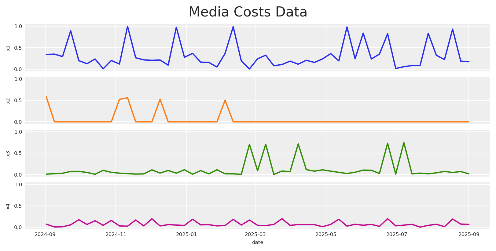
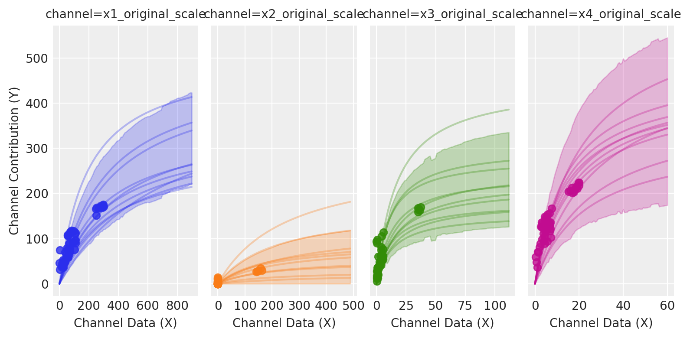
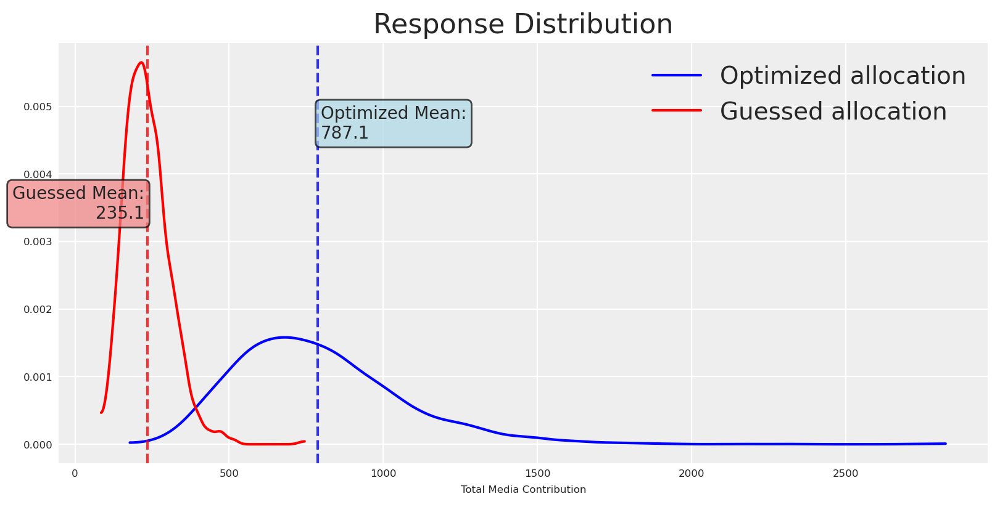
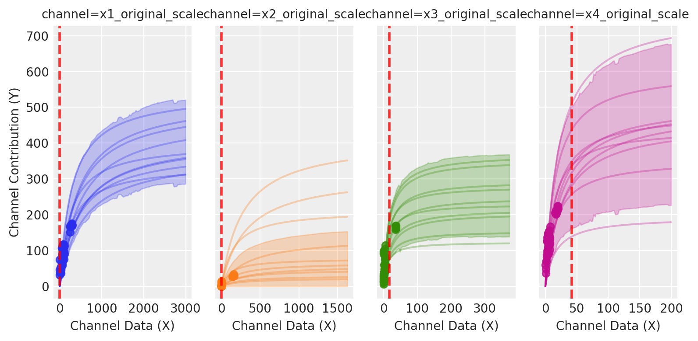
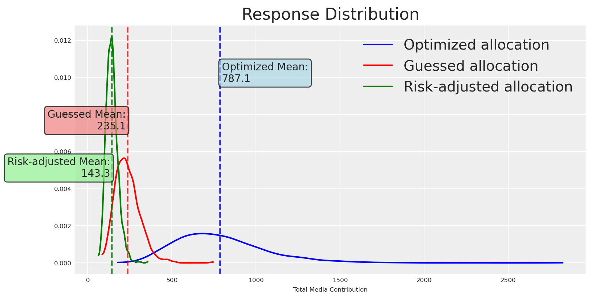
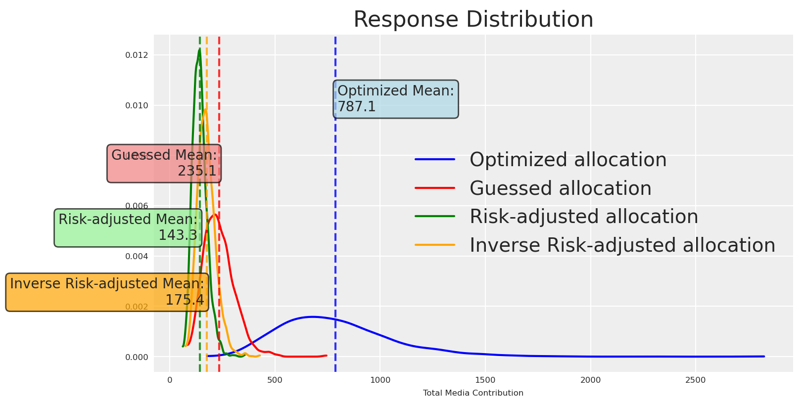
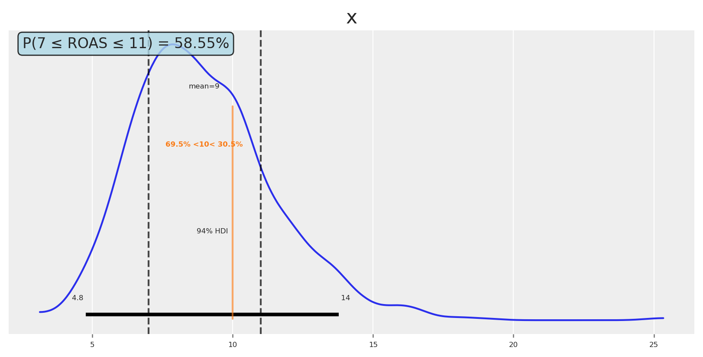

# Modelos Bayesianos y Optimización de Riesgo

> Modelos Bayesianos y optimización de riesgo para presupuestos de marketing, presentado en PyData Berlin 2025.

By Carlos Trujillo

Source: https://cetagostini.github.io/es/articles/bayesian_models_and_risk_optimization/bayesian_models_and_risk_optimization.html

# 📘 Introducción

Este artículo explora cómo el Modelado Bayesiano de Mezcla de Medios (MMM) representa la incertidumbre y cómo podemos optimizar decisiones de presupuesto bajo riesgo. Construimos una vista generativa de la respuesta de medios (arrastre vía adstock, rendimientos decrecientes vía saturación, tendencia y estacionalidad) y usamos distribuciones predictivas posteriores completas para comparar asignaciones no solo por resultados esperados sino también por dispersión y riesgo de cola.

Este material acompaña mi charla en PyData Berlin 2025, donde discuto optimización práctica sensible al riesgo para MMM: ir más allá de planes que solo consideran la media hacia objetivos que incorporan explícitamente la incertidumbre—y cómo comunicar estas compensaciones a los stakeholders.

# 📦 Importar librerías

Código

``` sourceCode
import warnings
warnings.filterwarnings("ignore", category=UserWarning)

from pymc_marketing.mmm.builders.yaml import build_mmm_from_yaml
from pymc_marketing.mmm import GeometricAdstock, MichaelisMentenSaturation
from pymc_marketing.mmm.budget_optimizer import optimizer_xarray_builder
from pymc_marketing.mmm.multidimensional import (
    MultiDimensionalBudgetOptimizerWrapper,
)
from pymc_extras.prior import Prior
from pymc_marketing.mmm import utility as ut

from scipy import ndimage

import arviz as az
import matplotlib.pyplot as plt
import seaborn as sns

import numpy as np
import pandas as pd
import xarray as xr
```

# ⚙️ Configuración del notebook

Código

``` sourceCode
az.style.use("arviz-darkgrid")
plt.rcParams["figure.figsize"] = [8, 4]
plt.rcParams["figure.dpi"] = 100
plt.rcParams["axes.labelsize"] = 6
plt.rcParams["xtick.labelsize"] = 6
plt.rcParams["ytick.labelsize"] = 6
plt.rcParams.update({"figure.constrained_layout.use": True})

%load_ext autoreload
%autoreload 2

seed: int = sum(map(ord, "pydata_berlin_2025"))
rng: np.random.Generator = np.random.default_rng(seed=seed)
default_figsize = (8, 4) # repeat to use later
```

# 🧪 Proceso de generación de datos

Simulamos resultados como y_t = \beta_0 + \sum\_{c} f(x\_{c,t}; \theta_c) + \text{trend}\_t + \text{seasonality}\_t + \varepsilon_t

donde:

- y_t es el resultado observado (por ejemplo, instalaciones de app o ingresos) en el tiempo t
- \beta_0 es el intercepto base
- f(x\_{c,t}; \theta_c) es la función de respuesta de medios para el canal c con gasto x\_{c,t} y parámetros \theta_c.
- \text{trend}\_t captura patrones de crecimiento o declive a largo plazo
- \text{seasonality}\_t modela efectos periódicos (patrones semanales, mensuales)
- \varepsilon_t representa la incertidumbre aleatoria—ruido irreducible de factores no observados, error de medición y aleatoriedad inherente que persiste incluso con conocimiento perfecto de todos los parámetros

No consideramos interacciones; el DAG causal se ve así:

Código

``` sourceCode
import graphviz

graph = graphviz.Digraph()
graph.node("Media Spend")
graph.node("Trend", style="dashed")
graph.node("Seasonality", style="dashed")
graph.node("Target")

graph.edge("Media Spend", "Target")
graph.edge("Trend", "Target")
graph.edge("Seasonality", "Target")

graph
```

<figure class="figure">
<p></p>
</figure>

## 📆 Rango de fechas

Comenzamos definiendo el rango de fechas.

Código

``` sourceCode
# date range
min_date = pd.to_datetime("2024-09-01")
max_date = pd.to_datetime("2025-09-01")

df = pd.DataFrame(
    data={"date_week": pd.date_range(start=min_date, end=max_date, freq="W-MON")}
)

n = df.shape[0]
print(f"Number of observations: {n}")
print("Date Range: {} to {}".format(df.date_week.min(), df.date_week.max()))
```

    Number of observations: 53
    Date Range: 2024-09-02 00:00:00 to 2025-09-01 00:00:00

## 📣 Datos de medios

Código

``` sourceCode
# media data
scaler_x1 = 300
scaler_x2 = 280
scaler_x3 = 50
scaler_x4 = 100
y_scaler = 1000

# media data
x1 = rng.uniform(low=0.0, high=1.0, size=n)
df["x1"] = np.where(x1 > 0.8, x1, x1 / 2)

x2 = rng.uniform(low=0.0, high=0.6, size=n)
df["x2"] = np.where(x2 > 0.5, x2, 0)

x3 = rng.uniform(low=0.0, high=0.8, size=n)
df["x3"] = np.where(x3 > 0.7, x3, x3 / 6)

x4 = rng.uniform(low=0.0, high=0.2, size=n)
df["x4"] = np.where(x4 > 0.15, x4, x4 / 2)


fig, ax = plt.subplots(
    nrows=4, ncols=1, sharex=True, sharey=True, layout="constrained"
)
sns.lineplot(x="date_week", y="x1", data=df, color="C0", ax=ax[0])
sns.lineplot(x="date_week", y="x2", data=df, color="C1", ax=ax[1])
sns.lineplot(x="date_week", y="x3", data=df, color="C2", ax=ax[2])
sns.lineplot(x="date_week", y="x4", data=df, color="C3", ax=ax[3])
ax[3].set(xlabel="date")
fig.suptitle("Media Costs Data", fontsize=16);
```

<figure class="figure">
<p></p>
</figure>

## 📈 Componentes de tendencia y estacionalidad

Definimos tendencia y estacionalidad. La estacionalidad sigue un ciclo de 4 semanas modelado con una base de Fourier; la tendencia es lineal.

Código

``` sourceCode
# Create Fourier components for monthly seasonality
monthly_period = 4  # 4-week cycle
t = np.arange(n)

# Create sin-cos signals for fourier components
monthly_sin = np.sin(2 * np.pi * t / monthly_period)
monthly_cos = np.cos(2 * np.pi * t / monthly_period)

# Combine sin-cos to create the desired pattern
# Use coefficients to shape the pattern
monthly_pattern = 0.6 * monthly_sin + 0.4 * monthly_cos

# Apply smoothing using ndimage to reduce sharp transitions
monthly_pattern = ndimage.gaussian_filter1d(monthly_pattern, sigma=0.2)

# Normalize to [-1, 1] range
monthly_pattern = (monthly_pattern / np.max(np.abs(monthly_pattern))) * .18

df["monthly_effect"] = monthly_pattern
df["trend"] = (np.linspace(start=0.0, stop=10, num=n) + 10) ** (1 / 8) - 1

fig, (ax1, ax2) = plt.subplots(2, 1, sharex=True)

# Plot monthly pattern
ax1.plot(df["date_week"], monthly_pattern, label="Monthly Pattern (Smoothed)", linewidth=2, color='blue')
ax1.set_ylabel("Pattern Value")
ax1.set_title("Monthly Fourier Pattern (4-week cycle, Smoothed)")
ax1.grid(True, alpha=0.3)
ax1.legend()

# Plot trend
ax2.plot(df["date_week"], df["trend"], label="Trend", linewidth=2, color='red')
ax2.set_xlabel("Date")
ax2.set_ylabel("Trend Value")
ax2.set_title("Linear Trend Component")
ax2.grid(True, alpha=0.3)
ax2.legend()

plt.tight_layout()
plt.show()
```

<figure class="figure">
<p></p>
</figure>

## 🔁 Transformaciones de adstock y saturación

Primero, aplicamos la transformación de adstock a los datos de medios.

Código

``` sourceCode
# apply geometric adstock transformation
alpha: float = 0.55

df["x1_adstock"] = (
    GeometricAdstock(l_max=8, normalize=True).function(x=df["x1"].to_numpy(), alpha=alpha)
    .eval()
)

df["x2_adstock"] = (
    GeometricAdstock(l_max=8, normalize=True).function(x=df["x2"].to_numpy(), alpha=alpha)
    .eval()
)

df["x3_adstock"] = (
    GeometricAdstock(l_max=8, normalize=True).function(x=df["x3"].to_numpy(), alpha=alpha)
    .eval()
)

df["x4_adstock"] = (
    GeometricAdstock(l_max=8, normalize=True).function(x=df["x4"].to_numpy(), alpha=alpha)
    .eval()
)

df.head()
```

|  | date_week | x1 | x2 | x3 | x4 | monthly_effect | trend | x1_adstock | x2_adstock | x3_adstock | x4_adstock |
|----|----|----|----|----|----|----|----|----|----|----|----|
| 0 | 2024-09-02 | 0.342627 | 0.581017 | 0.009625 | 0.072294 | 0.120001 | 0.333521 | 0.155484 | 0.263665 | 0.004368 | 0.032807 |
| 1 | 2024-09-09 | 0.349177 | 0.000000 | 0.018831 | 0.007122 | 0.180000 | 0.336700 | 0.243973 | 0.145016 | 0.010948 | 0.021276 |
| 2 | 2024-09-16 | 0.292217 | 0.000000 | 0.029268 | 0.011185 | -0.120000 | 0.339827 | 0.266793 | 0.079759 | 0.019303 | 0.016778 |
| 3 | 2024-09-23 | 0.893449 | 0.000000 | 0.073220 | 0.056761 | -0.180000 | 0.342904 | 0.552183 | 0.043867 | 0.043844 | 0.034986 |
| 4 | 2024-09-30 | 0.197823 | 0.000000 | 0.073854 | 0.175182 | 0.120000 | 0.345932 | 0.393473 | 0.024127 | 0.057629 | 0.098740 |

Luego aplicamos la transformación de saturación a los datos de medios transformados por adstock.

Código

``` sourceCode
alpha_sat_x1: float = 0.3
lam_sat_x1: float = 1.1

alpha_sat_x2: float = 0.1
lam_sat_x2: float = 1.5

alpha_sat_x3: float = 0.2
lam_sat_x3: float = 0.3

alpha_sat_x4: float = 0.8
lam_sat_x4: float = 0.8

df["x1_adstock_saturated"] = (
    MichaelisMentenSaturation().function(
        x=df["x1_adstock"].to_numpy(),
        alpha=alpha_sat_x1,
        lam=lam_sat_x1,
    ).eval()
)

df["x2_adstock_saturated"] = (
    MichaelisMentenSaturation().function(
        x=df["x2_adstock"].to_numpy(),
        alpha=alpha_sat_x2,
        lam=lam_sat_x2,
    ).eval()
)

df["x3_adstock_saturated"] = (
    MichaelisMentenSaturation().function(
        x=df["x3_adstock"].to_numpy(),  
        alpha=alpha_sat_x3,
        lam=lam_sat_x3,
    ).eval()
)

df["x4_adstock_saturated"] = (
    MichaelisMentenSaturation().function(
        x=df["x4_adstock"].to_numpy(),
        alpha=alpha_sat_x4,
        lam=lam_sat_x4,
    ).eval()
)

df.head()
```

|  | date_week | x1 | x2 | x3 | x4 | monthly_effect | trend | x1_adstock | x2_adstock | x3_adstock | x4_adstock | x1_adstock_saturated | x2_adstock_saturated | x3_adstock_saturated | x4_adstock_saturated |
|----|----|----|----|----|----|----|----|----|----|----|----|----|----|----|----|
| 0 | 2024-09-02 | 0.342627 | 0.581017 | 0.009625 | 0.072294 | 0.120001 | 0.333521 | 0.155484 | 0.263665 | 0.004368 | 0.032807 | 0.037153 | 0.014950 | 0.002870 | 0.031515 |
| 1 | 2024-09-09 | 0.349177 | 0.000000 | 0.018831 | 0.007122 | 0.180000 | 0.336700 | 0.243973 | 0.145016 | 0.010948 | 0.021276 | 0.054459 | 0.008815 | 0.007042 | 0.020725 |
| 2 | 2024-09-16 | 0.292217 | 0.000000 | 0.029268 | 0.011185 | -0.120000 | 0.339827 | 0.266793 | 0.079759 | 0.019303 | 0.016778 | 0.058559 | 0.005049 | 0.012091 | 0.016433 |
| 3 | 2024-09-23 | 0.893449 | 0.000000 | 0.073220 | 0.056761 | -0.180000 | 0.342904 | 0.552183 | 0.043867 | 0.043844 | 0.034986 | 0.100264 | 0.002841 | 0.025502 | 0.033520 |
| 4 | 2024-09-30 | 0.197823 | 0.000000 | 0.073854 | 0.175182 | 0.120000 | 0.345932 | 0.393473 | 0.024127 | 0.057629 | 0.098740 | 0.079038 | 0.001583 | 0.032228 | 0.087892 |

Visualicemos cómo se ven los datos de medios después de adstock y saturación, y cómo se traducen en unidades de Y (instalaciones de app o ingresos).

Código

``` sourceCode
fig, ax = plt.subplots(
    nrows=3, ncols=4, sharex=True, sharey=False, layout="constrained"
)
sns.lineplot(x="date_week", y="x1", data=df, color="C0", ax=ax[0, 0])
sns.lineplot(x="date_week", y="x2", data=df, color="C1", ax=ax[0, 1])
sns.lineplot(x="date_week", y="x1_adstock", data=df, color="C0", ax=ax[1, 0])
sns.lineplot(x="date_week", y="x2_adstock", data=df, color="C1", ax=ax[1, 1])
sns.lineplot(x="date_week", y="x1_adstock_saturated", data=df, color="C0", ax=ax[2, 0])
sns.lineplot(x="date_week", y="x2_adstock_saturated", data=df, color="C1", ax=ax[2, 1])
sns.lineplot(x="date_week", y="x3", data=df, color="C2", ax=ax[0, 2])
sns.lineplot(x="date_week", y="x3_adstock", data=df, color="C2", ax=ax[1, 2])
sns.lineplot(x="date_week", y="x3_adstock_saturated", data=df, color="C2", ax=ax[2, 2])
sns.lineplot(x="date_week", y="x4", data=df, color="C3", ax=ax[0, 3])
sns.lineplot(x="date_week", y="x4_adstock", data=df, color="C3", ax=ax[1, 3])
sns.lineplot(x="date_week", y="x4_adstock_saturated", data=df, color="C3", ax=ax[2, 3])
fig.suptitle("Media Costs Data - Transformed", fontsize=16);
```

<figure class="figure">
<p></p>
</figure>

Ahora agregamos el intercepto y el ruido, y sumamos los componentes de medios transformados, tendencia y estacionalidad.

Código

``` sourceCode
df["intercept"] = 0.15
df["epsilon"] = rng.normal(loc=0.0, scale=0.075, size=n)

df["app_installs"] = df[["intercept", "x1_adstock_saturated", "x2_adstock_saturated", "x3_adstock_saturated", "x4_adstock_saturated", "trend", "monthly_effect", "epsilon"]].sum(axis=1)
df["app_installs"] *= y_scaler
df.head()
```

|  | date_week | x1 | x2 | x3 | x4 | monthly_effect | trend | x1_adstock | x2_adstock | x3_adstock | x4_adstock | x1_adstock_saturated | x2_adstock_saturated | x3_adstock_saturated | x4_adstock_saturated | intercept | epsilon | app_installs |
|----|----|----|----|----|----|----|----|----|----|----|----|----|----|----|----|----|----|----|
| 0 | 2024-09-02 | 0.342627 | 0.581017 | 0.009625 | 0.072294 | 0.120001 | 0.333521 | 0.155484 | 0.263665 | 0.004368 | 0.032807 | 0.037153 | 0.014950 | 0.002870 | 0.031515 | 0.15 | 0.154459 | 844.469551 |
| 1 | 2024-09-09 | 0.349177 | 0.000000 | 0.018831 | 0.007122 | 0.180000 | 0.336700 | 0.243973 | 0.145016 | 0.010948 | 0.021276 | 0.054459 | 0.008815 | 0.007042 | 0.020725 | 0.15 | 0.177488 | 935.229200 |
| 2 | 2024-09-16 | 0.292217 | 0.000000 | 0.029268 | 0.011185 | -0.120000 | 0.339827 | 0.266793 | 0.079759 | 0.019303 | 0.016778 | 0.058559 | 0.005049 | 0.012091 | 0.016433 | 0.15 | 0.052790 | 514.748757 |
| 3 | 2024-09-23 | 0.893449 | 0.000000 | 0.073220 | 0.056761 | -0.180000 | 0.342904 | 0.552183 | 0.043867 | 0.043844 | 0.034986 | 0.100264 | 0.002841 | 0.025502 | 0.033520 | 0.15 | -0.034546 | 440.486094 |
| 4 | 2024-09-30 | 0.197823 | 0.000000 | 0.073854 | 0.175182 | 0.120000 | 0.345932 | 0.393473 | 0.024127 | 0.057629 | 0.098740 | 0.079038 | 0.001583 | 0.032228 | 0.087892 | 0.15 | 0.090876 | 907.549889 |

Así se ve el objetivo.

Código

``` sourceCode
df.set_index("date_week").app_installs.plot();
```

<figure class="figure">
<p></p>
</figure>

También agregamos los medios originales al DataFrame para poder visualizarlos antes de cualquier transformación y usarlos como entrada del modelo.

Código

``` sourceCode
df[["x1_original_scale", "x2_original_scale", "x3_original_scale", "x4_original_scale"]] = df[["x1", "x2", "x3", "x4"]]
df["x1_original_scale"] *= scaler_x1
df["x2_original_scale"] *= scaler_x2
df["x3_original_scale"] *= scaler_x3
df["x4_original_scale"] *= scaler_x4

df[["date_week", "x1_original_scale", "x2_original_scale", "x3_original_scale", "app_installs"]].head()
```

|  | date_week | x1_original_scale | x2_original_scale | x3_original_scale | app_installs |
|----|----|----|----|----|----|
| 0 | 2024-09-02 | 102.788211 | 162.684671 | 0.481258 | 844.469551 |
| 1 | 2024-09-09 | 104.753127 | 0.000000 | 0.941552 | 935.229200 |
| 2 | 2024-09-16 | 87.665114 | 0.000000 | 1.463382 | 514.748757 |
| 3 | 2024-09-23 | 268.034637 | 0.000000 | 3.661005 | 440.486094 |
| 4 | 2024-09-30 | 59.346861 | 0.000000 | 3.692695 | 907.549889 |

# 🏗️ Construyendo el modelo

La configuración YAML codifica un MMM completamente Bayesiano con priors sobre la mecánica de respuesta central y la estructura temporal. Para detalles del modelo y ejemplos prácticos, consulta la [Galería de ejemplos](https://www.pymc-marketing.io/en/stable/gallery/gallery.html) y el [API](https://www.pymc-marketing.io/en/stable/api/index.html) de PyMC‑Marketing.

Aquí dividimos los datos en conjuntos de entrenamiento y prueba. No para evaluar el ajuste; en su lugar, usamos el conjunto de prueba para comparar los resultados de la optimización, verificando si será “mejor” en las recomendaciones de presupuesto que el plan actual/vigente.

Código

``` sourceCode
df_train = df.query("date_week <= '2025-08-30'").copy()
x_train = df_train[["date_week", "x1_original_scale", "x2_original_scale", "x3_original_scale", "x4_original_scale"]]
y_train = df_train["app_installs"]

df_test = df.query("date_week > '2025-08-30'").copy()
x_test = df_test[["date_week", "x1_original_scale", "x2_original_scale", "x3_original_scale", "x4_original_scale"]]
y_test = df_test["app_installs"]
```

Dado que el modelo fue definido previamente en el YAML, construirlo es directo y toma solo unas pocas líneas.

Código

``` sourceCode
mmm = build_mmm_from_yaml(
    X=x_train,
    y=y_train,
    config_path="pymc_model.yml",
)
```

¡Ahora ajustamos el modelo y verificamos la convergencia!

Código

``` sourceCode
mmm.fit(
    X=x_train,
    y=y_train,
    random_seed=rng,
)

mmm.sample_posterior_predictive(
    X=x_train,
    extend_idata=True,
    combined=True,
    random_seed=rng,
)
```

**Sampler Progress**

Total Chains: 4

Active Chains: 0

Finished Chains: 4

Sampling for now

Estimated Time to Completion: now

| Progress | Draws | Divergences | Step Size | Gradients/Draw |
|----------|-------|-------------|-----------|----------------|
|          | 1300  | 0           | 0.10      | 63             |
|          | 1300  | 0           | 0.10      | 31             |
|          | 1300  | 0           | 0.10      | 31             |
|          | 1300  | 0           | 0.11      | 63             |

```
```

```
```

``` xr-text-repr-fallback
<xarray.Dataset> Size: 2MB
Dimensions:           (date: 52, sample: 2000)
Coordinates:
  * date              (date) datetime64[ns] 416B 2024-09-02 ... 2025-08-25
  * sample            (sample) object 16kB MultiIndex
  * chain             (sample) int64 16kB 0 0 0 0 0 0 0 0 0 ... 3 3 3 3 3 3 3 3
  * draw              (sample) int64 16kB 0 1 2 3 4 5 ... 495 496 497 498 499
Data variables:
    y                 (date, sample) float64 832kB 0.7353 1.207 ... 1.198 0.1073
    y_original_scale  (date, sample) float64 832kB 731.8 1.201e+03 ... 106.7
Attributes:
    created_at:                 2026-09-16T22:15:37.640768+00:00
    arviz_version:              0.21.0
    inference_library:          pymc
    inference_library_version:  5.28.5
```

xarray.Dataset

Dimensions:

- date: 52
- sample: 2000

Coordinates: (4)

date(date)datetime64\[ns\]2024-09-02 ... 2025-08-25

<!-- -->

    array(['2024-09-02T00:00:00.000000000', '2024-09-09T00:00:00.000000000',
           '2024-09-16T00:00:00.000000000', '2024-09-23T00:00:00.000000000',
           '2024-09-30T00:00:00.000000000', '2024-10-07T00:00:00.000000000',
           '2024-10-14T00:00:00.000000000', '2024-10-21T00:00:00.000000000',
           '2024-10-28T00:00:00.000000000', '2024-11-04T00:00:00.000000000',
           '2024-11-11T00:00:00.000000000', '2024-11-18T00:00:00.000000000',
           '2024-11-25T00:00:00.000000000', '2024-12-02T00:00:00.000000000',
           '2024-12-09T00:00:00.000000000', '2024-12-16T00:00:00.000000000',
           '2024-12-23T00:00:00.000000000', '2024-12-30T00:00:00.000000000',
           '2025-01-06T00:00:00.000000000', '2025-01-13T00:00:00.000000000',
           '2025-01-20T00:00:00.000000000', '2025-01-27T00:00:00.000000000',
           '2025-02-03T00:00:00.000000000', '2025-02-10T00:00:00.000000000',
           '2025-02-17T00:00:00.000000000', '2025-02-24T00:00:00.000000000',
           '2025-03-03T00:00:00.000000000', '2025-03-10T00:00:00.000000000',
           '2025-03-17T00:00:00.000000000', '2025-03-24T00:00:00.000000000',
           '2025-03-31T00:00:00.000000000', '2025-04-07T00:00:00.000000000',
           '2025-04-14T00:00:00.000000000', '2025-04-21T00:00:00.000000000',
           '2025-04-28T00:00:00.000000000', '2025-05-05T00:00:00.000000000',
           '2025-05-12T00:00:00.000000000', '2025-05-19T00:00:00.000000000',
           '2025-05-26T00:00:00.000000000', '2025-06-02T00:00:00.000000000',
           '2025-06-09T00:00:00.000000000', '2025-06-16T00:00:00.000000000',
           '2025-06-23T00:00:00.000000000', '2025-06-30T00:00:00.000000000',
           '2025-07-07T00:00:00.000000000', '2025-07-14T00:00:00.000000000',
           '2025-07-21T00:00:00.000000000', '2025-07-28T00:00:00.000000000',
           '2025-08-04T00:00:00.000000000', '2025-08-11T00:00:00.000000000',
           '2025-08-18T00:00:00.000000000', '2025-08-25T00:00:00.000000000'],
          dtype='datetime64[ns]')

sample(sample)objectMultiIndex

<!-- -->

    array([(0, 0), (0, 1), (0, 2), ..., (3, 497), (3, 498), (3, 499)], dtype=object)

chain(sample)int640 0 0 0 0 0 0 0 ... 3 3 3 3 3 3 3 3

<!-- -->

    array([0, 0, 0, ..., 3, 3, 3])

draw(sample)int640 1 2 3 4 5 ... 495 496 497 498 499

<!-- -->

    array([  0,   1,   2, ..., 497, 498, 499])

Data variables: (2)

y(date, sample)float640.7353 1.207 1.484 ... 1.198 0.1073

<!-- -->

    array([[0.73528722, 1.20680328, 1.48402619, ..., 0.47331738, 2.50422998,
            1.14033821],
           [0.14933635, 2.55826163, 0.23165906, ..., 1.44143359, 0.41606272,
            0.92845345],
           [0.32660566, 1.20948617, 0.33424877, ..., 0.87376765, 0.74022925,
            1.68338595],
           ...,
           [0.20001286, 0.4009374 , 0.72248646, ..., 0.18083986, 0.78481387,
            2.93341044],
           [0.25579167, 0.81699757, 0.35158191, ..., 1.52057009, 0.08659689,
            0.22502676],
           [0.1751002 , 0.96818072, 0.16677562, ..., 0.02643417, 1.19763758,
            0.10725884]])

y_original_scale(date, sample)float64731.8 1.201e+03 ... 1.192e+03 106.7

<!-- -->

    array([[ 731.7662282 , 1201.02439697, 1476.91979503, ...,  471.0508609 ,
            2492.2382503 , 1134.87759619],
           [ 148.62123984, 2546.01116854,  230.54973596, ..., 1434.53115706,
             414.07037096,  924.0074658 ],
           [ 325.04168189, 1203.69443356,  332.6481892 , ...,  869.58353809,
             736.68459528, 1675.32490415],
           ...,
           [ 199.05508315,  399.0174804 ,  719.02676823, ...,  179.9738935 ,
             781.0557214 , 2919.36354101],
           [ 254.56678667,  813.08530529,  349.8983325 , ..., 1513.28870557,
              86.18221025,  223.94919502],
           [ 174.26171734,  963.54449844,  165.97700171, ...,   26.30759054,
            1191.90258399,  106.74522615]])

Indexes: (2)

datePandasIndex

    PandasIndex(DatetimeIndex(['2024-09-02', '2024-09-09', '2024-09-16', '2024-09-23',
                   '2024-09-30', '2024-10-07', '2024-10-14', '2024-10-21',
                   '2024-10-28', '2024-11-04', '2024-11-11', '2024-11-18',
                   '2024-11-25', '2024-12-02', '2024-12-09', '2024-12-16',
                   '2024-12-23', '2024-12-30', '2025-01-06', '2025-01-13',
                   '2025-01-20', '2025-01-27', '2025-02-03', '2025-02-10',
                   '2025-02-17', '2025-02-24', '2025-03-03', '2025-03-10',
                   '2025-03-17', '2025-03-24', '2025-03-31', '2025-04-07',
                   '2025-04-14', '2025-04-21', '2025-04-28', '2025-05-05',
                   '2025-05-12', '2025-05-19', '2025-05-26', '2025-06-02',
                   '2025-06-09', '2025-06-16', '2025-06-23', '2025-06-30',
                   '2025-07-07', '2025-07-14', '2025-07-21', '2025-07-28',
                   '2025-08-04', '2025-08-11', '2025-08-18', '2025-08-25'],
                  dtype='datetime64[ns]', name='date', freq=None))

sample  
chain  
drawPandasMultiIndex

    PandasIndex(MultiIndex([(0,   0),
                (0,   1),
                (0,   2),
                (0,   3),
                (0,   4),
                (0,   5),
                (0,   6),
                (0,   7),
                (0,   8),
                (0,   9),
                ...
                (3, 490),
                (3, 491),
                (3, 492),
                (3, 493),
                (3, 494),
                (3, 495),
                (3, 496),
                (3, 497),
                (3, 498),
                (3, 499)],
               name='sample', length=2000))

Attributes: (4)

created_at :  
2026-09-16T22:15:37.640768+00:00

arviz_version :  
0.21.0

inference_library :  
pymc

inference_library_version :  
5.28.5

Genial, sin divergencias 🔥

Código

``` sourceCode
mmm.idata.sample_stats.diverging.sum().item()
```

    0

Podemos inspeccionar los parámetros relevantes para la optimización.

Código

``` sourceCode
media_vars = [
    "saturation_alpha",
    "saturation_lam",
    "adstock_alpha",
]

_ = az.plot_trace(
    data=mmm.fit_result,
    var_names=media_vars,
    compact=True,
    backend_kwargs={"figsize": default_figsize, "layout": "constrained"},
)
plt.gcf().suptitle("Model Trace", fontsize=16, fontweight="bold", y=1.03);
```

<figure class="figure">
<p></p>
</figure>

Como era de esperarse, algunos parámetros están bien identificados mientras otros permanecen inciertos.

Muestrear curvas de saturación del posterior nos ayuda a visualizar la incertidumbre de parámetros como bandas alrededor de la respuesta de cada canal. Bandas anchas indican rendimientos marginales pobremente identificados; asignar en esas regiones incrementa la varianza del resultado porque pequeños cambios en los parámetros causan grandes cambios en la respuesta.

Código

``` sourceCode
curve = mmm.saturation.sample_curve(
    mmm.idata.posterior[["saturation_alpha", "saturation_lam"]], max_value=3
)

fig, axes = mmm.plot.saturation_curves(
    curve,
    original_scale=True,
    n_samples=10,
    hdi_probs=0.85,
    random_seed=rng,
    subplot_kwargs={"figsize": default_figsize, "ncols": 4, "sharey": True},
    rc_params={
        "xtick.labelsize": 10,
        "ytick.labelsize": 10,
        "axes.labelsize": 10,
        "axes.titlesize": 10,
    },

)

for ax in axes.ravel():
    ax.title.set_fontsize(10)

if fig._suptitle is not None:
    fig._suptitle.set_fontsize(12)

plt.tight_layout()
plt.show()
```

```
```

<figure class="figure">
<p></p>
</figure>

La imagen es clara: canales como X1 y X3 exhiben más variación entre niveles de gasto, permitiendo que el modelo aprenda sus parámetros con mayor precisión. Canales como X2 y X4 tienen un gasto relativamente constante con menos variación, por lo que sus parámetros se estiman con mayor incertidumbre.

# 🎲 Entendiendo la incertidumbre

En un MMM Bayesiano modelamos explícitamente dos formas de incertidumbre que se combinan en pronósticos y en decisiones de presupuesto:

- Incertidumbre aleatoria: aleatoriedad en los resultados condicionada a parámetros fijos. En la simulación, esto es `epsilon`. Formalmente, si los parámetros son \theta, la incertidumbre aleatoria es la dispersión de p(y\mid x,\theta) una vez que modelamos la verosimilitud como \mathcal{N}(0, \sigma^2). En nuestro modelo, el parámetro \sigma captura explícitamente la incertidumbre aleatoria: cuantifica la cantidad de variabilidad del resultado que persiste incluso si todos los parámetros estructurales \theta fueran conocidos con exactitud. Representa la imprevisibilidad inherente debido a micro-variaciones no observadas, choques de demanda o ruido de registro. Incluso con datos infinitos, la incertidumbre aleatoria persiste.

- Incertidumbre epistémica: incertidumbre sobre los parámetros y las funciones latentes debido a datos limitados o poco informativos. Esta es la dispersión del posterior p(\theta\mid \text{data}). Se reduce con más datos, mejores priors o mayor variación experimental. En nuestro modelo incluye la memoria de arrastre (adstock \alpha), la curvatura de saturación y saturación a la mitad (Michaelis–Menten \alpha,\lambda), pendientes de tendencia y pesos de Fourier estacionales.

Por qué esta separación importa para la planificación:

1.  Distribución del resultado bajo un plan. Para un plan de asignación dado b sobre canales y tiempo, la predictiva posterior es p\big(Y(b)\mid \text{data}\big) = \int p\big(Y(b)\mid \theta\big)\\ p(\theta\mid \text{data})\\ d\theta,

que mezcla variabilidad aleatoria (el término interno) y variabilidad epistémica (integración sobre \theta). Nuestro estimador de Monte Carlo muestrea \theta^{(s)} del posterior, simula arrastre y saturación bajo b, y extrae resultados predictivos.

2.  Ejemplo: curvatura conocida vs desconocida. Supongamos que la saturación de un canal está bien aprendida alrededor de los gastos históricos pero no más allá. Dos planes con el mismo gasto total difieren en riesgo:

    - El plan A se concentra alrededor de la moda histórica (baja incertidumbre epistémica), produciendo una distribución predictiva estrecha.
    - El plan B se extiende más allá de los gastos observados (alta incertidumbre epistémica), produciendo una distribución más amplia y colas de pérdida más pesadas si la curva se aplana antes de lo esperado.

Durante la optimización, nos enfocamos en el segundo componente —incertidumbre epistémica— y podemos elegir cuánta confianza requerimos alrededor de ella. Una vez que elegimos una asignación, entonces incorporamos la incertidumbre aleatoria para cuantificar la distribución total de respuesta, si así lo deseamos.

# 🧭 Optimización

Pensemos en nuestro modelo y sus resultados, comenzando con la distribución predictiva posterior: p\big(Y(b)\mid \text{data}\big) = \int p\big(Y(b)\mid \theta\big)\\ p(\theta\mid \text{data})\\ d\theta

Como puedes ver, la distribución predictiva posterior incorpora tanto incertidumbre aleatoria como epistémica, lo que significa que el problema de optimización se reduce a elegir una asignación b que optimice un resumen escalar de esta distribución.

Formalmente, sea b \in \mathbb{R}^C una asignación factible (por ejemplo, presupuestos por canal) con restricciones \sum\_{c=1}^C b_c = B, \qquad \underline{b}\_c \leq b_c \leq \overline{b}\_c.

Para cada asignación candidata b, obtenemos draws de Monte Carlo de la distribución predictiva posterior: \\Y^{(s)}(b)\\\_{s=1}^S \sim p(Y \mid \mathrm{do}(X=b), \mathcal{D}),

Luego se calcula un estadístico (por ejemplo, la media, un cuantil, una puntuación ajustada por riesgo, o el puntaje de concentración media). \phi\\\left(\\Y^{(s)}(b)\\\right)

En consecuencia, el problema de optimización resuelto por SLSQP es simplemente \min\_{b \in \mathcal{B}} J(b), \qquad J(b) = f\\\left(\phi(\\Y^{(s)}(b)\\)\right),

donde f se define de modo que el solucionador minimice el estadístico elegido de la distribución predictiva posterior.

Esta formulación es flexible: al cambiar \phi, podemos apuntar a criterios neutrales al riesgo o sensibles al riesgo o incluso heurísticos, mientras siempre fundamentamos la decisión en la distribución predictiva posterior.

💡 Notas sobre supuestos

¿Por qué decimos do=(X=b)?

- **Invariancia estructural**: Las funciones de respuesta (tendencia, estacionalidad, adstock, saturación, enlace) son invariantes ante intervenciones b sobre el horizonte de optimización.
- **Sin confusión no medida**: Condicionado a las covariables incluidas y controles temporales, no hay factores de confusión no medidos (especialmente variables en el tiempo) que afecten tanto el gasto como el resultado; se cumple el criterio de puerta trasera.

Usamos p\big(Y \mid \mathrm{do}(X=b), \mathcal{D}\big) como abreviatura para la predictiva posterior bajo estos supuestos. Cuando las asignaciones se alejan mucho del soporte, los resultados se vuelven extrapolativos y deben tratarse como análisis de sensibilidad en lugar de efectos identificados.

¿👀 Realmente Bayesiano?

Nuestro enfoque difiere de la “optimización Bayesiana” en el sentido de ML (que modela secuencialmente el objetivo con un sustituto y optimiza una función de adquisición). En contraste, ya tenemos el posterior completo p(\theta \mid \text{data}), que propagamos en la predictiva posterior p(Y(b)\mid \text{data}). La optimización entonces opera sobre un funcional escalar \phi de esta distribución. Esto puede verse como una compresión de la predictiva posterior en un resumen relevante para la decisión, pero no como una pérdida de información Bayesiana. La optimización permanece completamente Bayesiana porque el criterio depende enteramente de draws del posterior.

## 🛠️ Definir el optimizador

Inicializar el optimizador es directo: pasa el modelo y el rango de fechas.

Código

``` sourceCode
optimizable_model = MultiDimensionalBudgetOptimizerWrapper(
    model=mmm, 
    start_date=df_test.date_week.min().strftime("%Y-%m-%d"), 
    end_date=df_test.date_week.max().strftime("%Y-%m-%d")
)
print(f"Start date: {optimizable_model.start_date}")
print(f"End date: {optimizable_model.end_date}")
```

    Start date: 2025-09-01
    End date: 2025-09-01

Usaremos el conjunto de prueba para definir el presupuesto y el período de optimización para que podamos comparar la asignación resultante con nuestro plan actual.

Código

``` sourceCode
channels = ["x1_original_scale", "x2_original_scale", "x3_original_scale", "x4_original_scale"]
num_periods = optimizable_model.num_periods
time_unit_budget = df_test[channels].sum(axis=1).mean()
print(f"Total budget to allocate: {num_periods * time_unit_budget:,.0f}")
```

    Total budget to allocate: 59

Dado el presupuesto y los canales, podemos estimar la respuesta para nuestro plan inicial.

Código

``` sourceCode
initial_budget = df_test[channels].sum(axis=0).to_xarray().rename({"index":"channel"})
initial_posterior_response = optimizable_model.sample_response_distribution(
    allocation_strategy=initial_budget,
    include_carryover=True,
    include_last_observations=False,
    additional_var_names=["y_original_scale"]
)

fig, ax = optimizable_model.plot.budget_allocation(
    samples=initial_posterior_response,
    figsize=default_figsize,
)
```

<figure class="figure">
<p></p>
</figure>

El `plot.budget_allocation` por defecto genera un gráfico de barras con asignación y respuesta por canal. Para ver los totales, podemos sumar y crear un gráfico de dispersión simple con una etiqueta para el ROAS.

Código

``` sourceCode
# Create scatterplot with spend and mean response
spend = initial_posterior_response.allocation.sum().values
mean_response = initial_posterior_response.total_media_contribution_original_scale.mean(dim='sample').values

initial_roas = mean_response / spend

plt.scatter(spend, mean_response, alpha=0.7, s=100, label=f"ROAS: {initial_roas:.2f}")
plt.xlabel('Spend')
plt.ylabel('Mean Response')
plt.title('Spend vs Mean Response')
plt.grid(True, alpha=0.3)
plt.legend(fontsize='small', loc='upper left')
plt.show()
```

<figure class="figure">
<p></p>
</figure>

Obtuvimos un ROAS de 3.9 para el plan inicial, que está por debajo de nuestro ROAS objetivo (digamos 8). Ahora podemos ejecutar una optimización estándar para responder la pregunta: **¿podemos reasignar para lograr una mayor respuesta dado el mismo presupuesto?**

Código

``` sourceCode
allocation_strategy, optimization_result = optimizable_model.optimize_budget(
    budget=time_unit_budget,
)

naive_posterior_response = optimizable_model.sample_response_distribution(
    allocation_strategy=allocation_strategy,
    include_carryover=True,
    include_last_observations=False,
    additional_var_names=["y_original_scale"]
)

print("Budget allocation by channel:")
for channel in channels:
    print(
        f"  {channel}: {naive_posterior_response.allocation.sel(channel=channel).astype(int).sum():,}"
    )
print(
    f"Total Allocated Budget: {np.sum(naive_posterior_response.allocation.to_numpy()):,.0f}"
)

fig, ax = optimizable_model.plot.budget_allocation(
    samples=naive_posterior_response,
    figsize=default_figsize,
)
```

    Budget allocation by channel:
      x1_original_scale: 0
      x2_original_scale: 0
      x3_original_scale: 16
      x4_original_scale: 42
    Total Allocated Budget: 59

<figure class="figure">
<p></p>
</figure>

Sí, lo hacemos. Comparemos la respuesta optimizada contra el plan base.

Código

``` sourceCode
# Create scatterplot with spend and mean response
mean_response_v2 = naive_posterior_response.total_media_contribution_original_scale.mean(dim='sample').values
roas_v2 = mean_response_v2 / spend

# Calculate the delta in response
response_delta = mean_response_v2.sum() - mean_response.sum()

plt.scatter(spend, mean_response_v2, alpha=0.7, s=100, color="blue", label=f"Optimized allocation (+{response_delta:.1f} response, ROAS: {roas_v2:.2f})")
plt.scatter(spend, mean_response, alpha=0.7, s=100, color="red", label="Guessed allocation")

plt.xlabel('Spend')
plt.ylabel('Mean Response')
plt.title('Spend vs Mean Response')
plt.grid(True, alpha=0.3)
plt.legend(fontsize='small', loc='upper left')
plt.show()
```

<figure class="figure">
<p></p>
</figure>

La asignación optimizada es ~500 unidades mayor que la asignación estimada, y el nuevo ROAS estimado es 13, lo cual supera nuestras expectativas. En consecuencia, asumimos que obtendremos un ingreso Y estimado en los próximos N períodos y planificando contra este flujo de caja entrante recuperaremos la inversión.

¿El giro de la trama? Obtuvimos una respuesta menor, lo que significa un ROAS más bajo y tuvimos problemas financieros serios porque no tenemos suficiente efectivo para pagar a proveedores o servicios.

¿Por qué ocurre esto? Maximizar la respuesta media es neutral al riesgo. A menudo reasigna el presupuesto hacia regiones con potenciales altos retornos aunque estén débilmente identificadas, aumentando la dispersión de los resultados. Esto es racional cuando los stakeholders son indiferentes al riesgo. Sin embargo, ese no es el caso para todas las empresas. A veces nuestros stakeholders necesitan saber qué tan seguros estamos sobre los resultados esperados.

Al inspeccionar muestras predictivas posteriores bajo cada asignación, podemos cuantificar la incertidumbre y responder esta pregunta, basándonos en la comprensión actual del modelo.

Grafiquemos las distribuciones de respuesta para ambas asignaciones, la base y la optimizada.

Código

``` sourceCode
fig, ax = plt.subplots()

# Get the values
optimized_values = naive_posterior_response.total_media_contribution_original_scale.values
guessed_values = initial_posterior_response.total_media_contribution_original_scale.values

# Plot distributions
az.plot_dist(
    optimized_values,
    color="blue",
    label="Optimized allocation",
    ax=ax,
)
az.plot_dist(
    guessed_values,
    color="red",
    label="Guessed allocation",
    ax=ax,
)

# Calculate means
optimized_mean = optimized_values.mean()
guessed_mean = guessed_values.mean()

# Add vertical lines for means
ax.axvline(optimized_mean, color="blue", linestyle="--", alpha=0.8)
ax.axvline(guessed_mean, color="red", linestyle="--", alpha=0.8)

# Add text boxes with mean values
ax.text(optimized_mean + 10, ax.get_ylim()[1] * 0.8, 
        f'Optimized Mean:\n{optimized_mean:.1f}', 
        bbox=dict(boxstyle="round,pad=0.3", facecolor="lightblue", alpha=0.7),
        ha='left', va='center')

ax.text(guessed_mean - 10, ax.get_ylim()[1] * 0.6, 
        f'Guessed Mean:\n{guessed_mean:.1f}', 
        bbox=dict(boxstyle="round,pad=0.3", facecolor="lightcoral", alpha=0.7),
        ha='right', va='center')

plt.title("Response Distribution")
plt.xlabel("Total Media Contribution")
plt.legend()
plt.show()
```

<figure class="figure">
<p></p>
</figure>

Como era de esperarse, las medias difieren (optimizamos para incrementarla), y lo mismo ocurre con la certeza alrededor de la media. Como ejercicio, observemos qué tan probable es obtener una respuesta mayor y menor que la media.

Código

``` sourceCode
az.plot_posterior(
    optimized_values,
    figsize=default_figsize,
    ref_val=optimized_mean,
)
plt.show()
```

<figure class="figure">
<p></p>
</figure>

Esto aclara todo ahora; las probabilidades de obtener algo mayor o igual que la media eran del 43% pero las probabilidades de obtener algo menor que la media eran del 56%. No es sorpresa que obtuviéramos una respuesta menor y un ROAS más bajo.

💡 Primera conclusión

Comparar distribuciones completas hace el riesgo transparente: la amplitud cuantifica la confiabilidad del pronóstico, la asimetría revela la asimetría entre oportunidad y riesgo, y las superposiciones muestran indistinguibilidad práctica.

¿De dónde viene este riesgo? La nueva asignación es más riesgosa, pero ¿por qué? Veamos cada nivel de gasto en relación con su curva de saturación.

Código

``` sourceCode
curve = mmm.saturation.sample_curve(
    mmm.idata.posterior[["saturation_alpha", "saturation_lam"]], max_value=10
)

fig, axes = mmm.plot.saturation_curves(
    curve,
    original_scale=True,
    n_samples=10,
    hdi_probs=0.85,
    random_seed=rng,
    subplot_kwargs={"figsize": default_figsize, "ncols": 4, "sharey": True},
    rc_params={
        "xtick.labelsize": 10,
        "ytick.labelsize": 10,
        "axes.labelsize": 10,
        "axes.titlesize": 10,
    },

)

# Add vertical lines for optimal allocation on each subplot
allocation_values = naive_posterior_response.allocation.values
channel_names = naive_posterior_response.allocation.channel.values

for i, (ax, allocation_value) in enumerate(zip(axes.ravel(), allocation_values)):
    ax.axvline(allocation_value, color="red", linestyle="--", alpha=0.8, linewidth=2, label="Optimal allocation")
    ax.title.set_fontsize(10)

if fig._suptitle is not None:
    fig._suptitle.set_fontsize(12)

plt.tight_layout()
plt.show()
```

```
```

<figure class="figure">
<p></p>
</figure>

Las líneas verticales se ubican en la asignación de gasto dada para cada canal. Para canales como x4, el modelo tiene pocas observaciones en esos niveles de gasto, por lo que las bandas posteriores son amplias y la distribución de respuesta inducida es difusa. La optimización sensible al riesgo tiende a atraer el gasto hacia regiones bien identificadas (a menudo cerca del punto de inflexión), intercambiando una pequeña disminución de la media por una gran reducción en la varianza.

¿Podríamos entender esto de antemano? Y si es así, ¿preferiríamos un tipo diferente de asignación? ¿Cuál nos acerca a nuestro objetivo de una forma más segura? -Una distribución más estrecha con una media ligeramente menor puede ser preferible cuando el riesgo de déficit es costoso-.

La respuesta corta es **definitivamente**. Creemos ahora un nuevo proceso de optimización que sea sensible al riesgo.

# ⚖️ Métricas de riesgo consistentes con PyMC-Marketing

Aquí usaremos una aproximación heurística, el *puntaje de concentración media (mean tightness score)* implementado en la librería PyMC-Marketing. **Este puntaje combina la media con una penalización por dispersión en las colas**.

## 🎯 Puntaje de concentración media (Mean Tightness Score)

Código

``` sourceCode
ut.mean_tightness_score?
```

Alpha codifica tu perfil de riesgo (rango 0-1); las asignaciones con medias más altas, incluso si tienen gran dispersión, puntúan mejor cuando tu alpha es alto. Cuando tu alpha es bajo, las asignaciones con medias más bajas pero baja dispersión puntúan mejor.

Estamos usando un alpha más bajo en el ejemplo; como era de esperarse, las recomendaciones para cada canal se encuentran en regiones bien conocidas.

Código

``` sourceCode
mts_budget_allocation, mts_optimizer_result, callback_results = (
    optimizable_model.optimize_budget(
        budget=time_unit_budget,
        utility_function=ut.mean_tightness_score(alpha=0.15),
        callback=True,
        minimize_kwargs={"options": {"maxiter": 2_000, "ftol": 1e-16}},
    )
)

mts_posterior_response = optimizable_model.sample_response_distribution(
    allocation_strategy=mts_budget_allocation,
    include_carryover=True,
    include_last_observations=False,
    additional_var_names=["y_original_scale"]
)

# Print budget allocation by channel
print("Budget allocation by channel:")
for channel in channels:
    print(
        f"  {channel}: {mts_posterior_response.allocation.sel(channel=channel).astype(int).sum():,}"
    )
print(
    f"Total Allocated Budget: {np.sum(mts_posterior_response.allocation.to_numpy()):,.0f}"
)
```

    Budget allocation by channel:
      x1_original_scale: 39
      x2_original_scale: 15
      x3_original_scale: 3
      x4_original_scale: 1
    Total Allocated Budget: 59

Genial, parece que la asignación se desplaza hacia regiones mejor identifadas. Grafiquemos las curvas de saturación para ver dónde cae la asignación.

Código

``` sourceCode
curve = mmm.saturation.sample_curve(
    mmm.idata.posterior[["saturation_alpha", "saturation_lam"]], max_value=4
)

fig, axes = mmm.plot.saturation_curves(
    curve,
    original_scale=True,
    n_samples=10,
    hdi_probs=0.85,
    random_seed=rng,
    subplot_kwargs={"figsize": default_figsize, "ncols": 4, "sharey": True},
    rc_params={
        "xtick.labelsize": 10,
        "ytick.labelsize": 10,
        "axes.labelsize": 10,
        "axes.titlesize": 10,
    },

)

# Add vertical lines for optimal allocation on each subplot
allocation_values = mts_posterior_response.allocation.values

for i, (ax, allocation_value) in enumerate(zip(axes.ravel(), allocation_values)):
    ax.axvline(allocation_value, color="red", linestyle="--", alpha=0.8, linewidth=2, label="Optimal allocation")
    ax.title.set_fontsize(10)

if fig._suptitle is not None:
    fig._suptitle.set_fontsize(12)

plt.tight_layout()
plt.show()
```

```
```

<figure class="figure">
<p></p>
</figure>

Como era de esperarse, las recomendaciones para cada canal se encuentran en regiones bien conocidas.

La consecuencia: la distribución posterior se estrecha porque el presupuesto se concentra en regiones bien aprendidas y menos no lineales.

Grafiquemos las distribuciones posteriores para esta asignación de menor riesgo.

Código

``` sourceCode
fig, ax = plt.subplots()

# Get the values
optimized_risk_values = mts_posterior_response.total_media_contribution_original_scale.values

# Plot distributions
az.plot_dist(
    optimized_values,
    color="blue",
    label="Optimized allocation",
    ax=ax,
)
az.plot_dist(
    guessed_values,
    color="red",
    label="Guessed allocation",
    ax=ax,
)
az.plot_dist(
    optimized_risk_values,
    color="green",
    label="Risk-adjusted allocation",
    ax=ax,
)

# Calculate means
risk_adjusted_mean = optimized_risk_values.mean()

# Add vertical lines for means
ax.axvline(optimized_mean, color="blue", linestyle="--", alpha=0.8)
ax.axvline(guessed_mean, color="red", linestyle="--", alpha=0.8)
ax.axvline(risk_adjusted_mean, color="green", linestyle="--", alpha=0.8)

# Add text boxes with mean values
ax.text(optimized_mean + 10, ax.get_ylim()[1] * 0.8, 
        f'Optimized Mean:\n{optimized_mean:.1f}', 
        bbox=dict(boxstyle="round,pad=0.3", facecolor="lightblue", alpha=0.7),
        ha='left', va='center')

ax.text(guessed_mean - 10, ax.get_ylim()[1] * 0.6, 
        f'Guessed Mean:\n{guessed_mean:.1f}', 
        bbox=dict(boxstyle="round,pad=0.3", facecolor="lightcoral", alpha=0.7),
        ha='right', va='center')

ax.text(risk_adjusted_mean - 10, ax.get_ylim()[1] * 0.4, 
        f'Risk-adjusted Mean:\n{risk_adjusted_mean:.1f}', 
        bbox=dict(boxstyle="round,pad=0.3", facecolor="lightgreen", alpha=0.7),
        ha='right', va='center')

plt.title("Response Distribution")
plt.xlabel("Total Media Contribution")
plt.legend()
plt.show()
```

<figure class="figure">
<p></p>
</figure>

Esto lo deja claro: ganamos mucha más certeza—una distribución de respuesta adversa al riesgo (de menor varianza). Puede que estés pensando que operar en regiones conocidas tiende a reducir la media. ¿Quieres saber por qué?

Las curvas de respuesta posteriores tienden a ser más seguras en el origen porque dos fuentes de incertidumbre se minimizan ahí: estructuralmente, sabemos que cero gasto produce cero efecto incremental, y empíricamente, la región de menor gasto suele estar bien respaldada en los datos históricos. A medida que el gasto aumenta, especialmente más allá de los niveles históricamente observados, la incertidumbre epistémica sobre los parámetros de saturación y curvatura domina, ensanchando los intervalos creíbles.

¿Eso significa que estamos condenados a valores más bajos si queremos certeza? Para nada; podemos cambiar la utilidad para preferir opciones más arriesgadas 🔥.

Ejecutemos una asignación más orientada al riesgo 👀

Código

``` sourceCode
inverse_mts_budget_allocation, inverse_mts_optimizer_result, callback_results = (
    optimizable_model.optimize_budget(
        budget=time_unit_budget,
        utility_function=ut.mean_tightness_score(alpha=0.95),
        callback=True,
        minimize_kwargs={"options": {"maxiter": 2_000, "ftol": 1e-16}},
    )
)

inverse_mts_posterior_response = optimizable_model.sample_response_distribution(
    allocation_strategy=inverse_mts_budget_allocation,
    include_carryover=True,
    include_last_observations=False,
    additional_var_names=["y_original_scale"]
)

# Print budget allocation by channel
print("Budget allocation by channel:")
for channel in channels:
    print(
        f"  {channel}: {inverse_mts_posterior_response.allocation.sel(channel=channel).astype(int).sum():,}"
    )
print(
    f"Total Allocated Budget: {np.sum(inverse_mts_posterior_response.allocation.to_numpy()):,.0f}"
)
```

    Budget allocation by channel:
      x1_original_scale: 50
      x2_original_scale: 3
      x3_original_scale: 3
      x4_original_scale: 2
    Total Allocated Budget: 59

Invertir la preferencia de concentración (parámetro alpha) induce comportamiento de búsqueda de riesgo, moviendo las asignaciones hacia regiones de mayor varianza y alto potencial alcista.

Ahora elegimos una asignación que es menos segura pero con mayor potencial alcista que la base. Grafiquemos las distribuciones de respuesta.

💡 Segunda conclusión

Descubre tus preferencias de riesgo y ajusta tu función objetivo para reflejarlas. No necesitas comprometerte con una sola función o enfoque; puedes crear una personalizada que se adapte a tus necesidades.

Código

``` sourceCode
fig, ax = plt.subplots()

# Get the values
optimized_inverse_risk_values = inverse_mts_posterior_response.total_media_contribution_original_scale.values

# Plot distributions
az.plot_dist(
    optimized_values,
    color="blue",
    label="Optimized allocation",
    ax=ax,
)
az.plot_dist(
    guessed_values,
    color="red",
    label="Guessed allocation",
    ax=ax,
)
az.plot_dist(
    optimized_risk_values,
    color="green",
    label="Risk-adjusted allocation",
    ax=ax,
)

az.plot_dist(
    optimized_inverse_risk_values,
    color="orange",
    label="Inverse Risk-adjusted allocation",
    ax=ax,
)

# Calculate means
inverse_risk_adjusted_mean = optimized_inverse_risk_values.mean()

# Add vertical lines for means
ax.axvline(optimized_mean, color="blue", linestyle="--", alpha=0.8)
ax.axvline(guessed_mean, color="red", linestyle="--", alpha=0.8)
ax.axvline(risk_adjusted_mean, color="green", linestyle="--", alpha=0.8)
ax.axvline(inverse_risk_adjusted_mean, color="orange", linestyle="--", alpha=0.8)

# Add text boxes with mean values
ax.text(optimized_mean + 10, ax.get_ylim()[1] * 0.8, 
        f'Optimized Mean:\n{optimized_mean:.1f}', 
        bbox=dict(boxstyle="round,pad=0.3", facecolor="lightblue", alpha=0.7),
        ha='left', va='center')

ax.text(guessed_mean - 10, ax.get_ylim()[1] * 0.6, 
        f'Guessed Mean:\n{guessed_mean:.1f}', 
        bbox=dict(boxstyle="round,pad=0.3", facecolor="lightcoral", alpha=0.7),
        ha='right', va='center')

ax.text(risk_adjusted_mean - 10, ax.get_ylim()[1] * 0.4, 
        f'Risk-adjusted Mean:\n{risk_adjusted_mean:.1f}', 
        bbox=dict(boxstyle="round,pad=0.3", facecolor="lightgreen", alpha=0.7),
        ha='right', va='center')

ax.text(inverse_risk_adjusted_mean - 10, ax.get_ylim()[1] * 0.2, 
        f'Inverse Risk-adjusted Mean:\n{inverse_risk_adjusted_mean:.1f}', 
        bbox=dict(boxstyle="round,pad=0.3", facecolor="orange", alpha=0.7),
        ha='right', va='center')

plt.title("Response Distribution")
plt.xlabel("Total Media Contribution")
plt.legend()
plt.show()
```

<figure class="figure">
<p></p>
</figure>

Genial, la nueva asignación es más riesgosa y la media es más alta (aún con menos incertidumbre que la asignación neutral al riesgo). Podemos ir más allá de lo visual y cuantificar esto.

Como todas son distribuciones posteriores, podemos verificar la densidad que tiene cada distribución de respuesta en su respectiva media. Usaremos estimación de densidad por kernel (KDE). Este valor, denotado \hat{f}(\mu), representa la altura estimada de la función de densidad de probabilidad en la media. Es importante destacar que esto no es en sí una probabilidad sino una densidad, con unidades de “1 sobre las unidades de la variable.” Valores más altos de \hat{f}(\mu) indican que la distribución tiene un pico pronunciado alrededor de la media, reflejando mayor certeza de que los draws del posterior se encuentren cerca del valor central. Por el contrario, valores más bajos corresponden a posteriores más planas y difusas, indicando mayor incertidumbre.

Revisemos la densidad en la media para cada asignación.

Código

``` sourceCode
from scipy.stats import gaussian_kde

def kde_density_at_point(x, x0):
    """Gaussian KDE density estimate at x0 using Scott's rule bandwidth."""
    kde = gaussian_kde(x)  # Scott's rule by default
    return float(kde.evaluate([x0])[0])

optimized_density = kde_density_at_point(optimized_values, optimized_mean)
guessed_density = kde_density_at_point(guessed_values, guessed_mean)
risk_adjusted_density = kde_density_at_point(optimized_risk_values, risk_adjusted_mean)
inverse_risk_adjusted_density = kde_density_at_point(optimized_inverse_risk_values, inverse_risk_adjusted_mean)

print(f"Optimized allocation response density at mean: {optimized_density:.3f}")
print(f"Guessed allocation response density at mean: {guessed_density:.3f}")
print(f"Risk-adjusted allocation response density at mean: {risk_adjusted_density:.3f}")
print(f"Inverse Risk-adjusted allocation response density at mean: {inverse_risk_adjusted_density:.3f}")
```

    Optimized allocation response density at mean: 0.001
    Guessed allocation response density at mean: 0.005
    Risk-adjusted allocation response density at mean: 0.012
    Inverse Risk-adjusted allocation response density at mean: 0.010

Las estimaciones de densidad cuentan la misma historia que los gráficos. ¿Cómo podemos usar esto para tomar acciones? Por ejemplo, supongamos que queremos alcanzar un ROAS objetivo de 9.5; entonces podemos verificar la densidad de la distribución de ROAS en 9.5 para cada distribución de respuesta dada su respectiva estrategia de asignación.

Código

``` sourceCode
optimized_roas = optimized_values / (time_unit_budget*num_periods)
guessed_roas = guessed_values / (time_unit_budget*num_periods)
risk_adjusted_roas = optimized_risk_values / (time_unit_budget*num_periods)
inverse_risk_adjusted_roas = optimized_inverse_risk_values / (time_unit_budget*num_periods)

# Calculate kde density at 9.5
_target_roas = 9.5
optimized_kde_density = kde_density_at_point(optimized_roas, _target_roas)
guessed_kde_density = kde_density_at_point(guessed_roas, _target_roas)
risk_adjusted_kde_density = kde_density_at_point(risk_adjusted_roas, _target_roas)
inverse_risk_adjusted_kde_density = kde_density_at_point(inverse_risk_adjusted_roas, _target_roas)

#plot the ROAS distributions
fig, ax = plt.subplots()

# Plot distributions
az.plot_dist(optimized_roas, color="blue", label=f"Optimized allocation: {optimized_kde_density:.3f}", ax=ax)
az.plot_dist(guessed_roas, color="red", label=f"Guessed allocation: {guessed_kde_density:.3f}", ax=ax)
az.plot_dist(risk_adjusted_roas, color="green", label=f"Risk-adjusted allocation: {risk_adjusted_kde_density:.3f}", ax=ax)
az.plot_dist(inverse_risk_adjusted_roas, color="orange", label=f"Inverse Risk-adjusted allocation: {inverse_risk_adjusted_kde_density:.3f}", ax=ax)

# Add vertical lines for means
ax.axvline(_target_roas, color="black", linestyle="--", alpha=0.8, label="Target ROAS")

plt.tight_layout()
plt.title("ROAS Distribution")
plt.xlabel("ROAS")
plt.legend()
plt.show()
```

<figure class="figure">
<p></p>
</figure>

Si queremos alcanzar un ROAS objetivo de 9.5, la asignación optimizada neutral al riesgo es la más segura, seguida por la asignación inversa ajustada por riesgo.

Si en cambio nuestro ROAS objetivo es 7, la asignación inversa ajustada por riesgo concentra más densidad alrededor de ese valor, y la asignación optimizada neutral al riesgo tiene menos densidad alrededor.

Código

``` sourceCode
# Calculate kde density at 7
_roas_target = 7
optimized_kde_density = kde_density_at_point(optimized_roas, _roas_target)
guessed_kde_density = kde_density_at_point(guessed_roas, _roas_target)
risk_adjusted_kde_density = kde_density_at_point(risk_adjusted_roas, _roas_target)
inverse_risk_adjusted_kde_density = kde_density_at_point(inverse_risk_adjusted_roas, _roas_target)

#plot the ROAS distributions
fig, ax = plt.subplots()

# Plot distributions
az.plot_dist(optimized_roas, color="blue", label=f"Optimized allocation: {optimized_kde_density:.3f}", ax=ax)
az.plot_dist(guessed_roas, color="red", label=f"Guessed allocation: {guessed_kde_density:.3f}", ax=ax)
az.plot_dist(risk_adjusted_roas, color="green", label=f"Risk-adjusted allocation: {risk_adjusted_kde_density:.3f}", ax=ax)
az.plot_dist(inverse_risk_adjusted_roas, color="orange", label=f"Inverse Risk-adjusted allocation: {inverse_risk_adjusted_kde_density:.3f}", ax=ax)

# Add vertical lines for means
ax.axvline(_roas_target, color="black", linestyle="--", alpha=0.8, label="Target ROAS")

plt.tight_layout()
plt.title("ROAS Distribution")
plt.xlabel("ROAS")
plt.legend()
plt.show()
```

<figure class="figure">
<p></p>
</figure>

Bajo este paradigma, puedes definir un objetivo estimado y seleccionar una asignación que maximice la probabilidad de alcanzarlo. Una forma es crear una función que reduzca la varianza con respecto al objetivo, favoreciendo distribuciones más estrechas con densidad cerca del objetivo.

Creemos esta función de utilidad personalizada, y veamos cómo funciona.

Código

``` sourceCode
import pytensor.tensor as pt
import pymc_marketing.mmm.utility as ut

def target_hit_probability(target, num_periods):
    """
    Target hit probability utility function.
    
    Minimizing the mean squared error between predicted ROAS and the target
    Adding a variance penalty to encourage tighter distributions.
    
    Parameters
    ----------
    target : float
        The target ROAS value to optimize towards
    num_periods : int
        Number of time periods for the budget allocation
        
    Returns
    -------
    callable
        A utility function that can be used with the budget optimizer.
        Returns negative objective (since optimizer minimizes).
    """
    def _function(samples, budgets):
        roas_samples = samples / (pt.sum(budgets) * num_periods)
        
        # Use mean squared error from target, which provides smoother gradients
        mse_from_target = pt.mean((roas_samples - target) ** 2)
        
        # Add penalty for variance to encourage tighter distributions around target
        variance_penalty = pt.var(roas_samples)
        
        # Combine MSE and variance penalty with weighting
        # Higher variance penalty encourages narrower distributions
        total_objective = mse_from_target + 0.1 * variance_penalty
        
        return -total_objective
    return _function

_roas_target = 10
custom_utility_budget_allocation, custom_utility_optimizer_result, callback_results = (
    optimizable_model.optimize_budget(
        budget=time_unit_budget,
        utility_function=target_hit_probability(_roas_target, num_periods),
        callback=True,
        minimize_kwargs={"options": {"maxiter": 2_000}},
    )
)

custom_utility_posterior_response = optimizable_model.sample_response_distribution(
    allocation_strategy=custom_utility_budget_allocation,
    include_carryover=True,
    include_last_observations=False,
    additional_var_names=["y_original_scale"]
)

# Print budget allocation by channel
print("Budget allocation by channel:")
for channel in channels:
    print(
        f"  {channel}: {custom_utility_posterior_response.allocation.sel(channel=channel).astype(int).sum():,}"
    )
print(
    f"Total Allocated Budget: {np.sum(custom_utility_posterior_response.allocation.to_numpy()):,.0f}"
)
```

    Budget allocation by channel:
      x1_original_scale: 23
      x2_original_scale: 0
      x3_original_scale: 23
      x4_original_scale: 12
    Total Allocated Budget: 59

La asignación es similar a las observadas anteriormente. Grafiquemos las distribuciones de ROAS.

Código

``` sourceCode
custom_utility_values = custom_utility_posterior_response.total_media_contribution_original_scale.values
custom_utility_roas = custom_utility_values / (time_unit_budget*num_periods)
optimized_kde_density = kde_density_at_point(optimized_roas, _roas_target)
guessed_kde_density = kde_density_at_point(guessed_roas, _roas_target)
risk_adjusted_kde_density = kde_density_at_point(risk_adjusted_roas, _roas_target)
inverse_risk_adjusted_kde_density = kde_density_at_point(inverse_risk_adjusted_roas, _roas_target)
custom_utility_kde_density = kde_density_at_point(custom_utility_roas, _roas_target)

#plot the ROAS distributions
fig, ax = plt.subplots()

# Plot distributions
az.plot_dist(optimized_roas, color="blue", label=f"Optimized allocation: {optimized_kde_density:.3f}", ax=ax)
az.plot_dist(guessed_roas, color="red", label=f"Guessed allocation: {guessed_kde_density:.3f}", ax=ax)
az.plot_dist(risk_adjusted_roas, color="green", label=f"Risk-adjusted allocation: {risk_adjusted_kde_density:.3f}", ax=ax)
az.plot_dist(inverse_risk_adjusted_roas, color="orange", label=f"Inverse Risk-adjusted allocation: {inverse_risk_adjusted_kde_density:.3f}", ax=ax)
az.plot_dist(custom_utility_roas, color="purple", label=f"Custom utility allocation: {custom_utility_kde_density:.3f}", ax=ax)

# Add vertical lines for means
ax.axvline(_roas_target, color="black", linestyle="--", alpha=0.8, label="Target ROAS")

plt.tight_layout()
plt.title("ROAS Distribution")
plt.xlabel("ROAS")
plt.legend()
plt.show()
```

<figure class="figure">
<p></p>
</figure>

Genial 🙌🏻 La asignación optimizada inicial, que era neutral al riesgo, tenía inicialmente la mayor densidad alrededor del ROAS objetivo, pero la densidad alrededor no era suficientemente alta; la nueva asignación proporciona una respuesta más segura alrededor del objetivo, porque la función objetivo fue construida para eso.

💡 Hallazgo clave

Aquí tenemos una función de utilidad personalizada que nos permite optimizar para un ROAS objetivo. Sin embargo, puedes crear otras utilidades y usarlas como objetivos. También puedes introducir restricciones sensibles al riesgo—encima de tus restricciones de negocio.

Observemos nuestro posterior final alrededor del ROAS objetivo.

Código

``` sourceCode
az.plot_posterior(
    custom_utility_roas, 
    ref_val=_roas_target
)
plt.show()
```

<figure class="figure">
<p></p>
</figure>

Podríamos decir: la probabilidad de lograr ROAS ≥ 10 con esta asignación es del 31%, y ROAS \< 10 es del 69%. Si necesitamos más certeza, podemos hacer la optimización más adversa al riesgo.

Ahora, si quieres pensar realmente de forma Bayesiana, puedes definir una región de equivalencia práctica, y verificar la probabilidad de que el ROAS esté en esa región. Por ejemplo, puedes preguntarte: ¿Haría algo diferente si el ROAS es 7, 9 u 11? Si la respuesta es no, entonces encontraste tu ROPE.

Digamos que queremos saber la probabilidad de que el ROAS esté entre 7 y 11.

Código

``` sourceCode
# Calculate probability of ROAS being between 7 and 9
prob_7_to_11 = np.mean((custom_utility_roas >= 7) & (custom_utility_roas <= 11))

# Plot posterior with reference values and region
fig, ax = plt.subplots()
az.plot_posterior(
    custom_utility_roas, 
    ref_val=_roas_target,
    ax=ax
)

# Add vertical lines for the region of interest
ax.axvline(7, color="black", linestyle="--", alpha=0.7, label="ROAS = 7")
ax.axvline(11, color="black", linestyle="--", alpha=0.7, label="ROAS = 11")

# Add text box with probability
ax.text(0.02, 0.98, 
        f'P(7 ≤ ROAS ≤ 11) = {prob_7_to_11:.2%}', 
        transform=ax.transAxes,
        bbox=dict(boxstyle="round,pad=0.3", facecolor="lightblue", alpha=0.8),
        ha='left', va='top', fontsize=12)

plt.show()
```

<figure class="figure">
<p></p>
</figure>

💡 Hallazgo clave

Puedes **definir una región de equivalencia práctica (ROPE)**, para ser más preciso en tu toma de decisiones. Esta es una forma bastante natural de pensar un problema, y alivia la carga del tomador de decisiones de comprometerse con un solo número. Al final del día, no necesitamos ser 99.999% precisos alrededor de cada respuesta o número; podemos ser 95% o 90% precisos y a veces eso es suficiente. *Identifica si ese es tu caso, y piensa en consecuencia*.

# ✅ Conclusiones sobre incertidumbre

- **Trata la incertidumbre como ciudadana de primera clase**: Optimiza sobre la distribución predictiva posterior completa, no sobre estimaciones puntuales. Compara planes por sus distribuciones, no solo por las medias esperadas.
- **Comprende los tipos de incertidumbre**: Aleatoria (ruido irreducible) vs epistémica (incertidumbre del modelo/parámetros que se puede reducir). Las decisiones de planificación principalmente desplazan el riesgo epistémico; siempre comunica ambos.
- **Encuentra tu apetito de riesgo**: Pregunta a los stakeholders qué tan seguros debemos estar sobre los resultados reportados. ¿Qué cambia si son un poco más altos o más bajos?
- **Elige una utilidad alineada con tu apetito de riesgo**: Trabajar con la media es neutral al riesgo; los cuantiles, TailDistance, CVaR o MTS son más sensibles al riesgo.
- **Comunica distribuciones, no números aislados**: Muestra HDIs/cuantiles y probabilidades (por ejemplo, P(ROAS ≥ objetivo)). Es mejor entender el espectro completo de posibilidades que seguir números aislados y ser cortoplacista.
- **Define una región de equivalencia práctica (ROPE)**: Una vez que estés cómodo con la incertidumbre, experimenta con ROPEs y descubre cuánto podrías aligerar la respuesta estimada, y si harías algo diferente si esta cambia dentro de un rango de valores.

# 🚧 Limitaciones

- Este enfoque representa la confianza del modelo, pero los modelos pueden estar muy seguros de una respuesta incorrecta. Siempre agrega conocimiento del negocio y salvaguardas para mantener las recomendaciones realistas.

# Conclusión

Espero que este artículo haya sido útil para entender cómo usar modelos de mezcla de medios Bayesianos para optimizar tu gasto en medios. Entender la incertidumbre es una herramienta poderosa para tomar mejores decisiones, pero no es una solución mágica.

El ejemplo actual es sencillo; las aplicaciones en la vida real son más complejas y requieren modelos más sofisticados, funciones de riesgo y problemas de optimización complejos, donde las restricciones y el conocimiento del negocio son clave.

En [PyMC Labs](https://www.pymc-labs.com/) estamos construyendo herramientas para hacer este proceso más sencillo. Si te interesa aprender más, explora la [Galería de ejemplos](https://www.pymc-marketing.io/en/stable/gallery/gallery.html) y el [API](https://www.pymc-marketing.io/en/stable/api/index.html) de PyMC‑Marketing, nuestra [documentación](https://docs.pymc-marketing.com/) y [blog](https://www.pymc-labs.com/blog-posts).

Puedes obtener una consulta gratuita de 30 minutos con nuestro equipo para discutir tus necesidades específicas y cómo podemos ayudarte.

- Sesión 1:1 conmigo: [Agenda una llamada](https://calendar.app.google/vX9DziLkdMSAAszU8)
- Sesión de descubrimiento con el equipo de PyMC Labs: [Agenda una llamada](https://www.pymc-labs.com/?utm_source=carlos_trujillo&utm_medium=pydata_berlin&utm_campaign=bayesian_mmm_article)

¡Gracias si llegaste hasta aquí!
