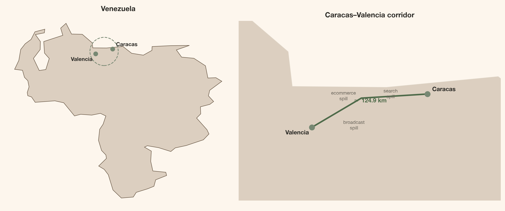
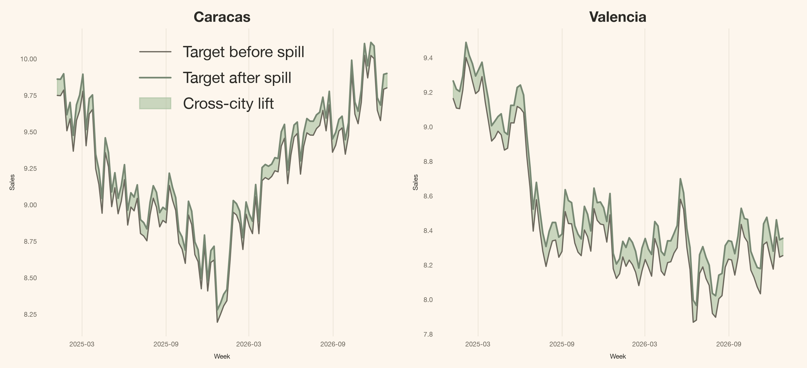
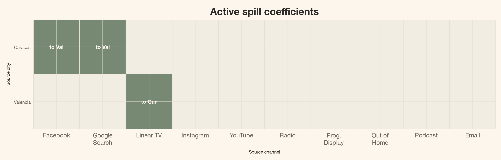
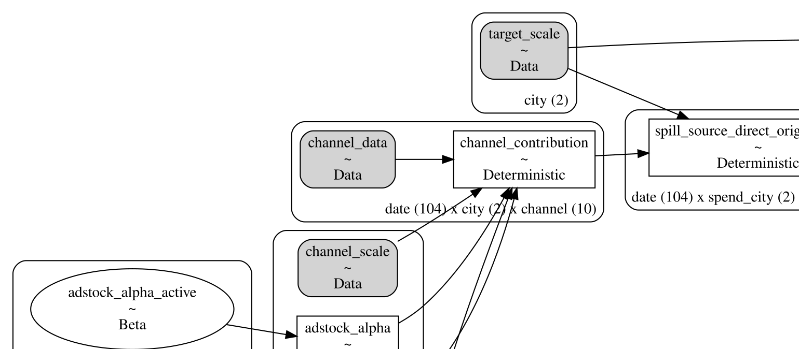
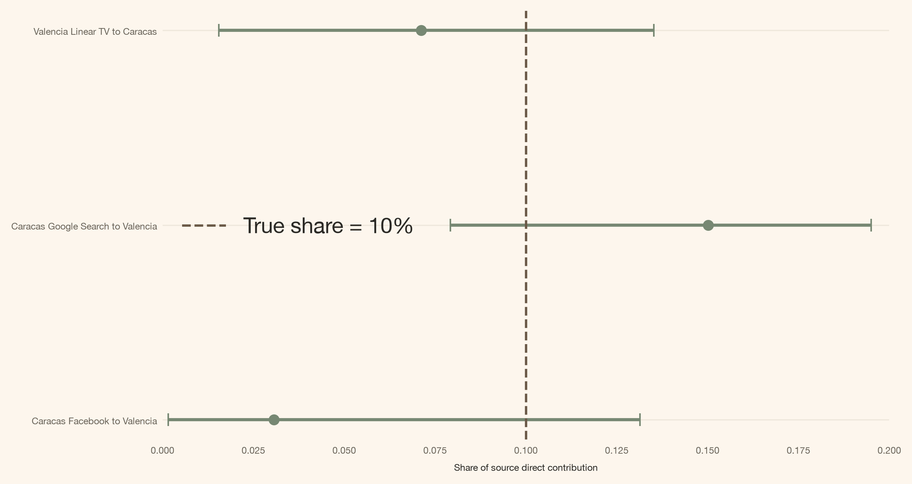
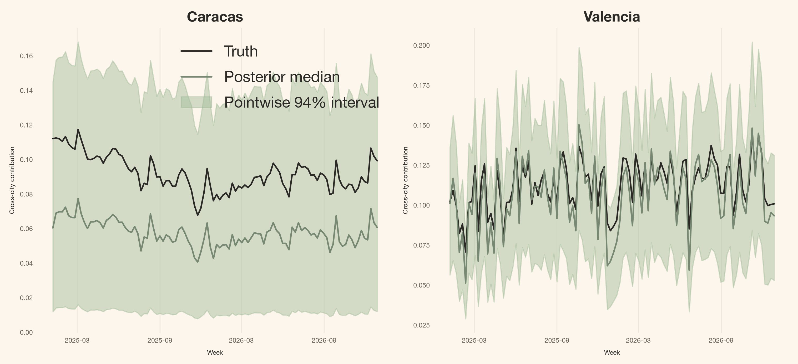

# Los medios no se detienen en la frontera de la ciudad: derrames entre ciudades con PyMC-Marketing

> Un MMM Bayesiano a nivel geográfico con derrames dispersos entre ciudades, construido con MuEffect y MaskedPrior de PyMC-Marketing, y una máscara de rutas pre-especificada para la medición de medios en múltiples mercados.

By Carlos Trujillo

Source: https://cetagostini.github.io/es/articles/cross_city_media_spillovers/cross_city_media_spillovers.html

# Introducción

“Ajusto un modelo de mezcla de marketing por ciudad, así que cada campaña pertenece a la ciudad donde registré el gasto.”

Esta convención de reporte puede ser bastante beneficiosa, pero no siempre refleja las complejidades del mundo real. Los medios no conocen las fronteras; por ejemplo, un lanzamiento en Caracas podría impulsar búsquedas de marca en Valencia. Además, una campaña de creadores dirigida a Valencia podría generar pedidos en ubicaciones completamente diferentes. Si insistimos en tratar cada ciudad como una unidad aislada, esos pedidos extra no simplemente desaparecen; más bien, el modelo simplemente los etiqueta mal.

El lado positivo es que [PyMC-Marketing](https://www.pymc-marketing.io/) nos ofrece un punto de extensión para abordar este problema. Podemos mantener el `MMM` multidimensional base, implementar un `MuEffect` aditivo, esbozar las rutas posibles usando una máscara booleana, y registrarlo sin fricciones con una sola línea:

``` sourceCode
mmm.add_mu_effect(spill_effect)
```

El resto de este artículo profundizará en los detalles de esa línea. Comenzaremos con el contexto empresarial, seguido de la ecuación, las formas de los tensores, y finalmente presentaremos la clase completa.

# Resumen rápido

Este artículo te guía a través de:

- **El laboratorio de datos:** dos ciudades sintéticas con tres rutas de derrame conocidas, cada una transportando exactamente el 10% de la contribución verdadera del canal de origen.
- **La extensión de PyMC-Marketing:** un `MuEffect` personalizado que enruta una proporción de la contribución mediática de una ciudad a la media de otra ciudad.
- **La política dispersa:** `MaskedPrior` muestrea solo tres coeficientes de derrame plausibles en lugar de los veinte candidatos de ciudad origen por canal.
- **El resultado:** diagnósticos del muestreador, recuperación del efecto directo y recuperación del derrame posterior contra la verdad conocida.

La idea completa de la API

Un `MMM(dims=("city",))` multidimensional ya produce `channel_contribution` con coordenadas de ciudad y canal. Un `MuEffect` personalizado puede leer ese tensor, enrutar una proporción acotada a otra ciudad, y devolver una contribución `(date, city)` a la media del modelo.

# Lente teórico

Un MMM regular predice el objetivo Y\_{r,t} en la ciudad receptora r en la semana t como una suma de diferentes componentes:

Y\_{r,t}=\beta\_{r}+\mu^{\text{direct}}\_{r,t}+C\_{r,t}+\epsilon\_{r,t}.

Donde:

- \beta\_{r} es la línea base, el intercepto que el modelo aprende para la ciudad r;
- \mu^{\text{direct}}\_{r,t} es la contribución de los medios propios de esa ciudad, después de adstock y saturación;
- C\_{r,t} es la contribución de los controles observados;
- \epsilon\_{r,t} es el ruido residual.

r es un índice de ciudad, t es un índice de tiempo, y todo el lado derecho se aprende del gasto propio de esa ciudad, sus propios controles y su propio objetivo. Muchos equipos también incluyen un término de estacionalidad. Lo omito aquí para que la única diferencia estructural entre los dos modelos de este artículo sea la que el artículo trata. Esta es la fórmula base, y la más común en la industria.

Hoy abordo esto como un **problema de medición Bayesiana con conocimiento estructural**. Diseño una máscara que codifica qué rutas entre ciudades considera posibles el negocio, y el posterior estima qué tan grandes son esos efectos permitidos. Esa distinción importa. No estoy ejecutando descubrimiento causal para averiguar si una ruta existe; asumo la topología y estimo las magnitudes. En términos de inferencia causal, este es un [problema de interferencia](https://pmc.ncbi.nlm.nih.gov/articles/PMC2600548/): la exposición asignada a una unidad puede cambiar el resultado de otra unidad.

# ¿Qué cambia exactamente en la función de media?

La familia de verosimilitud permanece igual. Un término se agrega a la media:

Y\_{r,t}=\beta\_{r}+\mu^{\text{direct}}\_{r,t}+\boxed{S\_{r,t}}+C\_{r,t}+\epsilon\_{r,t}.

Aquí S\_{r,t} es el derrame que llega a la ciudad receptora r: una proporción acotada de la contribución directa que los medios de otra ciudad ya produjeron. Cada proporción de ruta está limitada a \rho\_{\max}, así que una ruta nunca puede mover más de \rho\_{\max} de su contribución de origen a través de la frontera. En este artículo \rho\_{\max}=0.20 y la verdad sintética es 0.10.

Como cualquier otro MMM, el modelo transforma el gasto antes de que llegue a la media: [adstock geométrico](https://www.pymc-marketing.io/en/latest/api/generated/pymc_marketing.mmm.components.adstock.GeometricAdstock.html) seguido de [saturación Michaelis-Menten](https://www.pymc-marketing.io/en/latest/api/generated/pymc_marketing.mmm.components.saturation.MichaelisMentenSaturation.html). Esa es la misma idea de retención y forma descrita por [Jin et al. (2017)](https://storage.googleapis.com/gweb-research2023-media/pubtools/3806.pdf), aunque no la misma forma funcional: su artículo usa una curva de respuesta Hill, y Michaelis-Menten es el miembro de esa familia con el exponente fijado en uno.

Como el término de derrame es una proporción de una contribución que ya pasó por esa cadena, llega a la ciudad receptora cargando el propio adstock y la saturación del canal de origen.

## Por qué un multiplicador post-saturación es suficiente

La contribución directa del canal de origen k en la ciudad s, después de adstock y saturación Michaelis-Menten, es

\mu^{\text{direct}}\_{s,k,t} = \frac{\alpha\_{s,k} \cdot \bar{x}\_{s,k,t}}{\bar{x}\_{s,k,t} + \lambda\_{s,k}},

donde \bar{x}\_{s,k,t} es el gasto con adstock, \alpha\_{s,k} es la capacidad de saturación (el techo asintótico), y \lambda\_{s,k} es la constante de media saturación (el nivel de gasto al cual la contribución alcanza la mitad del techo).

El modelo de derrame multiplica esa contribución ya saturada por la proporción de ruta \rho\_{s,k}, dando la cantidad que una sola ruta entrega a la ciudad receptora:

S^{s,k}\_{r,t} = \rho\_{s,k} \cdot \mu^{\text{direct}}\_{s,k,t} = \frac{(\rho\_{s,k} \cdot \alpha\_{s,k}) \cdot \bar{x}\_{s,k,t}}{\bar{x}\_{s,k,t} + \lambda\_{s,k}}.

El álgebra es todo el argumento: \rho\_{s,k} escala el techo \alpha\_{s,k} y deja la media saturación \lambda\_{s,k} sin tocar. Un multiplicador aplicado después de la saturación es por lo tanto idéntico a ajustar una curva de saturación separada para cada ruta, con capacidad \rho\_{s,k} \cdot \alpha\_{s,k} y el mismo \lambda\_{s,k} —la misma contribución, con un parámetro en lugar de dos.

Importa que el multiplicador se quede ahí. El adstock es lineal, así que un escalar sí pasa a través: \text{adstock}(\rho x) = \rho \cdot \text{adstock}(x). La saturación no lo es, así que \rho \cdot f(\bar{x}) \neq f(\rho \bar{x}) —empujar la proporción dentro de la curva movería el punto de media saturación y doblaría la respuesta en una forma diferente. Aplicar la proporción después de la saturación es lo que mantiene a la ciudad receptora en la curva de respuesta de la ciudad de origen en lugar de una copia distorsionada.

# Primeros pasos

Primero, la configuración del notebook y las importaciones.

Código

``` sourceCode
import json
import sys
import warnings
from pathlib import Path
warnings.filterwarnings("ignore", category=FutureWarning)

from typing import Any

from pydantic import Field, InstanceOf
from pymc_extras.prior import Prior
from pymc_marketing.mmm import GeometricAdstock, MichaelisMentenSaturation
from pymc_marketing.mmm.additive_effect import MuEffect
from pymc_marketing.mmm.mmm import MMM
from pymc_marketing.mmm.scaling import DataDerivedScaling, FixedScaling, Scaling
from pymc_marketing.special_priors import MaskedPrior
import arviz as az
import pymc as pm
import pymc.dims as pmd
import pymc_marketing

import numpy as np
import pandas as pd
import xarray as xr

import matplotlib as mpl
import matplotlib.pyplot as plt
import matplotlib.dates as mdates
from matplotlib.patches import FancyArrowPatch, FancyBboxPatch

az.style.use("arviz-darkgrid")
plt.rcParams["figure.figsize"] = [8, 4]

DATA_DIR = Path("data")

COLORS = {
    "primary": "#778873",
    "secondary": "#A1BC98",
    "accent": "#DCCFC0",
    "bg": "#FDF6ED",
    "ink": "#2B2A26",
    "ink_muted": "#6B665C",
    "green_strong": "#4F6B4A",
    "brown": "#6B5A48",
    "line": "#E6DFD2",
    "surface_alt": "#F2EDE3",
}

mpl.rcParams.update({
    "figure.facecolor": COLORS["bg"],
    "axes.facecolor": COLORS["bg"],
    "axes.edgecolor": COLORS["line"],
    "axes.labelcolor": COLORS["ink"],
    "text.color": COLORS["ink"],
    "xtick.color": COLORS["ink_muted"],
    "ytick.color": COLORS["ink_muted"],
    "grid.color": COLORS["line"],
    "grid.alpha": 0.6,
    "font.family": "sans-serif",
    "font.sans-serif": ["Inter", "Manrope", "Helvetica Neue", "Arial"],
    "axes.titleweight": "semibold",
    "axes.titlesize": 13,
    "axes.labelsize": 6,
    "xtick.labelsize": 6,
    "ytick.labelsize": 6,
    "axes.spines.top": False,
    "axes.spines.right": False,
    "figure.dpi": 150,
    "figure.constrained_layout.use": True,
})

%load_ext autoreload
%autoreload 2
%config InlineBackend.figure_format = "retina"


def article_table(
    frame: pd.DataFrame,
    caption: str,
    formats: dict[str, str] | None = None,
):
    """Render a compact, left-aligned, index-free table."""
    styled = (
        frame.style
        .hide(axis="index")
        .set_caption(caption)
        .set_properties(**{"text-align": "left"})
        .set_table_styles([
            {"selector": "th", "props": [("text-align", "left")]},
            {"selector": "td", "props": [("text-align", "left")]},
        ])
    )
    return styled.format(formats) if formats else styled


seed: int = sum(map(ord, "media does not stop at the city border"))
rng: np.random.Generator = np.random.default_rng(seed=seed)
print(f"Seed: {seed}")
```

    Seed: 3567

Ahora los datos sintéticos. Empiezo con dos series de tiempo semanales —piensa en ciudades, regiones o países— generadas independientemente una de otra, y luego agrego derrame de una a la otra, en ambas direcciones.

Las llamo **Caracas** y **Valencia**. Los nombres son una comodidad: las dos ciudades reales están lo suficientemente cerca como para hacer que un corredor entre ciudades sea fácil de imaginar, no porque estas rutas sintéticas describan algo que suceda entre ellas. Cada una tiene diez canales de medios, dos controles observados y 104 observaciones semanales. Tres trayectorias de medios directos alcanzan la *otra* ciudad:

- Caracas **Facebook** \rightarrow Valencia
- Caracas **Google Search** \rightarrow Valencia
- Valencia **Linear TV** \rightarrow Caracas

Cada trayectoria transfiere 10% de la contribución verdadera del canal de origen en su propia ciudad. Todo lo demás está estructuralmente ausente.

Código

``` sourceCode
from matplotlib.patches import Circle
import urllib.request
import urllib.parse
import xml.etree.ElementTree as ET

caracas_coords = (-66.9036, 10.4806)
valencia_coords = (-68.0077, 10.1620)

with open(DATA_DIR / "venezuela_natural_earth.geojson") as f:
    geo = json.load(f)

geom = geo["features"][0]["geometry"]
if geom["type"] == "Polygon":
    polygons = [geom["coordinates"]]
elif geom["type"] == "MultiPolygon":
    polygons = geom["coordinates"]
else:
    raise ValueError(f"Unsupported geometry type: {geom['type']}")
exterior_rings = [np.asarray(polygon[0], dtype=float) for polygon in polygons]

margin = 0.7
rect_x = [min(caracas_coords[0], valencia_coords[0]) - margin,
          max(caracas_coords[0], valencia_coords[0]) + margin]
rect_y = [min(caracas_coords[1], valencia_coords[1]) - margin,
          max(caracas_coords[1], valencia_coords[1]) + margin]

mid_lon = (caracas_coords[0] + valencia_coords[0]) / 2
mid_lat = (caracas_coords[1] + valencia_coords[1]) / 2
circle_radius = np.sqrt(
    ((caracas_coords[0] - valencia_coords[0]) ** 2)
    + ((caracas_coords[1] - valencia_coords[1]) ** 2)
) / 2 + 0.35

fig, (ax_overview, ax_inset) = plt.subplots(
    1, 2, figsize=(12, 5.5), gridspec_kw={"width_ratios": [1, 1.15]},
)

# --- Overview panel ---
for coords in exterior_rings:
    ax_overview.fill(coords[:, 0], coords[:, 1],
                     facecolor=COLORS["accent"], edgecolor=COLORS["brown"], linewidth=0.8)

for label, (lon, lat), ofs in [
    ("Caracas", caracas_coords, (6, 5)),
    ("Valencia", valencia_coords, (-42, -12)),
]:
    ax_overview.plot(lon, lat, "o", color=COLORS["primary"], markersize=7, zorder=5)
    ax_overview.annotate(label, (lon, lat), textcoords="offset points",
                         xytext=ofs, fontsize=9, weight=600)

circle = Circle(
    (mid_lon, mid_lat), circle_radius, fill=False, color=COLORS["primary"], linewidth=1.2,
    linestyle="--"
)
ax_overview.add_patch(circle)
ax_overview.set_title("Venezuela", fontsize=12, weight=600)
ax_overview.set_aspect("equal")
ax_overview.axis("off")

# --- Overpass streets in the corridor inset ---
road_segments = []
bbox = (
    min(rect_y[0], rect_y[1]),
    min(rect_x[0], rect_x[1]),
    max(rect_y[0], rect_y[1]),
    max(rect_x[0], rect_x[1]),
)
overpass_query = (
    f'way["highway"]({bbox[0]},{bbox[1]},{bbox[2]},{bbox[3]});'
    f'(._;>;);out body;'
)
try:
    overpass_url = (
        "https://overpass-api.de/api/interpreter?"
        + urllib.parse.urlencode({"data": overpass_query})
    )
    with urllib.request.urlopen(overpass_url, timeout=30) as resp:
        root = ET.fromstring(resp.read())
    node_xy = {}
    for node in root.findall("node"):
        node_xy[node.get("id")] = (float(node.get("lon")), float(node.get("lat")))
    for way in root.findall("way"):
        refs = [nd.get("ref") for nd in way.findall("nd")]
        coords = np.asarray(
            [node_xy[r] for r in refs if r in node_xy], dtype=float
        )
        if coords.size:
            road_segments.append(coords)
except Exception:
    road_segments = []

# --- Corridor inset ---
ax_inset.set_facecolor(COLORS["bg"])
ax_inset.set_xlim(rect_x)
ax_inset.set_ylim(rect_y)

for coords in exterior_rings:
    ax_inset.fill(coords[:, 0], coords[:, 1],
                  facecolor=COLORS["accent"], edgecolor=COLORS["line"], linewidth=0.5)
for seg in road_segments:
    ax_inset.plot(seg[:, 0], seg[:, 1], color=COLORS["line"], linewidth=0.6, alpha=0.85)

route_lon = [caracas_coords[0], mid_lon - 0.08, valencia_coords[0]]
route_lat = [caracas_coords[1], mid_lat + 0.12, valencia_coords[1]]
ax_inset.plot(route_lon, route_lat, color=COLORS["green_strong"], linewidth=2.6, zorder=4)

for label, (lon, lat), ofs in [
    ("Caracas", caracas_coords, (8, 5)),
    ("Valencia", valencia_coords, (-45, -12)),
]:
    ax_inset.plot(lon, lat, "o", color=COLORS["primary"], markersize=9, zorder=5)
    ax_inset.annotate(label, (lon, lat), textcoords="offset points",
                      xytext=ofs, fontsize=10, weight=600, zorder=5)

ax_inset.annotate(
    "$\\approx$ 124.9 km", (mid_lon, mid_lat), textcoords="offset points",
    xytext=(0, 14), fontsize=10, ha="center", weight=600, color=COLORS["green_strong"], zorder=5,
)

for mech_label, (dx, dy) in [
    ("broadcast\nspill", (-0.15, -0.18)),
    ("search\nspill", (0.20, 0.12)),
    ("ecommerce\nspill", (-0.25, 0.10)),
]:
    ax_inset.annotate(
        mech_label, (mid_lon + dx, mid_lat + dy), textcoords="offset points",
        xytext=(0, 0), fontsize=8, ha="center", color=COLORS["ink_muted"], zorder=5,
    )

ax_inset.grid(False)
ax_inset.set_title("Caracas\u2013Valencia corridor", fontsize=12, weight=600)
ax_inset.set_aspect("equal")
ax_inset.axis("off")

plt.tight_layout()
plt.show()
```

<figure class="quarto-float quarto-float-fig figure">

<figcaption>Figura 1: El corredor Caracas–Valencia, aproximadamente 124.9 km de extremo a extremo. Radiodifusión, búsqueda y comercio electrónico son los tipos de mecanismo que podrían transportar efectos mediáticos a través de un corredor como este.</figcaption>
</figure>

Código

``` sourceCode
CITIES = ("Caracas", "Valencia")
CHANNELS = [
    "facebook", "google_search", "linear_tv", "instagram", "youtube",
    "radio", "programmatic_display", "out_of_home", "podcast", "email",
]
CHANNEL_LABELS = dict(zip(
    CHANNELS,
    [
        "Facebook", "Google Search", "Linear TV", "Instagram", "YouTube",
        "Radio", "Programmatic Display", "Out of Home", "Podcast", "Email",
    ],
    strict=True,
))
CONTROLS = ["Z1", "Z2"]
TRUE_SPILL_SHARE = 0.10

PANEL_DIMS = ("city",)
PANEL_CHANNEL_DIMS = ("city", "channel")
PANEL_CONTROL_DIMS = ("city", "control")
SPEND_DIMS = ("spend_city",)
SPEND_CHANNEL_DIMS = ("spend_city", "channel")
SPILL_PATH_DIMS = ("city", "spend_city", "channel")
SPEND_RENAME = {"city": "spend_city"}

SPILL_ROUTES = (
    ("Caracas", "Valencia", "facebook"),
    ("Caracas", "Valencia", "google_search"),
    ("Valencia", "Caracas", "linear_tv"),
)

valencia_raw = pd.read_csv(DATA_DIR / "valencia_raw.csv", parse_dates=["date"])
caracas_raw = pd.read_csv(DATA_DIR / "caracas_raw.csv", parse_dates=["date"])
valencia_truth = pd.read_csv(DATA_DIR / "valencia_contributions.csv", parse_dates=["date"])
caracas_truth = pd.read_csv(DATA_DIR / "caracas_contributions.csv", parse_dates=["date"])

assert valencia_raw["date"].equals(caracas_raw["date"])
assert valencia_truth["date"].equals(caracas_truth["date"])

valencia = valencia_raw.rename(columns={"Y": "y_base"}).copy()
caracas = caracas_raw.rename(columns={"Y": "y_base"}).copy()

valencia["spill_truth"] = TRUE_SPILL_SHARE * (
    caracas_truth["contrib_facebook"].to_numpy()
    + caracas_truth["contrib_google_search"].to_numpy()
)
caracas["spill_truth"] = TRUE_SPILL_SHARE * valencia_truth["contrib_linear_tv"].to_numpy()

for frame in (valencia, caracas):
    frame["y"] = frame["y_base"] + frame["spill_truth"]

panel = pd.concat([caracas, valencia], ignore_index=True).sort_values(
    ["date", "city"], ignore_index=True
)

spill_columns = [
    "contrib_spill_from_caracas_facebook",
    "contrib_spill_from_caracas_google_search",
    "contrib_spill_from_valencia_linear_tv",
]
for frame in (caracas_truth, valencia_truth):
    for column in spill_columns:
        frame[column] = 0.0

valencia_truth["contrib_spill_from_caracas_facebook"] = (
    TRUE_SPILL_SHARE * caracas_truth["contrib_facebook"].to_numpy()
)
valencia_truth["contrib_spill_from_caracas_google_search"] = (
    TRUE_SPILL_SHARE * caracas_truth["contrib_google_search"].to_numpy()
)
caracas_truth["contrib_spill_from_valencia_linear_tv"] = (
    TRUE_SPILL_SHARE * valencia_truth["contrib_linear_tv"].to_numpy()
)

truth = pd.concat([caracas_truth, valencia_truth], ignore_index=True).sort_values(
    ["date", "city"], ignore_index=True
)
truth["contrib_spill_total"] = truth[spill_columns].sum(axis=1)

model_data = panel[["date", "city", *CHANNELS, *CONTROLS, "y"]].rename(columns={"y": "Y"})
model_data.to_csv(DATA_DIR / "mmm_data_raw.csv", index=False)
truth.to_csv(DATA_DIR / "mmm_data_contributions.csv", index=False)

assert np.allclose(panel["y"] - panel["y_base"], panel["spill_truth"])
assert np.allclose(
    panel["spill_truth"].to_numpy(), truth["contrib_spill_total"].to_numpy()
)
assert truth["contrib_spill_total"].abs().sum() > 0

X = panel[["date", "city", *CHANNELS, *CONTROLS]]
y = panel["y"]

schema_rows = [
    {"Column": "date", "Type": "datetime", "Role": "time index"},
    {"Column": "city", "Type": "str", "Role": "panel dimension"},
]
for ch in CHANNELS:
    schema_rows.append({"Column": ch, "Type": "float", "Role": "media channel"})
schema_rows += [
    {"Column": "Z1", "Type": "float", "Role": "control"},
    {"Column": "Z2", "Type": "float", "Role": "control"},
    {"Column": "Y", "Type": "float", "Role": "target"},
]
display(article_table(pd.DataFrame(schema_rows), "Input panel schema"))
```

<figure class="quarto-float quarto-float-tbl figure">
<table id="T_f8cdb" class="caption-top table table-sm table-striped small" data-quarto-postprocess="true">
<thead>
<tr class="header">
<th id="T_f8cdb_level0_col0" class="col_heading level0 col0" data-quarto-table-cell-role="th">Column</th>
<th id="T_f8cdb_level0_col1" class="col_heading level0 col1" data-quarto-table-cell-role="th">Type</th>
<th id="T_f8cdb_level0_col2" class="col_heading level0 col2" data-quarto-table-cell-role="th">Role</th>
</tr>
</thead>
<tbody>
<tr class="odd">
<td id="T_f8cdb_row0_col0" class="data row0 col0">date</td>
<td id="T_f8cdb_row0_col1" class="data row0 col1">datetime</td>
<td id="T_f8cdb_row0_col2" class="data row0 col2">time index</td>
</tr>
<tr class="even">
<td id="T_f8cdb_row1_col0" class="data row1 col0">city</td>
<td id="T_f8cdb_row1_col1" class="data row1 col1">str</td>
<td id="T_f8cdb_row1_col2" class="data row1 col2">panel dimension</td>
</tr>
<tr class="odd">
<td id="T_f8cdb_row2_col0" class="data row2 col0">facebook</td>
<td id="T_f8cdb_row2_col1" class="data row2 col1">float</td>
<td id="T_f8cdb_row2_col2" class="data row2 col2">media channel</td>
</tr>
<tr class="even">
<td id="T_f8cdb_row3_col0" class="data row3 col0">google_search</td>
<td id="T_f8cdb_row3_col1" class="data row3 col1">float</td>
<td id="T_f8cdb_row3_col2" class="data row3 col2">media channel</td>
</tr>
<tr class="odd">
<td id="T_f8cdb_row4_col0" class="data row4 col0">linear_tv</td>
<td id="T_f8cdb_row4_col1" class="data row4 col1">float</td>
<td id="T_f8cdb_row4_col2" class="data row4 col2">media channel</td>
</tr>
<tr class="even">
<td id="T_f8cdb_row5_col0" class="data row5 col0">instagram</td>
<td id="T_f8cdb_row5_col1" class="data row5 col1">float</td>
<td id="T_f8cdb_row5_col2" class="data row5 col2">media channel</td>
</tr>
<tr class="odd">
<td id="T_f8cdb_row6_col0" class="data row6 col0">youtube</td>
<td id="T_f8cdb_row6_col1" class="data row6 col1">float</td>
<td id="T_f8cdb_row6_col2" class="data row6 col2">media channel</td>
</tr>
<tr class="even">
<td id="T_f8cdb_row7_col0" class="data row7 col0">radio</td>
<td id="T_f8cdb_row7_col1" class="data row7 col1">float</td>
<td id="T_f8cdb_row7_col2" class="data row7 col2">media channel</td>
</tr>
<tr class="odd">
<td id="T_f8cdb_row8_col0" class="data row8 col0">programmatic_display</td>
<td id="T_f8cdb_row8_col1" class="data row8 col1">float</td>
<td id="T_f8cdb_row8_col2" class="data row8 col2">media channel</td>
</tr>
<tr class="even">
<td id="T_f8cdb_row9_col0" class="data row9 col0">out_of_home</td>
<td id="T_f8cdb_row9_col1" class="data row9 col1">float</td>
<td id="T_f8cdb_row9_col2" class="data row9 col2">media channel</td>
</tr>
<tr class="odd">
<td id="T_f8cdb_row10_col0" class="data row10 col0">podcast</td>
<td id="T_f8cdb_row10_col1" class="data row10 col1">float</td>
<td id="T_f8cdb_row10_col2" class="data row10 col2">media channel</td>
</tr>
<tr class="even">
<td id="T_f8cdb_row11_col0" class="data row11 col0">email</td>
<td id="T_f8cdb_row11_col1" class="data row11 col1">float</td>
<td id="T_f8cdb_row11_col2" class="data row11 col2">media channel</td>
</tr>
<tr class="odd">
<td id="T_f8cdb_row12_col0" class="data row12 col0">Z1</td>
<td id="T_f8cdb_row12_col1" class="data row12 col1">float</td>
<td id="T_f8cdb_row12_col2" class="data row12 col2">control</td>
</tr>
<tr class="even">
<td id="T_f8cdb_row13_col0" class="data row13 col0">Z2</td>
<td id="T_f8cdb_row13_col1" class="data row13 col1">float</td>
<td id="T_f8cdb_row13_col2" class="data row13 col2">control</td>
</tr>
<tr class="odd">
<td id="T_f8cdb_row14_col0" class="data row14 col0">Y</td>
<td id="T_f8cdb_row14_col1" class="data row14 col1">float</td>
<td id="T_f8cdb_row14_col2" class="data row14 col2">target</td>
</tr>
</tbody>
</table>
<figcaption>Tabla 1: Esquema del panel de entrada</figcaption>
</figure>

El panel que entra al MMM contiene 208 filas semanales (104 semanas × 2 ciudades). Cada fila lleva los diez canales de gasto mediático bruto, dos controles observados y el objetivo de ventas. El generador escribe dos archivos de panel —`mmm_data_raw.csv` para los observables y `mmm_data_contributions.csv` para la verdadera descomposición por canal usada solo en evaluación— junto con las entradas por ciudad y desgloses de contribución bajo `data/`.

Las filas representativas a continuación muestran un subconjunto de las columnas que el MMM realmente ve.

Código

``` sourceCode
preview_columns = [
    "date", "city", "facebook", "google_search", "linear_tv", "Z1", "Z2", "Y",
]
model_preview = (
    model_data[preview_columns]
    .groupby("city")
    .head(2)
    .reset_index(drop=True)
)
model_preview["date"] = model_preview["date"].dt.strftime("%Y-%m-%d")
display(article_table(
    model_preview,
    "Representative MMM input rows (two per city; three channels shown)",
    {column: "{:.3f}" for column in preview_columns[2:]},
))
```

<figure class="quarto-float quarto-float-tbl figure">
<table id="T_5b37b" class="caption-top table table-sm table-striped small" data-quarto-postprocess="true">
<thead>
<tr class="header">
<th id="T_5b37b_level0_col0" class="col_heading level0 col0" data-quarto-table-cell-role="th">date</th>
<th id="T_5b37b_level0_col1" class="col_heading level0 col1" data-quarto-table-cell-role="th">city</th>
<th id="T_5b37b_level0_col2" class="col_heading level0 col2" data-quarto-table-cell-role="th">facebook</th>
<th id="T_5b37b_level0_col3" class="col_heading level0 col3" data-quarto-table-cell-role="th">google_search</th>
<th id="T_5b37b_level0_col4" class="col_heading level0 col4" data-quarto-table-cell-role="th">linear_tv</th>
<th id="T_5b37b_level0_col5" class="col_heading level0 col5" data-quarto-table-cell-role="th">Z1</th>
<th id="T_5b37b_level0_col6" class="col_heading level0 col6" data-quarto-table-cell-role="th">Z2</th>
<th id="T_5b37b_level0_col7" class="col_heading level0 col7" data-quarto-table-cell-role="th">Y</th>
</tr>
</thead>
<tbody>
<tr class="odd">
<td id="T_5b37b_row0_col0" class="data row0 col0">2025-01-06</td>
<td id="T_5b37b_row0_col1" class="data row0 col1">Caracas</td>
<td id="T_5b37b_row0_col2" class="data row0 col2">0.968</td>
<td id="T_5b37b_row0_col3" class="data row0 col3">3.587</td>
<td id="T_5b37b_row0_col4" class="data row0 col4">3.742</td>
<td id="T_5b37b_row0_col5" class="data row0 col5">3.017</td>
<td id="T_5b37b_row0_col6" class="data row0 col6">-2.007</td>
<td id="T_5b37b_row0_col7" class="data row0 col7">9.856</td>
</tr>
<tr class="even">
<td id="T_5b37b_row1_col0" class="data row1 col0">2025-01-06</td>
<td id="T_5b37b_row1_col1" class="data row1 col1">Valencia</td>
<td id="T_5b37b_row1_col2" class="data row1 col2">2.100</td>
<td id="T_5b37b_row1_col3" class="data row1 col3">1.251</td>
<td id="T_5b37b_row1_col4" class="data row1 col4">2.850</td>
<td id="T_5b37b_row1_col5" class="data row1 col5">0.746</td>
<td id="T_5b37b_row1_col6" class="data row1 col6">0.936</td>
<td id="T_5b37b_row1_col7" class="data row1 col7">9.262</td>
</tr>
<tr class="odd">
<td id="T_5b37b_row2_col0" class="data row2 col0">2025-01-13</td>
<td id="T_5b37b_row2_col1" class="data row2 col1">Caracas</td>
<td id="T_5b37b_row2_col2" class="data row2 col2">0.832</td>
<td id="T_5b37b_row2_col3" class="data row2 col3">4.058</td>
<td id="T_5b37b_row2_col4" class="data row2 col4">3.852</td>
<td id="T_5b37b_row2_col5" class="data row2 col5">2.974</td>
<td id="T_5b37b_row2_col6" class="data row2 col6">-1.959</td>
<td id="T_5b37b_row2_col7" class="data row2 col7">9.855</td>
</tr>
<tr class="even">
<td id="T_5b37b_row3_col0" class="data row3 col0">2025-01-13</td>
<td id="T_5b37b_row3_col1" class="data row3 col1">Valencia</td>
<td id="T_5b37b_row3_col2" class="data row3 col2">2.185</td>
<td id="T_5b37b_row3_col3" class="data row3 col3">3.278</td>
<td id="T_5b37b_row3_col4" class="data row3 col4">3.229</td>
<td id="T_5b37b_row3_col5" class="data row3 col5">0.705</td>
<td id="T_5b37b_row3_col6" class="data row3 col6">0.939</td>
<td id="T_5b37b_row3_col7" class="data row3 col7">9.214</td>
</tr>
</tbody>
</table>
<figcaption>Tabla 2: Filas representativas de entrada al MMM (dos por ciudad; tres canales mostrados)</figcaption>
</figure>

Los archivos de contribución (`caracas_contributions.csv`, `valencia_contributions.csv`) registran la verdadera descomposición a nivel de canal usada para la evaluación. Sus magnitudes permanecen reservadas; la única información derivada de esa descomposición y proporcionada al MMM es la máscara de actividad directa de seis rutas que construyo más tarde, cuando se ensambla el modelo. La verosimilitud por lo demás ve el objetivo, el gasto mediático observado y los controles.

Sea V y C abreviaturas de Valencia y Caracas, y sea \tau\_{s,k,t} la contribución verdadera del canal k en su propia ciudad de origen s en la semana t. Entonces:

\begin{aligned} Y^{\star}\_{V,t} &= Y\_{V,t} \\ &\quad + 0.10\\\tau\_{C,\text{Facebook},t} \\ &\quad + 0.10\\\tau\_{C,\text{Google Search},t}, \\ Y^{\star}\_{C,t} &= Y\_{C,t} + 0.10\\\tau\_{V,\text{Linear TV},t}. \end{aligned}

El multiplicador está fijado en 10% en el proceso generador de datos. El modelo no recibirá esas columnas de contribución; permanecen detrás del telón para evaluación.

# Por qué un MMM de ciudades independientes falla

Código

``` sourceCode
fig, axes = plt.subplots(1, 2, figsize=(10, 4.5), sharex=True)
for ax, city in zip(axes, CITIES, strict=True):
    city_data = panel.loc[panel["city"].eq(city)]
    ax.plot(city_data["date"], city_data["y_base"], color=COLORS["ink_muted"],
            linewidth=1.1, label="Target before spill")
    ax.plot(city_data["date"], city_data["y"], color=COLORS["primary"],
            linewidth=1.5, label="Target after spill")
    ax.fill_between(
        city_data["date"], city_data["y_base"], city_data["y"],
        color=COLORS["secondary"], alpha=0.55, label="Cross-city lift",
    )
    ax.set(title=city, xlabel="Week", ylabel="Sales")
    ax.grid(axis="y")
    ax.xaxis.set_major_locator(mdates.MonthLocator(interval=6))
    ax.xaxis.set_major_formatter(mdates.DateFormatter("%Y-%m"))
axes[0].legend(frameon=False, loc="best")
plt.show()
```

<figure class="quarto-float quarto-float-fig figure">

<figcaption>Figura 2: El objetivo cambia por la forma del medio de la otra ciudad, no por ruido aleatorio. Un MMM de ciudades independientes no tiene un componente nombrado para la diferencia sombreada.</figcaption>
</figure>

El modelo familiar ajusta cada ciudad con sus propios canales, controles y línea base:

Y\_{r,t}=\beta\_{r}+\mu^{\text{direct}}\_{r,t}+C\_{r,t}+\epsilon\_{r,t}.

Ese modelo puede predecir bien. Aún no tiene ruta donde una ciudad de origen s difiera de la ciudad receptora r. La señal sombreada en <a href="#fig-target-spill" class="quarto-xref">Figura 2</a> debe filtrarse en la atribución directa, la línea base, los controles o el ruido residual.

Este es el fracaso controlado. **El problema no es que el MMM base esté mal implementado. El problema es que su función de media no puede expresar el mecanismo empresarial.**

> **¿Podría simplemente agregar el gasto bruto de la otra ciudad como control?** Podría, pero entonces estimaría una segunda curva de respuesta desconectada del adstock y la saturación de la campaña de origen. Reutilizar la contribución del origen es tanto más parsimonioso como más fácil de interpretar.

Escrito ruta por ruta, el nuevo término es:

\begin{aligned} Y\_{r,t} &= \beta\_{r} + \mu^{\text{direct}}\_{r,t} + S\_{r,t} + C\_{r,t} + \epsilon\_{r,t}, \\ S\_{r,t} &= \sum\_{s\neq r}\sum\_{k=1}^{K} M\_{r,s,k}\\\rho\_{s,k} \\ &\qquad \times g\_{s,k}(X\_{s,k,t}). \end{aligned}

donde:

- S\_{r,t} es el derrame total que llega a la ciudad receptora r;
- g\_{s,k}(X\_{s,k,t}) es la contribución directa evaluada desde el mismo grafo del modelo después de adstock y saturación;
- M\_{r,s,k}\in\\0,1\\ es la máscara de rutas pre-especificada;
- \rho\_{s,k} es la proporción aprendida exportada por la ciudad de origen s y el canal k;
- la suma devuelve una contribución de derrame para cada ciudad receptora r y semana t.

# Un efecto aditivo es suficiente para codificar derrames dispersos entre ciudades

La lente de medición Bayesiana ahora se convierte en una restricción de ingeniería: preservar la respuesta del origen, fijar las rutas proporcionadas por el conocimiento previo, y estimar solo sus magnitudes inciertas.

## 10% de la contribución propia del canal de origen

Código

``` sourceCode
import graphviz

K = COLORS["ink"]
K2 = COLORS["ink_muted"]
G = COLORS["green_strong"]

def obs(label):
    return {
        "label": label, "shape": "box", "style": "rounded,filled",
        "fillcolor": "white", "color": K, "fontcolor": K, "fontsize": "11",
        "penwidth": "1.2", "fontname": "Inter",
    }

def lat(label):
    return {
        "label": label, "shape": "ellipse", "style": "filled",
        "fillcolor": "#f5f0e6", "color": K, "fontcolor": K, "fontsize": "11",
        "penwidth": "1.2", "fontname": "Inter",
    }

def loc():
    return {"color": K2, "penwidth": "1.2", "arrowsize": "0.7"}

def spl():
    return {
        "color": G, "penwidth": "2.8", "arrowsize": "0.9",
        "fontname": "Inter", "fontcolor": G, "fontsize": "9",
    }

g = graphviz.Digraph(format="svg", engine="dot")
g.attr(rankdir="LR", bgcolor="transparent", margin="0.1", nodesep="0.55",
       ranksep="0.65", fontname="Inter")

# Caracas spend nodes
g.node("fb", **obs("Facebook"))
g.node("gs", **obs("Google Search"))
g.node("pd", **obs("Programmatic\nDisplay"))
g.node("R_ccs", **lat("Caracas\nresponse"))

# Valencia spend nodes
g.node("ltv", **obs("Linear TV"))
g.node("rad", **obs("Radio"))
g.node("em", **obs("Email"))
g.node("R_val", **lat("Valencia\nresponse"))

# Local edges
g.edge("fb", "R_ccs", **loc())
g.edge("gs", "R_ccs", **loc())
g.edge("pd", "R_ccs", **loc())
g.edge("ltv", "R_val", **loc())
g.edge("rad", "R_val", **loc())
g.edge("em", "R_val", **loc())

# Cross-city spill
g.edge("fb", "R_val", label=" 10% ", **spl())
g.edge("gs", "R_val", label=" 10% ", **spl())
g.edge("ltv", "R_ccs", label=" 10% ", **spl())

from IPython.display import SVG, display as ipy_display
svg_bytes = g.pipe(format="svg")
ipy_display(SVG(svg_bytes))
```

<figure class="quarto-float quarto-float-fig figure">

<figcaption>Figura 3: El gasto observado fluye al óvalo de respuesta no observado de cada ciudad. Tres aristas verdes cruzan la frontera: Facebook y Google Search de Caracas contribuyen 10% cada uno a la respuesta de Valencia; Linear TV de Valencia contribuye 10% a la respuesta de Caracas.</figcaption>
</figure>

## Una máscara de rutas pre-especificada

Con dos ciudades y diez canales, hay veinte posibles coeficientes de derrame de ciudad origen por canal. En este diseño sintético, permito tres. Los otros diecisiete no deberían estar débilmente regularizados ni estimados cerca de cero. No deberían existir en el grafo.

Código

``` sourceCode
spill_mask_values = np.zeros(
    (len(CITIES), len(CITIES), len(CHANNELS)), dtype=bool
)
for source_city, receiver_city, channel in SPILL_ROUTES:
    spill_mask_values[
        CITIES.index(receiver_city),
        CITIES.index(source_city),
        CHANNELS.index(channel),
    ] = True

spill_path_mask = xr.DataArray(
    spill_mask_values,
    dims=SPILL_PATH_DIMS,
    coords={
        "city": list(CITIES),
        "spend_city": list(CITIES),
        "channel": CHANNELS,
    },
)
source_active_mask = spill_path_mask.any("city").transpose(*SPEND_CHANNEL_DIMS)

assert int(source_active_mask.sum()) == len(SPILL_ROUTES) == 3
```

Código

``` sourceCode
fig, ax = plt.subplots(figsize=(9, 2.8))
mask_plot = source_active_mask.astype(int)
cmap = mpl.colors.ListedColormap([COLORS["surface_alt"], COLORS["primary"]])
ax.imshow(mask_plot, aspect="auto", cmap=cmap, vmin=0, vmax=1)
display_labels = [
    "Facebook", "Google\nSearch", "Linear TV", "Instagram", "YouTube",
    "Radio", "Prog.\nDisplay", "Out of\nHome", "Podcast", "Email",
]
ax.set_xticks(range(len(CHANNELS)), display_labels, fontsize=8)
ax.set_yticks(range(len(CITIES)), CITIES)
ax.set(xlabel="Source channel", ylabel="Source city")
for row, city in enumerate(CITIES):
    for col, channel in enumerate(CHANNELS):
        if bool(source_active_mask.sel(spend_city=city, channel=channel)):
            receiver = next(
                target for source, target, route_channel in SPILL_ROUTES
                if source == city and route_channel == channel
            )
            ax.text(col, row, f"to {receiver[:3]}", ha="center", va="center",
                    color=COLORS["bg"], fontsize=7, weight=600)
for x in np.arange(-0.5, len(CHANNELS), 1):
    ax.axvline(x, color=COLORS["line"], linewidth=0.8)
ax.set_title("Active spill coefficients")
plt.show()
```

<figure class="quarto-float quarto-float-fig figure">

<figcaption>Figura 4: MaskedPrior convierte veinte posibles coeficientes de ciudad origen por canal en tres parámetros muestreados. Los diecisiete restantes son ceros estructurales, no estimaciones inciertas cercanas a cero.</figcaption>
</figure>

`MaskedPrior` es una compuerta, no un prior de contracción

El prior envuelto se muestrea solo donde la máscara es `True`, luego se expande al tensor etiquetado completo con ceros exactos en todas las demás posiciones.

## El efecto personalizado reutiliza lo que el MMM ya conoce

Llamo a esta clase `SpillEffect`. Hereda el protocolo [`MuEffect`](https://www.pymc-marketing.io/en/latest/api/generated/pymc_marketing.mmm.additive_effect.html) de PyMC-Marketing.

`SpillEffect` tiene tres responsabilidades:

1.  **Registrar coordenadas espaciales y la máscara de rutas pre-especificada.** `create_data` agrega una coordenada `spend_city` (espejo de `city`) y almacena la máscara booleana de rutas como una constante del modelo. La máscara proviene de conocimiento empresarial previo —coberturas de radiodifusión, elegibilidad de campañas, territorios de distribución— no del resultado.
2.  **Muestrear proporciones de derrame acotadas solo en pares canal-ciudad activos.** `create_effect` envuelve un `MaskedPrior` sobre un prior base \operatorname{Beta}(1,1), así que solo las rutas permitidas reciben un parámetro libre.
3.  **Enrutar la contribución directa del modelo a la ciudad receptora y devolver `(date, city)`.** El efecto lee `channel_contribution` del pase hacia adelante propio del modelo, multiplica por la proporción acotada y la máscara de rutas, y suma sobre los orígenes.

Modelo

u\_{s,k}\sim\operatorname{Beta}(1,1), \qquad \rho\_{s,k}=\rho\_{\max}u\_{s,k},

con \rho\_{\max}=0.20. La verdad sintética es 0.10, así que se encuentra dentro —no en el límite del— intervalo plausible del modelo.

``` sourceCode
class SpillEffect(MuEffect):
    """Route a bounded share of direct media contribution across cities."""

    source_active_mask: InstanceOf[xr.DataArray] = Field(exclude=True)
    spill_path_mask: InstanceOf[xr.DataArray] = Field(exclude=True)
    fraction_prior: InstanceOf[Prior]
    max_share: float = Field(default=0.20, gt=0, le=1)
    prefix: str = "spill"

    @staticmethod
    def _serialize_mask(mask: xr.DataArray) -> dict[str, Any]:
        """Convert a fixed Boolean mask to JSON-compatible values."""
        return {
            "dims": list(mask.dims),
            "coords": {dim: mask.coords[dim].values.tolist() for dim in mask.dims},
            "values": mask.astype(bool).values.tolist(),
        }

    @property
    def contribution_var_name(self) -> str:
        """Name of the deterministic contribution stored in the posterior."""
        return f"{self.prefix}_contribution"

    def to_dict(self) -> dict[str, Any]:
        """Serialize the custom effect for inference-data provenance."""
        return {
            "prefix": self.prefix,
            "max_share": self.max_share,
            "fraction_prior": self.fraction_prior.to_dict(),
            "source_active_mask": self._serialize_mask(self.source_active_mask),
            "spill_path_mask": self._serialize_mask(self.spill_path_mask),
        }

    def create_data(self, mmm: Any) -> None:
        """Register the source-city coordinate and route mask."""
        model = mmm.model
        model.add_coord("spend_city", values=model.coords["city"])
        pmd.Data(
            f"{self.prefix}_path_mask",
            self.spill_path_mask.astype(float).values,
            dims=SPILL_PATH_DIMS,
        )

    def create_effect(self, mmm: Any):
        """Build one spill contribution per week and receiving city."""
        model = mmm.model
        fraction = MaskedPrior(
            self.fraction_prior,
            mask=self.source_active_mask,
            active_dim=f"{self.prefix}_active_source_channel",
        ).create_variable(f"{self.prefix}_fraction", xdist=True)

        total_share = pmd.Deterministic(
            f"{self.prefix}_total_share",
            (self.max_share * fraction).transpose(*SPEND_CHANNEL_DIMS),
        )
        path_share = pmd.Deterministic(
            f"{self.prefix}_path_share",
            (total_share * model[f"{self.prefix}_path_mask"]).transpose(
                *SPILL_PATH_DIMS
            ),
        )

        source_direct_original = pmd.Deterministic(
            f"{self.prefix}_source_direct_original_scale",
            (model["channel_contribution"] * model["target_scale"])
            .rename(SPEND_RENAME)
            .transpose("date", *SPEND_CHANNEL_DIMS),
        )
        by_path_original = pmd.Deterministic(
            f"{self.prefix}_by_path_original_scale",
            (source_direct_original * path_share).transpose(
                "date", *SPILL_PATH_DIMS
            ),
        )
        contribution_original = pmd.Deterministic(
            f"{self.prefix}_contribution_original_scale",
            by_path_original.sum(dim=(*SPEND_DIMS, "channel")).transpose(
                "date", *PANEL_DIMS
            ),
        )

        return pmd.Deterministic(
            f"{self.prefix}_contribution",
            (contribution_original / model["target_scale"]).transpose(
                "date", *PANEL_DIMS
            ),
        )

    def set_data(self, mmm: Any, model: pm.Model, X: xr.Dataset) -> None:
        """No-op: this effect owns no mutable predictors.

        The MMM refreshes model-owned channel contribution data before the
        effect runs.  Implement updates here only when the effect introduces
        its own covariates — for example, future receiver-specific modifiers
        or time-varying route availability.
        """
        del mmm, model, X
```

La mayor parte de la clase es contabilidad de tensores con nombres. El cambio real del modelo es la cadena corta dentro de `create_effect`:

\begin{gathered} \text{direct contribution} \\ \times\\ \text{bounded share} \\ \times\\ \text{route mask} \\ \downarrow\\ \sum\_{s,k} \\ \text{spill by receiving city} \end{gathered}

## Un efecto extra es todo lo que el MMM necesita

Para mantener la demostración sobre el derrame en lugar de la selección de variables, el generador sintético proporciona una máscara de actividad directa pre-especificada: se sabe que existen seis curvas de respuesta ciudad-canal antes de que el MMM se ajuste. No se infiere del objetivo observado. En trabajo real, defina esa máscara a partir de la disponibilidad de canales, conocimiento empresarial previo, o una estrategia adecuada de selección de variables.

Código

``` sourceCode
contribution_columns = [f"contrib_{channel}" for channel in CHANNELS]
direct_activity = (
    truth.groupby("city")[contribution_columns]
    .sum()
    .abs()
    .gt(1e-10)
    .reindex(CITIES)
)
direct_activity.columns = CHANNELS
direct_path_mask = xr.DataArray(
    direct_activity.to_numpy(),
    dims=PANEL_CHANNEL_DIMS,
    coords={"city": list(CITIES), "channel": CHANNELS},
)

assert int(direct_path_mask.sum()) == 6
```

Dado que los canales y objetivos están escalados al máximo, los priors de respuesta a continuación viven en una escala comparable entre ciudades. Un intercepto positivo elimina un modo de línea base negativa espuria, mientras que un prior de media log-normal mantiene al muestreador lejos de un embudo en el límite cero. Estas son decisiones de identificabilidad y muestreo, no evidencia sobre las rutas de derrame.

``` sourceCode
adstock = GeometricAdstock(
    l_max=4,
    priors={
        "alpha": MaskedPrior(
            Prior("Beta", alpha=2, beta=2, dims=PANEL_CHANNEL_DIMS),
            mask=direct_path_mask,
            active_dim="direct_active_city_channel",
        )
    },
)
saturation = MichaelisMentenSaturation(
    priors={
        "alpha": MaskedPrior(
            Prior("Gamma", mu=0.20, sigma=0.15, dims=PANEL_CHANNEL_DIMS),
            mask=direct_path_mask,
            active_dim="direct_active_city_channel",
        ),
        "lam": MaskedPrior(
            Prior("LogNormal", mu=-0.69, sigma=0.75, dims=PANEL_CHANNEL_DIMS),
            mask=direct_path_mask,
            active_dim="direct_active_city_channel",
        ),
    }
)

spill_effect = SpillEffect(
    source_active_mask=source_active_mask,
    spill_path_mask=spill_path_mask,
    fraction_prior=Prior("Beta", alpha=1, beta=1, dims=SPEND_CHANNEL_DIMS),
    max_share=0.20,
)

target_scale = panel.groupby("city")["y"].max().reindex(CITIES)
target_scale_array = xr.DataArray(
    target_scale.to_numpy(),
    dims=PANEL_DIMS,
    coords={"city": list(CITIES)},
)

mmm = MMM(
    date_column="date",
    target_column="y",
    channel_columns=CHANNELS,
    control_columns=CONTROLS,
    dims=PANEL_DIMS,
    model_config={
        "intercept": Prior("HalfNormal", sigma=1, dims=PANEL_DIMS),
        "gamma_control": Prior(
            "Normal", mu=0, sigma=0.10, dims=PANEL_CONTROL_DIMS
        ),
        "likelihood": Prior(
            "Normal",
            sigma=Prior("HalfNormal", sigma=0.02, dims=PANEL_DIMS),
            dims=("date", *PANEL_DIMS),
        ),
    },
    scaling=Scaling(
        channel=DataDerivedScaling(method="max", dims=()),
        target=FixedScaling(dims=(), value=target_scale_array),
    ),
    adstock=adstock,
    saturation=saturation,
)

mmm.add_mu_effect(spill_effect)
mmm.build_model(X, y)
mmm.add_original_scale_contribution_variable(
    ["y", "channel_contribution", "control_contribution", "intercept_contribution"]
)
```

    <pymc_marketing.mmm.mmm.MMM at 0x33d8a0ad0>

El grafo del modelo debe contener exactamente tres parámetros de derrame libres. Esa es la recompensa computacional de la máscara.

Código

``` sourceCode
initial_point = mmm.model.initial_point()
spill_key = next(name for name in initial_point if name.startswith("spill_fraction_active"))
assert initial_point[spill_key].size == len(SPILL_ROUTES) == 3
assert np.isfinite(mmm.model.compile_logp()(initial_point))

free_rv_names = sorted(variable.name for variable in mmm.model.free_RVs)
model_structure = pd.DataFrame({
    "Layer": ["Panel", "Direct media", "Cross-city spill", "Likelihood"],
    "Estimated structure": [
        "2 city intercepts + 4 control coefficients",
        "6 active city-channel response curves",
        "3 bounded shares from 20 candidates",
        "2 city-specific residual scales",
    ],
})
display(article_table(model_structure, "What the model samples"))
```

<figure class="quarto-float quarto-float-tbl figure">
<table id="T_a32e1" class="caption-top table table-sm table-striped small" data-quarto-postprocess="true">
<thead>
<tr class="header">
<th id="T_a32e1_level0_col0" class="col_heading level0 col0" data-quarto-table-cell-role="th">Layer</th>
<th id="T_a32e1_level0_col1" class="col_heading level0 col1" data-quarto-table-cell-role="th">Estimated structure</th>
</tr>
</thead>
<tbody>
<tr class="odd">
<td id="T_a32e1_row0_col0" class="data row0 col0">Panel</td>
<td id="T_a32e1_row0_col1" class="data row0 col1">2 city intercepts + 4 control coefficients</td>
</tr>
<tr class="even">
<td id="T_a32e1_row1_col0" class="data row1 col0">Direct media</td>
<td id="T_a32e1_row1_col1" class="data row1 col1">6 active city-channel response curves</td>
</tr>
<tr class="odd">
<td id="T_a32e1_row2_col0" class="data row2 col0">Cross-city spill</td>
<td id="T_a32e1_row2_col1" class="data row2 col1">3 bounded shares from 20 candidates</td>
</tr>
<tr class="even">
<td id="T_a32e1_row3_col0" class="data row3 col0">Likelihood</td>
<td id="T_a32e1_row3_col1" class="data row3 col1">2 city-specific residual scales</td>
</tr>
</tbody>
</table>
<figcaption>Tabla 3: Lo que el modelo muestrea</figcaption>
</figure>

Código

``` sourceCode
import graphviz as _graphviz

g = pm.model_to_graphviz(
    mmm.model,
    var_names=["spill_contribution"],
    graph_attr={"rankdir": "LR", "dpi": "150"},
)
assert "channel_contribution" in g.source
assert "spill_contribution" in g.source
g
```

<figure class="quarto-float quarto-float-fig figure">

<figcaption>Figura 5: Grafo de dependencia de PyMC enfocado en la rama personalizada de derrame. Se genera a partir del modelo construido, pero es un grafo computacional —no un DAG causal ni evidencia de identificación causal.</figcaption>
</figure>

El grafo de arriba es computacional, no causal. Es un subgrafo enfocado del modelo PyMC construido: el gasto bruto del canal entra a través de adstock y saturación, produce `channel_contribution`, y el `SpillEffect` multiplica ese tensor por la proporción de derrame acotada y la máscara de rutas. El diagrama se detiene en `spill_contribution` para mayor legibilidad; el MMM base luego agrega esa salida a sus términos directo, de línea base y de controles en la verosimilitud del objetivo.

# El modelo de rutas dispersas recupera el mecanismo sin falsa precisión

Primero los diagnósticos del muestreador y las invariancias estructurales, luego lo que los datos realmente pueden decir sobre el tamaño de las tres rutas permitidas.

## Diagnósticos básicos del muestreador

Código

``` sourceCode
idata = mmm.fit(
    X=X,
    y=y,
    chains=4,
    cores=4,
    draws=1_000,
    tune=1_500,
    target_accept=0.95,
    random_seed=seed,
    progressbar=False,
)
```

```
```

Código

``` sourceCode
free_rv_names = sorted(variable.name for variable in mmm.model.free_RVs)
diagnostics = az.summary(idata, var_names=free_rv_names, round_to=6)
divergences = int(idata.sample_stats["diverging"].sum())
rhat = pd.to_numeric(diagnostics["r_hat"], errors="coerce")
ess_bulk = pd.to_numeric(diagnostics["ess_bulk"], errors="coerce")
ess_tail = pd.to_numeric(diagnostics["ess_tail"], errors="coerce")
max_rhat = float(rhat.max())
min_ess_bulk = float(ess_bulk.min())
min_ess_tail = float(ess_tail.min())

chains = int(idata.posterior.dims["chain"])
diagnostic_overview = pd.DataFrame({
    "Metric": [
        "Divergences", "Maximum r-hat", "Minimum bulk ESS", "Minimum tail ESS",
    ],
    "Observed": [
        f"{divergences}", f"{max_rhat:.3f}", f"{min_ess_bulk:.0f}", f"{min_ess_tail:.0f}",
    ],
    "Gate": ["= 0", "< 1.01", f"> 400 ({chains} chains)", f"> 400 ({chains} chains)"],
    "Status": [
        "Pass" if divergences == 0 else "Fail",
        "Pass" if max_rhat < 1.01 else "Fail",
        "Pass" if min_ess_bulk > 400 else "Fail",
        "Pass" if min_ess_tail > 400 else "Fail",
    ],
})
display(article_table(diagnostic_overview, "Sampler quality gates"))

assert divergences == 0
assert max_rhat < 1.01
assert min_ess_bulk > 400
assert min_ess_tail > 400
```

<figure class="quarto-float quarto-float-tbl figure">
<table id="T_2ae69" class="caption-top table table-sm table-striped small" data-quarto-postprocess="true">
<thead>
<tr class="header">
<th id="T_2ae69_level0_col0" class="col_heading level0 col0" data-quarto-table-cell-role="th">Metric</th>
<th id="T_2ae69_level0_col1" class="col_heading level0 col1" data-quarto-table-cell-role="th">Observed</th>
<th id="T_2ae69_level0_col2" class="col_heading level0 col2" data-quarto-table-cell-role="th">Gate</th>
<th id="T_2ae69_level0_col3" class="col_heading level0 col3" data-quarto-table-cell-role="th">Status</th>
</tr>
</thead>
<tbody>
<tr class="odd">
<td id="T_2ae69_row0_col0" class="data row0 col0">Divergences</td>
<td id="T_2ae69_row0_col1" class="data row0 col1">0</td>
<td id="T_2ae69_row0_col2" class="data row0 col2">= 0</td>
<td id="T_2ae69_row0_col3" class="data row0 col3">Pass</td>
</tr>
<tr class="even">
<td id="T_2ae69_row1_col0" class="data row1 col0">Maximum r-hat</td>
<td id="T_2ae69_row1_col1" class="data row1 col1">1.010</td>
<td id="T_2ae69_row1_col2" class="data row1 col2">&lt; 1.01</td>
<td id="T_2ae69_row1_col3" class="data row1 col3">Pass</td>
</tr>
<tr class="odd">
<td id="T_2ae69_row2_col0" class="data row2 col0">Minimum bulk ESS</td>
<td id="T_2ae69_row2_col1" class="data row2 col1">835</td>
<td id="T_2ae69_row2_col2" class="data row2 col2">&gt; 400 (4 chains)</td>
<td id="T_2ae69_row2_col3" class="data row2 col3">Pass</td>
</tr>
<tr class="even">
<td id="T_2ae69_row3_col0" class="data row3 col0">Minimum tail ESS</td>
<td id="T_2ae69_row3_col1" class="data row3 col1">881</td>
<td id="T_2ae69_row3_col2" class="data row3 col2">&gt; 400 (4 chains)</td>
<td id="T_2ae69_row3_col3" class="data row3 col3">Pass</td>
</tr>
</tbody>
</table>
<figcaption>Tabla 4: Controles de calidad del muestreador</figcaption>
</figure>

Un posterior solo es útil después de pasar los diagnósticos básicos del muestreador. Los umbrales de ese control —cero divergencias, \hat{R} \< 1.01, y tamaños de muestra efectiva superiores a 400— siguen la práctica estándar de MCMC. Las transiciones divergentes señalan regiones de alta curvatura donde el muestreador no puede explorar de manera confiable ([Betancourt, 2017, §6.2](https://arxiv.org/abs/1701.02434)). El umbral de \hat{R} y el piso de ESS de 400 muestras totales (≈100 por cadena con cuatro cadenas) provienen del diagnóstico de convergencia por normalización de rangos de [Vehtari et al. (2021)](https://arxiv.org/abs/1903.08008).

Por separado, verifico invariancias estructurales codificadas por el álgebra de tensores: las rutas diagonales son exactamente cero, las trayectorias inactivas permanecen en cero, y cada proporción de derrame se mantiene por debajo del tope del 20%. Estas son verificaciones de cordura de la implementación, no diagnósticos de calidad del posterior.

Código

``` sourceCode
posterior = idata.posterior
path_share = posterior["spill_path_share"]
total_share = posterior["spill_total_share"]

assert bool((total_share >= 0).all())
assert bool((total_share <= spill_effect.max_share + 1e-10).all())
assert bool((path_share.where(~spill_path_mask, 0) == 0).all())
for city in CITIES:
    assert bool(
        (path_share.sel(city=city, spend_city=city) == 0).all()
    )

graph_checks = pd.DataFrame({
    "Invariant": [
        "All shares are bounded between 0% and 20%",
        "Inactive source-receiver-channel paths are exactly zero",
        "Every same-city spill path is exactly zero",
    ],
    "Status": ["Pass", "Pass", "Pass"],
})
display(article_table(graph_checks, "Spill-graph structural invariants (by construction)"))
```

<figure class="quarto-float quarto-float-tbl figure">
<table id="T_a8c27" class="caption-top table table-sm table-striped small" data-quarto-postprocess="true">
<thead>
<tr class="header">
<th id="T_a8c27_level0_col0" class="col_heading level0 col0" data-quarto-table-cell-role="th">Invariant</th>
<th id="T_a8c27_level0_col1" class="col_heading level0 col1" data-quarto-table-cell-role="th">Status</th>
</tr>
</thead>
<tbody>
<tr class="odd">
<td id="T_a8c27_row0_col0" class="data row0 col0">All shares are bounded between 0% and 20%</td>
<td id="T_a8c27_row0_col1" class="data row0 col1">Pass</td>
</tr>
<tr class="even">
<td id="T_a8c27_row1_col0" class="data row1 col0">Inactive source-receiver-channel paths are exactly zero</td>
<td id="T_a8c27_row1_col1" class="data row1 col1">Pass</td>
</tr>
<tr class="odd">
<td id="T_a8c27_row2_col0" class="data row2 col0">Every same-city spill path is exactly zero</td>
<td id="T_a8c27_row2_col1" class="data row2 col1">Pass</td>
</tr>
</tbody>
</table>
<figcaption>Tabla 5: Invariancias estructurales del grafo de derrame (por construcción)</figcaption>
</figure>

## La atribución directa es desigual, y el derrame hereda esa incertidumbre

Antes de confiar en el resultado del derrame, verifico el MMM base. Cada punto a continuación es un canal propio activo de la ciudad. La recuperación acumulada perfecta yace en la diagonal. Varias trayectorias están cerca; Facebook, Programmatic Display y Email están subestimados. Ese fallo importa: el derrame hereda la contribución modelada del canal de origen, así que el error en la atribución directa viaja con él.

Código

``` sourceCode
post_direct_total = (
    posterior["channel_contribution_original_scale"]
    .sum("date")
    .mean(("chain", "draw"))
)
true_direct_total = (
    truth.groupby("city")[contribution_columns]
    .sum()
    .reindex(CITIES)
)
true_direct_total.columns = CHANNELS

rows = []
for city in CITIES:
    for channel in CHANNELS:
        if bool(direct_path_mask.sel(city=city, channel=channel)):
            rows.append({
                "city": city,
                "channel": channel,
                "truth": float(true_direct_total.loc[city, channel]),
                "posterior": float(post_direct_total.sel(city=city, channel=channel)),
            })
direct_recovery = pd.DataFrame(rows)
direct_recovery["relative_error"] = (
    direct_recovery["posterior"] / direct_recovery["truth"] - 1
)
direct_recovery_display = direct_recovery.assign(
    channel=direct_recovery["channel"].map(CHANNEL_LABELS)
)
display(article_table(
    direct_recovery_display.rename(columns={
        "city": "City",
        "channel": "Channel",
        "truth": "Truth",
        "posterior": "Posterior mean",
        "relative_error": "Relative error",
    }),
    "Cumulative direct-contribution recovery",
    {
        "Truth": "{:.2f}",
        "Posterior mean": "{:.2f}",
        "Relative error": "{:+.1%}",
    },
))
```

<figure class="quarto-float quarto-float-tbl figure">
<table id="T_35cbb" class="caption-top table table-sm table-striped small" data-quarto-postprocess="true">
<thead>
<tr class="header">
<th id="T_35cbb_level0_col0" class="col_heading level0 col0" data-quarto-table-cell-role="th">City</th>
<th id="T_35cbb_level0_col1" class="col_heading level0 col1" data-quarto-table-cell-role="th">Channel</th>
<th id="T_35cbb_level0_col2" class="col_heading level0 col2" data-quarto-table-cell-role="th">Truth</th>
<th id="T_35cbb_level0_col3" class="col_heading level0 col3" data-quarto-table-cell-role="th">Posterior mean</th>
<th id="T_35cbb_level0_col4" class="col_heading level0 col4" data-quarto-table-cell-role="th">Relative error</th>
</tr>
</thead>
<tbody>
<tr class="odd">
<td id="T_35cbb_row0_col0" class="data row0 col0">Caracas</td>
<td id="T_35cbb_row0_col1" class="data row0 col1">Facebook</td>
<td id="T_35cbb_row0_col2" class="data row0 col2">48.81</td>
<td id="T_35cbb_row0_col3" class="data row0 col3">30.17</td>
<td id="T_35cbb_row0_col4" class="data row0 col4">-38.2%</td>
</tr>
<tr class="even">
<td id="T_35cbb_row1_col0" class="data row1 col0">Caracas</td>
<td id="T_35cbb_row1_col1" class="data row1 col1">Google Search</td>
<td id="T_35cbb_row1_col2" class="data row1 col2">67.38</td>
<td id="T_35cbb_row1_col3" class="data row1 col3">66.29</td>
<td id="T_35cbb_row1_col4" class="data row1 col4">-1.6%</td>
</tr>
<tr class="odd">
<td id="T_35cbb_row2_col0" class="data row2 col0">Caracas</td>
<td id="T_35cbb_row2_col1" class="data row2 col1">Programmatic Display</td>
<td id="T_35cbb_row2_col2" class="data row2 col2">76.26</td>
<td id="T_35cbb_row2_col3" class="data row2 col3">59.57</td>
<td id="T_35cbb_row2_col4" class="data row2 col4">-21.9%</td>
</tr>
<tr class="even">
<td id="T_35cbb_row3_col0" class="data row3 col0">Valencia</td>
<td id="T_35cbb_row3_col1" class="data row3 col1">Linear TV</td>
<td id="T_35cbb_row3_col2" class="data row3 col2">95.19</td>
<td id="T_35cbb_row3_col3" class="data row3 col3">89.26</td>
<td id="T_35cbb_row3_col4" class="data row3 col4">-6.2%</td>
</tr>
<tr class="odd">
<td id="T_35cbb_row4_col0" class="data row4 col0">Valencia</td>
<td id="T_35cbb_row4_col1" class="data row4 col1">Radio</td>
<td id="T_35cbb_row4_col2" class="data row4 col2">45.07</td>
<td id="T_35cbb_row4_col3" class="data row4 col3">42.96</td>
<td id="T_35cbb_row4_col4" class="data row4 col4">-4.7%</td>
</tr>
<tr class="even">
<td id="T_35cbb_row5_col0" class="data row5 col0">Valencia</td>
<td id="T_35cbb_row5_col1" class="data row5 col1">Email</td>
<td id="T_35cbb_row5_col2" class="data row5 col2">60.28</td>
<td id="T_35cbb_row5_col3" class="data row5 col3">34.67</td>
<td id="T_35cbb_row5_col4" class="data row5 col4">-42.5%</td>
</tr>
</tbody>
</table>
<figcaption>Tabla 6: Recuperación acumulada de la contribución directa</figcaption>
</figure>

Código

``` sourceCode
fig, ax = plt.subplots(figsize=(7.5, 5.5))
for city, color in zip(CITIES, [COLORS["primary"], COLORS["brown"]], strict=True):
    city_rows = direct_recovery.loc[direct_recovery["city"].eq(city)]
    ax.scatter(city_rows["truth"], city_rows["posterior"], s=55, color=color, label=city)
    for row in city_rows.itertuples():
        ax.annotate(CHANNEL_LABELS[row.channel], (row.truth, row.posterior), xytext=(7, 6),
                    textcoords="offset points", fontsize=8, color=COLORS["ink_muted"])
limit = float(direct_recovery[["truth", "posterior"]].to_numpy().max()) * 1.08
ax.plot([0, limit], [0, limit], linestyle="--", linewidth=1.2, color=COLORS["ink_muted"])
ax.set(xlim=(0, limit), ylim=(0, limit), xlabel="True cumulative contribution",
       ylabel="Posterior mean cumulative contribution")
ax.grid(axis="y")
ax.legend(frameon=False)
plt.show()
```

<figure class="quarto-float quarto-float-fig figure">

<figcaption>Figura 6: La recuperación de la contribución directa es buena para algunos canales y significativamente baja para Facebook, Programmatic Display y Email. Como el derrame reutiliza estas rutas, la incertidumbre de la atribución directa se propaga a la atribución del derrame.</figcaption>
</figure>

La prueba principal de la extensión no es por lo tanto “¿cada trayectoria dio exactamente 10%?” Es: **¿qué pueden distinguir los datos una vez que existe el mecanismo correcto?**

## Los tres intervalos de proporción de derrame contienen el 10% conocido

Código

``` sourceCode
route_rows = []
for source_city, receiver_city, channel in SPILL_ROUTES:
    draws = posterior["spill_path_share"].sel(
        city=receiver_city,
        spend_city=source_city,
        channel=channel,
    ).values.reshape(-1)
    low, median, high = np.quantile(draws, [0.03, 0.50, 0.97])
    route_rows.append({
        "route": f"{source_city} {CHANNEL_LABELS[channel]} to {receiver_city}",
        "low": low,
        "median": median,
        "high": high,
    })
route_recovery = pd.DataFrame(route_rows)
route_recovery["truth"] = TRUE_SPILL_SHARE
route_coverage = (
    route_recovery["low"].le(TRUE_SPILL_SHARE)
    & route_recovery["high"].ge(TRUE_SPILL_SHARE)
)
assert bool(route_coverage.all())
display(article_table(
    route_recovery.rename(columns={
        "route": "Route",
        "truth": "Truth",
        "median": "Posterior median",
        "low": "3%",
        "high": "97%",
    })[["Route", "Truth", "Posterior median", "3%", "97%"]],
    "Posterior spill shares by allowed route",
    {
        "Truth": "{:.1%}",
        "Posterior median": "{:.1%}",
        "3%": "{:.1%}",
        "97%": "{:.1%}",
    },
))
```

<figure class="quarto-float quarto-float-tbl figure">
<table id="T_b73c1" class="caption-top table table-sm table-striped small" data-quarto-postprocess="true">
<thead>
<tr class="header">
<th id="T_b73c1_level0_col0" class="col_heading level0 col0" data-quarto-table-cell-role="th">Route</th>
<th id="T_b73c1_level0_col1" class="col_heading level0 col1" data-quarto-table-cell-role="th">Truth</th>
<th id="T_b73c1_level0_col2" class="col_heading level0 col2" data-quarto-table-cell-role="th">Posterior median</th>
<th id="T_b73c1_level0_col3" class="col_heading level0 col3" data-quarto-table-cell-role="th">3%</th>
<th id="T_b73c1_level0_col4" class="col_heading level0 col4" data-quarto-table-cell-role="th">97%</th>
</tr>
</thead>
<tbody>
<tr class="odd">
<td id="T_b73c1_row0_col0" class="data row0 col0">Caracas Facebook to Valencia</td>
<td id="T_b73c1_row0_col1" class="data row0 col1">10.0%</td>
<td id="T_b73c1_row0_col2" class="data row0 col2">3.1%</td>
<td id="T_b73c1_row0_col3" class="data row0 col3">0.2%</td>
<td id="T_b73c1_row0_col4" class="data row0 col4">13.1%</td>
</tr>
<tr class="even">
<td id="T_b73c1_row1_col0" class="data row1 col0">Caracas Google Search to Valencia</td>
<td id="T_b73c1_row1_col1" class="data row1 col1">10.0%</td>
<td id="T_b73c1_row1_col2" class="data row1 col2">15.0%</td>
<td id="T_b73c1_row1_col3" class="data row1 col3">7.9%</td>
<td id="T_b73c1_row1_col4" class="data row1 col4">19.5%</td>
</tr>
<tr class="odd">
<td id="T_b73c1_row2_col0" class="data row2 col0">Valencia Linear TV to Caracas</td>
<td id="T_b73c1_row2_col1" class="data row2 col1">10.0%</td>
<td id="T_b73c1_row2_col2" class="data row2 col2">7.1%</td>
<td id="T_b73c1_row2_col3" class="data row2 col3">1.6%</td>
<td id="T_b73c1_row2_col4" class="data row2 col4">13.5%</td>
</tr>
</tbody>
</table>
<figcaption>Tabla 7: Proporciones de derrame posteriores por ruta permitida</figcaption>
</figure>

Código

``` sourceCode
fig, ax = plt.subplots(figsize=(8, 4.2))
y_positions = np.arange(len(route_recovery))
ax.errorbar(
    route_recovery["median"], y_positions,
    xerr=[
        route_recovery["median"] - route_recovery["low"],
        route_recovery["high"] - route_recovery["median"],
    ],
    fmt="o", color=COLORS["primary"], ecolor=COLORS["primary"],
    capsize=4, linewidth=2,
)
ax.axvline(TRUE_SPILL_SHARE, linestyle="--", linewidth=1.5, color=COLORS["brown"],
           label="True share = 10%")
ax.set_yticks(y_positions, route_recovery["route"])
ax.set(xlabel="Share of source direct contribution", xlim=(0, spill_effect.max_share))
ax.grid(axis="x")
ax.legend(frameon=False)
plt.show()
```

<figure class="quarto-float quarto-float-fig figure">

<figcaption>Figura 7: Los tres intervalos del 94% contienen la proporción conocida del 10%, pero los posteriores a nivel de ruta permanecen amplios. El grafo puede representar el mecanismo sin pretender que cada ruta está nítidamente identificada.</figcaption>
</figure>

Esta es la recompensa de medición Bayesiana: el modelo puede preservar un grafo de rutas creíble mientras admite que los datos identifican un efecto agregado de ciudad receptora con más nitidez que su asignación ruta por ruta.

## El derrame semanal es más claro en totales de ciudad que en divisiones por ruta

Finalmente, regreso a la unidad de negocio: contribución semanal a las ventas en la ciudad receptora.

Código

``` sourceCode
spill_posterior = posterior["spill_contribution_original_scale"]
spill_quantiles = spill_posterior.quantile(
    [0.03, 0.50, 0.97], dim=("chain", "draw")
)
spill_total_draws = spill_posterior.sum("date")

city_spill_rows = []
for city in CITIES:
    city_draws = spill_total_draws.sel(city=city).to_numpy().reshape(-1)
    low, median, high = np.quantile(city_draws, [0.03, 0.50, 0.97])
    city_spill_rows.append({
        "City": city,
        "Truth": panel.loc[panel["city"].eq(city), "spill_truth"].sum(),
        "Posterior median": median,
        "3%": low,
        "97%": high,
    })
city_spill_recovery = pd.DataFrame(city_spill_rows)
city_coverage = (
    city_spill_recovery["3%"].le(city_spill_recovery["Truth"])
    & city_spill_recovery["97%"].ge(city_spill_recovery["Truth"])
)
assert bool(city_coverage.all())
display(article_table(
    city_spill_recovery,
    "Cumulative cross-city contribution by receiving city",
    {
        "Truth": "{:.2f}",
        "Posterior median": "{:.2f}",
        "3%": "{:.2f}",
        "97%": "{:.2f}",
    },
))
```

<figure class="quarto-float quarto-float-tbl figure">
<table id="T_e2454" class="caption-top table table-sm table-striped small" data-quarto-postprocess="true">
<thead>
<tr class="header">
<th id="T_e2454_level0_col0" class="col_heading level0 col0" data-quarto-table-cell-role="th">City</th>
<th id="T_e2454_level0_col1" class="col_heading level0 col1" data-quarto-table-cell-role="th">Truth</th>
<th id="T_e2454_level0_col2" class="col_heading level0 col2" data-quarto-table-cell-role="th">Posterior median</th>
<th id="T_e2454_level0_col3" class="col_heading level0 col3" data-quarto-table-cell-role="th">3%</th>
<th id="T_e2454_level0_col4" class="col_heading level0 col4" data-quarto-table-cell-role="th">97%</th>
</tr>
</thead>
<tbody>
<tr class="odd">
<td id="T_e2454_row0_col0" class="data row0 col0">Caracas</td>
<td id="T_e2454_row0_col1" class="data row0 col1">9.52</td>
<td id="T_e2454_row0_col2" class="data row0 col2">5.95</td>
<td id="T_e2454_row0_col3" class="data row0 col3">1.14</td>
<td id="T_e2454_row0_col4" class="data row0 col4">14.75</td>
</tr>
<tr class="even">
<td id="T_e2454_row1_col0" class="data row1 col0">Valencia</td>
<td id="T_e2454_row1_col1" class="data row1 col1">11.62</td>
<td id="T_e2454_row1_col2" class="data row1 col2">11.06</td>
<td id="T_e2454_row1_col3" class="data row1 col3">6.31</td>
<td id="T_e2454_row1_col4" class="data row1 col4">15.38</td>
</tr>
</tbody>
</table>
<figcaption>Tabla 8: Contribución acumulada entre ciudades por ciudad receptora</figcaption>
</figure>

Código

``` sourceCode
fig, axes = plt.subplots(1, 2, figsize=(10, 4.5), sharex=True)
for ax, city in zip(axes, CITIES, strict=True):
    city_panel = panel.loc[panel["city"].eq(city)]
    dates = city_panel["date"].to_numpy()
    true_path = city_panel["spill_truth"].to_numpy()
    low = spill_quantiles.sel(city=city, quantile=0.03).to_numpy()
    median = spill_quantiles.sel(city=city, quantile=0.50).to_numpy()
    high = spill_quantiles.sel(city=city, quantile=0.97).to_numpy()
    ax.plot(dates, true_path, color=COLORS["ink"], linewidth=1.4, label="Truth")
    ax.plot(dates, median, color=COLORS["primary"], linewidth=1.4, label="Posterior median")
    ax.fill_between(dates, low, high, color=COLORS["secondary"], alpha=0.45,
                    label="Pointwise 94% interval")
    ax.set(title=city, xlabel="Week", ylabel="Cross-city contribution")
    ax.grid(axis="y")
    ax.xaxis.set_major_locator(mdates.MonthLocator(interval=6))
    ax.xaxis.set_major_formatter(mdates.DateFormatter("%Y-%m"))
axes[0].legend(frameon=False)
plt.show()
```

<figure class="quarto-float quarto-float-fig figure">

<figcaption>Figura 8: Valencia agrupa dos rutas de origen, por lo que su elevación a nivel de ciudad es más informativa que cualquiera de las divisiones por ruta. Caracas recibe una ruta; su incertidumbre a nivel de ciudad y de ruta coincide.</figcaption>
</figure>

La jerarquía en estos resultados es la lección. Las proporciones de rutas individuales de Valencia son amplias mientras que su total a nivel de ciudad está cerca de la verdad. Caracas tiene solo una ruta entrante, así que su incertidumbre a nivel de ciudad y de ruta coincide. Cada intervalo lleva la incertidumbre de la respuesta directa: agregar el mecanismo correcto no fabrica información; hace que la incertidumbre restante sea legible.

# Consideraciones

## La máscara de rutas es una suposición

Las tres trayectorias permitidas vinieron del diseño del experimento. En una organización real, podrían venir de coberturas de radiodifusión, elegibilidad de campañas, territorios de distribución, patrones de envío de comercio electrónico, o una hipótesis de derrame pre-registrada. `MaskedPrior` hace que esa suposición sea computacionalmente honesta, pero no la valida.

## Más de dos ciudades necesitan una regla de asignación

Con dos ciudades, cada origen exportador tiene solo un posible receptor. Con tres o más, un canal de origen puede alcanzar varios mercados. Entonces necesitaría proporciones específicas del receptor \rho\_{r,s,k} o una proporción exportada total más un simplejo de asignación. El protocolo `MuEffect` permanece igual; solo el tensor de enrutamiento se vuelve más rico.

## El mismo patrón aparece más allá de las ciudades

La estructura unidad de origen \to unidad receptora aparece siempre que un punto de contacto de marketing crea valor fuera de su objetivo original:

- **Halo de búsqueda de marca pagada.** Una campaña de marca nacional puede elevar las conversiones de búsqueda de marca en regiones donde no hubo anuncios de búsqueda activos esa semana.
- **Demanda de TV en categorías adyacentes.** Un anuncio de TV para una categoría de producto puede desplazar la demanda hacia una categoría relacionada que comparte espacio en anaquel.
- **Proximidad de tiendas minoristas.** La apertura de una nueva tienda puede canibalizar ventas en ubicaciones cercanas —un derrame geográfico en la dirección opuesta.

Estas son razones para *considerar* mecanismos compartidos en tus propios datos, no evidencia de que las rutas Caracas-Valencia en esta demostración existan en algún mercado real.

## Este es el enfoque de ruta pre-especificada dispersa más simple, no el único

Reutilizar la contribución del origen y enmascarar un puñado de rutas plausibles es la forma más fácil de agregar derrame entre mercados cuando las formas de adstock y saturación de la ciudad de origen ya están bien estimadas. El efecto lee un tensor, multiplica por un coeficiente pequeño, y devuelve una contribución de la dimensión correcta. Esa parsimonia es el punto.

Pero no es la única solución. Otros enfoques que vale la pena considerar:

- **Respuesta y adstock específicos del receptor.** Una ciudad receptora puede responder al mismo canal con una estructura de retardo o curva de saturación diferente. Estimar esas por separado cuesta más parámetros pero captura una temporalidad asimétrica.
- **Modelos geo jerárquicos.** [Sun et al. (2017)](https://storage.googleapis.com/gweb-research2023-media/pubtools/3804.pdf) agrupan información de respuesta entre geografías con agrupamiento parcial. Eso puede reducir la dispersión de datos, pero no enruta explícitamente la exposición de una ciudad de origen a una receptora.
- **Derrame dependiente del resultado.** La máscara actual se fija antes de ver los datos. Si la magnitud del derrame depende del estado de demanda de la ciudad receptora, el enrutamiento necesita una estructura más rica —por ejemplo, una interacción multiplicativa o un kernel dependiente del estado.
- **Kernels más ricos.** Los kernels de procesos gaussianos o espectrales sobre distancia geográfica pueden capturar una degradación gradual en lugar de presencia binaria de ruta.
- **Experimentos geo causales.** Las retenciones geográficas aleatorizadas o los diseños de switchback siguen siendo la herramienta más sólida para identificar efectos entre mercados. Un modelo observacional puede representar el mecanismo; un experimento puede medirlo.

La conclusión es pragmática: empezar con la versión más simple que respete la estructura empresarial, verificar si el posterior es identificable, y agregar complejidad solo cuando los datos y la pregunta lo demanden.

## Lo que el marco no puede decirnos

Incluso con el grafo de rutas correcto, la colocación endógena de campañas puede simular derrame. Si la demanda regional eleva el gasto en Caracas y las ventas en Valencia al mismo tiempo, el posterior puede cargar ese movimiento compartido en \rho. Los experimentos geográficos, los datos de alcance y el conocimiento institucional siguen siendo parte de la estrategia de identificación.

Verificar la identificabilidad antes de interpretar el derrame

Los parámetros de derrame están acoplados a la curva de respuesta del origen. Si el adstock o la saturación directa están débilmente identificados, el derrame también lo estará. Verifique divergencias, r-hat, ESS de cola y masa, y la recuperación del efecto directo antes de interpretar el posterior entre ciudades.

# Conclusiones

La disciplina final del marco es separar lo que fue codificado de lo que fue aprendido: la máscara de rutas proporcionó las posibles trayectorias entre ciudades, mientras que el posterior cuantificó sus proporciones inciertas.

- **Los MMM de ciudades independientes codifican una suposición fuerte.** Dicen que los medios no pueden mover resultados a través de las fronteras de la ciudad.
- **PyMC-Marketing ya expone la costura correcta.** Un `MuEffect` personalizado agrega el mecanismo faltante sin reescribir el MMM base.
- **La curva de respuesta del origen debe reutilizarse.** El derrame hereda el adstock y la saturación modelados del canal de origen en lugar de estimar una curva duplicada.
- **La dispersidad pertenece al grafo.** `MaskedPrior` crea tres coeficientes para tres rutas plausibles; no desperdicia cómputo estimando diecisiete coeficientes que yo descarto por diseño.
- **La representación no es identificación.** El modelo puede expresar derrame y cuantificar incertidumbre, pero las afirmaciones causales aún requieren un diseño creíble.

El “¿y qué?” práctico es la asignación de presupuesto. Si una campaña crea valor fuera del mercado donde se registra el gasto, la optimización ciudad por ciudad puede subestimar su retorno y desviar dinero de campañas con alcance regional. Una pequeña extensión de modelado puede cambiar qué ciudad recibe crédito —y por lo tanto qué campaña sobrevive la próxima ronda de planificación.

**¿Qué ruta entre mercados en tu propio plan de medios está siendo obligada actualmente a parecer ruido?**

# Lecturas y documentación de acceso abierto

1.  **[Toward Causal Inference with Interference](https://pmc.ncbi.nlm.nih.gov/articles/PMC2600548/)** – M. G. Hudgens and M. E. Halloran.
2.  **[Geo-Level Bayesian Hierarchical Media Mix Modeling](https://storage.googleapis.com/gweb-research2023-media/pubtools/3804.pdf)** – Y. Sun, Y. Wang, Y. Jin, D. Chan, and J. Koehler.
3.  **[Bayesian Methods for Media Mix Modeling with Carryover and Shape Effects](https://storage.googleapis.com/gweb-research2023-media/pubtools/3806.pdf)** – Y. Jin, Y. Wang, Y. Sun, D. Chan, and J. Koehler.
4.  **[GeometricAdstock API](https://www.pymc-marketing.io/en/latest/api/generated/pymc_marketing.mmm.components.adstock.GeometricAdstock.html)** – PyMC-Labs.
5.  **[MichaelisMentenSaturation API](https://www.pymc-marketing.io/en/latest/api/generated/pymc_marketing.mmm.components.saturation.MichaelisMentenSaturation.html)** – PyMC-Labs.
6.  **[MuEffect API](https://www.pymc-marketing.io/en/latest/api/generated/pymc_marketing.mmm.additive_effect.html)** – PyMC-Labs.
7.  **[MaskedPrior API](https://www.pymc-marketing.io/en/latest/api/generated/pymc_marketing.special_priors.MaskedPrior.html)** – PyMC-Labs.
8.  **[A Conceptual Introduction to Hamiltonian Monte Carlo](https://arxiv.org/abs/1701.02434)** – M. Betancourt.
9.  **[Rank-Normalization, Folding, and Localization](https://arxiv.org/abs/1903.08008)** – A. Vehtari, A. Gelman, D. Simpson, B. Carpenter, and P.-C. Bürkner.
10. **[PyMC model_to_graphviz](https://www.pymc.io/projects/docs/en/stable/api/model/generated/pymc.model_graph.model_to_graphviz.html)** – Desarrolladores de PyMC.

------------------------------------------------------------------------

## Marca de agua

Código

``` sourceCode
%load_ext watermark
%watermark -n -u -v -iv -w -p pymc_marketing,pytensor
```

    Last updated: Wed, 16 Sep 2026

    Python implementation: CPython
    Python version       : 3.13.14
    IPython version      : 9.16.1

    pymc_marketing: 1.0.0
    pytensor      : 3.0.7

    IPython       : 9.16.1
    arviz         : 1.3.0
    graphviz      : 0.21
    json          : 2.0.9
    matplotlib    : 3.10.9
    numpy         : 2.4.6
    pandas        : 3.0.5
    pydantic      : 2.13.4
    pymc          : 6.0.1
    pymc_extras   : 0.12.1
    pymc_marketing: 1.0.0
    xarray        : 2026.7.0

    Watermark: 2.6.0
