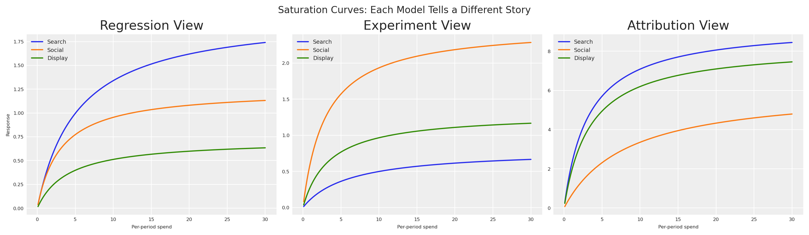
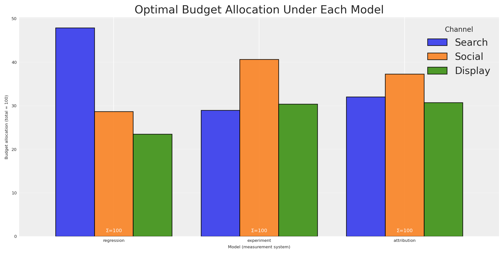
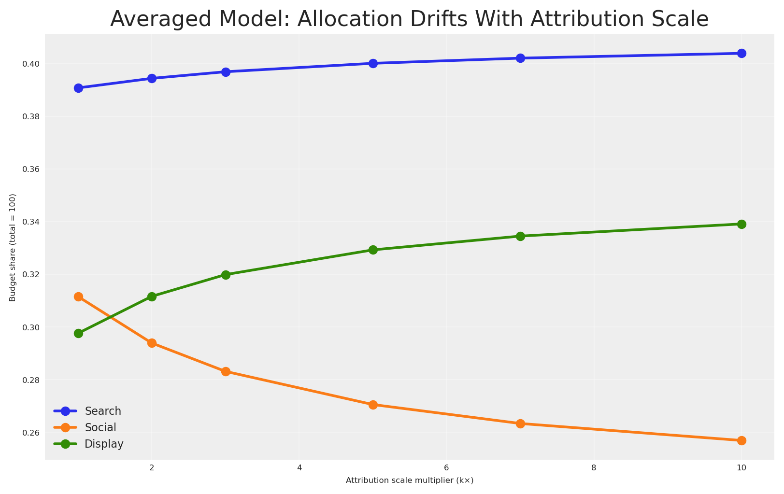
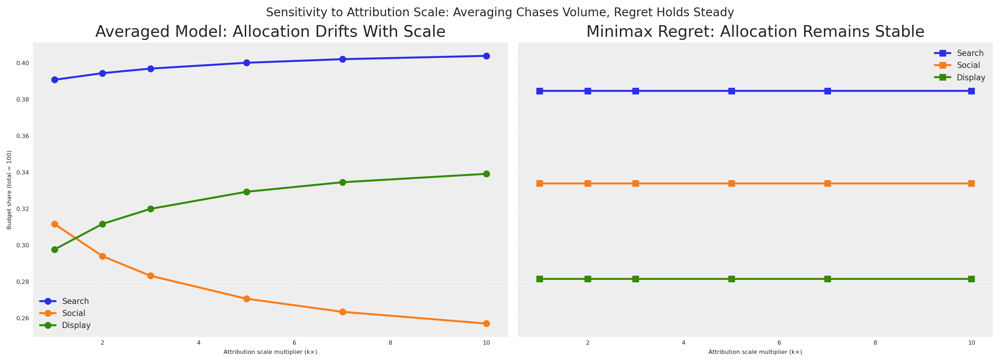

# Toma de Decisiones Bajo Contradicciones: Asignación Robusta de Presupuesto Cuando Tus Modelos No Acuerdan – Blog de Ciencia del Marketing

> Cómo tomar decisiones robustas de asignación de presupuesto cuando tus modelos de medición (MMM, experimentos, atribución) dan consejos contradictorios.

By Carlos Trujillo

Source: https://cetagostini.github.io/es/articles/decision_making_under_contradictions/decision_making_under_contradictions.html

# Introducción

Estás sentado en la revisión trimestral de negocio. Finanzas hace una pregunta engañosamente simple: *“¿Deberíamos aumentar o disminuir el gasto en búsqueda el próximo trimestre?”*

Miras tus sistemas de medición. El modelo de regresión dice que búsqueda es una estrella — alto retorno incremental, invierte más dinero. Un experimento reciente dice que social superó a búsqueda por 3× durante la geo-prueba del mes pasado. Mientras tanto, el dashboard de atribución reporta que display genera más contactos por dólar que cualquier otro canal.

Tres sistemas. Tres metodologías. Tres números contradictorios.

A finanzas no le importa tu matiz metodológico. Necesitan **una decisión**. ¿Aumentar o disminuir? ¿Por cuánto? ¿En qué canales?

Esta es la realidad de la medición moderna de marketing. No tenemos una sola fuente de verdad — tenemos *múltiples visiones competidoras* de cómo funciona el marketing. Cada visión captura algo real, pero ninguna cuenta toda la historia. Y lo peor que puedes hacer es pretender que este desacuerdo no existe.

**¿Cómo tomas una decisión de presupuesto única y defendible cuando tus modelos fundamentalmente no acuerdan?** Hoy responderemos esa pregunta. Tomaremos prestada una idea poderosa de la *teoría de la decisión* y la optimización robusta — **arrepentimiento minimax** — y mostraremos cómo encontrar asignaciones de presupuesto que sean robustas al error del modelo, sin importar qué visión resulte ser la correcta.

# Resumen rápido

Este artículo te guía a través de:

- Construir **tres modelos competidores** de efectividad de marketing, cada uno representando una filosofía de medición diferente (regresión, experimentación, atribución).
- Mostrar que estos modelos producen **recomendaciones contradictorias de presupuesto** cuando se optimizan individualmente.
- Demostrar por qué el **promedio** o **elegir el modelo más cierto** son estrategias defectuosas — incluyendo un argumento de análisis dimensional y una prueba de sensibilidad que hace el fallo innegable.
- Introducir el **arrepentimiento minimax** de la teoría clásica de la decisión como la resolución fundamentada.
- Calcular la **matriz de arrepentimiento normalizada** y encontrar la **asignación robusta** que minimiza el arrepentimiento peor caso como fracción del valor óptimo.
- Conectar todo de vuelta al `BudgetOptimizer`, `BuildMergedModel` y `CustomModelWrapper` de [PyMC-Marketing](https://www.pymc-marketing.io).

# Tres Visiones de la Realidad

Antes de escribir una sola línea de código, entendamos *por qué* estos números no acuerdan. Cada sistema de medición responde una pregunta sutilmente diferente:

| System | What it measures | Units (conceptual) | Typical uncertainty |
|----|----|----|----|
| **Regression (MMM)** | Average incremental contribution of marketing across time | Incremental sales per unit spend, averaged over the observation window | Moderate — many data points, but confounders and model misspecification add noise |
| **Experiment** | Incremental lift during a specific controlled period, not necessarily representative of average across larger periods | Incremental conversions per unit spend, holding everything else fixed | Moderate — randomisation or quasi-experimental design controls for confounders but validity depends on the assumptions being met |
| **Attribution** | Contacts or conversions attributed to marketing by the platform | Attributed contacts per unit spend — *not necessarily incremental* | Variable — high precision for what it measures, but what it measures may not be causal |

Estos tres números no comparten las mismas dimensiones. El modelo de regresión te da un efecto marginal promedio a lo largo del tiempo. El experimento te da un efecto causal en un punto en el tiempo bajo condiciones específicas. El modelo de atribución te da una asociación no causal porque **los cambios de intención no pueden ser rastreados por identificadores a nivel de usuario**.

Idea clave

No puedes simplemente promediar estos números más de lo que puedes promediar metros, kilogramos y segundos. Estos miden cosas diferentes. Pero aún necesitas tomar una decisión.

Aquí es donde la teoría de la decisión entra en escena. Pero primero, hagámoslo concreto con código.

## Modelando el desacuerdo

Configuremos nuestro entorno y definamos los parámetros básicos para nuestros modelos.

``` sourceCode
import warnings
warnings.filterwarnings("ignore")

from pymc_marketing.mmm.budget_optimizer import BudgetOptimizer, BuildMergedModel, CustomModelWrapper
import pymc as pm
import arviz as az
import preliz as pz
import pytensor.tensor as pt
from pytensor import function as pytensor_function

# Visualization
import matplotlib.pyplot as plt
import seaborn as sns

# Scientific computing
import numpy as np
import pandas as pd
```

Código

``` sourceCode
az.style.use("arviz-darkgrid")
plt.rcParams["figure.figsize"] = [8, 4]
plt.rcParams["figure.dpi"] = 100
plt.rcParams["axes.labelsize"] = 6
plt.rcParams["xtick.labelsize"] = 6
plt.rcParams["ytick.labelsize"] = 6
plt.rcParams.update({"figure.constrained_layout.use": True})

%load_ext autoreload
%autoreload 2
%config InlineBackend.figure_format = "retina"

seed: int = sum(map(ord, "decision making under contradictions"))
rng: np.random.Generator = np.random.default_rng(seed=seed)
# print(f"Seed: {seed}")
```

Construiremos tres modelos de PyMC, cada uno representando las creencias de un sistema de medición diferente sobre la efectividad de canales. Los tres modelos comparten la misma estructura — una curva de saturación [Michaelis-Menten](https://en.wikipedia.org/wiki/Michaelis%E2%80%93Menten_kinetics) por canal — pero difieren en sus **valores de parámetros** y **niveles de incertidumbre**.

Supuesto

Siempre tenemos un supuesto sobre nuestro sistema, el cual debe ser compartido por la herramienta de medición usada para estimarlo. Si creemos que la atribución es la verdadera fuente de verdad, y nuestro sistema sufre rendimientos decrecientes, entonces deberíamos poder observar la curva de saturación en los datos de atribución. Lo mismo con un experimento, deberíamos poder observar la curva de saturación en los datos del experimento, después de recopilar los datos.

f(x) = \frac{\alpha \cdot x}{\lambda + x}

donde:

- \alpha es el máximo efecto alcanzable (la asíntota)
- \lambda es el punto de semisaturación (el gasto en el que alcanzamos la mitad del máximo)

Esta función es cóncava, asegurando rendimientos decrecientes — una propiedad que hace la optimización de presupuesto tanto realista como matemáticamente bien comportada. Comenzaremos definiendo la configuración global: tres canales, nuestro horizonte de tiempo y un presupuesto total de 100.

Código

``` sourceCode
channels: list[str] = ["search", "social", "display"]
n_ch: int = len(channels)

# Observation periods (model structure) and future periods (optimization horizon)
n_dates: int = 30
n_future: int = 8

# Budget for optimization
TOTAL_BUDGET: float = 100.0

coords = {"date": np.arange(n_dates), "channel": channels}
# print(f"Channels: {channels}")
# print(f"Observation periods: {n_dates} | Future periods: {n_future}")
# print(f"Total budget: {TOTAL_BUDGET}")
```

Aquí es donde vive el desacuerdo. Cada sistema de medición tiene diferentes creencias sobre los parámetros de saturación (\alpha, \lambda) para cada canal. Críticamente, **no acuerdan sobre el ranking de canales** — y **no acuerdan sobre la escala** de la efectividad de marketing.

Código

``` sourceCode
model_configs = {
    "regression": {
        "description": "MMM: average incrementality across time",
        "mu_alpha": np.array([np.log(2.0), np.log(1.2), np.log(0.7)]),
        "sigma_alpha": np.array([0.25, 0.25, 0.25]),
        "mu_lam": np.array([np.log(5.0), np.log(3.0), np.log(4.0)]),
        "sigma_lam": np.array([0.25, 0.25, 0.25]),
        "color": "C0",
        "ranking": "search > social > display",
    },
    "experiment": {
        "description": "Experiment: causal lift in a specific period",
        "mu_alpha": np.array([np.log(0.8), np.log(2.5), np.log(1.3)]),
        "sigma_alpha": np.array([0.08, 0.08, 0.08]),
        "mu_lam": np.array([np.log(6.0), np.log(3.0), np.log(3.5)]),
        "sigma_lam": np.array([0.08, 0.08, 0.08]),
        "color": "C1",
        "ranking": "social > display > search",
    },
    "attribution": {
        "description": "Attribution: contacts per dollar (not incremental — inflated scale)",
        "mu_alpha": np.array([np.log(8.0), np.log(5.0), np.log(7.0)]),
        "sigma_alpha": np.array([0.60, 0.60, 0.60]),
        "mu_lam": np.array([np.log(2.5), np.log(7.0), np.log(3.0)]),
        "sigma_lam": np.array([0.60, 0.60, 0.60]),
        "color": "C2",
        "ranking": "search > display > social",
    },
}
```

Para convertir estos priors en algo con lo que el optimizador pueda trabajar, envolvemos cada conjunto de parámetros en un modelo PyMC ligero que hable el mismo lenguaje que el `CustomModelWrapper` de PyMC-Marketing. **El contrato es simple**: expone una matriz `channel_data` (presupuesto por canal por fecha), un escalar `total_contribution` y un vector `channel_contribution`.

Cualquier versión de la realidad puede convertirse en un modelo

Una pregunta común es: *“¿Cómo convierto realmente mi dashboard de atribución (u otro sistema de medición) en un modelo como los de arriba?”* La respuesta es directa — puedes tomar cualquier versión de la realidad y ajustar un modelo a ella. Elige una estructura de respuesta en la que creas — digamos, una con saturación y adstock — y usa tus datos para encontrar los parámetros que mejor repliquen el comportamiento que tu sistema de medición reporta. Contactos por dólar de atribución, curvas de lift experimental, coeficientes de regresión, incluso la hoja de cálculo de un colega — cualquiera de estos puede servir como los “datos observados” contra los que ajustas, con el gasto como entrada.

El ajuste mismo puede ocurrir de dos maneras. Un **ajuste determinista** (e.g., mínimos cuadrados o MLE) te da estimaciones puntuales de los parámetros; no obtendrás pósteriores gratis, pero aún puedes estimar la incertidumbre de parámetros a través de intervalos de confianza o bootstrap. Un **ajuste Bayesiano** te da pósteriores completos directamente — insértalos en un objeto `InferenceData` y estás listo para el optimizador. Cualquier ruta convierte un sistema de medición en un modelo compatible con este marco.

Un matiz importante: ajustar la misma forma funcional a diferentes fuentes de datos te da modelos que son *matemáticamente* comparables — que es exactamente lo que el marco de arrepentimiento minimax requiere — pero no hace que sus salidas sean *semánticamente* equivalentes. La curva ajustada por atribución todavía representa contactos atribuidos, no lift causal. Los modelos comparten un lenguaje, no un significado. Es precisamente por eso usamos el arrepentimiento dentro de los términos propios de cada modelo en lugar de promediar entre ellos.

Recorremos un ejemplo concreto de este proceso — convirtiendo resultados experimentales en parámetros de modelo calibrados — en [De Experimentos a Priors: Elicitando Priors Informativos para Tu Modelo de Mezcla de Marketing](../../articles/from_experiments_to_priors/from_experiments_to_priors.html).

Código

``` sourceCode
def build_response_model(mu_alpha, sigma_alpha, mu_lam, sigma_lam, coords, n_dates, n_ch):
    """
    Build a PyMC model with Michaelis-Menten saturation per channel.

    Parameters
    ----------
    mu_alpha : np.ndarray
        LogNormal mu for saturation alpha (per channel).
    sigma_alpha : np.ndarray
        LogNormal sigma for saturation alpha (per channel).
    mu_lam : np.ndarray
        LogNormal mu for saturation lambda (per channel).
    sigma_lam : np.ndarray
        LogNormal sigma for saturation lambda (per channel).
    coords : dict
        PyMC coordinate dict with "date" and "channel".
    n_dates : int
        Number of observation periods.
    n_ch : int
        Number of channels.

    Returns
    -------
    pm.Model
        Compiled PyMC model.
    """
    with pm.Model(coords=coords) as model:
        # Channel spend data — the optimizer injects budget allocations here
        channel_data = pm.Data(
            "channel_data",
            np.ones((n_dates, n_ch)),
            dims=("date", "channel"),
        )

        # Saturation parameters (LogNormal ensures positivity)
        alpha = pm.LogNormal(
            "alpha",
            mu=mu_alpha,
            sigma=sigma_alpha,
            dims="channel",
        )
        lam = pm.LogNormal(
            "lam",
            mu=mu_lam,
            sigma=sigma_lam,
            dims="channel",
        )

        # Michaelis-Menten saturation: alpha * x / (lam + x)
        channel_contrib = alpha * channel_data / (lam + channel_data)

        # Sum over channels → per-period response
        mu = channel_contrib.sum(axis=-1)

        # Deterministics the optimizer needs
        pm.Deterministic("total_contribution", mu.sum())
        pm.Deterministic(
            "channel_contribution",
            channel_contrib,
            dims=("date", "channel"),
        )

    return model


# Build and sample all three models
models = {}
idatas = {}

for name, cfg in model_configs.items():
    model = build_response_model(
        mu_alpha=cfg["mu_alpha"],
        sigma_alpha=cfg["sigma_alpha"],
        mu_lam=cfg["mu_lam"],
        sigma_lam=cfg["sigma_lam"],
        coords=coords,
        n_dates=n_dates,
        n_ch=n_ch,
    )

    with model:
        idata = pm.sample_prior_predictive(samples=500, random_seed=seed)

    # Rename "prior" → "posterior" so the optimizer can find the parameter draws
    idata.add_groups(posterior=idata.prior)

    models[name] = model
    idatas[name] = idata
    # print(f"✓ {name}: posterior shape (alpha) = {idata.posterior['alpha'].shape}")
```

Muestreamos del prior y tratamos esos sorteos como si fueran muestras posteriores de modelos ajustados. En la práctica, cada uno de estos vendría de un análisis real — el MMM de una regresión histórica, el experimento de una geo-prueba y la atribución de dashboards de plataforma.

¿por qué usar el prior como posterior?

Al pretender que el prior es el posterior, saltamos el costoso paso de MCMC y nos enfocamos en el problema de toma de decisiones. En un flujo de trabajo real, estos objetos `idata` vendrían de `pm.sample()` después de ajustar tus modelos a datos históricos. El proceso de decisión aguas abajo es idéntico ya sea que los pósteriores vengan de datos reales o de esta generación sintética.

## Viendo el conflicto

Veamos cómo los tres modelos difieren en sus creencias sobre la efectividad de canales (\alpha, el techo de saturación). El ancho de cada distribución refleja la certidumbre del sistema de medición.

Código

``` sourceCode
fig, axes = plt.subplots(nrows=1, ncols=3, figsize=(14, 4), sharey=True)

for idx, ch in enumerate(channels):
    ax = axes[idx]
    for name, cfg in model_configs.items():
        alpha_samples = idatas[name].posterior["alpha"].sel(channel=ch).values.flatten()
        az.plot_dist(
            alpha_samples,
            color=cfg["color"],
            label=name.capitalize(),
            ax=ax,
        )
    ax.set(
        title=f"Alpha ({ch.capitalize()})",
        xlabel="Saturation ceiling (α)",
    )
    if idx == 0:
        ax.set(ylabel="Density")
    ax.legend(fontsize=7)

fig.suptitle(
    "Three Models, Three Different Beliefs About Channel Effectiveness",
    fontsize=12,
)
plt.show()
```

<figure class="figure">
<p></p>
</figure>

Esta gráfica es la prueba visual de nuestro predicamento. Estas no son pequeñas discrepancias — los modelos tienen rankings de canales *cualitativamente diferentes*.

Podemos ver esto aún más claramente graficando las curvas de respuesta de Michaelis-Menten usando la media posterior de cada modelo. Esto muestra lo que cada modelo predice que sucederá cuando aumentemos el gasto en cada canal.

Código

``` sourceCode
x_range = np.linspace(0.1, 30, 200)

fig, axes = plt.subplots(nrows=1, ncols=3, figsize=(14, 4), sharey=False)

for idx, (name, cfg) in enumerate(model_configs.items()):
    ax = axes[idx]
    for ch_idx, ch in enumerate(channels):
        alpha_mean = idatas[name].posterior["alpha"].sel(channel=ch).mean().item()
        lam_mean = idatas[name].posterior["lam"].sel(channel=ch).mean().item()
        y = alpha_mean * x_range / (lam_mean + x_range)
        ax.plot(x_range, y, label=ch.capitalize(), color=f"C{ch_idx}")

    ax.set(
        title=f"{name.capitalize()} View",
        xlabel="Per-period spend",
        ylabel="Response" if idx == 0 else "",
    )
    ax.legend(fontsize=7)

fig.suptitle("Saturation Curves: Each Model Tells a Different Story", fontsize=12)
plt.show()
```

<figure class="figure">
<p></p>
</figure>

Bajo la **visión de regresión**, búsqueda (azul) domina — tiene la asíntota más alta y responde bien al aumento de gasto. Bajo la **visión de experimento**, social (naranja) es el ganador indiscutible. Bajo la **visión de atribución**, búsqueda y display se elevan sobre social — pero mira el eje y: el modelo de atribución reporta efectividad a una *escala completamente diferente* a la de los otros dos. Sus curvas alcanzan asíntotas 10× más altas que cualquier cosa que la regresión o el experimento prediga.

Si fueras un director de finanzas mirando estas tres gráficas, estarías comprensiblemente confundido. Y si alguien promediara estas curvas, estarías tomando una decisión dominada por el sistema que grita los números más grandes.

# Tres Modelos, Tres Presupuestos

Hagamos lo que la mayoría de los equipos hace en la práctica: optimizar la asignación de presupuesto bajo cada modelo independientemente, usando el `BudgetOptimizer` de [PyMC-Marketing](https://www.pymc-marketing.io). Esto nos da tres asignaciones óptimas separadas, una para cada sistema de creencias.

Código

``` sourceCode
bounds = {ch: (0.0, 60.0) for ch in channels}

optimal_allocations = {}
optimal_results = {}

for name in model_configs:
    wrapper = CustomModelWrapper(
        base_model=models[name],
        idata=idatas[name],
        channels=channels,
    )
    optimizer = BudgetOptimizer(model=wrapper, num_periods=n_future)

    allocation, result = optimizer.allocate_budget(
        total_budget=TOTAL_BUDGET,
        budget_bounds=bounds,
    )

    # Convert to pd.Series for consistent downstream handling
    if hasattr(allocation, "to_series"):
        allocation = allocation.to_series()
    elif not isinstance(allocation, pd.Series):
        allocation = pd.Series(np.array(allocation).flatten(), index=channels)

    optimal_allocations[name] = allocation
    optimal_results[name] = result

    # print(f"\n{name.upper()} optimal allocation:")
    # print(f"  Success: {result.success}")
    # print(f"  Expected contribution: {-result.fun:.4f}")
    # for ch in channels:
    #     # print(f"  {ch}: {allocation[ch]:.2f}")
```

Podemos visualizar estas tres asignaciones óptimas para ver exactamente cómo difieren las recomendaciones:

Código

``` sourceCode
alloc_df = pd.DataFrame(optimal_allocations).T
alloc_df.columns = [ch.capitalize() for ch in channels]

fig, ax = plt.subplots(figsize=(10, 5))
alloc_df.plot(kind="bar", ax=ax, edgecolor="black", alpha=0.85, width=0.8)
ax.set(
    title="Optimal Budget Allocation Under Each Model",
    xlabel="Model (measurement system)",
    ylabel=f"Budget allocation (total = {TOTAL_BUDGET:.0f})",
)
ax.legend(title="Channel", loc="upper right")
ax.set_xticklabels(ax.get_xticklabels(), rotation=0)

# Annotate with total budget check
for i, name in enumerate(model_configs):
    total = optimal_allocations[name].sum()
    ax.text(i, 1, f"Σ={total:.0f}", ha="center", fontsize=7, color="white")

ax.grid(True, axis="y", alpha=0.3)
plt.show()
```

<figure class="figure">
<p></p>
</figure>

El panorama es impactante. El modelo de regresión pone la mayor parte del presupuesto en **búsqueda**. El experimento cambia casi todo a **social**. El modelo de atribución favorece **búsqueda y display** mientras desangra social.

Estos no son ajustes menores — son estrategias fundamentalmente diferentes. Si presentas cualquiera de ellas a finanzas, estás apostando implícitamente a que un sistema de medición es correcto y los demás están equivocados. ¿Cómo decidir? Más importante, ¿qué pasa si lo haces mal? **¿Y si todos están parcialmente en lo correcto?**

# La Ilusión del Consenso

El instinto natural va así: “Tenemos tres modelos. En lugar de confiar solo en uno, seamos inteligentes — para cualquier asignación dada, preguntamos a los *tres* modelos cuál sería el resultado esperado, luego promediamos sus respuestas. Esto nos da una predicción de ‘consenso.’ Optimizamos *eso*.”

Esto suena razonable. Es lo que un interesado pragmático podría proponer. Probémoslo fusionando los tres modelos en un solo grafo computacional usando `BuildMergedModel`. Este grafo compartido nos permite evaluar cualquier asignación de presupuesto a través de las tres superficies de respuesta simultáneamente.

Con el modelo fusionado listo, podemos compilar funciones de evaluación PyTensor para calcular fácilmente la respuesta esperada para cualquier presupuesto bajo cualquier modelo.

Código

``` sourceCode
wrappers = {
    name: CustomModelWrapper(
        base_model=models[name], idata=idatas[name], channels=channels,
    )
    for name in model_configs
}

merged = BuildMergedModel(
    models=list(wrappers.values()),
    prefixes=list(model_configs.keys()),
    merge_on="channel_data",
)
merged.num_periods = n_future
merged.channel_columns = channels

# print("Merged model variables:")
# for v in merged.model.named_vars:
#     # print(f"  {v}")

merged_optimizer = BudgetOptimizer(
    model=merged,
    num_periods=n_future,
    response_variable="regression_total_contribution",
)

eval_fns: dict[str, callable] = {}
draws_fns: dict[str, callable] = {}

for name in model_configs:
    var = f"{name}_total_contribution"
    dist = merged_optimizer.extract_response_distribution(var)
    draws_fns[name] = pytensor_function([merged_optimizer._budgets_flat], dist)
    eval_fns[name] = pytensor_function([merged_optimizer._budgets_flat], pt.mean(dist))

# Quick sanity check: evaluate at equal allocation
equal_alloc = np.array([TOTAL_BUDGET / n_ch] * n_ch)
# for name in model_configs:
#     # print(f"  {name} at equal alloc: {eval_fns[name](equal_alloc):.4f}")
```

Ahora construimos la métrica de “consenso.” Para cualquier asignación a, evaluamos los tres modelos y promediamos sus respuestas esperadas:

V\_{\text{avg}}(a) = \frac{1}{3}\left\[V\_{\text{reg}}(a) + V\_{\text{exp}}(a) + V\_{\text{attr}}(a)\right\]

Luego optimizamos V\_{\text{avg}} para encontrar la asignación que maximiza esta predicción promediada.

Código

``` sourceCode
with merged.model:
    pm.Deterministic("averaged_total_contribution", (
        merged.model["regression_total_contribution"]
        + merged.model["experiment_total_contribution"]
        + merged.model["attribution_total_contribution"]
    ) / 3)

avg_optimizer = BudgetOptimizer(
    model=merged,
    num_periods=n_future,
    response_variable="averaged_total_contribution",
)

naive_avg, result_naive = avg_optimizer.allocate_budget(
    total_budget=TOTAL_BUDGET,
    budget_bounds=bounds,
)

if hasattr(naive_avg, "to_series"):
    naive_avg = naive_avg.to_series()
elif not isinstance(naive_avg, pd.Series):
    naive_avg = pd.Series(np.array(naive_avg).flatten(), index=channels)

# print(f"Optimisation success: {result_naive.success}")
# print(f"Averaged model expected contribution: {-result_naive.fun:.4f}")
# print(f"\nAveraged-model optimal allocation:")
# for ch in channels:
#     # print(f"  {ch}: {naive_avg[ch]:.2f}")
# print(f"  Total: {naive_avg.sum():.2f}")
```

Esta asignación es lo mejor que puedes hacer *si* el promedio de los tres modelos es significativo. ¿Pero lo es?

Veamos qué *predice* cada modelo para esta asignación. No solo la media — la distribución posterior completa.

Código

``` sourceCode
fig, ax = plt.subplots(figsize=(7, 4))

alloc_values = naive_avg.values
all_draws = []
for name, cfg in model_configs.items():
    draws = draws_fns[name](alloc_values)
    all_draws.append(draws)

min_len = min(len(d) for d in all_draws)
stacked = np.column_stack([d[:min_len] for d in all_draws])
averaged_draws = stacked.mean(axis=1)

for name, cfg in model_configs.items():
    draws = draws_fns[name](alloc_values)
    az.plot_dist(draws, color=cfg["color"], label=name.capitalize(), ax=ax, plot_kwargs={"alpha": 0.3})

az.plot_dist(averaged_draws, color="black", label="Averaged model", ax=ax, plot_kwargs={"linewidth": 2})
ax.set(
    title="The 'Averaged' Distribution: A Frankenstein Model",
    xlabel="Expected total contribution",
    ylabel="Density",
)
ax.legend(fontsize=8)

plt.show()
```

<figure class="figure">
<p></p>
</figure>

Las distribuciones no solo no acuerdan — viven en *escalas completamente diferentes*. El modelo de atribución (verde), operando a 10× la magnitud de los otros dos, empuja su distribución mucho a la derecha. La regresión y el experimento están en un rango modesto; la atribución se eleva sobre ellos. Estas no son diferencias menores de calibración — reflejan procesos de medición fundamentalmente diferentes contando cosas fundamentalmente diferentes.

La distribución “promediada” (negro) no cae en un terreno neutral medio — es arrastrada hacia los valores inflados del modelo de atribución, porque el promedio de un número pequeño, otro número pequeño y un número muy grande es dominado por el número muy grande. La voz más fuerte gana el promedio. Pregúntate: **¿qué representa un muestreo de esta distribución?**

No es el incremento esperado en ventas. No es el lift causal esperado. No son los contactos atribuidos esperados. Es el promedio de los tres — una cantidad que no existe en ningún marco.

El enfoque del “consenso” toma el promedio simple de estos tres números. Pero piensa en lo que eso significa: estamos sumando ventas incrementales en un punto en el tiempo (o varios puntos en el tiempo), conversiones causales sobre una ventana de tiempo y contactos atribuidos no puramente incrementales como si fueran la misma cosa. Es como calcular el promedio de 5 metros, 3 kilogramos y 7 segundos. El resultado es un número, claro — pero *no significa nada*.

Adicionalmente, el “consenso” asume implícitamente que la verdad es exactamente la media aritmética de los tres modelos — dando 10× más peso al sistema que casualmente reporta los números más grandes. No trata a los modelos como hipótesis igualmente creíbles. Los trata como miembros votantes de un comité donde la atribución obtiene diez votos y todos los demás obtienen uno.

Error dimensional

Promediar las *salidas* de modelos de diferentes sistemas de medición es un error dimensional. El “consenso” resultante puede parecer una distribución, pero no tiene interpretación significativa en ninguno de los tres marcos. Ningún muestreo de esta distribución corresponde a un resultado del mundo real.

Incluso si normalizáramos todo a las mismas unidades (e.g., convirtiéramos todo a dólares), aún estaríamos promediando cantidades fundamentalmente diferentes causales/no causales. Promediarlas no es solo un error de unidades; es un **error de categoría**. Es como promediar una velocidad (km/h), una distancia (km) y una coordenada (lat/long). El análisis dimensional nos dice que el promedio está conceptualmente roto. ¿Pero qué tan mal se rompe en la práctica?

## Por qué el promedio falla a escala

Demostremos. Barreremos el parámetro de efectividad del modelo de atribución desde su valor base (1×) hasta 10× — nuestra configuración actual — y rastrearemos qué sucede tanto con la asignación del modelo promediado como con una alternativa robusta en cada paso. La regresión y el experimento permanecen fijos; solo cambia la magnitud del modelo de atribución.

Si el promedio es realmente una estrategia sólida, la asignación que recomienda debería permanecer estable cuando la escala de un modelo cambia. Después de todo, un buen método de agregación no debería dejar que una sola voz domine solo porque habla más fuerte.

Código

``` sourceCode
# Base attribution alpha parameters (1× scale, before inflation)
base_mu_alpha_attr: np.ndarray = np.array([np.log(2.5), np.log(0.5), np.log(1.8)])

scale_factors: np.ndarray = np.array([1, 2, 3, 5, 7, 10])
n_scales: int = len(scale_factors)

avg_allocs_sweep: dict[int, pd.Series] = {}
robust_allocs_sweep: dict[int, pd.Series] = {}

for k in scale_factors:
    # Scale attribution alpha by k (in log-space: add log(k))
    mu_alpha_k = base_mu_alpha_attr + np.log(k)

    model_k = build_response_model(
        mu_alpha=mu_alpha_k,
        sigma_alpha=model_configs["attribution"]["sigma_alpha"],
        mu_lam=model_configs["attribution"]["mu_lam"],
        sigma_lam=model_configs["attribution"]["sigma_lam"],
        coords=coords,
        n_dates=n_dates,
        n_ch=n_ch,
    )

    with model_k:
        idata_k = pm.sample_prior_predictive(samples=500, random_seed=seed)
    idata_k.add_groups(posterior=idata_k.prior)

    # Attribution-optimal allocation at this scale
    wrapper_k = CustomModelWrapper(
        base_model=model_k, idata=idata_k, channels=channels,
    )
    opt_k = BudgetOptimizer(model=wrapper_k, num_periods=n_future)
    alloc_k, _ = opt_k.allocate_budget(
        total_budget=TOTAL_BUDGET, budget_bounds=bounds,
    )

    if hasattr(alloc_k, "to_series"):
        alloc_k = alloc_k.to_series()
    elif not isinstance(alloc_k, pd.Series):
        alloc_k = pd.Series(np.array(alloc_k).flatten(), index=channels)

    # Merge at this scale: regression + experiment (fixed) + attribution_k
    merged_k = BuildMergedModel(
        models=[wrappers["regression"], wrappers["experiment"], wrapper_k],
        prefixes=["regression", "experiment", "attribution"],
        merge_on="channel_data",
    )
    merged_k.num_periods = n_future
    merged_k.channel_columns = channels

    # --- Averaged-model optimisation at this scale ---
    with merged_k.model:
        pm.Deterministic("averaged_total_contribution", (
            merged_k.model["regression_total_contribution"]
            + merged_k.model["experiment_total_contribution"]
            + merged_k.model["attribution_total_contribution"]
        ) / 3)

    avg_opt_k = BudgetOptimizer(
        model=merged_k, num_periods=n_future,
        response_variable="averaged_total_contribution",
    )
    alloc_avg_k, _ = avg_opt_k.allocate_budget(
        total_budget=TOTAL_BUDGET, budget_bounds=bounds,
    )
    if hasattr(alloc_avg_k, "to_series"):
        alloc_avg_k = alloc_avg_k.to_series()
    elif not isinstance(alloc_avg_k, pd.Series):
        alloc_avg_k = pd.Series(np.array(alloc_avg_k).flatten(), index=channels)
    avg_allocs_sweep[k] = alloc_avg_k

    # --- Minimax regret optimisation at this scale ---
    # v_star for the scaled attribution model
    attr_eval_dist = opt_k.extract_response_distribution("total_contribution")
    attr_eval_fn = pytensor_function([opt_k._budgets_flat], pt.mean(attr_eval_dist))
    v_star_attr_k = float(attr_eval_fn(alloc_k.values))

    v_stars_sweep = {}
    for sweep_name in ["regression", "experiment"]:
        v_stars_sweep[sweep_name] = float(eval_fns[sweep_name](optimal_allocations[sweep_name].values))

    with merged_k.model:
        regret_vector_k = pt.stack([
            1.0 - merged_k.model["regression_total_contribution"] / v_stars_sweep["regression"],
            1.0 - merged_k.model["experiment_total_contribution"] / v_stars_sweep["experiment"],
            1.0 - merged_k.model["attribution_total_contribution"] / v_star_attr_k,
        ])
        pm.Deterministic("regret_vector", regret_vector_k)

    def minimax_regret_utility(samples, budgets):
        mean_regrets = pt.mean(samples, axis=0)
        return -pt.max(mean_regrets)

    rob_opt_k = BudgetOptimizer(
        model=merged_k, num_periods=n_future,
        response_variable="regret_vector",
        utility_function=minimax_regret_utility,
    )
    alloc_rob_k, _ = rob_opt_k.allocate_budget(
        total_budget=TOTAL_BUDGET, budget_bounds=bounds,
    )
    if hasattr(alloc_rob_k, "to_series"):
        alloc_rob_k = alloc_rob_k.to_series()
    elif not isinstance(alloc_rob_k, pd.Series):
        alloc_rob_k = pd.Series(np.array(alloc_rob_k).flatten(), index=channels)
    robust_allocs_sweep[k] = alloc_rob_k

    # print(f"k={k:2d} | Avg: {alloc_avg_k.values.round(1)} | Robust: {alloc_rob_k.values.round(1)}")

fig, ax = plt.subplots(figsize=(8, 5))

for ch_idx, ch in enumerate(channels):
    vals = [avg_allocs_sweep[k][ch]/TOTAL_BUDGET for k in scale_factors]
    ax.plot(
        scale_factors, vals,
        marker="o", label=ch.capitalize(), color=f"C{ch_idx}", linewidth=2,
    )
ax.set(
    title="Averaged Model: Allocation Drifts With Attribution Scale",
    xlabel="Attribution scale multiplier (k×)",
    ylabel=f"Budget share (total = {TOTAL_BUDGET:.0f})",
)
ax.legend(fontsize=8)
ax.grid(True, alpha=0.3)
plt.show()
```

<figure class="figure">
<p></p>
</figure>

El resultado es demoledor. Cuando la escala de un modelo aumenta de 1× a 10×, la asignación del modelo promediado pivota constantemente hacia los canales preferidos de ese modelo — las visiones restantes se ahogan progresivamente. Esto no es específico de la atribución; *cualquier* modelo cuya respuesta promedio crezca secuestrará el consenso. El “consenso” no es un consenso; es una negociación de rehenes donde el número más grande siempre gana.

La lección práctica

Si tus sistemas de medición operan a diferentes escalas — y casi con seguridad lo hacen — promediar sus salidas da influencia desproporcionada al sistema con los números más grandes. Esto no es una preocupación teórica. La atribución de plataforma reporta rutinariamente 5–15× más “conversiones” que las pruebas de incrementalidad porque cuenta cada punto de contacto, no solo los causales. Cualquier método de agregación que no considere esto sobre-investirá sistemáticamente en lo que el dashboard de atribución recomiende.

La evidencia es clara. El promedio no solo carece de interpretación significativa — persigue activamente cualquier sistema que grite los números más grandes, produciendo asignaciones que oscilan violentamente cuando la escala de medición cambia. Necesitamos un marco que reconozca el desacuerdo del modelo sin intentar combinar las salidas del modelo en una sola predicción.

Este es el vacío que la **teoría de la decisión** llena. En lugar de intentar sintetizar un modelo “verdadero,” reconocemos la incertidumbre del modelo y elegimos la *acción* que se desempeña mejor *dada esa incertidumbre*. No combinamos los modelos — combinamos sus *implicaciones para las decisiones*.

# La Solución: Arrepentimiento Minimax

Formalicemos nuestra situación. Tenemos:

- Un conjunto de posibles **acciones** a \in \mathcal{A} (asignaciones de presupuesto entre canales)
- Un conjunto de posibles **estados del mundo** m \in \mathcal{M} (qué modelo es el correcto)
- Una **función de pago** V(a, m) que da la respuesta esperada cuando se toma la acción a y el modelo m es el verdadero

Para cada modelo m, existe una acción óptima a_m^\* = \arg\max_a V(a, m) — la asignación que elegiríamos si *supiéramos* que el modelo m es el correcto.

El **arrepentimiento normalizado** de elegir la acción a cuando el modelo m es verdadero es la fracción del valor óptimo que dejamos sobre la mesa:

R(a, m) = 1 - \frac{V(a, m)}{V(a_m^\*, m)}

El arrepentimiento normalizado vive en \[0, 1\]. Cero significa que elegimos perfectamente para ese modelo. Un valor de 0.15 significa que capturamos solo el 85% de lo alcanzable. Crucialmente, el arrepentimiento normalizado es **invariante a la escala**: si la respuesta del modelo m se multiplica por cualquier constante k, tanto el numerador como el denominador de la proporción V/V^\* se escalan idénticamente, dejando R sin cambio. Esta propiedad es esencial cuando nuestros modelos operan a diferentes magnitudes — y es exactamente por qué el panel derecho de la gráfica de sensibilidad se mantuvo estable.

La estrategia de **arrepentimiento minimax** elige la acción que minimiza el arrepentimiento *peor caso* entre todos los posibles modelos:

a^{MR} = \arg\min\_{a \in \mathcal{A}} \max\_{m \in \mathcal{M}} R(a, m)

En palabras: **encuentra la asignación tal que sin importar qué modelo resulte ser el correcto, nuestro arrepentimiento sea lo más pequeño posible.**

## ¿Por qué arrepentimiento minimax?

Este criterio tiene varias propiedades atractivas para nuestro contexto de marketing:

1.  **No se requiere ponderación de modelos.** A diferencia del Promedio Bayesiano de Modelos, no necesitamos asignar probabilidades a que cada modelo sea “correcto.” Simplemente nos protegemos contra el peor caso.

2.  **Maneja modelos inconmensurables.** Nunca combinamos los *parámetros* de los modelos — solo evaluamos la *respuesta* de cada modelo a la misma asignación. El arrepentimiento normalizado siempre se calcula dentro del marco de un solo modelo, y como mide la *fracción* del valor óptimo perdido, es invariante a la escala absoluta de la respuesta de cada modelo.

3.  **Robusto ante error del modelo.** La asignación resultante se cubre contra todos los modelos, asegurando que nunca tomemos una decisión catastróficamente mala bajo ninguno de ellos.

4.  **Teoría establecida.** El arrepentimiento minimax fue formalizado por [Leonard Savage (1951)](https://en.wikipedia.org/wiki/Minimax) y se conecta directamente con la **Optimización Robusta Distribucional (DRO)** en investigación de operaciones moderna y con la **asignación robusta de portafolio** en finanzas.

Analogía de portafolio

Piensa en el arrepentimiento minimax como el equivalente en teoría de la decisión a la diversificación de portafolio. Así como un portafolio diversificado protege contra la incertidumbre en los rendimientos de acciones individuales, una asignación de arrepentimiento minimax protege contra la incertidumbre de qué modelo es correcto.

# La Asignación Robusta en la Práctica

Para cada modelo, la respuesta óptima V^\*(m) es la máxima contribución alcanzable — lo que obtendríamos si supiéramos que ese modelo es el correcto y optimizáramos perfectamente para él.

Código

``` sourceCode
v_stars = {}

for name in model_configs:
    v_star = float(eval_fns[name](optimal_allocations[name].values))
    v_stars[name] = v_star
    # print(f"V* ({name}): {v_star:.4f}")
```

Estos son los *mejores resultados posibles* bajo cada modelo. Cualquier otra asignación logrará menos bajo ese modelo, resultando en arrepentimiento positivo. Evaluemos cada asignación candidata bajo cada modelo para construir la matriz de arrepentimiento.

Código

``` sourceCode
# Gather all candidate allocations
candidate_allocations = {
    "Regression\nOptimal": optimal_allocations["regression"],
    "Experiment\nOptimal": optimal_allocations["experiment"],
    "Attribution\nOptimal": optimal_allocations["attribution"],
    "Averaged\nModel": naive_avg,
}

# Build the response and regret matrices
response_matrix = pd.DataFrame(
    index=candidate_allocations.keys(),
    columns=[n.capitalize() for n in model_configs.keys()],
    dtype=float,
)

regret_matrix = response_matrix.copy()

for alloc_name, alloc in candidate_allocations.items():
    alloc_vals = np.array(alloc).flatten()
    for model_name in model_configs:
        v = float(eval_fns[model_name](alloc_vals))
        response_matrix.loc[alloc_name, model_name.capitalize()] = v
        regret_matrix.loc[alloc_name, model_name.capitalize()] = 1.0 - v / v_stars[model_name]

# print("=== Response Matrix (expected contribution) ===")
# print(response_matrix.round(2).to_string())
# print()
# print("=== Normalised Regret Matrix (fraction of optimal lost) ===")
# print(regret_matrix.round(4).to_string())

# Add max regret column
regret_display = regret_matrix.copy()
regret_display["Max Regret"] = regret_display.max(axis=1)

fig, ax = plt.subplots(figsize=(10, 5))
sns.heatmap(
    regret_display.astype(float),
    annot=True,
    fmt=".1%",
    cmap="YlOrRd",
    linewidths=0.5,
    ax=ax,
    vmin=0.0,
    vmax=regret_display.values.max() * 1.2,
)
ax.set(
    title="Normalised Regret: Fraction of Optimal Value Lost Under Each Scenario",
    xlabel="If this model is correct...",
    ylabel="If we choose this allocation...",
)
plt.show()
```

<figure class="figure">
<p></p>
</figure>

Lee esta matriz cuidadosamente:

- Cada **fila** es una asignación candidata (lo que podríamos elegir).
- Cada **columna** es un escenario (qué modelo resulta ser el correcto).
- Cada **celda** es el arrepentimiento normalizado — la fracción del valor óptimo perdido. Un valor de 0.15 significa que capturamos solo el 85% de lo alcanzable bajo ese modelo.
- La **columna más a la derecha** es el arrepentimiento normalizado máximo: el escenario peor caso para cada asignación.

Observa que la asignación óptima de cada modelo tiene **arrepentimiento cero** bajo su propio modelo (por definición), pero potencialmente **arrepentimiento grande** bajo los otros modelos. La asignación óptima de regresión sale mal si el modelo de experimento es correcto. La asignación óptima de experimento sufre si la regresión o la atribución es la correcta.

¿El modelo promediado? Arrastrado hacia la escala inflada de la atribución, imita la asignación óptima de atribución — bueno cuando la atribución es correcta, pero expuesto cuando no lo es. No se cubre; sigue la señal más fuerte. Y como mostramos, el número que optimizó no tiene interpretación física coherente.

**¿Podemos hacerlo mejor?**

Podemos resolver el problema de arrepentimiento minimax directamente: encontrar la asignación que minimiza el arrepentimiento máximo entre los tres modelos.

a^{MR} = \arg\min\_{a} \max\_{m \in \\\text{reg}, \text{exp}, \text{attr}\\} \left\[ 1 - \frac{V(a, m)}{V^\*(m)} \right\]

sujeto a:

\sum\_{c} a_c = B, \quad a_c \geq 0 \quad \forall c

Verifiquemos evaluando el arrepentimiento de la asignación robusta bajo cada modelo.

Código

``` sourceCode
with merged.model:
    regret_vector = pt.stack([
        1.0 - merged.model[f"{name}_total_contribution"] / v_stars[name]
        for name in model_configs
    ])
    pm.Deterministic("regret_vector", regret_vector)


def minimax_regret_utility(samples, budgets):
    mean_regrets = pt.mean(samples, axis=0)
    return -pt.max(mean_regrets)


robust_optimizer = BudgetOptimizer(
    model=merged,
    num_periods=n_future,
    response_variable="regret_vector",
    utility_function=minimax_regret_utility,
)

robust_allocation, result_robust = robust_optimizer.allocate_budget(
    total_budget=TOTAL_BUDGET,
    budget_bounds=bounds,
)

if hasattr(robust_allocation, "to_series"):
    robust_allocation = robust_allocation.to_series()
elif not isinstance(robust_allocation, pd.Series):
    robust_allocation = pd.Series(np.array(robust_allocation).flatten(), index=channels)

# print(f"Optimisation success: {result_robust.success}")
# print(f"Maximum normalised regret (minimax): {result_robust.fun:.4f}")
# print(f"\nRobust allocation:")
# for ch in channels:
#     # print(f"  {ch}: {robust_allocation[ch]:.2f}")
# print(f"  Total: {robust_allocation.sum():.2f}")

robust_vals = robust_allocation.values
naive_vals = naive_avg.values

# print("Robust allocation normalised regret under each model:")
robust_regrets = []
naive_regrets = []
for name in model_configs:
    v = float(eval_fns[name](robust_vals))
    regret = 1.0 - v / v_stars[name]
    robust_regrets.append(regret)
    naive_regrets.append(1.0 - float(eval_fns[name](naive_vals)) / v_stars[name])
    # print(f"  {name}: V={v:.4f}, Normalised regret={regret:.4f}")

robust_max_regret = max(robust_regrets)
naive_max_regret = max(naive_regrets)
# print(f"\nMax normalised regret — Robust: {robust_max_regret:.4f} | Averaged model: {naive_max_regret:.4f}")
# print(f"Improvement: {((naive_max_regret - robust_max_regret) / naive_max_regret * 100):.1f}% reduction in worst-case regret")
```

La asignación robusta logra un **menor arrepentimiento normalizado máximo** que el modelo promediado — y dramáticamente menor que el óptimo de cualquier modelo individual. Se cubre entre modelos, nunca apostando todo a que una visión sea correcta.

Pongamos todo junto y comparemos las cinco asignaciones: los tres óptimos específicos de modelo, el óptimo del modelo promediado y la asignación robusta de arrepentimiento minimax.

Código

``` sourceCode
# Add robust allocation to candidates
all_allocations = {
    "Regression\nOptimal": optimal_allocations["regression"],
    "Experiment\nOptimal": optimal_allocations["experiment"],
    "Attribution\nOptimal": optimal_allocations["attribution"],
    "Averaged\nModel": naive_avg,
    "Minimax\nRegret": robust_allocation,
}

# Full regret matrix
full_regret = pd.DataFrame(
    index=all_allocations.keys(),
    columns=[n.capitalize() for n in model_configs.keys()],
    dtype=float,
)

for alloc_name, alloc in all_allocations.items():
    alloc_vals = np.array(alloc).flatten()
    for model_name in model_configs:
        v = float(eval_fns[model_name](alloc_vals))
        full_regret.loc[alloc_name, model_name.capitalize()] = 1.0 - v / v_stars[model_name]

full_regret["Max Regret"] = full_regret[[c.capitalize() for c in model_configs]].max(axis=1)

# print("=== Full Normalised Regret Matrix ===")
# print(full_regret.round(4).to_string())

fig, axes = plt.subplots(nrows=1, ncols=2, figsize=(16, 5))

# Panel 1: Allocations
alloc_compare = pd.DataFrame(
    {name: alloc for name, alloc in all_allocations.items()}
).T
alloc_compare.columns = [ch.capitalize() for ch in channels]

alloc_compare.plot(kind="bar", ax=axes[0], edgecolor="black", alpha=0.85, width=0.8)
axes[0].set(
    title="Budget Allocations: Who Gets What?",
    xlabel="Strategy",
    ylabel=f"Budget (total = {TOTAL_BUDGET:.0f})",
)
axes[0].legend(title="Channel", fontsize=7, loc="upper right")
axes[0].set_xticklabels(axes[0].get_xticklabels(), rotation=0, fontsize=7)
axes[0].grid(True, axis="y", alpha=0.3)

# Panel 2: Max regret
max_regrets = full_regret["Max Regret"].astype(float)
colors = ["C0", "C1", "C2", "grey", "green"]
max_regrets.plot(kind="bar", ax=axes[1], color=colors, edgecolor="black", alpha=0.85)
axes[1].set(
    title="Worst-Case Normalised Regret per Strategy",
    xlabel="Strategy",
    ylabel="Max normalised regret (lower is better)",
)
axes[1].set_xticklabels(axes[1].get_xticklabels(), rotation=0, fontsize=7)
axes[1].grid(True, axis="y", alpha=0.3)

# Highlight the minimax regret bar
axes[1].patches[-1].set_edgecolor("darkgreen")
axes[1].patches[-1].set_linewidth(2)

fig.suptitle("Robust Allocation Minimises the Worst-Case Normalised Regret", fontsize=13)
plt.show()
```

<figure class="figure">
<p></p>
</figure>

El panel derecho cuenta toda la historia. Cada asignación específica de modelo tiene una barra alta — gran arrepentimiento normalizado peor caso si resulta estar equivocado. El modelo promediado, arrastrado hacia los canales preferidos de la atribución, lleva exposición peor caso que una cobertura adecuada puede evitar. La **asignación de arrepentimiento minimax** (verde) tiene el menor arrepentimiento normalizado peor caso.

También visualicemos cómo cada estrategia se desempeña bajo cada modelo, mirando no solo el arrepentimiento sino la contribución esperada real.

Código

``` sourceCode
full_response = pd.DataFrame(
    index=all_allocations.keys(),
    columns=[n.capitalize() for n in model_configs.keys()],
    dtype=float,
)

for alloc_name, alloc in all_allocations.items():
    alloc_vals = np.array(alloc).flatten()
    for model_name in model_configs:
        v = float(eval_fns[model_name](alloc_vals))
        full_response.loc[alloc_name, model_name.capitalize()] = v

fig, axes = plt.subplots(nrows=1, ncols=3, figsize=(16, 4), sharey=True)
colors_alloc = ["C0", "C1", "C2", "grey", "green"]

for idx, model_name in enumerate(model_configs):
    ax = axes[idx]
    model_label = model_name.capitalize()
    values = full_response[model_label].astype(float)

    bars = ax.bar(
        range(len(values)),
        values.values,
        color=colors_alloc,
        edgecolor="black",
        alpha=0.85,
    )
    ax.axhline(
        v_stars[model_name],
        color="red",
        linestyle="--",
        alpha=0.7,
        label=f"V* = {v_stars[model_name]:.1f}",
    )
    ax.set(
        title=f"If {model_label} is correct",
        xlabel="",
        ylabel="Expected contribution" if idx == 0 else "",
    )
    ax.set_xticks(range(len(values)))
    ax.set_xticklabels(
        ["Reg", "Exp", "Attr", "AvgM", "Robust"],
        fontsize=7,
    )
    ax.legend(fontsize=7)
    ax.grid(True, axis="y", alpha=0.3)

fig.suptitle(
    "Expected Contribution Under Each Scenario — Robust Never Catastrophically Fails",
    fontsize=12,
)
plt.show()
```

<figure class="figure">
<p></p>
</figure>

La asignación robusta (barra verde) **nunca es la peor** bajo ningún modelo. Puede no ser la mejor en ningún escenario individual, pero es consistentemente competitiva. Ese es el poder del arrepentimiento minimax — sacrifica la posibilidad de ser perfecto a cambio de la garantía de nunca ser terrible.

## Invarianza de escala: la prueba final

Anteriormente vimos que el promedio colapsa cuando la escala de un modelo cambia. ¿Sobrevive el arrepentimiento minimax la misma prueba? Ya calculamos las asignaciones robustas en cada factor de escala durante el barrido de sensibilidad. Pongamos ambas estrategias lado a lado.

Código

``` sourceCode
fig, axes = plt.subplots(nrows=1, ncols=2, figsize=(14, 5), sharey=True)

# Panel 1: Averaged model
ax = axes[0]
for ch_idx, ch in enumerate(channels):
    vals = [avg_allocs_sweep[k][ch]/TOTAL_BUDGET for k in scale_factors]
    ax.plot(
        scale_factors, vals,
        marker="o", label=ch.capitalize(), color=f"C{ch_idx}", linewidth=2,
    )
ax.set(
    title="Averaged Model: Allocation Drifts With Scale",
    xlabel="Attribution scale multiplier (k×)",
    ylabel=f"Budget share (total = {TOTAL_BUDGET:.0f})",
)
ax.legend(fontsize=8)
ax.grid(True, alpha=0.3)

# Panel 2: Minimax regret
ax = axes[1]
for ch_idx, ch in enumerate(channels):
    vals = [robust_allocs_sweep[k][ch]/TOTAL_BUDGET for k in scale_factors]
    ax.plot(
        scale_factors, vals,
        marker="s", label=ch.capitalize(), color=f"C{ch_idx}", linewidth=2,
    )
ax.set(
    title="Minimax Regret: Allocation Remains Stable",
    xlabel="Attribution scale multiplier (k×)",
    ylabel="",
)
ax.legend(fontsize=8)
ax.grid(True, alpha=0.3)

fig.suptitle(
    "Sensitivity to Attribution Scale: Averaging Chases Volume, Regret Holds Steady",
    fontsize=12,
)
plt.show()
```

<figure class="figure">
<p></p>
</figure>

El contraste es marcado. El panel izquierdo — la misma deriva de promedio que vimos antes — muestra asignaciones que son rehenes de cualquier modelo que reporte los números más grandes. El panel derecho apenas se mueve. El arrepentimiento normalizado 1 - V/V^\* es un cociente: si toda la superficie de respuesta de la atribución se multiplica por k, tanto V(a, m) como V^\*(m) se escalan idénticamente, y el cociente se cancela. La invarianza de escala no es una coincidencia de este ejemplo particular; es una garantía estructural de la formulación normalizada.

Garantía de invarianza de escala

Porque el arrepentimiento normalizado es un cociente, multiplicar toda la superficie de respuesta de cualquier modelo por una constante deja el arrepentimiento sin cambio. En lenguaje claro: todos los sistemas de medición son tratados en igualdad de condiciones, ninguno es preferido sobre el otro, tienen el mismo peso.

# Consideraciones

Cristalicemos esto en un proceso repetible y discutamos cuándo — y cuándo no — recurrir a esta herramienta. Cualquier equipo de analítica de marketing puede seguir este proceso:

1.  **Reúne tus visiones.** Recopila las estimaciones de parámetros (o los pósteriores completos) de cada sistema de medición. Cualquier visión de la realidad — dashboards de atribución, estimaciones de lift experimental, coeficientes de regresión — puede convertirse en un modelo de PyMC.
2.  **Optimiza individualmente** usando el `BudgetOptimizer` para encontrar la asignación óptima bajo cada visión. Esto te da las asignaciones candidatas y los benchmarks de V^\*(m).
3.  **Fusiona los modelos** con `BuildMergedModel` para que todas las visiones compartan una sola entrada de `channel_data` — un grafo computacional, cada superficie de respuesta accesible.
4.  **Calcula la matriz de arrepentimiento normalizada** evaluando cruzadamente cada asignación bajo cada modelo.
5.  **Resuelve para la asignación robusta** minimizando la entrada de peor caso de arrepentimiento con una función de utilidad personalizada en el `BudgetOptimizer`.
6.  **Presenta a los interesados.** Muestra la matriz de arrepentimiento y la gráfica de comparación. El argumento: *“Esta asignación deja el menor valor sobre la mesa sin importar cuál modelo resulte ser el correcto.”*

Código

``` sourceCode
# Summary table for the presentation
summary = pd.DataFrame(
    {name: alloc for name, alloc in all_allocations.items()}
).T
summary.columns = [ch.capitalize() for ch in channels]
summary["Max Norm. Regret"] = full_regret["Max Regret"].values
summary.index = ["Regression", "Experiment", "Attribution", "Averaged Model", "Minimax Regret"]

summary = summary.round(4)
# print("=== Executive Summary: Budget Allocation Strategies ===")
# print(summary.to_string())
```

## Cuándo usar el arrepentimiento minimax

El arrepentimiento minimax es más valioso cuando:

- Tienes **múltiples sistemas de medición** que producen resultados contradictorios.
- **No puedes asignar probabilidades confiables** a qué modelo es el correcto.
- El **costo de estar equivocado** es asimétrico o severo — preferirías evitar un fracaso catastrófico antes que perseguir el mejor resultado posible.
- Los interesados necesitan una **recomendación única y defendible** de un conjunto diverso de entradas.

## Contexto matemático más amplio

El arrepentimiento minimax no es un truco aislado; se conecta profundamente con marcos más amplios en investigación de operaciones y finanzas.

La formulación de arrepentimiento minimax que hemos usado es un caso especial de **Optimización Robusta Distribucional (DRO)**, un marco ampliamente usado en finanzas e investigación de operaciones. En DRO, el tomador de decisiones optimiza contra la distribución peor caso dentro de un *conjunto de ambigüedad* — una colección de modelos probabilísticos plausibles. Nuestros tres modelos forman un conjunto de ambigüedad discreto:

\mathcal{P} = \\P\_{\text{reg}}, P\_{\text{exp}}, P\_{\text{attr}}\\

El problema de DRO es:

\max\_{a} \min\_{P \in \mathcal{P}} \mathbb{E}\_P\[V(a)\]

Esta es la variante **maximin** (maximizar el valor esperado mínimo). Nuestra formulación de arrepentimiento minimax está estrechamente relacionada pero se enfoca en el *arrepentimiento* en lugar del desempeño absoluto — una distinción sutil pero importante cuando los modelos producen respuestas en diferentes escalas.

Si trabajas en finanzas, el paralelo con la **teoría de portafolios** es exacto:

| Marketing | Finance |
|----|----|
| Budget allocation across channels | Portfolio allocation across assets |
| Each model’s belief about channel returns | Each analyst’s belief about asset returns |
| Minimax regret allocation | Robust portfolio that hedges model risk |
| Model uncertainty | Parameter uncertainty / estimation risk |

En el [modelo Black-Litterman](https://en.wikipedia.org/wiki/Black%E2%80%93Litterman_model), múltiples “visiones” sobre rendimientos de activos se combinan con el equilibrio de mercado. Nuestro enfoque es similar en espíritu pero no requiere asignar pesos de confianza a cada visión — el criterio de arrepentimiento minimax maneja la combinación implícitamente.

## Limitaciones

- El arrepentimiento minimax es **conservador por diseño**. Optimiza para el peor caso, lo que significa que puede sacrificar el beneficio cuando un modelo es claramente superior.
- Con muchos modelos, el peor caso puede dominar y producir asignaciones excesivamente diversificadas. En la práctica, limita tu conjunto de modelos a 3–5 visiones genuinamente distintas.
- El enfoque trata todos los modelos como igualmente plausibles. Si tienes razones sólidas para confiar más en un modelo que en otros, el **arrepentimiento ponderado** o el **promedio bayesiano de modelos** pueden ser más apropiados.

## Extensiones

1.  **Arrepentimiento minimax ponderado**: Asigna pesos de confianza w_m a cada modelo y minimiza \max_m w_m \cdot R(a, m). Esto tiende un puente entre el minimax puro y el promedio bayesiano de modelos.
2.  **Evaluación adversa al riesgo**: En lugar de usar la media posterior para V(a, m), usa un cuantil inferior (e.g., percentil 5) para una asignación aún más conservadora.
3.  **Visiones que varían en el tiempo**: Si la confiabilidad del modelo cambia con el tiempo (e.g., el experimento fue reciente pero el MMM cubre años), incorpora ponderación temporal.
4.  **Selección Bayesiana de Modelos**: Usa verosimilitudes marginales para asignar probabilidades a cada modelo, luego combínalas con minimax para un enfoque híbrido.

# Conclusiones

1.  **Diferentes sistemas de medición responden diferentes preguntas.** Un MMM basado en regresión, un experimento controlado y un modelo de atribución capturan cada uno una faceta diferente de la efectividad de marketing. Su desacuerdo no es un error — es una característica de medir un sistema complejo desde múltiples ángulos.

2.  **No puedes promediar manzanas, naranjas y bananas.** Promediar las *salidas* de modelos de diferentes sistemas de medición es un error dimensional. Incluso cuando produce una distribución, ningún muestreo de esa distribución corresponde a un resultado del mundo real. El “modelo consenso” es un Frankenstein sin interpretación coherente.

3.  **La asimetría de escala rompe la agregación ingenua.** Cuando los sistemas de medición operan a diferentes escalas — como invariablemente hacen en la práctica — el promedio deja que el sistema más fuerte domine. El análisis de sensibilidad confirma que las asignaciones del modelo promediado cambian drásticamente cuando la escala de un modelo cambia en un orden de magnitud, mientras que las asignaciones de arrepentimiento minimax permanecen estables.

4.  **La teoría de la decisión llena el vacío.** Cuando los modelos no acuerdan y no puedes combinar sus estimaciones, aún puedes combinar sus *implicaciones para las decisiones*. El arrepentimiento minimax encuentra la asignación que minimiza el costo de oportunidad *normalizado* peor caso entre todos los modelos — la fracción del valor óptimo dejado sobre la mesa.

5.  **La asignación robusta se cubre contra el error del modelo.** Al optimizar para el peor caso, el arrepentimiento minimax produce asignaciones que son competitivas bajo cada modelo — nunca perfectas, pero nunca catastróficas. Este es el principio de diversificación de portafolio aplicado a la incertidumbre del modelo.

6.  **El flujo de trabajo es práctico y presentable.** Optimiza bajo cada modelo, calcula la matriz de arrepentimiento, resuelve para la asignación minimax y presenta la comparación. Los interesados pueden ver exactamente cómo cada estrategia se desempeña bajo cada escenario — sin cajas negras.

Las decisiones son difíciles incluso con un solo número. Con múltiples números contradictorios, parecen imposibles. Pero con el marco correcto — tratando los modelos como visiones y las asignaciones como acciones — podemos navegar la contradicción y encontrar estrategias que sean robustas a nuestra incertidumbre sobre qué visión es la correcta.

Los modelos no necesitan estar de acuerdo. Solo necesitamos una teoría de la decisión que no lo requiera.

**Lecturas recomendadas**:

1.  [Arrepentimiento Minimax — Wikipedia](https://en.wikipedia.org/wiki/Minimax)
2.  [Optimización Robusta Distribucional — Rahimian & Mehrotra (2019)](https://arxiv.org/abs/1908.05659)
3.  [Modelo Black-Litterman — Wikipedia](https://en.wikipedia.org/wiki/Black%E2%80%93Litterman_model)
4.  [Documentación de PyMC-Marketing](https://www.pymc-marketing.io)
5.  [Savage, L.J. (1951). The Theory of Statistical Decision](https://www.jstor.org/stable/2284732)

## Información de versión

Código

``` sourceCode
%load_ext watermark
%watermark -n -u -v -iv -w -p pymc_marketing,pytensor
```

    Last updated: Wed Sep 16 2026

    Python implementation: CPython
    Python version       : 3.11.8
    IPython version      : 8.30.0

    pymc_marketing: 0.17.1
    pytensor      : 2.38.3

    pymc          : 5.28.5
    seaborn       : 0.13.2
    preliz        : 0.20.0
    pandas        : 2.2.3
    matplotlib    : 3.10.1
    arviz         : 0.21.0
    pytensor      : 2.38.3
    pymc_marketing: 0.17.1
    numpy         : 2.1.3

    Watermark: 2.5.0
