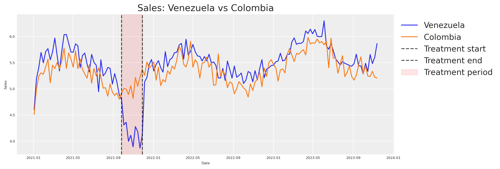
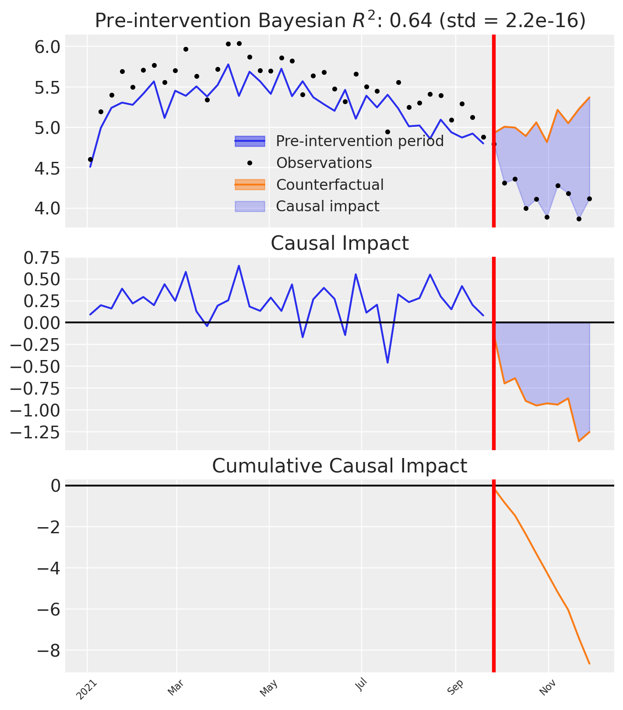
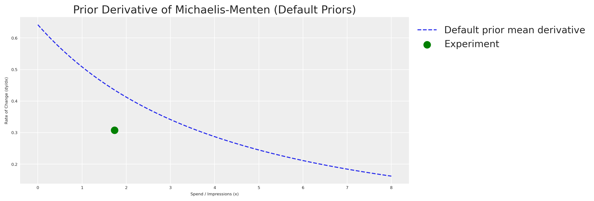
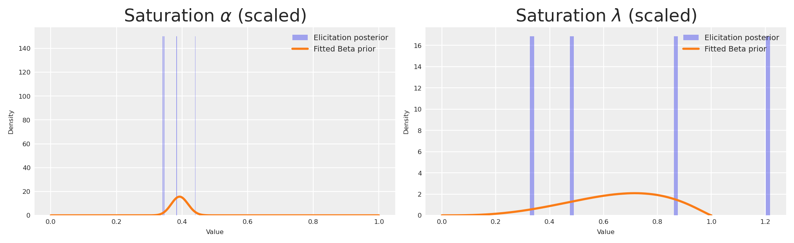
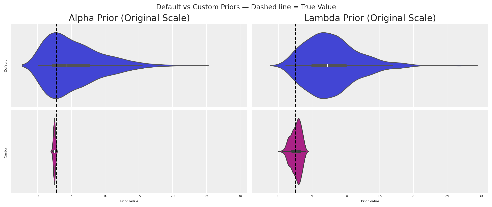

# De Experimentos a Priors: Elicitación de Priors Informativos para tu Marketing Mix Model – Blog de Ciencia del Marketing

> Cómo traducir resultados cuasi-experimentales en priors bayesianos informativos para tu MMM usando CausalPy y PyMC-Marketing.

By Carlos Trujillo

Source: https://cetagostini.github.io/es/articles/from_experiments_to_priors/from_experiments_to_priors.html

# Introducción

Si has trabajado con Marketing Mix Models el tiempo suficiente, has escuchado el término *calibración* — la idea de que los modelos por sí solos no son suficientes y que la evidencia externa debería afinar sus estimaciones. En PyMC-Marketing, la calibración ya tiene un significado preciso: el método [`add_lift_test_measurements`](https://www.pymc-marketing.io/en/stable/notebooks/mmm/mmm_lift_test.html) agrega observaciones experimentales directamente a la **verosimilitud del modelo**, tratándolas como datos adicionales que el modelo debe explicar durante el muestreo.

Pero hay otra forma de dejar que los experimentos informen a tu modelo — una que opera en una etapa diferente de la inferencia bayesiana. En lugar de enriquecer la verosimilitud, podemos usar los resultados experimentales para **elicitar priors informativos** sobre los parámetros de saturación (ver el recuadro más abajo para la distinción precisa).

Antes de sumergirnos, arraigémonos en el objetivo central de cualquier estrategia de medición de marketing: entender el **impacto incremental** de campañas y acciones. La búsqueda de esa respuesta dio origen a cookies, píxeles y un zoológico de identificadores a nivel de usuario en la web. Ahora, a medida que esas herramientas desaparecen bajo una regulación de privacidad más estricta, han surgido nuevos métodos estadísticos para llenar el vacío.

El Marketing Mix Modeling, junto con experimentos aleatorizados y cuasi-experimentos, son los principales contendientes. Sin embargo, medir cómo la publicidad moldea las decisiones humanas es inherentemente difícil. La metodología que elijas — y las condiciones bajo las que la apliques — pueden llevar a lecturas muy diferentes de la realidad.

**¿Cómo podemos alinear modelos que miden diferentes facetas de un mismo fenómeno multifacético?** ¿Podemos consolidar el conocimiento previo de experimentos en una sola metodología con principios sólidos?

Este artículo explora la **elicitation de priors a partir de experimentos** — un pipeline completamente bayesiano que traduce evidencia causal en priors informativos, propagando incertidumbre de extremo a extremo. Usaremos la API más reciente del MMM multidimensional de [PyMC-Marketing](https://www.pymc-marketing.io) y [CausalPy](https://causalpy.readthedocs.io) para la pieza de inferencia causal.

Elicitación de priors vs calibración de verosimilitud

El [`add_lift_test_measurements`](https://www.pymc-marketing.io/en/stable/notebooks/mmm/mmm_lift_test.html) de PyMC-Marketing incorpora evidencia experimental como un **término de verosimilitud** adicional — el experimento se convierte en datos observados que el modelo debe explicar durante el muestreo. Esta es la *calibración* en el sentido estricto: las observaciones experimentales entran en P(\text{data} \mid \theta).

El enfoque de este artículo es diferente. Usamos el resultado experimental para **elicitar priors informativos** sobre los parámetros de saturación. Un pequeño modelo bayesiano traduce la observación experimental en un posterior completo sobre (\alpha, \lambda), que luego se convierte en el prior para el MMM. El conocimiento experimental entra a través de P(\theta).

Ambos enfoques son válidos y complementarios. La calibración de verosimilitud es poderosa cuando tienes múltiples pruebas de incremento y quieres que restrinjan directamente al modelo durante la inferencia. La elicitation de priors es valiosa cuando quieres codificar el conocimiento experimental como creencias previas — preservando la distinción entre lo que sabes antes de ver la serie temporal y lo que la serie temporal misma te enseña.

Este artículo te guiará a través de:

- Configurar un cuasi-experimento de **Control Sintético** con **CausalPy** para estimar un efecto causal específico.
- Traducir el resultado experimental al espacio de derivadas de nuestra función de saturación.
- Construir un pequeño **modelo de elicitation de priors de PyMC** que convierta la observación experimental en un posterior completo sobre los parámetros de saturación.
- Usar ese posterior de elicitation como priors informativos en el **MMM multidimensional** de `pymc-marketing`.
- Comparar un modelo genérico (priors por defecto) contra el modelo informado por experimentos.

# Caso de negocio

*Imagina esto*: tu empresa decide recortar su presupuesto publicitario en **Venezuela** entre finales de marzo y principios de mayo. Como marketero te rascas la cabeza — ¿esto perjudicó las ventas? ¿En cuánto?

Antes de recurrir a técnicas complejas, pensemos en cómo *medir* esta acción específica. Podemos desentrañar el misterio a través del poder de los experimentos.

Aunque el gasto cayó en **Venezuela**, la empresa mantuvo su publicidad habitual en otros países. Esto nos da una oportunidad única de asomarnos a una realidad alternativa — ¿qué *habría* pasado si no se hubiera recortado el gasto?

Elijamos a **Colombia** — un país donde la publicidad continuó sin cambios durante el mismo periodo — como nuestro grupo de control. ¿Por qué Colombia? La hipótesis es que Venezuela y Colombia están expuestas a factores macroeconómicos similares: ambas están en el norte de Sudamérica, comparten climas similares y poblaciones con traslape cultural, y fueron literalmente el mismo país hace menos de dos siglos. Podemos tratarlas como *representativamente similares*.

\text{Venezuela Sales} = \text{Colombia Sales} \cdot \beta + \text{Venezuela Exogenous Variables}

Si asumimos esta relación, obtenemos la siguiente estructura causal:

- Factores compartidos (clima, estacionalidad, macro-tendencias) impulsan las ventas de **ambos** países.
- Las variables exógenas específicas de cada país afectan solo a un país.
- Durante la ventana de tratamiento, el gasto en medios de Venezuela cae — pero el de Colombia no.

<figure class="figure">

<figcaption>Estructura causal del cuasi-experimento</figcaption>
</figure>

Nota

Esta metodología no se limita a países. Funciona igualmente bien para regiones o ciudades, siempre que tengas supuestos consistentes respaldados por datos. Además, la serie temporal de control *no* debe verse afectada por la intervención que se está midiendo. Aquí no estamos considerando efectos de derrame.

Al comparar las dos realidades — la Venezuela observada (tratamiento) versus la Venezuela contrafactual (estimada vía Colombia) — podemos medir directamente lo que se perdió al detener el marketing. Y esta es precisamente la clase de evidencia que, al traducirse en priors bayesianos informativos, hace que nuestro Marketing Mix Model sea sustancialmente más preciso.

Es hora de conocer tu herramienta favorita para este trabajo: [CausalPy](https://causalpy.readthedocs.io/en/latest/).

**CausalPy** es una biblioteca del ecosistema PyMC diseñada para facilitar análisis de inferencia causal. Usando CausalPy podemos explorar diferentes métodos cuasi-experimentales para medir causalmente el efecto de nuestras acciones en ausencia de experimentos naturales o aleatorizados.

Pongámonos en acción.

# Primeros pasos

Este cuaderno asume familiaridad con los fundamentos de PyMC-Marketing. Si eres nuevo, el [cuaderno de ejemplo de Marketing Mix Modeling](https://www.pymc-marketing.io/en/stable/notebooks/mmm/mmm_example.html) es un excelente punto de partida. Antes de comenzar, asegúrate de tener ambas bibliotecas instaladas:

Comando de instalación

`pip install pymc-marketing causalpy`

- [Instrucciones de instalación de PyMC-Marketing](https://www.pymc-marketing.io/en/stable/installation.html)
- [Instrucciones de instalación de CausalPy](https://causalpy.readthedocs.io/en/latest/installation.html)

Comenzaremos importando las bibliotecas necesarias para modelado bayesiano, inferencia causal y visualización.

Código

``` sourceCode
import warnings
warnings.filterwarnings("ignore")

# Domain-specific / PyMC ecosystem
from pymc_marketing.mmm import GeometricAdstock, MichaelisMentenSaturation
from pymc_marketing.mmm.multidimensional import MMM
from pymc_extras.prior import Prior
import causalpy as cp
import pymc as pm
import arviz as az
import preliz as pz

# Visualization
import matplotlib.pyplot as plt
import seaborn as sns

# Scientific computing
import numpy as np
import pandas as pd
from scipy import stats as sp_stats

# PyTensor (automatic differentiation)
import pytensor
import pytensor.tensor as pt
from pytensor import function as pytensor_function

az.style.use("arviz-darkgrid")
plt.rcParams["figure.figsize"] = [8, 4]
plt.rcParams["figure.dpi"] = 100
plt.rcParams["axes.labelsize"] = 6
plt.rcParams["xtick.labelsize"] = 6
plt.rcParams["ytick.labelsize"] = 6
plt.rcParams.update({"figure.constrained_layout.use": True})

%load_ext autoreload
%autoreload 2
%config InlineBackend.figure_format = "retina"

seed: int = sum(map(ord, "calibrating mmm with experiments"))
rng: np.random.Generator = np.random.default_rng(seed=seed)
pd.DataFrame({"seed": [seed]}).head()
```

|     | seed |
|-----|------|
| 0   | 3223 |

# Entendiendo nuestro conjunto de datos

Construiremos un conjunto de datos sintético para que todo el análisis sea autocontenido y reproducible. Los datos imitan un escenario de marketing realista con dos países y dos canales publicitarios.

Los parámetros de verdad de referencia que incrustamos en el proceso de generación de datos servirán más tarde como nuestro criterio de evaluación para qué tan bien los priors informados por experimentos recuperan la realidad.

Código

``` sourceCode
n_weeks: int = 150

min_date = pd.to_datetime("2021-01-01")
date_range = pd.date_range(start=min_date, periods=n_weeks, freq="W")

df = pd.DataFrame(data={"ds": date_range}).assign(
    year=lambda x: x["ds"].dt.year,
    week=lambda x: x["ds"].dt.isocalendar().week.astype(int),
)

n = df.shape[0]
pd.DataFrame({"n_observations": [n]}).head()
```

|     | n_observations |
|-----|----------------|
| 0   | 150            |

Ahora definamos los **parámetros verdaderos** que gobiernan la relación entre gasto en medios y ventas. Usaremos la función de saturación de Michaelis-Menten:

f(x) = \frac{\alpha \cdot x}{\lambda + x}

donde:

- \alpha es el efecto máximo alcanzable (la asíntota)
- \lambda es el punto de media saturación (el nivel de gasto en el que alcanzamos la mitad del efecto máximo)

Código

``` sourceCode
# True saturation parameters
TRUE_ALPHA_META: float = 2.75
TRUE_LAM_META: float = 2.50
TRUE_ALPHA_GOOGLE: float = 2.00
TRUE_LAM_GOOGLE: float = 3.00

# True adstock parameter (geometric decay)
TRUE_ADSTOCK_ALPHA_META: float = 0.6
TRUE_ADSTOCK_ALPHA_GOOGLE: float = 0.4

# Intercept and scale
INTERCEPT: float = 3.0

# Reusable instances for the data-generation process
dgp_adstock = GeometricAdstock(l_max=4)
dgp_saturation = MichaelisMentenSaturation()
```

Generemos el gasto en medios para cada canal. Suavizamos las muestras brutas con una convolución para obtener patrones de gasto semanal de apariencia realista.

Código

``` sourceCode
SMOOTHING_WINDOW: int = 8

# Meta spend (with a treatment dip in Venezuela)
pz_meta_raw = pz.Gamma(mu=3, sigma=1).rvs(n, random_state=rng)
pz_meta_smooth = np.convolve(pz_meta_raw, np.ones(SMOOTHING_WINDOW) / SMOOTHING_WINDOW, mode="same")
pz_meta_smooth[:SMOOTHING_WINDOW] = pz_meta_smooth[SMOOTHING_WINDOW:2 * SMOOTHING_WINDOW].mean()
pz_meta_smooth[-SMOOTHING_WINDOW:] = pz_meta_smooth[-2 * SMOOTHING_WINDOW:-SMOOTHING_WINDOW].mean()

# Google spend (unchanged throughout)
pz_google_raw = pz.Gamma(mu=2, sigma=0.8).rvs(n, random_state=rng)
pz_google_smooth = np.convolve(pz_google_raw, np.ones(SMOOTHING_WINDOW) / SMOOTHING_WINDOW, mode="same")
pz_google_smooth[:SMOOTHING_WINDOW] = pz_google_smooth[SMOOTHING_WINDOW:2 * SMOOTHING_WINDOW].mean()
pz_google_smooth[-SMOOTHING_WINDOW:] = pz_google_smooth[-2 * SMOOTHING_WINDOW:-SMOOTHING_WINDOW].mean()

# Trend component
trend = np.linspace(0, 0.5, n)

# Seasonality component
seasonality = 0.3 * np.sin(2 * np.pi * np.arange(n) / 52)

# Shared base for both countries
shared_base = INTERCEPT + trend + seasonality

start_date = pd.to_datetime("2021-09-26")
end_date = pd.to_datetime("2021-11-28")

treatment_mask = (date_range >= start_date) & (date_range <= end_date)

# Venezuela meta spend: drops during treatment
meta_venezuela = pz_meta_smooth.copy()
meta_venezuela[treatment_mask] *= 0.1  # 90% reduction

# Apply adstock + saturation with TRUE parameters
meta_ve_adstocked = dgp_adstock.function(x=meta_venezuela, alpha=TRUE_ADSTOCK_ALPHA_META).eval()
meta_ve_saturated = dgp_saturation.function(x=meta_ve_adstocked, alpha=TRUE_ALPHA_META, lam=TRUE_LAM_META).eval()

google_adstocked = dgp_adstock.function(x=pz_google_smooth, alpha=TRUE_ADSTOCK_ALPHA_GOOGLE).eval()
google_saturated = dgp_saturation.function(x=google_adstocked, alpha=TRUE_ALPHA_GOOGLE, lam=TRUE_LAM_GOOGLE).eval()

# Colombia: same media but NO treatment reduction
meta_co_adstocked = dgp_adstock.function(x=pz_meta_smooth, alpha=TRUE_ADSTOCK_ALPHA_META).eval()
meta_co_saturated = dgp_saturation.function(x=meta_co_adstocked, alpha=TRUE_ALPHA_META * 0.9, lam=TRUE_LAM_META * 1.1).eval()

google_co_saturated = dgp_saturation.function(x=google_adstocked, alpha=TRUE_ALPHA_GOOGLE * 0.85, lam=TRUE_LAM_GOOGLE * 1.05).eval()

# Noise
noise_ve = pz.Normal(0, 0.15).rvs(n, random_state=rng)
noise_co = pz.Normal(0, 0.15).rvs(n, random_state=np.random.default_rng(seed + 1))

# Sales
venezuela_sales = shared_base + meta_ve_saturated + google_saturated + noise_ve
colombia_sales = shared_base * 1.05 + meta_co_saturated + google_co_saturated + noise_co

# Assemble the DataFrame
df = df.assign(
    venezuela=venezuela_sales,
    colombia=colombia_sales,
    meta=meta_venezuela,
    google=pz_google_smooth,
    trend=trend,
)
```

Ahora la parte crítica: el gasto en medios de Venezuela cae durante la ventana de tratamiento, mientras que la publicidad de Colombia continúa sin cambios. Necesitamos verificar que ambos países se comporten de manera suficientemente similar para justificar nuestra suposición contrafactual.

Código

``` sourceCode
fig, ax = plt.subplots(figsize=(12, 4))
sns.lineplot(x="ds", y="venezuela", data=df, ax=ax, label="Venezuela", color="C0")
sns.lineplot(x="ds", y="colombia", data=df, ax=ax, label="Colombia", color="C1")
ax.axvline(start_date, color="black", linestyle="--", alpha=0.7, label="Treatment start")
ax.axvline(end_date, color="black", linestyle="--", alpha=0.7, label="Treatment end")
ax.axvspan(start_date, end_date, alpha=0.1, color="red", label="Treatment period")
ax.set(title="Sales: Venezuela vs Colombia", xlabel="Date", ylabel="Sales")
ax.legend(loc="upper left", bbox_to_anchor=(1, 1))
plt.show()
```

<figure class="figure">
<p></p>
</figure>

Observa cómo las ventas de Venezuela y Colombia se mueven sincronizadas hasta justo antes del periodo de intervención (marcado por las líneas verticales), donde Venezuela parece descender mientras que Colombia continúa su trayectoria normal.

Nota

Esta alineación visual valida nuestra hipótesis de que ambos países comparten factores comunes. Si las dos series fueran muy diferentes antes del tratamiento, no tendríamos razón para usar Colombia como contrafactual.

Podemos ver que *algo* sucedió. Pero ¿cómo lo cuantificamos?

# Estimando el efecto causal con CausalPy

Volteemos a la clase `SyntheticControl` de `CausalPy`. La idea es simple: construir una *versión sintética* de Venezuela a partir de la unidad de control (Colombia), y luego comparar ese contrafactual sintético contra lo que realmente sucedió. La brecha entre ambos es nuestro efecto causal.

La clase `SyntheticControl` requiere:

- `data`: Un DataFrame indexado por fecha con columnas para cada unidad.
- `treatment_time`: La fecha en que se aplicó el tratamiento.
- `control_units`: Los nombres de las columnas de las unidades de control (donantes).
- `treated_units`: Los nombres de las columnas de las unidades tratadas.
- `model`: Un modelo bayesiano de ponderación (por ejemplo, `WeightedSumFitter`).

Código

``` sourceCode
experiment = cp.SyntheticControl(
    df.query(f"ds<='{end_date}'").set_index("ds")[["venezuela", "colombia"]],
    start_date,
    control_units=["colombia"],
    treated_units=["venezuela"],
    model=cp.pymc_models.WeightedSumFitter(
        sample_kwargs={
            "random_seed": seed,
            "target_accept": 0.95,
            "draws": 250,
        }
    ),
)

fig, ax = experiment.plot()
plt.xticks(rotation=45, fontsize=8)
plt.show()
```

```
```

<figure class="figure">
<p></p>
</figure>

Desglosemos lo que vemos en los tres subgráficos:

1.  **Panel superior**: Ventas observadas de Venezuela versus el contrafactual sintético construido a partir de Colombia. Antes de la intervención, el sintético rastrea de cerca la realidad; después de la intervención se abre un espacio visible — la divergencia entre el sintético y lo observado.

2.  **Panel central**: El impacto causal puntual — la diferencia entre lo observado y lo sintético en cada paso temporal. Cerca de cero antes de la intervención; claramente negativo después.

3.  **Panel inferior**: El impacto causal acumulado — el total acumulado de las diferencias puntuales a lo largo del tiempo.

Estas tres vistas nos permiten tanto *visualizar* como *cuantificar* el impacto de nuestra acción.

Para atribuir el cambio observado a nuestra reducción publicitaria, debemos asegurar que el modelo controle todos los factores relevantes. Nuestros datos sintéticos fueron diseñados con esto en mente (basados en el DAG anterior), pero en situaciones del mundo real necesitas incluir unidades donantes adicionales y covariables que den cuenta de los factores de confusión que podrían surgir durante un experimento.

Principio clave

Si hay otra explicación plausible para el cambio, no podemos atribuirlo con confianza a nuestra acción.

Lectura recomendada para validar tu modelo causal antes del experimento:

1.  [Bayesian Power Analysis en CausalPy](https://github.com/pymc-labs/CausalPy/issues/276)
2.  [A/A Test with PyMC](https://juanitorduz.github.io/time_based_regression_pymc/)

Tenemos el resultado de CausalPy. Ahora necesitamos extraer el efecto acumulado total — el delta total perdido debido a nuestra acción — junto con su **incertidumbre**. En lugar de colapsar el posterior en una sola media, mantenemos la distribución completa a través de las muestras MCMC y calculamos el Intervalo de Densidad Máxima (HDI) del 95%.

Código

``` sourceCode
post_impact_unit = experiment.post_impact.isel(treated_units=0)
obs_dim = [d for d in post_impact_unit.dims if d not in ("chain", "draw")][0]

# Full posterior of total causal effect (sum of pointwise impacts per MCMC draw)
total_effect_per_draw = post_impact_unit.sum(dim=obs_dim)
total_effect_samples = total_effect_per_draw.values.flatten()

detected_effect = total_effect_samples.mean()
effect_hdi = az.hdi(total_effect_samples, hdi_prob=0.95)
detected_effect_lower, detected_effect_upper = effect_hdi

pd.DataFrame({
    "Detected cumulative effect (mean)": [round(detected_effect, 2)],
    "95% HDI lower": [round(detected_effect_lower, 2)],
    "95% HDI upper": [round(detected_effect_upper, 2)],
}).head()
```

|     | Detected cumulative effect (mean) | 95% HDI lower | 95% HDI upper |
|-----|-----------------------------------|---------------|---------------|
| 0   | -8.65                             | -8.65         | -8.65         |

Hemos observado una disminución en las ventas de Venezuela después de reducir el gasto en meta. Esta disminución representa el *delta de contribución perdido* de nuestras actividades de marketing. Crucialmente, el HDI del 95% captura la incertidumbre en esa estimación — y llevaremos esta incertidumbre a lo largo de todo el camino hasta nuestras distribuciones prior.

Ahora, este delta en ventas fue *causado* por un delta en gasto publicitario. Para cuantificar el cambio en gasto comparamos el **gasto contrafactual** (lo que se habría gastado sin la intervención) contra el **gasto real** durante la ventana de tratamiento.

Código

``` sourceCode
# Counterfactual spend: average weekly meta spend before the intervention
pre_treatment_meta = df.loc[df["ds"] < start_date, "meta"]
counterfactual_spend_per_week = pre_treatment_meta.mean()

# Actual spend during the treatment (already reduced by ~90%)
treatment_meta = df.loc[treatment_mask, "meta"]
actual_spend_per_week = treatment_meta.mean()

n_treatment_weeks = int(treatment_mask.sum())

# Total spend reduction over the treatment window
total_delta_spend = (counterfactual_spend_per_week - actual_spend_per_week) * n_treatment_weeks

pd.DataFrame({
    "Counterfactual spend/week": [round(counterfactual_spend_per_week, 4)],
    "Actual spend/week": [round(actual_spend_per_week, 4)],
    "Treatment weeks": [n_treatment_weeks],
    "Total spend reduction": [round(total_delta_spend, 4)],
}).head()
```

|  | Counterfactual spend/week | Actual spend/week | Treatment weeks | Total spend reduction |
|----|----|----|----|----|
| 0 | 3.1395 | 0.3319 | 10 | 28.076 |

La reducción total de gasto durante la ventana de tratamiento, junto con el impacto acumulado en ventas, nos da un par emparejado de deltas.

Supuesto: gasto contrafactual estacionario

El gasto contrafactual se estima como la media pre-tratamiento del gasto en medios. Esto asume que el gasto era aproximadamente estacionario antes de la intervención — es decir, no había tendencia en el gasto en medios. Si el gasto estaba en tendencia ascendente o descendente antes del tratamiento, la media pre-tratamiento subestimaría o sobreestimaría el verdadero contrafactual, sesgando el cálculo de \Delta X. En la práctica, inspecciona la serie de gasto en busca de tendencias y considera usar un pronóstico ajustado por tendencia si es necesario.

Importante

La reducción total de gasto (\Delta X) y el impacto total en ventas (\Delta Y) forman un par de coordenadas único en el espacio de derivadas de nuestra función de saturación: la coordenada x es el punto medio entre los niveles de gasto contrafactual y real, y la coordenada y es la tasa de cambio promedio \Delta Y / \Delta X.

Esto es excelente. Con un solo experimento tenemos una estimación concreta del impacto incremental. Pero un solo evento en un momento específico no captura el comportamiento *a lo largo del tiempo*. El momento de nuestro análisis influye en los resultados.

*Aquí es precisamente donde necesitamos un Marketing Mix Model* — un marco metodológico que nos permite entender los efectos incrementales a lo largo de varios periodos. Los experimentos nos dan un ancla de prior; el MMM nos da la imagen dinámica completa.

# Del experimento a los priors de saturación

Para ir de una sola observación experimental a una curva de saturación completa, necesitamos entender la relación entre nuestras variables.

Nuestro supuesto: los efectos de marketing se saturan siguiendo la ecuación de **Michaelis-Menten**, y el carryover sigue un **decaimiento geométrico**. Bajo este supuesto, el punto de dato experimental — el cambio en Y dado un cambio en X — vive en algún lugar de la derivada de nuestra función de saturación.

f(x) = \frac{\alpha \cdot x}{\lambda + x}

La derivada con respecto a x:

f'(x) = \frac{\alpha \cdot \lambda}{(\lambda + x)^2}

Esta derivada nos dice la *tasa de cambio* en el eje Y para un valor dado en X.

Dado que `MichaelisMentenSaturation.function()` está construida a partir de operaciones estándar de PyTensor, podemos usar **diferenciación automática** (`pt.grad`) para calcular la derivada — sin necesidad de fórmula manual. Envolvermos esto en una sola función `saturation_derivative` que funciona en dos contextos: pasa un `pt.dvector` y compílalo para evaluación numérica rápida (graficación), o pasa un valor `pytensor.shared` junto con variables aleatorias de PyMC y úsalo directamente dentro de un modelo. Si cambias la función de saturación, cada cálculo downstream se actualiza automáticamente.

``` sourceCode
sat = MichaelisMentenSaturation()


def saturation_derivative(x, alpha, lam):
    """Auto-diff derivative of the saturation function.

    x can be a pt.dvector (plotting), or a pytensor.shared (PyMC models).
    alpha, lam can be symbolic variables or PyMC random variables.
    """
    f = sat.function(x, alpha, lam)
    return pt.grad(f.sum(), x)


# Compiled function for numerical evaluation (plotting)
_x_v = pt.dvector("x")
_alpha_s = pt.dscalar("alpha")
_lam_s = pt.dscalar("lam")

derivative_michaelis_menten = pytensor_function(
    [_x_v, _alpha_s, _lam_s],
    saturation_derivative(_x_v, _alpha_s, _lam_s),
)

x_test = np.array([0.5, 1.0, 2.0, 4.0])
derivs = derivative_michaelis_menten(x_test, 2.75, 2.50)
pd.DataFrame({"x": x_test, "f'(x)": np.round(derivs, 4)}).head()
```

|     | x   | f'(x)  |
|-----|-----|--------|
| 0   | 0.5 | 0.7639 |
| 1   | 1.0 | 0.5612 |
| 2   | 2.0 | 0.3395 |
| 3   | 4.0 | 0.1627 |

Tenemos las ventas perdidas totales y el gasto perdido total durante la ventana de tratamiento. Para ubicar nuestro experimento en el espacio de derivadas, calculamos la **tasa de cambio promedio** — impacto total en ventas dividido por la reducción total de gasto — y la evaluamos en el **punto medio** entre los niveles de gasto contrafactual y real.

Nuanza teórica: Secante vs Tangente

Esta es una aproximación basada en el Teorema del Valor Medio. Dado que la curva de Michaelis-Menten es cóncava, la pendiente de la línea secante (tasa de cambio promedio sobre la caída de gasto) es solo una aproximación de la línea tangente instantánea (f'(x)) en el punto medio exacto. Además, medir caídas de ventas en una ventana temporal fija significa que podríamos no capturar la caída completa en estado estable si los efectos de adstock (carryover) son duraderos. Para nuestros propósitos, sirve como un ancla excelente, pero es importante reconocer la mecánica subyacente.

Gasto bruto vs gasto con adstock

El \Delta X experimental se calcula a partir del gasto en medios **bruto**, pero la función de saturación del MMM opera sobre el gasto con **adstock** — la señal después de aplicar el decaimiento geométrico. Esto significa que el sistema de coordenadas de nuestra observación experimental (unidades de gasto bruto) no se alinea perfectamente con el sistema de coordenadas de la curva de saturación (unidades de gasto con adstock).

Esta aproximación es más sostenible cuando el efecto de adstock es leve (parámetro de decaimiento bajo \alpha), porque la señal con adstock se mantiene cercana a la señal bruta. Bajo adstock pesado (\alpha alto, l\_{\text{max}} largo), la transformación puede comprimir y desplazar significativamente la distribución de gasto, haciendo del punto medio de gasto bruto un ancla menos precisa. El enfoque sigue siendo direccionalmente válido — el experimento aún proporciona información causal genuina sobre el régimen de saturación — pero los profesionales deben ser conscientes de que la alineación se degrada a medida que los efectos de carryover se hacen más fuertes.

Código

``` sourceCode
# Full posterior of rate of change
rate_of_change_samples = np.abs(total_effect_samples) / total_delta_spend
average_rate_of_change = rate_of_change_samples.mean()
rate_of_change_std = rate_of_change_samples.std()

# HDI directly from the rate-of-change posterior
rate_hdi = az.hdi(rate_of_change_samples, hdi_prob=0.95)
rate_of_change_lower, rate_of_change_upper = rate_hdi

# Midpoint of the two spend levels (counterfactual vs actual)
x_midpoint = (counterfactual_spend_per_week + actual_spend_per_week) / 2

pd.DataFrame({
    "Average rate of change (dy/dx)": [round(average_rate_of_change, 4)],
    "Std": [round(rate_of_change_std, 4)],
    "95% HDI lower": [round(rate_of_change_lower, 4)],
    "95% HDI upper": [round(rate_of_change_upper, 4)],
    "X midpoint": [round(x_midpoint, 4)],
}).head()

fig, ax = plt.subplots()
yerr_low = max(0, average_rate_of_change - rate_of_change_lower)
yerr_high = max(0, rate_of_change_upper - average_rate_of_change)
ax.errorbar(
    x_midpoint, average_rate_of_change,
    yerr=[[yerr_low], [yerr_high]],
    fmt="o", color="green", capsize=6, capthick=2, markersize=10, zorder=5,
    label="Experiment (95% HDI)",
)
ax.set(
    xlabel="Spend / Impressions (x)",
    ylabel="Rate of Change (dy/dx)",
    title="Experiment coordinates in derivative space",
)
ax.legend(loc="upper left", bbox_to_anchor=(1, 1))
plt.show()
```

<figure class="figure">
<p></p>
</figure>

Ahora que tenemos nuestra observación experimental en el espacio de derivadas, podemos estimar los **parámetros de saturación** \alpha y \lambda que son consistentes con esta evidencia.

El problema de identificación

Matemáticamente, un solo punto en el espacio de derivadas no puede identificar de forma única una curva de dos parámetros (\alpha y \lambda). Existe una familia infinita de curvas que pueden pasar por esta tasa de cambio exacta en este nivel de gasto exacto. Un optimizador por punto devolvería solo *una* de ellas y descartaría toda esa degeneración. Al usar un modelo bayesiano en su lugar, el posterior captura naturalmente el panorama completo de combinaciones plausibles de (\alpha, \lambda) — incluyendo la correlación entre ellas. Este es exactamente el motivo por el que ajustamos un pequeño modelo de PyMC aquí en lugar de usar un optimizador por punto.

Construimos un pequeño modelo de PyMC cuya verosimilitud coincide con nuestra observación experimental. Los priors son half-normals débilmente informativos — positivos pero agnósticos — de modo que la observación experimental impulsa el posterior. El modelo dice: *“la derivada de Michaelis-Menten en nuestro punto medio de gasto, evaluada con \alpha y \lambda desconocidos, debería producir la tasa de cambio que observamos, con ruido igual a la desviación estándar experimental.”*

Código

``` sourceCode
x_range = np.linspace(0, 8, 200)

with pm.Model() as prior_elicitation_model:
    cal_alpha = pm.HalfNormal("cal_alpha", sigma=3)
    cal_lam = pm.HalfNormal("cal_lam", sigma=3)

    x_pt = pytensor.shared(np.float64(x_midpoint), name="x_eval")
    predicted_rate = saturation_derivative(x_pt, cal_alpha, cal_lam)

    pm.Normal(
        "obs",
        mu=predicted_rate,
        sigma=rate_of_change_std,
        observed=average_rate_of_change,
    )

    elicitation_idata = pm.sample(
        draws=250,
        random_seed=seed,
        target_accept=0.95,
    )

elic_alpha_posterior = elicitation_idata.posterior["cal_alpha"].values.flatten()
elic_lam_posterior = elicitation_idata.posterior["cal_lam"].values.flatten()
```

```
```

Como era de esperarse del problema de identificación anterior, el posterior conjunto de (\alpha, \lambda) exhibe una fuerte correlación. Para exponer esta geometría claramente, tomamos prestada una técnica del excelente [Geometric Intuition for Media Mix Models](https://daniel-saunders-phil.github.io/imagination_machine/posts/geometric-intuition-mmm/index.html) de Daniel Saunders: evaluamos el logaritmo de la verosimilitud en una grilla 2D y graficamos líneas de contorno — revelando la superficie característica con forma de **plátano**.

Código

``` sourceCode
alphas_grid = np.linspace(0.1, 10, 200)
lams_grid = np.linspace(0.1, 10, 200)
A_grid, L_grid = np.meshgrid(alphas_grid, lams_grid)

deriv_on_grid = (A_grid * L_grid) / (L_grid + x_midpoint) ** 2

log_lik_surface = sp_stats.norm(
    loc=deriv_on_grid, scale=rate_of_change_std
).logpdf(average_rate_of_change)

lik_peak = np.nanmax(log_lik_surface)
near_lik_mask = log_lik_surface >= lik_peak - 1.5
a_near_lik = A_grid[near_lik_mask]
l_near_lik = L_grid[near_lik_mask]

fig, ax = plt.subplots(figsize=(8, 5))
contour = ax.contour(A_grid, L_grid, log_lik_surface, levels=30)
ax.plot(
    a_near_lik, l_near_lik, "o",
    color="gold", alpha=0.12, markersize=3,
    label="Near-peak region",
)
ax.plot(TRUE_ALPHA_META, TRUE_LAM_META, "o", color="red", markersize=8, zorder=10)
ax.annotate(
    rf"True values ($\alpha$={TRUE_ALPHA_META}, $\lambda$={TRUE_LAM_META})",
    (TRUE_ALPHA_META, TRUE_LAM_META),
    xytext=(15, 15), textcoords="offset points", fontsize=8,
    arrowprops=dict(arrowstyle="->", color="red"), color="red",
)
plt.colorbar(contour, ax=ax, label="Log likelihood")
ax.set(
    xlabel=r"$\alpha$ (max effect)",
    ylabel=r"$\lambda$ (half-saturation)",
    title=r"Likelihood surface of $(\alpha, \lambda)$ — the banana-shaped geometry",
)
ax.legend(loc="upper right", fontsize=7)
plt.show()
```

<figure class="figure">
<p></p>
</figure>

El gráfico de contornos revela la geometría característica con forma de plátano que Daniel Saunders [describe tan bien](https://daniel-saunders-phil.github.io/imagination_machine/posts/geometric-intuition-mmm/index.html): existe una región extendida de verosimilitud casi equivalente donde un \alpha alto combinado con un \lambda alto produce una derivada similar a un \alpha bajo combinado con un \lambda bajo. Los marcadores dorados resaltan un amplio corredor de combinaciones de parámetros plausibles que los datos por sí solos no pueden distinguir.

Este es precisamente el insight que Daniel [transmite](https://daniel-saunders-phil.github.io/imagination_machine/posts/geometric-intuition-mmm/index.html): no es la *cantidad* de datos lo que resuelve el plátano, sino qué tan bien los datos están *distribuidos a lo largo de la curva de saturación*. Un solo experimento en un nivel de gasto nos deja con esta larga cresta de soluciones casi equivalentes. Los priors suaves e informados son los que recortan las colas implausibles — construyámoslos.

¡Ahora visualicemos la distribución a posteriori de las curvas de derivada contra la observación experimental!

Código

``` sourceCode
fig, ax = plt.subplots()

# Posterior fan: sample 200 curves from the joint posterior
n_curves = 200
idx = rng.choice(len(elic_alpha_posterior), n_curves, replace=False)
for i in idx:
    y_curve = derivative_michaelis_menten(x_range, elic_alpha_posterior[i], elic_lam_posterior[i])
    ax.plot(x_range, y_curve, color="C0", alpha=0.03)

# Posterior mean curve
mean_curve = derivative_michaelis_menten(
    x_range, elic_alpha_posterior.mean(), elic_lam_posterior.mean()
)
ax.plot(x_range, mean_curve, label="Posterior mean derivative", color="grey", linestyle="--")

ax.errorbar(
    x_midpoint, average_rate_of_change,
    yerr=[[yerr_low], [yerr_high]],
    fmt="o", color="green", capsize=6, capthick=2, markersize=8, zorder=5,
    label="Experiment (95% HDI)",
)
ax.set(
    xlabel="Spend / Impressions (x)",
    ylabel="Rate of Change (dy/dx)",
    title="Posterior Derivative Curves from Prior Elicitation Model",
)
ax.legend(loc="upper left", bbox_to_anchor=(1, 1))
plt.show()
```

<figure class="figure">
<p></p>
</figure>

Con el posterior de elicitation en mano, alimentemos este conocimiento en nuestro MMM.

# El MMM genérico

Primero, veamos qué sucede cuando construimos un modelo con **priors por defecto** — sin conocimiento experimental inyectado. Esta es nuestra línea base: el enfoque ingenuo.

``` sourceCode
X = df[["ds", "meta", "google", "trend"]].copy()
y = df["venezuela"].copy()
```

Creamos el modelo usando la clase **MMM multidimensional** de `pymc-marketing`. Aunque aquí tenemos un solo mercado (sin parámetro `dims`), la clase de `pymc_marketing.mmm.multidimensional` es el punto de entrada unificado para todos los modelos MMM.

``` sourceCode
adstock_generic = GeometricAdstock(
    priors={"alpha": Prior("Beta", alpha=2, beta=5, dims="channel")},
    l_max=4,
)

saturation_generic = MichaelisMentenSaturation(
    priors={
        "alpha": Prior("HalfNormal", sigma=1, dims="channel"),
        "lam": Prior("Gamma", mu=2, sigma=1, dims="channel"),
    },
)

generic_mmm = MMM(
    date_column="ds",
    target_column="venezuela",
    channel_columns=["meta", "google"],
    control_columns=["trend"],
    adstock=adstock_generic,
    saturation=saturation_generic,
    yearly_seasonality=4,
)
```

Examinemos los priors por defecto y visualicémoslos con PreliZ.

Código

``` sourceCode
prior_alpha = pz.HalfNormal(sigma=1)
prior_lam = pz.Gamma(mu=2, sigma=1)

fig, axes = plt.subplots(nrows=1, ncols=2, figsize=(10, 3))

# Plot Alpha Prior manually
x_alpha = np.linspace(0, 4, 1000)
y_alpha = prior_alpha.pdf(x_alpha)
axes[0].plot(x_alpha, y_alpha)
axes[0].fill_between(x_alpha, y_alpha, alpha=0.3)
axes[0].set(title="Saturation Alpha Prior", xlabel="Value", ylabel="Density")

# Plot Lambda Prior manually
x_lam = np.linspace(0, 8, 1000)
y_lam = prior_lam.pdf(x_lam)
axes[1].plot(x_lam, y_lam)
axes[1].fill_between(x_lam, y_lam, alpha=0.3)
axes[1].set(title="Saturation Lambda Prior", xlabel="Value", ylabel="Density")

plt.show()
```

<figure class="figure">
<p></p>
</figure>

Nota

Al usar priors Gamma y HalfNormal imponemos estructura — restringiendo estos parámetros a ser positivos. Pero las distribuciones son bastante amplias. Veamos cómo su media se compara con nuestro experimento.

Muestreamos del prior y visualizamos la derivada de la función de Michaelis-Menten implícita en esos priors por defecto.

Código

``` sourceCode
generic_mmm.build_model(X, y)

with generic_mmm.model:
    prior_predictive = pm.sample_prior_predictive(
        random_seed=seed,
        var_names=["saturation_alpha", "saturation_lam"],
    )

prior_alpha_mean = prior_predictive.prior["saturation_alpha"].mean().item()
prior_lambda_mean = prior_predictive.prior["saturation_lam"].mean().item()

x_values = np.linspace(0, 8, 500)
prior_mm_mean_derivative = derivative_michaelis_menten(
    x_values,
    prior_alpha_mean * df.venezuela.max(),
    prior_lambda_mean * df.meta.max(),
)

fig, ax = plt.subplots(figsize=(12, 4))
ax.plot(
    x_values, prior_mm_mean_derivative,
    color="C0", label="Default prior mean derivative", linestyle="--",
)
ax.scatter(
    x_midpoint, abs(average_rate_of_change),
    color="green", label="Experiment", s=100, zorder=5,
)
ax.set(
    xlabel="Spend / Impressions (x)",
    ylabel="Rate of Change (dy/dx)",
    title="Prior Derivative of Michaelis-Menten (Default Priors)",
)
ax.legend(loc="upper left", bbox_to_anchor=(1, 1))
plt.show()
```

<figure class="figure">
<p></p>
</figure>

Como era de esperarse, la derivada del prior por defecto está **lejos de nuestro experimento**. El modelo no tiene conocimiento del comportamiento real de saturación — está trabajando con una conjetura vaga e informada. Esta es nuestra motivación para elicitar priors informados por experimentos.

# El MMM informado por experimentos

Ahora transformemos el posterior de elicitation en priors informativos para el MMM. PyMC-Marketing internamente escala los datos usando Max Abs Scaler. Esto significa que los valores se dividen por su máximo. Dado que \alpha vive en el eje Y (ventas) y \lambda en el eje X (gasto), escalamos todo el posterior en consecuencia, y luego extraemos el HDI del 95% como los límites para `find_constrained_prior`.

Código

``` sourceCode
y_max = df.venezuela.max()
x_max = df.meta.max()

# Scale the full posterior
scaled_alpha_samples = elic_alpha_posterior / y_max
scaled_lam_samples = elic_lam_posterior / x_max

# HDI of the scaled posteriors
scaled_alpha_hdi = az.hdi(scaled_alpha_samples, hdi_prob=0.95)
scaled_lam_hdi = az.hdi(scaled_lam_samples, hdi_prob=0.95)

scaled_alpha_lower, scaled_alpha_upper = scaled_alpha_hdi
scaled_lam_lower, scaled_lam_upper = scaled_lam_hdi

pd.DataFrame({
    "Parameter": ["alpha (scaled)", "lambda (scaled)"],
    "Mean": [round(scaled_alpha_samples.mean(), 4), round(scaled_lam_samples.mean(), 4)],
    "95% HDI lower": [round(scaled_alpha_lower, 4), round(scaled_lam_lower, 4)],
    "95% HDI upper": [round(scaled_alpha_upper, 4), round(scaled_lam_upper, 4)],
}).head()
```

|     | Parameter       | Mean   | 95% HDI lower | 95% HDI upper |
|-----|-----------------|--------|---------------|---------------|
| 0   | alpha (scaled)  | 0.3779 | 0.3409        | 0.4409        |
| 1   | lambda (scaled) | 0.7252 | 0.3269        | 1.2171        |

Los valores posteriores escalados caen dentro de \[0, 1\], haciendo de la distribución Beta una elección natural. Usamos `find_constrained_prior` de PyMC para identificar parámetros Beta que concentren el 95% de su masa dentro del HDI del posterior de elicitation.

Posterior como prior: un pipeline completamente bayesiano

Los límites que pasamos a `find_constrained_prior` provienen directamente del **posterior** del modelo de elicitation, que ya capturó el ruido experimental y la correlación estructural entre \alpha y \lambda. Cada fuente de incertidumbre fluye naturalmente del experimento → modelo de elicitation → prior del MMM.

Código

``` sourceCode
alpha_custom_prior = pm.find_constrained_prior(
    pm.Beta,
    lower=max(scaled_alpha_lower, 0.01),
    upper=min(scaled_alpha_upper, 0.99),
    mass=0.95,
    init_guess={"alpha": 2, "beta": 2},
)

lam_custom_prior = pm.find_constrained_prior(
    pm.Beta,
    lower=max(scaled_lam_lower, 0.01),
    upper=min(scaled_lam_upper, 0.99),
    mass=0.95,
    init_guess={"alpha": 3, "beta": 3},
)

pd.DataFrame({
    "Parameter": ["saturation_alpha", "saturation_lam"],
    "Beta alpha": [round(alpha_custom_prior["alpha"], 4), round(lam_custom_prior["alpha"], 4)],
    "Beta beta": [round(alpha_custom_prior["beta"], 4), round(lam_custom_prior["beta"], 4)],
}).head()
```

|     | Parameter        | Beta alpha | Beta beta |
|-----|------------------|------------|-----------|
| 0   | saturation_alpha | 144.7220   | 223.4610  |
| 1   | saturation_lam   | 4.0365     | 2.2068    |

Verifiquemos que las distribuciones Beta ajustadas reproduzcan fielmente el posterior de elicitation. Superponemos la PDF Beta sobre un histograma de las muestras posteriores escaladas — si ambas coinciden, podemos confiar en que la transferencia de información del experimento al prior del MMM es fiel.

Código

``` sourceCode
custom_prior_alpha_dist = pz.Beta(**alpha_custom_prior)
custom_prior_lam_dist = pz.Beta(**lam_custom_prior)

fig, axes = plt.subplots(nrows=1, ncols=2, figsize=(10, 3))
x_beta = np.linspace(0, 1, 1000)

axes[0].hist(scaled_alpha_samples, bins=60, density=True, alpha=0.4, color="C0", label="Elicitation posterior")
axes[0].plot(x_beta, custom_prior_alpha_dist.pdf(x_beta), color="C1", lw=2, label="Fitted Beta prior")
axes[0].set(title=r"Saturation $\alpha$ (scaled)", xlabel="Value", ylabel="Density")
axes[0].legend(fontsize=7)

axes[1].hist(scaled_lam_samples, bins=60, density=True, alpha=0.4, color="C0", label="Elicitation posterior")
axes[1].plot(x_beta, custom_prior_lam_dist.pdf(x_beta), color="C1", lw=2, label="Fitted Beta prior")
axes[1].set(title=r"Saturation $\lambda$ (scaled)", xlabel="Value", ylabel="Density")
axes[1].legend(fontsize=7)

plt.show()
```

<figure class="figure">
<p></p>
</figure>

Pongamos las distribuciones por defecto y personalizadas lado a lado, en escala original, con los valores verdaderos marcados como líneas verticales.

Código

``` sourceCode
n_samples = 500

# Default priors (original scale)
default_alpha_samples = prior_alpha.rvs(n_samples) * df.venezuela.max()
default_lam_samples = prior_lam.rvs(n_samples) * df.meta.max()

# Custom priors (original scale)
custom_alpha_samples = custom_prior_alpha_dist.rvs(n_samples) * df.venezuela.max()
custom_lam_samples = custom_prior_lam_dist.rvs(n_samples) * df.meta.max()

fig, axes = plt.subplots(nrows=2, ncols=2, figsize=(12, 5), sharex=True, sharey=True)

sns.violinplot(data=default_alpha_samples, color="C0", orient="h", ax=axes[0, 0])
sns.violinplot(data=default_lam_samples, color="C0", orient="h", ax=axes[0, 1])
sns.violinplot(data=custom_alpha_samples, color="C3", orient="h", ax=axes[1, 0])
sns.violinplot(data=custom_lam_samples, color="C3", orient="h", ax=axes[1, 1])

# True values
axes[0, 0].axvline(TRUE_ALPHA_META, color="black", linestyle="--")
axes[0, 1].axvline(TRUE_LAM_META, color="black", linestyle="--")
axes[1, 0].axvline(TRUE_ALPHA_META, color="black", linestyle="--")
axes[1, 1].axvline(TRUE_LAM_META, color="black", linestyle="--")

axes[0, 0].set(title="Alpha Prior (Original Scale)", ylabel="Default")
axes[0, 1].set(title="Lambda Prior (Original Scale)")
axes[1, 0].set(xlabel="Prior value", ylabel="Custom")
axes[1, 1].set(xlabel="Prior value")

fig.suptitle("Default vs Custom Priors — Dashed line = True Value", fontsize=12)
plt.show()
```

<figure class="figure">
<p></p>
</figure>

Las distribuciones personalizadas están dramáticamente más concentradas alrededor de los valores verdaderos. Incluso con un solo experimento, hemos ganado información sustancial.

Pasamos los priors personalizados a los objetos de transformación. Observa cómo establecemos un prior ajustado, informado por experimentos, para **meta** (el canal en el que experimentamos) mientras mantenemos un prior más amplio para **google** (sin evidencia experimental aún).

``` sourceCode
adstock_informed = GeometricAdstock(
    priors={"alpha": Prior("Beta", alpha=2, beta=5, dims="channel")},
    l_max=4,
)

saturation_informed = MichaelisMentenSaturation(
    priors={
        "alpha": Prior(
            "Beta",
            alpha=np.array([alpha_custom_prior["alpha"], 1.8]),
            beta=np.array([alpha_custom_prior["beta"], 2.0]),
            dims="channel",
        ),
        "lam": Prior(
            "Beta",
            alpha=np.array([lam_custom_prior["alpha"], 1.8]),
            beta=np.array([lam_custom_prior["beta"], 2.0]),
            dims="channel",
        ),
    },
)

informed_mmm = MMM(
    date_column="ds",
    target_column="venezuela",
    channel_columns=["meta", "google"],
    control_columns=["trend"],
    adstock=adstock_informed,
    saturation=saturation_informed,
    yearly_seasonality=4,
)
```

Visualicemos la derivada de la función de Michaelis-Menten para ambos priors — el por defecto y el personalizado — junto con la observación experimental.

Código

``` sourceCode
informed_mmm.build_model(X, y)

with informed_mmm.model:
    custom_prior_predictive = pm.sample_prior_predictive(
        random_seed=seed,
        var_names=["saturation_alpha", "saturation_lam"],
    )

custom_prior_alpha_mean = custom_prior_predictive.prior["saturation_alpha"].mean().item()
custom_prior_lambda_mean = custom_prior_predictive.prior["saturation_lam"].mean().item()

custom_prior_mm_mean_derivative = derivative_michaelis_menten(
    x_values,
    custom_prior_alpha_mean * df.venezuela.max(),
    custom_prior_lambda_mean * df.meta.max(),
)

fig, ax = plt.subplots(figsize=(12, 4))
ax.plot(
    x_values, custom_prior_mm_mean_derivative,
    color="purple", label="Custom prior mean derivative", linestyle="--",
)
ax.plot(
    x_values, prior_mm_mean_derivative,
    color="C0", label="Default prior mean derivative", linestyle="--",
)
ax.scatter(
    x_midpoint, abs(average_rate_of_change),
    color="black", label="Experiment", s=100, zorder=5,
)
ax.set(
    xlabel="Spend / Impressions (x)",
    ylabel="Rate of Change (dy/dx)",
    title="Prior Derivative: Default vs Custom vs Experiment",
)
ax.legend(loc="upper left", bbox_to_anchor=(1, 1))
plt.show()
```

<figure class="figure">
<p></p>
</figure>

Como era de esperarse, la derivada del prior personalizado está **mucho más cerca** de nuestra observación experimental. El modelo ahora entra al muestreo MCMC con un punto de partida sólido, basado en evidencia.

Con los priors en su lugar, ajustemos el modelo.

Código

``` sourceCode
fit_kwargs = dict(
    draws=250,
    target_accept=0.95,
    chains=4,
    random_seed=rng,
)

idata = informed_mmm.fit(X=X, y=y, **fit_kwargs)
```

```
```

```
```

Código

``` sourceCode
summary = az.summary(
    idata,
    var_names=["saturation_lam", "saturation_alpha"],
    round_to=2,
)
summary.head(10)
```

|  | mean | sd | hdi_3% | hdi_97% | mcse_mean | mcse_sd | ess_bulk | ess_tail | r_hat |
|----|----|----|----|----|----|----|----|----|----|
| saturation_lam\[google\] | 0.65 | 0.18 | 0.33 | 0.95 | 0.01 | 0.0 | 581.68 | 480.26 | 1.01 |
| saturation_lam\[meta\] | 0.67 | 0.15 | 0.41 | 0.94 | 0.01 | 0.0 | 465.20 | 487.24 | 1.01 |
| saturation_alpha\[google\] | 0.39 | 0.02 | 0.34 | 0.43 | 0.00 | 0.0 | 784.39 | 820.47 | 1.00 |
| saturation_alpha\[meta\] | 0.45 | 0.04 | 0.39 | 0.52 | 0.00 | 0.0 | 523.37 | 603.93 | 1.01 |

Comparemos las estimaciones a posteriori contra los valores **verdaderos** que incrustamos en el DGP.

Código

``` sourceCode
posterior_alpha_meta = (
    informed_mmm.idata.posterior["saturation_alpha"]
    .sel(channel="meta")
    .mean()
    .item() * df.venezuela.max()
)
posterior_lam_meta = (
    informed_mmm.idata.posterior["saturation_lam"]
    .sel(channel="meta")
    .mean()
    .item() * df.meta.max()
)

pd.DataFrame({
    "Parameter": ["alpha (meta)", "lambda (meta)"],
    "Posterior mean": [round(posterior_alpha_meta, 2), round(posterior_lam_meta, 2)],
    "True value": [TRUE_ALPHA_META, TRUE_LAM_META],
}).head()
```

|     | Parameter     | Posterior mean | True value |
|-----|---------------|----------------|------------|
| 0   | alpha (meta)  | 2.85           | 2.75       |
| 1   | lambda (meta) | 2.73           | 2.50       |

El modelo informado por experimentos recupera valores de parámetros mucho más cercanos a la verdad de referencia para meta — el canal en el que realizamos el experimento. Para google, el prior más amplio significa que el modelo depende más de los datos para aprender los parámetros, lo cual es exactamente el comportamiento esperado.

Finalmente, verifiquemos el ajuste del modelo con una verificación predictiva a posteriori.

Código

``` sourceCode
informed_mmm.sample_posterior_predictive(X=X, extend_idata=True, random_seed=seed)
informed_mmm.plot.posterior_predictive()
plt.show()
```

```
```

<figure class="figure">
<p></p>
</figure>

## El plátano, domado

Comenzamos con una superficie de verosimilitud con forma de plátano — un largo corredor de combinaciones de parámetros que el experimento por sí solo no podía distinguir. Ahora que el pipeline completo está en su lugar (experimento → elicitation → priors Beta → MMM), volvamos a esa superficie y veamos qué nos compran los priors informados.

Siguiendo el enfoque de descomposición en la [adaptación interactiva de Marimo](https://github.com/williambdean/notebooks/blob/main/daniel-geometric-intuition.py) de William B. Dean del post de intuición geométrica de Daniel Saunders, colocamos la **Verosimilitud** y el **Posterior** lado a lado en los mismos ejes. La verosimilitud es la misma — el mismo plátano de antes. El posterior agrega los priors Beta informados por experimentos que derivamos del modelo de elicitation.

Código

``` sourceCode
scaled_A = A_grid / df.venezuela.max()
scaled_L = L_grid / df.meta.max()

valid_mask = (scaled_A > 0) & (scaled_A < 1) & (scaled_L > 0) & (scaled_L < 1)
log_informed_prior = np.full_like(A_grid, -np.inf)
log_informed_prior[valid_mask] = (
    sp_stats.beta(
        alpha_custom_prior["alpha"], alpha_custom_prior["beta"]
    ).logpdf(scaled_A[valid_mask])
    + sp_stats.beta(
        lam_custom_prior["alpha"], lam_custom_prior["beta"]
    ).logpdf(scaled_L[valid_mask])
)

log_informed_posterior = log_lik_surface + log_informed_prior

post_peak = np.nanmax(log_informed_posterior)
near_post_mask = log_informed_posterior >= post_peak - 1.5
a_near_post = A_grid[near_post_mask]
l_near_post = L_grid[near_post_mask]


def _plot_surface(surface, ax, title, show_ylabel=True):
    c = ax.contour(A_grid, L_grid, surface, levels=30)
    ax.plot(TRUE_ALPHA_META, TRUE_LAM_META, "o", color="red", markersize=7, zorder=10)
    ax.annotate(
        "true", (TRUE_ALPHA_META, TRUE_LAM_META),
        xytext=(8, 8), textcoords="offset points", fontsize=7, color="red",
    )
    ax.set(xlabel=r"$\alpha$ (max effect)", title=title)
    if show_ylabel:
        ax.set_ylabel(r"$\lambda$ (half-saturation)")
    return c


fig, axes = plt.subplots(1, 2, figsize=(12, 5))

_plot_surface(log_lik_surface, axes[0], "Likelihood (the banana)")
axes[0].plot(
    a_near_lik, l_near_lik, "o",
    color="gold", alpha=0.12, markersize=2,
    label="Near-peak region",
)
axes[0].legend(loc="upper right", fontsize=6)

_plot_surface(
    log_informed_posterior, axes[1],
    "Posterior (experiment-informed)",
)
axes[1].plot(
    a_near_post, l_near_post, "o",
    color="gold", alpha=0.12, markersize=2,
    label="Near-peak region",
)
axes[1].legend(loc="upper right", fontsize=6)
axes[1].set(xlim=(0, 7), ylim=(0, 4))

fig.suptitle(
    r"Likelihood vs Posterior — how experiment-informed priors tame the banana",
    fontsize=10,
)
plt.show()
```

<figure class="figure">
<p></p>
</figure>

El contraste es impactante. El panel de **Verosimilitud** muestra el mismo plátano indómito que vimos antes — una amplia cresta de soluciones casi equivalentes que se extiende desde \alpha bajo/\lambda bajo hasta la esquina superior derecha. El panel **Posterior** muestra cómo los priors Beta informados por experimentos concentran la masa alrededor de los valores verdaderos, colapsando ese corredor en una región compacta. Los marcadores dorados en cada panel hacen la diferencia visceral: la región cercana al pico del posterior informado es una fracción de la de la verosimilitud.

Esta es la recompensa de todo el pipeline. Un solo experimento, traducido a través del espacio de derivadas a un modelo bayesiano de elicitation y luego a priors Beta, transforma una superficie casi no identificable en una que acota estrechamente la realidad.

# Priors más precisos a partir de múltiples experimentos

Con un solo punto experimental, hay infinitas curvas que pueden ajustarlo. Si tienes resultados de múltiples experimentos (diferentes canales, diferentes periodos, diferentes niveles de gasto), puedes combinarlos para una elicitation mucho más restringida.

Código

``` sourceCode
x_range_bonus = np.linspace(0, 8, 200)

multi_experiment_data = np.array([
    (x_midpoint, average_rate_of_change, rate_of_change_std),
    (1.0, 1.0, 0.15),
    (0.5, 1.5, 0.20),
    (4.0, 0.3, 0.08),
    (6.0, 0.1, 0.05),
    (0.2, 2.0, 0.25),
])

x_obs_multi = multi_experiment_data[:, 0]
y_obs_multi = multi_experiment_data[:, 1]
sigma_obs_multi = multi_experiment_data[:, 2]

with pm.Model() as multi_elicitation_model:
    cal_alpha_m = pm.HalfNormal("cal_alpha", sigma=3)
    cal_lam_m = pm.HalfNormal("cal_lam", sigma=3)

    x_pt_multi = pytensor.shared(x_obs_multi.astype(np.float64), name="x_obs")
    predicted_rates = saturation_derivative(x_pt_multi, cal_alpha_m, cal_lam_m)

    pm.Normal(
        "obs",
        mu=predicted_rates,
        sigma=sigma_obs_multi,
        observed=y_obs_multi,
    )

    multi_idata = pm.sample(draws=250, random_seed=seed, target_accept=0.95)

multi_alpha_post = multi_idata.posterior["cal_alpha"].values.flatten()
multi_lam_post = multi_idata.posterior["cal_lam"].values.flatten()

n_curves_multi = 200
idx_multi = rng.choice(len(multi_alpha_post), n_curves_multi, replace=False)

fig, ax = plt.subplots(figsize=(12, 4))
for i in idx_multi:
    y_curve = derivative_michaelis_menten(x_range_bonus, multi_alpha_post[i], multi_lam_post[i])
    ax.plot(x_range_bonus, y_curve, color="C0", alpha=0.03)

mean_curve_multi = derivative_michaelis_menten(
    x_range_bonus, multi_alpha_post.mean(), multi_lam_post.mean()
)
ax.plot(x_range_bonus, mean_curve_multi, label="Posterior mean derivative", color="grey", linestyle="--")

ax.scatter(
    x_obs_multi, y_obs_multi,
    label="Observed experiments",
    color="lightgreen",
    edgecolors="black",
    s=80,
    zorder=5,
)
ax.set(
    xlabel="Spend / Impressions (x)",
    ylabel="Rate of Change (dy/dx)",
    title="Bayesian Elicitation from Multiple Experiments",
)
ax.legend(loc="upper left", bbox_to_anchor=(1, 1))
plt.show()
```

```
```

<figure class="figure">
<p></p>
</figure>

**Más experimentos = elicitation más precisa = priors más afinados = MMM más exacto.** Este es el ciclo virtuoso de combinar experimentación con modelado bayesiano.

# Consideraciones

La elicitation de priors a partir de experimentos es una herramienta poderosa, pero requiere una reflexión cuidadosa para implementarse correctamente. Aquí hay algunos aspectos clave a tener en cuenta.

**La variación temporal importa.** Cada experimento está inherentemente conectado al momento en que fue ejecutado. Nuestro MMM (tal como está configurado aquí) no modela explícitamente efectos de medios variables en el tiempo. Por lo tanto, la estimación de contribución es un *promedio*. Después de ejecutar múltiples experimentos en diferentes periodos, la contribución promedio detectada en total debería alinearse con el modelo. Pero un solo experimento puede no hacerlo. La naturaleza de la variación temporal fue simplificada en este ejemplo; en la vida real, debería considerarse.

Tip

El MMM multidimensional soporta `time_varying_media=True` para modelos que necesitan capturar la efectividad cambiante de los canales. Esto puede ayudar a conciliar diferencias temporales entre experimentos y estimaciones del modelo.

**Alineación organizacional.** Más allá de las matemáticas, la elicitation de priors a partir de experimentos cumple una función organizacional crucial: **alinea los equipos de Experimentación y MMM**. Frecuentemente, estos equipos operan en silos, produciendo números conflictivos que confunden a la dirección. Al incorporar formalmente los resultados experimentales como priors en el MMM, creas una “fuente de verdad” unificada que respeta ambas metodologías. Este “tratado de paz” suele ser tan valioso como la ganancia en precisión.

**Poder del código abierto.** Una de las mayores ventajas de PyMC-Marketing y CausalPy es que son parte de un ecosistema de código abierto. A diferencia de las herramientas propietarias, estas bibliotecas pueden ser combinadas, extendidas e inspeccionadas:

1.  **Aprovecha el trabajo existente** — capitaliza la inteligencia de la comunidad.
2.  **Crea flujos de trabajo personalizados** — combina inferencia causal y modelado bayesiano de formas que ninguna herramienta individual soporta.
3.  **Asegura transparencia** — las metodologías están abiertas para inspección y validación.
4.  **Extiende la funcionalidad** — contribuye al código base o construye herramientas complementarias.

Hemos mostrado cómo combinar el modelado bayesiano con la inferencia causal crea un enfoque más robusto para la medición de marketing. Este tipo de integración sería muy difícil con herramientas de código cerrado.

# Conclusiones

1.  **Los cuasi-experimentos son una fuente natural de información para priors.** Usando `SyntheticControl` de CausalPy, estimamos el efecto causal de reducir el gasto publicitario — y tradujimos esa estimación en distribuciones prior accionables.

2.  **La derivada de la función de saturación es el puente.** Al ubicar nuestra observación experimental en el espacio de derivadas, conectamos la evidencia causal del mundo real con los parámetros (\alpha, \lambda) de la curva de saturación.

3.  **Un pequeño modelo de elicitation de priors de PyMC reemplaza la optimización por punto.** El modelo bayesiano de elicitation produce un posterior conjunto completo que representa honestamente lo que el experimento nos dice — y múltiples experimentos acotan aún más la curva. Ejecuta experimentos con diferentes niveles de gasto y periodos de tiempo para la elicitation más robusta.

4.  **Incluso un solo experimento mejora drásticamente los priors.** Los priors del modelo informado por experimentos estaban mucho más concentrados alrededor de los valores verdaderos que los genéricos por defecto, dando a MCMC un punto de partida mucho mejor.

5.  **El MMM multidimensional de `pymc-marketing` hace esto fluido.** La clase `Prior`, los objetos de transformación (`GeometricAdstock`, `MichaelisMentenSaturation`) y la clase unificada `MMM` nos permiten inyectar conocimiento experimental directamente en la especificación del modelo — sin hacks necesarios.

Ahora te toca a ti ponerlo en práctica. Ejecuta un experimento, extrae el efecto causal, construye un modelo de elicitation de priors, y deja que tu MMM bayesiano aprenda de la evidencia.

**Lecturas recomendadas**:

1.  [Geometric Intuition for Media Mix Models — Daniel Saunders](https://daniel-saunders-phil.github.io/imagination_machine/posts/geometric-intuition-mmm/index.html)
2.  [Causal Inference for the Brave and True](https://matheusfacure.github.io/python-causality-handbook/landing-page.html)
3.  [¿Qué pasaría si? Inferencia causal a través de razonamiento contrafactual en PyMC](https://www.pymc-labs.com/blog-posts/causal-inference-in-pymc/)
4.  [Análisis causal con PyMC: Respondiendo “¿Qué pasaría si?” con el nuevo operador do](https://www.pymc-labs.com/blog-posts/causal-analysis-with-pymc-answering-what-if-with-the-new-do-operator/)
5.  [PyMC-Marketing: Lift Test Calibration (enfoque basado en verosimilitud)](https://www.pymc-marketing.io/en/stable/notebooks/mmm/mmm_lift_test.html)
6.  [Calibración de Modelos de Mezcla de Marketing con Priors Bayesianos — Zhang et al., Google Research (2024)](https://research.google/pubs/media-mix-model-calibration-with-bayesian-priors)
7.  [Media Mix Model and Experimental Calibration: A Simulation Study — Juan Orduz](https://juanitorduz.github.io/mmm_roas/)
8.  [Documentación de PyMC-Marketing](https://www.pymc-marketing.io)
9.  [Documentación de CausalPy](https://causalpy.readthedocs.io)

## Información de versión

Código

``` sourceCode
%load_ext watermark
%watermark -n -u -v -iv -w -p pymc_marketing,pytensor
```

    Last updated: Wed Sep 16 2026

    Python implementation: CPython
    Python version       : 3.11.8
    IPython version      : 8.30.0

    pymc_marketing: 0.17.1
    pytensor      : 2.38.3

    seaborn       : 0.13.2
    numpy         : 2.1.3
    pymc_extras   : 0.10.0
    pymc_marketing: 0.17.1
    pandas        : 2.2.3
    matplotlib    : 3.10.1
    pymc          : 5.28.5
    preliz        : 0.20.0
    arviz         : 0.21.0
    causalpy      : 0.7.0
    pytensor      : 2.38.3
    scipy         : 1.15.2

    Watermark: 2.5.0
