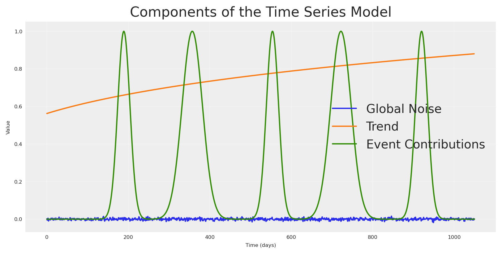
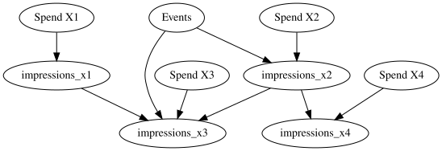
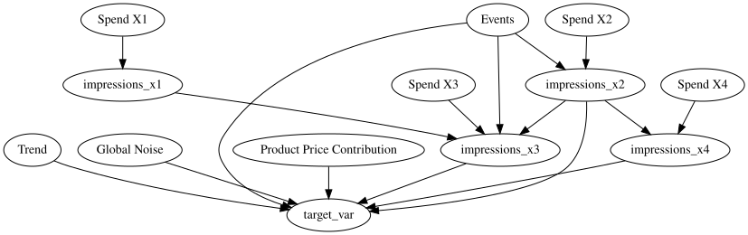
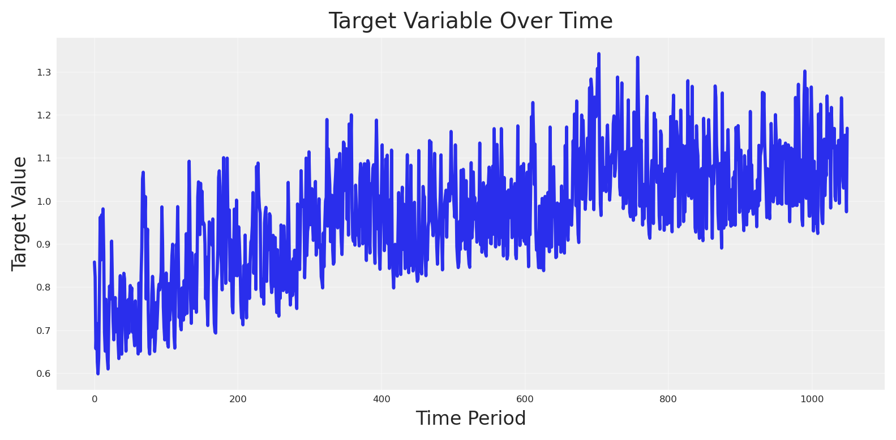
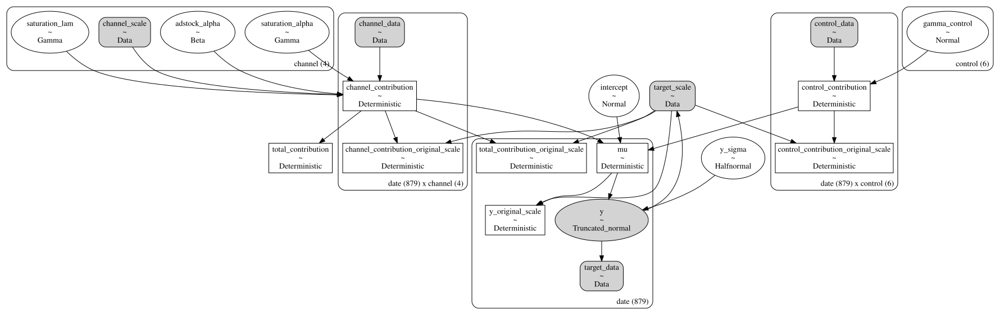
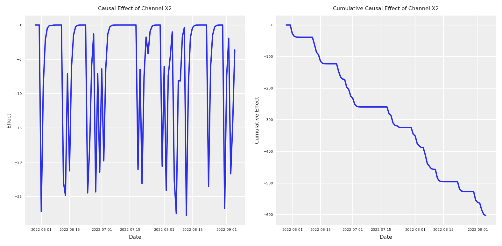
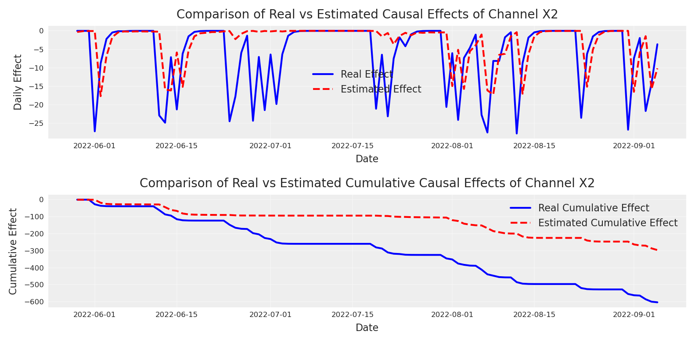
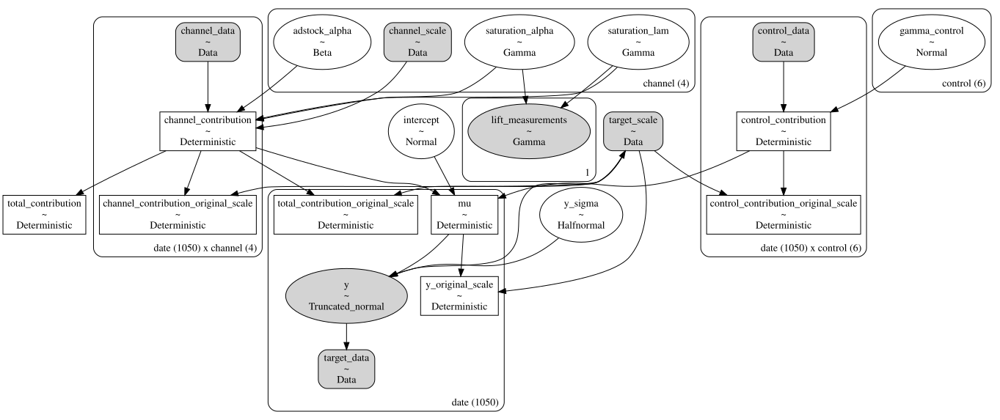
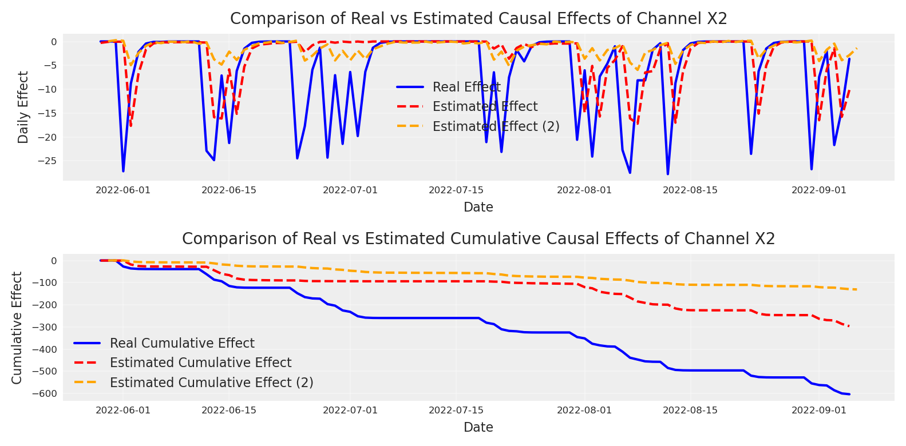
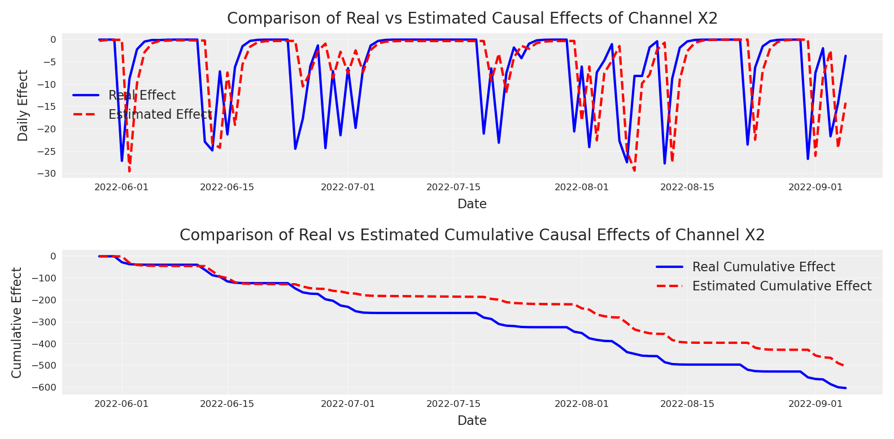

# La calibración del Modelo de Mezcla de Medios es inútil sin conocimiento causal

> Por qué la calibración del modelo de mezcla de medios es inútil sin conocimiento causal, presentado en PyData DE Darmstadt 2025.

By Carlos Trujillo

Source: https://cetagostini.github.io/es/articles/nomore_experiments_without_causality/nomore_experiments_without_causality.html

# Introducción

Imagina que acabas de lanzar un flamante Modelo de Mezcla de Medios (MMM) Bayesiano que *perfectamente* ajusta años de datos de marketing. Los experimentos de lift A/B te dicen que el canal A vale **€2.7 M**, pero tu modelo insiste en que vale **€7 M**. “Fácil de arreglar,” piensas: *calibra* el MMM con los tests de lift—agrega un término de verosimilitud extra, vuelve a correr, publica.

Sin embargo, el modelo calibrado aún sobre/sub-estima el canal basándose en la evidencia experimental. Parece que no puede reconciliar la evidencia experimental con los datos, y agregar nueva calibración para otros canales en realidad lo empeora.

Esa es la trampa de la calibración: sin estructura causal el posterior no puede reconciliar las observaciones y los experimentos **limpios** al mismo tiempo.

En este artículo construiremos un MMM con PyMC, agregaremos calibración con tests de lift, y luego mostraremos—paso a paso—por qué la calibración sola no puede salvar una historia causal mal especificada.

------------------------------------------------------------------------

# Por qué a los marketers les encanta la calibración

- **Ancla de verdad de terreno.** Las pruebas de lift son aleatorizadas, por lo que sus efectos incrementales son (casi) insesgados.  
- **Aumento de tamaño de muestra.** Los MMM ven cada día y cada canal; los experimentos solo ven una porción. Combinarlos promete menor varianza.  
- **Poder narrativo.** “Nuestro modelo *coincide* con los experimentos” es un titular amigable para ejecutivos.

Por lo tanto, la calibración se siente como atrapar dos pájaros bayesianos de un tiro conjugado.

------------------------------------------------------------------------

# ¿Qué *es* la calibración—matemáticamente?

Para cada experimento i el modelo predice un lift

\widehat{\Delta y_i}(\theta)\\=\\ s\bigl(x_i+\Delta x_i;\\\theta\_{c(i)}\bigr) \\-\\ s\bigl(x_i;\\\theta\_{c(i)}\bigr),

donde

- x_i – gasto base antes del experimento,  
- \Delta x_i – cambio en el gasto durante el experimento,  
- s(\cdot;\theta\_{c(i)}) – curva de saturación para el canal que el experimento i apunta,  
- \theta – todos los parámetros de la curva de saturación,  
- \widehat{\Delta y_i}(\theta) – resultado incremental predicho por el modelo.

Luego adjuntamos el lift observado \Delta y_i y su error \sigma_i a través de una verosimilitud adicional

p\\\bigl(\Delta y_i \mid \theta\bigr)\\=\\ \operatorname{Gamma}\\\bigl( \mu=\lvert\widehat{\Delta y_i}(\theta)\rvert,\\ \sigma=\sigma_i \bigr),

donde

- \Delta y_i – resultado incremental medido experimentalmente,  
- \sigma_i – error estándar reportado de \Delta y_i,  
- \mu – parámetro de media ajustado al lift predicho *absoluto* para que la Gamma permanezca no negativa.

Apilar todos los n\_{\text{lift}} experimentos da el posterior calibrado

p\\\bigl(\theta \mid \mathbf y,\mathcal L\bigr) \\\propto\\ p\\\bigl(\mathbf y \mid \theta\bigr)\\ \prod\_{i=1}^{n\_{\text{lift}}} p\\\bigl(\Delta y_i \mid \theta\bigr)\\ p(\theta),

donde

- \mathbf y – serie temporal completa de resultados observados (ventas, registros …),  
- \mathcal L – la colección de observaciones de pruebas de lift (\Delta y_i,\sigma_i),  
- p(\theta) – priors para todos los parámetros.

PyMC convierte esto en tres líneas:

``` sourceCode
add_lift_measurements_to_likelihood_from_saturation(
    model=mmm,
    df_lift=df_lifts,     # experiment data-frame
    dist=pm.Gamma,
)
```

En términos simples, la calibración agrega una verosimilitud extra por experimento: para el lift `i` ejecutamos la curva de saturación del canal en los niveles de gasto previo y posterior, restamos ambos, y llamamos a ese resultado la respuesta incremental esperada por el modelo para el experimento `i` (una función determinista del vector de parámetros de saturación \theta). Luego tratamos el lift observado \Delta y_i como un sorteo distribuido Gamma cuya media es el valor absoluto de ese incremento esperado por el modelo y cuya dispersión es el error estándar reportado del experimento \sigma_i.

Estos factores independientes \Gamma(\mu = \|\text{model-expected increment}\|, \sigma = \sigma_i) se multiplican en la verosimilitud original de la serie temporal, produciendo un posterior donde \theta es atraído hacia valores que mantienen cada incremento esperado por el modelo dentro de la banda de ruido experimental. En efecto, cada test de lift impone un ancla bayesiana que penaliza cualquier configuración de parámetros cuyo efecto causal predicho no coincida con la verdad de terreno, mientras aún permite que todo el historial de ventas informe la incertidumbre restante.

Veamos cómo funciona esto en la práctica, creando un conjunto de datos sintético y ajustando un MMM simple.

# Comenzando

Usaremos PyTensor para ejecutar nuestro proceso de generación de datos (DGP). Fijemos la semilla para reproducibilidad, y definamos el número de observaciones, y finalmente agreguemos algunas configuraciones predeterminadas para el notebook.

Código

``` sourceCode
import warnings
import pymc as pm
import arviz as az
import pytensor.tensor as pt
from pytensor.graph import rewrite_graph
import preliz as pz

import numpy as np
import pandas as pd

import matplotlib.pyplot as plt
import seaborn as sns
import graphviz

from pymc_marketing.mmm import GeometricAdstock, MichaelisMentenSaturation, MMM
from pymc_extras.prior import Prior

SEED = 42
n_observations = 1050

warnings.filterwarnings("ignore")

# Set the style
az.style.use("arviz-darkgrid")
plt.rcParams["figure.figsize"] = [8, 4]
plt.rcParams["figure.dpi"] = 100
plt.rcParams["axes.labelsize"] = 6
plt.rcParams["xtick.labelsize"] = 6
plt.rcParams["ytick.labelsize"] = 6

%config InlineBackend.figure_format = "retina"
```

    /opt/anaconda3/envs/nomore_experiments_without_causality/lib/python3.11/site-packages/preliz/ppls/pymc_io.py:12: FutureWarning: `pytensor.graph.basic.ancestors` was moved to `pytensor.graph.traversal.ancestors`. Calling it from the old location will fail in a future release.
      from pytensor.graph.basic import ancestors
    /opt/anaconda3/envs/nomore_experiments_without_causality/lib/python3.11/site-packages/pymc_marketing/pytensor_utils.py:34: FutureWarning: `pytensor.graph.basic.ancestors` was moved to `pytensor.graph.traversal.ancestors`. Calling it from the old location will fail in a future release.
      from pytensor.graph.basic import ancestors

Ahora, podemos definir el rango de fechas.

Código

``` sourceCode
min_date = pd.to_datetime("2022-01-01")
max_date = min_date + pd.Timedelta(days=n_observations)

date_range = pd.date_range(start=min_date, end=max_date, freq="D")

df = pd.DataFrame(data={"date_week": date_range}).assign(
    year=lambda x: x["date_week"].dt.year,
    month=lambda x: x["date_week"].dt.month,
    dayofyear=lambda x: x["date_week"].dt.dayofyear,
)
```

Podemos empezar creando los vectores de gasto para cada canal. Estos definirán luego la cantidad de impresiones o exposición que obtenemos de cada canal, que al final se transformarán en ventas.

Código

``` sourceCode
spend_x1 = pt.vector("spend_x1")
spend_x2 = pt.vector("spend_x2")
spend_x3 = pt.vector("spend_x3")
spend_x4 = pt.vector("spend_x4")

# Create sample inputs for demonstration using preliz distributions:
pz_spend_x1 = np.convolve(
    pz.Gamma(mu=.8, sigma=.3).rvs(size=n_observations, random_state=SEED), 
    np.ones(14) / 14, mode="same"
)
pz_spend_x1[:14] = pz_spend_x1.mean()
pz_spend_x1[-14:] = pz_spend_x1.mean()

pz_spend_x2 = np.convolve(
    pz.Gamma(mu=.6, sigma=.4).rvs(size=n_observations, random_state=SEED), 
    np.ones(14) / 14, mode="same"
)
pz_spend_x2[:14] = pz_spend_x2.mean()
pz_spend_x2[-14:] = pz_spend_x2.mean()

pz_spend_x3 = np.convolve(
    pz.Gamma(mu=.2, sigma=.2).rvs(size=n_observations, random_state=SEED), 
    np.ones(14) / 14, mode="same"
)
pz_spend_x3[:14] = pz_spend_x3.mean()
pz_spend_x3[-14:] = pz_spend_x3.mean()

pz_spend_x4 = np.convolve(
    pz.Gamma(mu=.1, sigma=.03).rvs(size=n_observations, random_state=SEED), 
    np.ones(14) / 14, mode="same"
)
pz_spend_x4[:14] = pz_spend_x4.mean()
pz_spend_x4[-14:] = pz_spend_x4.mean()

fig, ax = plt.subplots()
ax.plot(date_range[1:], pz_spend_x1, label='Channel 1')
ax.plot(date_range[1:], pz_spend_x2, label='Channel 2')
ax.plot(date_range[1:], pz_spend_x3, label='Channel 3')
ax.plot(date_range[1:], pz_spend_x4, label='Channel 4')
ax.set_xlabel('Time')
ax.set_ylabel('Spend')
ax.legend()
plt.show()
```

<figure class="figure">
<p></p>
</figure>

Usando la misma lógica podemos crear otros componentes como tendencia, ruido, estacionalidad y ciertos eventos.

Código

``` sourceCode
## Trend
trend = pt.vector("trend")
# Create a sample input for the trend
np_trend = (np.linspace(start=0.0, stop=.50, num=n_observations) + .10) ** (.1 / .4)

## NOISE 
global_noise = pt.vector("global_noise")
# Create a sample input for the noise
pz_global_noise = pz.Normal(mu=0, sigma=.005).rvs(size=n_observations, random_state=SEED)

# EVENTS EFFECT
pt_event_signal = pt.vector("event_signal")
pt_event_contributions = pt.vector("event_contributions")

event_dates = ["24-12", "09-07"]  # List of events as month-day strings
std_devs = [25, 15]  # List of standard deviations for each event
events_coefficients = [.094, .018]

signals_independent = []

# Initialize the event effect array
event_signal = np.zeros(len(date_range))
event_contributions = np.zeros(len(date_range))

# Generate event signals
for event, std_dev, event_coef in zip(
    event_dates, std_devs, events_coefficients, strict=False
):
    # Find all occurrences of the event in the date range
    event_occurrences = date_range[date_range.strftime("%d-%m") == event]

    for occurrence in event_occurrences:
        # Calculate the time difference in days
        time_diff = (date_range - occurrence).days

        # Generate the Gaussian basis for the event
        _event_signal = np.exp(-0.5 * (time_diff / std_dev) ** 2)

        # Add the event signal to the event effect
        signals_independent.append(_event_signal)
        event_signal += _event_signal

        event_contributions += _event_signal * event_coef

np_event_signal = event_signal
np_event_contributions = event_contributions

plt.plot(pz_global_noise, label='Global Noise')
plt.plot(np_trend, label='Trend')
plt.plot(np_event_signal, label='Event Contributions')
plt.title('Components of the Time Series Model')
plt.xlabel('Time (days)')
plt.ylabel('Value')
plt.legend()
plt.grid(True, alpha=0.3)
plt.show()
```

<figure class="figure">
<p></p>
</figure>

Para hacerlo más interesante, agreguemos una variable de precio. Usualmente, el precio crea más impacto ya que es más lento. La función de contribución del precio del producto que usaremos es una función de rendimientos decrecientes:

f(X, \alpha, \lambda) = \frac{\alpha}{1 + (X / \lambda)}

donde \alpha representa la contribución máxima y \lambda es un parámetro de escala que controla qué tan rápido la contribución disminuye a medida que el precio aumenta.

Código

``` sourceCode
def product_price_contribution(X, alpha, lam):
    return alpha / (1 + (X / lam))
    
# Create a product price vector.
product_price = pt.vector("product_price")
product_price_alpha = pt.scalar("product_price_alpha")
product_price_lam = pt.scalar("product_price_lam")

# Create a sample input for the product price
pz_product_price = np.convolve(
    pz.Gamma(mu=.05, sigma=.02).rvs(size=n_observations, random_state=SEED), 
    np.ones(14) / 14, mode="same"
)
pz_product_price[:14] = pz_product_price.mean()
pz_product_price[-14:] = pz_product_price.mean()

product_price_alpha_value = .08
product_price_lam_value = .03

# Direct contribution to the target.
pt_product_price_contribution = product_price_contribution(
    product_price, 
    product_price_alpha, 
    product_price_lam
)

# plot the product price contribution
fig, (ax1, ax2) = plt.subplots(1, 2)

# Plot the raw price data
ax1.plot(pz_product_price, color="green")
ax1.set_title('Product Price')
ax1.set_xlabel('Time (days)')
ax1.set_ylabel('Price')
ax1.grid(True, alpha=0.3)

# Plot the price contribution
price_contribution = pt_product_price_contribution.eval({
    "product_price": pz_product_price,
    "product_price_alpha": product_price_alpha_value,
    "product_price_lam": product_price_lam_value
})
ax2.plot(price_contribution, color="black")
ax2.set_title('Price Contribution')
ax2.set_xlabel('Time (days)')
ax2.set_ylabel('Contribution')
ax2.grid(True, alpha=0.3)

plt.tight_layout()
plt.show()
```

<figure class="figure">
<p></p>
</figure>

Con todos los componentes principales en su lugar, todos los nodos padres, podemos empezar a escribir nuestro DAG causal para definir las relaciones que queremos explicar.

Código

``` sourceCode
# Plot causal graph of the vars x1, x2, x3, x4 using graphviz
cdag_impressions = graphviz.Digraph(comment='Causal DAG for Impressions')

cdag_impressions.node('spend_x1', 'Spend X1')
cdag_impressions.node('spend_x2', 'Spend X2')
cdag_impressions.node('spend_x3', 'Spend X3')
cdag_impressions.node('spend_x4', 'Spend X4')
cdag_impressions.node('events', 'Events')

cdag_impressions.edge('spend_x1', 'impressions_x1')
cdag_impressions.edge('spend_x2', 'impressions_x2')
cdag_impressions.edge('spend_x3', 'impressions_x3')
cdag_impressions.edge('spend_x4', 'impressions_x4')

cdag_impressions.edge('impressions_x1', 'impressions_x3')
cdag_impressions.edge('impressions_x2', 'impressions_x3')
cdag_impressions.edge('impressions_x2', 'impressions_x4')

cdag_impressions.edge('events', 'impressions_x2')
cdag_impressions.edge('events', 'impressions_x3')

cdag_impressions
```

<figure class="figure">
<p></p>
</figure>

Una vez que nuestro grafo causal está definido, podemos empezar a escribir en PyTensor la estructura y las relaciones.

Código

``` sourceCode
# Create a impressions vector, result of x1, x2, x3, x4. by some beta with daily values.
# Define all parameters as PyTensor variables
beta_x1 = pt.vector("beta_x1")
impressions_x1 = spend_x1 * beta_x1

beta_x2 = pt.vector("beta_x2")
alpha_event_x2 = pt.scalar("alpha_event_x2")
impressions_x2 = spend_x2 * beta_x2 + pt_event_signal * alpha_event_x2

beta_x3 = pt.vector("beta_x3")
alpha_event_x3 = pt.scalar("alpha_event_x3")
alpha_x1_x3 = pt.scalar("alpha_x1_x3")
alpha_x2_x3 = pt.scalar("alpha_x2_x3")
impressions_x3 = spend_x3 * beta_x3 + pt_event_signal * alpha_event_x3 + (
    impressions_x2 * alpha_x2_x3
    + impressions_x1 * alpha_x1_x3
)

beta_x4 = pt.vector("beta_x4")
alpha_x2_x4 = pt.scalar("alpha_x2_x4")
impressions_x4 = spend_x4 * beta_x4 + impressions_x2 * alpha_x2_x4

# Create sample values for the parameters (to be used in eval)
pz_beta_x1 = pz.Beta(alpha=0.05, beta=.1).rvs(size=n_observations, random_state=SEED)
pz_beta_x2 = pz.Beta(alpha=.015, beta=.05).rvs(size=n_observations, random_state=SEED)
pz_alpha_event_x2 = 0.015
pz_beta_x3 = pz.Beta(alpha=.1, beta=.1).rvs(size=n_observations, random_state=SEED)
pz_alpha_event_x3 = 0.001
pz_alpha_x1_x3 = 0.005
pz_alpha_x2_x3 = 0.12
pz_beta_x4 = pz.Beta(alpha=.125, beta=.05).rvs(size=n_observations, random_state=SEED)
pz_alpha_x2_x4 = 0.01

# plot all impressions
# Define dependencies for each variable
x1_deps = {
    "beta_x1": pz_beta_x1,
    "spend_x1": pz_spend_x1,
}

x2_deps = {
    "beta_x2": pz_beta_x2,
    "spend_x2": pz_spend_x2,
    "alpha_event_x2": pz_alpha_event_x2,
    "event_signal": event_signal[:-1],  # Slice to match 1050 length
}

# For x3, we need all dependencies from x1 and x2 plus its own
x3_deps = {
    "beta_x3": pz_beta_x3,
    "spend_x3": pz_spend_x3,
    "alpha_x2_x3": pz_alpha_x2_x3,
    "alpha_event_x3": pz_alpha_event_x3,
    "alpha_x1_x3": pz_alpha_x1_x3,
    **x1_deps,
    **x2_deps,
}

# For x4, we need dependencies from x2 plus its own
x4_deps = {
    "beta_x4": pz_beta_x4,
    "spend_x4": pz_spend_x4,
    "alpha_x2_x4": pz_alpha_x2_x4,
    **x2_deps,
}

# Plot each impression series
fig, axs = plt.subplots(2, 2, sharex='row', sharey='row')

# Channel 1
axs[0, 0].plot(impressions_x1.eval(x1_deps), color='blue')
axs[0, 0].set_title('Channel 1')
axs[0, 0].set_ylabel('Impressions')

# Channel 2
axs[0, 1].plot(impressions_x2.eval(x2_deps), color='orange')
axs[0, 1].set_title('Channel 2')

# Channel 3
axs[1, 0].plot(impressions_x3.eval(x3_deps), color='green')
axs[1, 0].set_title('Channel 3')
axs[1, 0].set_xlabel('Time')
axs[1, 0].set_ylabel('Impressions')

# Channel 4
axs[1, 1].plot(impressions_x4.eval(x4_deps), color='red')
axs[1, 1].set_title('Channel 4')
axs[1, 1].set_xlabel('Time')

plt.tight_layout()
plt.show()
```

<figure class="figure">
<p></p>
</figure>

Visualizando el grafo computacional

Para verificar que escribimos el proceso correctamente, podemos pedirle a PyTensor que imprima nuestro modelo causal estructural. Esto no es necesario para el análisis, pero puede ser útil para depurar y comprender la estructura del modelo.

Código

``` sourceCode
import pytensor.printing as printing
# Plot the graph of our model using pytensor
printing.pydotprint(rewrite_graph(impressions_x4), outfile="images/impressions.png", var_with_name_simple=True)
# Display the generated graph
from IPython.display import Image
Image(filename="images/impressions.png")
```

    The output file is available at images/impressions.png

<figure class="figure">
<p></p>
</figure>

Si no te gusta ver la versión gráfica, puedes pedir la representación en texto.

Código

``` sourceCode
# dprint the target_var
rewrite_graph(impressions_x4).dprint(depth=5);
```

    Add [id A]
     ├─ Mul [id B]
     │  ├─ spend_x4 [id C]
     │  └─ beta_x4 [id D]
     └─ Mul [id E]
        ├─ Add [id F]
        │  ├─ Mul [id G]
        │  │  ├─ spend_x2 [id H]
        │  │  └─ beta_x2 [id I]
        │  └─ Mul [id J]
        │     ├─ event_signal [id K]
        │     └─ ExpandDims{axis=0} [id L]
        └─ ExpandDims{axis=0} [id M]
           └─ alpha_x2_x4 [id N]

Ahora, definamos nuestro forward pass - cómo la exposición a medios impacta realmente nuestra variable objetivo. En marketing, típicamente vemos dos efectos clave: saturación (rendimientos decrecientes) y rezago (impacto diferido). Modelaremos estos usando la función de Michaelis-Menten para la saturación y Geometric Adstock para los efectos de rezago.

Código

``` sourceCode
# Creating forward pass for impressions
def forward_pass(x, adstock_alpha, saturation_lam, saturation_alpha):
    # return type pytensor.tensor.variable.TensorVariable
    return MichaelisMentenSaturation.function(
        MichaelisMentenSaturation, 
        x=GeometricAdstock(
            l_max=24, normalize=False
        ).function(
            x=x, alpha=adstock_alpha,
        ), lam=saturation_lam, alpha=saturation_alpha,
    )

# Applying forward pass to impressions
# Create scalars variables for the parameters x2, x3, x4
pt_saturation_lam_x2 = pt.scalar("saturation_lam_x2")
pt_saturation_alpha_x2 = pt.scalar("saturation_alpha_x2")

pt_saturation_lam_x3 = pt.scalar("saturation_lam_x3")
pt_saturation_alpha_x3 = pt.scalar("saturation_alpha_x3")

pt_saturation_lam_x4 = pt.scalar("saturation_lam_x4")
pt_saturation_alpha_x4 = pt.scalar("saturation_alpha_x4")

pt_global_adstock_effect = pt.scalar("global_adstock_alpha")

# Apply forward pass to impressions
impressions_x2_forward = forward_pass(
    impressions_x2, 
    pt_global_adstock_effect, 
    pt_saturation_lam_x2, 
    pt_saturation_alpha_x2
)

impressions_x3_forward = forward_pass(
    impressions_x3, 
    pt_global_adstock_effect, 
    pt_saturation_lam_x3, 
    pt_saturation_alpha_x3
)

impressions_x4_forward = forward_pass(
    impressions_x4, 
    pt_global_adstock_effect, 
    pt_saturation_lam_x4, 
    pt_saturation_alpha_x4
)
```

Con todo lo siguiente en su lugar, podemos definir el DAG causal para la variable objetivo y la ecuación estructural como la suma de todas las variables anteriores.

Código

``` sourceCode
# Plot graphviz causal dag for the target_var
# Create a Graphviz object
dot = graphviz.Digraph(comment='Causal DAG for Target Variable')

# Add nodes for each variable
dot.node('spend_x1', 'Spend X1')
dot.node('spend_x2', 'Spend X2')
dot.node('spend_x3', 'Spend X3')
dot.node('spend_x4', 'Spend X4')
dot.node('trend', 'Trend')
dot.node('global_noise', 'Global Noise')
dot.node('event_contributions', 'Events')
dot.node('product_price_contribution', 'Product Price Contribution')

dot.edge('spend_x1', 'impressions_x1')
dot.edge('spend_x2', 'impressions_x2')
dot.edge('spend_x3', 'impressions_x3')
dot.edge('spend_x4', 'impressions_x4')

dot.edge('impressions_x1', 'impressions_x3')
dot.edge('impressions_x2', 'impressions_x3')
dot.edge('impressions_x2', 'impressions_x4')
dot.edge('event_contributions', 'impressions_x2')
dot.edge('event_contributions', 'impressions_x3')

dot.edge('trend', 'target_var')
dot.edge('global_noise', 'target_var')
dot.edge('event_contributions', 'target_var')
dot.edge('product_price_contribution', 'target_var')

dot.edge('impressions_x2', 'target_var')
dot.edge('impressions_x3', 'target_var')
dot.edge('impressions_x4', 'target_var')

# Render the graph
dot
```

<figure class="figure">
<p></p>
</figure>

\begin{align} \text{Target} &\sim \sum\_{i \in \\2,3,4\\} f_i(\text{impressions}\_i) + \\ &\text{event\\contributions} + \\ &\text{product\\price\\contribution} + \\ &\text{trend} + \\ &\text{noise} \end{align}

Donde f_i representa la función de forward pass (adstock y saturación) aplicada a las impresiones de cada canal.

Código

``` sourceCode
target_var = rewrite_graph(
    impressions_x4_forward + 
    impressions_x3_forward +
    impressions_x2_forward +
    pt_event_contributions +
    pt_product_price_contribution + 
    trend + 
    global_noise
)

# Eval target_var and plot
np_target_var = target_var.eval({
    "spend_x4": pz_spend_x4,
    "spend_x3": pz_spend_x3,
    "spend_x2": pz_spend_x2,
    "spend_x1": pz_spend_x1,
    "event_signal": event_signal[:-1],
    "alpha_event_x2": pz_alpha_event_x2,
    "alpha_event_x3": pz_alpha_event_x3,
    "alpha_x1_x3": pz_alpha_x1_x3,
    "alpha_x2_x3": pz_alpha_x2_x3,
    "alpha_x2_x4": pz_alpha_x2_x4,
    "beta_x2": pz_beta_x2,
    "beta_x3": pz_beta_x3,
    "beta_x4": pz_beta_x4,
    "beta_x1": pz_beta_x1,
    "saturation_lam_x2": .5,
    "saturation_alpha_x2": .2,
    "saturation_lam_x3": .7,
    "saturation_alpha_x3": .7,
    "saturation_lam_x4": .2,
    "saturation_alpha_x4": .1,
    "global_adstock_alpha": .2,
    "product_price": pz_product_price,
    "event_contributions": np_event_contributions[:-1],
    "product_price_alpha": product_price_alpha_value,
    "product_price_lam": product_price_lam_value,
    "trend": np_trend,
    "global_noise": pz_global_noise,
})

plt.plot(np_target_var, linewidth=2)
plt.title('Target Variable Over Time', fontsize=14)
plt.xlabel('Time Period', fontsize=12)
plt.ylabel('Target Value', fontsize=12)
plt.grid(True, alpha=0.3)
plt.tight_layout()
plt.show()
```

<figure class="figure">
<p></p>
</figure>

Ahora, podemos imaginar que nuestro dataframe en este caso será algo como lo siguiente:

Código

``` sourceCode
# make dataset with impressions x1, x2, x3, x4 and target_var
scaler_factor_for_all = 150
dates = pd.date_range(start='2020-01-01', periods=n_observations, freq='D')
data = pd.DataFrame({
    "date": dates,
    "target_var": np.round(np_target_var * scaler_factor_for_all, 4),
    "impressions_x1": np.round(impressions_x1.eval(x1_deps) * scaler_factor_for_all, 4),
    "impressions_x2": np.round(impressions_x2.eval(x2_deps) * scaler_factor_for_all, 4),
    "impressions_x3": np.round(impressions_x3.eval(x3_deps) * scaler_factor_for_all, 4),
    "impressions_x4": np.round(impressions_x4.eval(x4_deps) * scaler_factor_for_all, 4),
    "event_2020_09": np.round(signals_independent[0][:-1], 4),
    "event_2020_12": np.round(signals_independent[1][:-1], 4),
    "event_2021_09": np.round(signals_independent[2][:-1], 4),
    "event_2021_12": np.round(signals_independent[3][:-1], 4),
    "event_2022_09": np.round(signals_independent[4][:-1], 4),
})
data["trend"] = data.index
data.head()
```

|  | date | target_var | impressions_x1 | impressions_x2 | impressions_x3 | impressions_x4 | event_2020_09 | event_2020_12 | event_2021_09 | event_2021_12 | event_2022_09 | trend |
|----|----|----|----|----|----|----|----|----|----|----|----|----|
| 0 | 2020-01-01 | 128.7894 | 112.9178 | 30.9076 | 34.3534 | 15.0851 | 0.0 | 0.0 | 0.0 | 0.0 | 0.0 | 0 |
| 1 | 2020-01-02 | 123.5265 | 74.9429 | 4.3523 | 27.7279 | 14.7826 | 0.0 | 0.0 | 0.0 | 0.0 | 0.0 | 1 |
| 2 | 2020-01-03 | 98.5682 | 0.0000 | 0.0000 | 0.0000 | 0.0000 | 0.0 | 0.0 | 0.0 | 0.0 | 0.0 | 2 |
| 3 | 2020-01-04 | 107.3861 | 5.3253 | 0.0001 | 12.7077 | 13.7833 | 0.0 | 0.0 | 0.0 | 0.0 | 0.0 | 3 |
| 4 | 2020-01-05 | 93.9367 | 0.0000 | 0.0000 | 0.0001 | 5.6283 | 0.0 | 0.0 | 0.0 | 0.0 | 0.0 | 4 |

Si no pensamos de manera causal, probablemente solo diremos: “pongamos todo en la licuadora”.

Código

``` sourceCode
# Building priors for adstock and saturation
adstock_priors = {
    "alpha": Prior("Beta", alpha=1, beta=1, dims="channel"),
}

adstock = GeometricAdstock(l_max=28, priors=adstock_priors)

saturation_priors = {
    "lam": Prior(
        "Gamma",
        mu=2,
        sigma=1,
        dims="channel",
    ),
    "alpha": Prior(
        "Gamma",
        mu=.5,
        sigma=.5,
        dims="channel",
    ),
}

saturation = MichaelisMentenSaturation(priors=saturation_priors)

# Split data into train and test sets
train_idx = 879

X_train = data.iloc[:train_idx].drop(columns=["target_var"])
X_test = data.iloc[train_idx:].drop(columns=["target_var"])
y_train = data.iloc[:train_idx]["target_var"]
y_test = data.iloc[train_idx:]["target_var"]

control_columns = [
    "event_2020_09", "event_2020_12", 
    "event_2021_09", "event_2021_12", 
    "event_2022_09",
    "trend"
]
channel_columns = [
    col for col in X_train.columns if col not in control_columns and col != "date"
]

# Model config
model_config = {
    "likelihood": Prior(
        "TruncatedNormal",
        lower=0,
        sigma=Prior("HalfNormal", sigma=1),
        dims="date",
    ),
}

# sampling options for PyMC
sample_kwargs = {
    "tune": 1000,
    "draws": 500,
    "chains": 4,
    "random_seed": 42,
    "target_accept": 0.94,
}

non_causal_mmm = MMM(
    date_column="date",
    channel_columns=channel_columns,
    control_columns=control_columns,
    adstock=adstock,
    saturation=saturation,
    model_config=model_config,
    sampler_config=sample_kwargs
)
non_causal_mmm.build_model(X_train, y_train)
```

Construyendo el modelo

Todos los modelos de PyMC son modelos causales estructurales, lo que significa que representan el proceso causal generativo de los datos. Podemos visualizar este proceso a través de un Grafo Acíclico Dirigido (DAG) que muestra cómo las variables se influyen mutuamente en el modelo.

Código

``` sourceCode
non_causal_mmm.model.to_graphviz()
```

<figure class="figure">
<p></p>
</figure>

Una vez que el modelo está construido, podemos entrenarlo.

Código

``` sourceCode
non_causal_mmm.fit(X_train, y_train,)
non_causal_mmm.sample_posterior_predictive(X_train, extend_idata=True, combined=True)
```

    Initializing NUTS using jitter+adapt_diag...
    Multiprocess sampling (4 chains in 4 jobs)
    NUTS: [intercept, adstock_alpha, saturation_alpha, saturation_lam, gamma_control, y_sigma]

```
```

    Sampling 4 chains for 1_000 tune and 500 draw iterations (4_000 + 2_000 draws total) took 89 seconds.
    There were 13 divergences after tuning. Increase `target_accept` or reparameterize.
    The rhat statistic is larger than 1.01 for some parameters. This indicates problems during sampling. See https://arxiv.org/abs/1903.08008 for details
    The effective sample size per chain is smaller than 100 for some parameters.  A higher number is needed for reliable rhat and ess computation. See https://arxiv.org/abs/1903.08008 for details

```
```

    Sampling: [y]

```
```

``` xr-text-repr-fallback
<xarray.Dataset> Size: 14MB
Dimensions:  (date: 879, sample: 2000)
Coordinates:
  * date     (date) datetime64[ns] 7kB 2020-01-01 2020-01-02 ... 2022-05-28
  * sample   (sample) object 16kB MultiIndex
  * chain    (sample) int64 16kB 0 0 0 0 0 0 0 0 0 0 0 ... 3 3 3 3 3 3 3 3 3 3 3
  * draw     (sample) int64 16kB 0 1 2 3 4 5 6 7 ... 493 494 495 496 497 498 499
Data variables:
    y        (date, sample) float64 14MB 132.2 130.3 131.5 ... 161.4 162.8 162.6
Attributes:
    created_at:                 2026-09-16T21:02:01.360623+00:00
    arviz_version:              0.21.0
    inference_library:          pymc
    inference_library_version:  5.28.5
```

xarray.Dataset

Dimensions:

- date: 879
- sample: 2000

Coordinates: (4)

date(date)datetime64\[ns\]2020-01-01 ... 2022-05-28

<!-- -->

    array(['2020-01-01T00:00:00.000000000', '2020-01-02T00:00:00.000000000',
           '2020-01-03T00:00:00.000000000', ..., '2022-05-26T00:00:00.000000000',
           '2022-05-27T00:00:00.000000000', '2022-05-28T00:00:00.000000000'],
          dtype='datetime64[ns]')

sample(sample)objectMultiIndex

<!-- -->

    array([(0, 0), (0, 1), (0, 2), ..., (3, 497), (3, 498), (3, 499)], dtype=object)

chain(sample)int640 0 0 0 0 0 0 0 ... 3 3 3 3 3 3 3 3

<!-- -->

    array([0, 0, 0, ..., 3, 3, 3])

draw(sample)int640 1 2 3 4 5 ... 495 496 497 498 499

<!-- -->

    array([  0,   1,   2, ..., 497, 498, 499])

Data variables: (1)

y(date, sample)float64132.2 130.3 131.5 ... 162.8 162.6

<!-- -->

    array([[132.16150807, 130.29090899, 131.47829814, ..., 131.82282222,
            132.64733196, 133.16137011],
           [128.98490719, 126.99962244, 128.88039107, ..., 126.14118469,
            124.04983126, 128.16871665],
           [102.98542714,  99.08582489, 102.95490343, ..., 102.83472531,
             99.60658535, 100.11723395],
           ...,
           [150.33643035, 148.36020871, 153.72883924, ..., 152.76700086,
            148.1817006 , 150.31634069],
           [139.09107892, 140.90372899, 139.37540727, ..., 138.68360187,
            141.3137493 , 139.67008916],
           [158.80670381, 160.24294565, 161.6918527 , ..., 161.36197229,
            162.81735824, 162.56018853]])

Indexes: (2)

datePandasIndex

    PandasIndex(DatetimeIndex(['2020-01-01', '2020-01-02', '2020-01-03', '2020-01-04',
                   '2020-01-05', '2020-01-06', '2020-01-07', '2020-01-08',
                   '2020-01-09', '2020-01-10',
                   ...
                   '2022-05-19', '2022-05-20', '2022-05-21', '2022-05-22',
                   '2022-05-23', '2022-05-24', '2022-05-25', '2022-05-26',
                   '2022-05-27', '2022-05-28'],
                  dtype='datetime64[ns]', name='date', length=879, freq=None))

sample  
chain  
drawPandasMultiIndex

    PandasIndex(MultiIndex([(0,   0),
                (0,   1),
                (0,   2),
                (0,   3),
                (0,   4),
                (0,   5),
                (0,   6),
                (0,   7),
                (0,   8),
                (0,   9),
                ...
                (3, 490),
                (3, 491),
                (3, 492),
                (3, 493),
                (3, 494),
                (3, 495),
                (3, 496),
                (3, 497),
                (3, 498),
                (3, 499)],
               name='sample', length=2000))

Attributes: (4)

created_at :  
2026-09-16T21:02:01.360623+00:00

arviz_version :  
0.21.0

inference_library :  
pymc

inference_library_version :  
5.28.5

Estamos contentos con nuestro modelo, no obtenemos divergencias, y el muestreo se ve bien.

Código

``` sourceCode
# Number of diverging samples
print(
    f"Total divergencies: {non_causal_mmm.idata['sample_stats']['diverging'].sum().item()}"
)

az.summary(
    data=non_causal_mmm.fit_result,
    var_names=[
        "intercept",
        "y_sigma",
        "saturation_alpha",
        "saturation_lam",
        "adstock_alpha",
    ],
)
```

    Total divergencies: 13

|  | mean | sd | hdi_3% | hdi_97% | mcse_mean | mcse_sd | ess_bulk | ess_tail | r_hat |
|----|----|----|----|----|----|----|----|----|----|
| intercept | 0.458 | 0.006 | 0.452 | 0.464 | 0.001 | 0.003 | 138.0 | 24.0 | 1.03 |
| y_sigma | 0.009 | 0.000 | 0.008 | 0.009 | 0.000 | 0.000 | 2595.0 | 1556.0 | 1.00 |
| saturation_alpha\[impressions_x1\] | 0.067 | 0.030 | 0.023 | 0.123 | 0.001 | 0.001 | 731.0 | 1134.0 | 1.00 |
| saturation_alpha\[impressions_x2\] | 0.142 | 0.007 | 0.129 | 0.154 | 0.000 | 0.000 | 887.0 | 1021.0 | 1.00 |
| saturation_alpha\[impressions_x3\] | 0.502 | 0.019 | 0.466 | 0.537 | 0.001 | 0.000 | 1100.0 | 1231.0 | 1.00 |
| saturation_alpha\[impressions_x4\] | 0.098 | 0.024 | 0.061 | 0.146 | 0.001 | 0.001 | 1016.0 | 1100.0 | 1.01 |
| saturation_lam\[impressions_x1\] | 2.101 | 1.194 | 0.024 | 4.019 | 0.086 | 0.045 | 126.0 | 24.0 | 1.03 |
| saturation_lam\[impressions_x2\] | 0.446 | 0.046 | 0.358 | 0.532 | 0.002 | 0.001 | 923.0 | 1179.0 | 1.00 |
| saturation_lam\[impressions_x3\] | 1.294 | 0.074 | 1.166 | 1.441 | 0.002 | 0.002 | 1086.0 | 1211.0 | 1.01 |
| saturation_lam\[impressions_x4\] | 1.962 | 0.746 | 0.783 | 3.370 | 0.024 | 0.021 | 1045.0 | 1065.0 | 1.00 |
| adstock_alpha\[impressions_x1\] | 0.993 | 0.007 | 0.980 | 1.000 | 0.000 | 0.000 | 1055.0 | 697.0 | 1.00 |
| adstock_alpha\[impressions_x2\] | 0.190 | 0.011 | 0.170 | 0.211 | 0.000 | 0.000 | 1059.0 | 1156.0 | 1.01 |
| adstock_alpha\[impressions_x3\] | 0.193 | 0.006 | 0.183 | 0.203 | 0.000 | 0.000 | 1703.0 | 1480.0 | 1.00 |
| adstock_alpha\[impressions_x4\] | 0.218 | 0.031 | 0.160 | 0.274 | 0.001 | 0.001 | 1833.0 | 1255.0 | 1.00 |

Si nuestro modelo tiene una comprensión correcta de la causalidad, podemos usarlo para realizar un cálculo-do para estimar el efecto de nuestro canal, usando datos fuera de muestra (muestreando del posterior). Matemáticamente, queremos calcular el efecto causal como la diferencia entre dos intervenciones: P(Y\|do(X=x)) - P(Y\|do(X=0))

Esto debería permitirnos aislar el impacto causal de nuestros canales de marketing en la variable de resultado.

Código

``` sourceCode
X_test_x2_zero = X_test.copy()
X_test_x2_zero["impressions_x2"].iloc[:100] = 0

y_do_x2_zero = non_causal_mmm.sample_posterior_predictive(
    X_test_x2_zero, extend_idata=False, include_last_observations=True, random_seed=42
)

y_do_x2 = non_causal_mmm.sample_posterior_predictive(
    X_test, extend_idata=False, include_last_observations=True, random_seed=42
)
```

    Sampling: [y]

```
```

    Sampling: [y]

```
```

Ahora que tenemos ambos posteriors, podemos calcular la diferencia entre el período con el índice 880-890 y graficar el efecto causal y el efecto causal acumulado.

Código

``` sourceCode
# Calculate the causal effect as the difference between interventions
x2_causal_effect = (y_do_x2_zero - y_do_x2).y
# Get dates from the coordinates for x-axis
dates = x2_causal_effect.coords['date'].values[:100]  # Take only first 100 days

# Plot the causal effect
plt.subplot(1, 2, 1)
# Calculate mean and quantiles
mean_effect = x2_causal_effect.mean(dim="sample")[:100]
plt.plot(dates, mean_effect)
plt.title("Causal Effect of Channel X2", fontsize=6)
plt.xlabel("Date", fontsize=6)
plt.ylabel("Effect", fontsize=6)
plt.tick_params(axis='both', which='major', labelsize=4)
plt.legend(fontsize=6)

# Plot the cumulative causal effect
plt.subplot(1, 2, 2)
# For cumulative effect, compute quantiles directly from cumulative sums
cum_effect = x2_causal_effect.cumsum(dim="date")
cum_mean = cum_effect.mean(dim="sample")[:100]
plt.plot(dates, cum_mean)
plt.title("Cumulative Causal Effect of Channel X2", fontsize=6)
plt.xlabel("Date", fontsize=6)
plt.ylabel("Cumulative Effect", fontsize=6)
plt.tick_params(axis='both', which='major', labelsize=4)
plt.legend(fontsize=6)
plt.tight_layout()
```

<figure class="figure">
<p></p>
</figure>

En realidad, para validar el siguiente efecto estimado, necesitaremos ejecutar un experimento real. Dado que creamos el proceso de generación de datos, podemos ejecutar este experimento real para comparar.

Código

``` sourceCode
# Create an intervened spend_x2 with zeros between index 880 and 980
intervened_spend_x2 = pz_spend_x2.copy()
intervened_spend_x2[880:980] = 0

# Evaluate target variable with the intervention
np_target_var_x2_zero = target_var.eval({
    "spend_x4": pz_spend_x4,
    "spend_x3": pz_spend_x3,
    "spend_x2": intervened_spend_x2,
    "spend_x1": pz_spend_x1,
    "event_signal": event_signal[:-1],
    "alpha_event_x2": pz_alpha_event_x2,
    "alpha_event_x3": pz_alpha_event_x3,
    "alpha_x1_x3": pz_alpha_x1_x3,
    "alpha_x2_x3": pz_alpha_x2_x3,
    "alpha_x2_x4": pz_alpha_x2_x4,
    "beta_x2": pz_beta_x2,
    "beta_x3": pz_beta_x3,
    "beta_x4": pz_beta_x4,
    "beta_x1": pz_beta_x1,
    "saturation_lam_x2": .5,
    "saturation_alpha_x2": .2,
    "saturation_lam_x3": .7,
    "saturation_alpha_x3": .7,
    "saturation_lam_x4": .2,
    "saturation_alpha_x4": .1,
    "global_adstock_alpha": .2,
    "product_price": pz_product_price,
    "event_contributions": np_event_contributions[:-1],
    "product_price_alpha": product_price_alpha_value,
    "product_price_lam": product_price_lam_value,
    "trend": np_trend,
    "global_noise": pz_global_noise,
})

# x2 total effect y | do(x2=>1) - y | do(x2=0)
x2_intervention_real_effect = np_target_var_x2_zero - np_target_var
x2_intervention_real_cumulative_effect = np.cumsum(x2_intervention_real_effect)

# Plot both the intervention effect and cumulative effect
plt.subplot(1, 2, 1)
# Plot the daily effect
daily_effect = x2_intervention_real_effect[880:980] * scaler_factor_for_all
plt.plot(dates, daily_effect)
plt.title("Causal Effect of Channel X2", fontsize=6)
plt.xlabel("Date", fontsize=6)
plt.ylabel("Effect", fontsize=6)
plt.tick_params(axis='both', which='major', labelsize=4)
plt.legend(fontsize=6)

# Plot the cumulative causal effect
plt.subplot(1, 2, 2)
cumulative_effect = x2_intervention_real_cumulative_effect[880:980] * scaler_factor_for_all
plt.plot(dates, cumulative_effect)
plt.title("Cumulative Causal Effect of Channel X2", fontsize=6)
plt.xlabel("Date", fontsize=6)
plt.ylabel("Cumulative Effect", fontsize=6)
plt.tick_params(axis='both', which='major', labelsize=4)
plt.legend(fontsize=6)
plt.tight_layout()
plt.show()
```

<figure class="figure">
<p></p>
</figure>

¿Cómo se compara con el efecto recuperado? ¡Observemos! 👀

Código

``` sourceCode
# Create a figure to compare real effects with estimated effects
# Plot 1: Compare daily effects
plt.subplot(2, 1, 1)
plt.plot(dates, daily_effect, label='Real Effect', color='blue')
plt.plot(dates, mean_effect, label='Estimated Effect', color='red', linestyle='--')
plt.title("Comparison of Real vs Estimated Causal Effects of Channel X2", fontsize=10)
plt.xlabel("Date", fontsize=8)
plt.ylabel("Daily Effect", fontsize=8)
plt.tick_params(axis='both', which='major', labelsize=6)
plt.legend(fontsize=8)
plt.grid(True, alpha=0.3)

# Plot 2: Compare cumulative effects
plt.subplot(2, 1, 2)
plt.plot(dates, cumulative_effect, label='Real Cumulative Effect', color='blue')
plt.plot(dates, cum_mean, 
         label='Estimated Cumulative Effect', color='red', linestyle='--')
plt.title("Comparison of Real vs Estimated Cumulative Causal Effects of Channel X2", fontsize=10)
plt.xlabel("Date", fontsize=8)
plt.ylabel("Cumulative Effect", fontsize=8)
plt.tick_params(axis='both', which='major', labelsize=6)
plt.legend(fontsize=8)
plt.grid(True, alpha=0.3)

plt.tight_layout()
plt.show()
```

<figure class="figure">
<p></p>
</figure>

El modelo inicial ha estado subestimando el efecto de X2. Podemos ver que el modelo pensaba que perderíamos casi ningún usuario cuando en realidad perderíamos alrededor de 600 en total. ¿Quizás hicimos algo mal? ¿Es quizás la pregunta causal equivocada?

¡Eso no importa, tenemos calibración! 🤪

Calculemos el delta observable en Y y el delta observable en X y usemoslo para la calibración.

Código

``` sourceCode
intervened_channel = "impressions_x2"
total_observed_effect = cumulative_effect[-1] # delta Y
total_previous_imp_before_intervention = X_train[intervened_channel].iloc[-100:].sum()
total_change_imp_during_intervention = -X_train[intervened_channel].iloc[-100:].sum()
sigma = 0.3 # confidence in the experiment.

df_lift_test = pd.DataFrame(
    [{
        "channel": intervened_channel,
        "x": total_previous_imp_before_intervention,
        "delta_x": total_change_imp_during_intervention,
        "delta_y": total_observed_effect,
        "sigma": sigma,
    }]
)

intervened_data = data.copy()
intervened_data.loc[880:980, "impressions_x2"] = 0

non_causal_mmm2 = MMM(
    date_column="date",
    channel_columns=channel_columns,
    control_columns=control_columns,
    adstock=adstock,
    saturation=saturation,
    model_config=model_config,
    sampler_config=sample_kwargs
)
non_causal_mmm2.build_model(
    intervened_data.drop(columns=["target_var"]), 
    intervened_data["target_var"]
)

non_causal_mmm2.add_lift_test_measurements(df_lift_test)
non_causal_mmm2.model.to_graphviz()
```

<figure class="figure">
<p></p>
</figure>

Como podemos ver, se ha añadido un nuevo punto observacional a nuestros datos. Este nuevo punto debe satisfacerse como el resto de nuestros datos, combinando el parámetro en una nueva dirección.

Nota

En un modelo Bayesiano, cada observación—ya sea un punto de datos diario y_t o una medición de lift \Delta y—contribuye un término a la verosimilitud. El posterior surge del producto de todos estos términos de verosimilitud y el/los prior(es). En otras palabras, no hay diferencia real entre priors y datos, ambos llevan el mismo peso y se multiplican en el numerador del teorema de Bayes. No hay una “decisión” discreta sobre qué parte de los datos (o qué prior) ponderar más; todo va en la misma función de log-posterior. El algoritmo de muestreo u optimización (MCMC, inferencia variacional, etc.) explora el espacio de parámetros en proporción a la probabilidad posterior (que es prior × verosimilitud). Los parámetros que conjuntamente den mayor densidad posterior son visitados más frecuentemente por el muestreador.

Código

``` sourceCode
non_causal_mmm2.fit(
    intervened_data.drop(columns=["target_var"]), 
    intervened_data["target_var"],
)
non_causal_mmm2.sample_posterior_predictive(
    intervened_data.drop(columns=["target_var"]), 
    extend_idata=True, 
    combined=True
)
```

    Initializing NUTS using jitter+adapt_diag...
    Multiprocess sampling (4 chains in 4 jobs)
    NUTS: [intercept, adstock_alpha, saturation_alpha, saturation_lam, gamma_control, y_sigma]

```
```

    Sampling 4 chains for 1_000 tune and 500 draw iterations (4_000 + 2_000 draws total) took 184 seconds.
    The rhat statistic is larger than 1.01 for some parameters. This indicates problems during sampling. See https://arxiv.org/abs/1903.08008 for details
    The effective sample size per chain is smaller than 100 for some parameters.  A higher number is needed for reliable rhat and ess computation. See https://arxiv.org/abs/1903.08008 for details

```
```

    Sampling: [lift_measurements, y]

```
```

``` xr-text-repr-fallback
<xarray.Dataset> Size: 17MB
Dimensions:                  (lift_measurements_dim_0: 1, sample: 2000,
                              date: 1050)
Coordinates:
  * lift_measurements_dim_0  (lift_measurements_dim_0) int64 8B 0
  * date                     (date) datetime64[ns] 8kB 2020-01-01 ... 2022-11-15
  * sample                   (sample) object 16kB MultiIndex
  * chain                    (sample) int64 16kB 0 0 0 0 0 0 0 ... 3 3 3 3 3 3 3
  * draw                     (sample) int64 16kB 0 1 2 3 4 ... 496 497 498 499
Data variables:
    lift_measurements        (lift_measurements_dim_0, sample) float64 16kB 2...
    y                        (date, sample) float64 17MB 128.2 128.7 ... 167.0
Attributes:
    created_at:                 2026-09-16T21:05:17.022597+00:00
    arviz_version:              0.21.0
    inference_library:          pymc
    inference_library_version:  5.28.5
```

xarray.Dataset

Dimensions:

- lift_measurements_dim_0: 1
- sample: 2000
- date: 1050

Coordinates: (5)

lift_measurements_dim_0(lift_measurements_dim_0)int640

<!-- -->

    array([0])

date(date)datetime64\[ns\]2020-01-01 ... 2022-11-15

<!-- -->

    array(['2020-01-01T00:00:00.000000000', '2020-01-02T00:00:00.000000000',
           '2020-01-03T00:00:00.000000000', ..., '2022-11-13T00:00:00.000000000',
           '2022-11-14T00:00:00.000000000', '2022-11-15T00:00:00.000000000'],
          dtype='datetime64[ns]')

sample(sample)objectMultiIndex

<!-- -->

    array([(0, 0), (0, 1), (0, 2), ..., (3, 497), (3, 498), (3, 499)], dtype=object)

chain(sample)int640 0 0 0 0 0 0 0 ... 3 3 3 3 3 3 3 3

<!-- -->

    array([0, 0, 0, ..., 3, 3, 3])

draw(sample)int640 1 2 3 4 5 ... 495 496 497 498 499

<!-- -->

    array([  0,   1,   2, ..., 497, 498, 499])

Data variables: (2)

lift_measurements(lift_measurements_dim_0, sample)float642.995 2.992 2.992 ... 0.0 0.0 0.0

<!-- -->

    array([[2.99534712, 2.99245305, 2.99206374, ..., 0.        , 0.        ,
            0.        ]])

y(date, sample)float64128.2 128.7 128.0 ... 171.9 167.0

<!-- -->

    array([[128.21411381, 128.65051867, 128.0258458 , ..., 132.38960544,
            127.19945754, 128.38415598],
           [125.57868277, 131.46693459, 123.77026114, ..., 135.8805635 ,
            129.56241705, 141.10893343],
           [102.05320573, 101.7369706 , 103.2815173 , ...,  92.70297402,
             99.33703677, 100.44311172],
           ...,
           [166.22439192, 164.06779469, 167.79140828, ..., 162.65120647,
            161.50179494, 166.58298897],
           [152.3884478 , 149.72464757, 150.74422934, ..., 158.42833037,
            156.62880037, 147.19173193],
           [182.58177901, 177.44916584, 181.45950733, ..., 167.15568199,
            171.90306179, 167.04853219]])

Indexes: (3)

lift_measurements_dim_0PandasIndex

    PandasIndex(Index([0], dtype='int64', name='lift_measurements_dim_0'))

datePandasIndex

    PandasIndex(DatetimeIndex(['2020-01-01', '2020-01-02', '2020-01-03', '2020-01-04',
                   '2020-01-05', '2020-01-06', '2020-01-07', '2020-01-08',
                   '2020-01-09', '2020-01-10',
                   ...
                   '2022-11-06', '2022-11-07', '2022-11-08', '2022-11-09',
                   '2022-11-10', '2022-11-11', '2022-11-12', '2022-11-13',
                   '2022-11-14', '2022-11-15'],
                  dtype='datetime64[ns]', name='date', length=1050, freq=None))

sample  
chain  
drawPandasMultiIndex

    PandasIndex(MultiIndex([(0,   0),
                (0,   1),
                (0,   2),
                (0,   3),
                (0,   4),
                (0,   5),
                (0,   6),
                (0,   7),
                (0,   8),
                (0,   9),
                ...
                (3, 490),
                (3, 491),
                (3, 492),
                (3, 493),
                (3, 494),
                (3, 495),
                (3, 496),
                (3, 497),
                (3, 498),
                (3, 499)],
               name='sample', length=2000))

Attributes: (4)

created_at :  
2026-09-16T21:05:17.022597+00:00

arviz_version :  
0.21.0

inference_library :  
pymc

inference_library_version :  
5.28.5

Ahora que nuestro modelo está listo, podemos verificar el nuevo efecto estimado.

Código

``` sourceCode
y_do_x2_zero_second_model = non_causal_mmm2.idata.posterior_predictive.copy()
y_do_x2_second_model = non_causal_mmm2.sample_posterior_predictive(
    data.drop(columns=["target_var"]), 
    extend_idata=False, 
    include_last_observations=False, 
    combined=False,
    random_seed=42
)
# Calculate the causal effect as the difference between interventions
x2_causal_effect_second_model = (y_do_x2_zero_second_model.y - y_do_x2_second_model.y).isel(date=slice(880, 980))

# Plot the causal effect
plt.subplot(1, 2, 1)
# Calculate mean and quantiles
mean_effect_second_model = x2_causal_effect_second_model.mean(dim=["chain","draw"])
plt.plot(x2_causal_effect_second_model.coords["date"].values, mean_effect_second_model)
plt.title("Causal Effect of Channel X2", fontsize=6)
plt.xlabel("Date", fontsize=6)
plt.ylabel("Effect", fontsize=6)
plt.tick_params(axis='both', which='major', labelsize=4)
plt.legend(fontsize=6)

# Plot the cumulative causal effect
plt.subplot(1, 2, 2)
# For cumulative effect, compute quantiles directly from cumulative sums
cum_effect_second_model = x2_causal_effect_second_model.cumsum(dim="date")
cum_mean_second_model = cum_effect_second_model.mean(dim=["chain","draw"])
plt.plot(x2_causal_effect_second_model.coords["date"].values, cum_mean_second_model)
plt.title("Cumulative Causal Effect of Channel X2", fontsize=6)
plt.xlabel("Date", fontsize=6)
plt.ylabel("Cumulative Effect", fontsize=6)
plt.tick_params(axis='both', which='major', labelsize=4)
plt.legend(fontsize=6)
plt.tight_layout()
```

    Sampling: [lift_measurements, y]

```
```

<figure class="figure">
<p></p>
</figure>

Como puedes ver, el efecto se ve completamente diferente. El tamaño es 1000X mayor que antes. ¡Comparemos!

Código

``` sourceCode
# Create a figure to compare real effects with estimated effects
# Plot 1: Compare daily effects
plt.subplot(2, 1, 1)
plt.plot(dates, daily_effect, label='Real Effect', color='blue')
plt.plot(dates, mean_effect, label='Estimated Effect', color='red', linestyle='--')
plt.plot(x2_causal_effect_second_model.coords["date"].values, mean_effect_second_model, label='Estimated Effect (2)', color='orange', linestyle='--')
plt.title("Comparison of Real vs Estimated Causal Effects of Channel X2", fontsize=10)
plt.xlabel("Date", fontsize=8)
plt.ylabel("Daily Effect", fontsize=8)
plt.tick_params(axis='both', which='major', labelsize=6)
plt.legend(fontsize=8)
plt.grid(True, alpha=0.3)

# Plot 2: Compare cumulative effects
plt.subplot(2, 1, 2)
plt.plot(dates, cumulative_effect, label='Real Cumulative Effect', color='blue')
plt.plot(dates, cum_mean, 
         label='Estimated Cumulative Effect', color='red', linestyle='--')
plt.plot(x2_causal_effect_second_model.coords["date"].values, cum_mean_second_model, 
         label='Estimated Cumulative Effect (2)', color='orange', linestyle='--')
plt.title("Comparison of Real vs Estimated Cumulative Causal Effects of Channel X2", fontsize=10)
plt.xlabel("Date", fontsize=8)
plt.ylabel("Cumulative Effect", fontsize=8)
plt.tick_params(axis='both', which='major', labelsize=6)
plt.legend(fontsize=8)
plt.grid(True, alpha=0.3)

plt.tight_layout()
plt.show()
```

<figure class="figure">
<p></p>
</figure>

Como era de esperar, la nueva observación hace que el modelo asigne más crédito a X2, pero esto vino con el precio de una sobreestimación del impacto real. Aunque el impacto de X2 era mayor que el original, el segundo modelo absorbió toda la variabilidad posiblemente explicada por otras variables como X1, X3 y arrojó un impacto extra de 1000X, con un posterior muy estrecho.

Código

``` sourceCode
# plot the recovered mean daily contribution as distribution.
channels_contribution_original_scale_model1 = non_causal_mmm.compute_channel_contribution_original_scale()

channels_contribution_original_scale_model2 = non_causal_mmm2.compute_channel_contribution_original_scale()

_dist1 = channels_contribution_original_scale_model1.isel(date=slice(0, 800)).mean(
    dim=["date"]
).sel(channel="impressions_x2").values.flatten()

_dist2 = channels_contribution_original_scale_model2.isel(date=slice(0, 800)).mean(
    dim=["date"]
).sel(channel="impressions_x2").values.flatten()


# First subplot for Model 1
plt.subplot(1, 2, 1)
sns.kdeplot(_dist1, shade=True, label="Model 1", bw_adjust=4.5)
plt.title("Distribution of Channel X2 Contribution - Model 1", fontsize=12)
plt.xlabel("Contribution Value", fontsize=10)
plt.ylabel("Density", fontsize=10)
plt.grid(True, alpha=0.3)
plt.legend(fontsize=9)

# Second subplot for Model 2
plt.subplot(1, 2, 2)
sns.kdeplot(_dist2, shade=True, label="Model 2", bw_adjust=4.5, color="orange")
plt.title("Distribution of Channel X2 Contribution - Model 2", fontsize=12)
plt.xlabel("Contribution Value", fontsize=10)
plt.ylabel("Density", fontsize=10)
plt.grid(True, alpha=0.3)
plt.legend(fontsize=9)

plt.tight_layout()
plt.show()
```

<figure class="figure">
<p></p>
</figure>

El peligro de los posteriors estrechos

Es importante notar que una distribución posterior estrecha (como la que vemos en el Modelo 2) nunca debe entenderse como que el modelo es más correcto o más cierto sobre el efecto causal real. Este es un error común en el análisis Bayesiano.

Un posterior estrecho simplemente significa que el modelo tiene mucha confianza en sus estimaciones dadas las datos y supuestos previos que tiene, pero no dice nada sobre si esos supuestos son correctos. En este caso, la adición de la medición del test de lift ha creado un modelo que tiene mucha confianza en una respuesta incorrecta.

Esto ilustra un principio importante en la inferencia causal y el modelado Bayesiano: **la precisión no es lo mismo que la exactitud**. Un modelo puede ser precisamente incorrecto - tener un posterior estrecho alrededor de un valor incorrecto. Esto sucede frecuentemente cuando:

1.  La estructura del modelo no coincide con el proceso causal real
2.  Se omiten confusores importantes
3.  Los priors o la verosimilitud están mal especificados

¿Por qué sucedió todo lo siguiente? Echemos un vistazo al grafo.

Código

``` sourceCode
dot
```

<figure class="figure">
<p></p>
</figure>

Este DAG muestra:

1.  **Relaciones directas gasto-impresiones**: Cada variable de gasto (X1-X4) influye directamente en su variable de impresiones correspondiente.

2.  **Efectos entre canales**:

    - Las impresiones de X1 influyen en las impresiones de X3
    - Las impresiones de X2 influyen tanto en las impresiones de X3 como de X4
    - Los eventos influyen en las impresiones de X2 y X3

Si fuéramos a construir un modelo de regresión ingenuo incluyendo todas las variables (X1, X2, X3, X4), encontraríamos problemas de estimación significativos, particularmente para X2. Según la teoría causal de Pearl.

### 1. Sesgo de colisión

En nuestro grafo, X2 influye en X3 y X4, que a su vez influyen en la variable objetivo. Esto crea una estructura de colisión donde condicionar en la variable x1 induce una correlación espuria entre X2 y X3. Esto viola los supuestos de independencia de la regresión estándar.

### 2. Efectos de mediación

X2 tiene tanto efectos directos sobre la variable objetivo como efectos indirectos a través de X3 y X4. Una regresión ingenua confundiría estas vías, llevando a estimaciones inconsistentes del verdadero efecto causal total de X2.

### 3. Confusión por eventos

Los eventos influyen tanto en las impresiones de X2 como en la variable objetivo directamente. Sin considerar adecuadamente esta causa común, la estimación de X2 capturará parte del efecto que realmente proviene de los eventos.

Todo lo anterior significa que, para estimar el efecto de X2 necesitamos abordar las preguntas causales primordiales.

### 4. Conjunto mínimo de ajuste para X2

Para estimar el efecto causal total de X2 sobre la variable objetivo, necesitamos identificar el conjunto mínimo de ajuste que bloquee todas las vías no causales mientras preserva las vías causales. Según el criterio de puerta trasera de Pearl, debemos controlar por cualquier confusor (causas comunes) mientras evitamos ajustar por colisionadores o mediadores. En nuestro DAG, el conjunto mínimo de ajuste para estimar el efecto total de X2 incluiría Eventos (como un confusor que afecta tanto a X2 como al objetivo) y Gasto X1 (ya que influye en el objetivo a través de X3, creando una vía de puerta trasera). No debemos ajustar por impressions_x3 o impressions_x4, ya que estos son mediadores a través de los cuales X2 ejerce parcialmente su efecto sobre la variable objetivo. Sin embargo, los eventos son un confusor de X2, lo que significa que necesitamos controlar por ellos si queremos obtener las estimaciones correctas.

La identificación adecuada de este conjunto mínimo de ajuste es crucial para una estimación insesgada. Si controlamos por muy pocas variables, el sesgo de confusión persiste. Si controlamos por mediadores, bloqueamos parte del efecto causal que intentamos medir. Esto resalta por qué los modelos causales estructurales son superiores a los enfoques de regresión ingenuos - nos permiten modelar explícitamente las vías causales y hacer ajustes apropiados basados en razonamiento causal en lugar de correlación estadística. Al condicionar solo en el conjunto mínimo de ajuste, podemos obtener una estimación consistente del efecto causal total de X2, incluyendo tanto su impacto directo como los efectos indirectos a través de otros canales.

Entonces, veamos qué sucede si aplicamos teoría causal 😃

Código

``` sourceCode
# Lets rebuild our media mix model
causal_mmm = MMM(
    date_column="date",
    channel_columns=["impressions_x2"],
    control_columns=control_columns,
    adstock=adstock,
    saturation=saturation,
    model_config=model_config,
    sampler_config=sample_kwargs
)
causal_mmm.fit(X_train, y_train,)
causal_mmm.sample_posterior_predictive(X_train, extend_idata=True, combined=True)
```

    Initializing NUTS using jitter+adapt_diag...
    Multiprocess sampling (4 chains in 4 jobs)
    NUTS: [intercept, adstock_alpha, saturation_alpha, saturation_lam, gamma_control, y_sigma]

```
```

    Sampling 4 chains for 1_000 tune and 500 draw iterations (4_000 + 2_000 draws total) took 24 seconds.

```
```

    Sampling: [y]

```
```

``` xr-text-repr-fallback
<xarray.Dataset> Size: 14MB
Dimensions:  (date: 879, sample: 2000)
Coordinates:
  * date     (date) datetime64[ns] 7kB 2020-01-01 2020-01-02 ... 2022-05-28
  * sample   (sample) object 16kB MultiIndex
  * chain    (sample) int64 16kB 0 0 0 0 0 0 0 0 0 0 0 ... 3 3 3 3 3 3 3 3 3 3 3
  * draw     (sample) int64 16kB 0 1 2 3 4 5 6 7 ... 493 494 495 496 497 498 499
Data variables:
    y        (date, sample) float64 14MB 116.2 144.6 127.7 ... 166.7 149.9 156.0
Attributes:
    created_at:                 2026-09-16T21:06:00.556924+00:00
    arviz_version:              0.21.0
    inference_library:          pymc
    inference_library_version:  5.28.5
```

xarray.Dataset

Dimensions:

- date: 879
- sample: 2000

Coordinates: (4)

date(date)datetime64\[ns\]2020-01-01 ... 2022-05-28

<!-- -->

    array(['2020-01-01T00:00:00.000000000', '2020-01-02T00:00:00.000000000',
           '2020-01-03T00:00:00.000000000', ..., '2022-05-26T00:00:00.000000000',
           '2022-05-27T00:00:00.000000000', '2022-05-28T00:00:00.000000000'],
          dtype='datetime64[ns]')

sample(sample)objectMultiIndex

<!-- -->

    array([(0, 0), (0, 1), (0, 2), ..., (3, 497), (3, 498), (3, 499)], dtype=object)

chain(sample)int640 0 0 0 0 0 0 0 ... 3 3 3 3 3 3 3 3

<!-- -->

    array([0, 0, 0, ..., 3, 3, 3])

draw(sample)int640 1 2 3 4 5 ... 495 496 497 498 499

<!-- -->

    array([  0,   1,   2, ..., 497, 498, 499])

Data variables: (1)

y(date, sample)float64116.2 144.6 127.7 ... 149.9 156.0

<!-- -->

    array([[116.20906974, 144.56465202, 127.66699923, ..., 117.20496201,
            128.51816592, 101.78134906],
           [125.79468175, 117.75944839, 124.41684683, ..., 102.83959591,
            106.0328804 , 100.89097313],
           [106.57947541, 107.30526143, 108.68890501, ..., 130.19598101,
            150.97001188, 110.54508892],
           ...,
           [172.92724054, 155.92454035, 159.19046464, ..., 159.93918282,
            164.78340189, 169.87035255],
           [152.22950887, 173.8607001 , 149.16696294, ..., 140.59621944,
            135.97453962, 160.22501227],
           [148.5049057 , 161.56676406, 156.06132151, ..., 166.71841218,
            149.92111277, 156.03179341]])

Indexes: (2)

datePandasIndex

    PandasIndex(DatetimeIndex(['2020-01-01', '2020-01-02', '2020-01-03', '2020-01-04',
                   '2020-01-05', '2020-01-06', '2020-01-07', '2020-01-08',
                   '2020-01-09', '2020-01-10',
                   ...
                   '2022-05-19', '2022-05-20', '2022-05-21', '2022-05-22',
                   '2022-05-23', '2022-05-24', '2022-05-25', '2022-05-26',
                   '2022-05-27', '2022-05-28'],
                  dtype='datetime64[ns]', name='date', length=879, freq=None))

sample  
chain  
drawPandasMultiIndex

    PandasIndex(MultiIndex([(0,   0),
                (0,   1),
                (0,   2),
                (0,   3),
                (0,   4),
                (0,   5),
                (0,   6),
                (0,   7),
                (0,   8),
                (0,   9),
                ...
                (3, 490),
                (3, 491),
                (3, 492),
                (3, 493),
                (3, 494),
                (3, 495),
                (3, 496),
                (3, 497),
                (3, 498),
                (3, 499)],
               name='sample', length=2000))

Attributes: (4)

created_at :  
2026-09-16T21:06:00.556924+00:00

arviz_version :  
0.21.0

inference_library :  
pymc

inference_library_version :  
5.28.5

Ahora, repitamos de nuevo la estimación del efecto cuando X2 es cero.

Código

``` sourceCode
X_test_x2_zero = X_test.copy()
X_test_x2_zero["impressions_x2"].iloc[:100] = 0

y_do_x2_zero_causal = causal_mmm.sample_posterior_predictive(
    X_test_x2_zero, extend_idata=False, include_last_observations=True, random_seed=42
)

y_do_x2_causal = causal_mmm.sample_posterior_predictive(
    X_test, extend_idata=False, include_last_observations=True, random_seed=42
)
# Calculate the causal effect as the difference between interventions
x2_causal_effect_causal = (y_do_x2_zero_causal - y_do_x2_causal).y
# Get dates from the coordinates for x-axis
dates = x2_causal_effect_causal.coords['date'].values[:100]  # Take only first 100 days

# Calculate mean and quantiles
mean_effect = x2_causal_effect_causal.mean(dim="sample")[:100]
cum_effect = x2_causal_effect_causal.cumsum(dim="date")
cum_mean = cum_effect.mean(dim="sample")[:100]

# Plot 1: Compare daily effects
plt.subplot(2, 1, 1)
plt.plot(dates, daily_effect, label='Real Effect', color='blue')
plt.plot(dates, mean_effect, label='Estimated Effect', color='red', linestyle='--')
plt.title("Comparison of Real vs Estimated Causal Effects of Channel X2", fontsize=10)
plt.xlabel("Date", fontsize=8)
plt.ylabel("Daily Effect", fontsize=8)
plt.tick_params(axis='both', which='major', labelsize=6)
plt.legend(fontsize=8)
plt.grid(True, alpha=0.3)

# Plot 2: Compare cumulative effects
plt.subplot(2, 1, 2)
plt.plot(dates, cumulative_effect, label='Real Cumulative Effect', color='blue')
plt.plot(dates, cum_mean, 
         label='Estimated Cumulative Effect', color='red', linestyle='--')
plt.title("Comparison of Real vs Estimated Cumulative Causal Effects of Channel X2", fontsize=10)
plt.xlabel("Date", fontsize=8)
plt.ylabel("Cumulative Effect", fontsize=8)
plt.tick_params(axis='both', which='major', labelsize=6)
plt.legend(fontsize=8)
plt.grid(True, alpha=0.3)

plt.tight_layout()
plt.show()
```

    Sampling: [y]

```
```

    Sampling: [y]

```
```

<figure class="figure">
<p></p>
</figure>

Genial, como era de esperar el efecto causal real para X2 fue recuperado, y es posible demostrarlo con un experimento. Esto solo demuestra que las matemáticas no son magia, y que si queremos crear modelos que expliquen las dinámicas del mundo, necesitamos usar razonamiento causal 🔥🙌🏻

# Conclusión

La evidencia es clara: la calibración no puede rescatar un modelo causal mal especificado. Hemos visto que:

- **La mala especificación causal persiste a pesar de la calibración.** Nuestro Modelo 2 se volvió confiadamente incorrecto tras la calibración—posteriors estrechos alrededor de valores incorrectos.
- **Los colisionadores y mediadores importan.** Los MMM estándar ignoran que los canales de marketing se influyen mutuamente, creando correlaciones espurias que ninguna cantidad de datos experimentales puede corregir.
- **Los conjuntos de ajuste son cruciales.** Simplemente incluir todas las variables produce estimaciones sesgadas; debemos controlar solo por confusores preservando las vías causales.

Cuando finalmente construimos un MMM consciente de la causalidad—controlando por eventos como confusores pero evitando ajustar por mediadores—nuestras estimaciones coincidieron con la verdad de terreno. La misma evidencia experimental que no pudo rescatar nuestro modelo mal especificado se alineó perfectamente con nuestro modelo correctamente especificado.

El mensaje: invierte en descubrimiento causal antes que en calibración. Dibuja tus DAGs. Identifica tus conjuntos mínimos de ajuste. Ninguna cantidad de evidencia experimental salvará un modelo que formula la pregunta causal equivocada.

Como diría Pearl: la estadística nos dice *qué* dicen los datos; la causalidad nos dice *qué* hacer con ellos.

¡Calibración sin causalidad es solo computación sin comprensión!

Código

``` sourceCode
%load_ext watermark
%watermark -n -u -v -iv -w -p pymc_marketing,pytensor
```

    Last updated: Thu Sep 17 2026

    Python implementation: CPython
    Python version       : 3.11.8
    IPython version      : 8.30.0

    pymc_marketing: 0.17.1
    pytensor      : 2.38.3

    pymc_extras   : 0.10.0
    pytensor      : 2.38.3
    pymc          : 5.28.5
    preliz        : 0.20.0
    arviz         : 0.21.0
    graphviz      : 0.20.3
    seaborn       : 0.13.2
    IPython       : 8.30.0
    pymc_marketing: 0.17.1
    pandas        : 2.2.3
    matplotlib    : 3.10.1
    numpy         : 2.1.3

    Watermark: 2.5.0
