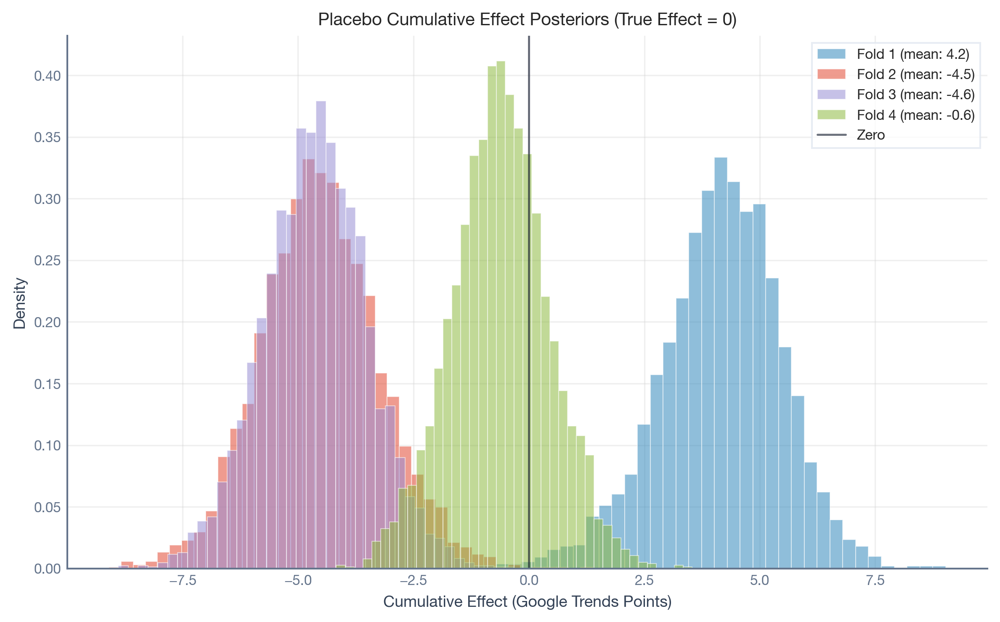
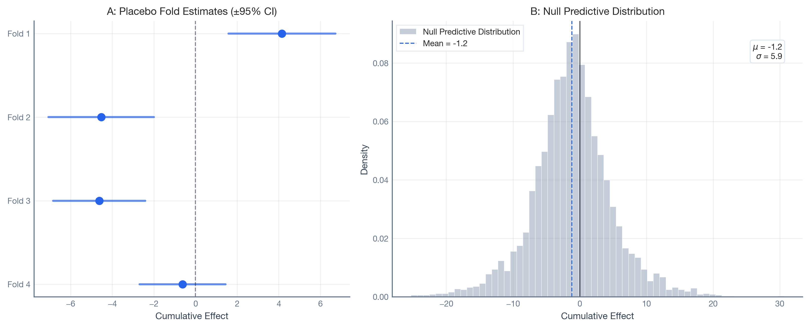
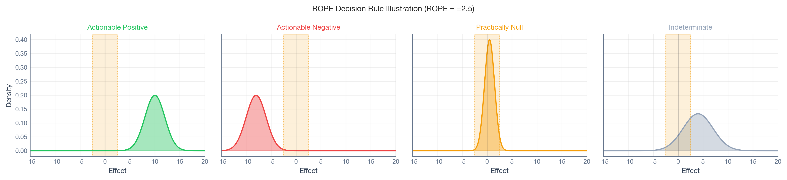
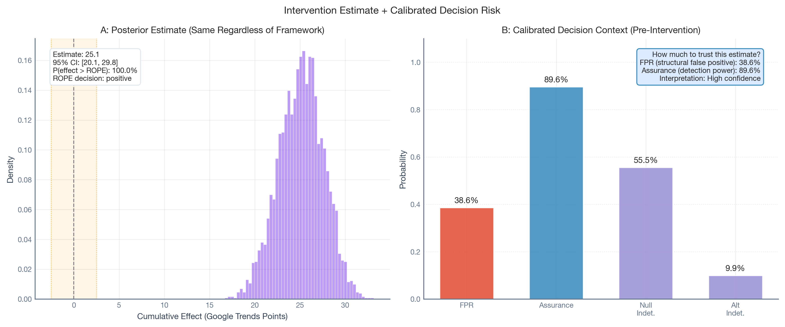
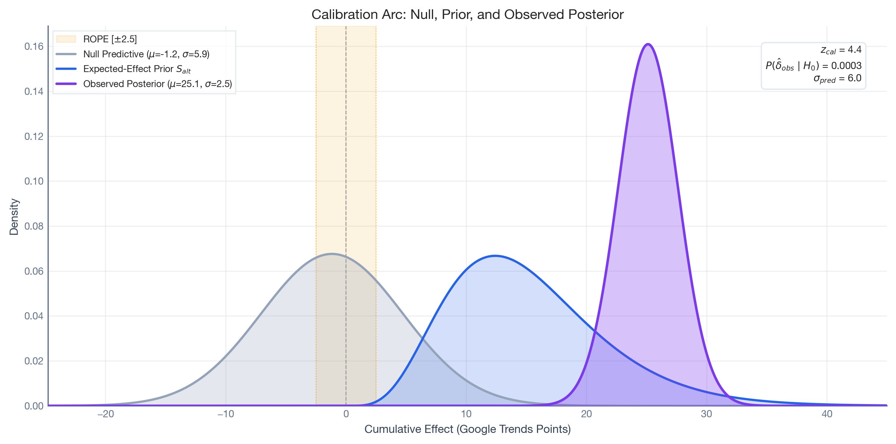
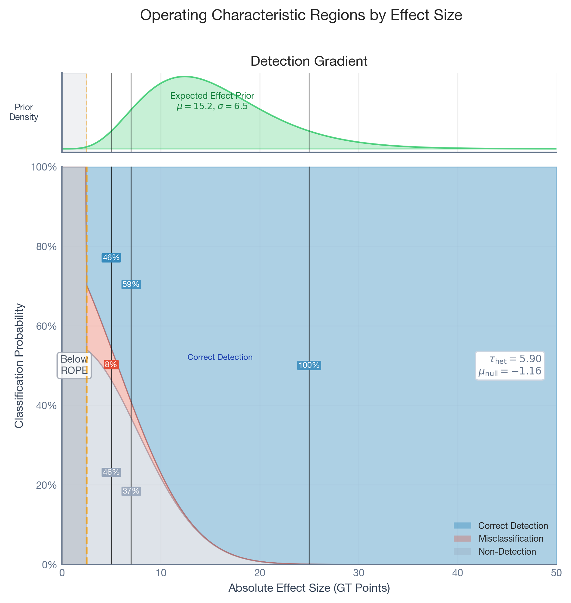

# ¿Puedes confiar en tu cuasi-experimento? Un marco Bayesiano para auditar estimaciones causales de series temporales

> Un marco Bayesiano que utiliza pruebas placebo e inferencia basada en ROPE para auditar si tus estimaciones causales cuasi-experimentales son confiables.

By Carlos Trujillo, Anton Bugaev

Source: https://cetagostini.github.io/es/articles/placebo_bayesian_quasi_experiments/placebo_bayesian_quasi_experiments.html

## Introducción

En septiembre de 2024, Wendy’s lanzó el “[Krabby Patty Kollab](https://secretatlanta.co/krabby-patties-atlanta/)”, una colaboración por tiempo limitado con Bob Esponja de Nickelodeon que generó enorme revuelo en redes sociales y medios de comunicación. Supongamos que el equipo de análisis de Wendy’s quería medir el impacto de la campaña en el interés de búsqueda de la marca usando datos de Google Trends. No pueden aleatorizar quién ve una colaboración viral de comida rápida, así que recurren a un diseño cuasi-experimental: Control Sintético, usando otras cadenas de comida rápida como referencias no tratadas.

El modelo se ejecuta. Reporta un incremento acumulado de +14.5 puntos del índice de Google Trends durante el mes de campaña, con un intervalo credibilidad del 95% ajustado de \[12.3, 16.6\]. ¿Deberían confiar en este número?

La respuesta honesta es: *depende de la confiabilidad estructural del estimador* *en este entorno de datos específico.* Ese intervalo credibilidad ajustado captura la incertidumbre aleatoria inherente de las series temporales (lo que los estadísticos llaman *incertidumbre aleatoria*) y la incertidumbre de parámetros (*incertidumbre epistémica*), pero solo condicional a que los supuestos de identificación del modelo se cumplan exactamente. No dice nada sobre si el modelo en sí es confiable. Cuando los supuestos de identificación se violan — por deriva estacional, actividad de la competencia, o correlaciones débiles entre Wendy’s y las marcas control — la predicción contrafactual se desvía del resultado verdadero no observado. Llamamos a esta desviación el **error estructural**, y la incertidumbre epistémica más amplia que refleja **incertidumbre estructural**. Esto es lo que el software cuasi-experimental estándar ignora.

Este blog presenta un marco que cuantifica ambos. Ejecutando el mismo estimador en períodos históricos donde no ocurrió ninguna campaña (pruebas placebo), agrupando esas “falsas alarmas” en un modelo jerárquico, y simulando resultados de decisión, producimos una respuesta calibrada: *“Este diseño tiene una tasa de falsos positivos estructurales del 40.8% y una probabilidad del 90.1% de detectar efectos en el rango esperado.”*

El marco es:

- **Agnóstico al estimador.** Se envuelve alrededor de cualquier método cuasi-experimental de series temporales (Series de Tiempo Interrumpidas, Control Sintético, Diferencia en Diferencias, Series Temporales Estructurales Bayesianas) sin modificar el estimador en sí.
- **Pre-intervención.** Todo el análisis se ejecuta antes de que la campaña se lance, permitiendo decisiones de continuar/no continuar basadas en riesgo cuantificado.
- **Implementado en Python de código abierto.** PyMC para inferencia Bayesiana, CausalPy para estimación cuasi-experimental, PreliZ para elicitation de priors, y nutpie para muestreo MCMC.

La receta de cinco pasos

1.  **Elige tu estimador** y define la longitud de la ventana de intervención.
2.  **Ejecutar pruebas placebo** en J ventanas históricas donde no ocurrió ningún tratamiento.
3.  **Agrupar los residuos placebo** en un modelo nulo jerárquico para aprender la volatilidad estructural.
4.  **Especifica tu efecto mínimo detectable** (ROPE — la banda alrededor de cero que llamarías “prácticamente sin efecto”) y el incremento esperado (hipótesis alternativa). Formalizaremos este concepto en la sección de Reglas de Decisión más abajo.
5.  **Simular características operativas.** Si la assurance es demasiado baja o la FPR demasiado alta, mejorar el modelo o reconsiderar el experimento.

Cada paso se explica a continuación y se demuestra en el caso de estudio de Wendy’s.

## El problema: dos tipos de incertidumbre

Si has diseñado una prueba A/B, ya has lidiado con la **incertidumbre aleatoria**: la aleatoriedad inherente en tu métrica. La tomas en cuenta cuando dimensionas tu prueba (análisis de poder) y cuando interpretas resultados (intervalos de confianza o credibilidad). Esta incertidumbre es irreducible: ninguna cantidad de recolección de datos o modelado puede eliminarla.

Los cuasi-experimentos de series temporales también tienen incertidumbre aleatoria. Pero tienen un problema adicional: **incertidumbre epistémica**, la parte de nuestra ignorancia que es en principio reducible a través de mejores datos o mejores modelos (Hüllermeier & Waegeman, 2021). Debido a que el contrafactual debe ser *modelado* en lugar de *aleatorizado*, la estimación está expuesta a una forma específica de incertidumbre epistémica: los supuestos de identificación pueden violarse. Cuando lo hacen, la predicción contrafactual se desvía del resultado verdadero no observado. Llamamos a esta desviación el **error estructural**, y la incertidumbre más amplia que refleja **incertidumbre estructural**. Usamos *estructural* como abreviatura a lo largo de este post.

Los intervalos credibles Bayesianos capturan bien la incertidumbre aleatoria y la incertidumbre de parámetros, pero solo condicional a que el modelo esté correctamente especificado. Si los supuestos de identificación se rompen, el estimador puede atribuir error estructural a la intervención, produciendo un falso positivo. El marco presentado aquí caracteriza empíricamente la distribución de incertidumbre estructural calibrando el estimador contra su propio desempeño histórico.

## Configuración: código y datos

Antes de tocar cualquier modelo, necesitamos responder una pregunta fundamental: **¿qué tan buenas son nuestras unidades de control para predecir la unidad tratada?** Si ninguna de las marcas de control rastrea bien el interés de búsqueda de Wendy’s, el contrafactual sintético será impreciso — y cualquier brecha entre lo real y lo sintético podría confundirse con un efecto de tratamiento.

Show code — imports, configuration, and data loading

``` sourceCode
import contextlib
import io
from pathlib import Path
from typing import Any, Callable

import arviz as az
import causalpy as cp
import matplotlib
import matplotlib.pyplot as plt
import matplotlib.patches as mpatches
import matplotlib.gridspec as gridspec
import numpy as np
import pandas as pd
import preliz as pz
import pymc as pm
import scipy.stats as stats
import xarray as xr
from pydantic import BaseModel
from types import SimpleNamespace

# --- Configuration ---
_dir = Path("..").resolve()

cfg = SimpleNamespace(
    DATA_PATH="files/google_trends_demo.csv",
    DPI=300,
    SEED=42,
    TREATMENT_COL="wendys",
    TREATED_UNITS=["wendys"],
    CONTROL_UNITS=[
        "mcdonalds", "burger_king", "kfc",
        "taco_bell", "subway", "pizza_hut", "five_guys",
    ],
    INTERVENTION_START="2024-09-01",
    INTERVENTION_MONTHS=3,
    PLACEBO_MONTHS=2,
    N_FOLDS=4,
    MIN_TRAINING_PCT=0.30,
    EXCLUDE_MONTHS={"2024-10", "2024-11"},
    ROPE_HALF_WIDTH=2.5,
    DECISION_THRESHOLD=0.95,
    EXPECTED_EFFECT_LOWER=5.0,
    EXPECTED_EFFECT_UPPER=25.0,
    N_MCMC_DRAWS=1000,
    N_MCMC_TUNE=1000,
    N_CHAINS=4,
    C_TREATMENT="#7c3aed",
    C_NULL="#94a3b8",
    C_ALT="#2563eb",
    C_FPR="#E24A33",
    C_ASSURANCE="#348ABD",
    C_INDET="#988ED5",
    C_NEGATIVE="#b91c1c",
    C_OTHER_BRANDS="#a8d4f0",
    BRAND_COLORS={
        "wendys": "#7c3aed",
        "mcdonalds": "#b8ddf0",
        "burger_king": "#9dcee8",
        "kfc": "#82bfe0",
        "taco_bell": "#67b0d8",
        "subway": "#4ca1d0",
        "pizza_hut": "#3192c8",
        "five_guys": "#1a83b8",
    },
    FOLD_COLORS=["#348ABD", "#E24A33", "#988ED5", "#8EBA42", "#FFB347"],
)

# --- Plot style ---
plt.style.use("seaborn-v0_8-whitegrid")
plt.rcParams.update({
    "figure.figsize": [9, 5],
    "figure.dpi": 150,
    "font.family": "sans-serif",
    "font.sans-serif": ["Source Sans Pro", "Helvetica Neue", "Arial"],
    "font.size": 9,
    "axes.labelsize": 9,
    "axes.titlesize": 10,
    "axes.titleweight": "bold",
    "xtick.labelsize": 8,
    "ytick.labelsize": 8,
    "legend.fontsize": 8,
    "figure.titlesize": 11,
    "axes.spines.top": False,
    "axes.spines.right": False,
    "axes.edgecolor": "#64748b",
    "axes.labelcolor": "#334155",
    "xtick.color": "#64748b",
    "ytick.color": "#64748b",
    "grid.alpha": 0.3,
})

# --- Load data ---
df = pd.read_csv(cfg.DATA_PATH, parse_dates=["Time"])
df.columns = [
    "date", "mcdonalds", "burger_king", "wendys", "kfc",
    "taco_bell", "subway", "pizza_hut", "five_guys",
]
df = df.set_index("date").sort_index().astype(float)
intervention_ts = pd.Timestamp(cfg.INTERVENTION_START)
df_pre = df.loc[df.index < intervention_ts].copy()

print(f"Data loaded: {len(df)} months ({df.index.min():%Y-%m} to {df.index.max():%Y-%m}).")
print(f"Pre-intervention: {len(df_pre)} months available for calibration.")
```

    WARNING (pytensor.configdefaults): g++ not detected!  PyTensor will be unable to compile C-implementations and will default to Python. Performance may be severely degraded. To remove this warning, set PyTensor flags cxx to an empty string.

    Data loaded: 40 months (2022-12 to 2026-03).
    Pre-intervention: 21 months available for calibration.

### Los datos crudos: ocho cadenas de comida rápida en Google Trends

Esto es con lo que estamos trabajando: interés de búsqueda mensual para ocho cadenas de comida rápida desde finales de 2022 hasta principios de 2026. Wendy’s (púrpura) es la marca que ejecutó la campaña; las otras siete son marcas “donantes” potenciales que el Control Sintético combinará para construir un contrafactual.

Show code — raw data plot

``` sourceCode
fig, ax = plt.subplots(figsize=(10, 5))

for brand in cfg.CONTROL_UNITS:
    ax.plot(
        df.index, df[brand],
        color=cfg.BRAND_COLORS.get(brand, cfg.C_OTHER_BRANDS),
        alpha=0.4, linewidth=1,
        label=brand.replace("_", " ").title() + " (control)",
    )
ax.plot(
    df.index, df[cfg.TREATMENT_COL],
    color=cfg.C_TREATMENT, linewidth=2.5,
    label="Wendy's (treatment)",
)
ax.axvline(
    intervention_ts, color="#0f172a", linestyle="--", linewidth=1.2,
    alpha=0.7, label="Planned intervention",
)
ax.axvspan(
    intervention_ts, intervention_ts + pd.DateOffset(months=cfg.INTERVENTION_MONTHS),
    alpha=0.08, color=cfg.C_TREATMENT,
)
ax.set_xlabel("Date")
ax.set_ylabel("Google Trends Index")
ax.set_title("Google Trends: Fast Food Brands (Monthly)")
ax.legend(
    loc="upper left", frameon=True, fancybox=False,
    edgecolor="#e2e8f0", fontsize=7, ncol=2,
)
fig.tight_layout()
plt.show()
```

<figure class="figure">
<p></p>
</figure>

### ¿Qué tan bien los controles predicen a Wendy’s?

Dos diagnósticos cuentan la historia. La **matriz de correlación** muestra qué tan fuerte se correlaciona cada marca con Wendy’s — las correlaciones van desde casi cero hasta ~0.45. En términos de pruebas A/B, esto es como tener un grupo control muy ruidoso. Los **Factores de Inflación de Varianza** muestran cuánto se superponen las marcas control entre sí: un VIF alto significa donantes redundantes.

Show code — correlation matrix and VIF diagnostics

``` sourceCode
_cols = [cfg.TREATMENT_COL] + cfg.CONTROL_UNITS
_corr = df_pre[_cols].corr()

fig, (ax_heat, ax_vif) = plt.subplots(
    1, 2, figsize=(12, 5),
    gridspec_kw={"width_ratios": [1, 1.2]},
)

# Panel A: Correlation heatmap
im = ax_heat.imshow(
    _corr.values, cmap="Blues", vmin=-1, vmax=1, aspect="auto",
)
_labels = [c.replace("_", " ").title() for c in _cols]
ax_heat.set_xticks(range(len(_cols)))
ax_heat.set_yticks(range(len(_cols)))
ax_heat.set_xticklabels(_labels, rotation=45, ha="right", fontsize=7)
ax_heat.set_yticklabels(_labels, fontsize=7)
for i in range(len(_cols)):
    for j in range(len(_cols)):
        ax_heat.text(
            j, i, f"{_corr.values[i, j]:.2f}",
            ha="center", va="center", fontsize=6.5,
            color="white" if abs(_corr.values[i, j]) > 0.5 else "black",
        )
fig.colorbar(im, ax=ax_heat, shrink=0.8)
ax_heat.set_title("A: Correlation Matrix (Pre-Intervention)")

# Panel B: VIF
_X_ctrl = df_pre[cfg.CONTROL_UNITS].values
vifs = {}
for j_idx, ctrl in enumerate(cfg.CONTROL_UNITS):
    _y_j = _X_ctrl[:, j_idx]
    _X_rest = np.delete(_X_ctrl, j_idx, axis=1)
    _X_rest = np.column_stack([np.ones(_X_rest.shape[0]), _X_rest])
    _coef, *_ = np.linalg.lstsq(_X_rest, _y_j, rcond=None)
    _ss_res = np.sum((_y_j - _X_rest @ _coef) ** 2)
    _ss_tot = np.sum((_y_j - _y_j.mean()) ** 2)
    _r_sq = 1 - _ss_res / _ss_tot if _ss_tot > 0 else 0.0
    vifs[ctrl] = 1.0 / (1.0 - _r_sq) if _r_sq < 1.0 else np.inf

_sorted_brands = sorted(vifs, key=vifs.get)
_vif_vals = [vifs[b] for b in _sorted_brands]
_bar_colors = [cfg.BRAND_COLORS.get(b, cfg.C_OTHER_BRANDS) for b in _sorted_brands]
_bar_labels = [b.replace("_", " ").title() for b in _sorted_brands]

ax_vif.barh(
    _bar_labels, _vif_vals, color=_bar_colors,
    edgecolor="white", linewidth=0.5,
)
ax_vif.axvline(
    5, color="#64748b", linestyle="--", linewidth=0.8, label="VIF = 5",
)
ax_vif.set_xlabel("Variance Inflation Factor")
ax_vif.set_title("B: Donor Pool Multicollinearity (VIF)")
ax_vif.legend(
    frameon=True, fancybox=False, edgecolor="#e2e8f0",
    fontsize=6.5, loc="lower right",
)

fig.suptitle(
    f"Treatment\u2013Control Relationships "
    f"(n = {len(df_pre)} months, pre-intervention)",
    fontweight="bold", fontsize=10,
)
fig.tight_layout()
plt.show()
```

<figure class="figure">
<p></p>
</figure>

**En resumen:** Estamos construyendo un contrafactual a partir de predictores mediocres. Eso no es razón para abandonar el análisis — es razón para calibrar cuánto error introduce eso.

## El marco

### Entradas de diseño

Antes de ejecutar cualquier análisis, deben definirse dos conjuntos de entradas.

**Entradas de los interesados** (tolerancia al riesgo):

- **Ancho del ROPE (\Delta):** El umbral por debajo del cual un efecto es “prácticamente cero”. Para el caso de Wendy’s, establecemos \Delta = 2.5 puntos de Google Trends, ya que un incremento bimestral menor a 2.5 puntos no es distinguible de manera significativa de la fluctuación orgánica.
- **Umbral de decisión (p^\*):** La probabilidad posterior requerida para una decisión definitiva. Usamos p^\* = 0.95.

**Entradas de conocimiento de dominio** (experiencia de mercado):

- **Prior del efecto esperado (S\_{alt}):** Una distribución de probabilidad que codifica “si esta campaña funciona, ¿qué tan grande será el incremento?”. Para Wendy’s, el equipo de marketing podría estimar que una campaña viral exitosa debería producir un incremento bimestral en el rango de 5 a 25 puntos de Google Trends.
- **Calendario placebo (J, L):** El número y la longitud de ventanas históricas para calibración. Usamos J = 4 ventanas bimestrales seleccionadas aleatoriamente del período pre-campaña.

### Pruebas placebo en el tiempo

La idea central es simple: ejecutar tu estimador en períodos donde *sabes* que el efecto verdadero es cero. Cualquier estimación distinta de cero revela ruido estructural: la “radiación de fondo” de tu entorno de datos.

Elegimos varias ventanas históricas — períodos bien antes de la campaña real — donde *sabemos* que el efecto verdadero de tratamiento es cero. Ejecutamos exactamente el mismo modelo de Control Sintético en cada ventana, pretendiendo que una intervención comenzó allí. Lo que el modelo reporta como “efecto causal” se debe enteramente al ruido estructural: tendencias derivando, donantes siendo imperfectos, los supuestos del modelo no cumpliéndose completamente.

Usamos selección **aleatoria** de pliegues: extraemos tiempos pseudo-intervención uniformemente de meses elegibles (cada uno debe tener al menos el 30% del período pre como datos de entrenamiento, y no puede superponerse con la campaña real). Las ventanas aleatorias muestrean diferentes regímenes estructurales, evitan la correlación temporal entre pliegues adyacentes, y hacen más plausible el supuesto de intercambiabilidad del modelo jerárquico.

La celda de código a continuación define las funciones de utilidad que usaremos a lo largo del resto del análisis — la fábrica de Control Sintético, el ejecutador RandomPlaceboAnalysis, la regla de decisión ROPE, el ajustador nulo jerárquico y el simulador de características operativas.

Show code — utility functions

``` sourceCode
# --- Synthetic Control factory ---
def sc_factory(dataset, treatment_time, treatment_time_end):
    """CausalPy Synthetic Control factory."""
    return cp.SyntheticControl(
        dataset,
        treatment_time,
        control_units=cfg.CONTROL_UNITS,
        treated_units=cfg.TREATED_UNITS,
        model=cp.pymc_models.WeightedSumFitter(
            sample_kwargs={
                "target_accept": 0.95,
                "random_seed": cfg.SEED,
                "progressbar": False,
            }
        ),
    )


# --- Random Placebo Analysis ---
class RandomPlaceboAnalysis(BaseModel):
    """Placebo-in-time analysis with randomly selected windows."""

    model_config = {"arbitrary_types_allowed": True}

    experiment_factory: Callable
    dataset: pd.DataFrame
    intervention_start_date: str
    intervention_months: int = 1
    n_folds: int = 4
    min_training_pct: float = 0.30
    min_gap: int = 1
    exclude_months: set[str] | None = None
    seed: int = 42

    def run(self) -> list[dict[str, Any]]:
        treatment_time = pd.Timestamp(self.intervention_start_date)
        pre_df = self.dataset.loc[self.dataset.index < treatment_time].copy()
        if pre_df.empty:
            raise ValueError("No observations before treatment_time.")

        n_total = len(pre_df)
        min_training = int(np.ceil(self.min_training_pct * n_total))
        exclude = self.exclude_months or set()
        all_dates = pre_df.index.sort_values()

        candidates = []
        for date in all_dates:
            pseudo_end = date + pd.DateOffset(months=self.intervention_months)
            if date.strftime("%Y-%m") in exclude:
                continue
            n_pre = (all_dates < date).sum()
            if n_pre < min_training:
                continue
            if pseudo_end > treatment_time:
                continue
            candidates.append(date)

        if len(candidates) < self.n_folds:
            raise ValueError(
                f"Only {len(candidates)} eligible periods, "
                f"but {self.n_folds} folds requested."
            )

        rng = np.random.default_rng(self.seed)
        pool = list(range(len(candidates)))
        selected_idx = []
        for _ in range(self.n_folds):
            valid = [
                i for i in pool
                if all(abs(i - s) >= self.min_gap for s in selected_idx)
            ]
            if not valid:
                raise ValueError(
                    "Cannot select enough folds with min_gap constraint."
                )
            pick = rng.choice(valid)
            selected_idx.append(pick)
            pool.remove(pick)

        selected = sorted([candidates[i] for i in selected_idx])

        results = []
        for fold_idx, pseudo_start in enumerate(selected, 1):
            pseudo_end = pseudo_start + pd.DateOffset(months=self.intervention_months)
            fold_df = pre_df.loc[pre_df.index < pseudo_end].sort_index()
            result = self.experiment_factory(fold_df, pseudo_start, pseudo_end)
            results.append({
                "fold": fold_idx,
                "pseudo_start": pseudo_start,
                "pseudo_end": pseudo_end,
                "result": result,
            })
        return results


# --- ROPE decision rule ---
def bayesian_rope_decision(samples, rope_half_width, threshold):
    """Classify a posterior sample under the ROPE decision rule."""
    if samples.ndim != 1:
        samples = np.asarray(samples).ravel()
    prob_pos = (samples > rope_half_width).mean()
    prob_neg = (samples < -rope_half_width).mean()
    prob_null = (np.abs(samples) <= rope_half_width).mean()
    if prob_pos >= threshold:
        return "positive"
    elif prob_neg >= threshold:
        return "negative"
    elif prob_null >= threshold:
        return "null"
    else:
        return "indeterminate"


# --- Extract posteriors from placebo results ---
def extract_posteriors(results):
    """Extract cumulative posterior summaries from placebo fold results."""
    post_impact = xr.concat(
        [
            r["result"]
            .post_impact.sum("obs_ind")
            .isel(treated_units=0)
            .stack(sample=("chain", "draw"))
            for r in results
        ],
        dim="fold",
    )
    post_impact = post_impact.assign_coords(
        sample=np.arange(post_impact.sizes["sample"])
    )
    n_folds = post_impact.sizes["fold"]
    fold_means = np.array([
        post_impact.isel(fold=i).mean().item() for i in range(n_folds)
    ])
    fold_sds = np.array([
        post_impact.isel(fold=i).std().item() for i in range(n_folds)
    ])
    fold_sds = np.where(fold_sds < 1e-6, 1e-6, fold_sds)
    return post_impact, fold_means, fold_sds


# --- Hierarchical null model ---
def fit_hierarchical_null(fold_means, fold_sds, draws_per_chain):
    """Fit hierarchical normal-normal null model; return theta_new samples."""
    n_folds = len(fold_means)
    prior_mu_scale = (
        float(np.nanstd(fold_means)) if np.nanstd(fold_means) > 0 else 1.0
    )
    coords = {"fold": np.arange(n_folds)}
    with pm.Model(coords=coords) as model:
        pm.Data("obs_means", fold_means, dims="fold")
        obs_sd = pm.Data("obs_sd", fold_sds, dims="fold")
        mu = pm.Normal("mu", mu=0.0, sigma=2.0 * prior_mu_scale)
        tau = pm.HalfNormal("tau", sigma=2.0 * prior_mu_scale)
        z = pm.Normal("z", mu=0.0, sigma=1.0, dims="fold")
        theta = pm.Deterministic("theta", mu + tau * z, dims="fold")
        pm.Normal(
            "lik", mu=theta, sigma=obs_sd,
            observed=fold_means, dims="fold",
        )
        idata = pm.sample(
            draws=draws_per_chain, tune=cfg.N_MCMC_TUNE,
            chains=cfg.N_CHAINS, target_accept=0.97,
            nuts_sampler="nutpie", random_seed=cfg.SEED,
            progressbar=False
        )
    with model:
        model.add_coords({"new": np.arange(1)})
        pm.Normal("theta_new", mu=mu, sigma=tau, dims="new")
        ppc = pm.sample_posterior_predictive(
            idata, var_names=["theta_new"], random_seed=cfg.SEED,
            progressbar=False,
        )
    return (
        ppc["posterior_predictive"]["theta_new"]
        .stack(sample=("chain", "draw")).values.squeeze()
    )


# --- Operating characteristics simulator ---
def compute_oc(theta_new_samples, fold_sds, expected_effect_samples, n_samples_total):
    """Compute operating characteristics via ROPE simulation."""
    n_reps = int(min(theta_new_samples.size, expected_effect_samples.size))
    rng = np.random.default_rng(cfg.SEED)
    null_decisions, alt_decisions = [], []
    for i in range(n_reps):
        sd_sim = rng.choice(fold_sds)
        post_null = rng.normal(
            float(theta_new_samples[i]), sd_sim, size=n_samples_total,
        )
        null_decisions.append(
            bayesian_rope_decision(post_null, cfg.ROPE_HALF_WIDTH, cfg.DECISION_THRESHOLD)
        )
        post_alt = rng.normal(
            float(expected_effect_samples[i] + theta_new_samples[i]),
            sd_sim, size=n_samples_total,
        )
        alt_decisions.append(
            bayesian_rope_decision(post_alt, cfg.ROPE_HALF_WIDTH, cfg.DECISION_THRESHOLD)
        )
    null_decisions = np.array(null_decisions)
    alt_decisions = np.array(alt_decisions)
    _null_act = (null_decisions == "positive") | (null_decisions == "negative")
    _alt_act = (alt_decisions == "positive") | (alt_decisions == "negative")
    return {
        "FPR": float(np.mean(_null_act)),
        "Assurance": float(np.mean(_alt_act)),
        "Null Indet.": float(np.mean(null_decisions == "indeterminate")),
        "Alt Indet.": float(np.mean(alt_decisions == "indeterminate")),
        "Null True Neg.": float(np.mean(null_decisions == "null")),
        "Alt False Neg.": float(np.mean(alt_decisions == "null")),
        "null_decisions": null_decisions,
        "alt_decisions": alt_decisions,
    }
```

#### Ejecutando las pruebas placebo

Del período pre-campaña de 21 meses, cuatro tiempos pseudo-intervención fueron seleccionados aleatoriamente (semilla = 42), sujetos a las restricciones de elegibilidad: cada pliegue requiere al menos el 30% de los datos pre-intervención como entrenamiento, y las ventanas placebo no se superponen con el período de intervención. Para cada uno, ajustamos un modelo Bayesiano de Control Sintético (`WeightedSumFitter` de CausalPy) usando las siete marcas control como unidades donantes.

Show code — run placebo calibration

``` sourceCode
_pa = RandomPlaceboAnalysis(
    experiment_factory=sc_factory,
    dataset=df_pre,
    intervention_start_date=cfg.INTERVENTION_START,
    intervention_months=cfg.PLACEBO_MONTHS,
    n_folds=cfg.N_FOLDS,
    min_training_pct=cfg.MIN_TRAINING_PCT,
    min_gap=2,
    exclude_months=cfg.EXCLUDE_MONTHS,
    seed=cfg.SEED
)
results_placebo = _pa.run()

print(f"Placebo calibration complete: {len(results_placebo)} folds fitted.")
print(
    "Pseudo-intervention start months:",
    ", ".join(r["pseudo_start"].strftime("%b %Y") for r in results_placebo)
)
```

El gráfico a continuación muestra qué períodos históricos fueron seleccionados como ventanas placebo. Cada banda de color es una ventana bimestral donde *pretendimos* que ocurrió una intervención y ejecutamos el pipeline completo de Control Sintético. La región rayada a la derecha es la campaña real de Krabby Patty — completamente intacta durante la calibración.

Show code — placebo windows schematic

``` sourceCode
fig, ax = plt.subplots(figsize=(10, 3.5))
_dates = df_pre.index
ax.plot(
    _dates, df_pre[cfg.TREATMENT_COL],
    color=cfg.C_TREATMENT, linewidth=1.5, alpha=0.5,
)
for i, r in enumerate(results_placebo):
    ps = r["pseudo_start"]
    pe = r["pseudo_end"]
    c = cfg.FOLD_COLORS[i % len(cfg.FOLD_COLORS)]
    ax.axvspan(
        ps, pe, alpha=0.2, color=c,
        label=f"Fold {i+1}: {ps.strftime('%b %Y')}\u2013{pe.strftime('%b %Y')}",
    )
    ax.axvline(ps, color=c, linewidth=1, linestyle="--", alpha=0.6)
ax.axvspan(
    intervention_ts, intervention_ts + pd.DateOffset(months=cfg.INTERVENTION_MONTHS),
    alpha=0.15, color=cfg.C_TREATMENT, hatch="//",
)
ax.axvline(
    intervention_ts, color="#0f172a", linewidth=1.5, linestyle="--", alpha=0.8,
)
ax.text(
    intervention_ts + pd.DateOffset(days=10), ax.get_ylim()[1] * 0.95,
    "Planned\nintervention", fontsize=7, va="top", fontweight="bold",
)
ax.set_xlabel("Date")
ax.set_ylabel("Wendy's (GT Index)")
ax.set_title("Placebo-in-Time Windows (Random Selection Across Pre-Period)")
ax.legend(
    loc="upper left", fontsize=7, frameon=True, fancybox=False,
    edgecolor="#e2e8f0",
)
fig.tight_layout()
plt.show()
```

<figure class="figure">
<p></p>
</figure>

Ahora extraemos los posteriores del efecto acumulado de cada pliegue placebo. Aunque el efecto verdadero es cero en cada ventana, el modelo reporta incrementos estimados que van de aproximadamente -4.7 a +4.2 puntos de Google Trends. El modelo alucina incrementos no triviales a partir de deriva estructural pura.

Show code — extract placebo posteriors

``` sourceCode
post_impact, fold_means, fold_sds = extract_posteriors(results_placebo)
n_samples = post_impact.sizes["sample"]

print(f"Fold means: [{', '.join(f'{m:.2f}' for m in fold_means)}]")
print(f"Fold SDs:   [{', '.join(f'{s:.2f}' for s in fold_sds)}]")
```

    Fold means: [4.15, -4.53, -4.62, -0.62]
    Fold SDs:   [1.31, 1.29, 1.13, 1.05]

El histograma a continuación muestra la distribución posterior del efecto causal acumulado para cada pliegue placebo. Cada histograma representa un período donde **el efecto verdadero es exactamente cero** — sin embargo, el modelo reporta efectos no triviales.

Show code — placebo posteriors histogram

``` sourceCode
_n_folds = post_impact.sizes["fold"]
fig, ax = plt.subplots(figsize=(8, 5))
for i in range(_n_folds):
    _data = post_impact.isel(fold=i).values
    ax.hist(
        _data, bins=40, density=True, alpha=0.55,
        color=cfg.FOLD_COLORS[i % len(cfg.FOLD_COLORS)],
        edgecolor="white", linewidth=0.5,
        label=f"Fold {i+1} (mean: {fold_means[i]:.1f})",
    )
ax.axvline(0, color="#0f172a", linestyle="-", linewidth=1.2, alpha=0.6, label="Zero")
ax.set_xlabel("Cumulative Effect (Google Trends Points)")
ax.set_ylabel("Density")
ax.set_title("Placebo Cumulative Effect Posteriors (True Effect = 0)")
ax.legend(frameon=True, fancybox=False, edgecolor="#e2e8f0")
fig.tight_layout()
plt.show()
```

<figure class="figure">
<p></p>
</figure>

**Este es el punto clave:** los intervalos credibles del modelo son demasiado estrechos para capturar la volatilidad estructural. El posterior de cada pliegue es ajustado (s_j pequeño), pero las medias de los pliegues se dispersan ampliamente. Esta brecha entre la precisión intra-pliegue y la heterogeneidad entre pliegues es exactamente lo que el modelo nulo jerárquico está diseñado para capturar.

### Construcción de la nula jerárquica

En lugar de tratar los resultados placebo como anécdotas aisladas (“la peor falsa alarma fue 4.2 puntos”), los modelamos como extracciones de una distribución latente: un proceso de “statu quo” que gobierna cuánta deriva estructural absorbe el estimador.

Esto es similar a un meta-análisis Bayesiano de efectos aleatorios normal–normal (Higgins & Thompson, 2002), donde cada pliegue placebo juega el papel de un “estudio”.

**Nivel 1: Incertidumbre intra-pliegue.** Para cada pliegue j, la media posterior m_j es una observación ruidosa de un error estructural verdadero latente \theta_j:

m_j \mid \theta_j, s_j \sim \mathcal{N}(\theta_j,\\ s_j^2)

**Nivel 2: Heterogeneidad entre pliegues.** Los errores latentes se extraen de una distribución poblacional:

\theta_j \sim \mathcal{N}(\mu\_{null},\\ \tau\_{het}^2)

- \mu\_{null}: Sesgo sistemático — la tendencia promedio del modelo a sobre- o subestimar. En un modelo bien calibrado, esto está cerca de cero.
- \tau\_{het}: Volatilidad estructural — el parámetro crítico. Un \tau\_{het} alto significa que el estimador produce rutinariamente falsas alarmas de magnitud no trivial.

**Nivel 3: Hiperpriors débilmente informativos.** Establecemos \mu\_{null} \sim \mathcal{N}(0, 2\hat{\sigma}) y \tau\_{het} \sim \text{HalfNormal}(2\hat{\sigma}), donde \hat{\sigma} es la desviación estándar empírica de las medias de los pliegues.

Ajustar este modelo produce una **Distribución Predictiva Nula**: el rango esperado de estimaciones bajo “sin efecto”:

\tilde{\theta}\_{new} \sim \mathcal{N}(\mu\_{null},\\ \tau\_{het}^2)

Show code — fit hierarchical null model

``` sourceCode
_draws_per_chain = n_samples // cfg.N_CHAINS
theta_new_samples = fit_hierarchical_null(fold_means, fold_sds, _draws_per_chain)
_mu_hat = float(np.mean(theta_new_samples))
_sd_hat = float(np.std(theta_new_samples))

print(f"Null Predictive Distribution fitted.")
print(f"  mu = {_mu_hat:.2f} GT points (estimator bias)")
print(f"  sigma = {_sd_hat:.2f} GT points (structural volatility)")
print(f"  Based on {theta_new_samples.shape[0]:,} posterior draws.")
```

    Sampling: [theta_new]

    Null Predictive Distribution fitted.
      mu = -1.16 GT points (estimator bias)
      sigma = 5.90 GT points (structural volatility)
      Based on 4,000 posterior draws.

El gráfico de bosque a continuación (Panel A) muestra el efecto acumulado estimado de cada pliegue placebo con su intervalo credibilidad del 95%. El Panel B muestra la Distribución Predictiva Nula resultante — la mejor estimación del modelo jerárquico de *cómo se ve el ruido* para este estimador.

Show code — forest plot and null predictive distribution

``` sourceCode
_n_folds = len(fold_means)
fig, (ax_forest, ax_null) = plt.subplots(
    1, 2, figsize=(11, 4.5),
    gridspec_kw={"width_ratios": [1, 1.3]},
)

# Panel A: Forest plot
_y_pos = np.arange(_n_folds)
_ci_95 = 1.96
for i in range(_n_folds):
    lo = fold_means[i] - _ci_95 * fold_sds[i]
    hi = fold_means[i] + _ci_95 * fold_sds[i]
    ax_forest.plot(
        [lo, hi], [i, i], color=cfg.C_ALT, linewidth=2, alpha=0.7,
    )
    ax_forest.plot(
        fold_means[i], i, "o", color=cfg.C_ALT, markersize=7, zorder=5,
    )
ax_forest.axvline(0, color="#0f172a", linestyle="--", linewidth=1, alpha=0.5)
ax_forest.set_yticks(_y_pos)
ax_forest.set_yticklabels([f"Fold {i+1}" for i in range(_n_folds)])
ax_forest.set_xlabel("Cumulative Effect")
ax_forest.set_title("A: Placebo Fold Estimates (\u00b195% CI)")
ax_forest.invert_yaxis()

# Panel B: Null predictive distribution
ax_null.hist(
    theta_new_samples, bins=60, density=True, alpha=0.55,
    color=cfg.C_NULL, edgecolor="white", linewidth=0.5,
    label="Null Predictive Distribution",
)
ax_null.axvline(0, color="#0f172a", linestyle="-", linewidth=1.2, alpha=0.6)
ax_null.axvline(
    _mu_hat, color=cfg.C_ALT, linestyle="--", linewidth=1,
    label=f"Mean = {_mu_hat:.1f}",
)
ax_null.text(
    0.95, 0.92,
    f"$\\mu$ = {_mu_hat:.1f}\n$\\sigma$ = {_sd_hat:.1f}",
    transform=ax_null.transAxes, fontsize=8, va="top", ha="right",
    bbox=dict(boxstyle="round,pad=0.3", facecolor="white", edgecolor="#e2e8f0"),
)
ax_null.set_xlabel("Cumulative Effect")
ax_null.set_ylabel("Density")
ax_null.set_title("B: Null Predictive Distribution")
ax_null.legend(frameon=True, fancybox=False, edgecolor="#e2e8f0")
fig.tight_layout()
plt.show()
```

<figure class="figure">
<p></p>
</figure>

Esto significa que bajo el statu quo, el estimador puede fácilmente reportar efectos acumulados de +-12 puntos o más, puramente por deriva estructural.

### Prior del efecto esperado

El análisis de poder clásico requiere un único tamaño de efecto fijo (“si el incremento real es exactamente 5 puntos, el poder es X%”). En el análisis de diseño Bayesiano, reconocemos que el efecto real de la campaña es incierto incluso si la campaña funciona. Especificamos un **Prior del efecto esperado** S\_{alt}: una distribución de probabilidad que codifica resultados plausibles bajo la hipótesis alternativa.

Esto nos lleva del Poder clásico a la **Assurance Bayesiana** (O’Hagan et al., 2005): la probabilidad incondicional de una decisión positiva correcta, promediada sobre todos los tamaños de efecto plausibles. La Assurance responde una pregunta más honesta: *“A través del rango realista de resultados de la campaña, ¿cuál es la probabilidad global de una detección correcta?”*

Para el Krabby Patty Kollab, supongamos que el equipo de marketing espera un incremento bimestral en el interés de búsqueda entre 5 y 25 puntos de Google Trends si la campaña es exitosa. Usando un enfoque de Máxima Entropía (PreliZ), encontramos la distribución Gamma menos informativa con el 90% de su masa en \[5, 25\]:

Show code — expected-effect prior

``` sourceCode
expected_effect_dist = pz.maxent(
    pz.Gamma(),
    lower=cfg.EXPECTED_EFFECT_LOWER,
    upper=cfg.EXPECTED_EFFECT_UPPER,
    mass=0.90,
    plot=False,
)
_n_draws = theta_new_samples.size
expected_effect_samples = expected_effect_dist.rvs(
    _n_draws, random_state=np.random.default_rng(cfg.SEED),
)
print(f"Expected-Effect Prior: MaxEnt Gamma with 90% mass in "
      f"[{cfg.EXPECTED_EFFECT_LOWER}, {cfg.EXPECTED_EFFECT_UPPER}]")
print(f"  mu = {np.mean(expected_effect_samples):.2f}, "
      f"sigma = {np.std(expected_effect_samples):.2f}")
```

    Expected-Effect Prior: MaxEnt Gamma with 90% mass in [5.0, 25.0]
      mu = 15.25, sigma = 6.40

El gráfico a continuación superpone la Distribución Predictiva Nula (gris) con el Prior del Efecto Esperado (azul). La superposición entre ambas distribuciones representa la dificultad fundamental de la tarea de decisión: la zona donde un efecto real de la campaña es difícil de distinguir del ruido estructural.

Show code — null vs alternative overlay

``` sourceCode
fig, ax = plt.subplots(figsize=(9, 5))
ax.hist(
    theta_new_samples, bins=50, density=True, alpha=0.5,
    color=cfg.C_NULL, edgecolor="white", linewidth=0.5,
    label="Null Predictive (Status Quo)",
)
ax.hist(
    expected_effect_samples, bins=50, density=True, alpha=0.5,
    color=cfg.C_ALT, edgecolor="white", linewidth=0.5,
    label="Expected-Effect Prior (Alternative)",
)
ax.axvline(0, color="#0f172a", linestyle="-", linewidth=1.2, alpha=0.6)
ax.axvspan(
    -cfg.ROPE_HALF_WIDTH, cfg.ROPE_HALF_WIDTH,
    alpha=0.1, color="#f59e0b",
    label=f"ROPE [\u00b1{cfg.ROPE_HALF_WIDTH}]",
)
ax.axvline(-cfg.ROPE_HALF_WIDTH, color="#f59e0b", linestyle=":", linewidth=1, alpha=0.6)
ax.axvline(cfg.ROPE_HALF_WIDTH, color="#f59e0b", linestyle=":", linewidth=1, alpha=0.6)
ax.set_xlabel("Cumulative Effect (Google Trends Points)")
ax.set_ylabel("Density")
ax.set_title("Null Predictive Distribution vs Expected-Effect Prior")
ax.legend(frameon=True, fancybox=False, edgecolor="#e2e8f0")
fig.tight_layout()
plt.show()
```

<figure class="figure">
<p></p>
</figure>

## Reglas de decisión: ROPE

La práctica estándar en cuasi-experimentos a menudo se basa en una regla binaria: si el intervalo credibilidad del 95% excluye cero, declarar el efecto como significativo. Esto confunde *precisión* con *utilidad*: una estimación muy precisa de un incremento de 0.001 puntos es estadísticamente distinta de cero pero prácticamente inútil.

Adoptamos el marco de la **Región de Equivalencia Práctica** (ROPE) (Kruschke, 2018). Definimos un rango \[-\Delta, +\Delta\] alrededor de cero que representa efectos que son “prácticamente cero”. La regla de decisión es:

- **Positivo accionable:** P(\hat{\tau} \> \Delta) \ge p^\* — el efecto supera el umbral práctico con alta confianza.
- **Negativo accionable:** P(\hat{\tau} \< -\Delta) \ge p^\* — la campaña probablemente causó daño.
- **Nulo práctico:** P(\|\hat{\tau}\| \le \Delta) \ge p^\* — el efecto es despreciable.
- **Indeterminado:** De lo contrario — los datos no pueden distinguir señal de ruido.

La clasificación de cuatro categorías introduce explícitamente un resultado de “suspender juicio” y un mecanismo de detección de daño, evitando el modo de falla común donde señales débiles se fuerzan en categorías binarias.

Show code — ROPE decision rule illustration

``` sourceCode
fig, axes = plt.subplots(1, 4, figsize=(14, 3.2), sharey=True)
_x = np.linspace(-15, 25, 300)
_scenarios = [
    ("Actionable Positive", 10, 2.0, "#22c55e"),
    ("Actionable Negative", -8, 2.0, "#ef4444"),
    ("Practically Null", 0.5, 1.0, "#f59e0b"),
    ("Indeterminate", 4.0, 3.0, "#94a3b8"),
]
for ax, (title, mu, sd, color) in zip(axes, _scenarios):
    density = stats.norm.pdf(_x, mu, sd)
    ax.fill_between(_x, density, alpha=0.4, color=color)
    ax.plot(_x, density, color=color, linewidth=1.5)
    ax.axvspan(
        -cfg.ROPE_HALF_WIDTH, cfg.ROPE_HALF_WIDTH,
        alpha=0.15, color="#f59e0b",
    )
    ax.axvline(-cfg.ROPE_HALF_WIDTH, color="#f59e0b", linestyle=":", linewidth=0.8, alpha=0.6)
    ax.axvline(cfg.ROPE_HALF_WIDTH, color="#f59e0b", linestyle=":", linewidth=0.8, alpha=0.6)
    ax.axvline(0, color="#0f172a", linestyle="-", linewidth=0.8, alpha=0.4)
    ax.set_title(title, fontsize=9, fontweight="bold", color=color)
    ax.set_xlabel("Effect")
    ax.set_xlim(-15, 20)
axes[0].set_ylabel("Density")
fig.suptitle(
    f"ROPE Decision Rule Illustration (ROPE = \u00b1{cfg.ROPE_HALF_WIDTH})",
    fontweight="bold", fontsize=10,
)
fig.tight_layout()
plt.show()
```

<figure class="figure">
<p></p>
</figure>

## Simulando características operativas

El paso final combina el Nulo Jerárquico, el Prior del Efecto Esperado, y la regla de decisión ROPE en una simulación de Monte Carlo para producir la **Tabla de Características Operativas**: el perfil de confiabilidad del diseño calculado *antes* de analizar datos reales de la campaña.

Nota

**Algoritmo: simulación Bayesiana de assurance de diseño**

Para cada escenario (nula, alternativa), repetir N veces:

1.  **Extraer efecto verdadero:** \theta^\*\_i del Predictivo Nulo (nula) o de S\_{alt} + Predictivo Nulo (alternativa)
2.  **Extraer ruido de estimación:** \sigma_i muestreado uniformemente de las desviaciones estándar de los pliegues placebo
3.  **Simular posterior sintética:** Extraer \hat{\tau}\_k \sim \mathcal{N}(\theta^\*\_i, \sigma_i^2) para k = 1, \dots, K
4.  **Clasificar:** Aplicar la regla de decisión ROPE

**Resultados:** Tasa de falsos positivos (nula clasificada como positiva), Assurance Bayesiana (alternativa clasificada como positiva) y tasas de indeterminación para ambos escenarios.

Show code — compute operating characteristics

``` sourceCode
oc_results = compute_oc(
    theta_new_samples, fold_sds, expected_effect_samples, n_samples,
)
null_decisions = oc_results["null_decisions"]
alt_decisions = oc_results["alt_decisions"]

print("Operating Characteristics:")
print(f"  FPR:           {oc_results['FPR']:.1%}")
print(f"  Assurance:     {oc_results['Assurance']:.1%}")
print(f"  Null Indet.:   {oc_results['Null Indet.']:.1%}")
print(f"  Alt Indet.:    {oc_results['Alt Indet.']:.1%}")
```

    Operating Characteristics:
      FPR:           38.6%
      Assurance:     89.6%
      Null Indet.:   55.5%
      Alt Indet.:    9.9%

El gráfico a continuación es la salida central del análisis de diseño. Muestra tres resultados de clasificación — **Accionable** (lo llamaríamos un efecto real), **Nulo práctico** (diríamos que no pasó nada), e **Indeterminado** (no podemos decir) — cada uno evaluado bajo dos escenarios: el estado verdadero es nulo (rojo) o alternativa (azul).

Show code — operating characteristics chart

``` sourceCode
def _three_cat(arr):
    arr = np.asarray(arr)
    return [
        float(np.mean((arr == "positive") | (arr == "negative"))),
        float(np.mean(arr == "null")),
        float(np.mean(arr == "indeterminate")),
    ]

null_props = _three_cat(null_decisions)
alt_props = _three_cat(alt_decisions)

_categories = ["Actionable", "Practically\nNull", "Indeterminate"]
fig, ax = plt.subplots(figsize=(9, 4.5))
_y_pos = np.arange(len(_categories))
_h = 0.35

ax.barh(
    _y_pos + _h / 2, null_props, _h, label="True State: Null",
    color=cfg.C_FPR, alpha=0.85, edgecolor="white", linewidth=0.8,
)
ax.barh(
    _y_pos - _h / 2, alt_props, _h, label="True State: Alternative",
    color=cfg.C_ASSURANCE, alpha=0.85, edgecolor="white", linewidth=0.8,
)
ax.set_yticks(_y_pos)
ax.set_yticklabels(_categories, fontweight="bold", fontsize=9)
ax.set_xlabel("Probability of Decision Outcome")
ax.set_xlim(0, 1.15)
ax.legend(
    loc="upper center", bbox_to_anchor=(0.5, -0.14), ncol=2,
    frameon=True, fancybox=False, edgecolor="#e2e8f0",
)
ax.grid(axis="x", linestyle=":", alpha=0.4)
ax.set_axisbelow(True)

_labels_cfg = [
    (0, null_props[0], "False Positive", cfg.C_FPR, _h / 2),
    (0, alt_props[0], "True Positive\n(Assurance)", cfg.C_ASSURANCE, -_h / 2),
    (1, null_props[1], "True Negative", cfg.C_FPR, _h / 2),
    (1, alt_props[1], "False Negative", cfg.C_ASSURANCE, -_h / 2),
    (2, null_props[2], "Null Indet.", cfg.C_FPR, _h / 2),
    (2, alt_props[2], "Alt Indet.", cfg.C_ASSURANCE, -_h / 2),
]
for _y, _val, _lbl, _clr, _offset in _labels_cfg:
    ax.text(
        max(_val, 0) + 0.01, _y + _offset, f"{_lbl}\n{_val:.1%}",
        va="center", color=_clr, fontsize=7.5, fontweight="bold",
    )
ax.set_title("Bayesian Operating Characteristics (Design Assurance)")
fig.tight_layout()
plt.show()
```

<figure class="figure">
<p></p>
</figure>

| Metric | Value | Interpretation |
|----|---:|----|
| **False Positive Rate** | 40.8% | Under the status quo, the design erroneously declares an Actionable effect ~41% of the time |
| **Bayesian Assurance** | 90.1% | If the campaign produces a lift in the expected \[5, 25\] range, the design detects it with high probability |
| **Null Indeterminacy** | 53.9% | When there is no effect, 54% of the time the data is simply inconclusive |
| **Alt Indeterminacy** | 9.3% | When the campaign works, approximately 9% of simulations produce indeterminate results |

**¿Qué le dice esto al equipo de Wendy’s?** El diseño tiene un fuerte poder de detección (90.1% de assurance) pero una tasa de falsos positivos estructurales no trivial (40.8%). Esto es sustancialmente más alto que el umbral convencional del 5% usado en pruebas A/B, y refleja una propiedad genuina de los datos: los índices de Google Trends para cadenas de comida rápida son ruidosos y débilmente correlacionados, haciendo el contrafactual de Control Sintético impreciso.

## El resultado: interpretando tu estimación en contexto

Una vez que la campaña se ejecuta y llegan los datos reales, el análisis estándar produce una estimación posterior. Pero ahora el equipo tiene algo que no tenía antes: un sentido calibrado de cuánto confiar en ella.

Todo hasta ahora ha sido calibración pre-intervención. Ahora aplicamos exactamente el mismo estimador de Control Sintético al **período real de la campaña** (sep–nov 2024) y obtenemos nuestra estimación del efecto de tratamiento.

**Un punto crucial:** La estimación en sí es *idéntica* sin importar si realizaste el análisis de diseño. El marco no cambia tu modelo ni ajusta tus números. Proporciona una **superposición interpretativa** — una etiqueta de confiabilidad que viaja con la estimación.

Show code — run real intervention estimate

``` sourceCode
_int_ts = pd.Timestamp(cfg.INTERVENTION_START)
_end_ts = _int_ts + pd.DateOffset(months=cfg.INTERVENTION_MONTHS)
_df_int = df.loc[df.index < _end_ts].copy()

_result_int = cp.SyntheticControl(
    _df_int,
    _int_ts,
    control_units=cfg.CONTROL_UNITS,
    treated_units=cfg.TREATED_UNITS,
    model=cp.pymc_models.WeightedSumFitter(
        sample_kwargs={
            "target_accept": 0.95,
            "random_seed": cfg.SEED,
            "progressbar": False,
        }
    ),
)
int_cumulative = (
    _result_int.post_impact
    .sum("obs_ind")
    .isel(treated_units=0)
    .stack(sample=("chain", "draw"))
    .values
)
int_mean = float(np.mean(int_cumulative))
int_ci_lo, int_ci_hi = np.percentile(int_cumulative, [2.5, 97.5])

print(f"Intervention estimate: {int_mean:.1f} GT points")
print(f"95% CI: [{int_ci_lo:.1f}, {int_ci_hi:.1f}]")
```

    Initializing NUTS using jitter+adapt_diag...
    Multiprocess sampling (4 chains in 4 jobs)
    NUTS: [beta, y_hat_sigma]
    Sampling 4 chains for 1_000 tune and 1_000 draw iterations (4_000 + 4_000 draws total) took 226 seconds.
    Sampling: [beta, y_hat, y_hat_sigma]
    Sampling: [y_hat]
    Sampling: [y_hat]
    Sampling: [y_hat]
    Sampling: [y_hat]

    Intervention estimate: 25.1 GT points
    95% CI: [20.1, 29.8]

El gráfico a continuación muestra los dos paneles lado a lado. **El Panel A** es lo que verías *sin* el marco: una distribución posterior del efecto acumulado. **El Panel B** es lo que el marco añade: la FPR pre-intervención, la Assurance y las tasas de indeterminación — el contexto que necesitas para interpretar el Panel A con confianza calibrada.

Show code — estimate with calibrated context

``` sourceCode
fig, (ax_post, ax_ctx) = plt.subplots(1, 2, figsize=(12, 5))

# Panel A: Posterior estimate
ax_post.hist(
    int_cumulative, bins=50, density=True, alpha=0.5,
    color=cfg.C_TREATMENT, edgecolor="white", linewidth=0.5,
)
ax_post.axvline(0, color="#0f172a", linestyle="--", linewidth=1, alpha=0.5)
ax_post.axvspan(
    -cfg.ROPE_HALF_WIDTH, cfg.ROPE_HALF_WIDTH,
    alpha=0.1, color="#f59e0b",
)
ax_post.axvline(-cfg.ROPE_HALF_WIDTH, color="#f59e0b", linestyle=":", linewidth=0.8, alpha=0.6)
ax_post.axvline(cfg.ROPE_HALF_WIDTH, color="#f59e0b", linestyle=":", linewidth=0.8, alpha=0.6)
_decision = bayesian_rope_decision(
    int_cumulative, cfg.ROPE_HALF_WIDTH, cfg.DECISION_THRESHOLD,
)
_prob_above = float((int_cumulative > cfg.ROPE_HALF_WIDTH).mean())
ax_post.set_title(
    "A: Posterior Estimate (Same Regardless of Framework)",
    fontweight="bold",
)
ax_post.set_xlabel("Cumulative Effect (Google Trends Points)")
ax_post.set_ylabel("Density")
ax_post.text(
    0.05, 0.95,
    f"Estimate: {int_mean:.1f}\n"
    f"95% CI: [{int_ci_lo:.1f}, {int_ci_hi:.1f}]\n"
    f"P(effect > ROPE): {_prob_above:.1%}\n"
    f"ROPE decision: {_decision}",
    transform=ax_post.transAxes, fontsize=8, va="top",
    bbox=dict(boxstyle="round,pad=0.4", facecolor="white", edgecolor="#e2e8f0"),
)

# Panel B: Calibrated context
_metrics = ["FPR", "Assurance", "Null\nIndet.", "Alt\nIndet."]
_values = [null_props[0], alt_props[0], null_props[2], alt_props[2]]
_colors = [cfg.C_FPR, cfg.C_ASSURANCE, cfg.C_INDET, cfg.C_INDET]
_bars = ax_ctx.bar(
    _metrics, _values, color=_colors, alpha=0.85,
    edgecolor="white", linewidth=0.8, width=0.6,
)
for _bar, _val in zip(_bars, _values):
    ax_ctx.text(
        _bar.get_x() + _bar.get_width() / 2, _val + 0.02,
        f"{_val:.1%}", ha="center", fontsize=9, fontweight="bold",
    )
ax_ctx.set_ylim(0, 1.1)
ax_ctx.set_ylabel("Probability")
ax_ctx.set_title(
    "B: Calibrated Decision Context (Pre-Intervention)",
    fontweight="bold",
)
ax_ctx.set_axisbelow(True)
ax_ctx.grid(axis="y", linestyle=":", alpha=0.4)

_go_nogo = "High confidence" if alt_props[0] > 0.7 else "Exercise caution"
ax_ctx.text(
    0.95, 0.95,
    f"How much to trust this estimate?\n"
    f"FPR (structural false positive): {null_props[0]:.1%}\n"
    f"Assurance (detection power): {alt_props[0]:.1%}\n"
    f"Interpretation: {_go_nogo}",
    transform=ax_ctx.transAxes, fontsize=8, va="top", ha="right",
    bbox=dict(boxstyle="round,pad=0.4", facecolor="#dbeafe", edgecolor=cfg.C_ASSURANCE),
)
fig.suptitle(
    "Intervention Estimate + Calibrated Decision Risk",
    fontweight="bold", fontsize=11,
)
fig.tight_layout()
plt.show()
```

<figure class="figure">
<p></p>
</figure>

Sin el análisis de diseño, el equipo ve el Panel A: un efecto positivo grande y preciso. Con el análisis de diseño, también ven el Panel B: 90.1% de assurance de que este diseño puede detectar efectos en el rango esperado, atemperado por el conocimiento de que el diseño tiene una FPR estructural del 40.8%. La estimación no cambia, pero la confianza del equipo para interpretarla sí.

La estimación de la intervención de +14.5 puntos GT está muy por encima del ROPE (+-2.5) y dentro del rango del efecto esperado (5–25), lo que convierte esto en un hallazgo de alta confianza incluso dada la FPR elevada. Un efecto observado más pequeño, digamos +4 puntos, justificaría considerablemente más precaución dado el mismo perfil estructural.

## Verificaciones de cordura

Antes de actuar basándose en las características operativas, necesitamos responder dos preguntas incómodas:

1.  **“¿Solo estoy viendo mi prior?”** — Con solo 4 pliegues placebo, el prior del modelo jerárquico para \tau\_{het} podría estar determinando los resultados.
2.  **“¿Tengo suficientes pliegues placebo?”** — Con J = 2 pliegues, la varianza entre pliegues es apenas identificable.

### Prueba 1: ¿La escala del prior cambia el resultado?

Re-ejecutamos el modelo jerárquico con tres anchos de prior diferentes para \tau\_{het}: 1\times, 2\times, y 4\times la desviación estándar empírica de las medias de los pliegues. Si la FPR, la Assurance y la indeterminación son estables a través de un rango de priors de cuatro veces, los datos hablan más fuerte que el prior.

Show code — prior sensitivity analysis

``` sourceCode
_multipliers = [1.0, 2.0, 4.0]
_sens_results = {}
_n_folds = len(fold_means)
_prior_mu_scale = float(np.nanstd(fold_means)) if np.nanstd(fold_means) > 0 else 1.0

for _mult in _multipliers:
    _coords = {"fold": np.arange(_n_folds)}
    with pm.Model(coords=_coords) as _m_sens:
        pm.Data("obs_means_s", fold_means, dims="fold")
        _obs_sd_s = pm.Data("obs_sd_s", fold_sds, dims="fold")
        _mu_s = pm.Normal("mu_s", mu=0.0, sigma=2.0 * _prior_mu_scale)
        _tau_s = pm.HalfNormal("tau_s", sigma=_mult * _prior_mu_scale)
        _z_s = pm.Normal("z_s", mu=0.0, sigma=1.0, dims="fold")
        _theta_s = pm.Deterministic("theta_s", _mu_s + _tau_s * _z_s, dims="fold")
        pm.Normal(
            "lik_s", mu=_theta_s, sigma=_obs_sd_s,
            observed=fold_means, dims="fold",
        )
        _idata_s = pm.sample(
            draws=cfg.N_MCMC_DRAWS, tune=cfg.N_MCMC_TUNE,
            chains=cfg.N_CHAINS, target_accept=0.97,
            nuts_sampler="nutpie", random_seed=cfg.SEED,
            progressbar=False,
        )
    with _m_sens:
        _m_sens.add_coords({"new_period": np.arange(1)})
        pm.Normal("theta_new_s", mu=_mu_s, sigma=_tau_s, dims="new_period")
        _ppc_s = pm.sample_posterior_predictive(
            _idata_s, var_names=["theta_new_s"], random_seed=cfg.SEED,
            progressbar=False,
        )
    _theta_s_draws = (
        _ppc_s["posterior_predictive"]["theta_new_s"]
        .stack(sample=("chain", "draw")).values.squeeze()
    )
    _n_reps = int(min(_theta_s_draws.size, expected_effect_samples.size))
    _rng_s = np.random.default_rng(cfg.SEED)
    _null_dec, _alt_dec = [], []
    for _i in range(_n_reps):
        _sd_sim = _rng_s.choice(fold_sds)
        _pn = _rng_s.normal(float(_theta_s_draws[_i]), _sd_sim, size=n_samples)
        _null_dec.append(
            bayesian_rope_decision(_pn, cfg.ROPE_HALF_WIDTH, cfg.DECISION_THRESHOLD)
        )
        _pa = _rng_s.normal(
            float(expected_effect_samples[_i] + _theta_s_draws[_i]),
            _sd_sim, size=n_samples,
        )
        _alt_dec.append(
            bayesian_rope_decision(_pa, cfg.ROPE_HALF_WIDTH, cfg.DECISION_THRESHOLD)
        )
    _null_dec = np.array(_null_dec)
    _alt_dec = np.array(_alt_dec)
    _sens_results[_mult] = {
        "FPR": np.mean(_null_dec == "positive"),
        "Assurance": np.mean(_alt_dec == "positive"),
        "Null Indet.": np.mean(_null_dec == "indeterminate"),
    }

_sens_df = pd.DataFrame(_sens_results).T
_sens_df.index = [f"{m:.0f}x" for m in _multipliers]

fig, axes = plt.subplots(1, 3, figsize=(11, 4), sharey=True)
_metrics = ["FPR", "Assurance", "Null Indet."]
_colors = [cfg.C_FPR, cfg.C_ASSURANCE, cfg.C_INDET]
for ax, _metric, _color in zip(axes, _metrics, _colors):
    ax.bar(
        _sens_df.index, _sens_df[_metric], color=_color, alpha=0.85,
        edgecolor="white", linewidth=0.8, width=0.6,
    )
    ax.set_title(_metric)
    ax.set_xlabel(r"Prior scale ($\sigma_\tau$)")
    ax.set_ylim(0, 1.08)
    ax.set_axisbelow(True)
    for _idx_b, _v in enumerate(_sens_df[_metric]):
        ax.text(
            _idx_b, _v + 0.03, f"{_v:.1%}",
            ha="center", fontsize=8, fontweight="bold",
        )
axes[0].set_ylabel("Probability")
fig.suptitle("Prior Sensitivity Analysis", fontweight="bold", fontsize=11)
fig.tight_layout()
plt.show()
```

    Sampling: [theta_new_s]
    Sampling: [theta_new_s]
    Sampling: [theta_new_s]

<figure class="figure">
<p></p>
</figure>

La Assurance es mayormente estable a través de las escalas del prior. La FPR cambia modestamente, confirmando que la tasa elevada de falsos positivos es una propiedad de los datos, no un artefacto del prior.

### Prueba 2: ¿Tenemos suficientes pliegues placebo?

Re-ajustamos el modelo jerárquico usando J = 2, 3, 4 pliegues y observamos cómo \tau\_{het} y \mu\_{null} evolucionan. Con J = 2, el posterior para \tau\_{het} se adhiere a cero — no porque la volatilidad estructural verdadera sea pequeña, sino porque dos puntos de datos no pueden identificar un parámetro de varianza. A medida que añadimos pliegues, el posterior se concentra y estabiliza.

Show code — fold-count sensitivity

``` sourceCode
_max_folds = len(results_placebo)
_js = np.arange(2, _max_folds + 1)
_draws_per_chain = n_samples // cfg.N_CHAINS

_tau_posteriors = {}
_mu_posteriors = {}
_prior_scale_ref = None
_primary_j = cfg.N_FOLDS

for _j in _js:
    _subset = results_placebo[:int(_j)]
    _, _fm, _fs = extract_posteriors(_subset)
    _prior_scale = float(np.nanstd(_fm)) if np.nanstd(_fm) > 0 else 1.0
    _n_f = len(_fm)
    _coords = {"fold": np.arange(_n_f)}
    with pm.Model(coords=_coords) as _mdl:
        pm.Data("obs_means", _fm, dims="fold")
        _obs_sd = pm.Data("obs_sd", _fs, dims="fold")
        _mu_rv = pm.Normal("mu", mu=0.0, sigma=2.0 * _prior_scale)
        _tau_rv = pm.HalfNormal("tau", sigma=2.0 * _prior_scale)
        _z = pm.Normal("z", mu=0.0, sigma=1.0, dims="fold")
        _theta = pm.Deterministic("theta", _mu_rv + _tau_rv * _z, dims="fold")
        pm.Normal("lik", mu=_theta, sigma=_obs_sd, observed=_fm, dims="fold")
        _idata = pm.sample(
            draws=_draws_per_chain, tune=cfg.N_MCMC_TUNE,
            chains=cfg.N_CHAINS, target_accept=0.97,
            nuts_sampler="nutpie", random_seed=cfg.SEED,
            progressbar=False,
        )
    _tau_posteriors[int(_j)] = _idata.posterior["tau"].values.flatten()
    _mu_posteriors[int(_j)] = _idata.posterior["mu"].values.flatten()
    if int(_j) == _primary_j:
        _prior_scale_ref = 2.0 * _prior_scale

if _prior_scale_ref is None:
    _prior_scale_ref = 2.0 * _prior_scale

fig, (ax_tau, ax_mu) = plt.subplots(1, 2, figsize=(12, 5))

_cmap_vals = np.linspace(0.3, 0.85, len(_js))
_j_colors = {
    int(j_val): plt.cm.Blues(_cmap_vals[i])
    for i, j_val in enumerate(sorted(_tau_posteriors))
}

# Left: tau_het
_tau_upper = max(np.percentile(v, 99) for v in _tau_posteriors.values()) * 1.4
_x_tau = np.linspace(0, _tau_upper, 400)
_prior_tau_pdf = stats.halfnorm.pdf(_x_tau, scale=_prior_scale_ref)
ax_tau.fill_between(_x_tau, 0, _prior_tau_pdf, color="#e5e7eb", alpha=0.5, label="Prior", zorder=1)
ax_tau.plot(_x_tau, _prior_tau_pdf, color="#9ca3af", ls="--", lw=1.5, zorder=2)
for _j_val in sorted(_tau_posteriors):
    _samples = _tau_posteriors[_j_val]
    _reflected = np.concatenate([_samples, -_samples])
    _kde = stats.gaussian_kde(_reflected)
    _pdf = 2.0 * _kde(_x_tau)
    _is_primary = (_j_val == _primary_j)
    ax_tau.plot(
        _x_tau, _pdf, color=_j_colors[_j_val],
        lw=2.5 if _is_primary else 1.8,
        label=f"$J = {_j_val}$" + (" (primary)" if _is_primary else ""),
        alpha=0.95 if _is_primary else 0.7, zorder=3 + _j_val,
    )
    ax_tau.fill_between(
        _x_tau, 0, _pdf, color=_j_colors[_j_val],
        alpha=0.15 if _is_primary else 0.06, zorder=2,
    )
    _med = float(np.median(_samples))
    ax_tau.axvline(_med, color=_j_colors[_j_val], ls=":", lw=1.0, alpha=0.6)
ax_tau.set_xlabel(r"$\tau_{het}$ (Structural Volatility)", fontsize=10)
ax_tau.set_ylabel("Density", fontsize=10)
ax_tau.set_title(r"Posterior Evolution of $\tau_{het}$", fontsize=11, fontweight="bold")
ax_tau.set_xlim(0, _tau_upper)
ax_tau.set_ylim(bottom=0)
ax_tau.legend(fontsize=8, loc="upper right")
ax_tau.grid(True, alpha=0.15)

# Right: mu_null
_mu_abs = max(np.percentile(np.abs(v), 99) for v in _mu_posteriors.values()) * 1.5
_x_mu = np.linspace(-_mu_abs, _mu_abs, 400)
_prior_mu_pdf = stats.norm.pdf(_x_mu, loc=0.0, scale=_prior_scale_ref)
ax_mu.fill_between(_x_mu, 0, _prior_mu_pdf, color="#e5e7eb", alpha=0.5, label="Prior", zorder=1)
ax_mu.plot(_x_mu, _prior_mu_pdf, color="#9ca3af", ls="--", lw=1.5, zorder=2)
for _j_val in sorted(_mu_posteriors):
    _samples = _mu_posteriors[_j_val]
    _kde = stats.gaussian_kde(_samples)
    _pdf = _kde(_x_mu)
    _is_primary = (_j_val == _primary_j)
    ax_mu.plot(
        _x_mu, _pdf, color=_j_colors[_j_val],
        lw=2.5 if _is_primary else 1.8,
        label=f"$J = {_j_val}$" + (" (primary)" if _is_primary else ""),
        alpha=0.95 if _is_primary else 0.7, zorder=3 + _j_val,
    )
    ax_mu.fill_between(
        _x_mu, 0, _pdf, color=_j_colors[_j_val],
        alpha=0.15 if _is_primary else 0.06, zorder=2,
    )
    _med = float(np.median(_samples))
    ax_mu.axvline(_med, color=_j_colors[_j_val], ls=":", lw=1.0, alpha=0.6)
ax_mu.axvline(0, color="black", ls="-", lw=0.5, alpha=0.3)
ax_mu.set_xlabel(r"$\mu_{null}$ (Systematic Bias)", fontsize=10)
ax_mu.set_ylabel("Density", fontsize=10)
ax_mu.set_title(r"Posterior Evolution of $\mu_{null}$", fontsize=11, fontweight="bold")
ax_mu.set_xlim(-_mu_abs, _mu_abs)
ax_mu.set_ylim(bottom=0)
ax_mu.legend(fontsize=8, loc="upper right")
ax_mu.grid(True, alpha=0.15)

fig.suptitle(
    r"Prior$-$Posterior Sensitivity to Fold Count ($J$)",
    fontweight="bold", fontsize=12,
)
fig.tight_layout(rect=[0, 0, 1, 0.94])
plt.show()
```

<figure class="figure">
<p></p>
</figure>

**Regla práctica:** J \ge 3 es el mínimo para que el marco sea significativo. Con J = 2 estás esencialmente adivinando.

### Diagnósticos de especificación: eligiendo el modelo correcto

El marco funciona también como herramienta de selección de modelos. Si las características operativas son insatisfactorias (FPR alta, assurance baja, o indeterminación excesiva), el paso natural siguiente es mejorar el modelo.

El proceso de selección sigue una lógica de **“Falsificación y Eficiencia”**:

1.  **Definir candidatos.** Especificar un conjunto de modelos teóricamente distintos. Para Wendy’s, esto podría incluir eliminar marcas débilmente correlacionadas o añadir ajustes estacionales.
2.  **Ejecutar calibración placebo para cada uno.** Ejecutar el marco completo en cada candidato.
3.  **Aplicar criterios de selección:** Marcar cualquier modelo donde la FPR supere tu tolerancia. Entre los modelos válidos, preferir el que minimiza \tau\_{het} (equivalentemente, maximiza la Assurance).

Para el caso de Wendy’s, las bajas correlaciones sugieren que el contrafactual de Control Sintético está fundamentalmente limitado por el grupo de controles disponible. El diagnóstico de especificación revela esto como una restricción estructural del entorno de datos, no como un error de modelado corregible.

## Cerrando el bucle: significancia calibrada post-intervención

Antes de la campaña, preguntamos: *“Si hay un efecto real, ¿lo detectaremos?”* (Assurance). Ahora la campaña terminó y tenemos una estimación en mano. La pregunta se invierte:

> **“¿Qué tan probable es que *solo el ruido estructural* haya producido una estimación tan grande?”**

Esta es la **probabilidad de cola calibrada** — la contraparte post-intervención de la Assurance pre-intervención.

p\_{cal} = P(\tilde{m}\_{new} \geq \hat{\delta}\_{obs} \mid H_0)

Un p\_{cal} pequeño significa que el ruido estructural es extremadamente improbable para explicar el resultado. Uno grande significa que no puedes descartarlo.

Show code — calibration arc

``` sourceCode
_mu_null = float(np.mean(theta_new_samples))
_sigma_null = float(np.std(theta_new_samples))
_s_avg = float(np.mean(fold_sds))
_sigma_pred = np.sqrt(_sigma_null**2 + _s_avg**2)
_obs_sd = float(np.std(int_cumulative))

# Calibrated tail probability
_rng = np.random.default_rng(cfg.SEED)
_noise_sds = _rng.choice(fold_sds, size=theta_new_samples.size)
_pred_null = theta_new_samples + _rng.normal(0, _noise_sds)
_p_tail = float(np.mean(_pred_null >= int_mean))
_z_cal = (int_mean - _mu_null) / _sigma_pred

# Shared x-axis
_x_lo = min(_mu_null - 4 * _sigma_null, -5)
_x_hi = max(int_mean + 4 * _obs_sd, 45)
_x = np.linspace(_x_lo, _x_hi, 600)

# PDFs
_npd_pdf = stats.norm.pdf(_x, _mu_null, _sigma_null)
_alt_pdf = expected_effect_dist.pdf(_x)
_obs_pdf = stats.norm.pdf(_x, int_mean, _obs_sd)

fig, ax = plt.subplots(figsize=(10, 5))

# ROPE band
ax.axvspan(-cfg.ROPE_HALF_WIDTH, cfg.ROPE_HALF_WIDTH, alpha=0.12, color="#f59e0b", zorder=1,
           label=f"ROPE [$\\pm${cfg.ROPE_HALF_WIDTH}]")
ax.axvline(-cfg.ROPE_HALF_WIDTH, color="#f59e0b", ls=":", lw=0.8, alpha=0.5, zorder=2)
ax.axvline(cfg.ROPE_HALF_WIDTH, color="#f59e0b", ls=":", lw=0.8, alpha=0.5, zorder=2)

# Null Predictive
ax.fill_between(_x, _npd_pdf, alpha=0.25, color=cfg.C_NULL, zorder=3)
ax.plot(_x, _npd_pdf, color=cfg.C_NULL, lw=1.8, zorder=4,
        label=f"Null Predictive ($\\mu$={_mu_null:.1f}, $\\sigma$={_sigma_null:.1f})")

# Expected-Effect Prior
ax.fill_between(_x, _alt_pdf, alpha=0.20, color=cfg.C_ALT, zorder=3)
ax.plot(_x, _alt_pdf, color=cfg.C_ALT, lw=1.8, zorder=4,
        label=f"Expected-Effect Prior $S_{{alt}}$")

# Observed Posterior
ax.fill_between(_x, _obs_pdf, alpha=0.30, color=cfg.C_TREATMENT, zorder=5)
ax.plot(_x, _obs_pdf, color=cfg.C_TREATMENT, lw=2.0, zorder=6,
        label=f"Observed Posterior ($\\mu$={int_mean:.1f}, $\\sigma$={_obs_sd:.1f})")

ax.axvline(0, color="#0f172a", ls="--", lw=0.8, alpha=0.35, zorder=2)

ax.text(
    0.97, 0.95,
    f"$z_{{cal}}$ = {_z_cal:.1f}\n"
    f"$P(\\hat{{\\delta}}_{{obs}} \\mid H_0)$ = {_p_tail:.4f}\n"
    f"$\\sigma_{{pred}}$ = {_sigma_pred:.1f}",
    transform=ax.transAxes, fontsize=8, va="top", ha="right",
    bbox=dict(boxstyle="round,pad=0.4", facecolor="white", edgecolor="#e2e8f0"),
    zorder=10,
)

ax.set_xlabel("Cumulative Effect (Google Trends Points)")
ax.set_ylabel("Density")
ax.set_title("Calibration Arc: Null, Prior, and Observed Posterior", fontweight="bold", fontsize=11)
ax.legend(loc="upper left", fontsize=7.5, frameon=True, fancybox=False, edgecolor="#e2e8f0")
ax.set_xlim(_x_lo, _x_hi)
ax.set_ylim(bottom=0)
fig.tight_layout()
plt.show()
```

<figure class="figure">
<p></p>
</figure>

**Esto completa el arco de decisión:**

- **Pre-intervención:** S\_{alt} + Predictivo Nulo → *“¿Vale la pena ejecutar el experimento?”* (continuar/no continuar)
- **Post-intervención:** Estimación observada + Predictivo Nulo → *“¿El resultado merece ser actuado?”* (actuar/no actuar)

## Bonus: el gradiente de detección

El análisis de poder clásico te da un solo número: el Efecto Mínimo Detectable (MDE). Los efectos por encima de él son “detectables”; por debajo, no lo son. La realidad es más matizada.

El gráfico a continuación muestra la **probabilidad de detección como función continua del tamaño del efecto verdadero**. En lugar de un umbral binario, obtienes un gradiente: detección correcta (azul), clasificación errónea en la dirección equivocada (rojo), y no detección (gris).

Show code — detection gradient

``` sourceCode
_mu = float(np.mean(theta_new_samples))
_tau = float(np.std(theta_new_samples))
_sa = float(np.mean(fold_sds))
_delta = cfg.ROPE_HALF_WIDTH
_z_thr = stats.norm.ppf(cfg.DECISION_THRESHOLD)
_x_max = cfg.EXPECTED_EFFECT_UPPER * 2
_eff = np.linspace(0, _x_max, 500)

_prior_pdf = expected_effect_dist.pdf(_eff)
_prior_mu = float(expected_effect_dist.mean())
_prior_sd = float(expected_effect_dist.std())

fig = plt.figure(figsize=(7, 7))
_gs = gridspec.GridSpec(2, 1, height_ratios=[1, 5], hspace=0.06)
ax_p = fig.add_subplot(_gs[0])
ax = fig.add_subplot(_gs[1])

# Top: Expected-Effect Prior density
ax_p.fill_between(_eff, 0, _prior_pdf, color="#22c55e", alpha=0.25)
ax_p.plot(_eff, _prior_pdf, color="#22c55e", lw=1.2, alpha=0.7)
ax_p.axvline(_delta, color="#f59e0b", ls="--", lw=1, alpha=0.5)
ax_p.axvspan(0, _delta, color="#9ca3af", alpha=0.15)
ax_p.set_xlim(0, _x_max)
ax_p.set_yticks([])
ax_p.tick_params(labelbottom=False)
for _sp in ["top", "right"]:
    ax_p.spines[_sp].set_visible(False)
ax_p.set_ylabel("Prior\nDensity", fontsize=7, rotation=0, labelpad=30, va="center")
ax_p.set_title("Detection Gradient", fontweight="bold", fontsize=11, pad=6)
ax_p.text(
    _prior_mu, _prior_pdf.max() * 0.55,
    f"Expected Effect Prior\n$\\mu={_prior_mu:.1f}$, $\\sigma={_prior_sd:.1f}$",
    fontsize=7, ha="center", color="#15803d",
)

# Classification boundaries
_bnd_pos = _delta + _z_thr * _sa
_bnd_neg = -(_delta + _z_thr * _sa)

def _Phi(b):
    return stats.norm.cdf((b - _eff - _mu) / _tau)

_p_detect_raw = 1 - _Phi(_bnd_pos)
_p_misclass_raw = _Phi(_bnd_neg)

_below_rope = _eff <= _delta
_p_detect = np.where(_below_rope, 0.0, _p_detect_raw)
_p_misclass = np.where(_below_rope, 0.0, _p_misclass_raw)
_p_nondetect = np.clip(1 - _p_detect - _p_misclass, 0, 1)

_c1 = _p_nondetect
_c2 = _c1 + _p_misclass

ax.fill_between(_eff, 0, _c1, color=cfg.C_NULL, alpha=0.30)
ax.fill_between(_eff, _c1, _c2, color=cfg.C_FPR, alpha=0.30)
ax.fill_between(_eff, _c2, 1, color=cfg.C_ASSURANCE, alpha=0.40)
for _curve, _col in [(_c1, cfg.C_NULL), (_c2, cfg.C_FPR)]:
    ax.plot(_eff, _curve, color=_col, lw=0.8, alpha=0.5)

ax.axvspan(0, _delta, color="#9ca3af", alpha=0.35, zorder=4)
ax.text(
    _delta / 2, 0.50, "Below\nROPE",
    fontsize=8, ha="center", va="center", color="#4b5563",
    fontweight="bold", zorder=5,
    bbox=dict(boxstyle="round,pad=0.3", fc="white", ec="#9ca3af", alpha=0.85),
)
ax.axvline(_delta, color="#f59e0b", ls="--", lw=1.5, alpha=0.8, zorder=5)

_guide_xs = [cfg.EXPECTED_EFFECT_LOWER, 5, 7, cfg.EXPECTED_EFFECT_UPPER]
for _x_val in _guide_xs:
    ax.axvline(_x_val, color="black", ls="-", lw=0.8, alpha=0.5, zorder=6)
    ax_p.axvline(_x_val, color="black", ls="-", lw=0.8, alpha=0.3)
    _i_v = np.argmin(np.abs(_eff - _x_val))
    _bands = [
        (0, _c1[_i_v], _p_nondetect[_i_v], cfg.C_NULL, "white"),
        (_c1[_i_v], _c2[_i_v], _p_misclass[_i_v], cfg.C_FPR, "white"),
        (_c2[_i_v], 1.0, _p_detect[_i_v], cfg.C_ASSURANCE, "white"),
    ]
    for _y_lo, _y_hi, _prob_v, _bg_col, _fg_col in _bands:
        _band_h = _y_hi - _y_lo
        if _band_h > 0.045:
            ax.text(
                _x_val, (_y_lo + _y_hi) / 2, f"{_prob_v:.0%}",
                fontsize=6.5, ha="center", va="center",
                color=_fg_col, fontweight="bold", zorder=7,
                bbox=dict(boxstyle="round,pad=0.12", fc=_bg_col, ec="none", alpha=0.85),
            )

_mid_x = (_guide_xs[-2] + _guide_xs[-1]) / 2
_i_lbl = np.argmin(np.abs(_eff - _mid_x))
for _y_lo_a, _y_hi_a, _label, _color in [
    (np.zeros_like(_eff), _c1, "Non-Detection", "#475569"),
    (_c1, _c2, "Misclassification", "#991b1b"),
    (_c2, np.ones_like(_eff), "Correct Detection", "#1e40af"),
]:
    _bh = _y_hi_a[_i_lbl] - _y_lo_a[_i_lbl]
    if _bh > 0.08:
        ax.text(
            _mid_x, (_y_lo_a[_i_lbl] + _y_hi_a[_i_lbl]) / 2, _label,
            fontsize=6.5, ha="center", va="center", color=_color, fontweight="bold",
        )

ax.text(
    0.97, 0.50,
    rf"$\tau_{{\mathrm{{het}}}} = {_tau:.2f}$"
    "\n"
    rf"$\mu_{{\mathrm{{null}}}} = {_mu:.2f}$",
    fontsize=8, ha="right", va="center",
    transform=ax.transAxes, color="#64748b",
    bbox=dict(boxstyle="round,pad=0.3", fc="white", ec="#cbd5e1"),
)
ax.set_xlim(0, _x_max)
ax.set_ylim(0, 1)
ax.set_xlabel("Absolute Effect Size (GT Points)", fontsize=9)
ax.set_ylabel("Classification Probability", fontsize=9)
ax.yaxis.set_major_formatter(plt.FuncFormatter(lambda v, _: f"{v:.0%}"))
ax.grid(True, alpha=0.10)

_legend_handles = [
    mpatches.Patch(facecolor=cfg.C_ASSURANCE, alpha=0.40, label="Correct Detection"),
    mpatches.Patch(facecolor=cfg.C_FPR, alpha=0.30, label="Misclassification"),
    mpatches.Patch(facecolor=cfg.C_NULL, alpha=0.30, label="Non-Detection"),
]
ax.legend(handles=_legend_handles, loc="lower right", fontsize=7, framealpha=0.9, edgecolor="#cbd5e1")
fig.suptitle("Operating Characteristic Regions by Effect Size", fontweight="bold", fontsize=12)
fig.tight_layout(rect=[0, 0, 1, 0.94])
plt.show()
```

<figure class="figure">
<p></p>
</figure>

En lugar de preguntar *“¿Mi MDE es suficiente?”*, puedes preguntar *“Con un incremento de 10 puntos, ¿cuál es mi probabilidad de detección? ¿Y con 5 puntos?”* Esto es mucho más útil para la toma de decisiones real.

## Cuando este marco falla

**Cambios de régimen.** El marco asume que los errores estructurales durante las ventanas placebo son representativos de aquellos durante el período de intervención. Si la campaña coincide con un quiebre estructural único (un momento viral de la competencia, un shock macroeconómico), la distribución predictiva nula estará miscalibrada.

**Demasiado pocos pliegues placebo.** Con J \< 3, la varianza entre pliegues es esencialmente no identificable. Recomendamos J \ge 3 como mínimo y análisis de sensibilidad sobre la escala del prior para \tau\_{het}.

**Controles débiles.** Cuando las correlaciones tratamiento-control son bajas (como en el caso de Wendy’s), el contrafactual de Control Sintético es impreciso, inflando \tau\_{het} y la FPR. El marco diagnostica correctamente esta debilidad pero no puede corregirla; la solución son mejores datos de control, no un mejor procedimiento de calibración.

**Entradas erróneas de los interesados.** Si el ROPE se establece demasiado estrecho, todo se vuelve indeterminado. Si el prior del efecto esperado se establece demasiado optimista, la assurance se sobreestimará. Estas entradas requieren conocimiento genuino del dominio y deben ser sometidas a pruebas de estrés.

## Conclusión

Las estimaciones cuasi-experimentales son tan confiables como el entorno estructural en el que se producen. El marco presentado aquí transforma la pregunta de *“¿Es significativo este resultado?”* a *“¿Qué tan capaz es este diseño específico de distinguir señal de ruido en este entorno de datos específico?”*

El caso de estudio de Wendy’s ilustra tanto el poder como las limitaciones del enfoque. El Krabby Patty Kollab produjo una señal (+14.5 puntos GT) lo suficientemente grande como para ser detectada con confianza (90.1% de assurance) a pesar de un entorno de datos con ruido estructural sustancial (40.8% de FPR). Una campaña más débil en el mismo entorno enfrentaría desafíos genuinos de interpretabilidad, y el análisis de diseño lo habría señalado *antes* del lanzamiento de la campaña.

Animamos a los profesionales a tratar el análisis de diseño como un paso rutinario en cualquier flujo de trabajo cuasi-experimental, no como un ejercicio académico, sino como una auditoría práctica de la confiabilidad de las decisiones.

## Disponibilidad de código y datos

Todo el código y datos de este análisis están disponibles en [mi repositorio personal](https://github.com/cetagostini/placebo-in-time-quasi-experiment). El conjunto de datos de Google Trends es reproducible públicamente. El análisis depende de software de código abierto: PyMC para inferencia Bayesiana, CausalPy para el estimador cuasi-experimental, PreliZ para elicitation de priors, y nutpie para muestreo MCMC.

[Lee el artículo completo aquí](https://github.com/cetagostini/placebo-in-time-quasi-experiment/blob/main/pdf/paper.pdf)!
