# Primeiros passos na descoberta causal

> Uma introdução à descoberta causal para marketing e ciência de dados, apresentada no PyData Tallinn 2025.

By Carlos Trujillo

Source: https://cetagostini.github.io/pt/articles/baby_steps_for_causal_discovery/baby_steps_for_causal_discovery.html

# Introdução à Descoberta Causal

Neste notebook, vamos aprofundar como descobrir relações causais em dados de marketing, um passo crucial para compreender o verdadeiro impacto de vários canais nos resultados de negócio. Começaremos por gerar dados sintéticos que simulam cenários de marketing do mundo real, completos com variáveis de confundimento e estruturas causais complexas.

De seguida, ajustaremos um modelo de marketing mix bayesiano utilizando PyMC-Marketing, verificaremos as direções causais entre variáveis e realizaremos uma análise de mediação para explorar efeitos indiretos. Por fim, utilizaremos técnicas de descoberta de estrutura para inferir grafos causais potenciais. No final, terá uma compreensão sólida de como aplicar estas técnicas para revelar insights causais ocultos nos seus dados de marketing.

Código

``` sourceCode
import warnings
warnings.filterwarnings("ignore")

from pymc_marketing.mmm.transformers import geometric_adstock, michaelis_menten

from pymc_marketing.mmm import MMM, GeometricAdstock, MichaelisMentenSaturation
from pymc_extras.prior import Prior

import networkx as nx
from graphviz import Digraph
import pydot

import arviz as az
import matplotlib.pyplot as plt
import matplotlib.image as mpimg
import seaborn as sns
from IPython.display import SVG, display

import numpy as np
import pandas as pd

import preliz as pz
import pymc as pm

from PIL import Image
from io import BytesIO

from causallearn.graph.Endpoint import Endpoint
from causallearn.utils.GraphUtils import GraphUtils
from causallearn.search.ScoreBased.GES import ges
from causallearn.search.ConstraintBased.PC import pc

az.style.use("arviz-darkgrid")
plt.rcParams["figure.figsize"] = [8, 4]
plt.rcParams["figure.dpi"] = 100
plt.rcParams["axes.labelsize"] = 6
plt.rcParams["xtick.labelsize"] = 6
plt.rcParams["ytick.labelsize"] = 6
plt.rcParams.update({"figure.constrained_layout.use": True})

%load_ext autoreload
%autoreload 2
%config InlineBackend.figure_format = "retina"

seed = sum(map(ord, "Estimating effects despite having Confounding Variables"))
rng = np.random.default_rng(seed)

print(seed)
print(rng)
```

    5395
    Generator(PCG64)

# Caso de negócio

Como empresa, provavelmente investimos em diferentes canais para adquirir novos clientes. Algumas ações são mais diretas, como publicidade paga, e outras são mais indiretas, como marketing em media offline. Como profissionais de marketing e cientistas, queremos compreender o impacto de cada canal na variável alvo (número de novos clientes).

O DAG seguinte mostra uma possível estrutura causal do problema. Digamos que temos as seguintes variáveis:

- x1: publicidade offline, por ex. TV, rádio, imprensa, etc.
- x2: publicidade digital, por ex. SEM, SEO, redes sociais, etc.
- x3: marketing interno, por ex. marketing de produto, comunicação interna, etc.
- y: novos utilizadores

É provável que a nossa publicidade offline não esteja a afetar diretamente os nossos novos utilizadores, mas esteja a afetar a nossa publicidade digital e marketing interno. Os utilizadores observam um banner do nosso produto e depois pesquisam-no online ou são referidos por um amigo que finalmente converte utilizando o seu telemóvel. De forma independente, alguns anúncios digitais podem impactar utilizadores que não ouviram falar de nós antes, e esses poderiam converter diretamente.

Além disso, temos alguns fatores externos que poderiam afetar os nossos novos utilizadores, por ex. feriados, condições económicas, etc. Coisas como feriados poderiam afetar ainda mais os nossos anúncios digitais, por ex. mais utilizadores estão a comprar online, e também estamos a investir mais durante esses dias.

Isto cria uma estrutura causal complexa, onde as variáveis não são totalmente independentes e não é fácil inferir o impacto causal de cada canal na variável alvo.

Código

``` sourceCode
new_real_dag = Digraph(comment='DAG')

new_real_dag.node('z', 'holiday', color='grey', style='dashed')
new_real_dag.node('m', 'inflation', color='grey', style='dashed')
new_real_dag.node('x1', 'offline ads')
new_real_dag.node('x2', 'digital ads')
new_real_dag.node('x3', 'internal marketing')
new_real_dag.node('y', 'new users')

new_real_dag.edge('z', 'x2', style='dashed')

new_real_dag.edge('x1', 'x2')
new_real_dag.edge('x1', 'x3')

new_real_dag.edge('z', 'y', style='dashed')
new_real_dag.edge('x2', 'y')
new_real_dag.edge('x3', 'y')
new_real_dag.edge('m', 'y', style='dashed')

new_real_dag
```

<figure class="figure">
<p>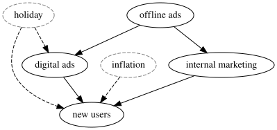</p>
</figure>

## Geração de dados

Com base no DAG fornecido, podemos criar alguns dados sintéticos para testar como o nosso modelo se comporta quando temos estruturas causais complexas. Utilizando os mesmos dados, podemos testar diferentes composições de modelos e ver como podemos melhorar o nosso modelo para descobrir o verdadeiro impacto causal de cada canal na variável alvo.

Começaremos por definir o intervalo de datas. Aqui utilizaremos um intervalo de datas de 2022-01-01 a 2024-11-06, o que significa que temos quase 3 anos de dados (1041 dias).

Código

``` sourceCode
# date range
min_date = pd.to_datetime("2022-01-01")
max_date = pd.to_datetime("2024-11-06")
date_range = pd.date_range(start=min_date, end=max_date, freq="D")

df = pd.DataFrame(data={"date_week": date_range}).assign(
    year=lambda x: x["date_week"].dt.year,
    month=lambda x: x["date_week"].dt.month,
    dayofyear=lambda x: x["date_week"].dt.dayofyear,
)

n = df.shape[0]
print(f"Number of observations: {n}")
```

    Number of observations: 1041

### Sinal de feriado

Certos feriados, como o Natal, podem ter um impacto significativo no comportamento do consumidor antes e depois da data específica, levando a picos sazonais nas vendas. Para capturar estes efeitos, introduzimos um sinal de feriado baseado em distribuições gaussianas (normais) centradas em torno de datas de feriados específicas.

A função utilizada para modelar o efeito de feriado é definida da seguinte forma:

H\_{t} = \exp\left(-0.5 \left(\frac{\Delta t}{\sigma}\right)^2\right)

Onde: - \Delta t é a diferença temporal (em dias) entre a data atual e a data do feriado. - \sigma é o desvio padrão que controla a dispersão do efeito em torno da data do feriado.

Para cada feriado, calculamos o sinal de feriado ao longo do intervalo de datas e adicionamos uma **contribuição de feriado** ao dimensionar o sinal com um coeficiente específico do feriado. Esta abordagem modela picos sazonais de feriados utilizando funções gaussianas, que capturam o aumento transitório na atividade de mercado em torno dos feriados e o respetivo decaimento ao longo do tempo.

> Nota: Aqui assumimos um sinal com distribuição normal, no entanto o sinal pode ser assimétrico ou não ter distribuição normal.

Código

``` sourceCode
holiday_dates = ["24-12", "31-12", "08-06", "07-09"]  # List of holidays as month-day strings
std_devs = [5, 5, 3, 3]  # List of standard deviations for each holiday
holidays_coefficients = [2, 3, 4, 6]

# Initialize the holiday effect array
holiday_signal = np.zeros(len(date_range))
holiday_contributions = np.zeros(len(date_range))

# Generate holiday signals
for holiday, std_dev, holiday_coef in zip(
    holiday_dates, std_devs, holidays_coefficients, strict=False
):
    # Find all occurrences of the holiday in the date range
    holiday_occurrences = date_range[date_range.strftime("%d-%m") == holiday]

    for occurrence in holiday_occurrences:
        # Calculate the time difference in days
        time_diff = (date_range - occurrence).days

        # Generate the Gaussian basis for the holiday
        _holiday_signal = np.exp(-0.5 * (time_diff / std_dev) ** 2)

        # Add the holiday signal to the holiday effect
        holiday_signal += _holiday_signal

        holiday_contributions += _holiday_signal * holiday_coef

df["holiday_signal"] = holiday_signal
df["holiday_contributions"] = holiday_contributions

# Plot the holiday effect
fig, ax = plt.subplots()
sns.lineplot(x=date_range, y=holiday_signal, ax=ax)
ax.set(title="Holiday Effect Signal", xlabel="Date", ylabel="Signal Intensity")
plt.show()
```

<figure class="figure">
<p>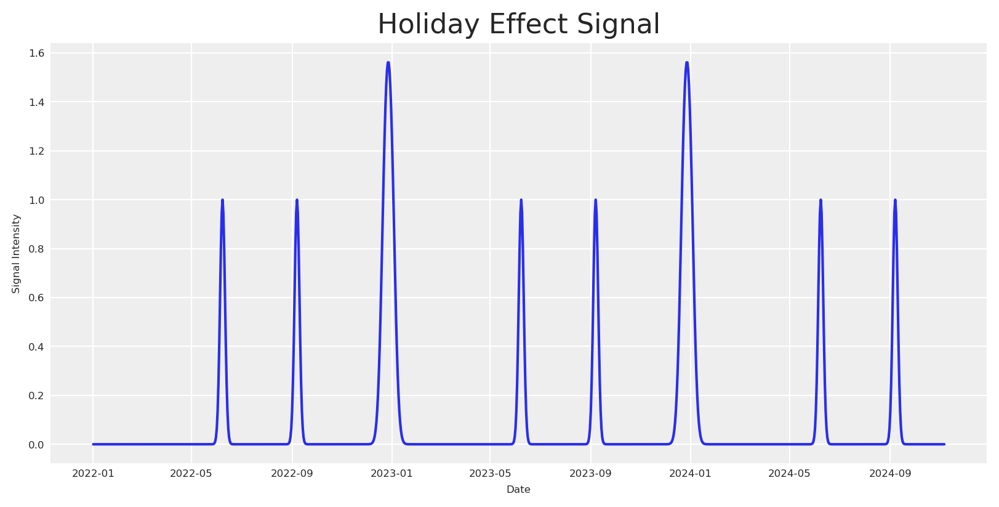</p>
</figure>

### Gerar inflação

De seguida, geramos os dados para a **Inflação**. Assumimos que a inflação segue uma tendência de lei de potência, o que significa que o crescimento acelera ao longo do tempo em vez de permanecer constante. Isto pode ser definido matematicamente como:

IN\_{t} = (t + \text{baseline})^{\text{exponent}} - 1

Onde: - t: O índice temporal, representando dias desde o início do intervalo de datas. - baseline: Uma constante adicionada a t para deslocar o ponto de partida da tendência. Este valor afeta o nível inicial de crescimento do mercado. O valor inicial da função será (baseline)^{exponent} - 1, não 0. - exponent: A potência à qual o índice temporal é elevado, determinando a taxa a que a tendência acelera ao longo do tempo.

Código

``` sourceCode
df["inflation"] = (np.linspace(start=0.0, stop=50, num=n) + 10) ** (2 / 4) - 1

fig, ax = plt.subplots()
sns.lineplot(
    x="date_week", y="inflation", color="C2", label="trend", data=df, ax=ax
)
ax.legend(loc="upper left")
ax.set(title="Inflation Components", xlabel="date", ylabel=None);
```

<figure class="figure">
<p>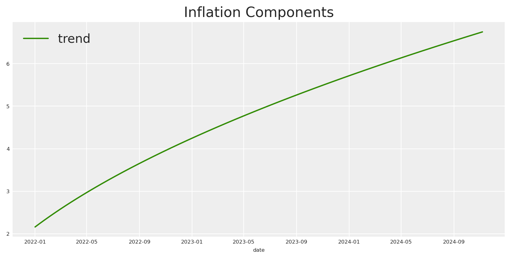</p>
</figure>

### Modelar Canais de Marketing

Nesta secção, simulamos três canais de marketing, x1, x2 e x3, que representam diferentes canais de publicidade (por ex., Marketing Interno, Marketing Social, Marketing Offline). O comportamento de cada canal é influenciado pela variabilidade aleatória e efeitos de confundimento de feriados sazonais. Eis como modelamos cada canal matematicamente:

**Canal x1**: Como mencionado anteriormente, geramos x1 que é afetado pelo sinal de feriado, podemos defini-lo como:

I\_{x1_t} = S\_{x1_t} + e\_{x1}

**Canal x2**: Por outro lado, geramos x2 que é afetado pelo sinal de feriado e pela influência de x1. Podemos defini-lo como:

I\_{x2_t} = S\_{x2_t} + H\_{t} \times \alpha\_{x2} + (I\_{x1_t} \times \alpha\_{x1_x2}) + e\_{x2}

**Canal x3**: Para a última variável, geramos x3 que é afetado apenas por x1.

I\_{x3_t} = S\_{x3_t} + (I\_{x1_t} \times \alpha\_{x1_x3}) + e\_{x3}

Estas equações permitem-nos capturar a dinâmica complexa que influencia cada canal de marketing: - **Efeitos de Feriado** aumentam a atividade do canal em torno de datas específicas, simulando picos sazonais. - **Influências entre Canais** introduzem interdependências, modelando como o sucesso de um canal pode amplificar o de outro.

> Nota: Aqui estamos a assumir um impacto aditivo para as interações dos canais.

Código

``` sourceCode
x1 = pz.Gamma(mu=1, sigma=3).rvs(n, random_state=rng)
cofounder_effect_holiday_x1 = 2.5
x1_conv = np.convolve(x1, np.ones(14) / 14, mode="same")
noise = pz.Normal(mu=0, sigma=0.1).rvs(28, random_state=rng)
x1_conv[:14] = x1_conv.mean() + noise[:14]
x1_conv[-14:] = x1_conv.mean() + noise[14:]
df["x1"] = x1_conv

x2 = pz.Gamma(mu=2, sigma=2).rvs(n, random_state=rng)
cofounder_effect_holiday_x2 = 2.2
cofounder_effect_x1_x2 = 1.3
x2_conv = np.convolve(x2, np.ones(18) / 12, mode="same")
noise = pz.Normal(mu=0, sigma=0.1).rvs(28, random_state=rng)
x2_conv[:14] = x2_conv.mean() + noise[:14]
x2_conv[-14:] = x2_conv.mean() + noise[14:]
df["x2"] = (
    x2_conv
    + (holiday_signal * cofounder_effect_holiday_x2)
    + (df["x1"] * cofounder_effect_x1_x2)
) # digital ads

x3 = pz.Gamma(mu=5, sigma=1).rvs(n, random_state=rng)
cofounder_effect_x1_x3 = 1.5
x3_conv = np.convolve(x3, np.ones(16) / 10, mode="same")
noise = pz.Normal(mu=0, sigma=0.1).rvs(28, random_state=rng)
x3_conv[:14] = x3_conv.mean() + noise[:14]
x3_conv[-14:] = x3_conv.mean() + noise[14:]
df["x3"] = (
    x3_conv
    + (df["x1"] * cofounder_effect_x1_x3)
) # internal marketing
```

Assumiremos que todas as atividades de marketing sofrem as mesmas transformações Adstock e Saturação. Isto significa que cada canal terá parâmetros individuais para as transformações selecionadas, neste caso adstock geométrico e michaelis-menten.

Código

``` sourceCode
# apply geometric adstock transformation
alpha2: float = 0.4
alpha3: float = 0.3

df["x2_adstock"] = (
    geometric_adstock(x=df["x2"].to_numpy(), alpha=alpha2, l_max=24, normalize=True)
    .eval()
    .flatten()
)

df["x3_adstock"] = (
    geometric_adstock(x=df["x3"].to_numpy(), alpha=alpha3, l_max=24, normalize=True)
    .eval()
    .flatten()
)


# apply saturation transformation
lam2: float = 6.0
lam3: float = 12.0

alpha_mm2: float = 12
alpha_mm3: float = 18

df["x2_adstock_saturated"] = michaelis_menten(
    x=df["x2_adstock"].to_numpy(), lam=lam2, alpha=alpha_mm2
)

df["x3_adstock_saturated"] = michaelis_menten(
    x=df["x3_adstock"].to_numpy(), lam=lam3, alpha=alpha_mm3
)

fig, ax = plt.subplots(
    nrows=3, ncols=2, sharex=True, sharey=False, layout="constrained"
)
sns.lineplot(x="date_week", y="x2", data=df, color="C1", ax=ax[0, 0])
sns.lineplot(x="date_week", y="x3", data=df, color="C2", ax=ax[0, 1])

sns.lineplot(x="date_week", y="x2_adstock", data=df, color="C1", ax=ax[1, 0])
sns.lineplot(x="date_week", y="x3_adstock", data=df, color="C2", ax=ax[1, 1])

sns.lineplot(x="date_week", y="x2_adstock_saturated", data=df, color="C1", ax=ax[2, 0])
sns.lineplot(x="date_week", y="x3_adstock_saturated", data=df, color="C2", ax=ax[2, 1])

fig.suptitle("Media Costs Data - Transformed", fontsize=16)
# adjust size of X axis
ax[2, 0].tick_params(axis="x", labelsize=8)
ax[2, 1].tick_params(axis="x", labelsize=8)

# adjust size of x axis labels
for ax in ax.flat:
    ax.tick_params(axis="x", labelsize=6)
```

<figure class="figure">
<p>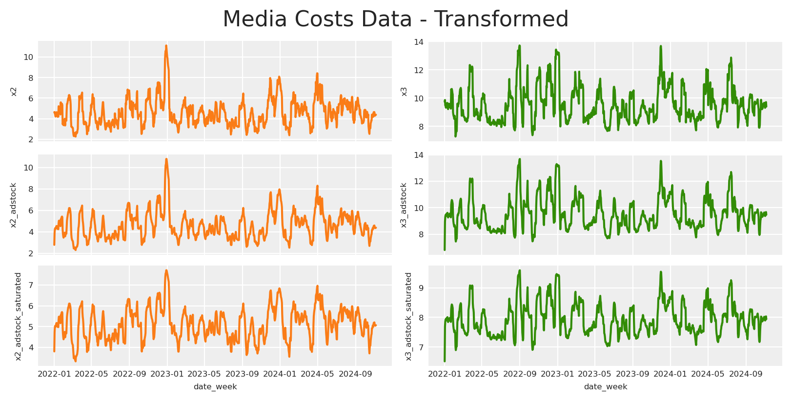</p>
</figure>

O gráfico anterior mostra como as transformações afetam cada variável e qual seria a verdadeira contribuição após cada transformação.

### Variável alvo

A variável alvo é uma combinação de todas as variáveis anteriores. A fórmula matemática pode ser expressa como:

y\_{t} = Intercept - f(IN\_{t}) + f(H\_{t}) + m(I\_{x3_t}) + m(I\_{x2_t}) + \epsilon

Onde: - **Interceção**: Um nível base de vendas, definido como 1.5, representando o nível base de vendas na ausência de outros efeitos. - **Inflação**: Representa a inflação subjacente do mercado, com um coeficiente negativo implícito de 1, adicionando uma influência descendente constante. - **Contribuições de Feriado**: Adiciona picos de vendas em torno de períodos de feriados, capturando o aumento sazonal na procura do consumidor. - **m(Impressions\_{x3_t}) e m(Impressions\_{x2_t})**: Representam os valores de **adstock saturado** para os canais de marketing x3 e x2. - **Ruído \epsilon**: Um pequeno termo de erro aleatório, extraído de uma distribuição normal com média 0 e desvio padrão 0.08, para dar conta da variabilidade inexplicada nas vendas.

Código

``` sourceCode
df["intercept"] = 1.5
df["epsilon"] = rng.normal(loc=0.0, scale=0.08, size=n)

df["y"] = (
    df["intercept"]
    + df["holiday_contributions"]
    + df["x2_adstock_saturated"]
    + df["x3_adstock_saturated"]
    + df["epsilon"]  # Noise
) - df["inflation"]

fig, ax = plt.subplots()
sns.lineplot(x="date_week", y="y", color="black", data=df, ax=ax)
ax.set(title="Sales (Target Variable)", xlabel="date", ylabel="y (thousands)");
```

<figure class="figure">
<p></p>
</figure>

Podemos dimensionar o conjunto de dados completo e teremos finalmente algo muito semelhante à realidade.

Código

``` sourceCode
# scale df by abs max per column
df["date"] = pd.to_datetime(df["date_week"])
scaled_df = df.copy()
for col in scaled_df.columns:
    if col != 'date' and col != 'date_week':
        scaled_df[col] = scaled_df[col] / scaled_df[col].abs().max()

scaled_df[["date", "x1", "x2", "x3", "y"]].head()
```

|     | date       | x1       | x2       | x3       | y        |
|-----|------------|----------|----------|----------|----------|
| 0   | 2022-01-01 | 0.311103 | 0.416608 | 0.709209 | 0.523628 |
| 1   | 2022-01-02 | 0.346200 | 0.417910 | 0.718519 | 0.641921 |
| 2   | 2022-01-03 | 0.310798 | 0.404066 | 0.690251 | 0.664626 |
| 3   | 2022-01-04 | 0.301643 | 0.395861 | 0.693495 | 0.672532 |
| 4   | 2022-01-05 | 0.248688 | 0.379114 | 0.679055 | 0.668596 |

# Abordagem inicial

Se tivermos um conjunto de dados como o que acabámos de criar, podemos tentar ajustar um modelo com o seguinte para encontrar o impacto causal de cada canal na variável alvo. Para o exemplo, utilizaremos um modelo simples do PyMC-Marketing para este fim.

Vejamos o que acontece se ajustarmos um modelo com tudo o que temos sem qualquer conhecimento da estrutura causal.

Código

``` sourceCode
scaled_df[["date", "x1", "x2", "x3", "y"]].head()

model_config = {
    "intercept": Prior("Gamma", mu=1, sigma=1),
    "likelihood": Prior("Normal", sigma=Prior("Normal", mu=0, sigma=.5)),
}

fit_kwargs = dict(nuts_sampler="numpyro", random_seed=rng,)

X = df.drop(columns=["y"])
y = df["y"]

mmm = MMM(
    date_column="date",
    channel_columns=[
        "x1",
        "x2",
        "x3"
    ],
    control_columns=[
        "holiday_signal",
        "inflation"
    ],
    adstock=GeometricAdstock(l_max=24),
    saturation=MichaelisMentenSaturation(),
)
mmm.fit(X, y, **fit_kwargs)
mmm.sample_posterior_predictive(
    X=X,
    extend_idata=True,
    combined=True,
    random_seed=rng,
)
```

```
```

    Sampling: [y]

```
```

``` xr-text-repr-fallback
<xarray.Dataset> Size: 33MB
Dimensions:  (date: 1041, sample: 4000)
Coordinates:
  * date     (date) datetime64[ns] 8kB 2022-01-01 2022-01-02 ... 2024-11-06
  * sample   (sample) object 32kB MultiIndex
  * chain    (sample) int64 32kB 0 0 0 0 0 0 0 0 0 0 0 ... 3 3 3 3 3 3 3 3 3 3 3
  * draw     (sample) int64 32kB 0 1 2 3 4 5 6 7 ... 993 994 995 996 997 998 999
Data variables:
    y        (date, sample) float64 33MB 9.529 9.707 9.271 ... 7.796 8.106 7.514
Attributes:
    created_at:                 2026-09-16T21:58:37.067977+00:00
    arviz_version:              0.21.0
    inference_library:          pymc
    inference_library_version:  5.27.1
```

xarray.Dataset

Dimensions:

- date: 1041
- sample: 4000

Coordinates: (4)

date(date)datetime64\[ns\]2022-01-01 ... 2024-11-06

<!-- -->

    array(['2022-01-01T00:00:00.000000000', '2022-01-02T00:00:00.000000000',
           '2022-01-03T00:00:00.000000000', ..., '2024-11-04T00:00:00.000000000',
           '2024-11-05T00:00:00.000000000', '2024-11-06T00:00:00.000000000'],
          dtype='datetime64[ns]')

sample(sample)objectMultiIndex

<!-- -->

    array([(0, 0), (0, 1), (0, 2), ..., (3, 997), (3, 998), (3, 999)], dtype=object)

chain(sample)int640 0 0 0 0 0 0 0 ... 3 3 3 3 3 3 3 3

<!-- -->

    array([0, 0, 0, ..., 3, 3, 3])

draw(sample)int640 1 2 3 4 5 ... 995 996 997 998 999

<!-- -->

    array([  0,   1,   2, ..., 997, 998, 999])

Data variables: (1)

y(date, sample)float649.529 9.707 9.271 ... 8.106 7.514

<!-- -->

    array([[ 9.52911165,  9.70693004,  9.27136515, ...,  8.81577674,
             9.24434534,  8.81529167],
           [11.62835041, 11.46451788, 11.43907238, ..., 11.61915027,
            11.6390968 , 10.47063535],
           [11.59121069, 11.51473868, 12.69732093, ..., 11.04665764,
            11.8329454 , 12.21389163],
           ...,
           [ 7.8371949 ,  8.37914439,  7.60264614, ...,  7.47912281,
             7.03724087,  7.59050251],
           [ 7.77601432,  8.26225361,  8.13110555, ...,  7.87591535,
             7.19066716,  7.46739171],
           [ 8.10899542,  7.51032297,  8.52515115, ...,  7.7960692 ,
             8.10560721,  7.51404133]])

Indexes: (2)

datePandasIndex

    PandasIndex(DatetimeIndex(['2022-01-01', '2022-01-02', '2022-01-03', '2022-01-04',
                   '2022-01-05', '2022-01-06', '2022-01-07', '2022-01-08',
                   '2022-01-09', '2022-01-10',
                   ...
                   '2024-10-28', '2024-10-29', '2024-10-30', '2024-10-31',
                   '2024-11-01', '2024-11-02', '2024-11-03', '2024-11-04',
                   '2024-11-05', '2024-11-06'],
                  dtype='datetime64[ns]', name='date', length=1041, freq=None))

sample  
chain  
drawPandasMultiIndex

    PandasIndex(MultiIndex([(0,   0),
                (0,   1),
                (0,   2),
                (0,   3),
                (0,   4),
                (0,   5),
                (0,   6),
                (0,   7),
                (0,   8),
                (0,   9),
                ...
                (3, 990),
                (3, 991),
                (3, 992),
                (3, 993),
                (3, 994),
                (3, 995),
                (3, 996),
                (3, 997),
                (3, 998),
                (3, 999)],
               name='sample', length=4000))

Attributes: (4)

created_at :  
2026-09-16T21:58:37.067977+00:00

arviz_version :  
0.21.0

inference_library :  
pymc

inference_library_version :  
5.27.1

Como ficam as contribuições recuperadas, se compararmos com as contribuições reais?

Código

``` sourceCode
initial_model_recover_effect = (
    az.hdi(mmm.fit_result["channel_contribution"], hdi_prob=0.95)
    * mmm.target_transformer["scaler"].scale_.item()
)
initial_model_mean_effect = (
    mmm.fit_result.channel_contribution.mean(dim=["chain", "draw"])
    * mmm.target_transformer["scaler"].scale_.item()
)

fig, ax = plt.subplots(2, 1, sharex=True)
# x2 -> online
ax[0].plot(
    date_range,
    initial_model_mean_effect.sel(channel="x2"),
    label="Mean Recover x2 Effect",
    linestyle="--",
    color="orange",
)
ax[0].fill_between(
    date_range,
    initial_model_recover_effect.channel_contribution.isel(hdi=0).sel(channel="x2"),
    initial_model_recover_effect.channel_contribution.isel(hdi=1).sel(channel="x2"),
    alpha=0.2,
    label="95% Credible Interval",
    color="orange",
)
ax[0].plot(
    date_range, df["x2_adstock_saturated"], label="Real x2 Effect", color="black"
)

# x3 -> internal
ax[1].plot(
    date_range,
    initial_model_mean_effect.sel(channel="x3"),
    label="Mean Recover x3 Effect",
    linestyle="--",
    color="green",
)
ax[1].fill_between(
    date_range,
    initial_model_recover_effect.channel_contribution.isel(hdi=0).sel(channel="x3"),
    initial_model_recover_effect.channel_contribution.isel(hdi=1).sel(channel="x3"),
    alpha=0.2,
    label="95% Credible Interval",
    color="green",
)
ax[1].plot(
    date_range, df["x3_adstock_saturated"], label="Real x3 Effect", color="black"
)

# formatting
ax[0].legend()
ax[1].legend()

plt.grid(True)
ax[1].set(xlabel="date")
fig.suptitle("Media Contribution Recovery", fontsize=16)
plt.show()
```

<figure class="figure">
<p>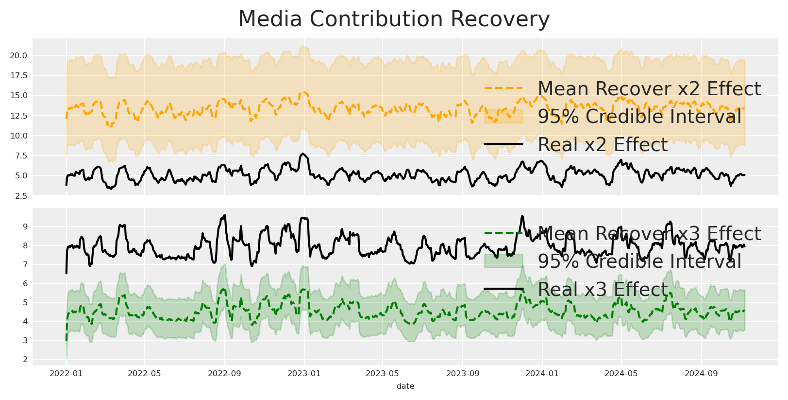</p>
</figure>

Como previsto, o modelo não consegue refletir com precisão as verdadeiras contribuições, resultando em estimativas que desviam significativamente dos valores reais. Como pode isto acontecer, e por que razão está a acontecer?

A explicação é simples: ao negligenciar qualquer estrutura causal, impomos involuntariamente uma aos dados. O problema reside no nosso pressuposto do enquadramento causal mais simples, que raramente se alinha com a complexidade do mundo real.

Que tipo de estrutura causal estamos a assumir implicitamente quando ajustamos o modelo?

Código

``` sourceCode
# Initialize a directed graph
naive_causal_mmm_graph = Digraph()

# Add nodes
naive_causal_mmm_graph.node("X1", "Offline")
naive_causal_mmm_graph.node("X2", "Online")
naive_causal_mmm_graph.node("X3", "Internal")
naive_causal_mmm_graph.node("E", "Exogenous variables", style="dashed")
naive_causal_mmm_graph.node("T", "Target")

naive_causal_mmm_graph.edge("E", "T", style="dashed")
naive_causal_mmm_graph.edge("X1", "T")
naive_causal_mmm_graph.edge("X2", "T")
naive_causal_mmm_graph.edge("X3", "T")

# Render the graph to SVG and display it inline
svg_str = naive_causal_mmm_graph.pipe(format="svg")
display(SVG(svg_str))
```

<figure class="figure">
<p></p>
</figure>

O DAG acima representa a estrutura causal que estamos a assumir implicitamente quando ajustamos o modelo. Aqui todas as variáveis são independentes umas das outras e impactam diretamente a variável alvo.

Durante o desenvolvimento do modelo, estabelecemos uma estrutura e fluxo específicos para os nossos dados. Concluímos que os impactos dos nossos canais operam de forma independente uns dos outros. Além disso, determinámos que se qualquer componente do nosso ecossistema estiver em falta, a sua influência será contabilizada pelo termo de linha de base devido a esta equação. Como pode ver, mesmo adotando este modelo básico, estamos a fazer pressupostos significativos.

Por um lado, está a assumir que o impacto não é linear ao aplicar estas transformações, e está a sugerir que o impacto é positivo e que pode haver um atraso máximo de um certo número de dias.

Definiu até mesmo a direção das suas relações. Ao definir estas relações e assumir que não existem conexões causais diretas entre as nossas variáveis, podemos concluir que, se a natureza da sua relação for representada com precisão pela equação fornecida, então ao controlar os canais relevantes, poderíamos descobrir os seus verdadeiros efeitos.

Isto leva-nos a qual DAG causal assumimos como correto, com base nos nossos pressupostos anteriores. Se reconhece este processo, parabéns! Criou um modelo generativo ou Modelo Causal Estrutural, com uma Equação Causal Estrutural, utilizando PyMC-Marketing.

No entanto, este DAG Causal não representa o verdadeiro DAG Causal. Uma vez que o nosso modelo PyMC é estrutural e causal, devemos perguntar: *O que acontece se criar uma modelo com uma estrutura causal diferente da real?*

A resposta é o que observámos acima, o modelo não será capaz de recuperar a verdadeira estrutura causal.

# Aprender sobre modelos generativos

Os modelos generativos são estruturas que descrevem como os dados poderiam ser produzidos no mundo real. Descrevem um processo definindo distribuições de probabilidade para cada componente, simulando a criação de dados a partir de variáveis aleatórias subjacentes. Esta abordagem captura incerteza e variabilidade, fornecendo uma imagem completa do mecanismo de geração de dados.

No PyMC, este conceito está no cerne de cada modelo. O PyMC permite-lhe definir explicitamente priores, verossimilhanças e a estrutura do seu processo de geração de dados. Mesmo modelos simples construídos no PyMC transportam uma pressuposição generativa inerente, tornando-os flexíveis e robustos na representação de como os dados podem surgir naturalmente.

Isto significa que cada grafo possível com N variáveis pode ser um modelo específico. Quantos modelos poderíamos especificar se tivermos 5 variáveis para um alvo?

Código

``` sourceCode
import math
from functools import lru_cache

@lru_cache(maxsize=None)
def dag_with_exactly_s_sources(n: int, s: int) -> int:
    """
    Count DAGs with exactly s source nodes.

    Uses formula: S(n,s) = C(n,s) * sum[(-1)^j * C(n-s,j) * 2^((m-j)(m-j-1)/2) *
    (2^(m-j)-1)^s] where m=n-s and j=0..m. When n=s, S(n,n)=1.

    Parameters
    ----------
    n : int
        Total number of labeled nodes
    s : int
        Number of source nodes

    Returns
    -------
    int
        Number of possible DAGs
    """
    if n == s:
        return 1
    total = 0
    m = n - s
    for j in range(m + 1):
        term = (
            (-1) ** j
            * math.comb(m, j)
            * 2 ** (((m - j) * (m - j - 1)) // 2)
            * (2 ** (m - j) - 1) ** s
        )
        total += term
    return math.comb(n, s) * total

def count_valid_final_graphs_with_parents(num_regressors: int, num_parents: int) -> int:
    """Count valid final graphs with parent node restrictions.

    The counting process has two main steps:

    1. Build a DAG among regressors where parents have no incoming edges:
       - For non-parents (Q = num_regressors - num_parents), count DAGs with given sinks
       - Parents can only have edges to non-parents (Q options each)
       - Non-sink parents must have ≥1 outgoing edge (2^Q - 1 ways)
       - Sink parents have no edges (1 way)

    2. Add edges from regressors to target:
       - Sink regressors must connect to target
       - Non-sink regressors optionally connect
       - Yields factor 2^(num_regressors - total_sinks)

    The total count formula is:
    sum_{s_p=0}^P sum_{s_q=1}^Q [binom(P,s_p) * (2^Q-1)^(P-s_p) *
    (DAGs_Q_s_q) * 2^((P+Q)-(s_p+s_q))]

    where P = num_parents, Q = num_regressors - num_parents

    When Q = 0 (all regressors are parents), the final graph is unique.

    Parameters
    ----------
    num_regressors : int
        Total number of regressor nodes in the graph
    num_parents : int
        Number of designated parent nodes that cannot have incoming edges

    Returns
    -------
    int
        Total count of valid final graph configurations
    """
    P = num_parents
    Q = num_regressors - num_parents  # non-parents
    if Q < 0:
        raise ValueError("num_parents cannot exceed num_regressors")

    # Case where all regressors are parents: no DAG edges are allowed;
    # every node is isolated (and hence a sink),
    # so the regressor-to-target assignment is forced.
    if Q == 0:
        return 1

    total = 0
    # s_p: number of parents that end up as sinks
    # (i.e. with no outgoing edge to any non-parent)
    for s_p in range(P + 1):
        # For each parent:
        #   - If not a sink: choose at least one outgoing edge
        #     among Q non-parents: (2^Q - 1) ways.
        #   - If a sink: only 1 way (choose no outgoing edge).
        parent_config = math.comb(P, s_p) * ((2**Q - 1) ** (P - s_p))
        # s_q: number of sinks among non-parents in the DAG on Q nodes.
        # Note: Every DAG on at least one node has at least one sink.
        for s_q in range(1, Q + 1):
            nonparent_count = dag_with_exactly_s_sources(Q, s_q)
            # Total sinks in the regressor
            # DAG is s_p (from parents) plus s_q (from non-parents)
            total_sinks = s_p + s_q
            # For each regressor that is not a sink,
            # the regressor-to-target edge is optional.
            # Thus, a factor of 2^( (P+Q) - total_sinks ).
            assignment_factor = 2 ** ((P + Q) - total_sinks)
            total += parent_config * nonparent_count * assignment_factor
    return total

possible_dags = count_valid_final_graphs_with_parents(num_regressors=5, num_parents=2)
print(f"Number of possible DAGs with two parents (Graphical/Generative Model): {possible_dags:,}")

possible_dags = count_valid_final_graphs_with_parents(num_regressors=5, num_parents=1)
print(f"Number of possible DAGs with one parent (Graphical/Generative Model): {possible_dags:,}")
```

    Number of possible DAGs with two parents (Graphical/Generative Model): 12,375
    Number of possible DAGs with one parent (Graphical/Generative Model): 52,855

O número de modelos possíveis que podemos gerar com duas em cinco variáveis como pais é de cerca de 12.000, enquanto ter apenas um pai aumenta esse número para aproximadamente 52.000. Curiosamente, remover um único nó pai triplica os modelos potenciais que podemos criar, multiplicando efetivamente o número de cenários possíveis.

Isto lança luz sobre os desafios impostos por modelos grandes:  
a) À medida que o número de variáveis aumenta, o crescimento exponencial nas relações potenciais torna-se avassalador, tornando difícil identificar a nossa situação atual.  
b) Com mais variáveis, a probabilidade de controlar incorretamente as variáveis erradas também aumenta.

Este último ponto alinha-se com a nossa observação anterior: se controlarmos variáveis inadequadas, o modelo falha em recuperar a verdadeira estrutura causal.

Então, por que é problemático controlar certas variáveis? Cada variável deveria acrescentar mais poder explicativo, não? Vamos começar a aprender sobre estruturas para compreender.

# Aprender sobre estruturas causais

**Garfos**: Um garfo é uma estrutura causal onde uma variável única atua como causa comum para duas ou mais outras variáveis. Esta causa comum transmite a sua influência a todos os seus descendentes diretos. A existência de um garfo cria confundimento, fazendo com que a relação entre as variáveis descendentes pareça estar relacionada. Controlar a causa comum pode efetivamente bloquear os caminhos retroativos criados por esta estrutura.

**Cadeias**: Uma cadeia representa um caminho causal sequencial onde uma variável influencia outra, que por sua vez afeta uma terceira variável. Esta estrutura destaca o processo de mediação através do qual os efeitos causais são transmitidos. A variável intermédia atua como mediadora, transportando a influência da causa inicial para o resultado final. Analisar cadeias ajuda a distinguir entre efeitos diretos e indiretos num sistema causal. Controlar inadequadamente o mediador pode bloquear partes do efeito causal que são de interesse.

**Colisores**: Um colisor é uma variável que é o efeito comum de dois ou mais fatores causais. Situa-se na convergência de diferentes caminhos causais e pode introduzir associações espúrias quando se controla por ele. Controlar um colisor pode inadvertidamente abrir caminhos retroativos não causais, conduzindo a estimativas enviesadas. Este fenómeno, conhecido como enviesamento por colisão, distorce as verdadeiras relações entre as variáveis causais. Evitar controlar por colisores é crucial para manter a validade dos modelos causais.

Código

``` sourceCode
# Create figure with 3 subplots
fig, (ax1, ax2, ax3) = plt.subplots(1, 3,)

# Create collider DAG
collider = Digraph()
collider.attr(rankdir='TB')
collider.node('A', 'A')
collider.node('B', 'B')
collider.node('C', 'C')
collider.edge('A', 'C')
collider.edge('B', 'C')
ax1.set_title('Collider (A→C←B)')
ax1.imshow(Image.open(BytesIO(collider.pipe(format='png'))))
ax1.axis('off')

# Create fork DAG
fork = Digraph()
fork.attr(rankdir='TB')
fork.node('A', 'A')
fork.node('B', 'B')
fork.node('C', 'C')
fork.edge('A', 'B')
fork.edge('A', 'C')
ax2.set_title('Fork (B←A→C)')
ax2.imshow(Image.open(BytesIO(fork.pipe(format='png'))))
ax2.axis('off')

# Create chain DAG
chain = Digraph()
chain.attr(rankdir='TB')
chain.node('A', 'A')
chain.node('B', 'B')
chain.node('C', 'C')
chain.edge('A', 'B')
chain.edge('B', 'C')
ax3.set_title('Chain (A→B→C)')
ax3.imshow(Image.open(BytesIO(chain.pipe(format='png'))))
ax3.axis('off')

plt.tight_layout()
plt.show()
```

<figure class="figure">
<p>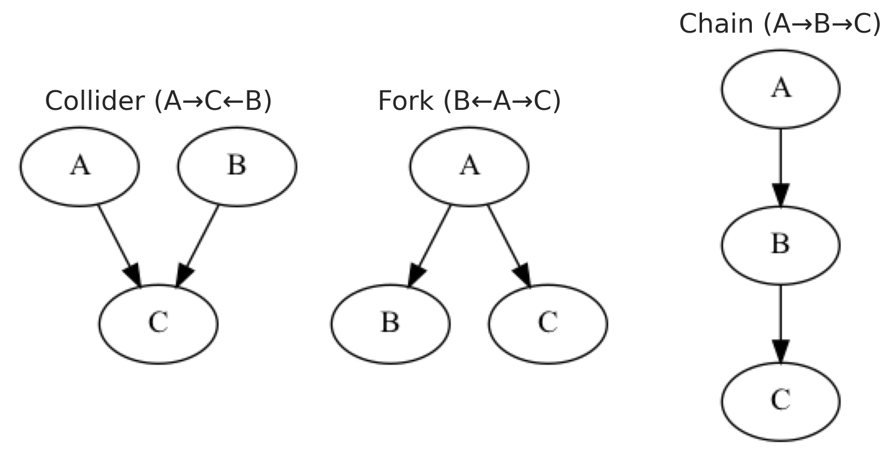</p>
</figure>

As estruturas causais desempenham um papel crucial em vários métodos de inferência causal, servindo como base para o seu funcionamento. Por exemplo, as estruturas de cadeia são essenciais para métodos como variáveis instrumentais (IV). Na análise IV, esta estrutura de cadeia entra em jogo ao introduzir um instrumento — uma variável que afeta a exposição mas não afeta diretamente o resultado, exceto através dessa exposição. Esta abordagem ajuda a quebrar o caminho de confundimento, permitindo-nos isolar a variação exógena no tratamento.

Como resultado, permite uma estimativa consistente dos efeitos causais, mesmo quando encontramos endogeneidade. Portanto, compreender as estruturas de cadeia é essencial, pois não só sustenta a lógica por trás dos métodos de IV como também sublinha a importância de identificar instrumentos válidos.

Se está particularmente interessado em saber mais sobre IVs, recomendo consultar uma publicação de Anton Bugaev ou dirigir-se ao quinto andar se estiver na Bolt.

Em última análise, cada uma destas estruturas causais exibe diferentes comportamentos observacionais. Isto significa que, com base nos dados observacionais, podemos deduzir qual estrutura está presente e, consequentemente, determinar qual é o conjunto correto de variáveis a controlar.

Uma coisa para entender o que controlar é descobrir os nós pais para evitar controlar por mediadores. Podemos identificar isto compreendendo as dependências condicionais.

# Vamos verificar independências condicionais

A independência condicional é um conceito central na teoria das probabilidades e na estatística, em que duas variáveis são independentes uma da outra após uma terceira variável ser mantida constante. Isto significa que, dado o valor da variável de controlo, as duas variáveis não fornecem informação adicional sobre uma à outra. Na descoberta causal, as independências condicionais são cruciais porque revelam a estrutura subjacente das relações causais num modelo ou num grafo acíclico direcionado (DAG). Ao identificar estas independências, podemos determinar como as variáveis estão relacionadas entre si, ou não.

Os modelos de regressão bayesianos permitem-nos estimar a esperança condicional de um resultado dado um conjunto de preditores, descobrindo efetivamente as probabilidades condicionais subjacentes. Numa regressão linear bayesiana, por exemplo, estimamos E(Y \mid X) = \beta_0 + \beta_1X_1 + \ldots + \beta_kX_k, que representa o resultado médio Y quando os preditores X_1, \dots, X_k são mantidos em valores específicos.

Vamos definir uma função para construir e amostrar um modelo linear a partir de uma fórmula.

Código

``` sourceCode
def build_and_sample_model(data: pd.DataFrame, formula: str):
    """
    Build and sample a linear model from a formula.
    """
    # Parse the formula to get target and channels
    target, channels = formula.split('~')
    target = target.strip()
    channels = [ch.strip() for ch in channels.split('+') if ch.strip() != "1"]

    # Define coordinates
    coordinates = {"date": data.date.unique()}
    if channels:  # If there are regressors, include them in coordinates
        coordinates["channel"] = channels

    # Filter the dataset based on the formula
    with pm.Model(coords=coordinates) as linear_model:
        # Load Data in Model
        target_data = pm.Data("target", data[target].values, dims="date")

        # Constant or intercept
        intercept = pm.Gamma("intercept", mu=3, sigma=2)

        mu_var = 0

        if channels:  # If there are regressors, include them
            regressors = pm.Data("regressors", data[channels].values, dims=("date", "channel"))
            gamma = pm.Normal("gamma", mu=3, sigma=2, dims="channel")
            mu_var += (regressors * gamma).sum(axis=-1) + intercept
        else:
            mu_var += intercept

        # Likelihood
        pm.Normal("likelihood", mu=mu_var, sigma=pm.Gamma("sigma", mu=2, sigma=3), observed=target_data, dims="date")

        # Sample
        idata = pm.sample_prior_predictive(random_seed=42)
        idata.extend(
            pm.sample(tune=1000, draws=500, chains=4, random_seed=42, target_accept=0.9, nuts_sampler="numpyro", progressbar=False)
        )
        pm.compute_log_likelihood(idata, progressbar=False)
        idata.extend(
            pm.sample_posterior_predictive(idata, random_seed=42)
        )

    return (idata, linear_model)
```

Agora, vamos construir e amostrar os modelos para cada variável.

Código

``` sourceCode
idata1, model1 = build_and_sample_model(
    scaled_df,
    "x1 ~ 1"
)

idata2, model2 = build_and_sample_model(
    scaled_df,
    "x1 ~ x2 + 1"
)

idata3, model3 = build_and_sample_model(
    scaled_df,
    "x1 ~ x3 + 1"
)

idata4, model4 = build_and_sample_model(
    scaled_df,
    "x1 ~ x2 + x3 + 1"
)

_real_mean = scaled_df["x1"].mean()
_estimated_mean1 = idata1.posterior_predictive.likelihood.mean(dim=["date"]).values.flatten()
_estimated_mean2 = idata2.posterior_predictive.likelihood.mean(dim=["date"]).values.flatten()
_estimated_mean3 = idata3.posterior_predictive.likelihood.mean(dim=["date"]).values.flatten()

sns.kdeplot(_estimated_mean1 - _real_mean, label='Estimated Mean f(x1 ~ 1)', fill=True)
sns.kdeplot(_estimated_mean2 - _real_mean, label='Estimated Mean f(x1 ~ x2 + 1)', fill=True)
sns.kdeplot(_estimated_mean3 - _real_mean, label='Estimated Mean f(x1 ~ x3 + 1)', fill=True)
plt.axvline(0, color='red', linestyle='--', label='Zero')
plt.legend()
plt.show()
```

    Sampling: [intercept, likelihood, sigma]
    Sampling: [likelihood]

```
```

    Sampling: [gamma, intercept, likelihood, sigma]
    Sampling: [likelihood]

```
```

    Sampling: [gamma, intercept, likelihood, sigma]
    Sampling: [likelihood]

```
```

    Sampling: [gamma, intercept, likelihood, sigma]
    Sampling: [likelihood]

```
```

<figure class="figure">
<p>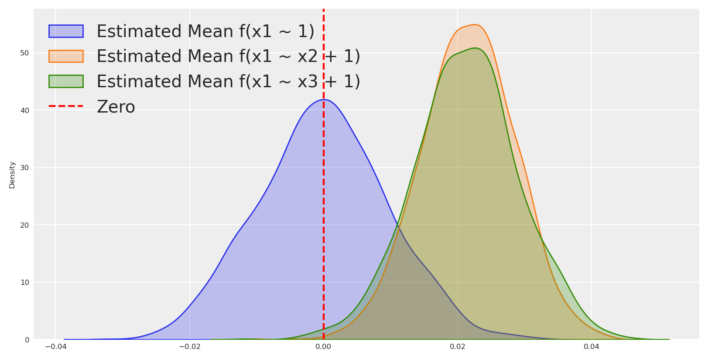</p>
</figure>

Num sistema causal onde a direção verdadeira é x_1 para x_2, a distribuição conjunta fatoriza-se como P(x_1, x_2) = P(x_1) \\ P(x_2 \mid x_1),

onde x_1 é exógena e independente de quaisquer efeitos. Esta estrutura reflete que a distribuição de x_1 permanece inalterada independentemente da variável a jusante x_2.

Ao fazer a regressão de x_2 em função de x_1, o modelo aproveita a direção causal, e a distribuição condicional P(x_2 \mid do(x_1)) é mais concentrada do que a marginal P(x_2). Isto resulta em resíduos centrados em torno de zero, indicando que a maior parte da variabilidade em x_2 é explicada por x_1.

Em contraste, inverter a regressão modelando x_1 como função de x_2 perturba a ordem causal. A distribuição condicional P(x_1 \mid do(x2)) desvia-se da verdadeira marginal P(x_1), pois tenta capturar a causa a partir do seu efeito, o que não é sustentado pela estrutura causal.

O enviesamento na regressão inversa surge porque condicionar em x_2 introduz variabilidade proveniente do ruído inerente a x_2. Esta má atribuição confunde a variabilidade independente de x_1 com a induzida por x_2, levando a resíduos que se desviam sistematicamente de zero. Em relação ao modelo nulo, os resíduos estão mais afastados de zero.

Esta discrepância sublinha a importância de preservar a direção causal correta para evitar enviesamento, pois inverter a regressão viola a condição causal de Markov.

Utilizando esta lógica, podemos identificar não apenas variáveis independentes mas também os pais candidatos para cada variável com base no modo como se desviam do modelo nulo.

Código

``` sourceCode
idata1, model1 = build_and_sample_model(
scaled_df,
"x2 ~ 1"
)

idata2, model2 = build_and_sample_model(
scaled_df,
"x2 ~ x1 + 1"
)

idata3, model3 = build_and_sample_model(
scaled_df,
"x2 ~ x3 + 1"
)

idata4, model4 = build_and_sample_model(
scaled_df,
"x2 ~ x1 + x3 + 1"
)

_real_mean = scaled_df["x2"].mean()
_estimated_mean1 = idata1.posterior_predictive.likelihood.mean(dim=["date"]).values.flatten()
_estimated_mean2 = idata2.posterior_predictive.likelihood.mean(dim=["date"]).values.flatten()
_estimated_mean3 = idata3.posterior_predictive.likelihood.mean(dim=["date"]).values.flatten()

#plot distribution of means and real mean as vertical line
sns.kdeplot(_estimated_mean1 - _real_mean, label='Estimated Mean f(x2 ~ 1)', fill=True)
sns.kdeplot(_estimated_mean2 - _real_mean, label='Estimated Mean f(x2 ~ x1 + 1)', fill=True)
sns.kdeplot(_estimated_mean3 - _real_mean, label='Estimated Mean f(x2 ~ x3 + 1)', fill=True)
plt.axvline(0, color='red', linestyle='--', label='Zero')
plt.legend()
plt.show()
```

    Sampling: [intercept, likelihood, sigma]
    Sampling: [likelihood]

```
```

    Sampling: [gamma, intercept, likelihood, sigma]
    Sampling: [likelihood]

```
```

    Sampling: [gamma, intercept, likelihood, sigma]
    Sampling: [likelihood]

```
```

    Sampling: [gamma, intercept, likelihood, sigma]
    The rhat statistic is larger than 1.01 for some parameters. This indicates problems during sampling. See https://arxiv.org/abs/1903.08008 for details
    Sampling: [likelihood]

```
```

<figure class="figure">
<p></p>
</figure>

Aqui podemos ver que os resíduos estão centrados em torno de zero quando fazemos a regressão da probabilidade marginal de x_2, mas estão mais próximos de zero com uma distribuição de probabilidade mais estreita do que o modelo nulo quando fazemos a regressão de x_2 em função de x_1. Este é um bom sinal de que x_1 é um pai de x_2.

Podemos repetir este processo para todas as variáveis no nosso conjunto de dados para começar a identificar os pais de cada variável e, assim, identificar secções do verdadeiro grafo causal.

Vamos implementar isto em código.

# Identificação de Candidatos a Pais

Para identificar sistematicamente variáveis parentais potenciais no nosso grafo causal, criaremos uma classe que avalia diferentes modelos de regressão e compara as suas distribuições de resíduos. Esta abordagem aproveita o princípio de que quando modelamos corretamente a direção causal, os resíduos devem estar mais estreitamente centrados em torno de zero em comparação com modelos incorretamente especificados.

Aviso

Embora esta abordagem forneça um bom sinal inicial para relações causais, tem limitações. O método assume relações lineares, não tem em conta confundidores ocultos e pode ter dificuldades com estruturas causais complexas. Os resultados devem ser considerados como evidência preliminar em vez de prova definitiva de relações causais.

A classe `ParentCandidateIdentifier` abaixo vai: 1. Executar um modelo de base apenas com um termo constante 2. Executar modelos com cada variável parental potencial 3. Comparar quanta massa de probabilidade está concentrada perto de zero nas distribuições de resíduos 4. Identificar variáveis que melhoram o ajuste do modelo como candidatos a pais

Código

``` sourceCode
class ParentCandidateIdentifier:
    def __init__(self, data: pd.DataFrame, node: str, possible_parents: list, epsilon: float = 0.005):
        """
        Parameters:
            data: DataFrame containing your data.
            node: The target variable for which to identify candidate parents.
            possible_parents: A list of potential parent variable names.
            epsilon: Threshold to define "mass around zero" (default 0.05).
        """
        self.data = data
        self.node = node
        self.possible_parents = possible_parents
        self.epsilon = epsilon
        self.runs = {}
        self.results = None

    def build_and_sample_model(self, formula: str):
        """Wrapper for the sampling function."""
        return build_and_sample_model(self.data, formula)

    def compute_mass_around_zero(self, idata, real_mean):
        """
        Compute the fraction of posterior predictive likelihood samples
        (averaged over dates) within epsilon of the real mean.
        """
        estimated_mean = idata.posterior_predictive.likelihood.mean(dim=["date"]).values.flatten()
        distribution = estimated_mean - real_mean
        mass = np.mean(np.abs(distribution) < self.epsilon)
        return mass, distribution

    def run_all_models(self):
        """
        Run the intercept-only model and each individual parent's model,
        storing the sampling results, mass, and error distributions.
        """
        real_mean = self.data[self.node].mean()
        runs = {}

        # Intercept-only model: P(node)
        formula_intercept = f"{self.node} ~ 1"
        idata_int, _ = self.build_and_sample_model(formula_intercept)
        mass_int, dist_int = self.compute_mass_around_zero(idata_int, real_mean)
        runs["intercept_only"] = {
            "formula": formula_intercept,
            "idata": idata_int,
            "mass": mass_int,
            "distribution": dist_int
        }

        # Individual candidate parent models: P(node|parent)
        for parent in self.possible_parents:
            formula_parent = f"{self.node} ~ {parent} + 1"
            idata_parent, _ = self.build_and_sample_model(formula_parent)
            mass_parent, dist_parent = self.compute_mass_around_zero(idata_parent, real_mean)
            runs[f"parent_{parent}"] = {
                "formula": formula_parent,
                "idata": idata_parent,
                "mass": mass_parent,
                "distribution": dist_parent
            }

        self.runs = runs
        return runs

    def identify_candidate_parents(self):
        """
        Runs all models (if not already run), compares the mass around zero,
        and returns a decision: if the intercept-only model is best, the target
        is independent; otherwise, return the candidate parent with the highest mass.
        """
        if not self.runs:
            self.run_all_models()

        best_key, best_info = max(self.runs.items(), key=lambda x: x[1]["mass"])

        if best_key == "intercept_only":
            decision = "independent"
            candidate_parents = []
        else:
            decision = "dependent"
            candidate_parents = [best_key.split("_", 1)[1]]

        self.results = {
            "results": self.runs,
            "best_model": {best_key: best_info},
            "decision": decision,
            "candidate_parents": candidate_parents
        }
        return self.results

    def plot_distributions(self):
        """
        Plot the error distributions from the stored runs using Seaborn.
        """
        if not self.runs:
            self.run_all_models()

        for key, run in self.runs.items():
            sns.kdeplot(run["distribution"], label=run["formula"], fill=True)
        plt.axvline(0, color='red', linestyle='--', label='Zero Error')
        plt.xlabel("Error (Estimated Mean - Real Mean)")
        plt.ylabel("Density")
        plt.title("Posterior Predictive Error Distributions")
        plt.legend()
        plt.show()
```

Agora podemos identificar os pais candidatos para cada variável.

Código

``` sourceCode
identifier = ParentCandidateIdentifier(data=scaled_df, node="x3", possible_parents=["x1", "x2"], epsilon=0.0005)
decision_info = identifier.identify_candidate_parents()
print("Possible parents: ", decision_info["candidate_parents"])

identifier.plot_distributions()
```

    Sampling: [intercept, likelihood, sigma]
    Sampling: [likelihood]

```
```

    Sampling: [gamma, intercept, likelihood, sigma]
    Sampling: [likelihood]

```
```

    Sampling: [gamma, intercept, likelihood, sigma]
    The rhat statistic is larger than 1.01 for some parameters. This indicates problems during sampling. See https://arxiv.org/abs/1903.08008 for details
    Sampling: [likelihood]

```
```

    Possible parents:  ['x1']

<figure class="figure">
<p></p>
</figure>

Compreender as independências condicionais das variáveis no nosso conjunto de dados permite-nos identificar os pais de cada variável. Atualmente, identificámos que x_3 e x_2 são filhos de x_1, e que x_1 é independente ou verdadeiramente exógena.

Podemos agora utilizar esta informação para atualizar o nosso grafo causal.

Código

``` sourceCode
# Initialize a directed graph
updated_naive_causal_mmm_graph = Digraph()

# Add nodes
updated_naive_causal_mmm_graph.node("X1", "Offline")
updated_naive_causal_mmm_graph.node("X2", "Online")
updated_naive_causal_mmm_graph.node("X3", "Internal")
updated_naive_causal_mmm_graph.node("E", "Exogenous variables", style="dashed")
updated_naive_causal_mmm_graph.node("T", "Target")

updated_naive_causal_mmm_graph.edge("E", "T", style="dashed")
updated_naive_causal_mmm_graph.edge("X1", "T")
updated_naive_causal_mmm_graph.edge("X1","X2")
updated_naive_causal_mmm_graph.edge("X1","X3")
updated_naive_causal_mmm_graph.edge("X2", "T")
updated_naive_causal_mmm_graph.edge("X3", "T")

# Create a figure with five subplots
fig, axes = plt.subplots(1, 2,)

# Set titles for each subplot
titles = ["Naive DAG", "Updated DAG"]
for ax, title in zip(axes, titles):
    ax.set_title(title, fontsize=6)
    ax.axis('off')

# Render and plot each graph
naive_causal_mmm_graph.render(format='png', filename='images/naive_dag')
axes[0].imshow(mpimg.imread('images/naive_dag.png'))

updated_naive_causal_mmm_graph.render(format='png', filename='images/updated_dag')
axes[1].imshow(mpimg.imread('images/updated_dag.png'))

# Add main title
plt.suptitle("Comparison of DAG Graphs", fontsize=24)
plt.tight_layout()
```

<figure class="figure">
<p>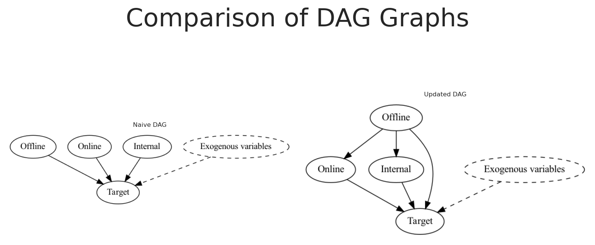</p>
</figure>

Ótimo, podemos atualizar o nosso modelo do mundo para incluir as relações causais que identificámos. De que outra forma podemos utilizar esta informação para saber mais sobre as relações causais no nosso conjunto de dados?

# Análise de mediação para a descoberta causal

Na análise de mediação, o efeito total de um preditor X1 sobre um alvo T é decomposto em componentes diretos e indiretos. O efeito indireto opera através de um mediador M, modelado como M = \alpha_m + a \times X1 + \text{error}. Simultaneamente, o resultado é modelado como T = \alpha_y + c' \times X1 + b \times M + \text{error}. Aqui, o produto a \times b quantifica o efeito indireto, enquanto c' representa o efeito direto de X1 sobre T. Ao estimar estes coeficientes, podemos avaliar se a influência de X1 sobre T é transmitida via M, totalmente direta, ou uma combinação de ambos. A inferência estatística é realizada utilizando intervalos de credibilidade, onde intervalos que excluem zero indicam efeitos significativos.

Se o efeito indireto a \times b for significativo e o efeito direto c' não for, concluímos que o impacto de X1 em T é totalmente mediado por M. Por outro lado, valores significativos tanto para a \times b como para c' sugerem que X1 exerce influências diretas e indiretas sobre T.

Em termos simples, a análise de mediação ajuda-nos a determinar se um preditor X1 influencia um resultado T diretamente ou principalmente ao afetar primeiro um mediador M, que depois impacta T. Se o efeito do mediador for significativo enquanto o efeito direto não é, sugere que X1 afeta T principalmente através da sua influência em M.

Por que fazer isto além da descoberta causal que já realizámos? A razão é que podemos utilizar a análise de mediação para verificar as relações causais que identificámos, porque se um nó é pai do outro, então algum efeito é mediado. Se conseguirmos detetar essa mediação, então podemos decidir se a relação causal é direta ou indireta. Se falharmos em detetar mediação, então provavelmente as nossas descobertas não são robustas à descoberta causal que realizámos.

Código

``` sourceCode
class MediationAnalysis:
    """
    A class for performing Bayesian mediation analysis using a joint mediation model.

    The model is specified as:
      Mediator:    M = α_m + a * X + error
      Outcome:     Y = α_y + c′ * X + b * M + error

    Derived parameters:
      - Indirect effect: ab = a * b
      - Total effect:    c  = c′ + (a * b)

    Parameters
    ----------
    data : pd.DataFrame
        DataFrame containing the predictor, mediator, and outcome variables.
    x : str
        Column name for the predictor (X).
    m : str
        Column name for the mediator (M).
    y : str
        Column name for the outcome (Y).
    hdi : float, optional
        Credible interval width for HDI (default 0.95).
    sampler_kwargs : dict, optional
        Additional keyword arguments for the sampler.
        Default: {"tune": 1000, "draws": 500, "chains": 4,
                  "random_seed": 42, "target_accept": 0.9,
                  "nuts_sampler": "numpyro", "progressbar": False}
    """
    def __init__(self, data: pd.DataFrame, x: str, m: str, y: str, hdi: float = 0.95, sampler_kwargs: dict = None):
        self.data = data
        self.x = x
        self.m = m
        self.y = y
        self.hdi = hdi
        self.sampler_kwargs = sampler_kwargs or {
            "tune": 1000,
            "draws": 500,
            "chains": 4,
            "random_seed": 42,
            "target_accept": 0.9,
            "nuts_sampler": "numpyro",
            "progressbar": False
        }
        self.idata = None
        self.model = None

    def build_model(self):
        """
        Build the Bayesian mediation model.

        This method constructs the PyMC model and stores it in self.model.

        Returns
        -------
        model : pm.Model
            The constructed PyMC model.
        """
        # Extract data arrays
        X_data = self.data[self.x].values
        M_data = self.data[self.m].values
        Y_data = self.data[self.y].values
        N = len(self.data)
        coords = {"obs": range(N)}

        with pm.Model(coords=coords) as model:
            # Mediator path: M = α_m + a * X + error
            alpha_m = pm.Normal("alpha_m", mu=0.0, sigma=1.0)
            a = pm.Normal("a", mu=0.0, sigma=1.0)
            sigma_m = pm.Exponential("sigma_m", lam=1.0)
            mu_m = alpha_m + a * X_data
            pm.Normal("M_obs", mu=mu_m, sigma=sigma_m, observed=M_data, dims="obs")

            # Outcome path: Y = α_y + c′ * X + b * M + error
            alpha_y = pm.Normal("alpha_y", mu=0.0, sigma=1.0)
            c_prime = pm.Normal("c_prime", mu=0.0, sigma=1.0)
            b = pm.Normal("b", mu=0.0, sigma=1.0)
            sigma_y = pm.Exponential("sigma_y", lam=1.0)
            mu_y = alpha_y + c_prime * X_data + b * M_data
            pm.Normal("Y_obs", mu=mu_y, sigma=sigma_y, observed=Y_data, dims="obs")

            # Derived parameters: indirect and total effects
            pm.Deterministic("ab", a * b)
            pm.Deterministic("c", c_prime + a * b)

        self.model = model

    def fit(self):
        """
        Sample from the previously built mediation model.

        Returns
        -------
        self : MediationAnalysis
            The fitted mediation analysis object.

        Raises
        ------
        ValueError
            If the model has not been built yet.
        """
        if self.model is None:
            raise ValueError("The model has not been built. Call build_model() before fit().")

        with self.model:
            self.idata = pm.sample(**self.sampler_kwargs)


    def get_summary(self):
        """
        Get a numerical summary of the mediation parameters.

        Returns
        -------
        dict
            Dictionary with mean estimates and HDI bounds for each parameter.
        """
        var_names = ["alpha_m", "a", "alpha_y", "c_prime", "b", "ab", "c"]
        summary_df = az.summary(self.idata, var_names=var_names, hdi_prob=self.hdi)

        # Compute the HDI column names based on the specified interval
        lower_percent = (1 - self.hdi) / 2 * 100
        upper_percent = 100 - lower_percent
        lower_col = f"hdi_{lower_percent:.1f}%"
        upper_col = f"hdi_{upper_percent:.1f}%"

        results = {}
        for key in var_names:
            results[key] = {
                "mean": summary_df.loc[key, "mean"],
                "hdi_lower": summary_df.loc[key, lower_col],
                "hdi_upper": summary_df.loc[key, upper_col]
            }
        return results

    def get_report(self, x_label: str = None, m_label: str = None, y_label: str = None):
        """
        Generate a plain-language report of the mediation analysis results.

        Parameters
        ----------
        x_label : str, optional
            Label for the predictor variable (default uses self.x).
        m_label : str, optional
            Label for the mediator variable (default uses self.m).
        y_label : str, optional
            Label for the outcome variable (default uses self.y).

        Returns
        -------
        str
            A human-readable summary of the mediation effects.
        """
        # Use provided labels or default to variable names
        x_label = x_label or self.x
        m_label = m_label or self.m
        y_label = y_label or self.y

        var_names = ["a", "b", "c_prime", "ab", "c"]
        summary_df = az.summary(self.idata, var_names=var_names, hdi_prob=self.hdi)

        def hdi_includes_zero(row):
            lower_percent = (1 - self.hdi) / 2 * 100
            upper_percent = 100 - lower_percent
            lower_col = f"hdi_{lower_percent:.1f}%"
            upper_col = f"hdi_{upper_percent:.1f}%"
            return row[lower_col] <= 0 <= row[upper_col]

        # Extract summary statistics
        a_stats = summary_df.loc["a"]
        b_stats = summary_df.loc["b"]
        c_prime_stats = summary_df.loc["c_prime"]
        ab_stats = summary_df.loc["ab"]
        c_stats = summary_df.loc["c"]

        a_mean = a_stats["mean"]
        b_mean = b_stats["mean"]
        c_prime_mean = c_prime_stats["mean"]
        ab_mean = ab_stats["mean"]
        c_mean = c_stats["mean"]

        a_zero = hdi_includes_zero(a_stats)
        b_zero = hdi_includes_zero(b_stats)
        c_prime_zero = hdi_includes_zero(c_prime_stats)
        ab_zero = hdi_includes_zero(ab_stats)
        c_zero = hdi_includes_zero(c_stats)

        lines = []
        lines.append(f"**Bayesian Mediation Analysis Overview** ({int(self.hdi * 100)}% HDI)")
        lines.append(f"Variables: {x_label} (predictor), {m_label} (mediator), {y_label} (outcome).")

        # Interpret each path
        if not a_zero:
            direction = "positive" if a_mean > 0 else "negative"
            lines.append(f"- Path a ({x_label} → {m_label}) is credibly {direction} (mean = {a_mean:.3f}).")
        else:
            lines.append(f"- Path a ({x_label} → {m_label}) is weak (HDI includes 0, mean = {a_mean:.3f}).")

        if not b_zero:
            direction = "positive" if b_mean > 0 else "negative"
            lines.append(f"- Path b ({m_label} → {y_label}, controlling for {x_label}) is credibly {direction} (mean = {b_mean:.3f}).")
        else:
            lines.append(f"- Path b ({m_label} → {y_label}, controlling for {x_label}) is weak (HDI includes 0, mean = {b_mean:.3f}).")

        if not ab_zero:
            direction = "positive" if ab_mean > 0 else "negative"
            lines.append(f"- Indirect effect (a×b) is credibly {direction} (mean = {ab_mean:.3f}).")
        else:
            lines.append(f"- Indirect effect (a×b) is uncertain (HDI includes 0, mean = {ab_mean:.3f}).")

        if not c_prime_zero:
            direction = "positive" if c_prime_mean > 0 else "negative"
            lines.append(f"- Direct effect (c') is credibly {direction} (mean = {c_prime_mean:.3f}).")
        else:
            lines.append(f"- Direct effect (c') is near zero (HDI includes 0, mean = {c_prime_mean:.3f}).")

        if not c_zero:
            direction = "positive" if c_mean > 0 else "negative"
            lines.append(f"- Total effect (c) is credibly {direction} (mean = {c_mean:.3f}).")
        else:
            lines.append(f"- Total effect (c) is uncertain (HDI includes 0, mean = {c_mean:.3f}).")

        lines.append("")
        if not ab_zero and c_prime_zero:
            lines.append(f"It appears that {m_label} fully mediates the effect of {x_label} on {y_label} (indirect effect is non-zero while direct effect is near zero).")
        elif not ab_zero and not c_prime_zero:
            lines.append(f"It appears that {m_label} partially mediates the effect of {x_label} on {y_label} (both indirect and direct effects are credibly non-zero).")
        else:
            lines.append("Mediation is unclear or absent (the indirect effect includes zero or the total effect is not clearly different from zero).")

        return "\n".join(lines)
```

Vamos executar a análise de mediação para as duas primeiras variáveis.

Código

``` sourceCode
analysis1 = MediationAnalysis(data=scaled_df, x="x1", m="x2", y="y")
analysis1.build_model()
analysis1.fit()
analysis1.get_summary()
print(analysis1.get_report())

analysis2 = MediationAnalysis(data=scaled_df, x="x1", m="x3", y="y")
analysis2.build_model()
analysis2.fit()
analysis2.get_summary()
print(analysis2.get_report())
```

    **Bayesian Mediation Analysis Overview** (95% HDI)
    Variables: x1 (predictor), x2 (mediator), y (outcome).
    - Path a (x1 → x2) is credibly positive (mean = 0.411).
    - Path b (x2 → y, controlling for x1) is credibly positive (mean = 0.628).
    - Indirect effect (a×b) is credibly positive (mean = 0.258).
    - Direct effect (c') is near zero (HDI includes 0, mean = 0.006).
    - Total effect (c) is credibly positive (mean = 0.264).

    It appears that x2 fully mediates the effect of x1 on y (indirect effect is non-zero while direct effect is near zero).
    **Bayesian Mediation Analysis Overview** (95% HDI)
    Variables: x1 (predictor), x3 (mediator), y (outcome).
    - Path a (x1 → x3) is credibly positive (mean = 0.390).
    - Path b (x3 → y, controlling for x1) is credibly positive (mean = 0.359).
    - Indirect effect (a×b) is credibly positive (mean = 0.140).
    - Direct effect (c') is credibly positive (mean = 0.125).
    - Total effect (c) is credibly positive (mean = 0.265).

    It appears that x3 partially mediates the effect of x1 on y (both indirect and direct effects are credibly non-zero).

Ótimo 👏🏻 Com base nos seguintes resultados, podemos concluir que x_1 afeta y através de x_2 e x_3 mas não diretamente. Esta conclusão baseia-se no facto de o efeito indireto ser significativo e o efeito direto estar próximo de zero ao controlar pelo mediador x2 e parcial para x3.

Se ambos os fatores estivessem presentes, o efeito indireto seria mais forte, dado os resultados anteriores. Por isso, por simplicidade, não testaremos a mediação quando ambos os fatores estão presentes.

Podemos, mais uma vez, atualizar o nosso grafo causal para refletir as novas descobertas.

Código

``` sourceCode
# Initialize a directed graph
updated_naive_causal_mmm_graph1 = Digraph()

# Add nodes
updated_naive_causal_mmm_graph1.node("X1", "Offline")
updated_naive_causal_mmm_graph1.node("X2", "Online")
updated_naive_causal_mmm_graph1.node("X3", "Internal")
updated_naive_causal_mmm_graph1.node("E", "Exogenous variables", style="dashed")
updated_naive_causal_mmm_graph1.node("T", "Target")

updated_naive_causal_mmm_graph1.edge("E", "T", style="dashed")
updated_naive_causal_mmm_graph1.edge("X1","X2")
updated_naive_causal_mmm_graph1.edge("X1","X3")
updated_naive_causal_mmm_graph1.edge("X2", "T")
updated_naive_causal_mmm_graph1.edge("X3", "T")

# Create a figure with five subplots
fig, axes = plt.subplots(1, 3,)

# Set titles for each subplot
titles = ["Naive DAG", "Updated DAG V0", "Updated DAG V1"]
for ax, title in zip(axes, titles):
    ax.set_title(title, fontsize=6)
    ax.axis('off')

# Render and plot each graph
naive_causal_mmm_graph.render(format='png', filename='images/naive_dag')
axes[0].imshow(mpimg.imread('images/naive_dag.png'))

updated_naive_causal_mmm_graph.render(format='png', filename='images/updated_dag')
axes[1].imshow(mpimg.imread('images/updated_dag.png'))

updated_naive_causal_mmm_graph1.render(format='png', filename='images/updated_dag1')
axes[2].imshow(mpimg.imread('images/updated_dag1.png'))

# Add main title
plt.suptitle("Comparison of DAG Graphs", fontsize=24)
plt.tight_layout()
```

<figure class="figure">
<p>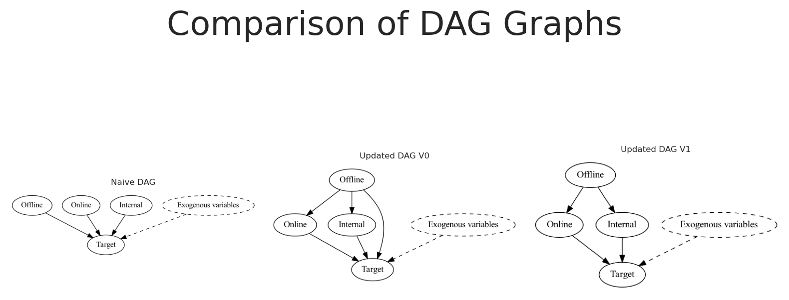</p>
</figure>

Isto é ótimo! O nosso novo grafo causal é mais complexo, mas é mais preciso do que o definido anteriormente. No entanto, precisámos de uma quantidade significativa de tempo e trabalho manual para chegar a esta conclusão.

Como podemos automatizar este processo? É sequer possível? E como resolveria o problema inicial?

Sim, é possível! Podemos utilizar algoritmos de descoberta causal para automatizar este processo.

# Introdução à descoberta causal

A descoberta causal infere relações direcionais de causa e efeito a partir de dados observacionais. Utiliza algoritmos computacionais para construir grafos acíclicos direcionados que representam mecanismos causais potenciais. Estas técnicas baseiam-se na condição causal de Markov e no pressuposto de fidelidade estatística. Empregam testes estatísticos de independência condicional para diferenciar influências diretas de associações indiretas. Esta abordagem integra inferência estatística e teoria dos grafos para modelar sistemas complexos. No seu conjunto, descobre estruturas causais ocultas que melhoram a nossa compreensão e estimativas de fenómenos dinâmicos.

> Pressuposto Causal de Markov: Cada variável é independente dos seus não-efeitos dadas as suas causas diretas, o que significa que a distribuição de probabilidade conjunta pode ser fatorizada de acordo com a estrutura do grafo acíclico direcionado. Isto implica que, ao controlar pelas causas imediatas de uma variável, quaisquer influências paralelas ou a montante tornam-se estatisticamente irrelevantes.

> Fidelidade Estatística: Este pressuposto postula que todas e apenas as relações de independência condicional observadas nos dados são aquelas implicadas pelo grafo causal. Por outras palavras, não existem cancelamentos acidentais ou independências coincidentes além das que a estrutura causal prevê.

Código

``` sourceCode
class CausalDiscovery:
    def __init__(self, data):
        self.data = data
        self.labels = [f'{col}' for col in data.columns.to_list()]

    def greedy_search(self, **kwargs):
        result = ges(X=self.data.to_numpy(), **kwargs)
        return result["G"]

    def peter_clark(self, **kwargs):
        result = pc(self.data.to_numpy(), **kwargs)
        return result.G

    def to_pydot(self, graph):
        return GraphUtils.to_pydot(graph, labels=self.labels)

    def to_dict(self, graph):
        """
        Convert a general graph to a dictionary representation where each node is a key
        and the value is a list of its descendants.

        Parameters
        ----------
        graph : causallearn.graph.GeneralGraph.GeneralGraph
            The input graph.

        Returns
        -------
        dict
            A dictionary where keys are node labels and values are lists of descendant node labels.
        """
        result = {}
        nodes = sorted(graph.get_nodes(), key=lambda x: str(x))

        # Initialize the dictionary with empty lists for all nodes
        for i, node in enumerate(nodes):
            result[self.labels[i]] = []

        # For each node, find its children (direct descendants)
        for i, node in enumerate(nodes):
            node_label = self.labels[i]
            for j, potential_child in enumerate(nodes):
                if i != j and graph.get_edge(node, potential_child) is not None:
                    # Check if there's a directed edge from node to potential_child
                    edge = graph.get_edge(node, potential_child)
                    if (edge.get_endpoint1() == Endpoint.TAIL and
                        edge.get_endpoint2() == Endpoint.ARROW):
                        result[node_label].append(self.labels[j])

        return result


    def to_graphviz(self, graph, handle_circle="skip"):
        """
        Convert a general graph into a Graphviz Digraph using the pydot conversion
        for nodes while preserving the original directed edge ordering.

        Only if the original graph indicates that an edge is undirected (both endpoints
        are TAIL) do we override the arrow style (using dir="none"). Otherwise, we leave
        the pydot-provided direction unchanged.

        Parameters
        ----------
        graph : causallearn.graph.GeneralGraph.GeneralGraph
            The input graph.
        handle_circle : str, optional
            How to handle circle endpoints (not used explicitly here but available for future logic).

        Returns
        -------
        graphviz.Digraph
            A Graphviz Digraph where undirected edges are rendered without arrowheads.
        """
        # Get the pydot graph (for node positions/labels)
        dot = self.to_pydot(graph)
        digraph = Digraph()
        digraph.attr(size='8,8')

        # Build a mapping of the original graph nodes based on sorted order.
        original_nodes = sorted(graph.get_nodes(), key=lambda x: str(x))
        # Map string indices ("0", "1", …) to the original nodes.
        index_to_node = {str(i): node for i, node in enumerate(original_nodes)}
        # Map indices to labels using self.labels.
        node_labels = {str(i): self.labels[i] for i in range(len(original_nodes))}

        # Add nodes to the Graphviz Digraph.
        for idx_str, label in node_labels.items():
            digraph.node(label)

        # Process each edge from the pydot graph.
        processed = set()
        pydot_edges = dot.get_edges()

        for edge in pydot_edges:
            # Get source and destination from pydot.
            src_raw = edge.get_source()
            dst_raw = edge.get_destination()
            src_str = src_raw.strip('"') if isinstance(src_raw, str) else str(src_raw)
            dst_str = dst_raw.strip('"') if isinstance(dst_raw, str) else str(dst_raw)

            # Get original node objects using our mapping.
            src_node = index_to_node.get(src_str)
            dst_node = index_to_node.get(dst_str)
            if src_node is None or dst_node is None:
                continue

            # Get display labels.
            src_label = node_labels.get(src_str, src_str)
            dst_label = node_labels.get(dst_str, dst_str)

            # Use a tuple (src_str, dst_str) to ensure we don't add duplicates.
            edge_key = (src_str, dst_str)
            reverse_key = (dst_str, src_str)
            if edge_key in processed or reverse_key in processed:
                continue

            try:
                # Get endpoint information from the original graph.
                e_uv = graph.get_endpoint(src_node, dst_node)
                e_vu = graph.get_endpoint(dst_node, src_node)
            except KeyError:
                # Skip if the original graph doesn't contain this edge.
                continue

            # If both endpoints are TAIL, we treat the edge as undirected.
            if e_uv == Endpoint.TAIL and e_vu == Endpoint.TAIL:
                digraph.edge(src_label, dst_label, dir="none")
                processed.add(edge_key)
                processed.add(reverse_key)
            else:
                # Otherwise, preserve the original pydot direction.
                digraph.edge(src_label, dst_label)
                processed.add(edge_key)

        return digraph

    def to_networkx(self, graph) -> nx.DiGraph:
        """
        Convert a general graph (e.g. from causallearn) into a NetworkX DiGraph.

        Nodes are added as provided by graph.get_nodes(), and for each ordered pair (u, v)
        where an edge exists (as determined by graph.get_endpoint(u, v)), we add a directed
        edge with an attribute 'endpoint' that stores the edge marker.

        If the general graph does not provide a direct list of edges (e.g. via a get_edges() method),
        we iterate over all pairs of nodes.
        """
        digraph = nx.DiGraph()
        nodes = graph.get_nodes()
        # Add nodes to the networkx graph.
        for node in nodes:
            digraph.add_node(node)

        # If available, use a dedicated method to get edges.
        try:
            edges = graph.get_edges()
        except AttributeError:
            # Fallback: iterate over all ordered pairs (inefficient for large graphs)
            edges = []
            for u in nodes:
                for v in nodes:
                    if u == v:
                        continue
                    try:
                        # Attempt to get an endpoint; if present, we consider that an edge exists.
                        _ = graph.get_endpoint(u, v)
                        edges.append((u, v))
                    except KeyError:
                        continue

        # Add edges with endpoint attributes.
        for u, v in edges:
            try:
                endpoint_uv = graph.get_endpoint(u, v)
            except KeyError:
                continue
            digraph.add_edge(u, v, endpoint=endpoint_uv)

        return digraph

    def _networkx_to_graphviz(self, nx_graph: nx.DiGraph) -> Digraph:
        """
        Convert a NetworkX DiGraph into a Graphviz Digraph.

        This method uses similar logic to 'to_graphviz', checking for reciprocal edges.
        If an edge (u,v) and its reverse (v,u) exist and both have the attribute endpoint
        equal to Endpoint.TAIL, the edge is rendered as undirected (dir="none").
        """
        digraph = Digraph()
        digraph.attr(size='8,8')
        processed = set()

        # Sort nodes to create a consistent mapping with self.labels.
        sorted_nodes = sorted(nx_graph.nodes(), key=lambda x: str(x))
        node_labels = {}
        for i, node in enumerate(sorted_nodes):
            # Use self.labels if available, otherwise default to the node's string representation.
            label = self.labels[i] if i < len(self.labels) else str(node)
            node_labels[node] = label
            digraph.node(label)

        for u, v in nx_graph.edges():
            if (u, v) in processed or (v, u) in processed:
                continue
            src_label = node_labels.get(u, str(u))
            dst_label = node_labels.get(v, str(v))

            # Check if the reverse edge exists to potentially mark as undirected.
            if nx_graph.has_edge(v, u):
                endpoint_uv = nx_graph.edges[u, v].get('endpoint', None)
                endpoint_vu = nx_graph.edges[v, u].get('endpoint', None)
                if endpoint_uv == Endpoint.TAIL and endpoint_vu == Endpoint.TAIL:
                    digraph.edge(src_label, dst_label, dir="none")
                    processed.add((u, v))
                    processed.add((v, u))
                    continue
            # Otherwise, add the edge as directed.
            digraph.edge(src_label, dst_label)
            processed.add((u, v))

        return digraph

    def _graphviz_to_networkx(self, gv_graph: Digraph) -> nx.DiGraph:
        """
        Convert a Graphviz Digraph into a NetworkX DiGraph.

        This method extracts the DOT source from the provided Graphviz Digraph,
        parses it using pydot, and then converts the resulting pydot graph into
        a NetworkX directed graph. This ensures that node labels and edge orientations
        are maintained consistently.

        Parameters
        ----------
        gv_graph : graphviz.Digraph
            The Graphviz Digraph to be converted.

        Returns
        -------
        nx.DiGraph
            A NetworkX DiGraph representation of the input Graphviz graph.
        """
        # Retrieve the DOT source code from the Graphviz Digraph.
        dot_str = gv_graph.source

        # Parse the DOT data using pydot.
        pydot_graphs = pydot.graph_from_dot_data(dot_str)
        if not pydot_graphs:
            raise ValueError("No valid pydot graphs could be parsed from the DOT data.")
        # pydot.graph_from_dot_data returns a list; we take the first one.
        pydot_graph = pydot_graphs[0]

        # Use NetworkX’s built-in conversion from a pydot graph to a DiGraph.
        nx_graph = nx.nx_pydot.from_pydot(pydot_graph)
        return nx_graph
```

O Causal Learn permite-nos utilizar diferentes algoritmos para inferir a classe equivalente de Markov do grafo causal. A classe anterior é um wrapper que nos permite utilizar os diferentes algoritmos implementados na biblioteca causal learn e representá-los graficamente de forma mais fácil.

Atualmente, envolvemos os seguintes algoritmos:

- Pesquisa Gulosa (GES)
- Peter-Clark (PC)

## Algoritmos de Descoberta Causal

O **algoritmo Peter-Clark** é um método baseado em restrições que infere estruturas causais a partir de dados observacionais utilizando testes de independência condicional. Começa com um grafo não direcionado totalmente conectado onde cada variável está inicialmente ligada a todas as outras variáveis. O algoritmo testa sistematicamente a independência condicional entre pares de variáveis, condicionando em subconjuntos cada vez maiores de outras variáveis. Quando é detetada uma independência condicional, a aresta correspondente é removida do grafo.

Por outro lado, a **Pesquisa Gulosa** é um método baseado em pontuação que melhora iterativamente um modelo causal candidato ao modificar localmente a sua estrutura. Começa com um grafo acíclico direcionado inicial e avalia uma métrica de pontuação que equilibra a qualidade do ajuste com a complexidade do modelo. O algoritmo explora modificações como adicionar, eliminar ou inverter arestas para encontrar melhorias locais na pontuação. Em cada iteração, seleciona a alteração que produz o maior aumento na pontuação, seguindo uma estratégia de melhoria passo a passo. A pesquisa continua até que nenhuma alteração única possa melhorar ainda mais a pontuação do modelo. Este método navega eficientemente pelo espaço de pesquisa combinatório de grafos possíveis fazendo escolhas localmente ótimas.

Pressuposto de Suficiência Causal

Qualquer algoritmo de descoberta causal baseia-se no pressuposto de que todas as variáveis relevantes são observadas. Se alguma variável relevante não for observada, o algoritmo não será capaz de inferir o grafo causal correto. Cada variável, mesmo as não observadas, deve estar representada no conjunto de dados, para que o algoritmo possa incluí-las no grafo causal e nos testes de validação.

O exemplo seguinte mostra o grafo causal inferido utilizando o algoritmo de Pesquisa Gulosa.

Código

``` sourceCode
causal_model = CausalDiscovery(scaled_df[["holiday_signal", "inflation", "x1", "x2", "x3", "y"]])
ges_graph = causal_model.greedy_search()

# Create a figure with five subplots
fig, axes = plt.subplots(1, 4,)

# Set titles for each subplot
titles = ["Naive DAG", "Updated DAG", "Updated DAG 1", "Discovered DAG"]
for ax, title in zip(axes, titles):
    ax.set_title(title, fontsize=6)
    ax.axis('off')

# Render and plot each graph
naive_causal_mmm_graph.render(format='png', filename='images/naive_dag')
axes[0].imshow(mpimg.imread('images/naive_dag.png'))

updated_naive_causal_mmm_graph.render(format='png', filename='images/updated_dag')
axes[1].imshow(mpimg.imread('images/updated_dag.png'))

updated_naive_causal_mmm_graph1.render(format='png', filename='images/updated_dag1')
axes[2].imshow(mpimg.imread('images/updated_dag1.png'))

real_dag_graph = causal_model.to_graphviz(ges_graph)
real_dag_graph.render(format='png', filename='images/discovered_dag')
axes[3].imshow(mpimg.imread('images/discovered_dag.png'))

# Add main title
plt.suptitle("Comparison of DAG Graphs", fontsize=24)
plt.tight_layout()
```

<figure class="figure">
<p></p>
</figure>

O grafo causal capturado pela pesquisa gulosa é muito semelhante ao verdadeiro grafo causal. Algumas setas estão direcionadas para variáveis que não estão relacionadas, mas isto é esperado dada a natureza dos dados; ainda temos ruído nos dados e correlações espúrias que não podem ser totalmente falsificadas pelos testes de independência. Além disso, o grafo encontrado pode situar-se na classe de equivalência de Markov do verdadeiro grafo causal, o que significa que existem múltiplos DAGs que são compatíveis com os dados.

Isto, em vez de ser um problema, é uma boa notícia porque agora podemos começar a trabalhar com experimentação para testar a estrutura atual e melhorá-la iterativamente, sem necessidade de esperar por estas respostas para obter as estimativas corretas num modelo de regressão.

Vamos decompor os caminhos causais de x2 para y no grafo:

**Caminhos de confundimento:**

- Feriado: Afeta tanto x2 como y (feriado → x2 e feriado → y).
- Inflação: Afeta tanto x2 como y (inflação → x2 e inflação → y).
- x1: Influencia x2 (x1 → x2) e também afeta y indiretamente através de x3 (x1 → x3 → y).

**Caminho mediador:**

- x3: Situa-se no caminho causal de x2 para y (x2 → x3 → y).

**O que precisa de ser controlado?**

Para estimar o efeito total de x2 sobre y sem enviesamento, é necessário bloquear todos os caminhos retroativos (de confundimento). Isto significa controlar as causas comuns:

- Feriado
- Inflação
- x1

**Por que não controlar x3?** Uma vez que x3 é um mediador (ou seja, transmite parte do efeito de x2 para y), incluí-lo na sua regressão bloquearia o efeito indireto de x2 sobre y. Este “excesso de controlo” resultaria numa estimativa que reflete apenas o efeito direto de x2 sobre y, não o efeito total. Além disso, controlar mediadores pode por vezes introduzir enviesamento se existirem outras relações complexas no grafo.

Código

``` sourceCode
mmm = MMM(
    model_config=model_config,
    date_column="date",
    channel_columns=[
        "x1",
        # "x2",
        "x3"
    ],
    control_columns=[
        "holiday_signal",
        "inflation",
    ],
    adstock=GeometricAdstock(l_max=24),
    saturation=MichaelisMentenSaturation(),
)

mmm.fit(X, y, **fit_kwargs)
mmm.sample_posterior_predictive(
    X=X,
    extend_idata=True,
    combined=True,
    random_seed=rng,
)

initial_model_recover_effect = (
    az.hdi(mmm.fit_result["channel_contribution"], hdi_prob=0.95)
    * mmm.target_transformer["scaler"].scale_.item()
)
initial_model_mean_effect = (
    mmm.fit_result.channel_contribution.mean(dim=["chain", "draw"])
    * mmm.target_transformer["scaler"].scale_.item()
)
```

    There were 24 divergences after tuning. Increase `target_accept` or reparameterize.

```
```

    Sampling: [y]

```
```

Agora vamos representar graficamente a distribuição posterior do efeito de x3 sobre y.

Código

``` sourceCode
def plot_posterior(y_real, posterior, figsize=(8, 4), path_color='orange', hist_color='orange', **kwargs):
    """
    Plot the posterior distribution of a stochastic process.
    
    Parameters
    ----------
    y_real : array-like
        The real values to compare against the posterior.
    posterior : xarray.DataArray
        The posterior distribution with shape (draw, chain, date).
    figsize : tuple, optional
        Size of the figure. Default is (8, 4).
    path_color : str, optional
        Color of the paths in the time series plot. Default is 'orange'.
    hist_color : str, optional
        Color of the histogram. Default is 'orange'.
    **kwargs : dict
        Additional keyword arguments to pass to the plotting functions.
        
    Returns
    -------
    fig : matplotlib.figure.Figure
        The figure object containing the plots.
    """

    # Calculate the expected value (mean) across all draws and chains for each date
    expected_value = posterior.mean(dim=("draw", "chain"))

    # Create a figure and a grid of subplots
    fig = plt.figure(figsize=figsize)
    gs = fig.add_gridspec(1, 2, width_ratios=[3, 1])

    # Time series plot
    ax1 = fig.add_subplot(gs[0])
    for chain in range(posterior.shape[1]):
        for draw in range(0, posterior.shape[0], 10):  # Plot every 10th draw for performance
            ax1.plot(posterior.date, posterior[draw, chain], color=path_color, alpha=0.1, linewidth=0.5)

    ax1.plot(posterior.date, expected_value, color='grey', linestyle='--', linewidth=2)
    ax1.plot(posterior.date, y_real, color='black', linestyle='-', linewidth=2, label='Real',)
    ax1.set_title("Posterior Predictive")
    ax1.set_xlabel('Date')
    ax1.set_ylabel('Value')
    ax1.grid(True)
    ax1.legend()

    # KDE plot
    ax2 = fig.add_subplot(gs[1])
    final_values = posterior[:, :, -1].values.flatten()

    # Use seaborn for KDE plot
    sns.kdeplot(y=final_values, ax=ax2, fill=True, color=hist_color, alpha=0.6, **kwargs)

    # Add histogram on top of KDE
    ax2.hist(final_values, orientation='horizontal', color=hist_color, bins=30,
             alpha=0.3, density=True)

    ax2.axhline(y=expected_value[-1], color='grey', linestyle='--', linewidth=2)
    ax2.set_title('Distribution at T')
    ax2.set_xlabel('Density')
    ax2.set_yticklabels([])  # Hide y tick labels to avoid duplication
    ax2.grid(True)
    return fig

plot_posterior(
    df["x3_adstock_saturated"].values,
    mmm.idata.posterior.channel_contribution.sel(channel="x3") * df["y"].max(),
    path_color='lightblue',
    hist_color='lightblue'
);
```

<figure class="figure">
<p>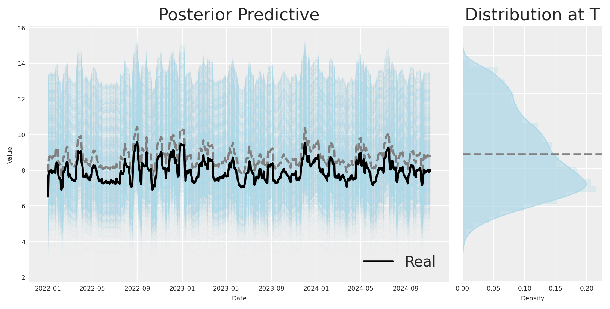</p>
</figure>

O efeito foi perfeitamente recuperado. Com este modelo, podemos informar com segurança quanto receberemos de volta se investirmos em x3. No entanto, precisamos de controlar por feriado e inflação para obter o efeito total. O que acontece se não tivermos estas variáveis de controlo?

# Como obter estimativas corretas se não temos todas as covariáveis?

Se estamos confiantes no nosso processo de geração de dados, podemos ter a certeza de que, ao excluir cirurgicamente um nó, um processo gaussiano pode absorver essa variabilidade. Vejamos como isto funciona na prática.

Código

``` sourceCode
mmm = MMM(
    model_config=model_config,
    date_column="date",
    channel_columns=[
        "x1",
        "x2",
        # "x3"
    ],
    adstock=GeometricAdstock(l_max=24),
    saturation=MichaelisMentenSaturation(),
    time_varying_intercept=True,
)

mmm.model_config["intercept_tvp_config"].ls_mu = 15
mmm.model_config["intercept_tvp_config"].m = 200

mmm.fit(X, y, **fit_kwargs)
mmm.sample_posterior_predictive(
    X=X,
    extend_idata=True,
    combined=True,
    random_seed=rng,
)

az.summary(mmm.idata, var_names=["saturation_alpha", "saturation_lam", "adstock_alpha",])
```

    The rhat statistic is larger than 1.01 for some parameters. This indicates problems during sampling. See https://arxiv.org/abs/1903.08008 for details
    The effective sample size per chain is smaller than 100 for some parameters.  A higher number is needed for reliable rhat and ess computation. See https://arxiv.org/abs/1903.08008 for details

```
```

    Sampling: [y]

```
```

|  | mean | sd | hdi_3% | hdi_97% | mcse_mean | mcse_sd | ess_bulk | ess_tail | r_hat |
|----|----|----|----|----|----|----|----|----|----|
| saturation_alpha\[x1\] | 0.291 | 0.064 | 0.173 | 0.404 | 0.003 | 0.001 | 462.0 | 443.0 | 1.00 |
| saturation_alpha\[x2\] | 0.821 | 0.028 | 0.772 | 0.874 | 0.001 | 0.001 | 498.0 | 816.0 | 1.01 |
| saturation_lam\[x1\] | 1.944 | 0.558 | 0.938 | 2.946 | 0.023 | 0.011 | 514.0 | 575.0 | 1.00 |
| saturation_lam\[x2\] | 0.418 | 0.026 | 0.370 | 0.468 | 0.001 | 0.001 | 444.0 | 558.0 | 1.01 |
| adstock_alpha\[x1\] | 0.448 | 0.046 | 0.362 | 0.534 | 0.002 | 0.001 | 832.0 | 1379.0 | 1.01 |
| adstock_alpha\[x2\] | 0.325 | 0.020 | 0.290 | 0.366 | 0.001 | 0.000 | 729.0 | 1754.0 | 1.01 |

Podemos ver pelos parâmetros que o modelo é capaz de recuperar o efeito de x2 sobre y, apesar de termos removido x3 do modelo.

Código

``` sourceCode
plot_posterior(
    df["x2_adstock_saturated"].values,
    mmm.idata.posterior.channel_contribution.sel(channel="x2") * df["y"].max(),
    path_color='lightgreen',
    hist_color='lightgreen'
);
```

<figure class="figure">
<p>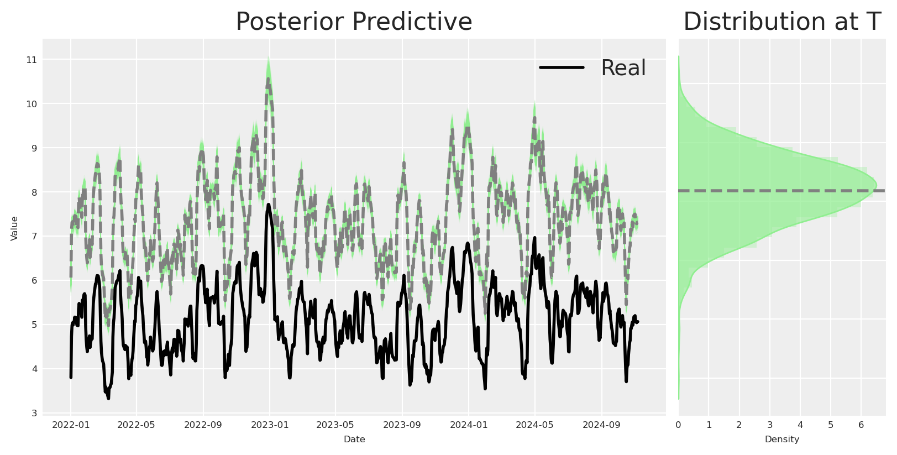</p>
</figure>

Como esperado, o efeito de x2 sobre y é recuperado, apesar de termos removido as variáveis de controlo do modelo, utilizando em vez disso um processo gaussiano para dar conta da variabilidade dos dados.

# Conclusões

1.  Não procure o único modelo: O mundo real é muito dinâmico, é possível que o único modelo não exista.

2.  “Encontrar” a Verdade Causal: Mergulhe no mundo das estruturas causais e aprenda a mapear os caminhos ocultos que influenciam os seus resultados. Não considerar estruturas causais levá-lo-á a considerar estruturas causais mais simples, o que pode ser problemático num ambiente do mundo real.

3.  Abrace a Evolução do Modelo: Não se apegue demasiado ao seu primeiro modelo! Como vimos na nossa progressão de DAG, os modelos podem (e devem) mudar à medida que aprendemos mais. Começar simples é aceitável, mas esteja preparado para elevar o nível do seu modelo quando os dados mostrarem que há mais a descobrir.

# O nosso processo de descoberta causal em resumo

Ao longo do notebook, vimos como podemos utilizar modelos de regressão bayesianos para identificar a estrutura causal de um conjunto de dados, e como podemos utilizar esta informação para tomar melhores decisões. Vimos também como podemos utilizar esta informação para tomar melhores decisões. Em resumo, começámos com uma compreensão ingénua e simples do mundo, que foi evoluindo através da identificação da estrutura causal dos dados e da utilização do grafo causal para tomar melhores decisões de modelação.

Código

``` sourceCode
# Create a figure with five subplots
fig, axes = plt.subplots(1, 5,)

# Set titles for each subplot
titles = ["Naive DAG", "Updated DAG", "Updated DAG 1", "Discovered DAG", "True DAG"]
for ax, title in zip(axes, titles):
    ax.set_title(title, fontsize=6)
    ax.axis('off')

# Render and plot each graph
naive_causal_mmm_graph.render(format='png', filename='images/naive_dag')
axes[0].imshow(mpimg.imread('images/naive_dag.png'))

updated_naive_causal_mmm_graph.render(format='png', filename='images/updated_dag')
axes[1].imshow(mpimg.imread('images/updated_dag.png'))

updated_naive_causal_mmm_graph1.render(format='png', filename='images/updated_dag1')
axes[2].imshow(mpimg.imread('images/updated_dag1.png'))

real_dag_graph = causal_model.to_graphviz(ges_graph)
real_dag_graph.render(format='png', filename='images/discovered_dag')
axes[3].imshow(mpimg.imread('images/discovered_dag.png'))

new_real_dag.render(format='png', filename='images/true_dag')
axes[4].imshow(mpimg.imread('images/true_dag.png'))

# Add main title
plt.suptitle("Comparison of DAG Graphs", fontsize=24)
plt.tight_layout()
```

<figure class="figure">
<p>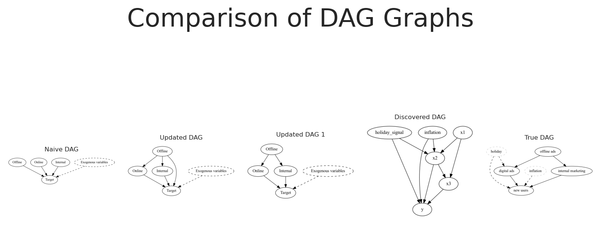</p>
</figure>

Última atualização:

Código

``` sourceCode
%load_ext watermark
%watermark -n -u -v -iv -w -p pymc_marketing,pytensor
```

    Last updated: Thu Sep 17 2026

    Python implementation: CPython
    Python version       : 3.11.8
    IPython version      : 8.30.0

    pymc_marketing: 0.17.1
    pytensor      : 2.37.0

    matplotlib    : 3.10.1
    preliz        : 0.20.0
    PIL           : 9.4.0
    IPython       : 8.30.0
    graphviz      : 0.20.3
    pymc          : 5.27.1
    arviz         : 0.21.0
    pymc_marketing: 0.17.1
    networkx      : 3.4.2
    pandas        : 2.2.3
    pydot         : 3.0.4
    numpy         : 2.1.3
    pymc_extras   : 0.4.0
    seaborn       : 0.13.2

    Watermark: 2.5.0
