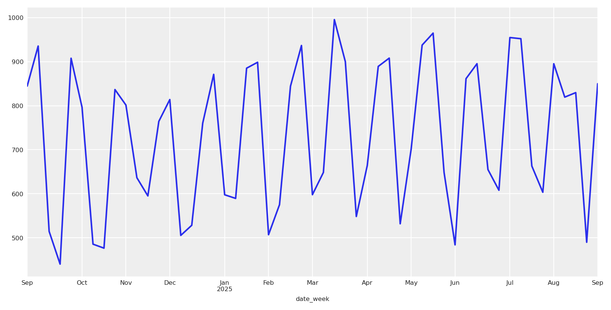
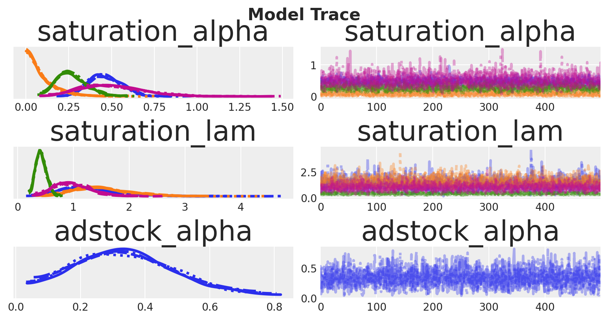
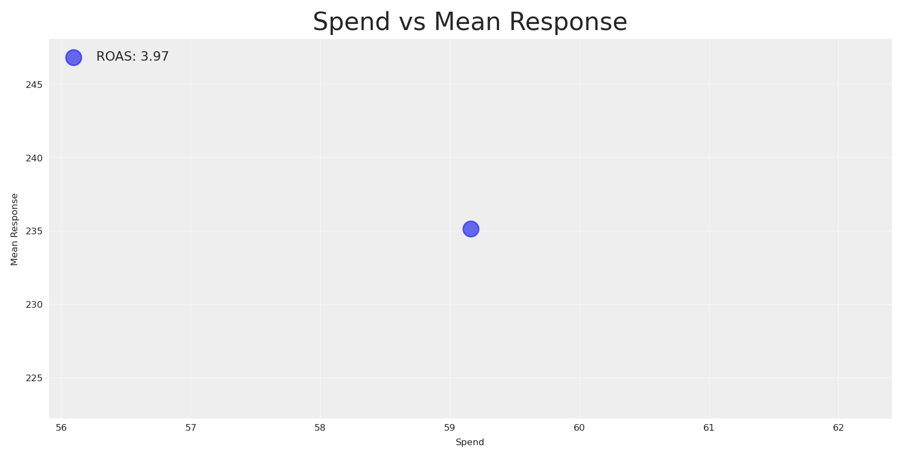
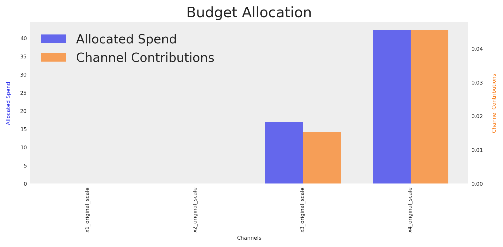
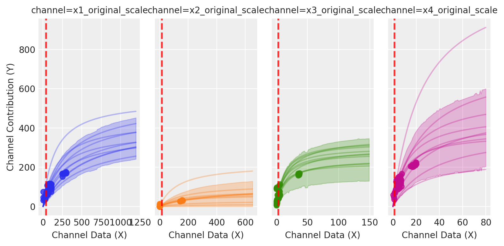
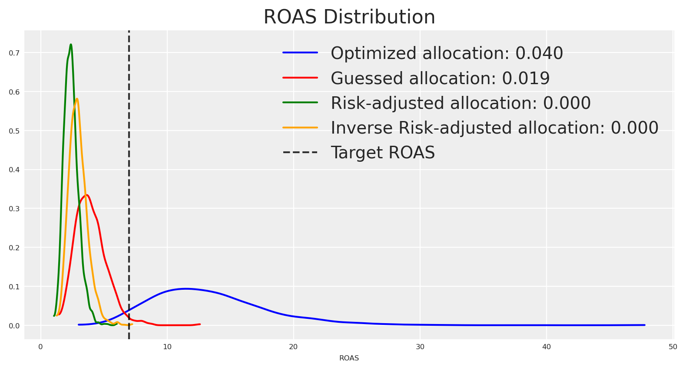

# Modelos bayesianos e otimização do risco

> Modelos bayesianos e otimização do risco para orçamentos de marketing, apresentado na PyData Berlim 2025.

By Carlos Trujillo

Source: https://cetagostini.github.io/pt/articles/bayesian_models_and_risk_optimization/bayesian_models_and_risk_optimization.html

# 📘 Introdução

Este artigo explora como o Bayesian Media Mix Modeling (MMM) representa a incerteza e como podemos otimizar decisões de orçamento sob risco. Construímos uma visão generativa da resposta ao media (arrastamento via adstock, retornos decrescentes via saturação, tendência e sazonalidade) e utilizamos distribuições preditivas a posteriori completas para comparar alocações não apenas pelos resultados esperados mas também pela dispersão e pelo risco de cauda.

Este material acompanha a minha apresentação na PyData Berlim 2025, onde discuto a otimização prática sensível ao risco para MMM: ir além de planos focados apenas na média para objetivos que incorporam explicitamente a incerteza—e como comunicar estas trocas às partes interessadas.

# 📦 Importar bibliotecas

Código

``` sourceCode
import warnings
warnings.filterwarnings("ignore", category=UserWarning)

from pymc_marketing.mmm.builders.yaml import build_mmm_from_yaml
from pymc_marketing.mmm import GeometricAdstock, MichaelisMentenSaturation
from pymc_marketing.mmm.budget_optimizer import optimizer_xarray_builder
from pymc_marketing.mmm.multidimensional import (
    MultiDimensionalBudgetOptimizerWrapper,
)
from pymc_extras.prior import Prior
from pymc_marketing.mmm import utility as ut

from scipy import ndimage

import arviz as az
import matplotlib.pyplot as plt
import seaborn as sns

import numpy as np
import pandas as pd
import xarray as xr
```

# ⚙️ Configuração do notebook

Código

``` sourceCode
az.style.use("arviz-darkgrid")
plt.rcParams["figure.figsize"] = [8, 4]
plt.rcParams["figure.dpi"] = 100
plt.rcParams["axes.labelsize"] = 6
plt.rcParams["xtick.labelsize"] = 6
plt.rcParams["ytick.labelsize"] = 6
plt.rcParams.update({"figure.constrained_layout.use": True})

%load_ext autoreload
%autoreload 2

seed: int = sum(map(ord, "pydata_berlin_2025"))
rng: np.random.Generator = np.random.default_rng(seed=seed)
default_figsize = (8, 4) # repeat to use later
```

# 🧪 Processo de geração de dados

Simulamos resultados como y_t = \beta_0 + \sum\_{c} f(x\_{c,t}; \theta_c) + \text{trend}\_t + \text{seasonality}\_t + \varepsilon_t

onde:

- y_t é o resultado observado (ex., instalações de aplicações ou receita) no momento t
- \beta_0 é o intercepto de base
- f(x\_{c,t}; \theta_c) é a função de resposta ao media para o canal c com investimento x\_{c,t} e parâmetros \theta_c.
- \text{trend}\_t captura padrões de crescimento ou declínio a longo prazo
- \text{seasonality}\_t modela efeitos periódicos (padrões semanais, mensais)
- \varepsilon_t representa a incerteza aleatória—ruído irreductível de fatores não observados, erro de medição e aleatoriedade inerente que permanece mesmo com conhecimento perfeito de todos os parâmetros

Não consideramos interações; o DAG causal apresenta-se assim:

Código

``` sourceCode
import graphviz

graph = graphviz.Digraph()
graph.node("Media Spend")
graph.node("Trend", style="dashed")
graph.node("Seasonality", style="dashed")
graph.node("Target")

graph.edge("Media Spend", "Target")
graph.edge("Trend", "Target")
graph.edge("Seasonality", "Target")

graph
```

<figure class="figure">
<p></p>
</figure>

## 📆 Intervalo de datas

Começamos por definir o intervalo de datas.

Código

``` sourceCode
# date range
min_date = pd.to_datetime("2024-09-01")
max_date = pd.to_datetime("2025-09-01")

df = pd.DataFrame(
    data={"date_week": pd.date_range(start=min_date, end=max_date, freq="W-MON")}
)

n = df.shape[0]
print(f"Number of observations: {n}")
print("Date Range: {} to {}".format(df.date_week.min(), df.date_week.max()))
```

    Number of observations: 53
    Date Range: 2024-09-02 00:00:00 to 2025-09-01 00:00:00

## 📣 Dados de media

Código

``` sourceCode
# media data
scaler_x1 = 300
scaler_x2 = 280
scaler_x3 = 50
scaler_x4 = 100
y_scaler = 1000

# media data
x1 = rng.uniform(low=0.0, high=1.0, size=n)
df["x1"] = np.where(x1 > 0.8, x1, x1 / 2)

x2 = rng.uniform(low=0.0, high=0.6, size=n)
df["x2"] = np.where(x2 > 0.5, x2, 0)

x3 = rng.uniform(low=0.0, high=0.8, size=n)
df["x3"] = np.where(x3 > 0.7, x3, x3 / 6)

x4 = rng.uniform(low=0.0, high=0.2, size=n)
df["x4"] = np.where(x4 > 0.15, x4, x4 / 2)


fig, ax = plt.subplots(
    nrows=4, ncols=1, sharex=True, sharey=True, layout="constrained"
)
sns.lineplot(x="date_week", y="x1", data=df, color="C0", ax=ax[0])
sns.lineplot(x="date_week", y="x2", data=df, color="C1", ax=ax[1])
sns.lineplot(x="date_week", y="x3", data=df, color="C2", ax=ax[2])
sns.lineplot(x="date_week", y="x4", data=df, color="C3", ax=ax[3])
ax[3].set(xlabel="date")
fig.suptitle("Media Costs Data", fontsize=16);
```

<figure class="figure">
<p></p>
</figure>

## 📈 Componentes de tendência e sazonalidade

Definimos a tendência e a sazonalidade. A sazonalidade segue um ciclo de 4 semanas modelado com uma base de Fourier; a tendência é linear.

Código

``` sourceCode
# Create Fourier components for monthly seasonality
monthly_period = 4  # 4-week cycle
t = np.arange(n)

# Create sin-cos signals for fourier components
monthly_sin = np.sin(2 * np.pi * t / monthly_period)
monthly_cos = np.cos(2 * np.pi * t / monthly_period)

# Combine sin-cos to create the desired pattern
# Use coefficients to shape the pattern
monthly_pattern = 0.6 * monthly_sin + 0.4 * monthly_cos

# Apply smoothing using ndimage to reduce sharp transitions
monthly_pattern = ndimage.gaussian_filter1d(monthly_pattern, sigma=0.2)

# Normalize to [-1, 1] range
monthly_pattern = (monthly_pattern / np.max(np.abs(monthly_pattern))) * .18

df["monthly_effect"] = monthly_pattern
df["trend"] = (np.linspace(start=0.0, stop=10, num=n) + 10) ** (1 / 8) - 1

fig, (ax1, ax2) = plt.subplots(2, 1, sharex=True)

# Plot monthly pattern
ax1.plot(df["date_week"], monthly_pattern, label="Monthly Pattern (Smoothed)", linewidth=2, color='blue')
ax1.set_ylabel("Pattern Value")
ax1.set_title("Monthly Fourier Pattern (4-week cycle, Smoothed)")
ax1.grid(True, alpha=0.3)
ax1.legend()

# Plot trend
ax2.plot(df["date_week"], df["trend"], label="Trend", linewidth=2, color='red')
ax2.set_xlabel("Date")
ax2.set_ylabel("Trend Value")
ax2.set_title("Linear Trend Component")
ax2.grid(True, alpha=0.3)
ax2.legend()

plt.tight_layout()
plt.show()
```

<figure class="figure">
<p></p>
</figure>

## 🔁 Transformações de adstock e saturação

Primeiro, aplicamos a transformação de adstock aos dados de media.

Código

``` sourceCode
# apply geometric adstock transformation
alpha: float = 0.55

df["x1_adstock"] = (
    GeometricAdstock(l_max=8, normalize=True).function(x=df["x1"].to_numpy(), alpha=alpha)
    .eval()
)

df["x2_adstock"] = (
    GeometricAdstock(l_max=8, normalize=True).function(x=df["x2"].to_numpy(), alpha=alpha)
    .eval()
)

df["x3_adstock"] = (
    GeometricAdstock(l_max=8, normalize=True).function(x=df["x3"].to_numpy(), alpha=alpha)
    .eval()
)

df["x4_adstock"] = (
    GeometricAdstock(l_max=8, normalize=True).function(x=df["x4"].to_numpy(), alpha=alpha)
    .eval()
)

df.head()
```

|  | date_week | x1 | x2 | x3 | x4 | monthly_effect | trend | x1_adstock | x2_adstock | x3_adstock | x4_adstock |
|----|----|----|----|----|----|----|----|----|----|----|----|
| 0 | 2024-09-02 | 0.342627 | 0.581017 | 0.009625 | 0.072294 | 0.120001 | 0.333521 | 0.155484 | 0.263665 | 0.004368 | 0.032807 |
| 1 | 2024-09-09 | 0.349177 | 0.000000 | 0.018831 | 0.007122 | 0.180000 | 0.336700 | 0.243973 | 0.145016 | 0.010948 | 0.021276 |
| 2 | 2024-09-16 | 0.292217 | 0.000000 | 0.029268 | 0.011185 | -0.120000 | 0.339827 | 0.266793 | 0.079759 | 0.019303 | 0.016778 |
| 3 | 2024-09-23 | 0.893449 | 0.000000 | 0.073220 | 0.056761 | -0.180000 | 0.342904 | 0.552183 | 0.043867 | 0.043844 | 0.034986 |
| 4 | 2024-09-30 | 0.197823 | 0.000000 | 0.073854 | 0.175182 | 0.120000 | 0.345932 | 0.393473 | 0.024127 | 0.057629 | 0.098740 |

Depois aplicamos a transformação de saturação aos dados de media transformados por adstock.

Código

``` sourceCode
alpha_sat_x1: float = 0.3
lam_sat_x1: float = 1.1

alpha_sat_x2: float = 0.1
lam_sat_x2: float = 1.5

alpha_sat_x3: float = 0.2
lam_sat_x3: float = 0.3

alpha_sat_x4: float = 0.8
lam_sat_x4: float = 0.8

df["x1_adstock_saturated"] = (
    MichaelisMentenSaturation().function(
        x=df["x1_adstock"].to_numpy(),
        alpha=alpha_sat_x1,
        lam=lam_sat_x1,
    ).eval()
)

df["x2_adstock_saturated"] = (
    MichaelisMentenSaturation().function(
        x=df["x2_adstock"].to_numpy(),
        alpha=alpha_sat_x2,
        lam=lam_sat_x2,
    ).eval()
)

df["x3_adstock_saturated"] = (
    MichaelisMentenSaturation().function(
        x=df["x3_adstock"].to_numpy(),  
        alpha=alpha_sat_x3,
        lam=lam_sat_x3,
    ).eval()
)

df["x4_adstock_saturated"] = (
    MichaelisMentenSaturation().function(
        x=df["x4_adstock"].to_numpy(),
        alpha=alpha_sat_x4,
        lam=lam_sat_x4,
    ).eval()
)

df.head()
```

|  | date_week | x1 | x2 | x3 | x4 | monthly_effect | trend | x1_adstock | x2_adstock | x3_adstock | x4_adstock | x1_adstock_saturated | x2_adstock_saturated | x3_adstock_saturated | x4_adstock_saturated |
|----|----|----|----|----|----|----|----|----|----|----|----|----|----|----|----|
| 0 | 2024-09-02 | 0.342627 | 0.581017 | 0.009625 | 0.072294 | 0.120001 | 0.333521 | 0.155484 | 0.263665 | 0.004368 | 0.032807 | 0.037153 | 0.014950 | 0.002870 | 0.031515 |
| 1 | 2024-09-09 | 0.349177 | 0.000000 | 0.018831 | 0.007122 | 0.180000 | 0.336700 | 0.243973 | 0.145016 | 0.010948 | 0.021276 | 0.054459 | 0.008815 | 0.007042 | 0.020725 |
| 2 | 2024-09-16 | 0.292217 | 0.000000 | 0.029268 | 0.011185 | -0.120000 | 0.339827 | 0.266793 | 0.079759 | 0.019303 | 0.016778 | 0.058559 | 0.005049 | 0.012091 | 0.016433 |
| 3 | 2024-09-23 | 0.893449 | 0.000000 | 0.073220 | 0.056761 | -0.180000 | 0.342904 | 0.552183 | 0.043867 | 0.043844 | 0.034986 | 0.100264 | 0.002841 | 0.025502 | 0.033520 |
| 4 | 2024-09-30 | 0.197823 | 0.000000 | 0.073854 | 0.175182 | 0.120000 | 0.345932 | 0.393473 | 0.024127 | 0.057629 | 0.098740 | 0.079038 | 0.001583 | 0.032228 | 0.087892 |

Vamos visualizar como os dados de media ficam após adstock e saturação, e como se traduzem em unidades de Y (instalações de aplicações ou receita).

Código

``` sourceCode
fig, ax = plt.subplots(
    nrows=3, ncols=4, sharex=True, sharey=False, layout="constrained"
)
sns.lineplot(x="date_week", y="x1", data=df, color="C0", ax=ax[0, 0])
sns.lineplot(x="date_week", y="x2", data=df, color="C1", ax=ax[0, 1])
sns.lineplot(x="date_week", y="x1_adstock", data=df, color="C0", ax=ax[1, 0])
sns.lineplot(x="date_week", y="x2_adstock", data=df, color="C1", ax=ax[1, 1])
sns.lineplot(x="date_week", y="x1_adstock_saturated", data=df, color="C0", ax=ax[2, 0])
sns.lineplot(x="date_week", y="x2_adstock_saturated", data=df, color="C1", ax=ax[2, 1])
sns.lineplot(x="date_week", y="x3", data=df, color="C2", ax=ax[0, 2])
sns.lineplot(x="date_week", y="x3_adstock", data=df, color="C2", ax=ax[1, 2])
sns.lineplot(x="date_week", y="x3_adstock_saturated", data=df, color="C2", ax=ax[2, 2])
sns.lineplot(x="date_week", y="x4", data=df, color="C3", ax=ax[0, 3])
sns.lineplot(x="date_week", y="x4_adstock", data=df, color="C3", ax=ax[1, 3])
sns.lineplot(x="date_week", y="x4_adstock_saturated", data=df, color="C3", ax=ax[2, 3])
fig.suptitle("Media Costs Data - Transformed", fontsize=16);
```

<figure class="figure">
<p></p>
</figure>

Agora adicionamos o intercepto e o ruído, e somamos os componentes de media transformados, tendência e sazonalidade.

Código

``` sourceCode
df["intercept"] = 0.15
df["epsilon"] = rng.normal(loc=0.0, scale=0.075, size=n)

df["app_installs"] = df[["intercept", "x1_adstock_saturated", "x2_adstock_saturated", "x3_adstock_saturated", "x4_adstock_saturated", "trend", "monthly_effect", "epsilon"]].sum(axis=1)
df["app_installs"] *= y_scaler
df.head()
```

|  | date_week | x1 | x2 | x3 | x4 | monthly_effect | trend | x1_adstock | x2_adstock | x3_adstock | x4_adstock | x1_adstock_saturated | x2_adstock_saturated | x3_adstock_saturated | x4_adstock_saturated | intercept | epsilon | app_installs |
|----|----|----|----|----|----|----|----|----|----|----|----|----|----|----|----|----|----|----|
| 0 | 2024-09-02 | 0.342627 | 0.581017 | 0.009625 | 0.072294 | 0.120001 | 0.333521 | 0.155484 | 0.263665 | 0.004368 | 0.032807 | 0.037153 | 0.014950 | 0.002870 | 0.031515 | 0.15 | 0.154459 | 844.469551 |
| 1 | 2024-09-09 | 0.349177 | 0.000000 | 0.018831 | 0.007122 | 0.180000 | 0.336700 | 0.243973 | 0.145016 | 0.010948 | 0.021276 | 0.054459 | 0.008815 | 0.007042 | 0.020725 | 0.15 | 0.177488 | 935.229200 |
| 2 | 2024-09-16 | 0.292217 | 0.000000 | 0.029268 | 0.011185 | -0.120000 | 0.339827 | 0.266793 | 0.079759 | 0.019303 | 0.016778 | 0.058559 | 0.005049 | 0.012091 | 0.016433 | 0.15 | 0.052790 | 514.748757 |
| 3 | 2024-09-23 | 0.893449 | 0.000000 | 0.073220 | 0.056761 | -0.180000 | 0.342904 | 0.552183 | 0.043867 | 0.043844 | 0.034986 | 0.100264 | 0.002841 | 0.025502 | 0.033520 | 0.15 | -0.034546 | 440.486094 |
| 4 | 2024-09-30 | 0.197823 | 0.000000 | 0.073854 | 0.175182 | 0.120000 | 0.345932 | 0.393473 | 0.024127 | 0.057629 | 0.098740 | 0.079038 | 0.001583 | 0.032228 | 0.087892 | 0.15 | 0.090876 | 907.549889 |

É assim que o alvo se apresenta.

Código

``` sourceCode
df.set_index("date_week").app_installs.plot();
```

<figure class="figure">
<p></p>
</figure>

Adicionamos também o media original ao DataFrame para que possamos visualizá-lo antes de quaisquer transformações e usá-lo como entrada do modelo.

Código

``` sourceCode
df[["x1_original_scale", "x2_original_scale", "x3_original_scale", "x4_original_scale"]] = df[["x1", "x2", "x3", "x4"]]
df["x1_original_scale"] *= scaler_x1
df["x2_original_scale"] *= scaler_x2
df["x3_original_scale"] *= scaler_x3
df["x4_original_scale"] *= scaler_x4

df[["date_week", "x1_original_scale", "x2_original_scale", "x3_original_scale", "app_installs"]].head()
```

|  | date_week | x1_original_scale | x2_original_scale | x3_original_scale | app_installs |
|----|----|----|----|----|----|
| 0 | 2024-09-02 | 102.788211 | 162.684671 | 0.481258 | 844.469551 |
| 1 | 2024-09-09 | 104.753127 | 0.000000 | 0.941552 | 935.229200 |
| 2 | 2024-09-16 | 87.665114 | 0.000000 | 1.463382 | 514.748757 |
| 3 | 2024-09-23 | 268.034637 | 0.000000 | 3.661005 | 440.486094 |
| 4 | 2024-09-30 | 59.346861 | 0.000000 | 3.692695 | 907.549889 |

# 🏗️ Construir o modelo

A configuração YAML codifica um MMM totalmente bayesiano com priors sobre os mecanismos de resposta centrais e a estrutura temporal. Para especificidades do modelo e exemplos trabalhados, consulte a [Galeria de Exemplos](https://www.pymc-marketing.io/en/stable/gallery/gallery.html) e a [API](https://www.pymc-marketing.io/en/stable/api/index.html) do PyMC‑Marketing.

Aqui dividimos os dados em conjuntos de treino e teste. Não para avaliar o ajuste; em vez disso, utilizamos o conjunto de teste para comparar os resultados da otimização, verificando se será “melhor” do que as recomendações de orçamento do plano atual/corrente.

Código

``` sourceCode
df_train = df.query("date_week <= '2025-08-30'").copy()
x_train = df_train[["date_week", "x1_original_scale", "x2_original_scale", "x3_original_scale", "x4_original_scale"]]
y_train = df_train["app_installs"]

df_test = df.query("date_week > '2025-08-30'").copy()
x_test = df_test[["date_week", "x1_original_scale", "x2_original_scale", "x3_original_scale", "x4_original_scale"]]
y_test = df_test["app_installs"]
```

Uma vez que o modelo foi definido previamente no YAML, construí-lo é simples e requer apenas algumas linhas.

Código

``` sourceCode
mmm = build_mmm_from_yaml(
    X=x_train,
    y=y_train,
    config_path="pymc_model.yml",
)
```

Agora ajustamos o modelo e verificamos a convergência!

Código

``` sourceCode
mmm.fit(
    X=x_train,
    y=y_train,
    random_seed=rng,
)

mmm.sample_posterior_predictive(
    X=x_train,
    extend_idata=True,
    combined=True,
    random_seed=rng,
)
```

**Sampler Progress**

Total Chains: 4

Active Chains: 0

Finished Chains: 4

Sampling for now

Estimated Time to Completion: now

| Progress | Draws | Divergences | Step Size | Gradients/Draw |
|----------|-------|-------------|-----------|----------------|
|          | 1300  | 0           | 0.10      | 63             |
|          | 1300  | 0           | 0.10      | 31             |
|          | 1300  | 0           | 0.10      | 31             |
|          | 1300  | 0           | 0.11      | 63             |

```
```

```
```

``` xr-text-repr-fallback
<xarray.Dataset> Size: 2MB
Dimensions:           (date: 52, sample: 2000)
Coordinates:
  * date              (date) datetime64[ns] 416B 2024-09-02 ... 2025-08-25
  * sample            (sample) object 16kB MultiIndex
  * chain             (sample) int64 16kB 0 0 0 0 0 0 0 0 0 ... 3 3 3 3 3 3 3 3
  * draw              (sample) int64 16kB 0 1 2 3 4 5 ... 495 496 497 498 499
Data variables:
    y                 (date, sample) float64 832kB 0.7353 1.207 ... 1.198 0.1073
    y_original_scale  (date, sample) float64 832kB 731.8 1.201e+03 ... 106.7
Attributes:
    created_at:                 2026-09-16T22:15:37.640768+00:00
    arviz_version:              0.21.0
    inference_library:          pymc
    inference_library_version:  5.28.5
```

xarray.Dataset

Dimensions:

- date: 52
- sample: 2000

Coordinates: (4)

date(date)datetime64\[ns\]2024-09-02 ... 2025-08-25

<!-- -->

    array(['2024-09-02T00:00:00.000000000', '2024-09-09T00:00:00.000000000',
           '2024-09-16T00:00:00.000000000', '2024-09-23T00:00:00.000000000',
           '2024-09-30T00:00:00.000000000', '2024-10-07T00:00:00.000000000',
           '2024-10-14T00:00:00.000000000', '2024-10-21T00:00:00.000000000',
           '2024-10-28T00:00:00.000000000', '2024-11-04T00:00:00.000000000',
           '2024-11-11T00:00:00.000000000', '2024-11-18T00:00:00.000000000',
           '2024-11-25T00:00:00.000000000', '2024-12-02T00:00:00.000000000',
           '2024-12-09T00:00:00.000000000', '2024-12-16T00:00:00.000000000',
           '2024-12-23T00:00:00.000000000', '2024-12-30T00:00:00.000000000',
           '2025-01-06T00:00:00.000000000', '2025-01-13T00:00:00.000000000',
           '2025-01-20T00:00:00.000000000', '2025-01-27T00:00:00.000000000',
           '2025-02-03T00:00:00.000000000', '2025-02-10T00:00:00.000000000',
           '2025-02-17T00:00:00.000000000', '2025-02-24T00:00:00.000000000',
           '2025-03-03T00:00:00.000000000', '2025-03-10T00:00:00.000000000',
           '2025-03-17T00:00:00.000000000', '2025-03-24T00:00:00.000000000',
           '2025-03-31T00:00:00.000000000', '2025-04-07T00:00:00.000000000',
           '2025-04-14T00:00:00.000000000', '2025-04-21T00:00:00.000000000',
           '2025-04-28T00:00:00.000000000', '2025-05-05T00:00:00.000000000',
           '2025-05-12T00:00:00.000000000', '2025-05-19T00:00:00.000000000',
           '2025-05-26T00:00:00.000000000', '2025-06-02T00:00:00.000000000',
           '2025-06-09T00:00:00.000000000', '2025-06-16T00:00:00.000000000',
           '2025-06-23T00:00:00.000000000', '2025-06-30T00:00:00.000000000',
           '2025-07-07T00:00:00.000000000', '2025-07-14T00:00:00.000000000',
           '2025-07-21T00:00:00.000000000', '2025-07-28T00:00:00.000000000',
           '2025-08-04T00:00:00.000000000', '2025-08-11T00:00:00.000000000',
           '2025-08-18T00:00:00.000000000', '2025-08-25T00:00:00.000000000'],
          dtype='datetime64[ns]')

sample(sample)objectMultiIndex

<!-- -->

    array([(0, 0), (0, 1), (0, 2), ..., (3, 497), (3, 498), (3, 499)], dtype=object)

chain(sample)int640 0 0 0 0 0 0 0 ... 3 3 3 3 3 3 3 3

<!-- -->

    array([0, 0, 0, ..., 3, 3, 3])

draw(sample)int640 1 2 3 4 5 ... 495 496 497 498 499

<!-- -->

    array([  0,   1,   2, ..., 497, 498, 499])

Data variables: (2)

y(date, sample)float640.7353 1.207 1.484 ... 1.198 0.1073

<!-- -->

    array([[0.73528722, 1.20680328, 1.48402619, ..., 0.47331738, 2.50422998,
            1.14033821],
           [0.14933635, 2.55826163, 0.23165906, ..., 1.44143359, 0.41606272,
            0.92845345],
           [0.32660566, 1.20948617, 0.33424877, ..., 0.87376765, 0.74022925,
            1.68338595],
           ...,
           [0.20001286, 0.4009374 , 0.72248646, ..., 0.18083986, 0.78481387,
            2.93341044],
           [0.25579167, 0.81699757, 0.35158191, ..., 1.52057009, 0.08659689,
            0.22502676],
           [0.1751002 , 0.96818072, 0.16677562, ..., 0.02643417, 1.19763758,
            0.10725884]])

y_original_scale(date, sample)float64731.8 1.201e+03 ... 1.192e+03 106.7

<!-- -->

    array([[ 731.7662282 , 1201.02439697, 1476.91979503, ...,  471.0508609 ,
            2492.2382503 , 1134.87759619],
           [ 148.62123984, 2546.01116854,  230.54973596, ..., 1434.53115706,
             414.07037096,  924.0074658 ],
           [ 325.04168189, 1203.69443356,  332.6481892 , ...,  869.58353809,
             736.68459528, 1675.32490415],
           ...,
           [ 199.05508315,  399.0174804 ,  719.02676823, ...,  179.9738935 ,
             781.0557214 , 2919.36354101],
           [ 254.56678667,  813.08530529,  349.8983325 , ..., 1513.28870557,
              86.18221025,  223.94919502],
           [ 174.26171734,  963.54449844,  165.97700171, ...,   26.30759054,
            1191.90258399,  106.74522615]])

Indexes: (2)

datePandasIndex

    PandasIndex(DatetimeIndex(['2024-09-02', '2024-09-09', '2024-09-16', '2024-09-23',
                   '2024-09-30', '2024-10-07', '2024-10-14', '2024-10-21',
                   '2024-10-28', '2024-11-04', '2024-11-11', '2024-11-18',
                   '2024-11-25', '2024-12-02', '2024-12-09', '2024-12-16',
                   '2024-12-23', '2024-12-30', '2025-01-06', '2025-01-13',
                   '2025-01-20', '2025-01-27', '2025-02-03', '2025-02-10',
                   '2025-02-17', '2025-02-24', '2025-03-03', '2025-03-10',
                   '2025-03-17', '2025-03-24', '2025-03-31', '2025-04-07',
                   '2025-04-14', '2025-04-21', '2025-04-28', '2025-05-05',
                   '2025-05-12', '2025-05-19', '2025-05-26', '2025-06-02',
                   '2025-06-09', '2025-06-16', '2025-06-23', '2025-06-30',
                   '2025-07-07', '2025-07-14', '2025-07-21', '2025-07-28',
                   '2025-08-04', '2025-08-11', '2025-08-18', '2025-08-25'],
                  dtype='datetime64[ns]', name='date', freq=None))

sample  
chain  
drawPandasMultiIndex

    PandasIndex(MultiIndex([(0,   0),
                (0,   1),
                (0,   2),
                (0,   3),
                (0,   4),
                (0,   5),
                (0,   6),
                (0,   7),
                (0,   8),
                (0,   9),
                ...
                (3, 490),
                (3, 491),
                (3, 492),
                (3, 493),
                (3, 494),
                (3, 495),
                (3, 496),
                (3, 497),
                (3, 498),
                (3, 499)],
               name='sample', length=2000))

Attributes: (4)

created_at :  
2026-09-16T22:15:37.640768+00:00

arviz_version :  
0.21.0

inference_library :  
pymc

inference_library_version :  
5.28.5

Ótimo, sem divergências 🔥

Código

``` sourceCode
mmm.idata.sample_stats.diverging.sum().item()
```

    0

Podemos inspecionar os parâmetros relevantes para a otimização.

Código

``` sourceCode
media_vars = [
    "saturation_alpha",
    "saturation_lam",
    "adstock_alpha",
]

_ = az.plot_trace(
    data=mmm.fit_result,
    var_names=media_vars,
    compact=True,
    backend_kwargs={"figsize": default_figsize, "layout": "constrained"},
)
plt.gcf().suptitle("Model Trace", fontsize=16, fontweight="bold", y=1.03);
```

<figure class="figure">
<p></p>
</figure>

Como esperado, alguns parâmetros estão bem identificados enquanto outros permanecem incertos.

Amostrar curvas de saturação a partir do posterior ajuda-nos a visualizar a incerteza dos parâmetros como bandas em torno da resposta de cada canal. Bandas largas indicam retornos marginais mal identificados; alocar nessas regiões aumenta a variância do resultado porque pequenas mudanças nos parâmetros causam grandes alterações na resposta.

Código

``` sourceCode
curve = mmm.saturation.sample_curve(
    mmm.idata.posterior[["saturation_alpha", "saturation_lam"]], max_value=3
)

fig, axes = mmm.plot.saturation_curves(
    curve,
    original_scale=True,
    n_samples=10,
    hdi_probs=0.85,
    random_seed=rng,
    subplot_kwargs={"figsize": default_figsize, "ncols": 4, "sharey": True},
    rc_params={
        "xtick.labelsize": 10,
        "ytick.labelsize": 10,
        "axes.labelsize": 10,
        "axes.titlesize": 10,
    },

)

for ax in axes.ravel():
    ax.title.set_fontsize(10)

if fig._suptitle is not None:
    fig._suptitle.set_fontsize(12)

plt.tight_layout()
plt.show()
```

```
```

<figure class="figure">
<p></p>
</figure>

A imagem é clara: canais como X1 e X3 exibem mais variação ao longo dos níveis de investimento, permitindo que o modelo aprenda os seus parâmetros com mais precisão. Canais como X2 e X4 têm gastos relativamente constantes com menos variação, por isso os seus parâmetros são estimados com maior incerteza.

# 🎲 Compreender a incerteza

Num MMM bayesiano modelamos explicitamente duas formas de incerteza que se acumulam nas previsões e nas decisões de orçamento:

- Incerteza aleatória: aleatoriedade nos resultados condicional em parâmetros fixos. Na simulação, é `epsilon`. Formalmente, se os parâmetros são \theta, a incerteza aleatória é a dispersão de p(y\mid x,\theta) quando modelamos a verosimilhança como \mathcal{N}(0, \sigma^2). No nosso modelo, o parâmetro \sigma captura explicitamente a incerteza aleatória: quantifica a quantidade de variabilidade do resultado que permanece mesmo que todos os parâmetros estruturais \theta fossem conhecidos exatamente. Representa a imprevisibilidade inerente devido a micro-variações não observadas, choques de procura ou ruído de registo. Mesmo com dados infinitos, a incerteza aleatória permanece.

- Incerteza epistémica: incerteza sobre os parâmetros e as próprias funções latentes devido a dados limitados ou pouco informativos. É a dispersão do posterior p(\theta\mid \text{data}). Diminui com mais dados, melhores priors ou variação experimental mais rica. No nosso modelo inclui memória de arrastamento (adstock \alpha), curvatura de saturação e semi-saturação (Michaelis–Menten \alpha,\lambda), declives de tendência e pesos sazonais de Fourier.

Porquê esta separação é importante para o planeamento:

1.  Distribuição do resultado sob um plano. Para um dado plano de alocação b ao longo dos canais e do tempo, a preditiva a posteriori é p\big(Y(b)\mid \text{data}\big) = \int p\big(Y(b)\mid \theta\big)\\ p(\theta\mid \text{data})\\ d\theta,

que mistura a variabilidade aleatória (o termo interno) e a variabilidade epistémica (integração sobre \theta). O nosso estimador de Monte Carlo amostra \theta^{(s)} do posterior, simula o arrastamento e a saturação sob b, e extrai resultados preditivos.

2.  Exemplo: curvatura conhecida vs desconhecida. Suponha que a saturação de um canal é bem aprendida em torno dos gastos históricos mas não além disso. Dois planos com o mesmo gasto total diferem no risco:

    - O Plano A concentra-se em torno da moda histórica (epistemicamente baixo), produzindo uma distribuição preditiva estreita.
    - O Plano B ultrapassa os gastos observados (epistemicamente alto), produzindo uma distribuição mais larga e caudas de desvantagem mais pesadas se a curva se aplanar mais cedo do que o esperado.

Durante a otimização, focamo-nos no segundo componente —incerteza epistémica— e podemos escolher quanta confiança exigimos em torno dela. Uma vez escolhida uma alocação, incorporamos então a incerteza aleatória para quantificar a distribuição total de resposta, se assim o desejarmos.

# 🧭 Otimização

Pensemos no nosso modelo e nos seus resultados, começando pela distribuição preditiva a posteriori: p\big(Y(b)\mid \text{data}\big) = \int p\big(Y(b)\mid \theta\big)\\ p(\theta\mid \text{data})\\ d\theta

Como pode ver, a distribuição preditiva a posteriori incorpora tanto a incerteza aleatória como a epistémica, o que significa que o problema de otimização se reduz a escolher uma alocação b que otimize um sumário escalar desta distribuição.

Formalmente, seja b \in \mathbb{R}^C uma alocação exequível (ex., orçamentos dos canais) com restrições \sum\_{c=1}^C b_c = B, \qquad \underline{b}\_c \leq b_c \leq \overline{b}\_c.

Para cada alocação candidata b, obtémos sorteios de Monte Carlo da distribuição preditiva a posteriori: \\Y^{(s)}(b)\\\_{s=1}^S \sim p(Y \mid \mathrm{do}(X=b), \mathcal{D}),

É então calculada uma estatística (por exemplo, a média, um quantil, uma pontuação ajustada ao risco ou a mean tightness score). \phi\\\left(\\Y^{(s)}(b)\\\right)

Por consequência, o problema de otimização resolvido pelo SLSQP é simplesmente \min\_{b \in \mathcal{B}} J(b), \qquad J(b) = f\\\left(\phi(\\Y^{(s)}(b)\\)\right),

onde f é definida para que o solucionador minimize a estatística escolhida a partir da distribuição preditiva a posteriori.

Esta formulação é flexível: ao mudar \phi, podemos almejar critérios neutros ao risco ou sensíveis ao risco, ou até heurísticas, ancorando sempre a decisão na distribuição preditiva a posteriori.

💡 Notas sobre pressupostos

Porquê dizemos do=(X=b)?

- **Invariância estrutural**: As funções de resposta (tendência, sazonalidade, adstock, saturação, ligação) são invariantes sob intervenções b ao longo do horizonte de otimização.
- **Sem confundidores não medidos**: Condicional nas covariáveis incluídas e controlos temporais, não existem confundidores não medidos (especialmente variáveis no tempo) que afetem tanto o investimento como o resultado; o critério de backdoor é satisfeito.

Utilizamos p\big(Y \mid \mathrm{do}(X=b), \mathcal{D}\big) como abreviatura para a preditiva a posteriori sob estes pressupostos. Quando as alocações se afastam muito do suporte, os resultados tornam-se extrapolativos e devem ser tratados como análise de sensibilidade em vez de efeitos identificados.

👀 Realmente bayesiano?

A nossa abordagem difere da “otimização bayesiana” no sentido de ML (que modela sequencialmente o objetivo com um substituto e otimiza uma função de aquisição). Em contraste, já temos o posterior completo p(\theta \mid \text{data}), que propagamos na preditiva a posteriori p(Y(b)\mid \text{data}). A otimização opera então sobre um funcional escalar \phi desta distribuição. Isto pode ser visto como uma compressão da preditiva a posteriori num sumário relevante para a decisão, mas não como uma perda de informação bayesiana. A otimização permanece totalmente bayesiana porque o critério depende inteiramente de sorteios a posteriori.

## 🛠️ Definir o otimizador

Inicializar o otimizador é simples: passe o modelo e o intervalo de datas.

Código

``` sourceCode
optimizable_model = MultiDimensionalBudgetOptimizerWrapper(
    model=mmm, 
    start_date=df_test.date_week.min().strftime("%Y-%m-%d"), 
    end_date=df_test.date_week.max().strftime("%Y-%m-%d")
)
print(f"Start date: {optimizable_model.start_date}")
print(f"End date: {optimizable_model.end_date}")
```

    Start date: 2025-09-01
    End date: 2025-09-01

Utilizaremos o conjunto de teste para definir o orçamento e o período de otimização para que possamos comparar a alocação resultante com o nosso plano atual.

Código

``` sourceCode
channels = ["x1_original_scale", "x2_original_scale", "x3_original_scale", "x4_original_scale"]
num_periods = optimizable_model.num_periods
time_unit_budget = df_test[channels].sum(axis=1).mean()
print(f"Total budget to allocate: {num_periods * time_unit_budget:,.0f}")
```

    Total budget to allocate: 59

Dado o orçamento e os canais, podemos estimar a resposta do nosso plano inicial.

Código

``` sourceCode
initial_budget = df_test[channels].sum(axis=0).to_xarray().rename({"index":"channel"})
initial_posterior_response = optimizable_model.sample_response_distribution(
    allocation_strategy=initial_budget,
    include_carryover=True,
    include_last_observations=False,
    additional_var_names=["y_original_scale"]
)

fig, ax = optimizable_model.plot.budget_allocation(
    samples=initial_posterior_response,
    figsize=default_figsize,
)
```

<figure class="figure">
<p></p>
</figure>

O `plot.budget_allocation` por defeito gera um gráfico de barras com a alocação e a resposta por canal. Para ver os totais, podemos somar e criar um simples gráfico de dispersão com uma etiqueta para o ROAS.

Código

``` sourceCode
# Create scatterplot with spend and mean response
spend = initial_posterior_response.allocation.sum().values
mean_response = initial_posterior_response.total_media_contribution_original_scale.mean(dim='sample').values

initial_roas = mean_response / spend

plt.scatter(spend, mean_response, alpha=0.7, s=100, label=f"ROAS: {initial_roas:.2f}")
plt.xlabel('Spend')
plt.ylabel('Mean Response')
plt.title('Spend vs Mean Response')
plt.grid(True, alpha=0.3)
plt.legend(fontsize='small', loc='upper left')
plt.show()
```

<figure class="figure">
<p></p>
</figure>

Obtivemos um ROAS de 3.9 para o plano inicial, que está abaixo do nosso ROAS alvo (digamos 8). Agora podemos executar uma otimização simples para responder à questão: **podemos realocar para alcançar uma resposta mais alta dado o mesmo orçamento?**

Código

``` sourceCode
allocation_strategy, optimization_result = optimizable_model.optimize_budget(
    budget=time_unit_budget,
)

naive_posterior_response = optimizable_model.sample_response_distribution(
    allocation_strategy=allocation_strategy,
    include_carryover=True,
    include_last_observations=False,
    additional_var_names=["y_original_scale"]
)

print("Budget allocation by channel:")
for channel in channels:
    print(
        f"  {channel}: {naive_posterior_response.allocation.sel(channel=channel).astype(int).sum():,}"
    )
print(
    f"Total Allocated Budget: {np.sum(naive_posterior_response.allocation.to_numpy()):,.0f}"
)

fig, ax = optimizable_model.plot.budget_allocation(
    samples=naive_posterior_response,
    figsize=default_figsize,
)
```

    Budget allocation by channel:
      x1_original_scale: 0
      x2_original_scale: 0
      x3_original_scale: 16
      x4_original_scale: 42
    Total Allocated Budget: 59

<figure class="figure">
<p></p>
</figure>

Sim, fazemos. Vamos comparar a resposta otimizada com o plano de base.

Código

``` sourceCode
# Create scatterplot with spend and mean response
mean_response_v2 = naive_posterior_response.total_media_contribution_original_scale.mean(dim='sample').values
roas_v2 = mean_response_v2 / spend

# Calculate the delta in response
response_delta = mean_response_v2.sum() - mean_response.sum()

plt.scatter(spend, mean_response_v2, alpha=0.7, s=100, color="blue", label=f"Optimized allocation (+{response_delta:.1f} response, ROAS: {roas_v2:.2f})")
plt.scatter(spend, mean_response, alpha=0.7, s=100, color="red", label="Guessed allocation")

plt.xlabel('Spend')
plt.ylabel('Mean Response')
plt.title('Spend vs Mean Response')
plt.grid(True, alpha=0.3)
plt.legend(fontsize='small', loc='upper left')
plt.show()
```

<figure class="figure">
<p></p>
</figure>

A alocação otimizada é ~500 unidades superior à alocação adivinhada, e o novo ROAS estimado é 13, que está acima das nossas expectativas. Por consequência, assumimos que obteremos uma receita Y estimada nos próximos N períodos e, planearando contra este fluxo de caixa entrante, recuperaremos.

A reviravolta? Obtivemos uma resposta mais baixa, o que significa um ROAS mais baixo e tivemos problemas financeiros sérios porque não temos dinheiro suficiente para pagar aos fornecedores ou serviços.

Porquê acontece isto? Maximizar a resposta média é neutro ao risco. Frequentemente realoca o orçamento para regiões com potencial de altos retornos mesmo que estejam mal identificadas, aumentando a dispersão dos resultados. Isto é racional quando as partes interessadas são indiferentes ao risco. No entanto, não é o caso de todas as empresas. Por vezes, as nossas partes interessadas precisam de saber quão certos estamos sobre os resultados esperados.

Ao inspecionar amostras preditivas a posteriori sob cada alocação, podemos quantificar a incerteza e responder a esta questão, com base na compreensão atual do modelo.

Vamos representar as distribuições de resposta tanto para a alocação de base como para a otimizada.

Código

``` sourceCode
fig, ax = plt.subplots()

# Get the values
optimized_values = naive_posterior_response.total_media_contribution_original_scale.values
guessed_values = initial_posterior_response.total_media_contribution_original_scale.values

# Plot distributions
az.plot_dist(
    optimized_values,
    color="blue",
    label="Optimized allocation",
    ax=ax,
)
az.plot_dist(
    guessed_values,
    color="red",
    label="Guessed allocation",
    ax=ax,
)

# Calculate means
optimized_mean = optimized_values.mean()
guessed_mean = guessed_values.mean()

# Add vertical lines for means
ax.axvline(optimized_mean, color="blue", linestyle="--", alpha=0.8)
ax.axvline(guessed_mean, color="red", linestyle="--", alpha=0.8)

# Add text boxes with mean values
ax.text(optimized_mean + 10, ax.get_ylim()[1] * 0.8, 
        f'Optimized Mean:\n{optimized_mean:.1f}', 
        bbox=dict(boxstyle="round,pad=0.3", facecolor="lightblue", alpha=0.7),
        ha='left', va='center')

ax.text(guessed_mean - 10, ax.get_ylim()[1] * 0.6, 
        f'Guessed Mean:\n{guessed_mean:.1f}', 
        bbox=dict(boxstyle="round,pad=0.3", facecolor="lightcoral", alpha=0.7),
        ha='right', va='center')

plt.title("Response Distribution")
plt.xlabel("Total Media Contribution")
plt.legend()
plt.show()
```

<figure class="figure">
<p></p>
</figure>

Como esperado, as médias diferem (otimizamos para as aumentar), e o mesmo acontece com a certeza em torno da média. Como exercício, vamos observar quão provável é obter uma resposta superior e inferior à média.

Código

``` sourceCode
az.plot_posterior(
    optimized_values,
    figsize=default_figsize,
    ref_val=optimized_mean,
)
plt.show()
```

<figure class="figure">
<p></p>
</figure>

Isto torna tudo claro agora: as hipóteses de obter algo igual ou superior à média eram de 43%, mas as hipóteses de obter algo inferior à média eram de 56%. Não é surpresa que tenhamos obtido uma resposta mais baixa e um ROAS mais baixo.

💡 Primeira conclusão

Comparar distribuições completas torna o risco transparente: a largura quantifica a fiabilidade da previsão, a assimetria revela a assimetria entre vantagem e desvantagem, e as sobreposições mostram indistinguibilidade prática.

De onde vem este risco? A nova alocação é mais arriscada, mas porquê? Vamos olhar para cada nível de investimento relativamente à sua curva de saturação.

Código

``` sourceCode
curve = mmm.saturation.sample_curve(
    mmm.idata.posterior[["saturation_alpha", "saturation_lam"]], max_value=10
)

fig, axes = mmm.plot.saturation_curves(
    curve,
    original_scale=True,
    n_samples=10,
    hdi_probs=0.85,
    random_seed=rng,
    subplot_kwargs={"figsize": default_figsize, "ncols": 4, "sharey": True},
    rc_params={
        "xtick.labelsize": 10,
        "ytick.labelsize": 10,
        "axes.labelsize": 10,
        "axes.titlesize": 10,
    },

)

# Add vertical lines for optimal allocation on each subplot
allocation_values = naive_posterior_response.allocation.values
channel_names = naive_posterior_response.allocation.channel.values

for i, (ax, allocation_value) in enumerate(zip(axes.ravel(), allocation_values)):
    ax.axvline(allocation_value, color="red", linestyle="--", alpha=0.8, linewidth=2, label="Optimal allocation")
    ax.title.set_fontsize(10)

if fig._suptitle is not None:
    fig._suptitle.set_fontsize(12)

plt.tight_layout()
plt.show()
```

```
```

<figure class="figure">
<p></p>
</figure>

As linhas verticais estão localizadas na alocação de investimento atribuída a cada canal. Para canais como x4, o modelo tem poucas observações nesses níveis de investimento, pelo que as bandas a posteriori são largas e a distribuição de resposta induzida é difusa. A otimização sensível ao risco tende a puxar o investimento para regiões bem identificadas (frequentemente perto do ponto de inflexão), trocando uma pequena diminuição da média por uma grande redução da variância.

Será que poderíamos compreender isto com antecedência? E, em caso afirmativo, preferiríamos um tipo diferente de alocação? Que nos aproxima do nosso objetivo de forma mais segura? -Uma distribuição mais estreita com uma média ligeiramente mais baixa pode ser preferível quando o risco de insuficiência é oneroso-.

A resposta curta é **decididamente**. Vamos criar agora um novo processo de otimização que será sensível ao risco.

# ⚖️ Métricas de risco consistentes com PyMC-Marketing

Aqui utilizaremos uma aproximação heurística, *mean tightness score* implementada na biblioteca PyMC-Marketing. **Esta pontuação combina a média com uma penalização pelo espalhamento das caudas**.

## 🎯 Pontuação média de concentração (Mean Tightness Score)

Código

``` sourceCode
ut.mean_tightness_score?
```

O alpha aqui codifica o seu perfil de risco (intervalo 0-1); alocações com médias mais altas mesmo com grande dispersão pontuam melhor quando o seu alpha é alto. Quando o seu alpha é baixo, alocações com médias mais baixas mas pequena dispersão pontuam melhor.

Estamos a utilizar um alpha mais baixo no exemplo; como esperado, as recomendações para cada canal situam-se em regiões bem conhecidas.

Código

``` sourceCode
mts_budget_allocation, mts_optimizer_result, callback_results = (
    optimizable_model.optimize_budget(
        budget=time_unit_budget,
        utility_function=ut.mean_tightness_score(alpha=0.15),
        callback=True,
        minimize_kwargs={"options": {"maxiter": 2_000, "ftol": 1e-16}},
    )
)

mts_posterior_response = optimizable_model.sample_response_distribution(
    allocation_strategy=mts_budget_allocation,
    include_carryover=True,
    include_last_observations=False,
    additional_var_names=["y_original_scale"]
)

# Print budget allocation by channel
print("Budget allocation by channel:")
for channel in channels:
    print(
        f"  {channel}: {mts_posterior_response.allocation.sel(channel=channel).astype(int).sum():,}"
    )
print(
    f"Total Allocated Budget: {np.sum(mts_posterior_response.allocation.to_numpy()):,.0f}"
)
```

    Budget allocation by channel:
      x1_original_scale: 39
      x2_original_scale: 15
      x3_original_scale: 3
      x4_original_scale: 1
    Total Allocated Budget: 59

Ótimo, parece que a alocação desloca-se para regiões melhor identificadas. Vamos representar as curvas de saturação para ver onde a alocação se situa.

Código

``` sourceCode
curve = mmm.saturation.sample_curve(
    mmm.idata.posterior[["saturation_alpha", "saturation_lam"]], max_value=4
)

fig, axes = mmm.plot.saturation_curves(
    curve,
    original_scale=True,
    n_samples=10,
    hdi_probs=0.85,
    random_seed=rng,
    subplot_kwargs={"figsize": default_figsize, "ncols": 4, "sharey": True},
    rc_params={
        "xtick.labelsize": 10,
        "ytick.labelsize": 10,
        "axes.labelsize": 10,
        "axes.titlesize": 10,
    },

)

# Add vertical lines for optimal allocation on each subplot
allocation_values = mts_posterior_response.allocation.values

for i, (ax, allocation_value) in enumerate(zip(axes.ravel(), allocation_values)):
    ax.axvline(allocation_value, color="red", linestyle="--", alpha=0.8, linewidth=2, label="Optimal allocation")
    ax.title.set_fontsize(10)

if fig._suptitle is not None:
    fig._suptitle.set_fontsize(12)

plt.tight_layout()
plt.show()
```

```
```

<figure class="figure">
<p></p>
</figure>

Como esperado, as recomendações para cada canal situam-se em regiões bem conhecidas.

A consequência: a distribuição a posteriori estreita-se porque o orçamento se concentra em regiões bem aprendidas e menos não-lineares.

Vamos representar as distribuições a posteriori para esta alocação de menor risco.

Código

``` sourceCode
fig, ax = plt.subplots()

# Get the values
optimized_risk_values = mts_posterior_response.total_media_contribution_original_scale.values

# Plot distributions
az.plot_dist(
    optimized_values,
    color="blue",
    label="Optimized allocation",
    ax=ax,
)
az.plot_dist(
    guessed_values,
    color="red",
    label="Guessed allocation",
    ax=ax,
)
az.plot_dist(
    optimized_risk_values,
    color="green",
    label="Risk-adjusted allocation",
    ax=ax,
)

# Calculate means
risk_adjusted_mean = optimized_risk_values.mean()

# Add vertical lines for means
ax.axvline(optimized_mean, color="blue", linestyle="--", alpha=0.8)
ax.axvline(guessed_mean, color="red", linestyle="--", alpha=0.8)
ax.axvline(risk_adjusted_mean, color="green", linestyle="--", alpha=0.8)

# Add text boxes with mean values
ax.text(optimized_mean + 10, ax.get_ylim()[1] * 0.8, 
        f'Optimized Mean:\n{optimized_mean:.1f}', 
        bbox=dict(boxstyle="round,pad=0.3", facecolor="lightblue", alpha=0.7),
        ha='left', va='center')

ax.text(guessed_mean - 10, ax.get_ylim()[1] * 0.6, 
        f'Guessed Mean:\n{guessed_mean:.1f}', 
        bbox=dict(boxstyle="round,pad=0.3", facecolor="lightcoral", alpha=0.7),
        ha='right', va='center')

ax.text(risk_adjusted_mean - 10, ax.get_ylim()[1] * 0.4, 
        f'Risk-adjusted Mean:\n{risk_adjusted_mean:.1f}', 
        bbox=dict(boxstyle="round,pad=0.3", facecolor="lightgreen", alpha=0.7),
        ha='right', va='center')

plt.title("Response Distribution")
plt.xlabel("Total Media Contribution")
plt.legend()
plt.show()
```

<figure class="figure">
<p></p>
</figure>

Isto torna claro: ganhámos muito mais certeza—uma distribuição de resposta avessa ao risco (menor variância). Pode estar a pensar que jogar em regiões conhecidas tende a reduzir a média. Quer saber porquê?

As curvas de resposta a posteriori tendem a ser mais certas na origem porque duas fontes de incerteza são minimizadas ali: estruturalmente, sabemos que zero investimento produz zero efeito incremental; e empiricamente, a região de menor investimento é frequentemente bem sustentada nos dados históricos. À medida que o investimento aumenta, especialmente além dos níveis observados historicamente, a incerteza epistémica sobre os parâmetros de saturação e curvatura domina, alargando os intervalos credíveis.

Significa isto que estamos condenados a valores mais baixos se quisermos certeza? De todo; podemos mudar a utilidade para preferir opções mais arriscadas 🔥.

Vamos executar uma alocação mais propensa ao risco 👀

Código

``` sourceCode
inverse_mts_budget_allocation, inverse_mts_optimizer_result, callback_results = (
    optimizable_model.optimize_budget(
        budget=time_unit_budget,
        utility_function=ut.mean_tightness_score(alpha=0.95),
        callback=True,
        minimize_kwargs={"options": {"maxiter": 2_000, "ftol": 1e-16}},
    )
)

inverse_mts_posterior_response = optimizable_model.sample_response_distribution(
    allocation_strategy=inverse_mts_budget_allocation,
    include_carryover=True,
    include_last_observations=False,
    additional_var_names=["y_original_scale"]
)

# Print budget allocation by channel
print("Budget allocation by channel:")
for channel in channels:
    print(
        f"  {channel}: {inverse_mts_posterior_response.allocation.sel(channel=channel).astype(int).sum():,}"
    )
print(
    f"Total Allocated Budget: {np.sum(inverse_mts_posterior_response.allocation.to_numpy()):,.0f}"
)
```

    Budget allocation by channel:
      x1_original_scale: 50
      x2_original_scale: 3
      x3_original_scale: 3
      x4_original_scale: 2
    Total Allocated Budget: 59

Inverter a preferência de estreitamento (parâmetro alpha) induz comportamento propenso ao risco, deslocando as alocações para regiões de maior variância e alto potencial de valorização.

Agora escolhemos uma alocação menos certa mas com maior potencial de valorização do que a linha de base. Vamos representar as distribuições de resposta.

💡 Segunda conclusão

Descubra as suas preferências de risco e ajuste a sua função objetivo para as refletir. Não precisa de se comprometer com uma única função ou abordagem; pode construir uma personalizada que se adeque às suas necessidades.

Código

``` sourceCode
fig, ax = plt.subplots()

# Get the values
optimized_inverse_risk_values = inverse_mts_posterior_response.total_media_contribution_original_scale.values

# Plot distributions
az.plot_dist(
    optimized_values,
    color="blue",
    label="Optimized allocation",
    ax=ax,
)
az.plot_dist(
    guessed_values,
    color="red",
    label="Guessed allocation",
    ax=ax,
)
az.plot_dist(
    optimized_risk_values,
    color="green",
    label="Risk-adjusted allocation",
    ax=ax,
)

az.plot_dist(
    optimized_inverse_risk_values,
    color="orange",
    label="Inverse Risk-adjusted allocation",
    ax=ax,
)

# Calculate means
inverse_risk_adjusted_mean = optimized_inverse_risk_values.mean()

# Add vertical lines for means
ax.axvline(optimized_mean, color="blue", linestyle="--", alpha=0.8)
ax.axvline(guessed_mean, color="red", linestyle="--", alpha=0.8)
ax.axvline(risk_adjusted_mean, color="green", linestyle="--", alpha=0.8)
ax.axvline(inverse_risk_adjusted_mean, color="orange", linestyle="--", alpha=0.8)

# Add text boxes with mean values
ax.text(optimized_mean + 10, ax.get_ylim()[1] * 0.8, 
        f'Optimized Mean:\n{optimized_mean:.1f}', 
        bbox=dict(boxstyle="round,pad=0.3", facecolor="lightblue", alpha=0.7),
        ha='left', va='center')

ax.text(guessed_mean - 10, ax.get_ylim()[1] * 0.6, 
        f'Guessed Mean:\n{guessed_mean:.1f}', 
        bbox=dict(boxstyle="round,pad=0.3", facecolor="lightcoral", alpha=0.7),
        ha='right', va='center')

ax.text(risk_adjusted_mean - 10, ax.get_ylim()[1] * 0.4, 
        f'Risk-adjusted Mean:\n{risk_adjusted_mean:.1f}', 
        bbox=dict(boxstyle="round,pad=0.3", facecolor="lightgreen", alpha=0.7),
        ha='right', va='center')

ax.text(inverse_risk_adjusted_mean - 10, ax.get_ylim()[1] * 0.2, 
        f'Inverse Risk-adjusted Mean:\n{inverse_risk_adjusted_mean:.1f}', 
        bbox=dict(boxstyle="round,pad=0.3", facecolor="orange", alpha=0.7),
        ha='right', va='center')

plt.title("Response Distribution")
plt.xlabel("Total Media Contribution")
plt.legend()
plt.show()
```

<figure class="figure">
<p></p>
</figure>

Ótimo, a nova alocação é mais arriscada e a média é mais alta (ainda menos incerteza do que a alocação neutra ao risco). Podemos ir além das visualizações e quantificar isto.

Como todas são distribuições a posteriori, podemos verificar a densidade que cada distribuição de resposta tem na sua respetiva média. Utilizaremos a estimação de densidade por kernel (KDE). Este valor, denotado \hat{f}(\mu), representa a altura estimada da função de densidade de probabilidade na média. Importante, isto não é em si uma probabilidade mas sim uma densidade, com unidades de “1 sobre as unidades da variável.” Valores mais altos de \hat{f}(\mu) indicam que a distribuição é afilada em torno da refletindo maior certeza de que os sorteios a posteriori estarão próximos do valor central. Por outro lado, valores mais baixos correspondem a posteriores mais achatados e difusos, indicando maior incerteza.

Vamos verificar a densidade na média para cada alocação.

Código

``` sourceCode
from scipy.stats import gaussian_kde

def kde_density_at_point(x, x0):
    """Gaussian KDE density estimate at x0 using Scott's rule bandwidth."""
    kde = gaussian_kde(x)  # Scott's rule by default
    return float(kde.evaluate([x0])[0])

optimized_density = kde_density_at_point(optimized_values, optimized_mean)
guessed_density = kde_density_at_point(guessed_values, guessed_mean)
risk_adjusted_density = kde_density_at_point(optimized_risk_values, risk_adjusted_mean)
inverse_risk_adjusted_density = kde_density_at_point(optimized_inverse_risk_values, inverse_risk_adjusted_mean)

print(f"Optimized allocation response density at mean: {optimized_density:.3f}")
print(f"Guessed allocation response density at mean: {guessed_density:.3f}")
print(f"Risk-adjusted allocation response density at mean: {risk_adjusted_density:.3f}")
print(f"Inverse Risk-adjusted allocation response density at mean: {inverse_risk_adjusted_density:.3f}")
```

    Optimized allocation response density at mean: 0.001
    Guessed allocation response density at mean: 0.005
    Risk-adjusted allocation response density at mean: 0.012
    Inverse Risk-adjusted allocation response density at mean: 0.010

As estimativas de densidade contam a mesma história que os gráficos. Como podemos usar isto para tomar ações? Por exemplo, suponhamos que queremos atingir um ROAS alvo de 9.5; podemos então verificar a densidade da distribuição do ROAS em 9.5 para cada distribuição de resposta dada a sua respetiva estratégia de alocação.

Código

``` sourceCode
optimized_roas = optimized_values / (time_unit_budget*num_periods)
guessed_roas = guessed_values / (time_unit_budget*num_periods)
risk_adjusted_roas = optimized_risk_values / (time_unit_budget*num_periods)
inverse_risk_adjusted_roas = optimized_inverse_risk_values / (time_unit_budget*num_periods)

# Calculate kde density at 9.5
_target_roas = 9.5
optimized_kde_density = kde_density_at_point(optimized_roas, _target_roas)
guessed_kde_density = kde_density_at_point(guessed_roas, _target_roas)
risk_adjusted_kde_density = kde_density_at_point(risk_adjusted_roas, _target_roas)
inverse_risk_adjusted_kde_density = kde_density_at_point(inverse_risk_adjusted_roas, _target_roas)

#plot the ROAS distributions
fig, ax = plt.subplots()

# Plot distributions
az.plot_dist(optimized_roas, color="blue", label=f"Optimized allocation: {optimized_kde_density:.3f}", ax=ax)
az.plot_dist(guessed_roas, color="red", label=f"Guessed allocation: {guessed_kde_density:.3f}", ax=ax)
az.plot_dist(risk_adjusted_roas, color="green", label=f"Risk-adjusted allocation: {risk_adjusted_kde_density:.3f}", ax=ax)
az.plot_dist(inverse_risk_adjusted_roas, color="orange", label=f"Inverse Risk-adjusted allocation: {inverse_risk_adjusted_kde_density:.3f}", ax=ax)

# Add vertical lines for means
ax.axvline(_target_roas, color="black", linestyle="--", alpha=0.8, label="Target ROAS")

plt.tight_layout()
plt.title("ROAS Distribution")
plt.xlabel("ROAS")
plt.legend()
plt.show()
```

<figure class="figure">
<p></p>
</figure>

Se quisermos atingir um ROAS alvo de 9.5, a alocação otimizada neutra ao risco é a mais certa, seguida pela alocação inversa ajustada ao risco.

Se em vez disso o nosso ROAS alvo for 7, a alocação inversa ajustada ao risco concentra mais densidade em torno desse valor, e a alocação otimizada neutra ao risco tem menos densidade em torno dele.

Código

``` sourceCode
# Calculate kde density at 7
_roas_target = 7
optimized_kde_density = kde_density_at_point(optimized_roas, _roas_target)
guessed_kde_density = kde_density_at_point(guessed_roas, _roas_target)
risk_adjusted_kde_density = kde_density_at_point(risk_adjusted_roas, _roas_target)
inverse_risk_adjusted_kde_density = kde_density_at_point(inverse_risk_adjusted_roas, _roas_target)

#plot the ROAS distributions
fig, ax = plt.subplots()

# Plot distributions
az.plot_dist(optimized_roas, color="blue", label=f"Optimized allocation: {optimized_kde_density:.3f}", ax=ax)
az.plot_dist(guessed_roas, color="red", label=f"Guessed allocation: {guessed_kde_density:.3f}", ax=ax)
az.plot_dist(risk_adjusted_roas, color="green", label=f"Risk-adjusted allocation: {risk_adjusted_kde_density:.3f}", ax=ax)
az.plot_dist(inverse_risk_adjusted_roas, color="orange", label=f"Inverse Risk-adjusted allocation: {inverse_risk_adjusted_kde_density:.3f}", ax=ax)

# Add vertical lines for means
ax.axvline(_roas_target, color="black", linestyle="--", alpha=0.8, label="Target ROAS")

plt.tight_layout()
plt.title("ROAS Distribution")
plt.xlabel("ROAS")
plt.legend()
plt.show()
```

<figure class="figure">
<p></p>
</figure>

Sob este paradigma, pode definir uma estimativa alvo e selecionar uma alocação que maximize a probabilidade de a atingir. Uma forma é criar uma função que reduza a variância em relação ao alvo, favorecendo distribuições mais estreitas com densidade perto do alvo.

Vamos criar esta função de utilidade personalizada e ver como se comporta.

Código

``` sourceCode
import pytensor.tensor as pt
import pymc_marketing.mmm.utility as ut

def target_hit_probability(target, num_periods):
    """
    Target hit probability utility function.
    
    Minimizing the mean squared error between predicted ROAS and the target
    Adding a variance penalty to encourage tighter distributions.
    
    Parameters
    ----------
    target : float
        The target ROAS value to optimize towards
    num_periods : int
        Number of time periods for the budget allocation
        
    Returns
    -------
    callable
        A utility function that can be used with the budget optimizer.
        Returns negative objective (since optimizer minimizes).
    """
    def _function(samples, budgets):
        roas_samples = samples / (pt.sum(budgets) * num_periods)
        
        # Use mean squared error from target, which provides smoother gradients
        mse_from_target = pt.mean((roas_samples - target) ** 2)
        
        # Add penalty for variance to encourage tighter distributions around target
        variance_penalty = pt.var(roas_samples)
        
        # Combine MSE and variance penalty with weighting
        # Higher variance penalty encourages narrower distributions
        total_objective = mse_from_target + 0.1 * variance_penalty
        
        return -total_objective
    return _function

_roas_target = 10
custom_utility_budget_allocation, custom_utility_optimizer_result, callback_results = (
    optimizable_model.optimize_budget(
        budget=time_unit_budget,
        utility_function=target_hit_probability(_roas_target, num_periods),
        callback=True,
        minimize_kwargs={"options": {"maxiter": 2_000}},
    )
)

custom_utility_posterior_response = optimizable_model.sample_response_distribution(
    allocation_strategy=custom_utility_budget_allocation,
    include_carryover=True,
    include_last_observations=False,
    additional_var_names=["y_original_scale"]
)

# Print budget allocation by channel
print("Budget allocation by channel:")
for channel in channels:
    print(
        f"  {channel}: {custom_utility_posterior_response.allocation.sel(channel=channel).astype(int).sum():,}"
    )
print(
    f"Total Allocated Budget: {np.sum(custom_utility_posterior_response.allocation.to_numpy()):,.0f}"
)
```

    Budget allocation by channel:
      x1_original_scale: 23
      x2_original_scale: 0
      x3_original_scale: 23
      x4_original_scale: 12
    Total Allocated Budget: 59

A alocação é semelhante às observadas anteriormente. Vamos representar as distribuições de ROAS.

Código

``` sourceCode
custom_utility_values = custom_utility_posterior_response.total_media_contribution_original_scale.values
custom_utility_roas = custom_utility_values / (time_unit_budget*num_periods)
optimized_kde_density = kde_density_at_point(optimized_roas, _roas_target)
guessed_kde_density = kde_density_at_point(guessed_roas, _roas_target)
risk_adjusted_kde_density = kde_density_at_point(risk_adjusted_roas, _roas_target)
inverse_risk_adjusted_kde_density = kde_density_at_point(inverse_risk_adjusted_roas, _roas_target)
custom_utility_kde_density = kde_density_at_point(custom_utility_roas, _roas_target)

#plot the ROAS distributions
fig, ax = plt.subplots()

# Plot distributions
az.plot_dist(optimized_roas, color="blue", label=f"Optimized allocation: {optimized_kde_density:.3f}", ax=ax)
az.plot_dist(guessed_roas, color="red", label=f"Guessed allocation: {guessed_kde_density:.3f}", ax=ax)
az.plot_dist(risk_adjusted_roas, color="green", label=f"Risk-adjusted allocation: {risk_adjusted_kde_density:.3f}", ax=ax)
az.plot_dist(inverse_risk_adjusted_roas, color="orange", label=f"Inverse Risk-adjusted allocation: {inverse_risk_adjusted_kde_density:.3f}", ax=ax)
az.plot_dist(custom_utility_roas, color="purple", label=f"Custom utility allocation: {custom_utility_kde_density:.3f}", ax=ax)

# Add vertical lines for means
ax.axvline(_roas_target, color="black", linestyle="--", alpha=0.8, label="Target ROAS")

plt.tight_layout()
plt.title("ROAS Distribution")
plt.xlabel("ROAS")
plt.legend()
plt.show()
```

<figure class="figure">
<p></p>
</figure>

Ótimo 🙌🏻 A alocação otimizada inicial, que era neutra ao risco, tinha inicialmente a maior densidade em torno do ROAS alvo, mas a densidade não era suficientemente alta; a nova alocação traz uma resposta mais certa em torno do alvo, porque a função objetivo foi construída para isso.

💡 Ideia-chave

Aqui temos uma função de utilidade personalizada que nos permite otimizar para um ROAS alvo. No entanto, pode construir outras utilidades e usá-las como objetivos. Pode também introduz restrições sensíveis ao risco—sem sobrepor às suas restrições de negócio.

Vamos observar o nosso posterior final em torno do ROAS alvo.

Código

``` sourceCode
az.plot_posterior(
    custom_utility_roas, 
    ref_val=_roas_target
)
plt.show()
```

<figure class="figure">
<p></p>
</figure>

Podemos dizer: a probabilidade de alcançar ROAS ≥ 10 com esta alocação é de 31%, e ROAS \< 10 é de 69%. Se precisarmos de mais certeza, podemos tornar a otimização mais avessa ao risco.

Agora, se quiser pensar de forma realmente bayesiana, pode definir uma região de equivalência prática e verificar a probabilidade de o ROAS estar nessa região. Por exemplo, pode perguntar-se: Faria algo diferente se o ROAS fosse 7, 9 ou 11? Se a resposta for não, então encontrou a sua ROPE.

Suponhamos que queremos saber a probabilidade de o ROAS estar entre 7 e 11.

Código

``` sourceCode
# Calculate probability of ROAS being between 7 and 9
prob_7_to_11 = np.mean((custom_utility_roas >= 7) & (custom_utility_roas <= 11))

# Plot posterior with reference values and region
fig, ax = plt.subplots()
az.plot_posterior(
    custom_utility_roas, 
    ref_val=_roas_target,
    ax=ax
)

# Add vertical lines for the region of interest
ax.axvline(7, color="black", linestyle="--", alpha=0.7, label="ROAS = 7")
ax.axvline(11, color="black", linestyle="--", alpha=0.7, label="ROAS = 11")

# Add text box with probability
ax.text(0.02, 0.98, 
        f'P(7 ≤ ROAS ≤ 11) = {prob_7_to_11:.2%}', 
        transform=ax.transAxes,
        bbox=dict(boxstyle="round,pad=0.3", facecolor="lightblue", alpha=0.8),
        ha='left', va='top', fontsize=12)

plt.show()
```

<figure class="figure">
<p></p>
</figure>

💡 Ideia-chave

Pode **definir uma região de equivalência prática (ROPE)**, de forma a ser mais preciso nas suas decisões. Esta é uma forma bastante natural de pensar sobre um problema, e alivia o fardo do decisor de se comprometer com um único número. No final do dia, não precisamos de ser 99.999% precisos em torno de cada resposta ou número; podemos ser 95% ou 90% precisos e por vezes isso é suficiente. *Identifique se esse é o seu caso, e pense em conformidade*.

# ✅ Conclusões sobre incerteza

- **Trate a incerteza como primordial**: Otimize sobre a preditiva a posteriori completa, não estimativas pontuais. Compare planos pelas suas distribuições, não apenas pelas médias esperadas.
- **Compreenda os tipos de incerteza**: Aleatória (ruído irreductível) vs epistémica (incerteza aprendível do modelo/parâmetros). As escolhas de planeamento deslocam sobretudo o risco epistémico; comunique sempre ambos.
- **Descubra o seu apetite para o risco**: Pergunte às partes interessadas quão certos precisamos de estar sobre os resultados reportados. O que muda se forem um pouco mais altos ou mais baixos?
- **Escolha uma utilidade alinhada com o apetite para o risco**: Trabalhar com a média é neutro ao risco; quantis, TailDistance, CVaR ou MTS são mais sensíveis ao risco.
- **Comunique distribuições, não números isolados**: Apresente HDIs/quantis e probabilidades (ex., P(ROAS ≥ alvo)). É melhor compreender o espetro completo de possibilidades do que seguir números isolados e ter uma visão de curto prazo.
- **Defina uma região de equivalência prática (ROPE)**: Quando já se sentir confortável com a incerteza, explore ROPEs e descubro quanto pode aligeirar a resposta estimada, e se faria algo diferente se esta mudasse dentro de um intervalo de valores.

# 🚧 Limitações

- Esta abordagem reflete a confiança do modelo, mas os modelos podem estar muito certos de uma resposta errada. Adicione sempre conhecimento do negócio e salvaguardas para manter as recomendações realistas.

# Conclusão

Espero que este artigo tenha sido útil para compreender como usar modelos bayesianos de media mix para otimizar o seu investimento em media. Compreender a incerteza é uma ferramenta poderosa para tomar melhores decisões, mas não é uma solução milagrosa.

O exemplo atual é simples; as aplicações da vida real são mais complexas e requerem modelos mais sofisticados, funções de risco e problemas de otimização complexos, onde as restrições e o conhecimento do negócio são fundamentais.

Na [PyMC Labs](https://www.pymc-labs.com/) estamos a construir ferramentas para tornar este processo mais fácil. Se estiver interessado em saber mais, explore a [Galeria de Exemplos](https://www.pymc-marketing.io/en/stable/gallery/gallery.html) e a [API](https://www.pymc-marketing.io/en/stable/api/index.html) do PyMC‑Marketing, a nossa [documentação](https://docs.pymc-marketing.com/) e o [blog](https://www.pymc-labs.com/blog-posts).

Pode obter uma consulta gratuita de 30 minutos com a nossa equipa para discutir as suas necessidades específicas e como podemos ajudá-lo.

- Sessão 1:1 comigo: [Agendar uma chamada](https://calendar.app.google/vX9DziLkdMSAAszU8)
- Sessão de descoberta com a equipa PyMC Labs: [Agendar uma chamada](https://www.pymc-labs.com/?utm_source=carlos_trujillo&utm_medium=pydata_berlin&utm_campaign=bayesian_mmm_article)

Obrigado se leu até aqui!
