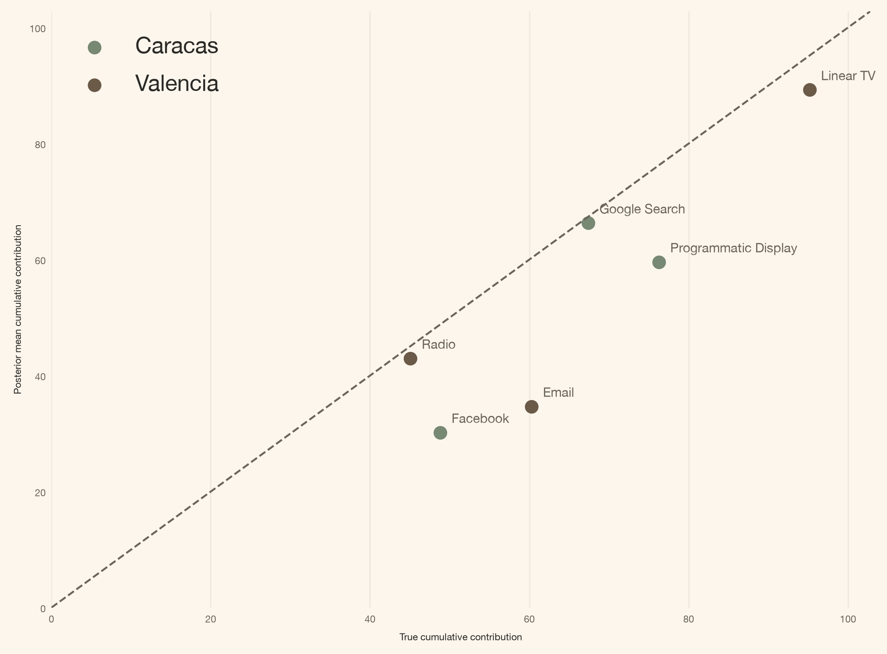
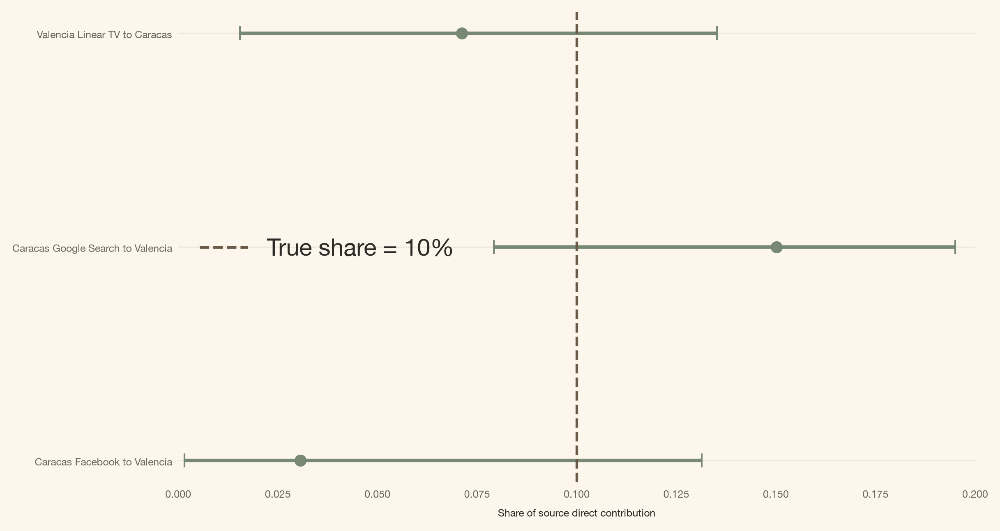

# Os media não param na fronteira da cidade: transbordamentos entre cidades com PyMC-Marketing

> Um MMM bayesiano ao nível geográfico com transbordamentos entre cidades, construído com PyMC-Marketing MuEffect, MaskedPrior e uma máscara de rotas pré-especificada para medição de media em múltiplos mercados.

By Carlos Trujillo

Source: https://cetagostini.github.io/pt/articles/cross_city_media_spillovers/cross_city_media_spillovers.html

# Introdução

“Ajusto um marketing mix model por cidade, por isso cada campanha pertence à cidade onde registei o investimento.”

Esta convenção de reporte pode ser bastante benéfica, mas nem sempre reflete as complexidades do mundo real. Os media não conhecem fronteiras; por exemplo, um lançamento em Caracas pode aumentar pesquisas de marca em Valencia. Além disso, uma campanha de criadores direcionada a Valencia pode gerar pedidos em locais completamente diferentes. Se insistirmos em tratar cada cidade como uma unidade isolada, esses pedidos extra não desaparecem; simplesmente, o modelo atribui-lhes um rótulo errado.

A boa notícia é que o [PyMC-Marketing](https://www.pymc-marketing.io/) oferece-nos um ponto de extensão para resolver esta questão. Podemos manter o `MMM` multidimensional de base, implementar um `MuEffect` aditivo, delinear as rotas possíveis usando uma máscara booleana e registá-lo de forma transparente com uma única linha:

``` sourceCode
mmm.add_mu_effect(spill_effect)
```

O restante deste artigo aprofundará os detalhes dessa linha. Começaremos pelo contexto de negócios, seguido da equação, das formas dos tensores e, finalmente, apresentaremos a classe completa.

# Resumo rápido

Este artigo percorre-vos:

- **O laboratório de dados:** duas cidades sintéticas com três rotas de transbordamento conhecidas, cada uma transportando exatamente 10% da verdadeira contribuição do canal de origem.
- **A extensão do PyMC-Marketing:** um `MuEffect` personalizado que encaminha uma quota da contribuição de media de uma cidade para a média de outra cidade.
- **A política de esparsidade:** `MaskedPrior` amostra apenas três coeficientes de transbordamento plausíveis em vez dos vinte candidatos de cidade de origem por canal.
- **O resultado:** diagnósticos do amostrador, recuperação do efeito direto e recuperação do transbordamento posterior face à verdade de referência conhecida.

A ideia completa da API

Um `MMM(dims=("city",))` multidimensional já produz `channel_contribution` com coordenadas de cidade e canal. Um `MuEffect` personalizado consegue ler esse tensor, encaminhar uma quota limitada para outra cidade e devolver uma contribuição `(date, city)` para a média do modelo.

# Perspetiva teórica

Um MMM regular prevê o alvo Y\_{r,t} na cidade recetora r na semana t como uma soma de diferentes componentes:

Y\_{r,t}=\beta\_{r}+\mu^{\text{direct}}\_{r,t}+C\_{r,t}+\epsilon\_{r,t}.

Onde:

- \beta\_{r} é a linha de base, o intercepto que o modelo aprende para a cidade r;
- \mu^{\text{direct}}\_{r,t} é a contribuição dos media dessa própria cidade, após adstock e saturação;
- C\_{r,t} é a contribuição dos controlos observados;
- \epsilon\_{r,t} é o ruído residual.

r é um índice de cidade, t é um índice temporal, e tudo do lado direito é aprendido a partir do investimento dessa cidade, dos seus próprios controlos e do seu próprio alvo. Muitas equipas incluem também um termo de sazonalidade. Deixo-o de fora aqui para que a única diferença estrutural entre os dois modelos neste artigo seja aquela sobre a qual o artigo trata. Esta é a fórmula base, e a mais comum na indústria.

Hoje abordo isto como um **problema de medição bayesiana com conhecimento estrutural**. Desenho uma máscara que codifica quais rotas entre cidades a empresa considera possíveis, e o posterior estima quão grandes são esses efeitos permitidos. Essa distinção importa. Não estou a executar descoberta causal para descobrir se uma rota existe; assumo a topologia e estimo as magnitudes. Em termos de inferência causal, isto é um [problema de interferência](https://pmc.ncbi.nlm.nih.gov/articles/PMC2600548/): a exposição atribuída a uma unidade pode mudar o resultado de outra unidade.

# O que muda exatamente na função da média?

A família de verosimilhança permanece a mesma. Um termo é adicionado à média:

Y\_{r,t}=\beta\_{r}+\mu^{\text{direct}}\_{r,t}+\boxed{S\_{r,t}}+C\_{r,t}+\epsilon\_{r,t}.

Aqui S\_{r,t} é o transbordamento que chega à cidade recetora r: uma quota limitada da contribuição direta que os media de outra cidade já produziram. Cada quota de rota está limitada a \rho\_{\max}, para que uma rota nunca possa mover mais do que \rho\_{\max} da sua contribuição de origem para além da fronteira. Neste artigo \rho\_{\max}=0.20 e a verdade sintética é 0.10.

Como qualquer outro MMM, o modelo transforma o investimento antes de chegar à média: [adstock geométrico](https://www.pymc-marketing.io/en/latest/api/generated/pymc_marketing.mmm.components.adstock.GeometricAdstock.html) seguido de [saturação Michaelis-Menten](https://www.pymc-marketing.io/en/latest/api/generated/pymc_marketing.mmm.components.saturation.MichaelisMentenSaturation.html). A mesma ideia de carryover e forma descrita por [Jin et al. (2017)](https://storage.googleapis.com/gweb-research2023-media/pubtools/3806.pdf), embora não a mesma forma funcional: o artigoles usa uma curva de resposta Hill, e Michaelis-Menten é o membro dessa família com o expoente fixado em um.

Como o termo de transbordamento é uma quota de uma contribuição que já passou por essa cadeia, ele chega à cidade recetora transportando o carryover e a saturação do próprio canal de origem.

## Por que um multiplicador pós-saturação é suficiente

A contribuição direta do canal de origem k na cidade s, após adstock e saturação Michaelis-Menten, é

\mu^{\text{direct}}\_{s,k,t} = \frac{\alpha\_{s,k} \cdot \bar{x}\_{s,k,t}}{\bar{x}\_{s,k,t} + \lambda\_{s,k}},

onde \bar{x}\_{s,k,t} é o investimento após adstock, \alpha\_{s,k} é a capacidade de saturação (o teto assintótico), e \lambda\_{s,k} é a constante de meia-saturação (o nível de investimento no qual a contribuição atinge metade do teto).

O modelo de transbordamento multiplica essa contribuição já saturada pela quota de rota \rho\_{s,k}, dando a quantidade que uma única rota entrega à cidade recetora:

S^{s,k}\_{r,t} = \rho\_{s,k} \cdot \mu^{\text{direct}}\_{s,k,t} = \frac{(\rho\_{s,k} \cdot \alpha\_{s,k}) \cdot \bar{x}\_{s,k,t}}{\bar{x}\_{s,k,t} + \lambda\_{s,k}}.

A álgebra é todo o argumento: \rho\_{s,k} escala o teto \alpha\_{s,k} e deixa a meia-saturação \lambda\_{s,k} intocada. Um multiplicador aplicado após a saturação é portanto idêntico a ajustar uma curva de saturação separada para cada rota, com capacidade \rho\_{s,k} \cdot \alpha\_{s,k} e o mesmo \lambda\_{s,k} — a mesma contribuição, a um parâmetro em vez de dois.

Importa que o multiplicador permaneça aí. O adstock é linear, pelo que um escalar passa através dele: \text{adstock}(\rho x) = \rho \cdot \text{adstock}(x). A saturação não é, pelo que \rho \cdot f(\bar{x}) \neq f(\rho \bar{x}) — empurrar a quota para dentro da curva moveria o ponto de meia-saturação e curvaria a resposta numa forma diferente. Aplicar a quota após a saturação é o que mantém a cidade recetora na curva de resposta da cidade de origem em vez de uma cópia distorcida.

# Como começar

Primeiro, a configuração do notebook e as importações.

Código

``` sourceCode
import json
import sys
import warnings
from pathlib import Path
warnings.filterwarnings("ignore", category=FutureWarning)

from typing import Any

from pydantic import Field, InstanceOf
from pymc_extras.prior import Prior
from pymc_marketing.mmm import GeometricAdstock, MichaelisMentenSaturation
from pymc_marketing.mmm.additive_effect import MuEffect
from pymc_marketing.mmm.mmm import MMM
from pymc_marketing.mmm.scaling import DataDerivedScaling, FixedScaling, Scaling
from pymc_marketing.special_priors import MaskedPrior
import arviz as az
import pymc as pm
import pymc.dims as pmd
import pymc_marketing

import numpy as np
import pandas as pd
import xarray as xr

import matplotlib as mpl
import matplotlib.pyplot as plt
import matplotlib.dates as mdates
from matplotlib.patches import FancyArrowPatch, FancyBboxPatch

az.style.use("arviz-darkgrid")
plt.rcParams["figure.figsize"] = [8, 4]

DATA_DIR = Path("data")

COLORS = {
    "primary": "#778873",
    "secondary": "#A1BC98",
    "accent": "#DCCFC0",
    "bg": "#FDF6ED",
    "ink": "#2B2A26",
    "ink_muted": "#6B665C",
    "green_strong": "#4F6B4A",
    "brown": "#6B5A48",
    "line": "#E6DFD2",
    "surface_alt": "#F2EDE3",
}

mpl.rcParams.update({
    "figure.facecolor": COLORS["bg"],
    "axes.facecolor": COLORS["bg"],
    "axes.edgecolor": COLORS["line"],
    "axes.labelcolor": COLORS["ink"],
    "text.color": COLORS["ink"],
    "xtick.color": COLORS["ink_muted"],
    "ytick.color": COLORS["ink_muted"],
    "grid.color": COLORS["line"],
    "grid.alpha": 0.6,
    "font.family": "sans-serif",
    "font.sans-serif": ["Inter", "Manrope", "Helvetica Neue", "Arial"],
    "axes.titleweight": "semibold",
    "axes.titlesize": 13,
    "axes.labelsize": 6,
    "xtick.labelsize": 6,
    "ytick.labelsize": 6,
    "axes.spines.top": False,
    "axes.spines.right": False,
    "figure.dpi": 150,
    "figure.constrained_layout.use": True,
})

%load_ext autoreload
%autoreload 2
%config InlineBackend.figure_format = "retina"


def article_table(
    frame: pd.DataFrame,
    caption: str,
    formats: dict[str, str] | None = None,
):
    """Render a compact, left-aligned, index-free table."""
    styled = (
        frame.style
        .hide(axis="index")
        .set_caption(caption)
        .set_properties(**{"text-align": "left"})
        .set_table_styles([
            {"selector": "th", "props": [("text-align", "left")]},
            {"selector": "td", "props": [("text-align", "left")]},
        ])
    )
    return styled.format(formats) if formats else styled


seed: int = sum(map(ord, "media does not stop at the city border"))
rng: np.random.Generator = np.random.default_rng(seed=seed)
print(f"Seed: {seed}")
```

    Seed: 3567

Agora os dados sintéticos. Começo de duas séries temporais semanais — pense em cidades, regiões ou países — geradas independentemente uma da outra, e depois adiciono transbordamento de uma para a outra, em ambas as direções.

Chamo-lhes **Caracas** e **Valencia**. Os nomes são uma conveniência: as duas cidades reais estão suficientemente próximas para tornar um corredor entre cidades fácil de imaginar, não porque estas rotas sintéticas descrevam algo que acontece entre elas. Cada uma tem dez canais de media, dois controlos observados e 104 observações semanais. Três caminhos diretos de media chegam à *outra* cidade:

- Caracas **Facebook** \rightarrow Valencia
- Caracas **Google Search** \rightarrow Valencia
- Valencia **Linear TV** \rightarrow Caracas

Cada caminho transfere 10% da verdadeira contribuição própria da cidade do canal de origem. Tudo o resto está estruturalmente ausente.

Código

``` sourceCode
from matplotlib.patches import Circle
import urllib.request
import urllib.parse
import xml.etree.ElementTree as ET

caracas_coords = (-66.9036, 10.4806)
valencia_coords = (-68.0077, 10.1620)

with open(DATA_DIR / "venezuela_natural_earth.geojson") as f:
    geo = json.load(f)

geom = geo["features"][0]["geometry"]
if geom["type"] == "Polygon":
    polygons = [geom["coordinates"]]
elif geom["type"] == "MultiPolygon":
    polygons = geom["coordinates"]
else:
    raise ValueError(f"Unsupported geometry type: {geom['type']}")
exterior_rings = [np.asarray(polygon[0], dtype=float) for polygon in polygons]

margin = 0.7
rect_x = [min(caracas_coords[0], valencia_coords[0]) - margin,
          max(caracas_coords[0], valencia_coords[0]) + margin]
rect_y = [min(caracas_coords[1], valencia_coords[1]) - margin,
          max(caracas_coords[1], valencia_coords[1]) + margin]

mid_lon = (caracas_coords[0] + valencia_coords[0]) / 2
mid_lat = (caracas_coords[1] + valencia_coords[1]) / 2
circle_radius = np.sqrt(
    ((caracas_coords[0] - valencia_coords[0]) ** 2)
    + ((caracas_coords[1] - valencia_coords[1]) ** 2)
) / 2 + 0.35

fig, (ax_overview, ax_inset) = plt.subplots(
    1, 2, figsize=(12, 5.5), gridspec_kw={"width_ratios": [1, 1.15]},
)

# --- Overview panel ---
for coords in exterior_rings:
    ax_overview.fill(coords[:, 0], coords[:, 1],
                     facecolor=COLORS["accent"], edgecolor=COLORS["brown"], linewidth=0.8)

for label, (lon, lat), ofs in [
    ("Caracas", caracas_coords, (6, 5)),
    ("Valencia", valencia_coords, (-42, -12)),
]:
    ax_overview.plot(lon, lat, "o", color=COLORS["primary"], markersize=7, zorder=5)
    ax_overview.annotate(label, (lon, lat), textcoords="offset points",
                         xytext=ofs, fontsize=9, weight=600)

circle = Circle(
    (mid_lon, mid_lat), circle_radius, fill=False, color=COLORS["primary"], linewidth=1.2,
    linestyle="--"
)
ax_overview.add_patch(circle)
ax_overview.set_title("Venezuela", fontsize=12, weight=600)
ax_overview.set_aspect("equal")
ax_overview.axis("off")

# --- Overpass streets in the corridor inset ---
road_segments = []
bbox = (
    min(rect_y[0], rect_y[1]),
    min(rect_x[0], rect_x[1]),
    max(rect_y[0], rect_y[1]),
    max(rect_x[0], rect_x[1]),
)
overpass_query = (
    f'way["highway"]({bbox[0]},{bbox[1]},{bbox[2]},{bbox[3]});'
    f'(._;>;);out body;'
)
try:
    overpass_url = (
        "https://overpass-api.de/api/interpreter?"
        + urllib.parse.urlencode({"data": overpass_query})
    )
    with urllib.request.urlopen(overpass_url, timeout=30) as resp:
        root = ET.fromstring(resp.read())
    node_xy = {}
    for node in root.findall("node"):
        node_xy[node.get("id")] = (float(node.get("lon")), float(node.get("lat")))
    for way in root.findall("way"):
        refs = [nd.get("ref") for nd in way.findall("nd")]
        coords = np.asarray(
            [node_xy[r] for r in refs if r in node_xy], dtype=float
        )
        if coords.size:
            road_segments.append(coords)
except Exception:
    road_segments = []

# --- Corridor inset ---
ax_inset.set_facecolor(COLORS["bg"])
ax_inset.set_xlim(rect_x)
ax_inset.set_ylim(rect_y)

for coords in exterior_rings:
    ax_inset.fill(coords[:, 0], coords[:, 1],
                  facecolor=COLORS["accent"], edgecolor=COLORS["line"], linewidth=0.5)
for seg in road_segments:
    ax_inset.plot(seg[:, 0], seg[:, 1], color=COLORS["line"], linewidth=0.6, alpha=0.85)

route_lon = [caracas_coords[0], mid_lon - 0.08, valencia_coords[0]]
route_lat = [caracas_coords[1], mid_lat + 0.12, valencia_coords[1]]
ax_inset.plot(route_lon, route_lat, color=COLORS["green_strong"], linewidth=2.6, zorder=4)

for label, (lon, lat), ofs in [
    ("Caracas", caracas_coords, (8, 5)),
    ("Valencia", valencia_coords, (-45, -12)),
]:
    ax_inset.plot(lon, lat, "o", color=COLORS["primary"], markersize=9, zorder=5)
    ax_inset.annotate(label, (lon, lat), textcoords="offset points",
                      xytext=ofs, fontsize=10, weight=600, zorder=5)

ax_inset.annotate(
    "$\\approx$ 124.9 km", (mid_lon, mid_lat), textcoords="offset points",
    xytext=(0, 14), fontsize=10, ha="center", weight=600, color=COLORS["green_strong"], zorder=5,
)

for mech_label, (dx, dy) in [
    ("broadcast\nspill", (-0.15, -0.18)),
    ("search\nspill", (0.20, 0.12)),
    ("ecommerce\nspill", (-0.25, 0.10)),
]:
    ax_inset.annotate(
        mech_label, (mid_lon + dx, mid_lat + dy), textcoords="offset points",
        xytext=(0, 0), fontsize=8, ha="center", color=COLORS["ink_muted"], zorder=5,
    )

ax_inset.grid(False)
ax_inset.set_title("Caracas\u2013Valencia corridor", fontsize=12, weight=600)
ax_inset.set_aspect("equal")
ax_inset.axis("off")

plt.tight_layout()
plt.show()
```

<figure class="quarto-float quarto-float-fig figure">

<figcaption>Figura 1: O corredor Caracas–Valencia, com aproximadamente 124.9 km de ponta a ponta. Radiodifusão, pesquisa e comércio eletrónico são os tipos de mecanismo que poderiam transportar efeitos de media ao longo de um corredor como este.</figcaption>
</figure>

Código

``` sourceCode
CITIES = ("Caracas", "Valencia")
CHANNELS = [
    "facebook", "google_search", "linear_tv", "instagram", "youtube",
    "radio", "programmatic_display", "out_of_home", "podcast", "email",
]
CHANNEL_LABELS = dict(zip(
    CHANNELS,
    [
        "Facebook", "Google Search", "Linear TV", "Instagram", "YouTube",
        "Radio", "Programmatic Display", "Out of Home", "Podcast", "Email",
    ],
    strict=True,
))
CONTROLS = ["Z1", "Z2"]
TRUE_SPILL_SHARE = 0.10

PANEL_DIMS = ("city",)
PANEL_CHANNEL_DIMS = ("city", "channel")
PANEL_CONTROL_DIMS = ("city", "control")
SPEND_DIMS = ("spend_city",)
SPEND_CHANNEL_DIMS = ("spend_city", "channel")
SPILL_PATH_DIMS = ("city", "spend_city", "channel")
SPEND_RENAME = {"city": "spend_city"}

SPILL_ROUTES = (
    ("Caracas", "Valencia", "facebook"),
    ("Caracas", "Valencia", "google_search"),
    ("Valencia", "Caracas", "linear_tv"),
)

valencia_raw = pd.read_csv(DATA_DIR / "valencia_raw.csv", parse_dates=["date"])
caracas_raw = pd.read_csv(DATA_DIR / "caracas_raw.csv", parse_dates=["date"])
valencia_truth = pd.read_csv(DATA_DIR / "valencia_contributions.csv", parse_dates=["date"])
caracas_truth = pd.read_csv(DATA_DIR / "caracas_contributions.csv", parse_dates=["date"])

assert valencia_raw["date"].equals(caracas_raw["date"])
assert valencia_truth["date"].equals(caracas_truth["date"])

valencia = valencia_raw.rename(columns={"Y": "y_base"}).copy()
caracas = caracas_raw.rename(columns={"Y": "y_base"}).copy()

valencia["spill_truth"] = TRUE_SPILL_SHARE * (
    caracas_truth["contrib_facebook"].to_numpy()
    + caracas_truth["contrib_google_search"].to_numpy()
)
caracas["spill_truth"] = TRUE_SPILL_SHARE * valencia_truth["contrib_linear_tv"].to_numpy()

for frame in (valencia, caracas):
    frame["y"] = frame["y_base"] + frame["spill_truth"]

panel = pd.concat([caracas, valencia], ignore_index=True).sort_values(
    ["date", "city"], ignore_index=True
)

spill_columns = [
    "contrib_spill_from_caracas_facebook",
    "contrib_spill_from_caracas_google_search",
    "contrib_spill_from_valencia_linear_tv",
]
for frame in (caracas_truth, valencia_truth):
    for column in spill_columns:
        frame[column] = 0.0

valencia_truth["contrib_spill_from_caracas_facebook"] = (
    TRUE_SPILL_SHARE * caracas_truth["contrib_facebook"].to_numpy()
)
valencia_truth["contrib_spill_from_caracas_google_search"] = (
    TRUE_SPILL_SHARE * caracas_truth["contrib_google_search"].to_numpy()
)
caracas_truth["contrib_spill_from_valencia_linear_tv"] = (
    TRUE_SPILL_SHARE * valencia_truth["contrib_linear_tv"].to_numpy()
)

truth = pd.concat([caracas_truth, valencia_truth], ignore_index=True).sort_values(
    ["date", "city"], ignore_index=True
)
truth["contrib_spill_total"] = truth[spill_columns].sum(axis=1)

model_data = panel[["date", "city", *CHANNELS, *CONTROLS, "y"]].rename(columns={"y": "Y"})
model_data.to_csv(DATA_DIR / "mmm_data_raw.csv", index=False)
truth.to_csv(DATA_DIR / "mmm_data_contributions.csv", index=False)

assert np.allclose(panel["y"] - panel["y_base"], panel["spill_truth"])
assert np.allclose(
    panel["spill_truth"].to_numpy(), truth["contrib_spill_total"].to_numpy()
)
assert truth["contrib_spill_total"].abs().sum() > 0

X = panel[["date", "city", *CHANNELS, *CONTROLS]]
y = panel["y"]

schema_rows = [
    {"Column": "date", "Type": "datetime", "Role": "time index"},
    {"Column": "city", "Type": "str", "Role": "panel dimension"},
]
for ch in CHANNELS:
    schema_rows.append({"Column": ch, "Type": "float", "Role": "media channel"})
schema_rows += [
    {"Column": "Z1", "Type": "float", "Role": "control"},
    {"Column": "Z2", "Type": "float", "Role": "control"},
    {"Column": "Y", "Type": "float", "Role": "target"},
]
display(article_table(pd.DataFrame(schema_rows), "Input panel schema"))
```

<figure class="quarto-float quarto-float-tbl figure">
<table id="T_f8cdb" class="caption-top table table-sm table-striped small" data-quarto-postprocess="true">
<thead>
<tr class="header">
<th id="T_f8cdb_level0_col0" class="col_heading level0 col0" data-quarto-table-cell-role="th">Column</th>
<th id="T_f8cdb_level0_col1" class="col_heading level0 col1" data-quarto-table-cell-role="th">Type</th>
<th id="T_f8cdb_level0_col2" class="col_heading level0 col2" data-quarto-table-cell-role="th">Role</th>
</tr>
</thead>
<tbody>
<tr class="odd">
<td id="T_f8cdb_row0_col0" class="data row0 col0">date</td>
<td id="T_f8cdb_row0_col1" class="data row0 col1">datetime</td>
<td id="T_f8cdb_row0_col2" class="data row0 col2">time index</td>
</tr>
<tr class="even">
<td id="T_f8cdb_row1_col0" class="data row1 col0">city</td>
<td id="T_f8cdb_row1_col1" class="data row1 col1">str</td>
<td id="T_f8cdb_row1_col2" class="data row1 col2">panel dimension</td>
</tr>
<tr class="odd">
<td id="T_f8cdb_row2_col0" class="data row2 col0">facebook</td>
<td id="T_f8cdb_row2_col1" class="data row2 col1">float</td>
<td id="T_f8cdb_row2_col2" class="data row2 col2">media channel</td>
</tr>
<tr class="even">
<td id="T_f8cdb_row3_col0" class="data row3 col0">google_search</td>
<td id="T_f8cdb_row3_col1" class="data row3 col1">float</td>
<td id="T_f8cdb_row3_col2" class="data row3 col2">media channel</td>
</tr>
<tr class="odd">
<td id="T_f8cdb_row4_col0" class="data row4 col0">linear_tv</td>
<td id="T_f8cdb_row4_col1" class="data row4 col1">float</td>
<td id="T_f8cdb_row4_col2" class="data row4 col2">media channel</td>
</tr>
<tr class="even">
<td id="T_f8cdb_row5_col0" class="data row5 col0">instagram</td>
<td id="T_f8cdb_row5_col1" class="data row5 col1">float</td>
<td id="T_f8cdb_row5_col2" class="data row5 col2">media channel</td>
</tr>
<tr class="odd">
<td id="T_f8cdb_row6_col0" class="data row6 col0">youtube</td>
<td id="T_f8cdb_row6_col1" class="data row6 col1">float</td>
<td id="T_f8cdb_row6_col2" class="data row6 col2">media channel</td>
</tr>
<tr class="even">
<td id="T_f8cdb_row7_col0" class="data row7 col0">radio</td>
<td id="T_f8cdb_row7_col1" class="data row7 col1">float</td>
<td id="T_f8cdb_row7_col2" class="data row7 col2">media channel</td>
</tr>
<tr class="odd">
<td id="T_f8cdb_row8_col0" class="data row8 col0">programmatic_display</td>
<td id="T_f8cdb_row8_col1" class="data row8 col1">float</td>
<td id="T_f8cdb_row8_col2" class="data row8 col2">media channel</td>
</tr>
<tr class="even">
<td id="T_f8cdb_row9_col0" class="data row9 col0">out_of_home</td>
<td id="T_f8cdb_row9_col1" class="data row9 col1">float</td>
<td id="T_f8cdb_row9_col2" class="data row9 col2">media channel</td>
</tr>
<tr class="odd">
<td id="T_f8cdb_row10_col0" class="data row10 col0">podcast</td>
<td id="T_f8cdb_row10_col1" class="data row10 col1">float</td>
<td id="T_f8cdb_row10_col2" class="data row10 col2">media channel</td>
</tr>
<tr class="even">
<td id="T_f8cdb_row11_col0" class="data row11 col0">email</td>
<td id="T_f8cdb_row11_col1" class="data row11 col1">float</td>
<td id="T_f8cdb_row11_col2" class="data row11 col2">media channel</td>
</tr>
<tr class="odd">
<td id="T_f8cdb_row12_col0" class="data row12 col0">Z1</td>
<td id="T_f8cdb_row12_col1" class="data row12 col1">float</td>
<td id="T_f8cdb_row12_col2" class="data row12 col2">control</td>
</tr>
<tr class="even">
<td id="T_f8cdb_row13_col0" class="data row13 col0">Z2</td>
<td id="T_f8cdb_row13_col1" class="data row13 col1">float</td>
<td id="T_f8cdb_row13_col2" class="data row13 col2">control</td>
</tr>
<tr class="odd">
<td id="T_f8cdb_row14_col0" class="data row14 col0">Y</td>
<td id="T_f8cdb_row14_col1" class="data row14 col1">float</td>
<td id="T_f8cdb_row14_col2" class="data row14 col2">target</td>
</tr>
</tbody>
</table>
<figcaption>Tabela 1: Esquema do painel de entrada</figcaption>
</figure>

O painel que entra no MMM contém 208 linhas semanais (104 semanas × 2 cidades). Cada linha transporta os dez canais de investimento em media brutos, dois controlos observados e o alvo de vendas. O gerador escreve dois ficheiros de painel — `mmm_data_raw.csv` para os observáveis e `mmm_data_contributions.csv` para a verdadeira decomposição por canal usada apenas na avaliação — juntamente com as entradas por cidade e as repartições de contribuição em `data/`.

As linhas representativas abaixo mostram um subconjunto das colunas que o MMM realmente vê.

Código

``` sourceCode
preview_columns = [
    "date", "city", "facebook", "google_search", "linear_tv", "Z1", "Z2", "Y",
]
model_preview = (
    model_data[preview_columns]
    .groupby("city")
    .head(2)
    .reset_index(drop=True)
)
model_preview["date"] = model_preview["date"].dt.strftime("%Y-%m-%d")
display(article_table(
    model_preview,
    "Representative MMM input rows (two per city; three channels shown)",
    {column: "{:.3f}" for column in preview_columns[2:]},
))
```

<figure class="quarto-float quarto-float-tbl figure">
<table id="T_5b37b" class="caption-top table table-sm table-striped small" data-quarto-postprocess="true">
<thead>
<tr class="header">
<th id="T_5b37b_level0_col0" class="col_heading level0 col0" data-quarto-table-cell-role="th">date</th>
<th id="T_5b37b_level0_col1" class="col_heading level0 col1" data-quarto-table-cell-role="th">city</th>
<th id="T_5b37b_level0_col2" class="col_heading level0 col2" data-quarto-table-cell-role="th">facebook</th>
<th id="T_5b37b_level0_col3" class="col_heading level0 col3" data-quarto-table-cell-role="th">google_search</th>
<th id="T_5b37b_level0_col4" class="col_heading level0 col4" data-quarto-table-cell-role="th">linear_tv</th>
<th id="T_5b37b_level0_col5" class="col_heading level0 col5" data-quarto-table-cell-role="th">Z1</th>
<th id="T_5b37b_level0_col6" class="col_heading level0 col6" data-quarto-table-cell-role="th">Z2</th>
<th id="T_5b37b_level0_col7" class="col_heading level0 col7" data-quarto-table-cell-role="th">Y</th>
</tr>
</thead>
<tbody>
<tr class="odd">
<td id="T_5b37b_row0_col0" class="data row0 col0">2025-01-06</td>
<td id="T_5b37b_row0_col1" class="data row0 col1">Caracas</td>
<td id="T_5b37b_row0_col2" class="data row0 col2">0.968</td>
<td id="T_5b37b_row0_col3" class="data row0 col3">3.587</td>
<td id="T_5b37b_row0_col4" class="data row0 col4">3.742</td>
<td id="T_5b37b_row0_col5" class="data row0 col5">3.017</td>
<td id="T_5b37b_row0_col6" class="data row0 col6">-2.007</td>
<td id="T_5b37b_row0_col7" class="data row0 col7">9.856</td>
</tr>
<tr class="even">
<td id="T_5b37b_row1_col0" class="data row1 col0">2025-01-06</td>
<td id="T_5b37b_row1_col1" class="data row1 col1">Valencia</td>
<td id="T_5b37b_row1_col2" class="data row1 col2">2.100</td>
<td id="T_5b37b_row1_col3" class="data row1 col3">1.251</td>
<td id="T_5b37b_row1_col4" class="data row1 col4">2.850</td>
<td id="T_5b37b_row1_col5" class="data row1 col5">0.746</td>
<td id="T_5b37b_row1_col6" class="data row1 col6">0.936</td>
<td id="T_5b37b_row1_col7" class="data row1 col7">9.262</td>
</tr>
<tr class="odd">
<td id="T_5b37b_row2_col0" class="data row2 col0">2025-01-13</td>
<td id="T_5b37b_row2_col1" class="data row2 col1">Caracas</td>
<td id="T_5b37b_row2_col2" class="data row2 col2">0.832</td>
<td id="T_5b37b_row2_col3" class="data row2 col3">4.058</td>
<td id="T_5b37b_row2_col4" class="data row2 col4">3.852</td>
<td id="T_5b37b_row2_col5" class="data row2 col5">2.974</td>
<td id="T_5b37b_row2_col6" class="data row2 col6">-1.959</td>
<td id="T_5b37b_row2_col7" class="data row2 col7">9.855</td>
</tr>
<tr class="even">
<td id="T_5b37b_row3_col0" class="data row3 col0">2025-01-13</td>
<td id="T_5b37b_row3_col1" class="data row3 col1">Valencia</td>
<td id="T_5b37b_row3_col2" class="data row3 col2">2.185</td>
<td id="T_5b37b_row3_col3" class="data row3 col3">3.278</td>
<td id="T_5b37b_row3_col4" class="data row3 col4">3.229</td>
<td id="T_5b37b_row3_col5" class="data row3 col5">0.705</td>
<td id="T_5b37b_row3_col6" class="data row3 col6">0.939</td>
<td id="T_5b37b_row3_col7" class="data row3 col7">9.214</td>
</tr>
</tbody>
</table>
<figcaption>Tabela 2: Linhas representativas de entrada do MMM (duas por cidade; três canais mostrados)</figcaption>
</figure>

Os ficheiros de contribuição (`caracas_contributions.csv`, `valencia_contributions.csv`) registam a verdadeira decomposição ao nível do canal usada para avaliação. As suas magnitudes permanecem reservadas; a única informação derivada dessa decomposição e fornecida ao MMM é a máscara de atividade direta de seis caminhos que construo mais tarde, quando o modelo é montado. A verosimilhança, de resto, vê o alvo, o investimento em media observado e os controlos.

Sejam V e C abreviaturas de Valencia e Caracas, e seja \tau\_{s,k,t} a verdadeira contribuição própria da cidade do canal k na cidade de origem s na semana t. Então:

\begin{aligned} Y^{\star}\_{V,t} &= Y\_{V,t} \\ &\quad + 0.10\\\tau\_{C,\text{Facebook},t} \\ &\quad + 0.10\\\tau\_{C,\text{Google Search},t}, \\ Y^{\star}\_{C,t} &= Y\_{C,t} + 0.10\\\tau\_{V,\text{Linear TV},t}. \end{aligned}

O multiplicador está fixado em 10% no processo de geração de dados. O modelo não receberá essas colunas de contribuição; permanecem por trás da cortina para avaliação.

# Por que um MMM de cidades independentes falha

Código

``` sourceCode
fig, axes = plt.subplots(1, 2, figsize=(10, 4.5), sharex=True)
for ax, city in zip(axes, CITIES, strict=True):
    city_data = panel.loc[panel["city"].eq(city)]
    ax.plot(city_data["date"], city_data["y_base"], color=COLORS["ink_muted"],
            linewidth=1.1, label="Target before spill")
    ax.plot(city_data["date"], city_data["y"], color=COLORS["primary"],
            linewidth=1.5, label="Target after spill")
    ax.fill_between(
        city_data["date"], city_data["y_base"], city_data["y"],
        color=COLORS["secondary"], alpha=0.55, label="Cross-city lift",
    )
    ax.set(title=city, xlabel="Week", ylabel="Sales")
    ax.grid(axis="y")
    ax.xaxis.set_major_locator(mdates.MonthLocator(interval=6))
    ax.xaxis.set_major_formatter(mdates.DateFormatter("%Y-%m"))
axes[0].legend(frameon=False, loc="best")
plt.show()
```

<figure class="quarto-float quarto-float-fig figure">

<figcaption>Figura 2: O alvo muda com a forma dos media da outra cidade, não com ruído aleatório. Um MMM de cidades independentes não tem nenhum componente nomeado para a diferença sombreada.</figcaption>
</figure>

O modelo familiar ajusta cada cidade com os seus próprios canais, controlos e linha de base:

Y\_{r,t}=\beta\_{r}+\mu^{\text{direct}}\_{r,t}+C\_{r,t}+\epsilon\_{r,t}.

Esse modelo pode prever bem. Ainda assim, não tem nenhuma rota onde uma cidade de origem s difira da cidade recetora r. O sinal sombreado em <a href="#fig-target-spill" class="quarto-xref">Figura 2</a> deve vazar para a atribuição direta, a linha de base, os controlos ou o ruído residual.

Este é o fracasso controlado. **O problema não é que o MMM base esteja mal implementado. O problema é que a sua função da média não consegue expressar o mecanismo de negócios.**

> **Posso simplesmente adicionar o investimento bruto da outra cidade como controlos?** Posso, mas então estimaria uma segunda curva de resposta desconectada do adstock e da saturação da campanha de origem. Reutilizar a contribuição da origem é tanto mais parcimonioso como mais fácil de interpretar.

Escrito rota a rota, o novo termo é:

\begin{aligned} Y\_{r,t} &= \beta\_{r} + \mu^{\text{direct}}\_{r,t} + S\_{r,t} + C\_{r,t} + \epsilon\_{r,t}, \\ S\_{r,t} &= \sum\_{s\neq r}\sum\_{k=1}^{K} M\_{r,s,k}\\\rho\_{s,k} \\ &\qquad \times g\_{s,k}(X\_{s,k,t}). \end{aligned}

onde:

- S\_{r,t} é o total de transbordamento que chega à cidade recetora r;
- g\_{s,k}(X\_{s,k,t}) é a contribuição direta calculada a partir do mesmo grafo do modelo após adstock e saturação;
- M\_{r,s,k}\in\\0,1\\ é a máscara de rotas pré-especificada;
- \rho\_{s,k} é a quota aprendida exportada pela cidade de origem s e canal k;
- a soma devolve uma contribuição de transbordamento para cada cidade recetora r e semana t.

# Um efeito aditivo é suficiente para codificar transbordamento entre cidades esparso

A lente de medição bayesiana torna-se agora uma restrição de engenharia: preservar a curva de resposta da origem, fixar as rotas fornecidas pelo conhecimento prévio, e estimar apenas as suas magnitudes incertas.

## 10% da contribuição própria do canal de origem

Código

``` sourceCode
import graphviz

K = COLORS["ink"]
K2 = COLORS["ink_muted"]
G = COLORS["green_strong"]

def obs(label):
    return {
        "label": label, "shape": "box", "style": "rounded,filled",
        "fillcolor": "white", "color": K, "fontcolor": K, "fontsize": "11",
        "penwidth": "1.2", "fontname": "Inter",
    }

def lat(label):
    return {
        "label": label, "shape": "ellipse", "style": "filled",
        "fillcolor": "#f5f0e6", "color": K, "fontcolor": K, "fontsize": "11",
        "penwidth": "1.2", "fontname": "Inter",
    }

def loc():
    return {"color": K2, "penwidth": "1.2", "arrowsize": "0.7"}

def spl():
    return {
        "color": G, "penwidth": "2.8", "arrowsize": "0.9",
        "fontname": "Inter", "fontcolor": G, "fontsize": "9",
    }

g = graphviz.Digraph(format="svg", engine="dot")
g.attr(rankdir="LR", bgcolor="transparent", margin="0.1", nodesep="0.55",
       ranksep="0.65", fontname="Inter")

# Caracas spend nodes
g.node("fb", **obs("Facebook"))
g.node("gs", **obs("Google Search"))
g.node("pd", **obs("Programmatic\nDisplay"))
g.node("R_ccs", **lat("Caracas\nresponse"))

# Valencia spend nodes
g.node("ltv", **obs("Linear TV"))
g.node("rad", **obs("Radio"))
g.node("em", **obs("Email"))
g.node("R_val", **lat("Valencia\nresponse"))

# Local edges
g.edge("fb", "R_ccs", **loc())
g.edge("gs", "R_ccs", **loc())
g.edge("pd", "R_ccs", **loc())
g.edge("ltv", "R_val", **loc())
g.edge("rad", "R_val", **loc())
g.edge("em", "R_val", **loc())

# Cross-city spill
g.edge("fb", "R_val", label=" 10% ", **spl())
g.edge("gs", "R_val", label=" 10% ", **spl())
g.edge("ltv", "R_ccs", label=" 10% ", **spl())

from IPython.display import SVG, display as ipy_display
svg_bytes = g.pipe(format="svg")
ipy_display(SVG(svg_bytes))
```

<figure class="quarto-float quarto-float-fig figure">

<figcaption>Figura 3: O investimento observado flui para o oval de resposta não observado de cada cidade. Três arestas verdes atravessam a fronteira: Facebook e Google Search de Caracas contribuem 10% cada para a resposta de Valencia; Linear TV de Valencia contribui 10% para a resposta de Caracas.</figcaption>
</figure>

## Uma máscara de rotas pré-especificada

Com duas cidades e dez canais, existem vinte possíveis coeficientes de transbordamento cidade de origem por canal. Neste design sintético, permito três. Os outros dezassete não devem ser fracamente regularizados nem estimados perto de zero. Não devem existir no grafo.

Código

``` sourceCode
spill_mask_values = np.zeros(
    (len(CITIES), len(CITIES), len(CHANNELS)), dtype=bool
)
for source_city, receiver_city, channel in SPILL_ROUTES:
    spill_mask_values[
        CITIES.index(receiver_city),
        CITIES.index(source_city),
        CHANNELS.index(channel),
    ] = True

spill_path_mask = xr.DataArray(
    spill_mask_values,
    dims=SPILL_PATH_DIMS,
    coords={
        "city": list(CITIES),
        "spend_city": list(CITIES),
        "channel": CHANNELS,
    },
)
source_active_mask = spill_path_mask.any("city").transpose(*SPEND_CHANNEL_DIMS)

assert int(source_active_mask.sum()) == len(SPILL_ROUTES) == 3
```

Código

``` sourceCode
fig, ax = plt.subplots(figsize=(9, 2.8))
mask_plot = source_active_mask.astype(int)
cmap = mpl.colors.ListedColormap([COLORS["surface_alt"], COLORS["primary"]])
ax.imshow(mask_plot, aspect="auto", cmap=cmap, vmin=0, vmax=1)
display_labels = [
    "Facebook", "Google\nSearch", "Linear TV", "Instagram", "YouTube",
    "Radio", "Prog.\nDisplay", "Out of\nHome", "Podcast", "Email",
]
ax.set_xticks(range(len(CHANNELS)), display_labels, fontsize=8)
ax.set_yticks(range(len(CITIES)), CITIES)
ax.set(xlabel="Source channel", ylabel="Source city")
for row, city in enumerate(CITIES):
    for col, channel in enumerate(CHANNELS):
        if bool(source_active_mask.sel(spend_city=city, channel=channel)):
            receiver = next(
                target for source, target, route_channel in SPILL_ROUTES
                if source == city and route_channel == channel
            )
            ax.text(col, row, f"to {receiver[:3]}", ha="center", va="center",
                    color=COLORS["bg"], fontsize=7, weight=600)
for x in np.arange(-0.5, len(CHANNELS), 1):
    ax.axvline(x, color=COLORS["line"], linewidth=0.8)
ax.set_title("Active spill coefficients")
plt.show()
```

<figure class="quarto-float quarto-float-fig figure">

<figcaption>Figura 4: MaskedPrior transforma vinte possíveis coeficientes de cidade de origem por canal em três parâmetros amostrados. Os restantes dezassete são zeros estruturais, não estimativas incertas próximas de zero.</figcaption>
</figure>

`MaskedPrior` é uma porta, não um prior de encolhimento

O prior envolvido é amostrado apenas onde a máscara é `True`, depois expandido de volta para o tensor etiquetado completo com zeros exatos nos restantes locais.

## O efeito personalizado reutiliza o que o MMM já sabe

Chamo a esta classe `SpillEffect`. Ela herda o protocolo [`MuEffect`](https://www.pymc-marketing.io/en/latest/api/generated/pymc_marketing.mmm.additive_effect.html) do PyMC-Marketing.

`SpillEffect` tem três responsabilidades:

1.  **Registar coordenadas espaciais e a máscara de rotas pré-especificada.** `create_data` adiciona uma coordenada `spend_city` (espelhando `city`) e armazena a máscara booleana de caminhos como constante do modelo. A máscara provém de conhecimento empresarial prévio—coberturas de radiodifusão, elegibilidade de campanha, territórios de distribuição—não do resultado.
2.  **Amostrar quotas de transbordamento limitadas apenas em pares canal de origem ativos.** `create_effect` envolve um `MaskedPrior` sobre um prior base \operatorname{Beta}(1,1), para que apenas as rotas permitidas recebam um parâmetro livre.
3.  **Encaminhar a contribuição direta pertencente ao modelo para a cidade recetora e devolver `(date, city)`.** O efeito lê `channel_contribution` da passagem direta do próprio modelo, multiplica pela quota limitada e pela máscara de rotas, e soma sobre as origens.

Eu modelo

u\_{s,k}\sim\operatorname{Beta}(1,1), \qquad \rho\_{s,k}=\rho\_{\max}u\_{s,k},

com \rho\_{\max}=0.20. A verdade sintética é 0.10, pelo que se situa dentro — não na fronteira — do intervalo plausível do modelo.

``` sourceCode
class SpillEffect(MuEffect):
    """Route a bounded share of direct media contribution across cities."""

    source_active_mask: InstanceOf[xr.DataArray] = Field(exclude=True)
    spill_path_mask: InstanceOf[xr.DataArray] = Field(exclude=True)
    fraction_prior: InstanceOf[Prior]
    max_share: float = Field(default=0.20, gt=0, le=1)
    prefix: str = "spill"

    @staticmethod
    def _serialize_mask(mask: xr.DataArray) -> dict[str, Any]:
        """Convert a fixed Boolean mask to JSON-compatible values."""
        return {
            "dims": list(mask.dims),
            "coords": {dim: mask.coords[dim].values.tolist() for dim in mask.dims},
            "values": mask.astype(bool).values.tolist(),
        }

    @property
    def contribution_var_name(self) -> str:
        """Name of the deterministic contribution stored in the posterior."""
        return f"{self.prefix}_contribution"

    def to_dict(self) -> dict[str, Any]:
        """Serialize the custom effect for inference-data provenance."""
        return {
            "prefix": self.prefix,
            "max_share": self.max_share,
            "fraction_prior": self.fraction_prior.to_dict(),
            "source_active_mask": self._serialize_mask(self.source_active_mask),
            "spill_path_mask": self._serialize_mask(self.spill_path_mask),
        }

    def create_data(self, mmm: Any) -> None:
        """Register the source-city coordinate and route mask."""
        model = mmm.model
        model.add_coord("spend_city", values=model.coords["city"])
        pmd.Data(
            f"{self.prefix}_path_mask",
            self.spill_path_mask.astype(float).values,
            dims=SPILL_PATH_DIMS,
        )

    def create_effect(self, mmm: Any):
        """Build one spill contribution per week and receiving city."""
        model = mmm.model
        fraction = MaskedPrior(
            self.fraction_prior,
            mask=self.source_active_mask,
            active_dim=f"{self.prefix}_active_source_channel",
        ).create_variable(f"{self.prefix}_fraction", xdist=True)

        total_share = pmd.Deterministic(
            f"{self.prefix}_total_share",
            (self.max_share * fraction).transpose(*SPEND_CHANNEL_DIMS),
        )
        path_share = pmd.Deterministic(
            f"{self.prefix}_path_share",
            (total_share * model[f"{self.prefix}_path_mask"]).transpose(
                *SPILL_PATH_DIMS
            ),
        )

        source_direct_original = pmd.Deterministic(
            f"{self.prefix}_source_direct_original_scale",
            (model["channel_contribution"] * model["target_scale"])
            .rename(SPEND_RENAME)
            .transpose("date", *SPEND_CHANNEL_DIMS),
        )
        by_path_original = pmd.Deterministic(
            f"{self.prefix}_by_path_original_scale",
            (source_direct_original * path_share).transpose(
                "date", *SPILL_PATH_DIMS
            ),
        )
        contribution_original = pmd.Deterministic(
            f"{self.prefix}_contribution_original_scale",
            by_path_original.sum(dim=(*SPEND_DIMS, "channel")).transpose(
                "date", *PANEL_DIMS
            ),
        )

        return pmd.Deterministic(
            f"{self.prefix}_contribution",
            (contribution_original / model["target_scale"]).transpose(
                "date", *PANEL_DIMS
            ),
        )

    def set_data(self, mmm: Any, model: pm.Model, X: xr.Dataset) -> None:
        """No-op: this effect owns no mutable predictors.

        The MMM refreshes model-owned channel contribution data before the
        effect runs.  Implement updates here only when the effect introduces
        its own covariates — for example, future receiver-specific modifiers
        or time-varying route availability.
        """
        del mmm, model, X
```

A maior parte da classe é contabilidade nomeada de tensores. A mudança real no modelo é a cadeia curta dentro de `create_effect`:

\begin{gathered} \text{direct contribution} \\ \times\\ \text{bounded share} \\ \times\\ \text{route mask} \\ \downarrow\\ \sum\_{s,k} \\ \text{spill by receiving city} \end{gathered}

## Um efeito extra é tudo o que o MMM precisa

Para manter a demonstração centrada no transbordamento em vez da seleção de variáveis, o gerador sintético fornece uma máscara de atividade direta pré-especificada: seis curvas de resposta cidade-canal são conhecidas por existirem antes do MMM ser ajustado. Não é inferida a partir do alvo observado. Em trabalho real, defina essa máscara a partir da disponibilidade de canais, conhecimento empresarial prévio ou uma estratégia adequada de seleção de variáveis.

Código

``` sourceCode
contribution_columns = [f"contrib_{channel}" for channel in CHANNELS]
direct_activity = (
    truth.groupby("city")[contribution_columns]
    .sum()
    .abs()
    .gt(1e-10)
    .reindex(CITIES)
)
direct_activity.columns = CHANNELS
direct_path_mask = xr.DataArray(
    direct_activity.to_numpy(),
    dims=PANEL_CHANNEL_DIMS,
    coords={"city": list(CITIES), "channel": CHANNELS},
)

assert int(direct_path_mask.sum()) == 6
```

Como os canais e os alvos são escalados pelo máximo, os priors de resposta abaixo vivem numa escala comparável entre cidades. Um intercepto positivo remove um modo espúrio de linha de base negativa, enquanto um prior log-normal de meia-saturação mantém o amostrador afastado de um funil de fronteira zero. Estas são escolhas de identificabilidade e amostragem, não evidência sobre as rotas de transbordamento.

``` sourceCode
adstock = GeometricAdstock(
    l_max=4,
    priors={
        "alpha": MaskedPrior(
            Prior("Beta", alpha=2, beta=2, dims=PANEL_CHANNEL_DIMS),
            mask=direct_path_mask,
            active_dim="direct_active_city_channel",
        )
    },
)
saturation = MichaelisMentenSaturation(
    priors={
        "alpha": MaskedPrior(
            Prior("Gamma", mu=0.20, sigma=0.15, dims=PANEL_CHANNEL_DIMS),
            mask=direct_path_mask,
            active_dim="direct_active_city_channel",
        ),
        "lam": MaskedPrior(
            Prior("LogNormal", mu=-0.69, sigma=0.75, dims=PANEL_CHANNEL_DIMS),
            mask=direct_path_mask,
            active_dim="direct_active_city_channel",
        ),
    }
)

spill_effect = SpillEffect(
    source_active_mask=source_active_mask,
    spill_path_mask=spill_path_mask,
    fraction_prior=Prior("Beta", alpha=1, beta=1, dims=SPEND_CHANNEL_DIMS),
    max_share=0.20,
)

target_scale = panel.groupby("city")["y"].max().reindex(CITIES)
target_scale_array = xr.DataArray(
    target_scale.to_numpy(),
    dims=PANEL_DIMS,
    coords={"city": list(CITIES)},
)

mmm = MMM(
    date_column="date",
    target_column="y",
    channel_columns=CHANNELS,
    control_columns=CONTROLS,
    dims=PANEL_DIMS,
    model_config={
        "intercept": Prior("HalfNormal", sigma=1, dims=PANEL_DIMS),
        "gamma_control": Prior(
            "Normal", mu=0, sigma=0.10, dims=PANEL_CONTROL_DIMS
        ),
        "likelihood": Prior(
            "Normal",
            sigma=Prior("HalfNormal", sigma=0.02, dims=PANEL_DIMS),
            dims=("date", *PANEL_DIMS),
        ),
    },
    scaling=Scaling(
        channel=DataDerivedScaling(method="max", dims=()),
        target=FixedScaling(dims=(), value=target_scale_array),
    ),
    adstock=adstock,
    saturation=saturation,
)

mmm.add_mu_effect(spill_effect)
mmm.build_model(X, y)
mmm.add_original_scale_contribution_variable(
    ["y", "channel_contribution", "control_contribution", "intercept_contribution"]
)
```

    <pymc_marketing.mmm.mmm.MMM at 0x33d8a0ad0>

O grafo do modelo deve conter exatamente três parâmetros de transbordamento livres. Esse é o retorno computacional da máscara.

Código

``` sourceCode
initial_point = mmm.model.initial_point()
spill_key = next(name for name in initial_point if name.startswith("spill_fraction_active"))
assert initial_point[spill_key].size == len(SPILL_ROUTES) == 3
assert np.isfinite(mmm.model.compile_logp()(initial_point))

free_rv_names = sorted(variable.name for variable in mmm.model.free_RVs)
model_structure = pd.DataFrame({
    "Layer": ["Panel", "Direct media", "Cross-city spill", "Likelihood"],
    "Estimated structure": [
        "2 city intercepts + 4 control coefficients",
        "6 active city-channel response curves",
        "3 bounded shares from 20 candidates",
        "2 city-specific residual scales",
    ],
})
display(article_table(model_structure, "What the model samples"))
```

<figure class="quarto-float quarto-float-tbl figure">
<table id="T_a32e1" class="caption-top table table-sm table-striped small" data-quarto-postprocess="true">
<thead>
<tr class="header">
<th id="T_a32e1_level0_col0" class="col_heading level0 col0" data-quarto-table-cell-role="th">Layer</th>
<th id="T_a32e1_level0_col1" class="col_heading level0 col1" data-quarto-table-cell-role="th">Estimated structure</th>
</tr>
</thead>
<tbody>
<tr class="odd">
<td id="T_a32e1_row0_col0" class="data row0 col0">Panel</td>
<td id="T_a32e1_row0_col1" class="data row0 col1">2 city intercepts + 4 control coefficients</td>
</tr>
<tr class="even">
<td id="T_a32e1_row1_col0" class="data row1 col0">Direct media</td>
<td id="T_a32e1_row1_col1" class="data row1 col1">6 active city-channel response curves</td>
</tr>
<tr class="odd">
<td id="T_a32e1_row2_col0" class="data row2 col0">Cross-city spill</td>
<td id="T_a32e1_row2_col1" class="data row2 col1">3 bounded shares from 20 candidates</td>
</tr>
<tr class="even">
<td id="T_a32e1_row3_col0" class="data row3 col0">Likelihood</td>
<td id="T_a32e1_row3_col1" class="data row3 col1">2 city-specific residual scales</td>
</tr>
</tbody>
</table>
<figcaption>Tabela 3: O que o modelo amostra</figcaption>
</figure>

Código

``` sourceCode
import graphviz as _graphviz

g = pm.model_to_graphviz(
    mmm.model,
    var_names=["spill_contribution"],
    graph_attr={"rankdir": "LR", "dpi": "150"},
)
assert "channel_contribution" in g.source
assert "spill_contribution" in g.source
g
```

<figure class="quarto-float quarto-float-fig figure">

<figcaption>Figura 5: Grafo de dependência PyMC focado no ramo personalizado de transbordamento. É gerido a partir do modelo construído, mas é um grafo computacional—não um DAG causal nem evidência de identificação causal.</figcaption>
</figure>

O grafo acima é computacional, não causal. É um subgrafo focado do modelo PyMC construído: o investimento bruto do canal entra através de adstock e saturação, produz `channel_contribution`, e o `SpillEffect` multiplica esse tensor pela quota de transbordamento limitada e pela máscara de rotas. O diagrama para em `spill_contribution` para legibilidade; o MMM base depois adiciona essa saída aos seus termos diretos, de linha de base e de controlo na verosimilhança alvo.

# O modelo de rotas esparsas recupera o mecanismo sem falsa precisão

Primeiro os diagnósticos do amostrador e os invariantes estruturais, depois o que os dados podem realmente dizer sobre a magnitude das três rotas permitidas.

## Diagnósticos básicos do amostrador

Código

``` sourceCode
idata = mmm.fit(
    X=X,
    y=y,
    chains=4,
    cores=4,
    draws=1_000,
    tune=1_500,
    target_accept=0.95,
    random_seed=seed,
    progressbar=False,
)
```

```
```

Código

``` sourceCode
free_rv_names = sorted(variable.name for variable in mmm.model.free_RVs)
diagnostics = az.summary(idata, var_names=free_rv_names, round_to=6)
divergences = int(idata.sample_stats["diverging"].sum())
rhat = pd.to_numeric(diagnostics["r_hat"], errors="coerce")
ess_bulk = pd.to_numeric(diagnostics["ess_bulk"], errors="coerce")
ess_tail = pd.to_numeric(diagnostics["ess_tail"], errors="coerce")
max_rhat = float(rhat.max())
min_ess_bulk = float(ess_bulk.min())
min_ess_tail = float(ess_tail.min())

chains = int(idata.posterior.dims["chain"])
diagnostic_overview = pd.DataFrame({
    "Metric": [
        "Divergences", "Maximum r-hat", "Minimum bulk ESS", "Minimum tail ESS",
    ],
    "Observed": [
        f"{divergences}", f"{max_rhat:.3f}", f"{min_ess_bulk:.0f}", f"{min_ess_tail:.0f}",
    ],
    "Gate": ["= 0", "< 1.01", f"> 400 ({chains} chains)", f"> 400 ({chains} chains)"],
    "Status": [
        "Pass" if divergences == 0 else "Fail",
        "Pass" if max_rhat < 1.01 else "Fail",
        "Pass" if min_ess_bulk > 400 else "Fail",
        "Pass" if min_ess_tail > 400 else "Fail",
    ],
})
display(article_table(diagnostic_overview, "Sampler quality gates"))

assert divergences == 0
assert max_rhat < 1.01
assert min_ess_bulk > 400
assert min_ess_tail > 400
```

<figure class="quarto-float quarto-float-tbl figure">
<table id="T_2ae69" class="caption-top table table-sm table-striped small" data-quarto-postprocess="true">
<thead>
<tr class="header">
<th id="T_2ae69_level0_col0" class="col_heading level0 col0" data-quarto-table-cell-role="th">Metric</th>
<th id="T_2ae69_level0_col1" class="col_heading level0 col1" data-quarto-table-cell-role="th">Observed</th>
<th id="T_2ae69_level0_col2" class="col_heading level0 col2" data-quarto-table-cell-role="th">Gate</th>
<th id="T_2ae69_level0_col3" class="col_heading level0 col3" data-quarto-table-cell-role="th">Status</th>
</tr>
</thead>
<tbody>
<tr class="odd">
<td id="T_2ae69_row0_col0" class="data row0 col0">Divergences</td>
<td id="T_2ae69_row0_col1" class="data row0 col1">0</td>
<td id="T_2ae69_row0_col2" class="data row0 col2">= 0</td>
<td id="T_2ae69_row0_col3" class="data row0 col3">Pass</td>
</tr>
<tr class="even">
<td id="T_2ae69_row1_col0" class="data row1 col0">Maximum r-hat</td>
<td id="T_2ae69_row1_col1" class="data row1 col1">1.010</td>
<td id="T_2ae69_row1_col2" class="data row1 col2">&lt; 1.01</td>
<td id="T_2ae69_row1_col3" class="data row1 col3">Pass</td>
</tr>
<tr class="odd">
<td id="T_2ae69_row2_col0" class="data row2 col0">Minimum bulk ESS</td>
<td id="T_2ae69_row2_col1" class="data row2 col1">835</td>
<td id="T_2ae69_row2_col2" class="data row2 col2">&gt; 400 (4 chains)</td>
<td id="T_2ae69_row2_col3" class="data row2 col3">Pass</td>
</tr>
<tr class="even">
<td id="T_2ae69_row3_col0" class="data row3 col0">Minimum tail ESS</td>
<td id="T_2ae69_row3_col1" class="data row3 col1">881</td>
<td id="T_2ae69_row3_col2" class="data row3 col2">&gt; 400 (4 chains)</td>
<td id="T_2ae69_row3_col3" class="data row3 col3">Pass</td>
</tr>
</tbody>
</table>
<figcaption>Tabela 4: Portões de qualidade do amostrador</figcaption>
</figure>

Um posterior só é útil depois de passar nos diagnósticos básicos do amostrador. Os limiares nesse portão—zero divergências, \hat{R} \< 1.01, e tamanhos efetivos de amostra acima de 400—seguem a prática MCMC padrão. As transições divergentes sinalizam regiões de alta curvatura onde o amostrador não consegue explorar de forma fiável ([Betancourt, 2017, §6.2](https://arxiv.org/abs/1701.02434)). O limiar de \hat{R} e o piso de ESS de 400 extrações totais (≈100 por cadeia com quatro cadeias) provêm do diagnóstico de convergência normalizado por ranking de [Vehtari et al. (2021)](https://arxiv.org/abs/1903.08008).

Separadamente, verifico invariantes estruturais codificados pela álgebra de tensores: as rotas diagonais são exatamente zero, os caminhos inativos permanecem zero e cada quota de transbordamento se mantém abaixo do limite de 20%. Estas são verificações de sanidade de implementação, não diagnósticos de qualidade do posterior.

Código

``` sourceCode
posterior = idata.posterior
path_share = posterior["spill_path_share"]
total_share = posterior["spill_total_share"]

assert bool((total_share >= 0).all())
assert bool((total_share <= spill_effect.max_share + 1e-10).all())
assert bool((path_share.where(~spill_path_mask, 0) == 0).all())
for city in CITIES:
    assert bool(
        (path_share.sel(city=city, spend_city=city) == 0).all()
    )

graph_checks = pd.DataFrame({
    "Invariant": [
        "All shares are bounded between 0% and 20%",
        "Inactive source-receiver-channel paths are exactly zero",
        "Every same-city spill path is exactly zero",
    ],
    "Status": ["Pass", "Pass", "Pass"],
})
display(article_table(graph_checks, "Spill-graph structural invariants (by construction)"))
```

<figure class="quarto-float quarto-float-tbl figure">
<table id="T_a8c27" class="caption-top table table-sm table-striped small" data-quarto-postprocess="true">
<thead>
<tr class="header">
<th id="T_a8c27_level0_col0" class="col_heading level0 col0" data-quarto-table-cell-role="th">Invariant</th>
<th id="T_a8c27_level0_col1" class="col_heading level0 col1" data-quarto-table-cell-role="th">Status</th>
</tr>
</thead>
<tbody>
<tr class="odd">
<td id="T_a8c27_row0_col0" class="data row0 col0">All shares are bounded between 0% and 20%</td>
<td id="T_a8c27_row0_col1" class="data row0 col1">Pass</td>
</tr>
<tr class="even">
<td id="T_a8c27_row1_col0" class="data row1 col0">Inactive source-receiver-channel paths are exactly zero</td>
<td id="T_a8c27_row1_col1" class="data row1 col1">Pass</td>
</tr>
<tr class="odd">
<td id="T_a8c27_row2_col0" class="data row2 col0">Every same-city spill path is exactly zero</td>
<td id="T_a8c27_row2_col1" class="data row2 col1">Pass</td>
</tr>
</tbody>
</table>
<figcaption>Tabela 5: Invariantes estruturais do grafo de transbordamento (por construção)</figcaption>
</figure>

## A atribuição direta é desigual, e o transbordamento herda essa incerteza

Antes de confiar no resultado do transbordamento, verifico o MMM base. Cada ponto abaixo é um canal próprio ativo da cidade. A recuperação cumulativa perfeita situa-se na diagonal. Vários caminhos estão próximos; Facebook, Programmatic Display e Email estão subestimados. Esse erro importa: o transbordamento herda a contribuição modelada do canal de origem, pelo que o erro na atribuição direta viaja com ele.

Código

``` sourceCode
post_direct_total = (
    posterior["channel_contribution_original_scale"]
    .sum("date")
    .mean(("chain", "draw"))
)
true_direct_total = (
    truth.groupby("city")[contribution_columns]
    .sum()
    .reindex(CITIES)
)
true_direct_total.columns = CHANNELS

rows = []
for city in CITIES:
    for channel in CHANNELS:
        if bool(direct_path_mask.sel(city=city, channel=channel)):
            rows.append({
                "city": city,
                "channel": channel,
                "truth": float(true_direct_total.loc[city, channel]),
                "posterior": float(post_direct_total.sel(city=city, channel=channel)),
            })
direct_recovery = pd.DataFrame(rows)
direct_recovery["relative_error"] = (
    direct_recovery["posterior"] / direct_recovery["truth"] - 1
)
direct_recovery_display = direct_recovery.assign(
    channel=direct_recovery["channel"].map(CHANNEL_LABELS)
)
display(article_table(
    direct_recovery_display.rename(columns={
        "city": "City",
        "channel": "Channel",
        "truth": "Truth",
        "posterior": "Posterior mean",
        "relative_error": "Relative error",
    }),
    "Cumulative direct-contribution recovery",
    {
        "Truth": "{:.2f}",
        "Posterior mean": "{:.2f}",
        "Relative error": "{:+.1%}",
    },
))
```

<figure class="quarto-float quarto-float-tbl figure">
<table id="T_35cbb" class="caption-top table table-sm table-striped small" data-quarto-postprocess="true">
<thead>
<tr class="header">
<th id="T_35cbb_level0_col0" class="col_heading level0 col0" data-quarto-table-cell-role="th">City</th>
<th id="T_35cbb_level0_col1" class="col_heading level0 col1" data-quarto-table-cell-role="th">Channel</th>
<th id="T_35cbb_level0_col2" class="col_heading level0 col2" data-quarto-table-cell-role="th">Truth</th>
<th id="T_35cbb_level0_col3" class="col_heading level0 col3" data-quarto-table-cell-role="th">Posterior mean</th>
<th id="T_35cbb_level0_col4" class="col_heading level0 col4" data-quarto-table-cell-role="th">Relative error</th>
</tr>
</thead>
<tbody>
<tr class="odd">
<td id="T_35cbb_row0_col0" class="data row0 col0">Caracas</td>
<td id="T_35cbb_row0_col1" class="data row0 col1">Facebook</td>
<td id="T_35cbb_row0_col2" class="data row0 col2">48.81</td>
<td id="T_35cbb_row0_col3" class="data row0 col3">30.17</td>
<td id="T_35cbb_row0_col4" class="data row0 col4">-38.2%</td>
</tr>
<tr class="even">
<td id="T_35cbb_row1_col0" class="data row1 col0">Caracas</td>
<td id="T_35cbb_row1_col1" class="data row1 col1">Google Search</td>
<td id="T_35cbb_row1_col2" class="data row1 col2">67.38</td>
<td id="T_35cbb_row1_col3" class="data row1 col3">66.29</td>
<td id="T_35cbb_row1_col4" class="data row1 col4">-1.6%</td>
</tr>
<tr class="odd">
<td id="T_35cbb_row2_col0" class="data row2 col0">Caracas</td>
<td id="T_35cbb_row2_col1" class="data row2 col1">Programmatic Display</td>
<td id="T_35cbb_row2_col2" class="data row2 col2">76.26</td>
<td id="T_35cbb_row2_col3" class="data row2 col3">59.57</td>
<td id="T_35cbb_row2_col4" class="data row2 col4">-21.9%</td>
</tr>
<tr class="even">
<td id="T_35cbb_row3_col0" class="data row3 col0">Valencia</td>
<td id="T_35cbb_row3_col1" class="data row3 col1">Linear TV</td>
<td id="T_35cbb_row3_col2" class="data row3 col2">95.19</td>
<td id="T_35cbb_row3_col3" class="data row3 col3">89.26</td>
<td id="T_35cbb_row3_col4" class="data row3 col4">-6.2%</td>
</tr>
<tr class="odd">
<td id="T_35cbb_row4_col0" class="data row4 col0">Valencia</td>
<td id="T_35cbb_row4_col1" class="data row4 col1">Radio</td>
<td id="T_35cbb_row4_col2" class="data row4 col2">45.07</td>
<td id="T_35cbb_row4_col3" class="data row4 col3">42.96</td>
<td id="T_35cbb_row4_col4" class="data row4 col4">-4.7%</td>
</tr>
<tr class="even">
<td id="T_35cbb_row5_col0" class="data row5 col0">Valencia</td>
<td id="T_35cbb_row5_col1" class="data row5 col1">Email</td>
<td id="T_35cbb_row5_col2" class="data row5 col2">60.28</td>
<td id="T_35cbb_row5_col3" class="data row5 col3">34.67</td>
<td id="T_35cbb_row5_col4" class="data row5 col4">-42.5%</td>
</tr>
</tbody>
</table>
<figcaption>Tabela 6: Recuperação cumulativa da contribuição direta</figcaption>
</figure>

Código

``` sourceCode
fig, ax = plt.subplots(figsize=(7.5, 5.5))
for city, color in zip(CITIES, [COLORS["primary"], COLORS["brown"]], strict=True):
    city_rows = direct_recovery.loc[direct_recovery["city"].eq(city)]
    ax.scatter(city_rows["truth"], city_rows["posterior"], s=55, color=color, label=city)
    for row in city_rows.itertuples():
        ax.annotate(CHANNEL_LABELS[row.channel], (row.truth, row.posterior), xytext=(7, 6),
                    textcoords="offset points", fontsize=8, color=COLORS["ink_muted"])
limit = float(direct_recovery[["truth", "posterior"]].to_numpy().max()) * 1.08
ax.plot([0, limit], [0, limit], linestyle="--", linewidth=1.2, color=COLORS["ink_muted"])
ax.set(xlim=(0, limit), ylim=(0, limit), xlabel="True cumulative contribution",
       ylabel="Posterior mean cumulative contribution")
ax.grid(axis="y")
ax.legend(frameon=False)
plt.show()
```

<figure class="quarto-float quarto-float-fig figure">

<figcaption>Figura 6: A recuperação da contribuição direta é boa para alguns canais e significativamente baixa para Facebook, Programmatic Display e Email. Como o transbordamento reutiliza estes caminhos, a incerteza da atribuição direta propaga-se para a atribuição do transbordamento.</figcaption>
</figure>

O principal teste da extensão não é portanto “cada caminho ficou exatamente nos 10%?” É: **o que os dados conseguem distinguir uma vez que o mecanismo correto existe?**

## Os três intervalos de quota de transbordamento contêm os 10% conhecidos

Código

``` sourceCode
route_rows = []
for source_city, receiver_city, channel in SPILL_ROUTES:
    draws = posterior["spill_path_share"].sel(
        city=receiver_city,
        spend_city=source_city,
        channel=channel,
    ).values.reshape(-1)
    low, median, high = np.quantile(draws, [0.03, 0.50, 0.97])
    route_rows.append({
        "route": f"{source_city} {CHANNEL_LABELS[channel]} to {receiver_city}",
        "low": low,
        "median": median,
        "high": high,
    })
route_recovery = pd.DataFrame(route_rows)
route_recovery["truth"] = TRUE_SPILL_SHARE
route_coverage = (
    route_recovery["low"].le(TRUE_SPILL_SHARE)
    & route_recovery["high"].ge(TRUE_SPILL_SHARE)
)
assert bool(route_coverage.all())
display(article_table(
    route_recovery.rename(columns={
        "route": "Route",
        "truth": "Truth",
        "median": "Posterior median",
        "low": "3%",
        "high": "97%",
    })[["Route", "Truth", "Posterior median", "3%", "97%"]],
    "Posterior spill shares by allowed route",
    {
        "Truth": "{:.1%}",
        "Posterior median": "{:.1%}",
        "3%": "{:.1%}",
        "97%": "{:.1%}",
    },
))
```

<figure class="quarto-float quarto-float-tbl figure">
<table id="T_b73c1" class="caption-top table table-sm table-striped small" data-quarto-postprocess="true">
<thead>
<tr class="header">
<th id="T_b73c1_level0_col0" class="col_heading level0 col0" data-quarto-table-cell-role="th">Route</th>
<th id="T_b73c1_level0_col1" class="col_heading level0 col1" data-quarto-table-cell-role="th">Truth</th>
<th id="T_b73c1_level0_col2" class="col_heading level0 col2" data-quarto-table-cell-role="th">Posterior median</th>
<th id="T_b73c1_level0_col3" class="col_heading level0 col3" data-quarto-table-cell-role="th">3%</th>
<th id="T_b73c1_level0_col4" class="col_heading level0 col4" data-quarto-table-cell-role="th">97%</th>
</tr>
</thead>
<tbody>
<tr class="odd">
<td id="T_b73c1_row0_col0" class="data row0 col0">Caracas Facebook to Valencia</td>
<td id="T_b73c1_row0_col1" class="data row0 col1">10.0%</td>
<td id="T_b73c1_row0_col2" class="data row0 col2">3.1%</td>
<td id="T_b73c1_row0_col3" class="data row0 col3">0.2%</td>
<td id="T_b73c1_row0_col4" class="data row0 col4">13.1%</td>
</tr>
<tr class="even">
<td id="T_b73c1_row1_col0" class="data row1 col0">Caracas Google Search to Valencia</td>
<td id="T_b73c1_row1_col1" class="data row1 col1">10.0%</td>
<td id="T_b73c1_row1_col2" class="data row1 col2">15.0%</td>
<td id="T_b73c1_row1_col3" class="data row1 col3">7.9%</td>
<td id="T_b73c1_row1_col4" class="data row1 col4">19.5%</td>
</tr>
<tr class="odd">
<td id="T_b73c1_row2_col0" class="data row2 col0">Valencia Linear TV to Caracas</td>
<td id="T_b73c1_row2_col1" class="data row2 col1">10.0%</td>
<td id="T_b73c1_row2_col2" class="data row2 col2">7.1%</td>
<td id="T_b73c1_row2_col3" class="data row2 col3">1.6%</td>
<td id="T_b73c1_row2_col4" class="data row2 col4">13.5%</td>
</tr>
</tbody>
</table>
<figcaption>Tabela 7: Quotas de transbordamento posteriors por rota permitida</figcaption>
</figure>

Código

``` sourceCode
fig, ax = plt.subplots(figsize=(8, 4.2))
y_positions = np.arange(len(route_recovery))
ax.errorbar(
    route_recovery["median"], y_positions,
    xerr=[
        route_recovery["median"] - route_recovery["low"],
        route_recovery["high"] - route_recovery["median"],
    ],
    fmt="o", color=COLORS["primary"], ecolor=COLORS["primary"],
    capsize=4, linewidth=2,
)
ax.axvline(TRUE_SPILL_SHARE, linestyle="--", linewidth=1.5, color=COLORS["brown"],
           label="True share = 10%")
ax.set_yticks(y_positions, route_recovery["route"])
ax.set(xlabel="Share of source direct contribution", xlim=(0, spill_effect.max_share))
ax.grid(axis="x")
ax.legend(frameon=False)
plt.show()
```

<figure class="quarto-float quarto-float-fig figure">

<figcaption>Figura 7: Os três intervalos de 94% contêm a quota conhecida de 10%, mas os posteriors ao nível da rota permanecem amplos. O grafo consegue representar o mecanismo sem fingir que cada rota está fortemente identificada.</figcaption>
</figure>

Este é o retorno da medição bayesiana: o modelo consegue preservar um grafo de rotas credível enquanto admite que os dados identificam um efeito agregado da cidade recetora de forma mais nítida do que a sua alocação rota a rota.

## O transbordamento semanal é mais claro nos totais da cidade do que nas divisões por rota

Finalmente, volto à unidade de negócio: contribuição semanal de vendas na cidade recetora.

Código

``` sourceCode
spill_posterior = posterior["spill_contribution_original_scale"]
spill_quantiles = spill_posterior.quantile(
    [0.03, 0.50, 0.97], dim=("chain", "draw")
)
spill_total_draws = spill_posterior.sum("date")

city_spill_rows = []
for city in CITIES:
    city_draws = spill_total_draws.sel(city=city).to_numpy().reshape(-1)
    low, median, high = np.quantile(city_draws, [0.03, 0.50, 0.97])
    city_spill_rows.append({
        "City": city,
        "Truth": panel.loc[panel["city"].eq(city), "spill_truth"].sum(),
        "Posterior median": median,
        "3%": low,
        "97%": high,
    })
city_spill_recovery = pd.DataFrame(city_spill_rows)
city_coverage = (
    city_spill_recovery["3%"].le(city_spill_recovery["Truth"])
    & city_spill_recovery["97%"].ge(city_spill_recovery["Truth"])
)
assert bool(city_coverage.all())
display(article_table(
    city_spill_recovery,
    "Cumulative cross-city contribution by receiving city",
    {
        "Truth": "{:.2f}",
        "Posterior median": "{:.2f}",
        "3%": "{:.2f}",
        "97%": "{:.2f}",
    },
))
```

<figure class="quarto-float quarto-float-tbl figure">
<table id="T_e2454" class="caption-top table table-sm table-striped small" data-quarto-postprocess="true">
<thead>
<tr class="header">
<th id="T_e2454_level0_col0" class="col_heading level0 col0" data-quarto-table-cell-role="th">City</th>
<th id="T_e2454_level0_col1" class="col_heading level0 col1" data-quarto-table-cell-role="th">Truth</th>
<th id="T_e2454_level0_col2" class="col_heading level0 col2" data-quarto-table-cell-role="th">Posterior median</th>
<th id="T_e2454_level0_col3" class="col_heading level0 col3" data-quarto-table-cell-role="th">3%</th>
<th id="T_e2454_level0_col4" class="col_heading level0 col4" data-quarto-table-cell-role="th">97%</th>
</tr>
</thead>
<tbody>
<tr class="odd">
<td id="T_e2454_row0_col0" class="data row0 col0">Caracas</td>
<td id="T_e2454_row0_col1" class="data row0 col1">9.52</td>
<td id="T_e2454_row0_col2" class="data row0 col2">5.95</td>
<td id="T_e2454_row0_col3" class="data row0 col3">1.14</td>
<td id="T_e2454_row0_col4" class="data row0 col4">14.75</td>
</tr>
<tr class="even">
<td id="T_e2454_row1_col0" class="data row1 col0">Valencia</td>
<td id="T_e2454_row1_col1" class="data row1 col1">11.62</td>
<td id="T_e2454_row1_col2" class="data row1 col2">11.06</td>
<td id="T_e2454_row1_col3" class="data row1 col3">6.31</td>
<td id="T_e2454_row1_col4" class="data row1 col4">15.38</td>
</tr>
</tbody>
</table>
<figcaption>Tabela 8: Contribuição cumulativa entre cidades por cidade recetora</figcaption>
</figure>

Código

``` sourceCode
fig, axes = plt.subplots(1, 2, figsize=(10, 4.5), sharex=True)
for ax, city in zip(axes, CITIES, strict=True):
    city_panel = panel.loc[panel["city"].eq(city)]
    dates = city_panel["date"].to_numpy()
    true_path = city_panel["spill_truth"].to_numpy()
    low = spill_quantiles.sel(city=city, quantile=0.03).to_numpy()
    median = spill_quantiles.sel(city=city, quantile=0.50).to_numpy()
    high = spill_quantiles.sel(city=city, quantile=0.97).to_numpy()
    ax.plot(dates, true_path, color=COLORS["ink"], linewidth=1.4, label="Truth")
    ax.plot(dates, median, color=COLORS["primary"], linewidth=1.4, label="Posterior median")
    ax.fill_between(dates, low, high, color=COLORS["secondary"], alpha=0.45,
                    label="Pointwise 94% interval")
    ax.set(title=city, xlabel="Week", ylabel="Cross-city contribution")
    ax.grid(axis="y")
    ax.xaxis.set_major_locator(mdates.MonthLocator(interval=6))
    ax.xaxis.set_major_formatter(mdates.DateFormatter("%Y-%m"))
axes[0].legend(frameon=False)
plt.show()
```

<figure class="quarto-float quarto-float-fig figure">

<figcaption>Figura 8: Valencia agrega duas rotas de origem, pelo que o seu lift ao nível da cidade é mais informativo do que qualquer divisão por rota. Caracas recebe uma rota; a sua incerteza ao nível da cidade e da rota coincide.</figcaption>
</figure>

A hierarquia nestes resultados é a lição. As quotas de rota individuais de Valencia são amplas enquanto o seu total ao nível da cidade está próximo da verdade. Caracas tem apenas uma rota de entrada, pelo que a sua incerteza ao nível da cidade e da rota coincide. Cada intervalo transporta a incerteza da resposta direta para a frente: adicionar o mecanismo correto não fabrica informação; torna a incerteza restante legível.

# Considerações

## A máscara de rotas é uma suposição

Os três caminhos permitidos vieram do design do experimento. Numa organização real, poderiam vir de coberturas de radiodifusão, elegibilidade de campanha, territórios de distribuição, padrões de envio de comércio eletrónico, ou uma hipótese de transbordamento pré-registada. `MaskedPrior` torna essa suposição computacionalmente honesta, mas não a valida.

## Mais de duas cidades precisam de uma regra de alocação

Com duas cidades, cada fonte exportadora tem apenas um possível recetor. Com três ou mais, um canal de origem pode atingir vários mercados. Seria necessário então ou quotas específicas do recetor \rho\_{r,s,k} ou uma quota total exportada mais um simplex de alocação. O protocolo `MuEffect` permanece o mesmo; apenas o tensor de encaminhamento se torna mais rico.

## O mesmo padrão aparece para além das cidades

A estrutura unidade de origem \to unidade recetora aparece sempre que um toque de marketing cria valor fora do seu alvo original:

- **Halo de marca em pesquisa paga.** Uma campanha de marca nacional pode aumentar as conversões de pesquisa de marca em regiões onde não havia anúncios de pesquisa ativos nessa semana.
- **Procura de TV em categorias adjacentes.** Um anúncio de TV para uma categoria de produto pode desviar a procura para uma categoria relacionada que partilha espaço na prateleira.
- **Proximidade de lojas de retalho.** A abertura de uma nova loja pode canibalizar vendas em localizações próximas — um transbordamento geográfico na direção oposta.

Estas são razões para *considerar* mecanismos partilhados nos vossos próprios dados, não evidência de que as rotas Caracas-Valencia nesta demonstração existem em qualquer mercado real.

## Esta é a abordagem de rotas pré-especificadas esparsas mais simples, não a única

Reutilizar a contribuição da origem e mascarar um punhado de rotas plausíveis é a forma mais fácil de adicionar transbordamento entre mercados quando as formas de adstock e saturação da cidade de origem já estão bem estimadas. O efeito lê um tensor, multiplica por um pequeno coeficiente e devolve uma contribuição da dimensão correta. Essa parcimónia é o ponto.

Mas não é a única solução. Outras abordagens a considerar:

- **Resposta e adstock específicos do recetor.** Uma cidade recetora pode responder ao mesmo canal com uma estrutura de atraso ou curva de saturação diferente. Estimá-los separadamente custa mais parâmetros, mas captura temporização assimétrica.
- **Modelos geo de nível hierárquico.** [Sun et al. (2017)](https://storage.googleapis.com/gweb-research2023-media/pubtools/3804.pdf) agregam informação de resposta entre geografias com pooling parcial. Isso pode reduzir a esparsidade dos dados, mas não encaminha explicitamente a exposição de uma cidade de origem para uma recetora.
- **Transbordamento dependente do resultado.** A máscara atual é fixa antes de ver os dados. Se a magnitude do transbordamento depender do estado de procura da cidade recetora, o encaminhamento precisa de uma estrutura mais rica — por exemplo, uma interação multiplicativa ou um kernel dependente do estado.
- **Kernels mais ricos.** Kernels de processos gaussianos ou espectrais sobre distância geográfica podem capturar decaimento gradual em vez de presença binária de rota.
- **Experimentos geo causais.** Os bloqueios geográficos aleatorizados ou designs de switchback permanecem a ferramenta mais forte para identificar efeitos entre mercados. Um modelo observacional pode representar o mecanismo; um experimento pode medi-lo.

A conclusão é pragmática: começar com a versão mais simples que respeite a estrutura de negócios, verificar se o posterior é identificável e adicionar complexidade apenas quando os dados e a questão o exigirem.

## O que o framework não nos pode dizer

Mesmo com o grafo de rotas correto, a colocação endógena de campanhas pode imitar transbordamento. Se a procura regional aumentar o investimento em Caracas e as vendas em Valencia ao mesmo tempo, o posterior pode carregar esse movimento partilhado em \rho. Os experimentos geográficos, dados de alcance e conhecimento institucional permanecem parte da estratégia de identificação.

Verificar a identificabilidade antes de interpretar o transbordamento

Os parâmetros de transbordamento estão acoplados à curva de resposta da origem. Se o adstock ou a saturação direta forem fracamente identificados, o transbordamento também será fracamente identificado. Verifique divergências, r-hat, ESS de cauda e corpo, e recuperação do efeito direto antes de interpretar o posterior entre cidades.

# Conclusões

A disciplina final do framework é separar o que foi codificado do que foi aprendido: a máscara de rotas forneceu os caminhos possíveis entre cidades, enquanto o posterior quantificou as suas quotas incertas.

- **MMMs de cidades independentes codificam uma suposição forte.** Dizem que os media não conseguem deslocar resultados através das fronteiras da cidade.
- **O PyMC-Marketing já expõe a junção correta.** Um `MuEffect` personalizado adiciona o mecanismo em falta sem reescrever o MMM base.
- **A curva de resposta da origem deve ser reutilizada.** O transbordamento herda o adstock e a saturação modelados do canal de origem em vez de estimar uma curva duplicada.
- **A esparsidade pertence ao grafo.** `MaskedPrior` cria três coeficientes para três rotas plausíveis; não desperdiça computação a estimar dezassete coeficientos que eu excluo por design.
- **A representação não é identificação.** O modelo consegue exprimir transbordamento e quantificar a incerteza, mas as alegações causais ainda requerem um design credível.

O “e daí?” prático é a alocação de orçamento. Se uma campanha cria valor fora do mercado onde o investimento é registado, a otimização cidade a cidade pode subestimar o seu retorno e desviar dinheiro de campanhas com alcance regional. Uma pequena extensão de modelação pode mudar qual cidade recebe crédito — e portanto qual campanha sobrevive ao próximo ciclo de planeamento.

**Qual rota entre mercados no vosso próprio plano de media está atualmente a ser forçada a parecer ruído?**

# Leituras e documentação de acesso aberto

1.  **[Toward Causal Inference with Interference](https://pmc.ncbi.nlm.nih.gov/articles/PMC2600548/)** – M. G. Hudgens and M. E. Halloran.
2.  **[Geo-Level Bayesian Hierarchical Media Mix Modeling](https://storage.googleapis.com/gweb-research2023-media/pubtools/3804.pdf)** – Y. Sun, Y. Wang, Y. Jin, D. Chan, and J. Koehler.
3.  **[Bayesian Methods for Media Mix Modeling with Carryover and Shape Effects](https://storage.googleapis.com/gweb-research2023-media/pubtools/3806.pdf)** – Y. Jin, Y. Wang, Y. Sun, D. Chan, and J. Koehler.
4.  **[GeometricAdstock API](https://www.pymc-marketing.io/en/latest/api/generated/pymc_marketing.mmm.components.adstock.GeometricAdstock.html)** – PyMC-Labs.
5.  **[MichaelisMentenSaturation API](https://www.pymc-marketing.io/en/latest/api/generated/pymc_marketing.mmm.components.saturation.MichaelisMentenSaturation.html)** – PyMC-Labs.
6.  **[MuEffect API](https://www.pymc-marketing.io/en/latest/api/generated/pymc_marketing.mmm.additive_effect.html)** – PyMC-Labs.
7.  **[MaskedPrior API](https://www.pymc-marketing.io/en/latest/api/generated/pymc_marketing.special_priors.MaskedPrior.html)** – PyMC-Labs.
8.  **[A Conceptual Introduction to Hamiltonian Monte Carlo](https://arxiv.org/abs/1701.02434)** – M. Betancourt.
9.  **[Rank-Normalization, Folding, and Localization](https://arxiv.org/abs/1903.08008)** – A. Vehtari, A. Gelman, D. Simpson, B. Carpenter, and P.-C. Bürkner.
10. **[PyMC model_to_graphviz](https://www.pymc.io/projects/docs/en/stable/api/model/generated/pymc.model_graph.model_to_graphviz.html)** – PyMC developers.

------------------------------------------------------------------------

## Marca de água

Código

``` sourceCode
%load_ext watermark
%watermark -n -u -v -iv -w -p pymc_marketing,pytensor
```

    Last updated: Wed, 16 Sep 2026

    Python implementation: CPython
    Python version       : 3.13.14
    IPython version      : 9.16.1

    pymc_marketing: 1.0.0
    pytensor      : 3.0.7

    IPython       : 9.16.1
    arviz         : 1.3.0
    graphviz      : 0.21
    json          : 2.0.9
    matplotlib    : 3.10.9
    numpy         : 2.4.6
    pandas        : 3.0.5
    pydantic      : 2.13.4
    pymc          : 6.0.1
    pymc_extras   : 0.12.1
    pymc_marketing: 1.0.0
    xarray        : 2026.7.0

    Watermark: 2.6.0
