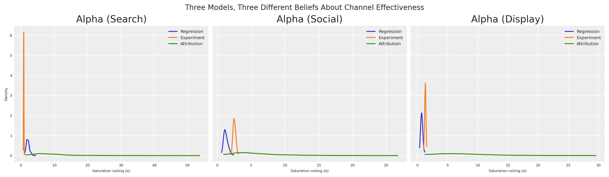
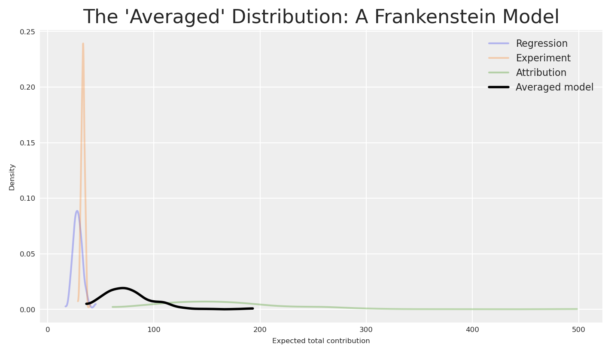
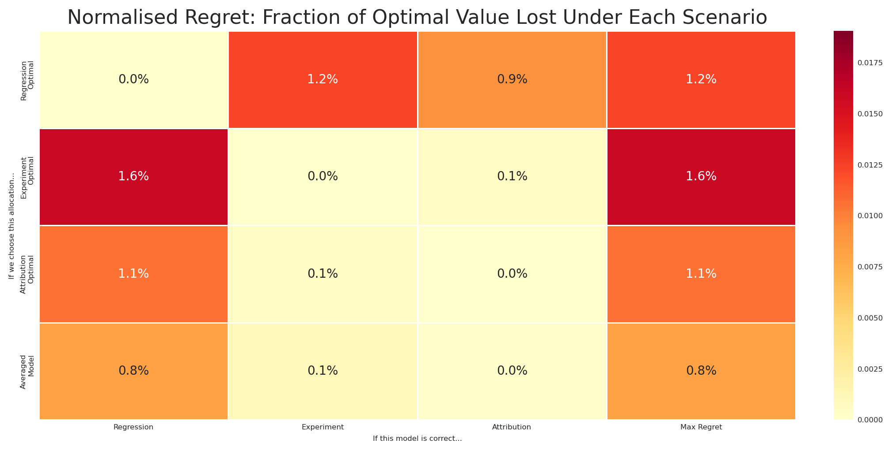
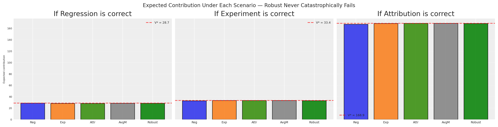

# Decidir entre contradições: alocação robusta de orçamento quando os seus modelos discordam

> Como tomar decisões robustas de alocação de orçamento quando os seus modelos de medição (MMM, experimentos, atribuição) dão conselhos contraditórios.

By Carlos Trujillo

Source: https://cetagostini.github.io/pt/articles/decision_making_under_contradictions/decision_making_under_contradictions.html

# Introdução

Está sentado na revisão trimestral de negócios. As finanças fazem uma pergunta aparentemente simples: *“Devemos aumentar ou diminuir o investimento em search no próximo trimestre?”*

Olha para os seus sistemas de medição. O modelo de regressão diz que search é uma estrela — alto retorno incremental, invista mais dinheiro. Um experimento recente diz que social superou search em 3x durante o geo-teste do mês passado. Entretanto, o painel de atribuição reporta que display gera mais contactos por dólar do que qualquer outro canal.

Três sistemas. Três metodologias. Três números contraditórios.

As finanças não se preocupam com a sua nuance metodológica. Precisam de **uma decisão**. Aumentar ou diminuir? Em quanto? Em que canais?

Esta é a realidade da medição moderna de marketing. Não temos uma fonte de verdade — temos *múltiplas visões concorrentes* de como o marketing funciona. Cada visão captura algo real, mas nenhuma conta toda a história. E a pior coisa que pode fazer é fingir que esta discordância não existe.

**Como tomar uma decisão orçamental única e defensável quando os seus modelos discordam fundamentalmente?** Hoje vamos responder a esta questão. Vamos emprestar uma ideia poderosa da *teoria da decisão* e da otimização robusta — **minimax regret** — e mostrar como encontrar alocações orçamentais que sejam robustas a erros do modelo, independentemente de qual visão se revelar correta.

# Resumo rápido

Este artigo condu-lo por:

- Construir **três modelos concorrentes** de eficácia de marketing, cada um representando uma filosofia de medição diferente (regressão, experimentação, atribuição).
- Mostrar que estes modelos produzem **recomendações orçamentais contraditórias** quando otimizados individualmente.
- Demonstrar porquê a **média** ou a **escolha do modelo mais certo** são estratégias falhadas — incluindo um argumento de análise dimensional e um teste de sensibilidade que torna a falha inegável.
- Introduzir o **minimax regret** da teoria da decisão clássica como a resolução fundamentada.
- Calcular a **matriz de arrependimento normalizada** e encontrar a **alocação robusta** que minimiza o arrependimento do pior caso como fração do valor ótimo.
- Ligar tudo de volta ao [PyMC-Marketing](https://www.pymc-marketing.io) `BudgetOptimizer`, `BuildMergedModel` e `CustomModelWrapper`.

# Três Visões da Realidade

Antes de escrever uma única linha de código, vamos compreender *porquê* estes números discordam. Cada sistema de medição responde a uma questão ligeiramente diferente:

| System | What it measures | Units (conceptual) | Typical uncertainty |
|----|----|----|----|
| **Regression (MMM)** | Average incremental contribution of marketing across time | Incremental sales per unit spend, averaged over the observation window | Moderate — many data points, but confounders and model misspecification add noise |
| **Experiment** | Incremental lift during a specific controlled period, not necessarily representative of average across larger periods | Incremental conversions per unit spend, holding everything else fixed | Moderate — randomisation or quasi-experimental design controls for confounders but validity depends on the assumptions being met |
| **Attribution** | Contacts or conversions attributed to marketing by the platform | Attributed contacts per unit spend — *not necessarily incremental* | Variable — high precision for what it measures, but what it measures may not be causal |

Estes três números não partilham as mesmas dimensões. O modelo regressão dá-lhe um efeito marginal médio ao longo do tempo. O experimento dá-lhe um efeito causal pontual em condições específicas. O modelo de atribuição dá-lhe uma associação não-causal porque **as mudanças de intenção não podem ser rastreadas por identificadores a nível de utilizador**.

Conceito-chave

Não pode simplesmente fazer a média destes números mais do que pode fazer a média de metros, quilogramas e segundos. Medem coisas diferentes. Mas ainda precisa de tomar uma decisão.

É aqui que a teoria da decisão entra em cena. Mas primeiro, vamos tornar isto concreto com código.

## Modelar a discordância

Vamos configurar o nosso ambiente e definir os parâmetros básicos para os nossos modelos.

``` sourceCode
import warnings
warnings.filterwarnings("ignore")

from pymc_marketing.mmm.budget_optimizer import BudgetOptimizer, BuildMergedModel, CustomModelWrapper
import pymc as pm
import arviz as az
import preliz as pz
import pytensor.tensor as pt
from pytensor import function as pytensor_function

# Visualization
import matplotlib.pyplot as plt
import seaborn as sns

# Scientific computing
import numpy as np
import pandas as pd
```

Código

``` sourceCode
az.style.use("arviz-darkgrid")
plt.rcParams["figure.figsize"] = [8, 4]
plt.rcParams["figure.dpi"] = 100
plt.rcParams["axes.labelsize"] = 6
plt.rcParams["xtick.labelsize"] = 6
plt.rcParams["ytick.labelsize"] = 6
plt.rcParams.update({"figure.constrained_layout.use": True})

%load_ext autoreload
%autoreload 2
%config InlineBackend.figure_format = "retina"

seed: int = sum(map(ord, "decision making under contradictions"))
rng: np.random.Generator = np.random.default_rng(seed=seed)
# print(f"Seed: {seed}")
```

Vamos construir três modelos PyMC, cada um representando as crenças de um diferente sistema de medição sobre a eficácia dos canais. Todos os três modelos partilham a mesma estrutura — uma curva de saturação [Michaelis-Menten](https://en.wikipedia.org/wiki/Michaelis%E2%80%93Menten_kinetics) por canal — mas diferem nos seus **valores de parâmetros** e **níveis de incerteza**.

Pressuposto

Temos sempre um pressuposto em torno do nosso sistema, que deve ser partilhado pela ferramenta de medição usada para o estimar. Se acreditamos que a atribuição é a verdadeira fonte de verdade, e o nosso sistema sofre de retornos decrescentes, então devemos ser capazes de observar a curva de saturação nos dados de atribuição. O mesmo com um experimento, devemos ser capazes de observar a curva de saturação nos dados do experimento, depois de recolher os dados.

f(x) = \frac{\alpha \cdot x}{\lambda + x}

onde:

- \alpha é o efeito máximo atingível (a assíntota)
- \lambda é o ponto de meia-saturação (investimento ao qual atingimos metade do máximo)

Esta função é côncava, garantindo retornos decrescentes — uma propriedade que torna a otimização de orçamento realista e matematicamente bem-comportada. Vamos começar por definir a configuração global: três canais, o nosso horizonte temporal e um orçamento total de 100.

Código

``` sourceCode
channels: list[str] = ["search", "social", "display"]
n_ch: int = len(channels)

# Observation periods (model structure) and future periods (optimization horizon)
n_dates: int = 30
n_future: int = 8

# Budget for optimization
TOTAL_BUDGET: float = 100.0

coords = {"date": np.arange(n_dates), "channel": channels}
# print(f"Channels: {channels}")
# print(f"Observation periods: {n_dates} | Future periods: {n_future}")
# print(f"Total budget: {TOTAL_BUDGET}")
```

É aqui que vive a discordância. Cada sistema de medição tem crenças diferentes sobre os parâmetros de saturação (\alpha, \lambda) para cada canal. Crucialmente, **discordam sobre a classificação dos canais** — e **discordam sobre a escala** da eficácia do marketing.

Código

``` sourceCode
model_configs = {
    "regression": {
        "description": "MMM: average incrementality across time",
        "mu_alpha": np.array([np.log(2.0), np.log(1.2), np.log(0.7)]),
        "sigma_alpha": np.array([0.25, 0.25, 0.25]),
        "mu_lam": np.array([np.log(5.0), np.log(3.0), np.log(4.0)]),
        "sigma_lam": np.array([0.25, 0.25, 0.25]),
        "color": "C0",
        "ranking": "search > social > display",
    },
    "experiment": {
        "description": "Experiment: causal lift in a specific period",
        "mu_alpha": np.array([np.log(0.8), np.log(2.5), np.log(1.3)]),
        "sigma_alpha": np.array([0.08, 0.08, 0.08]),
        "mu_lam": np.array([np.log(6.0), np.log(3.0), np.log(3.5)]),
        "sigma_lam": np.array([0.08, 0.08, 0.08]),
        "color": "C1",
        "ranking": "social > display > search",
    },
    "attribution": {
        "description": "Attribution: contacts per dollar (not incremental — inflated scale)",
        "mu_alpha": np.array([np.log(8.0), np.log(5.0), np.log(7.0)]),
        "sigma_alpha": np.array([0.60, 0.60, 0.60]),
        "mu_lam": np.array([np.log(2.5), np.log(7.0), np.log(3.0)]),
        "sigma_lam": np.array([0.60, 0.60, 0.60]),
        "color": "C2",
        "ranking": "search > display > social",
    },
}
```

Para transformar estas priors em algo com que o otimizador possa trabalhar, envolvemos cada conjunto de parâmetros num modelo PyMC leve que fala a mesma linguagem que o `CustomModelWrapper` do PyMC-Marketing. **O contrato é simples**: expor uma matriz `channel_data` (orçamento por canal por data), um escalar `total_contribution` e um vetor `channel_contribution`.

Qualquer versão da realidade pode tornar-se um modelo

Uma questão comum é: *“Como transformo efetivamente o meu painel de atribuição (ou qualquer outro sistema de medição) num modelo como os acima?”* A resposta é direta — pode pegar em qualquer versão da realidade e ajustar-lhe um modelo. Escolha uma estrutura de resposta em que acredite — digamos, uma com saturação e adstock — e use os seus dados para encontrar os parâmetros que melhor replicam o comportamento que o seu sistema de medição reporta. Contactos por dólar de atribuição, curvas de lift experimental, coeficientes de regressão, até a folha de cálculo de um colega — qualquer um destes pode servir como os “dados observados” contra os quais ajusta, com o investimento como a entrada.

O ajuste em si pode acontecer de duas formas. Um **ajuste determinístico** (por exemplo, mínimos quadrados ou MLE) dá-lhe estimativas pontuais dos parâmetros; não obtém posteriores de grafo, mas pode ainda estimar a incerteza dos parâmetros através de intervalos de confiança ou bootstrap. Um **ajuste bayesiano** dá-lhe posteriores completas diretamente — insira-as num objeto `InferenceData` e está pronto para o otimizador. Qualquer das vias transforma um sistema de medição num modelo compatível com este quadro.

Uma nuance importante: ajustar a mesma forma funcional a diferentes fontes de dados dá-lhe modelos que são *matematicamente* comparáveis — que é exatamente o que o quadro minimax regret requer — mas não torna as suas saídas *semanticamente* equivalentes. A curva ajustada por atribuição ainda representa contactos atribuídos, não lift causal. Os modelos partilham uma linguagem, não um significado. É precisamente por isso que usamos o arrependimento dentro dos termos de cada modelo em vez de fazer a média entre eles.

Percorremos um exemplo concreto deste processo — transformar resultados experimentais em parâmetros calibrados do modelo — em [From Experiments to Priors: Eliciting Informative Priors for Your Marketing Mix Model](../../articles/from_experiments_to_priors/from_experiments_to_priors.html).

Código

``` sourceCode
def build_response_model(mu_alpha, sigma_alpha, mu_lam, sigma_lam, coords, n_dates, n_ch):
    """
    Build a PyMC model with Michaelis-Menten saturation per channel.

    Parameters
    ----------
    mu_alpha : np.ndarray
        LogNormal mu for saturation alpha (per channel).
    sigma_alpha : np.ndarray
        LogNormal sigma for saturation alpha (per channel).
    mu_lam : np.ndarray
        LogNormal mu for saturation lambda (per channel).
    sigma_lam : np.ndarray
        LogNormal sigma for saturation lambda (per channel).
    coords : dict
        PyMC coordinate dict with "date" and "channel".
    n_dates : int
        Number of observation periods.
    n_ch : int
        Number of channels.

    Returns
    -------
    pm.Model
        Compiled PyMC model.
    """
    with pm.Model(coords=coords) as model:
        # Channel spend data — the optimizer injects budget allocations here
        channel_data = pm.Data(
            "channel_data",
            np.ones((n_dates, n_ch)),
            dims=("date", "channel"),
        )

        # Saturation parameters (LogNormal ensures positivity)
        alpha = pm.LogNormal(
            "alpha",
            mu=mu_alpha,
            sigma=sigma_alpha,
            dims="channel",
        )
        lam = pm.LogNormal(
            "lam",
            mu=mu_lam,
            sigma=sigma_lam,
            dims="channel",
        )

        # Michaelis-Menten saturation: alpha * x / (lam + x)
        channel_contrib = alpha * channel_data / (lam + channel_data)

        # Sum over channels → per-period response
        mu = channel_contrib.sum(axis=-1)

        # Deterministics the optimizer needs
        pm.Deterministic("total_contribution", mu.sum())
        pm.Deterministic(
            "channel_contribution",
            channel_contrib,
            dims=("date", "channel"),
        )

    return model


# Build and sample all three models
models = {}
idatas = {}

for name, cfg in model_configs.items():
    model = build_response_model(
        mu_alpha=cfg["mu_alpha"],
        sigma_alpha=cfg["sigma_alpha"],
        mu_lam=cfg["mu_lam"],
        sigma_lam=cfg["sigma_lam"],
        coords=coords,
        n_dates=n_dates,
        n_ch=n_ch,
    )

    with model:
        idata = pm.sample_prior_predictive(samples=500, random_seed=seed)

    # Rename "prior" → "posterior" so the optimizer can find the parameter draws
    idata.add_groups(posterior=idata.prior)

    models[name] = model
    idatas[name] = idata
    # print(f"✓ {name}: posterior shape (alpha) = {idata.posterior['alpha'].shape}")
```

Amostramos da prior e tratamos essas amostras como se fossem amostras a posteriori de modelos ajustados. Na prática, cada uma destas viria de uma análise real — o MMM de regressão histórica, o experimento de um geo-teste e a atribuição de painéis de plataformas.

porquê usar a prior como posterior?

Ao fingir que a prior é a posterior, saltamos o passo dispendioso do MCMC e focamo-nos no problema de tomada de decisão. Num fluxo de trabalho real, estes objetos `idata` viriam de `pm.sample()` depois de ajustar os seus modelos a dados históricos. O processo de decisão a jusante é idêntico quer as posteriores venham de dados reais ou desta geração sintética.

## A ver o conflito

Vamos ver como os três modelos diferem nas suas crenças sobre a eficácia dos canais (\alpha, o teto de saturação). A largura de cada distribuição reflete a certeza do sistema de medição.

Código

``` sourceCode
fig, axes = plt.subplots(nrows=1, ncols=3, figsize=(14, 4), sharey=True)

for idx, ch in enumerate(channels):
    ax = axes[idx]
    for name, cfg in model_configs.items():
        alpha_samples = idatas[name].posterior["alpha"].sel(channel=ch).values.flatten()
        az.plot_dist(
            alpha_samples,
            color=cfg["color"],
            label=name.capitalize(),
            ax=ax,
        )
    ax.set(
        title=f"Alpha ({ch.capitalize()})",
        xlabel="Saturation ceiling (α)",
    )
    if idx == 0:
        ax.set(ylabel="Density")
    ax.legend(fontsize=7)

fig.suptitle(
    "Three Models, Three Different Beliefs About Channel Effectiveness",
    fontsize=12,
)
plt.show()
```

<figure class="figure">
<p></p>
</figure>

Este gráfico é a prova visual do nosso dilema. Estas não são pequenas discordâncias — os modelos têm classificações de canais *qualitativamente diferentes*.

Podemos ver isto ainda mais claramente plotando as curvas de resposta de Michaelis-Menten usando a média a posteriori de cada modelo. Isto mostra o que cada modelo prevê que acontecerá à medida que aumentamos o investimento em cada canal.

Código

``` sourceCode
x_range = np.linspace(0.1, 30, 200)

fig, axes = plt.subplots(nrows=1, ncols=3, figsize=(14, 4), sharey=False)

for idx, (name, cfg) in enumerate(model_configs.items()):
    ax = axes[idx]
    for ch_idx, ch in enumerate(channels):
        alpha_mean = idatas[name].posterior["alpha"].sel(channel=ch).mean().item()
        lam_mean = idatas[name].posterior["lam"].sel(channel=ch).mean().item()
        y = alpha_mean * x_range / (lam_mean + x_range)
        ax.plot(x_range, y, label=ch.capitalize(), color=f"C{ch_idx}")

    ax.set(
        title=f"{name.capitalize()} View",
        xlabel="Per-period spend",
        ylabel="Response" if idx == 0 else "",
    )
    ax.legend(fontsize=7)

fig.suptitle("Saturation Curves: Each Model Tells a Different Story", fontsize=12)
plt.show()
```

<figure class="figure">
<p></p>
</figure>

Sob a **visão de regressão**, search (azul) domina — tem a assíntota mais alta e responde bem ao aumento do investimento. Sob a **visão de experimento**, social (laranja) é o claro vencedor. Sob a **visão de atribuição**, search e display erguem-se acima do social — mas olhe para o eixo y: o modelo de atribuição reporta eficácia a uma *escala completamente diferente* dos outros dois. As suas curvas atingem assíntotas 10× mais altas do que qualquer coisa que a regressão ou o experimento prevê.

Se fosse um diretor financeiro a olhar para estes três gráficos, ficaria compreensivelmente confuso. E se alguém fizesse a média destas curvas, estaria a tomar uma decisão dominada por qualquer sistema que berra os números mais altos.

# Três Modelos, Três Orçamentos

Vamos fazer o que a maioria das equipas faz na prática: otimizar a alocação de orçamento sob cada modelo independentemente, usando o `BudgetOptimizer` do [PyMC-Marketing](https://www.pymc-marketing.io). Isto dá-nos três alocações ótimas separadas, uma para cada sistema de crenças.

Código

``` sourceCode
bounds = {ch: (0.0, 60.0) for ch in channels}

optimal_allocations = {}
optimal_results = {}

for name in model_configs:
    wrapper = CustomModelWrapper(
        base_model=models[name],
        idata=idatas[name],
        channels=channels,
    )
    optimizer = BudgetOptimizer(model=wrapper, num_periods=n_future)

    allocation, result = optimizer.allocate_budget(
        total_budget=TOTAL_BUDGET,
        budget_bounds=bounds,
    )

    # Convert to pd.Series for consistent downstream handling
    if hasattr(allocation, "to_series"):
        allocation = allocation.to_series()
    elif not isinstance(allocation, pd.Series):
        allocation = pd.Series(np.array(allocation).flatten(), index=channels)

    optimal_allocations[name] = allocation
    optimal_results[name] = result

    # print(f"\n{name.upper()} optimal allocation:")
    # print(f"  Success: {result.success}")
    # print(f"  Expected contribution: {-result.fun:.4f}")
    # for ch in channels:
    #     # print(f"  {ch}: {allocation[ch]:.2f}")
```

Podemos visualizar estas três alocações ótimas para ver exatamente como as recomendações diferem:

Código

``` sourceCode
alloc_df = pd.DataFrame(optimal_allocations).T
alloc_df.columns = [ch.capitalize() for ch in channels]

fig, ax = plt.subplots(figsize=(10, 5))
alloc_df.plot(kind="bar", ax=ax, edgecolor="black", alpha=0.85, width=0.8)
ax.set(
    title="Optimal Budget Allocation Under Each Model",
    xlabel="Model (measurement system)",
    ylabel=f"Budget allocation (total = {TOTAL_BUDGET:.0f})",
)
ax.legend(title="Channel", loc="upper right")
ax.set_xticklabels(ax.get_xticklabels(), rotation=0)

# Annotate with total budget check
for i, name in enumerate(model_configs):
    total = optimal_allocations[name].sum()
    ax.text(i, 1, f"Σ={total:.0f}", ha="center", fontsize=7, color="white")

ax.grid(True, axis="y", alpha=0.3)
plt.show()
```

<figure class="figure">
<p></p>
</figure>

O quadro é impressionante. O modelo de regressão coloca a maior parte do orçamento em **search**. O experimento desloca quase tudo para **social**. O modelo de atribuição favorece **search e display** enquanto priva o social.

Estes não são pequenos ajustes — são estratégias fundamentalmente diferentes. Se apresentar qualquer uma delas às finanças, está implicitamente a apostar que um sistema de medição está correto e os outros estão errados. Como decidir? Mais importante, e se errar? **E se estiverem todos parcialmente certos?**

# A Ilusão do Consenso

O instinto natural vai assim: “Temos três modelos. Em vez de confiar apenas num, vamos ser espertos — para qualquer alocação dada, pedimos a *todos os três* modelos qual seria o resultado esperado, depois fazemos a média das suas respostas. Isto dá-nos uma previsão de ‘consenso’. Otimizamos *isso.*”

Isto parece razoável. É o que um interveniente pragmático poderia efetivamente propor. Vamos testá-lo combinando todos os três modelos num único grafo computacional usando `BuildMergedModel`. Este grafo partilhado permite-nos avaliar qualquer alocação orçamental em todas as três superfícies de resposta simultaneamente.

Com o modelo combinado pronto, podemos compilar funções de avaliação PyTensor para calcular facilmente a resposta esperada para qualquer orçamento sob qualquer modelo.

Código

``` sourceCode
wrappers = {
    name: CustomModelWrapper(
        base_model=models[name], idata=idatas[name], channels=channels,
    )
    for name in model_configs
}

merged = BuildMergedModel(
    models=list(wrappers.values()),
    prefixes=list(model_configs.keys()),
    merge_on="channel_data",
)
merged.num_periods = n_future
merged.channel_columns = channels

# print("Merged model variables:")
# for v in merged.model.named_vars:
#     # print(f"  {v}")

merged_optimizer = BudgetOptimizer(
    model=merged,
    num_periods=n_future,
    response_variable="regression_total_contribution",
)

eval_fns: dict[str, callable] = {}
draws_fns: dict[str, callable] = {}

for name in model_configs:
    var = f"{name}_total_contribution"
    dist = merged_optimizer.extract_response_distribution(var)
    draws_fns[name] = pytensor_function([merged_optimizer._budgets_flat], dist)
    eval_fns[name] = pytensor_function([merged_optimizer._budgets_flat], pt.mean(dist))

# Quick sanity check: evaluate at equal allocation
equal_alloc = np.array([TOTAL_BUDGET / n_ch] * n_ch)
# for name in model_configs:
#     # print(f"  {name} at equal alloc: {eval_fns[name](equal_alloc):.4f}")
```

Agora construímos a métrica de “consenso”. Para qualquer alocação a, avaliamos todos os três modelos e fazemos a média das suas respostas esperadas:

V\_{\text{avg}}(a) = \frac{1}{3}\left\[V\_{\text{reg}}(a) + V\_{\text{exp}}(a) + V\_{\text{attr}}(a)\right\]

Depois otimizamos V\_{\text{avg}} para encontrar a alocação que maximiza esta previsão média.

Código

``` sourceCode
with merged.model:
    pm.Deterministic("averaged_total_contribution", (
        merged.model["regression_total_contribution"]
        + merged.model["experiment_total_contribution"]
        + merged.model["attribution_total_contribution"]
    ) / 3)

avg_optimizer = BudgetOptimizer(
    model=merged,
    num_periods=n_future,
    response_variable="averaged_total_contribution",
)

naive_avg, result_naive = avg_optimizer.allocate_budget(
    total_budget=TOTAL_BUDGET,
    budget_bounds=bounds,
)

if hasattr(naive_avg, "to_series"):
    naive_avg = naive_avg.to_series()
elif not isinstance(naive_avg, pd.Series):
    naive_avg = pd.Series(np.array(naive_avg).flatten(), index=channels)

# print(f"Optimisation success: {result_naive.success}")
# print(f"Averaged model expected contribution: {-result_naive.fun:.4f}")
# print(f"\nAveraged-model optimal allocation:")
# for ch in channels:
#     # print(f"  {ch}: {naive_avg[ch]:.2f}")
# print(f"  Total: {naive_avg.sum():.2f}")
```

Esta alocação é a melhor que pode fazer *se* a média dos três modelos for significativa. Mas é?

Vamos ver o que cada modelo efetivamente *prevê* para esta alocação. Não apenas a média — a distribuição completa a posteriori.

Código

``` sourceCode
fig, ax = plt.subplots(figsize=(7, 4))

alloc_values = naive_avg.values
all_draws = []
for name, cfg in model_configs.items():
    draws = draws_fns[name](alloc_values)
    all_draws.append(draws)

min_len = min(len(d) for d in all_draws)
stacked = np.column_stack([d[:min_len] for d in all_draws])
averaged_draws = stacked.mean(axis=1)

for name, cfg in model_configs.items():
    draws = draws_fns[name](alloc_values)
    az.plot_dist(draws, color=cfg["color"], label=name.capitalize(), ax=ax, plot_kwargs={"alpha": 0.3})

az.plot_dist(averaged_draws, color="black", label="Averaged model", ax=ax, plot_kwargs={"linewidth": 2})
ax.set(
    title="The 'Averaged' Distribution: A Frankenstein Model",
    xlabel="Expected total contribution",
    ylabel="Density",
)
ax.legend(fontsize=8)

plt.show()
```

<figure class="figure">
<p></p>
</figure>

As distribuições não apenas discordam — vivem em *escalas completamente diferentes*. O modelo de atribuição (verde), operando a 10× a magnitude dos outros dois, empurra a sua distribuição muito para a direita. A regressão e o experimento situam-se num intervalo modesto; a atribuição ergue-se acima deles. Estas não são pequenas diferenças de calibração — refletem processos de medição fundamentalmente diferentes a contar fundamentalmente coisas diferentes.

A distribuição “média” (preta) não cai num meio-termo neutro — é arrastada para os valores inflacionados do modelo de atribuição, porque a média de um número pequeno, outro número pequeno e um número muito grande é dominada pelo número muito grande. A voz mais alta ganha a média. Pergunte a si mesmo: **o que representa uma amostra desta distribuição?**

Não é o aumento incremental esperado de vendas. Não é o lift causal esperado. Não são os contactos atribuídos esperados. É a média dos três — uma quantidade que não existe em nenhum quadro.

A abordagem do “consenso” toma a média simples destes três números. Mas pense no que isso significa: estamos a adicionar vendas incrementais num ponto temporal (ou vários pontos temporais), conversões causais numa janela temporal e contactos atribuídos não puramente incrementais como se fossem a mesma coisa. É como calcular a média de 5 metros, 3 quilogramas e 7 segundos. O resultado é um número, claro — mas *não significa nada*.

Além disso, o “consenso” assume implicitamente que a verdade é exatamente a média aritmética dos três modelos — dando 10× mais peso ao sistema que por acaso reporta os números mais altos. Não trata os modelos como hipóteses igualmente credíveis. Trata-os como membros votantes de um comité onde a atribuição tem dez votos e todos os outros têm um.

Erro dimensional

Fazer a média das *saídas* de modelos de diferentes sistemas de medição é um erro dimensional. O “consenso” resultante pode parecer uma distribuição, mas não tem interpretação significativa em nenhum dos três quadros. Nenhuma amostra desta distribuição corresponde a qualquer resultado do mundo real.

Mesmo que normalizássemos tudo para as mesmas unidades (por exemplo, convertêssemos tudo para dólares), ainda estaríamos a fazer a média de quantidades fundamentalmente diferentes causais/não-causais. Fazer a média destas não é apenas um erro de unidades; é um **erro de categoria**. É como fazer a média de uma velocidade (km/h), uma distância (km) e uma coordenada (lat/long). A análise dimensional diz-nos que a média está conceitualmente errada. Mas quão mal se manifesta na prática?

## Porquê a média falha à escala

Vamos prová-lo. Vamos varrer o parâmetro de eficácia do modelo de atribuição do seu valor base (1×) até 10× — a nossa definição atual — e registar o que acontece tanto à alocação do modelo médio como a uma alternativa robusta em cada passo. A regressão e o experimento permanecem fixos; apenas a magnitude do modelo de atribuição muda.

Se a média é verdadeiramente uma estratégia sólida, a alocação que recomenda deve permanecer estável à medida que a escala de um modelo muda. Afinal, um bom método de agregação não deveria deixar uma única voz dominar só porque fala mais alto.

Código

``` sourceCode
# Base attribution alpha parameters (1× scale, before inflation)
base_mu_alpha_attr: np.ndarray = np.array([np.log(2.5), np.log(0.5), np.log(1.8)])

scale_factors: np.ndarray = np.array([1, 2, 3, 5, 7, 10])
n_scales: int = len(scale_factors)

avg_allocs_sweep: dict[int, pd.Series] = {}
robust_allocs_sweep: dict[int, pd.Series] = {}

for k in scale_factors:
    # Scale attribution alpha by k (in log-space: add log(k))
    mu_alpha_k = base_mu_alpha_attr + np.log(k)

    model_k = build_response_model(
        mu_alpha=mu_alpha_k,
        sigma_alpha=model_configs["attribution"]["sigma_alpha"],
        mu_lam=model_configs["attribution"]["mu_lam"],
        sigma_lam=model_configs["attribution"]["sigma_lam"],
        coords=coords,
        n_dates=n_dates,
        n_ch=n_ch,
    )

    with model_k:
        idata_k = pm.sample_prior_predictive(samples=500, random_seed=seed)
    idata_k.add_groups(posterior=idata_k.prior)

    # Attribution-optimal allocation at this scale
    wrapper_k = CustomModelWrapper(
        base_model=model_k, idata=idata_k, channels=channels,
    )
    opt_k = BudgetOptimizer(model=wrapper_k, num_periods=n_future)
    alloc_k, _ = opt_k.allocate_budget(
        total_budget=TOTAL_BUDGET, budget_bounds=bounds,
    )

    if hasattr(alloc_k, "to_series"):
        alloc_k = alloc_k.to_series()
    elif not isinstance(alloc_k, pd.Series):
        alloc_k = pd.Series(np.array(alloc_k).flatten(), index=channels)

    # Merge at this scale: regression + experiment (fixed) + attribution_k
    merged_k = BuildMergedModel(
        models=[wrappers["regression"], wrappers["experiment"], wrapper_k],
        prefixes=["regression", "experiment", "attribution"],
        merge_on="channel_data",
    )
    merged_k.num_periods = n_future
    merged_k.channel_columns = channels

    # --- Averaged-model optimisation at this scale ---
    with merged_k.model:
        pm.Deterministic("averaged_total_contribution", (
            merged_k.model["regression_total_contribution"]
            + merged_k.model["experiment_total_contribution"]
            + merged_k.model["attribution_total_contribution"]
        ) / 3)

    avg_opt_k = BudgetOptimizer(
        model=merged_k, num_periods=n_future,
        response_variable="averaged_total_contribution",
    )
    alloc_avg_k, _ = avg_opt_k.allocate_budget(
        total_budget=TOTAL_BUDGET, budget_bounds=bounds,
    )
    if hasattr(alloc_avg_k, "to_series"):
        alloc_avg_k = alloc_avg_k.to_series()
    elif not isinstance(alloc_avg_k, pd.Series):
        alloc_avg_k = pd.Series(np.array(alloc_avg_k).flatten(), index=channels)
    avg_allocs_sweep[k] = alloc_avg_k

    # --- Minimax regret optimisation at this scale ---
    # v_star for the scaled attribution model
    attr_eval_dist = opt_k.extract_response_distribution("total_contribution")
    attr_eval_fn = pytensor_function([opt_k._budgets_flat], pt.mean(attr_eval_dist))
    v_star_attr_k = float(attr_eval_fn(alloc_k.values))

    v_stars_sweep = {}
    for sweep_name in ["regression", "experiment"]:
        v_stars_sweep[sweep_name] = float(eval_fns[sweep_name](optimal_allocations[sweep_name].values))

    with merged_k.model:
        regret_vector_k = pt.stack([
            1.0 - merged_k.model["regression_total_contribution"] / v_stars_sweep["regression"],
            1.0 - merged_k.model["experiment_total_contribution"] / v_stars_sweep["experiment"],
            1.0 - merged_k.model["attribution_total_contribution"] / v_star_attr_k,
        ])
        pm.Deterministic("regret_vector", regret_vector_k)

    def minimax_regret_utility(samples, budgets):
        mean_regrets = pt.mean(samples, axis=0)
        return -pt.max(mean_regrets)

    rob_opt_k = BudgetOptimizer(
        model=merged_k, num_periods=n_future,
        response_variable="regret_vector",
        utility_function=minimax_regret_utility,
    )
    alloc_rob_k, _ = rob_opt_k.allocate_budget(
        total_budget=TOTAL_BUDGET, budget_bounds=bounds,
    )
    if hasattr(alloc_rob_k, "to_series"):
        alloc_rob_k = alloc_rob_k.to_series()
    elif not isinstance(alloc_rob_k, pd.Series):
        alloc_rob_k = pd.Series(np.array(alloc_rob_k).flatten(), index=channels)
    robust_allocs_sweep[k] = alloc_rob_k

    # print(f"k={k:2d} | Avg: {alloc_avg_k.values.round(1)} | Robust: {alloc_rob_k.values.round(1)}")

fig, ax = plt.subplots(figsize=(8, 5))

for ch_idx, ch in enumerate(channels):
    vals = [avg_allocs_sweep[k][ch]/TOTAL_BUDGET for k in scale_factors]
    ax.plot(
        scale_factors, vals,
        marker="o", label=ch.capitalize(), color=f"C{ch_idx}", linewidth=2,
    )
ax.set(
    title="Averaged Model: Allocation Drifts With Attribution Scale",
    xlabel="Attribution scale multiplier (k×)",
    ylabel=f"Budget share (total = {TOTAL_BUDGET:.0f})",
)
ax.legend(fontsize=8)
ax.grid(True, alpha=0.3)
plt.show()
```

<figure class="figure">
<p></p>
</figure>

O resultado é condenador. À medida que a escala de um modelo aumenta de 1× para 10×, a alocação do modelo médio pivota progressivamente para os canais preferidos desse modelo — as restantes visões vão sendo progressivamente abafadas. Isto não é específico da atribuição; *qualquer* modelo cuja resposta média cresva sequestra o consenso. O “consenso” não é um consenso; é uma negociação de reféns onde o maior número ganha sempre.

A lição prática

Se os seus sistemas de medição operam em escalas diferentes — e quase certamente é o caso — fazer a média das suas saídas dá uma influência desproporcionada ao sistema com os maiores números. Isto não é uma preocupação teórica. A atribuição de plataformas reporta rotineiramente 5-15× mais “conversões” do que testes de incrementalidade porque conta cada ponto de contacto, não apenas os causais. Qualquer método de agregação que não tenha isto em conta vai sobre-investir sistematicamente no que o painel de atribuição recomenda.

A evidência é clara. A média não é apenas desprovida de interpretação significativa — persegue ativamente qualquer sistema que berra os números mais altos, produzindo alocações que oscilam violentamente à medida que a escala de medição muda. Precisamos de um quadro que reconheça a discordância do modelo sem tentar combinar as saídas dos modelos numa única previsão.

Este é o vazio que a **teoria da decisão** preenche. Em vez de tentar sintetizar um modelo “verdadeiro”, reconhecemos a incerteza do modelo e escolhemos a *ação* que se comporta melhor *dada essa incerteza*. Não combinamos os modelos — combinamos as suas *implicações para as decisões*.

# A Solução: Minimax Regret

Vamos formalizar a nossa situação. Temos:

- Um conjunto de possíveis **ações** a \in \mathcal{A} (alocações de orçamento entre canais)
- Um conjunto de possíveis **estados do mundo** m \in \mathcal{M} (qual modelo está correto)
- Uma **função de payoff** V(a, m) que dá a resposta esperada quando a ação a é tomada e o modelo m é o verdadeiro

Para cada modelo m, existe uma ação ótima a_m^\* = \arg\max_a V(a, m) — a alocação que escolheríamos se *sabéssemos* que o modelo m estava correto.

O **arrependimento normalizado** de escolher a ação a quando o modelo m é verdadeiro é a fração do valor ótimo que deixamos sobre a mesa:

R(a, m) = 1 - \frac{V(a, m)}{V(a_m^\*, m)}

O arrependimento normalizado vive em \[0, 1\]. Zero significa que escolhemos perfeitamente para esse modelo. Um valor de 0.15 significa que capturámos apenas 85% do que era atingível. Crucialmente, o arrependimento normalizado é **invariante à escala**: se a resposta do modelo m é multiplicada por qualquer constante k, tanto o numerador como o denominador da razão V/V^\* escalam identicamente, deixando R inalterado. Esta propriedade é essencial quando os nossos modelos operam em magnitudes diferentes — e é exatamente por isso que o painel direito do gráfico de sensibilidade se manteve estável.

A estratégia de **minimax regret** escolhe a ação que minimiza o arrependimento do *pior caso* em todos os modelos possíveis:

a^{MR} = \arg\min\_{a \in \mathcal{A}} \max\_{m \in \mathcal{M}} R(a, m)

Em palavras: **encontrar a alocação tal que, independentemente de qual modelo se revele correto, o nosso arrependimento seja o menor possível.**

## Porquê minimax regret?

Este critério tem várias propriedades convincentes para o nosso contexto de marketing:

1.  **Não é necessário atribuir pesos aos modelos.** Ao contrário da Média Bayesiana de Modelos, não precisamos de atribuir probabilidades a cada modelo estar “correto.” Simplesmente protegemos contra o pior caso.

2.  **Lida com modelos incomensuráveis.** Nunca combinamos os *parâmetros* dos modelos — avaliamos apenas a *resposta* de cada modelo à mesma alocação. O arrependimento normalizado é sempre calculado no quadro de um único modelo, e como mede a *fração* do valor ótimo perdido, é invariante à escala absoluta da resposta de cada modelo.

3.  **Robusta a erros do modelo.** A alocação resultante faz cobertura contra todos os modelos, garantindo que nunca tomamos uma decisão catastroficamente má sob qualquer deles.

4.  **Teoria estabelecida.** O minimax regret foi formalizado por [Leonard Savage (1951)](https://en.wikipedia.org/wiki/Minimax) e conecta-se diretamente à **Otimização Distribucionalmente Robusta (DRO)** na investigação operacional moderna e à **alocação robusta de portfólios** nas finanças.

Analogia com portfólios

Pense no minimax regret como o equivalente na teoria da decisão da diversificação de portfólios. Tal como um portfólio diversificado protege contra a incerteza nos retornos de ações individuais, uma alocação por minimax regret protege contra a incerteza em qual modelo está correto.

# A Alocação Robusta na Prática

Para cada modelo, a resposta ótima V^\*(m) é a contribuição máxima atingível — o que obteríamos se soubéssemos que esse modelo estava correto e otimizássemos perfeitamente para ele.

Código

``` sourceCode
v_stars = {}

for name in model_configs:
    v_star = float(eval_fns[name](optimal_allocations[name].values))
    v_stars[name] = v_star
    # print(f"V* ({name}): {v_star:.4f}")
```

Estes são os *melhores resultados possíveis* sob cada modelo. Qualquer outra alocação atingirá menos sob esse modelo, resultando em arrependimento positivo. Vamos avaliar cada alocação candidata sob cada modelo para construir a matriz de arrependimento.

Código

``` sourceCode
# Gather all candidate allocations
candidate_allocations = {
    "Regression\nOptimal": optimal_allocations["regression"],
    "Experiment\nOptimal": optimal_allocations["experiment"],
    "Attribution\nOptimal": optimal_allocations["attribution"],
    "Averaged\nModel": naive_avg,
}

# Build the response and regret matrices
response_matrix = pd.DataFrame(
    index=candidate_allocations.keys(),
    columns=[n.capitalize() for n in model_configs.keys()],
    dtype=float,
)

regret_matrix = response_matrix.copy()

for alloc_name, alloc in candidate_allocations.items():
    alloc_vals = np.array(alloc).flatten()
    for model_name in model_configs:
        v = float(eval_fns[model_name](alloc_vals))
        response_matrix.loc[alloc_name, model_name.capitalize()] = v
        regret_matrix.loc[alloc_name, model_name.capitalize()] = 1.0 - v / v_stars[model_name]

# print("=== Response Matrix (expected contribution) ===")
# print(response_matrix.round(2).to_string())
# print()
# print("=== Normalised Regret Matrix (fraction of optimal lost) ===")
# print(regret_matrix.round(4).to_string())

# Add max regret column
regret_display = regret_matrix.copy()
regret_display["Max Regret"] = regret_display.max(axis=1)

fig, ax = plt.subplots(figsize=(10, 5))
sns.heatmap(
    regret_display.astype(float),
    annot=True,
    fmt=".1%",
    cmap="YlOrRd",
    linewidths=0.5,
    ax=ax,
    vmin=0.0,
    vmax=regret_display.values.max() * 1.2,
)
ax.set(
    title="Normalised Regret: Fraction of Optimal Value Lost Under Each Scenario",
    xlabel="If this model is correct...",
    ylabel="If we choose this allocation...",
)
plt.show()
```

<figure class="figure">
<p></p>
</figure>

Leia esta matriz com atenção:

- Cada **linha** é uma alocação candidata (o que podemos escolher).
- Cada **coluna** é um cenário (qual modelo se revela correto).
- Cada **célula** é o arrependimento normalizado — a fração do valor ótimo perdido. Um valor de 0.15 significa que capturamos apenas 85% do que era atingível sob esse modelo.
- A **coluna mais à direita** é o arrependimento normalizado máximo: o pior caso para cada alocação.

Note que a alocação ótima de cada modelo tem **arrependimento zero** sob o seu próprio modelo (por definição), mas potencialmente **grande arrependimento** sob os outros modelos. A alocação ótima de regressão é penalizada se o modelo de experimento estiver correto. A alocação ótima do experimento sofre se a regressão ou a atribuição estiverem certas.

O modelo médio? Puxado para a escala inflacionada da atribuição, imita a alocação ótima da atribuição — bom quando a atribuição está certa, mas exposto quando não está. Não faz cobertura; segue o sinal mais alto. E como mostrámos, o número que otimizou não tem interpretação física coerente.

**Podemos fazer melhor?**

Podemos resolver o problema de minimax regret diretamente: encontrar a alocação que minimiza o arrependimento máximo em todos os três modelos.

a^{MR} = \arg\min\_{a} \max\_{m \in \\\text{reg}, \text{exp}, \text{attr}\\} \left\[ 1 - \frac{V(a, m)}{V^\*(m)} \right\]

sujeito a:

\sum\_{c} a_c = B, \quad a_c \geq 0 \quad \forall c

Vamos verificar avaliando o arrependimento da alocação robusta sob cada modelo.

Código

``` sourceCode
with merged.model:
    regret_vector = pt.stack([
        1.0 - merged.model[f"{name}_total_contribution"] / v_stars[name]
        for name in model_configs
    ])
    pm.Deterministic("regret_vector", regret_vector)


def minimax_regret_utility(samples, budgets):
    mean_regrets = pt.mean(samples, axis=0)
    return -pt.max(mean_regrets)


robust_optimizer = BudgetOptimizer(
    model=merged,
    num_periods=n_future,
    response_variable="regret_vector",
    utility_function=minimax_regret_utility,
)

robust_allocation, result_robust = robust_optimizer.allocate_budget(
    total_budget=TOTAL_BUDGET,
    budget_bounds=bounds,
)

if hasattr(robust_allocation, "to_series"):
    robust_allocation = robust_allocation.to_series()
elif not isinstance(robust_allocation, pd.Series):
    robust_allocation = pd.Series(np.array(robust_allocation).flatten(), index=channels)

# print(f"Optimisation success: {result_robust.success}")
# print(f"Maximum normalised regret (minimax): {result_robust.fun:.4f}")
# print(f"\nRobust allocation:")
# for ch in channels:
#     # print(f"  {ch}: {robust_allocation[ch]:.2f}")
# print(f"  Total: {robust_allocation.sum():.2f}")

robust_vals = robust_allocation.values
naive_vals = naive_avg.values

# print("Robust allocation normalised regret under each model:")
robust_regrets = []
naive_regrets = []
for name in model_configs:
    v = float(eval_fns[name](robust_vals))
    regret = 1.0 - v / v_stars[name]
    robust_regrets.append(regret)
    naive_regrets.append(1.0 - float(eval_fns[name](naive_vals)) / v_stars[name])
    # print(f"  {name}: V={v:.4f}, Normalised regret={regret:.4f}")

robust_max_regret = max(robust_regrets)
naive_max_regret = max(naive_regrets)
# print(f"\nMax normalised regret — Robust: {robust_max_regret:.4f} | Averaged model: {naive_max_regret:.4f}")
# print(f"Improvement: {((naive_max_regret - robust_max_regret) / naive_max_regret * 100):.1f}% reduction in worst-case regret")
```

A alocação robusta atinge um **menor máximo de arrependimento normalizado** do que o modelo médio — e dramaticamente menor do que o ótimo de qualquer modelo individual. Faz cobertura entre modelos, nunca apostando tudo numa visão estar correta.

Vamos juntar tudo e comparar todas as cinco alocações: as três ótimas específicas de cada modelo, o ótimo do modelo médio e a alocação robusta por minimax regret.

Código

``` sourceCode
# Add robust allocation to candidates
all_allocations = {
    "Regression\nOptimal": optimal_allocations["regression"],
    "Experiment\nOptimal": optimal_allocations["experiment"],
    "Attribution\nOptimal": optimal_allocations["attribution"],
    "Averaged\nModel": naive_avg,
    "Minimax\nRegret": robust_allocation,
}

# Full regret matrix
full_regret = pd.DataFrame(
    index=all_allocations.keys(),
    columns=[n.capitalize() for n in model_configs.keys()],
    dtype=float,
)

for alloc_name, alloc in all_allocations.items():
    alloc_vals = np.array(alloc).flatten()
    for model_name in model_configs:
        v = float(eval_fns[model_name](alloc_vals))
        full_regret.loc[alloc_name, model_name.capitalize()] = 1.0 - v / v_stars[model_name]

full_regret["Max Regret"] = full_regret[[c.capitalize() for c in model_configs]].max(axis=1)

# print("=== Full Normalised Regret Matrix ===")
# print(full_regret.round(4).to_string())

fig, axes = plt.subplots(nrows=1, ncols=2, figsize=(16, 5))

# Panel 1: Allocations
alloc_compare = pd.DataFrame(
    {name: alloc for name, alloc in all_allocations.items()}
).T
alloc_compare.columns = [ch.capitalize() for ch in channels]

alloc_compare.plot(kind="bar", ax=axes[0], edgecolor="black", alpha=0.85, width=0.8)
axes[0].set(
    title="Budget Allocations: Who Gets What?",
    xlabel="Strategy",
    ylabel=f"Budget (total = {TOTAL_BUDGET:.0f})",
)
axes[0].legend(title="Channel", fontsize=7, loc="upper right")
axes[0].set_xticklabels(axes[0].get_xticklabels(), rotation=0, fontsize=7)
axes[0].grid(True, axis="y", alpha=0.3)

# Panel 2: Max regret
max_regrets = full_regret["Max Regret"].astype(float)
colors = ["C0", "C1", "C2", "grey", "green"]
max_regrets.plot(kind="bar", ax=axes[1], color=colors, edgecolor="black", alpha=0.85)
axes[1].set(
    title="Worst-Case Normalised Regret per Strategy",
    xlabel="Strategy",
    ylabel="Max normalised regret (lower is better)",
)
axes[1].set_xticklabels(axes[1].get_xticklabels(), rotation=0, fontsize=7)
axes[1].grid(True, axis="y", alpha=0.3)

# Highlight the minimax regret bar
axes[1].patches[-1].set_edgecolor("darkgreen")
axes[1].patches[-1].set_linewidth(2)

fig.suptitle("Robust Allocation Minimises the Worst-Case Normalised Regret", fontsize=13)
plt.show()
```

<figure class="figure">
<p></p>
</figure>

O painel direito conta toda a história. Cada alocação específica de modelo tem uma barra alta — grande arrependimento normalizado de pior caso se se revelar errada. O modelo médio, puxado para os canais preferidos da atribuição, carrega uma exposição de pior caso que uma cobertura adequada pode evitar. A **alocação minimax regret** (verde) tem o menor arrependimento normalizado do pior caso.

Vamos também visualizar como cada estratégia se comporta sob cada modelo, olhando não apenas para o arrependimento mas para a contribuição real esperada.

Código

``` sourceCode
full_response = pd.DataFrame(
    index=all_allocations.keys(),
    columns=[n.capitalize() for n in model_configs.keys()],
    dtype=float,
)

for alloc_name, alloc in all_allocations.items():
    alloc_vals = np.array(alloc).flatten()
    for model_name in model_configs:
        v = float(eval_fns[model_name](alloc_vals))
        full_response.loc[alloc_name, model_name.capitalize()] = v

fig, axes = plt.subplots(nrows=1, ncols=3, figsize=(16, 4), sharey=True)
colors_alloc = ["C0", "C1", "C2", "grey", "green"]

for idx, model_name in enumerate(model_configs):
    ax = axes[idx]
    model_label = model_name.capitalize()
    values = full_response[model_label].astype(float)

    bars = ax.bar(
        range(len(values)),
        values.values,
        color=colors_alloc,
        edgecolor="black",
        alpha=0.85,
    )
    ax.axhline(
        v_stars[model_name],
        color="red",
        linestyle="--",
        alpha=0.7,
        label=f"V* = {v_stars[model_name]:.1f}",
    )
    ax.set(
        title=f"If {model_label} is correct",
        xlabel="",
        ylabel="Expected contribution" if idx == 0 else "",
    )
    ax.set_xticks(range(len(values)))
    ax.set_xticklabels(
        ["Reg", "Exp", "Attr", "AvgM", "Robust"],
        fontsize=7,
    )
    ax.legend(fontsize=7)
    ax.grid(True, axis="y", alpha=0.3)

fig.suptitle(
    "Expected Contribution Under Each Scenario — Robust Never Catastrophically Fails",
    fontsize=12,
)
plt.show()
```

<figure class="figure">
<p></p>
</figure>

A alocação robusta (barra verde) **nunca é a pior** sob qualquer modelo. Pode não ser a melhor em qualquer cenário individual, mas é consistentemente competitiva. Esse é o poder do minimax regret — sacrifica a possibilidade de ser perfeita em troca da garantia de nunca ser terrível.

## Invariância à escala: a prova final

Vimos anteriormente que a média colapsa quando a escala de um modelo muda. O minimax regret sobrevive ao mesmo teste? Já calculámos as alocações robustas em cada fator de escala durante a varrimento de sensibilidade. Vamos colocar ambas as estratégias lado a lado.

Código

``` sourceCode
fig, axes = plt.subplots(nrows=1, ncols=2, figsize=(14, 5), sharey=True)

# Panel 1: Averaged model
ax = axes[0]
for ch_idx, ch in enumerate(channels):
    vals = [avg_allocs_sweep[k][ch]/TOTAL_BUDGET for k in scale_factors]
    ax.plot(
        scale_factors, vals,
        marker="o", label=ch.capitalize(), color=f"C{ch_idx}", linewidth=2,
    )
ax.set(
    title="Averaged Model: Allocation Drifts With Scale",
    xlabel="Attribution scale multiplier (k×)",
    ylabel=f"Budget share (total = {TOTAL_BUDGET:.0f})",
)
ax.legend(fontsize=8)
ax.grid(True, alpha=0.3)

# Panel 2: Minimax regret
ax = axes[1]
for ch_idx, ch in enumerate(channels):
    vals = [robust_allocs_sweep[k][ch]/TOTAL_BUDGET for k in scale_factors]
    ax.plot(
        scale_factors, vals,
        marker="s", label=ch.capitalize(), color=f"C{ch_idx}", linewidth=2,
    )
ax.set(
    title="Minimax Regret: Allocation Remains Stable",
    xlabel="Attribution scale multiplier (k×)",
    ylabel="",
)
ax.legend(fontsize=8)
ax.grid(True, alpha=0.3)

fig.suptitle(
    "Sensitivity to Attribution Scale: Averaging Chases Volume, Regret Holds Steady",
    fontsize=12,
)
plt.show()
```

<figure class="figure">
<p></p>
</figure>

O contraste é nítido. O painel esquerdo — o mesmo desvio da média que vimos antes — mostra alocações que são reféns do modelo que reporta os maiores números. O painel direito mal se move. O arrependimento normalizado 1 - V/V^\* é uma razão: se toda a superfície de resposta da atribuição é multiplicada por k, tanto V(a, m) como V^\*(m) escalam identicamente, e a razão cancela-se. A invariância à escala não é uma coincidência deste exemplo particular; é uma garantia estrutural da formulação normalizada.

Garantia de invariância à escala

Como o arrependimento normalizado é uma razão, multiplicar toda a superfície de resposta de qualquer modelo por uma constante deixa o arrependimento inalterado. Em linguagem simples: todos os sistemas de medição são tratados em pé de igualdade, nenhum deles é preferido em relação ao outro, têm o mesmo peso.

# Considerações

Vamos cristalizar isto num processo repetível e discutir quando — e quando não — recorrer a esta ferramenta. Qualquer equipa de analytics de marketing pode seguir este processo:

1.  **Recolha as suas visões.** Recolha as estimativas de parâmetros (ou posteriores completas) de cada sistema de medição. Qualquer visão da realidade — painéis de atribuição, estimativas de lift experimental, coeficientes de regressão — pode tornar-se um modelo PyMC.
2.  **Otimizar individualmente** usando o `BudgetOptimizer` para encontrar a alocação ótima sob cada visão. Isto dá-nos as alocações candidatas e os benchmarks V^\*(m).
3.  **Combinar os modelos** com `BuildMergedModel` para que todas as visões partilhem uma única entrada `channel_data` — um grafo computacional, todas as superfícies de resposta acessíveis.
4.  **Calcular a matriz de arrependimento normalizada** ao avaliar cada alocação sob cada modelo.
5.  **Resolver a alocação robusta** minimizando a entrada de pior caso da matriz de arrependimento com uma função de utilidade personalizada no `BudgetOptimizer`.
6.  **Apresentar aos intervenientes.** Mostre a matriz de arrependimento e o gráfico comparativo. O argumento: *“Esta alocação deixa o menor valor sobre a mesa independentemente de qual modelo se revelar correto.”*

Código

``` sourceCode
# Summary table for the presentation
summary = pd.DataFrame(
    {name: alloc for name, alloc in all_allocations.items()}
).T
summary.columns = [ch.capitalize() for ch in channels]
summary["Max Norm. Regret"] = full_regret["Max Regret"].values
summary.index = ["Regression", "Experiment", "Attribution", "Averaged Model", "Minimax Regret"]

summary = summary.round(4)
# print("=== Executive Summary: Budget Allocation Strategies ===")
# print(summary.to_string())
```

## Quando usar minimax regret

O minimax regret é mais valioso quando:

- Tem **múltiplos sistemas de medição** que produzem resultados contraditórios.
- **Não é possível atribuir probabilidades fiáveis** a qual modelo está correto.
- O **custo de estar errado** é assimétrico ou grave — preferiria evitar uma falha catastrófica a perseguir o melhor resultado possível.
- Os intervenientes precisam de uma **recomendação única e defensável** a partir de um conjunto diverso de entradas.

## Contexto matemático mais amplo

O minimax regret não é um truque isolado; liga-se profundamente a quadros mais amplos na investigação operacional e nas finanças.

A formulação de minimax regret que utilizámos é um caso especial da **Otimização Distribucionalmente Robusta (DRO)**, um quadro amplamente utilizado nas finanças e na investigação operacional. No DRO, o decisor otimiza contra a distribuição de pior caso dentro de um *conjunto de ambiguidade* — uma coleção de modelos probabilísticos plausíveis. Os nossos três modelos formam um conjunto de ambiguidade discreto:

\mathcal{P} = \\P\_{\text{reg}}, P\_{\text{exp}}, P\_{\text{attr}}\\

O problema DRO é:

\max\_{a} \min\_{P \in \mathcal{P}} \mathbb{E}\_P\[V(a)\]

Esta é a variante **maximin** (maximizar o valor esperado mínimo). A nossa formulação minimax regret está intimamente relacionada mas foca-se no *arrependimento* em vez do desempenho absoluto — uma distinção subtil mas importante quando os modelos produzem respostas em escalas diferentes.

Se trabalha em finanças, o paralelo com a **teoria de portfólios** é exato:

| Marketing | Finance |
|----|----|
| Budget allocation across channels | Portfolio allocation across assets |
| Each model’s belief about channel returns | Each analyst’s belief about asset returns |
| Minimax regret allocation | Robust portfolio that hedges model risk |
| Model uncertainty | Parameter uncertainty / estimation risk |

No modelo [Black-Litterman](https://en.wikipedia.org/wiki/Black%E2%80%93Litterman_model), múltiplas “visões” sobre retornos de ativos são combinadas com o equilíbrio de mercado. A nossa abordagem é semelhante em espírito, mas não requer atribuir pesos de confiança a cada visão — o critério minimax regret trata da combinação implicitamente.

## Limitações

- O minimax regret é **conservador por conceção**. Otimiza para o pior caso, o que significa que pode sacrificar o potencial de ganho quando um modelo é claramente superior.
- Com muitos modelos, o pior caso pode dominar e produzir alocações excessivamente diversificadas. Na prática, limite o conjunto de modelos a 3-5 visões genuinamente distintas.
- A abordagem trata todos os modelos como igualmente plausíveis. Se tiver razões fortes para confiar mais num modelo do que noutros, o **arrependimento ponderado** ou a **média bayesiana de modelos** pode ser mais adequado.

## Extensões

1.  **Minimax regret ponderado**: Atribua pesos de confiança w_m a cada modelo e minimize \max_m w_m \cdot R(a, m). Isto faz a ponte entre o minimax puro e a média bayesiana de modelos.
2.  **Avaliação avessa ao risco**: Em vez de usar a média a posteriori para V(a, m), use um quantil inferior (por exemplo, percentil 5) para uma alocação ainda mais conservadora.
3.  **Visões variantes no tempo**: Se a fiabilidade do modelo mudar ao longo do tempo (por exemplo, o experimento foi recente mas o MMM cobre anos), incorpore ponderação temporal.
4.  **Seleção Bayesiana de Modelos**: Use verosimilhanças marginais para atribuir probabilidades aos modelos, depois combine com minimax para uma abordagem híbrida.

# Conclusões

1.  **Diferentes sistemas de medição respondem a diferentes questões.** Um MMM baseado em regressão, um experimento controlado e um modelo de atribuição capturam cada um uma faceta diferente da eficácia do marketing. A sua discordância não é um erro — é uma caraterística de medir um sistema complexo a partir de múltiplos ângulos.

2.  **Não é possível fazer a média de maçãs, laranjas e bananas.** Fazer a média das *saídas* de modelos de diferentes sistemas de medição é um erro dimensional. Mesmo quando produz uma distribuição, nenhuma amostra dessa distribuição corresponde a qualquer resultado do mundo real. O “modelo consenso” é um Frankenstein sem interpretação coerente.

3.  **A assimetria de escala quebra a agregação ingénua.** Quando os sistemas de medição operam em escalas diferentes — como invariavelmente acontece na prática — a média deixa o sistema mais alto dominar. A análise de sensibilidade confirma que as alocações do modelo médio mudam dramaticamente quando a escala de um modelo muda uma ordem de magnitude, enquanto as alocações por minimax-regret permanecem estáveis.

4.  **A teoria da decisão preenche o vazio.** Quando os modelos discordam e não é possível combinar as suas estimativas, é ainda possível combinar as suas *implicações para as decisões*. O minimax regret encontra a alocação que minimiza o custo de oportunidade *normalizado* no pior caso em todos os modelos — a fração do valor ótimo deixado sobre a mesa.

5.  **A alocação robusta faz cobertura contra erros do modelo.** Ao otimizar para o pior caso, o minimax regret produz alocações que são competitivas sob cada modelo — nunca perfeitas, mas nunca catastróficas. Este é o princípio de diversificação de portfólios aplicado à incerteza do modelo.

6.  **O fluxo de trabalho é prático e apresentável.** Otimize sob cada modelo, calcule a matriz de arrependimento, resolva a alocação minimax e apresente a comparação. Os intervenientes podem ver exatamente como cada estratégia se comporta sob cada cenário — sem caixas negras.

As decisões são difíceis mesmo com um único número. Com múltiplos números contraditórios, parecem impossíveis. Mas com o quadro correto — tratando modelos como visões e alocações como ações — podemos navegar a contradição e encontrar estratégias que sejam robustas à nossa incerteza sobre qual visão está correta.

Os modelos não precisam de concordar. Precisamos apenas de uma teoria da decisão que não exija que concordem.

**Leituras recomendadas**:

1.  [Arrependimento minimax — Wikipédia](https://en.wikipedia.org/wiki/Minimax)
2.  [Otimização robusta distribucional — Rahimian & Mehrotra (2019)](https://arxiv.org/abs/1908.05659)
3.  [Modelo Black-Litterman — Wikipédia](https://en.wikipedia.org/wiki/Black%E2%80%93Litterman_model)
4.  [Documentação do PyMC-Marketing](https://www.pymc-marketing.io)
5.  [Savage, L.J. (1951). The Theory of Statistical Decision](https://www.jstor.org/stable/2284732)

## Informações sobre a versão

Código

``` sourceCode
%load_ext watermark
%watermark -n -u -v -iv -w -p pymc_marketing,pytensor
```

    Last updated: Wed Sep 16 2026

    Python implementation: CPython
    Python version       : 3.11.8
    IPython version      : 8.30.0

    pymc_marketing: 0.17.1
    pytensor      : 2.38.3

    pymc          : 5.28.5
    seaborn       : 0.13.2
    preliz        : 0.20.0
    pandas        : 2.2.3
    matplotlib    : 3.10.1
    arviz         : 0.21.0
    pytensor      : 2.38.3
    pymc_marketing: 0.17.1
    numpy         : 2.1.3

    Watermark: 2.5.0
