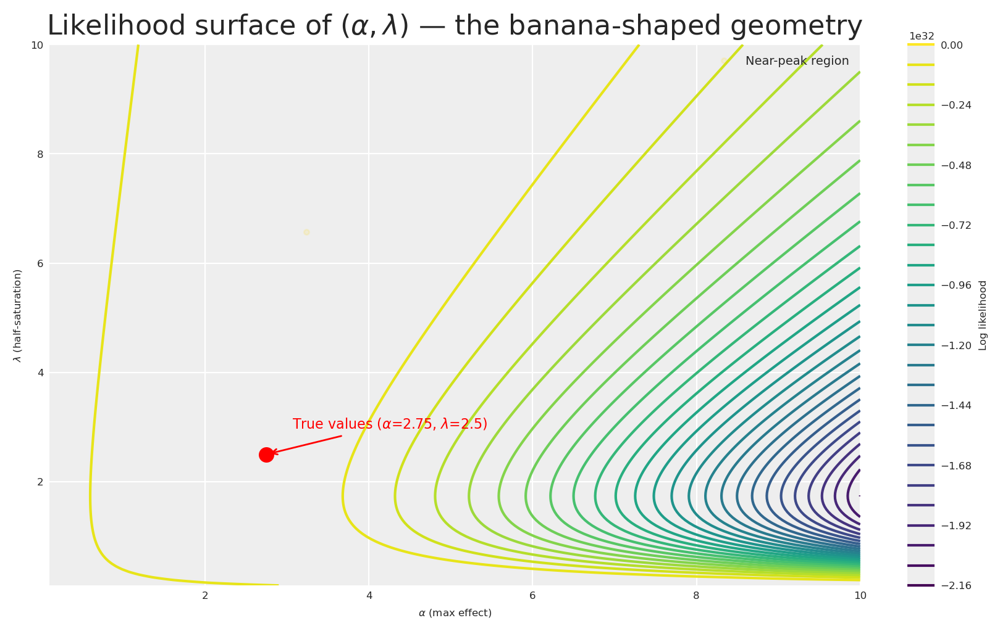
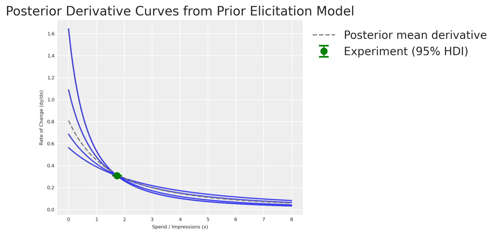
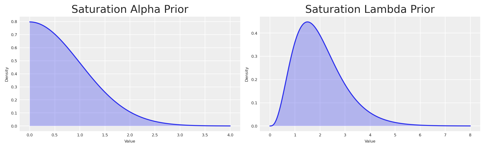
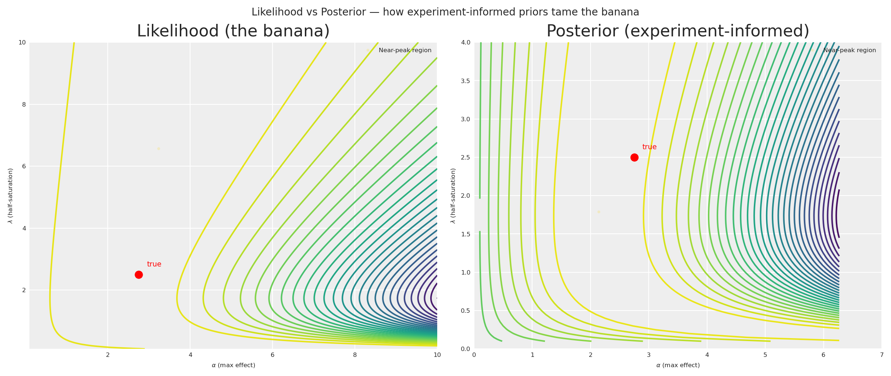

# Dos experimentos às priors: elicitar priors informativas para o seu marketing mix model

> Como traduzir resultados quase-experimentais em priors bayesianas informativas para o seu MMM utilizando CausalPy e PyMC-Marketing.

By Carlos Trujillo

Source: https://cetagostini.github.io/pt/articles/from_experiments_to_priors/from_experiments_to_priors.html

# Introduction

Se já trabalhou com Marketing Mix Models durante tempo suficiente, ouviu o termo *calibração* — a ideia de que os modelos por si só não bastam e que a evidência externa deve afiar as suas estimativas. No PyMC-Marketing, a calibração já tem um significado preciso: o método [`add_lift_test_measurements`](https://www.pymc-marketing.io/en/stable/notebooks/mmm/mmm_lift_test.html) adiciona observações experimentais diretamente à **verosimilhança do modelo**, tratando-as como dados adicionais que o modelo deve explicar durante a amostragem.

Mas existe outra forma de deixar os experimentos informar o seu modelo — uma que opera numa fase diferente da inferência bayesiana. Em vez de enriquecer a verosimilhança, podemos utilizar os resultados experimentais para **elicitar priors informativas** sobre os parâmetros de saturação (ver a nota abaixo para a distinção exata).

Antes de mergulharmos, vamos ancorar-nos no objetivo central de qualquer estratégia de medição de marketing: compreender o **impacto incremental** de campanhas e ações. A busca por essa resposta deu origem a cookies, pixels e um zoológico de identificadores a nível de utilizador na web. Agora, à medida que essas ferramentas desaparecem sob o reforço da regulamentação de privacidade, novos métodos estatísticos surgiram para preencher a lacuna.

O Marketing Mix Modeling, juntamente com experimentos aleatorizados e quase-experimentos, são os principais contendores. No entanto, medir como a publicidade molda as decisões humanas é inerentemente difícil. A metodologia que escolhe — e as condições sob as quais a aplica — pode conduzir a leituras muito diferentes da realidade.

**Como podemos alinhar modelos que medem diferentes facetas do mesmo fenómeno multifacetado?** Podemos consolidar o conhecimento prévio de experimentos numa única metodologia fundamentada?

Este artigo explora a **elicitação de prior a partir de experimentos** — um pipeline totalmente bayesiano que traduz evidência causal em priors informativas, propagando a incerteza de ponta a ponta. Utilizaremos a mais recente API multidimensional do MMM do [PyMC-Marketing](https://www.pymc-marketing.io) e o [CausalPy](https://causalpy.readthedocs.io) para a componente de inferência causal.

Elicitação de prior vs calibração da verosimilhança

O [`add_lift_test_measurements`](https://www.pymc-marketing.io/en/stable/notebooks/mmm/mmm_lift_test.html) do PyMC-Marketing incorpora a evidência experimental como um **termo de verosimilhança adicional** — o experimento torna-se um dado observado que o modelo deve explicar durante a amostragem. Isto é *calibração* no sentido estrito: as observações experimentais entram em P(\text{data} \mid \theta).

A abordagem deste artigo é diferente. Utilizamos o resultado experimental para **elicitar priors informativas** sobre os parâmetros de saturação. Um pequeno modelo bayesiano traduz a observação experimental num posterior completo sobre (\alpha, \lambda), que se torna então o prior para o MMM. O conhecimento experimental entra através de P(\theta).

Ambas as abordagens são válidas e complementares. A calibração da verosimilhança é poderosa quando se tem múltiplos lift tests e se pretende que eles constrinjam diretamente o modelo durante a inferência. A elicitação de prior é valiosa quando se pretende codificar o conhecimento experimental como crenças a priori — preservando a distinção entre o que se sabe antes de ver a série temporal e o que a própria série temporal ensina.

Este artigo guia-o através de:

- Configurar um quase-experimento de **Controlo Sintético** com o **CausalPy** para estimar um efeito causal específico.
- Traduzir o resultado experimental para o espaço das derivadas da nossa função de saturação.
- Construir um pequeno **modelo de elicitação de prior do PyMC** que transforma a observação experimental num posterior completo sobre os parâmetros de saturação.
- Utilizar o posterior de elicitação como priors informativas no **MMM multidimensional** do `pymc-marketing`.
- Comparar um modelo genérico (priors predefinidas) com o modelo informado por experimentos.

# Business case

*Imaginem isto*: a vossa empresa decide reduzir o orçamento de publicidade na **Venezuela** entre finais de março e inícios de maio. Como profissional de marketing, ficam a coçar a cabeça — isso prejudicou as vendas? Se sim, em quanto?

Antes de recorrer a técnicas complexas, vamos pensar em como *medir* esta ação específica. Podemos desvendar o mistério através do poder dos experimentos.

Embora o gasto tenha diminuído na **Venezuela**, a empresa manteve a sua publicidade habitual noutros países. Isto dá-nos uma oportunidade única de espreitar uma realidade alternativa — o que *teria* acontecido se o gasto não tivesse sido cortado?

Vamos escolher a **Colômbia** — um país onde a publicidade continuou inalterada durante o mesmo período — como nosso grupo de controlo. Porquê a Colômbia? A hipótese é que a Venezuela e a Colômbia estão expostas a fatores macroeconómicos semelhantes: ambas situam-se no norte da América do Sul, partilham climas semelhantes e populações culturalmente sobrepostas, e foram literalmente o mesmo país há menos de dois séculos. Podemos tratá-las como *representativamente semelhantes*.

\text{Venezuela Sales} = \text{Colombia Sales} \cdot \beta + \text{Venezuela Exogenous Variables}

Se assumirmos esta relação, obtemos a seguinte estrutura causal:

- Fatores partilhados (clima, sazonalidade, macrotendências) impulsionam as vendas de **ambos** os países.
- Variáveis exógenas específicas de cada país afetam apenas esse país.
- Durante a janela de tratamento, o investimento em media da Venezuela diminui — mas o da Colômbia não.

<figure class="figure">

<figcaption>Estrutura causal do quase-experimento</figcaption>
</figure>

Nota

Esta metodologia não se limita a países. Funciona igualmente bem para regiões ou cidades, desde que se tenham pressupostos consistentes suportados por dados. Além disso, a série temporal de controlo *não* deve ser afetada pela intervenção a medir. Não estamos a considerar efeitos de transbordamento aqui.

Ao comparar as duas realidades — Venezuela observada (tratamento) versus Venezuela contrafactual (estimada via Colômbia) — podemos medir diretamente o que se perdeu ao parar o marketing. E é precisamente este tipo de evidência que, quando traduzida em priors bayesianas informativas, torna o nosso Marketing Mix Model substancialmente mais preciso.

Hora de conhecer a sua ferramenta de eleição para este trabalho: o [CausalPy](https://causalpy.readthedocs.io/en/latest/).

O **CausalPy** é uma biblioteca do ecossistema PyMC concebida para facilitar análises de inferência causal. Utilizando o CausalPy podemos explorar diferentes métodos quase-experimentais para medir causalmente o efeito das nossas ações na ausência de experimentos naturais ou aleatorizados.

Vamos passar à ação.

# Getting started

Este notebook assume familiaridade com os fundamentos do PyMC-Marketing. Se é iniciante, o [notebook de exemplo de Marketing Mix Modeling](https://www.pymc-marketing.io/en/stable/notebooks/mmm/mmm_example.html) é um excelente ponto de partida. Antes de começar, certifique-se de que tem ambas as bibliotecas instaladas:

Comando de instalação

`pip install pymc-marketing causalpy`

- [Instruções de instalação do PyMC-Marketing](https://www.pymc-marketing.io/en/stable/installation.html)
- [Instruções de instalação do CausalPy](https://causalpy.readthedocs.io/en/latest/installation.html)

Começaremos por importar as bibliotecas necessárias para modelação bayesiana, inferência causal e visualização.

Código

``` sourceCode
import warnings
warnings.filterwarnings("ignore")

# Domain-specific / PyMC ecosystem
from pymc_marketing.mmm import GeometricAdstock, MichaelisMentenSaturation
from pymc_marketing.mmm.multidimensional import MMM
from pymc_extras.prior import Prior
import causalpy as cp
import pymc as pm
import arviz as az
import preliz as pz

# Visualization
import matplotlib.pyplot as plt
import seaborn as sns

# Scientific computing
import numpy as np
import pandas as pd
from scipy import stats as sp_stats

# PyTensor (automatic differentiation)
import pytensor
import pytensor.tensor as pt
from pytensor import function as pytensor_function

az.style.use("arviz-darkgrid")
plt.rcParams["figure.figsize"] = [8, 4]
plt.rcParams["figure.dpi"] = 100
plt.rcParams["axes.labelsize"] = 6
plt.rcParams["xtick.labelsize"] = 6
plt.rcParams["ytick.labelsize"] = 6
plt.rcParams.update({"figure.constrained_layout.use": True})

%load_ext autoreload
%autoreload 2
%config InlineBackend.figure_format = "retina"

seed: int = sum(map(ord, "calibrating mmm with experiments"))
rng: np.random.Generator = np.random.default_rng(seed=seed)
pd.DataFrame({"seed": [seed]}).head()
```

|     | seed |
|-----|------|
| 0   | 3223 |

# Understanding our dataset

Vamos construir um conjunto de dados sintético para que toda a análise seja autocontida e reproduzível. Os dados simulam um cenário de marketing realista com dois países e dois canais publicitários.

Os parâmetros de verdade fundamental que incorporamos no processo de geração de dados servirão mais tarde como o nosso benchmark para avaliar quão bem as priors informadas por experimentos recuperam a realidade.

Código

``` sourceCode
n_weeks: int = 150

min_date = pd.to_datetime("2021-01-01")
date_range = pd.date_range(start=min_date, periods=n_weeks, freq="W")

df = pd.DataFrame(data={"ds": date_range}).assign(
    year=lambda x: x["ds"].dt.year,
    week=lambda x: x["ds"].dt.isocalendar().week.astype(int),
)

n = df.shape[0]
pd.DataFrame({"n_observations": [n]}).head()
```

|     | n_observations |
|-----|----------------|
| 0   | 150            |

Agora vamos definir os **parâmetros verdadeiros** que governam a relação entre o investimento em media e as vendas. Utilizaremos a função de saturação de Michaelis-Menten:

f(x) = \frac{\alpha \cdot x}{\lambda + x}

onde:

- \alpha é o efeito máximo alcançável (a assíntota)
- \lambda é o ponto de meia-saturação (o nível de gasto ao qual atingimos metade do efeito máximo)

Código

``` sourceCode
# True saturation parameters
TRUE_ALPHA_META: float = 2.75
TRUE_LAM_META: float = 2.50
TRUE_ALPHA_GOOGLE: float = 2.00
TRUE_LAM_GOOGLE: float = 3.00

# True adstock parameter (geometric decay)
TRUE_ADSTOCK_ALPHA_META: float = 0.6
TRUE_ADSTOCK_ALPHA_GOOGLE: float = 0.4

# Intercept and scale
INTERCEPT: float = 3.0

# Reusable instances for the data-generation process
dgp_adstock = GeometricAdstock(l_max=4)
dgp_saturation = MichaelisMentenSaturation()
```

Vamos gerar o investimento em media para cada canal. Suavizamos as amostras brutas com uma convolução para obter padrões realistas de gasto semanal.

Código

``` sourceCode
SMOOTHING_WINDOW: int = 8

# Meta spend (with a treatment dip in Venezuela)
pz_meta_raw = pz.Gamma(mu=3, sigma=1).rvs(n, random_state=rng)
pz_meta_smooth = np.convolve(pz_meta_raw, np.ones(SMOOTHING_WINDOW) / SMOOTHING_WINDOW, mode="same")
pz_meta_smooth[:SMOOTHING_WINDOW] = pz_meta_smooth[SMOOTHING_WINDOW:2 * SMOOTHING_WINDOW].mean()
pz_meta_smooth[-SMOOTHING_WINDOW:] = pz_meta_smooth[-2 * SMOOTHING_WINDOW:-SMOOTHING_WINDOW].mean()

# Google spend (unchanged throughout)
pz_google_raw = pz.Gamma(mu=2, sigma=0.8).rvs(n, random_state=rng)
pz_google_smooth = np.convolve(pz_google_raw, np.ones(SMOOTHING_WINDOW) / SMOOTHING_WINDOW, mode="same")
pz_google_smooth[:SMOOTHING_WINDOW] = pz_google_smooth[SMOOTHING_WINDOW:2 * SMOOTHING_WINDOW].mean()
pz_google_smooth[-SMOOTHING_WINDOW:] = pz_google_smooth[-2 * SMOOTHING_WINDOW:-SMOOTHING_WINDOW].mean()

# Trend component
trend = np.linspace(0, 0.5, n)

# Seasonality component
seasonality = 0.3 * np.sin(2 * np.pi * np.arange(n) / 52)

# Shared base for both countries
shared_base = INTERCEPT + trend + seasonality

start_date = pd.to_datetime("2021-09-26")
end_date = pd.to_datetime("2021-11-28")

treatment_mask = (date_range >= start_date) & (date_range <= end_date)

# Venezuela meta spend: drops during treatment
meta_venezuela = pz_meta_smooth.copy()
meta_venezuela[treatment_mask] *= 0.1  # 90% reduction

# Apply adstock + saturation with TRUE parameters
meta_ve_adstocked = dgp_adstock.function(x=meta_venezuela, alpha=TRUE_ADSTOCK_ALPHA_META).eval()
meta_ve_saturated = dgp_saturation.function(x=meta_ve_adstocked, alpha=TRUE_ALPHA_META, lam=TRUE_LAM_META).eval()

google_adstocked = dgp_adstock.function(x=pz_google_smooth, alpha=TRUE_ADSTOCK_ALPHA_GOOGLE).eval()
google_saturated = dgp_saturation.function(x=google_adstocked, alpha=TRUE_ALPHA_GOOGLE, lam=TRUE_LAM_GOOGLE).eval()

# Colombia: same media but NO treatment reduction
meta_co_adstocked = dgp_adstock.function(x=pz_meta_smooth, alpha=TRUE_ADSTOCK_ALPHA_META).eval()
meta_co_saturated = dgp_saturation.function(x=meta_co_adstocked, alpha=TRUE_ALPHA_META * 0.9, lam=TRUE_LAM_META * 1.1).eval()

google_co_saturated = dgp_saturation.function(x=google_adstocked, alpha=TRUE_ALPHA_GOOGLE * 0.85, lam=TRUE_LAM_GOOGLE * 1.05).eval()

# Noise
noise_ve = pz.Normal(0, 0.15).rvs(n, random_state=rng)
noise_co = pz.Normal(0, 0.15).rvs(n, random_state=np.random.default_rng(seed + 1))

# Sales
venezuela_sales = shared_base + meta_ve_saturated + google_saturated + noise_ve
colombia_sales = shared_base * 1.05 + meta_co_saturated + google_co_saturated + noise_co

# Assemble the DataFrame
df = df.assign(
    venezuela=venezuela_sales,
    colombia=colombia_sales,
    meta=meta_venezuela,
    google=pz_google_smooth,
    trend=trend,
)
```

Agora a parte crítica: o investimento em media da Venezuela diminui durante a janela de tratamento, enquanto a publicidade da Colômbia continua inalterada. Precisamos de verificar que os dois países se comportam de forma suficientemente semelhante para justificar o nosso pressuposto contrafactual.

Código

``` sourceCode
fig, ax = plt.subplots(figsize=(12, 4))
sns.lineplot(x="ds", y="venezuela", data=df, ax=ax, label="Venezuela", color="C0")
sns.lineplot(x="ds", y="colombia", data=df, ax=ax, label="Colombia", color="C1")
ax.axvline(start_date, color="black", linestyle="--", alpha=0.7, label="Treatment start")
ax.axvline(end_date, color="black", linestyle="--", alpha=0.7, label="Treatment end")
ax.axvspan(start_date, end_date, alpha=0.1, color="red", label="Treatment period")
ax.set(title="Sales: Venezuela vs Colombia", xlabel="Date", ylabel="Sales")
ax.legend(loc="upper left", bbox_to_anchor=(1, 1))
plt.show()
```

<figure class="figure">
<p></p>
</figure>

Repare como as vendas da Venezuela e da Colômbia se movem em sincronia até pouco antes do período de intervenção (marcado pelas linhas verticais), onde a Venezuela parece diminuir enquanto a Colômbia continua a sua trajetória normal.

Nota

Este alinhamento visual valida a nossa hipótese de que ambos os países partilham fatores comuns. Se as duas séries fossem drasticamente diferentes antes do tratamento, não teríamos justificação para usar a Colômbia como contrafactual.

Podemos ver que *algo* aconteceu. Mas como é que o quantificamos?

# Estimating the causal effect with CausalPy

Vamos recorrer à classe `SyntheticControl` do `CausalPy`. A ideia é simples: construir uma *versão sintética* da Venezuela a partir da unidade de controlo (Colômbia), e depois comparar esse contrafactual sintético com o que realmente aconteceu. O hiato entre os dois é o nosso efeito causal.

A classe `SyntheticControl` requer:

- `data`: Um DataFrame indexado por data com colunas para cada unidade.
- `treatment_time`: A data em que o tratamento foi aplicado.
- `control_units`: Os nomes das colunas das unidades de controlo (dadoras).
- `treated_units`: Os nomes das colunas das unidades tratadas.
- `model`: Um modelo bayesiano de ponderação (ex., `WeightedSumFitter`).

Código

``` sourceCode
experiment = cp.SyntheticControl(
    df.query(f"ds<='{end_date}'").set_index("ds")[["venezuela", "colombia"]],
    start_date,
    control_units=["colombia"],
    treated_units=["venezuela"],
    model=cp.pymc_models.WeightedSumFitter(
        sample_kwargs={
            "random_seed": seed,
            "target_accept": 0.95,
            "draws": 250,
        }
    ),
)

fig, ax = experiment.plot()
plt.xticks(rotation=45, fontsize=8)
plt.show()
```

```
```

<figure class="figure">
<p></p>
</figure>

Vamos desmontar o que vemos nos três subgráficos:

1.  **Painel superior**: Vendas observadas da Venezuela versus o contrafactual sintético construído a partir da Colômbia. Antes da intervenção, o sintético acompanha de perto a realidade; após a intervenção, abre-se um visível hiato — a divergência entre o sintético e o observado.

2.  **Painel do meio**: O impacto causal pontual — a diferença entre o observado e o sintético em cada passo temporal. Próximo de zero antes da intervenção; distintamente negativo depois.

3.  **Painel inferior**: O impacto causal cumulativo — o total acumulado das diferenças pontuais ao longo do tempo.

Estas três perspetivas permitem-nos tanto *visualizar* como *quantificar* o impacto da nossa ação.

Para atribuir a mudança observada à nossa redução publicitária, devemos garantir que o modelo controla todos os fatores relevantes. Os nossos dados sintéticos foram concebidos com isto em mente (com base no DAG acima), mas em situações do mundo real é necessário incluir unidades dadoras adicionais e covariáveis que tenham em conta os fatores de confusão que possam surgir durante um experimento.

Princípio-chave

Se existir outra explicação plausível para a mudança, não podemos atribuí-la com confiança à nossa ação.

Leitura recomendada para validar o seu modelo causal antes do experimento:

1.  [Análise de poder bayesiana no CausalPy](https://github.com/pymc-labs/CausalPy/issues/276)
2.  [Teste A/A com PyMC](https://juanitorduz.github.io/time_based_regression_pymc/)

Temos o resultado do CausalPy. Agora precisamos de extrair o efeito cumulativo total — o delta total perdido devido à nossa ação — juntamente com a sua **incerteza**. Em vez de colapsar o posterior numa única média, mantemos a distribuição completa através das amostras MCMC e calculamos o Intervalo de Maior Densidade (HDI) de 95%.

Código

``` sourceCode
post_impact_unit = experiment.post_impact.isel(treated_units=0)
obs_dim = [d for d in post_impact_unit.dims if d not in ("chain", "draw")][0]

# Full posterior of total causal effect (sum of pointwise impacts per MCMC draw)
total_effect_per_draw = post_impact_unit.sum(dim=obs_dim)
total_effect_samples = total_effect_per_draw.values.flatten()

detected_effect = total_effect_samples.mean()
effect_hdi = az.hdi(total_effect_samples, hdi_prob=0.95)
detected_effect_lower, detected_effect_upper = effect_hdi

pd.DataFrame({
    "Detected cumulative effect (mean)": [round(detected_effect, 2)],
    "95% HDI lower": [round(detected_effect_lower, 2)],
    "95% HDI upper": [round(detected_effect_upper, 2)],
}).head()
```

|     | Detected cumulative effect (mean) | 95% HDI lower | 95% HDI upper |
|-----|-----------------------------------|---------------|---------------|
| 0   | -8.65                             | -8.65         | -8.65         |

Observámos uma diminuição nas vendas da Venezuela após a redução do investimento em media. Este declínio representa o *delta de contribuição perdida* das nossas atividades de marketing. Crucialmente, o HDI de 95% captura a incerteza nessa estimativa — e iremos transportar esta incerteza até às nossas distribuições prior.

Agora, esta variação nas vendas foi *causada* por uma variação no investimento publicitário. Para quantificar a mudança no gasto, comparamos o **gasto contrafactual** (o que teria sido gasto sem a intervenção) com o **gasto real** durante a janela de tratamento.

Código

``` sourceCode
# Counterfactual spend: average weekly meta spend before the intervention
pre_treatment_meta = df.loc[df["ds"] < start_date, "meta"]
counterfactual_spend_per_week = pre_treatment_meta.mean()

# Actual spend during the treatment (already reduced by ~90%)
treatment_meta = df.loc[treatment_mask, "meta"]
actual_spend_per_week = treatment_meta.mean()

n_treatment_weeks = int(treatment_mask.sum())

# Total spend reduction over the treatment window
total_delta_spend = (counterfactual_spend_per_week - actual_spend_per_week) * n_treatment_weeks

pd.DataFrame({
    "Counterfactual spend/week": [round(counterfactual_spend_per_week, 4)],
    "Actual spend/week": [round(actual_spend_per_week, 4)],
    "Treatment weeks": [n_treatment_weeks],
    "Total spend reduction": [round(total_delta_spend, 4)],
}).head()
```

|  | Counterfactual spend/week | Actual spend/week | Treatment weeks | Total spend reduction |
|----|----|----|----|----|
| 0 | 3.1395 | 0.3319 | 10 | 28.076 |

A redução total de gasto durante a janela de tratamento, juntamente com o impacto cumulativo nas vendas, dá-nos um par correspondente de deltas.

Pressuposto: gasto contrafactual estacionário

O gasto contrafactual é estimado como a média pré-tratamento do investimento em media. Isto assume que o gasto era aproximadamente estacionário antes da intervenção — ou seja, não existia tendência no investimento em media. Se o gasto estava a aumentar ou diminuir antes do tratamento, a média pré-tratamento subestimaria ou sobrestimaria o verdadeiro contrafactual, enviesando o cálculo de \Delta X. Na prática, inspecione a série de gasto para tendências e considere utilizar uma previsão ajustada à tendência, se necessário.

Importante

A redução total de gasto (\Delta X) e o impacto total nas vendas (\Delta Y) formam um único par de coordenadas no espaço das derivadas da nossa função de saturação: a coordenada x é o ponto médio entre os níveis de gasto contrafactual e real, e a coordenada y é a taxa média de mudança \Delta Y / \Delta X.

Isto é excelente. Com um único experimento temos uma estimativa concreta do impacto incremental. Mas um único evento num momento específico não captura o comportamento *ao longo do tempo*. O timing da nossa análise influencia os resultados.

*É precisamente por isto que precisamos de um Marketing Mix Model* — um quadro metodológico que nos permite compreender os efeitos incrementais ao longo de vários períodos. Os experimentos dão-nos uma âncora de prior; o MMM dá-nos a imagem dinâmica completa.

# From experiment to saturation priors

Para ir de uma única observação experimental a uma curva de saturação completa, precisamos de compreender a relação entre as nossas variáveis.

O nosso pressuposto: os efeitos de marketing saturam seguindo a equação de **Michaelis-Menten**, e o carryover segue um **decaimento geométrico**. Sob este pressuposto, o ponto de dados experimental — a mudança em Y dada uma mudança em X — vive algures na derivada da nossa função de saturação.

f(x) = \frac{\alpha \cdot x}{\lambda + x}

A derivada em relação a x:

f'(x) = \frac{\alpha \cdot \lambda}{(\lambda + x)^2}

Esta derivada diz-nos a *taxa de mudança* no eixo Y para um dado valor em X.

Uma vez que `MichaelisMentenSaturation.function()` é construída a partir de operações PyTensor padrão, podemos utilizar a **diferenciação automática** (`pt.grad`) para calcular a derivada — sem necessidade de fórmula manual. Envolve-mo-la numa única função `saturation_derivative` que funciona em dois contextos: passe um `pt.dvector` e compile-a para avaliação numérica rápida (gráficos), ou passe um valor `pytensor.shared` juntamente com variáveis aleatórias do PyMC e utilize-a diretamente dentro de um modelo. Se trocar a função de saturação, todas as computações a jusante atualizam-se automaticamente.

``` sourceCode
sat = MichaelisMentenSaturation()


def saturation_derivative(x, alpha, lam):
    """Auto-diff derivative of the saturation function.

    x can be a pt.dvector (plotting), or a pytensor.shared (PyMC models).
    alpha, lam can be symbolic variables or PyMC random variables.
    """
    f = sat.function(x, alpha, lam)
    return pt.grad(f.sum(), x)


# Compiled function for numerical evaluation (plotting)
_x_v = pt.dvector("x")
_alpha_s = pt.dscalar("alpha")
_lam_s = pt.dscalar("lam")

derivative_michaelis_menten = pytensor_function(
    [_x_v, _alpha_s, _lam_s],
    saturation_derivative(_x_v, _alpha_s, _lam_s),
)

x_test = np.array([0.5, 1.0, 2.0, 4.0])
derivs = derivative_michaelis_menten(x_test, 2.75, 2.50)
pd.DataFrame({"x": x_test, "f'(x)": np.round(derivs, 4)}).head()
```

|     | x   | f'(x)  |
|-----|-----|--------|
| 0   | 0.5 | 0.7639 |
| 1   | 1.0 | 0.5612 |
| 2   | 2.0 | 0.3395 |
| 3   | 4.0 | 0.1627 |

Temos o total de vendas perdidas e o total de gasto perdido durante a janela de tratamento. Para colocar o nosso experimento no espaço das derivadas, calculamos a **taxa média de mudança** — impacto total nas vendas dividido pela redução total de gasto — e avaliamo-la no **ponto médio** entre os níveis de gasto contrafactual e real.

Nuança teórica: Secante vs Tangente

Isto é uma aproximação baseada no Teorema do Valor Médio. Uma vez que a curva de Michaelis-Menten é côncava, a inclinação da linha secante (taxa média de mudança ao longo da queda de gasto) é apenas uma aproximação da linha tangente instantânea (f'(x)) no ponto médio exato. Adicionalmente, medir quedas de vendas ao longo de uma janela temporal fixa significa que podemos não capturar a queda total em regime estacionário se os efeitos de adstock (carryover) forem duradouros. Para os nossos propósitos, serve como uma excelente âncora, mas é importante reconhecer a mecânica subjacente.

Gasto bruto vs gasto com adstock

O \Delta X experimental é calculado a partir do investimento em media **bruto**, mas a função de saturação do MMM opera sobre o investimento **com adstock** — o sinal após o decaimento geométrico ter sido aplicado. Isto significa que o sistema de coordenadas da nossa observação experimental (unidades de gasto bruto) não se alinha perfeitamente com o sistema de coordenadas da curva de saturação (unidades de gasto com adstock).

Esta aproximação é mais sustentável quando o efeito de adstock é moderado (parâmetro de decaimento \alpha baixo), porque o sinal com adstock permanece próximo do sinal bruto. Sob adstock pesado (\alpha elevado, l\_{\text{max}} longo), a transformação pode comprimir e deslocar significativamente a distribuição de gasto, tornando o ponto médio de gasto bruto uma âncora menos precisa. A abordagem permanece direcionalmente válida — o experimento ainda fornece informação causal genuína sobre o regime de saturação — mas os profissionais devem estar cientes de que o alinhamento se degrada à medida que os efeitos de carryover se tornam mais fortes.

Código

``` sourceCode
# Full posterior of rate of change
rate_of_change_samples = np.abs(total_effect_samples) / total_delta_spend
average_rate_of_change = rate_of_change_samples.mean()
rate_of_change_std = rate_of_change_samples.std()

# HDI directly from the rate-of-change posterior
rate_hdi = az.hdi(rate_of_change_samples, hdi_prob=0.95)
rate_of_change_lower, rate_of_change_upper = rate_hdi

# Midpoint of the two spend levels (counterfactual vs actual)
x_midpoint = (counterfactual_spend_per_week + actual_spend_per_week) / 2

pd.DataFrame({
    "Average rate of change (dy/dx)": [round(average_rate_of_change, 4)],
    "Std": [round(rate_of_change_std, 4)],
    "95% HDI lower": [round(rate_of_change_lower, 4)],
    "95% HDI upper": [round(rate_of_change_upper, 4)],
    "X midpoint": [round(x_midpoint, 4)],
}).head()

fig, ax = plt.subplots()
yerr_low = max(0, average_rate_of_change - rate_of_change_lower)
yerr_high = max(0, rate_of_change_upper - average_rate_of_change)
ax.errorbar(
    x_midpoint, average_rate_of_change,
    yerr=[[yerr_low], [yerr_high]],
    fmt="o", color="green", capsize=6, capthick=2, markersize=10, zorder=5,
    label="Experiment (95% HDI)",
)
ax.set(
    xlabel="Spend / Impressions (x)",
    ylabel="Rate of Change (dy/dx)",
    title="Experiment coordinates in derivative space",
)
ax.legend(loc="upper left", bbox_to_anchor=(1, 1))
plt.show()
```

<figure class="figure">
<p></p>
</figure>

Agora que temos a nossa observação experimental no espaço das derivadas, podemos estimar os **parâmetros de saturação** \alpha e \lambda que são consistentes com esta evidência.

O problema da identificação

Matematicamente, um único ponto no espaço das derivadas não pode identificar de forma única uma curva de dois parâmetros (\alpha e \lambda). Existe uma família infinita de curvas que podem passar por esta taxa de exata de mudança neste nível de gasto exato. Um otimizador por pontos devolveria apenas *uma* delas e descartaria toda essa degenerescência. Ao utilizar um modelo bayesiano em vez disso, o posterior captura naturalmente toda a paisagem de combinações plausíveis de (\alpha, \lambda) — incluindo a correlação entre elas. É precisamente por isto que ajustamos aqui um pequeno modelo PyMC em vez de utilizar um otimizador por pontos.

Construímos um pequeno modelo PyMC cuja verosimilhança corresponde à nossa observação experimental. Os priors são half-normals fracamente informativos — positivos mas agnósticos — pelo que a observação experimental conduz o posterior. O modelo diz: *“a derivada de Michaelis-Menten no nosso ponto médio de gasto, avaliada com \alpha e \lambda desconhecidos, deverá produzir a taxa de mudança que observámos, com ruído igual ao desvio padrão experimental.”*

Código

``` sourceCode
x_range = np.linspace(0, 8, 200)

with pm.Model() as prior_elicitation_model:
    cal_alpha = pm.HalfNormal("cal_alpha", sigma=3)
    cal_lam = pm.HalfNormal("cal_lam", sigma=3)

    x_pt = pytensor.shared(np.float64(x_midpoint), name="x_eval")
    predicted_rate = saturation_derivative(x_pt, cal_alpha, cal_lam)

    pm.Normal(
        "obs",
        mu=predicted_rate,
        sigma=rate_of_change_std,
        observed=average_rate_of_change,
    )

    elicitation_idata = pm.sample(
        draws=250,
        random_seed=seed,
        target_accept=0.95,
    )

elic_alpha_posterior = elicitation_idata.posterior["cal_alpha"].values.flatten()
elic_lam_posterior = elicitation_idata.posterior["cal_lam"].values.flatten()
```

```
```

Como esperado do problema da identificação acima, o posterior conjunta de (\alpha, \lambda) apresenta uma forte correlação. Para expor esta geometria de forma clara, emprestamos uma técnica do excelente [Geometric Intuition for Media Mix Models](https://daniel-saunders-phil.github.io/imagination_machine/posts/geometric-intuition-mmm/index.html) de Daniel Saunders: avaliamos a log-verosimilhança numa grelha 2D e traçamos linhas de contorno — revelando a superfície característica em **forma de banana**.

Código

``` sourceCode
alphas_grid = np.linspace(0.1, 10, 200)
lams_grid = np.linspace(0.1, 10, 200)
A_grid, L_grid = np.meshgrid(alphas_grid, lams_grid)

deriv_on_grid = (A_grid * L_grid) / (L_grid + x_midpoint) ** 2

log_lik_surface = sp_stats.norm(
    loc=deriv_on_grid, scale=rate_of_change_std
).logpdf(average_rate_of_change)

lik_peak = np.nanmax(log_lik_surface)
near_lik_mask = log_lik_surface >= lik_peak - 1.5
a_near_lik = A_grid[near_lik_mask]
l_near_lik = L_grid[near_lik_mask]

fig, ax = plt.subplots(figsize=(8, 5))
contour = ax.contour(A_grid, L_grid, log_lik_surface, levels=30)
ax.plot(
    a_near_lik, l_near_lik, "o",
    color="gold", alpha=0.12, markersize=3,
    label="Near-peak region",
)
ax.plot(TRUE_ALPHA_META, TRUE_LAM_META, "o", color="red", markersize=8, zorder=10)
ax.annotate(
    rf"True values ($\alpha$={TRUE_ALPHA_META}, $\lambda$={TRUE_LAM_META})",
    (TRUE_ALPHA_META, TRUE_LAM_META),
    xytext=(15, 15), textcoords="offset points", fontsize=8,
    arrowprops=dict(arrowstyle="->", color="red"), color="red",
)
plt.colorbar(contour, ax=ax, label="Log likelihood")
ax.set(
    xlabel=r"$\alpha$ (max effect)",
    ylabel=r"$\lambda$ (half-saturation)",
    title=r"Likelihood surface of $(\alpha, \lambda)$ — the banana-shaped geometry",
)
ax.legend(loc="upper right", fontsize=7)
plt.show()
```

<figure class="figure">
<p></p>
</figure>

O gráfico de contornos revela a geometria característica em forma de banana que Daniel Saunders [descreve tão bem](https://daniel-saunders-phil.github.io/imagination_machine/posts/geometric-intuition-mmm/index.html): existe uma região estendida de verosimilhança quase equivalente onde \alpha elevado emparelhado com \lambda elevado produz uma derivada semelhante a \alpha baixo emparelhado com \lambda baixo. Os marcadores dourados destacam um largo corredor de combinações plausíveis de parâmetros que os dados por si só não conseguem distinguir.

Esta é precisamente a intuição que Daniel [enfatiza](https://daniel-saunders-phil.github.io/imagination_machine/posts/geometric-intuition-mmm/index.html): não é a *quantidade* de dados que resolve a banana, mas quão bem os dados estão *distribuídos ao longo da curva de saturação*. Um único experimento num nível de gasto deixa-nos com esta longa crista de soluções quase equivalentes. Priors suaves e informadas são o que cortam as caudas implausíveis — vamos construí-las.

Vamos agora visualizar a distribuição a posteriori das curvas de derivada contra a observação experimental!

Código

``` sourceCode
fig, ax = plt.subplots()

# Posterior fan: sample 200 curves from the joint posterior
n_curves = 200
idx = rng.choice(len(elic_alpha_posterior), n_curves, replace=False)
for i in idx:
    y_curve = derivative_michaelis_menten(x_range, elic_alpha_posterior[i], elic_lam_posterior[i])
    ax.plot(x_range, y_curve, color="C0", alpha=0.03)

# Posterior mean curve
mean_curve = derivative_michaelis_menten(
    x_range, elic_alpha_posterior.mean(), elic_lam_posterior.mean()
)
ax.plot(x_range, mean_curve, label="Posterior mean derivative", color="grey", linestyle="--")

ax.errorbar(
    x_midpoint, average_rate_of_change,
    yerr=[[yerr_low], [yerr_high]],
    fmt="o", color="green", capsize=6, capthick=2, markersize=8, zorder=5,
    label="Experiment (95% HDI)",
)
ax.set(
    xlabel="Spend / Impressions (x)",
    ylabel="Rate of Change (dy/dx)",
    title="Posterior Derivative Curves from Prior Elicitation Model",
)
ax.legend(loc="upper left", bbox_to_anchor=(1, 1))
plt.show()
```

<figure class="figure">
<p></p>
</figure>

Com o posterior de elicitação em mãos, vamos alimentar este conhecimento no nosso MMM.

# The generic MMM

Primeiro, vejamos o que acontece quando construímos um modelo com **priors predefinidas** — sem conhecimento experimental injetado. Esta é a nossa linha de base: a abordagem ingénua.

``` sourceCode
X = df[["ds", "meta", "google", "trend"]].copy()
y = df["venezuela"].copy()
```

Criamos o modelo utilizando a classe **MMM multidimensional** do `pymc-marketing`. Embora tenhamos aqui um único mercado (sem parâmetro `dims`), a classe de `pymc_marketing.mmm.multidimensional` é o ponto de entrada unificado para todos os modelos MMM.

``` sourceCode
adstock_generic = GeometricAdstock(
    priors={"alpha": Prior("Beta", alpha=2, beta=5, dims="channel")},
    l_max=4,
)

saturation_generic = MichaelisMentenSaturation(
    priors={
        "alpha": Prior("HalfNormal", sigma=1, dims="channel"),
        "lam": Prior("Gamma", mu=2, sigma=1, dims="channel"),
    },
)

generic_mmm = MMM(
    date_column="ds",
    target_column="venezuela",
    channel_columns=["meta", "google"],
    control_columns=["trend"],
    adstock=adstock_generic,
    saturation=saturation_generic,
    yearly_seasonality=4,
)
```

Vamos examinar as priors predefinidas e visualizá-las com o PreliZ.

Código

``` sourceCode
prior_alpha = pz.HalfNormal(sigma=1)
prior_lam = pz.Gamma(mu=2, sigma=1)

fig, axes = plt.subplots(nrows=1, ncols=2, figsize=(10, 3))

# Plot Alpha Prior manually
x_alpha = np.linspace(0, 4, 1000)
y_alpha = prior_alpha.pdf(x_alpha)
axes[0].plot(x_alpha, y_alpha)
axes[0].fill_between(x_alpha, y_alpha, alpha=0.3)
axes[0].set(title="Saturation Alpha Prior", xlabel="Value", ylabel="Density")

# Plot Lambda Prior manually
x_lam = np.linspace(0, 8, 1000)
y_lam = prior_lam.pdf(x_lam)
axes[1].plot(x_lam, y_lam)
axes[1].fill_between(x_lam, y_lam, alpha=0.3)
axes[1].set(title="Saturation Lambda Prior", xlabel="Value", ylabel="Density")

plt.show()
```

<figure class="figure">
<p></p>
</figure>

Nota

Ao utilizar priors Gamma e HalfNormal impomos estrutura — constrangendo estes parâmetros a serem positivos. Mas as distribuições são bastante largas. Vejamos como as suas médias se comparam com o nosso experimento.

Amostramos do prior e visualizamos a derivada da função de Michaelis-Menten implícita nesses priors predefinidos.

Código

``` sourceCode
generic_mmm.build_model(X, y)

with generic_mmm.model:
    prior_predictive = pm.sample_prior_predictive(
        random_seed=seed,
        var_names=["saturation_alpha", "saturation_lam"],
    )

prior_alpha_mean = prior_predictive.prior["saturation_alpha"].mean().item()
prior_lambda_mean = prior_predictive.prior["saturation_lam"].mean().item()

x_values = np.linspace(0, 8, 500)
prior_mm_mean_derivative = derivative_michaelis_menten(
    x_values,
    prior_alpha_mean * df.venezuela.max(),
    prior_lambda_mean * df.meta.max(),
)

fig, ax = plt.subplots(figsize=(12, 4))
ax.plot(
    x_values, prior_mm_mean_derivative,
    color="C0", label="Default prior mean derivative", linestyle="--",
)
ax.scatter(
    x_midpoint, abs(average_rate_of_change),
    color="green", label="Experiment", s=100, zorder=5,
)
ax.set(
    xlabel="Spend / Impressions (x)",
    ylabel="Rate of Change (dy/dx)",
    title="Prior Derivative of Michaelis-Menten (Default Priors)",
)
ax.legend(loc="upper left", bbox_to_anchor=(1, 1))
plt.show()
```

<figure class="figure">
<p></p>
</figure>

Como esperado, a derivada do prior predefinido está **longe do nosso experimento**. O modelo não tem conhecimento do comportamento real de saturação — está a trabalhar com uma estimativa vaga e desinformada. Esta é a nossa motivação para elicitar priors informadas por experimentos.

# The experiment-informed MMM

Agora vamos transformar o posterior de elicitação em priors informativas para o MMM. O PyMC-Marketing escala internamente os dados utilizando Max Abs Scaler. Isto significa que os valores são divididos pelo seu máximo. Uma vez que \alpha vive no eixo Y (vendas) e \lambda no eixo X (gasto), escalamos todo o posterior em conformidade, e depois extraímos o HDI de 95% como os limites para `find_constrained_prior`.

Código

``` sourceCode
y_max = df.venezuela.max()
x_max = df.meta.max()

# Scale the full posterior
scaled_alpha_samples = elic_alpha_posterior / y_max
scaled_lam_samples = elic_lam_posterior / x_max

# HDI of the scaled posteriors
scaled_alpha_hdi = az.hdi(scaled_alpha_samples, hdi_prob=0.95)
scaled_lam_hdi = az.hdi(scaled_lam_samples, hdi_prob=0.95)

scaled_alpha_lower, scaled_alpha_upper = scaled_alpha_hdi
scaled_lam_lower, scaled_lam_upper = scaled_lam_hdi

pd.DataFrame({
    "Parameter": ["alpha (scaled)", "lambda (scaled)"],
    "Mean": [round(scaled_alpha_samples.mean(), 4), round(scaled_lam_samples.mean(), 4)],
    "95% HDI lower": [round(scaled_alpha_lower, 4), round(scaled_lam_lower, 4)],
    "95% HDI upper": [round(scaled_alpha_upper, 4), round(scaled_lam_upper, 4)],
}).head()
```

|     | Parameter       | Mean   | 95% HDI lower | 95% HDI upper |
|-----|-----------------|--------|---------------|---------------|
| 0   | alpha (scaled)  | 0.3779 | 0.3409        | 0.4409        |
| 1   | lambda (scaled) | 0.7252 | 0.3269        | 1.2171        |

Os valores do posterior escalados caem dentro de \[0, 1\], tornando a distribuição Beta uma escolha natural. Utilizamos o `find_constrained_prior` do PyMC para identificar parâmetros Beta que concentram 95% da sua massa dentro do HDI do posterior de elicitação.

Posterior como prior: um pipeline totalmente bayesiano

Os limites que passamos ao `find_constrained_prior` vêm diretamente do **posterior** do modelo de elicitação, que já capturou o ruído experimental e a correlação estrutural entre \alpha e \lambda. Cada fonte de incerteza flui naturalmente de experimento → modelo de elicitação → prior do MMM.

Código

``` sourceCode
alpha_custom_prior = pm.find_constrained_prior(
    pm.Beta,
    lower=max(scaled_alpha_lower, 0.01),
    upper=min(scaled_alpha_upper, 0.99),
    mass=0.95,
    init_guess={"alpha": 2, "beta": 2},
)

lam_custom_prior = pm.find_constrained_prior(
    pm.Beta,
    lower=max(scaled_lam_lower, 0.01),
    upper=min(scaled_lam_upper, 0.99),
    mass=0.95,
    init_guess={"alpha": 3, "beta": 3},
)

pd.DataFrame({
    "Parameter": ["saturation_alpha", "saturation_lam"],
    "Beta alpha": [round(alpha_custom_prior["alpha"], 4), round(lam_custom_prior["alpha"], 4)],
    "Beta beta": [round(alpha_custom_prior["beta"], 4), round(lam_custom_prior["beta"], 4)],
}).head()
```

|     | Parameter        | Beta alpha | Beta beta |
|-----|------------------|------------|-----------|
| 0   | saturation_alpha | 144.7220   | 223.4610  |
| 1   | saturation_lam   | 4.0365     | 2.2068    |

Vamos verificar se as distribuições Beta ajustadas reproduzem fielmente o posterior de elicitação. Sobrepomos o PDF da Beta a um histograma das amostras do posterior escaladas — se os dois concordarmos, podemos confiar que a transferência de informação do experimento para o prior do MMM é fiel.

Código

``` sourceCode
custom_prior_alpha_dist = pz.Beta(**alpha_custom_prior)
custom_prior_lam_dist = pz.Beta(**lam_custom_prior)

fig, axes = plt.subplots(nrows=1, ncols=2, figsize=(10, 3))
x_beta = np.linspace(0, 1, 1000)

axes[0].hist(scaled_alpha_samples, bins=60, density=True, alpha=0.4, color="C0", label="Elicitation posterior")
axes[0].plot(x_beta, custom_prior_alpha_dist.pdf(x_beta), color="C1", lw=2, label="Fitted Beta prior")
axes[0].set(title=r"Saturation $\alpha$ (scaled)", xlabel="Value", ylabel="Density")
axes[0].legend(fontsize=7)

axes[1].hist(scaled_lam_samples, bins=60, density=True, alpha=0.4, color="C0", label="Elicitation posterior")
axes[1].plot(x_beta, custom_prior_lam_dist.pdf(x_beta), color="C1", lw=2, label="Fitted Beta prior")
axes[1].set(title=r"Saturation $\lambda$ (scaled)", xlabel="Value", ylabel="Density")
axes[1].legend(fontsize=7)

plt.show()
```

<figure class="figure">
<p></p>
</figure>

Vamos colocar as distribuições predefinidas e personalizadas lado a lado, na escala original, com os valores reais marcados como linhas verticais.

Código

``` sourceCode
n_samples = 500

# Default priors (original scale)
default_alpha_samples = prior_alpha.rvs(n_samples) * df.venezuela.max()
default_lam_samples = prior_lam.rvs(n_samples) * df.meta.max()

# Custom priors (original scale)
custom_alpha_samples = custom_prior_alpha_dist.rvs(n_samples) * df.venezuela.max()
custom_lam_samples = custom_prior_lam_dist.rvs(n_samples) * df.meta.max()

fig, axes = plt.subplots(nrows=2, ncols=2, figsize=(12, 5), sharex=True, sharey=True)

sns.violinplot(data=default_alpha_samples, color="C0", orient="h", ax=axes[0, 0])
sns.violinplot(data=default_lam_samples, color="C0", orient="h", ax=axes[0, 1])
sns.violinplot(data=custom_alpha_samples, color="C3", orient="h", ax=axes[1, 0])
sns.violinplot(data=custom_lam_samples, color="C3", orient="h", ax=axes[1, 1])

# True values
axes[0, 0].axvline(TRUE_ALPHA_META, color="black", linestyle="--")
axes[0, 1].axvline(TRUE_LAM_META, color="black", linestyle="--")
axes[1, 0].axvline(TRUE_ALPHA_META, color="black", linestyle="--")
axes[1, 1].axvline(TRUE_LAM_META, color="black", linestyle="--")

axes[0, 0].set(title="Alpha Prior (Original Scale)", ylabel="Default")
axes[0, 1].set(title="Lambda Prior (Original Scale)")
axes[1, 0].set(xlabel="Prior value", ylabel="Custom")
axes[1, 1].set(xlabel="Prior value")

fig.suptitle("Default vs Custom Priors — Dashed line = True Value", fontsize=12)
plt.show()
```

<figure class="figure">
<p></p>
</figure>

As distribuições personalizadas estão dramaticamente mais concentradas em torno dos valores reais. Mesmo com um único experimento, ganhámos informação substancial.

Passamos os priors personalizados para os objetos de transformação. Repare como definimos um prior apertado, informado por experimentos, para o **media** (o canal no qual experimentámos) enquanto mantemos um prior mais amplo para o **google** (sem evidência experimental ainda).

``` sourceCode
adstock_informed = GeometricAdstock(
    priors={"alpha": Prior("Beta", alpha=2, beta=5, dims="channel")},
    l_max=4,
)

saturation_informed = MichaelisMentenSaturation(
    priors={
        "alpha": Prior(
            "Beta",
            alpha=np.array([alpha_custom_prior["alpha"], 1.8]),
            beta=np.array([alpha_custom_prior["beta"], 2.0]),
            dims="channel",
        ),
        "lam": Prior(
            "Beta",
            alpha=np.array([lam_custom_prior["alpha"], 1.8]),
            beta=np.array([lam_custom_prior["beta"], 2.0]),
            dims="channel",
        ),
    },
)

informed_mmm = MMM(
    date_column="ds",
    target_column="venezuela",
    channel_columns=["meta", "google"],
    control_columns=["trend"],
    adstock=adstock_informed,
    saturation=saturation_informed,
    yearly_seasonality=4,
)
```

Vamos visualizar a derivada da função de Michaelis-Menten para ambos os priors, predefinido e personalizado, juntamente com a observação experimental.

Código

``` sourceCode
informed_mmm.build_model(X, y)

with informed_mmm.model:
    custom_prior_predictive = pm.sample_prior_predictive(
        random_seed=seed,
        var_names=["saturation_alpha", "saturation_lam"],
    )

custom_prior_alpha_mean = custom_prior_predictive.prior["saturation_alpha"].mean().item()
custom_prior_lambda_mean = custom_prior_predictive.prior["saturation_lam"].mean().item()

custom_prior_mm_mean_derivative = derivative_michaelis_menten(
    x_values,
    custom_prior_alpha_mean * df.venezuela.max(),
    custom_prior_lambda_mean * df.meta.max(),
)

fig, ax = plt.subplots(figsize=(12, 4))
ax.plot(
    x_values, custom_prior_mm_mean_derivative,
    color="purple", label="Custom prior mean derivative", linestyle="--",
)
ax.plot(
    x_values, prior_mm_mean_derivative,
    color="C0", label="Default prior mean derivative", linestyle="--",
)
ax.scatter(
    x_midpoint, abs(average_rate_of_change),
    color="black", label="Experiment", s=100, zorder=5,
)
ax.set(
    xlabel="Spend / Impressions (x)",
    ylabel="Rate of Change (dy/dx)",
    title="Prior Derivative: Default vs Custom vs Experiment",
)
ax.legend(loc="upper left", bbox_to_anchor=(1, 1))
plt.show()
```

<figure class="figure">
<p></p>
</figure>

Como esperado, a derivada do prior personalizado está **muito mais próxima** da nossa observação experimental. O modelo entra agora na amostragem MCMC com um ponto de partida forte, baseado em evidência.

Com os priors em vigor, vamos ajustar o modelo.

Código

``` sourceCode
fit_kwargs = dict(
    draws=250,
    target_accept=0.95,
    chains=4,
    random_seed=rng,
)

idata = informed_mmm.fit(X=X, y=y, **fit_kwargs)
```

```
```

```
```

Código

``` sourceCode
summary = az.summary(
    idata,
    var_names=["saturation_lam", "saturation_alpha"],
    round_to=2,
)
summary.head(10)
```

|  | mean | sd | hdi_3% | hdi_97% | mcse_mean | mcse_sd | ess_bulk | ess_tail | r_hat |
|----|----|----|----|----|----|----|----|----|----|
| saturation_lam\[google\] | 0.65 | 0.18 | 0.33 | 0.95 | 0.01 | 0.0 | 581.68 | 480.26 | 1.01 |
| saturation_lam\[meta\] | 0.67 | 0.15 | 0.41 | 0.94 | 0.01 | 0.0 | 465.20 | 487.24 | 1.01 |
| saturation_alpha\[google\] | 0.39 | 0.02 | 0.34 | 0.43 | 0.00 | 0.0 | 784.39 | 820.47 | 1.00 |
| saturation_alpha\[meta\] | 0.45 | 0.04 | 0.39 | 0.52 | 0.00 | 0.0 | 523.37 | 603.93 | 1.01 |

Vamos comparar as estimativas a posteriori com os valores **verdadeiros** que incorporámos no DGP.

Código

``` sourceCode
posterior_alpha_meta = (
    informed_mmm.idata.posterior["saturation_alpha"]
    .sel(channel="meta")
    .mean()
    .item() * df.venezuela.max()
)
posterior_lam_meta = (
    informed_mmm.idata.posterior["saturation_lam"]
    .sel(channel="meta")
    .mean()
    .item() * df.meta.max()
)

pd.DataFrame({
    "Parameter": ["alpha (meta)", "lambda (meta)"],
    "Posterior mean": [round(posterior_alpha_meta, 2), round(posterior_lam_meta, 2)],
    "True value": [TRUE_ALPHA_META, TRUE_LAM_META],
}).head()
```

|     | Parameter     | Posterior mean | True value |
|-----|---------------|----------------|------------|
| 0   | alpha (meta)  | 2.85           | 2.75       |
| 1   | lambda (meta) | 2.73           | 2.50       |

O modelo informado por experimentos recupera valores de parâmetros muito mais próximos da verdade fundamental para o media — o canal no qual realizámos o experimento. Para o google, o prior mais amplo significa que o modelo depende mais dos dados para aprender os parâmetros, o que é exatamente o comportamento pretendido.

Finalmente, vamos verificar o ajuste do modelo com uma verificação preditiva a posteriori.

Código

``` sourceCode
informed_mmm.sample_posterior_predictive(X=X, extend_idata=True, random_seed=seed)
informed_mmm.plot.posterior_predictive()
plt.show()
```

```
```

<figure class="figure">
<p></p>
</figure>

## The banana, tamed

Começámos com uma superfície de verosimilhança em forma de banana — um longo corredor de combinações de parâmetros que o experimento sozinho não conseguia distinguir. Agora que o pipeline completo está em vigor (experimento → elicitação → priors Beta → MMM), voltemos a essa superfície e vejamos o que os priors informados nos trazem.

Seguindo a abordagem de decomposição na [adaptação interativa Marimo](https://github.com/williambdean/notebooks/blob/main/daniel-geometric-intuition.py) de William B. Dean do post de intuição geométrica de Daniel Saunders, colocamos a **Verosimilhança** e o **Posterior** lado a lado nos mesmos eixos. A verosimilhança é inalterada — a mesma banana de antes. O posterior adiciona os priors Beta informados por experimentos que derivámos do modelo de elicitação.

Código

``` sourceCode
scaled_A = A_grid / df.venezuela.max()
scaled_L = L_grid / df.meta.max()

valid_mask = (scaled_A > 0) & (scaled_A < 1) & (scaled_L > 0) & (scaled_L < 1)
log_informed_prior = np.full_like(A_grid, -np.inf)
log_informed_prior[valid_mask] = (
    sp_stats.beta(
        alpha_custom_prior["alpha"], alpha_custom_prior["beta"]
    ).logpdf(scaled_A[valid_mask])
    + sp_stats.beta(
        lam_custom_prior["alpha"], lam_custom_prior["beta"]
    ).logpdf(scaled_L[valid_mask])
)

log_informed_posterior = log_lik_surface + log_informed_prior

post_peak = np.nanmax(log_informed_posterior)
near_post_mask = log_informed_posterior >= post_peak - 1.5
a_near_post = A_grid[near_post_mask]
l_near_post = L_grid[near_post_mask]


def _plot_surface(surface, ax, title, show_ylabel=True):
    c = ax.contour(A_grid, L_grid, surface, levels=30)
    ax.plot(TRUE_ALPHA_META, TRUE_LAM_META, "o", color="red", markersize=7, zorder=10)
    ax.annotate(
        "true", (TRUE_ALPHA_META, TRUE_LAM_META),
        xytext=(8, 8), textcoords="offset points", fontsize=7, color="red",
    )
    ax.set(xlabel=r"$\alpha$ (max effect)", title=title)
    if show_ylabel:
        ax.set_ylabel(r"$\lambda$ (half-saturation)")
    return c


fig, axes = plt.subplots(1, 2, figsize=(12, 5))

_plot_surface(log_lik_surface, axes[0], "Likelihood (the banana)")
axes[0].plot(
    a_near_lik, l_near_lik, "o",
    color="gold", alpha=0.12, markersize=2,
    label="Near-peak region",
)
axes[0].legend(loc="upper right", fontsize=6)

_plot_surface(
    log_informed_posterior, axes[1],
    "Posterior (experiment-informed)",
)
axes[1].plot(
    a_near_post, l_near_post, "o",
    color="gold", alpha=0.12, markersize=2,
    label="Near-peak region",
)
axes[1].legend(loc="upper right", fontsize=6)
axes[1].set(xlim=(0, 7), ylim=(0, 4))

fig.suptitle(
    r"Likelihood vs Posterior — how experiment-informed priors tame the banana",
    fontsize=10,
)
plt.show()
```

<figure class="figure">
<p></p>
</figure>

O contraste é gritante. O painel da **Verosimilhança** mostra a mesma banana indómita que vimos anteriormente — uma longa crista de soluções quase equivalentes que se estende desde \alpha baixo/\lambda baixo até ao canto superior direito. O painel do **Posterior** mostra como os priors Beta informados por experimentos concentram a massa em torno dos valores reais, colapsando esse corredor numa região compacta. Os marcadores dourados em cada painel tornam a diferença visceral: a região próxima do pico do posterior informado é uma fração da da verosimilhança.

Este é o retorno de todo o pipeline. Um único experimento, traduzido através do espaço das derivadas para um modelo bayesiano de elicitação e depois em priors Beta, transforma uma superfície quase não identificável numa que delimita precisamente a realidade.

# Tighter priors from multiple experiments

Com um único ponto experimental, existem infinitamente muitas curvas que o podem ajustar. Se tem resultados de múltiplos experimentos (diferentes canais, diferentes períodos, diferentes níveis de gasto), pode combiná-los para uma elicitação muito mais restrita.

Código

``` sourceCode
x_range_bonus = np.linspace(0, 8, 200)

multi_experiment_data = np.array([
    (x_midpoint, average_rate_of_change, rate_of_change_std),
    (1.0, 1.0, 0.15),
    (0.5, 1.5, 0.20),
    (4.0, 0.3, 0.08),
    (6.0, 0.1, 0.05),
    (0.2, 2.0, 0.25),
])

x_obs_multi = multi_experiment_data[:, 0]
y_obs_multi = multi_experiment_data[:, 1]
sigma_obs_multi = multi_experiment_data[:, 2]

with pm.Model() as multi_elicitation_model:
    cal_alpha_m = pm.HalfNormal("cal_alpha", sigma=3)
    cal_lam_m = pm.HalfNormal("cal_lam", sigma=3)

    x_pt_multi = pytensor.shared(x_obs_multi.astype(np.float64), name="x_obs")
    predicted_rates = saturation_derivative(x_pt_multi, cal_alpha_m, cal_lam_m)

    pm.Normal(
        "obs",
        mu=predicted_rates,
        sigma=sigma_obs_multi,
        observed=y_obs_multi,
    )

    multi_idata = pm.sample(draws=250, random_seed=seed, target_accept=0.95)

multi_alpha_post = multi_idata.posterior["cal_alpha"].values.flatten()
multi_lam_post = multi_idata.posterior["cal_lam"].values.flatten()

n_curves_multi = 200
idx_multi = rng.choice(len(multi_alpha_post), n_curves_multi, replace=False)

fig, ax = plt.subplots(figsize=(12, 4))
for i in idx_multi:
    y_curve = derivative_michaelis_menten(x_range_bonus, multi_alpha_post[i], multi_lam_post[i])
    ax.plot(x_range_bonus, y_curve, color="C0", alpha=0.03)

mean_curve_multi = derivative_michaelis_menten(
    x_range_bonus, multi_alpha_post.mean(), multi_lam_post.mean()
)
ax.plot(x_range_bonus, mean_curve_multi, label="Posterior mean derivative", color="grey", linestyle="--")

ax.scatter(
    x_obs_multi, y_obs_multi,
    label="Observed experiments",
    color="lightgreen",
    edgecolors="black",
    s=80,
    zorder=5,
)
ax.set(
    xlabel="Spend / Impressions (x)",
    ylabel="Rate of Change (dy/dx)",
    title="Bayesian Elicitation from Multiple Experiments",
)
ax.legend(loc="upper left", bbox_to_anchor=(1, 1))
plt.show()
```

```
```

<figure class="figure">
<p></p>
</figure>

**Mais experimentos = elicitação mais apertada = priors mais afiadas = MMM mais preciso.** Este é o ciclo virtuoso de combinar experimentação com modelação bayesiana.

# Considerations

A elicitação de prior a partir de experimentos é uma ferramenta poderosa, mas requer reflexão cuidadosa para ser implementada corretamente. Eis alguns aspetos-chave a ter em mente.

**A variação temporal importa.** Cada experimento está inerentemente ligado ao tempo em que foi executado. O nosso MMM (tal como configurado aqui) não modela explicitamente efeitos de media variáveis no tempo. Portanto, a estimativa de contribuição é uma *média*. Após executar múltiplos experimentos em diferentes períodos, a contribuição média detetada no total deverá alinhar-se com o modelo. Mas um único experimento pode não o fazer. A natureza da variação temporal foi simplificada neste exemplo; na vida real, deverá ser considerada.

Dica

O MMM multidimensional suporta `time_varying_media=True` para modelos que necessitam de capturar a eficácia evolutiva dos canais. Isto pode ajudar a reconciliar diferenças temporais entre as estimativas de experimentos e do modelo.

**Alinhamento organizacional.** Para além da matemática, a elicitação de prior a partir de experimentos serve uma função organizacional crucial: **alinha as equipas de Experimentação e MMM**. Frequentemente, estas equipas operam em silos, produzindo números conflituosos que confundem a liderança. Ao incorporar formalmente os resultados experimentais como priors no MMM, cria-se uma “fonte de verdade” unificada que respeita ambas as metodologias. Este “tratado de paz” é frequentemente tão valioso quanto o próprio ganho de precisão.

**Poder do código aberto.** Uma das maiores vantagens do PyMC-Marketing e do CausalPy é que fazem parte de um ecossistema de código aberto. Ao contrário das ferramentas proprietárias, estas bibliotecas podem ser combinadas, estendidas e inspecionadas:

1.  **Aproveitar trabalho existente** — alavancar a inteligência da comunidade.
2.  **Criar fluxos de trabalho personalizados** — combinar inferência causal e modelação bayesiana de formas que nenhuma ferramenta individual suporta.
3.  **Assegurar transparência** — as metodologias estão abertas a inspeção e validação.
4.  **Estender funcionalidade** — contribuir para o código-fonte ou construir ferramentas complementares.

Demonstrámos como a combinação de modelação bayesiana com inferência causal cria uma abordagem mais robusta à medição de marketing. Este tipo de integração seria muito difícil com ferramentas de código fechado.

# Conclusions

1.  **Os quase-experimentos são uma fonte natural de informação de prior.** Utilizando o `SyntheticControl` do CausalPy, estimámos o efeito causal da redução do investimento em media — e traduzimos essa estimativa em distribuições prior acionáveis.

2.  **A derivada da função de saturação é a ponte.** Ao colocar a nossa observação experimental no espaço das derivadas, conectamos a evidência causal do mundo real aos parâmetros (\alpha, \lambda) da curva de saturação.

3.  **Um pequeno modelo de elicitação de prior do PyMC substitui a otimização por ponto.** O modelo bayesiano de elicitação produz um posterior conjunta completo que representa honestamente o que o experimento nos diz — e múltiplos experimentos fixam a curva ainda mais. Execute experimentos em diferentes níveis de gasto e períodos temporais para a elicitação mais forte.

4.  **Mesmo um único experimento melhora drasticamente as priors.** As priors do modelo informado por experimentos estavam muito mais concentradas em torno dos valores reais do que as predefinições genéricas, proporcionando ao MCMC um ponto de partida muito melhor.

5.  **O MMM multidimensional do `pymc-marketing` torna isto transparente.** A classe `Prior`, os objetos de transformação (`GeometricAdstock`, `MichaelisMentenSaturation`), e a classe unificada `MMM` permitem-nos injetar conhecimento experimental diretamente na especificação do modelo — sem hacks necessários.

Agora é a vossa vez de pôr isto em prática. Executem um experimento, extraiam o efeito causal, construam um modelo de elicitação de prior, e deixem o vosso MMM bayesiano aprender com a evidência.

**Leituras recomendadas**:

1.  [Geometric Intuition for Media Mix Models — Daniel Saunders](https://daniel-saunders-phil.github.io/imagination_machine/posts/geometric-intuition-mmm/index.html)
2.  [Causal Inference for the Brave and True](https://matheusfacure.github.io/python-causality-handbook/landing-page.html)
3.  [What if? Inferência causal através de raciocínio contrafactual em PyMC](https://www.pymc-labs.com/blog-posts/causal-inference-in-pymc/)
4.  [Análise causal com PyMC: responder a “E se?” com o novo operador do](https://www.pymc-labs.com/blog-posts/causal-analysis-with-pymc-answering-what-if-with-the-new-do-operator/)
5.  [PyMC-Marketing: Calibração com Lift Test (abordagem baseada na verosimilhança)](https://www.pymc-marketing.io/en/stable/notebooks/mmm/mmm_lift_test.html)
6.  [Media Mix Model Calibration With Bayesian Priors — Zhang et al., Google Research (2024)](https://research.google/pubs/media-mix-model-calibration-with-bayesian-priors)
7.  [Media Mix Model and Experimental Calibration: A Simulation Study — Juan Orduz](https://juanitorduz.github.io/mmm_roas/)
8.  [Documentação do PyMC-Marketing](https://www.pymc-marketing.io)
9.  [Documentação do CausalPy](https://causalpy.readthedocs.io)

## Version information

Código

``` sourceCode
%load_ext watermark
%watermark -n -u -v -iv -w -p pymc_marketing,pytensor
```

    Last updated: Wed Sep 16 2026

    Python implementation: CPython
    Python version       : 3.11.8
    IPython version      : 8.30.0

    pymc_marketing: 0.17.1
    pytensor      : 2.38.3

    seaborn       : 0.13.2
    numpy         : 2.1.3
    pymc_extras   : 0.10.0
    pymc_marketing: 0.17.1
    pandas        : 2.2.3
    matplotlib    : 3.10.1
    pymc          : 5.28.5
    preliz        : 0.20.0
    arviz         : 0.21.0
    causalpy      : 0.7.0
    pytensor      : 2.38.3
    scipy         : 1.15.2

    Watermark: 2.5.0
