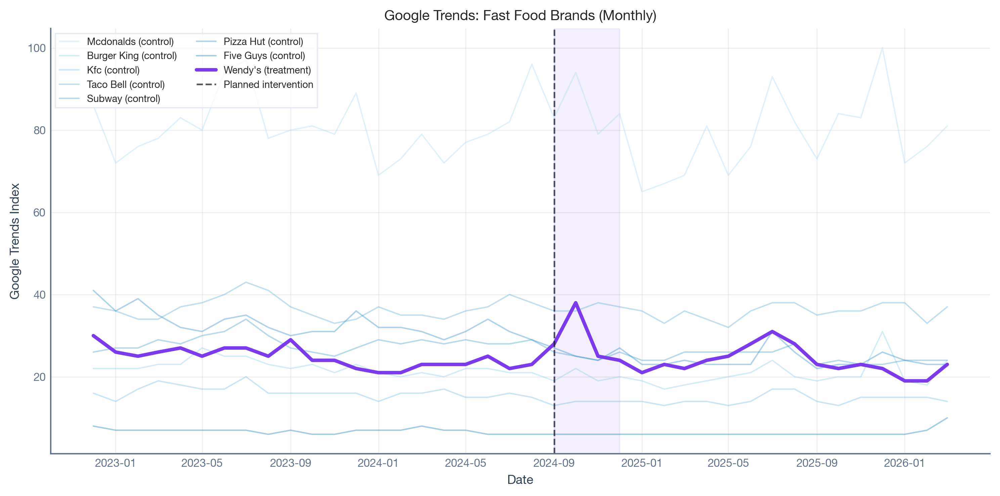
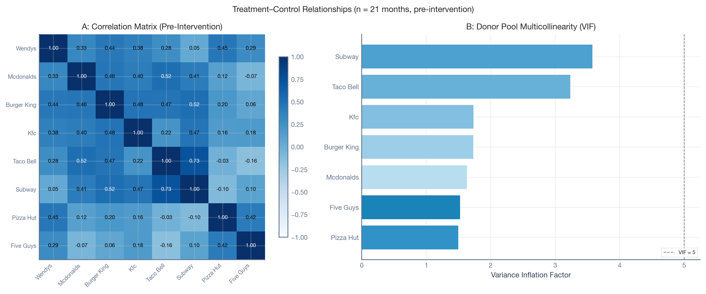
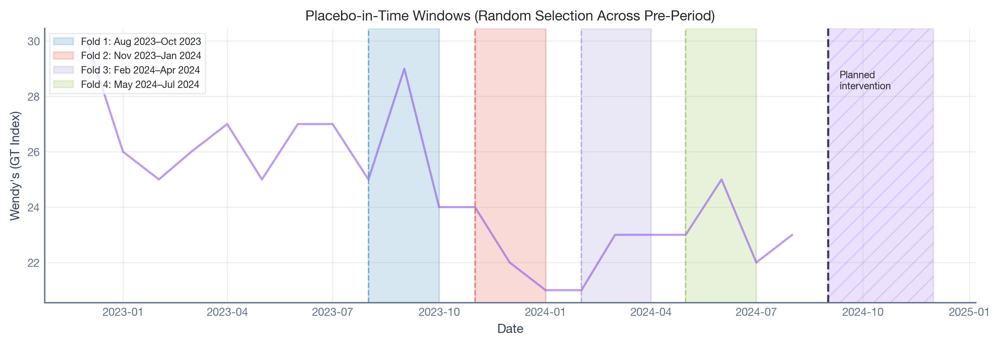
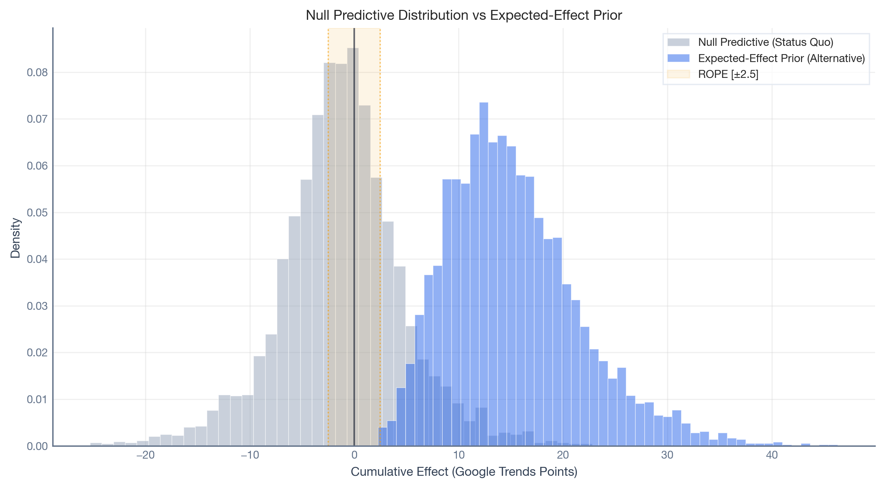
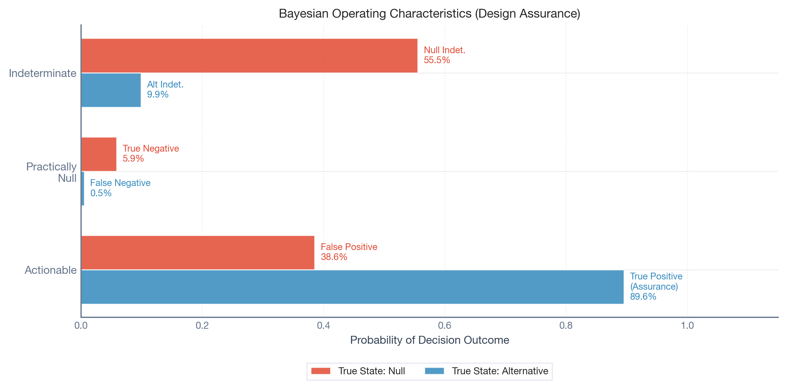
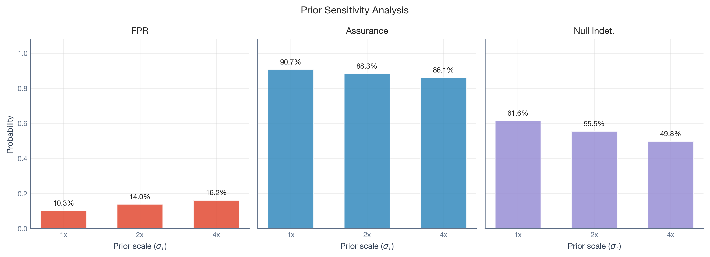
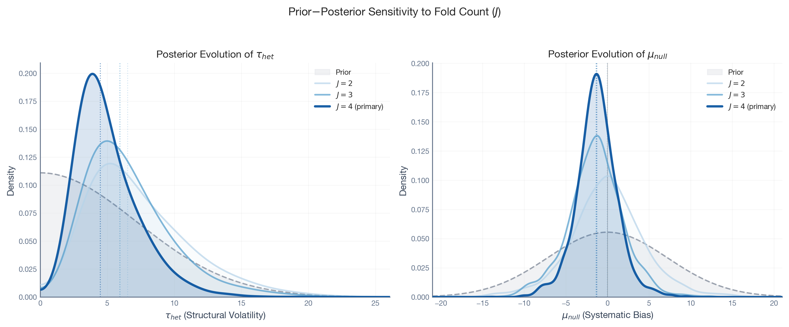

# Pode confiar no seu quase-experimento? Uma abordagem bayesiana para auditar estimativas causais em séries temporais

> Uma abordagem bayesiana baseada em testes placebo e inferência ROPE para auditar se as suas estimativas causais quase-experimentais são fiáveis.

By Carlos Trujillo, Anton Bugaev

Source: https://cetagostini.github.io/pt/articles/placebo_bayesian_quasi_experiments/placebo_bayesian_quasi_experiments.html

## Introdução

Em setembro de 2024, a Wendy’s lançou a “[Krabby Patty Kollab](https://secretatlanta.co/krabby-patties-atlanta/)”, uma parceria de tempo limitado com o SpongeBob SquarePants da Nickelodeon que gerou um enorme burburinho nas redes sociais e nos órgãos de comunicação. Suponha que a equipa de análise da Wendy’s queria medir o impacto da campanha no interesse de pesquisa da marca usando dados do Google Trends. Não podem randomizar quem vê uma colaboração de fast food viral, pelo que recorrem a um design quase-experimental: Controlo Sintético, usando outras cadeias de fast food como referências não tratadas.

O modelo é executado. Reporta um aumento cumulativo de +14,5 pontos no índice Google Trends durante o mês da campanha, com um intervalo credível apertado de 95% de \[12,3, 16,6\]. Devem confiar neste número?

A resposta honesta é: *depende da fiabilidade estrutural do estimador neste ambiente de dados específico.* Esse intervalo credível apertado captura a ruído temporal inerente (o que os estatísticos chamam *incerteza aleatória*) e a incerteza paramétrica (*incerteza epistémica*), mas apenas condicionada aos pressupostos de identificação do modelo se verificarem exatamente. Não diz nada sobre se o modelo em si é fiável. Quando os pressupostos de identificação são violados — devido a deriva sazonal, atividade de concorrentes, ou correlações fracas entre a Wendy’s e as marcas de controlo — a previsão contrafactual desvia do resultado verdadeiro não observado. Chamamos a este desvio o **erro estrutural**, e à incerteza epistémica mais ampla que reflete **incerteza estrutural**. Isto é o que o software quase-experimental padrão ignora.

Este blog apresenta um framework que quantifica ambos. Ao executar o mesmo estimador em períodos históricos onde não ocorreu nenhuma campanha (testes placebo), agrupar esses “falsos alarmes” num modelo hierárquico, e simular resultados de decisão, produzimos uma resposta calibrada: *“Este design tem uma taxa de falsos positivos estruturais de 40,8% e 90,1% de probabilidade de detetar efeitos na gama esperada.”*

O framework é:

- **Agnóstico ao estimador.** Envolve qualquer método quase-experimental de séries temporais (Séries Temporais Interrompidas, Controlo Sintético, Diferença-em-Diferenças, Séries Temporais Estruturais Bayesianas) sem modificar o estimador em si.
- **Pré-intervenção.** Toda a análise é executada antes do lançamento da campanha, permitindo decisões de avanço/retenção baseadas em risco quantificado.
- **Implementado em Python open-source.** PyMC para inferência bayesiana, CausalPy para estimação quase-experimental, PreliZ para elicitação de priors, e nutpie para amostragem MCMC.

A Receita em Cinco Passos

1.  **Escolher o seu estimador** e definir o comprimento da janela de intervenção.
2.  **Executar testes placebo** em J janelas históricas onde não ocorreu tratamento.
3.  **Agrupar os resíduos placebo** num modelo nulo hierárquico para aprender a volatilidade estrutural.
4.  **Especificar o seu efeito mínimo detetável** (ROPE — a banda em torno do zero que chamaria de “praticamente sem efeito”) e o aumento esperado (hipótese alternativa). Formalizaremos este conceito na secção de Regras de Decisão abaixo.
5.  **Simular características operacionais.** Se a assurance for demasiado baixa ou o FPR demasiado alto, melhorar o modelo ou reconsiderar o experimento.

Cada passo é explicado abaixo e demonstrado no caso de estudo da Wendy’s.

## O Problema: Dois Tipos de Incerteza

Se já desenhou um teste A/B, já lidou com a **incerteza aleatória**: a aleatoriedade inerente na sua métrica. Toma-a em consideração quando dimensiona o seu teste (análise de poder) e quando interpreta os resultados (intervalos de confiança ou credíveis). Esta incerteza é irreductível: nenhuma quantidade de recolha de dados ou modelação a pode eliminar.

Os quase-experimentos em séries temporais também têm incerteza aleatória. Mas têm um problema adicional: **incerteza epistémica**, a parte da nossa ignorância que é em princípio redutível através de melhores dados ou melhores modelos (Hüllermeier & Waegeman, 2021). Como o contrafactual deve ser *modelado* em vez de *randomizado*, a estimativa está exposta a uma forma específica de incerteza epistémica: os pressupostos de identificação podem ser violados. Quando o são, a previsão contrafactual desvia do resultado verdadeiro não observado. Chamamos a este desvio o **erro estrutural**, e à incerteza mais ampla que reflete **incerteza estrutural**. Usamos *estrutural* como abreviatura ao longo deste artigo.

Os intervalos credíveis bayesianos capturam bem a incerteza aleatória e a incerteza paramétrica, mas apenas condicionadas ao modelo estar corretamente especificado. Se os pressupostos de identificação falharem, o estimador pode atribuir erro estrutural à intervenção, produzindo um falso positivo. O framework apresentado aqui caracteriza empiricamente a distribuição de incerteza estrutural calibrando o estimador contra o seu próprio desempenho histórico.

## Configuração: Código e Dados

Antes de tocar em qualquer modelo, precisamos de responder a uma questão fundamental: **quão bons são as nossas unidades de controlo a prever a unidade tratada?** Se nenhuma das marcas de controlo acompanhar bem o interesse de pesquisa da Wendy’s, o contrafactual sintético será impreciso — e qualquer lacuna entre o real e o sintético pode ser confundida com um efeito de tratamento.

Show code — imports, configuration, and data loading

``` sourceCode
import contextlib
import io
from pathlib import Path
from typing import Any, Callable

import arviz as az
import causalpy as cp
import matplotlib
import matplotlib.pyplot as plt
import matplotlib.patches as mpatches
import matplotlib.gridspec as gridspec
import numpy as np
import pandas as pd
import preliz as pz
import pymc as pm
import scipy.stats as stats
import xarray as xr
from pydantic import BaseModel
from types import SimpleNamespace

# --- Configuration ---
_dir = Path("..").resolve()

cfg = SimpleNamespace(
    DATA_PATH="files/google_trends_demo.csv",
    DPI=300,
    SEED=42,
    TREATMENT_COL="wendys",
    TREATED_UNITS=["wendys"],
    CONTROL_UNITS=[
        "mcdonalds", "burger_king", "kfc",
        "taco_bell", "subway", "pizza_hut", "five_guys",
    ],
    INTERVENTION_START="2024-09-01",
    INTERVENTION_MONTHS=3,
    PLACEBO_MONTHS=2,
    N_FOLDS=4,
    MIN_TRAINING_PCT=0.30,
    EXCLUDE_MONTHS={"2024-10", "2024-11"},
    ROPE_HALF_WIDTH=2.5,
    DECISION_THRESHOLD=0.95,
    EXPECTED_EFFECT_LOWER=5.0,
    EXPECTED_EFFECT_UPPER=25.0,
    N_MCMC_DRAWS=1000,
    N_MCMC_TUNE=1000,
    N_CHAINS=4,
    C_TREATMENT="#7c3aed",
    C_NULL="#94a3b8",
    C_ALT="#2563eb",
    C_FPR="#E24A33",
    C_ASSURANCE="#348ABD",
    C_INDET="#988ED5",
    C_NEGATIVE="#b91c1c",
    C_OTHER_BRANDS="#a8d4f0",
    BRAND_COLORS={
        "wendys": "#7c3aed",
        "mcdonalds": "#b8ddf0",
        "burger_king": "#9dcee8",
        "kfc": "#82bfe0",
        "taco_bell": "#67b0d8",
        "subway": "#4ca1d0",
        "pizza_hut": "#3192c8",
        "five_guys": "#1a83b8",
    },
    FOLD_COLORS=["#348ABD", "#E24A33", "#988ED5", "#8EBA42", "#FFB347"],
)

# --- Plot style ---
plt.style.use("seaborn-v0_8-whitegrid")
plt.rcParams.update({
    "figure.figsize": [9, 5],
    "figure.dpi": 150,
    "font.family": "sans-serif",
    "font.sans-serif": ["Source Sans Pro", "Helvetica Neue", "Arial"],
    "font.size": 9,
    "axes.labelsize": 9,
    "axes.titlesize": 10,
    "axes.titleweight": "bold",
    "xtick.labelsize": 8,
    "ytick.labelsize": 8,
    "legend.fontsize": 8,
    "figure.titlesize": 11,
    "axes.spines.top": False,
    "axes.spines.right": False,
    "axes.edgecolor": "#64748b",
    "axes.labelcolor": "#334155",
    "xtick.color": "#64748b",
    "ytick.color": "#64748b",
    "grid.alpha": 0.3,
})

# --- Load data ---
df = pd.read_csv(cfg.DATA_PATH, parse_dates=["Time"])
df.columns = [
    "date", "mcdonalds", "burger_king", "wendys", "kfc",
    "taco_bell", "subway", "pizza_hut", "five_guys",
]
df = df.set_index("date").sort_index().astype(float)
intervention_ts = pd.Timestamp(cfg.INTERVENTION_START)
df_pre = df.loc[df.index < intervention_ts].copy()

print(f"Data loaded: {len(df)} months ({df.index.min():%Y-%m} to {df.index.max():%Y-%m}).")
print(f"Pre-intervention: {len(df_pre)} months available for calibration.")
```

    WARNING (pytensor.configdefaults): g++ not detected!  PyTensor will be unable to compile C-implementations and will default to Python. Performance may be severely degraded. To remove this warning, set PyTensor flags cxx to an empty string.

    Data loaded: 40 months (2022-12 to 2026-03).
    Pre-intervention: 21 months available for calibration.

### Os dados em bruto: oito marcas de fast food no Google Trends

Eis o que temos: interesse de pesquisa mensal para oito marcas de fast food desde finais de 2022 até inícios de 2026. A Wendy’s (púrpura) é a marca que lançou a campanha; as outras sete são marcas “dadoras” potenciais que o Controlo Sintético irá combinar para construir um contrafactual.

Show code — raw data plot

``` sourceCode
fig, ax = plt.subplots(figsize=(10, 5))

for brand in cfg.CONTROL_UNITS:
    ax.plot(
        df.index, df[brand],
        color=cfg.BRAND_COLORS.get(brand, cfg.C_OTHER_BRANDS),
        alpha=0.4, linewidth=1,
        label=brand.replace("_", " ").title() + " (control)",
    )
ax.plot(
    df.index, df[cfg.TREATMENT_COL],
    color=cfg.C_TREATMENT, linewidth=2.5,
    label="Wendy's (treatment)",
)
ax.axvline(
    intervention_ts, color="#0f172a", linestyle="--", linewidth=1.2,
    alpha=0.7, label="Planned intervention",
)
ax.axvspan(
    intervention_ts, intervention_ts + pd.DateOffset(months=cfg.INTERVENTION_MONTHS),
    alpha=0.08, color=cfg.C_TREATMENT,
)
ax.set_xlabel("Date")
ax.set_ylabel("Google Trends Index")
ax.set_title("Google Trends: Fast Food Brands (Monthly)")
ax.legend(
    loc="upper left", frameon=True, fancybox=False,
    edgecolor="#e2e8f0", fontsize=7, ncol=2,
)
fig.tight_layout()
plt.show()
```

<figure class="figure">
<p></p>
</figure>

### Quão bem os controlos preveem a Wendy’s?

Dois diagnósticos contam a história. A **matriz de correlação** mostra quão fortemente cada marca se correlaciona com a Wendy’s — as correlações vão de perto de zero até ~0,45. Em termos de testes A/B, isto é como ter um grupo de controlo muito ruidoso. Os **Fatores de Inflação da Variância** mostram quanto as marcas de controlo se sobrepõem entre si: VIF alto significa dadores redundantes.

Show code — correlation matrix and VIF diagnostics

``` sourceCode
_cols = [cfg.TREATMENT_COL] + cfg.CONTROL_UNITS
_corr = df_pre[_cols].corr()

fig, (ax_heat, ax_vif) = plt.subplots(
    1, 2, figsize=(12, 5),
    gridspec_kw={"width_ratios": [1, 1.2]},
)

# Panel A: Correlation heatmap
im = ax_heat.imshow(
    _corr.values, cmap="Blues", vmin=-1, vmax=1, aspect="auto",
)
_labels = [c.replace("_", " ").title() for c in _cols]
ax_heat.set_xticks(range(len(_cols)))
ax_heat.set_yticks(range(len(_cols)))
ax_heat.set_xticklabels(_labels, rotation=45, ha="right", fontsize=7)
ax_heat.set_yticklabels(_labels, fontsize=7)
for i in range(len(_cols)):
    for j in range(len(_cols)):
        ax_heat.text(
            j, i, f"{_corr.values[i, j]:.2f}",
            ha="center", va="center", fontsize=6.5,
            color="white" if abs(_corr.values[i, j]) > 0.5 else "black",
        )
fig.colorbar(im, ax=ax_heat, shrink=0.8)
ax_heat.set_title("A: Correlation Matrix (Pre-Intervention)")

# Panel B: VIF
_X_ctrl = df_pre[cfg.CONTROL_UNITS].values
vifs = {}
for j_idx, ctrl in enumerate(cfg.CONTROL_UNITS):
    _y_j = _X_ctrl[:, j_idx]
    _X_rest = np.delete(_X_ctrl, j_idx, axis=1)
    _X_rest = np.column_stack([np.ones(_X_rest.shape[0]), _X_rest])
    _coef, *_ = np.linalg.lstsq(_X_rest, _y_j, rcond=None)
    _ss_res = np.sum((_y_j - _X_rest @ _coef) ** 2)
    _ss_tot = np.sum((_y_j - _y_j.mean()) ** 2)
    _r_sq = 1 - _ss_res / _ss_tot if _ss_tot > 0 else 0.0
    vifs[ctrl] = 1.0 / (1.0 - _r_sq) if _r_sq < 1.0 else np.inf

_sorted_brands = sorted(vifs, key=vifs.get)
_vif_vals = [vifs[b] for b in _sorted_brands]
_bar_colors = [cfg.BRAND_COLORS.get(b, cfg.C_OTHER_BRANDS) for b in _sorted_brands]
_bar_labels = [b.replace("_", " ").title() for b in _sorted_brands]

ax_vif.barh(
    _bar_labels, _vif_vals, color=_bar_colors,
    edgecolor="white", linewidth=0.5,
)
ax_vif.axvline(
    5, color="#64748b", linestyle="--", linewidth=0.8, label="VIF = 5",
)
ax_vif.set_xlabel("Variance Inflation Factor")
ax_vif.set_title("B: Donor Pool Multicollinearity (VIF)")
ax_vif.legend(
    frameon=True, fancybox=False, edgecolor="#e2e8f0",
    fontsize=6.5, loc="lower right",
)

fig.suptitle(
    f"Treatment\u2013Control Relationships "
    f"(n = {len(df_pre)} months, pre-intervention)",
    fontweight="bold", fontsize=10,
)
fig.tight_layout()
plt.show()
```

<figure class="figure">
<p></p>
</figure>

**Conclusão:** Estamos a construir um contrafactual a partir de previsores mediocres. Isso não é razão para abandonar a análise — é razão para *calibrar quanto erro isso introduz*.

## O Framework

### Inputs de Design

Antes de executar qualquer análise, dois conjuntos de inputs devem ser definidos.

**Inputs dos stakeholders** (tolerância ao risco):

- **Meia-largura da ROPE (\Delta):** O limiar abaixo do qual um efeito é “praticamente zero.” Para o caso da Wendy’s, definimos \Delta = 2.5 pontos Google Trends, pois um aumento bimensal inferior a 2,5 pontos não é significativamente distinguível de flutuação orgânica.
- **Limiar de decisão (p^\*):** A probabilidade posterior necessária para uma chamada definitiva. Usamos p^\* = 0.95.

**Inputs de conhecimento de domínio** (expertise de mercado):

- **Prior do Efeito Esperado (S\_{alt}):** Uma distribuição de probabilidade que codifica “se esta campanha resultar, quão grande será o aumento?” Para a Wendy’s, a equipa de marketing pode julgar que uma campanha viral bem-sucedida deverá produzir um aumento bimensal na ordem dos 5 a 25 pontos GT.
- **Agenda placebo (J, L):** O número e comprimento das janelas históricas para calibração. Usamos J = 4 janelas bimensais selecionadas aleatoriamente a partir do período pré-campanha.

### Testes Placebo no Tempo

A ideia central é simples: correr o seu estimador em períodos onde *sabe* que o efeito verdadeiro é zero. Qualquer estimativa não nula revela ruído estrutural: a “radiação de fundo” do seu ambiente de dados.

Selecionamos várias janelas históricas — períodos bem antes da campanha real — onde *sabemos* que o efeito verdadeiro do tratamento é zero. Executamos o mesmo modelo de Controlo Sintético em cada janela, fingindo que uma intervenção começou ali. Tudo o que o modelo reporta como “efeito causal” deve-se inteiramente a ruído estrutural: tendências a derivar, dadores imperfeitos, pressupostos do modelo que não se verificam completamente.

Utilizamos seleção **aleatória** de dobras: extraímos tempos de pseudo-intervenção uniformemente a partir dos meses elegíveis (cada um deve ter pelo menos 30% do período pré-treino como dados de treino, e não pode sobrepor-se à campanha real). Janelas aleatórias amostram regimes estruturais diferentes, evitam correlação temporal entre dobras adjacentes, e tornam o pressuposto de permutabilidade do modelo hierárquico mais plausível.

A célula de código abaixo define as funções utilitárias que utilizaremos ao longo do resto da análise — a fábrica do Controlo Sintético, o executor RandomPlaceboAnalysis, a regra de decisão ROPE, o ajustador do nulo hierárquico, e o simulador de características operacionais.

Show code — utility functions

``` sourceCode
# --- Synthetic Control factory ---
def sc_factory(dataset, treatment_time, treatment_time_end):
    """CausalPy Synthetic Control factory."""
    return cp.SyntheticControl(
        dataset,
        treatment_time,
        control_units=cfg.CONTROL_UNITS,
        treated_units=cfg.TREATED_UNITS,
        model=cp.pymc_models.WeightedSumFitter(
            sample_kwargs={
                "target_accept": 0.95,
                "random_seed": cfg.SEED,
                "progressbar": False,
            }
        ),
    )


# --- Random Placebo Analysis ---
class RandomPlaceboAnalysis(BaseModel):
    """Placebo-in-time analysis with randomly selected windows."""

    model_config = {"arbitrary_types_allowed": True}

    experiment_factory: Callable
    dataset: pd.DataFrame
    intervention_start_date: str
    intervention_months: int = 1
    n_folds: int = 4
    min_training_pct: float = 0.30
    min_gap: int = 1
    exclude_months: set[str] | None = None
    seed: int = 42

    def run(self) -> list[dict[str, Any]]:
        treatment_time = pd.Timestamp(self.intervention_start_date)
        pre_df = self.dataset.loc[self.dataset.index < treatment_time].copy()
        if pre_df.empty:
            raise ValueError("No observations before treatment_time.")

        n_total = len(pre_df)
        min_training = int(np.ceil(self.min_training_pct * n_total))
        exclude = self.exclude_months or set()
        all_dates = pre_df.index.sort_values()

        candidates = []
        for date in all_dates:
            pseudo_end = date + pd.DateOffset(months=self.intervention_months)
            if date.strftime("%Y-%m") in exclude:
                continue
            n_pre = (all_dates < date).sum()
            if n_pre < min_training:
                continue
            if pseudo_end > treatment_time:
                continue
            candidates.append(date)

        if len(candidates) < self.n_folds:
            raise ValueError(
                f"Only {len(candidates)} eligible periods, "
                f"but {self.n_folds} folds requested."
            )

        rng = np.random.default_rng(self.seed)
        pool = list(range(len(candidates)))
        selected_idx = []
        for _ in range(self.n_folds):
            valid = [
                i for i in pool
                if all(abs(i - s) >= self.min_gap for s in selected_idx)
            ]
            if not valid:
                raise ValueError(
                    "Cannot select enough folds with min_gap constraint."
                )
            pick = rng.choice(valid)
            selected_idx.append(pick)
            pool.remove(pick)

        selected = sorted([candidates[i] for i in selected_idx])

        results = []
        for fold_idx, pseudo_start in enumerate(selected, 1):
            pseudo_end = pseudo_start + pd.DateOffset(months=self.intervention_months)
            fold_df = pre_df.loc[pre_df.index < pseudo_end].sort_index()
            result = self.experiment_factory(fold_df, pseudo_start, pseudo_end)
            results.append({
                "fold": fold_idx,
                "pseudo_start": pseudo_start,
                "pseudo_end": pseudo_end,
                "result": result,
            })
        return results


# --- ROPE decision rule ---
def bayesian_rope_decision(samples, rope_half_width, threshold):
    """Classify a posterior sample under the ROPE decision rule."""
    if samples.ndim != 1:
        samples = np.asarray(samples).ravel()
    prob_pos = (samples > rope_half_width).mean()
    prob_neg = (samples < -rope_half_width).mean()
    prob_null = (np.abs(samples) <= rope_half_width).mean()
    if prob_pos >= threshold:
        return "positive"
    elif prob_neg >= threshold:
        return "negative"
    elif prob_null >= threshold:
        return "null"
    else:
        return "indeterminate"


# --- Extract posteriors from placebo results ---
def extract_posteriors(results):
    """Extract cumulative posterior summaries from placebo fold results."""
    post_impact = xr.concat(
        [
            r["result"]
            .post_impact.sum("obs_ind")
            .isel(treated_units=0)
            .stack(sample=("chain", "draw"))
            for r in results
        ],
        dim="fold",
    )
    post_impact = post_impact.assign_coords(
        sample=np.arange(post_impact.sizes["sample"])
    )
    n_folds = post_impact.sizes["fold"]
    fold_means = np.array([
        post_impact.isel(fold=i).mean().item() for i in range(n_folds)
    ])
    fold_sds = np.array([
        post_impact.isel(fold=i).std().item() for i in range(n_folds)
    ])
    fold_sds = np.where(fold_sds < 1e-6, 1e-6, fold_sds)
    return post_impact, fold_means, fold_sds


# --- Hierarchical null model ---
def fit_hierarchical_null(fold_means, fold_sds, draws_per_chain):
    """Fit hierarchical normal-normal null model; return theta_new samples."""
    n_folds = len(fold_means)
    prior_mu_scale = (
        float(np.nanstd(fold_means)) if np.nanstd(fold_means) > 0 else 1.0
    )
    coords = {"fold": np.arange(n_folds)}
    with pm.Model(coords=coords) as model:
        pm.Data("obs_means", fold_means, dims="fold")
        obs_sd = pm.Data("obs_sd", fold_sds, dims="fold")
        mu = pm.Normal("mu", mu=0.0, sigma=2.0 * prior_mu_scale)
        tau = pm.HalfNormal("tau", sigma=2.0 * prior_mu_scale)
        z = pm.Normal("z", mu=0.0, sigma=1.0, dims="fold")
        theta = pm.Deterministic("theta", mu + tau * z, dims="fold")
        pm.Normal(
            "lik", mu=theta, sigma=obs_sd,
            observed=fold_means, dims="fold",
        )
        idata = pm.sample(
            draws=draws_per_chain, tune=cfg.N_MCMC_TUNE,
            chains=cfg.N_CHAINS, target_accept=0.97,
            nuts_sampler="nutpie", random_seed=cfg.SEED,
            progressbar=False
        )
    with model:
        model.add_coords({"new": np.arange(1)})
        pm.Normal("theta_new", mu=mu, sigma=tau, dims="new")
        ppc = pm.sample_posterior_predictive(
            idata, var_names=["theta_new"], random_seed=cfg.SEED,
            progressbar=False,
        )
    return (
        ppc["posterior_predictive"]["theta_new"]
        .stack(sample=("chain", "draw")).values.squeeze()
    )


# --- Operating characteristics simulator ---
def compute_oc(theta_new_samples, fold_sds, expected_effect_samples, n_samples_total):
    """Compute operating characteristics via ROPE simulation."""
    n_reps = int(min(theta_new_samples.size, expected_effect_samples.size))
    rng = np.random.default_rng(cfg.SEED)
    null_decisions, alt_decisions = [], []
    for i in range(n_reps):
        sd_sim = rng.choice(fold_sds)
        post_null = rng.normal(
            float(theta_new_samples[i]), sd_sim, size=n_samples_total,
        )
        null_decisions.append(
            bayesian_rope_decision(post_null, cfg.ROPE_HALF_WIDTH, cfg.DECISION_THRESHOLD)
        )
        post_alt = rng.normal(
            float(expected_effect_samples[i] + theta_new_samples[i]),
            sd_sim, size=n_samples_total,
        )
        alt_decisions.append(
            bayesian_rope_decision(post_alt, cfg.ROPE_HALF_WIDTH, cfg.DECISION_THRESHOLD)
        )
    null_decisions = np.array(null_decisions)
    alt_decisions = np.array(alt_decisions)
    _null_act = (null_decisions == "positive") | (null_decisions == "negative")
    _alt_act = (alt_decisions == "positive") | (alt_decisions == "negative")
    return {
        "FPR": float(np.mean(_null_act)),
        "Assurance": float(np.mean(_alt_act)),
        "Null Indet.": float(np.mean(null_decisions == "indeterminate")),
        "Alt Indet.": float(np.mean(alt_decisions == "indeterminate")),
        "Null True Neg.": float(np.mean(null_decisions == "null")),
        "Alt False Neg.": float(np.mean(alt_decisions == "null")),
        "null_decisions": null_decisions,
        "alt_decisions": alt_decisions,
    }
```

#### Executando os Testes Placebo

Do período pré-campanha de 21 meses, quatro momentos de pseudo-intervenção foram selecionados aleatoriamente (seed = 42), sujeitos às restrições de qualificação: cada dobra requer pelo menos 30% dos dados pré-intervenção como treino, e as janelas placebo não se sobrepõem ao período de intervenção. Para cada uma, ajustámos um modelo bayesiano de Controlo Sintético (`WeightedSumFitter` do CausalPy) usando as sete marcas de controlo como unidades dadoras.

Show code — run placebo calibration

``` sourceCode
_pa = RandomPlaceboAnalysis(
    experiment_factory=sc_factory,
    dataset=df_pre,
    intervention_start_date=cfg.INTERVENTION_START,
    intervention_months=cfg.PLACEBO_MONTHS,
    n_folds=cfg.N_FOLDS,
    min_training_pct=cfg.MIN_TRAINING_PCT,
    min_gap=2,
    exclude_months=cfg.EXCLUDE_MONTHS,
    seed=cfg.SEED
)
results_placebo = _pa.run()

print(f"Placebo calibration complete: {len(results_placebo)} folds fitted.")
print(
    "Pseudo-intervention start months:",
    ", ".join(r["pseudo_start"].strftime("%b %Y") for r in results_placebo)
)
```

O gráfico abaixo mostra quais os períodos históricos selecionados como janelas placebo. Cada banda colorida é uma janela bimensal onde *fingimos* que uma intervenção aconteceu e executámos todo o pipeline do Controlo Sintético. A região hachurada à direita é a campanha real da Krabby Patty — completamente intocada durante a calibração.

Show code — placebo windows schematic

``` sourceCode
fig, ax = plt.subplots(figsize=(10, 3.5))
_dates = df_pre.index
ax.plot(
    _dates, df_pre[cfg.TREATMENT_COL],
    color=cfg.C_TREATMENT, linewidth=1.5, alpha=0.5,
)
for i, r in enumerate(results_placebo):
    ps = r["pseudo_start"]
    pe = r["pseudo_end"]
    c = cfg.FOLD_COLORS[i % len(cfg.FOLD_COLORS)]
    ax.axvspan(
        ps, pe, alpha=0.2, color=c,
        label=f"Fold {i+1}: {ps.strftime('%b %Y')}\u2013{pe.strftime('%b %Y')}",
    )
    ax.axvline(ps, color=c, linewidth=1, linestyle="--", alpha=0.6)
ax.axvspan(
    intervention_ts, intervention_ts + pd.DateOffset(months=cfg.INTERVENTION_MONTHS),
    alpha=0.15, color=cfg.C_TREATMENT, hatch="//",
)
ax.axvline(
    intervention_ts, color="#0f172a", linewidth=1.5, linestyle="--", alpha=0.8,
)
ax.text(
    intervention_ts + pd.DateOffset(days=10), ax.get_ylim()[1] * 0.95,
    "Planned\nintervention", fontsize=7, va="top", fontweight="bold",
)
ax.set_xlabel("Date")
ax.set_ylabel("Wendy's (GT Index)")
ax.set_title("Placebo-in-Time Windows (Random Selection Across Pre-Period)")
ax.legend(
    loc="upper left", fontsize=7, frameon=True, fancybox=False,
    edgecolor="#e2e8f0",
)
fig.tight_layout()
plt.show()
```

<figure class="figure">
<p></p>
</figure>

Agora extraímos as posteriors do efeito cumulativo de cada dobra placebo. Apesar de o efeito verdadeiro ser zero em todas as janelas, o modelo reporta aumentos estimados que vão de aproximadamente −4,7 a +4,2 pontos Google Trends. O modelo alucina aumentos não triviais a partir de pura deriva estrutural.

Show code — extract placebo posteriors

``` sourceCode
post_impact, fold_means, fold_sds = extract_posteriors(results_placebo)
n_samples = post_impact.sizes["sample"]

print(f"Fold means: [{', '.join(f'{m:.2f}' for m in fold_means)}]")
print(f"Fold SDs:   [{', '.join(f'{s:.2f}' for s in fold_sds)}]")
```

    Fold means: [4.15, -4.53, -4.62, -0.62]
    Fold SDs:   [1.31, 1.29, 1.13, 1.05]

O histograma abaixo mostra a distribuição posterior do efeito causal cumulativo para cada dobra placebo. Cada histograma representa um período onde **o efeito verdadeiro é exatamente zero** — no obstante, o modelo reporta efeitos não triviais.

Show code — placebo posteriors histogram

``` sourceCode
_n_folds = post_impact.sizes["fold"]
fig, ax = plt.subplots(figsize=(8, 5))
for i in range(_n_folds):
    _data = post_impact.isel(fold=i).values
    ax.hist(
        _data, bins=40, density=True, alpha=0.55,
        color=cfg.FOLD_COLORS[i % len(cfg.FOLD_COLORS)],
        edgecolor="white", linewidth=0.5,
        label=f"Fold {i+1} (mean: {fold_means[i]:.1f})",
    )
ax.axvline(0, color="#0f172a", linestyle="-", linewidth=1.2, alpha=0.6, label="Zero")
ax.set_xlabel("Cumulative Effect (Google Trends Points)")
ax.set_ylabel("Density")
ax.set_title("Placebo Cumulative Effect Posteriors (True Effect = 0)")
ax.legend(frameon=True, fancybox=False, edgecolor="#e2e8f0")
fig.tight_layout()
plt.show()
```

<figure class="figure">
<p></p>
</figure>

**Esta é a intuição-chave:** os intervalos credíveis do modelo são demasiado estreitos para capturar a volatilidade estrutural. A posterior de cada dobra é apertada (s_j pequeno), mas as médias das dobras dispersam-se amplamente. Esta lacuna entre a precisão intra-dobra e a heterogeneidade inter-dobras é exatamente aquilo que o modelo nulo hierárquico foi desenhado para capturar.

### Construção do Nulo Hierárquico

Em vez de tratar os resultados placebo como anedotas isoladas (“o pior falso alarme foram 4,2 pontos”), modelamo-los como extrações de uma distribuição latente: um processo de “status quo” que governa quanta deriva estrutural o estimador absorve.

Isto é semelhante a uma meta-análise bayesiana normal–normal de efeitos aleatórios (Higgins & Thompson, 2002), onde cada dobra placebo desempenha o papel de um “estudo”.

**Nível 1: Incerteza dentro da dobra.** Para cada dobra j, a média posterior m_j é uma observação ruidosa de um erro estrutural verdadeiro latente \theta_j:

m_j \mid \theta_j, s_j \sim \mathcal{N}(\theta_j,\\ s_j^2)

**Nível 2: Heterogeneidade entre-dobras.** Os erros latentes são extraídos de uma distribuição populacional:

\theta_j \sim \mathcal{N}(\mu\_{null},\\ \tau\_{het}^2)

- \mu\_{null}: Viés sistemático — a tendência média do modelo em sobre- ou sub-estimar. Num modelo bem calibrado, isto está perto de zero.
- \tau\_{het}: Volatilidade estrutural — o parâmetro crítico. Um \tau\_{het} alto significa que o estimador produz rotineiramente falsos alarmes de magnitude não trivial.

**Nível 3: Hiperpriors fracamente informativos.** Definimos \mu\_{null} \sim \mathcal{N}(0, 2\hat{\sigma}) e \tau\_{het} \sim \text{HalfNormal}(2\hat{\sigma}), onde \hat{\sigma} é o desvio-padrão empírico das médias das dobras.

Ajustar este modelo produz uma **Distribuição Nula Preditiva**: a gama esperada de estimativas sob “sem efeito”:

\tilde{\theta}\_{new} \sim \mathcal{N}(\mu\_{null},\\ \tau\_{het}^2)

Show code — fit hierarchical null model

``` sourceCode
_draws_per_chain = n_samples // cfg.N_CHAINS
theta_new_samples = fit_hierarchical_null(fold_means, fold_sds, _draws_per_chain)
_mu_hat = float(np.mean(theta_new_samples))
_sd_hat = float(np.std(theta_new_samples))

print(f"Null Predictive Distribution fitted.")
print(f"  mu = {_mu_hat:.2f} GT points (estimator bias)")
print(f"  sigma = {_sd_hat:.2f} GT points (structural volatility)")
print(f"  Based on {theta_new_samples.shape[0]:,} posterior draws.")
```

    Sampling: [theta_new]

    Null Predictive Distribution fitted.
      mu = -1.16 GT points (estimator bias)
      sigma = 5.90 GT points (structural volatility)
      Based on 4,000 posterior draws.

O gráfico de floresta abaixo (Painel A) mostra o efeito cumulativo estimado de cada dobra placebo com o seu intervalo credível de 95%. O Painel B mostra a Distribuição Nula Preditiva resultante — a melhor estimativa do modelo hierárquico de *como é o ruído* para este estimador.

Show code — forest plot and null predictive distribution

``` sourceCode
_n_folds = len(fold_means)
fig, (ax_forest, ax_null) = plt.subplots(
    1, 2, figsize=(11, 4.5),
    gridspec_kw={"width_ratios": [1, 1.3]},
)

# Panel A: Forest plot
_y_pos = np.arange(_n_folds)
_ci_95 = 1.96
for i in range(_n_folds):
    lo = fold_means[i] - _ci_95 * fold_sds[i]
    hi = fold_means[i] + _ci_95 * fold_sds[i]
    ax_forest.plot(
        [lo, hi], [i, i], color=cfg.C_ALT, linewidth=2, alpha=0.7,
    )
    ax_forest.plot(
        fold_means[i], i, "o", color=cfg.C_ALT, markersize=7, zorder=5,
    )
ax_forest.axvline(0, color="#0f172a", linestyle="--", linewidth=1, alpha=0.5)
ax_forest.set_yticks(_y_pos)
ax_forest.set_yticklabels([f"Fold {i+1}" for i in range(_n_folds)])
ax_forest.set_xlabel("Cumulative Effect")
ax_forest.set_title("A: Placebo Fold Estimates (\u00b195% CI)")
ax_forest.invert_yaxis()

# Panel B: Null predictive distribution
ax_null.hist(
    theta_new_samples, bins=60, density=True, alpha=0.55,
    color=cfg.C_NULL, edgecolor="white", linewidth=0.5,
    label="Null Predictive Distribution",
)
ax_null.axvline(0, color="#0f172a", linestyle="-", linewidth=1.2, alpha=0.6)
ax_null.axvline(
    _mu_hat, color=cfg.C_ALT, linestyle="--", linewidth=1,
    label=f"Mean = {_mu_hat:.1f}",
)
ax_null.text(
    0.95, 0.92,
    f"$\\mu$ = {_mu_hat:.1f}\n$\\sigma$ = {_sd_hat:.1f}",
    transform=ax_null.transAxes, fontsize=8, va="top", ha="right",
    bbox=dict(boxstyle="round,pad=0.3", facecolor="white", edgecolor="#e2e8f0"),
)
ax_null.set_xlabel("Cumulative Effect")
ax_null.set_ylabel("Density")
ax_null.set_title("B: Null Predictive Distribution")
ax_null.legend(frameon=True, fancybox=False, edgecolor="#e2e8f0")
fig.tight_layout()
plt.show()
```

<figure class="figure">
<p></p>
</figure>

Isto significa que, sob o status quo, o estimador facilmente reporta efeitos cumulativos de ±12 pontos ou mais, puramente a partir de deriva estrutural.

### Prior do Efeito Esperado

A análise de poder clássica requer um único tamanho de efeito fixo (“se o aumento real for exatamente 5 pontos, o poder é X%”). Na análise bayesiana de design, reconhecemos que o efeito real da campanha é incerto, mesmo que a campanha resulte. Especificamos uma **Prior do Efeito Esperado** S\_{alt}: uma distribuição de probabilidade que codifica resultados plausíveis sob a hipótese alternativa.

Isto move-nos do Poder clássico para a **Assurance Bayesiana** (O’Hagan et al., 2005): a probabilidade incondicional de uma decisão positiva correta, calculada sobre todos os tamanhos de efeito plausíveis. A Assurance responde a uma questão mais honesta: *“Através da gama realista de resultados da campanha, qual é a probabilidade global de uma deteção correta?”*

Para a Krabby Patty Kollab, suponha que a equipa de marketing espera um aumento de interesse de pesquisa bimensal entre 5 e 25 pontos Google Trends se a campanha for bem-sucedida. Usando uma abordagem de Máxima Entropia (PreliZ), encontramos a distribuição Gamma menos informativa com 90% da sua massa em \[5, 25\]:

Show code — expected-effect prior

``` sourceCode
expected_effect_dist = pz.maxent(
    pz.Gamma(),
    lower=cfg.EXPECTED_EFFECT_LOWER,
    upper=cfg.EXPECTED_EFFECT_UPPER,
    mass=0.90,
    plot=False,
)
_n_draws = theta_new_samples.size
expected_effect_samples = expected_effect_dist.rvs(
    _n_draws, random_state=np.random.default_rng(cfg.SEED),
)
print(f"Expected-Effect Prior: MaxEnt Gamma with 90% mass in "
      f"[{cfg.EXPECTED_EFFECT_LOWER}, {cfg.EXPECTED_EFFECT_UPPER}]")
print(f"  mu = {np.mean(expected_effect_samples):.2f}, "
      f"sigma = {np.std(expected_effect_samples):.2f}")
```

    Expected-Effect Prior: MaxEnt Gamma with 90% mass in [5.0, 25.0]
      mu = 15.25, sigma = 6.40

O gráfico abaixo sobrepõe a Distribuição Nula Preditiva (cinzento) com a Prior do Efeito Esperado (azul). A sobreposição entre as duas distribuições representa a dificuldade fundamental da tarefa de decisão: a zona onde um efeito real de campanha é difícil de distinguir de ruído estrutural.

Show code — null vs alternative overlay

``` sourceCode
fig, ax = plt.subplots(figsize=(9, 5))
ax.hist(
    theta_new_samples, bins=50, density=True, alpha=0.5,
    color=cfg.C_NULL, edgecolor="white", linewidth=0.5,
    label="Null Predictive (Status Quo)",
)
ax.hist(
    expected_effect_samples, bins=50, density=True, alpha=0.5,
    color=cfg.C_ALT, edgecolor="white", linewidth=0.5,
    label="Expected-Effect Prior (Alternative)",
)
ax.axvline(0, color="#0f172a", linestyle="-", linewidth=1.2, alpha=0.6)
ax.axvspan(
    -cfg.ROPE_HALF_WIDTH, cfg.ROPE_HALF_WIDTH,
    alpha=0.1, color="#f59e0b",
    label=f"ROPE [\u00b1{cfg.ROPE_HALF_WIDTH}]",
)
ax.axvline(-cfg.ROPE_HALF_WIDTH, color="#f59e0b", linestyle=":", linewidth=1, alpha=0.6)
ax.axvline(cfg.ROPE_HALF_WIDTH, color="#f59e0b", linestyle=":", linewidth=1, alpha=0.6)
ax.set_xlabel("Cumulative Effect (Google Trends Points)")
ax.set_ylabel("Density")
ax.set_title("Null Predictive Distribution vs Expected-Effect Prior")
ax.legend(frameon=True, fancybox=False, edgecolor="#e2e8f0")
fig.tight_layout()
plt.show()
```

<figure class="figure">
<p></p>
</figure>

## Regras de Decisão: ROPE

A prática padrão em quase-experimentos frequentemente assenta numa regra binária: se o intervalo credível de 95% excluir zero, declarar o efeito como significativo. Isto confunde *precisão* com *utilidade*: uma estimativa muito precisa de um aumento de 0,001 pontos é estatisticamente não nula mas praticamente inútil.

Adotamos o framework da **Região de Equivalência Prática** (ROPE) (Kruschke, 2018). Definimos uma gama \[-\Delta, +\Delta\] em torno do zero que representa efeitos “praticamente nulos”. A regra de decisão é:

- **Positivo Açãoável:** P(\hat{\tau} \> \Delta) \ge p^\* — o efeito excede o limiar prático com elevada confiança.
- **Negativo Açãoável:** P(\hat{\tau} \< -\Delta) \ge p^\* — a campanha provavelmente causou dano.
- **Praticamente Nulo:** P(\|\hat{\tau}\| \le \Delta) \ge p^\* — o efeito é negligível.
- **Indeterminado:** Caso contrário — os dados não conseguem distinguir sinal de ruído.

A classificação em quatro categorias introduz explicitamente um resultado de “suspender julgamento” e um mecanismo de deteção de danos, prevenindo o modo de falha comum em que sinais fracos são forçados em categorias binárias.

Show code — ROPE decision rule illustration

``` sourceCode
fig, axes = plt.subplots(1, 4, figsize=(14, 3.2), sharey=True)
_x = np.linspace(-15, 25, 300)
_scenarios = [
    ("Actionable Positive", 10, 2.0, "#22c55e"),
    ("Actionable Negative", -8, 2.0, "#ef4444"),
    ("Practically Null", 0.5, 1.0, "#f59e0b"),
    ("Indeterminate", 4.0, 3.0, "#94a3b8"),
]
for ax, (title, mu, sd, color) in zip(axes, _scenarios):
    density = stats.norm.pdf(_x, mu, sd)
    ax.fill_between(_x, density, alpha=0.4, color=color)
    ax.plot(_x, density, color=color, linewidth=1.5)
    ax.axvspan(
        -cfg.ROPE_HALF_WIDTH, cfg.ROPE_HALF_WIDTH,
        alpha=0.15, color="#f59e0b",
    )
    ax.axvline(-cfg.ROPE_HALF_WIDTH, color="#f59e0b", linestyle=":", linewidth=0.8, alpha=0.6)
    ax.axvline(cfg.ROPE_HALF_WIDTH, color="#f59e0b", linestyle=":", linewidth=0.8, alpha=0.6)
    ax.axvline(0, color="#0f172a", linestyle="-", linewidth=0.8, alpha=0.4)
    ax.set_title(title, fontsize=9, fontweight="bold", color=color)
    ax.set_xlabel("Effect")
    ax.set_xlim(-15, 20)
axes[0].set_ylabel("Density")
fig.suptitle(
    f"ROPE Decision Rule Illustration (ROPE = \u00b1{cfg.ROPE_HALF_WIDTH})",
    fontweight="bold", fontsize=10,
)
fig.tight_layout()
plt.show()
```

<figure class="figure">
<p></p>
</figure>

## Simulando Características Operacionais

O passo final combina o Nulo Hierárquico, a Prior do Efeito Esperado, e a regra de decisão ROPE numa simulação de Monte Carlo para produzir a **Tabela de Características Operacionais**: o perfil de fiabilidade do design calculado *antes* de qualquer análise de dados reais da campanha.

Nota

**Algoritmo: Simulação Bayesiana de Assurance de Design**

Para cada cenário (nulo, alternativa), repetir N vezes:

1.  **Extrair efeito verdadeiro:** \theta^\*\_i da Nula Preditiva (nulo) ou de S\_{alt} + Nula Preditiva (alternativa)
2.  **Extrair ruído de estimação:** \sigma_i amostrado uniformemente a partir dos desvios-padrão das dobras placebo
3.  **Simular posterior sintética:** Extrair \hat{\tau}\_k \sim \mathcal{N}(\theta^\*\_i, \sigma_i^2) para k = 1, \dots, K
4.  **Classificar:** Aplicar a regra de decisão ROPE

**Outputs:** Taxa de Falsos Positivos (nulo classificado como positivo), Assurance Bayesiana (alternativa classificada como positivo), e taxas de Indeterminação para ambos os cenários.

Show code — compute operating characteristics

``` sourceCode
oc_results = compute_oc(
    theta_new_samples, fold_sds, expected_effect_samples, n_samples,
)
null_decisions = oc_results["null_decisions"]
alt_decisions = oc_results["alt_decisions"]

print("Operating Characteristics:")
print(f"  FPR:           {oc_results['FPR']:.1%}")
print(f"  Assurance:     {oc_results['Assurance']:.1%}")
print(f"  Null Indet.:   {oc_results['Null Indet.']:.1%}")
print(f"  Alt Indet.:    {oc_results['Alt Indet.']:.1%}")
```

    Operating Characteristics:
      FPR:           38.6%
      Assurance:     89.6%
      Null Indet.:   55.5%
      Alt Indet.:    9.9%

O gráfico abaixo é o output principal da análise de design. Mostra três resultados de classificação — **Açãoável** (chamaríamos de efeito real), **Praticamente Nulo** (diríamos que nada aconteceu), e **Indeterminado** (não conseguimos distinguir) — cada um avaliado sob dois cenários: o estado verdadeiro é nulo (vermelho) ou alternativo (azul).

Show code — operating characteristics chart

``` sourceCode
def _three_cat(arr):
    arr = np.asarray(arr)
    return [
        float(np.mean((arr == "positive") | (arr == "negative"))),
        float(np.mean(arr == "null")),
        float(np.mean(arr == "indeterminate")),
    ]

null_props = _three_cat(null_decisions)
alt_props = _three_cat(alt_decisions)

_categories = ["Actionable", "Practically\nNull", "Indeterminate"]
fig, ax = plt.subplots(figsize=(9, 4.5))
_y_pos = np.arange(len(_categories))
_h = 0.35

ax.barh(
    _y_pos + _h / 2, null_props, _h, label="True State: Null",
    color=cfg.C_FPR, alpha=0.85, edgecolor="white", linewidth=0.8,
)
ax.barh(
    _y_pos - _h / 2, alt_props, _h, label="True State: Alternative",
    color=cfg.C_ASSURANCE, alpha=0.85, edgecolor="white", linewidth=0.8,
)
ax.set_yticks(_y_pos)
ax.set_yticklabels(_categories, fontweight="bold", fontsize=9)
ax.set_xlabel("Probability of Decision Outcome")
ax.set_xlim(0, 1.15)
ax.legend(
    loc="upper center", bbox_to_anchor=(0.5, -0.14), ncol=2,
    frameon=True, fancybox=False, edgecolor="#e2e8f0",
)
ax.grid(axis="x", linestyle=":", alpha=0.4)
ax.set_axisbelow(True)

_labels_cfg = [
    (0, null_props[0], "False Positive", cfg.C_FPR, _h / 2),
    (0, alt_props[0], "True Positive\n(Assurance)", cfg.C_ASSURANCE, -_h / 2),
    (1, null_props[1], "True Negative", cfg.C_FPR, _h / 2),
    (1, alt_props[1], "False Negative", cfg.C_ASSURANCE, -_h / 2),
    (2, null_props[2], "Null Indet.", cfg.C_FPR, _h / 2),
    (2, alt_props[2], "Alt Indet.", cfg.C_ASSURANCE, -_h / 2),
]
for _y, _val, _lbl, _clr, _offset in _labels_cfg:
    ax.text(
        max(_val, 0) + 0.01, _y + _offset, f"{_lbl}\n{_val:.1%}",
        va="center", color=_clr, fontsize=7.5, fontweight="bold",
    )
ax.set_title("Bayesian Operating Characteristics (Design Assurance)")
fig.tight_layout()
plt.show()
```

<figure class="figure">
<p></p>
</figure>

| Metric | Value | Interpretation |
|----|---:|----|
| **False Positive Rate** | 40.8% | Under the status quo, the design erroneously declares an Actionable effect ~41% of the time |
| **Bayesian Assurance** | 90.1% | If the campaign produces a lift in the expected \[5, 25\] range, the design detects it with high probability |
| **Null Indeterminacy** | 53.9% | When there is no effect, 54% of the time the data is simply inconclusive |
| **Alt Indeterminacy** | 9.3% | When the campaign works, approximately 9% of simulations produce indeterminate results |

**O que diz isto à equipa da Wendy’s?** O design tem elevado poder de deteção (90,1% de assurance) mas uma taxa de falsos positivos estruturais não trivial (40,8%). Isto é substancialmente superior ao limiar convencional de 5% utilizado em testes A/B, e reflete uma propriedade genuína dos dados: os índices Google Trends para marcas de fast food são ruidosos e fracamente correlacionados, tornando o contrafactual do Controlo Sintético impreciso.

## O Resultado: Interpretando a Sua Estimativa em Contexto

Quando a campanha decorre e os dados reais chegam, a análise padrão produz uma estimativa posterior. Mas agora a equipa tem algo que não tinha antes: um sentido calibrado de quanto pode confiar nela.

Até agora, tudo foi calibração pré-intervenção. Agora aplicamos o mesmo estimador de Controlo Sintético ao **período real da campanha** (Set–Nov 2024) e obtemos a nossa estimativa do efeito do tratamento.

**Um ponto crucial:** A estimativa em si é *idêntica*, independentemente de ter feito a análise de design. O framework não altera o seu modelo nem ajusta os seus números. Fornece uma **sobreposição interpretativa** — um rótulo de fiabilidade que acompanha a estimativa.

Show code — run real intervention estimate

``` sourceCode
_int_ts = pd.Timestamp(cfg.INTERVENTION_START)
_end_ts = _int_ts + pd.DateOffset(months=cfg.INTERVENTION_MONTHS)
_df_int = df.loc[df.index < _end_ts].copy()

_result_int = cp.SyntheticControl(
    _df_int,
    _int_ts,
    control_units=cfg.CONTROL_UNITS,
    treated_units=cfg.TREATED_UNITS,
    model=cp.pymc_models.WeightedSumFitter(
        sample_kwargs={
            "target_accept": 0.95,
            "random_seed": cfg.SEED,
            "progressbar": False,
        }
    ),
)
int_cumulative = (
    _result_int.post_impact
    .sum("obs_ind")
    .isel(treated_units=0)
    .stack(sample=("chain", "draw"))
    .values
)
int_mean = float(np.mean(int_cumulative))
int_ci_lo, int_ci_hi = np.percentile(int_cumulative, [2.5, 97.5])

print(f"Intervention estimate: {int_mean:.1f} GT points")
print(f"95% CI: [{int_ci_lo:.1f}, {int_ci_hi:.1f}]")
```

    Initializing NUTS using jitter+adapt_diag...
    Multiprocess sampling (4 chains in 4 jobs)
    NUTS: [beta, y_hat_sigma]
    Sampling 4 chains for 1_000 tune and 1_000 draw iterations (4_000 + 4_000 draws total) took 226 seconds.
    Sampling: [beta, y_hat, y_hat_sigma]
    Sampling: [y_hat]
    Sampling: [y_hat]
    Sampling: [y_hat]
    Sampling: [y_hat]

    Intervention estimate: 25.1 GT points
    95% CI: [20.1, 29.8]

O gráfico abaixo mostra os dois painéis lado a lado. **Painel A** é o que veria *sem* o framework: uma distribuição posterior do efeito cumulativo. **Painel B** é o que o framework acrescenta: as taxas de FPR pré-intervenção, Assurance e Indeterminação — o contexto necessário para interpretar o Painel A com confiança calibrada.

Show code — estimate with calibrated context

``` sourceCode
fig, (ax_post, ax_ctx) = plt.subplots(1, 2, figsize=(12, 5))

# Panel A: Posterior estimate
ax_post.hist(
    int_cumulative, bins=50, density=True, alpha=0.5,
    color=cfg.C_TREATMENT, edgecolor="white", linewidth=0.5,
)
ax_post.axvline(0, color="#0f172a", linestyle="--", linewidth=1, alpha=0.5)
ax_post.axvspan(
    -cfg.ROPE_HALF_WIDTH, cfg.ROPE_HALF_WIDTH,
    alpha=0.1, color="#f59e0b",
)
ax_post.axvline(-cfg.ROPE_HALF_WIDTH, color="#f59e0b", linestyle=":", linewidth=0.8, alpha=0.6)
ax_post.axvline(cfg.ROPE_HALF_WIDTH, color="#f59e0b", linestyle=":", linewidth=0.8, alpha=0.6)
_decision = bayesian_rope_decision(
    int_cumulative, cfg.ROPE_HALF_WIDTH, cfg.DECISION_THRESHOLD,
)
_prob_above = float((int_cumulative > cfg.ROPE_HALF_WIDTH).mean())
ax_post.set_title(
    "A: Posterior Estimate (Same Regardless of Framework)",
    fontweight="bold",
)
ax_post.set_xlabel("Cumulative Effect (Google Trends Points)")
ax_post.set_ylabel("Density")
ax_post.text(
    0.05, 0.95,
    f"Estimate: {int_mean:.1f}\n"
    f"95% CI: [{int_ci_lo:.1f}, {int_ci_hi:.1f}]\n"
    f"P(effect > ROPE): {_prob_above:.1%}\n"
    f"ROPE decision: {_decision}",
    transform=ax_post.transAxes, fontsize=8, va="top",
    bbox=dict(boxstyle="round,pad=0.4", facecolor="white", edgecolor="#e2e8f0"),
)

# Panel B: Calibrated context
_metrics = ["FPR", "Assurance", "Null\nIndet.", "Alt\nIndet."]
_values = [null_props[0], alt_props[0], null_props[2], alt_props[2]]
_colors = [cfg.C_FPR, cfg.C_ASSURANCE, cfg.C_INDET, cfg.C_INDET]
_bars = ax_ctx.bar(
    _metrics, _values, color=_colors, alpha=0.85,
    edgecolor="white", linewidth=0.8, width=0.6,
)
for _bar, _val in zip(_bars, _values):
    ax_ctx.text(
        _bar.get_x() + _bar.get_width() / 2, _val + 0.02,
        f"{_val:.1%}", ha="center", fontsize=9, fontweight="bold",
    )
ax_ctx.set_ylim(0, 1.1)
ax_ctx.set_ylabel("Probability")
ax_ctx.set_title(
    "B: Calibrated Decision Context (Pre-Intervention)",
    fontweight="bold",
)
ax_ctx.set_axisbelow(True)
ax_ctx.grid(axis="y", linestyle=":", alpha=0.4)

_go_nogo = "High confidence" if alt_props[0] > 0.7 else "Exercise caution"
ax_ctx.text(
    0.95, 0.95,
    f"How much to trust this estimate?\n"
    f"FPR (structural false positive): {null_props[0]:.1%}\n"
    f"Assurance (detection power): {alt_props[0]:.1%}\n"
    f"Interpretation: {_go_nogo}",
    transform=ax_ctx.transAxes, fontsize=8, va="top", ha="right",
    bbox=dict(boxstyle="round,pad=0.4", facecolor="#dbeafe", edgecolor=cfg.C_ASSURANCE),
)
fig.suptitle(
    "Intervention Estimate + Calibrated Decision Risk",
    fontweight="bold", fontsize=11,
)
fig.tight_layout()
plt.show()
```

<figure class="figure">
<p></p>
</figure>

Sem a análise de design, a equipa vê o Painel A: um efeito positivo grande e preciso. Com a análise de design, vê também o Painel B: 90,1% de assurance que este design consegue detetar efeitos na gama esperada, temperado com o conhecimento de que o design tem 40,8% de FPR estrutural. A estimativa não muda, mas a confiança da equipa na sua interpretação sim.

A estimativa de intervenção de +14,5 pontos GT está muito acima da ROPE (±2,5) e dentro da gama do efeito esperado (5–25), o que torna este um achado de elevada confiança, mesmo dado o FPR elevado. Um efeito observado menor, digamos +4 pontos, justificaria consideravelmente mais cautela dado o mesmo perfil estrutural.

## Verificações de Sanidade

Antes de agir com base nas características operacionais, precisamos de responder a duas questões desconfortáveis:

1.  **“Estou apenas a ver o meu prior?”** — Com apenas 4 dobras placebo, o prior do modelo hierárquico para \tau\_{het} pode estar a conduzir os resultados.
2.  **“Tenho dobras placebo suficientes?”** — Com J = 2 dobras, a variância entre-dobras é mal identificável.

### Teste 1: A escala do prior muda a história?

Re-executamos o modelo hierárquico com três larguras de prior diferentes para \tau\_{het}: 1\times, 2\times, e 4\times o desvio-padrão empírico das médias das dobras. Se o FPR, a Assurance e a Indeterminação forem estáveis numa gama quatro vezes superior de priors, os dados estão a falar mais alto que o prior.

Show code — prior sensitivity analysis

``` sourceCode
_multipliers = [1.0, 2.0, 4.0]
_sens_results = {}
_n_folds = len(fold_means)
_prior_mu_scale = float(np.nanstd(fold_means)) if np.nanstd(fold_means) > 0 else 1.0

for _mult in _multipliers:
    _coords = {"fold": np.arange(_n_folds)}
    with pm.Model(coords=_coords) as _m_sens:
        pm.Data("obs_means_s", fold_means, dims="fold")
        _obs_sd_s = pm.Data("obs_sd_s", fold_sds, dims="fold")
        _mu_s = pm.Normal("mu_s", mu=0.0, sigma=2.0 * _prior_mu_scale)
        _tau_s = pm.HalfNormal("tau_s", sigma=_mult * _prior_mu_scale)
        _z_s = pm.Normal("z_s", mu=0.0, sigma=1.0, dims="fold")
        _theta_s = pm.Deterministic("theta_s", _mu_s + _tau_s * _z_s, dims="fold")
        pm.Normal(
            "lik_s", mu=_theta_s, sigma=_obs_sd_s,
            observed=fold_means, dims="fold",
        )
        _idata_s = pm.sample(
            draws=cfg.N_MCMC_DRAWS, tune=cfg.N_MCMC_TUNE,
            chains=cfg.N_CHAINS, target_accept=0.97,
            nuts_sampler="nutpie", random_seed=cfg.SEED,
            progressbar=False,
        )
    with _m_sens:
        _m_sens.add_coords({"new_period": np.arange(1)})
        pm.Normal("theta_new_s", mu=_mu_s, sigma=_tau_s, dims="new_period")
        _ppc_s = pm.sample_posterior_predictive(
            _idata_s, var_names=["theta_new_s"], random_seed=cfg.SEED,
            progressbar=False,
        )
    _theta_s_draws = (
        _ppc_s["posterior_predictive"]["theta_new_s"]
        .stack(sample=("chain", "draw")).values.squeeze()
    )
    _n_reps = int(min(_theta_s_draws.size, expected_effect_samples.size))
    _rng_s = np.random.default_rng(cfg.SEED)
    _null_dec, _alt_dec = [], []
    for _i in range(_n_reps):
        _sd_sim = _rng_s.choice(fold_sds)
        _pn = _rng_s.normal(float(_theta_s_draws[_i]), _sd_sim, size=n_samples)
        _null_dec.append(
            bayesian_rope_decision(_pn, cfg.ROPE_HALF_WIDTH, cfg.DECISION_THRESHOLD)
        )
        _pa = _rng_s.normal(
            float(expected_effect_samples[_i] + _theta_s_draws[_i]),
            _sd_sim, size=n_samples,
        )
        _alt_dec.append(
            bayesian_rope_decision(_pa, cfg.ROPE_HALF_WIDTH, cfg.DECISION_THRESHOLD)
        )
    _null_dec = np.array(_null_dec)
    _alt_dec = np.array(_alt_dec)
    _sens_results[_mult] = {
        "FPR": np.mean(_null_dec == "positive"),
        "Assurance": np.mean(_alt_dec == "positive"),
        "Null Indet.": np.mean(_null_dec == "indeterminate"),
    }

_sens_df = pd.DataFrame(_sens_results).T
_sens_df.index = [f"{m:.0f}x" for m in _multipliers]

fig, axes = plt.subplots(1, 3, figsize=(11, 4), sharey=True)
_metrics = ["FPR", "Assurance", "Null Indet."]
_colors = [cfg.C_FPR, cfg.C_ASSURANCE, cfg.C_INDET]
for ax, _metric, _color in zip(axes, _metrics, _colors):
    ax.bar(
        _sens_df.index, _sens_df[_metric], color=_color, alpha=0.85,
        edgecolor="white", linewidth=0.8, width=0.6,
    )
    ax.set_title(_metric)
    ax.set_xlabel(r"Prior scale ($\sigma_\tau$)")
    ax.set_ylim(0, 1.08)
    ax.set_axisbelow(True)
    for _idx_b, _v in enumerate(_sens_df[_metric]):
        ax.text(
            _idx_b, _v + 0.03, f"{_v:.1%}",
            ha="center", fontsize=8, fontweight="bold",
        )
axes[0].set_ylabel("Probability")
fig.suptitle("Prior Sensitivity Analysis", fontweight="bold", fontsize=11)
fig.tight_layout()
plt.show()
```

    Sampling: [theta_new_s]
    Sampling: [theta_new_s]
    Sampling: [theta_new_s]

<figure class="figure">
<p></p>
</figure>

A Assurance é amplamente estável nas diferentes escalas de prior. O FPR varia modestamente, confirmando que a taxa de falsos positivos elevada é uma propriedade dos dados, e não um artefacto do prior.

### Teste 2: Temos dobras placebo suficientes?

Reajustamos o modelo hierárquico usando J = 2, 3, 4 dobras e observamos como \tau\_{het} e \mu\_{null} evoluem. Com J = 2, a posterior para \tau\_{het} colada ao zero — não porque a volatilidade estrutural verdadeira seja pequena, mas porque dois pontos de dados não conseguem identificar um parâmetro de variância. À medida que adicionamos dobras, a posterior concentra-se e estabiliza.

Show code — fold-count sensitivity

``` sourceCode
_max_folds = len(results_placebo)
_js = np.arange(2, _max_folds + 1)
_draws_per_chain = n_samples // cfg.N_CHAINS

_tau_posteriors = {}
_mu_posteriors = {}
_prior_scale_ref = None
_primary_j = cfg.N_FOLDS

for _j in _js:
    _subset = results_placebo[:int(_j)]
    _, _fm, _fs = extract_posteriors(_subset)
    _prior_scale = float(np.nanstd(_fm)) if np.nanstd(_fm) > 0 else 1.0
    _n_f = len(_fm)
    _coords = {"fold": np.arange(_n_f)}
    with pm.Model(coords=_coords) as _mdl:
        pm.Data("obs_means", _fm, dims="fold")
        _obs_sd = pm.Data("obs_sd", _fs, dims="fold")
        _mu_rv = pm.Normal("mu", mu=0.0, sigma=2.0 * _prior_scale)
        _tau_rv = pm.HalfNormal("tau", sigma=2.0 * _prior_scale)
        _z = pm.Normal("z", mu=0.0, sigma=1.0, dims="fold")
        _theta = pm.Deterministic("theta", _mu_rv + _tau_rv * _z, dims="fold")
        pm.Normal("lik", mu=_theta, sigma=_obs_sd, observed=_fm, dims="fold")
        _idata = pm.sample(
            draws=_draws_per_chain, tune=cfg.N_MCMC_TUNE,
            chains=cfg.N_CHAINS, target_accept=0.97,
            nuts_sampler="nutpie", random_seed=cfg.SEED,
            progressbar=False,
        )
    _tau_posteriors[int(_j)] = _idata.posterior["tau"].values.flatten()
    _mu_posteriors[int(_j)] = _idata.posterior["mu"].values.flatten()
    if int(_j) == _primary_j:
        _prior_scale_ref = 2.0 * _prior_scale

if _prior_scale_ref is None:
    _prior_scale_ref = 2.0 * _prior_scale

fig, (ax_tau, ax_mu) = plt.subplots(1, 2, figsize=(12, 5))

_cmap_vals = np.linspace(0.3, 0.85, len(_js))
_j_colors = {
    int(j_val): plt.cm.Blues(_cmap_vals[i])
    for i, j_val in enumerate(sorted(_tau_posteriors))
}

# Left: tau_het
_tau_upper = max(np.percentile(v, 99) for v in _tau_posteriors.values()) * 1.4
_x_tau = np.linspace(0, _tau_upper, 400)
_prior_tau_pdf = stats.halfnorm.pdf(_x_tau, scale=_prior_scale_ref)
ax_tau.fill_between(_x_tau, 0, _prior_tau_pdf, color="#e5e7eb", alpha=0.5, label="Prior", zorder=1)
ax_tau.plot(_x_tau, _prior_tau_pdf, color="#9ca3af", ls="--", lw=1.5, zorder=2)
for _j_val in sorted(_tau_posteriors):
    _samples = _tau_posteriors[_j_val]
    _reflected = np.concatenate([_samples, -_samples])
    _kde = stats.gaussian_kde(_reflected)
    _pdf = 2.0 * _kde(_x_tau)
    _is_primary = (_j_val == _primary_j)
    ax_tau.plot(
        _x_tau, _pdf, color=_j_colors[_j_val],
        lw=2.5 if _is_primary else 1.8,
        label=f"$J = {_j_val}$" + (" (primary)" if _is_primary else ""),
        alpha=0.95 if _is_primary else 0.7, zorder=3 + _j_val,
    )
    ax_tau.fill_between(
        _x_tau, 0, _pdf, color=_j_colors[_j_val],
        alpha=0.15 if _is_primary else 0.06, zorder=2,
    )
    _med = float(np.median(_samples))
    ax_tau.axvline(_med, color=_j_colors[_j_val], ls=":", lw=1.0, alpha=0.6)
ax_tau.set_xlabel(r"$\tau_{het}$ (Structural Volatility)", fontsize=10)
ax_tau.set_ylabel("Density", fontsize=10)
ax_tau.set_title(r"Posterior Evolution of $\tau_{het}$", fontsize=11, fontweight="bold")
ax_tau.set_xlim(0, _tau_upper)
ax_tau.set_ylim(bottom=0)
ax_tau.legend(fontsize=8, loc="upper right")
ax_tau.grid(True, alpha=0.15)

# Right: mu_null
_mu_abs = max(np.percentile(np.abs(v), 99) for v in _mu_posteriors.values()) * 1.5
_x_mu = np.linspace(-_mu_abs, _mu_abs, 400)
_prior_mu_pdf = stats.norm.pdf(_x_mu, loc=0.0, scale=_prior_scale_ref)
ax_mu.fill_between(_x_mu, 0, _prior_mu_pdf, color="#e5e7eb", alpha=0.5, label="Prior", zorder=1)
ax_mu.plot(_x_mu, _prior_mu_pdf, color="#9ca3af", ls="--", lw=1.5, zorder=2)
for _j_val in sorted(_mu_posteriors):
    _samples = _mu_posteriors[_j_val]
    _kde = stats.gaussian_kde(_samples)
    _pdf = _kde(_x_mu)
    _is_primary = (_j_val == _primary_j)
    ax_mu.plot(
        _x_mu, _pdf, color=_j_colors[_j_val],
        lw=2.5 if _is_primary else 1.8,
        label=f"$J = {_j_val}$" + (" (primary)" if _is_primary else ""),
        alpha=0.95 if _is_primary else 0.7, zorder=3 + _j_val,
    )
    ax_mu.fill_between(
        _x_mu, 0, _pdf, color=_j_colors[_j_val],
        alpha=0.15 if _is_primary else 0.06, zorder=2,
    )
    _med = float(np.median(_samples))
    ax_mu.axvline(_med, color=_j_colors[_j_val], ls=":", lw=1.0, alpha=0.6)
ax_mu.axvline(0, color="black", ls="-", lw=0.5, alpha=0.3)
ax_mu.set_xlabel(r"$\mu_{null}$ (Systematic Bias)", fontsize=10)
ax_mu.set_ylabel("Density", fontsize=10)
ax_mu.set_title(r"Posterior Evolution of $\mu_{null}$", fontsize=11, fontweight="bold")
ax_mu.set_xlim(-_mu_abs, _mu_abs)
ax_mu.set_ylim(bottom=0)
ax_mu.legend(fontsize=8, loc="upper right")
ax_mu.grid(True, alpha=0.15)

fig.suptitle(
    r"Prior$-$Posterior Sensitivity to Fold Count ($J$)",
    fontweight="bold", fontsize=12,
)
fig.tight_layout(rect=[0, 0, 1, 0.94])
plt.show()
```

<figure class="figure">
<p></p>
</figure>

**Regra prática:** J \ge 3 é o mínimo para o framework ter significado. Com J = 2 está essencialmente a adivinhar.

### Diagnóstico de Especificação: Escolhendo o Modelo Certo

O framework funciona simultaneamente como ferramenta de seleção de modelo. Se as características operacionais forem insatisfatórias (FPR elevado, assurance baixa, ou indeterminação excessiva), o passo natural seguinte é melhorar o modelo.

O processo de seleção segue uma lógica de **“Falsificação e Eficiência”**:

1.  **Definir candidatos.** Especificar um conjunto de modelos teoricamente distintos. Para a Wendy’s, isto pode incluir remover marcas fracamente correlacionadas ou adicionar ajustes sazonais.
2.  **Executar a calibração placebo para cada candidato.** Correr o framework completo em cada candidato.
3.  **Aplicar critérios de seleção:** Sinalizar qualquer modelo onde o FPR excede a sua tolerância. Entre os modelos válidos, preferir aquele que minimiza \tau\_{het} (equivalentemente, maximiza a Assurance).

Para o caso da Wendy’s, as correlações baixas sugerem que o contrafactual do Controlo Sintético é fundamentalmente limitado pelo conjunto disponível de controlos. O diagnóstico de especificação revela isto como uma restrição estrutural do ambiente de dados, e não como um erro de modelação corrigível.

## Fechando o Ciclo: Significância Calibrada Pós-Intervenção

Antes da campanha, perguntámos: *“Se existir um efeito real, vamos detetá-lo?”* (Assurance). Agora que a campanha terminou e temos uma estimativa, a questão inverte-se:

> **“Quão provável é que *ruído estrutural sozinho* pudesse ter produzido uma estimativa deste tamanho?”**

Esta é a **probabilidade de cauda calibrada** — a contraparte pós-intervenção da Assurance pré-intervenção.

p\_{cal} = P(\tilde{m}\_{new} \geq \hat{\delta}\_{obs} \mid H_0)

Um p\_{cal} pequeno significa que o ruído estrutural é extremamente improvável como explicação do resultado. Um grande significa que não o pode excluir.

Show code — calibration arc

``` sourceCode
_mu_null = float(np.mean(theta_new_samples))
_sigma_null = float(np.std(theta_new_samples))
_s_avg = float(np.mean(fold_sds))
_sigma_pred = np.sqrt(_sigma_null**2 + _s_avg**2)
_obs_sd = float(np.std(int_cumulative))

# Calibrated tail probability
_rng = np.random.default_rng(cfg.SEED)
_noise_sds = _rng.choice(fold_sds, size=theta_new_samples.size)
_pred_null = theta_new_samples + _rng.normal(0, _noise_sds)
_p_tail = float(np.mean(_pred_null >= int_mean))
_z_cal = (int_mean - _mu_null) / _sigma_pred

# Shared x-axis
_x_lo = min(_mu_null - 4 * _sigma_null, -5)
_x_hi = max(int_mean + 4 * _obs_sd, 45)
_x = np.linspace(_x_lo, _x_hi, 600)

# PDFs
_npd_pdf = stats.norm.pdf(_x, _mu_null, _sigma_null)
_alt_pdf = expected_effect_dist.pdf(_x)
_obs_pdf = stats.norm.pdf(_x, int_mean, _obs_sd)

fig, ax = plt.subplots(figsize=(10, 5))

# ROPE band
ax.axvspan(-cfg.ROPE_HALF_WIDTH, cfg.ROPE_HALF_WIDTH, alpha=0.12, color="#f59e0b", zorder=1,
           label=f"ROPE [$\\pm${cfg.ROPE_HALF_WIDTH}]")
ax.axvline(-cfg.ROPE_HALF_WIDTH, color="#f59e0b", ls=":", lw=0.8, alpha=0.5, zorder=2)
ax.axvline(cfg.ROPE_HALF_WIDTH, color="#f59e0b", ls=":", lw=0.8, alpha=0.5, zorder=2)

# Null Predictive
ax.fill_between(_x, _npd_pdf, alpha=0.25, color=cfg.C_NULL, zorder=3)
ax.plot(_x, _npd_pdf, color=cfg.C_NULL, lw=1.8, zorder=4,
        label=f"Null Predictive ($\\mu$={_mu_null:.1f}, $\\sigma$={_sigma_null:.1f})")

# Expected-Effect Prior
ax.fill_between(_x, _alt_pdf, alpha=0.20, color=cfg.C_ALT, zorder=3)
ax.plot(_x, _alt_pdf, color=cfg.C_ALT, lw=1.8, zorder=4,
        label=f"Expected-Effect Prior $S_{{alt}}$")

# Observed Posterior
ax.fill_between(_x, _obs_pdf, alpha=0.30, color=cfg.C_TREATMENT, zorder=5)
ax.plot(_x, _obs_pdf, color=cfg.C_TREATMENT, lw=2.0, zorder=6,
        label=f"Observed Posterior ($\\mu$={int_mean:.1f}, $\\sigma$={_obs_sd:.1f})")

ax.axvline(0, color="#0f172a", ls="--", lw=0.8, alpha=0.35, zorder=2)

ax.text(
    0.97, 0.95,
    f"$z_{{cal}}$ = {_z_cal:.1f}\n"
    f"$P(\\hat{{\\delta}}_{{obs}} \\mid H_0)$ = {_p_tail:.4f}\n"
    f"$\\sigma_{{pred}}$ = {_sigma_pred:.1f}",
    transform=ax.transAxes, fontsize=8, va="top", ha="right",
    bbox=dict(boxstyle="round,pad=0.4", facecolor="white", edgecolor="#e2e8f0"),
    zorder=10,
)

ax.set_xlabel("Cumulative Effect (Google Trends Points)")
ax.set_ylabel("Density")
ax.set_title("Calibration Arc: Null, Prior, and Observed Posterior", fontweight="bold", fontsize=11)
ax.legend(loc="upper left", fontsize=7.5, frameon=True, fancybox=False, edgecolor="#e2e8f0")
ax.set_xlim(_x_lo, _x_hi)
ax.set_ylim(bottom=0)
fig.tight_layout()
plt.show()
```

<figure class="figure">
<p></p>
</figure>

**Isto completa o arco de decisão:**

- **Pré-intervenção:** S\_{alt} + Nula Preditiva → *“Vale a pena executar o experimento?”* (avanço/retenção)
- **Pós-intervenção:** Estimativa observada + Nula Preditiva → *“Vale a pena agir com base no resultado?”* (agir/não agir)

## Bónus: O Gradiente de Deteção

A análise de poder clássica dá-lhe um único número: o Efeito Mínimo Detetável (MDE). Acima dele os efeitos são “detetáveis”; abaixo, não são. A realidade é mais matizada.

O gráfico abaixo mostra a **probabilidade de deteção como função contínua do tamanho do efeito verdadeiro**. Em vez de um limiar binário, obtém um gradiente: deteção correta (azul), classificação errada na direção errada (vermelho), e não deteção (cinzento).

Show code — detection gradient

``` sourceCode
_mu = float(np.mean(theta_new_samples))
_tau = float(np.std(theta_new_samples))
_sa = float(np.mean(fold_sds))
_delta = cfg.ROPE_HALF_WIDTH
_z_thr = stats.norm.ppf(cfg.DECISION_THRESHOLD)
_x_max = cfg.EXPECTED_EFFECT_UPPER * 2
_eff = np.linspace(0, _x_max, 500)

_prior_pdf = expected_effect_dist.pdf(_eff)
_prior_mu = float(expected_effect_dist.mean())
_prior_sd = float(expected_effect_dist.std())

fig = plt.figure(figsize=(7, 7))
_gs = gridspec.GridSpec(2, 1, height_ratios=[1, 5], hspace=0.06)
ax_p = fig.add_subplot(_gs[0])
ax = fig.add_subplot(_gs[1])

# Top: Expected-Effect Prior density
ax_p.fill_between(_eff, 0, _prior_pdf, color="#22c55e", alpha=0.25)
ax_p.plot(_eff, _prior_pdf, color="#22c55e", lw=1.2, alpha=0.7)
ax_p.axvline(_delta, color="#f59e0b", ls="--", lw=1, alpha=0.5)
ax_p.axvspan(0, _delta, color="#9ca3af", alpha=0.15)
ax_p.set_xlim(0, _x_max)
ax_p.set_yticks([])
ax_p.tick_params(labelbottom=False)
for _sp in ["top", "right"]:
    ax_p.spines[_sp].set_visible(False)
ax_p.set_ylabel("Prior\nDensity", fontsize=7, rotation=0, labelpad=30, va="center")
ax_p.set_title("Detection Gradient", fontweight="bold", fontsize=11, pad=6)
ax_p.text(
    _prior_mu, _prior_pdf.max() * 0.55,
    f"Expected Effect Prior\n$\\mu={_prior_mu:.1f}$, $\\sigma={_prior_sd:.1f}$",
    fontsize=7, ha="center", color="#15803d",
)

# Classification boundaries
_bnd_pos = _delta + _z_thr * _sa
_bnd_neg = -(_delta + _z_thr * _sa)

def _Phi(b):
    return stats.norm.cdf((b - _eff - _mu) / _tau)

_p_detect_raw = 1 - _Phi(_bnd_pos)
_p_misclass_raw = _Phi(_bnd_neg)

_below_rope = _eff <= _delta
_p_detect = np.where(_below_rope, 0.0, _p_detect_raw)
_p_misclass = np.where(_below_rope, 0.0, _p_misclass_raw)
_p_nondetect = np.clip(1 - _p_detect - _p_misclass, 0, 1)

_c1 = _p_nondetect
_c2 = _c1 + _p_misclass

ax.fill_between(_eff, 0, _c1, color=cfg.C_NULL, alpha=0.30)
ax.fill_between(_eff, _c1, _c2, color=cfg.C_FPR, alpha=0.30)
ax.fill_between(_eff, _c2, 1, color=cfg.C_ASSURANCE, alpha=0.40)
for _curve, _col in [(_c1, cfg.C_NULL), (_c2, cfg.C_FPR)]:
    ax.plot(_eff, _curve, color=_col, lw=0.8, alpha=0.5)

ax.axvspan(0, _delta, color="#9ca3af", alpha=0.35, zorder=4)
ax.text(
    _delta / 2, 0.50, "Below\nROPE",
    fontsize=8, ha="center", va="center", color="#4b5563",
    fontweight="bold", zorder=5,
    bbox=dict(boxstyle="round,pad=0.3", fc="white", ec="#9ca3af", alpha=0.85),
)
ax.axvline(_delta, color="#f59e0b", ls="--", lw=1.5, alpha=0.8, zorder=5)

_guide_xs = [cfg.EXPECTED_EFFECT_LOWER, 5, 7, cfg.EXPECTED_EFFECT_UPPER]
for _x_val in _guide_xs:
    ax.axvline(_x_val, color="black", ls="-", lw=0.8, alpha=0.5, zorder=6)
    ax_p.axvline(_x_val, color="black", ls="-", lw=0.8, alpha=0.3)
    _i_v = np.argmin(np.abs(_eff - _x_val))
    _bands = [
        (0, _c1[_i_v], _p_nondetect[_i_v], cfg.C_NULL, "white"),
        (_c1[_i_v], _c2[_i_v], _p_misclass[_i_v], cfg.C_FPR, "white"),
        (_c2[_i_v], 1.0, _p_detect[_i_v], cfg.C_ASSURANCE, "white"),
    ]
    for _y_lo, _y_hi, _prob_v, _bg_col, _fg_col in _bands:
        _band_h = _y_hi - _y_lo
        if _band_h > 0.045:
            ax.text(
                _x_val, (_y_lo + _y_hi) / 2, f"{_prob_v:.0%}",
                fontsize=6.5, ha="center", va="center",
                color=_fg_col, fontweight="bold", zorder=7,
                bbox=dict(boxstyle="round,pad=0.12", fc=_bg_col, ec="none", alpha=0.85),
            )

_mid_x = (_guide_xs[-2] + _guide_xs[-1]) / 2
_i_lbl = np.argmin(np.abs(_eff - _mid_x))
for _y_lo_a, _y_hi_a, _label, _color in [
    (np.zeros_like(_eff), _c1, "Non-Detection", "#475569"),
    (_c1, _c2, "Misclassification", "#991b1b"),
    (_c2, np.ones_like(_eff), "Correct Detection", "#1e40af"),
]:
    _bh = _y_hi_a[_i_lbl] - _y_lo_a[_i_lbl]
    if _bh > 0.08:
        ax.text(
            _mid_x, (_y_lo_a[_i_lbl] + _y_hi_a[_i_lbl]) / 2, _label,
            fontsize=6.5, ha="center", va="center", color=_color, fontweight="bold",
        )

ax.text(
    0.97, 0.50,
    rf"$\tau_{{\mathrm{{het}}}} = {_tau:.2f}$"
    "\n"
    rf"$\mu_{{\mathrm{{null}}}} = {_mu:.2f}$",
    fontsize=8, ha="right", va="center",
    transform=ax.transAxes, color="#64748b",
    bbox=dict(boxstyle="round,pad=0.3", fc="white", ec="#cbd5e1"),
)
ax.set_xlim(0, _x_max)
ax.set_ylim(0, 1)
ax.set_xlabel("Absolute Effect Size (GT Points)", fontsize=9)
ax.set_ylabel("Classification Probability", fontsize=9)
ax.yaxis.set_major_formatter(plt.FuncFormatter(lambda v, _: f"{v:.0%}"))
ax.grid(True, alpha=0.10)

_legend_handles = [
    mpatches.Patch(facecolor=cfg.C_ASSURANCE, alpha=0.40, label="Correct Detection"),
    mpatches.Patch(facecolor=cfg.C_FPR, alpha=0.30, label="Misclassification"),
    mpatches.Patch(facecolor=cfg.C_NULL, alpha=0.30, label="Non-Detection"),
]
ax.legend(handles=_legend_handles, loc="lower right", fontsize=7, framealpha=0.9, edgecolor="#cbd5e1")
fig.suptitle("Operating Characteristic Regions by Effect Size", fontweight="bold", fontsize=12)
fig.tight_layout(rect=[0, 0, 1, 0.94])
plt.show()
```

<figure class="figure">
<p></p>
</figure>

Em vez de perguntar *“O meu MDE é suficiente?”*, pode perguntar *“Com um aumento de 10 pontos, qual é a minha probabilidade de deteção? E com 5 pontos?”* Isto é muito mais útil para a tomada de decisão real.

## Quando Este Framework Falha

**Mudanças de regime.** O framework assume que os erros estruturais durante as janelas placebo são representativos dos que ocorrem durante o período de intervenção. Se a campanha coincidir com uma rutura estrutural única (um momento viral de um concorrente, um choque macroeconómico), a distribuição nula preditiva será mal calibrada.

**Poucas dobras placebo.** Com J \< 3, a variância entre-dobras é essencialmente não identificável. Recomendamos J \ge 3 como mínimo e análise de sensibilidade sobre a escala do prior para \tau\_{het}.

**Controlos fracos.** Quando as correlações tratamento–controlo são baixas (como no caso da Wendy’s), o contrafactual do Controlo Sintético é impreciso, inflando \tau\_{het} e o FPR. O framework diagnostica corretamente esta fraqueza, mas não a consegue corrigir; a solução são melhores dados de controlo, não um melhor procedimento de calibração.

**Inputs errados dos stakeholders.** Se a ROPE for definida com uma largura demasiado estreita, tudo se torna indeterminado. Se o prior do efeito esperado for definido de forma demasiado otimista, a assurance será sobre-estimada. Estes inputs requerem genuíno conhecimento de domínio e devem ser sujeitos a testes de sensibilidade.

## Conclusão

As estimativas quase-experimentais são apenas tão fiáveis quanto o ambiente estrutural em que são produzidas. O framework apresentado aqui transforma a questão de *“Este resultado é significativo?”* para *“Quão capaz é este design específico de distinguir sinal de ruído neste ambiente de dados específico?”*

O caso de estudo da Wendy’s ilustra tanto o poder como as limitações da abordagem. A Krabby Patty Kollab produziu um sinal (+14,5 pontos GT) suficientemente grande para ser detetado com confiança (90,1% de assurance) apesar de um ambiente de dados com ruído estrutural substancial (40,8% de FPR). Uma campanha mais fraca no mesmo ambiente enfrentaria desafios genuínos de interpretabilidade, e a análise de design teria sinalizado isso *antes* do lançamento da campanha.

Encorajamos os profissionais a tratar a análise de design como um passo rotineiro em qualquer fluxo de trabalho quase-experimental, não como um exercício académico, mas como uma auditoria prática da fiabilidade da decisão.

## Disponibilidade de Código e Dados

Todo o código e dados para esta análise estão disponíveis no [meu repositório pessoal](https://github.com/cetagostini/placebo-in-time-quasi-experiment). O conjunto de dados do Google Trends é publicamente reprodutível. A análise recolhe em software open-source: PyMC para inferência bayesiana, CausalPy para o estimador quase-experimental, PreliZ para elicitação de priors, e nutpie para amostragem MCMC.

[Leia o artigo completo aqui](https://github.com/cetagostini/placebo-in-time-quasi-experiment/blob/main/pdf/paper.pdf)!
