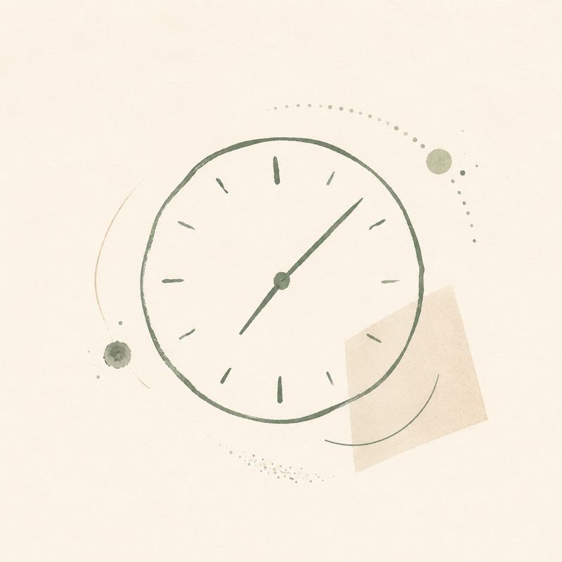
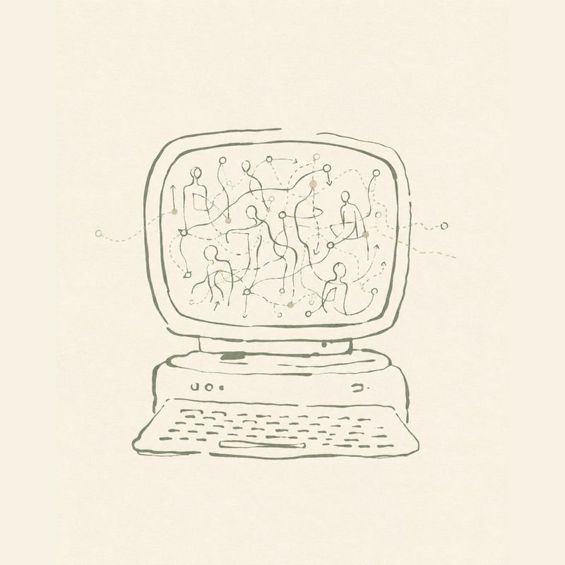

# Diário

> Notas diárias, progresso e coisas várias do trabalho de Carlos Trujillo em inferência causal bayesiana, marketing mix modeling, descoberta causal e mais.

Source: https://cetagostini.github.io/pt/diary.html

apenas pensamentos aleatórios, coisas em que estou a trabalhar, coisas que acho interessante. sem estrutura, sem plano. por vezes sobre bayesiano, por vezes sobre o site, por vezes sobre o que calhar.

### <a href="./diary/2026-08-09.html" class="no-external">a faturação por hora morreu, viva o modelo híbrido</a>

freelancing ai business data science consultance 

A hora foi sempre um proxy do valor. A IA apenas fez o proxy colapsar.

<a href="./diary/2026-08-09.html" class="no-external">9 de ago. de 2026 Carlos Trujillo</a> 

### <a href="./diary/2026-07-06.html" class="no-external">merlin vieira saar</a>

meta ai xiaomi 

Instalei o Hermes num antigo HP Pavilion. Dei ao meu bot o nome de merlin vieira saar. A voz do MiMo é incrível.

<a href="./diary/2026-07-06.html" class="no-external">6 de jul. de 2026 Carlos Trujillo</a> 

### <a href="./diary/2026-07-05.html" class="no-external">site novo, quem é</a>

meta site design 

Redesenhei o site todo. Verde, castanho, DAGs por todo o lado. Agora parece mesmo comigo.

<a href="./diary/2026-07-05.html" class="no-external">5 de jul. de 2026 Carlos Trujillo</a> Nenhum item correspondente
