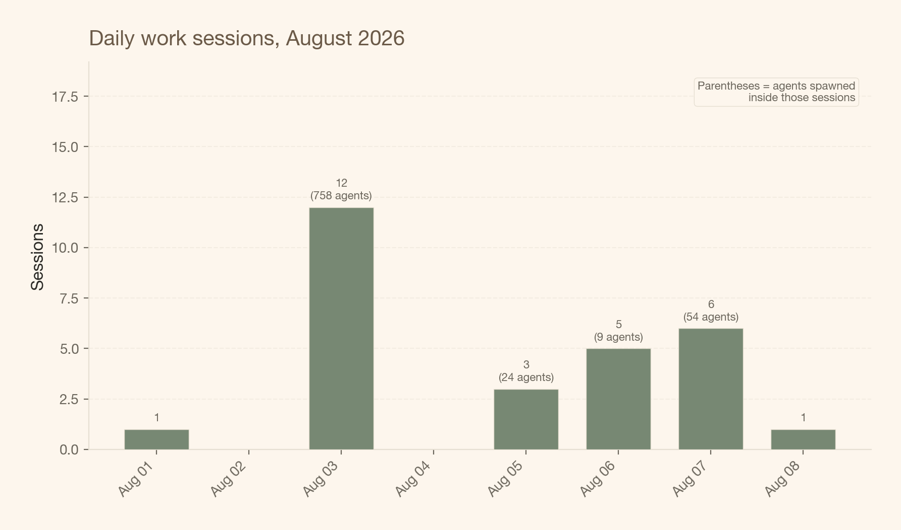
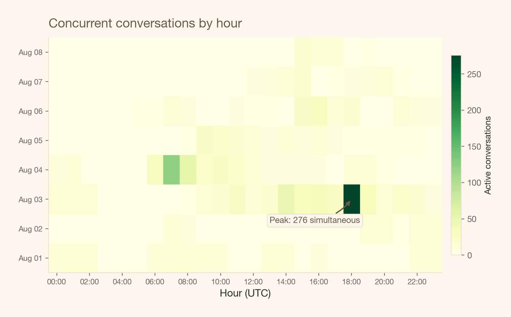
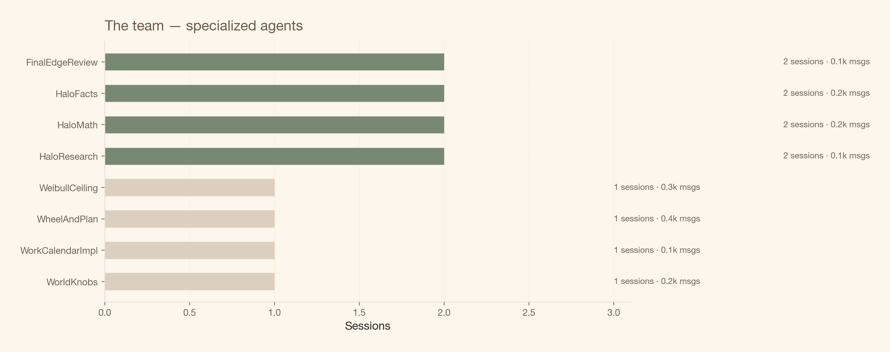
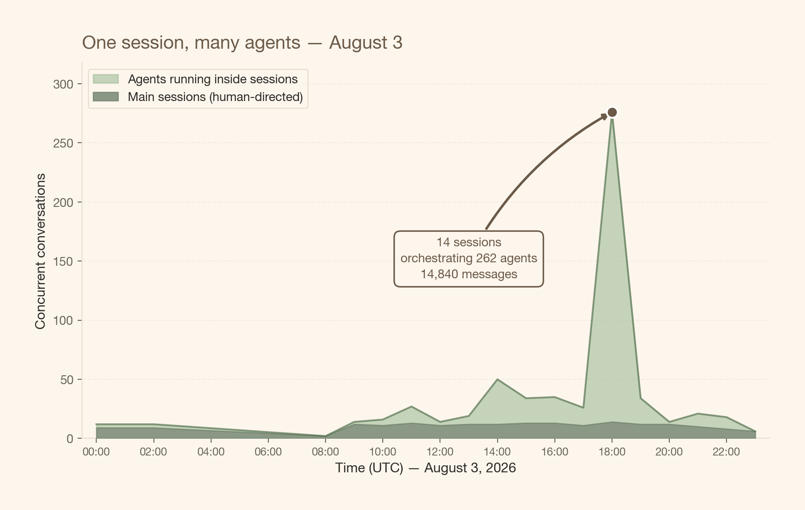

# a faturação por hora morreu, viva o modelo híbrido

> A hora foi sempre um proxy do valor. A IA apenas fez o proxy colapsar.

By Carlos Trujillo

Source: https://cetagostini.github.io/pt/diary/2026-08-09.html

O seu navegador não suporta o elemento de áudio.

tenho pensado nisto há algum tempo, e hoje finalmente cristalizou. estas são as minhas ideias — não um framework comprovado, apenas onde a minha cabeça está depois de projetos intensivos em IA nos últimos meses. genuinamente gostaria de ouvir o que outros freelancers e consultores de ciência de dados pensam.

a faturação por hora estava sempre partida. a hora nunca foi uma unidade real de trabalho — era um proxy. uma ficção conveniente com a qual ambas as partes concordavam fingir que tinha significado.

## a ficção era sempre frágil

pense no que “uma hora faturável” realmente significava, mesmo antes da IA. senta-se às 9h. tem uma reunião às 9:30. volta a mudar de contexto às 9:45. é interrompido pelo Slack às 10:02. quando volta ao fluxo, são 10:15. foi essa “uma hora” de trabalho? o cliente teve talvez 35 minutos de atenção real. mas foi faturado por 60.

este foi sempre o acordo. toda a gente sabia. a ficção funcionava porque a alternativa — rastrear minutos de atenção — era absurda. por isso, contentámo-nos com a hora como proxy aproximado e seguimos em frente.

o problema é que o proxy assumia um teto de fragmentação. uma pessoa, um foco, um cliente de cada vez. a hora era uma aproximação tolerável porque a variância era limitada. podia perder 20 minutos a mudar de contexto, mas não podia perder 20 horas.

A IA removeu esse teto.

## como é realmente o meu agosto

eis como 12 sessões de trabalho principais pareciam a 3 de agosto. cada sessão é uma conversa única que estou a direcionar — mas por trás de cada uma, dezenas de agentes AI especializados correm em paralelo. revisores, caçadores de bugs, implementadores, escritores de testes. eu orquestro; eles executam.

<figure class="quarto-float quarto-float-fig figure">

<figcaption>Figura 1: Sessões de trabalho diárias, agosto de 2026. Cada barra é uma sessão direcionada por humanos. O número entre parênteses é a contagem de agentes lançados dentro dessas sessões.</figcaption>
</figure>

num dia tranquilo, 1 sessão. num dia agitado, 12. e cada uma está a gerir uma pequena empresa lá dentro.

## como é a concorrência por hora

o mapa de calor abaixo mostra quantas conversas estavam ativas em cada hora de cada dia. a intensidade da cor indica quanta trabalho paralelo estava a acontecer — sessões mais todos os agentes a correr dentro delas.

<figure class="quarto-float quarto-float-fig figure">

<figcaption>Figura 2: Concorrência de sessões por hora. Cada célula é uma hora; a cor mapeia o total de conversas ativas (sessões e os seus agentes combinados).</figcaption>
</figure>

veja 3 de agosto, 18:00 UTC — é ali que a cor fica mais escura. vamos voltar a essa hora.

## o abismo que mata a hora

este é o gráfico que interessa. a linha bege são as horas de relógio — as horas que passei efetivamente secretário. a linha verde são as horas de trabalho LLM: a soma de todas as horas de agente ao longo do dia. se 3 agentes correm durante 1 hora cada, são 3 horas LLM, embora tenham sido apenas 1 hora de relógio.

<figure class="quarto-float quarto-float-fig figure">

<figcaption>Figura 3: Horas de relógio vs horas de trabalho LLM. O intervalo entre as duas linhas é o multiplicador — quanto mais trabalho acontece do que o relógio sugere.</figcaption>
</figure>

movem-se de forma diferente. as horas de relógio oscilam entre 6 e 19 — esse é o teto de um dia humano. as horas de trabalho LLM vão de 44 a 642. em 3 de agosto, 19 horas de relógio produziram 642 horas LLM. um multiplicador de 34×.

e aqui está a questão: quando era uma pessoa a fazer uma coisa, o proxy era *suficientemente bom*. agora o abismo entre a sua hora de atenção e o valor entregue é tão vasto que não apenas falha — ativamente induz em erro.

## a desvantagem competitiva

e é isto que me preocupa. se ainda estou a faturar à hora, não estou apenas a usar um modelo desatualizado — penso que me estou a colocar numa desvantagem estrutural.

eis a razão: o seu concorrente que adotou a precificação baseada em resultados consegue entregar 34× o trabalho no mesmo tempo de relógio, e cobrar com base no valor desse trabalho. está a faturar pelas suas horas de atenção. eles estão a faturar pelo output. o cliente não se importa com quantas horas passou — importa-se com o que chegou.

e quanto mais tempo continuar a faturar à hora, mais valor deixa na mesa — ou pior, mais está a cobrar a mais por trabalho que exigiu uma fração da atenção que está a faturar.

## a equipa por trás das sessões

estes não são chatbots genéricos. cada agente tem uma função específica — da mesma forma que uma firma de consultoria tem analistas, revisores e líderes de projeto.

<figure class="quarto-float quarto-float-fig figure">

<figcaption>Figura 4: Funções de agentes especializados. Cada barra é uma função distinta do workflow — a mesma estrutura de uma equipa humana.</figcaption>
</figure>

revisores adversariais submetem o código a stress tests. revisores de bugs caçam erros lógicos. testadores de casos extremo exploram condições de fronteira. implementadores escrevem o código real. revisores de testes validam a suíte de testes. e eu sentado no meio, a orquestrar tudo.

## o momento de pico

3 de agosto às 18:00 UTC merece o seu próprio gráfico.

<figure class="quarto-float quarto-float-fig figure">

<figcaption>Figura 5: Cronograma horário de 3 de agosto. Verde: sessões principais (direcionadas por humanos). Verde claro: agentes a correr dentro dessas sessões. Às 18:00 UTC, 14 sessões estavam a orquestrar 262 agentes, a produzir quase 15.000 mensagens numa única hora.</figcaption>
</figure>

14 sessões. 262 agentes. quase 15.000 mensagens. um ser humano. tente faturar isso à hora.

## o que estou a tentar: o modelo híbrido

então o que é que realmente funciona? ainda não tenho a certeza, mas aqui está com o que tenho estado a experimentar:

**taxa base fixa** — cobre o trabalho, os custos de ferramentas AI e uma margem razoável. igual para todos os clientes, independentemente do seu tamanho. justo é justo.

**bónus proporcional** — digamos 10% do aumento medido, pago apenas após uma janela de medição definida (tipicamente 3 meses). é aqui que o alinhamento de valor acontece.

a beleza está em como resolve as tensões fundamentais:

- a base é justa — o mesmo trabalho, o mesmo chão, sem jogos de negociação
- o bónus escala com o impacto, não com a conta bancária do cliente
- o período de medição faz a ponte entre a entrega e a prova

a chave é concordar sobre métricas e linhas de base *antes* de o projeto começar. ambos os lados sabem exatamente o que aciona o bónus. sem ambiguidade, sem “depois logo vemos”.

## não é precificação pura baseada em resultados

isto é importante para mim. a precificação pura baseada em resultados parece arriscada para todos — está a apostar toda a sua compensação em variáveis que não controla totalmente. o que estou a descrever é **precificação fixa informada por resultados**. tem estabilidade da base, e alinhamento do bónus.

Penso que é aqui que os profissionais ponderados estão a chegar. pelo menos os com quem falei. não porque seja tendencial, mas porque parece funcionar para ambos os lados.

a hora era sempre um proxy. A IA não a partiu — apenas tornou o abismo entre o proxy e a realidade demasiado vasto para ignorar.

------------------------------------------------------------------------

*estas são as minhas ideias pessoais baseadas na minha própria experiência. não estou a afirmar que esta é a resposta certa — apenas onde cheguei depois de projetos intensivos em IA nos últimos meses. se é um freelancer ou consultor a lidar com as mesmas questões, genuinamente gostaria de ouvir como está a pensar nisto. o que está a resultar para si? o que me está a escapar?*
